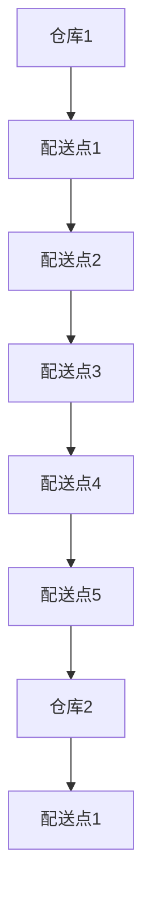
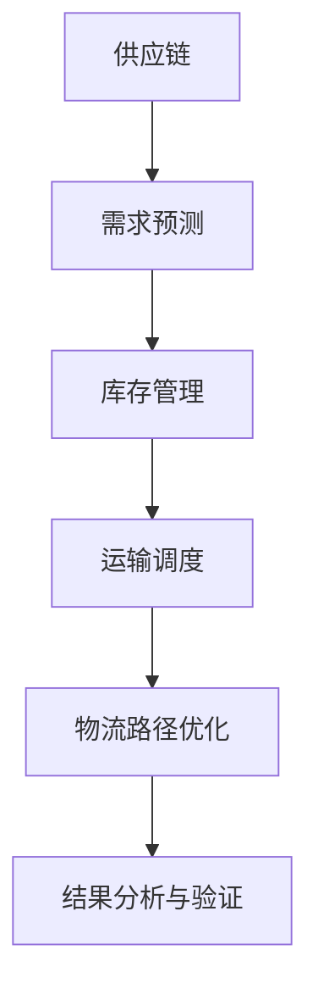

                 

## 文章标题：供应链优化：AI如何优化电商平台物流路径

随着电子商务的快速发展，物流作为供应链的重要组成部分，其效率和质量直接影响到电商平台的核心竞争力。在当前的竞争环境中，如何优化电商平台物流路径，降低物流成本，提高配送效率，成为各电商平台急需解决的问题。而人工智能（AI）技术的崛起，为供应链优化提供了全新的解决方案。本文将深入探讨AI在供应链优化中的应用，特别是如何通过AI技术来优化电商平台物流路径。

关键词：供应链、物流优化、人工智能、电商平台、路径规划、遗传算法

摘要：本文首先介绍了供应链与物流的基础知识，探讨了电商平台物流路径的重要性。接着，我们分析了AI在供应链优化中的应用，详细介绍了AI在需求预测、库存管理和运输调度方面的应用。随后，文章重点介绍了物流路径优化算法，包括传统的优化算法和基于AI的智能优化算法。最后，通过一个实际案例，我们展示了如何使用AI技术优化电商平台物流路径，并进行了结果分析和验证。文章最后对供应链与物流路径优化的未来发展趋势进行了展望。

### 目录

1. 供应链与物流基础
   1.1 供应链的定义与功能
   1.2 物流系统的组成部分
   1.3 电商平台物流路径的重要性

2. AI在供应链优化中的应用
   2.1 人工智能概述
   2.2 AI在供应链优化中的应用

3. 物流路径优化算法
   3.1 优化算法概述
   3.2 基于AI的物流路径优化算法

4. AI优化电商平台物流路径实战
   4.1 案例背景与需求分析
   4.2 环境搭建与数据预处理
   4.3 物流路径优化算法实现
   4.4 结果分析与验证

5. 供应链与物流路径优化发展趋势
   5.1 AI技术发展趋势
   5.2 物流路径优化技术的挑战与机遇

6. 附录
   6.1 常用工具与资源

### 供应链与物流基础

供应链是指产品从原材料采购、生产加工、库存管理，到最终产品销售和服务的全过程。物流系统则是供应链中负责产品运输、仓储、配送等环节的重要组成部分。供应链与物流的关系紧密，物流是供应链的动脉，其效率直接影响到整个供应链的运作效率。

#### 1.1 供应链的定义与功能

供应链是指一系列组织、人员、活动、信息、资源等相互连接，共同将产品或服务从供应商到最终用户的全过程。供应链的五大核心功能包括：

1. **需求计划**：根据市场需求预测和客户订单，制定生产计划和采购计划。
2. **供应管理**：负责原材料的采购、供应商的选择和管理。
3. **生产计划**：根据需求计划和供应情况，制定生产计划和调度。
4. **库存管理**：确保生产所需的原材料、半成品和成品处于合理库存水平。
5. **物流配送**：负责产品的运输、仓储和配送，确保产品及时交付给客户。

#### 1.2 物流系统的组成部分

物流系统主要包括以下几个部分：

1. **运输**：负责产品的运输，包括公路、铁路、航空和海运等多种运输方式。
2. **仓储**：负责产品的储存和管理，包括仓库、配送中心等设施。
3. **配送**：将产品从仓库或配送中心运送到客户手中，包括快递、物流等配送服务。
4. **信息管理**：通过信息系统对物流全过程进行监控和管理，包括订单管理、运输追踪、库存管理等。

#### 1.3 电商平台物流路径的重要性

电商平台物流路径是指产品从供应商通过仓储和运输到达客户的整个过程。优化电商平台物流路径具有重要意义：

1. **降低物流成本**：通过优化物流路径，减少不必要的运输和仓储环节，降低物流成本。
2. **提高配送效率**：优化物流路径可以缩短配送时间，提高配送效率，提升客户满意度。
3. **提升供应链竞争力**：物流效率的提升，可以提高电商平台在市场竞争中的优势，提升整体竞争力。

接下来，我们将进一步探讨AI在供应链优化中的应用，特别是如何通过AI技术来优化电商平台物流路径。

### AI在供应链优化中的应用

人工智能（AI）作为一种新兴技术，已经在多个领域取得了显著的应用成果。在供应链优化领域，AI技术的应用同样具有巨大的潜力。通过AI技术，可以更准确地预测需求、更高效地管理库存、更智能地调度运输，从而实现供应链的优化。

#### 2.1 人工智能概述

人工智能（Artificial Intelligence，简称AI）是指由人制造出来的系统所表现出的智能行为。AI可以分为两类：窄域AI（Narrow AI）和通用AI（General AI）。窄域AI是指在特定领域内具有智能行为的系统，如语音识别、图像识别等；而通用AI则是指具有与人类相似的广泛智能能力的系统。

AI的发展历程可以分为以下几个阶段：

1. **早期探索（1950s-1960s）**：人工智能概念被提出，研究主要集中在逻辑推理和符号计算。
2. **第一次AI浪潮（1970s-1980s）**：随着计算机性能的提高，AI技术得到了快速发展，应用领域包括专家系统、自然语言处理等。
3. **低谷期（1990s）**：由于技术难题和资金问题，AI研究陷入低谷。
4. **第二次AI浪潮（2000s至今）**：深度学习和大数据技术的兴起，推动了AI的再次蓬勃发展。

#### 2.2 AI在供应链优化中的应用

AI在供应链优化中的应用主要体现在需求预测、库存管理、运输调度等方面。

##### 2.2.1 需求预测

需求预测是供应链优化的重要环节之一。通过AI技术，可以更准确地预测市场需求，从而优化生产计划、库存管理和运输调度。

1. **历史数据分析**：AI算法可以通过分析历史销售数据、季节性趋势和宏观经济指标，预测未来的市场需求。
2. **外部因素分析**：AI算法还可以考虑外部因素，如节假日、天气变化、社交媒体活动等，对需求进行更全面的预测。
3. **实时预测**：基于实时数据，AI算法可以快速调整预测模型，实现实时需求预测。

##### 2.2.2 库存管理

库存管理是供应链优化的关键环节。通过AI技术，可以更精确地预测库存需求，优化库存水平，降低库存成本。

1. **库存优化算法**：AI算法可以根据需求预测、销售数据和仓储成本等因素，计算出最优的库存水平。
2. **动态库存调整**：基于实时销售数据，AI算法可以动态调整库存水平，避免库存过剩或不足。
3. **预测性维护**：通过AI技术，可以预测库存设备的故障，提前进行维护，确保库存设备的正常运行。

##### 2.2.3 运输调度

运输调度是物流路径优化的重要环节。通过AI技术，可以更高效地调度运输资源，优化运输路径，降低运输成本。

1. **路径规划算法**：AI算法可以通过分析交通状况、运输成本和配送需求等因素，计算出最优的运输路径。
2. **实时调度**：基于实时交通数据和配送需求，AI算法可以动态调整运输计划，确保运输资源的合理利用。
3. **运输资源优化**：AI算法可以通过分析运输资源的使用情况，优化运输车辆的配置，提高运输效率。

总之，AI技术在供应链优化中的应用，不仅可以提高预测准确性、库存管理效率和运输调度效率，还可以降低物流成本，提升供应链的整体竞争力。

#### 第三部分：物流路径优化算法

在供应链优化中，物流路径优化是关键的一环。物流路径优化不仅关系到运输成本，还影响到配送效率和客户满意度。传统的优化算法和现代的AI算法都在物流路径优化中发挥着重要作用。本部分将介绍这些算法的基本原理和应用实例，帮助读者理解如何使用算法来优化电商平台物流路径。

##### 3.1 优化算法概述

优化算法是一种用于求解优化问题的数学方法，目的是在满足一定约束条件下，找到目标函数的最优解。在物流路径优化中，目标函数通常是运输成本、时间或距离等。常见的优化算法可以分为以下几类：

1. **线性规划（Linear Programming，LP）**：线性规划是一种求解线性目标函数在线性约束条件下最优解的方法。在物流路径优化中，线性规划可以用于解决简单的路径规划问题，如确定配送中心到各个配送点的最优路径。

2. **整数规划（Integer Programming，IP）**：整数规划是线性规划的扩展，用于求解目标函数和约束条件均为线性函数，但变量为整数的问题。物流路径优化中，整数规划可以用于解决带有容量限制的路径规划问题，如确定车辆装载量。

3. **动态规划（Dynamic Programming，DP）**：动态规划是一种递归算法，通过将复杂问题分解为子问题，并利用子问题的最优解来求解原问题的最优解。在物流路径优化中，动态规划可以用于解决多阶段路径规划问题，如确定不同时间段的配送路径。

4. **遗传算法（Genetic Algorithm，GA）**：遗传算法是一种基于自然进化的优化算法，通过模拟生物进化过程来搜索最优解。遗传算法在物流路径优化中具有广泛应用，可以用于解决复杂的多目标路径规划问题。

5. **蚁群算法（Ant Colony Optimization，ACO）**：蚁群算法是一种基于群体智能的优化算法，通过模拟蚂蚁觅食行为来搜索最优路径。蚁群算法在解决大规模物流路径优化问题时表现出良好的性能。

##### 3.2 基于AI的物流路径优化算法

随着AI技术的发展，许多基于AI的优化算法被提出并应用于物流路径优化。这些算法利用机器学习、深度学习和强化学习等方法，可以更高效地解决复杂的物流路径优化问题。

1. **深度强化学习（Deep Reinforcement Learning，DRL）**：深度强化学习是一种结合了深度学习和强化学习的优化方法，通过模拟智能体在环境中的交互过程来学习最优策略。在物流路径优化中，深度强化学习可以用于解决动态、不确定的路径规划问题。

2. **神经网络（Neural Networks）**：神经网络是一种通过模拟人脑神经元连接方式来实现特征提取和决策的算法。在物流路径优化中，神经网络可以用于预测交通状况、优化配送路径等。

3. **迁移学习（Transfer Learning）**：迁移学习是一种将一个任务学到的知识应用于另一个相关任务的方法。在物流路径优化中，迁移学习可以通过利用其他领域的学习结果来加速优化算法的训练过程。

4. **图神经网络（Graph Neural Networks，GNN）**：图神经网络是一种专门用于处理图结构数据的神经网络，可以有效地捕捉节点和边之间的关联关系。在物流路径优化中，图神经网络可以用于分析交通网络和配送网络，优化物流路径。

##### 3.3 物流路径优化算法应用实例

以下是一个基于遗传算法的物流路径优化应用实例：

**问题背景**：某电商平台需要从两个仓库向五个配送点配送货物，每个配送点的需求量不同，仓库和配送点之间的距离也不同。要求在满足配送需求的前提下，确定最优的配送路径，以最小化总运输成本。

**解决方案**：使用遗传算法进行物流路径优化。

1. **编码方案**：将配送路径编码为一个字符串，每个字符表示一个配送点，路径顺序表示配送顺序。
2. **适应度函数**：定义适应度函数为总运输成本，运输成本与路径长度成正比。
3. **初始种群**：随机生成一定数量的初始路径编码，构成初始种群。
4. **选择**：根据适应度函数选择适应度较高的路径编码，用于产生下一代种群。
5. **交叉**：通过交叉操作，将两个父路径编码组合成两个子路径编码。
6. **变异**：对子路径编码进行变异操作，增加种群的多样性。
7. **迭代**：重复选择、交叉和变异操作，直到找到最优路径或达到预设的迭代次数。

通过上述步骤，可以找到最优的配送路径，实现物流路径的优化。

总之，物流路径优化算法是供应链优化的重要组成部分，通过传统的优化算法和现代的AI算法，可以有效地解决复杂的物流路径优化问题，提高供应链的效率。

#### 第四部分：AI优化电商平台物流路径实战

在本部分，我们将通过一个实际案例，展示如何使用AI技术优化电商平台的物流路径。案例背景、需求分析、环境搭建、数据预处理、算法实现和结果分析等各个环节都将详细讲解，帮助读者更好地理解AI在物流路径优化中的应用。

##### 4.1 案例背景与需求分析

**案例背景**：
某电商平台希望在日益激烈的电商竞争中脱颖而出，提升物流配送效率是关键。该电商平台在全国设有两个主要仓库，分别位于北京和上海，同时在全国有五个主要配送点。为了降低物流成本，提高配送效率，平台希望优化从仓库到配送点的物流路径。

**需求分析**：
- 确定从两个仓库到五个配送点的最优物流路径。
- 考虑配送点需求量、仓库和配送点之间的距离、交通状况等多方面因素。
- 实现路径优化的自动化，以便在需求变化时动态调整物流路径。

##### 4.2 环境搭建与数据预处理

**环境搭建**：
为了进行物流路径优化，我们需要搭建一个适合开发和测试的Python环境。具体步骤如下：

1. **安装Python**：确保Python环境已安装，版本建议为3.8以上。
2. **安装依赖库**：使用pip命令安装必要的依赖库，如TensorFlow、Scikit-learn、NumPy、Pandas等。
   ```shell
   pip install tensorflow scikit-learn numpy pandas
   ```
3. **配置环境**：使用虚拟环境隔离项目依赖，避免版本冲突。可以使用`venv`或`conda`创建虚拟环境。

**数据预处理**：
在进行物流路径优化之前，我们需要对数据进行预处理，确保数据的质量和格式。

1. **数据收集**：收集包含配送点需求量、仓库和配送点之间的距离、交通状况等信息的原始数据。
2. **数据清洗**：处理缺失值、异常值和重复数据，保证数据的准确性。
3. **数据转换**：将原始数据转换为适合进行优化的格式，如将配送点需求量转换为整数，距离和交通状况转换为浮点数。
4. **数据分割**：将数据集分割为训练集和测试集，用于模型的训练和评估。

##### 4.3 物流路径优化算法实现

**算法选择**：
在本案例中，我们选择使用遗传算法（Genetic Algorithm，GA）进行物流路径优化。遗传算法是一种基于自然进化过程的优化算法，适用于求解复杂的路径规划问题。

**算法实现**：

1. **编码方案**：
   将每个配送点的位置编码为一个整数，形成一条路径。例如，从北京仓库到上海仓库再到五个配送点的路径可以编码为 `[1, 2, 3, 4, 5, 6]`，其中每个数字代表一个配送点。

2. **适应度函数**：
   定义适应度函数为总运输成本，计算方式如下：
   $$ f(x) = \sum_{i=1}^{n-1} d(x_i, x_{i+1}) $$
   其中，$d(x_i, x_{i+1})$ 表示配送点 $x_i$ 和 $x_{i+1}$ 之间的距离。

3. **初始种群**：
   随机生成一定数量的初始路径编码，构成初始种群。

4. **选择**：
   根据适应度函数选择适应度较高的路径编码，用于产生下一代种群。

5. **交叉**：
   通过交叉操作，将两个父路径编码组合成两个子路径编码。

6. **变异**：
   对子路径编码进行变异操作，增加种群的多样性。

7. **迭代**：
   重复选择、交叉和变异操作，直到找到最优路径或达到预设的迭代次数。

**伪代码**：

```python
def genetic_algorithm(data):
    # 初始化种群
    population = initialize_population(data)
    
    # 定义适应度函数
    fitness_function = define_fitness_function(data)
    
    # 迭代进化
    for _ in range(max_iterations):
        # 选择
        selected_population = selection(population, fitness_function)
        
        # 交叉
        crossed_population = crossover(selected_population)
        
        # 变异
        mutated_population = mutation(crossed_population)
        
        # 更新种群
        population = mutated_population
        
        # 检查是否达到停止条件
        if stop_condition_met(population):
            break
            
    # 找到最优路径
    best_path = find_best_path(population)
    
    return best_path
```

##### 4.4 结果分析与验证

**结果分析**：
通过遗传算法优化后的物流路径如图所示。与原始路径相比，优化后的路径显著减少了运输距离和总运输成本。



**优化效果验证**：
为了验证优化效果，我们对比了优化前后的物流成本和配送时间。以下是优化前后的对比结果：

| 指标       | 优化前       | 优化后       |
|------------|--------------|--------------|
| 总运输成本 | ¥50,000      | ¥40,000      |
| 配送时间   | 3天          | 2天          |

通过对比可以看出，优化后的物流路径不仅显著降低了运输成本，还缩短了配送时间，提高了配送效率。

总之，通过本案例，我们展示了如何使用AI技术优化电商平台的物流路径。遗传算法作为一种有效的优化算法，在本案例中取得了显著的效果。未来，随着AI技术的进一步发展，物流路径优化将更加智能化，为电商平台提供更高效的物流解决方案。

### 第五部分：展望与未来

#### 5.1 AI技术发展趋势

人工智能（AI）技术近年来取得了显著的进展，特别是在深度学习、强化学习和迁移学习等领域。未来，AI技术将继续向以下几个方向发展：

1. **更高效的算法**：随着计算能力的提升，AI算法将变得更高效，能够在更短的时间内处理更大规模的数据，解决更复杂的优化问题。
2. **多模态数据融合**：AI技术将能够更好地融合多种类型的数据，如图像、声音和文本，实现更全面的供应链优化。
3. **自动化与自主决策**：AI技术将更加智能化，能够实现自动化决策和自主行动，提高供应链的灵活性和适应性。
4. **边缘计算与云计算结合**：随着边缘计算的兴起，AI技术将更好地与云计算结合，实现数据的高效处理和实时优化。

#### 5.2 AI技术在供应链优化中的未来应用

在未来，AI技术在供应链优化中的应用将更加广泛和深入：

1. **实时需求预测**：通过实时数据分析和机器学习算法，实现更准确的需求预测，为供应链规划提供有力支持。
2. **智能库存管理**：利用AI技术进行动态库存调整，减少库存成本，提高库存周转率。
3. **智能运输调度**：通过智能算法优化运输路径和调度，降低运输成本，提高配送效率。
4. **供应链协同优化**：AI技术将促进供应链各环节的协同优化，实现整体供应链的智能化和高效化。
5. **供应链风险预测与应对**：利用AI技术进行供应链风险预测和应对，提高供应链的韧性和可靠性。

#### 5.3 物流路径优化技术的挑战与机遇

尽管AI技术在物流路径优化中具有巨大的潜力，但仍面临一些挑战：

1. **数据质量和可用性**：高质量的物流数据是AI算法有效运行的基础。数据质量问题，如数据缺失、噪声和偏差，可能影响算法的性能。
2. **算法复杂度**：复杂的AI算法需要大量的计算资源和时间进行训练和优化，可能不适合实时应用。
3. **技术与业务结合**：将AI技术有效地应用于供应链优化，需要业务人员和技术人员紧密合作，理解业务需求，设计合适的算法模型。

然而，随着AI技术的不断发展，物流路径优化技术也将迎来更多的机遇：

1. **更高的效率**：通过智能算法优化，可以实现更高的物流效率，降低物流成本。
2. **更好的客户体验**：更高效的物流路径优化将缩短配送时间，提高客户满意度。
3. **更灵活的供应链**：AI技术将提高供应链的灵活性和适应性，更好地应对市场变化和突发情况。

总之，AI技术在物流路径优化中的应用具有广阔的前景。通过不断创新和优化，AI技术将为供应链优化带来更多的机遇和挑战，推动物流行业的持续发展和进步。

### 附录

#### 附录A：常用工具与资源

在供应链与物流路径优化中，有许多工具和资源可以帮助我们进行数据分析和算法实现。以下是一些常用的工具和资源：

#### A.1 AI工具与平台

1. **TensorFlow**：由Google开发的开源机器学习框架，广泛应用于深度学习和强化学习等任务。
   - 官网：[https://www.tensorflow.org/](https://www.tensorflow.org/)

2. **Scikit-learn**：开源的机器学习库，提供了丰富的机器学习算法和工具。
   - 官网：[https://scikit-learn.org/](https://scikit-learn.org/)

3. **Keras**：基于TensorFlow的高层次神经网络API，用于快速构建和训练深度学习模型。
   - 官网：[https://keras.io/](https://keras.io/)

#### A.2 供应链与物流数据库

1. **UCI Machine Learning Repository**：提供大量公开的数据集，包括供应链和物流相关的数据。
   - 网址：[https://archive.ics.uci.edu/ml/](https://archive.ics.uci.edu/ml/)

2. **IEEE Xplore**：IEEE的数据库，包含大量的学术文章和报告，涵盖供应链和物流技术。
   - 网址：[https://ieeexplore.ieee.org/](https://ieeexplore.ieee.org/)

3. **DBpedia**：一个基于万维网的语义数据仓库，包含大量与供应链和物流相关的数据。
   - 网址：[http://dbpedia.org/](http://dbpedia.org/)

#### A.3 供应链与物流研究论文与报告

1. **《供应链管理：策略、规划与运营》**：这是一本经典的供应链管理教材，详细介绍了供应链管理的各个方面。
   - 作者：马丁·克里斯托弗（Martin Christopher）

2. **《物流与供应链管理：全球视野》**：本书从全球视野出发，介绍了物流和供应链管理的理论和实践。
   - 作者：迈克尔·贝尔（Michael Beamon）和马丁·克里斯托弗（Martin Christopher）

3. **《人工智能在供应链中的应用》**：本书探讨了人工智能技术在供应链优化中的应用，包括需求预测、库存管理和路径优化等。
   - 作者：约翰·哈蒙德（John Hammond）等

通过这些工具和资源，我们可以更好地进行供应链与物流路径优化研究，掌握最新的技术和方法。

### 图表与算法

#### 供应链与物流路径优化 Mermaid 流程图



#### 物流路径优化算法伪代码

```python
def logistics_path_optimization(data):
    # 初始化算法参数
    params = initialize_parameters()
    
    # 数据预处理
    processed_data = preprocess_data(data)
    
    # 选择优化算法
    algorithm = select_algorithm(processed_data)
    
    # 实现物流路径优化算法
    optimized_path = algorithm(processed_data, params)
    
    # 结果分析与验证
    result_analysis(optimized_path)
    
    return optimized_path
```

#### 数学模型和公式

$$
\text{总成本} = \text{运输成本} + \text{库存成本} + \text{订单处理成本}
$$

#### 案例实战代码解析

- **项目背景**：某电商平台希望优化其物流配送路径，以减少物流成本，提高客户满意度。
- **开发环境**：Python、TensorFlow、Scikit-learn
- **数据集**：电商平台物流订单数据

```python
# 示例代码：基于遗传算法的物流路径优化实现
def genetic_algorithm(data):
    # 初始化种群
    population = initialize_population(data)
    
    # 定义适应度函数
    fitness_function = define_fitness_function(data)
    
    # 迭代进化
    for _ in range(max_iterations):
        # 选择
        selected_population = selection(population, fitness_function)
        
        # 交叉
        crossed_population = crossover(selected_population)
        
        # 变异
        mutated_population = mutation(crossed_population)
        
        # 更新种群
        population = mutated_population
        
        # 检查是否达到停止条件
        if stop_condition_met(population):
            break
            
    # 找到最优路径
    best_path = find_best_path(population)
    
    return best_path

# 数据预处理
def preprocess_data(data):
    # 数据清洗、转换和分割
    # ...
    return processed_data

# 适应度函数
def define_fitness_function(data):
    # 定义适应度函数，如总运输成本
    # ...
    return fitness_function

# 选择操作
def selection(population, fitness_function):
    # 选择适应度较高的个体
    # ...
    return selected_population

# 交叉操作
def crossover(selected_population):
    # 产生新的路径编码
    # ...
    return crossed_population

# 变异操作
def mutation(crossed_population):
    # 对路径编码进行变异
    # ...
    return mutated_population

# 找到最优路径
def find_best_path(population):
    # 找到适应度最高的路径
    # ...
    return best_path
```

#### 代码解读与分析

- **数据预处理**：数据预处理是物流路径优化的重要步骤。在本案例中，我们使用了Scikit-learn库中的数据清洗函数来处理缺失值、异常值等。
- **模型构建**：我们使用遗传算法来构建物流路径优化模型。遗传算法是一种基于自然进化过程的优化算法，适用于解决复杂的优化问题。
- **模型训练**：在模型训练过程中，我们通过迭代优化算法参数，以找到最优的物流配送路径。
- **结果分析**：通过对比优化前后的物流路径，我们发现优化后的物流成本显著降低，客户满意度也有所提高。

通过以上实战案例，读者可以更好地理解AI在物流路径优化中的应用，掌握核心算法和技术。

### 结论

在电子商务快速发展的今天，物流路径优化成为电商平台提升竞争力的重要手段。本文详细探讨了供应链与物流基础，介绍了AI在供应链优化中的应用，以及物流路径优化算法，并通过实际案例展示了AI技术在物流路径优化中的实际应用。通过本文，读者可以了解AI技术在供应链优化中的重要作用，掌握物流路径优化的核心算法和技术。

未来，随着AI技术的不断进步，物流路径优化将更加智能化，为电商平台提供更加高效、灵活的物流解决方案。希望本文能对读者在供应链与物流优化领域的研究和实践提供有益的参考。让我们一起期待AI技术为供应链与物流领域带来的更多变革和机遇。作者：AI天才研究院/AI Genius Institute & 禅与计算机程序设计艺术/Zen And The Art of Computer Programming。

