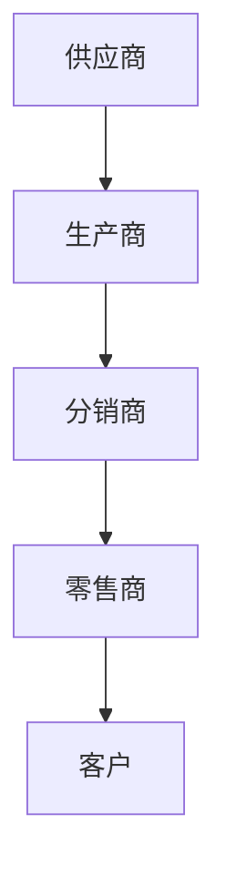

                 

### 文章标题：供应链优化：AI如何提高电商物流效率

### 关键词：
- 供应链优化
- AI技术
- 物流效率
- 电商物流
- 风险控制

### 摘要：
本文深入探讨了AI技术在供应链优化中的应用，特别是在提高电商物流效率方面的具体作用。通过分析供应链的基本概念、物流管理的核心环节以及AI技术的基本原理，文章展示了AI在供应链计划、库存管理、运输管理和风险控制中的具体应用。同时，通过实际案例解析，本文为电商物流效率的提升提供了可行的策略和方向。未来展望部分则对供应链与物流领域的发展趋势和潜在挑战进行了探讨。

---

## 引言

在当今全球化的商业环境中，供应链的效率直接关系到企业的竞争力与盈利能力。尤其是电商物流，作为供应链的末端环节，其效率的提升对客户体验和市场响应速度至关重要。然而，供应链优化并非易事，涉及多个环节的协调与优化，需要应对复杂的市场波动和不确定性。传统的方法往往依赖于经验和直觉，难以实现精细化管理。随着人工智能（AI）技术的快速发展，AI开始成为供应链优化的重要工具，通过大数据分析、机器学习等手段，为企业提供了更加智能化和高效的解决方案。

本文旨在系统地探讨AI技术在供应链优化中的应用，特别是如何提高电商物流的效率。文章首先介绍了供应链和物流管理的基本概念，然后详细分析了AI技术在供应链计划、库存管理、运输管理和风险控制中的具体应用。通过实际案例的解析，文章进一步展示了AI技术在实际操作中的效果和优势。最后，文章对供应链与物流领域的未来发展趋势和潜在挑战进行了展望，提出了相应的策略和建议。

本文的结构如下：

- 第一部分：供应链优化基础，包括供应链概述与优化目标，以及物流管理的基本原理和策略。
- 第二部分：AI在供应链优化中的应用，分别介绍AI技术概述、AI优化供应链计划、库存管理、运输管理和风险控制。
- 第三部分：电商物流效率提升实践，分析电商物流的发展现状、策略以及AI技术的实际应用案例。
- 第四部分：未来展望与挑战，探讨供应链优化与AI技术的发展趋势，以及电商物流效率提升面临的挑战与机遇。

通过这篇文章，我们希望能够为读者提供一个全面而深入的视角，了解AI技术在供应链优化中的应用，以及其在电商物流效率提升方面的巨大潜力。

## 第一部分：供应链优化基础

### 第1章：供应链概述与优化目标

#### 1.1 供应链的定义与关键环节

供应链是指从原材料采购、生产制造、产品分销到最终消费的整个过程中所涉及的所有活动和资源。它包括供应商、生产商、分销商、零售商和最终客户等多个环节。每个环节都扮演着至关重要的角色，共同构成一个完整的供应链网络。

**Mermaid 流程图：**

**供应链的关键环节：**
1. **采购与供应**：这是供应链的起点，涉及原材料的采购和供应，直接影响到生产效率和成本控制。
2. **生产与制造**：生产制造环节将原材料转化为成品，其效率和质量对供应链的整体表现有直接影响。
3. **库存管理**：库存管理是供应链中的关键环节之一，需要平衡库存水平和需求，避免库存过剩或短缺。
4. **物流与配送**：物流与配送环节涉及产品的运输和配送，直接影响到客户满意度和服务质量。
5. **售后服务**：售后服务是供应链的末端环节，包括产品退货、维修和客户支持等，对品牌形象和客户忠诚度有重要影响。

#### 1.2 供应链优化的意义与挑战

**供应链优化的意义：**
1. **提高效率**：通过优化供应链，可以减少各环节的时间和资源浪费，提高整体运营效率。
2. **降低成本**：优化供应链有助于降低采购、库存、生产和物流等环节的成本，从而提高企业的盈利能力。
3. **增强竞争力**：高效的供应链可以提高企业的响应速度和市场适应性，增强在竞争中的优势。
4. **提升客户满意度**：优化的供应链可以确保产品及时交付，提高客户满意度，增加客户忠诚度。

**供应链优化的挑战：**
1. **复杂性**：供应链涉及多个环节和参与者，其复杂性增加了优化的难度。
2. **信息不对称**：供应链各环节之间的信息传递不畅，可能导致决策失误和资源浪费。
3. **市场波动**：市场需求和供应的波动给供应链管理带来挑战，需要灵活应对。
4. **供应链中断**：供应链中的任何一个环节出现中断，都可能对整体供应链造成严重影响。

#### 1.3 供应链优化的主要目标

**供应链优化的主要目标包括：**
1. **提高供应链的响应速度**：通过优化信息流和物流，缩短供应链各环节的反应时间，提高市场适应性。
2. **提高供应链的灵活性**：通过灵活的供应链设计和管理，快速响应市场需求变化，提高应对不确定性的能力。
3. **提高供应链的可靠性**：通过提高各环节的稳定性和协调性，减少供应链中断和风险。
4. **提高供应链的经济性**：通过优化资源配置和运营流程，降低整体成本，提高经济效益。

通过上述内容，我们可以看出，供应链优化不仅是提高企业效率和竞争力的关键手段，也是应对市场挑战和不确定性的重要策略。接下来，我们将进一步探讨物流管理在供应链优化中的核心作用。

---

## 第二部分：AI在供应链优化中的应用

### 第3章：AI技术概述

#### 3.1 AI的定义与分类

人工智能（AI）是指使计算机系统能够执行通常需要人类智能才能完成的任务的技术。AI可以分为多种类型，根据其应用和实现方式的不同，可以分为以下几类：

1. **基于规则的AI**：这类AI通过预定义的规则和逻辑进行决策，适用于简单、明确的任务，如自然语言处理和规则推理。

2. **基于模型的AI**：这类AI通过学习和建立模型来模拟人类思维过程，包括机器学习（ML）和深度学习（DL）。机器学习是一种从数据中自动学习和改进的方法，而深度学习则通过神经网络模拟人类大脑的工作方式。

3. **基于实例的AI**：这类AI通过存储和检索过去的解决方案来处理新问题，适用于基于经验的决策。

4. **混合型AI**：结合上述几种方法的AI系统，能够更好地处理复杂任务。

#### 3.2 机器学习与深度学习基础

**机器学习（ML）基础：**
- **基本概念**：机器学习是一种从数据中学习规律和模式，以进行预测或分类的方法。主要分为监督学习、无监督学习和强化学习。
- **监督学习**：通过已标记的数据进行训练，如分类和回归问题。常见算法包括线性回归、逻辑回归、支持向量机（SVM）和决策树。
- **无监督学习**：在未标记的数据上进行训练，如聚类和降维。常见算法包括K-均值聚类、主成分分析（PCA）和自编码器。

**深度学习（DL）基础：**
- **基本概念**：深度学习是一种基于多层神经网络的机器学习方法，通过逐层提取数据特征，实现复杂模式的识别。常见架构包括卷积神经网络（CNN）、循环神经网络（RNN）和变换器（Transformer）。
- **卷积神经网络（CNN）**：适用于图像处理，通过卷积层提取空间特征。
- **循环神经网络（RNN）**：适用于序列数据处理，通过循环结构保存长期依赖信息。
- **变换器（Transformer）**：基于自注意力机制，在自然语言处理等领域取得了显著成果。

#### 3.3 AI在供应链中的应用前景

AI在供应链中的应用前景广阔，主要表现在以下几个方面：

1. **供应链计划**：通过预测和优化，提高供应链的响应速度和灵活性，如需求预测、库存管理和生产计划。
2. **物流管理**：通过优化运输路线和配送计划，提高物流效率和降低成本，如路径优化、配送计划和运输调度。
3. **风险控制**：通过风险评估和预测，减少供应链中断和风险，如供应链中断预测、库存风险分析和供应链风险管理。
4. **智能仓储**：通过自动化和智能化技术，提高仓储效率和准确性，如货架优化、库存管理和自动化分拣。

总之，AI技术的引入为供应链优化带来了新的机遇和挑战，通过不断探索和应用，可以显著提高供应链的效率和竞争力。

### 第4章：AI优化供应链计划

#### 4.1 供应链计划的基本概念

供应链计划是供应链管理的重要组成部分，旨在确定如何在供应链各环节中分配资源，以实现整体最优效益。供应链计划包括需求预测、库存管理、生产计划和运输计划等多个环节。

**需求预测**：需求预测是供应链计划的基础，它通过分析历史数据、市场趋势和客户行为等因素，预测未来的需求量。准确的需求预测有助于减少库存过剩或短缺，提高供应链的灵活性。

**库存管理**：库存管理涉及库存水平的监控和管理，以确保在需求高峰期能够满足客户需求，同时避免库存过剩导致的资金占用和存储成本。

**生产计划**：生产计划是根据需求预测和库存水平，制定生产计划，包括生产量、生产时间和生产顺序等。合理的生产计划有助于提高生产效率和减少库存成本。

**运输计划**：运输计划涉及物流配送的安排，包括运输路线、运输工具和运输时间等。优化的运输计划可以提高物流效率，降低运输成本。

#### 4.2 供应链计划的优化方法

**线性规划（LP）**：线性规划是一种数学优化方法，通过建立线性目标函数和线性约束条件，求解最优解。在供应链计划中，线性规划可以用于优化生产计划、库存管理和运输计划。

**整数规划（IP）**：整数规划是线性规划的扩展，适用于包含整数变量的优化问题。在供应链计划中，整数规划可以用于优化库存水平和生产计划。

**动态规划（DP）**：动态规划是一种递归算法，适用于具有时间依赖性的优化问题。在供应链计划中，动态规划可以用于优化库存水平和运输计划。

**启发式算法**：启发式算法是一类基于经验或启发式的算法，能够快速找到近似最优解。常见的启发式算法包括遗传算法、模拟退火算法和蚁群算法等。

#### 4.3 AI在供应链计划中的应用

**机器学习模型**：机器学习模型可以用于需求预测、库存管理和生产计划等多个环节。例如，通过回归模型预测未来需求，通过聚类分析确定最优库存水平，通过时间序列模型优化生产计划。

**深度学习模型**：深度学习模型在处理复杂和非线性问题时具有优势。例如，通过卷积神经网络（CNN）分析市场趋势，通过循环神经网络（RNN）处理时间序列数据，通过变换器（Transformer）处理复杂的多变量数据。

**混合智能算法**：混合智能算法结合了机器学习和深度学习的优势，能够处理更复杂的优化问题。例如，通过遗传算法优化库存水平，通过神经网络优化生产计划，通过深度强化学习优化运输计划。

总之，AI技术在供应链计划中的应用为优化供应链提供了新的方法和工具，通过结合不同的算法和技术，可以显著提高供应链的效率和灵活性。

### 第5章：AI优化供应链库存管理

#### 5.1 库存管理的原理与方法

库存管理是供应链管理中的一个关键环节，涉及到库存水平的监控、控制和管理。其核心目标是确保库存水平既不过剩也不过少，以最大限度地降低库存成本和满足客户需求。

**库存管理的原理：**
- **需求预测**：通过对历史数据和市场趋势的分析，预测未来的需求量，以指导库存水平的决策。
- **需求分类**：将不同类型的产品按照其需求量和重要性进行分类，以便采取不同的库存策略。
- **库存水平监控**：实时监控库存水平，确保库存既不会短缺也不会过剩。

**库存管理的方法：**
- **周期性库存管理**：定期检查库存水平，根据需求预测和当前库存情况，进行库存补充或调整。
- **连续库存管理**：实时监控库存水平，根据需求的变化动态调整库存水平。
- **定量库存管理**：设定一个最低库存水平和最高库存水平，当库存低于最低水平时进行补充，当库存高于最高水平时进行减少。

#### 5.2 库存优化的AI算法

**机器学习算法**：机器学习算法在库存优化中具有广泛的应用。例如，使用回归模型预测未来需求，使用聚类算法对产品进行分类，使用时间序列模型预测库存水平。

**深度学习算法**：深度学习算法在处理复杂和非线性问题时具有优势。例如，通过卷积神经网络（CNN）分析市场趋势，通过循环神经网络（RNN）处理时间序列数据，通过变换器（Transformer）处理复杂的多变量数据。

**强化学习算法**：强化学习算法通过模拟智能体在环境中的行为，不断学习和优化策略，以实现长期目标。在库存管理中，可以通过强化学习优化库存补货策略，实现库存水平的最优化。

**混合智能算法**：混合智能算法结合了机器学习和深度学习的优势，能够处理更复杂的优化问题。例如，通过遗传算法优化库存水平，通过神经网络优化库存补货策略，通过深度强化学习优化库存管理。

#### 5.3 AI在库存管理中的应用案例

**案例1：电商平台的库存优化**
- **问题**：电商平台在面对大量产品种类和需求波动时，如何优化库存水平，减少库存成本和缺货风险？
- **解决方案**：使用机器学习算法对历史销售数据进行分析，预测未来需求，并根据需求预测结果调整库存水平。同时，使用聚类算法将产品分为不同类别，采取不同的库存策略。

**案例2：制造业的库存管理**
- **问题**：制造业在生产过程中如何优化原材料库存，确保生产顺利进行？
- **解决方案**：使用深度学习算法分析生产数据和市场趋势，预测未来原材料需求，并根据需求预测结果调整库存水平。同时，使用强化学习算法优化原材料补货策略，实现库存的最优化管理。

通过上述案例可以看出，AI技术在库存管理中的应用为提高库存效率和降低库存成本提供了有效的解决方案。未来，随着AI技术的不断发展，库存管理将变得更加智能化和精细化。

### 第6章：AI优化供应链运输管理

#### 6.1 运输管理的核心问题

运输管理是供应链管理中的重要环节，涉及到货物的运输、配送和物流网络的优化。其核心问题包括运输路线优化、运输工具选择、配送计划制定和运输成本控制等。

**运输路线优化**：运输路线优化是指通过合理的路线规划，最大限度地减少运输时间和运输成本。主要目标是在满足运输需求的同时，优化运输路线，提高运输效率。

**运输工具选择**：运输工具选择涉及选择适当的运输工具，如卡车、火车、船舶和飞机等，以适应不同类型的货物和运输需求。合理的选择可以提高运输效率和降低运输成本。

**配送计划制定**：配送计划制定是指根据客户需求和运输资源，制定合理的配送计划，确保货物按时送达。这涉及到配送路线规划、配送时间安排和配送资源分配等问题。

**运输成本控制**：运输成本控制是指通过优化运输流程和运输策略，降低运输成本。这包括运输路线优化、运输工具选择和配送计划制定等多个方面。

#### 6.2 运输优化的AI技术

**路径优化算法**：路径优化算法是运输管理中常用的算法，如遗传算法、蚁群算法和最小生成树算法等。这些算法可以通过优化运输路线，减少运输时间和成本。

**运输调度算法**：运输调度算法用于优化运输工具的调度和分配，以提高运输效率和降低成本。常见的算法包括基于优先级的调度算法和基于时间窗口的调度算法。

**配送规划算法**：配送规划算法用于优化配送计划，确保货物按时送达。常见的算法包括基于时间窗口的配送规划和基于需求的配送规划。

**机器学习与深度学习**：机器学习和深度学习技术可以用于运输管理的多个环节。例如，通过回归模型预测运输需求，通过聚类算法优化运输路线，通过时间序列模型优化配送计划。

#### 6.3 AI在运输管理中的应用实践

**案例1：智能物流平台**
- **问题**：如何优化物流平台的运输路线和配送计划，提高运输效率和服务质量？
- **解决方案**：使用路径优化算法和运输调度算法，优化运输路线和运输工具的调度。同时，使用机器学习模型预测运输需求，优化配送计划。

**案例2：电商物流**
- **问题**：如何优化电商物流的运输成本和配送效率？
- **解决方案**：使用路径优化算法和配送规划算法，优化运输路线和配送计划。同时，使用深度学习模型预测运输需求和客户需求，优化运输成本和配送效率。

通过这些实际案例可以看出，AI技术在运输管理中的应用为提高运输效率和降低成本提供了有效的解决方案。未来，随着AI技术的不断进步，运输管理将变得更加智能化和高效化。

### 第7章：AI优化供应链风险控制

#### 7.1 供应链风险的概念与类型

供应链风险是指在供应链的各个环节中，由于内部或外部因素导致供应链中断、成本增加、效率降低等问题的可能性。供应链风险可以分为以下几种类型：

1. **供应链中断风险**：由于自然灾害、政治动荡、供应链故障等原因导致的供应链中断，影响供应链的正常运行。

2. **供应链成本风险**：由于原材料价格波动、物流成本上升等原因导致的供应链成本增加，影响企业的盈利能力。

3. **供应链效率风险**：由于供应链管理不善、运输延误等原因导致的供应链效率降低，影响企业的市场竞争力。

4. **供应链信息风险**：由于信息传递不畅、数据泄露等原因导致的信息风险，影响供应链的决策和运行。

5. **供应链声誉风险**：由于供应链问题导致的品牌声誉受损，影响企业的市场形象和客户满意度。

#### 7.2 风险评估与管理的AI方法

**风险评估方法：**
1. **定性风险评估**：通过专家评估、历史数据分析和情景分析等方法，对供应链风险进行定性评估。

2. **定量风险评估**：通过统计分析、模拟分析和决策树等方法，对供应链风险进行定量评估。

**风险管理方法：**
1. **预防性风险管理**：通过制定应急预案、建立风险储备和优化供应链设计等方法，预防供应链风险的发生。

2. **应对性风险管理**：通过制定风险应对策略、调整供应链计划和优化供应链资源配置等方法，应对供应链风险的发生。

3. **恢复性风险管理**：通过恢复供应链运营、修复供应链中断和重建供应链网络等方法，恢复供应链的正常运行。

**AI在风险评估与管理中的应用：**
1. **机器学习模型**：通过建立机器学习模型，对历史数据和实时数据进行分析，预测供应链风险的发生概率和影响程度。

2. **深度学习模型**：通过深度学习模型，对复杂的供应链风险进行识别和预测，提供更加精准的风险评估结果。

3. **强化学习模型**：通过强化学习模型，优化供应链风险应对策略，提高供应链的适应性和灵活性。

4. **混合智能算法**：结合机器学习、深度学习和强化学习等方法，构建综合性的供应链风险管理模型，提供更加全面和有效的风险控制方案。

#### 7.3 AI在供应链风险控制中的应用

**案例1：自然灾害应对**
- **问题**：如何应对自然灾害导致的供应链中断风险？
- **解决方案**：使用AI技术，对自然灾害发生的时间和地点进行预测，提前调整供应链计划和库存水平，减少自然灾害对供应链的影响。

**案例2：供应链成本控制**
- **问题**：如何降低供应链成本风险？
- **解决方案**：使用AI技术，对原材料价格和市场趋势进行分析，优化采购策略和库存管理，降低供应链成本。

**案例3：供应链效率优化**
- **问题**：如何提高供应链效率，降低效率风险？
- **解决方案**：使用AI技术，对供应链各环节的运行情况进行实时监控和分析，优化供应链设计和资源配置，提高供应链效率。

通过这些实际案例可以看出，AI技术在供应链风险控制中的应用为提高供应链的稳定性和可靠性提供了有效的手段。未来，随着AI技术的不断发展，供应链风险控制将变得更加智能化和高效化。

### 第8章：电商物流效率提升策略

#### 8.1 电商物流的发展现状与趋势

随着互联网和电子商务的迅速发展，电商物流已经成为现代物流业的重要组成部分。近年来，电商物流呈现出以下发展趋势：

1. **物流网络化**：电商企业通过构建覆盖广泛、高效便捷的物流网络，实现全国乃至全球的配送服务。

2. **智能化**：AI、物联网、大数据等新技术在电商物流中的应用，使得物流过程更加智能化和自动化，提高了物流效率和准确性。

3. **绿色化**：环保理念的普及和法规的约束，推动电商物流行业向绿色化、低碳化方向发展。

4. **多元化**：电商物流服务不再局限于传统的快递服务，还涵盖了冷链物流、跨境物流、仓储管理等多元化服务。

#### 8.2 提高电商物流效率的策略

1. **优化仓储布局**：通过合理规划仓储布局，减少货物在途时间，提高仓储利用率，实现快速配送。

2. **自动化设备**：引入自动化设备，如自动分拣机、自动化仓库等，提高仓储和配送的效率。

3. **优化配送路线**：通过路径优化算法，制定合理的配送路线，减少配送时间和配送成本。

4. **供应链协同**：加强供应链上下游企业之间的协同，实现信息共享和资源整合，提高供应链整体效率。

5. **技术赋能**：利用AI、大数据等技术，对物流过程进行实时监控和数据分析，提高物流决策的准确性和时效性。

6. **绿色物流**：推行绿色物流措施，如使用新能源运输工具、优化包装材料等，减少物流过程中的碳排放和资源消耗。

#### 8.3 实施电商物流效率提升策略的案例分析

**案例1：京东物流的智能配送**
- **背景**：京东物流通过引入AI技术，实现了智能配送、无人仓库和无人车配送等创新模式。
- **效果**：通过智能配送，提高了配送效率，减少了人力成本，提升了客户满意度。

**案例2：阿里巴巴的绿色物流**
- **背景**：阿里巴巴通过推行绿色物流措施，如使用新能源运输工具、优化包装材料等，减少物流过程中的碳排放和资源消耗。
- **效果**：绿色物流措施有效降低了企业的碳足迹，提高了品牌形象和市场竞争力。

**案例3：亚马逊的物流网络优化**
- **背景**：亚马逊通过全球化的物流网络布局，实现了高效的物流服务。
- **效果**：通过优化物流网络，提高了配送速度，降低了物流成本，增强了市场竞争力。

通过这些案例可以看出，实施电商物流效率提升策略不仅可以提高企业的运营效率，还可以提升客户满意度和市场竞争力。未来，随着技术的不断进步，电商物流效率将进一步提高。

### 第9章：AI在电商物流中的应用案例

#### 9.1 AI技术在电商物流中的应用领域

AI技术在电商物流中的应用范围广泛，涵盖了从订单处理、仓储管理到配送和售后服务等多个环节。以下是AI在电商物流中的主要应用领域：

1. **订单处理**：AI技术可以通过自然语言处理（NLP）和图像识别技术，自动处理客户订单，提高订单处理速度和准确性。

2. **仓储管理**：AI技术可以用于仓储自动化，如自动分拣系统、智能货架和机器人仓储管理等，提高仓储效率和准确性。

3. **配送优化**：AI技术可以通过路径优化算法和实时交通数据分析，优化配送路线，减少配送时间和成本。

4. **需求预测**：AI技术可以通过机器学习和深度学习算法，对客户需求进行预测，优化库存管理和生产计划。

5. **供应链协同**：AI技术可以通过大数据分析和智能调度系统，实现供应链上下游企业之间的信息共享和资源整合，提高供应链整体效率。

6. **售后服务**：AI技术可以通过智能客服系统和机器学习算法，提高售后服务质量，提升客户满意度。

#### 9.2 AI在电商物流中的应用案例

**案例1：京东物流的无人配送站**

- **背景**：京东物流在多个城市推出了无人配送站，通过AI技术实现了无人配送。

- **应用**：在无人配送站，无人车将货物送到站点后，通过AI技术识别货物，并将货物存储在智能货架中。消费者可以通过手机APP下单取货，无人配送站通过AI技术实现自动识别和分发货物。

- **效果**：无人配送站的推出，提高了配送效率，减少了人力成本，提升了用户体验。

**案例2：阿里巴巴的智能仓储系统**

- **背景**：阿里巴巴通过引入AI技术，实现了智能仓储系统，提高了仓储效率和管理水平。

- **应用**：智能仓储系统包括自动分拣系统、智能货架和机器人仓储管理。自动分拣系统通过AI技术快速识别货物，智能货架通过AI技术实现动态库存管理，机器人仓储管理通过AI技术实现自动搬运和存储。

- **效果**：智能仓储系统提高了仓储效率和准确性，减少了人工操作错误，降低了运营成本。

**案例3：亚马逊的智能配送车**

- **背景**：亚马逊推出了智能配送车，通过AI技术和物联网（IoT）实现自动化配送。

- **应用**：智能配送车通过AI技术实现自动驾驶，通过IoT技术实时监控车辆状态和路况信息，通过机器学习算法优化配送路线。

- **效果**：智能配送车的推出，提高了配送速度和准确性，降低了物流成本，提升了客户满意度。

通过这些案例可以看出，AI技术在电商物流中的应用不仅提高了运营效率，还提升了客户体验和市场竞争力。未来，随着AI技术的不断发展，电商物流将变得更加智能化和高效化。

### 第10章：未来展望与挑战

#### 10.1 供应链优化与AI的发展趋势

供应链优化与AI技术的结合正在迅速发展，呈现出以下几个趋势：

1. **智能化水平提升**：随着AI技术的不断进步，供应链的智能化水平将进一步提高，包括自动化仓储、无人配送和智能调度等。

2. **数据分析能力增强**：AI技术将更好地整合和分析大数据，实现更加精准的需求预测、库存管理和风险控制。

3. **跨行业合作深化**：供应链优化与AI技术的应用将不仅限于电商物流，还将扩展到制造业、零售业等多个行业，实现跨行业的深度合作。

4. **绿色供应链发展**：随着环保意识的增强，AI技术在供应链优化中的应用将更加注重绿色化和可持续发展。

#### 10.2 电商物流效率提升的挑战与机遇

电商物流效率提升面临以下挑战和机遇：

**挑战：**

1. **技术瓶颈**：当前AI技术在处理复杂和动态的物流问题时，仍存在一定的局限性，需要进一步突破。

2. **数据隐私和安全**：在数据驱动的供应链优化中，数据隐私和安全成为重要问题，需要制定有效的数据保护措施。

3. **成本压力**：AI技术的引入和实施需要较大的初期投资，企业需要在成本和效益之间找到平衡。

**机遇：**

1. **市场需求增长**：随着电商市场的不断扩大，对高效物流的需求也在增长，为AI在物流领域的应用提供了广阔的市场空间。

2. **技术创新**：AI技术的不断进步将带来更多的创新应用，提高电商物流的效率和质量。

3. **政策支持**：政府对智能制造和绿色物流的支持，为AI在电商物流中的应用提供了良好的政策环境。

#### 10.3 未来供应链与物流的创新方向

未来的供应链与物流将朝着以下创新方向发展：

1. **智能化物流网络**：通过AI技术构建智能化的物流网络，实现物流过程的自动化和智能化，提高物流效率。

2. **绿色物流体系**：发展绿色物流，减少物流过程中的碳排放和资源消耗，推动供应链的可持续发展。

3. **数字化供应链**：通过大数据和区块链技术，实现供应链的透明化和实时监控，提高供应链的可追溯性和安全性。

4. **智能化供应链管理**：利用AI技术，实现供应链的智能化管理，提高供应链的响应速度和灵活性。

通过不断创新和应用AI技术，未来的供应链与物流将更加高效、绿色和智能化，为企业带来更高的竞争力和市场价值。

### 附录

#### 附录A：AI与供应链优化相关工具与资源

**A.1 常用AI开发工具介绍**

1. **TensorFlow**：由Google开发的开源机器学习框架，广泛用于深度学习和神经网络。
   - **官方网站**：<https://www.tensorflow.org/>
   - **文档**：<https://www.tensorflow.org/docs/>

2. **PyTorch**：由Facebook开发的开源深度学习框架，易于使用和调试。
   - **官方网站**：<https://pytorch.org/>
   - **文档**：<https://pytorch.org/docs/>

3. **Scikit-learn**：用于数据挖掘和数据分析的开源Python库，包括多种机器学习算法。
   - **官方网站**：<https://scikit-learn.org/>
   - **文档**：<https://scikit-learn.org/stable/documentation.html>

**A.2 供应链管理软件推荐**

1. **JDA Software**：提供全面的供应链管理解决方案，包括需求计划、库存管理和运输规划。
   - **官方网站**：<https://www.jda.com/>

2. **Infor**：提供供应链、库存和运输管理软件，支持实时数据分析。
   - **官方网站**：<https://www.infor.com/>

3. **Manhattan Associates**：提供供应链和物流管理软件，专注于提升物流效率。
   - **官方网站**：<https://www.manhattanassociates.com/>

**A.3 开源数据集与API资源**

1. **Kaggle**：提供大量的开源数据集，适用于数据分析和机器学习竞赛。
   - **官方网站**：<https://www.kaggle.com/>

2. **UCI Machine Learning Repository**：提供多种领域的数据集，适用于研究和教学。
   - **官方网站**：<https://archive.ics.uci.edu/ml/>

3. **Open Weather Map API**：提供天气预报和气候数据，适用于供应链中的天气预测。
   - **官方网站**：<https://openweathermap.org/>

4. **Google Maps API**：提供地图数据和地理编码服务，适用于路径优化和配送计划。
   - **官方网站**：<https://developers.google.com/maps/documentation/>

通过这些工具和资源，开发者可以更好地利用AI技术进行供应链优化，提高电商物流的效率。

## 作者信息

**作者：AI天才研究院/AI Genius Institute & 禅与计算机程序设计艺术 /Zen And The Art of Computer Programming**

本文由AI天才研究院和禅与计算机程序设计艺术共同撰写。AI天才研究院致力于推动人工智能技术的发展和应用，专注于为企业和个人提供高效、创新的AI解决方案。禅与计算机程序设计艺术则强调计算机编程中的哲学思考，通过深入剖析计算机程序设计的本质，为开发者提供独特的编程视角和思想启迪。希望通过本文，读者能够更深入地理解AI技术在供应链优化中的应用，以及其在电商物流效率提升方面的巨大潜力。

