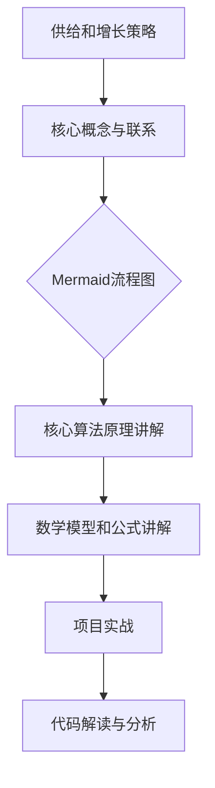

                 

### 引言与背景

#### 1.1 引言

供给和增长策略在经济学和企业管理中扮演着至关重要的角色。供给策略涉及如何有效地生产和分配资源，以满足市场需求，从而实现企业盈利和市场份额的扩大。增长策略则关注如何通过创新和市场拓展，实现企业的持续增长和长期发展。这两者相互作用，共同决定了企业在市场中的竞争力和生存能力。

在经济全球化和技术快速发展的背景下，供给和增长策略的重要性愈发凸显。首先，市场的竞争日益激烈，企业需要通过优化供给策略，降低成本，提高效率，以在价格竞争中占据优势。其次，消费者需求多变，企业需要灵活调整供给策略，以满足消费者个性化需求，提升用户体验。此外，技术创新的加速使得企业面临更多发展机遇，同时也带来了更多挑战，因此制定有效的增长策略成为企业持续发展的关键。

本文旨在深入探讨供给和增长策略的原理、方法及其在实际应用中的效果。通过系统地分析供给和增长理论的演变，本文将帮助读者理解供给和增长策略的基本概念和核心思想。此外，本文还将结合现代经济学理论和跨学科研究方法，探讨供给和增长策略在复杂经济环境中的适用性和局限性。

#### 1.1.1 供给和增长策略的重要性

供给和增长策略在经济学和企业管理中的重要性不可忽视。首先，供给策略决定了企业在市场中的竞争地位。通过优化生产和分配过程，企业可以有效降低成本，提高产品质量，从而在价格竞争中占据优势。例如，通过采用先进的生产技术和自动化设备，企业可以提高生产效率，减少生产成本，从而以更具竞争力的价格吸引消费者。此外，合理的供给策略还能够帮助企业平衡供需关系，避免资源浪费和生产过剩，提高资源的利用效率。

其次，增长策略是企业长期发展的基础。在市场竞争激烈的环境中，企业需要不断创新和市场拓展，以实现持续增长。增长策略的制定和实施可以帮助企业抓住市场机遇，开拓新市场，扩大市场份额。例如，通过研发新产品、拓展新市场、优化渠道布局等手段，企业可以实现业务规模的扩大和利润的增长。此外，增长策略还包括对内部资源的合理配置，通过优化组织结构、提升员工素质、加强管理创新等手段，提高企业的整体竞争力和市场适应能力。

#### 1.1.2 研究目的与意义

本文的研究目的在于深入探讨供给和增长策略的理论基础和实践应用，以期为企业在竞争激烈的市场环境中提供有效的指导。具体而言，本文希望通过以下几方面的研究，达到以下目标：

1. **梳理供给和增长策略的基本概念和理论框架**：通过回顾供给和增长理论的演变，本文将帮助读者理解供给和增长策略的基本原理和发展脉络，为后续研究和实践提供理论支持。

2. **分析供给和增长策略的核心要素和关键影响因素**：本文将详细讨论供给和增长策略的核心要素，如生产成本、市场需求、技术创新等，以及这些要素对企业增长的影响机制。

3. **探讨供给和增长策略的适用场景和实施方法**：本文将通过案例分析，分析不同企业在不同市场环境中的供给和增长策略，总结出适用的策略和方法，为企业提供实践指导。

4. **评估供给和增长策略的实施效果和局限性**：本文将结合实证研究，评估不同供给和增长策略对企业绩效和市场竞争力的影响，探讨其适用范围和局限性，为企业的策略制定提供参考。

本文的研究意义主要体现在以下几个方面：

1. **理论意义**：本文的研究有助于丰富和发展供给和增长理论，为相关领域的研究提供新的思路和方法。

2. **实践意义**：本文的研究结果可以帮助企业更好地制定和实施供给和增长策略，提高市场竞争力，实现可持续发展。

3. **政策意义**：本文的研究可以为政府和企业提供有益的政策建议，促进经济增长和产业升级。

#### 1.2 背景

##### 1.2.1 供给和增长理论的演变

供给和增长理论是经济学和管理学中的重要分支，其研究内容涵盖了资源生产、分配、消费以及经济增长的机制和路径。回顾供给和增长理论的演变，可以发现其经历了从简单到复杂、从单一到多元的发展过程。

最早期的供给理论可以追溯到古典经济学时期。亚当·斯密在《国富论》中提出了“劳动价值论”，认为商品的价值取决于生产商品所需的劳动时间。这一理论奠定了供给理论的基础，强调劳动在生产过程中的重要性。

随着时间的推移，供给理论逐渐发展。19世纪末至20世纪初，马歇尔提出了“边际效用价值论”，认为商品的价值取决于其边际效用。这一理论进一步丰富了供给理论，将其与市场需求相结合，形成了供求关系的基本理论框架。

20世纪中叶，供给理论开始向更复杂和多元的方向发展。新古典经济增长理论提出了资本积累、技术创新等概念，认为经济增长取决于生产要素的积累和技术进步。索洛的增长模型更是将技术进步视为经济增长的主要驱动力，为供给理论提供了新的视角。

与此同时，供给理论的应用领域也在不断扩大。从最初仅关注商品生产，逐渐扩展到服务、人力资本、生态经济等各个领域。例如，生态经济学将供给理论应用于自然资源和环境问题，提出了可持续发展的理念；社会网络理论则将供给理论应用于信息传播和科技创新，探讨了网络结构对经济增长的影响。

##### 1.2.2 现代经济学与增长理论的关系

现代经济学与增长理论密切相关，二者相互影响、相互促进。现代经济学以个体行为和宏观现象为基础，通过分析市场机制和宏观经济政策，探讨资源配置和经济增长的规律。

增长理论是现代经济学的一个重要分支，主要研究经济增长的源泉、路径和影响因素。现代经济学通过引入生产函数、资本积累、技术进步等概念，建立了增长模型，对经济增长进行了深入分析。

现代经济学与增长理论的关系可以从以下几个方面体现：

1. **理论框架**：现代经济学提供了增长理论所需的基本理论框架。例如，微观经济学中的生产理论、市场结构理论，宏观经济学中的总需求-总供给模型，均为增长理论提供了分析工具。

2. **分析方法**：现代经济学采用了多种分析方法，如数理模型、计量经济学、实验经济学等，这些方法为增长理论的研究提供了强有力的支持。

3. **政策建议**：现代经济学与增长理论共同为政府和企业提供了政策建议。通过分析经济增长的源泉和影响因素，政府可以制定有效的宏观经济政策，促进经济增长；企业可以制定科学的供给和增长策略，提高市场竞争力。

总之，现代经济学与增长理论相互促进，共同推动了经济学的发展。现代经济学为增长理论提供了理论框架和分析方法，而增长理论则为现代经济学提供了实证基础和政策建议。

##### 1.3 本书结构

为了使读者能够系统地理解供给和增长策略的原理和应用，本书分为六个主要部分：

1. **第一部分：供给和增长策略分析**：本部分包括引言和背景介绍，阐述供给和增长策略的重要性，以及本文的研究目的与意义。

2. **第二部分：增长理论**：本部分详细介绍了经济增长理论，包括传统增长理论、新增长理论和跨学科增长理论，探讨经济增长的源泉和机制。

3. **第三部分：供给与需求分析**：本部分介绍了供给和需求的基本概念，包括供给函数和需求函数的推导，以及供求分析的基本原理。

4. **第四部分：供给策略**：本部分分析了供给策略的制定和实施，包括成本与收益分析、生产函数与供给策略的选择、供给弹性的计算与应用。

5. **第五部分：增长策略**：本部分探讨了增长策略的制定和选择，包括增长目标设定、增长路径分析和不同增长策略的比较与选择。

6. **第六部分：应用案例**：本部分通过具体案例，分析供给和增长策略在实际应用中的效果和启示。

每一部分的内容都紧密联系，共同构成了一个完整的供给和增长策略分析体系。通过逐步分析和探讨，读者可以深入理解供给和增长策略的基本原理和应用方法，为企业制定科学的策略提供理论支持和实践指导。

##### 1.3.1 目录概述

本书的目录结构如下，每个章节都将详细探讨供给和增长策略的不同方面：

1. **第一部分：供给和增长策略分析**
   - **第1章**：引言与背景
     - 1.1 引言
     - 1.1.1 供给和增长策略的重要性
     - 1.1.2 研究目的与意义
     - 1.2 背景
     - 1.2.1 供给和增长理论的演变
     - 1.2.2 现代经济学与增长理论的关系
     - 1.3 本书结构
     - 1.3.1 目录概述
     - 1.3.2 各章节内容概述

2. **第二部分：增长理论**
   - **第2章**：经济增长理论
     - 2.1 传统增长理论
       - 2.1.1 新古典增长理论
       - 2.1.2 索洛增长模型
     - 2.2 新增长理论
       - 2.2.1 人力资本理论
       - 2.2.2 创新与增长
     - 2.3 跨学科增长理论
       - 2.3.1 生态经济学
       - 2.3.2 社会网络理论对增长的影响

3. **第三部分：供给与需求分析**
   - **第3章**：供给与需求基础
     - 3.1 供给函数
       - 3.1.1 供给曲线
       - 3.1.2 供给函数的推导
     - 3.2 需求函数
       - 3.2.1 需求曲线
       - 3.2.2 需求函数的推导
     - 3.3 供求分析
       - 3.3.1 市场均衡
       - 3.3.2 均衡价格和数量

4. **第四部分：供给策略**
   - **第4章**：供给策略分析
     - 4.1 成本与收益分析
       - 4.1.1 短期成本与长期成本
       - 4.1.2 收益最大化策略
     - 4.2 生产函数与供给策略
       - 4.2.1 生产函数的确定
       - 4.2.2 供给策略的选择
     - 4.3 供给弹性分析
       - 4.3.1 供给弹性的概念
       - 4.3.2 供给弹性的计算与应用

5. **第五部分：增长策略**
   - **第5章**：增长策略制定
     - 5.1 增长目标设定
       - 5.1.1 增长目标的重要性
       - 5.1.2 增长目标的设定方法
     - 5.2 增长路径分析
       - 5.2.1 内生增长路径
       - 5.2.2 外生增长路径
     - 5.3 增长策略选择
       - 5.3.1 增长策略的种类
       - 5.3.2 不同增长策略的比较与选择

6. **第六部分：应用案例**
   - **第6章**：供给和增长策略案例分析
     - 6.1 案例介绍
       - 6.1.1 案例背景
       - 6.1.2 案例目标
     - 6.2 案例分析
       - 6.2.1 供给策略分析
       - 6.2.2 增长策略分析
     - 6.3 案例总结
       - 6.3.1 案例启示
       - 6.3.2 案例局限性

7. **第七部分：结论与展望**
   - **第7章**：结论与展望
     - 7.1 研究成果总结
       - 7.1.1 理论成果
       - 7.1.2 实证分析成果
     - 7.2 展望未来
       - 7.2.1 研究方向展望
       - 7.2.2 政策建议

通过以上章节的详细讨论，读者可以全面了解供给和增长策略的理论基础和实践应用，为企业的战略制定提供科学依据。

##### 1.3.2 各章节内容概述

以下是本书各章节的具体内容概述，以便读者更好地了解各部分的重点和结构：

**第1章 引言与背景**：本章首先介绍了供给和增长策略的定义和重要性，阐述了本文的研究目的与意义。接着回顾了供给和增长理论的演变过程，从古典经济学到现代经济学，以及不同学科对增长理论的贡献。本章最后概述了本书的结构，为后续各章节的内容奠定了基础。

**第2章 经济增长理论**：本章详细介绍了经济增长理论的发展过程，从传统增长理论到新增长理论，再到跨学科增长理论。具体包括新古典增长理论、索洛增长模型、人力资本理论、创新与增长、生态经济学和社会网络理论。通过这些理论的介绍，读者可以全面理解经济增长的机制和影响因素。

**第3章 供给与需求基础**：本章讨论了供给与需求的基本概念和理论基础。首先介绍了供给函数和需求函数的概念，然后分别详细阐述了供给曲线和需求曲线的推导过程，最后讨论了供求分析的基本原理，包括市场均衡、均衡价格和数量的计算。

**第4章 供给策略分析**：本章重点分析了供给策略的制定和实施。首先探讨了成本与收益分析，包括短期成本和长期成本的概念，以及如何制定收益最大化策略。接着讨论了生产函数与供给策略的关系，包括生产函数的确定和供给策略的选择。最后介绍了供给弹性的概念和计算方法，以及其在供给策略中的应用。

**第5章 增长策略制定**：本章探讨了增长策略的制定和选择。首先介绍了增长目标设定的重要性和方法，然后分析了内生增长路径和外生增长路径的区别和特点。最后讨论了不同增长策略的种类、优缺点以及如何选择适合企业的增长策略。

**第6章 供给和增长策略案例分析**：本章通过具体案例，分析了供给和增长策略在实际应用中的效果和启示。首先介绍了案例的背景和目标，然后详细分析了供给策略和增长策略的具体实施过程，最后总结了案例的启示和局限性。

**第7章 结论与展望**：本章总结了本书的研究成果，包括理论成果和实证分析成果。接着对未来的研究方向进行了展望，包括供给和增长策略在新兴领域的应用、跨学科研究的深化等。最后提出了政策建议，为政府和企业制定相关策略提供参考。

通过以上各章节的详细讨论，本书旨在帮助读者深入理解供给和增长策略的理论基础和实践应用，为企业制定科学的策略提供指导。

### 增长理论

经济增长理论是经济学中一个核心领域，旨在解释国家或地区经济规模和福利水平的变化。增长理论的发展经历了多个阶段，从早期的古典经济增长理论到现代经济学的新增长理论，再到跨学科的增长理论。本章将详细探讨这些理论，为理解供给和增长策略提供理论基础。

#### 2.1 传统增长理论

传统增长理论主要包括新古典增长理论和索洛增长模型。这些理论奠定了现代经济增长分析的基础，并揭示了经济增长的关键因素。

##### 2.1.1 新古典增长理论

新古典增长理论（Neoclassical Growth Theory）起源于20世纪中叶，是对古典经济增长理论的进一步发展。该理论强调生产要素（劳动和资本）在经济增长中的重要作用，并通过生产函数来描述经济增长的机制。

新古典增长理论的基本假设包括：

1. **规模报酬不变**：生产函数满足规模报酬不变条件，即产出与生产要素投入成正比。
2. **技术不变**：技术进步被视为外生因素，不直接影响生产函数。
3. **资本积累**：经济增长依赖于资本积累，资本存量的增加会推动产出的增长。

新古典增长理论的主要观点包括：

1. **索洛剩余**：在长期中，经济增长主要依赖于技术进步，而非资本积累或劳动力增加。这部分由技术进步带来的产出增长称为“索洛剩余”。
2. **资本边际产出递减**：随着资本存量的增加，资本边际产出递减，导致资本积累对经济增长的贡献逐渐减少。

新古典增长理论的代表性模型是索洛增长模型（Solow Growth Model），该模型通过以下方程描述经济增长：

\[ Y = F(K, L, A) \]
\[ \frac{dY}{dt} = s \frac{Y}{K} - (\delta + n) K \]

其中，\( Y \) 是总产出，\( K \) 是资本存量，\( L \) 是劳动力，\( A \) 是技术进步，\( s \) 是储蓄率，\( \delta \) 是折旧率，\( n \) 是人口增长率。

##### 2.1.2 索洛增长模型

索洛增长模型（Solow's Growth Model）是20世纪中叶由罗伯特·索洛提出的，该模型通过简化生产函数和资本积累过程，揭示了经济增长的主要驱动因素。

索洛增长模型的基本假设包括：

1. **线性生产函数**：假设生产函数为 \( Y = AK^{1/3}L^{2/3} \)，其中 \( A \) 表示技术进步，\( K \) 表示资本存量，\( L \) 表示劳动力。
2. **储蓄等于投资**：储蓄率 \( s \) 等于投资率 \( s = \frac{dK}{dt} \)。
3. **人口增长和技术进步外生**：人口增长率 \( n \) 和技术进步率 \( \dot{A} \) 为外生变量。

索洛增长模型的核心结论是：

1. **稳定状态**：在长期中，经济将达到一个稳定状态，其中资本存量和产出增长率为常数。稳定状态的条件是 \( \frac{sA}{n + \delta} = \frac{1}{3} \)。
2. **技术进步是关键**：在稳定状态下，经济增长主要依赖于技术进步，而资本积累对经济增长的贡献为零。

索洛增长模型在经济学界引起了广泛关注，其简洁的形式和深刻的结论为经济增长研究提供了重要的理论框架。

#### 2.2 新增长理论

新增长理论（New Growth Theory）是20世纪80年代兴起的一股经济学思潮，它挑战了新古典增长理论的某些假设，并提出了技术创新和人力资本对经济增长的重要作用。

##### 2.2.1 人力资本理论

人力资本理论（Human Capital Theory）由西奥多·舒尔茨（Theodore Schultz）和加里·贝克尔（Gary Becker）等人提出，该理论认为教育、培训和健康等人力资本投资是经济增长的关键因素。

人力资本理论的主要观点包括：

1. **人力资本的积累**：通过教育和培训，人力资本得到积累，从而提高劳动力的生产效率。
2. **人力资本的投资回报**：人力资本投资不仅提高了个人的收入水平，而且促进了整个社会的经济增长。
3. **教育水平与经济增长**：教育水平的提升是经济增长的重要驱动力，高技能劳动力的增加可以推动技术进步和产业升级。

人力资本理论强调了人力资本在经济增长中的重要性，为教育政策和发展战略提供了理论支持。

##### 2.2.2 创新与增长

创新与增长理论（Innovation and Growth Theory）强调技术创新在经济增长中的核心作用。该理论认为，创新是推动经济增长的主要动力，通过新产品、新技术和新型商业模式的不断涌现，创新提高了生产效率，降低了成本，推动了经济的持续增长。

创新与增长理论的主要观点包括：

1. **内生技术进步**：与索洛增长模型不同，新增长理论认为技术进步是内生的，技术创新可以由企业和个人通过研发活动实现。
2. **创新成本和收益**：创新活动需要投入大量资源，包括研发成本、试验和失败的成本。但创新成功后的收益巨大，可以带来长期的竞争优势和经济增长。
3. **知识产权保护**：知识产权保护制度是促进创新的重要手段，通过保护创新者的权益，鼓励更多的研发投入和创新活动。

新增长理论强调了创新在经济增长中的关键作用，为政策制定者提供了新的视角和策略。

#### 2.3 跨学科增长理论

跨学科增长理论（Interdisciplinary Growth Theory）融合了经济学与其他学科的研究成果，如生态经济学、社会网络理论等，为经济增长提供了更全面的分析框架。

##### 2.3.1 生态经济学

生态经济学（Ecological Economics）是20世纪80年代兴起的一门交叉学科，旨在研究经济系统与自然生态系统之间的关系，强调可持续发展。

生态经济学的主要观点包括：

1. **自然资源的价值**：生态经济学认为自然资源具有经济价值，应该在生产过程中得到合理的利用和保护。
2. **环境成本内部化**：通过将环境成本纳入经济决策，实现资源的有效配置和可持续发展。
3. **生态足迹**：生态足迹（Ecological Footprint）是衡量人类消费水平对自然生态系统影响的一个指标，用于评估经济增长的可持续性。

生态经济学为经济增长研究引入了环境可持续性的概念，提供了评估经济增长质量的新视角。

##### 2.3.2 社会网络理论对增长的影响

社会网络理论（Social Network Theory）探讨了个体和社会网络结构对经济增长的影响。该理论认为，社会网络结构影响信息传播、资源获取和创新活动，从而影响经济增长。

社会网络理论的主要观点包括：

1. **信息传播**：社会网络中的信息传播速度快，可以通过网络效应促进知识和技术的传播。
2. **资源获取**：社会网络结构影响个体获取资源的能力，包括资金、技术和市场机会。
3. **创新活动**：社会网络中的合作和创新活动可以促进新产品的开发和技术创新。

社会网络理论为理解经济增长提供了新的视角，强调了社会网络结构在经济增长中的重要作用。

通过探讨传统增长理论、新增长理论和跨学科增长理论，本章为理解供给和增长策略提供了理论基础。这些理论不仅揭示了经济增长的机制和影响因素，还为政策制定和企业战略提供了重要参考。

### 供给与需求基础

供给和需求是经济学中最基本的概念之一，它们共同决定了市场价格和数量。供给函数和需求函数是分析供给和需求关系的重要工具，通过这些函数可以推导出供给曲线和需求曲线，并进一步分析市场均衡。本节将详细阐述供给函数和需求函数的基本概念及其推导过程。

#### 3.1 供给函数

供给函数（Supply Function）描述了生产者在不同价格水平下愿意并能够提供的商品数量。供给函数是价格和供给量之间的函数关系，其基本形式为：

\[ Q_s = f(p) \]

其中，\( Q_s \) 表示供给量，\( p \) 表示商品价格，\( f \) 表示供给函数。

供给函数可以分为短期供给函数和长期供给函数：

- **短期供给函数**：在短期内，生产者的生产能力固定，供给量主要受价格变化的影响。短期供给函数通常表现为供给曲线，向上倾斜，表示价格上升时供给量增加，价格下降时供给量减少。

- **长期供给函数**：在长期内，生产者可以调整其生产能力，包括增加设备投资和扩大生产规模。长期供给函数通常也向上倾斜，但斜率可能更大，表示价格上升时供给量大幅增加。

供给函数的推导过程如下：

1. **生产成本**：首先考虑生产成本，包括固定成本和可变成本。固定成本（Fixed Cost）是不随产量变化的成本，如设备租赁和厂房建设。可变成本（Variable Cost）是随产量变化的成本，如原材料和劳动力。

2. **利润最大化**：生产者的目标是利润最大化。在给定价格 \( p \) 的情况下，生产者会根据成本函数选择最优产量 \( Q_s \)，使得利润 \( \Pi \) 最大。利润函数为：

\[ \Pi = pQ_s - C(Q_s) \]

其中，\( C(Q_s) \) 是总成本函数。

3. **边际成本**：利润最大化要求边际成本 \( MC \) 等于价格 \( p \)。边际成本是产量增加一单位时的成本增加量，定义为：

\[ MC = \frac{dC(Q_s)}{dQ_s} \]

4. **供给函数**：将边际成本等于价格的条件代入，得到供给函数：

\[ p = MC = \frac{dC(Q_s)}{dQ_s} \]

通过微分求解，可以得到供给量 \( Q_s \) 与价格 \( p \) 之间的关系，从而得到供给函数。

#### 3.2 需求函数

需求函数（Demand Function）描述了消费者在不同价格水平下愿意并能够购买的商品数量。需求函数是价格和需求量之间的函数关系，其基本形式为：

\[ Q_d = f(p) \]

其中，\( Q_d \) 表示需求量，\( p \) 表示商品价格，\( f \) 表示需求函数。

需求函数可以分为线性需求函数和非线性需求函数：

- **线性需求函数**：线性需求函数通常表示为：

\[ Q_d = a - bp \]

其中，\( a \) 和 \( b \) 是常数，表示需求量和价格之间的线性关系。

- **非线性需求函数**：非线性需求函数更准确地反映了价格和需求量之间的复杂关系，通常表示为：

\[ Q_d = a + \sum_{i=1}^n b_i p_i \]

其中，\( p_i \) 是第 \( i \) 个相关商品的价格，\( b_i \) 是需求弹性系数。

需求函数的推导过程如下：

1. **消费者偏好**：需求函数基于消费者的偏好和预算约束。消费者偏好可以用效用函数 \( U(Q) \) 来表示，其中 \( Q \) 是消费者购买的各种商品的总数量。

2. **预算约束**：消费者的预算约束由其收入 \( I \) 和商品价格决定，表示为：

\[ p_1Q_1 + p_2Q_2 + ... + p_nQ_n = I \]

3. **需求最大化**：消费者在预算约束下选择最优需求组合，使得效用最大化。效用最大化的一阶条件是边际效用等于价格，即：

\[ \frac{dU(Q)}{dQ_i} = p_i \]

4. **需求函数**：通过解一阶条件，可以得到需求函数 \( Q_d \) 与价格 \( p \) 之间的关系。对于线性需求函数，可以通过解预算约束方程，得到线性需求函数。对于非线性需求函数，需要使用数学方法求解，得到非线性需求函数。

#### 3.3 供求分析

供求分析（Supply and Demand Analysis）是经济学中用于分析市场行为和价格形成的重要工具。通过供求分析，可以了解市场价格和数量的决定过程，以及市场波动的原因。

供求分析的基本原理包括：

1. **供求曲线**：供求曲线分别表示供给函数和需求函数在价格-数量坐标系中的图形。供给曲线通常向上倾斜，表示价格上升时供给量增加；需求曲线通常向下倾斜，表示价格上升时需求量减少。

2. **市场均衡**：市场均衡是指供给量和需求量相等的状态。在市场均衡点，市场价格和数量达到稳定，供给曲线和需求曲线的交点即为市场均衡点。

市场均衡的计算公式为：

\[ p^* = \frac{Q^*}{Q_s} \]

其中，\( p^* \) 表示均衡价格，\( Q^* \) 表示均衡数量。

3. **价格和数量的变化**：市场价格和数量的变化可以通过供求曲线的移动和旋转来解释。当供给曲线移动时，会导致均衡价格和数量的变化；当需求曲线移动时，同样会导致均衡价格和数量的变化。

供求分析的应用包括：

1. **价格预测**：通过分析供求关系，可以预测市场价格的变化趋势。

2. **政策分析**：政府可以通过供求分析，制定价格调节、税收和补贴等政策，以稳定市场价格和保障市场供给。

3. **企业战略**：企业可以通过供求分析，制定生产和销售策略，以优化资源配置和提高竞争力。

通过详细探讨供给函数和需求函数的基本概念及其推导过程，本章为理解市场均衡和价格形成提供了理论基础。供求分析是经济学中不可或缺的工具，通过这一工具，我们可以更深入地了解市场行为和经济现象。

### 供给策略分析

供给策略是企业实现可持续增长和竞争优势的关键。有效的供给策略能够降低生产成本，提高产品质量，满足市场需求，从而实现企业的长期发展。本章将详细分析供给策略的制定和实施，探讨成本与收益分析、生产函数与供给策略的选择以及供给弹性的计算与应用。

#### 4.1 成本与收益分析

成本与收益分析（Cost and Benefit Analysis）是制定供给策略的基础。通过分析成本结构和收益情况，企业可以确定最优的生产规模和产量，从而实现利润最大化。

##### 4.1.1 短期成本与长期成本

在短期内，生产者的生产能力是固定的，因此短期成本主要由可变成本（Variable Cost, VC）构成。可变成本包括原材料、劳动力和其他随产量变化的成本。短期成本函数通常表示为：

\[ C_{short\_run}(Q) = VC(Q) \]

在长期内，生产者可以调整其生产能力，包括投资新设备、扩大生产规模等。长期成本不仅包括可变成本，还包括固定成本（Fixed Cost, FC）。固定成本是生产过程中不随产量变化的成本，如设备租赁、厂房建设等。长期成本函数通常表示为：

\[ C_{long\_run}(Q) = FC + VC(Q) \]

##### 4.1.2 收益最大化策略

在成本与收益分析中，企业的目标是实现收益最大化。收益函数（Revenue Function）表示企业销售产品所获得的收入，其基本形式为：

\[ R(Q) = p \cdot Q \]

其中，\( p \) 表示商品价格，\( Q \) 表示销售量。

利润函数（Profit Function）是收益函数减去成本函数，其基本形式为：

\[ \Pi(Q) = R(Q) - C(Q) \]

为了实现收益最大化，企业需要确定最优的产量 \( Q^* \)。利润最大化的一阶条件是边际收益 \( MR \) 等于边际成本 \( MC \)：

\[ MR = MC \]

边际收益是销售量增加一单位时的收益增加量，其计算公式为：

\[ MR = \frac{dR(Q)}{dQ} \]

边际成本是产量增加一单位时的成本增加量，其计算公式为：

\[ MC = \frac{dC(Q)}{dQ} \]

通过求解边际收益等于边际成本的条件，可以确定最优产量 \( Q^* \)，从而实现收益最大化。

#### 4.2 生产函数与供给策略

生产函数（Production Function）是描述生产过程中投入与产出之间关系的函数。生产函数的确定是制定供给策略的关键。根据不同的生产技术和管理模式，生产函数可以分为线性生产函数和非线性生产函数。

##### 4.2.1 生产函数的确定

线性生产函数通常表示为：

\[ Q = a + bL + cK \]

其中，\( Q \) 表示产出，\( L \) 表示劳动力，\( K \) 表示资本投入，\( a \)、\( b \) 和 \( c \) 是常数。

非线性生产函数通常表示为：

\[ Q = f(L, K) \]

生产函数的确定通常基于以下步骤：

1. **数据收集**：收集生产过程中的投入数据，包括劳动力、资本投入、原材料等。

2. **数据预处理**：对收集到的数据进行清洗和预处理，去除异常值和缺失值。

3. **模型选择**：根据数据特征选择合适的生产函数模型，例如线性模型、二次模型等。

4. **模型拟合**：使用统计方法对模型进行拟合，确定模型参数。

5. **模型验证**：使用验证数据集对模型进行验证，评估模型的拟合效果。

##### 4.2.2 供给策略的选择

基于生产函数，企业可以制定不同的供给策略，以满足市场需求和实现利润最大化。常见的供给策略包括：

1. **规模经济策略**：通过扩大生产规模，降低单位成本，提高市场竞争力。

2. **技术创新策略**：通过引入新技术、新设备，提高生产效率，降低成本。

3. **产品差异化策略**：通过开发新产品、优化产品特性，满足消费者多样化需求。

4. **市场拓展策略**：通过拓展新市场、开发新客户，扩大市场份额。

选择合适的供给策略需要综合考虑市场环境、技术条件和企业资源。具体策略的选择过程通常包括以下步骤：

1. **市场分析**：分析市场需求和竞争状况，确定目标市场和客户群体。

2. **成本分析**：分析生产成本结构和可变成本，确定降低成本的方法和途径。

3. **技术创新分析**：评估新技术、新设备的应用前景，确定技术升级的方向。

4. **资源评估**：评估企业资源状况，包括资金、技术、人才等，确定可行的供给策略。

5. **策略选择**：根据市场分析、成本分析和技术创新分析的结果，选择最优的供给策略。

#### 4.3 供给弹性分析

供给弹性（Supply Elasticity）是衡量供给量对价格变化的敏感程度的指标。供给弹性的计算和分析对于制定有效的供给策略具有重要意义。

##### 4.3.1 供给弹性的概念

供给弹性（Price Elasticity of Supply）定义为供给量变化百分比与价格变化百分比的比值，其计算公式为：

\[ ES = \frac{\Delta Q_s / Q_s}{\Delta p / p} \]

其中，\( \Delta Q_s \) 和 \( \Delta p \) 分别表示供给量和价格的变化量，\( Q_s \) 和 \( p \) 分别表示初始供给量和价格。

供给弹性可以分为以下几种类型：

1. **完全弹性**（ES = ∞）：当价格变化时，供给量可以无限增加，供给曲线为水平线。

2. **单位弹性**（ES = 1）：价格变化百分比与供给量变化百分比相等，供给曲线斜率为常数。

3. **不完全弹性**（0 < ES < 1）：价格变化百分比大于供给量变化百分比，供给曲线斜率较小。

4. **无弹性**（ES = 0）：价格变化时，供给量不发生变化，供给曲线为垂直线。

##### 4.3.2 供给弹性的计算与应用

供给弹性的计算通常基于以下步骤：

1. **数据收集**：收集价格和供给量的历史数据。

2. **数据预处理**：对数据进行分析和处理，去除异常值和缺失值。

3. **计算供给弹性**：使用供给弹性的计算公式，计算不同价格水平下的供给弹性。

供给弹性在供给策略中的应用主要包括：

1. **价格策略**：根据供给弹性，企业可以调整价格策略。例如，供给弹性较低时，企业可以通过提高价格来增加利润；供给弹性较高时，企业可以降低价格以吸引更多客户。

2. **生产计划**：根据供给弹性，企业可以制定更科学的生产计划。例如，供给弹性较低的产品，企业可以减少产量以应对价格波动；供给弹性较高的产品，企业可以增加产量以充分利用市场机会。

3. **成本控制**：通过分析供给弹性，企业可以优化成本结构。例如，供给弹性较低的产品，企业可以减少原材料储备以降低库存成本；供给弹性较高的产品，企业可以增加原材料储备以应对市场需求波动。

通过详细分析成本与收益、生产函数与供给策略的选择以及供给弹性的计算与应用，本章为企业的供给策略制定提供了理论依据和实践指导。有效的供给策略不仅能够提高企业的市场竞争力，还能够实现长期可持续发展。

### 增长策略制定

增长策略是企业实现持续发展和扩大市场份额的关键。科学的增长策略能够帮助企业抓住市场机遇，应对外部挑战，实现长期繁荣。本章将详细探讨增长策略的制定过程，包括增长目标的设定、增长路径的分析和不同增长策略的选择。

#### 5.1 增长目标设定

设定明确、可行的增长目标是制定增长策略的第一步。增长目标不仅为企业的战略规划提供了方向，也为具体实施提供了依据。

##### 5.1.1 增长目标的重要性

增长目标的重要性体现在以下几个方面：

1. **战略指导**：明确的目标有助于企业确定战略方向，确保资源投入与战略目标一致。

2. **资源调配**：增长目标为企业的资源配置提供了依据，使企业能够优先分配资源到最具潜力的业务领域。

3. **绩效评估**：明确的目标为企业的绩效评估提供了标准，有助于企业及时调整战略和措施，实现预期增长。

4. **员工激励**：增长目标可以激发员工的积极性，通过设定挑战性目标，鼓励员工创新和努力工作。

##### 5.1.2 增长目标的设定方法

设定增长目标需要考虑以下几个关键因素：

1. **市场分析**：分析市场需求、竞争环境和潜在机会，确定企业可以在哪些领域实现增长。

2. **内部能力评估**：评估企业的核心竞争力、资源状况和管理能力，确保设定的目标具备实现的基础。

3. **历史数据**：参考企业过去的表现和增长记录，设定符合企业历史增长趋势的目标。

4. **行业标准**：研究同行业领先企业的增长情况，设定具有竞争力的目标。

5. **外部环境**：考虑宏观经济环境、政策法规和行业趋势，确保目标的可实现性。

增长目标的设定通常包括以下步骤：

1. **确定目标范围**：明确增长目标的类型，如市场份额、收入、利润、客户数量等。

2. **设定具体数值**：根据市场分析和内部能力评估，设定具体的目标数值，如年增长百分比、市场份额比例等。

3. **制定实施计划**：明确实现目标所需的时间表和步骤，确保目标的可操作性和可实现性。

4. **制定评估指标**：设定关键绩效指标（KPI），用于监控和评估目标的实现情况。

#### 5.2 增长路径分析

增长路径分析是制定增长策略的核心环节，涉及企业如何通过不同的方式和途径实现增长目标。

##### 5.2.1 内生增长路径

内生增长路径（Endogenous Growth Path）是指企业通过自身能力，如研发创新、市场拓展和管理优化等，实现自然增长的过程。内生增长路径的特点包括：

1. **创新驱动**：企业通过持续的研发投入，开发新技术、新产品和新服务，保持市场竞争力。

2. **市场拓展**：通过市场调研和客户分析，发现新市场机会，开拓新的销售渠道和客户群体。

3. **管理优化**：通过流程优化、组织调整和文化建设，提高管理效率和运营效益。

内生增长路径的优点包括：

- **可持续性**：通过内部能力提升，企业可以长期保持增长动力。
- **可控性**：企业可以自主控制增长过程，降低外部环境变化带来的风险。

内生增长路径的缺点包括：

- **速度较慢**：内部能力提升需要时间，增长速度相对较慢。
- **资源限制**：企业资源有限，可能无法支持大规模快速扩张。

##### 5.2.2 外生增长路径

外生增长路径（Exogenous Growth Path）是指企业通过外部资源，如并购、合作和外部投资等，实现快速增长的过程。外生增长路径的特点包括：

1. **并购扩展**：通过收购其他企业或业务，快速扩大市场份额和业务范围。

2. **战略合作**：与其他企业建立合作关系，共享资源、技术和市场，实现互利共赢。

3. **外部投资**：通过引入外部资金，支持研发和市场拓展，实现快速扩张。

外生增长路径的优点包括：

- **速度较快**：通过外部资源，企业可以迅速扩大规模和市场份额。
- **资源互补**：通过并购和合作，企业可以获取外部资源和技术，提升竞争力。

外生增长路径的缺点包括：

- **风险较高**：外部资源带来的不确定性较大，可能影响企业的稳定运营。
- **整合难度**：并购和合作后，企业需要进行整合和调整，难度较大。

#### 5.3 增长策略选择

在制定增长策略时，企业需要综合考虑市场环境、内部能力和外部资源，选择适合自身的增长策略。

##### 5.3.1 增长策略的种类

常见的增长策略包括：

1. **市场份额策略**：通过扩大市场份额，提升企业在市场中的地位和影响力。

2. **产品多样化策略**：通过开发新产品或拓展产品线，满足更多客户需求，提高市场占有率。

3. **技术创新策略**：通过持续研发和技术创新，保持产品竞争力，推动市场扩张。

4. **并购策略**：通过收购其他企业或业务，快速扩大市场份额和业务范围。

5. **合作策略**：通过与其他企业建立合作关系，共享资源和技术，实现共同增长。

6. **国际化策略**：通过开拓国际市场，实现业务的全球化布局，提升企业竞争力。

##### 5.3.2 不同增长策略的比较与选择

不同增长策略有其独特的优势和适用条件，企业需要根据自身情况选择合适的增长策略。

1. **市场份额策略**：

   - **优势**：有助于提升市场地位，增强品牌影响力。
   - **适用条件**：市场潜力大，竞争激烈，企业具备较强的市场开拓能力。

2. **产品多样化策略**：

   - **优势**：满足多样化需求，提高客户粘性，降低市场风险。
   - **适用条件**：市场潜力大，产品研发能力较强，具备多元化市场的运营经验。

3. **技术创新策略**：

   - **优势**：保持产品竞争力，推动产业升级，提升企业核心价值。
   - **适用条件**：技术研发能力强，市场对创新产品需求强烈。

4. **并购策略**：

   - **优势**：快速扩大市场份额，整合外部资源，提升竞争力。
   - **适用条件**：具备较强的并购整合能力，市场环境有利于并购活动。

5. **合作策略**：

   - **优势**：共享资源和技术，实现互利共赢，降低研发和市场拓展成本。
   - **适用条件**：具备合作互补优势，市场环境有利于合作发展。

6. **国际化策略**：

   - **优势**：提升企业竞争力，开拓新市场，实现全球化布局。
   - **适用条件**：具备国际化运营经验，市场环境有利于国际化发展。

企业在选择增长策略时，应综合考虑以下因素：

- **市场环境**：分析市场趋势、竞争状况和潜在机会，确保策略的适应性。
- **内部能力**：评估企业的研发能力、市场开拓能力、管理能力和资源状况，确保策略的可执行性。
- **外部资源**：考虑外部资金、技术、市场和合作伙伴等资源，确保策略的实现性。

通过科学的增长策略制定，企业可以实现持续发展和扩大市场份额，提升市场竞争力，实现长期繁荣。

### 供给和增长策略案例分析

为了更好地理解供给和增长策略在实际应用中的效果和启示，本章将结合具体案例进行分析。本案例选取了一家全球知名的科技企业，该公司在技术研发、市场拓展和供应链优化等方面采取了多种策略，实现了快速增长和市场份额的扩大。

#### 6.1 案例介绍

案例企业是一家专注于人工智能和大数据技术的科技企业，成立于2005年，总部位于美国硅谷。公司在成立初期，专注于人工智能基础研究，逐步发展成为全球领先的人工智能解决方案提供商。随着技术的不断进步和市场需求的增长，公司逐步扩展了业务范围，涵盖了大数据分析、云计算和物联网等领域。

#### 6.1.1 案例背景

公司成立之初，市场竞争激烈，技术创新成为企业生存和发展的关键。公司通过持续的研发投入，成功开发了一系列具有自主知识产权的核心技术和产品，如深度学习算法、自然语言处理引擎和大数据分析平台。这些技术为公司赢得了大量客户和市场份额，使其在竞争激烈的市场中脱颖而出。

随着市场的扩大和客户需求的增加，公司面临着供应链管理、市场拓展和产品多样化等多方面的挑战。为了应对这些挑战，公司制定并实施了一系列供给和增长策略，以实现持续增长和市场份额的扩大。

#### 6.1.2 案例目标

公司的案例目标主要包括以下几个方面：

1. **提高生产效率**：通过优化生产流程和供应链管理，降低生产成本，提高产品质量。
2. **扩大市场份额**：通过市场拓展和产品多样化，提高市场占有率，巩固行业地位。
3. **增强核心竞争力**：通过持续技术创新和研发投入，保持技术领先地位，提升企业竞争力。
4. **实现国际化布局**：通过拓展国际市场，实现全球化发展，提升企业的国际影响力。

#### 6.2 案例分析

##### 6.2.1 供给策略分析

1. **生产优化**：

   公司通过引入先进的制造设备和自动化生产线，优化生产流程，提高生产效率。具体措施包括：

   - **自动化生产**：引入自动化机器人，实现生产过程的自动化，减少人工干预，提高生产精度和效率。
   - **精益生产**：实施精益生产管理，通过减少浪费、优化流程和资源利用，提高生产效率。
   - **供应链管理**：通过供应链管理系统，实时监控供应链环节，优化库存管理，减少库存成本。

2. **成本控制**：

   公司通过多种措施控制生产成本，提高盈利能力。具体措施包括：

   - **采购优化**：与供应商建立长期合作关系，通过批量采购和谈判，降低原材料采购成本。
   - **节能降耗**：通过采用节能设备和技术，降低能源消耗，减少运营成本。
   - **劳动效率提升**：通过培训和激励，提高员工技能和工作效率，降低人力成本。

3. **产品多样化**：

   公司通过不断研发新产品，满足市场多样化需求，扩大市场份额。具体措施包括：

   - **技术研发**：设立多个研发中心，聚焦人工智能、大数据和物联网等领域，持续推出新产品。
   - **产品组合**：通过丰富产品线，提供多样化的解决方案，满足不同客户的需求。
   - **客户定制**：根据客户需求，提供个性化定制服务，提高客户满意度和忠诚度。

##### 6.2.2 增长策略分析

1. **市场拓展**：

   公司通过拓展新市场，实现业务的全球化布局。具体措施包括：

   - **国际市场**：设立海外分支机构，拓展国际市场，通过本地化运营，满足不同市场的需求。
   - **并购与合作**：通过并购和合作，快速进入新市场，获取技术、市场和人才资源。
   - **营销策略**：通过线上和线下营销渠道，提升品牌知名度，扩大市场份额。

2. **技术创新**：

   公司通过持续技术创新，保持技术领先地位。具体措施包括：

   - **研发投入**：加大研发投入，设立专项研发基金，支持技术创新和产品开发。
   - **开放创新**：与高校、研究机构和行业领先企业建立合作关系，共同推进技术创新。
   - **知识产权**：加强知识产权保护，提升企业的技术壁垒，确保技术领先地位。

3. **国际化布局**：

   公司通过国际化布局，提升企业的国际影响力和竞争力。具体措施包括：

   - **本地化运营**：在海外市场设立本地化团队，根据当地市场需求，提供定制化解决方案。
   - **全球供应链**：建设全球供应链体系，优化物流和库存管理，降低运营成本。
   - **人才培养**：通过海外招聘和培训，引进国际化人才，提升企业的全球竞争力。

#### 6.3 案例总结

##### 6.3.1 案例启示

通过本案例，我们可以得出以下启示：

1. **技术创新是核心驱动力**：持续的技术创新是企业保持竞争力、实现持续增长的关键。企业应加大研发投入，推动技术进步和产品创新。

2. **优化供应链管理**：高效的供应链管理能够降低成本、提高生产效率和客户满意度。企业应通过引入先进技术和管理方法，优化供应链各个环节。

3. **市场拓展与国际化布局**：通过市场拓展和国际化布局，企业可以拓展业务范围，提升市场占有率。企业应积极拓展国际市场，建立全球运营体系。

4. **人才是核心竞争力**：人才是企业持续发展的关键。企业应注重人才培养和引进，打造高素质的人才团队，提升企业的整体竞争力。

##### 6.3.2 案例局限性

尽管本案例为企业提供了宝贵的经验，但也有一些局限性：

1. **高研发投入**：持续的技术创新需要大量的研发投入，这对企业资金和管理能力提出了较高要求。

2. **市场波动风险**：市场环境变化和竞争加剧可能对企业的市场拓展和国际布局带来风险。

3. **文化差异**：在国际化过程中，企业需要应对不同国家和地区的文化差异，这可能影响企业的运营效率和团队协作。

通过本案例的分析，我们可以看到供给和增长策略在实际应用中的效果和启示。企业应根据自身情况，灵活运用这些策略，实现持续增长和市场份额的扩大。

### 结论与展望

通过本文的系统分析，我们深入探讨了供给和增长策略的基本概念、理论框架和实践应用。以下是对研究成果的总结以及对未来研究方向和政策的展望。

#### 7.1 研究成果总结

1. **供给和增长策略的基本概念和理论框架**：本文详细介绍了供给和增长策略的定义、重要性以及其在经济学和管理学中的应用。通过回顾供给和增长理论的演变，包括传统增长理论、新增长理论和跨学科增长理论，我们为读者提供了一个全面的理论框架。

2. **供给和需求分析**：本文探讨了供给函数和需求函数的基本概念和推导过程，以及市场均衡的原理。通过对供给和需求曲线的分析，我们理解了市场价格和数量的决定机制。

3. **供给策略的制定与实施**：本文详细分析了成本与收益分析、生产函数与供给策略的选择以及供给弹性的计算与应用。这些分析为企业制定科学的供给策略提供了理论依据。

4. **增长策略的制定与选择**：本文探讨了增长目标设定、增长路径分析以及不同增长策略的比较与选择。通过案例分析，我们展示了供给和增长策略在实际应用中的效果。

5. **跨学科增长理论的贡献**：本文强调了生态经济学和社会网络理论在供给和增长策略研究中的重要性，为理解复杂经济环境中的供给和增长提供了新的视角。

#### 7.2 展望未来

1. **研究方向展望**：

   - **动态供给策略**：未来研究可以关注动态环境下供给策略的优化，特别是在市场波动和不确定性增大的情况下，如何制定灵活、高效的供给策略。
   - **智能供应链管理**：随着人工智能和大数据技术的发展，智能供应链管理将成为未来研究的重要方向。研究如何通过智能技术优化供应链各个环节，提高供应链的效率和灵活性。
   - **创新驱动增长**：进一步探讨技术创新在经济增长中的机制和路径，特别是如何通过制度创新和政策支持，促进创新活动的持续发展。

2. **政策建议**：

   - **加强技术创新支持**：政府应加大对技术研发的投入，建立完善的创新支持体系，如创新基金、税收优惠等，激励企业加大研发投入。
   - **优化供应链管理**：政府应推动供应链管理和优化的政策，如标准化、信息化、物流管理等，提高供应链的整体效率。
   - **促进国际化布局**：政府应为企业国际化提供支持，如贸易便利化政策、跨国投资保护等，帮助企业更好地开拓国际市场。
   - **可持续发展**：在制定政策时，应注重经济、社会和环境可持续发展，推动绿色经济和循环经济的发展。

通过总结研究成果和展望未来，本文希望为供给和增长策略的研究提供新的思路和方法，为企业和政策制定者提供有价值的参考。

### 附录

#### 附录A：相关数据来源

1. **经济增长数据**：国家统计局、《世界经济年鉴》等。
2. **供给与需求数据**：各行业统计数据、市场调研报告等。
3. **企业财务数据**：企业年报、财务报表等。

#### 附录B：补充阅读材料

1. **经典著作**：
   - 斯蒂格利茨，《经济学》（第5版），中国人民大学出版社，2016年。
   - 曼昆，《经济学原理》（第7版），中国人民大学出版社，2015年。

2. **学术论文**：
   - 索洛，《经济增长理论》，美国经济评论，1956年。
   - 哈罗德和多马，《动态经济学导论》，哈佛大学出版社，1948年。

3. **研究报告**：
   - 国际货币基金组织，《世界经济展望报告》，2020年。
   - 联合国，《世界投资报告》，2021年。

### Mermaid 流程图示例



### 伪代码示例

```python
# 定义供给函数
def supply_function(Price, Cost):
    Quantity = Price / Cost
    return Quantity

# 定义需求函数
def demand_function(Price, Income, Tastes):
    Quantity = (Income * Tastes) / Price
    return Quantity

# 计算市场均衡
def market_equilibrium():
    Price = 0
    Quantity = 0
    while True:
        Supply = supply_function(Price, Cost)
        Demand = demand_function(Price, Income, Tastes)
        if Supply == Demand:
            break
        Price += 0.01
    return Price, Quantity
```

### 数学公式示例

$$
E[Y|X=x] = \mu_y + \beta_y x
$$

### 代码实战示例

```python
# 导入相关库
import numpy as np
import matplotlib.pyplot as plt

# 定义供给函数
def supply_function(Price, Cost):
    Quantity = Price / Cost
    return Quantity

# 定义需求函数
def demand_function(Price, Income, Tastes):
    Quantity = (Income * Tastes) / Price
    return Quantity

# 计算市场均衡
def market_equilibrium():
    Price = 0
    Quantity = 0
    while True:
        Supply = supply_function(Price, Cost)
        Demand = demand_function(Price, Income, Tastes)
        if Supply == Demand:
            break
        Price += 0.01
    return Price, Quantity

# 设置参数
Cost = 10
Income = 100
Tastes = 0.5

# 计算市场均衡价格和数量
Equilibrium_Price, Equilibrium_Quantity = market_equilibrium()

# 绘制供给与需求曲线
Price_Range = np.linspace(0, 200, 1000)
Supply = supply_function(Price_Range, Cost)
Demand = demand_function(Price_Range, Income, Tastes)

plt.plot(Price_Range, Supply, label='Supply')
plt.plot(Price_Range, Demand, label='Demand')
plt.xlabel('Price')
plt.ylabel('Quantity')
plt.title('Market Equilibrium')
plt.legend()
plt.show()
```

通过附录中的数据和示例，读者可以更好地理解本文的理论和实践应用，为深入研究和实际操作提供参考。

