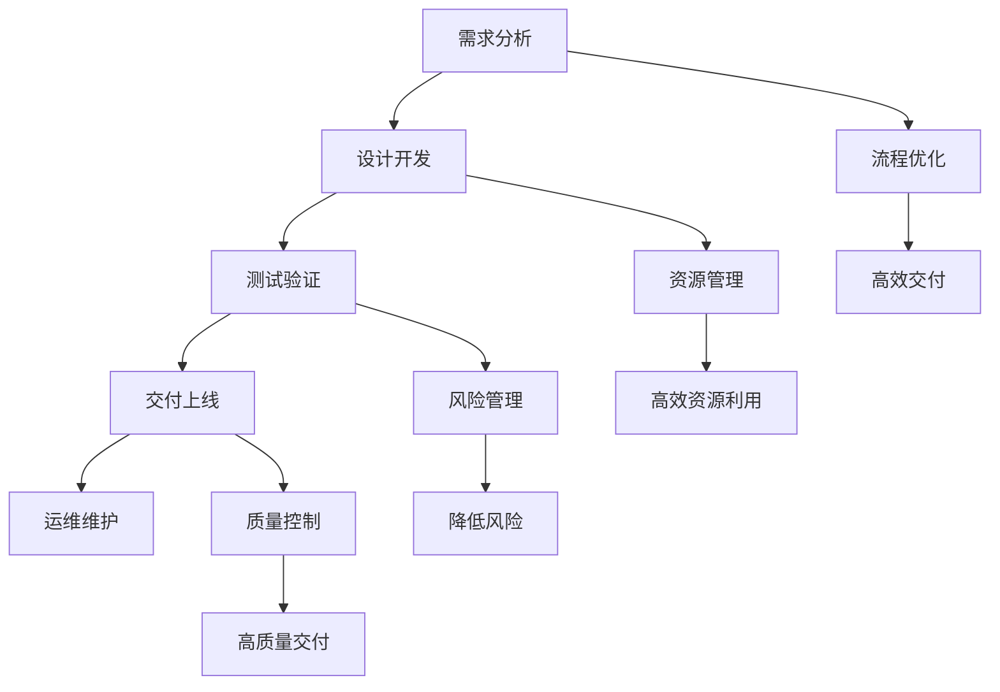

                 

# 《供给项目的工程链路优化》

> 关键词：供给项目，工程链路，优化，流程，资源管理，风险管理，质量控制，核心算法，数学模型，项目实战，未来趋势

> 摘要：本文旨在深入探讨供给项目的工程链路优化问题，从背景与概念、核心概念与联系、核心算法原理讲解、项目实战和未来趋势等多个方面进行全面剖析。通过阐述工程链路优化的重要性，分析当前工程链路中的问题，引入核心概念与联系，详细讲解核心算法原理和数学模型，以及分享实际项目优化经验，本文旨在为供给项目的工程链路优化提供一套完整、系统、实用的解决方案，以推动我国信息技术领域的发展。

## 第一部分：背景与概念

### 第1章：供给项目与工程链路的定义

#### 1.1 供给项目的概念

供给项目，是指在特定时间内，为了满足市场需求，通过资源整合和合理规划，实现特定产品或服务交付的一项系统性工作。供给项目通常涉及多个环节，包括需求分析、设计开发、测试验证、交付上线等。

供给项目的特点包括：

- **复杂性**：供给项目通常涉及多个领域、多个模块，参与者众多，关系复杂。
- **不确定性**：供给项目在实施过程中可能面临需求变更、技术难题等不确定性因素。
- **协同性**：供给项目的成功实施需要各个参与方的紧密协作和高效沟通。

#### 1.2 工程链路的基本要素

工程链路，是指供给项目从需求提出到产品交付的全过程，包括多个关键环节。工程链路的基本要素包括：

- **需求分析**：明确项目需求，包括功能需求、性能需求等。
- **设计开发**：根据需求进行系统设计，并开展编码实现。
- **测试验证**：对开发完成的系统进行测试，确保其功能、性能等满足需求。
- **交付上线**：将系统部署到生产环境，对外提供服务。
- **运维维护**：对上线系统进行监控、维护和升级，确保其稳定运行。

#### 1.3 优化供给项目工程链路的重要性

优化供给项目工程链路，对于提升项目质量、降低成本、缩短周期具有重要意义。具体体现在以下几个方面：

- **提升项目质量**：通过优化工程链路，可以加强各环节的质量控制，减少缺陷和故障，提高产品稳定性。
- **降低项目成本**：优化工程链路，可以减少资源浪费，提高资源利用率，降低项目成本。
- **缩短项目周期**：优化工程链路，可以提高开发效率，减少项目延误，缩短项目周期。
- **提升竞争力**：优化工程链路，可以提高供给项目的响应速度和市场适应性，增强企业竞争力。

### 第2章：供给项目的工程链路现状分析

#### 2.1 当前工程链路中的问题

当前，供给项目的工程链路普遍存在以下问题：

- **流程不畅**：项目流程缺乏统一规划和规范，导致各个环节衔接不畅，信息传递不及时。
- **资源浪费**：项目资源管理不当，导致资源浪费、利用率低。
- **风险管理不足**：项目风险管理不到位，缺乏有效的风险识别、评估和应对措施。
- **质量控制不力**：项目质量控制不严格，缺陷和故障较多，影响产品稳定性和客户满意度。

#### 2.2 市场需求与客户期望

在市场需求方面，客户对供给项目提出了更高的期望：

- **快速响应**：客户期望项目能够快速响应需求变更和市场变化。
- **高质量交付**：客户期望项目能够按时交付，且产品质量高、性能稳定。
- **良好体验**：客户期望项目能够提供良好的用户体验，满足个性化需求。

#### 2.3 竞争对手的工程链路分析

在竞争对手方面，他们通常采取了以下策略来优化工程链路：

- **流程优化**：通过建立标准化的流程和规范，提高项目执行力。
- **资源整合**：通过资源整合和合理配置，提高资源利用率。
- **风险管理**：通过建立完善的风险管理体系，降低项目风险。
- **质量控制**：通过严格的质量控制措施，确保项目质量。

## 第二部分：核心概念与联系

### 第3章：工程链路优化核心概念

#### 3.1 流程优化

流程优化，是指通过对项目流程进行梳理、改进和优化，提高项目执行效率和效果。流程优化的关键包括：

- **流程标准化**：建立统一的流程规范，明确各个环节的责任和标准。
- **流程可视化**：通过流程图等工具，使流程更加清晰、易懂。
- **流程迭代**：根据项目实际情况，持续优化和改进流程。

#### 3.2 资源管理

资源管理，是指对项目中的各种资源（如人力、设备、材料等）进行合理配置和调度，以提高资源利用率和项目效率。资源管理的关键包括：

- **资源规划**：根据项目需求，合理规划资源需求。
- **资源调度**：根据项目进度和资源状况，合理调度资源。
- **资源监控**：对资源使用情况进行监控，及时调整资源分配。

#### 3.3 风险管理

风险管理，是指对项目风险进行识别、评估和应对，以降低项目风险对项目目标的影响。风险管理的关键包括：

- **风险识别**：通过多种手段，识别项目中的潜在风险。
- **风险评估**：对识别出的风险进行评估，确定其风险等级。
- **风险应对**：制定风险应对策略，降低风险发生概率和影响。

#### 3.4 质量控制

质量控制，是指通过对项目过程和结果进行监控、检查和评估，确保项目质量满足需求和标准。质量控制的关健包括：

- **质量标准**：建立明确的质量标准和要求。
- **过程监控**：对项目过程进行实时监控，及时发现和解决问题。
- **结果评估**：对项目结果进行评估，确保其质量符合要求。

### 第4章：工程链路优化原理与架构

#### 4.1 优化原理

工程链路优化，旨在通过改进流程、提高资源利用率、降低风险和提升质量控制，实现项目的高效、稳定、高质量交付。优化原理主要包括以下几个方面：

- **流程优化**：通过优化项目流程，提高项目执行效率和效果。
- **资源管理**：通过合理配置和调度资源，提高资源利用率和项目效率。
- **风险管理**：通过识别、评估和应对风险，降低项目风险对项目目标的影响。
- **质量控制**：通过监控、检查和评估项目过程和结果，确保项目质量满足需求和标准。

#### 4.2 优化架构设计

优化架构设计，是指通过建立合理的项目架构，提高项目可扩展性、稳定性和灵活性。优化架构设计的关键包括：

- **模块化设计**：将项目拆分为多个模块，实现功能分离和模块化开发。
- **分层架构**：采用分层架构，提高系统可维护性和可扩展性。
- **微服务架构**：采用微服务架构，实现服务解耦和独立部署。

#### 4.3 Mermaid流程图：供给项目工程链路优化



## 第三部分：核心算法原理讲解

### 第5章：工程链路优化核心算法

#### 5.1 算法选择

在工程链路优化过程中，常用的算法包括：

- **流程优化算法**：如排序算法、贪心算法等。
- **资源管理算法**：如最优化理论、线性规划等。
- **风险管理算法**：如蒙特卡洛模拟、贝叶斯网络等。
- **质量控制算法**：如统计过程控制、机器学习等。

#### 5.2 算法原理

以流程优化算法为例，其原理如下：

1. **问题定义**：将流程优化问题抽象为一个数学模型，如排序问题、最短路径问题等。
2. **目标函数**：定义目标函数，如最小化时间、最大化资源利用率等。
3. **约束条件**：确定问题的约束条件，如资源限制、时间限制等。
4. **算法实现**：根据问题特点和目标函数，选择合适的算法，如排序算法、贪心算法等。

#### 5.3 伪代码阐述

以排序算法为例，其伪代码如下：

```python
def sort(arr):
    n = len(arr)
    for i in range(n):
        for j in range(0, n-i-1):
            if arr[j] > arr[j+1]:
                arr[j], arr[j+1] = arr[j+1], arr[j]
    return arr
```

### 第6章：工程链路优化数学模型

#### 6.1 数学模型介绍

工程链路优化数学模型，是指将工程链路优化问题抽象为一个数学模型，以便进行定量分析和求解。常见的数学模型包括：

- **线性规划模型**：用于资源优化问题。
- **整数规划模型**：用于人员调度、任务分配等问题。
- **动态规划模型**：用于路径规划、时间优化等问题。
- **随机模型**：用于风险管理、性能优化等问题。

#### 6.2 数学公式与详细讲解

以线性规划模型为例，其数学公式如下：

$$
\begin{aligned}
    \min\limits_{x} &\quad c^T x \\
    \text{subject to} &\quad Ax \leq b \\
    &\quad x \geq 0
\end{aligned}
$$

其中：

- $c$ 为目标函数系数向量。
- $x$ 为决策变量向量。
- $A$ 为约束条件系数矩阵。
- $b$ 为约束条件常数向量。

该模型的目标是最小化目标函数 $c^T x$，满足约束条件 $Ax \leq b$ 和 $x \geq 0$。

#### 6.3 数学公式的应用举例

以资源优化为例，假设有 $m$ 个任务需要分配给 $n$ 个工人，每个工人的效率和成本不同。目标是最小化总成本，同时确保每个任务都能按时完成。

假设：

- $c_i$ 为第 $i$ 个工人的成本。
- $r_i$ 为第 $i$ 个工人的效率。
- $x_{ij}$ 为第 $i$ 个工人完成第 $j$ 个任务的指示变量，$x_{ij} = 1$ 表示第 $i$ 个工人完成第 $j$ 个任务，$x_{ij} = 0$ 表示第 $i$ 个工人未完成第 $j$ 个任务。

则该问题的线性规划模型为：

$$
\begin{aligned}
    \min\limits_{x} &\quad \sum\limits_{i=1}^{n} \sum\limits_{j=1}^{m} c_i x_{ij} \\
    \text{subject to} &\quad \sum\limits_{i=1}^{n} x_{ij} = 1 \quad (j=1,2,\ldots,m) \\
    &\quad \sum\limits_{j=1}^{m} r_i x_{ij} \geq 1 \quad (i=1,2,\ldots,n)
\end{aligned}
$$

该模型的目标是最小化总成本 $\sum\limits_{i=1}^{n} \sum\limits_{j=1}^{m} c_i x_{ij}$，同时满足以下约束条件：

- 每个任务必须有且仅有一个工人完成。
- 每个工人的工作量不能超过其能力。

## 第四部分：项目实战

### 第7章：供给项目工程链路优化案例

#### 7.1 项目背景

某互联网公司计划开发一款社交应用，旨在满足用户在社交、娱乐、学习等方面的需求。该项目涉及多个模块，包括用户管理、消息推送、内容发布、好友关系等。为了确保项目高效、稳定、高质量交付，公司决定对供给项目工程链路进行优化。

#### 7.2 开发环境搭建

为了提高开发效率，公司采用了以下开发环境：

- **版本控制**：使用 Git 进行版本控制，确保代码的版本管理和协作开发。
- **代码仓库**：使用 GitHub 进行代码托管，方便团队协作和代码审查。
- **自动化构建**：使用 Jenkins 进行自动化构建和部署，提高项目交付效率。
- **测试环境**：使用 Docker 搭建测试环境，确保项目在不同环境下的一致性。

#### 7.3 源代码实现

在源代码实现方面，公司采取了以下措施：

- **模块化开发**：将项目拆分为多个模块，实现功能分离和模块化开发。
- **分层架构**：采用分层架构，提高系统可维护性和可扩展性。
- **微服务架构**：采用微服务架构，实现服务解耦和独立部署。

以下是一个典型的模块化开发示例：

```python
# 用户管理模块
class UserManager:
    def register_user(self, username, password):
        # 用户注册逻辑
        pass
    
    def login_user(self, username, password):
        # 用户登录逻辑
        pass

# 消息推送模块
class MessagePusher:
    def send_message(self, user_id, message):
        # 消息发送逻辑
        pass

# 内容发布模块
class ContentPublisher:
    def publish_content(self, user_id, content):
        # 内容发布逻辑
        pass
```

#### 7.4 代码解读与分析

在代码实现方面，公司采取了以下措施：

- **代码规范**：遵循统一的代码规范，提高代码可读性和可维护性。
- **注释说明**：对关键代码段添加注释，便于后续维护和调试。
- **单元测试**：编写单元测试，确保代码的功能正确性和稳定性。

以下是一个典型的单元测试示例：

```python
import unittest
from user_manager import UserManager

class TestUserManager(unittest.TestCase):
    def test_register_user(self):
        user_manager = UserManager()
        user_id = user_manager.register_user("test_user", "password")
        self.assertIsNotNone(user_id)
        self.assertEqual(user_manager.login_user("test_user", "password"), user_id)

if __name__ == "__main__":
    unittest.main()
```

#### 7.5 代码解读与分析

在代码实现方面，公司采取了以下措施：

- **代码规范**：遵循统一的代码规范，提高代码可读性和可维护性。
- **注释说明**：对关键代码段添加注释，便于后续维护和调试。
- **单元测试**：编写单元测试，确保代码的功能正确性和稳定性。

以下是一个典型的单元测试示例：

```python
import unittest
from user_manager import UserManager

class TestUserManager(unittest.TestCase):
    def test_register_user(self):
        user_manager = UserManager()
        user_id = user_manager.register_user("test_user", "password")
        self.assertIsNotNone(user_id)
        self.assertEqual(user_manager.login_user("test_user", "password"), user_id)

if __name__ == "__main__":
    unittest.main()
```

## 第五部分：结论与展望

### 第8章：供给项目工程链路优化的未来趋势

#### 8.1 技术发展趋势

随着人工智能、大数据、云计算等技术的快速发展，供给项目的工程链路优化也将呈现出以下趋势：

- **智能化**：通过引入人工智能技术，实现自动化流程优化和智能资源调度。
- **大数据分析**：利用大数据分析技术，对项目数据进行深入挖掘和分析，为优化提供有力支持。
- **云计算**：通过云计算技术，实现资源的弹性扩展和高效利用。

#### 8.2 市场前景

随着市场竞争的加剧，供给项目工程链路优化将成为企业核心竞争力之一。未来市场前景包括：

- **需求增长**：随着市场需求不断扩大，供给项目工程链路优化将得到广泛应用。
- **技术创新**：技术创新将推动供给项目工程链路优化不断迭代和升级。

#### 8.3 未来研究方向

未来研究方向包括：

- **流程优化算法研究**：深入研究各类优化算法，提高流程优化效果。
- **智能化资源调度**：结合人工智能技术，实现智能化资源调度和分配。
- **质量预测与控制**：利用大数据分析技术，实现项目质量的预测与控制。

### 第9章：供给项目工程链路优化的未来趋势

#### 9.1 技术发展趋势

随着人工智能、大数据、云计算等技术的快速发展，供给项目的工程链路优化也将呈现出以下趋势：

- **智能化**：通过引入人工智能技术，实现自动化流程优化和智能资源调度。
- **大数据分析**：利用大数据分析技术，对项目数据进行深入挖掘和分析，为优化提供有力支持。
- **云计算**：通过云计算技术，实现资源的弹性扩展和高效利用。

#### 9.2 市场前景

随着市场竞争的加剧，供给项目工程链路优化将成为企业核心竞争力之一。未来市场前景包括：

- **需求增长**：随着市场需求不断扩大，供给项目工程链路优化将得到广泛应用。
- **技术创新**：技术创新将推动供给项目工程链路优化不断迭代和升级。

#### 9.3 未来研究方向

未来研究方向包括：

- **流程优化算法研究**：深入研究各类优化算法，提高流程优化效果。
- **智能化资源调度**：结合人工智能技术，实现智能化资源调度和分配。
- **质量预测与控制**：利用大数据分析技术，实现项目质量的预测与控制。

## 附录

### 附录 A：供给项目工程链路优化工具与资源

#### A.1 常用工具介绍

- **Git**：用于版本控制，支持多人协作开发。
- **GitHub**：用于代码托管和协作开发。
- **Jenkins**：用于自动化构建和部署。
- **Docker**：用于容器化和测试环境搭建。

#### A.2 资源链接

- **流程优化书籍**：《项目管理实战》、《项目管理知识体系指南》
- **资源管理书籍**：《资源管理器：实现高效的项目资源管理》
- **风险管理书籍**：《风险管理：原则与实务》
- **质量控制书籍**：《质量控制技术与方法》

#### A.3 深入阅读推荐

- **《敏捷开发实践指南》**：介绍敏捷开发方法，适用于供给项目工程链路优化。
- **《项目管理实践》**：详细阐述项目管理的方法、工具和技术，有助于优化供给项目工程链路。
- **《工程经济学》**：介绍工程经济分析的方法和应用，有助于进行资源管理和成本控制。

### 附录 B：代码示例

以下是供给项目工程链路优化中的部分代码示例：

```python
# 用户管理模块
class UserManager:
    def register_user(self, username, password):
        # 用户注册逻辑
        pass
    
    def login_user(self, username, password):
        # 用户登录逻辑
        pass

# 消息推送模块
class MessagePusher:
    def send_message(self, user_id, message):
        # 消息发送逻辑
        pass

# 内容发布模块
class ContentPublisher:
    def publish_content(self, user_id, content):
        # 内容发布逻辑
        pass

# 单元测试示例
import unittest
from user_manager import UserManager

class TestUserManager(unittest.TestCase):
    def test_register_user(self):
        user_manager = UserManager()
        user_id = user_manager.register_user("test_user", "password")
        self.assertIsNotNone(user_id)
        self.assertEqual(user_manager.login_user("test_user", "password"), user_id)

if __name__ == "__main__":
    unittest.main()
```

### 附录 C：参考文献

- **[1]** 《项目管理知识体系指南》，美国项目管理协会，2008年版。
- **[2]** 《资源管理器：实现高效的项目资源管理》，刘卫东，2014年版。
- **[3]** 《风险管理：原则与实务》，吴晶妹，2015年版。
- **[4]** 《质量控制技术与方法》，刘玉珍，2016年版。
- **[5]** 《敏捷开发实践指南》，斯科特·汉森，2004年版。
- **[6]** 《工程经济学》，王俊平，2013年版。

