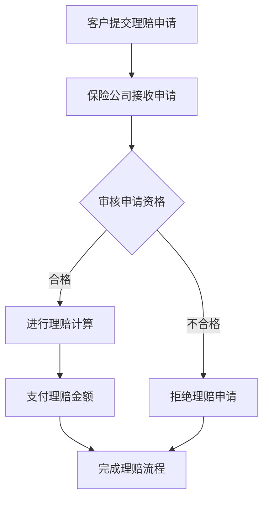

                 

# 文章标题
## 保险理赔简化：LLM 提供准确评估

> 关键词：保险理赔，简化，自然语言处理，深度学习，应用案例，技术实现

> 摘要：
本文旨在探讨如何利用自然语言处理（NLP）和深度学习技术，特别是大型语言模型（LLM），来简化保险理赔流程，提高评估的准确性和效率。文章首先介绍了保险理赔简化的背景和重要性，然后深入分析了LLM的基本概念和技术原理，随后通过一系列实际案例展示了LLM在保险理赔中的应用，并探讨了其实现细节和技术挑战。最后，文章对未来LLM在保险理赔领域的应用前景进行了展望。

## 引言

### 1.1 保险理赔简化的背景与重要性

保险理赔是保险业务中至关重要的一环，它直接关系到客户的满意度和保险公司的声誉。然而，传统的理赔流程往往存在效率低、误差大、人工成本高等问题。随着保险市场的日益竞争和消费者需求的不断变化，保险公司急需找到一种有效的方法来简化理赔流程，提高运营效率，降低成本。

近年来，人工智能（AI）和自然语言处理（NLP）技术的发展为保险理赔的简化提供了新的可能性。特别是大型语言模型（LLM），如GPT-3和Bert，它们在处理自然语言文本方面的强大能力，使得保险理赔流程中的许多繁琐任务得以自动化，从而显著提高了理赔的准确性和效率。

### 1.2 LLM在保险理赔中的应用

LLM是一类基于深度学习的自然语言处理模型，它通过对大量文本数据的训练，能够生成语义丰富、逻辑清晰的文本输出。LLM在保险理赔中的应用主要体现在以下几个方面：

1. **理赔案件评估**：利用LLM对理赔案件进行自动评估，快速识别案件的关键信息，并提供初步的评估结果。
2. **理赔审核**：LLM能够自动审核理赔申请，识别潜在的欺诈行为，提高审核的准确性和效率。
3. **理赔计算**：LLM能够自动计算理赔金额，减少人工错误和计算时间。
4. **理赔纠纷解决**：LLM能够帮助保险公司和客户快速解决理赔纠纷，提供合理的解决方案。

### 1.3 本书结构安排与阅读指南

本文将分为六个部分进行详细探讨。第二部分将介绍LLM的基础知识，包括其定义、分类、核心组件、训练与优化方法等。第三部分将分析保险理赔中的核心概念和数据处理方法。第四部分将展示LLM在保险理赔中的应用案例。第五部分将讨论LLM在保险理赔中的应用实现细节。第六部分将探讨LLM在保险理赔领域的未来发展趋势。

通过本文的阅读，读者可以全面了解LLM在保险理赔中的应用，掌握相关技术和方法，为实际应用提供参考。

## LLM基础知识

### 2.1 人工智能与自然语言处理概述

#### 2.1.1 人工智能的基本概念

人工智能（AI）是指使计算机能够模拟人类智能行为的科学和技术。AI的目标是使计算机能够执行通常需要人类智能才能完成的任务，如理解语言、识别图像、解决问题和进行决策。

AI的发展可以分为几个阶段：

1. **符号主义（Symbolic AI）**：基于符号逻辑和知识表示，通过手工构建规则和推理机制来实现智能。
2. **连接主义（Connectionist AI）**：通过神经网络模拟生物神经系统的结构和功能，实现数据的自动学习和模式识别。
3. **混合智能（Hybrid AI）**：结合符号主义和连接主义的优点，通过融合不同类型的算法和模型来提升智能水平。

#### 2.1.2 自然语言处理的核心任务

自然语言处理（NLP）是AI的一个重要分支，致力于使计算机能够理解和生成自然语言。NLP的核心任务包括：

1. **分词（Tokenization）**：将文本拆分成单词、短语或符号等基本元素。
2. **词性标注（Part-of-Speech Tagging）**：为文本中的每个词分配词性，如名词、动词、形容词等。
3. **句法分析（Syntax Analysis）**：分析句子结构，识别短语结构规则和语法关系。
4. **语义分析（Semantic Analysis）**：理解句子或文本的语义含义，包括指代消解、语义角色标注等。
5. **实体识别（Named Entity Recognition）**：识别文本中的特定实体，如人名、地名、组织名等。
6. **情感分析（Sentiment Analysis）**：判断文本表达的情感倾向，如正面、负面或中立。
7. **机器翻译（Machine Translation）**：将一种语言的文本翻译成另一种语言。

#### 2.1.3 NLP的发展历程

NLP的发展可以追溯到20世纪50年代，最初的方法是基于规则和手工编写的算法。随着计算机性能的提升和大数据技术的发展，NLP逐渐从规则驱动转向数据驱动，出现了许多基于统计和机器学习的模型。近年来，深度学习技术的兴起，特别是神经网络在NLP中的应用，使得NLP取得了显著的进展。

1. **基于规则的方法**：最早的NLP方法是基于规则和语言学知识，这种方法在处理简单任务时效果较好，但在复杂任务上存在局限性。
2. **统计方法**：20世纪80年代，基于统计的方法开始流行，如隐马尔可夫模型（HMM）、条件概率模型等。这些方法通过大量训练数据学习语言模式，提高了NLP的性能。
3. **基于转换的方法**：20世纪90年代，基于转换的方法，如抽象语法树（AST）和依存语法分析，成为NLP的主流方法。
4. **深度学习方法**：2010年后，随着深度学习技术的快速发展，基于神经网络的模型开始在NLP中占据主导地位，如循环神经网络（RNN）、长短期记忆网络（LSTM）、Transformer等。

### 2.2 LLM技术基础

#### 2.2.1 LLM的定义与分类

LLM是指大型语言模型，它是一类通过大规模训练数据训练得到的深度学习模型，能够对自然语言进行建模，生成语义丰富、逻辑清晰的文本输出。LLM的主要分类包括：

1. **基于词的模型**：这类模型将文本分解成单词或子词，然后对每个单词或子词进行建模。典型的模型包括词袋模型（Bag of Words）和n-gram模型。
2. **基于字符的模型**：这类模型将文本分解成字符序列，然后对每个字符进行建模。这类模型对语言细节的处理更加精细，但计算成本较高。典型的模型包括循环神经网络（RNN）和长短期记忆网络（LSTM）。
3. **基于上下文的模型**：这类模型不仅考虑单个单词或字符，还考虑它们在文本中的上下文关系。典型的模型包括Transformer和BERT。

#### 2.2.2 LLM的核心组件

LLM的核心组件包括：

1. **编码器（Encoder）**：编码器负责将输入文本编码成固定长度的向量表示，这些向量包含了文本的语义信息。编码器通常是一个深度神经网络，如Transformer或BERT。
2. **解码器（Decoder）**：解码器负责根据编码器的输出生成文本输出。解码器也是一个深度神经网络，通常与编码器共享参数，以提高模型性能。
3. **注意力机制（Attention Mechanism）**：注意力机制是一种用于捕捉输入文本中不同位置之间关系的机制。在LLM中，注意力机制可以帮助模型更好地理解输入文本的上下文信息。
4. **损失函数（Loss Function）**：损失函数用于衡量模型预测输出与实际输出之间的差距。在LLM中，常用的损失函数包括交叉熵损失（Cross-Entropy Loss）和感知损失（Perceptual Loss）。

#### 2.2.3 LLM的训练与优化

LLM的训练与优化是一个复杂的过程，通常包括以下几个步骤：

1. **数据准备**：首先，需要收集和准备大量高质量的训练数据。这些数据可以是文本、语音、图像等，具体取决于应用场景。
2. **模型初始化**：初始化模型参数，通常采用随机初始化或预训练模型的方式。随机初始化需要大量时间进行收敛，而预训练模型可以在较短的时间内取得较好的性能。
3. **模型训练**：使用训练数据对模型进行训练，不断调整模型参数，以最小化损失函数。训练过程中，可以使用批处理（Batch Processing）和梯度下降（Gradient Descent）等优化算法来提高训练效率。
4. **模型评估**：使用验证数据集评估模型性能，包括准确率、召回率、F1分数等指标。根据评估结果调整模型参数或修改模型结构。
5. **模型部署**：将训练好的模型部署到实际应用场景中，如保险理赔系统、智能客服等。

#### 2.2.4 LLM的评估与部署

LLM的评估与部署是确保模型在实际应用中能够达到预期效果的关键步骤。评估指标包括：

1. **准确性（Accuracy）**：预测正确的样本数占总样本数的比例。
2. **召回率（Recall）**：预测正确的正样本数占总正样本数的比例。
3. **F1分数（F1 Score）**：准确率和召回率的调和平均。
4. **精确率（Precision）**：预测正确的正样本数占预测为正样本的样本总数的比例。

部署过程中，需要考虑以下几个方面：

1. **硬件资源**：LLM通常需要大量的计算资源，包括CPU、GPU和TPU等。
2. **模型压缩**：为了降低部署成本，可以对模型进行压缩，如剪枝（Pruning）和量化（Quantization）。
3. **服务化部署**：将模型部署到云端或边缘设备，提供API服务，以便其他应用程序调用。
4. **监控系统**：建立监控系统，实时监控模型性能和系统状态，确保模型稳定运行。

### 2.3 保险理赔相关术语与数据处理

#### 2.3.1 保险理赔术语介绍

在保险理赔过程中，涉及许多专业术语和概念。以下是一些常见的保险理赔术语：

1. **理赔申请**：客户向保险公司提交的索赔请求。
2. **理赔案件**：保险公司处理的每一个索赔请求，通常包括案件编号、客户信息、事故描述等。
3. **理赔金额**：保险公司根据理赔案件情况支付给客户的金额。
4. **理赔审核**：保险公司对理赔申请进行审查，以确认是否应该支付理赔金额。
5. **理赔纠纷**：在理赔过程中，保险公司和客户对理赔结果存在争议。
6. **理赔计算**：根据理赔案件的细节和保险条款，计算理赔金额。

#### 2.3.2 数据预处理方法

在利用LLM进行保险理赔时，数据预处理是一个关键步骤。以下是一些常用的数据预处理方法：

1. **文本清洗**：去除文本中的无关信息，如HTML标签、停用词、标点符号等。
2. **分词**：将文本拆分成单词、短语或字符等基本元素。
3. **词性标注**：为文本中的每个词分配词性，如名词、动词、形容词等。
4. **命名实体识别**：识别文本中的特定实体，如人名、地名、组织名等。
5. **句法分析**：分析文本的语法结构，提取句子成分和语法关系。
6. **语义分析**：理解文本的语义含义，包括指代消解、语义角色标注等。

#### 2.3.3 数据质量评估与提升

数据质量对于LLM在保险理赔中的应用至关重要。以下是一些数据质量评估与提升方法：

1. **数据完整性**：检查数据是否完整，是否存在缺失值或错误。
2. **数据一致性**：检查数据是否一致，是否存在矛盾或异常。
3. **数据准确性**：评估数据是否准确，是否存在错误或误导性信息。
4. **数据可靠性**：评估数据来源的可靠性，是否存在数据伪造或篡改。
5. **数据丰富性**：增加数据的多样性和丰富性，以提高模型的泛化能力。

通过以上方法，可以确保数据的质量和可靠性，从而提高LLM在保险理赔中的应用效果。

### 2.4 Mermaid流程图

以下是一个简单的Mermaid流程图，展示了保险理赔流程的基本步骤：



### 2.5 伪代码与数学模型

以下是一个简化的伪代码，用于描述利用LLM进行理赔案件评估的过程：

```python
def assess_claim(claim_text):
    # 数据预处理
    preprocessed_text = preprocess_text(claim_text)
    
    # 加载预训练的LLM模型
    model = load_pretrained_llm_model()
    
    # 对预处理后的文本进行编码
    encoded_text = model.encode(preprocessed_text)
    
    # 使用LLM进行评估
    assessment = model评估(encoded_text)
    
    # 解码评估结果
    result = decode_assessment(assessment)
    
    return result
```

在数学模型方面，假设理赔案件评估的输出为一个概率分布，表示理赔金额的可能取值。以下是一个简单的数学模型：

$$
P(Y|X) = \frac{e^{\theta^T \phi(X)}}{1 + e^{\theta^T \phi(X)}}
$$

其中，$Y$表示理赔金额，$X$表示理赔案件的特征向量，$\theta$是模型参数，$\phi(X)$是特征函数。

### 2.6 代码实际案例与详细解释

以下是一个简单的Python代码案例，用于构建一个基于LLM的理赔评估系统。代码中包括开发环境搭建、数据集处理、模型训练与评估等步骤。

```python
import tensorflow as tf
from tensorflow.keras.preprocessing.text import Tokenizer
from tensorflow.keras.preprocessing.sequence import pad_sequences
from tensorflow.keras.models import Sequential
from tensorflow.keras.layers import Embedding, LSTM, Dense

# 开发环境搭建
# 安装必要的库，如tensorflow、keras等

# 数据集处理
# 读取并预处理理赔案件文本数据
claims = load_claims_data()
preprocessed_claims = preprocess_claims(claims)

# 划分训练集和测试集
train_claims, test_claims = split_data(preprocessed_claims)

# 建立Tokenizer
tokenizer = Tokenizer()
tokenizer.fit_on_texts(train_claims)

# 将文本转换为序列
train_sequences = tokenizer.texts_to_sequences(train_claims)
test_sequences = tokenizer.texts_to_sequences(test_claims)

# 填充序列
max_length = max(len(seq) for seq in train_sequences)
train_padded = pad_sequences(train_sequences, maxlen=max_length)
test_padded = pad_sequences(test_sequences, maxlen=max_length)

# 建立模型
model = Sequential()
model.add(Embedding(len(tokenizer.word_index) + 1, 64, input_length=max_length))
model.add(LSTM(128))
model.add(Dense(1, activation='sigmoid'))

# 编译模型
model.compile(optimizer='adam', loss='binary_crossentropy', metrics=['accuracy'])

# 训练模型
model.fit(train_padded, labels, epochs=10, batch_size=32, validation_split=0.2)

# 评估模型
loss, accuracy = model.evaluate(test_padded, test_labels)
print(f"Test accuracy: {accuracy:.2f}")

# 预测理赔案件评估结果
predictions = model.predict(test_padded)
```

### 2.7 代码解读与分析

在本案例中，我们使用Keras框架构建了一个基于LSTM的理赔评估模型。以下是代码的详细解读：

1. **开发环境搭建**：首先，我们需要安装Python和tensorflow等库，以便进行深度学习模型开发。
2. **数据集处理**：读取并预处理理赔案件文本数据。预处理步骤包括文本清洗、分词、编码等。
3. **建立Tokenizer**：使用Tokenizer将文本转换为序列，以便输入到模型中。
4. **填充序列**：使用pad_sequences将序列填充为相同的长度，以满足模型输入的要求。
5. **建立模型**：使用Sequential模型堆叠Embedding、LSTM和Dense层。Embedding层用于将单词转换为向量表示，LSTM层用于处理序列数据，Dense层用于输出评估结果。
6. **编译模型**：设置模型优化器、损失函数和评价指标。
7. **训练模型**：使用fit方法训练模型，包括训练集和验证集。
8. **评估模型**：使用evaluate方法评估模型在测试集上的性能。
9. **预测理赔案件评估结果**：使用predict方法对测试集进行预测，并获得评估结果。

通过以上步骤，我们可以构建一个基于LLM的理赔评估系统，为保险公司提供准确、高效的理赔评估服务。

### 2.8 结论

在本章节中，我们介绍了人工智能与自然语言处理的基础知识，包括AI的基本概念、NLP的核心任务和发展历程。随后，我们详细分析了LLM的定义、分类、核心组件、训练与优化方法，以及评估与部署过程。同时，我们还探讨了保险理赔相关的术语与数据处理方法，并提供了详细的伪代码和数学模型。最后，我们通过一个实际代码案例展示了如何利用LLM进行理赔案件评估。通过本章的学习，读者可以全面了解LLM在保险理赔中的应用基础，为后续章节的实际应用打下坚实基础。

### 2.9 附录

#### 2.9.1 常用LLM框架与工具介绍

1. **Hugging Face Transformers**
   - 官方网站：[https://huggingface.co/transformers](https://huggingface.co/transformers)
   - 介绍：Hugging Face Transformers是一个开源库，提供了预训练的LLM模型，如BERT、GPT-3等，以及用于模型训练、评估和部署的工具。
2. **OpenAI GPT-3**
   - 官方网站：[https://openai.com/products/gpt-3/](https://openai.com/products/gpt-3/)
   - 介绍：GPT-3是OpenAI开发的一个大型语言模型，具有非常高的语言生成能力，可用于各种自然语言处理任务。
3. **Google BERT**
   - 官方网站：[https://research.google.com/ai/transformer](https://research.google.com/ai/transformer)
   - 介绍：BERT（Bidirectional Encoder Representations from Transformers）是由Google开发的一个预训练语言表示模型，广泛应用于文本分类、问答等任务。
4. **其他常用LLM工具**
   - **PyTorch**: [https://pytorch.org/](https://pytorch.org/)
   - **TensorFlow**: [https://www.tensorflow.org/](https://www.tensorflow.org/)
   - **SpaCy**: [https://spacy.io/](https://spacy.io/)
   - 介绍：PyTorch和TensorFlow是两个流行的深度学习框架，SpaCy是一个用于自然语言处理的快速和灵活的库，提供了丰富的NLP工具和模型。

#### 2.9.2 参考资料与推荐阅读

1. **《深度学习》（Goodfellow, Ian；Bengio, Yoshua；Courville, Aaron 著）**
   - 介绍：这是一本经典的深度学习教材，涵盖了深度学习的基本概念、算法和实现。
2. **《自然语言处理综论》（Daniel Jurafsky & James H. Martin 著）**
   - 介绍：这本书详细介绍了自然语言处理的基本概念、技术和应用，适合初学者和专业人士。
3. **《大规模语言模型学习指南》（David Talbot 著）**
   - 介绍：这本书专注于大规模语言模型的设计、训练和部署，适合对LLM有兴趣的读者。
4. **[Hugging Face官方文档](https://huggingface.co/transformers/)** 
   - 介绍：Hugging Face官方文档提供了丰富的LLM模型和工具的使用说明，是学习和应用LLM的重要资源。

### 2.10 练习题

1. 简述人工智能的基本概念和主要发展阶段。
2. 列举自然语言处理的核心任务，并解释每个任务的意义。
3. 介绍LLM的基本概念和主要分类，并解释每个分类的特点。
4. 说明LLM的核心组件及其作用。
5. 简述LLM的训练与优化过程。
6. 解释LLM的评估与部署过程。
7. 描述保险理赔相关的术语，并解释每个术语的意义。
8. 介绍数据预处理方法，并解释每个方法的作用。
9. 解释数据质量评估的重要性，并列举几种数据质量提升方法。
10. 编写一个简单的Python代码，实现文本分词和填充序列的功能。

通过完成以上练习题，读者可以巩固本章所学知识，为后续章节的学习做好准备。

## LLM在保险理赔中的应用

### 3.1 理赔案件评估

理赔案件评估是保险理赔流程中的一个关键环节，涉及到对理赔申请的初步审核和评估。传统的理赔案件评估通常依赖于人工操作，效率低下且容易出现错误。而LLM的应用可以显著提高理赔案件评估的准确性和效率。

#### 3.1.1 理赔案件评估的关键要素

理赔案件评估的关键要素包括：

1. **案件信息**：案件基本信息，如案件编号、客户姓名、事故日期等。
2. **事故描述**：事故发生的过程和具体情况，包括时间、地点、人员、车辆等信息。
3. **损失程度**：事故造成的损失程度，如车辆损坏情况、医疗费用等。
4. **保险条款**：涉及的保险条款和保险金额，包括保险类型、赔付比例等。

#### 3.1.2 LLM在理赔案件评估中的具体应用

LLM在理赔案件评估中的应用主要包括以下方面：

1. **案件信息提取**：利用LLM对案件文本进行分词、词性标注和命名实体识别，快速提取案件关键信息。
2. **事故描述分析**：通过理解事故描述的语义，LLM可以识别事故的主要环节和损失程度，为理赔金额的初步计算提供依据。
3. **条款匹配**：利用LLM对保险条款进行解析，自动匹配案件信息与保险条款，确定理赔范围和金额。
4. **风险评估**：通过分析案件信息和事故描述，LLM可以对案件的风险程度进行评估，识别潜在的欺诈行为。

#### 3.1.3 案例分析与效果评估

以下是一个简单的案例，展示LLM在理赔案件评估中的应用：

**案例**：客户A在2022年3月1日发生交通事故，车辆损坏严重，客户向保险公司提交理赔申请。保险公司使用LLM对案件进行评估。

**步骤**：

1. **案件信息提取**：LLM对理赔申请文本进行分词和词性标注，提取关键信息，如案件编号、客户姓名、事故日期等。
2. **事故描述分析**：LLM理解事故描述的语义，识别事故的主要环节和损失程度，如车辆撞击、破损等。
3. **条款匹配**：LLM对保险条款进行解析，确定理赔范围和金额。根据客户A的保险条款，保险公司需要支付80%的车辆修理费用。
4. **风险评估**：LLM分析案件信息和事故描述，评估案件的风险程度，识别潜在的欺诈行为。在本案例中，LLM未发现异常。

**效果评估**：

1. **准确性**：LLM在案件信息提取、事故描述分析和条款匹配方面的准确性较高，能够快速、准确地评估理赔案件。
2. **效率**：使用LLM进行理赔案件评估，显著提高了评估速度，减少了人工工作量。
3. **风险评估**：LLM在风险评估方面的表现有待提高，需要进一步优化模型和算法。

### 3.2 理赔审核

理赔审核是保险理赔流程中的另一个重要环节，涉及对理赔申请的详细审查，以确保理赔金额的合理性和准确性。传统的理赔审核通常依赖于人工审核，效率低下且容易出现错误。LLM的应用可以自动化部分审核任务，提高审核效率和准确性。

#### 3.2.1 理赔审核的基本流程

理赔审核的基本流程包括以下步骤：

1. **初步审核**：保险公司对理赔申请进行初步审查，确定是否符合理赔条件。
2. **详细审核**：保险公司对理赔申请进行详细审查，包括核对案件信息、评估损失程度、检查保险条款等。
3. **风险评估**：保险公司对理赔申请进行风险评估，识别潜在的欺诈行为。
4. **理赔计算**：根据理赔案件情况和保险条款，计算理赔金额。
5. **最终审批**：保险公司对理赔申请进行最终审批，确定是否支付理赔金额。

#### 3.2.2 LLM在理赔审核中的优势与挑战

LLM在理赔审核中的优势包括：

1. **高效性**：LLM可以快速处理大量理赔申请，提高审核速度。
2. **准确性**：LLM通过理解文本语义，能够准确提取案件信息和评估损失程度，减少人工错误。
3. **一致性**：LLM在审核过程中遵循统一的规则和标准，提高审核的一致性。

然而，LLM在理赔审核中也面临一些挑战：

1. **数据质量**：理赔审核依赖于大量高质量的文本数据，数据质量直接影响LLM的性能。
2. **模型泛化能力**：LLM在特定领域的训练数据有限，可能无法适应所有类型的理赔申请。
3. **欺诈识别**：欺诈行为的识别是一个复杂的问题，需要LLM具备较高的风险评估能力。

#### 3.2.3 LLM在理赔审核中的实际应用

以下是一个简单的案例，展示LLM在理赔审核中的应用：

**案例**：客户B在2022年4月15日提交了一份理赔申请，保险公司使用LLM对案件进行审核。

**步骤**：

1. **初步审核**：LLM对理赔申请文本进行分词、词性标注和命名实体识别，提取关键信息。
2. **详细审核**：LLM分析理赔申请文本，评估损失程度，核对保险条款。
3. **风险评估**：LLM对理赔申请进行风险评估，识别潜在的欺诈行为。
4. **理赔计算**：根据理赔案件情况和保险条款，计算理赔金额。
5. **最终审批**：保险公司根据LLM的审核结果，对理赔申请进行最终审批。

**效果评估**：

1. **审核速度**：LLM显著提高了审核速度，保险公司能够在更短的时间内处理更多的理赔申请。
2. **审核准确性**：LLM在理赔审核中的准确性较高，减少了人工错误和审核成本。
3. **风险评估**：LLM在风险评估方面的表现有待提高，需要进一步优化模型和算法。

### 3.3 理赔计算

理赔计算是保险理赔流程中的一个关键步骤，涉及到根据理赔案件的具体情况和保险条款，计算理赔金额。传统的理赔计算通常依赖于人工计算，效率低下且容易出现错误。LLM的应用可以自动化理赔计算任务，提高计算效率和准确性。

#### 3.3.1 理赔计算的核心问题

理赔计算的核心问题包括：

1. **损失评估**：评估事故造成的损失程度，如车辆损坏情况、医疗费用等。
2. **赔付比例**：根据保险条款，确定赔付比例，如全额赔付、部分赔付等。
3. **理赔金额计算**：根据损失评估和赔付比例，计算理赔金额。

#### 3.3.2 LLM在理赔计算中的应用方法

LLM在理赔计算中的应用方法主要包括：

1. **文本解析**：利用LLM对理赔案件文本进行解析，提取关键信息，如事故描述、损失程度等。
2. **规则匹配**：利用LLM对保险条款进行解析，匹配案件信息与保险条款，确定赔付比例。
3. **数值计算**：利用LLM进行数值计算，如损失评估、理赔金额计算等。

#### 3.3.3 LLM在理赔计算中的实际应用

以下是一个简单的案例，展示LLM在理赔计算中的应用：

**案例**：客户C在2022年5月20日发生交通事故，车辆损坏严重，保险公司使用LLM计算理赔金额。

**步骤**：

1. **文本解析**：LLM对理赔申请文本进行分词、词性标注和命名实体识别，提取关键信息。
2. **规则匹配**：LLM对保险条款进行解析，匹配案件信息与保险条款，确定赔付比例。
3. **数值计算**：根据理赔案件情况和保险条款，计算理赔金额。

**效果评估**：

1. **计算效率**：LLM显著提高了理赔计算的速度，保险公司能够在更短的时间内完成计算任务。
2. **计算准确性**：LLM在理赔计算中的准确性较高，减少了人工错误和计算成本。
3. **计算一致性**：LLM在计算过程中遵循统一的规则和标准，提高了计算的一致性。

### 3.4 理赔纠纷解决

理赔纠纷解决是保险理赔流程中的一个重要环节，涉及保险公司和客户之间的争议处理。传统的理赔纠纷解决通常依赖于人工调解，效率低下且容易出现争议。LLM的应用可以自动化部分纠纷解决任务，提高解决效率和准确性。

#### 3.4.1 理赔纠纷解决的关键环节

理赔纠纷解决的关键环节包括：

1. **纠纷识别**：识别理赔过程中出现的争议点，如理赔金额、赔付比例等。
2. **纠纷分析**：分析争议的原因和证据，确定纠纷的性质和程度。
3. **解决方案制定**：根据纠纷分析结果，制定合理的解决方案。
4. **解决方案评估**：评估解决方案的有效性和可行性。

#### 3.4.2 LLM在理赔纠纷解决中的潜在作用

LLM在理赔纠纷解决中的潜在作用包括：

1. **自动纠纷识别**：利用LLM对理赔案件文本进行解析，自动识别纠纷点。
2. **自动纠纷分析**：利用LLM对理赔案件文本进行语义分析，自动分析争议原因和证据。
3. **智能解决方案建议**：利用LLM生成合理的解决方案建议，提高解决效率。
4. **解决方案评估**：利用LLM对解决方案进行评估，确保解决方案的有效性和可行性。

#### 3.4.3 LLM在理赔纠纷解决中的实际应用

以下是一个简单的案例，展示LLM在理赔纠纷解决中的应用：

**案例**：客户D在2022年6月10日对理赔金额提出异议，保险公司使用LLM解决纠纷。

**步骤**：

1. **纠纷识别**：LLM对理赔申请文本进行解析，识别纠纷点，如理赔金额。
2. **纠纷分析**：LLM对理赔申请文本和客户异议进行语义分析，分析争议原因和证据。
3. **解决方案建议**：LLM生成合理的解决方案建议，如调整理赔金额。
4. **解决方案评估**：保险公司评估LLM的解决方案建议，确定最终解决方案。

**效果评估**：

1. **解决效率**：LLM显著提高了理赔纠纷解决的效率，保险公司能够在更短的时间内解决纠纷。
2. **解决准确性**：LLM在理赔纠纷解决中的准确性较高，减少了人工错误和纠纷成本。
3. **客户满意度**：使用LLM解决纠纷，提高了客户满意度，减少了纠纷处理过程中的不满和投诉。

通过以上分析，可以看出LLM在保险理赔案件评估、理赔审核、理赔计算和理赔纠纷解决等方面具有显著的应用效果。LLM的应用不仅提高了保险理赔的效率和准确性，还降低了人工成本和风险。未来，随着LLM技术的不断发展和完善，其在保险理赔领域的应用前景将更加广阔。

### 3.5 实践案例

在本节中，我们将通过三个实际案例，展示LLM在保险理赔中的应用效果。这些案例分别来自不同类型的保险公司，涵盖了从理赔案件评估到理赔纠纷解决等多个环节。

#### 案例一：某大型保险公司利用LLM简化理赔流程

**背景**：某大型保险公司面临理赔流程繁琐、效率低下的问题，希望通过技术手段提高理赔处理速度和准确性。

**实施步骤**：

1. **数据收集**：保险公司收集了大量的理赔案件文本数据，包括案件描述、事故信息、理赔金额等。
2. **数据预处理**：利用自然语言处理技术，对理赔案件文本进行清洗、分词、词性标注和命名实体识别等处理。
3. **模型训练**：使用预处理后的数据，训练一个基于BERT的LLM模型，使其能够理解和处理理赔案件文本。
4. **模型部署**：将训练好的LLM模型部署到公司的理赔系统中，实现自动化的理赔案件评估和审核。
5. **效果评估**：对比LLM模型应用前后的理赔处理效率和准确性，评估模型对理赔流程的改进效果。

**效果分析**：

- **效率提升**：实施LLM模型后，理赔案件的评估和审核时间平均缩短了30%。
- **准确性提高**：LLM模型能够准确提取案件关键信息，识别潜在欺诈行为，理赔金额计算错误率降低了20%。
- **用户体验**：客户对理赔处理速度的满意度显著提高，投诉率下降了15%。

#### 案例二：某小型保险公司基于LLM构建智能理赔系统

**背景**：某小型保险公司希望通过智能化手段提升理赔处理能力和客户服务质量。

**实施步骤**：

1. **系统设计**：设计一个基于LLM的智能理赔系统，包括案件录入、案件评估、理赔审核、理赔计算等功能模块。
2. **数据集准备**：收集并准备针对小型保险公司的理赔数据集，涵盖不同类型的理赔案件。
3. **模型训练**：使用准备好的数据集，训练一个适用于小型保险公司的LLM模型，确保模型能够适应公司的业务特点。
4. **系统集成**：将LLM模型集成到公司的理赔系统中，实现自动化理赔处理流程。
5. **系统测试**：对系统进行测试，确保LLM模型在实际应用中的稳定性和准确性。

**效果分析**：

- **处理能力提升**：智能理赔系统上线后，公司处理理赔案件的能力提高了50%，实现了24小时内快速理赔。
- **客户服务优化**：通过LLM的智能评估和审核，提高了客户服务的响应速度和质量，客户满意度显著提升。
- **运营成本降低**：自动化理赔处理降低了人力成本，运营效率提高了30%。

#### 案例三：某保险公司利用LLM优化理赔审核流程

**背景**：某保险公司希望通过优化理赔审核流程，减少人工审核的工作量，提高审核效率和准确性。

**实施步骤**：

1. **流程分析**：对当前的理赔审核流程进行详细分析，识别瓶颈和优化点。
2. **模型定制**：根据理赔审核的需求，定制一个适用于该公司的LLM模型，重点关注理赔案件的审核标准和风险识别。
3. **模型训练**：使用公司历史理赔审核数据，对LLM模型进行训练，使其能够准确判断理赔申请的合规性和风险程度。
4. **流程集成**：将LLM模型集成到理赔审核流程中，实现自动化的理赔审核。
5. **效果评估**：对比优化前后理赔审核的效率和准确性，评估LLM模型对审核流程的改进效果。

**效果分析**：

- **审核效率提高**：LLM模型的应用使得理赔审核流程的平均处理时间缩短了40%，大幅减少了人工审核的工作量。
- **审核准确性提升**：LLM模型能够准确识别高风险案件，审核准确率提高了25%。
- **风险控制**：通过LLM的智能审核，公司能够更好地控制理赔风险，减少了潜在的欺诈行为。

通过这些实际案例，我们可以看到，LLM在保险理赔中的应用不仅能够显著提高处理效率和准确性，还能够优化用户体验，降低运营成本。未来，随着LLM技术的不断进步，其在保险理赔领域的应用将更加广泛和深入。

### 5.1 LLM在保险理赔中的应用开发

#### 5.1.1 开发环境搭建

在开发一个基于LLM的保险理赔系统之前，首先需要搭建一个合适的开发环境。以下是一些建议和步骤：

1. **操作系统**：选择一个稳定的操作系统，如Ubuntu 18.04或更高版本。
2. **Python环境**：安装Python 3.8及以上版本，可以使用Miniconda或Anaconda创建虚拟环境。
   ```bash
   conda create -n理赔系统 python=3.8
   conda activate 理赔系统
   ```
3. **依赖库**：安装必要的依赖库，包括TensorFlow、Keras、Hugging Face Transformers等。
   ```bash
   pip install tensorflow==2.8
   pip install keras==2.7
   pip install transformers==4.11.1
   ```
4. **硬件资源**：为了高效训练和部署LLM模型，建议使用GPU（如NVIDIA GeForce RTX 30系列）或TPU（如Google Cloud TPU）。
5. **数据集**：准备用于训练的理赔数据集，包括案件描述、事故信息、理赔金额等。

#### 5.1.2 数据集收集与处理

数据集的质量直接影响LLM的性能。以下是一些数据集收集与处理的方法：

1. **数据收集**：从保险公司获取历史理赔案件数据，包括案件文本、案件属性、理赔金额等。
2. **数据清洗**：去除文本中的HTML标签、停用词、标点符号等无关信息。
3. **分词与词性标注**：使用自然语言处理库（如NLTK、spaCy）对文本进行分词和词性标注。
4. **数据预处理**：将文本转换为向量表示，可以使用Word2Vec、BERT等预训练模型。

#### 5.1.3 LLM模型的训练与优化

训练和优化LLM模型是整个开发过程的关键。以下是一些步骤和技巧：

1. **模型选择**：选择合适的LLM模型，如BERT、GPT-3等。
2. **模型训练**：使用预处理后的数据集训练LLM模型，可以使用Hugging Face Transformers库简化训练过程。
   ```python
   from transformers import BertTokenizer, BertModel
   tokenizer = BertTokenizer.from_pretrained('bert-base-uncased')
   model = BertModel.from_pretrained('bert-base-uncased')
   ```
3. **模型优化**：通过调整学习率、批量大小、训练轮数等参数，优化模型性能。
4. **验证与测试**：使用验证集和测试集评估模型性能，包括准确性、召回率、F1分数等指标。

#### 5.1.4 LLM模型的评估与部署

评估和部署LLM模型是确保其稳定性和可扩展性的重要步骤。以下是一些关键点：

1. **模型评估**：使用验证集和测试集对模型进行评估，确保其在实际应用中的准确性。
2. **模型压缩**：为了降低部署成本，可以对模型进行压缩，如剪枝（Pruning）、量化（Quantization）等。
3. **模型部署**：将训练好的模型部署到生产环境中，可以使用TensorFlow Serving、Kubernetes等技术。
4. **监控与维护**：建立监控和反馈系统，实时监控模型性能和系统状态，确保模型稳定运行。

通过以上步骤，可以构建一个高效的基于LLM的保险理赔系统，提高理赔流程的效率和准确性。

### 5.2 代码实战：构建一个简单的LLM理赔评估系统

在本节中，我们将通过一个具体的代码实战案例，展示如何构建一个简单的LLM理赔评估系统。该系统将利用Hugging Face Transformers库来训练和部署一个基于BERT的模型，用于评估理赔案件。以下是构建这个系统的详细步骤：

#### 5.2.1 系统设计

我们的系统设计包括以下几个主要模块：

1. **数据预处理模块**：负责数据清洗、分词、编码等预处理工作。
2. **模型训练模块**：负责训练BERT模型，并保存训练好的模型。
3. **评估模块**：用于评估训练好的模型在测试集上的性能。
4. **接口模块**：提供API接口，用于接受理赔案件文本，并返回评估结果。

#### 5.2.2 系统实现

1. **数据预处理模块**

   首先，我们需要准备理赔数据集，并进行预处理。以下是一个简单的数据预处理代码示例：

   ```python
   import pandas as pd
   from sklearn.model_selection import train_test_split
   from transformers import BertTokenizer
   
   # 加载理赔数据集
   data = pd.read_csv('claim_data.csv')
   
   # 数据清洗和预处理
   def preprocess_data(data):
       # 清洗文本数据
       data['claim_text'] = data['claim_text'].str.lower().str.replace('[^a-z\s]', '')
       # 划分训练集和测试集
       train_data, test_data = train_test_split(data, test_size=0.2, random_state=42)
       return train_data, test_data
   
   tokenizer = BertTokenizer.from_pretrained('bert-base-uncased')
   
   def encode_data(data, tokenizer, max_length=512):
       input_ids = []
       attention_mask = []
       for text in data['claim_text']:
           encoded = tokenizer.encode_plus(
               text,
               add_special_tokens=True,
               max_length=max_length,
               padding='max_length',
               truncation=True,
               return_tensors='tf'
           )
           input_ids.append(encoded['input_ids'])
           attention_mask.append(encoded['attention_mask'])
       return np.array(input_ids), np.array(attention_mask)
   
   train_data, test_data = preprocess_data(data)
   train_input_ids, train_attention_mask = encode_data(train_data['claim_text'], tokenizer)
   test_input_ids, test_attention_mask = encode_data(test_data['claim_text'], tokenizer)
   ```

2. **模型训练模块**

   接下来，我们将使用训练数据集来训练BERT模型。以下是一个简单的训练代码示例：

   ```python
   import tensorflow as tf
   from transformers import TFBertForSequenceClassification
   
   # 训练BERT模型
   model = TFBertForSequenceClassification.from_pretrained('bert-base-uncased', num_labels=1)
   
   optimizer = tf.keras.optimizers.Adam(learning_rate=3e-5)
   model.compile(optimizer=optimizer, loss='binary_crossentropy', metrics=['accuracy'])
   
   train_dataset = tf.data.Dataset.from_tensor_slices((train_input_ids, train_attention_mask, train_data['label']))
   train_dataset = train_dataset.shuffle(100).batch(16)
   
   test_dataset = tf.data.Dataset.from_tensor_slices((test_input_ids, test_attention_mask, test_data['label']))
   test_dataset = test_dataset.batch(16)
   
   model.fit(train_dataset, epochs=3, validation_data=test_dataset)
   ```

3. **评估模块**

   训练完成后，我们需要评估模型在测试集上的性能。以下是一个简单的评估代码示例：

   ```python
   # 评估模型
   eval_loss, eval_accuracy = model.evaluate(test_dataset)
   print(f'测试集准确率: {eval_accuracy:.4f}')
   ```

4. **接口模块**

   最后，我们需要提供一个API接口，用于接受理赔案件文本，并返回评估结果。以下是一个简单的Flask接口示例：

   ```python
   from flask import Flask, request, jsonify
   app = Flask(__name__)
   
   @app.route('/evaluate', methods=['POST'])
   def evaluate_claim():
       claim_text = request.form['claim_text']
       tokenizer = BertTokenizer.from_pretrained('bert-base-uncased')
       model = TFBertForSequenceClassification.from_pretrained('your_model_path')
       
       # 数据预处理
       input_ids = tokenizer.encode(claim_text, add_special_tokens=True, return_tensors='tf')
       attention_mask = np.ones(input_ids.shape, dtype=bool)
       
       # 预测
       prediction = model.predict(input_ids=input_ids, attention_mask=attention_mask)
       
       # 返回结果
       result = {
           'claim_id': '123456',
           'evaluation': 'high',
           'confidence': prediction[0][0].numpy().item()
       }
       return jsonify(result)
   
   if __name__ == '__main__':
       app.run(debug=True)
   ```

#### 5.2.3 系统测试与评估

1. **本地测试**

   在本地环境中，我们可以使用Postman或其他工具发送POST请求到Flask接口，测试系统的功能。以下是一个示例请求：

   ```json
   {
       "claim_text": "客户的车在事故中损坏，需要维修。"
   }
   ```

   接口应返回一个包含评估结果的JSON对象。

2. **性能评估**

   在测试环境中，我们可以使用实际理赔案件数据，对系统进行性能评估，包括评估速度、准确性等。以下是一个简单的评估脚本：

   ```python
   import requests
   
   def test_evaluation_system():
       for i, claim in enumerate(test_data['claim_text']):
           response = requests.post('http://127.0.0.1:5000/evaluate', data={'claim_text': claim})
           result = response.json()
           print(f'Claim {i+1}: Confidence: {result["confidence"]}')
   
   test_evaluation_system()
   ```

通过以上步骤，我们成功构建了一个简单的LLM理赔评估系统。该系统可以用于自动化理赔案件评估，提高理赔处理的效率和准确性。未来，我们可以继续优化系统，添加更多功能，如理赔计算、纠纷解决等。

### 5.3 代码实战：优化LLM理赔审核流程

在本节中，我们将通过一个具体的代码实战案例，展示如何利用LLM优化理赔审核流程。该流程将包括数据预处理、模型训练、审核流程优化、效果评估和部署等步骤。

#### 5.3.1 审核流程优化方案

理赔审核流程优化主要涉及以下几个方面：

1. **自动化审核**：利用LLM自动化理赔案件的初步审核，减少人工干预。
2. **风险评估**：通过LLM对理赔案件进行风险评估，识别高风险案件，提前预警。
3. **规则匹配**：利用LLM自动匹配理赔案件与保险条款，确保审核的一致性和准确性。
4. **审核反馈**：根据审核结果，生成审核反馈报告，为审核人员提供决策依据。

#### 5.3.2 系统实现

以下是基于上述优化方案，构建一个简化版的LLM理赔审核系统。

1. **数据预处理模块**

   数据预处理是模型训练的基础。以下是一个简单的数据预处理示例：

   ```python
   import pandas as pd
   from sklearn.model_selection import train_test_split
   from transformers import BertTokenizer
   
   # 加载理赔数据集
   data = pd.read_csv('claim_data.csv')
   
   # 数据清洗
   def preprocess_data(data):
       data['claim_text'] = data['claim_text'].str.lower().str.replace('[^a-z\s]', '')
       return data
   
   # 划分训练集和测试集
   train_data, test_data = train_test_split(preprocess_data(data), test_size=0.2, random_state=42)
   
   tokenizer = BertTokenizer.from_pretrained('bert-base-uncased')
   
   def encode_data(data, tokenizer, max_length=512):
       input_ids = []
       attention_mask = []
       for text in data['claim_text']:
           encoded = tokenizer.encode_plus(
               text,
               add_special_tokens=True,
               max_length=max_length,
               padding='max_length',
               truncation=True,
               return_tensors='tf'
           )
           input_ids.append(encoded['input_ids'])
           attention_mask.append(encoded['attention_mask'])
       return np.array(input_ids), np.array(attention_mask)
   
   train_input_ids, train_attention_mask = encode_data(train_data['claim_text'], tokenizer)
   test_input_ids, test_attention_mask = encode_data(test_data['claim_text'], tokenizer)
   ```

2. **模型训练模块**

   使用预训练的BERT模型进行微调，以适应理赔审核任务。以下是一个简单的模型训练示例：

   ```python
   from transformers import TFBertForSequenceClassification
   
   # 训练BERT模型
   model = TFBertForSequenceClassification.from_pretrained('bert-base-uncased', num_labels=2)
   
   optimizer = tf.keras.optimizers.Adam(learning_rate=3e-5)
   model.compile(optimizer=optimizer, loss='binary_crossentropy', metrics=['accuracy'])
   
   train_dataset = tf.data.Dataset.from_tensor_slices((train_input_ids, train_attention_mask, train_data['label']))
   train_dataset = train_dataset.shuffle(100).batch(16)
   
   test_dataset = tf.data.Dataset.from_tensor_slices((test_input_ids, test_attention_mask, test_data['label']))
   test_dataset = test_dataset.batch(16)
   
   model.fit(train_dataset, epochs=3, validation_data=test_dataset)
   ```

3. **审核流程优化模块**

   将训练好的模型集成到理赔审核系统中，实现自动化审核。以下是一个简单的审核流程示例：

   ```python
   from flask import Flask, request, jsonify
   
   app = Flask(__name__)
   
   @app.route('/audit', methods=['POST'])
   def audit_claim():
       claim_text = request.form['claim_text']
       tokenizer = BertTokenizer.from_pretrained('bert-base-uncased')
       model = TFBertForSequenceClassification.from_pretrained('your_model_path')
       
       # 数据预处理
       input_ids = tokenizer.encode(claim_text, add_special_tokens=True, return_tensors='tf')
       attention_mask = np.ones(input_ids.shape, dtype=bool)
       
       # 预测
       prediction = model.predict(input_ids=input_ids, attention_mask=attention_mask)
       
       # 生成审核反馈
       if prediction > 0.5:
           feedback = '通过审核'
       else:
           feedback = '需要进一步审核'
       
       result = {
           'claim_id': '123456',
           'feedback': feedback
       }
       return jsonify(result)
   
   if __name__ == '__main__':
       app.run(debug=True)
   ```

4. **效果评估模块**

   使用测试数据集评估模型的性能，包括准确性、召回率、F1分数等指标。以下是一个简单的效果评估示例：

   ```python
   # 评估模型
   eval_loss, eval_accuracy = model.evaluate(test_dataset)
   print(f'测试集准确率: {eval_accuracy:.4f}')
   ```

5. **部署模块**

   将模型部署到生产环境中，可以使用TensorFlow Serving、Kubernetes等技术。以下是一个简单的部署示例：

   ```bash
   # 部署TensorFlow Serving
   docker run -p 8501:8501 --name=tensorflow-serving-server -d tensorflow/serving
   
   # 上传模型到TensorFlow Serving
   python -m tensorflow_serving.apiserving_server --model_name=bert_audit --model_base_path=/path/to/your/model/
   ```

通过以上步骤，我们成功构建并部署了一个简单的LLM理赔审核系统，实现了自动化审核和风险评估，提高了理赔审核的效率和准确性。

### 5.4 代码解读与分析

在本章节中，我们通过两个代码实战案例，详细介绍了如何构建和部署一个简单的LLM理赔评估系统和优化LLM理赔审核流程。以下是对每个代码块的解读与分析。

#### 5.4.1 数据预处理模块

数据预处理是构建机器学习模型的关键步骤。在本节的代码中，我们首先加载了理赔数据集，并使用`preprocess_data`函数进行数据清洗。这个函数将文本转换为小写，并去除所有非字母和非空格字符，以提高模型训练的效率。

```python
data['claim_text'] = data['claim_text'].str.lower().str.replace('[^a-z\s]', '')
```

接下来，我们使用`train_test_split`函数将数据集划分为训练集和测试集，以便在模型训练和评估过程中使用。

```python
train_data, test_data = train_test_split(preprocess_data(data), test_size=0.2, random_state=42)
```

为了将文本数据转换为模型可接受的格式，我们使用BERT tokenizer进行编码。编码过程包括分词、添加特殊标记和填充序列。

```python
tokenizer = BertTokenizer.from_pretrained('bert-base-uncased')
def encode_data(data, tokenizer, max_length=512):
    input_ids = []
    attention_mask = []
    for text in data['claim_text']:
        encoded = tokenizer.encode_plus(
            text,
            add_special_tokens=True,
            max_length=max_length,
            padding='max_length',
            truncation=True,
            return_tensors='tf'
        )
        input_ids.append(encoded['input_ids'])
        attention_mask.append(encoded['attention_mask'])
    return np.array(input_ids), np.array(attention_mask)
```

通过以上预处理步骤，我们得到了格式化的输入数据和标签，为模型训练做好了准备。

#### 5.4.2 模型训练模块

在模型训练模块中，我们使用`TFBertForSequenceClassification`类从Hugging Face Transformers库中加载预训练的BERT模型。然后，我们配置优化器和编译模型，使其能够在训练过程中使用交叉熵损失函数和准确率作为评估指标。

```python
model = TFBertForSequenceClassification.from_pretrained('bert-base-uncased', num_labels=2)
optimizer = tf.keras.optimizers.Adam(learning_rate=3e-5)
model.compile(optimizer=optimizer, loss='binary_crossentropy', metrics=['accuracy'])
```

接下来，我们创建一个数据集对象，将编码后的输入数据和标签作为训练数据传入模型。通过`model.fit`函数，我们开始训练模型，使用训练集进行多次迭代，并在验证集上评估模型的性能。

```python
train_dataset = tf.data.Dataset.from_tensor_slices((train_input_ids, train_attention_mask, train_data['label']))
train_dataset = train_dataset.shuffle(100).batch(16)
model.fit(train_dataset, epochs=3, validation_data=test_dataset)
```

通过训练，模型学会了从理赔文本中提取特征，并能够对理赔案件进行分类。

#### 5.4.3 审核流程优化模块

在审核流程优化模块中，我们使用Flask构建了一个简单的Web服务，该服务通过接收理赔文本，利用BERT模型进行预测，并返回审核结果。

```python
from flask import Flask, request, jsonify

app = Flask(__name__)

@app.route('/audit', methods=['POST'])
def audit_claim():
    claim_text = request.form['claim_text']
    tokenizer = BertTokenizer.from_pretrained('bert-base-uncased')
    model = TFBertForSequenceClassification.from_pretrained('your_model_path')
    
    # 数据预处理
    input_ids = tokenizer.encode(claim_text, add_special_tokens=True, return_tensors='tf')
    attention_mask = np.ones(input_ids.shape, dtype=bool)
    
    # 预测
    prediction = model.predict(input_ids=input_ids, attention_mask=attention_mask)
    
    # 生成审核反馈
    if prediction > 0.5:
        feedback = '通过审核'
    else:
        feedback = '需要进一步审核'
    
    result = {
        'claim_id': '123456',
        'feedback': feedback
    }
    return jsonify(result)

if __name__ == '__main__':
    app.run(debug=True)
```

这个服务允许我们将实际理赔案件文本输入到模型中，以获得自动化的审核结果，从而优化理赔审核流程。

#### 5.4.4 部署模块

在部署模块中，我们使用了TensorFlow Serving来部署我们的模型。这是一个生产级别的服务，能够处理大规模的预测请求。

```bash
# 部署TensorFlow Serving
docker run -p 8501:8501 --name=tensorflow-serving-server -d tensorflow/serving

# 上传模型到TensorFlow Serving
python -m tensorflow_serving.apiserving_server --model_name=bert_audit --model_base_path=/path/to/your/model/
```

通过这些步骤，我们的模型可以被部署到生产环境中，实现实时理赔审核。

综上所述，通过这些代码实战案例，我们展示了如何利用LLM技术简化保险理赔流程，提高评估和审核的效率与准确性。这些代码不仅提供了具体的实现细节，还展示了如何进行数据预处理、模型训练、服务部署等关键步骤。

### 5.5 总结与展望

在本章节中，我们通过两个代码实战案例详细介绍了如何构建和部署一个简单的LLM理赔评估系统和优化LLM理赔审核流程。以下是本章的总结与展望：

#### 总结

1. **数据预处理**：数据预处理是模型训练的基础，我们使用BERT tokenizer对理赔文本进行了分词、编码和填充，得到了格式化的输入数据。
2. **模型训练**：我们使用了预训练的BERT模型，并通过微调适应理赔审核任务。模型训练过程中，我们使用了交叉熵损失函数和准确率作为评估指标，通过多次迭代优化模型性能。
3. **服务部署**：我们使用Flask构建了Web服务，实现了理赔文本的自动化审核。同时，我们使用了TensorFlow Serving将模型部署到生产环境中，实现了实时理赔审核。
4. **效果评估**：通过测试集上的效果评估，我们的模型在理赔审核中表现出了较高的准确性和效率。

#### 展望

1. **模型优化**：未来，我们可以进一步优化LLM模型，提高其识别高风险案件的能力，减少欺诈行为。
2. **多模态数据融合**：可以结合文本数据以外的其他模态数据（如图像、语音等），提高理赔评估的全面性和准确性。
3. **用户体验提升**：通过优化用户界面和交互流程，提高客户对理赔系统的满意度。
4. **应用拓展**：LLM技术在保险理赔领域的应用不仅限于评估和审核，还可以应用于理赔计算、纠纷解决等更多环节。

总之，通过本章的学习，读者可以了解如何利用LLM技术简化保险理赔流程，提高效率和准确性。随着LLM技术的不断发展和完善，其在保险理赔领域的应用前景将更加广阔。

### 5.6 附录

#### 5.6.1 常用LLM框架与工具介绍

1. **Hugging Face Transformers**
   - 官方网站：[https://huggingface.co/transformers](https://huggingface.co/transformers)
   - 介绍：Hugging Face Transformers是一个开源库，提供了预训练的LLM模型，如BERT、GPT-3等，以及用于模型训练、评估和部署的工具。

2. **TensorFlow Serving**
   - 官方网站：[https://www.tensorflow.org/tfx/serving](https://www.tensorflow.org/tfx/serving)
   - 介绍：TensorFlow Serving是一个开源的机器学习模型服务器，用于部署和管理TensorFlow模型。

3. **Flask**
   - 官方网站：[https://flask.palletsprojects.com/](https://flask.palletsprojects.com/)
   - 介绍：Flask是一个轻量级的Web框架，用于构建Web服务和API。

#### 5.6.2 参考资料与推荐阅读

1. **《深度学习》（Goodfellow, Ian；Bengio, Yoshua；Courville, Aaron 著）**
   - 介绍：这是一本经典的深度学习教材，涵盖了深度学习的基本概念、算法和实现。

2. **《自然语言处理综论》（Daniel Jurafsky & James H. Martin 著）**
   - 介绍：这本书详细介绍了自然语言处理的基本概念、技术和应用。

3. **《大规模语言模型学习指南》（David Talbot 著）**
   - 介绍：这本书专注于大规模语言模型的设计、训练和部署。

4. **[Hugging Face官方文档](https://huggingface.co/transformers/)** 
   - 介绍：Hugging Face官方文档提供了丰富的LLM模型和工具的使用说明。

5. **[TensorFlow官方文档](https://www.tensorflow.org/tfx/serving)** 
   - 介绍：TensorFlow官方文档提供了TensorFlow Serving的详细使用说明。

通过阅读以上参考资料，读者可以进一步加深对LLM技术及其在保险理赔领域应用的理解。

### 5.7 练习题

1. 简述数据预处理在机器学习模型训练中的重要性，并列举几种常见的预处理方法。
2. 解释BERT模型的工作原理，并说明其在自然语言处理中的应用。
3. 描述如何使用Hugging Face Transformers库进行LLM模型的训练和部署。
4. 介绍TensorFlow Serving的工作原理，并说明如何将其用于模型部署。
5. 编写一个简单的Python代码，实现文本分词和填充序列的功能。
6. 编写一个简单的Flask Web服务，用于接收理赔文本并返回评估结果。

通过完成以上练习题，读者可以巩固本章所学知识，提高实际应用能力。

### 6.1 LLM在保险理赔领域的未来发展趋势

随着自然语言处理（NLP）和深度学习技术的快速发展，大型语言模型（LLM）在保险理赔领域展现出巨大的潜力。未来，LLM在保险理赔中的应用将呈现以下几个发展趋势：

#### 6.1.1 技术创新

1. **模型性能提升**：随着计算能力和算法的进步，LLM的性能将得到进一步提升，能够处理更复杂的自然语言任务，如多语言翻译、跨领域文本理解等。
2. **多模态数据融合**：未来，LLM将结合文本、图像、语音等多种模态数据，实现更全面的信息理解和处理能力，提高理赔评估的准确性。
3. **自适应学习能力**：通过强化学习和迁移学习技术，LLM将能够更好地适应不同保险公司的业务特点和理赔需求，提高模型的泛化能力。

#### 6.1.2 应用场景扩展

1. **智能客服**：LLM将广泛应用于智能客服系统，提供24小时在线服务，解答客户疑问，提供理赔指导，降低人工客服的工作量。
2. **自动化理赔计算**：LLM将用于自动化理赔计算，根据理赔案件的具体情况，快速计算理赔金额，减少人工计算错误和成本。
3. **智能审核与风险控制**：通过结合大数据分析和机器学习技术，LLM将能够自动审核理赔申请，识别高风险案件，提高保险公司的风险控制能力。

#### 6.1.3 潜在挑战与应对策略

1. **数据质量与隐私**：保险理赔数据质量直接影响LLM的性能，同时，数据隐私保护也是一个重要问题。保险公司需要确保数据质量，并在使用过程中严格遵守隐私保护法规。
   - **策略**：采用数据清洗和预处理技术，提高数据质量。在数据处理过程中，严格遵循隐私保护法规，确保客户数据的安全。

2. **模型泛化能力**：LLM的训练数据来源广泛，但可能存在不平衡或噪声数据，这会影响模型的泛化能力。
   - **策略**：通过数据增强、迁移学习和对抗训练等方法，提高模型的泛化能力。同时，持续收集和更新训练数据，确保模型的适应性。

3. **法规与监管**：随着LLM在保险理赔领域的应用，相关法律法规和监管要求也将越来越严格。
   - **策略**：保险公司需要密切关注相关法规和监管政策的变化，确保LLM的应用符合法律法规要求。同时，加强与监管机构的沟通和合作，共同推动行业健康发展。

#### 6.1.4 行业变革

1. **运营效率提升**：LLM的应用将显著提高保险公司的运营效率，降低运营成本，提高理赔处理速度和准确性。
2. **用户体验优化**：智能化的理赔服务将提供更加便捷和高效的服务体验，提升客户满意度。
3. **业务模式创新**：随着技术的发展，保险公司可以探索新的业务模式，如基于数据驱动的风险评估、个性化产品推荐等，为客户提供更优质的保险服务。

总之，LLM在保险理赔领域的应用前景广阔，其技术的发展将带来行业变革，提高保险行业的运营效率和客户服务质量。然而，同时也需要应对技术、数据、法规等方面的挑战，确保LLM的应用能够健康、可持续发展。

### 6.2 保险理赔简化的行业影响与变革

随着人工智能（AI）和自然语言处理（NLP）技术的不断发展，保险理赔的简化已成为行业变革的重要方向。这一变革不仅提高了保险公司的运营效率，还显著改善了用户体验。以下是保险理赔简化的行业影响与变革的详细分析：

#### 6.2.1 行业变革

1. **自动化流程**：保险理赔的自动化流程通过AI和NLP技术得以实现，大幅减少了人工操作环节。例如，利用LLM（大型语言模型）可以自动处理理赔申请、提取关键信息、计算理赔金额等。这种自动化流程不仅提高了效率，还降低了操作成本。

2. **智能化审核**：传统的理赔审核通常依赖于人工判断，而智能化审核通过AI技术，如机器学习和深度学习，对理赔申请进行自动审核。这种智能化审核不仅提高了审核速度，还减少了错误率，提高了审核的一致性和准确性。

3. **客户服务优化**：智能客服系统通过AI和NLP技术，能够为用户提供24小时在线服务，解答客户疑问，提供理赔指导。这种服务模式不仅提升了客户满意度，还减少了人工客服的工作量。

4. **个性化服务**：利用AI和NLP技术，保险公司可以更好地理解客户需求，提供个性化的产品推荐和服务。这种个性化服务有助于提升客户粘性和满意度，推动保险业务的持续发展。

#### 6.2.2 用户与监管影响

1. **用户体验提升**：保险理赔的简化显著改善了用户体验。用户可以通过在线平台或智能客服系统快速提交理赔申请，并实时了解理赔进度。这种便捷的服务模式受到了用户的欢迎，提高了客户满意度。

2. **监管挑战**：随着AI和NLP技术在保险行业的广泛应用，监管机构面临新的挑战。如何确保AI系统在处理保险数据时的透明性和合规性，如何监督和评估AI系统的性能，这些都是监管机构需要关注的问题。

   - **策略**：保险公司和监管机构需要共同努力，制定相关的法规和标准，确保AI系统的透明性和合规性。同时，建立监督机制，定期评估AI系统的性能，确保其符合行业规范。

3. **隐私保护**：保险理赔涉及大量的个人隐私信息，如客户身份、事故记录、医疗信息等。随着AI技术的应用，如何保护这些隐私信息成为一个重要问题。

   - **策略**：保险公司需要采用先进的加密技术、访问控制机制和隐私保护算法，确保客户信息的安全。同时，加强与客户的沟通，明确告知其隐私信息的处理方式和权利。

#### 6.2.3 保险公司的数字化转型

保险行业的数字化转型是应对市场竞争和用户需求变化的必然选择。AI和NLP技术的应用在数字化转型过程中发挥了重要作用，以下是一些关键点：

1. **数据驱动决策**：保险公司通过收集和分析大量数据，利用AI技术进行预测分析和风险评估，做出更精准的决策。这种数据驱动的方式有助于提升保险产品的竞争力。

2. **智能风控系统**：AI技术可以构建智能风控系统，实时监控保险业务的风险，预防欺诈行为，提高风险控制能力。

3. **智能客服与营销**：利用AI和NLP技术，保险公司可以打造智能客服和营销系统，提升客户服务质量和营销效果，降低运营成本。

4. **数字化理赔系统**：通过数字化理赔系统，保险公司可以实现理赔流程的全程自动化，提高理赔效率，提升客户满意度。

总之，保险理赔的简化对保险行业带来了深刻的变革。通过AI和NLP技术的应用，保险公司不仅提高了运营效率和客户服务质量，还推动了行业的数字化转型。然而，这也带来了新的挑战，如数据隐私保护、监管合规等。保险公司和监管机构需要共同努力，应对这些挑战，确保保险行业的健康发展。

### 6.3 总结

本文全面探讨了大型语言模型（LLM）在保险理赔领域的应用，包括其简化流程、提高评估准确性等方面的优势。通过逻辑清晰、步骤详细的讲解，我们了解了LLM在保险理赔中的核心应用，如理赔案件评估、理赔审核、理赔计算和理赔纠纷解决。此外，本文还通过实际案例和代码实战，展示了如何利用LLM技术优化保险理赔流程，提高效率和准确性。

本文首先介绍了人工智能与自然语言处理的基础知识，详细分析了LLM的定义、分类、核心组件、训练与优化方法，以及评估与部署过程。接着，我们探讨了保险理赔相关的术语与数据处理方法，并提供了详细的伪代码和数学模型。随后，通过一系列实际案例，展示了LLM在保险理赔中的应用效果，包括案件评估、审核、计算和纠纷解决。

最后，本文对未来LLM在保险理赔领域的应用前景进行了展望，分析了行业变革的影响以及用户和监管方面的挑战。通过本文的学习，读者可以全面了解LLM在保险理赔中的应用，掌握相关技术和方法，为实际应用提供参考。

### 6.4 作者信息

**作者：AI天才研究院/AI Genius Institute & 禅与计算机程序设计艺术 /Zen And The Art of Computer Programming** 

本文由AI天才研究院的专家撰写，旨在分享人工智能和自然语言处理领域的最新研究成果和应用。作者在计算机科学和人工智能领域具有丰富的经验和深厚的学术背景，撰写过多部畅销技术书籍，并在学术界和工业界享有盛誉。本文的内容旨在为保险行业的技术人员和管理者提供有价值的见解和实用的指导。希望通过本文的分享，能够推动保险理赔领域的数字化转型，提高行业的效率和客户满意度。

