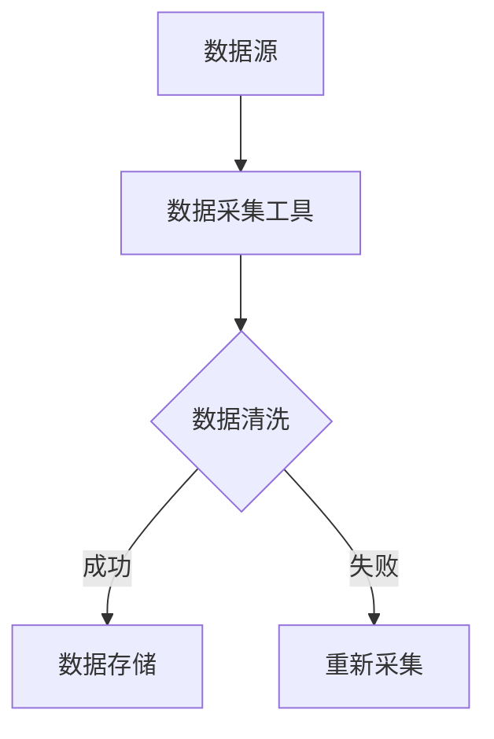
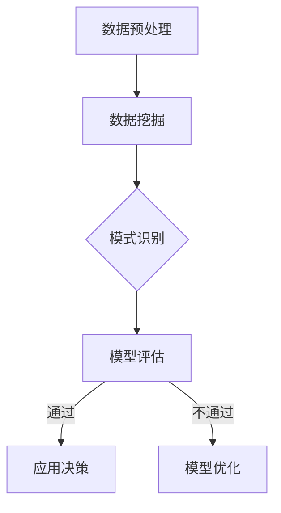
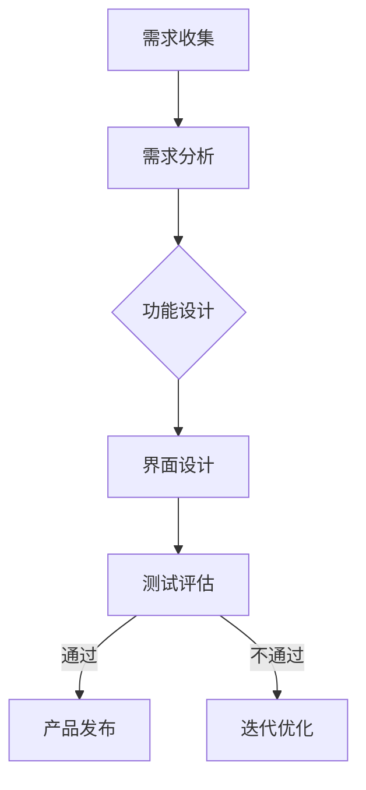
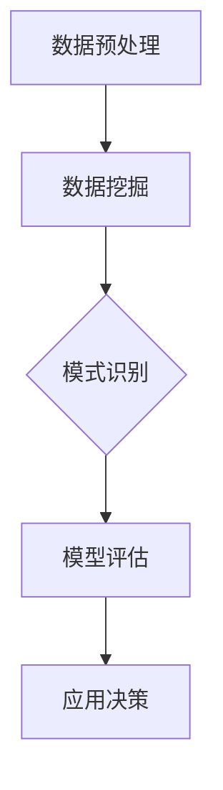
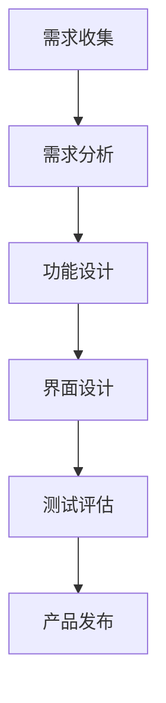

                 

### 文章标题

《信息差的产品创新驱动力：大数据如何推动产品创新》

### 关键词

信息差、产品创新、大数据、数据分析、数据挖掘、用户画像、个性化推荐

### 摘要

随着大数据技术的迅猛发展，信息差成为驱动产品创新的重要力量。本文从信息差的定义、大数据时代的特征及其对产品创新的影响入手，详细探讨了大数据分析技术在市场需求分析、用户行为分析、产品设计、产品迭代与优化中的应用。通过深入剖析大数据驱动的产品创新实践和案例分析，揭示了大数据技术在提升产品竞争力、推动产业升级中的关键作用。文章旨在为从业者提供理论指导和实践参考，以期为大数据驱动的产品创新之路提供新的思路。

## 第一部分：信息差与产品创新的概述

### 第1章：信息差的定义与产品创新的关系

#### 1.1 什么是信息差

信息差，即信息不对称，是指不同个体之间对于同一信息的掌握程度存在差异。在商业环境中，信息差常常表现为一些企业或个人能够获取并利用比其他竞争对手更全面、更及时的信息，从而在市场竞争中占据优势。例如，一家电商企业通过大数据分析，能够精准捕捉消费者的购买偏好和行为模式，从而提供更加个性化的商品推荐，这就是利用信息差的一种体现。

#### 1.2 信息差对产品创新的影响

信息差在产品创新过程中扮演着关键角色。首先，信息差有助于发现市场需求。当企业能够获取到比竞争对手更全面的市场数据时，可以更准确地判断市场趋势和消费者需求，从而进行针对性的产品创新。其次，信息差可以帮助企业规避风险。通过提前了解竞争对手的产品研发动态和市场反馈，企业可以调整自己的产品策略，避免盲目跟风或重复开发。

#### 1.3 产品创新与信息差的联系

产品创新与信息差密切相关。一方面，信息差为产品创新提供了原始素材。通过分析市场数据和用户行为数据，企业可以挖掘出潜在的需求和市场机会，从而进行产品创新。另一方面，信息差也是产品创新的重要驱动力。只有通过不断积累和利用信息差，企业才能在激烈的市场竞争中脱颖而出，实现持续的产品创新和业务增长。

### 第2章：大数据时代的信息差

#### 2.1 大数据的定义与特点

大数据（Big Data）是指数据量巨大、类型繁多、价值密度低、处理速度快的信息集合。与传统数据相比，大数据具有以下特点：

- **数据量（Volume）**：大数据涉及的数据量非常庞大，通常是TB甚至PB级别。
- **数据类型（Variety）**：大数据的类型多样，包括结构化数据、非结构化数据以及半结构化数据。
- **数据价值密度（Value）**：大数据中的信息价值密度相对较低，需要通过深度的数据挖掘和分析才能提取有价值的信息。
- **处理速度（Velocity）**：大数据的处理速度要求极高，需要在短时间内完成数据收集、处理、分析和决策。

#### 2.2 大数据在信息差中的作用

大数据在信息差中的作用日益凸显。首先，大数据技术使得信息的收集和处理更加高效和精准。通过大数据分析，企业可以迅速获取大量市场数据、用户行为数据以及竞争对手的信息，从而在信息差中占据优势。其次，大数据技术帮助企业在信息处理上实现自动化和智能化。通过机器学习和人工智能算法，企业可以自动识别市场趋势、用户需求以及潜在风险，从而进行更精准的产品创新。

#### 2.3 大数据对产品创新的启示

大数据的迅猛发展给产品创新带来了新的启示。首先，大数据技术可以帮助企业实现更精准的市场定位和需求分析。通过分析用户行为数据和市场趋势，企业可以更好地了解消费者的需求，从而进行针对性的产品创新。其次，大数据技术推动产品创新的速度和效率。通过自动化数据处理和实时分析，企业可以更快地响应市场变化和用户需求，实现快速迭代和持续创新。

### 第3章：大数据分析技术在产品创新中的应用

#### 3.1 数据采集与处理

数据采集与处理是大数据分析的基础。数据采集主要包括以下环节：

- **数据源**：确定数据来源，包括内部数据（如销售数据、用户行为数据）和外部数据（如市场数据、行业数据）。
- **数据采集工具**：选择合适的数据采集工具，如爬虫、API接口、数据库连接等。
- **数据清洗**：对采集到的原始数据进行清洗，包括去除重复数据、缺失值处理、异常值检测等。

数据采集与处理的关键在于确保数据的完整性和准确性，这是后续数据分析的基础。

#### 3.2 数据挖掘与建模

数据挖掘与建模是大数据分析的核心。数据挖掘主要包括以下步骤：

- **数据预处理**：对清洗后的数据进行进一步处理，如特征工程、数据归一化等。
- **模式识别**：使用机器学习算法（如分类、聚类、回归等）识别数据中的潜在模式。
- **模型评估**：通过交叉验证、A/B测试等方法评估模型的性能和效果。

建模的关键在于选择合适的算法和模型，以提取数据中的有价值信息。

#### 3.3 数据可视化与决策支持

数据可视化与决策支持是大数据分析的重要应用。数据可视化主要包括以下步骤：

- **数据可视化工具**：选择合适的数据可视化工具，如Tableau、Power BI、matplotlib等。
- **可视化设计**：根据业务需求设计合适的可视化图表和报表。
- **决策支持**：通过可视化分析，帮助企业做出更明智的决策。

数据可视化与决策支持的关键在于如何将复杂的数据分析结果直观地呈现给决策者，以便于他们快速理解和应用。

## 第二部分：大数据驱动的产品创新实践

### 第4章：大数据在市场需求分析中的应用

#### 4.1 市场数据采集与处理

市场需求分析是产品创新的重要一环。市场数据采集与处理主要包括以下步骤：

- **数据源选择**：确定市场需求数据来源，如市场研究报告、社交媒体、在线调查等。
- **数据采集工具**：使用爬虫、API接口等工具采集市场数据。
- **数据清洗**：对采集到的原始市场数据进行清洗，如去除重复数据、缺失值处理、数据格式转换等。

#### 4.2 市场需求分析

市场需求分析主要包括以下步骤：

- **需求识别**：通过数据挖掘方法识别市场中的潜在需求。
- **需求分类**：将识别出的需求进行分类，如基本需求、潜在需求、紧急需求等。
- **需求优先级评估**：评估不同需求的优先级，以便于后续的产品规划。

#### 4.3 市场预测与机会识别

市场预测与机会识别是市场需求分析的重要任务。市场预测主要包括以下步骤：

- **历史数据分析**：通过历史数据趋势分析，预测未来的市场趋势。
- **竞争分析**：分析竞争对手的市场表现，预测市场机会。
- **机会识别**：通过数据分析识别潜在的市场机会，如新兴市场、细分市场等。

### 第5章：大数据在用户行为分析中的应用

#### 5.1 用户行为数据采集与处理

用户行为分析是大数据应用的重要领域。用户行为数据采集与处理主要包括以下步骤：

- **数据源选择**：确定用户行为数据来源，如网站日志、APP日志、社交媒体等。
- **数据采集工具**：使用日志采集工具、API接口等采集用户行为数据。
- **数据清洗**：对采集到的原始用户行为数据进行清洗，如去除重复数据、缺失值处理、数据格式转换等。

#### 5.2 用户行为分析

用户行为分析主要包括以下步骤：

- **行为模式识别**：通过数据挖掘方法识别用户的行为模式。
- **用户分类**：将用户根据行为模式进行分类，如新用户、活跃用户、沉默用户等。
- **行为分析**：分析不同用户群体的行为特征，如购买行为、浏览行为、评论行为等。

#### 5.3 用户画像与个性化推荐

用户画像与个性化推荐是用户行为分析的重要应用。用户画像主要包括以下步骤：

- **特征提取**：从用户行为数据中提取用户特征，如年龄、性别、地理位置、兴趣爱好等。
- **画像构建**：构建用户画像，用于描述用户的综合特征。
- **个性化推荐**：基于用户画像为用户提供个性化推荐，如商品推荐、内容推荐等。

### 第6章：大数据在产品设计中的应用

#### 6.1 产品设计的数据驱动方法

大数据在产品设计中的应用，使得产品设计更加数据驱动。数据驱动的设计方法主要包括以下步骤：

- **需求分析**：通过大数据分析识别市场需求和用户需求。
- **设计决策**：基于需求分析结果进行产品设计决策，如功能设计、界面设计等。
- **迭代优化**：通过数据分析评估产品设计效果，持续迭代优化。

#### 6.2 数据驱动的产品设计流程

数据驱动的产品设计流程主要包括以下环节：

- **需求收集**：通过大数据分析收集市场需求和用户需求。
- **需求分析**：对收集到的需求进行分类和优先级评估。
- **功能设计**：根据需求分析结果设计产品功能。
- **界面设计**：设计产品的用户界面。
- **测试评估**：通过用户测试和数据评估，优化产品设计。

#### 6.3 数据驱动的产品原型验证

数据驱动的产品原型验证主要包括以下步骤：

- **原型构建**：构建产品原型，如使用Figma、Axure等工具。
- **用户测试**：通过用户测试收集反馈，评估产品原型。
- **数据分析**：通过数据分析评估产品原型效果，如用户交互数据、错误日志等。
- **优化迭代**：根据用户测试和数据分析结果，持续优化产品原型。

### 第7章：大数据在产品迭代与优化中的应用

#### 7.1 产品迭代的数据驱动方法

产品迭代的数据驱动方法主要包括以下步骤：

- **需求收集**：通过大数据分析收集用户反馈和市场趋势。
- **数据分析**：对用户反馈和市场趋势进行分析，识别产品改进方向。
- **迭代计划**：制定产品迭代计划，如新增功能、优化界面等。
- **迭代执行**：执行迭代计划，实施产品改进。
- **效果评估**：通过数据分析评估迭代效果，如用户满意度、市场份额等。

#### 7.2 产品优化与改进的数据分析

产品优化与改进的数据分析主要包括以下步骤：

- **性能分析**：分析产品的性能指标，如加载速度、响应时间等。
- **用户体验分析**：分析用户的操作行为和反馈，如点击率、转化率等。
- **市场表现分析**：分析产品在市场中的表现，如销售额、市场份额等。
- **改进措施**：根据数据分析结果制定产品优化措施。

#### 7.3 数据驱动的产品运营策略

数据驱动的产品运营策略主要包括以下步骤：

- **运营数据收集**：通过大数据技术收集产品运营数据，如用户活跃度、用户留存率等。
- **数据分析**：对运营数据进行分析，识别运营问题和改进方向。
- **策略制定**：根据数据分析结果制定产品运营策略，如营销活动、用户服务改进等。
- **效果评估**：通过数据分析评估运营策略效果，持续优化运营策略。

## 第三部分：大数据驱动的产品创新案例分析

### 第8章：大数据驱动的产品创新案例

#### 8.1 案例背景与目标

本案例以一家电商企业为例，探讨大数据驱动的产品创新实践。该电商企业希望通过大数据分析，提升产品竞争力，实现持续的业务增长。案例目标包括：

- 提高用户满意度，提升用户留存率。
- 发现市场机会，推出更具竞争力的产品。
- 优化运营策略，提高销售转化率。

#### 8.2 数据采集与处理

数据采集与处理是大数据驱动的第一步。该电商企业的数据来源主要包括：

- 内部数据：包括销售数据、用户行为数据、库存数据等。
- 外部数据：包括市场数据、行业数据、竞争对手数据等。

数据采集工具包括爬虫、API接口、数据库连接等。数据清洗过程包括去除重复数据、缺失值处理、数据格式转换等，以确保数据的完整性和准确性。

#### 8.3 数据分析与应用

数据分析是大数据驱动的核心。该电商企业通过以下方式进行分析和应用：

- **市场需求分析**：通过大数据分析，识别市场趋势和用户需求，为产品创新提供依据。
- **用户行为分析**：通过用户行为数据，了解用户的行为模式，为个性化推荐和用户服务优化提供支持。
- **竞争分析**：通过分析竞争对手的数据，了解竞争对手的产品策略和运营效果，为产品优化提供参考。

#### 8.4 创新成果与效果评估

通过大数据分析，该电商企业取得了显著的创新成果：

- 推出了多款符合市场需求的新产品，提升了产品竞争力。
- 优化了用户服务流程，提高了用户满意度和留存率。
- 通过个性化推荐和精准营销，提高了销售转化率和市场份额。

效果评估结果表明，大数据驱动的产品创新策略取得了成功，实现了企业的业务目标。

### 第9章：大数据驱动的产品创新趋势与未来展望

#### 9.1 大数据技术的未来发展趋势

大数据技术的未来发展趋势主要表现在以下几个方面：

- **数据量级增长**：随着物联网、社交媒体等技术的发展，数据量级将持续增长，对数据处理能力的要求也将不断提高。
- **数据处理速度提升**：实时数据处理和流处理技术将得到广泛应用，数据处理速度将显著提升。
- **数据隐私保护**：数据隐私保护将成为大数据技术发展的重要方向，确保数据的安全性和合规性。
- **跨领域融合**：大数据技术将与其他领域（如人工智能、区块链等）实现深度融合，推动产业升级和创新发展。

#### 9.2 大数据驱动的产品创新趋势

大数据驱动的产品创新趋势主要表现在以下几个方面：

- **个性化产品**：通过大数据分析，企业将能够提供更加个性化的产品和服务，满足用户多样化需求。
- **智能化决策**：大数据分析技术将帮助企业实现智能化决策，提高业务运营效率和竞争力。
- **数据驱动的产品优化**：通过持续的数据分析，企业将能够不断优化产品，提升用户体验和市场表现。
- **跨行业应用**：大数据技术将在更多行业中得到应用，推动产业升级和创新发展。

#### 9.3 产品创新中的挑战与应对策略

大数据驱动的产品创新面临以下挑战：

- **数据质量**：数据质量直接影响数据分析的结果，需要确保数据的完整性和准确性。
- **数据隐私**：数据隐私保护是大数据应用的重要问题，需要采取有效的数据隐私保护措施。
- **数据处理能力**：随着数据量级的增长，数据处理能力将成为关键挑战，需要不断提升数据处理速度和效率。
- **跨领域协同**：大数据驱动的产品创新涉及多个领域，需要实现跨领域的协同和融合。

应对策略包括：

- **数据质量管理**：建立完善的数据质量管理体系，确保数据的完整性和准确性。
- **数据隐私保护**：采取有效的数据隐私保护措施，如数据加密、数据脱敏等。
- **数据处理能力提升**：引入高性能数据处理技术和硬件设备，提升数据处理速度和效率。
- **跨领域协同**：加强跨领域的沟通与合作，实现资源的共享和协同创新。

### 附录

#### 附录A：大数据分析工具与资源

#### A.1 常见大数据分析工具

- **Hadoop**：一款分布式数据处理框架，用于处理大规模数据集。
- **Spark**：一款快速通用的分布式计算引擎，适用于大数据处理和分析。
- **Flink**：一款流处理框架，支持实时数据处理和分析。
- **Hive**：一款基于Hadoop的数据仓库工具，用于大规模数据的存储和管理。
- **Tableau**：一款数据可视化工具，用于创建交互式的数据报表和图表。

#### A.2 大数据资源平台介绍

- **Apache**：提供多种开源大数据项目的平台，如Hadoop、Spark等。
- **Google Cloud Platform**：提供丰富的云计算服务，包括大数据处理、存储、分析等。
- **Amazon Web Services (AWS)**：提供全面的大数据解决方案，包括数据处理、存储、分析等。

#### A.3 开源大数据项目推荐

- **Apache Mahout**：一款开源的大数据处理和机器学习框架。
- **Apache Storm**：一款开源的实时数据处理框架。
- **Apache Cassandra**：一款开源的非关系型数据库，适用于大数据存储。
- **Apache Flink**：一款开源的实时数据处理和流处理框架。

### 附录B：Mermaid流程图示例

#### B.1 数据采集流程图



#### B.2 数据分析流程图



#### B.3 产品设计流程图



### 附录C：伪代码示例

#### C.1 数据挖掘算法伪代码

```python
# 初始化模型参数
params = initialize_params()

# 数据预处理
preprocessed_data = preprocess_data(raw_data)

# 循环迭代
while not converged:
    # 训练模型
    model = train_model(preprocessed_data, params)
    
    # 评估模型
    evaluation = evaluate_model(model, validation_data)
    
    # 更新模型参数
    params = update_params(evaluation, params)
```

#### C.2 用户画像算法伪代码

```python
# 初始化用户画像
user_profile = initialize_user_profile()

# 提取用户特征
features = extract_features(user_behavior_data)

# 训练用户画像模型
user_profile_model = train_user_profile_model(features)

# 更新用户画像
user_profile = update_user_profile(user_profile_model, user_behavior_data)
```

#### C.3 个性化推荐算法伪代码

```python
# 初始化推荐系统
recommender_system = initialize_recommender_system()

# 收集用户评价数据
user_ratings = collect_user_ratings()

# 训练推荐模型
model = train_recommender_model(user_ratings)

# 推荐商品
recommendations = recommend_products(model, user_profile)
```

### 附录D：数学公式与计算示例

#### D.1 数学模型公式

$$
f(x) = \frac{1}{1 + e^{-x}}
$$

#### D.2 数学公式计算示例

假设我们有以下输入：

$$
x = 2
$$

使用上面的公式进行计算：

$$
f(x) = \frac{1}{1 + e^{-2}} \approx 0.869
$$

这个值表示当输入为2时，逻辑回归模型的输出概率。

#### D.3 公式在产品创新中的应用说明

逻辑回归模型在产品创新中的应用，可以用于预测用户对产品的满意度、购买概率等。通过将用户的特征数据（如年龄、收入、购买历史等）作为输入，使用逻辑回归模型计算用户对产品的满意度概率。这个概率可以用于个性化推荐、用户服务优化等方面，帮助企业更好地了解用户需求，提高用户体验和市场表现。例如，一个电商网站可以通过逻辑回归模型预测用户对某个商品的购买概率，从而进行精准营销，提高销售转化率。

### 作者

作者：AI天才研究院/AI Genius Institute & 禅与计算机程序设计艺术 /Zen And The Art of Computer Programming

---

### 文章标题

### 信息差的产品创新驱动力：大数据如何推动产品创新

### 关键词

信息差、产品创新、大数据、数据分析、数据挖掘、用户画像、个性化推荐

### 摘要

随着大数据技术的迅猛发展，信息差成为驱动产品创新的重要力量。本文从信息差的定义、大数据时代的特征及其对产品创新的影响入手，详细探讨了大数据分析技术在市场需求分析、用户行为分析、产品设计、产品迭代与优化中的应用。通过深入剖析大数据驱动的产品创新实践和案例分析，揭示了大数据技术在提升产品竞争力、推动产业升级中的关键作用。文章旨在为从业者提供理论指导和实践参考，以期为大数据驱动的产品创新之路提供新的思路。

---

### 第一部分：信息差与产品创新的概述

### 第1章：信息差的定义与产品创新的关系

#### 1.1 什么是信息差

信息差，即信息不对称，是指不同个体之间对于同一信息的掌握程度存在差异。在商业环境中，信息差常常表现为一些企业或个人能够获取并利用比其他竞争对手更全面、更及时的信息，从而在市场竞争中占据优势。例如，一家电商企业通过大数据分析，能够精准捕捉消费者的购买偏好和行为模式，从而提供更加个性化的商品推荐，这就是利用信息差的一种体现。

#### 1.2 信息差对产品创新的影响

信息差在产品创新过程中扮演着关键角色。首先，信息差有助于发现市场需求。当企业能够获取到比竞争对手更全面的市场数据时，可以更准确地判断市场趋势和消费者需求，从而进行针对性的产品创新。其次，信息差可以帮助企业规避风险。通过提前了解竞争对手的产品研发动态和市场反馈，企业可以调整自己的产品策略，避免盲目跟风或重复开发。

#### 1.3 产品创新与信息差的联系

产品创新与信息差密切相关。一方面，信息差为产品创新提供了原始素材。通过分析市场数据和用户行为数据，企业可以挖掘出潜在的需求和市场机会，从而进行产品创新。另一方面，信息差也是产品创新的重要驱动力。只有通过不断积累和利用信息差，企业才能在激烈的市场竞争中脱颖而出，实现持续的产品创新和业务增长。

### 第2章：大数据时代的信息差

#### 2.1 大数据的定义与特点

大数据（Big Data）是指数据量巨大、类型繁多、价值密度低、处理速度快的信息集合。与传统数据相比，大数据具有以下特点：

- **数据量（Volume）**：大数据涉及的数据量非常庞大，通常是TB甚至PB级别。
- **数据类型（Variety）**：大数据的类型多样，包括结构化数据、非结构化数据以及半结构化数据。
- **数据价值密度（Value）**：大数据中的信息价值密度相对较低，需要通过深度的数据挖掘和分析才能提取有价值的信息。
- **处理速度（Velocity）**：大数据的处理速度要求极高，需要在短时间内完成数据收集、处理、分析和决策。

#### 2.2 大数据在信息差中的作用

大数据在信息差中的作用日益凸显。首先，大数据技术使得信息的收集和处理更加高效和精准。通过大数据分析，企业可以迅速获取大量市场数据、用户行为数据以及竞争对手的信息，从而在信息差中占据优势。其次，大数据技术帮助企业在信息处理上实现自动化和智能化。通过机器学习和人工智能算法，企业可以自动识别市场趋势、用户需求以及潜在风险，从而进行更精准的产品创新。

#### 2.3 大数据对产品创新的启示

大数据的迅猛发展给产品创新带来了新的启示。首先，大数据技术可以帮助企业实现更精准的市场定位和需求分析。通过分析用户行为数据和市场趋势，企业可以更好地了解消费者的需求，从而进行针对性的产品创新。其次，大数据技术推动产品创新的速度和效率。通过自动化数据处理和实时分析，企业可以更快地响应市场变化和用户需求，实现快速迭代和持续创新。

### 第3章：大数据分析技术在产品创新中的应用

#### 3.1 数据采集与处理

数据采集与处理是大数据分析的基础。数据采集主要包括以下环节：

- **数据源**：确定数据来源，包括内部数据（如销售数据、用户行为数据）和外部数据（如市场数据、行业数据）。
- **数据采集工具**：选择合适的数据采集工具，如爬虫、API接口、数据库连接等。
- **数据清洗**：对采集到的原始数据进行清洗，包括去除重复数据、缺失值处理、异常值检测等。

数据采集与处理的关键在于确保数据的完整性和准确性，这是后续数据分析的基础。

#### 3.2 数据挖掘与建模

数据挖掘与建模是大数据分析的核心。数据挖掘主要包括以下步骤：

- **数据预处理**：对清洗后的数据进行进一步处理，如特征工程、数据归一化等。
- **模式识别**：使用机器学习算法（如分类、聚类、回归等）识别数据中的潜在模式。
- **模型评估**：通过交叉验证、A/B测试等方法评估模型的性能和效果。

建模的关键在于选择合适的算法和模型，以提取数据中的有价值信息。

#### 3.3 数据可视化与决策支持

数据可视化与决策支持是大数据分析的重要应用。数据可视化主要包括以下步骤：

- **数据可视化工具**：选择合适的数据可视化工具，如Tableau、Power BI、matplotlib等。
- **可视化设计**：根据业务需求设计合适的可视化图表和报表。
- **决策支持**：通过可视化分析，帮助企业做出更明智的决策。

数据可视化与决策支持的关键在于如何将复杂的数据分析结果直观地呈现给决策者，以便于他们快速理解和应用。

## 第二部分：大数据驱动的产品创新实践

### 第4章：大数据在市场需求分析中的应用

#### 4.1 市场数据采集与处理

市场需求分析是产品创新的重要一环。市场数据采集与处理主要包括以下步骤：

- **数据源选择**：确定市场需求数据来源，如市场研究报告、社交媒体、在线调查等。
- **数据采集工具**：使用爬虫、API接口等工具采集市场数据。
- **数据清洗**：对采集到的原始市场数据进行清洗，如去除重复数据、缺失值处理、数据格式转换等。

#### 4.2 市场需求分析

市场需求分析主要包括以下步骤：

- **需求识别**：通过数据挖掘方法识别市场中的潜在需求。
- **需求分类**：将识别出的需求进行分类，如基本需求、潜在需求、紧急需求等。
- **需求优先级评估**：评估不同需求的优先级，以便于后续的产品规划。

#### 4.3 市场预测与机会识别

市场预测与机会识别是市场需求分析的重要任务。市场预测主要包括以下步骤：

- **历史数据分析**：通过历史数据趋势分析，预测未来的市场趋势。
- **竞争分析**：分析竞争对手的市场表现，预测市场机会。
- **机会识别**：通过数据分析识别潜在的市场机会，如新兴市场、细分市场等。

### 第5章：大数据在用户行为分析中的应用

#### 5.1 用户行为数据采集与处理

用户行为分析是大数据应用的重要领域。用户行为数据采集与处理主要包括以下步骤：

- **数据源选择**：确定用户行为数据来源，如网站日志、APP日志、社交媒体等。
- **数据采集工具**：使用日志采集工具、API接口等采集用户行为数据。
- **数据清洗**：对采集到的原始用户行为数据进行清洗，如去除重复数据、缺失值处理、数据格式转换等。

#### 5.2 用户行为分析

用户行为分析主要包括以下步骤：

- **行为模式识别**：通过数据挖掘方法识别用户的行为模式。
- **用户分类**：将用户根据行为模式进行分类，如新用户、活跃用户、沉默用户等。
- **行为分析**：分析不同用户群体的行为特征，如购买行为、浏览行为、评论行为等。

#### 5.3 用户画像与个性化推荐

用户画像与个性化推荐是用户行为分析的重要应用。用户画像主要包括以下步骤：

- **特征提取**：从用户行为数据中提取用户特征，如年龄、性别、地理位置、兴趣爱好等。
- **画像构建**：构建用户画像，用于描述用户的综合特征。
- **个性化推荐**：基于用户画像为用户提供个性化推荐，如商品推荐、内容推荐等。

### 第6章：大数据在产品设计中的应用

#### 6.1 产品设计的数据驱动方法

大数据在产品设计中的应用，使得产品设计更加数据驱动。数据驱动的设计方法主要包括以下步骤：

- **需求分析**：通过大数据分析识别市场需求和用户需求。
- **设计决策**：基于需求分析结果进行产品设计决策，如功能设计、界面设计等。
- **迭代优化**：通过数据分析评估产品设计效果，持续迭代优化。

#### 6.2 数据驱动的产品设计流程

数据驱动的产品设计流程主要包括以下环节：

- **需求收集**：通过大数据分析收集市场需求和用户需求。
- **需求分析**：对收集到的需求进行分类和优先级评估。
- **功能设计**：根据需求分析结果设计产品功能。
- **界面设计**：设计产品的用户界面。
- **测试评估**：通过用户测试和数据评估，优化产品设计。

#### 6.3 数据驱动的产品原型验证

数据驱动的产品原型验证主要包括以下步骤：

- **原型构建**：构建产品原型，如使用Figma、Axure等工具。
- **用户测试**：通过用户测试收集反馈，评估产品原型。
- **数据分析**：通过数据分析评估产品原型效果，如用户交互数据、错误日志等。
- **优化迭代**：根据用户测试和数据分析结果，持续优化产品原型。

### 第7章：大数据在产品迭代与优化中的应用

#### 7.1 产品迭代的数据驱动方法

产品迭代的数据驱动方法主要包括以下步骤：

- **需求收集**：通过大数据分析收集用户反馈和市场趋势。
- **数据分析**：对用户反馈和市场趋势进行分析，识别产品改进方向。
- **迭代计划**：制定产品迭代计划，如新增功能、优化界面等。
- **迭代执行**：执行迭代计划，实施产品改进。
- **效果评估**：通过数据分析评估迭代效果，如用户满意度、市场份额等。

#### 7.2 产品优化与改进的数据分析

产品优化与改进的数据分析主要包括以下步骤：

- **性能分析**：分析产品的性能指标，如加载速度、响应时间等。
- **用户体验分析**：分析用户的操作行为和反馈，如点击率、转化率等。
- **市场表现分析**：分析产品在市场中的表现，如销售额、市场份额等。
- **改进措施**：根据数据分析结果制定产品优化措施。

#### 7.3 数据驱动的产品运营策略

数据驱动的产品运营策略主要包括以下步骤：

- **运营数据收集**：通过大数据技术收集产品运营数据，如用户活跃度、用户留存率等。
- **数据分析**：对运营数据进行分析，识别运营问题和改进方向。
- **策略制定**：根据数据分析结果制定产品运营策略，如营销活动、用户服务改进等。
- **效果评估**：通过数据分析评估运营策略效果，持续优化运营策略。

## 第三部分：大数据驱动的产品创新案例分析

### 第8章：大数据驱动的产品创新案例

#### 8.1 案例背景与目标

本案例以一家电商企业为例，探讨大数据驱动的产品创新实践。该电商企业希望通过大数据分析，提升产品竞争力，实现持续的业务增长。案例目标包括：

- 提高用户满意度，提升用户留存率。
- 发现市场机会，推出更具竞争力的产品。
- 优化运营策略，提高销售转化率。

#### 8.2 数据采集与处理

数据采集与处理是大数据驱动的第一步。该电商企业的数据来源主要包括：

- 内部数据：包括销售数据、用户行为数据、库存数据等。
- 外部数据：包括市场数据、行业数据、竞争对手数据等。

数据采集工具包括爬虫、API接口、数据库连接等。数据清洗过程包括去除重复数据、缺失值处理、数据格式转换等，以确保数据的完整性和准确性。

#### 8.3 数据分析与应用

数据分析是大数据驱动的核心。该电商企业通过以下方式进行分析和应用：

- **市场需求分析**：通过大数据分析，识别市场趋势和用户需求，为产品创新提供依据。
- **用户行为分析**：通过用户行为数据，了解用户的行为模式，为个性化推荐和用户服务优化提供支持。
- **竞争分析**：通过分析竞争对手的数据，了解竞争对手的产品策略和运营效果，为产品优化提供参考。

#### 8.4 创新成果与效果评估

通过大数据分析，该电商企业取得了显著的创新成果：

- 推出了多款符合市场需求的新产品，提升了产品竞争力。
- 优化了用户服务流程，提高了用户满意度和留存率。
- 通过个性化推荐和精准营销，提高了销售转化率和市场份额。

效果评估结果表明，大数据驱动的产品创新策略取得了成功，实现了企业的业务目标。

### 第9章：大数据驱动的产品创新趋势与未来展望

#### 9.1 大数据技术的未来发展趋势

大数据技术的未来发展趋势主要表现在以下几个方面：

- **数据量级增长**：随着物联网、社交媒体等技术的发展，数据量级将持续增长，对数据处理能力的要求也将不断提高。
- **数据处理速度提升**：实时数据处理和流处理技术将得到广泛应用，数据处理速度将显著提升。
- **数据隐私保护**：数据隐私保护将成为大数据技术发展的重要方向，确保数据的安全性和合规性。
- **跨领域融合**：大数据技术将与其他领域（如人工智能、区块链等）实现深度融合，推动产业升级和创新发展。

#### 9.2 大数据驱动的产品创新趋势

大数据驱动的产品创新趋势主要表现在以下几个方面：

- **个性化产品**：通过大数据分析，企业将能够提供更加个性化的产品和服务，满足用户多样化需求。
- **智能化决策**：大数据分析技术将帮助企业实现智能化决策，提高业务运营效率和竞争力。
- **数据驱动的产品优化**：通过持续的数据分析，企业将能够不断优化产品，提升用户体验和市场表现。
- **跨行业应用**：大数据技术将在更多行业中得到应用，推动产业升级和创新发展。

#### 9.3 产品创新中的挑战与应对策略

大数据驱动的产品创新面临以下挑战：

- **数据质量**：数据质量直接影响数据分析的结果，需要确保数据的完整性和准确性。
- **数据隐私**：数据隐私保护是大数据应用的重要问题，需要采取有效的数据隐私保护措施。
- **数据处理能力**：随着数据量级的增长，数据处理能力将成为关键挑战，需要不断提升数据处理速度和效率。
- **跨领域协同**：大数据驱动的产品创新涉及多个领域，需要实现跨领域的协同和融合。

应对策略包括：

- **数据质量管理**：建立完善的数据质量管理体系，确保数据的完整性和准确性。
- **数据隐私保护**：采取有效的数据隐私保护措施，如数据加密、数据脱敏等。
- **数据处理能力提升**：引入高性能数据处理技术和硬件设备，提升数据处理速度和效率。
- **跨领域协同**：加强跨领域的沟通与合作，实现资源的共享和协同创新。

### 附录

#### 附录A：大数据分析工具与资源

#### A.1 常见大数据分析工具

- **Hadoop**：一款分布式数据处理框架，用于处理大规模数据集。
- **Spark**：一款快速通用的分布式计算引擎，适用于大数据处理和分析。
- **Flink**：一款流处理框架，支持实时数据处理和分析。
- **Hive**：一款基于Hadoop的数据仓库工具，用于大规模数据的存储和管理。
- **Tableau**：一款数据可视化工具，用于创建交互式的数据报表和图表。

#### A.2 大数据资源平台介绍

- **Apache**：提供多种开源大数据项目的平台，如Hadoop、Spark等。
- **Google Cloud Platform**：提供丰富的云计算服务，包括大数据处理、存储、分析等。
- **Amazon Web Services (AWS)**：提供全面的大数据解决方案，包括数据处理、存储、分析等。

#### A.3 开源大数据项目推荐

- **Apache Mahout**：一款开源的大数据处理和机器学习框架。
- **Apache Storm**：一款开源的实时数据处理框架。
- **Apache Cassandra**：一款开源的非关系型数据库，适用于大数据存储。
- **Apache Flink**：一款开源的实时数据处理和流处理框架。

### 附录B：Mermaid流程图示例

#### B.1 数据采集流程图


#### B.2 数据分析流程图



#### B.3 产品设计流程图



### 附录C：伪代码示例

#### C.1 数据挖掘算法伪代码

```python
# 初始化模型参数
params = initialize_params()

# 数据预处理
preprocessed_data = preprocess_data(raw_data)

# 循环迭代
while not converged:
    # 训练模型
    model = train_model(preprocessed_data, params)
    
    # 评估模型
    evaluation = evaluate_model(model, validation_data)
    
    # 更新模型参数
    params = update_params(evaluation, params)
```

#### C.2 用户画像算法伪代码

```python
# 初始化用户画像
user_profile = initialize_user_profile()

# 提取用户特征
features = extract_features(user_behavior_data)

# 训练用户画像模型
user_profile_model = train_user_profile_model(features)

# 更新用户画像
user_profile = update_user_profile(user_profile_model, user_behavior_data)
```

#### C.3 个性化推荐算法伪代码

```python
# 初始化推荐系统
recommender_system = initialize_recommender_system()

# 收集用户评价数据
user_ratings = collect_user_ratings()

# 训练推荐模型
model = train_recommender_model(user_ratings)

# 推荐商品
recommendations = recommend_products(model, user_profile)
```

### 附录D：数学公式与计算示例

#### D.1 数学模型公式

$$
f(x) = \frac{1}{1 + e^{-x}}
$$

#### D.2 数学公式计算示例

假设我们有以下输入：

$$
x = 2
$$

使用上面的公式进行计算：

$$
f(x) = \frac{1}{1 + e^{-2}} \approx 0.869
$$

这个值表示当输入为2时，逻辑回归模型的输出概率。

#### D.3 公式在产品创新中的应用说明

逻辑回归模型在产品创新中的应用，可以用于预测用户对产品的满意度、购买概率等。通过将用户的特征数据（如年龄、收入、购买历史等）作为输入，使用逻辑回归模型计算用户对产品的满意度概率。这个概率可以用于个性化推荐、用户服务优化等方面，帮助企业更好地了解用户需求，提高用户体验和市场表现。例如，一个电商网站可以通过逻辑回归模型预测用户对某个商品的购买概率，从而进行精准营销，提高销售转化率。

### 作者

作者：AI天才研究院/AI Genius Institute & 禅与计算机程序设计艺术 /Zen And The Art of Computer Programming

---

### 文章标题

### 信息差的产品创新驱动力：大数据如何推动产品创新

### 关键词

信息差、产品创新、大数据、数据分析、数据挖掘、用户画像、个性化推荐

### 摘要

随着大数据技术的迅猛发展，信息差成为驱动产品创新的重要力量。本文从信息差的定义、大数据时代的特征及其对产品创新的影响入手，详细探讨了大数据分析技术在市场需求分析、用户行为分析、产品设计、产品迭代与优化中的应用。通过深入剖析大数据驱动的产品创新实践和案例分析，揭示了大数据技术在提升产品竞争力、推动产业升级中的关键作用。文章旨在为从业者提供理论指导和实践参考，以期为大数据驱动的产品创新之路提供新的思路。

---

### 第一部分：信息差与产品创新的概述

#### 第1章：信息差的定义与产品创新的关系

**1.1 什么是信息差**

信息差，即信息不对称，是指不同个体之间对于同一信息的掌握程度存在差异。在商业环境中，信息差常常表现为一些企业或个人能够获取并利用比其他竞争对手更全面、更及时的信息，从而在市场竞争中占据优势。例如，一家电商企业通过大数据分析，能够精准捕捉消费者的购买偏好和行为模式，从而提供更加个性化的商品推荐，这就是利用信息差的一种体现。

**1.2 信息差对产品创新的影响**

信息差在产品创新过程中扮演着关键角色。首先，信息差有助于发现市场需求。当企业能够获取到比竞争对手更全面的市场数据时，可以更准确地判断市场趋势和消费者需求，从而进行针对性的产品创新。其次，信息差可以帮助企业规避风险。通过提前了解竞争对手的产品研发动态和市场反馈，企业可以调整自己的产品策略，避免盲目跟风或重复开发。

**1.3 产品创新与信息差的联系**

产品创新与信息差密切相关。一方面，信息差为产品创新提供了原始素材。通过分析市场数据和用户行为数据，企业可以挖掘出潜在的需求和市场机会，从而进行产品创新。另一方面，信息差也是产品创新的重要驱动力。只有通过不断积累和利用信息差，企业才能在激烈的市场竞争中脱颖而出，实现持续的产品创新和业务增长。

### 第2章：大数据时代的信息差

#### 2.1 大数据的定义与特点

大数据（Big Data）是指数据量巨大、类型繁多、价值密度低、处理速度快的信息集合。与传统数据相比，大数据具有以下特点：

- **数据量（Volume）**：大数据涉及的数据量非常庞大，通常是TB甚至PB级别。
- **数据类型（Variety）**：大数据的类型多样，包括结构化数据、非结构化数据以及半结构化数据。
- **数据价值密度（Value）**：大数据中的信息价值密度相对较低，需要通过深度的数据挖掘和分析才能提取有价值的信息。
- **处理速度（Velocity）**：大数据的处理速度要求极高，需要在短时间内完成数据收集、处理、分析和决策。

#### 2.2 大数据在信息差中的作用

大数据在信息差中的作用日益凸显。首先，大数据技术使得信息的收集和处理更加高效和精准。通过大数据分析，企业可以迅速获取大量市场数据、用户行为数据以及竞争对手的信息，从而在信息差中占据优势。其次，大数据技术帮助企业在信息处理上实现自动化和智能化。通过机器学习和人工智能算法，企业可以自动识别市场趋势、用户需求以及潜在风险，从而进行更精准的产品创新。

#### 2.3 大数据对产品创新的启示

大数据的迅猛发展给产品创新带来了新的启示。首先，大数据技术可以帮助企业实现更精准的市场定位和需求分析。通过分析用户行为数据和市场趋势，企业可以更好地了解消费者的需求，从而进行针对性的产品创新。其次，大数据技术推动产品创新的速度和效率。通过自动化数据处理和实时分析，企业可以更快地响应市场变化和用户需求，实现快速迭代和持续创新。

### 第3章：大数据分析技术在产品创新中的应用

#### 3.1 数据采集与处理

数据采集与处理是大数据分析的基础。数据采集主要包括以下环节：

- **数据源**：确定数据来源，包括内部数据（如销售数据、用户行为数据）和外部数据（如市场数据、行业数据）。
- **数据采集工具**：选择合适的数据采集工具，如爬虫、API接口、数据库连接等。
- **数据清洗**：对采集到的原始数据进行清洗，包括去除重复数据、缺失值处理、异常值检测等。

数据采集与处理的关键在于确保数据的完整性和准确性，这是后续数据分析的基础。

#### 3.2 数据挖掘与建模

数据挖掘与建模是大数据分析的核心。数据挖掘主要包括以下步骤：

- **数据预处理**：对清洗后的数据进行进一步处理，如特征工程、数据归一化等。
- **模式识别**：使用机器学习算法（如分类、聚类、回归等）识别数据中的潜在模式。
- **模型评估**：通过交叉验证、A/B测试等方法评估模型的性能和效果。

建模的关键在于选择合适的算法和模型，以提取数据中的有价值信息。

#### 3.3 数据可视化与决策支持

数据可视化与决策支持是大数据分析的重要应用。数据可视化主要包括以下步骤：

- **数据可视化工具**：选择合适的数据可视化工具，如Tableau、Power BI、matplotlib等。
- **可视化设计**：根据业务需求设计合适的可视化图表和报表。
- **决策支持**：通过可视化分析，帮助企业做出更明智的决策。

数据可视化与决策支持的关键在于如何将复杂的数据分析结果直观地呈现给决策者，以便于他们快速理解和应用。

### 第二部分：大数据驱动的产品创新实践

#### 第4章：大数据在市场需求分析中的应用

**4.1 市场数据采集与处理**

市场需求分析是产品创新的重要一环。市场数据采集与处理主要包括以下步骤：

- **数据源选择**：确定市场需求数据来源，如市场研究报告、社交媒体、在线调查等。
- **数据采集工具**：使用爬虫、API接口等工具采集市场数据。
- **数据清洗**：对采集到的原始市场数据进行清洗，如去除重复数据、缺失值处理、数据格式转换等。

**4.2 市场需求分析**

市场需求分析主要包括以下步骤：

- **需求识别**：通过数据挖掘方法识别市场中的潜在需求。
- **需求分类**：将识别出的需求进行分类，如基本需求、潜在需求、紧急需求等。
- **需求优先级评估**：评估不同需求的优先级，以便于后续的产品规划。

**4.3 市场预测与机会识别**

市场预测与机会识别是市场需求分析的重要任务。市场预测主要包括以下步骤：

- **历史数据分析**：通过历史数据趋势分析，预测未来的市场趋势。
- **竞争分析**：分析竞争对手的市场表现，预测市场机会。
- **机会识别**：通过数据分析识别潜在的市场机会，如新兴市场、细分市场等。

#### 第5章：大数据在用户行为分析中的应用

**5.1 用户行为数据采集与处理**

用户行为分析是大数据应用的重要领域。用户行为数据采集与处理主要包括以下步骤：

- **数据源选择**：确定用户行为数据来源，如网站日志、APP日志、社交媒体等。
- **数据采集工具**：使用日志采集工具、API接口等采集用户行为数据。
- **数据清洗**：对采集到的原始用户行为数据进行清洗，如去除重复数据、缺失值处理、数据格式转换等。

**5.2 用户行为分析**

用户行为分析主要包括以下步骤：

- **行为模式识别**：通过数据挖掘方法识别用户的行为模式。
- **用户分类**：将用户根据行为模式进行分类，如新用户、活跃用户、沉默用户等。
- **行为分析**：分析不同用户群体的行为特征，如购买行为、浏览行为、评论行为等。

**5.3 用户画像与个性化推荐**

用户画像与个性化推荐是用户行为分析的重要应用。用户画像主要包括以下步骤：

- **特征提取**：从用户行为数据中提取用户特征，如年龄、性别、地理位置、兴趣爱好等。
- **画像构建**：构建用户画像，用于描述用户的综合特征。
- **个性化推荐**：基于用户画像为用户提供个性化推荐，如商品推荐、内容推荐等。

#### 第6章：大数据在产品设计中的应用

**6.1 产品设计的数据驱动方法**

大数据在产品设计中的应用，使得产品设计更加数据驱动。数据驱动的设计方法主要包括以下步骤：

- **需求分析**：通过大数据分析识别市场需求和用户需求。
- **设计决策**：基于需求分析结果进行产品设计决策，如功能设计、界面设计等。
- **迭代优化**：通过数据分析评估产品设计效果，持续迭代优化。

**6.2 数据驱动的产品设计流程**

数据驱动的产品设计流程主要包括以下环节：

- **需求收集**：通过大数据分析收集市场需求和用户需求。
- **需求分析**：对收集到的需求进行分类和优先级评估。
- **功能设计**：根据需求分析结果设计产品功能。
- **界面设计**：设计产品的用户界面。
- **测试评估**：通过用户测试和数据评估，优化产品设计。

**6.3 数据驱动的产品原型验证**

数据驱动的产品原型验证主要包括以下步骤：

- **原型构建**：构建产品原型，如使用Figma、Axure等工具。
- **用户测试**：通过用户测试收集反馈，评估产品原型。
- **数据分析**：通过数据分析评估产品原型效果，如用户交互数据、错误日志等。
- **优化迭代**：根据用户测试和数据分析结果，持续优化产品原型。

### 第三部分：大数据驱动的产品创新案例分析

#### 第7章：大数据驱动的产品创新案例分析

**7.1 案例背景与目标**

本案例以一家电商企业为例，探讨大数据驱动的产品创新实践。该电商企业希望通过大数据分析，提升产品竞争力，实现持续的业务增长。案例目标包括：

- 提高用户满意度，提升用户留存率。
- 发现市场机会，推出更具竞争力的产品。
- 优化运营策略，提高销售转化率。

**7.2 数据采集与处理**

数据采集与处理是大数据驱动的第一步。该电商企业的数据来源主要包括：

- **内部数据**：包括销售数据、用户行为数据、库存数据等。
- **外部数据**：包括市场数据、行业数据、竞争对手数据等。

数据采集工具包括爬虫、API接口、数据库连接等。数据清洗过程包括去除重复数据、缺失值处理、数据格式转换等，以确保数据的完整性和准确性。

**7.3 数据分析与应用**

数据分析是大数据驱动的核心。该电商企业通过以下方式进行分析和应用：

- **市场需求分析**：通过大数据分析，识别市场趋势和用户需求，为产品创新提供依据。
- **用户行为分析**：通过用户行为数据，了解用户的行为模式，为个性化推荐和用户服务优化提供支持。
- **竞争分析**：通过分析竞争对手的数据，了解竞争对手的产品策略和运营效果，为产品优化提供参考。

**7.4 创新成果与效果评估**

通过大数据分析，该电商企业取得了显著的创新成果：

- 推出了多款符合市场需求的新产品，提升了产品竞争力。
- 优化了用户服务流程，提高了用户满意度和留存率。
- 通过个性化推荐和精准营销，提高了销售转化率和市场份额。

效果评估结果表明，大数据驱动的产品创新策略取得了成功，实现了企业的业务目标。

### 第8章：大数据驱动的产品创新趋势与未来展望

**8.1 大数据技术的未来发展趋势**

大数据技术的未来发展趋势主要表现在以下几个方面：

- **数据量级增长**：随着物联网、社交媒体等技术的发展，数据量级将持续增长，对数据处理能力的要求也将不断提高。
- **数据处理速度提升**：实时数据处理和流处理技术将得到广泛应用，数据处理速度将显著提升。
- **数据隐私保护**：数据隐私保护将成为大数据技术发展的重要方向，确保数据的安全性和合规性。
- **跨领域融合**：大数据技术将与其他领域（如人工智能、区块链等）实现深度融合，推动产业升级和创新发展。

**8.2 大数据驱动的产品创新趋势**

大数据驱动的产品创新趋势主要表现在以下几个方面：

- **个性化产品**：通过大数据分析，企业将能够提供更加个性化的产品和服务，满足用户多样化需求。
- **智能化决策**：大数据分析技术将帮助企业实现智能化决策，提高业务运营效率和竞争力。
- **数据驱动的产品优化**：通过持续的数据分析，企业将能够不断优化产品，提升用户体验和市场表现。
- **跨行业应用**：大数据技术将在更多行业中得到应用，推动产业升级和创新发展。

**8.3 产品创新中的挑战与应对策略**

大数据驱动的产品创新面临以下挑战：

- **数据质量**：数据质量直接影响数据分析的结果，需要确保数据的完整性和准确性。
- **数据隐私**：数据隐私保护是大数据应用的重要问题，需要采取有效的数据隐私保护措施。
- **数据处理能力**：随着数据量级的增长，数据处理能力将成为关键挑战，需要不断提升数据处理速度和效率。
- **跨领域协同**：大数据驱动的产品创新涉及多个领域，需要实现跨领域的协同和融合。

应对策略包括：

- **数据质量管理**：建立完善的数据质量管理体系，确保数据的完整性和准确性。
- **数据隐私保护**：采取有效的数据隐私保护措施，如数据加密、数据脱敏等。
- **数据处理能力提升**：引入高性能数据处理技术和硬件设备，提升数据处理速度和效率。
- **跨领域协同**：加强跨领域的沟通与合作，实现资源的共享和协同创新。

### 附录

**附录A：大数据分析工具与资源**

**A.1 常见大数据分析工具**

- **Hadoop**：一款分布式数据处理框架，用于处理大规模数据集。
- **Spark**：一款快速通用的分布式计算引擎，适用于大数据处理和分析。
- **Flink**：一款流处理框架，支持实时数据处理和分析。
- **Hive**：一款基于Hadoop的数据仓库工具，用于大规模数据的存储和管理。
- **Tableau**：一款数据可视化工具，用于创建交互式的数据报表和图表。

**A.2 大数据资源平台介绍**

- **Apache**：提供多种开源大数据项目的平台，如Hadoop、Spark等。
- **Google Cloud Platform**：提供丰富的云计算服务，包括大数据处理、存储、分析等。
- **Amazon Web Services (AWS)**：提供全面的大数据解决方案，包括数据处理、存储、分析等。

**A.3 开源大数据项目推荐**

- **Apache Mahout**：一款开源的大数据处理和机器学习框架。
- **Apache Storm**：一款开源的实时数据处理框架。
- **Apache Cassandra**：一款开源的非关系型数据库，适用于大数据存储。
- **Apache Flink**：一款开源的实时数据处理和流处理框架。

**附录B：Mermaid流程图示例**

**B.1 数据采集流程图**


**B.2 数据分析流程图**


**B.3 产品设计流程图**


**附录C：伪代码示例**

**C.1 数据挖掘算法伪代码**

```python
# 初始化模型参数
params = initialize_params()

# 数据预处理
preprocessed_data = preprocess_data(raw_data)

# 循环迭代
while not converged:
    # 训练模型
    model = train_model(preprocessed_data, params)
    
    # 评估模型
    evaluation = evaluate_model(model, validation_data)
    
    # 更新模型参数
    params = update_params(evaluation, params)
```

**C.2 用户画像算法伪代码**

```python
# 初始化用户画像
user_profile = initialize_user_profile()

# 提取用户特征
features = extract_features(user_behavior_data)

# 训练用户画像模型
user_profile_model = train_user_profile_model(features)

# 更新用户画像
user_profile = update_user_profile(user_profile_model, user_behavior_data)
```

**C.3 个性化推荐算法伪代码**

```python
# 初始化推荐系统
recommender_system = initialize_recommender_system()

# 收集用户评价数据
user_ratings = collect_user_ratings()

# 训练推荐模型
model = train_recommender_model(user_ratings)

# 推荐商品
recommendations = recommend_products(model, user_profile)
```

**附录D：数学公式与计算示例**

**D.1 数学模型公式**

$$
f(x) = \frac{1}{1 + e^{-x}}
$$

**D.2 数学公式计算示例**

假设我们有以下输入：

$$
x = 2
$$

使用上面的公式进行计算：

$$
f(x) = \frac{1}{1 + e^{-2}} \approx 0.869
$$

这个值表示当输入为2时，逻辑回归模型的输出概率。

**D.3 公式在产品创新中的应用说明**

逻辑回归模型在产品创新中的应用，可以用于预测用户对产品的满意度、购买概率等。通过将用户的特征数据（如年龄、收入、购买历史等）作为输入，使用逻辑回归模型计算用户对产品的满意度概率。这个概率可以用于个性化推荐、用户服务优化等方面，帮助企业更好地了解用户需求，提高用户体验和市场表现。例如，一个电商网站可以通过逻辑回归模型预测用户对某个商品的购买概率，从而进行精准营销，提高销售转化率。

### 作者

作者：AI天才研究院/AI Genius Institute & 禅与计算机程序设计艺术 /Zen And The Art of Computer Programming

