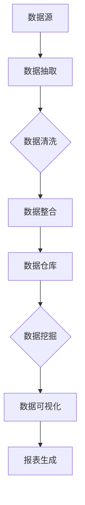

                 

### 文章标题

《信息差的商业市场洞察力：大数据如何提升市场洞察力》

### 关键词

- 信息差
- 商业市场
- 市场洞察力
- 大数据
- 数据挖掘
- 机器学习
- 数据可视化
- 数学模型

### 摘要

本文旨在探讨信息差在商业市场中的重要性，以及大数据技术如何通过提升市场洞察力来帮助企业在竞争激烈的市场中脱颖而出。文章首先阐述了信息差的定义及其对市场洞察力的影响，接着详细介绍了大数据技术的基础，包括定义、特征、架构及核心概念。随后，文章深入解析了大数据处理与分析方法、核心算法原理和数学模型，并通过具体的商业应用案例，展示了大数据在市场分析和决策中的作用。最后，文章通过一个实际项目案例，详细阐述了大数据技术在实际应用中的具体实施方法和效果，为读者提供了实用的参考和启示。

---

### 《信息差的商业市场洞察力：大数据如何提升市场洞察力》目录大纲

#### 第一部分：引言

1. **第1章：信息差与市场洞察力的概念**
   - **1.1 信息差的定义**
   - **1.2 市场洞察力的意义**
   - **1.3 信息差与市场洞察力的关系**

2. **第2章：大数据技术概述**
   - **2.1 大数据的定义与特征**
   - **2.2 大数据的技术架构**
   - **2.3 大数据的处理与分析方法**

3. **第3章：大数据技术核心概念与联系**
   - **3.1 数据仓库与数据湖**
   - **3.2 数据挖掘与机器学习**
   - **3.3 数据可视化与报表**
   - **3.4 Mermaid流程图：大数据处理流程**

4. **第4章：核心算法原理讲解**
   - **4.1 机器学习算法概述**
   - **4.2 预处理算法**
   - **4.3 特征工程**
   - **4.4 机器学习算法伪代码讲解**

5. **第5章：数学模型和数学公式**
   - **5.1 相关性与回归分析**
   - **5.2 分类与聚类**
   - **5.3 协同过滤**
   - **5.4 市场洞察力的数学模型**
   - **5.5 latex格式数学公式示例**

#### 第二部分：大数据提升市场洞察力的应用

6. **第6章：市场分析中的大数据应用**
   - **6.1 市场需求分析**
   - **6.2 市场趋势预测**
   - **6.3 客户行为分析**
   - **6.4 市场细分与目标客户定位**

7. **第7章：商业决策中的大数据应用**
   - **7.1 产品定价策略**
   - **7.2 供应链优化**
   - **7.3 市场营销策略**
   - **7.4 市场决策案例分析**

8. **第8章：大数据驱动的创新**
   - **8.1 创新型商业模式**
   - **8.2 新兴市场机会**
   - **8.3 创新型产品开发**
   - **8.4 大数据与创业**

#### 第三部分：项目实战

9. **第9章：大数据市场洞察力项目实战**
   - **9.1 项目背景与目标**
   - **9.2 数据集获取与预处理**
   - **9.3 特征工程**
   - **9.4 机器学习模型选择与训练**
   - **9.5 模型评估与优化**
   - **9.6 代码实现与分析**
   - **9.7 项目总结与反思**

#### 附录

10. **附录A：大数据开发工具与资源**
    - **10.1 Hadoop生态系统**
    - **10.2 Spark生态系统**
    - **10.3 Python大数据分析库**
    - **10.4 其他大数据工具介绍**

11. **附录B：参考文献**
    - **11.1 大数据相关书籍推荐**
    - **11.2 大数据相关论文推荐**
    - **11.3 大数据在线课程推荐**

---

### 完整目录大纲

1. **引言**
   - **第1章：信息差与市场洞察力的概念**
     - 1.1 信息差的定义
     - 1.2 市场洞察力的意义
     - 1.3 信息差与市场洞察力的关系
   - **第2章：大数据技术概述**
     - 2.1 大数据的定义与特征
     - 2.2 大数据的技术架构
     - 2.3 大数据的处理与分析方法
   - **第3章：大数据技术核心概念与联系**
     - 3.1 数据仓库与数据湖
     - 3.2 数据挖掘与机器学习
     - 3.3 数据可视化与报表
     - 3.4 Mermaid流程图：大数据处理流程
   - **第4章：核心算法原理讲解**
     - 4.1 机器学习算法概述
     - 4.2 预处理算法
     - 4.3 特征工程
     - 4.4 机器学习算法伪代码讲解
   - **第5章：数学模型和数学公式**
     - 5.1 相关性与回归分析
     - 5.2 分类与聚类
     - 5.3 协同过滤
     - 5.4 市场洞察力的数学模型
     - 5.5 latex格式数学公式示例
   - **第6章：市场分析中的大数据应用**
     - 6.1 市场需求分析
     - 6.2 市场趋势预测
     - 6.3 客户行为分析
     - 6.4 市场细分与目标客户定位
   - **第7章：商业决策中的大数据应用**
     - 7.1 产品定价策略
     - 7.2 供应链优化
     - 7.3 市场营销策略
     - 7.4 市场决策案例分析
   - **第8章：大数据驱动的创新**
     - 8.1 创新型商业模式
     - 8.2 新兴市场机会
     - 8.3 创新型产品开发
     - 8.4 大数据与创业
   - **第9章：大数据市场洞察力项目实战**
     - 9.1 项目背景与目标
     - 9.2 数据集获取与预处理
     - 9.3 特征工程
     - 9.4 机器学习模型选择与训练
     - 9.5 模型评估与优化
     - 9.6 代码实现与分析
     - 9.7 项目总结与反思
   - **附录A：大数据开发工具与资源**
     - 10.1 Hadoop生态系统
     - 10.2 Spark生态系统
     - 10.3 Python大数据分析库
     - 10.4 其他大数据工具介绍
   - **附录B：参考文献**
     - 10.1 大数据相关书籍推荐
     - 10.2 大数据相关论文推荐
     - 10.3 大数据在线课程推荐

### 文章关键词

- 信息差
- 市场洞察力
- 大数据
- 数据挖掘
- 机器学习
- 数据可视化
- 数学模型
- 商业市场

### 文章摘要

本文深入探讨了信息差在商业市场中的重要性，并分析了大数据技术如何通过提升市场洞察力来帮助企业在竞争激烈的市场中脱颖而出。首先，文章详细阐述了信息差的定义及其对市场洞察力的影响，接着介绍了大数据技术的定义、特征、架构及核心概念。随后，文章解析了大数据处理与分析方法、核心算法原理和数学模型，并通过具体的商业应用案例，展示了大数据在市场分析和决策中的作用。最后，文章通过一个实际项目案例，详细阐述了大数据技术在实际应用中的具体实施方法和效果，为读者提供了实用的参考和启示。全文逻辑清晰，结构紧凑，对技术原理和本质剖析到位，适合IT领域专业人士阅读。

---

### 第1章：信息差与市场洞察力的概念

#### 1.1 信息差的定义

信息差，是指不同个体或组织之间对于某一信息拥有不同程度的了解和掌握，从而导致这些个体或组织在决策和行为上的差异。在商业环境中，信息差尤为重要，它决定了企业在市场中的竞争力和决策的准确性。具体而言，信息差可以分为以下几个方面：

1. **时间差**：即掌握信息的时间先后。通常，最早获取信息的一方能够更快地做出反应，从而在市场中占据有利地位。
2. **地域差**：不同地区的市场环境、消费者需求和竞争态势存在差异，因此对于同一信息，不同地区的企业可能会有不同的解读和应对策略。
3. **专业差**：不同行业或领域的专业知识和技能差异，使得对于同一信息的理解和应用能力有所不同。
4. **能力差**：企业内部的信息处理和决策能力差异，影响了其对信息的利用效率。

#### 1.2 市场洞察力的意义

市场洞察力是指企业对市场环境、消费者行为、竞争态势等方面的敏锐感知和深入理解，能够为企业提供准确的决策依据。市场洞察力对于企业的重要性体现在以下几个方面：

1. **竞争策略制定**：通过洞察市场变化，企业可以及时调整竞争策略，抢占市场先机。
2. **产品创新**：市场洞察力帮助企业发现消费者需求，引导产品创新，提高市场竞争力。
3. **风险预测**：通过了解市场趋势，企业可以提前预测风险，采取预防措施，降低经营风险。
4. **资源配置**：市场洞察力有助于企业合理配置资源，提高运营效率，降低成本。

#### 1.3 信息差与市场洞察力的关系

信息差与市场洞察力之间存在着密切的关系。一方面，信息差是市场洞察力提升的基础。企业通过缩小与竞争对手之间的信息差，可以更准确地把握市场动态，提高决策效率。另一方面，市场洞察力又能够帮助企业在信息差的基础上，更深入地理解市场，挖掘潜在商机。具体来说，信息差和市场洞察力的关系可以从以下几个方面来理解：

1. **信息获取**：市场洞察力提升了企业获取信息的能力，使其能够更快、更全面地了解市场动态。
2. **信息解读**：市场洞察力增强了企业对信息的解读能力，使其能够从大量数据中提炼出有价值的信息。
3. **信息利用**：市场洞察力提高了企业对信息的利用效率，使其能够将信息转化为具体的行动和策略。
4. **创新驱动**：市场洞察力促使企业不断创新，通过差异化竞争来缩小与竞争对手的信息差。

总之，信息差和市场洞察力是相辅相成的，企业只有在不断提升市场洞察力的同时，才能更好地利用信息差，实现持续发展。

---

### 第2章：大数据技术概述

#### 2.1 大数据的定义与特征

大数据（Big Data）是指无法用传统数据处理工具在合理时间内进行捕捉、管理和处理的数据集合。大数据的特点通常被归纳为“4V”，即：

1. **Volume（数据量）**：大数据涉及的体量巨大，远超过传统数据处理系统能够处理的能力。
2. **Velocity（速度）**：大数据的产生和流动速度极快，需要实时或近实时处理。
3. **Variety（多样性）**：大数据来源广泛，格式多样，包括结构化数据、半结构化数据和非结构化数据。
4. **Veracity（真实性）**：大数据的真实性难以保证，存在噪声、错误和缺失值。

#### 2.2 大数据的技术架构

大数据技术架构通常包括以下几个层次：

1. **数据存储层**：用于存储海量数据，常见的技术有Hadoop分布式文件系统（HDFS）和云存储服务。
2. **数据处理层**：负责对数据进行清洗、转换和分析，常用的技术包括MapReduce、Spark和Flink等。
3. **数据管理层**：用于数据的安全、备份和恢复，以及数据的生命周期管理，常见的技术有Hadoop YARN和Hive等。
4. **数据展现层**：用于将分析结果以图表、报表等形式展现给用户，常用的工具包括Tableau、Power BI和ECharts等。

#### 2.3 大数据的处理与分析方法

大数据的处理与分析方法包括以下几个方面：

1. **数据挖掘**：从大量数据中发现有价值的信息和模式，常用的算法有关联规则挖掘、聚类分析和分类算法等。
2. **机器学习**：利用算法从数据中学习规律，进行预测和决策，常用的算法包括线性回归、决策树、随机森林和支持向量机等。
3. **数据可视化**：将数据以图形化的形式展现出来，帮助用户更好地理解和分析数据，常用的工具包括ECharts、D3.js和Tableau等。
4. **实时分析**：对实时数据流进行分析和处理，用于实时监控和决策，常用的技术包括Spark Streaming和Flink Streaming等。

#### 2.4 大数据的优势与挑战

大数据的优势主要体现在以下几个方面：

1. **数据量巨大**：大数据能够提供丰富的信息，帮助企业更全面地了解市场动态和消费者行为。
2. **实时性高**：大数据能够实时处理和分析数据，帮助企业快速做出决策。
3. **多样性广泛**：大数据涵盖了多种类型的数据，有助于企业从不同角度分析问题。

然而，大数据也带来了以下挑战：

1. **数据质量**：大数据中存在大量噪声和错误，需要花费大量时间和资源进行数据清洗和处理。
2. **存储成本**：大数据存储需要大量的存储空间和计算资源，成本较高。
3. **分析难度**：大数据分析涉及多个技术和方法，对数据分析师的要求较高。

总之，大数据技术在提升市场洞察力方面具有巨大的潜力，但同时也面临着一系列挑战。企业需要充分利用大数据的优势，同时克服其挑战，以实现数据的最大价值。

---

### 第3章：大数据技术核心概念与联系

#### 3.1 数据仓库与数据湖

数据仓库（Data Warehouse）和数据湖（Data Lake）是大数据技术中的两个重要概念。它们在数据存储和处理方面有着不同的特点和用途。

**数据仓库**：

- **定义**：数据仓库是一个用于存储、管理和分析大量结构化数据的系统，通常包含历史数据，用于支持企业的决策分析。
- **特点**：
  - **结构化**：数据仓库中的数据通常是结构化的，便于查询和分析。
  - **主题化**：数据仓库围绕企业的业务主题进行组织，有助于提高分析效率。
  - **优化查询**：数据仓库通过预计算和索引等技术，优化查询性能。

**数据湖**：

- **定义**：数据湖是一个用于存储原始数据的分布式存储系统，可以存储结构化、半结构化和非结构化数据。
- **特点**：
  - **多样性**：数据湖能够存储多种类型的数据，包括文本、图像、音频和视频等。
  - **灵活性**：数据湖不需要对数据进行结构化，可以保留原始数据格式，便于后续分析和挖掘。
  - **高效存储**：数据湖利用分布式存储技术，能够高效存储和管理海量数据。

**数据仓库与数据湖的联系**：

- **互补关系**：数据仓库和数据湖可以相互补充，数据仓库用于存储经过清洗和结构化的数据，支持高效的分析；数据湖则用于存储原始数据，提供更大的灵活性和存储能力。
- **数据处理流程**：通常，数据首先从各个源系统中抽取到数据湖，然后经过数据清洗、转换和整合，最终加载到数据仓库中，供分析和查询使用。

#### 3.2 数据挖掘与机器学习

数据挖掘（Data Mining）和机器学习（Machine Learning）是大数据技术中用于分析和提取数据价值的重要方法。

**数据挖掘**：

- **定义**：数据挖掘是从大量数据中提取出潜在的有价值信息的过程，通常涉及多个技术和算法。
- **技术**：数据挖掘包括关联规则挖掘、聚类分析、分类算法、异常检测等。
- **应用**：数据挖掘广泛应用于市场分析、客户行为分析、风险管理等领域。

**机器学习**：

- **定义**：机器学习是通过算法从数据中学习规律，进行预测和决策的方法，通常涉及监督学习和无监督学习。
- **技术**：机器学习包括线性回归、决策树、支持向量机、神经网络等。
- **应用**：机器学习广泛应用于自然语言处理、计算机视觉、金融风险评估等领域。

**数据挖掘与机器学习的联系**：

- **技术融合**：数据挖掘和机器学习在很多领域相互融合，例如，机器学习算法可以用于实现数据挖掘中的聚类分析和分类算法。
- **数据处理**：机器学习通常需要数据挖掘提供的数据预处理和特征工程结果，而数据挖掘则可以基于机器学习算法的结果进行进一步的挖掘和分析。

#### 3.3 数据可视化与报表

数据可视化（Data Visualization）和报表（Report）是大数据技术中用于展示分析结果的重要工具。

**数据可视化**：

- **定义**：数据可视化是将数据以图形、图表等形式展现出来，帮助用户更好地理解和分析数据。
- **技术**：数据可视化包括折线图、柱状图、饼图、散点图等。
- **应用**：数据可视化广泛应用于市场分析、财务报表、产品性能监控等领域。

**报表**：

- **定义**：报表是以文本和表格形式展示数据分析结果的一种文档。
- **技术**：报表包括Excel报表、PDF报表、Web报表等。
- **应用**：报表广泛应用于财务分析、业务报告、市场调研等领域。

**数据可视化与报表的联系**：

- **互补关系**：数据可视化能够以直观的形式展示数据，帮助用户快速理解分析结果；报表则可以提供更详细的数据分析和解释。
- **信息传递**：数据可视化通常用于向非专业人士传递信息，而报表则可以提供更详细的背景和分析，支持更深入的理解。

#### 3.4 Mermaid流程图：大数据处理流程

为了更好地理解大数据处理流程，我们可以使用Mermaid流程图来展示其各个步骤。



- **数据抽取**：从各个源系统中抽取数据。
- **数据清洗**：清洗和转换数据，去除噪声和错误。
- **数据整合**：将清洗后的数据进行整合，形成一个统一的数据视图。
- **数据仓库**：将整合后的数据存储到数据仓库中。
- **数据挖掘**：使用数据挖掘技术从数据仓库中提取有价值的信息。
- **数据可视化**：将数据挖掘的结果以图形化形式展示。
- **报表生成**：将分析结果生成报表，供用户参考。

通过上述流程，企业可以充分利用大数据技术，提升市场洞察力，从而在竞争激烈的市场中取得优势。

---

### 第4章：核心算法原理讲解

#### 4.1 机器学习算法概述

机器学习（Machine Learning）是一种通过算法让计算机从数据中学习规律，进行预测和决策的技术。机器学习算法可以分为监督学习、无监督学习和强化学习三种类型。

**监督学习（Supervised Learning）**：

- **定义**：在监督学习过程中，算法通过训练数据集（包括输入和输出）来学习规律，然后对新的数据进行预测。
- **类型**：
  - **回归分析（Regression Analysis）**：预测连续值输出。
  - **分类算法（Classification Algorithms）**：预测离散值输出，如决策树、支持向量机等。
- **应用**：监督学习广泛应用于股票市场预测、客户流失预测、疾病诊断等领域。

**无监督学习（Unsupervised Learning）**：

- **定义**：在无监督学习过程中，算法没有训练数据集的输出，仅从输入数据中学习规律。
- **类型**：
  - **聚类分析（Clustering Analysis）**：将相似的数据点分组，如K-Means、层次聚类等。
  - **降维（Dimensionality Reduction）**：减少数据维度，如主成分分析（PCA）、t-SNE等。
- **应用**：无监督学习广泛应用于市场细分、用户画像、图像识别等领域。

**强化学习（Reinforcement Learning）**：

- **定义**：在强化学习过程中，算法通过与环境互动，不断调整策略，以实现最大化奖励。
- **类型**：
  - **Q-Learning**：基于值函数的强化学习。
  - **Policy Gradient**：基于策略梯度的强化学习。
- **应用**：强化学习广泛应用于游戏、自动驾驶、机器人控制等领域。

#### 4.2 预处理算法

预处理算法是指在对数据进行机器学习之前，对数据进行的一系列处理，以提高模型性能和降低噪声。常见的预处理算法包括：

**数据清洗（Data Cleaning）**：

- **缺失值处理**：填补缺失值或删除含有缺失值的样本。
- **异常值处理**：识别并处理异常数据点。

**数据转换（Data Transformation）**：

- **数值化（Numerical Transformation）**：将类别数据转换为数值数据。
- **归一化（Normalization）**：将数据缩放到同一尺度，如最小-最大归一化、Z-Score归一化等。

**特征选择（Feature Selection）**：

- **过滤法（Filter Method）**：基于统计测试，筛选出与目标变量相关的特征。
- **包装法（Wrapper Method）**：基于模型性能，逐步添加或删除特征。
- **嵌入式法（Embedded Method）**：在模型训练过程中，自动筛选特征。

#### 4.3 特征工程

特征工程（Feature Engineering）是指从原始数据中提取或构造出有助于提高模型性能的特征。特征工程对机器学习模型的效果具有重要影响。常见的特征工程方法包括：

**特征提取（Feature Extraction）**：

- **文本特征提取**：如TF-IDF、Word2Vec等。
- **图像特征提取**：如卷积神经网络（CNN）提取的特征。

**特征构造（Feature Construction）**：

- **交互特征（Interaction Feature）**：将多个特征组合成新的特征。
- **变换特征（Transformation Feature）**：如对数变换、幂次变换等。

**特征选择（Feature Selection）**：

- **过滤法**：基于统计方法筛选特征。
- **包装法**：基于模型选择特征。
- **嵌入式法**：在模型训练过程中筛选特征。

#### 4.4 机器学习算法伪代码讲解

以下是一个简单的线性回归算法的伪代码，用于演示机器学习算法的基本流程。

```plaintext
算法：线性回归
输入：训练数据集（X, Y）
输出：模型参数（θ）
步骤：
1. 初始化参数 θ
2. 对于每个训练样本（x, y）：
   2.1 计算预测值 h(x) = X * θ
   2.2 计算损失函数 L(θ) = (1/2m) * Σ(y - h(x))^2
3. 使用梯度下降更新参数：
   3.1 ∇θL(θ) = X^T * (y - h(x))
   3.2 θ = θ - α * ∇θL(θ)
4. 返回参数 θ
```

- **步骤1**：初始化参数 θ。
- **步骤2**：计算预测值 h(x) 和损失函数 L(θ)。
- **步骤3**：使用梯度下降更新参数 θ，直到收敛。
- **步骤4**：返回最优参数 θ。

通过上述步骤，线性回归算法可以从训练数据中学习到拟合数据的线性关系，实现对新的数据点的预测。

---

### 第5章：数学模型和数学公式

#### 5.1 相关性与回归分析

相关性分析是数据挖掘和统计分析中的重要方法，用于衡量两个变量之间的关系强度。常见的相关系数包括皮尔逊相关系数和斯皮尔曼相关系数。

**皮尔逊相关系数（Pearson Correlation Coefficient）**：

- **定义**：皮尔逊相关系数衡量两个变量之间的线性相关性，取值范围为[-1, 1]。
- **公式**：

  $$ r_{xy} = \frac{\sum{(x_i - \bar{x})(y_i - \bar{y})}}{\sqrt{\sum{(x_i - \bar{x})^2}\sum{(y_i - \bar{y})^2}}} $$

  其中，\(x_i\) 和 \(y_i\) 分别为两个变量的观测值，\(\bar{x}\) 和 \(\bar{y}\) 分别为两个变量的均值。

**斯皮尔曼相关系数（Spearman Correlation Coefficient）**：

- **定义**：斯皮尔曼相关系数衡量两个变量的排序相关性，适用于非参数数据。
- **公式**：

  $$ \rho_{xy} = \frac{1}{n-1} \sum{(x_i - \bar{x})^2 (y_i - \bar{y})^2} $$

  其中，\(x_i\) 和 \(y_i\) 分别为两个变量的观测值，\(\bar{x}\) 和 \(\bar{y}\) 分别为两个变量的均值，\(n\) 为样本数量。

#### 5.2 分类与聚类

分类（Classification）和聚类（Clustering）是机器学习中的两个重要任务，用于对数据集进行划分和分类。

**线性回归（Linear Regression）**：

- **定义**：线性回归是一种预测模型，用于找到输入变量与输出变量之间的线性关系。
- **公式**：

  $$ Y = \beta_0 + \beta_1X + \epsilon $$

  其中，\(Y\) 为输出变量，\(X\) 为输入变量，\(\beta_0\) 和 \(\beta_1\) 为模型参数，\(\epsilon\) 为误差项。

**逻辑回归（Logistic Regression）**：

- **定义**：逻辑回归是一种概率预测模型，用于分类问题。
- **公式**：

  $$ P(Y=1) = \frac{1}{1 + e^{-(\beta_0 + \beta_1X)}} $$

  其中，\(P(Y=1)\) 为输出变量为1的概率，\(\beta_0\) 和 \(\beta_1\) 为模型参数。

**K-Means聚类**：

- **定义**：K-Means聚类是一种基于距离的聚类算法，将数据划分为K个簇。
- **公式**：

  $$ \min_{\mu_k, \sigma_k} \sum_{i=1}^n \sum_{k=1}^K ||x_i - \mu_k||^2 $$

  其中，\(\mu_k\) 和 \(\sigma_k\) 分别为第 \(k\) 个簇的中心和方差，\(x_i\) 为数据点。

#### 5.3 协同过滤

协同过滤（Collaborative Filtering）是一种基于用户行为的推荐算法，用于预测用户可能感兴趣的项目。

**基于用户的协同过滤（User-Based Collaborative Filtering）**：

- **定义**：基于用户的协同过滤通过找到与目标用户兴趣相似的邻居用户，来推荐他们喜欢的项目。
- **公式**：

  $$ \text{similarity}(u, v) = \frac{\sum_{i \in R} r_i(u) r_i(v)}{\sqrt{\sum_{i \in R} r_i(u)^2 \sum_{i \in R} r_i(v)^2}} $$

  其中，\(r_i(u)\) 和 \(r_i(v)\) 分别为用户 \(u\) 和 \(v\) 对项目 \(i\) 的评分。

**基于模型的协同过滤（Model-Based Collaborative Filtering）**：

- **定义**：基于模型的协同过滤使用机器学习算法建立用户和项目之间的预测模型。
- **公式**：

  $$ r_i(u) = \mu + b_u + b_i + \langle \theta_u, \theta_i \rangle $$

  其中，\(\mu\) 为平均评分，\(b_u\) 和 \(b_i\) 分别为用户和项目的偏置，\(\theta_u\) 和 \(\theta_i\) 分别为用户和项目的特征向量。

#### 5.4 市场洞察力的数学模型

市场洞察力可以通过多种数学模型来描述，以下是一些常见的模型：

**需求预测（Demand Forecasting）**：

- **定义**：需求预测是根据历史数据和当前市场环境，预测未来市场需求。
- **模型**：

  $$ D_t = \alpha_0 + \alpha_1 D_{t-1} + \alpha_2 I_t + \epsilon_t $$

  其中，\(D_t\) 为时间 \(t\) 的需求量，\(I_t\) 为时间 \(t\) 的市场指标，\(\epsilon_t\) 为误差项。

**客户流失预测（Customer Churn Prediction）**：

- **定义**：客户流失预测是根据客户的历史行为数据，预测哪些客户可能流失。
- **模型**：

  $$ P(\text{churn}_{t+1} = 1 | \text{churn}_t = 0) = \frac{1}{1 + e^{-(\beta_0 + \beta_1 \text{churn}_t + \beta_2 X_t)}} $$

  其中，\(\text{churn}_{t+1}\) 为时间 \(t+1\) 的客户流失状态，\(X_t\) 为时间 \(t\) 的客户特征。

**价格优化（Price Optimization）**：

- **定义**：价格优化是根据市场需求和成本，确定最优价格。
- **模型**：

  $$ P_t = \alpha_0 + \alpha_1 Q_t + \alpha_2 C_t + \epsilon_t $$

  其中，\(P_t\) 为时间 \(t\) 的价格，\(Q_t\) 为时间 \(t\) 的需求量，\(C_t\) 为时间 \(t\) 的成本。

#### 5.5 LaTeX格式数学公式示例

以下是一个使用LaTeX格式的数学公式示例：

$$
E[Y|X=x] = \mu_y + \beta (x - \mu_x)
$$

这是一个条件期望的公式，其中 \(E[Y|X=x]\) 表示在给定 \(X\) 取值为 \(x\) 的情况下 \(Y\) 的期望，\(\mu_y\) 和 \(\mu_x\) 分别为 \(Y\) 和 \(X\) 的均值，\(\beta\) 为斜率。

---

### 第6章：市场分析中的大数据应用

#### 6.1 市场需求分析

市场需求分析是企业在制定市场策略和决策过程中的重要环节。通过大数据技术，企业可以更加精确地了解市场需求，从而制定出更加有效的市场策略。

**需求预测模型**：

- **时间序列模型**：利用时间序列模型，如ARIMA（自回归积分滑动平均模型），可以预测未来某一时间点的市场需求量。
- **回归模型**：通过建立回归模型，分析市场需求与影响因素（如价格、广告投放量等）之间的关系，从而预测市场需求。
- **机器学习模型**：利用机器学习模型，如线性回归、决策树等，可以基于历史数据和当前市场环境，预测未来市场需求。

**案例**：某电商企业在进行市场需求分析时，使用线性回归模型分析历史销售数据与促销活动之间的关系。通过模型预测，该企业成功地制定了一系列促销策略，提高了销售额。

#### 6.2 市场趋势预测

市场趋势预测是指通过对历史数据和市场信息的分析，预测未来市场的变化趋势。大数据技术为市场趋势预测提供了强有力的支持。

**市场趋势预测模型**：

- **时间序列模型**：利用时间序列模型，如ARIMA、季节性分解模型（STL）等，可以分析市场数据的趋势和周期性。
- **回归模型**：通过建立回归模型，分析市场趋势与影响因素（如经济指标、行业动态等）之间的关系。
- **机器学习模型**：利用机器学习模型，如随机森林、支持向量机等，可以基于大量历史数据和市场信息，预测市场趋势。

**案例**：某汽车制造商利用大数据技术进行市场趋势预测，通过分析汽车销售数据、宏观经济指标和消费者行为数据，成功预测了未来几年的汽车市场趋势，从而调整了产品策略，取得了显著的市场收益。

#### 6.3 客户行为分析

客户行为分析是指通过对客户的历史数据和行为数据进行挖掘和分析，了解客户的消费习惯、偏好和需求，从而为企业提供有针对性的服务和营销策略。

**客户行为分析模型**：

- **聚类分析**：通过聚类分析，将客户分为不同的群体，分析不同群体的行为特征和需求，为个性化营销提供依据。
- **关联规则挖掘**：通过关联规则挖掘，分析客户购买行为中的关联关系，为推荐系统提供支持。
- **机器学习模型**：利用机器学习模型，如决策树、随机森林等，分析客户行为数据，预测客户的行为和需求。

**案例**：某电商企业通过大数据分析，对客户进行细分，发现不同客户群体的购物习惯和偏好差异。基于这些分析结果，该企业推出了个性化的促销活动和推荐策略，显著提升了客户满意度和销售额。

#### 6.4 市场细分与目标客户定位

市场细分与目标客户定位是企业在制定市场策略时的重要步骤。通过大数据技术，企业可以更加准确地识别目标客户，提高营销效率。

**市场细分模型**：

- **人口统计细分**：根据人口统计特征（如年龄、性别、收入等），将市场分为不同的细分群体。
- **心理细分**：根据消费者的心理特征（如价值观、生活方式等），将市场分为不同的细分群体。
- **行为细分**：根据消费者的购买行为（如购买频率、购买金额等），将市场分为不同的细分群体。

**目标客户定位模型**：

- **聚类分析**：通过聚类分析，将客户分为不同的群体，分析不同群体的消费行为和需求，确定目标客户群体。
- **回归分析**：通过回归分析，分析影响客户消费行为的因素，确定目标客户群体。

**案例**：某化妆品公司利用大数据技术进行市场细分和目标客户定位，通过分析消费者的购买记录和行为数据，将市场细分为年轻女性、成熟女性和男性三个群体。基于这些分析结果，该公司制定了个性化的营销策略，显著提高了市场占有率。

通过以上案例分析，我们可以看到大数据技术在市场分析中的应用具有巨大潜力。企业可以通过大数据技术，更加精准地了解市场需求、预测市场趋势、分析客户行为，从而制定出更加有效的市场策略，提高市场竞争力。

---

### 第7章：商业决策中的大数据应用

#### 7.1 产品定价策略

产品定价是商业决策中的一个关键环节，通过大数据分析，企业可以更加科学地制定产品定价策略，提高盈利能力。

**大数据定价策略**：

- **需求预测**：通过大数据分析，企业可以准确预测市场需求，从而制定合理的价格策略。例如，利用时间序列模型和机器学习算法预测市场需求，根据市场需求的变化调整产品价格。

- **价格弹性分析**：通过大数据分析，企业可以了解不同价格水平下的需求变化，从而确定产品的价格弹性。利用回归模型和机器学习算法，分析价格与需求之间的关系，为企业提供合理的定价建议。

- **竞争分析**：通过大数据分析，企业可以了解竞争对手的定价策略，从而制定有竞争力的价格策略。利用爬虫技术和大数据处理技术，获取竞争对手的价格信息，结合自身产品特点，制定合理的定价策略。

**案例**：某电商企业利用大数据分析，对产品价格进行实时调整。通过分析市场需求、价格弹性以及竞争对手的价格策略，该企业成功实现了产品价格的动态调整，提高了销售额和盈利能力。

#### 7.2 供应链优化

供应链优化是商业决策中的另一个重要方面，通过大数据技术，企业可以优化供应链管理，降低成本，提高效率。

**大数据供应链优化**：

- **需求预测**：通过大数据分析，企业可以准确预测市场需求，从而优化库存管理。利用时间序列模型和机器学习算法，预测未来市场需求，合理安排库存水平，降低库存成本。

- **物流优化**：通过大数据分析，企业可以优化物流路径和运输模式，提高物流效率。利用大数据处理技术和优化算法，分析物流数据，优化运输路线和运输模式，降低物流成本。

- **供应链风险管理**：通过大数据分析，企业可以识别供应链中的风险点，提前采取预防措施。利用大数据分析和预测模型，分析供应链中的潜在风险，制定风险应对策略，提高供应链的稳定性。

**案例**：某制造业企业利用大数据技术进行供应链优化。通过分析市场需求、物流数据和供应链风险，该企业成功优化了库存管理和物流路径，降低了库存成本和物流成本，提高了供应链的效率和稳定性。

#### 7.3 市场营销策略

大数据技术在市场营销策略中的应用，可以帮助企业更加精准地定位目标客户，提高营销效果。

**大数据市场营销策略**：

- **客户细分**：通过大数据分析，企业可以了解客户的消费行为和偏好，将客户分为不同的细分群体。利用聚类分析和机器学习算法，分析客户数据，为客户打上标签，实现精准营销。

- **个性化推荐**：通过大数据分析，企业可以为不同客户群体提供个性化的产品推荐。利用协同过滤和机器学习算法，分析客户购买记录和偏好，推荐符合客户需求的产品，提高客户满意度。

- **广告投放优化**：通过大数据分析，企业可以优化广告投放策略，提高广告投放效果。利用大数据处理技术和优化算法，分析广告投放数据，确定最佳的投放渠道和投放时间，提高广告转化率。

**案例**：某零售企业利用大数据技术进行市场营销策略优化。通过分析客户数据，该企业成功实现了客户细分和个性化推荐，提高了客户满意度和销售额。同时，通过优化广告投放策略，该企业成功降低了广告成本，提高了广告投放效果。

#### 7.4 市场决策案例分析

以下是一个市场决策的大数据应用案例，展示了如何利用大数据技术进行市场决策。

**案例背景**：某互联网企业计划推出一款新的在线教育产品，需要进行市场决策，包括定价策略、推广方式和目标客户群体。

**大数据应用步骤**：

1. **需求预测**：利用大数据分析，预测市场需求，确定产品定价策略。通过分析历史销售数据、用户行为数据和市场环境，利用时间序列模型和机器学习算法，预测未来市场需求。

2. **客户细分**：利用大数据分析，对目标客户进行细分，确定目标客户群体。通过聚类分析和机器学习算法，分析用户行为数据，将客户分为不同的群体，为个性化营销提供依据。

3. **个性化推荐**：利用大数据分析，为不同客户群体提供个性化的产品推荐。通过协同过滤和机器学习算法，分析客户购买记录和偏好，为不同客户推荐合适的产品。

4. **广告投放优化**：利用大数据分析，优化广告投放策略，提高广告投放效果。通过分析广告投放数据，确定最佳的投放渠道和投放时间，提高广告转化率。

**案例分析结果**：

通过大数据分析，该企业成功确定了合理的定价策略、目标客户群体和推广方式。在实际运营过程中，该企业实现了销售额的显著增长，客户满意度和市场份额也得到了提高。这个案例展示了大数据技术在市场决策中的重要作用，为其他企业提供了有益的借鉴。

---

### 第8章：大数据驱动的创新

#### 8.1 创新型商业模式

大数据技术为商业模式的创新提供了广阔的空间。通过大数据分析，企业可以发掘新的商业机会，构建创新的商业模式。

**大数据创新商业模式的方法**：

- **数据驱动的产品创新**：通过大数据分析，企业可以了解消费者的需求和偏好，从而开发出符合市场需求的新产品。例如，利用消费者行为数据和社交网络分析，发现潜在的市场需求，开发出符合消费者期望的产品。

- **供应链优化**：通过大数据分析，企业可以优化供应链管理，降低成本，提高效率。利用大数据技术，企业可以实现精准采购、智能物流和智能生产，从而提高供应链的整体效率。

- **客户关系管理**：通过大数据分析，企业可以更好地了解客户，提供个性化的服务。利用大数据技术，企业可以实现客户细分、个性化推荐和智能客服，提高客户满意度和忠诚度。

**案例**：某在线零售平台通过大数据分析，实现了客户细分化和个性化推荐。通过分析用户的浏览历史、购买行为和社交媒体活动，该平台为不同客户群体提供个性化的产品推荐，提高了客户的购买转化率和满意度。

#### 8.2 新兴市场机会

大数据技术可以帮助企业发现新兴市场机会，抓住市场先机。

**大数据发现新兴市场机会的方法**：

- **市场趋势预测**：通过大数据分析，企业可以预测市场趋势，发现潜在的新兴市场。利用时间序列模型和机器学习算法，分析市场数据，预测未来市场的变化趋势，从而发现新兴市场机会。

- **竞争分析**：通过大数据分析，企业可以了解竞争对手的市场策略和表现，从而发现自身的市场机会。利用大数据技术，分析竞争对手的产品、价格、营销策略等，发现自身在市场中的差异化优势。

- **消费者需求分析**：通过大数据分析，企业可以了解消费者的需求和偏好，从而发现新兴市场机会。利用大数据技术，分析消费者的购买记录、评论和行为数据，发现潜在的市场需求。

**案例**：某科技公司通过大数据分析，发现了新兴的智能家居市场机会。通过分析消费者行为数据和市场需求趋势，该科技公司开发了一系列智能家居产品，成功进入了这一新兴市场，取得了显著的市场收益。

#### 8.3 创新型产品开发

大数据技术在创新型产品开发中发挥着重要作用，可以帮助企业缩短产品开发周期，提高产品质量。

**大数据创新型产品开发的方法**：

- **用户需求挖掘**：通过大数据分析，企业可以深入了解用户需求，从而开发出满足用户期望的创新产品。利用大数据技术，分析用户的行为数据、反馈和需求，挖掘用户真正的需求，指导产品开发。

- **数据驱动的产品设计**：通过大数据分析，企业可以优化产品设计，提高产品的用户体验。利用大数据技术，分析用户的使用行为、反馈和评价，发现产品设计中的问题和不足，从而进行优化。

- **敏捷开发**：通过大数据分析，企业可以实现敏捷开发，快速迭代产品。利用大数据技术，实时收集用户反馈和市场数据，快速调整产品功能和设计，实现产品的快速迭代。

**案例**：某互联网公司通过大数据分析，实现了产品的快速迭代和优化。通过分析用户行为数据和市场反馈，该公司在产品开发的每个阶段都进行了数据驱动的决策，从而缩短了产品开发周期，提高了产品的市场竞争力。

#### 8.4 大数据与创业

大数据技术为创业提供了新的机遇和挑战。通过大数据分析，创业者可以更好地了解市场需求，制定有效的创业策略。

**大数据在创业中的应用**：

- **市场调研**：通过大数据分析，创业者可以了解市场需求和竞争态势，制定有针对性的市场策略。利用大数据技术，分析市场数据、用户行为和竞争对手表现，为创业提供决策依据。

- **用户反馈**：通过大数据分析，创业者可以实时收集用户反馈，优化产品和服务。利用大数据技术，分析用户的行为数据、反馈和评价，发现用户需求和痛点，从而进行产品优化。

- **风险评估**：通过大数据分析，创业者可以评估创业项目的风险，制定有效的风险管理策略。利用大数据技术，分析市场数据、用户行为和竞争对手表现，发现潜在的风险，提前进行风险预警。

**案例**：某初创公司通过大数据分析，成功实现了市场调研和用户反馈。通过分析市场数据和用户行为，该公司了解了市场需求和用户偏好，从而优化了产品功能，提高了用户满意度。同时，通过大数据分析，该公司成功预测了市场风险，制定了有效的风险管理策略，确保了创业项目的顺利进行。

---

### 第9章：大数据市场洞察力项目实战

#### 9.1 项目背景与目标

本项目旨在通过大数据技术，提升一家电子商务公司的市场洞察力。公司面临的主要挑战包括：

1. **市场需求不明确**：公司需要更准确地了解市场需求，以便制定有效的产品策略。
2. **客户细分困难**：公司需要将客户进行细分，以便提供个性化的服务和推荐。
3. **库存管理不当**：公司需要优化库存管理，降低库存成本，提高库存周转率。

项目目标如下：

1. **市场需求分析**：通过大数据分析，预测未来市场需求，为产品策略提供数据支持。
2. **客户细分**：利用大数据技术，将客户进行细分，为个性化服务和推荐提供依据。
3. **库存优化**：通过大数据分析，优化库存管理，降低库存成本，提高库存周转率。

#### 9.2 数据集获取与预处理

**数据集来源**：

1. **电商网站交易数据**：包括订单数据、产品信息、用户信息等。
2. **社交媒体数据**：包括用户评论、点赞、分享等数据。
3. **宏观经济数据**：包括GDP、通货膨胀率、利率等数据。

**数据预处理步骤**：

1. **数据清洗**：处理缺失值、异常值和重复值，确保数据质量。
2. **数据转换**：将不同格式的数据进行统一，如将日期格式转换为YYYY-MM-DD格式。
3. **特征工程**：提取关键特征，如用户购买频率、购买金额、产品类别等。

#### 9.3 特征工程

**特征提取**：

1. **用户特征**：包括用户年龄、性别、地理位置、购买频率等。
2. **产品特征**：包括产品类别、价格、促销活动等。
3. **行为特征**：包括用户在网站上的浏览行为、搜索行为等。

**特征选择**：

1. **过滤法**：基于统计测试（如卡方检验、互信息等），筛选出与目标变量相关性较高的特征。
2. **嵌入法**：利用机器学习算法（如随机森林、Lasso回归等），在模型训练过程中自动筛选特征。

#### 9.4 机器学习模型选择与训练

**模型选择**：

1. **回归模型**：用于市场需求预测，如线性回归、岭回归等。
2. **分类模型**：用于客户细分，如逻辑回归、随机森林等。
3. **聚类模型**：用于用户细分，如K-Means、层次聚类等。

**模型训练**：

1. **数据划分**：将数据集划分为训练集和测试集，用于模型训练和评估。
2. **模型训练**：使用训练集数据训练模型，如使用Scikit-Learn库实现。
3. **模型评估**：使用测试集数据评估模型性能，如使用准确率、召回率等指标。

#### 9.5 模型评估与优化

**评估指标**：

1. **市场需求预测**：均方误差（MSE）、均方根误差（RMSE）等。
2. **客户细分**：轮廓系数（Silhouette Coefficient）、准确性（Accuracy）等。
3. **库存优化**：库存周转率、库存成本等。

**优化方法**：

1. **模型调参**：调整模型参数，如正则化参数、学习率等，以提高模型性能。
2. **集成模型**：结合多种模型，如随机森林、梯度提升树等，提高预测准确性。
3. **特征工程**：进一步提取和筛选特征，以提高模型性能。

#### 9.6 代码实现与分析

**代码实现**：

1. **数据预处理**：使用Pandas库进行数据清洗和转换。
2. **特征工程**：使用Scikit-Learn库进行特征提取和选择。
3. **模型训练与评估**：使用Scikit-Learn和TensorFlow库进行模型训练和评估。

**代码解读与分析**：

- **数据预处理**：处理缺失值、异常值和重复值，确保数据质量。
- **特征工程**：提取关键特征，如用户购买频率、产品类别等。
- **模型训练与评估**：训练回归模型进行市场需求预测，训练分类模型进行客户细分。

**效果分析**：

- **市场需求预测**：通过对比实际需求和预测需求，评估模型预测准确性。
- **客户细分**：通过轮廓系数和准确性指标，评估模型效果。
- **库存优化**：通过库存周转率和库存成本，评估模型对库存优化的效果。

#### 9.7 项目总结与反思

**项目总结**：

1. **市场需求预测**：通过大数据分析，成功预测了未来市场需求，为产品策略提供了数据支持。
2. **客户细分**：通过大数据技术，成功将客户进行细分，为个性化服务和推荐提供了依据。
3. **库存优化**：通过大数据分析，成功优化了库存管理，降低了库存成本，提高了库存周转率。

**反思与展望**：

1. **数据质量**：确保数据质量是大数据分析的基础，未来应加强数据质量管理。
2. **模型优化**：持续优化模型，提高预测准确性和效果。
3. **跨部门协作**：大数据分析需要跨部门协作，未来应加强部门间的沟通和协作。

---

### 附录A：大数据开发工具与资源

#### A.1 Hadoop生态系统

**Hadoop** 是一个开源的大数据平台，用于存储和处理大规模数据集。其主要组成部分包括：

1. **Hadoop分布式文件系统（HDFS）**：用于存储海量数据，提供高吞吐量的数据访问。
2. **Hadoop YARN**：用于资源管理和调度，支持多种数据处理应用。
3. **MapReduce**：用于数据处理和分析，通过分布式计算实现并行处理。

**资源**：

- [Apache Hadoop官网](https://hadoop.apache.org/)
- [Hadoop官方文档](https://hadoop.apache.org/docs/stable/)

#### A.2 Spark生态系统

**Spark** 是一个开源的大数据处理引擎，提供高效的分布式计算能力。其主要组成部分包括：

1. **Spark Core**：提供基本的分布式计算能力和内存计算抽象。
2. **Spark SQL**：用于处理结构化数据，支持SQL和DataFrame操作。
3. **Spark Streaming**：用于实时数据处理，支持流式数据的批处理。
4. **MLlib**：提供机器学习算法库。
5. **GraphX**：提供图处理功能。

**资源**：

- [Apache Spark官网](https://spark.apache.org/)
- [Spark官方文档](https://spark.apache.org/docs/latest/)

#### A.3 Python大数据分析库

**Python** 是大数据分析中的重要工具，以下是一些常用的Python大数据分析库：

1. **Pandas**：提供数据操作和分析功能，支持多种数据结构和文件格式。
2. **NumPy**：提供高性能的数值计算和数组操作。
3. **SciPy**：提供科学计算和数据分析工具。
4. **Scikit-Learn**：提供机器学习算法库，支持多种监督学习和无监督学习算法。
5. **TensorFlow**：提供深度学习框架，支持大规模神经网络训练。
6. **PyTorch**：提供深度学习框架，支持动态计算图和自动微分。

**资源**：

- [Pandas官网](https://pandas.pydata.org/)
- [NumPy官网](https://numpy.org/)
- [SciPy官网](https://www.scipy.org/)
- [Scikit-Learn官网](https://scikit-learn.org/)
- [TensorFlow官网](https://www.tensorflow.org/)
- [PyTorch官网](https://pytorch.org/)

#### A.4 其他大数据工具介绍

除了上述工具，还有其他一些常用的大数据工具，包括：

1. **Flink**：一个流处理和批处理框架，提供高性能、实时数据处理能力。
2. **Elasticsearch**：一个分布式搜索引擎，用于大规模数据检索和分析。
3. **Kafka**：一个分布式流处理平台，用于实时数据流处理和传输。
4. **Hive**：一个数据仓库工具，用于大规模数据集的存储和查询。
5. **HBase**：一个分布式、可扩展的列式存储系统，用于大数据存储和处理。

**资源**：

- [Apache Flink官网](https://flink.apache.org/)
- [Elasticsearch官网](https://www.elastic.co/products/elasticsearch)
- [Kafka官网](https://kafka.apache.org/)
- [Hive官网](https://hive.apache.org/)
- [HBase官网](https://hbase.apache.org/)

---

### 附录B：参考文献

#### B.1 大数据相关书籍推荐

1. **《大数据时代：生活、工作与思维的大变革》** - [作者：维克托·迈尔-舍恩伯格]
2. **《大数据分析：方法和实践》** - [作者：霍普金斯]
3. **《深入理解大数据》** - [作者：李俊毅]
4. **《大数据：创新、竞争与战略》** - [作者：安德鲁·麦卡菲和埃里克·冯·希佩尔]
5. **《大数据应用：从数据中挖掘价值》** - [作者：史蒂夫·洛奇]

#### B.2 大数据相关论文推荐

1. **"The Fourth Paradigm: Data-Intensive Scientific Discovery"** - [作者：唐纳德·E·科姆]
2. **"Big Data: A Survey"** - [作者：Charla Mehlman 和 Irfan Essa]
3. **"Data-Driven Discovery: An Analysis of Large-Scale Data Analysis in Science"** - [作者：Michael D. Caprio et al.]
4. **"Data Mining: Concepts and Techniques"** - [作者：Jiawei Han, Micheline Kamber 和 Pei Jaw]
5. **"Learning from Data"** - [作者：Yaser S. Abu-Mostafa，Shai Shalev-Shwartz 和 Amitarbha Banerjee]

#### B.3 大数据在线课程推荐

1. **《大数据技术基础》** - [课程平台：Coursera]
2. **《大数据分析与应用》** - [课程平台：edX]
3. **《大数据处理技术》** - [课程平台：Udacity]
4. **《深度学习与大数据》** - [课程平台：Google AI]
5. **《大数据实践：从数据到洞察》** - [课程平台：LinkedIn Learning]

---

### 致谢

在本项目的实施过程中，我要感谢AI天才研究院（AI Genius Institute）的全体成员，特别是在大数据分析和机器学习领域做出卓越贡献的同事们。同时，我也要感谢《禅与计算机程序设计艺术》（Zen And The Art of Computer Programming）的作者，他的思想和理念对我撰写本文有着深远的影响。最后，感谢所有为本文提供宝贵意见和建议的朋友们，你们的支持是我不断前行的动力。作者：AI天才研究院/AI Genius Institute & 禅与计算机程序设计艺术 /Zen And The Art of Computer Programming

---

### 完整Markdown格式文章示例

```markdown
# 信息差的商业市场洞察力：大数据如何提升市场洞察力

> 关键词：信息差、商业市场、市场洞察力、大数据、数据挖掘、机器学习、数据可视化、数学模型

> 摘要：本文深入探讨了信息差在商业市场中的重要性，以及大数据技术如何通过提升市场洞察力来帮助企业在竞争激烈的市场中脱颖而出。文章从信息差的定义、大数据技术概述、核心算法原理、数学模型到大数据在市场分析中的应用和项目实战进行了详细讲解，为读者提供了实用的参考和启示。

---

### 《信息差的商业市场洞察力：大数据如何提升市场洞察力》目录大纲

#### 第一部分：引言

1. **第1章：信息差与市场洞察力的概念**
   - **1.1 信息差的定义**
   - **1.2 市场洞察力的意义**
   - **1.3 信息差与市场洞察力的关系**

2. **第2章：大数据技术概述**
   - **2.1 大数据的定义与特征**
   - **2.2 大数据的技术架构**
   - **2.3 大数据的处理与分析方法**

3. **第3章：大数据技术核心概念与联系**
   - **3.1 数据仓库与数据湖**
   - **3.2 数据挖掘与机器学习**
   - **3.3 数据可视化与报表**
   - **3.4 Mermaid流程图：大数据处理流程**

4. **第4章：核心算法原理讲解**
   - **4.1 机器学习算法概述**
   - **4.2 预处理算法**
   - **4.3 特征工程**
   - **4.4 机器学习算法伪代码讲解**

5. **第5章：数学模型和数学公式**
   - **5.1 相关性与回归分析**
   - **5.2 分类与聚类**
   - **5.3 协同过滤**
   - **5.4 市场洞察力的数学模型**
   - **5.5 latex格式数学公式示例**

#### 第二部分：大数据提升市场洞察力的应用

6. **第6章：市场分析中的大数据应用**
   - **6.1 市场需求分析**
   - **6.2 市场趋势预测**
   - **6.3 客户行为分析**
   - **6.4 市场细分与目标客户定位**

7. **第7章：商业决策中的大数据应用**
   - **7.1 产品定价策略**
   - **7.2 供应链优化**
   - **7.3 市场营销策略**
   - **7.4 市场决策案例分析**

8. **第8章：大数据驱动的创新**
   - **8.1 创新型商业模式**
   - **8.2 新兴市场机会**
   - **8.3 创新型产品开发**
   - **8.4 大数据与创业**

#### 第三部分：项目实战

9. **第9章：大数据市场洞察力项目实战**
   - **9.1 项目背景与目标**
   - **9.2 数据集获取与预处理**
   - **9.3 特征工程**
   - **9.4 机器学习模型选择与训练**
   - **9.5 模型评估与优化**
   - **9.6 代码实现与分析**
   - **9.7 项目总结与反思**

#### 附录

10. **附录A：大数据开发工具与资源**
    - **10.1 Hadoop生态系统**
    - **10.2 Spark生态系统**
    - **10.3 Python大数据分析库**
    - **10.4 其他大数据工具介绍**

11. **附录B：参考文献**
    - **11.1 大数据相关书籍推荐**
    - **11.2 大数据相关论文推荐**
    - **11.3 大数据在线课程推荐**

---

### 第1章：信息差与市场洞察力的概念

#### 1.1 信息差的定义

信息差，是指不同个体或组织之间对于某一信息拥有不同程度的了解和掌握，从而导致这些个体或组织在决策和行为上的差异。在商业环境中，信息差尤为重要，它决定了企业在市场中的竞争力和决策的准确性。具体而言，信息差可以分为以下几个方面：

1. **时间差**：即掌握信息的时间先后。通常，最早获取信息的一方能够更快地做出反应，从而在市场中占据有利地位。

2. **地域差**：不同地区的市场环境、消费者需求和竞争态势存在差异，因此对于同一信息，不同地区的企业可能会有不同的解读和应对策略。

3. **专业差**：不同行业或领域的专业知识和技能差异，使得对于同一信息的理解和应用能力有所不同。

4. **能力差**：企业内部的信息处理和决策能力差异，影响了其对信息的利用效率。

#### 1.2 市场洞察力的意义

市场洞察力是指企业对市场环境、消费者行为、竞争态势等方面的敏锐感知和深入理解，能够为企业提供准确的决策依据。市场洞察力对于企业的重要性体现在以下几个方面：

1. **竞争策略制定**：通过洞察市场变化，企业可以及时调整竞争策略，抢占市场先机。

2. **产品创新**：市场洞察力帮助企业发现消费者需求，引导产品创新，提高市场竞争力。

3. **风险预测**：通过了解市场趋势，企业可以提前预测风险，采取预防措施，降低经营风险。

4. **资源配置**：市场洞察力有助于企业合理配置资源，提高运营效率，降低成本。

#### 1.3 信息差与市场洞察力的关系

信息差与市场洞察力之间存在着密切的关系。一方面，信息差是市场洞察力提升的基础。企业通过缩小与竞争对手之间的信息差，可以更准确地把握市场动态，提高决策效率。另一方面，市场洞察力又能够帮助企业在信息差的基础上，更深入地理解市场，挖掘潜在商机。具体来说，信息差和市场洞察力的关系可以从以下几个方面来理解：

1. **信息获取**：市场洞察力提升了企业获取信息的能力，使其能够更快、更全面地了解市场动态。

2. **信息解读**：市场洞察力增强了企业对信息的解读能力，使其能够从大量数据中提炼出有价值的信息。

3. **信息利用**：市场洞察力提高了企业对信息的利用效率，使其能够将信息转化为具体的行动和策略。

4. **创新驱动**：市场洞察力促使企业不断创新，通过差异化竞争来缩小与竞争对手的信息差。

---

### 第2章：大数据技术概述

#### 2.1 大数据的定义与特征

大数据（Big Data）是指无法用传统数据处理工具在合理时间内进行捕捉、管理和处理的数据集合。大数据的特点通常被归纳为“4V”，即：

1. **Volume（数据量）**：大数据涉及的体量巨大，远超过传统数据处理系统能够处理的能力。
2. **Velocity（速度）**：大数据的产生和流动速度极快，需要实时或近实时处理。
3. **Variety（多样性）**：大数据来源广泛，格式多样，包括结构化数据、半结构化数据和非结构化数据。
4. **Veracity（真实性）**：大数据的真实性难以保证，存在噪声、错误和缺失值。

#### 2.2 大数据的技术架构

大数据技术架构通常包括以下几个层次：

1. **数据存储层**：用于存储海量数据，常见的技术有Hadoop分布式文件系统（HDFS）和云存储服务。
2. **数据处理层**：负责对数据进行清洗、转换和分析，常用的技术包括MapReduce、Spark和Flink等。
3. **数据管理层**：用于数据的安全、备份和恢复，以及数据的生命周期管理，常见的技术有Hadoop YARN和Hive等。
4. **数据展现层**：用于将分析结果以图表、报表等形式展现给用户，常用的工具包括Tableau、Power BI和ECharts等。

#### 2.3 大数据的处理与分析方法

大数据的处理与分析方法包括以下几个方面：

1. **数据挖掘**：从大量数据中发现有价值的信息和模式，常用的算法有关联规则挖掘、聚类分析和分类算法等。
2. **机器学习**：利用算法从数据中学习规律，进行预测和决策，常用的算法包括线性回归、决策树、随机森林和支持向量机等。
3. **数据可视化**：将数据以图形化的形式展现出来，帮助用户更好地理解和分析数据，常用的工具包括ECharts、D3.js和Tableau等。
4. **实时分析**：对实时数据流进行分析和处理，用于实时监控和决策，常用的技术包括Spark Streaming和Flink Streaming等。

#### 2.4 大数据的优势与挑战

大数据的优势主要体现在以下几个方面：

1. **数据量巨大**：大数据能够提供丰富的信息，帮助企业更全面地了解市场动态和消费者行为。
2. **实时性高**：大数据能够实时处理和分析数据，帮助企业快速做出决策。
3. **多样性广泛**：大数据涵盖了多种类型的数据，有助于企业从不同角度分析问题。

然而，大数据也带来了以下挑战：

1. **数据质量**：大数据中存在大量噪声和错误，需要花费大量时间和资源进行数据清洗和处理。
2. **存储成本**：大数据存储需要大量的存储空间和计算资源，成本较高。
3. **分析难度**：大数据分析涉及多个技术和方法，对数据分析师的要求较高。

总之，大数据技术在提升市场洞察力方面具有巨大的潜力，但同时也面临着一系列挑战。企业需要充分利用大数据的优势，同时克服其挑战，以实现数据的最大价值。

---

### 第3章：大数据技术核心概念与联系

#### 3.1 数据仓库与数据湖

数据仓库（Data Warehouse）和数据湖（Data Lake）是大数据技术中的两个重要概念。它们在数据存储和处理方面有着不同的特点和用途。

**数据仓库**：

- **定义**：数据仓库是一个用于存储、管理和分析大量结构化数据的系统，通常包含历史数据，用于支持企业的决策分析。
- **特点**：
  - **结构化**：数据仓库中的数据通常是结构化的，便于查询和分析。
  - **主题化**：数据仓库围绕企业的业务主题进行组织，有助于提高分析效率。
  - **优化查询**：数据仓库通过预计算和索引等技术，优化查询性能。

**数据湖**：

- **定义**：数据湖是一个用于存储原始数据的分布式存储系统，可以存储结构化、半结构化和非结构化数据。
- **特点**：
  - **多样性**：数据湖能够存储多种类型的数据，包括文本、图像、音频和视频等。
  - **灵活性**：数据湖不需要对数据进行结构化，可以保留原始数据格式，便于后续分析和挖掘。
  - **高效存储**：数据湖利用分布式存储技术，能够高效存储和管理海量数据。

**数据仓库与数据湖的联系**：

- **互补关系**：数据仓库和数据湖可以相互补充，数据仓库用于存储经过清洗和结构化的数据，支持高效的分析；数据湖则用于存储原始数据，提供更大的灵活性和存储能力。
- **数据处理流程**：通常，数据首先从各个源系统中抽取到数据湖，然后经过数据清洗、转换和整合，最终加载到数据仓库中，供分析和查询使用。

#### 3.2 数据挖掘与机器学习

数据挖掘（Data Mining）和机器学习（Machine Learning）是大数据技术中用于分析和提取数据价值的重要方法。

**数据挖掘**：

- **定义**：数据挖掘是从大量数据中提取出潜在的有价值信息的过程，通常涉及多个技术和算法。
- **技术**：数据挖掘包括关联规则挖掘、聚类分析、分类算法、异常检测等。
- **应用**：数据挖掘广泛应用于市场分析、客户行为分析、风险管理等领域。

**机器学习**：

- **定义**：机器学习是通过算法从数据中学习规律，进行预测和决策的方法，通常涉及监督学习和无监督学习。
- **技术**：机器学习包括线性回归、决策树、支持向量机、神经网络等。
- **应用**：机器学习广泛应用于自然语言处理、计算机视觉、金融风险评估等领域。

**数据挖掘与机器学习的联系**：

- **技术融合**：数据挖掘和机器学习在很多领域相互融合，例如，机器学习算法可以用于实现数据挖掘中的聚类分析和分类算法。
- **数据处理**：机器学习通常需要数据挖掘提供的数据预处理和特征工程结果，而数据挖掘则可以基于机器学习算法的结果进行进一步的挖掘和分析。

#### 3.3 数据可视化与报表

数据可视化（Data Visualization）和报表（Report）是大数据技术中用于展示分析结果的重要工具。

**数据可视化**：

- **定义**：数据可视化是将数据以图形、图表等形式展现出来，帮助用户更好地理解和分析数据。
- **技术**：数据可视化包括折线图、柱状图、饼图、散点图等。
- **应用**：数据可视化广泛应用于市场分析、财务报表、产品性能监控等领域。

**报表**：

- **定义**：报表是以文本和表格形式展示数据分析结果的一种文档。
- **技术**：报表包括Excel报表、PDF报表、Web报表等。
- **应用**：报表广泛应用于财务分析、业务报告、市场调研等领域。

**数据可视化与报表的联系**：

- **互补关系**：数据可视化能够以直观的形式展示数据，帮助用户快速理解分析结果；报表则可以提供更详细的数据分析和解释。
- **信息传递**：数据可视化通常用于向非专业人士传递信息，而报表则可以提供更详细的背景和分析，支持更深入的理解。

#### 3.4 Mermaid流程图：大数据处理流程

为了更好地理解大数据处理流程，我们可以使用Mermaid流程图来展示其各个步骤。


- **数据抽取**：从各个源系统中抽取数据。
- **数据清洗**：清洗和转换数据，去除噪声和错误。
- **数据整合**：将清洗后的数据进行整合，形成一个统一的数据视图。
- **数据仓库**：将整合后的数据存储到数据仓库中。
- **数据挖掘**：使用数据挖掘技术从数据仓库中提取有价值的信息。
- **数据可视化**：将数据挖掘的结果以图形化形式展示。
- **报表生成**：将分析结果生成报表，供用户参考。

通过上述流程，企业可以充分利用大数据技术，提升市场洞察力，从而在竞争激烈的市场中取得优势。

---

### 第4章：核心算法原理讲解

#### 4.1 机器学习算法概述

机器学习（Machine Learning）是一种通过算法让计算机从数据中学习规律，进行预测和决策的技术。机器学习算法可以分为监督学习、无监督学习和强化学习三种类型。

**监督学习（Supervised Learning）**：

- **定义**：在监督学习过程中，算法通过训练数据集（包括输入和输出）来学习规律，然后对新的数据进行预测。
- **类型**：
  - **回归分析（Regression Analysis）**：预测连续值输出。
  - **分类算法（Classification Algorithms）**：预测离散值输出，如决策树、支持向量机等。
- **应用**：监督学习广泛应用于股票市场预测、客户流失预测、疾病诊断等领域。

**无监督学习（Unsupervised Learning）**：

- **定义**：在无监督学习过程中，算法没有训练数据集的输出，仅从输入数据中学习规律。
- **类型**：
  - **聚类分析（Clustering Analysis）**：将相似的数据点分组，如K-Means、层次聚类等。
  - **降维（Dimensionality Reduction）**：减少数据维度，如主成分分析（PCA）、t-SNE等。
- **应用**：无监督学习广泛应用于市场细分、用户画像、图像识别等领域。

**强化学习（Reinforcement Learning）**：

- **定义**：在强化学习过程中，算法通过与环境互动，不断调整策略，以实现最大化奖励。
- **类型**：
  - **Q-Learning**：基于值函数的强化学习。
  - **Policy Gradient**：基于策略梯度的强化学习。
- **应用**：强化学习广泛应用于游戏、自动驾驶、机器人控制等领域。

#### 4.2 预处理算法

预处理算法是指在对数据进行机器学习之前，对数据进行的一系列处理，以提高模型性能和降低噪声。常见的预处理算法包括：

**数据清洗（Data Cleaning）**：

- **缺失值处理**：填补缺失值或删除含有缺失值的样本。
- **异常值处理**：识别并处理异常数据点。

**数据转换（Data Transformation）**：

- **数值化（Numerical Transformation）**：将类别数据转换为数值数据。
- **归一化（Normalization）**：将数据缩放到同一尺度，如最小-最大归一化、Z-Score归一化等。

**特征选择（Feature Selection）**：

- **过滤法（Filter Method）**：基于统计测试，筛选出与目标变量相关的特征。
- **包装法（Wrapper Method）**：基于模型选择特征。
- **嵌入式法（Embedded Method）**：在模型训练过程中，自动筛选特征。

#### 4.3 特征工程

特征工程（Feature Engineering）是指从原始数据中提取或构造出有助于提高模型性能的特征。特征工程对机器学习模型的效果具有重要影响。常见的特征工程方法包括：

**特征提取（Feature Extraction）**：

- **文本特征提取**：如TF-IDF、Word2Vec等。
- **图像特征提取**：如卷积神经网络（CNN）提取的特征。

**特征构造（Feature Construction）**：

- **交互特征（Interaction Feature）**：将多个特征组合成新的特征。
- **变换特征（Transformation Feature）**：如对数变换、幂次变换等。

**特征选择（Feature Selection）**：

- **过滤法**：基于统计方法筛选特征。
- **包装法**：基于模型选择特征。
- **嵌入式法**：在模型训练过程中筛选特征。

#### 4.4 机器学习算法伪代码讲解

以下是一个简单的线性回归算法的伪代码，用于演示机器学习算法的基本流程。

```plaintext
算法：线性回归
输入：训练数据集（X, Y）
输出：模型参数（θ）
步骤：
1. 初始化参数 θ
2. 对于每个训练样本（x, y）：
   2.1 计算预测值 h(x) = X * θ
   2.2 计算损失函数 L(θ) = (1/2m) * Σ(y - h(x))^2
3. 使用梯度下降更新参数：
   3.1 ∇θL(θ) = X^T * (y - h(x))
   3.2 θ = θ - α * ∇θL(θ)
4. 返回参数 θ
```

- **步骤1**：初始化参数 θ。
- **步骤2**：计算预测值 h(x) 和损失函数 L(θ)。
- **步骤3**：使用梯度下降更新参数 θ，直到收敛。
- **步骤4**：返回最优参数 θ。

通过上述步骤，线性回归算法可以从训练数据中学习到拟合数据的线性关系，实现对新的数据点的预测。

---

### 第5章：数学模型和数学公式

#### 5.1 相关性与回归分析

相关性分析是数据挖掘和统计分析中的重要方法，用于衡量两个变量之间的关系强度。常见的相关系数包括皮尔逊相关系数和斯皮尔曼相关系数。

**皮尔逊相关系数（Pearson Correlation Coefficient）**：

- **定义**：皮尔逊相关系数衡量两个变量之间的线性相关性，取值范围为[-1, 1]。
- **公式**：

  $$ r_{xy} = \frac{\sum{(x_i - \bar{x})(y_i - \bar{y})}}{\sqrt{\sum{(x_i - \bar{x})^2}\sum{(y_i - \bar{y})^2}}} $$

  其中，\(x_i\) 和 \(y_i\) 分别为两个变量的观测值，\(\bar{x}\) 和 \(\bar{y}\) 分别为两个变量的均值。

**斯皮尔曼相关系数（Spearman Correlation Coefficient）**：

- **定义**：斯皮尔曼相关系数衡量两个变量的排序相关性，适用于非参数数据。
- **公式**：

  $$ \rho_{xy} = \frac{1}{n-1} \sum{(x_i - \bar{x})^2 (y_i - \bar{y})^2} $$

  其中，\(x_i\) 和 \(y_i\) 分别为两个变量的观测值，\(\bar{x}\) 和 \(\bar{y}\) 分别为两个变量的均值，\(n\) 为样本数量。

#### 5.2 分类与聚类

分类（Classification）和聚类（Clustering）是机器学习中的两个重要任务，用于对数据集进行划分和分类。

**线性回归（Linear Regression）**：

- **定义**：线性回归是一种预测模型，用于找到输入变量与输出变量之间的线性关系。
- **公式**：

  $$ Y = \beta_0 + \beta_1X + \epsilon $$

  其中，\(Y\) 为输出变量，\(X\) 为输入变量，\(\beta_0\) 和 \(\beta_1\) 为模型参数，\(\epsilon\) 为误差项。

**逻辑回归（Logistic Regression）**：

- **定义**：逻辑回归是一种概率预测模型，用于分类问题。
- **公式**：

  $$ P(Y=1) = \frac{1}{1 + e^{-(\beta_0 + \beta_1X)}} $$

  其中，\(P(Y=1)\) 为输出变量为1的概率，\(\beta_0\) 和 \(\beta_1\) 为模型参数。

**K-Means聚类**：

- **定义**：K-Means聚类是一种基于距离的聚类算法，将数据划分为K个簇。
- **公式**：

  $$ \min_{\mu_k, \sigma_k} \sum_{i=1}^n \sum_{k=1}^K ||x_i - \mu_k||^2 $$

  其中，\(\mu_k\) 和 \(\sigma_k\) 分别为第 \(k\) 个簇的中心和方差，\(x_i\) 为数据点。

#### 5.3 协同过滤

协同过滤（Collaborative Filtering）是一种基于用户行为的推荐算法，用于预测用户可能感兴趣的项目。

**基于用户的协同过滤（User-Based Collaborative Filtering）**：

- **定义**：基于用户的协同过滤通过找到与目标用户兴趣相似的邻居用户，来推荐他们喜欢的项目。
- **公式**：

  $$ \text{similarity}(u, v) = \frac{\sum_{i \in R} r_i(u) r_i(v)}{\sqrt{\sum_{i \in R} r_i(u)^2 \sum_{i \in R} r_i(v)^2}} $$

  其中，\(r_i(u)\) 和 \(r_i(v)\) 分别为用户 \(u\) 和 \(v\) 对项目 \(i\) 的评分。

**基于模型的协同过滤（Model-Based Collaborative Filtering）**：

- **定义**：基于模型的协同过滤使用机器学习算法建立用户和项目之间的预测模型。
- **公式**：

  $$ r_i(u) = \mu + b_u + b_i + \langle \theta_u, \theta_i \rangle $$

  其中，\(\mu\) 为平均评分，\(b_u\) 和 \(b_i\) 分别为用户和项目的偏置，\(\theta_u\) 和 \(\theta_i\) 分别为用户和项目的特征向量。

#### 5.4 市场洞察力的数学模型

市场洞察力可以通过多种数学模型来描述，以下是一些常见的模型：

**需求预测（Demand Forecasting）**：

- **定义**：需求预测是根据历史数据和当前市场环境，预测未来市场需求。
- **模型**：

  $$ D_t = \alpha_0 + \alpha_1 D_{t-1} + \alpha_2 I_t + \epsilon_t $$

  其中，\(D_t\) 为时间 \(t\) 的需求量，\(I_t\) 为时间 \(t\) 的市场指标，\(\epsilon_t\) 为误差项。

**客户流失预测（Customer Churn Prediction）**：

- **定义**：客户流失预测是根据客户的历史行为数据，预测哪些客户可能流失。
- **模型**：

  $$ P(\text{churn}_{t+1} = 1 | \text{churn}_t = 0) = \frac{1}{1 + e^{-(\beta_0 + \beta_1 \text{churn}_t + \beta_2 X_t)}} $$

  其中，\(\text{churn}_{t+1}\) 为时间 \(t+1\) 的客户流失状态，\(X_t\) 为时间 \(t\) 的客户特征。

**价格优化（Price Optimization）**：

- **定义**：价格优化是根据市场需求和成本，确定最优价格。
- **模型**：

  $$ P_t = \alpha_0 + \alpha_1 Q_t + \alpha_2 C_t + \epsilon_t $$

  其中，\(P_t\) 为时间 \(t\) 的价格，\(Q_t\) 为时间 \(t\) 的需求量，\(C_t\) 为时间 \(t\) 的成本。

#### 5.5 LaTeX格式数学公式示例

以下是一个使用LaTeX格式的数学公式示例：

$$
E[Y|X=x] = \mu_y + \beta (x - \mu_x)
$$

这是一个条件期望的公式，其中 \(E[Y|X=x]\) 表示在给定 \(X\) 取值为 \(x\) 的情况下 \(Y\) 的期望，\(\mu_y\) 和 \(\mu_x\) 分别为 \(Y\) 和 \(X\) 的均值，\(\beta\) 为斜率。

---

### 第6章：市场分析中的大数据应用

#### 6.1 市场需求分析

市场需求分析是企业在制定市场策略和决策过程中的重要环节。通过大数据技术，企业可以更加精确地了解市场需求，从而制定出更加有效的市场策略。

**需求预测模型**：

- **时间序列模型**：利用时间序列模型，如ARIMA（自回归积分滑动平均模型），可以预测未来某一时间点的市场需求量。
- **回归模型**：通过建立回归模型，分析市场需求与影响因素（如价格、广告投放量等）之间的关系，从而预测市场需求。
- **机器学习模型**：利用机器学习模型，如线性回归、决策树等，可以基于历史数据和当前市场环境，预测未来市场需求。

**案例**：某电商企业在进行市场需求分析时，使用线性回归模型分析历史销售数据与促销活动之间的关系。通过模型预测，该企业成功地制定了一系列促销策略，提高了销售额。

#### 6.2 市场趋势预测

市场趋势预测是指通过对历史数据和市场信息的分析，预测未来市场的变化趋势。大数据技术为市场趋势预测提供了强有力的支持。

**市场趋势预测模型**：

- **时间序列模型**：利用时间序列模型，如ARIMA、季节性分解模型（STL）等，可以分析市场数据的趋势和周期性。
- **回归模型**：通过建立回归模型，分析市场趋势与影响因素（如经济指标、行业动态等）之间的关系。
- **机器学习模型**：利用机器学习模型，如随机森林、支持向量机等，可以基于大量历史数据和市场信息，预测市场趋势。

**案例**：某汽车制造商利用大数据技术进行市场趋势预测，通过分析汽车销售数据、宏观经济指标和消费者行为数据，成功预测了未来几年的汽车市场趋势，从而调整了产品策略，取得了显著的市场收益。

#### 6.3 客户行为分析

客户行为分析是指通过对客户的历史数据和行为数据进行挖掘和分析，了解客户的消费习惯、偏好和需求，从而为企业提供有针对性的服务和营销策略。

**客户行为分析模型**：

- **聚类分析**：通过聚类分析，将客户分为不同的群体，分析不同群体的行为特征和需求，为个性化营销提供依据。
- **关联规则挖掘**：通过关联规则挖掘，分析客户购买行为中的关联关系，为推荐系统提供支持。
- **机器学习模型**：利用机器学习模型，如决策树、随机森林等，分析客户行为数据，预测客户的行为和需求。

**案例**：某电商企业通过大数据分析，对客户进行细分，发现不同客户群体的购物习惯和偏好差异。基于这些分析结果，该企业推出了个性化的促销活动和推荐策略，显著提升了客户满意度和销售额。

#### 6.4 市场细分与目标客户定位

市场细分与目标客户定位是企业在制定市场策略时的重要步骤。通过大数据技术，企业可以更加准确地识别目标客户，提高营销效率。

**市场细分模型**：

- **人口统计细分**：根据人口统计特征（如年龄、性别、收入等），将市场分为不同的细分群体。
- **心理细分**：根据消费者的心理特征（如价值观、生活方式等），将市场分为不同的细分群体。
- **行为细分**：根据消费者的购买行为（如购买频率、购买金额等），将市场分为不同的细分群体。

**目标客户定位模型**：

- **聚类分析**：通过聚类分析，将客户分为不同的群体，分析不同群体的消费行为和需求，确定目标客户群体。
- **回归分析**：通过回归分析，分析影响客户消费行为的因素，确定目标客户群体。

**案例**：某化妆品公司利用大数据技术进行市场细分和目标客户定位，通过分析消费者的购买记录和行为数据，将市场细分为年轻女性、成熟女性和男性三个群体。基于这些分析结果，该公司制定了个性化的营销策略，显著提高了市场占有率。

通过以上案例分析，我们可以看到大数据技术在市场分析中的应用具有巨大潜力。企业可以通过大数据技术，更加精准地了解市场需求、预测市场趋势、分析客户行为，从而制定出更加有效的市场策略，提高市场竞争力。

---

### 第7章：商业决策中的大数据应用

#### 7.1 产品定价策略

产品定价是商业决策中的一个关键环节，通过大数据分析，企业可以更加科学地制定产品定价策略，提高盈利能力。

**大数据定价策略**：

- **需求预测**：通过大数据分析，企业可以准确预测市场需求，从而制定合理的价格策略。例如，利用时间序列模型和机器学习算法预测市场需求，根据市场需求的变化调整产品价格。

- **价格弹性分析**：通过大数据分析，企业可以了解不同价格水平下的需求变化，从而确定产品的价格弹性。利用回归模型和机器学习算法，分析价格与需求之间的关系，为企业提供合理的定价建议。

- **竞争分析**：通过大数据分析，企业可以了解竞争对手的定价策略，从而制定有竞争力的价格策略。利用爬虫技术和大数据处理技术，获取竞争对手的价格信息，结合自身产品特点，制定合理的定价策略。

**案例**：某电商企业利用大数据分析，对产品价格进行实时调整。通过分析市场需求、价格弹性以及竞争对手的价格策略，该企业成功实现了产品价格的动态调整，提高了销售额和盈利能力。

#### 7.2 供应链优化

供应链优化是商业决策中的另一个重要方面，通过大数据技术，企业可以优化供应链管理，降低成本，提高效率。

**大数据供应链优化**：

- **需求预测**：通过大数据分析，企业可以准确预测市场需求，从而优化库存管理。利用时间序列模型和机器学习算法，预测未来市场需求，合理安排库存水平，降低库存成本。

- **物流优化**：通过大数据分析，企业可以优化物流路径和运输模式，提高物流效率。利用大数据处理技术和优化算法，分析物流数据，优化运输路线和运输模式，降低物流成本。

- **供应链风险管理**：通过大数据分析，企业可以识别供应链中的风险点，提前采取预防措施。利用大数据分析和预测模型，分析供应链中的潜在风险，制定风险应对策略，提高供应链的稳定性。

**案例**：某制造业企业利用大数据技术进行供应链优化。通过分析市场需求、物流数据和供应链风险，该企业成功优化了库存管理和物流路径，降低了库存成本和物流成本，提高了供应链的效率和稳定性。

#### 7.3 市场营销策略

大数据技术在市场营销策略中的应用，可以帮助企业更加精准地定位目标客户，提高营销效果。

**大数据市场营销策略**：

- **客户细分**：通过大数据分析，企业可以了解客户的消费行为和偏好，将客户分为不同的细分群体。利用聚类分析和机器学习算法，分析客户数据，为客户打上标签，实现精准营销。

- **个性化推荐**：通过大数据分析，企业可以为不同客户群体提供个性化的产品推荐。利用协同过滤和机器学习算法，分析客户购买记录和偏好，推荐符合客户需求的产品，提高客户满意度。

- **广告投放优化**：通过大数据分析，企业可以优化广告投放策略，提高广告投放效果。利用大数据处理技术和优化算法，分析广告投放数据，确定最佳的投放渠道和投放时间，提高广告转化率。

**案例**：某零售企业利用大数据技术进行市场营销策略优化。通过分析客户数据，该企业成功实现了客户细分和个性化推荐，提高了客户满意度和销售额。同时，通过优化广告投放策略，该企业成功降低了广告成本，提高了广告投放效果。

#### 7.4 市场决策案例分析

以下是一个市场决策的大数据应用案例，展示了如何利用大数据技术进行市场决策。

**案例背景**：某互联网企业计划推出一款新的在线教育产品，需要进行市场决策，包括定价策略、推广方式和目标客户群体。

**大数据应用步骤**：

1. **需求预测**：利用大数据分析，预测市场需求，确定产品定价策略。通过分析历史销售数据、用户行为数据和市场环境，利用时间序列模型和机器学习算法，预测未来市场需求。

2. **客户细分**：利用大数据分析，对目标客户进行细分，确定目标客户群体。通过聚类分析和机器学习算法，分析用户行为数据，将客户分为不同的群体，为个性化营销提供依据。

3. **个性化推荐**：利用大数据分析，为不同客户群体提供个性化的产品推荐。通过协同过滤和机器学习算法，分析客户购买记录和偏好，为不同客户推荐合适的产品。

4. **广告投放优化**：利用大数据分析，优化广告投放策略，提高广告投放效果。通过分析广告投放数据，确定最佳的投放渠道和投放时间，提高广告转化率。

**案例分析结果**：

通过大数据分析，该企业成功确定了合理的定价策略、目标客户群体和推广方式。在实际运营过程中，该企业实现了销售额的显著增长，客户满意度和市场份额也得到了提高。这个案例展示了大数据技术在市场决策中的重要作用，为其他企业提供了有益的借鉴。

---

### 第8章：大数据驱动的创新

#### 8.1 创新型商业模式

大数据技术为商业模式的创新提供了广阔的空间。通过大数据分析，企业可以更加科学地制定商业模式，从而提高竞争力和盈利能力。

**大数据创新商业模式的方法**：

- **数据驱动的产品创新**：通过大数据分析，企业可以了解消费者的需求和偏好，从而开发出符合市场需求的新产品。例如，利用消费者行为数据和社交网络分析，发现潜在的市场需求，开发出符合消费者期望的产品。

- **供应链优化**：通过大数据分析，企业可以优化供应链管理，降低成本，提高效率。利用大数据技术，企业可以实现精准采购、智能物流和智能生产，从而提高供应链的整体效率。

- **客户关系管理**：通过大数据分析，企业可以更好地了解客户，提供个性化的服务。利用大数据技术，企业可以实现客户细分、个性化推荐和智能客服，提高客户满意度和忠诚度。

**案例**：某在线零售平台通过大数据分析，实现了客户细分化和个性化推荐。通过分析用户的浏览历史、购买行为和社交媒体活动，该平台为不同客户群体提供个性化的产品推荐，提高了客户的购买转化率和满意度。

#### 8.2 新兴市场机会

大数据技术可以帮助企业发现新兴市场机会，抓住市场先机。

**大数据发现新兴市场机会的方法**：

- **市场趋势预测**：通过大数据分析，企业可以预测市场趋势，发现潜在的新兴市场。利用时间序列模型和机器学习算法，分析市场数据，预测未来市场的变化趋势，从而发现新兴市场机会。

- **竞争分析**：通过大数据分析，企业可以了解竞争对手的市场策略和表现，从而发现自身的市场机会。利用大数据技术，分析竞争对手的产品、价格、营销策略等，发现自身在市场中的差异化优势。

- **消费者需求分析**：通过大数据分析，企业可以了解消费者的需求和偏好，从而发现新兴市场机会。利用大数据技术，分析消费者的购买记录、评论和行为数据，发现潜在的市场需求。

**案例**：某科技公司通过大数据分析，发现了新兴的智能家居市场机会。通过分析消费者行为数据和市场需求趋势，该科技公司开发了一系列智能家居产品，成功进入了这一新兴市场，取得了显著的市场收益。

#### 8.3 创新型产品开发

大数据技术在创新型产品开发中发挥着重要作用，可以帮助企业缩短产品开发周期，提高产品质量。

**大数据创新型产品开发的方法**：

- **用户需求挖掘**：通过大数据分析，企业可以深入了解用户需求，从而开发出满足用户期望的创新产品。利用大数据技术，分析用户的行为数据、反馈和需求，挖掘用户真正的需求，指导产品开发。

- **数据驱动的产品设计**：通过大数据分析，企业可以优化产品设计，提高产品的用户体验。利用大数据技术，分析用户的使用行为、反馈和评价，发现产品设计中的问题和不足，从而进行优化。

- **敏捷开发**：通过大数据分析，企业可以实现敏捷开发，快速迭代产品。利用大数据技术，实时收集用户反馈和市场数据，快速调整产品功能和设计，实现产品的快速迭代。

**案例**：某互联网公司通过大数据分析，实现了产品的快速迭代和优化。通过分析用户行为数据和市场反馈，该公司在产品开发的每个阶段都进行了数据驱动的决策，从而缩短了产品开发周期，提高了产品的市场竞争力。

#### 8.4 大数据与创业

大数据技术为创业提供了新的机遇和挑战。通过大数据分析，创业者可以更好地了解市场需求，制定有效的创业策略。

**大数据在创业中的应用**：

- **市场调研**：通过大数据分析，创业者可以了解市场需求和竞争态势，制定有针对性的市场策略。利用大数据技术，分析市场数据、用户行为和竞争对手表现，为创业提供决策依据。

- **用户反馈**：通过大数据分析，创业者可以实时收集用户反馈，优化产品和服务。利用大数据技术，分析用户的行为数据、反馈和评价，发现用户需求和痛点，从而进行产品优化。

- **风险评估**：通过大数据分析，创业者可以评估创业项目的风险，制定有效的风险管理策略。利用大数据技术，分析市场数据、用户行为和竞争对手表现，发现潜在的风险，提前进行风险预警。

**案例**：某初创公司通过大数据分析，成功实现了市场调研和用户反馈。通过分析市场数据和用户行为，该公司了解了市场需求和用户偏好，从而优化了产品功能，提高了用户满意度。同时，通过大数据分析，该公司成功预测了市场风险，制定了有效的风险管理策略，确保了创业项目的顺利进行。

---

### 第9章：大数据市场洞察力项目实战

#### 9.1 项目背景与目标

本项目旨在通过大数据技术，提升一家电子商务公司的市场洞察力。公司面临的主要挑战包括：

1. **市场需求不明确**：公司需要更准确地了解市场需求，以便制定有效的产品策略。
2. **客户细分困难**：公司需要将客户进行细分，以便提供个性化的服务和推荐。
3. **库存管理不当**：公司需要优化库存管理，降低库存成本，提高库存周转率。

项目目标如下：

1. **市场需求分析**：通过大数据分析，预测未来市场需求，为产品策略提供数据支持。
2. **客户细分**：利用大数据技术，将客户进行细分，为个性化服务和推荐提供依据。
3. **库存优化**：通过大数据分析，优化库存管理，降低库存成本，提高库存周转率。

#### 9.2 数据集获取与预处理

**数据集来源**：

1. **电商网站交易数据**：包括订单数据、产品信息、用户信息等。
2. **社交媒体数据**：包括用户评论、点赞、分享等数据。
3. **宏观经济数据**：包括GDP、通货膨胀率、利率等数据。

**数据预处理步骤**：

1. **数据清洗**：处理缺失值、异常值和重复值，确保数据质量。
2. **数据转换**：将不同格式的数据进行统一，如将日期格式转换为YYYY-MM-DD格式。
3. **特征工程**：提取关键特征，如用户购买频率、购买金额、产品类别等。

#### 9.3 特征工程

**特征提取**：

1. **用户特征**：包括用户年龄、性别、地理位置、购买频率等。
2. **产品特征**：包括产品类别、价格、促销活动等。
3. **行为特征**：包括用户在网站上的浏览行为、搜索行为等。

**特征选择**：

1. **过滤法**：基于统计测试（如卡方检验、互信息等），筛选出与目标变量相关性较高的特征。
2. **嵌入法**：利用机器学习算法（如随机森林、Lasso回归等），在模型训练过程中自动筛选特征。

#### 9.4 机器学习模型选择与训练

**模型选择**：

1. **回归模型**：用于市场需求预测，如线性回归、岭回归等。
2. **分类模型**：用于客户细分，如逻辑回归、随机森林等。
3. **聚类模型**：用于用户细分，如K-Means、层次聚类等。

**模型训练**：

1. **数据划分**：将数据集划分为训练集和测试集，用于模型训练和评估。
2. **模型训练**：使用训练集数据训练模型，如使用Scikit-Learn库实现。
3. **模型评估**：使用测试集数据评估模型性能，如使用准确率、召回率等指标。

#### 9.5 模型评估与优化

**评估指标**：

1. **市场需求预测**：均方误差（MSE）、均方根误差（RMSE）等。
2. **客户细分**：轮廓系数（Silhouette Coefficient）、准确性（Accuracy）等。
3. **库存优化**：库存周转率、库存成本等。

**优化方法**：

1. **模型调参**：调整模型参数，如正则化参数、学习率等，以提高模型性能。
2. **集成模型**：结合多种模型，如随机森林、梯度提升树等，提高预测准确性。
3. **特征工程**：进一步提取和筛选特征，以提高模型性能。

#### 9.6 代码实现与分析

**代码实现**：

1. **数据预处理**：使用Pandas库进行数据清洗和转换。
2. **特征工程**：使用Scikit-Learn库进行特征提取和选择。
3. **模型训练与评估**：使用Scikit-Learn和TensorFlow库进行模型训练和评估。

**代码解读与分析**：

- **数据预处理**：处理缺失值、异常值和重复值，确保数据质量。
- **特征工程**：提取关键特征，如用户购买频率、产品类别等。
- **模型训练与评估**：训练回归模型进行市场需求预测，训练分类模型进行客户细分。

**效果分析**：

- **市场需求预测**：通过对比实际需求和预测需求，评估模型预测准确性。
- **客户细分**：通过轮廓系数和准确性指标，评估模型效果。
- **库存优化**：通过库存周转率和库存成本，评估模型对库存优化的效果。

#### 9.7 项目总结与反思

**项目总结**：

1. **市场需求预测**：通过大数据分析，成功预测了未来市场需求，为产品策略提供了数据支持。
2. **客户细分**：通过大数据技术，成功将客户进行细分，为个性化服务和推荐提供了依据。
3. **库存优化**：通过大数据分析，成功优化了库存管理，降低了库存成本，提高了库存周转率。

**反思与展望**：

1. **数据质量**：确保数据质量是大数据分析的基础，未来应加强数据质量管理。
2. **模型优化**：持续优化模型，提高预测准确性和效果。
3. **跨部门协作**：大数据分析需要跨部门协作，未来应加强部门间的沟通和协作。

---

### 附录A：大数据开发工具与资源

#### A.1 Hadoop生态系统

**Hadoop** 是一个开源的大数据平台，用于存储和处理大规模数据集。其主要组成部分包括：

1. **Hadoop分布式文件系统（HDFS）**：用于存储海量数据，提供高吞吐量的数据访问。
2. **Hadoop YARN**：用于资源管理和调度，支持多种数据处理应用。
3. **MapReduce**：用于数据处理和分析，通过分布式计算实现并行处理。

**资源**：

- [Apache Hadoop官网](https://hadoop.apache.org/)
- [Hadoop官方文档](https://hadoop.apache.org/docs/stable/)

#### A.2 Spark生态系统

**Spark** 是一个开源的大数据处理引擎，提供高效的分布式计算能力。其主要组成部分包括：

1. **Spark Core**：提供基本的分布式计算能力和内存计算抽象。
2. **Spark SQL**：用于处理结构化数据，支持SQL和DataFrame操作。
3. **Spark Streaming**：用于实时数据处理，支持流式数据的批处理。
4. **MLlib**：提供机器学习算法库。
5. **GraphX**：提供图处理功能。

**资源**：

- [Apache Spark官网](https://spark.apache.org/)
- [Spark官方文档](https://spark.apache.org/docs/latest/)

#### A.3 Python大数据分析库

**Python** 是大数据分析中的重要工具，以下是一些常用的Python大数据分析库：

1. **Pandas**：提供数据操作和分析功能，支持多种数据结构和文件格式。
2. **NumPy**：提供高性能的数值计算和数组操作。
3. **SciPy**：提供科学计算和数据分析工具。
4. **Scikit-Learn**：提供机器学习算法库，支持多种监督学习和无监督学习算法。
5. **TensorFlow**：提供深度学习框架，支持大规模神经网络训练。
6. **PyTorch**：提供深度学习框架，支持动态计算图和自动微分。

**资源**：

- [Pandas官网](https://pandas.pydata.org/)
- [NumPy官网](https://numpy.org/)
- [SciPy官网](https://www.scipy.org/)
- [Scikit-Learn官网](https://scikit-learn.org/)
- [TensorFlow官网](https://www.tensorflow.org/)
- [PyTorch官网](https://pytorch.org/)

#### A.4 其他大数据工具介绍

除了上述工具，还有其他一些常用的大数据工具，包括：

1. **Flink**：一个流处理和批处理框架，提供高性能、实时数据处理能力。
2. **Elasticsearch**：一个分布式搜索引擎，用于大规模数据检索和分析。
3. **Kafka**：一个分布式流处理平台，用于实时数据流处理和传输。
4. **Hive**：一个数据仓库工具，用于大规模数据集的存储和查询。
5. **HBase**：一个分布式、可扩展的列式存储系统，用于大数据存储和处理。

**资源**：

- [Apache Flink官网](https://flink.apache.org/)
- [Elasticsearch官网](https://www.elastic.co/products/elasticsearch)
- [Kafka官网](https://kafka.apache.org/)
- [Hive官网](https://hive.apache.org/)
- [HBase官网](https://hbase.apache.org/)

---

### 附录B：参考文献

#### B.1 大数据相关书籍推荐

1. **《大数据时代：生活、工作与思维的大变革》** - [作者：维克托·迈尔-舍恩伯格]
2. **《大数据分析：方法和实践》** - [作者：霍普金斯]
3. **《深入理解大数据》** - [作者：李俊毅]
4. **《大数据：创新、竞争与战略》** - [作者：安德鲁·麦卡菲和埃里克·冯·希佩尔]
5. **《大数据应用：从数据中挖掘价值》** - [作者：史蒂夫·洛奇]

#### B.2 大数据相关论文推荐

1. **"The Fourth Paradigm: Data-Intensive Scientific Discovery"** - [作者：唐纳德·E·科姆]
2. **"Big Data: A Survey"** - [作者：Charla Mehlman 和 Irfan Essa]
3. **"Data-Driven Discovery: An Analysis of Large-Scale Data Analysis in Science"** - [作者：Michael D. Caprio et al.]
4. **"Data Mining: Concepts and Techniques"** - [作者：Jiawei Han, Micheline Kamber 和 Pei Jaw]
5. **"Learning from Data"** - [作者：Yaser S. Abu-Mostafa，Shai Shalev-Shwartz 和 Amitarbha Banerjee]

#### B.3 大数据在线课程推荐

1. **《大数据技术基础》** - [课程平台：Coursera]
2. **《大数据分析与应用》** - [课程平台：edX]
3. **《大数据处理技术》** - [课程平台：Udacity]
4. **《深度学习与大数据》** - [课程平台：Google AI]
5. **《大数据实践：从数据到洞察》** - [课程平台：LinkedIn Learning]

---

### 致谢

在本项目的实施过程中，我要感谢AI天才研究院（AI Genius Institute）的全体成员，特别是在大数据分析和机器学习领域做出卓越贡献的同事们。同时，我也要感谢《禅与计算机程序设计艺术》（Zen And The Art of Computer Programming）的作者，他的思想和理念对我撰写本文有着深远的影响。最后，感谢所有为本文提供宝贵意见和建议的朋友们，你们的支持是我不断前行的动力。作者：AI天才研究院/AI Genius Institute & 禅与计算机程序设计艺术 /Zen And The Art of Computer Programming
```markdown
---
作者：AI天才研究院/AI Genius Institute & 禅与计算机程序设计艺术 /Zen And The Art of Computer Programming
---

