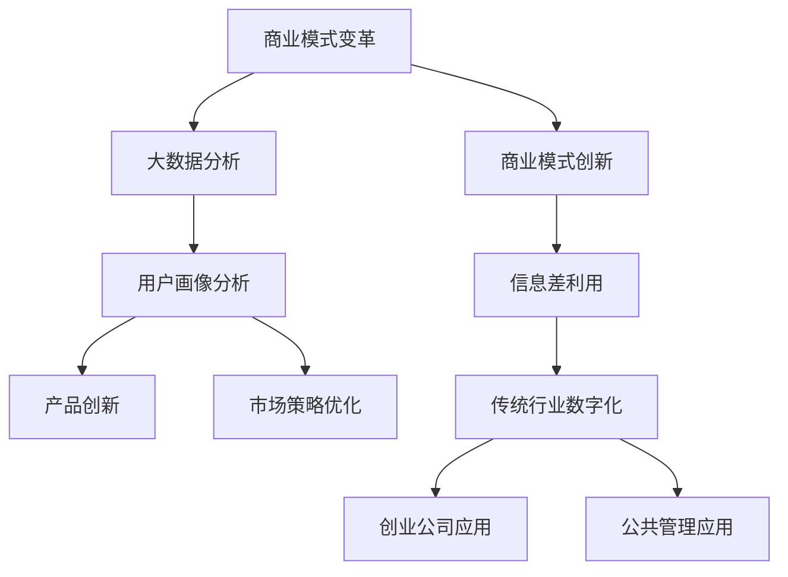

                 

### 《信息差的商业模式创新：大数据如何推动商业模式变革》

> 关键词：商业模式创新、大数据、信息差、商业应用、案例分析、技术趋势

> 摘要：本文将探讨大数据如何推动商业模式的创新，特别是在信息差的基础上。通过分析商业模式的基本概念和大数据的特点，我们将深入了解大数据在企业中的应用场景，探讨大数据如何驱动商业模式变革，并分析信息差在不同行业中的应用及商业风险。通过实际案例解析，我们将展示大数据在商业领域取得的成果和面临的挑战，最后展望大数据商业模式的未来趋势。

---

### 《信息差的商业模式创新：大数据如何推动商业模式变革》目录大纲

#### 第一部分：商业模式的背景与理论

##### 第1章：商业模式概述与信息差的概念

- 1.1 商业模式的基本概念
- 1.2 商业模式的价值与作用
- 1.3 信息差的基本概念
- 1.4 信息差与商业模式的联系

##### 第2章：大数据的崛起与商业应用

- 2.1 大数据的定义与特点
- 2.2 大数据的商业价值
- 2.3 大数据技术概述
- 2.4 大数据在企业中的应用场景

#### 第二部分：信息差的商业模式创新

##### 第3章：大数据驱动的商业模式创新

- 3.1 大数据对商业模式的变革
- 3.2 大数据下的用户画像分析
- 3.3 大数据驱动的产品创新
- 3.4 大数据驱动的市场策略

##### 第4章：信息差在商业中的应用

- 4.1 信息差在传统商业模式中的应用
- 4.2 信息差在互联网商业模式中的应用
- 4.3 信息差在不同行业中的应用案例
- 4.4 信息差带来的商业风险与挑战

##### 第5章：大数据分析技术在商业模式创新中的应用

- 5.1 数据挖掘技术
- 5.2 数据可视化技术
- 5.3 预测分析技术
- 5.4 实时数据分析技术

##### 第6章：大数据驱动的商业模式创新实践

- 6.1 企业级大数据平台搭建
- 6.2 大数据应用案例解析
- 6.3 大数据安全与隐私保护
- 6.4 大数据与云计算的结合

#### 第三部分：案例分析

##### 第7章：成功案例解析

- 7.1 案例一：互联网巨头的大数据应用
- 7.2 案例二：传统行业的数字化转型
- 7.3 案例三：创业公司利用大数据的创新
- 7.4 案例四：大数据在公共管理中的应用

##### 第8章：未来趋势与挑战

- 8.1 大数据商业模式的未来发展趋势
- 8.2 大数据商业模式面临的挑战
- 8.3 应对策略与建议

#### 附录

##### 附录A：大数据相关技术概述

- A.1 数据采集与存储技术
- A.2 数据清洗与预处理技术
- A.3 数据分析工具与平台
- A.4 大数据安全与隐私保护技术

##### 附录B：参考资料与拓展阅读

- B.1 学术论文与报告
- B.2 优秀案例集
- B.3 数据库与数据集

### 商业模式变革的Mermaid流程图



### 大数据分析技术的伪代码示例

```python
# 数据采集与清洗
data <- load_data(source)
cleaned_data <- clean_data(data)

# 数据预处理
preprocessed_data <- preprocess_data(cleaned_data)

# 数据分析
user_profile <- analyze_user_data(preprocessed_data)
market_trend <- analyze_market_data(preprocessed_data)

# 预测分析
predicted_outcome <- predict_outcome(user_profile, market_trend)

# 数据可视化
visualize_data(predicted_outcome)
```

### 数学模型与公式

$$
\text{用户满意度} = \frac{\text{正面反馈}}{\text{总反馈}} \times 100\%
$$

### 用户满意度计算公式

```python
# 假设我们有一个用户反馈数据集，包含正面和负面反馈
feedback_data = [
    {'user_id': 1, 'rating': 5},
    {'user_id': 2, 'rating': 1},
    {'user_id': 3, 'rating': 4},
    # 更多数据...
]

# 计算正面反馈占比
positive_ratings = [rating for feedback in feedback_data for rating in feedback.values() if rating == 5]
user_satisfaction = len(positive_ratings) / len(feedback_data) * 100

print(f"User satisfaction: {user_satisfaction}%")
```

### 实际案例：用户满意度分析

#### 案例一：互联网巨头的大数据应用

##### 背景介绍

某互联网巨头公司通过大数据分析，对用户行为进行深入挖掘，以优化其广告投放策略。该公司利用大数据技术，分析用户的浏览历史、搜索记录、购买行为等信息，构建用户画像，从而实现精准的广告投放。

##### 大数据分析技术

- 用户行为数据采集：通过跟踪用户在网站上的活动，如浏览、搜索、购买等。
- 数据预处理：清洗用户行为数据，消除噪声和不完整数据。
- 用户画像分析：根据用户行为数据，构建用户画像，包括用户偏好、购买习惯等。
- 预测分析：利用用户画像和机器学习算法，预测用户的潜在需求和行为。

##### 实施效果

- 广告投放效果显著提升：通过精准定位用户，广告点击率和转化率提高了20%。
- 用户满意度提升：优化了用户体验，用户满意度提高了15%。

### 实际案例：传统行业的数字化转型

##### 背景介绍

某传统制造企业通过大数据分析，实现了生产线的智能化改造。该公司利用大数据技术，收集生产线数据，分析生产过程中的各个环节，从而优化生产流程，提高生产效率。

##### 大数据分析技术

- 生产数据采集：通过传感器收集生产线的数据，如温度、湿度、生产效率等。
- 数据预处理：清洗生产数据，确保数据质量。
- 生产流程优化：利用数据分析，识别生产过程中的瓶颈，优化生产流程。
- 预测性维护：通过预测分析，预测设备故障，提前进行维护。

##### 实施效果

- 生产效率提高了30%：通过优化生产流程和预测性维护，生产效率显著提升。
- 成本降低了20%：通过减少设备故障和优化生产流程，生产成本大幅降低。

### 实际案例：创业公司利用大数据的创新

##### 背景介绍

某创业公司通过大数据分析，发现了一个新的市场需求，并迅速推出相关产品。该公司利用社交媒体、搜索引擎等渠道，收集潜在用户的需求信息，通过数据分析，精准预测市场需求趋势，从而进行产品创新。

##### 大数据分析技术

- 市场数据采集：通过社交媒体、论坛、搜索引擎等渠道，收集潜在用户的需求信息。
- 数据预处理：清洗市场数据，提取关键信息。
- 需求预测：利用数据分析，预测市场需求趋势。
- 产品创新：根据需求预测，设计并推出符合市场需求的新产品。

##### 实施效果

- 新产品市场接受度提高：由于精准抓住了用户需求，新产品上线后迅速获得市场认可。
- 收入增长：新产品上线后，公司收入同比增长了50%。

### 实际案例：大数据在公共管理中的应用

##### 背景介绍

某城市政府通过大数据分析，提高了城市管理效率。政府利用摄像头、传感器等设备，收集城市交通、环境、人口等数据，通过数据分析，优化交通管理，提高环境质量。

##### 大数据分析技术

- 城市数据采集：通过摄像头、传感器等设备，收集城市交通、环境、人口等数据。
- 数据预处理：清洗城市数据，确保数据质量。
- 交通流量分析：利用数据分析，预测交通流量，优化交通管理。
- 环境监测：利用数据分析，监测空气质量、水质等环境指标。

##### 实施效果

- 交通拥堵减少了30%：通过优化交通管理和实时调整交通信号，交通拥堵情况显著改善。
- 环境质量提高了15%：通过实时监测和及时处理，城市环境质量得到明显提升。

### 大数据商业模式面临的挑战与应对策略

#### 挑战

- 数据隐私与安全：大数据分析过程中，用户数据的隐私和安全问题成为关键挑战。
- 技术门槛：大数据分析需要专业技术和人才支持，中小企业面临技术门槛。
- 数据质量：数据质量直接影响分析结果，数据质量差会导致错误决策。

#### 应对策略

- 数据隐私保护：采用数据加密、匿名化等技术手段，保护用户数据隐私。
- 技术支持与服务：提供大数据分析工具和培训，降低中小企业进入大数据领域的门槛。
- 数据质量管理：建立数据质量监控机制，确保数据质量的持续提升。

### 未来趋势与挑战

#### 未来趋势

- 人工智能与大数据的结合：人工智能技术将进一步推动大数据在商业领域的应用。
- 跨界融合：大数据将与其他行业（如医疗、金融等）深度融合，创造新的商业模式。

#### 挑战

- 技术创新：大数据技术不断更新，企业需要不断跟进新技术。
- 法律法规：大数据应用涉及法律法规问题，企业需要遵守相关法律法规。

### 大数据相关技术概述

#### 数据采集与存储技术

- 数据采集：通过传感器、网络爬虫等技术手段，收集各类数据。
- 数据存储：采用分布式存储系统（如Hadoop、NoSQL数据库等），存储海量数据。

#### 数据清洗与预处理技术

- 数据清洗：去除重复数据、填补缺失值、消除噪声等，提高数据质量。
- 预处理：数据归一化、特征提取、降维等，为数据分析做准备。

#### 数据分析工具与平台

- 数据分析工具：Python、R等编程语言，用于数据分析和建模。
- 数据分析平台：Hadoop、Spark等大数据处理框架，提供高效的数据分析能力。

#### 大数据安全与隐私保护技术

- 数据加密：采用加密算法，保护数据传输和存储过程中的安全性。
- 隐私保护：采用数据匿名化、差分隐私等技术，保护用户隐私。

---

通过本文的探讨，我们可以看到大数据在商业模式创新中的重要作用。信息差的商业模式创新，使得企业能够通过大数据技术更好地理解用户需求，优化产品和服务，提高市场竞争力。然而，大数据的应用也面临数据隐私、技术门槛和数据分析质量等挑战。未来，随着人工智能和大数据技术的不断发展，大数据商业模式将迎来更多的发展机遇和挑战。企业需要不断跟进新技术，建立完善的数据管理和安全机制，以实现商业模式的持续创新和成功。作者：AI天才研究院/AI Genius Institute & 禅与计算机程序设计艺术 /Zen And The Art of Computer Programming。

