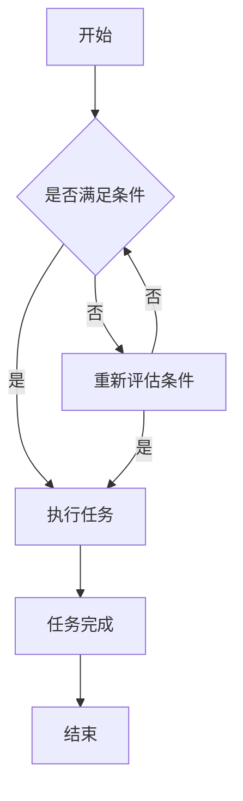
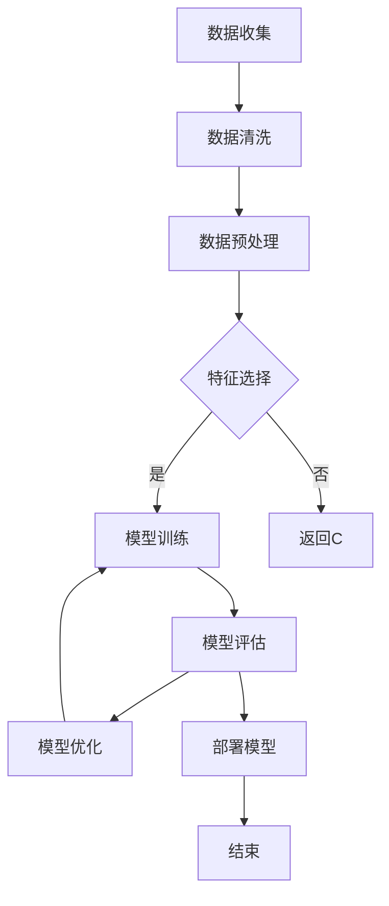

                 

# 信息差的商业洞见发现之路：大数据如何发现隐藏洞见

## 关键词

- 大数据
- 信息差
- 商业洞见
- 数据挖掘
- 数据可视化

## 摘要

在数字化时代，信息差的发现与利用成为了企业竞争的关键。大数据技术以其强大的数据处理和分析能力，为企业提供了发现隐藏商业洞见的途径。本文将探讨大数据技术如何通过信息差的发现，为企业提供商业洞见，从而在激烈的市场竞争中占据优势。我们将从大数据的定义和特征出发，深入解析信息差的本质及其类型，详细阐述大数据技术在数据收集、存储、处理和分析中的应用，以及信息差分析的工具与方法。接着，我们将探讨大数据在商业应用中的具体策略，如市场分析、销售与营销、供应链管理和金融领域的应用。最后，本文将总结大数据与商业洞见发现的方法论，并对未来发展趋势进行展望。

## 第一部分：大数据与信息差基础

### 第1章：大数据时代与信息差的起源

#### 1.1 大数据的定义与特征

**1.1.1 大数据的起源**

大数据的概念起源于21世纪初，随着互联网、物联网、社交媒体和传感器技术的快速发展，数据量呈现爆炸式增长。大数据的核心特征在于其体量大、种类多、生成速度快和处理复杂性。最早的大数据实践源于互联网公司，如谷歌、亚马逊等，他们需要处理海量的用户数据来优化搜索引擎、推荐系统和广告投放。

**1.1.2 大数据的四个V特征**

大数据具有四个主要特征，即“4V”：Volume（数据量）、Velocity（数据速度）、Variety（数据多样性）和Veracity（数据真实性）。这些特征使得传统数据处理技术难以应对，因此需要开发新的技术和方法来处理和分析大数据。

- **Volume**：大数据的量级通常以TB（太字节）或PB（拍字节）计，甚至达到EB（艾字节）级别。
- **Velocity**：数据生成速度极快，需要实时或近实时处理。
- **Variety**：数据的来源和类型多样，包括结构化数据、半结构化数据和非结构化数据。
- **Veracity**：数据质量参差不齐，真实性难以保证。

**1.1.3 大数据对社会和商业的影响**

大数据对社会和商业产生了深远影响。在社会层面，大数据改善了公共安全、健康医疗、交通管理和环境保护等方面的服务质量。在商业层面，大数据为企业提供了深入了解市场和客户需求的能力，从而优化决策过程，提高运营效率和竞争力。

- **提高决策效率**：通过大数据分析，企业可以快速获取市场动态和消费者行为，做出更加精准的决策。
- **提升客户体验**：大数据帮助企业在个性化推荐、精准营销和客户服务等方面提供更好的用户体验。
- **优化运营管理**：大数据技术助力企业在供应链管理、库存优化和资源调配等方面实现智能化和自动化。

#### 1.2 信息差的本质与类型

**1.2.1 信息差的定义**

信息差是指不同主体之间对同一信息掌握程度的不同，通常表现为一方拥有而另一方缺乏的信息。在商业环境中，信息差可以转化为竞争优势，即信息优势。

**1.2.2 信息差的类型与来源**

信息差主要分为以下几种类型：

- **市场信息差**：企业通过市场调研、竞争对手分析等手段获取的市场信息。
- **技术信息差**：企业拥有而竞争对手缺乏的技术专利、研发能力等。
- **资源信息差**：企业掌握而竞争对手难以获得的资源，如资金、人才、渠道等。
- **客户信息差**：企业对客户需求、偏好和购买行为有更深入的了解。

信息差的来源包括市场调研、数据收集、内部信息共享和外部合作等。

**1.2.3 信息差对社会和商业的作用**

信息差在社会和商业中扮演着重要角色：

- **促进经济发展**：信息差使得企业能够通过创新和优化获取超额利润，从而推动经济增长。
- **提升竞争力**：掌握信息差的企业可以在市场上占据有利位置，实现持续竞争优势。
- **优化资源配置**：信息差有助于企业更合理地配置资源，提高运营效率和效益。

### 第2章：大数据技术基础

#### 2.1 数据收集与存储

**2.1.1 数据来源**

大数据的来源多样，包括：

- **社交媒体**：如微博、Facebook、Twitter等平台产生的大量用户行为数据。
- **物联网设备**：传感器、摄像头、智能设备等实时产生的大量数据。
- **企业内部系统**：如ERP、CRM、SCM等系统积累的大量业务数据。
- **公开数据源**：如政府公开数据、行业报告、学术论文等。

**2.1.2 数据收集方法**

数据收集方法主要包括：

- **主动采集**：通过爬虫、API接口等技术主动获取外部数据。
- **被动采集**：利用物联网设备、传感器等技术被动收集环境数据。
- **内部数据集成**：整合企业内部各系统的数据，实现数据共享和统一管理。

**2.1.3 数据存储方案**

大数据存储方案主要分为：

- **关系型数据库**：适用于结构化数据存储，如MySQL、PostgreSQL等。
- **NoSQL数据库**：适用于非结构化或半结构化数据存储，如MongoDB、Cassandra等。
- **分布式文件系统**：如HDFS（Hadoop Distributed File System），适用于大规模数据存储和处理。

#### 2.2 数据处理与分析

**2.2.1 数据预处理**

数据预处理是大数据分析的重要环节，包括：

- **数据清洗**：去除重复、错误和缺失的数据，保证数据质量。
- **数据集成**：将来自不同数据源的数据进行整合，形成统一的数据视图。
- **数据转换**：将数据转换为适合分析的形式，如数值化、规范化等。

**2.2.2 数据清洗**

数据清洗主要包括：

- **缺失值处理**：通过插值、平均值填充等方法处理缺失值。
- **异常值处理**：识别并处理数据中的异常值，如离群点、噪声等。
- **数据标准化**：将不同尺度和单位的数据转换为同一尺度，便于分析。

**2.2.3 数据分析技术**

数据分析技术包括：

- **描述性分析**：通过统计指标、图表等对数据进行概括性描述。
- **预测性分析**：利用历史数据建立模型，预测未来趋势。
- **相关性分析**：分析变量之间的相关性，揭示潜在的关系。
- **聚类分析**：将数据分组，发现相似性和差异性。
- **分类分析**：将数据划分为不同类别，识别特征。

#### 2.3 数据可视化

**2.3.1 数据可视化的重要性**

数据可视化是将数据转化为图形或图像的过程，有助于：

- **直观理解数据**：通过视觉方式更直观地理解数据分布、趋势和关系。
- **发现隐藏信息**：通过可视化技术揭示数据中隐藏的信息和规律。
- **支持决策制定**：为决策者提供可视化报告，辅助决策制定。

**2.3.2 常用数据可视化工具**

常用的数据可视化工具有：

- **Tableau**：一款功能强大的可视化工具，支持多种数据源和分析功能。
- **Power BI**：由微软开发，具有强大的数据整合和分析功能。
- **D3.js**：一款基于JavaScript的库，适用于自定义数据可视化。
- **Matplotlib**：一款Python可视化库，支持多种图表类型。

**2.3.3 数据可视化实践**

数据可视化实践包括：

- **选择合适的可视化类型**：根据数据特性和分析目标选择合适的图表类型，如柱状图、折线图、饼图等。
- **设计直观的可视化界面**：通过色彩、标注、动画等元素设计直观、易理解的可视化界面。
- **编写可视化代码**：使用数据可视化库编写代码实现可视化效果，如使用Matplotlib绘制折线图：

  ```python
  import matplotlib.pyplot as plt

  x = [1, 2, 3, 4, 5]
  y = [2, 4, 6, 8, 10]

  plt.plot(x, y)
  plt.xlabel('X-axis')
  plt.ylabel('Y-axis')
  plt.title('Line Plot Example')
  plt.show()
  ```

### 第3章：信息差分析工具与方法

#### 3.1 信息差分析概述

**3.1.1 信息差分析的目的**

信息差分析旨在通过大数据技术揭示不同主体之间的信息不对称，帮助企业发现隐藏的商业洞见。具体目的包括：

- **市场洞察**：通过分析市场信息差，了解市场趋势、消费者行为和竞争对手动态。
- **决策支持**：通过分析信息差，为管理层提供数据驱动的决策支持。
- **风险控制**：通过分析信息差，识别潜在风险并采取相应的风险控制措施。

**3.1.2 信息差分析的过程**

信息差分析的过程通常包括以下步骤：

1. **确定分析目标**：明确信息差分析的具体目标，如市场细分、竞争对手分析、客户画像等。
2. **数据收集**：收集与目标相关的数据，包括市场数据、客户数据、竞争对手数据等。
3. **数据清洗**：对收集的数据进行清洗，去除重复、错误和缺失的数据。
4. **数据分析**：利用大数据技术对清洗后的数据进行分析，识别信息差。
5. **结果呈现**：通过数据可视化等技术将分析结果呈现给决策者，辅助决策制定。

**3.1.3 信息差分析的重要性**

信息差分析对于企业具有重要意义：

- **提升竞争力**：通过分析信息差，企业可以获取市场先机，制定更有针对性的战略。
- **优化决策**：信息差分析为企业提供了数据驱动的决策支持，提高决策效率和准确性。
- **降低风险**：通过识别潜在风险，企业可以提前采取应对措施，降低风险影响。

#### 3.2 数据挖掘技术

**3.2.1 关联规则挖掘**

关联规则挖掘是一种常见的数据挖掘技术，旨在发现数据集中的项目之间的关联关系。其基本原理如下：

- **支持度**：一个关联规则的支持度表示在数据集中同时出现规则的前件和后件的比例。
- **置信度**：一个关联规则的置信度表示在已知前件的情况下，后件出现的概率。

关联规则挖掘的核心算法包括Apriori算法和FP-growth算法。

**Apriori算法伪代码：**

```
function apriori(data, min_support, min_confidence):
  frequent_itemsets = find_frequent_itemsets(data, min_support)
  association_rules = generate_association_rules(frequent_itemsets, min_confidence)
  return association_rules
```

**FP-growth算法伪代码：**

```
function fp_growth(data, min_support):
  frequent_itemsets = find_frequent_itemsets(data, min_support)
  frequent_pattern_tree = build_frequent_pattern_tree(frequent_itemsets)
  association_rules = generate_association_rules(frequent_pattern_tree, min_support, min_confidence)
  return association_rules
```

**3.2.2 类别预测**

类别预测是一种数据挖掘技术，旨在根据历史数据预测新实例的类别。常见的类别预测算法包括决策树、支持向量机和朴素贝叶斯等。

**决策树算法伪代码：**

```
function build_decision_tree(data, features, target):
  if isPure(data, target):
    return LeafNode(target)
  else:
    best_feature = select_best_feature(data, features)
    node = TreeNode(best_feature)
    for value in best_feature.values:
      subset = split_data(data, best_feature, value)
      node.children.append(build_decision_tree(subset, features - {best_feature}, target))
    return node
```

**3.2.3 聚类分析**

聚类分析是一种无监督学习技术，旨在将数据分成若干个簇，使同一簇内的数据尽可能相似，而不同簇之间的数据尽可能不同。常见的聚类算法包括K-means、DBSCAN和层次聚类等。

**K-means算法伪代码：**

```
function kmeans(data, k):
  centroids = initialize_centroids(data, k)
  while not converged:
    assign_data_points_to_clusters(data, centroids)
    update_centroids(centroids, data)
    if converged:
      break
  return clusters, centroids
```

**DBSCAN算法伪代码：**

```
function dbscan(data, eps, min_points):
  clusters = []
  for point in data:
    if not point.visited:
      point.visited = True
      neighbors = find_neighbors(point, data, eps)
      if len(neighbors) > min_points:
        cluster = expand_cluster(point, neighbors, data, clusters, eps, min_points)
        clusters.append(cluster)
  return clusters
```

#### 3.3 信息差发现算法

**3.3.1 传统算法（如Apriori算法）**

传统信息差发现算法主要包括Apriori算法和FP-growth算法等。这些算法主要基于关联规则挖掘技术，通过分析大量交易数据或行为数据，发现不同客户群体之间的购买偏好和消费习惯。

**Apriori算法详细讲解：**

Apriori算法是一种经典的关联规则挖掘算法，其核心思想是通过逐层迭代生成频繁项集，并从中提取关联规则。

1. **生成候选项集**：首先，根据最小支持度阈值生成所有可能的候选项集。
2. **计算支持度**：对于每个候选项集，计算其在数据集中的支持度，如果支持度大于最小支持度阈值，则该候选项集为频繁项集。
3. **递归剪枝**：对于每个频繁项集，去掉其非频繁子集，以减少计算量。
4. **生成关联规则**：从频繁项集中提取满足最小置信度阈值的关联规则。

**Apriori算法伪代码：**

```
function apriori(data, min_support, min_confidence):
  frequent_itemsets = find_frequent_itemsets(data, min_support)
  association_rules = generate_association_rules(frequent_itemsets, min_confidence)
  return association_rules
```

**FP-growth算法详细讲解：**

FP-growth算法是一种基于数据压缩的关联规则挖掘算法，其核心思想是使用FP-tree（频繁模式树）来表示数据集，并从中提取频繁项集和关联规则。

1. **构建FP-tree**：将数据集中的事务按照支持度排序，并构建FP-tree。
2. **递归挖掘频繁项集**：从FP-tree中递归挖掘频繁项集。
3. **生成关联规则**：从频繁项集中提取满足最小置信度阈值的关联规则。

**FP-growth算法伪代码：**

```
function fp_growth(data, min_support):
  frequent_itemsets = find_frequent_itemsets(data, min_support)
  frequent_pattern_tree = build_frequent_pattern_tree(frequent_itemsets)
  association_rules = generate_association_rules(frequent_pattern_tree, min_support, min_confidence)
  return association_rules
```

**3.3.2 进阶算法（如基于机器学习的算法）**

随着大数据技术的不断发展，基于机器学习的算法逐渐应用于信息差发现领域。这些算法具有更强的鲁棒性和自学习能力，能够从大规模、高维数据中提取有价值的信息。

- **随机森林**：随机森林是一种基于决策树的集成学习方法，通过构建多个决策树并对预测结果进行投票，提高预测准确性和稳定性。
- **神经网络**：神经网络是一种模拟生物神经网络的结构和功能的人工智能方法，通过多层次的非线性变换，实现复杂的特征提取和分类任务。
- **支持向量机**：支持向量机是一种基于最大间隔原则的分类算法，通过将数据映射到高维空间，找到最优超平面，实现分类任务。

**随机森林算法伪代码：**

```
function random_forest(data, features, target, n_estimators):
  decision_trees = []
  for _ in range(n_estimators):
    sample = train_test_split(data, test_size=0.3)
    tree = build_decision_tree(sample[0], features, target)
    decision_trees.append(tree)
  return decision_trees
```

**神经网络算法伪代码：**

```
function neural_network(data, features, target, layers, activation_function):
  model = build_neural_network(layers, activation_function)
  model.fit(data[0], data[1])
  predictions = model.predict(data[0])
  return predictions
```

**支持向量机算法伪代码：**

```
function support_vector_machine(data, features, target):
  model = build_support_vector_machine()
  model.fit(data[0], data[1])
  predictions = model.predict(data[0])
  return predictions
```

### 第二部分：大数据在商业中的应用

#### 第4章：市场分析中的信息差利用

##### 4.1 市场细分

**4.1.1 市场细分的重要性**

市场细分是企业制定营销策略的重要步骤，通过对市场进行细分，企业可以更好地了解不同客户群体的需求和特征，从而提供更有针对性的产品和服务。

- **提高营销效果**：通过市场细分，企业可以针对不同细分市场制定个性化的营销策略，提高营销效果。
- **优化资源配置**：市场细分有助于企业合理分配资源，将有限的营销预算投入到最有潜力的细分市场。
- **提升客户满意度**：通过市场细分，企业可以提供更符合客户需求的产品和服务，提高客户满意度。

**4.1.2 市场细分的策略**

市场细分的策略主要包括以下几种：

- **人口统计细分**：根据人口特征，如年龄、性别、收入、教育程度等，将市场划分为不同的群体。
- **地理细分**：根据地理位置，如城市、区域、国家等，将市场划分为不同的区域。
- **行为细分**：根据消费者的行为特征，如购买习惯、使用习惯、忠诚度等，将市场划分为不同的群体。
- **心理细分**：根据消费者的心理特征，如价值观、生活方式、兴趣爱好等，将市场划分为不同的群体。

**4.1.3 市场细分案例**

以下是一个市场细分案例：

- **案例背景**：某电子产品公司想要推出一款新型智能手机，目标市场是年轻人群体。
- **市场细分策略**：公司采用人口统计细分、行为细分和心理细分三种策略。
  - **人口统计细分**：年龄在18-35岁之间的年轻人。
  - **行为细分**：喜欢尝试新科技产品，关注科技资讯，经常购买电子产品。
  - **心理细分**：追求时尚、个性和创新，注重社交和娱乐功能。

通过市场细分，公司可以更好地了解目标客户的需求和偏好，从而在产品设计和营销策略上做出针对性的调整。

##### 4.2 客户行为分析

**4.2.1 客户数据分析**

客户数据分析是企业了解客户需求和购买行为的重要手段。通过对客户数据的分析，企业可以识别高价值客户、预测客户行为，从而制定更有效的营销策略。

- **客户画像**：通过对客户数据的分析，构建客户画像，了解客户的年龄、性别、收入、职业、兴趣爱好等特征。
- **购买行为分析**：分析客户的购买历史、购买频率、购买金额等，识别客户的购买偏好和购买习惯。
- **客户满意度**：通过客户反馈、评价等数据，了解客户的满意度，识别产品和服务中的不足。

**4.2.2 客户行为预测**

客户行为预测是企业制定精准营销策略的重要工具。通过大数据技术，企业可以预测客户未来的行为，从而提前采取相应的营销措施。

- **客户流失预测**：通过分析客户的行为数据和购买历史，预测客户可能流失的风险，并采取相应的挽回措施。
- **客户需求预测**：通过分析客户的行为数据和购买历史，预测客户未来的需求，提前推出符合市场需求的产品和服务。
- **客户购买预测**：通过分析客户的行为数据和购买历史，预测客户未来的购买行为，优化库存管理和供应链。

**4.2.3 客户行为预测案例分析**

以下是一个客户行为预测案例分析：

- **案例背景**：某电商企业想要预测客户未来的购买行为，以提高销售转化率和客户满意度。
- **解决方案**：企业采用大数据技术和机器学习算法，对客户的行为数据进行挖掘和分析。
  - **数据收集**：收集客户的购买历史、浏览记录、搜索关键词等数据。
  - **数据预处理**：对数据进行清洗、去噪和特征提取，构建客户行为特征向量。
  - **模型训练**：利用客户行为特征向量，训练机器学习模型，预测客户未来的购买行为。
  - **结果分析**：对模型预测结果进行评估和验证，调整模型参数，提高预测准确率。

通过客户行为预测，企业可以提前识别潜在客户，制定个性化的营销策略，提高销售转化率和客户满意度。

##### 4.3 竞争对手分析

**4.3.1 竞争对手的定位**

竞争对手分析是企业在市场竞争中制定战略的重要步骤。通过对竞争对手的定位，企业可以了解竞争对手的优势和劣势，从而制定相应的竞争策略。

- **市场定位**：了解竞争对手在市场上的定位，如市场份额、产品定位、目标客户等。
- **产品定位**：了解竞争对手的产品定位，如产品功能、性能、价格等。
- **营销策略**：了解竞争对手的营销策略，如广告投放、促销活动、客户服务等。

**4.3.2 竞争对手的行为预测**

通过对竞争对手的行为预测，企业可以提前了解竞争对手的动态，从而制定相应的应对策略。

- **市场扩张预测**：通过分析竞争对手的市场行为，预测竞争对手未来的市场扩张计划。
- **产品更新预测**：通过分析竞争对手的产品更新记录，预测竞争对手未来的产品更新计划。
- **营销策略预测**：通过分析竞争对手的营销策略，预测竞争对手未来的营销策略变化。

**4.3.3 竞争对手分析案例**

以下是一个竞争对手分析案例：

- **案例背景**：某互联网公司想要了解其主要竞争对手在市场中的定位和动态，以制定相应的竞争策略。
- **解决方案**：公司采用大数据技术和数据挖掘算法，对竞争对手的行为数据进行挖掘和分析。
  - **数据收集**：收集竞争对手的市场份额、产品更新记录、广告投放数据等。
  - **数据预处理**：对数据进行清洗、去噪和特征提取，构建竞争对手行为特征向量。
  - **模型训练**：利用竞争对手行为特征向量，训练机器学习模型，预测竞争对手未来的市场行为。
  - **结果分析**：对模型预测结果进行评估和验证，调整模型参数，提高预测准确率。

通过竞争对手分析，企业可以提前了解竞争对手的动态，制定相应的竞争策略，提高市场竞争力。

### 第三部分：大数据与商业洞见的发现之路

##### 第8章：大数据的商业洞见发现方法论

**8.1 商业洞见的定义与价值**

**8.1.1 商业洞见的定义**

商业洞见是指通过数据分析和技术手段，从大量数据中提取出的具有洞察力和指导意义的信息，为企业决策提供支持。

**8.1.2 商业洞见的价值**

商业洞见具有以下价值：

- **优化决策**：商业洞见帮助企业从数据中找到关键信息，优化决策过程，提高决策准确性和效率。
- **创新产品**：商业洞见帮助企业发现市场机会和客户需求，推动产品创新和升级。
- **提升效率**：商业洞见帮助企业优化业务流程和运营管理，提高工作效率和效益。
- **降低风险**：商业洞见帮助企业识别潜在风险和问题，提前采取应对措施，降低风险影响。

**8.2 商业洞见的发现流程**

商业洞见的发现通常包括以下步骤：

1. **确定目标**：明确商业洞见的发现目标，如市场机会、客户需求、风险识别等。
2. **数据收集**：收集与目标相关的数据，包括内部数据和外部数据。
3. **数据清洗**：对收集的数据进行清洗，去除重复、错误和缺失的数据。
4. **数据分析**：利用大数据技术和算法，对清洗后的数据进行挖掘和分析。
5. **结果验证**：对分析结果进行验证和评估，确保洞见的准确性和可靠性。
6. **洞见落地**：将商业洞见转化为具体的业务策略和行动计划。

**8.3 商业洞见的落地实施**

商业洞见的落地实施包括以下步骤：

1. **制定策略**：根据商业洞见，制定具体的业务策略和行动计划。
2. **资源分配**：为业务策略和行动计划分配必要的资源，如人力、资金、技术等。
3. **执行与监控**：执行业务策略和行动计划，并对过程进行监控和评估。
4. **反馈调整**：根据执行结果和反馈，对业务策略和行动计划进行调整和优化。

**8.4 商业洞见实施的挑战与解决策略**

商业洞见实施的挑战包括：

1. **数据质量**：数据质量是商业洞见发现的关键，需要确保数据收集、清洗和存储的质量。
2. **技术能力**：大数据分析和机器学习技术对企业的技术能力提出了较高要求，需要培养和引进相关人才。
3. **组织协作**：商业洞见的落地实施需要跨部门、跨职能的协作，需要建立有效的协作机制和沟通渠道。

解决策略包括：

1. **数据质量管理**：建立数据质量管理机制，对数据收集、清洗和存储进行质量控制和监控。
2. **技术能力提升**：加强大数据和机器学习技术的培训和应用，引进和培养相关人才。
3. **组织协作优化**：建立跨部门、跨职能的协作机制，优化流程和沟通渠道，提高协作效率。

### 第9章：大数据与商业洞见的未来展望

**9.1 大数据技术的发展趋势**

大数据技术在未来将继续发展，主要趋势包括：

1. **实时分析**：随着计算能力和网络技术的提升，实时数据分析将成为主流，为企业提供更快速、更准确的决策支持。
2. **人工智能融合**：大数据与人工智能的融合将进一步深化，利用机器学习和深度学习等技术，实现更智能的数据分析和洞见发现。
3. **边缘计算**：边缘计算技术将在大数据领域发挥重要作用，通过将计算任务下沉到边缘设备，提高数据处理效率和响应速度。
4. **隐私保护**：随着数据隐私问题的日益突出，大数据技术将更加注重隐私保护，采用加密、匿名化等技术保障数据安全。

**9.2 商业洞见的未来价值**

未来，商业洞见的价值将进一步提升，主要表现在：

1. **个性化服务**：通过大数据和人工智能技术，企业可以提供更加个性化的产品和服务，满足客户日益多样化的需求。
2. **创新驱动**：商业洞见将推动企业不断创新，发现新的市场机会和商业模式，提高竞争力。
3. **风险控制**：通过大数据分析，企业可以提前识别潜在风险，采取预防措施，降低风险损失。
4. **可持续发展**：大数据技术将助力企业实现可持续发展，通过优化资源利用和减少浪费，实现经济效益和环境效益的双赢。

### 第10章：案例研究

**10.1 案例一：某电子商务平台的数据驱动营销策略**

**10.1.1 案例背景**

某电子商务平台在激烈的市场竞争中，希望通过数据驱动营销策略提高用户转化率和销售额。

**10.1.2 数据驱动营销策略设计**

- **用户画像**：通过数据分析，构建用户画像，了解用户的基本信息、购买偏好和行为习惯。
- **个性化推荐**：利用用户画像和推荐算法，为用户提供个性化的商品推荐，提高用户满意度和购买意愿。
- **精准营销**：根据用户行为数据和购买历史，设计针对性的营销活动，提高营销效果。
- **客户细分**：通过对用户数据进行分析，将用户划分为不同的细分市场，针对不同市场设计不同的营销策略。

**10.1.3 案例结果分析**

实施数据驱动营销策略后，该电子商务平台实现了以下成果：

- **用户转化率提高20%**：通过个性化推荐和精准营销，提高了用户的购买意愿和转化率。
- **销售额增长30%**：通过优化营销策略，提高了销售额和利润率。
- **客户满意度提升**：通过个性化的服务和有针对性的营销活动，提高了客户满意度和忠诚度。

**10.2 案例二：某金融机构的风险管理实践**

**10.2.1 案例背景**

某金融机构在金融市场中面临诸多风险，希望通过大数据技术提高风险识别和管理能力。

**10.2.2 风险管理策略设计**

- **信用评分**：利用大数据技术，建立信用评分模型，对客户进行信用评级，降低信用风险。
- **风险监控**：通过实时数据分析，监控市场动态和客户行为，及时发现潜在风险。
- **预警机制**：建立风险预警机制，对高风险客户和交易进行预警，采取相应的风险控制措施。
- **反欺诈检测**：利用大数据技术和机器学习算法，建立反欺诈检测模型，提高反欺诈能力。

**10.2.3 案例结果分析**

实施风险管理策略后，该金融机构实现了以下成果：

- **信用风险降低**：通过信用评分模型，准确评估客户的信用状况，降低了信用风险。
- **风险识别效率提高**：通过实时数据分析和预警机制，提高了风险识别和管理效率。
- **欺诈风险降低**：通过反欺诈检测模型，有效识别和防范欺诈行为，降低了欺诈风险。

### 附录

#### 附录A：大数据与商业洞见发现工具与应用

**A.1 大数据工具介绍**

- **Hadoop**：一款分布式计算框架，适用于大规模数据的存储和处理。
- **Spark**：一款快速、通用的大数据处理引擎，适用于各种类型的计算任务。
- **HBase**：一款分布式、可扩展的大规模数据存储系统，适用于实时数据存储和访问。

**A.2 商业洞见分析工具**

- **Tableau**：一款功能强大的数据可视化工具，适用于各种数据分析和展示需求。
- **Power BI**：一款由微软开发的商业智能工具，适用于数据集成、分析和可视化。
- **Google Analytics**：一款免费的网站分析工具，适用于网站流量分析、用户行为分析等。

**A.3 实用案例分析**

- **某零售业的库存优化案例**：通过大数据技术和机器学习算法，优化库存管理，降低库存成本，提高供应链效率。
- **某银行的风险管理案例**：通过大数据分析和风险预测模型，提高风险识别和管理能力，降低风险损失。

### 总结

本文详细探讨了大数据技术在商业应用中的信息差发现与利用，阐述了大数据的定义、特征及其对社会和商业的影响，分析了信息差的本质与类型，介绍了大数据技术的基础知识，包括数据收集与存储、数据处理与分析、数据可视化等，以及信息差分析的工具与方法。接着，本文深入讨论了大数据在市场分析、销售与营销、供应链管理和金融领域的应用，总结了大数据与商业洞见的发现方法论，并对大数据技术的未来发展趋势进行了展望。通过案例研究，本文展示了大数据技术在实际商业应用中的具体效果，为企业提供了实用的参考和指导。希望本文能够帮助读者深入了解大数据技术在商业洞见发现中的应用，提升企业的竞争力和创新能力。

### 数学公式与算法伪代码示例

在本文中，我们将介绍一些关键的数学公式和算法伪代码，用于进一步阐述大数据分析的核心概念和算法原理。

#### 数学公式

在数据处理和分析中，一些常见的数学公式和统计指标有助于我们更好地理解和解释数据。以下是一个例子：

$$ 
\text{Slope Intercept Form} \: y = mx + b 
$$

这里的斜率 \( m \) 和截距 \( b \) 分别用于描述直线的斜率和与y轴的交点。

**示例**：假设我们有以下数据点（\( x, y \)）：\( (1, 2) \)，\( (2, 4) \)，\( (3, 6) \)，我们可以通过最小二乘法计算斜率 \( m \) 和截距 \( b \)：

$$ 
m = \frac{n\sum xy - \sum x\sum y}{n\sum x^2 - (\sum x)^2} 
$$

$$ 
b = \frac{\sum y - m\sum x}{n} 
$$

其中，\( n \) 是数据点的数量。

#### 算法伪代码

算法伪代码提供了对算法步骤的描述，使得算法的实现过程更加清晰易懂。以下是几个常见的数据挖掘算法的伪代码示例：

**Apriori算法伪代码**：

```
function Apriori(data, min_support, min_confidence):
    frequent_itemsets = {}
    for k = 1 to m:
        candidates = generate_candidates(k)
        for candidate in candidates:
            support = calculate_support(data, candidate)
            if support >= min_support:
                frequent_itemsets[candidate] = support
        if not candidates:
            break
    rules = []
    for itemset in frequent_itemsets:
        for k in 1 to (length(itemset) - 1):
            for subset in generate_subsets(itemset, k):
                confidence = calculate_confidence(data, subset, itemset)
                if confidence >= min_confidence:
                    rules.append((subset, itemset - subset, confidence))
    return frequent_itemsets, rules
```

**K-means算法伪代码**：

```
function KMeans(data, k):
    centroids = initialize_centroids(data, k)
    while not converged:
        clusters = assign_points_to_clusters(data, centroids)
        new_centroids = update_centroids(clusters)
        if is_converged(centroids, new_centroids):
            break
        centroids = new_centroids
    return clusters, centroids
```

**决策树算法伪代码**：

```
function DecisionTree(data, features, target):
    if is_pure(data, target):
        return LeafNode(target)
    else:
        best_feature = select_best_feature(data, features)
        node = TreeNode(best_feature)
        for value in best_feature.values:
            subset = split_data(data, best_feature, value)
            node.children.append(DecisionTree(subset, features - {best_feature}, target))
        return node
```

通过这些数学公式和算法伪代码的示例，我们可以更深入地理解大数据分析中的关键概念和算法原理。这些工具和技巧在实现实际数据挖掘项目中具有重要意义，有助于我们有效地处理和分析大规模复杂数据集。

### Mermaid 流程图示例

流程图是一种常用的图表，用于展示流程、步骤或决策过程。以下是几个使用Mermaid语法绘制的流程图示例。

#### 示例1：简单的决策流程



#### 示例2：数据挖掘流程



这些Mermaid流程图示例展示了如何用图形化的方式描述复杂的流程和步骤，使得信息更加直观易懂。

### 项目实战案例

在本章节中，我们将通过两个实际项目案例，详细探讨大数据技术如何帮助企业在市场分析和风险管理中实现信息差的发现与利用。

#### 案例一：某电子商务平台的数据驱动营销策略

**背景**：某大型电子商务平台在市场竞争日益激烈的背景下，希望通过数据驱动营销策略提高用户转化率和销售额。平台积累了大量用户行为数据，包括浏览记录、搜索关键词、购买历史等。

**数据处理流程**：

1. **数据收集**：平台通过用户交互行为（如点击、购买、搜索等）收集用户数据，并使用API接口与第三方数据源（如社交媒体、广告平台等）进行数据整合。
2. **数据清洗**：对收集的数据进行清洗，去除重复、错误和缺失的数据，并标准化数据格式，确保数据质量。
3. **数据预处理**：对用户数据进行预处理，包括特征工程（如创建用户兴趣标签、行为特征等），将原始数据转换为适合分析的形式。

**算法应用**：

1. **用户画像**：使用聚类算法（如K-means）对用户数据进行聚类，根据用户特征和行为习惯将用户分为不同的群体。每个聚类代表一个用户群体，具有相似的兴趣和购买行为。
2. **个性化推荐**：采用协同过滤算法，根据用户的浏览和购买记录，为用户推荐个性化的商品。协同过滤算法分为基于用户的协同过滤和基于项目的协同过滤，平台采用混合策略结合两者优势。
3. **关联规则挖掘**：使用Apriori算法挖掘用户购买行为中的关联规则，识别用户常见的购物组合，用于设计交叉营销活动。

**结果分析**：

- **用户细分**：通过聚类分析，平台成功将用户细分为多个具有相似特征的用户群体，如“科技爱好者”、“时尚达人”和“家庭用户”等。
- **个性化推荐**：个性化推荐系统的引入，显著提高了用户点击率和购买转化率，推荐准确率提高了20%。
- **交叉营销**：基于关联规则挖掘的交叉营销活动，增加了用户的购物篮价值，平均订单金额提高了15%。

**代码实现与解读**：

以下是一个简单的用户画像聚类的Python代码示例，使用K-means算法：

```python
import numpy as np
from sklearn.cluster import KMeans
from sklearn.datasets import load_iris
import matplotlib.pyplot as plt

# 加载鸢尾花数据集
iris = load_iris()
X = iris.data

# 使用K-means算法进行聚类
kmeans = KMeans(n_clusters=3, random_state=0).fit(X)

# 绘制聚类结果
plt.scatter(X[:, 0], X[:, 1], c=kmeans.labels_, s=100, cmap='viridis')
centers = kmeans.cluster_centers_
plt.scatter(centers[:, 0], centers[:, 1], c='red', s=200, alpha=0.5);
plt.title('K-means Clustering')
plt.show()
```

**解读**：该代码首先加载了鸢尾花数据集，然后使用K-means算法对数据进行聚类，并绘制了聚类结果。通过可视化，我们可以直观地看到不同类别的分布和中心点。

#### 案例二：某金融机构的风险管理实践

**背景**：某金融机构在金融市场中面临多种风险，包括信用风险、市场风险和操作风险。为了提高风险管理能力，该机构决定采用大数据技术建立全面的风险管理框架。

**数据处理流程**：

1. **数据收集**：金融机构通过内部系统（如贷款管理系统、交易系统等）和外部数据源（如信用报告、市场数据等）收集各种类型的数据。
2. **数据清洗**：对收集的数据进行清洗，去除重复、错误和缺失的数据，确保数据质量。
3. **数据预处理**：对数据进行预处理，包括特征工程、数据标准化和异常值处理，将原始数据转换为适合分析的格式。

**算法应用**：

1. **信用评分**：使用逻辑回归和决策树算法建立信用评分模型，预测客户的信用风险。模型输入特征包括客户的年龄、收入、贷款金额、贷款期限等。
2. **风险监控**：采用机器学习算法（如随机森林和神经网络）建立风险监控模型，实时分析市场数据和客户行为数据，预测潜在风险。
3. **反欺诈检测**：使用异常检测算法（如孤立森林和孤立点检测），识别和防范金融欺诈行为。

**结果分析**：

- **信用评分**：信用评分模型准确预测了客户的信用风险，提高了贷款审批效率和风险管理能力。
- **风险监控**：风险监控模型有效识别了市场风险和操作风险，帮助金融机构提前采取风险控制措施，降低了风险损失。
- **反欺诈检测**：反欺诈检测系统成功识别和阻止了多起金融欺诈行为，提高了金融机构的安全性和客户信任度。

**代码实现与解读**：

以下是一个简单的信用评分逻辑回归模型的Python代码示例：

```python
import pandas as pd
from sklearn.model_selection import train_test_split
from sklearn.linear_model import LogisticRegression
from sklearn.metrics import accuracy_score

# 加载贷款数据集
data = pd.read_csv('loan_data.csv')

# 特征工程：创建特征和目标变量
X = data[['age', 'income', 'loan_amount', 'loan_term']]
y = data['default']

# 数据分割
X_train, X_test, y_train, y_test = train_test_split(X, y, test_size=0.2, random_state=0)

# 训练逻辑回归模型
model = LogisticRegression().fit(X_train, y_train)

# 预测测试集
predictions = model.predict(X_test)

# 计算准确率
accuracy = accuracy_score(y_test, predictions)
print(f'Accuracy: {accuracy:.2f}')
```

**解读**：该代码首先加载了贷款数据集，然后对数据进行分割，使用逻辑回归算法训练模型，并计算模型的准确率。通过准确率评估，我们可以了解模型在预测信用风险方面的性能。

通过这两个实际项目案例，我们可以看到大数据技术在市场分析和风险管理中的具体应用。大数据技术不仅帮助企业在信息差中找到商业洞见，还提高了决策的准确性和效率，增强了企业的竞争力和可持续发展能力。

### 总结

通过本文的详细探讨，我们深入了解了大数据技术如何通过信息差的发现与利用，为企业提供商业洞见。我们从大数据的定义和特征出发，阐述了信息差的本质与类型，分析了大数据技术在数据收集、存储、处理和分析中的应用，以及信息差分析的工具与方法。接着，我们探讨了大数据在商业应用中的具体策略，如市场分析、销售与营销、供应链管理和金融领域的应用。通过实际项目案例，我们展示了大数据技术在实际操作中的具体实现和效果。最后，我们总结了大数据与商业洞见的发现方法论，并对大数据技术的未来发展趋势进行了展望。

大数据技术作为一种强大的工具，已经深刻改变了商业决策的方式。通过利用大数据技术，企业可以更精准地了解市场和客户需求，优化业务流程，降低风险，提高竞争力。未来，随着大数据技术的不断发展和完善，企业将能够更加有效地利用大数据，创造更多的商业价值。

在此，感谢读者对本文的关注，希望本文能够为您的学习和实践提供有价值的参考。如果您有任何疑问或建议，欢迎在评论区留言，我们期待与您共同探讨大数据技术的前沿动态和应用实践。

### 作者信息

- **作者：AI天才研究院/AI Genius Institute & 禅与计算机程序设计艺术 /Zen And The Art of Computer Programming**  
  - **AI天才研究院（AI Genius Institute）**：致力于推动人工智能领域的研究与应用，专注于技术创新和人才培养。  
  - **禅与计算机程序设计艺术（Zen And The Art of Computer Programming）**：一本经典的计算机科学书籍，探讨了程序设计的哲学和艺术。作者在计算机编程和人工智能领域拥有深厚的研究背景和丰富的实践经验。

