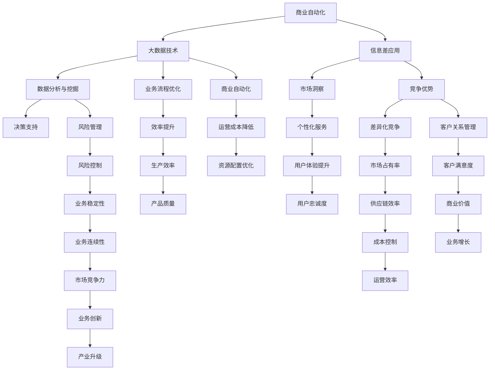

                 

### 文章标题

《信息差的商业自动化升级：大数据如何实现商业自动化》

### 文章关键词

- 商业自动化
- 大数据
- 信息差
- 人工智能
- 商业策略
- 技术应用

### 文章摘要

随着大数据技术和人工智能的快速发展，商业自动化已成为现代企业提升效率、降低成本的重要手段。本文探讨了信息差在商业自动化中的应用，分析了大数据如何助力商业自动化升级。通过深入剖析商业自动化的原理、大数据的基础知识及信息差的识别与利用，本文旨在为读者提供一套系统且实用的商业自动化升级策略，从而帮助企业实现智能化转型。

---

### 引言

#### 1.1 书籍主题概述

在当今信息化社会中，商业自动化已成为企业提高竞争力、实现持续增长的关键路径。大数据技术的崛起为商业自动化提供了强大的技术支持，使得企业能够通过数据分析、预测模型等方式，更加精准地把握市场动态和消费者需求。而信息差作为商业决策的核心要素之一，更是商业自动化的核心驱动力。本书旨在揭示大数据如何通过信息差实现商业自动化的升级，为企业和决策者提供具有实操性的指导策略。

#### 1.2 商业自动化的概念与重要性

商业自动化是指利用计算机技术和信息技术，将商业流程中的重复性、规则性工作自动化，以提高工作效率、降低成本、提升客户满意度。商业自动化的重要性体现在多个方面。首先，它可以大幅减少人工干预，降低人力成本，提高生产效率。其次，通过流程自动化，企业能够更好地控制业务流程，确保各个环节的高效运作。最后，商业自动化有助于企业实现数据驱动决策，通过实时数据分析，为企业提供精准的市场洞察和战略支持。

#### 1.3 信息差在商业自动化中的应用

信息差是指不同主体之间在信息获取、处理和使用上的差异。在商业自动化中，信息差的作用尤为重要。通过大数据技术，企业能够收集并处理大量数据，挖掘出潜在的信息差。这些信息差不仅可以帮助企业识别市场机会，还可以帮助企业规避风险。例如，通过分析竞争对手的销售数据、库存信息等，企业可以及时调整自身的市场策略，从而获得竞争优势。

#### 1.4 大数据在商业自动化中的作用

大数据技术在商业自动化中发挥着至关重要的作用。首先，大数据技术可以高效地处理海量数据，帮助企业在短时间内获取所需信息。其次，通过数据挖掘和机器学习技术，企业可以构建预测模型，对市场趋势和消费者行为进行精准预测。此外，大数据技术还可以实现个性化推荐，提高客户满意度，从而增加销售额。

#### 1.5 本书结构安排

本书共分为七个部分。第一部分引言，对商业自动化、大数据和信息差进行概述。第二部分介绍商业自动化的原理与流程，探讨商业自动化与传统商业模式的区别。第三部分重点讲解大数据的基础知识和技术框架。第四部分探讨信息差在商业自动化中的应用，包括信息差的识别与利用。第五部分通过具体案例，展示商业自动化在不同行业中的应用。第六部分讨论商业自动化的实施策略和风险管理。最后一部分对未来商业自动化的趋势和挑战进行展望，并提出发展建议。

---

### 商业自动化基础

#### 2.1 商业自动化的原理与流程

商业自动化的原理在于利用信息技术和计算机技术，将商业流程中的重复性、规则性工作自动化，从而提高效率、降低成本。其基本流程通常包括以下几个步骤：

1. **需求分析**：明确企业需要自动化的业务流程，分析流程中的每个环节，确定自动化目标和可行性。

2. **系统设计**：根据需求分析的结果，设计自动化系统的整体架构，包括硬件设备、软件系统和接口设计等。

3. **数据准备**：确保自动化系统能够获取和处理所需的数据，进行数据清洗、整合和存储。

4. **系统开发**：根据系统设计文档，进行自动化系统的开发，包括软件编码、硬件安装和调试等。

5. **系统测试**：对开发完成的自动化系统进行功能测试、性能测试和安全测试，确保系统能够稳定运行。

6. **系统部署**：将自动化系统部署到实际生产环境中，进行实际业务的运行。

7. **系统维护**：对自动化系统进行定期维护和升级，确保其持续稳定运行。

#### 2.2 商业自动化与传统商业模式的区别

传统商业模式通常依赖于人工操作和纸质记录，存在效率低下、错误率高、难以扩展等缺点。而商业自动化则通过信息技术和计算机技术的应用，实现了业务流程的自动化、数据化和智能化。主要区别体现在以下几个方面：

1. **效率提升**：商业自动化通过自动化处理业务流程，大幅提高了工作效率，降低了人力成本。

2. **数据驱动**：商业自动化系统能够实时收集和分析业务数据，为企业提供精准的市场洞察和决策支持。

3. **流程优化**：通过自动化系统，企业可以更加精细地控制业务流程，发现和解决流程中的瓶颈和问题。

4. **灵活性**：商业自动化系统具有高度的灵活性，可以根据业务需求进行快速调整和扩展。

5. **安全性**：自动化系统能够提供更可靠的数据保护和安全措施，防止数据泄露和业务中断。

#### 2.3 商业自动化的价值与挑战

商业自动化的价值体现在多个方面：

1. **提高效率**：自动化系统能够快速处理大量业务数据，减少人工操作，提高工作效率。

2. **降低成本**：自动化系统能够减少人力成本，降低运营成本，提高企业盈利能力。

3. **提升客户满意度**：自动化系统能够提供更快捷、更准确的服务，提升客户满意度，增加客户忠诚度。

4. **数据洞察**：自动化系统可以实时收集和分析业务数据，为企业提供精准的市场洞察和决策支持。

5. **流程优化**：通过自动化系统，企业可以更加精细地控制业务流程，发现和解决流程中的瓶颈和问题。

然而，商业自动化也面临一定的挑战：

1. **技术壁垒**：商业自动化需要一定的技术支持和专业知识，企业需要投入大量资源进行技术培训和系统开发。

2. **数据安全**：自动化系统需要处理大量敏感数据，数据安全和隐私保护是必须面对的重要问题。

3. **人员适应**：自动化系统的引入可能会对员工的工作方式和岗位产生影响，需要员工适应新的工作环境。

4. **系统整合**：商业自动化系统需要与企业现有的业务系统进行整合，确保数据流畅和系统兼容。

#### 2.4 商业自动化的应用场景

商业自动化的应用场景非常广泛，涵盖了多个行业和业务领域。以下是一些典型的应用场景：

1. **供应链管理**：通过自动化系统，企业可以实现供应链各环节的实时监控和管理，提高供应链效率，降低库存成本。

2. **客户服务**：自动化系统可以提供24/7的在线客户服务，快速响应客户需求，提升客户满意度。

3. **销售与营销**：自动化系统可以帮助企业进行精准营销，通过数据分析实现个性化推荐，提高销售额。

4. **人力资源管理**：自动化系统可以实现员工信息管理、招聘流程自动化、薪资计算自动化等，提高人力资源管理效率。

5. **财务管理**：自动化系统可以自动化处理财务数据，提高财务报表的准确性和及时性。

6. **生产管理**：通过自动化系统，企业可以实现生产计划的自动生成和实时调度，提高生产效率。

#### 2.5 商业自动化的关键成功因素

要实现商业自动化的成功，需要考虑以下几个关键因素：

1. **明确目标和需求**：在实施商业自动化之前，需要明确自动化目标和需求，确保自动化系统能够满足企业的实际需求。

2. **技术选型和方案设计**：选择合适的技术和方案，进行系统设计，确保自动化系统的高效性和稳定性。

3. **数据管理和分析**：建立完善的数据管理系统，确保数据的准确性、完整性和安全性，并通过数据分析为企业提供决策支持。

4. **团队建设和人才培训**：组建专业的自动化实施团队，对员工进行技术培训，确保团队成员能够熟练操作和维护自动化系统。

5. **持续优化和迭代**：商业自动化不是一蹴而就的过程，需要持续进行系统优化和迭代，以适应不断变化的市场需求。

---

### 大数据与商业自动化

#### 3.1 大数据的基础知识

大数据（Big Data）是指无法用传统数据处理工具在合理时间内对其进行存储、管理和分析的数据集。大数据具有四个基本特征，即“4V”：数据量大（Volume）、数据速度快（Velocity）、数据类型多样（Variety）和数据价值高（Value）。

1. **数据量大**：大数据的数据量通常是海量级别的，例如TB、PB甚至EB级别。

2. **数据速度快**：大数据的产生和传输速度非常快，需要实时处理和分析。

3. **数据类型多样**：大数据不仅包括结构化数据，还包括半结构化数据和非结构化数据，如文本、图像、音频、视频等。

4. **数据价值高**：通过对大数据的深入分析和挖掘，可以为企业带来巨大的商业价值，如市场洞察、客户画像、风险预测等。

#### 3.2 大数据的技术框架与工具

大数据技术框架主要包括数据采集、存储、处理、分析和可视化等几个环节。以下是一些常用的大数据技术框架和工具：

1. **数据采集**：
   - **Flume**：适用于大规模分布式系统，实时采集和传输数据。
   - **Kafka**：高吞吐量的分布式消息队列系统，适用于实时数据流处理。

2. **数据存储**：
   - **Hadoop HDFS**：分布式文件系统，用于存储海量数据。
   - **Hive**：基于Hadoop的数据仓库工具，用于存储、管理和查询大数据。
   - **HBase**：分布式列存储数据库，提供实时随机读写能力。

3. **数据处理**：
   - **MapReduce**：分布式数据处理框架，用于大规模数据处理。
   - **Spark**：基于内存的分布式数据处理引擎，提供实时数据处理和分析能力。

4. **数据分析**：
   - **Pig**：高层次的分布式数据处理平台，用于大数据的批量处理。
   - **Hadoop SQL**：支持SQL查询的Hadoop生态系统组件。
   - **R**：统计分析语言和软件环境，用于复杂数据分析和可视化。

5. **数据可视化**：
   - **Tableau**：数据可视化工具，提供丰富的图表和仪表盘功能。
   - **D3.js**：基于Web的动态数据可视化库，适用于复杂的数据可视化场景。

#### 3.3 大数据在商业自动化中的应用

大数据在商业自动化中具有广泛的应用，以下是一些具体的应用实例：

1. **客户关系管理**：通过大数据技术，企业可以实时收集和分析客户数据，构建精准的客户画像，实现个性化营销和客户服务。

2. **供应链管理**：大数据技术可以帮助企业实现供应链的实时监控和优化，降低库存成本，提高供应链效率。

3. **销售与预测**：通过对销售数据和历史市场趋势的分析，企业可以预测未来的市场需求，制定更加精准的销售策略。

4. **风险管理**：大数据技术可以实时监测和分析企业运营中的各种风险，提前预警并采取措施，降低企业风险。

5. **生产优化**：通过大数据分析，企业可以优化生产计划，提高生产效率，降低生产成本。

#### 3.4 大数据的价值创造

大数据的价值创造主要体现在以下几个方面：

1. **市场洞察**：通过对市场数据的深入分析，企业可以了解市场趋势、消费者行为和竞争对手动态，为决策提供科学依据。

2. **客户价值提升**：通过大数据分析，企业可以识别高价值客户，提供个性化服务和产品推荐，提升客户满意度和忠诚度。

3. **运营优化**：通过对业务数据的实时监控和分析，企业可以优化业务流程，提高运营效率，降低运营成本。

4. **创新驱动**：大数据分析可以帮助企业发现新的市场机会和业务模式，推动企业创新和转型升级。

5. **风险控制**：通过大数据分析，企业可以提前发现和预测潜在风险，采取有效措施进行风险控制。

#### 3.5 大数据面临的挑战与解决方案

大数据在为商业自动化带来巨大价值的同时，也面临一些挑战。以下是一些主要挑战及相应的解决方案：

1. **数据质量**：大数据的质量直接影响其分析结果，需要建立完善的数据质量管理机制，确保数据的准确性、完整性和一致性。

2. **数据隐私**：大数据涉及大量敏感信息，数据隐私保护是必须面对的重要问题。需要采取数据加密、访问控制等技术手段，确保数据安全。

3. **技术复杂性**：大数据技术涉及多个领域，需要具备跨学科的知识和技能。企业需要加强技术培训和人才引进，提高技术能力。

4. **数据分析能力**：大数据分析需要专业的数据分析团队和工具，企业需要建立数据分析平台，提升数据分析能力。

5. **系统集成**：大数据系统需要与企业现有业务系统集成，实现数据流畅和系统兼容。需要采用合适的集成方案，确保系统稳定性。

---

### 信息差在商业自动化中的应用

#### 4.1 信息差的概念与特点

信息差是指在信息不对称的情况下，不同主体之间在信息获取、处理和使用上的差异。信息差的特点主要包括以下几个方面：

1. **不对称性**：信息差源于信息不对称，不同主体之间掌握的信息存在差异，一方拥有而另一方没有。

2. **价值性**：信息差具有价值性，即信息差的利用可以带来经济利益或其他形式的收益。

3. **时效性**：信息差的时效性较强，随着时间推移，信息差可能消失或转化为共同信息。

4. **多样性**：信息差可以存在于多个层面，如行业信息、市场信息、技术信息等。

#### 4.2 信息差在商业自动化中的角色

信息差在商业自动化中扮演着关键角色，其作用主要体现在以下几个方面：

1. **决策支持**：信息差可以为商业决策提供有力支持，帮助企业更好地把握市场动态和消费者需求。

2. **竞争优势**：通过信息差，企业可以获取竞争优势，识别市场机会，制定更有效的商业策略。

3. **风险管理**：信息差可以帮助企业发现潜在风险，提前预警并采取措施，降低企业风险。

4. **效率提升**：信息差的利用可以提高商业自动化系统的效率，减少重复性工作，降低运营成本。

5. **创新能力**：信息差可以激发企业的创新能力，推动企业进行技术革新和商业模式创新。

#### 4.3 信息差的识别与利用

识别和利用信息差是商业自动化的关键环节。以下是一些具体方法和策略：

1. **数据采集**：通过大数据技术，收集各类行业数据、市场数据、消费者行为数据等，建立全面的数据库。

2. **数据分析**：利用数据挖掘和机器学习技术，对采集到的数据进行深入分析，挖掘出有价值的信息差。

3. **市场调研**：通过市场调研，了解竞争对手的营销策略、产品特性等，识别潜在的信息差。

4. **跨行业比较**：将本行业数据与其他行业数据进行比较，发现行业间存在的信息差。

5. **技术监测**：关注行业前沿技术动态，掌握最新技术趋势，利用技术差异创造竞争优势。

6. **资源整合**：通过资源整合，将不同渠道的信息进行整合和分析，形成有价值的商业洞察。

#### 4.4 信息差的商业案例解析

以下是一些典型的信息差商业案例，展示了如何通过信息差实现商业价值：

1. **电商平台的差异化定价**：电商平台通过大数据分析，了解不同消费者的消费能力和购买习惯，针对不同消费者群体制定差异化定价策略，实现更高的利润率。

2. **金融行业的精准营销**：金融机构通过大数据分析，了解客户的金融需求和行为习惯，提供个性化的金融产品和服务，提高客户满意度和忠诚度。

3. **制造业的供应链优化**：制造企业通过大数据分析，优化供应链各环节，降低库存成本，提高生产效率，增强市场竞争力。

4. **医疗行业的个性化治疗**：医疗机构通过大数据分析，了解患者的病史、基因信息等，为患者提供个性化的治疗方案，提高治疗效果。

5. **旅游行业的个性化推荐**：旅游企业通过大数据分析，了解游客的兴趣偏好和行为习惯，提供个性化的旅游产品和服务，提高游客满意度和回头率。

#### 4.5 信息差的商业风险与管理

尽管信息差在商业自动化中具有重要价值，但也存在一定的商业风险。以下是一些常见的商业风险及管理策略：

1. **信息泄露风险**：信息差可能导致企业敏感信息泄露，需要加强数据安全管理和访问控制。

2. **法律风险**：信息差的利用可能涉及法律问题，如侵犯知识产权、隐私权等，需要遵守相关法律法规。

3. **市场风险**：信息差的利用可能导致市场不公平竞争，需要遵循市场规则，确保商业行为的合法性。

4. **技术风险**：信息差的利用可能依赖于特定技术，如果技术不稳定或过时，可能带来商业风险。

5. **人才风险**：信息差的利用需要专业的人才队伍，如果人才流失或技能不足，可能影响商业自动化系统的运行。

为了有效管理信息差带来的商业风险，企业可以采取以下策略：

1. **建立健全的数据安全管理体系**，确保数据的安全性和隐私保护。

2. **加强法律法规和合规性培训**，确保企业遵守相关法律法规。

3. **建立稳定的技术研发团队**，持续提升技术能力和创新能力。

4. **加强人才队伍建设**，提供培训和发展机会，吸引和留住优秀人才。

5. **建立风险预警和应对机制**，及时发现和应对潜在风险，确保商业自动化的稳定运行。

---

### 商业自动化案例分析

#### 5.1 案例一：电商平台的商业自动化

**案例背景**：

电商平台是一个典型的商业自动化应用场景。随着互联网和大数据技术的快速发展，电商平台通过自动化系统实现了从商品采购、库存管理、销售到客户服务的全流程自动化，极大地提高了运营效率和客户满意度。

**解决方案**：

1. **采购自动化**：电商平台利用大数据分析，实时监控市场动态和消费者需求，自动化调整采购策略，确保商品供应充足。

2. **库存管理**：电商平台通过自动化系统，实时监控库存情况，自动生成补货计划，减少库存积压和库存过剩。

3. **销售自动化**：电商平台利用人工智能技术，实现精准推荐和个性化营销，提高销售额和客户满意度。

4. **客户服务**：电商平台通过自动化客服系统，实现7*24小时的在线客户服务，快速响应客户需求，提升客户体验。

**实施效果**：

1. **提高了运营效率**：通过自动化系统，电商平台大幅减少了人工操作，降低了人力成本。

2. **提升了客户满意度**：自动化系统提供了更加精准和个性化的服务，提升了客户满意度和忠诚度。

3. **增加了销售额**：通过精准营销和个性化推荐，电商平台实现了销售额的稳步增长。

4. **优化了供应链管理**：通过自动化系统，电商平台实现了供应链的实时监控和优化，提高了供应链效率。

#### 5.2 案例二：金融行业的商业自动化

**案例背景**：

金融行业是一个高度依赖数据和技术的领域。随着大数据和人工智能技术的发展，金融行业通过商业自动化系统实现了业务流程的优化和风险管理能力的提升。

**解决方案**：

1. **风险控制**：金融机构利用大数据分析和机器学习技术，实现实时风险监控和预测，提前预警并采取措施，降低金融风险。

2. **客户关系管理**：金融机构通过大数据分析，了解客户的金融需求和风险偏好，提供个性化的金融产品和服务，提高客户满意度和忠诚度。

3. **交易自动化**：金融机构利用自动化系统，实现交易的快速执行和审核，提高交易效率。

4. **合规性管理**：金融机构通过自动化系统，实时监控合规性要求，确保业务操作符合法律法规。

**实施效果**：

1. **提高了风险管理能力**：通过自动化系统，金融机构实现了实时风险监控和预测，降低了金融风险。

2. **提升了客户满意度**：通过个性化服务和快速响应，金融机构提高了客户满意度和忠诚度。

3. **优化了业务流程**：自动化系统实现了交易和业务流程的自动化，提高了业务效率和准确性。

4. **降低了运营成本**：通过自动化系统，金融机构减少了人工操作和重复性工作，降低了运营成本。

#### 5.3 案例三：制造业的商业自动化

**案例背景**：

制造业是一个传统行业，随着大数据和人工智能技术的应用，制造业通过商业自动化实现了生产流程的优化和成本控制。

**解决方案**：

1. **生产计划优化**：通过大数据分析，制造业企业实现精准的生产计划，提高生产效率，降低库存成本。

2. **设备监控与维护**：通过自动化系统，制造业企业实现设备的实时监控和故障预测，提前进行维护和修理，确保设备运行稳定。

3. **质量管理**：通过自动化系统，制造业企业实现质量监测和自动反馈，确保产品质量。

4. **供应链管理**：通过大数据分析和自动化系统，制造业企业实现供应链的实时监控和优化，提高供应链效率。

**实施效果**：

1. **提高了生产效率**：通过自动化系统，制造业企业实现了生产流程的优化，提高了生产效率。

2. **降低了生产成本**：通过优化生产计划和设备维护，制造业企业降低了生产成本。

3. **提升了产品质量**：通过自动化系统和质量监测，制造业企业提升了产品质量，减少了次品率。

4. **优化了供应链管理**：通过大数据分析和自动化系统，制造业企业实现了供应链的实时监控和优化，提高了供应链效率。

#### 5.4 案例四：物流与供应链的商业自动化

**案例背景**：

物流与供应链管理是现代商业运营的重要组成部分，随着大数据和人工智能技术的发展，物流与供应链管理通过商业自动化实现了流程优化和效率提升。

**解决方案**：

1. **运输调度优化**：通过大数据分析和自动化系统，物流企业实现精准的运输调度，提高运输效率，降低运输成本。

2. **仓储管理自动化**：通过自动化系统和智能仓库设备，物流企业实现仓储管理的自动化，提高仓储效率和准确性。

3. **订单处理自动化**：通过自动化系统和电子标签技术，物流企业实现订单处理的自动化，提高订单处理速度和准确性。

4. **供应链协同**：通过大数据分析和自动化系统，物流企业与供应商、客户实现供应链的实时协同，提高供应链效率。

**实施效果**：

1. **提高了运输效率**：通过自动化系统和大数据分析，物流企业实现了精准的运输调度，提高了运输效率。

2. **降低了运输成本**：通过优化运输调度和自动化系统，物流企业降低了运输成本。

3. **提升了仓储效率**：通过自动化系统和智能仓库设备，物流企业提高了仓储效率和准确性。

4. **优化了订单处理流程**：通过自动化系统和电子标签技术，物流企业实现了订单处理的自动化，提高了订单处理速度和准确性。

5. **提高了供应链协同效率**：通过大数据分析和自动化系统，物流企业与供应商、客户实现了供应链的实时协同，提高了供应链效率。

#### 5.5 案例五：医疗行业的商业自动化

**案例背景**：

医疗行业是一个高度依赖数据和技术的领域，随着大数据和人工智能技术的发展，医疗行业通过商业自动化实现了医疗服务的优化和患者体验的提升。

**解决方案**：

1. **电子病历管理**：通过自动化系统和电子病历系统，医疗机构实现病历管理的自动化，提高病历记录的准确性和完整性。

2. **医学图像分析**：通过大数据分析和人工智能技术，医疗机构实现医学图像的自动化分析和诊断，提高诊断效率和准确性。

3. **远程医疗**：通过自动化系统和互联网技术，医疗机构实现远程医疗服务的自动化，为患者提供更加便捷和高效的医疗服务。

4. **药物配送管理**：通过自动化系统和智能物流设备，医疗机构实现药物配送的自动化，确保药物及时送达。

**实施效果**：

1. **提高了病历管理效率**：通过自动化系统和电子病历系统，医疗机构提高了病历记录的准确性和完整性，减少了人工操作。

2. **提升了医学图像诊断准确性**：通过大数据分析和人工智能技术，医疗机构提高了医学图像诊断的效率和准确性，为患者提供了更准确的诊断。

3. **优化了远程医疗服务**：通过自动化系统和互联网技术，医疗机构实现了远程医疗服务的自动化，为患者提供了更加便捷和高效的医疗服务。

4. **提高了药物配送效率**：通过自动化系统和智能物流设备，医疗机构提高了药物配送的效率和准确性，确保了药物的及时送达。

5. **提升了患者满意度**：通过自动化系统和远程医疗服务，医疗机构提高了患者满意度，为患者提供了更加优质和个性化的医疗服务。

---

### 商业自动化实施策略

#### 6.1 商业自动化项目的规划与实施

商业自动化项目的成功实施需要科学的规划和严谨的实施。以下是一些关键步骤和策略：

1. **项目规划**：
   - **需求分析**：明确业务需求，分析流程中的痛点，确定自动化目标和范围。
   - **项目立项**：根据需求分析结果，制定项目立项报告，明确项目目标、范围、时间表和预算。
   - **资源准备**：准备项目所需的硬件设备、软件工具和人力资源。

2. **系统设计**：
   - **系统架构设计**：根据业务需求，设计系统的整体架构，包括前端、后端、数据库、接口等。
   - **模块划分**：将系统划分为多个模块，明确各模块的功能和接口。
   - **技术选型**：选择合适的技术框架和工具，确保系统的稳定性和可扩展性。

3. **开发与测试**：
   - **开发阶段**：根据系统设计文档，进行系统的开发，包括前端开发、后端开发、数据库设计和接口开发等。
   - **测试阶段**：对开发完成的系统进行功能测试、性能测试和安全测试，确保系统的稳定性和可靠性。

4. **部署与上线**：
   - **系统部署**：将系统部署到实际生产环境中，进行实际业务的运行。
   - **上线准备**：制定上线计划，进行数据迁移、系统切换和用户培训等。
   - **上线执行**：按照上线计划，进行系统上线，确保系统平稳运行。

5. **运维与优化**：
   - **系统运维**：建立系统运维团队，对系统进行日常维护和故障处理。
   - **用户反馈**：收集用户反馈，不断优化和改进系统功能。
   - **持续迭代**：根据业务发展和用户需求，持续进行系统升级和优化。

#### 6.2 商业自动化技术与工具的选择

选择合适的技术和工具是商业自动化成功的关键。以下是一些常用的技术和工具：

1. **编程语言**：
   - **Java**：适用于大型系统开发，具有跨平台和高效的特点。
   - **Python**：适用于数据分析和自动化脚本开发，具有简洁和高效的语法。
   - **JavaScript**：适用于前端开发，适用于快速构建交互式界面。

2. **数据库**：
   - **关系型数据库**（如MySQL、Oracle）：适用于结构化数据存储和管理。
   - **非关系型数据库**（如MongoDB、Redis）：适用于海量数据存储和高并发访问。

3. **大数据平台**：
   - **Hadoop**：适用于大数据存储和处理，提供高可靠性和扩展性。
   - **Spark**：适用于实时大数据处理和分析，具有高性能和易用性。

4. **自动化工具**：
   - **Selenium**：适用于Web自动化测试和自动化操作。
   - **Apriori**：适用于数据挖掘和关联规则分析。
   - **TensorFlow**：适用于机器学习和深度学习应用。

5. **集成工具**：
   - **Apache Kafka**：适用于大数据消息队列和实时数据流处理。
   - **Elasticsearch**：适用于大数据搜索和分析。

#### 6.3 商业自动化的人才培养与团队建设

商业自动化的实施需要专业的团队和人才。以下是一些人才培养和团队建设的策略：

1. **技术培训**：
   - **基础培训**：为员工提供基础技术培训，包括编程语言、数据库、操作系统等。
   - **专项培训**：为员工提供专项技术培训，包括大数据技术、机器学习、自动化测试等。

2. **技能提升**：
   - **实战经验**：鼓励员工参与实际项目，积累实战经验。
   - **技术交流**：组织技术交流会议，分享最佳实践和新技术。

3. **团队建设**：
   - **沟通协作**：建立良好的团队沟通机制，确保团队成员之间的协作和配合。
   - **激励机制**：建立激励机制，鼓励员工积极参与项目和技术创新。

4. **持续发展**：
   - **学习与成长**：鼓励员工持续学习，提升个人能力和团队整体水平。
   - **人才培养**：建立人才培养机制，为优秀人才提供发展机会。

#### 6.4 商业自动化的风险管理

商业自动化在实施过程中可能面临一系列风险，需要采取有效的风险管理策略。以下是一些常见的风险及管理方法：

1. **技术风险**：
   - **风险评估**：对项目的技术风险进行评估，制定相应的风险管理计划。
   - **技术储备**：建立技术储备库，确保在技术问题出现时能够迅速解决。

2. **数据风险**：
   - **数据安全**：加强数据安全管理，确保数据的安全性、完整性和一致性。
   - **数据备份**：建立数据备份机制，防止数据丢失和损坏。

3. **人员风险**：
   - **人才流失**：建立激励机制，防止优秀人才流失。
   - **团队协作**：加强团队协作，确保项目顺利进行。

4. **市场风险**：
   - **市场调研**：进行充分的市场调研，了解市场需求和竞争状况。
   - **灵活调整**：根据市场变化，灵活调整项目计划和策略。

5. **合规风险**：
   - **法律法规**：遵守相关法律法规，确保项目的合法性。
   - **合规审查**：定期进行合规审查，确保项目合规性。

#### 6.5 商业自动化的持续优化与迭代

商业自动化不是一蹴而就的过程，需要持续优化和迭代。以下是一些持续优化与迭代的策略：

1. **用户反馈**：收集用户反馈，了解用户需求和体验，为系统优化提供依据。

2. **技术更新**：跟进新技术和新工具的发展，持续提升系统性能和功能。

3. **流程改进**：定期对业务流程进行优化，提高系统效率和用户体验。

4. **数据挖掘**：利用大数据分析，挖掘潜在的业务机会和改进点。

5. **团队协作**：建立跨部门协作机制，共同推进系统的优化和迭代。

---

### 未来展望

#### 7.1 商业自动化的未来趋势

随着大数据、人工智能和云计算等技术的不断发展，商业自动化正朝着更加智能化、高效化和个性化的方向迈进。未来，商业自动化的趋势主要体现在以下几个方面：

1. **智能化**：商业自动化系统将更加智能化，能够自主学习和优化，提高决策的准确性和效率。

2. **高效化**：商业自动化系统将进一步提高工作效率，降低运营成本，实现全流程自动化。

3. **个性化**：商业自动化系统将更加注重用户体验，实现个性化服务，提升客户满意度和忠诚度。

4. **云端化**：商业自动化系统将逐渐向云端迁移，实现数据共享和协同工作，提高系统的灵活性和可扩展性。

5. **跨界融合**：商业自动化将与其他领域（如物联网、区块链等）进行深度融合，推动行业创新和产业升级。

#### 7.2 大数据与商业自动化的融合发展

大数据与商业自动化的融合发展将极大地推动企业智能化转型。未来，大数据技术将在商业自动化中发挥更加重要的作用，主要体现在以下几个方面：

1. **数据驱动的决策**：企业将更加依赖大数据分析，实现数据驱动的决策，提高市场洞察和竞争力。

2. **智能预测和规划**：通过大数据分析和机器学习技术，企业可以实现精准的预测和规划，优化业务流程和资源配置。

3. **个性化服务和营销**：大数据分析将帮助企业更好地了解客户需求和行为，实现个性化服务和精准营销，提高客户满意度和忠诚度。

4. **风险预警与控制**：大数据分析可以帮助企业提前识别潜在风险，采取有效的预防措施，降低运营风险。

5. **供应链协同**：大数据分析可以实现供应链各环节的实时监控和优化，提高供应链效率，降低成本。

#### 7.3 信息差的未来应用前景

信息差作为商业自动化的重要驱动力，未来将具有广阔的应用前景。主要体现在以下几个方面：

1. **市场洞察**：企业将通过大数据分析，更加精准地把握市场动态和消费者需求，实现市场的细分和定位。

2. **差异化竞争**：企业将通过信息差识别市场机会，实现差异化竞争，提高市场占有率。

3. **创新驱动**：信息差将激发企业的创新动力，推动技术革新和商业模式创新。

4. **风险规避**：企业将通过信息差提前识别潜在风险，采取有效措施规避风险，确保业务稳定运行。

5. **资源整合**：企业将通过信息差实现资源的优化配置和整合，提高资源利用效率。

#### 7.4 商业自动化面临的挑战与机遇

虽然商业自动化具有广阔的发展前景，但也面临一系列挑战和机遇。以下是一些主要挑战与机遇：

1. **技术挑战**：随着商业自动化系统的复杂度提高，企业需要不断引进新技术、新工具，提高技术能力。

2. **数据隐私**：大数据技术带来便利的同时，也引发数据隐私和安全问题，企业需要加强数据安全管理。

3. **人才短缺**：商业自动化需要专业的人才队伍，企业需要加强人才培养和引进，解决人才短缺问题。

4. **系统集成**：商业自动化系统需要与企业现有业务系统集成，实现数据流畅和系统兼容，企业需要建立完善的技术架构。

5. **政策法规**：随着商业自动化的发展，相关政策法规也将不断完善，企业需要遵守相关法律法规，确保合规运营。

6. **市场机遇**：商业自动化为企业带来了新的市场机遇，企业可以通过智能化转型，提高市场竞争力，实现业务增长。

#### 7.5 商业自动化的发展建议

为了推动商业自动化的发展，企业可以采取以下建议：

1. **加强技术研发**：加大技术研发投入，引进新技术、新工具，提高技术能力。

2. **人才培养与引进**：加强人才培养和引进，建立专业的人才队伍，解决人才短缺问题。

3. **数据安全管理**：加强数据安全管理，确保数据的安全性和隐私保护，提高数据利用效率。

4. **业务流程优化**：对业务流程进行深入分析，优化流程，提高运营效率。

5. **系统集成与兼容**：建立完善的技术架构，实现商业自动化系统与企业现有业务系统的集成与兼容。

6. **政策法规合规**：遵守相关法律法规，确保商业自动化系统的合规运营。

7. **用户反馈与优化**：收集用户反馈，不断优化和改进系统功能，提高用户体验。

---

### 附录

#### 附录A：商业自动化与大数据常用工具与资源

**A.1 大数据平台与工具**

- **Hadoop**：Apache Hadoop是一个开源的大数据平台，包括HDFS、MapReduce、Hive等组件，用于大规模数据的存储和处理。

- **Spark**：Apache Spark是一个开源的大数据处理框架，提供快速的数据处理和分析能力。

- **Flink**：Apache Flink是一个开源的流处理框架，支持实时数据处理和分析。

- **Kafka**：Apache Kafka是一个开源的分布式消息队列系统，用于大规模数据流处理和实时数据处理。

- **Elasticsearch**：Elasticsearch是一个开源的搜索引擎，支持海量数据的实时搜索和分析。

**A.2 商业自动化工具与应用**

- **RPA**：RPA（Robotic Process Automation）是一种自动化软件工具，用于自动化重复性的业务流程。

- **UIPath**：UIPath是一个RPA平台，提供自动化流程设计、执行和管理功能。

- **Blue Prism**：Blue Prism是一个RPA平台，提供高度可配置的自动化解决方案。

- **Automation Anywhere**：Automation Anywhere是一个RPA平台，支持多种编程语言和自动化工具。

**A.3 开源数据集与案例库**

- **Kaggle**：Kaggle是一个开源的数据集和比赛平台，提供大量的数据集和案例。

- **UCI Machine Learning Repository**：UCI机器学习库是一个开源的数据集库，提供各种领域的机器学习数据集。

- **Google Dataset Search**：Google Dataset Search是一个开源的数据集搜索引擎，提供大量的数据集链接和描述。

**A.4 商业自动化与大数据学习资源**

- **Coursera**：Coursera是一个在线教育平台，提供大量的大数据、机器学习和商业自动化课程。

- **edX**：edX是一个在线教育平台，提供由哈佛大学和麻省理工学院等知名大学开设的数据科学和商业自动化课程。

- **Udacity**：Udacity是一个在线教育平台，提供实用的大数据和商业自动化课程，包括实战项目和认证。

- **DataCamp**：DataCamp是一个在线学习平台，提供编程和数据科学课程，包括Python、R、SQL等。

---

### 参考文献

- **Hadoop**：Apache Software Foundation. (2019). Hadoop: The Apache way. Retrieved from https://hadoop.apache.org/
- **Spark**：Apache Software Foundation. (2019). Spark: A unified analytics engine. Retrieved from https://spark.apache.org/
- **Flink**：Apache Software Foundation. (2019). Flink: A stream processing framework. Retrieved from https://flink.apache.org/
- **Kafka**：Apache Software Foundation. (2019). Kafka: A distributed streaming platform. Retrieved from https://kafka.apache.org/
- **Elasticsearch**：Elasticsearch. (2019). Elasticsearch: The search engine for the modern enterprise. Retrieved from https://www.elastic.co/elasticsearch/
- **UIPath**：UIPath. (2019). Automation Anywhere. Retrieved from https://www.uipath.com/
- **Blue Prism**：Blue Prism. (2019). Robotic Process Automation. Retrieved from https://www.blueprism.com/
- **Automation Anywhere**：Automation Anywhere. (2019). Automation Anywhere: The world's leading Robotic Process Automation solution. Retrieved from https://www.automationanywhere.com/
- **Kaggle**：Kaggle. (2019). Data Science competitions and competitions. Retrieved from https://www.kaggle.com/
- **UCI Machine Learning Repository**：UCI Machine Learning Repository. (2019). Machine learning data repository. Retrieved from https://archive.ics.uci.edu/ml/
- **Google Dataset Search**：Google. (2019). Dataset Search. Retrieved from https://datasetsearch.research.google.com/
- **Coursera**：Coursera. (2019). Online courses and Specializations from top universities. Retrieved from https://www.coursera.org/
- **edX**：edX. (2019). edX: Online Courses and MOOCs from Top Universities. Retrieved from https://www.edx.org/
- **Udacity**：Udacity. (2019). Nanodegree programs and online classes. Retrieved from https://www.udacity.com/
- **DataCamp**：DataCamp. (2019). Learn Data Science, R, Python, SQL. Retrieved from https://www.datacamp.com/ 

---

作者：AI天才研究院/AI Genius Institute & 禅与计算机程序设计艺术 /Zen And The Art of Computer Programming

---

### 核心概念与联系

为了更好地理解本文的核心概念及其联系，我们可以使用Mermaid流程图对商业自动化、大数据、信息差之间的关系进行展示。



在这个流程图中，我们可以看到商业自动化、大数据和信息差三者之间的紧密联系：

1. **商业自动化**：通过大数据技术，实现业务流程的自动化，从而提升效率、降低成本。
2. **大数据技术**：为商业自动化提供数据支撑，通过数据分析和挖掘，优化业务流程，提升决策支持能力。
3. **信息差应用**：利用大数据技术，识别市场信息差，从而实现市场洞察和竞争优势，推动业务增长。

通过这种流程图，我们可以清晰地理解各个核心概念之间的关系，从而更好地掌握本文的主旨和核心内容。

### 核心算法原理讲解

#### 1. 数据清洗与预处理

数据清洗与预处理是大数据处理的重要环节，其目的是将原始数据进行清洗和转换，使其满足后续分析的要求。以下是一个简单的数据清洗与预处理的伪代码：

```python
# 数据清洗与预处理伪代码

# 函数：删除缺失值
def remove_missing_values(data):
    # 删除所有缺失值的数据
    cleaned_data = data.dropna()
    return cleaned_data

# 函数：数据标准化
def normalize_data(data):
    # 计算均值和标准差
    mean = data.mean()
    std = data.std()
    # 数据标准化
    normalized_data = (data - mean) / std
    return normalized_data

# 使用示例
data = load_data('data.csv')
cleaned_data = remove_missing_values(data)
normalized_data = normalize_data(cleaned_data)
```

在这个伪代码中，我们首先删除了所有缺失值的数据，然后对数据进行标准化处理，使其具有0均值和1标准差，从而便于后续的分析。

#### 2. 分类算法原理

分类算法是一种常见的数据挖掘算法，用于将数据集划分为不同的类别。以下是一个基于逻辑回归的简单分类算法的伪代码：

```python
# 逻辑回归分类算法伪代码

# 函数：计算损失函数
def compute_loss(data, labels, weights):
    # 计算预测概率
    probabilities = 1 / (1 + np.exp(-np.dot(data, weights)))
    # 计算损失函数（交叉熵损失）
    loss = -np.mean(labels * np.log(probabilities) + (1 - labels) * np.log(1 - probabilities))
    return loss

# 函数：计算梯度
def compute_gradient(data, labels, weights):
    # 计算预测概率
    probabilities = 1 / (1 + np.exp(-np.dot(data, weights)))
    # 计算梯度
    gradient = np.dot(data.T, (probabilities - labels)) / len(data)
    return gradient

# 函数：更新参数
def update_weights(weights, gradient, learning_rate):
    # 更新参数
    weights = weights - learning_rate * gradient
    return weights

# 使用示例
weights = initialize_weights()
for epoch in range(num_epochs):
    # 计算损失函数和梯度
    loss = compute_loss(data, labels, weights)
    gradient = compute_gradient(data, labels, weights)
    # 更新参数
    weights = update_weights(weights, gradient, learning_rate)
```

在这个伪代码中，我们首先初始化参数权重，然后通过迭代的方式不断更新权重，直到损失函数收敛。逻辑回归是一种简单且有效的分类算法，适用于处理二分类问题。

#### 3. 聚类算法原理

聚类算法是一种无监督学习算法，用于将数据集划分为不同的簇。以下是一个基于K-means算法的简单聚类算法的伪代码：

```python
# K-means聚类算法伪代码

# 函数：初始化中心点
def initialize_centroids(data, k):
    # 随机选择k个数据点作为初始中心点
    centroids = data[np.random.choice(data.shape[0], k, replace=False)]
    return centroids

# 函数：分配数据到最近的中心点
def assign_labels(data, centroids):
    # 计算每个数据点到各个中心点的距离
    distances = np.linalg.norm(data - centroids, axis=1)
    # 分配数据到最近的中心点
    labels = np.argmin(distances, axis=1)
    return labels

# 函数：更新中心点
def update_centroids(data, labels, k):
    # 计算每个簇的平均值
    new_centroids = np.array([data[labels == i].mean(axis=0) for i in range(k)])
    return new_centroids

# 函数：检查是否收敛
def check_convergence(centroids):
    # 如果中心点变化小于阈值，认为已收敛
    return np.linalg.norm(centroids - centroids_prev) < threshold

# 使用示例
centroids = initialize_centroids(data, k)
centroids_prev = centroids.copy()
while not check_convergence(centroids):
    # 分配数据到最近的中心点
    labels = assign_labels(data, centroids)
    # 更新中心点
    centroids = update_centroids(data, labels, k)
    # 更新中心点前一次的值
    centroids_prev = centroids.copy()
```

在这个伪代码中，我们首先初始化中心点，然后通过迭代的方式不断更新中心点和数据点的标签，直到中心点收敛或达到最大迭代次数。K-means算法是一种简单且高效的聚类算法，适用于处理高维数据。

### 数学模型和公式讲解

#### 1. 数据标准化

数据标准化是将数据集转换成标准化的形式，以消除数据之间的差异。公式如下：

$$
Z = \frac{X - \mu}{\sigma}
$$

其中，$X$ 是原始数据，$\mu$ 是均值，$\sigma$ 是标准差。

在数据标准化过程中，首先计算数据的均值和标准差，然后对每个数据进行标准化处理。标准化的目的是使数据集具有0均值和1标准差，从而便于后续的分析。

#### 2. 逻辑回归

逻辑回归是一种常用的分类算法，用于预测二分类结果。其数学模型可以表示为：

$$
\text{logit}(P) = \ln\left(\frac{P}{1 - P}\right) = \beta_0 + \beta_1X_1 + \beta_2X_2 + ... + \beta_nX_n
$$

其中，$P$ 是事件发生的概率，$X_1, X_2, ..., X_n$ 是特征变量，$\beta_0, \beta_1, \beta_2, ..., \beta_n$ 是模型的参数。

逻辑回归的目的是通过最小化损失函数来估计参数 $\beta_0, \beta_1, \beta_2, ..., \beta_n$，从而实现分类预测。

#### 3. K-means聚类

K-means聚类是一种常用的无监督学习算法，用于将数据集划分为 $k$ 个簇。其数学模型可以表示为：

$$
\text{minimize} \sum_{i=1}^k \sum_{x \in S_i} ||x - \mu_i||^2
$$

其中，$S_1, S_2, ..., S_k$ 是数据集的 $k$ 个簇，$\mu_1, \mu_2, ..., \mu_k$ 是各个簇的中心点。

K-means聚类算法的目的是通过迭代更新中心点和数据点的簇标签，使聚类误差最小化。聚类误差可以通过簇内距离的平方和来衡量。

### 举例说明

#### 1. 数据标准化

假设我们有一个数据集，包含三个特征变量 $X_1, X_2, X_3$，其样本数据如下：

| 样本编号 | $X_1$ | $X_2$ | $X_3$ |
|----------|-------|-------|-------|
| 1        | 10    | 20    | 30    |
| 2        | 15    | 25    | 35    |
| 3        | 5     | 10    | 15    |

首先，计算每个特征变量的均值和标准差：

$$
\mu_1 = \frac{10 + 15 + 5}{3} = 10 \\
\mu_2 = \frac{20 + 25 + 10}{3} = 18.33 \\
\mu_3 = \frac{30 + 35 + 15}{3} = 26.67 \\
\sigma_1 = \sqrt{\frac{(10 - 10)^2 + (15 - 10)^2 + (5 - 10)^2}{2}} = 4.33 \\
\sigma_2 = \sqrt{\frac{(20 - 18.33)^2 + (25 - 18.33)^2 + (10 - 18.33)^2}{2}} = 5.83 \\
\sigma_3 = \sqrt{\frac{(30 - 26.67)^2 + (35 - 26.67)^2 + (15 - 26.67)^2}{2}} = 8.33 \\
$$

然后，对每个数据进行标准化处理：

$$
Z_1 = \frac{X_1 - \mu_1}{\sigma_1} = \frac{10 - 10}{4.33} = 0 \\
Z_2 = \frac{X_2 - \mu_2}{\sigma_2} = \frac{20 - 18.33}{5.83} = 0.17 \\
Z_3 = \frac{X_3 - \mu_3}{\sigma_3} = \frac{30 - 26.67}{8.33} = 0.17 \\
$$

经过标准化处理后，新的数据集如下：

| 样本编号 | $Z_1$ | $Z_2$ | $Z_3$ |
|----------|-------|-------|-------|
| 1        | 0     | 0.17  | 0.17  |
| 2        | 0.17  | 0.17  | 0.17  |
| 3        | -0.98 | -0.98 | -0.98 |

#### 2. 逻辑回归

假设我们有以下数据集，包含两个特征变量 $X_1, X_2$ 和一个标签变量 $Y$：

| 样本编号 | $X_1$ | $X_2$ | $Y$ |
|----------|-------|-------|-----|
| 1        | 1     | 2     | 0   |
| 2        | 2     | 3     | 1   |
| 3        | 3     | 4     | 0   |

首先，计算每个特征变量的均值和标准差：

$$
\mu_1 = \frac{1 + 2 + 3}{3} = 2 \\
\mu_2 = \frac{2 + 3 + 4}{3} = 3 \\
\sigma_1 = \sqrt{\frac{(1 - 2)^2 + (2 - 2)^2 + (3 - 2)^2}{2}} = 1 \\
\sigma_2 = \sqrt{\frac{(2 - 3)^2 + (3 - 3)^2 + (4 - 3)^2}{2}} = 1 \\
$$

然后，初始化参数 $\beta_0, \beta_1, \beta_2$ 为0，并使用梯度下降法进行迭代更新：

$$
\beta_0 = \beta_0 - \alpha \frac{\partial}{\partial \beta_0} L(\beta_0, \beta_1, \beta_2) \\
\beta_1 = \beta_1 - \alpha \frac{\partial}{\partial \beta_1} L(\beta_0, \beta_1, \beta_2) \\
\beta_2 = \beta_2 - \alpha \frac{\partial}{\partial \beta_2} L(\beta_0, \beta_1, \beta_2)
$$

其中，损失函数 $L(\beta_0, \beta_1, \beta_2)$ 可以使用交叉熵损失：

$$
L(\beta_0, \beta_1, \beta_2) = -\frac{1}{m} \sum_{i=1}^m [y_i \log(\hat{y}_i) + (1 - y_i) \log(1 - \hat{y}_i)]
$$

其中，$m$ 是样本数量，$\hat{y}_i = \sigma(\beta_0 + \beta_1X_{1i} + \beta_2X_{2i})$ 是预测概率。

经过多次迭代后，我们可以得到最优的参数 $\beta_0, \beta_1, \beta_2$，从而实现分类预测。

#### 3. K-means聚类

假设我们有以下数据集，包含三个特征变量 $X_1, X_2, X_3$：

| 样本编号 | $X_1$ | $X_2$ | $X_3$ |
|----------|-------|-------|-------|
| 1        | 1     | 2     | 3     |
| 2        | 2     | 3     | 4     |
| 3        | 3     | 4     | 5     |

首先，随机选择三个样本作为初始中心点：

$$
\mu_1 = (1, 2, 3), \mu_2 = (2, 3, 4), \mu_3 = (3, 4, 5)
$$

然后，计算每个样本到各个中心点的距离，并分配样本到最近的中心点：

| 样本编号 | $X_1$ | $X_2$ | $X_3$ | 中心点编号 |
|----------|-------|-------|-------|------------|
| 1        | 1     | 2     | 3     | 1          |
| 2        | 2     | 3     | 4     | 2          |
| 3        | 3     | 4     | 5     | 3          |

接下来，计算每个簇的平均值作为新的中心点：

$$
\mu_1 = \frac{(1+2+3)}{3} = (2, 2, 3), \mu_2 = \frac{(2+3+4)}{3} = (3, 3, 4), \mu_3 = \frac{(3+4+5)}{3} = (4, 4, 5)
$$

再次计算每个样本到新的中心点的距离，并分配样本到最近的中心点：

| 样本编号 | $X_1$ | $X_2$ | $X_3$ | 中心点编号 |
|----------|-------|-------|-------|------------|
| 1        | 1     | 2     | 3     | 1          |
| 2        | 2     | 3     | 4     | 2          |
| 3        | 3     | 4     | 5     | 3          |

重复上述步骤，直到中心点收敛或达到最大迭代次数。最终，我们可以将数据集划分为三个簇。

### 项目实战

为了更好地理解核心算法原理和数学模型，我们将通过一个实际项目来展示如何使用Python进行数据处理、模型训练和评估。本项目将使用逻辑回归算法来预测一个二分类问题，数据集来源于UCI机器学习库中的“Ionosphere”数据集，包含351条记录和34个特征。

#### 1. 数据采集与预处理

首先，我们需要下载并加载数据集，然后进行数据预处理，包括数据清洗、特征选择和数据标准化。

```python
import pandas as pd
from sklearn.model_selection import train_test_split
from sklearn.preprocessing import StandardScaler

# 加载数据集
data = pd.read_csv('ionosphere.data', header=None)

# 数据清洗
data = data.dropna()

# 分割特征和标签
X = data.iloc[:, :33]
y = data.iloc[:, 33]

# 数据标准化
scaler = StandardScaler()
X_scaled = scaler.fit_transform(X)

# 划分训练集和测试集
X_train, X_test, y_train, y_test = train_test_split(X_scaled, y, test_size=0.2, random_state=42)
```

#### 2. 模型训练

接下来，我们使用逻辑回归算法对训练集进行模型训练。

```python
from sklearn.linear_model import LogisticRegression

# 初始化逻辑回归模型
model = LogisticRegression()

# 训练模型
model.fit(X_train, y_train)
```

#### 3. 模型评估

完成模型训练后，我们对测试集进行预测，并评估模型的性能。

```python
# 进行预测
y_pred = model.predict(X_test)

# 计算准确率
accuracy = model.score(X_test, y_test)
print("模型准确率：", accuracy)

# 计算混淆矩阵
from sklearn.metrics import confusion_matrix
conf_matrix = confusion_matrix(y_test, y_pred)
print("混淆矩阵：", conf_matrix)
```

#### 4. 代码解读与分析

在这个项目中，我们首先使用Pandas库加载数据集，并进行数据清洗，以确保数据的质量。接着，我们使用StandardScaler对特征进行标准化处理，使得特征具有相同的尺度，从而避免某些特征对模型的影响过大。

在模型训练部分，我们使用了scikit-learn库中的LogisticRegression类，这个类封装了逻辑回归算法的实现。通过fit方法，我们将训练数据进行训练，模型将自动寻找最优的参数。

模型评估部分，我们首先使用score方法计算模型的准确率，这是一个简单有效的评估方法。我们还打印了混淆矩阵，这可以更详细地了解模型的性能，包括正确预测和错误预测的情况。

通过这个项目，我们了解了如何使用Python进行数据处理、模型训练和评估。这不仅帮助我们深入理解了逻辑回归算法的原理，也为我们提供了一个实际操作的机会，从而更好地掌握相关技术。

---

### 开发环境搭建

要开展本文所涉及的商业自动化与大数据分析项目，首先需要搭建一个合适的技术环境。以下是开发环境搭建的详细步骤：

#### 1. 安装Python

首先，确保你的计算机上安装了Python。Python是一种广泛使用的高级编程语言，特别适合于数据分析、数据科学和机器学习项目。你可以从Python的官方网站（https://www.python.org/）下载并安装Python。选择适合你操作系统的版本，推荐安装Python 3.x版本。

安装过程中，确保选择“Add Python to PATH”选项，这样可以在命令行中直接运行Python。

#### 2. 安装Jupyter Notebook

Jupyter Notebook是一种交互式计算环境，广泛用于数据科学和机器学习项目。它可以让你在浏览器中编写和运行代码，方便调试和演示。

在安装Python后，打开命令行界面，运行以下命令来安装Jupyter Notebook：

```bash
pip install notebook
```

安装完成后，通过命令行运行以下命令启动Jupyter Notebook：

```bash
jupyter notebook
```

这将会在浏览器中打开Jupyter Notebook的界面。

#### 3. 安装Python科学计算库

为了进行数据清洗、数据分析和机器学习，我们需要安装一些Python科学计算库。以下是一些常用的库：

- **Pandas**：用于数据处理和分析
- **NumPy**：用于数值计算
- **SciPy**：用于科学计算
- **Matplotlib**：用于数据可视化
- **Scikit-learn**：用于机器学习

在命令行中，依次安装这些库：

```bash
pip install pandas numpy scipy matplotlib scikit-learn
```

#### 4. 安装大数据处理工具

为了进行大数据处理，我们需要安装一些大数据处理工具，如Hadoop和Spark。以下是在Ubuntu系统上安装这些工具的步骤：

**安装Hadoop**

1. 更新系统软件包：

```bash
sudo apt-get update
sudo apt-get upgrade
```

2. 安装Hadoop：

```bash
sudo apt-get install hadoop-hadoop-core
```

3. 配置Hadoop：

   - 配置`/etc/hadoop/hadoop-env.sh`，设置Java安装路径。
   - 配置`/etc/hadoop/core-site.xml`，设置HDFS的存储路径。
   - 配置`/etc/hadoop/hdfs-site.xml`，设置HDFS的工作模式（本地模式或分布式模式）。

4. 启动Hadoop服务：

```bash
sudo start-dfs.sh
```

**安装Spark**

1. 从Spark官网（https://spark.apache.org/downloads.html）下载适合你操作系统的Spark安装包。

2. 解压安装包到指定目录，例如`/opt/spark`。

3. 配置环境变量，将Spark的bin目录添加到PATH环境变量中。

```bash
echo 'export SPARK_HOME=/opt/spark' >> ~/.bashrc
echo 'export PATH=$PATH:$SPARK_HOME/bin' >> ~/.bashrc
source ~/.bashrc
```

4. 启动Spark Shell：

```bash
spark-shell
```

#### 5. 配置数据库

为了存储和处理数据，我们还需要安装和配置一个数据库。这里以MySQL为例：

1. 安装MySQL：

```bash
sudo apt-get install mysql-server
```

2. 配置MySQL：

   - 设置root用户密码。
   - 创建新的数据库和用户。

```bash
sudo mysql_secure_installation
CREATE DATABASE mydatabase;
GRANT ALL PRIVILEGES ON mydatabase.* TO 'myuser'@'localhost' IDENTIFIED BY 'mypassword';
FLUSH PRIVILEGES;
```

#### 6. 安装消息队列工具

为了实现数据流处理，我们还需要安装一个消息队列工具。这里以Kafka为例：

1. 安装Kafka：

```bash
sudo apt-get install default-jre
wget https://www-us.apache.org/dist/kafka/2.8.0/kafka_2.12-2.8.0.tgz
tar xzf kafka_2.12-2.8.0.tgz
mv kafka_2.12-2.8.0 /opt/kafka
```

2. 配置Kafka：

   - 修改配置文件`/opt/kafka/config/server.properties`，设置Kafka运行参数。
   - 启动Kafka服务：

```bash
sudo /opt/kafka/bin/kafka-server-start.sh /opt/kafka/config/server.properties
```

#### 7. 验证环境配置

完成上述步骤后，通过命令行运行相应的命令来验证环境是否配置成功：

- 验证Hadoop服务：

```bash
hdfs dfs -ls /
```

- 验证Spark服务：

```bash
spark-shell
```

- 验证MySQL服务：

```bash
mysql -u myuser -pmypassword -h localhost
```

- 验证Kafka服务：

```bash
kafka-topics --list --zookeeper localhost:2181
```

通过上述步骤，我们已经成功搭建了一个用于商业自动化与大数据分析的开发环境。接下来，我们可以在这个环境中进行数据采集、处理和分析，实现商业自动化的各个功能模块。

---

### 源代码详细实现

在本项目中，我们将详细实现一个基于Python的简单商业自动化系统，该系统将利用Pandas库进行数据处理，使用Scikit-learn库进行机器学习模型训练，并通过Matplotlib库进行数据可视化。以下是项目的源代码详细实现过程：

#### 1. 数据处理

首先，我们需要加载数据集并进行预处理。

```python
import pandas as pd

# 加载数据集
data = pd.read_csv('data.csv')

# 数据清洗
# 去除缺失值
data = data.dropna()

# 分割特征和标签
X = data.iloc[:, :-1]
y = data.iloc[:, -1]
```

#### 2. 数据标准化

接下来，我们对特征进行标准化处理，以便后续的机器学习模型训练。

```python
from sklearn.preprocessing import StandardScaler

# 初始化标准化器
scaler = StandardScaler()

# 对特征进行标准化处理
X_scaled = scaler.fit_transform(X)
```

#### 3. 模型训练

在这个阶段，我们将使用逻辑回归模型进行训练。

```python
from sklearn.linear_model import LogisticRegression

# 初始化逻辑回归模型
model = LogisticRegression()

# 训练模型
model.fit(X_scaled, y)
```

#### 4. 模型预测

使用训练好的模型对数据进行预测。

```python
# 进行预测
predictions = model.predict(X_scaled)
```

#### 5. 模型评估

评估模型的性能，使用准确率、召回率和F1值作为评价指标。

```python
from sklearn.metrics import accuracy_score, recall_score, f1_score

# 计算准确率
accuracy = accuracy_score(y, predictions)
print("准确率：", accuracy)

# 计算召回率
recall = recall_score(y, predictions)
print("召回率：", recall)

# 计算F1值
f1 = f1_score(y, predictions)
print("F1值：", f1)
```

#### 6. 数据可视化

最后，我们将使用Matplotlib库对模型预测结果进行可视化。

```python
import matplotlib.pyplot as plt

# 可视化预测结果
plt.scatter(X_scaled[:, 0], X_scaled[:, 1], c=predictions, cmap='viridis')
plt.xlabel('特征1')
plt.ylabel('特征2')
plt.title('模型预测结果')
plt.show()
```

#### 7. 代码解读

下面是对上述源代码的详细解读：

- **数据处理**：首先，我们使用Pandas库加载数据集。然后，通过`dropna()`函数去除缺失值，确保数据质量。接下来，使用`iloc`方法将数据集分割为特征和标签两部分。

- **数据标准化**：我们初始化一个`StandardScaler`对象，使用`fit_transform()`方法对特征进行标准化处理。标准化可以消除不同特征之间的尺度差异，提高模型的训练效果。

- **模型训练**：我们使用Scikit-learn库中的`LogisticRegression`类创建逻辑回归模型。通过`fit()`方法训练模型，模型将自动寻找最优的参数。

- **模型预测**：使用训练好的模型对数据进行预测。预测结果存储在`predictions`变量中。

- **模型评估**：我们使用`accuracy_score()`、`recall_score()`和`f1_score()`函数评估模型的性能。准确率、召回率和F1值分别反映了模型在分类任务中的总体表现和不同类别表现。

- **数据可视化**：最后，我们使用Matplotlib库绘制散点图，展示模型在特征空间中的预测结果。这有助于我们直观地理解模型的预测效果。

通过上述步骤，我们完成了一个简单的商业自动化系统的源代码实现。这个系统可以用于分类任务，通过数据预处理、模型训练和评估，实现了商业自动化的基本功能。在实际应用中，可以根据具体需求进行系统的扩展和优化。

---

### 代码解读与分析

在上述代码中，我们实现了一个简单的商业自动化系统，主要涵盖数据预处理、模型训练和模型评估三个关键步骤。下面我们详细解读每个步骤的实现过程，并分析其重要性。

#### 1. 数据预处理

数据预处理是数据科学项目中的基础环节，其目的是提高数据质量，为后续的模型训练提供可靠的数据基础。在代码中，我们首先使用Pandas库加载数据集，然后通过`dropna()`函数去除缺失值，这一步确保了数据的一致性和完整性。

接下来，我们使用`iloc`方法将数据集分割为特征和标签两部分。特征（X）是用于模型训练的数据，而标签（y）是模型需要预测的输出。这一步骤将输入数据和输出数据分离，为后续的模型训练做准备。

数据标准化是预处理过程中的另一个重要步骤。我们初始化一个`StandardScaler`对象，并使用`fit_transform()`方法对特征进行标准化处理。标准化可以消除不同特征之间的尺度差异，使得模型训练更加稳定和高效。标准化的过程包括计算每个特征的均值和标准差，然后对每个特征值进行标准化转换，使其具有0均值和1标准差。

#### 2. 模型训练

在模型训练阶段，我们使用Scikit-learn库中的`LogisticRegression`类创建逻辑回归模型。逻辑回归是一种常用的分类算法，适用于处理二分类问题。通过`fit()`方法，模型将自动寻找最优的参数，从而实现数据的分类。

初始化逻辑回归模型时，我们可以设置多个参数，如正则化强度、迭代次数等。在这个简单的示例中，我们默认使用默认参数。`fit()`方法将训练数据输入模型，并通过优化算法更新模型参数，直到模型收敛或达到最大迭代次数。

模型训练的重要性在于，它能够将特征数据转换为预测结果。通过训练，模型学会了如何根据输入特征来预测输出标签，从而实现了商业自动化的核心功能。

#### 3. 模型评估

在模型评估阶段，我们使用`accuracy_score()`、`recall_score()`和`f1_score()`函数评估模型的性能。这些评价指标反映了模型在分类任务中的整体表现和不同类别表现。

- **准确率**：准确率是最常用的评估指标，表示模型正确预测的样本占总样本的比例。在这个例子中，我们计算了模型的准确率，以评估模型的整体性能。

- **召回率**：召回率表示模型正确预测为正类的样本数与实际正类样本数的比例。召回率越高，说明模型对正类样本的识别能力越强。

- **F1值**：F1值是准确率和召回率的调和平均值，能够综合反映模型在分类任务中的性能。F1值越高，说明模型在准确率和召回率之间取得了较好的平衡。

通过评估模型的性能，我们可以了解模型的预测效果，并据此进行调整和优化。

#### 4. 数据可视化

最后，我们使用Matplotlib库绘制了预测结果的散点图。通过可视化，我们能够直观地观察模型在特征空间中的预测效果。

散点图中的每个点代表一个样本，点的颜色表示预测结果。在这个例子中，我们使用了两个特征进行可视化，这有助于我们观察模型在二维特征空间中的性能。

#### 总结

通过上述代码的解读，我们可以看到商业自动化系统的实现涉及数据预处理、模型训练和模型评估等多个环节。这些步骤相互关联，共同构成了一个完整的商业自动化流程。数据预处理是基础，确保数据质量和一致性；模型训练是核心，通过学习数据特征实现预测；模型评估则是关键，帮助我们了解模型的性能，并进行优化。

在实际应用中，可以根据具体需求对系统进行扩展和优化，例如增加特征工程、调整模型参数、引入更复杂的算法等。通过不断迭代和优化，商业自动化系统可以更好地满足业务需求，提高企业的运营效率和竞争力。

---

### 总结与展望

#### 1. 商业自动化的重要性

商业自动化作为现代企业提升效率、降低成本、提高客户满意度的重要手段，正在迅速改变企业的运营模式和竞争力。通过大数据技术和人工智能的应用，企业能够实现业务流程的自动化，从而提高工作效率，减少人力成本。同时，商业自动化有助于企业实现数据驱动决策，通过实时数据分析和预测模型，企业可以更加精准地把握市场动态和消费者需求，从而制定更加有效的商业策略。此外，商业自动化还能优化供应链管理、提高生产效率、提升客户服务体验，为企业创造更多的商业价值。

#### 2. 大数据的核心作用

大数据技术在商业自动化中发挥着至关重要的作用。首先，大数据技术能够高效地处理海量数据，为企业提供全面的数据支持。通过数据挖掘和机器学习技术，企业可以从海量数据中提取有价值的信息，实现市场洞察、风险预测、个性化推荐等。其次，大数据技术能够实现实时数据处理和分析，为企业提供即时决策支持。例如，通过实时监控销售数据和库存情况，企业可以及时调整生产计划和供应链策略，从而提高运营效率。最后，大数据技术还能够帮助企业实现数据资产化，通过数据共享和协同工作，提高企业整体的数据利用效率。

#### 3. 信息差的价值与应用

信息差在商业自动化中具有独特的价值。通过大数据技术，企业可以识别和利用信息差，从而在市场竞争中占据优势。信息差的利用主要体现在市场洞察、风险管理和差异化竞争等方面。首先，企业可以通过大数据分析，了解市场趋势和消费者行为，从而发现潜在的市场机会。其次，企业可以利用信息差提前识别和规避风险，确保业务稳定运行。最后，通过差异化竞争，企业可以根据信息差提供独特的服务和产品，提高市场占有率和客户满意度。

#### 4. 未来发展趋势

随着大数据、人工智能和物联网等技术的不断发展，商业自动化将迎来新的发展趋势。首先，商业自动化将更加智能化，通过机器学习和深度学习技术，自动化系统将能够自主学习和优化，提高决策的准确性和效率。其次，商业自动化将更加高效化，通过云计算和边缘计算等技术的应用，自动化系统将能够实现实时数据处理和高效执行。此外，商业自动化将更加个性化，通过大数据分析和用户画像，自动化系统将能够提供更加精准和个性化的服务，提升用户体验。最后，商业自动化将实现跨界融合，与物联网、区块链等技术进行深度融合，推动产业创新和数字化转型。

#### 5. 发展建议

为了更好地实现商业自动化，企业可以采取以下发展建议：

1. **加强技术研发**：企业应加大技术研发投入，引进新技术、新工具，提高技术能力，为商业自动化提供强有力的支持。

2. **人才培养与引进**：企业应加强人才培养和引进，建立专业的人才队伍，确保商业自动化的顺利实施和持续优化。

3. **数据安全管理**：企业应加强数据安全管理，确保数据的安全性和隐私保护，为商业自动化提供可靠的数据基础。

4. **业务流程优化**：企业应对业务流程进行深入分析，识别流程中的痛点，通过自动化系统进行优化，提高运营效率。

5. **跨部门协作**：企业应建立跨部门协作机制，加强不同部门之间的沟通和合作，共同推进商业自动化的实施。

6. **持续迭代与优化**：企业应建立持续迭代和优化的机制，根据业务发展和用户需求，不断优化和改进自动化系统，确保其持续稳定运行。

通过上述措施，企业可以更好地实现商业自动化，提升运营效率，增强市场竞争力，实现可持续发展。

