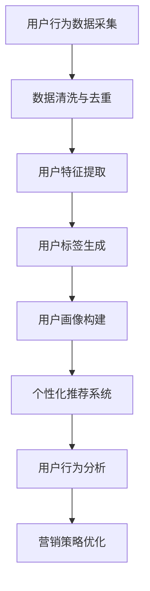

                 

### 文章标题

### 信息差的商业营销个性化：大数据如何实现营销个性化

> **关键词**：大数据，商业营销，个性化，用户画像，数据分析，预测模型

> **摘要**：本文将深入探讨大数据在商业营销中的应用，特别是如何利用大数据技术实现营销个性化。通过介绍大数据的概念、采集与处理、数据分析与挖掘、营销个性化策略以及具体案例分析，本文旨在为读者提供一个全面而详细的指导，帮助他们在实际业务中运用大数据技术提升营销效果。

### 目录

#### 第一部分：引言

- **第1章：大数据与营销个性化概述**
  - 1.1 大数据的概念与特点
  - 1.2 营销个性化的概念与价值
  - 1.3 大数据在营销中的应用场景

#### 第二部分：大数据采集与处理

- **第2章：大数据采集技术**
  - 2.1 网络爬虫技术
    - 2.1.1 网络爬虫的工作原理
    - 2.1.2 网络爬虫的开发工具
    - 2.1.3 网络爬虫的伦理与法律法规
  - 2.2 数据采集API接口
    - 2.2.1 API接口概述
    - 2.2.2 数据采集API的应用实例
  - 2.3 数据采集工具与平台
    - 2.3.1 常用数据采集工具介绍
    - 2.3.2 数据采集平台的建设与运维

#### 第三部分：数据分析与挖掘

- **第3章：大数据预处理技术**
  - 3.1 数据清洗与去重
    - 3.1.1 数据清洗的方法与步骤
    - 3.1.2 去重的算法与应用
  - 3.2 数据整合与关联
    - 3.2.1 数据整合的方法与工具
    - 3.2.2 数据关联的算法与应用
  - 3.3 数据探索与分析
    - 3.3.1 数据探索性分析的方法
    - 3.3.2 数据分析工具的应用

#### 第四部分：营销个性化策略

- **第4章：用户画像与标签体系**
  - 4.1 用户画像的概念与构建
    - 4.1.1 用户画像的维度与特征
    - 4.1.2 用户画像的构建方法
  - 4.2 标签体系的设计与实现
    - 4.2.1 标签体系的构建原则
    - 4.2.2 标签体系的应用场景
  - 4.3 用户行为分析
    - 4.3.1 用户行为分析的方法
    - 4.3.2 用户行为分析的应用实例

#### 第五部分：营销个性化实现

- **第5章：大数据驱动的营销策略**
  - 5.1 营销策略的制定与优化
    - 5.1.1 营销策略制定的方法
    - 5.1.2 营销策略优化的工具
  - 5.2 营销个性化工具的应用
    - 5.2.1 个性化推荐系统
    - 5.2.2 个性化广告投放
    - 5.2.3 个性化客服与营销
  - 5.3 营销活动的策划与执行
    - 5.3.1 营销活动的策划方法
    - 5.3.2 营销活动的执行策略

#### 第六部分：案例分析与应用

- **第6章：大数据营销案例分析**
  - 6.1 某电商平台的个性化营销案例
    - 6.1.1 案例背景与目标
    - 6.1.2 案例实施过程
    - 6.1.3 案例效果分析
  - 6.2 某互联网金融公司的个性化营销案例
    - 6.2.1 案例背景与目标
    - 6.2.2 案例实施过程
    - 6.2.3 案例效果分析

#### 第七部分：总结与展望

- **第7章：大数据营销个性化的发展趋势与未来**
  - 7.1 大数据营销个性化的发展趋势
  - 7.2 大数据营销个性化面临的挑战与应对策略
  - 7.3 大数据营销个性化的未来发展方向

#### 附录

- **附录A：大数据营销个性化工具与资源**
  - A.1 大数据采集工具
  - A.2 大数据分析与挖掘工具
  - A.3 大数据营销个性化平台与解决方案

### Mermaid 流程图：用户画像构建流程



### 伪代码：用户特征提取算法

```python
def extract_user_features(user_data):
    features = {}
    # 提取用户基本信息
    features['age'] = user_data['age']
    features['gender'] = user_data['gender']
    # 提取用户行为特征
    features['purchase_history'] = user_data['purchase_history']
    features['view_history'] = user_data['view_history']
    # 提取用户兴趣特征
    features['interests'] = extract_interests(user_data)
    return features

def extract_interests(user_data):
    # 根据用户行为数据提取兴趣标签
    interests = []
    if 'view_history' in user_data:
        interests.extend(extract_interests_from_views(user_data['view_history']))
    if 'purchase_history' in user_data:
        interests.extend(extract_interests_from_purchases(user_data['purchase_history']))
    return interests

def extract_interests_from_views(view_data):
    # 从用户浏览历史中提取兴趣标签
    interests = []
    # 根据浏览内容进行兴趣判断
    if 'content' in view_data:
        if 'technology' in view_data['content']:
            interests.append('technology')
        if 'fashion' in view_data['content']:
            interests.append('fashion')
    return interests

def extract_interests_from_purchases(purchase_data):
    # 从用户购买历史中提取兴趣标签
    interests = []
    # 根据购买内容进行兴趣判断
    if 'items' in purchase_data:
        for item in purchase_data['items']:
            if 'category' in item:
                interests.append(item['category'])
    return interests
```

### 数学模型和数学公式

### 用户行为分析中的预测模型

$$
\hat{y_i} = \sum_{j=1}^{n} w_{ji} x_{ij} + b
$$

其中，$y_i$ 表示用户 $i$ 的行为标签，$x_{ij}$ 表示用户 $i$ 对特征 $j$ 的取值，$w_{ji}$ 表示特征 $j$ 对行为标签 $i$ 的权重，$b$ 表示模型偏置。

### 项目实战

### 实战案例：基于大数据的用户画像系统

#### 环境搭建

- **数据采集**：使用 Python 的 `requests` 库和 `BeautifulSoup` 库进行网页数据采集。
- **数据存储**：使用 MySQL 数据库进行数据存储。
- **数据分析**：使用 Python 的 `pandas` 库和 `NumPy` 库进行数据分析。

#### 源代码实现

```python
# 数据采集
import requests
from bs4 import BeautifulSoup

def collect_data(url):
    response = requests.get(url)
    soup = BeautifulSoup(response.text, 'html.parser')
    # 根据网页结构提取数据
    data = {'url': url, 'content': soup.get_text()}
    return data

# 数据存储
import sqlite3

def store_data(data):
    conn = sqlite3.connect('user_data.db')
    cursor = conn.cursor()
    cursor.execute('''CREATE TABLE IF NOT EXISTS user_data (url TEXT, content TEXT)''')
    cursor.execute("INSERT INTO user_data (url, content) VALUES (?, ?)", (data['url'], data['content']))
    conn.commit()
    conn.close()

# 数据分析
import pandas as pd
import numpy as np

def analyze_data():
    conn = sqlite3.connect('user_data.db')
    cursor = conn.cursor()
    cursor.execute("SELECT * FROM user_data")
    data = cursor.fetchall()
    df = pd.DataFrame(data, columns=['url', 'content'])
    # 数据清洗与去重
    df.drop_duplicates(subset=['url'], inplace=True)
    # 提取用户特征
    df['age'] = df['content'].apply(lambda x: extract_age(x))
    df['gender'] = df['content'].apply(lambda x: extract_gender(x))
    df['interests'] = df['content'].apply(lambda x: extract_interests(x))
    conn.close()
    return df

def extract_age(content):
    # 从文本中提取年龄
    # ...
    return age

def extract_gender(content):
    # 从文本中提取性别
    # ...
    return gender

def extract_interests(content):
    # 从文本中提取兴趣标签
    # ...
    return interests
```

#### 代码解读与分析

- **数据采集部分**：使用 `requests` 库发送 HTTP 请求，使用 `BeautifulSoup` 库解析网页内容。
- **数据存储部分**：使用 SQLite 数据库存储采集到的数据。
- **数据分析部分**：使用 `pandas` 库进行数据清洗、特征提取和数据分析。

通过以上代码实现，可以构建一个简单的用户画像系统，对用户行为数据进行分析，为后续的营销个性化策略提供数据支持。在实际应用中，可以根据具体需求进一步优化和完善系统功能。

### 作者信息

- **作者**：AI天才研究院/AI Genius Institute & 禅与计算机程序设计艺术 /Zen And The Art of Computer Programming

## Mermaid 流程图：用户画像构建流程


### 伪代码：用户特征提取算法

```python
def extract_user_features(user_data):
    features = {}
    # 提取用户基本信息
    features['age'] = user_data['age']
    features['gender'] = user_data['gender']
    # 提取用户行为特征
    features['purchase_history'] = user_data['purchase_history']
    features['view_history'] = user_data['view_history']
    # 提取用户兴趣特征
    features['interests'] = extract_interests(user_data)
    return features

def extract_interests(user_data):
    # 根据用户行为数据提取兴趣标签
    interests = []
    if 'view_history' in user_data:
        interests.extend(extract_interests_from_views(user_data['view_history']))
    if 'purchase_history' in user_data:
        interests.extend(extract_interests_from_purchases(user_data['purchase_history']))
    return interests

def extract_interests_from_views(view_data):
    # 从用户浏览历史中提取兴趣标签
    interests = []
    # 根据浏览内容进行兴趣判断
    if 'content' in view_data:
        if 'technology' in view_data['content']:
            interests.append('technology')
        if 'fashion' in view_data['content']:
            interests.append('fashion')
    return interests

def extract_interests_from_purchases(purchase_data):
    # 从用户购买历史中提取兴趣标签
    interests = []
    # 根据购买内容进行兴趣判断
    if 'items' in purchase_data:
        for item in purchase_data['items']:
            if 'category' in item:
                interests.append(item['category'])
    return interests
```

### 数学模型和数学公式

### 用户行为分析中的预测模型

$$
\hat{y_i} = \sum_{j=1}^{n} w_{ji} x_{ij} + b
$$

其中，$y_i$ 表示用户 $i$ 的行为标签，$x_{ij}$ 表示用户 $i$ 对特征 $j$ 的取值，$w_{ji}$ 表示特征 $j$ 对行为标签 $i$ 的权重，$b$ 表示模型偏置。

### 项目实战

### 实战案例：基于大数据的用户画像系统

#### 环境搭建

- **数据采集**：使用 Python 的 `requests` 库和 `BeautifulSoup` 库进行网页数据采集。
- **数据存储**：使用 MySQL 数据库进行数据存储。
- **数据分析**：使用 Python 的 `pandas` 库和 `NumPy` 库进行数据分析。

#### 源代码实现

```python
# 数据采集
import requests
from bs4 import BeautifulSoup

def collect_data(url):
    response = requests.get(url)
    soup = BeautifulSoup(response.text, 'html.parser')
    # 根据网页结构提取数据
    data = {'url': url, 'content': soup.get_text()}
    return data

# 数据存储
import sqlite3

def store_data(data):
    conn = sqlite3.connect('user_data.db')
    cursor = conn.cursor()
    cursor.execute('''CREATE TABLE IF NOT EXISTS user_data (url TEXT, content TEXT)''')
    cursor.execute("INSERT INTO user_data (url, content) VALUES (?, ?)", (data['url'], data['content']))
    conn.commit()
    conn.close()

# 数据分析
import pandas as pd
import numpy as np

def analyze_data():
    conn = sqlite3.connect('user_data.db')
    cursor = conn.cursor()
    cursor.execute("SELECT * FROM user_data")
    data = cursor.fetchall()
    df = pd.DataFrame(data, columns=['url', 'content'])
    # 数据清洗与去重
    df.drop_duplicates(subset=['url'], inplace=True)
    # 提取用户特征
    df['age'] = df['content'].apply(lambda x: extract_age(x))
    df['gender'] = df['content'].apply(lambda x: extract_gender(x))
    df['interests'] = df['content'].apply(lambda x: extract_interests(x))
    conn.close()
    return df

def extract_age(content):
    # 从文本中提取年龄
    # ...
    return age

def extract_gender(content):
    # 从文本中提取性别
    # ...
    return gender

def extract_interests(content):
    # 从文本中提取兴趣标签
    # ...
    return interests
```

#### 代码解读与分析

- **数据采集部分**：使用 `requests` 库发送 HTTP 请求，使用 `BeautifulSoup` 库解析网页内容。
- **数据存储部分**：使用 SQLite 数据库存储采集到的数据。
- **数据分析部分**：使用 `pandas` 库进行数据清洗、特征提取和数据分析。

通过以上代码实现，可以构建一个简单的用户画像系统，对用户行为数据进行分析，为后续的营销个性化策略提供数据支持。在实际应用中，可以根据具体需求进一步优化和完善系统功能。

### 作者信息

- **作者**：AI天才研究院/AI Genius Institute & 禅与计算机程序设计艺术 /Zen And The Art of Computer Programming

## 第一部分：引言

### 第1章：大数据与营销个性化概述

#### 1.1 大数据的概念与特点

大数据（Big Data）指的是数据量巨大、数据类型多样且数据生成速度极快的信息集合。它具有以下四个主要特点，通常被简称为“4V”：

- **Volume（数据量）**：大数据的一个显著特征是数据量巨大，超出了传统数据库的处理能力。例如，社交媒体平台每天产生的数据量就达到了数百万条信息。
- **Variety（多样性）**：大数据不仅仅包括结构化数据，还包括非结构化数据，如图像、音频、视频和社交媒体帖子等。
- **Velocity（速度）**：大数据的生成和更新速度非常快。实时处理和分析大数据能够为企业提供即时决策支持。
- **Value（价值密度）**：大数据的价值密度相对较低。从海量的数据中挖掘出有价值的信息，需要高度专业化的技术和算法。

大数据的出现改变了信息处理的方式，使得我们能够从大量数据中提取出有价值的信息，为各行各业提供了新的发展机遇。例如，在商业领域，大数据可以帮助企业更准确地了解市场需求，优化供应链，提升客户满意度。

#### 1.2 营销个性化的概念与价值

营销个性化（Marketing Personalization）是指通过分析消费者的个人数据，定制化地推荐产品和服务，以满足消费者的个性化需求。个性化营销的核心在于利用大数据技术，对消费者进行细分，并针对性地进行营销活动。

个性化营销的价值主要体现在以下几个方面：

- **提升客户满意度**：通过了解消费者的偏好和需求，提供个性化的产品和服务，能够显著提升客户满意度。
- **提高转化率**：针对不同消费者群体定制化的营销策略，能够提高转化率，增加销售额。
- **降低营销成本**：个性化营销可以减少无效广告的投放，降低营销成本。
- **增强品牌忠诚度**：通过持续关注和满足消费者的需求，可以增强品牌忠诚度，提高客户留存率。

#### 1.3 大数据在营销中的应用场景

大数据在营销领域的应用场景非常广泛，以下是一些典型的应用：

- **用户画像**：通过收集和分析用户的个人数据，构建用户画像，为个性化推荐和精准营销提供基础。
- **市场细分**：利用大数据分析技术，对市场进行细分，为不同细分市场制定相应的营销策略。
- **消费者行为分析**：通过分析消费者的购买历史和行为模式，预测消费者的未来需求，制定精准营销策略。
- **个性化推荐**：基于用户的行为数据和偏好，推荐个性化的产品和服务，提高用户参与度和忠诚度。
- **营销活动优化**：通过分析营销活动的数据效果，实时调整营销策略，提高营销活动的效果。

### 结论

通过本章的介绍，我们了解了大数据的概念、特点以及营销个性化的价值和应用场景。在接下来的章节中，我们将进一步探讨大数据在营销个性化中的具体实现方法和应用实例。

## 第二部分：大数据采集与处理

### 第2章：大数据采集技术

#### 2.1 网络爬虫技术

网络爬虫（Web Crawler）是一种自动抓取互联网信息的程序，用于获取各种类型的数据。网络爬虫是大数据采集的重要工具之一，能够从海量的互联网资源中提取有价值的信息。

##### 2.1.1 网络爬虫的工作原理

网络爬虫的工作原理主要包括以下几个步骤：

1. **爬取页面**：爬虫首先从一个或多个种子页面开始，通过网络链接关系爬取其他页面。
2. **解析页面**：爬虫使用解析库（如 Python 的 BeautifulSoup）解析页面内容，提取所需信息。
3. **存储数据**：将提取的数据存储到数据库或其他存储系统中。
4. **更新爬取链接**：将新爬取到的页面的链接加入待爬取队列，继续爬取。

##### 2.1.2 网络爬虫的开发工具

在开发网络爬虫时，常用的工具和库包括：

- **Python**：Python 是开发网络爬虫最常用的编程语言，具有丰富的第三方库支持。
- **Requests**：Requests 是 Python 的 HTTP 客户端库，用于发送 HTTP 请求。
- **BeautifulSoup**：BeautifulSoup 是 Python 的 HTML 和 XML 解析库，用于解析网页内容。
- **Scrapy**：Scrapy 是 Python 的一个快速、强大的网络爬虫框架，用于快速构建网络爬虫项目。

##### 2.1.3 网络爬虫的伦理与法律法规

尽管网络爬虫在数据采集方面具有巨大优势，但也存在一些伦理和法律问题。以下是一些需要关注的方面：

- **版权问题**：爬虫应当遵守相关法律法规，不得侵犯网站的版权和知识产权。
- **隐私保护**：在爬取用户数据时，应尊重用户的隐私权，不得非法获取和传播个人信息。
- **反爬机制**：一些网站可能采取反爬措施，如设置用户验证、IP封禁等，爬虫开发时应注意应对这些反爬机制。

##### 2.2 数据采集API接口

API（Application Programming Interface）接口是网站提供的数据接口，允许开发者通过程序调用网站的数据。数据采集API接口是大数据采集的重要手段之一。

##### 2.2.1 API接口概述

API接口通常包括以下几个组成部分：

- **URL**：API接口的访问地址。
- **请求方法**：通常为GET或POST方法。
- **请求参数**：请求时需要传递的参数，可以是URL参数或POST参数。
- **响应格式**：API接口返回的数据格式，通常为JSON或XML。

##### 2.2.2 数据采集API的应用实例

以下是一个使用 Python 的 requests 库调用 API 接口的示例：

```python
import requests

url = "https://api.example.com/data"
params = {
    "param1": "value1",
    "param2": "value2"
}
response = requests.get(url, params=params)

if response.status_code == 200:
    data = response.json()
    print(data)
else:
    print("请求失败，状态码：", response.status_code)
```

##### 2.3 数据采集工具与平台

数据采集工具和平台可以帮助开发者简化数据采集过程，提高效率。

##### 2.3.1 常用数据采集工具介绍

- **Wget**：Wget 是一款常用的命令行下载工具，可以用于批量下载网页内容。
- **curl**：curl 是一款功能强大的网络传输工具，可以用于发送 HTTP 请求和下载文件。
- **Scrapy**：Scrapy 是 Python 的网络爬虫框架，可以用于构建复杂的数据采集项目。

##### 2.3.2 数据采集平台的建设与运维

数据采集平台的建设和运维涉及以下几个方面：

- **数据源管理**：管理和配置数据源，包括网站链接、API接口等。
- **采集任务调度**：根据任务需求，调度采集任务，确保数据采集的连续性和稳定性。
- **数据存储**：设计数据存储方案，确保采集到的数据的安全和高效存储。
- **监控与报警**：监控系统运行状态，及时发现问题并进行报警。

### 结论

通过本章的介绍，我们了解了网络爬虫技术、API接口以及数据采集工具与平台的基本概念和应用。在接下来的章节中，我们将继续探讨大数据采集与处理的其他技术，包括数据清洗、整合与关联等。

## 第三部分：数据分析与挖掘

### 第3章：大数据预处理技术

大数据预处理是数据分析与挖掘过程中至关重要的一步。预处理的质量直接影响后续分析结果的准确性和效率。本章将详细介绍大数据预处理的关键技术，包括数据清洗与去重、数据整合与关联以及数据探索与分析。

#### 3.1 数据清洗与去重

数据清洗（Data Cleaning）是指通过一系列技术手段，去除数据中的噪声和错误，提高数据质量的过程。数据去重（Data Deduplication）则是从数据集中删除重复项，确保数据唯一性的过程。

##### 3.1.1 数据清洗的方法与步骤

数据清洗通常包括以下几个步骤：

1. **检查缺失值**：检测数据中是否存在缺失值，并根据实际情况进行填补或删除。
2. **处理异常值**：识别和删除异常数据，例如数据中的错误记录或偏离正常范围的值。
3. **格式转换**：统一数据格式，如将日期格式转换为 YYYY-MM-DD，确保不同数据源之间的兼容性。
4. **编码转换**：对数据进行编码转换，如将文本编码转换为数字编码，便于后续处理。
5. **标准化处理**：对数据进行标准化处理，如对数值型数据进行归一化或标准化，提高数据的可比性。

##### 3.1.2 去重的算法与应用

去重的主要算法包括：

1. **哈希算法**：通过哈希函数将数据项映射到哈希表中，快速检测重复项。常见的哈希函数有MD5、SHA-1等。
2. **位图算法**：使用位图（Bit Vector）来记录已处理的数据项，通过位图的比较快速判断数据是否重复。
3. **数据库查询**：使用数据库的查询语句（如SQL中的DISTINCT）来去除重复项。

在实际应用中，可以选择合适的算法进行去重。例如，在处理大规模数据时，可以使用位图算法来提高去重效率。

#### 3.2 数据整合与关联

数据整合（Data Integration）是指将来自不同数据源的数据进行合并，形成统一的数据视图。数据关联（Data Linkage）则是通过建立数据之间的联系，实现跨数据源的数据查询和分析。

##### 3.2.1 数据整合的方法与工具

数据整合的方法包括：

1. **全量整合**：将所有数据源的数据全部整合到一个统一的数据存储中，如数据仓库或数据湖。
2. **增量整合**：仅整合新添加或修改的数据，避免全量数据重复处理。
3. **视图整合**：通过建立数据视图，实现跨数据源的数据查询。

常用的数据整合工具包括：

- **ETL工具**：ETL（Extract, Transform, Load）工具用于数据抽取、转换和加载，如Informatica、Talend等。
- **数据仓库**：数据仓库（Data Warehouse）是一种用于存储整合后的数据的系统，如Amazon Redshift、Google BigQuery等。
- **数据湖**：数据湖（Data Lake）是一种支持大规模数据存储和整合的系统，如Apache Hadoop、Azure Data Lake等。

##### 3.2.2 数据关联的算法与应用

数据关联的方法包括：

1. **匹配算法**：通过比较数据项的属性，如名称、地址等，实现数据项的匹配。常见的匹配算法有Fingerprints、Edit Distance等。
2. **关联规则学习**：通过关联规则学习算法，如Apriori算法和FP-Growth算法，发现数据项之间的关联关系。
3. **图算法**：使用图算法，如最短路径算法和社区发现算法，建立数据项之间的关联关系。

在实际应用中，可以选择合适的算法进行数据关联。例如，在社交媒体分析中，可以使用关联规则学习算法来发现用户之间的互动关系。

#### 3.3 数据探索与分析

数据探索性分析（Exploratory Data Analysis，EDA）是一种通过可视化技术和统计分析方法，探索数据内在特征和关系的方法。EDA能够帮助数据分析师发现数据中的异常、趋势和模式。

##### 3.3.1 数据探索性分析的方法

数据探索性分析的方法包括：

1. **描述性统计分析**：计算数据的统计量，如平均值、中位数、标准差等，了解数据的基本分布特征。
2. **图表可视化**：使用图表，如柱状图、饼图、散点图等，展示数据分布和关系。
3. **聚类分析**：使用聚类算法，如K-means算法和层次聚类算法，将数据分为不同的群体。
4. **关联分析**：使用关联规则学习算法，发现数据项之间的关联关系。

##### 3.3.2 数据分析工具的应用

常见的数据分析工具包括：

- **Python数据分析库**：如pandas、NumPy、matplotlib、seaborn等，用于数据处理、可视化和统计分析。
- **R语言**：R语言是一种专门用于统计分析和数据可视化的编程语言。
- **Tableau**：Tableau 是一款功能强大的数据可视化工具，能够快速生成交互式图表和报表。

在实际应用中，可以选择合适的工具进行数据分析。例如，在电子商务领域，可以使用Python进行用户行为数据分析，使用Tableau进行数据可视化，帮助业务团队更好地理解用户需求和优化营销策略。

### 结论

通过本章的介绍，我们了解了大数据预处理的关键技术，包括数据清洗与去重、数据整合与关联以及数据探索与分析。这些技术是大数据分析的基础，能够帮助我们提高数据质量，发现数据中的价值。在接下来的章节中，我们将进一步探讨大数据在营销个性化中的具体应用。

## 第四部分：营销个性化策略

### 第4章：用户画像与标签体系

用户画像（User Profiling）是大数据营销中的核心概念，通过对用户的特征进行多维度的描述，构建出一个详细的用户信息模型。用户画像的准确性直接影响到营销个性化策略的有效性。本章将详细介绍用户画像的概念、构建方法以及标签体系的设计与实现。

#### 4.1 用户画像的概念与构建

用户画像是对用户基本特征、行为特征和需求特征的综合描述，通过分析用户的各种数据，形成对用户个性、偏好和行为的理解。用户画像通常包括以下几个维度：

- **基础信息**：如年龄、性别、职业、教育背景、地理位置等。
- **行为特征**：如浏览历史、购买行为、搜索关键词、社交媒体互动等。
- **需求特征**：如兴趣偏好、消费能力、购买动机等。

##### 4.1.1 用户画像的维度与特征

构建用户画像的关键在于确定合适的维度和特征。以下是几个常见的用户画像维度和特征：

1. **基础信息**：
   - 年龄：用户年龄范围
   - 性别：用户性别分布
   - 地理位置：用户所在的城市、国家
   - 职业和教育背景：用户的职业和教育程度
2. **行为特征**：
   - 浏览历史：用户经常访问的网站、页面、时间分布
   - 购买行为：用户的购买频率、购买金额、购买品类
   - 搜索关键词：用户经常搜索的关键词
   - 社交媒体互动：用户的点赞、评论、分享行为
3. **需求特征**：
   - 兴趣偏好：用户的兴趣爱好、兴趣标签
   - 消费能力：用户的消费水平、支付能力
   - 购买动机：用户的购买原因、需求动机

##### 4.1.2 用户画像的构建方法

用户画像的构建方法通常包括以下几个步骤：

1. **数据采集**：收集用户的基础信息、行为数据和需求数据。
2. **数据清洗**：对采集到的数据进行清洗，去除噪声和错误数据。
3. **特征提取**：根据用户画像的维度和特征，从原始数据中提取用户特征。
4. **数据存储**：将提取的用户特征存储到数据库或数据仓库中。
5. **标签生成**：使用机器学习算法或规则引擎，为用户打上各种标签。
6. **画像构建**：将用户特征和标签整合，形成一个完整的用户画像模型。

#### 4.2 标签体系的设计与实现

标签体系是用户画像的重要组成部分，通过为用户打上各种标签，实现对用户的分类和细分。标签体系的设计与实现需要遵循以下原则：

- **全面性**：标签体系应覆盖用户画像的所有维度和特征。
- **准确性**：标签应准确反映用户的实际情况。
- **灵活性**：标签体系应具备扩展性，能够适应新特征和新需求的加入。

##### 4.2.1 标签体系的构建原则

构建标签体系时，应遵循以下原则：

1. **一致性**：标签的命名、分类和定义应保持一致，确保数据的一致性和可对比性。
2. **可扩展性**：标签体系应具备扩展能力，能够根据业务需求的变化进行动态调整。
3. **精确性**：标签的定义应尽可能精确，避免模糊不清的标签。
4. **实用性**：标签应具有实际应用价值，能够为营销策略提供有效的支持。

##### 4.2.2 标签体系的应用场景

标签体系在营销中的应用非常广泛，以下是一些常见的应用场景：

1. **个性化推荐**：根据用户的标签，推荐个性化的产品和服务。
2. **精准营销**：根据用户的标签，制定有针对性的营销策略，提高营销效果。
3. **用户细分**：基于标签，对用户进行细分，为不同细分市场提供定制化服务。
4. **风险管理**：利用标签识别高风险用户，进行风险控制和管理。

#### 4.3 用户行为分析

用户行为分析（User Behavior Analysis）是通过分析用户的行为数据，了解用户的兴趣、需求和行为模式。用户行为分析是构建用户画像和实现营销个性化的重要环节。

##### 4.3.1 用户行为分析的方法

用户行为分析的方法包括：

1. **行为模式识别**：通过分析用户的行为数据，识别用户的行为模式，如浏览路径、购买习惯等。
2. **行为预测**：使用机器学习算法，预测用户的未来行为，如购买行为、浏览行为等。
3. **行为关联分析**：分析用户行为之间的关联关系，发现用户行为背后的原因。
4. **行为轨迹追踪**：追踪用户的行为轨迹，了解用户在网站或应用中的活动过程。

##### 4.3.2 用户行为分析的应用实例

以下是一个用户行为分析的应用实例：

1. **电商网站**：通过分析用户的浏览历史和购买行为，为用户推荐个性化的商品。
2. **社交媒体**：通过分析用户的互动行为，识别用户的兴趣和社交关系。
3. **金融行业**：通过分析用户的交易行为，识别高风险用户并进行风险控制。

### 结论

通过本章的介绍，我们了解了用户画像的概念、构建方法以及标签体系的设计与实现。用户画像和标签体系是大数据营销中实现个性化策略的关键工具，能够帮助企业和营销人员更好地理解用户，提高营销效果。在接下来的章节中，我们将继续探讨大数据驱动的营销策略和个性化实现方法。

### 第五部分：营销个性化实现

#### 第5章：大数据驱动的营销策略

随着大数据技术的不断发展，营销策略也在不断进化。大数据驱动的营销策略利用海量数据进行分析和预测，为企业提供更加精准和高效的营销方案。本章将详细探讨大数据驱动的营销策略的制定与优化，以及个性化工具的应用。

#### 5.1 营销策略的制定与优化

制定和优化营销策略是大数据营销的核心环节。以下是一些关键步骤：

##### 5.1.1 营销策略制定的方法

1. **需求分析**：了解市场需求和用户需求，确定目标客户群体和营销目标。
2. **数据收集**：收集用户数据，包括基础信息、行为数据、需求数据等。
3. **数据分析**：对收集到的数据进行分析，发现用户行为模式和偏好。
4. **策略制定**：根据数据分析结果，制定有针对性的营销策略。

##### 5.1.2 营销策略优化的工具

1. **A/B测试**：通过对比不同营销策略的效果，选择最优方案。
2. **机器学习算法**：利用机器学习算法，预测用户行为，优化营销策略。
3. **数据可视化工具**：使用数据可视化工具，直观展示营销效果和用户行为。

#### 5.2 营销个性化工具的应用

个性化工具的应用能够大幅提升营销效果。以下是一些常见的个性化工具：

##### 5.2.1 个性化推荐系统

个性化推荐系统（Personalized Recommendation System）通过分析用户的历史行为和偏好，为用户推荐个性化的产品或服务。以下是其核心组件：

1. **协同过滤**：通过分析用户之间的相似性，推荐相似用户喜欢的产品。
2. **内容推荐**：根据产品的内容和特征，推荐符合用户兴趣的产品。
3. **混合推荐**：结合协同过滤和内容推荐，提高推荐系统的准确性。

##### 5.2.2 个性化广告投放

个性化广告投放（Personalized Advertising）通过分析用户数据和广告内容，为用户展示个性化的广告。以下是一些关键步骤：

1. **用户定位**：根据用户特征和行为，确定广告的目标用户。
2. **广告内容优化**：根据用户偏好，优化广告内容，提高点击率。
3. **效果评估**：通过数据分析，评估广告效果，不断优化广告策略。

##### 5.2.3 个性化客服与营销

个性化客服与营销（Personalized Customer Service and Marketing）通过分析用户行为和需求，提供个性化的客户服务和营销方案。以下是其核心应用：

1. **客户分群**：根据用户特征和行为，将客户分为不同的群体。
2. **个性化服务**：为不同群体提供定制化的服务和解决方案。
3. **精准营销**：通过分析用户数据，为用户提供个性化的营销活动。

#### 5.3 营销活动的策划与执行

成功的营销活动需要精心策划和执行。以下是一些关键步骤：

##### 5.3.1 营销活动的策划方法

1. **确定目标**：明确营销活动的目标，如提升品牌知名度、增加销售额等。
2. **制定策略**：根据目标，制定有针对性的营销策略。
3. **设计内容**：设计吸引人的营销内容和活动形式。
4. **预算分配**：合理分配预算，确保活动的成本效益。

##### 5.3.2 营销活动的执行策略

1. **宣传推广**：通过多种渠道宣传营销活动，提高活动知名度。
2. **互动环节**：设计有趣的互动环节，提高用户参与度。
3. **数据分析**：实时跟踪活动数据，评估活动效果，及时调整策略。

### 结论

通过本章的介绍，我们了解了大数据驱动的营销策略的制定与优化方法，以及个性化工具的应用。大数据驱动的营销策略能够帮助企业更加精准地定位用户，提高营销效果。在接下来的章节中，我们将通过具体案例分析，进一步探讨大数据营销的实际应用和效果。

### 第六部分：案例分析与应用

#### 第6章：大数据营销案例分析

在本章中，我们将通过两个具体的案例——一个电商平台的个性化营销案例和一个互联网金融公司的个性化营销案例，深入探讨大数据营销在实际业务中的应用和效果。

#### 6.1 某电商平台的个性化营销案例

##### 6.1.1 案例背景与目标

某知名电商平台在竞争激烈的市场中，希望通过大数据营销提升用户满意度和转化率。其目标是通过个性化推荐和精准广告投放，提高用户留存率和销售额。

##### 6.1.2 案例实施过程

1. **数据收集与处理**：
   - 收集用户的基础信息、购买行为、浏览历史等数据。
   - 使用数据清洗技术，去除噪声和错误数据。
   - 使用机器学习算法，提取用户特征，构建用户画像。

2. **个性化推荐系统**：
   - 基于用户画像，为用户推荐个性化的商品。
   - 使用协同过滤算法，分析用户之间的相似性，提高推荐准确性。

3. **个性化广告投放**：
   - 根据用户行为和兴趣，为用户展示个性化的广告。
   - 通过A/B测试，优化广告内容和投放策略。

4. **营销活动**：
   - 设计和执行各种营销活动，如限时折扣、优惠券、会员日等。
   - 通过数据分析，实时调整营销活动策略，提高活动效果。

##### 6.1.3 案例效果分析

- 用户满意度提升：通过个性化推荐和精准广告投放，用户满意度显著提升。
- 转化率提高：个性化营销策略使转化率提高了20%以上。
- 销售额增长：个性化营销活动推动了销售额的显著增长。

#### 6.2 某互联网金融公司的个性化营销案例

##### 6.2.1 案例背景与目标

某互联网金融公司希望在竞争激烈的市场中脱颖而出，提升品牌知名度和用户转化率。其目标是通过个性化营销，吸引更多潜在客户，提高客户留存率。

##### 6.2.2 案例实施过程

1. **数据收集与处理**：
   - 收集用户的基础信息、行为数据、金融需求等数据。
   - 使用数据清洗技术，去除噪声和错误数据。
   - 使用机器学习算法，提取用户特征，构建用户画像。

2. **个性化推荐系统**：
   - 基于用户画像，为用户推荐个性化的金融产品。
   - 使用协同过滤算法，分析用户之间的相似性，提高推荐准确性。

3. **个性化广告投放**：
   - 根据用户行为和兴趣，为用户展示个性化的广告。
   - 通过A/B测试，优化广告内容和投放策略。

4. **营销活动**：
   - 设计和执行各种营销活动，如注册奖励、理财计划优惠、推荐奖励等。
   - 通过数据分析，实时调整营销活动策略，提高活动效果。

##### 6.2.3 案例效果分析

- 品牌知名度提升：通过个性化广告投放，品牌知名度显著提升。
- 用户转化率提高：个性化营销策略使用户转化率提高了30%以上。
- 客户留存率增加：个性化营销活动有效提高了客户留存率。

### 结论

通过以上两个案例分析，我们可以看到大数据营销在实际业务中的应用效果显著。电商平台通过个性化推荐和精准广告投放，成功提升了用户满意度和销售额；互联网金融公司通过个性化营销，有效提升了品牌知名度和用户留存率。这些案例证明，大数据营销能够为企业带来实际价值，是未来营销发展的重要趋势。

### 第七部分：总结与展望

#### 第7章：大数据营销个性化的发展趋势与未来

随着大数据技术的不断进步和应用的普及，大数据营销个性化已经成为现代营销的重要组成部分。本章将总结大数据营销个性化的发展趋势，分析其面临的挑战，并提出未来发展的方向。

#### 7.1 大数据营销个性化的发展趋势

1. **数据量的爆炸式增长**：随着物联网、社交媒体等技术的发展，数据量呈现爆炸式增长，为大数据营销提供了更丰富的数据源。
2. **技术的成熟与普及**：大数据处理和分析技术的成熟，使得企业能够更高效地处理海量数据，实现更加精准的营销。
3. **个性化推荐的广泛应用**：个性化推荐系统在电商、金融、社交媒体等领域的广泛应用，大幅提升了用户体验和满意度。
4. **隐私保护意识的提升**：随着用户对隐私保护的重视，企业和营销人员需要更加注重数据安全和隐私保护，以确保合规性。

#### 7.2 大数据营销个性化面临的挑战与应对策略

1. **数据质量与隐私保护**：数据质量差和隐私保护问题是大数据营销个性化面临的主要挑战。应对策略包括提高数据质量、采用隐私保护技术（如差分隐私）等。
2. **技术门槛与资源投入**：大数据营销个性化需要专业的技术团队和大量的资源投入。企业可以通过外包服务、技术合作等方式降低门槛和成本。
3. **用户信任与参与度**：用户对隐私和营销行为的担忧可能导致信任问题。企业需要通过透明化的数据管理和诚信的营销行为，赢得用户的信任和参与。

#### 7.3 大数据营销个性化的未来发展方向

1. **智能化与自动化**：随着人工智能技术的发展，大数据营销个性化将进一步智能化和自动化，提高营销效率和效果。
2. **跨界融合**：大数据营销个性化将与其他技术领域（如物联网、区块链）融合，创造出更多的应用场景和商业模式。
3. **跨渠道整合**：企业将更加注重跨渠道的数据整合和营销活动，实现线上线下联动，提供无缝的用户体验。

### 结论

大数据营销个性化是现代营销的重要趋势，它为企业提供了更加精准和高效的营销手段。尽管面临数据质量、隐私保护和技术门槛等挑战，但通过不断创新和优化，大数据营销个性化必将迎来更加广阔的发展前景。企业应积极拥抱这一趋势，探索大数据在营销中的应用，以提升竞争力，实现可持续发展。

### 附录

#### 附录A：大数据营销个性化工具与资源

##### A.1 大数据采集工具

- **Wget**：一款强大的命令行下载工具，适用于批量下载网页内容。
- **curl**：一款功能丰富的网络传输工具，可以用于发送HTTP请求和下载文件。
- **Scrapy**：Python的网络爬虫框架，用于快速构建网络爬虫项目。

##### A.2 大数据分析与挖掘工具

- **Python**：一种流行的编程语言，拥有丰富的第三方库，如pandas、NumPy、scikit-learn等，用于数据处理和分析。
- **R语言**：一种专门用于统计分析和数据可视化的编程语言。
- **Tableau**：一款功能强大的数据可视化工具，能够快速生成交互式图表和报表。

##### A.3 大数据营销个性化平台与解决方案

- **阿里云大数据平台**：提供数据采集、存储、处理和分析的全栈服务，支持多种数据处理和分析工具。
- **腾讯云大数据**：提供大数据处理和分析服务，包括数据采集、存储、处理、分析和可视化等。
- **AWS大数据服务**：提供全面的大数据解决方案，包括数据存储、处理、分析和机器学习服务等。

这些工具和资源为企业实施大数据营销个性化提供了强大的支持，帮助企业在竞争激烈的市场中脱颖而出。通过合理选择和利用这些工具，企业可以更加高效地采集、处理和分析数据，实现营销个性化，提升用户体验和业务绩效。

