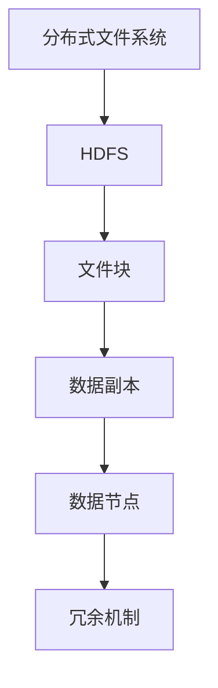
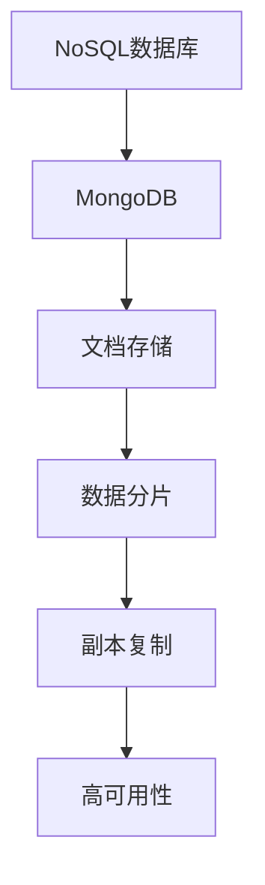
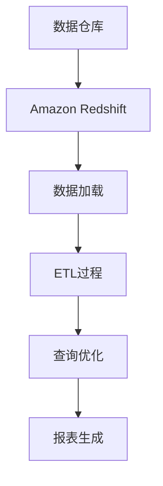
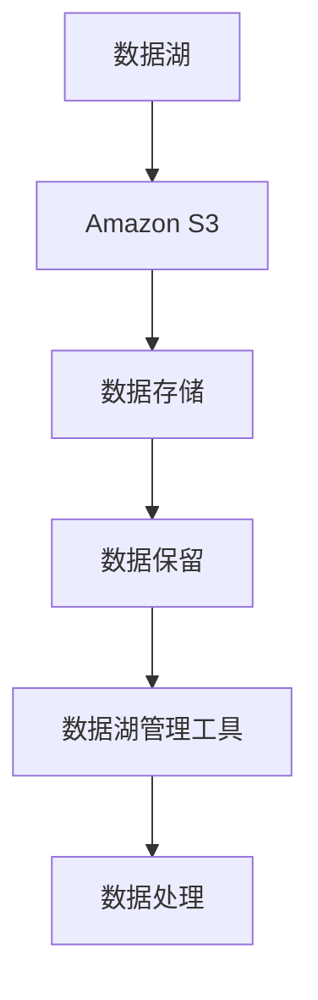

                 

# 信息差的客户价值最大化：大数据如何实现客户价值最大化

> 关键词：大数据、客户价值、信息差、客户行为分析、个性化推荐、客户关系管理、人工智能

> 摘要：随着大数据技术的迅猛发展，如何通过大数据分析实现客户价值最大化成为了企业关注的焦点。本文将深入探讨大数据在客户价值最大化中的应用，从信息差的角度出发，详细分析大数据在客户行为分析、个性化推荐和客户关系管理等方面的作用，并提供实践案例和未来发展趋势。

## 《信息差的客户价值最大化：大数据如何实现客户价值最大化》目录大纲

## 第一部分：大数据与客户价值概述

### 第1章：大数据与信息差

#### 1.1 大数据时代的到来

#### 1.2 信息差的本质与影响

#### 1.3 客户价值最大化的挑战与机遇

### 第2章：大数据的核心概念与架构

#### 2.1 大数据的定义与特点

#### 2.2 大数据的处理框架

#### 2.3 大数据的存储与访问

### 第3章：大数据分析技术

#### 3.1 数据清洗与预处理

#### 3.2 数据挖掘与机器学习

#### 3.3 人工智能在数据分析中的应用

## 第二部分：大数据与客户价值最大化应用

### 第4章：客户行为分析

#### 4.1 客户行为分析的核心概念

#### 4.2 客户行为分析的流程与方法

#### 4.3 客户行为分析在市场营销中的应用

### 第5章：个性化推荐系统

#### 5.1 个性化推荐系统的原理与架构

#### 5.2 个性化推荐算法详解

#### 5.3 个性化推荐系统的应用实践

### 第6章：客户关系管理

#### 6.1 客户关系管理的概念与重要性

#### 6.2 客户关系管理系统的设计

#### 6.3 客户关系管理的成功案例

### 第7章：大数据在客户价值提升中的挑战与解决方案

#### 7.1 大数据在客户价值提升中的挑战

#### 7.2 解决方案与实践案例

#### 7.3 未来发展趋势与展望

## 第三部分：大数据与客户价值最大化实战

### 第8章：大数据项目实践

#### 8.1 项目背景与目标

#### 8.2 项目架构与实施步骤

#### 8.3 项目成果与评估

### 第9章：大数据在客户价值提升中的应用案例

#### 9.1 案例一：电商平台个性化推荐系统

#### 9.2 案例二：金融行业客户关系管理

#### 9.3 案例三：制造业客户行为分析

### 第10章：大数据与客户价值最大化的未来发展

#### 10.1 大数据技术在客户价值提升中的应用前景

#### 10.2 未来发展趋势与挑战

#### 10.3 大数据与客户价值最大化的最佳实践

## 附录

### 附录 A：大数据技术工具与资源

#### A.1 主流大数据处理框架

#### A.2 大数据存储与访问技术

#### A.3 大数据可视化工具

#### A.4 大数据安全与隐私保护

### <待续> ## 第1章：大数据与信息差

### 1.1 大数据时代的到来

随着互联网的普及和信息技术的飞速发展，大数据时代已然来临。大数据是指那些数据量巨大、类型繁多、速度极快的数据集合，涵盖了结构化、半结构化和非结构化数据。这些数据来源于互联网、社交网络、物联网、传感器等各种渠道，其中蕴含了丰富的信息和价值。大数据时代的到来，标志着人类对信息处理能力的提升，也带来了前所未有的商业机遇。

大数据的兴起，源自多个因素的推动。首先，数据存储和处理技术的进步，使得海量数据的存储、管理和分析变得更加高效和便捷。其次，互联网的普及和物联网的发展，使得数据的生成速度和数据量急剧增加。最后，随着数据挖掘和机器学习技术的不断进步，人们能够从海量数据中提取有价值的信息，从而实现商业价值的最大化。

### 1.2 信息差的本质与影响

信息差，即信息不对称，是指在一个经济体中，某些人或组织拥有而另一些人或组织没有的信息。在商业环境中，信息差的存在可能导致一些组织或个人获得超额利润。信息差的本质在于信息的稀缺性和传递效率。

信息差对企业运营和客户价值产生深远影响。首先，信息差可以帮助企业更好地了解市场需求和客户行为，从而制定更有效的营销策略。例如，通过分析客户的历史购买数据，企业可以预测客户的未来购买行为，从而实现精准营销。其次，信息差可以帮助企业发现市场机会，创新产品和服务。例如，通过对行业数据的挖掘，企业可以发现新的需求和市场缺口，从而开发出更符合客户需求的产品。

然而，信息差也可能带来负面影响。信息不对称可能导致市场失灵，如价格操纵、垄断行为等。此外，信息差可能导致客户对企业的不信任，影响企业的长期发展。

### 1.3 客户价值最大化的挑战与机遇

客户价值最大化是企业追求的核心目标，它涉及到企业如何通过提供优质的产品和服务，满足客户的需求，从而实现客户满意度和忠诚度的提升。在大数据时代，客户价值最大化面临着新的挑战和机遇。

挑战方面，首先，大数据的复杂性使得企业难以从海量数据中提取有价值的信息。其次，数据隐私和安全问题日益突出，如何保护客户数据成为企业面临的重要问题。最后，企业需要具备强大的数据处理和分析能力，才能充分利用大数据的优势。

机遇方面，首先，大数据为企业提供了更精准的市场洞察和客户行为分析工具，有助于企业制定更有效的营销策略。其次，大数据可以帮助企业优化供应链，提高生产效率，降低成本。最后，大数据与人工智能的结合，为自动化决策和智能服务提供了新的可能性。

## 第2章：大数据的核心概念与架构

### 2.1 大数据的定义与特点

大数据（Big Data）通常指的是数据量巨大、数据类型多样、数据生成速度极快的海量数据集合。它具有以下四个主要特点，常被简称为“4V”：

1. **Volume（数据量）**：大数据的数据量非常庞大，通常以PB（皮字节）甚至EB（艾字节）为单位来衡量。
2. **Velocity（数据速度）**：大数据的生成速度非常快，需要实时或近实时地进行处理和分析。
3. **Variety（数据多样性）**：大数据不仅包括结构化数据，还包含大量的半结构化和非结构化数据，如图像、音频、视频和文本等。
4. **Veracity（真实性）**：大数据的真实性和可信度也是一个重要的特点，因为数据的准确性和完整性对分析和决策至关重要。

### 2.2 大数据的处理框架

大数据的处理框架通常包括数据收集、数据存储、数据管理和数据分析四个主要阶段。

1. **数据收集**：这一阶段涉及数据的收集和导入，包括来自各种来源的数据，如互联网、物联网设备、社交媒体、传感器等。
   
2. **数据存储**：大数据需要高效、可靠和可扩展的存储解决方案。常见的存储技术包括分布式文件系统（如Hadoop Distributed File System，HDFS）和NoSQL数据库（如MongoDB、Cassandra）。

3. **数据管理**：数据管理包括数据清洗、数据集成和数据质量保证。这一阶段确保数据的一致性、准确性和完整性，是数据分析的基础。

4. **数据分析**：数据分析是大数据处理框架的核心，包括数据挖掘、机器学习和统计分析等方法，用于从数据中提取有价值的信息和洞见。

### 2.3 大数据的存储与访问

大数据的存储与访问是大数据技术中至关重要的一环。以下是一些常见的存储与访问技术：

1. **分布式文件系统**：分布式文件系统如Hadoop Distributed File System（HDFS）和Apache HBase，提供了高吞吐量的数据存储和访问能力，适用于大数据集的存储和处理。

2. **NoSQL数据库**：NoSQL数据库如MongoDB、Cassandra和Redis等，提供了灵活的数据模型和高可用性，适用于处理半结构化和非结构化数据。

3. **数据仓库**：数据仓库如Amazon Redshift、Google BigQuery和Snowflake，提供了强大的数据管理和分析能力，适用于复杂的数据分析和报表生成。

4. **数据湖**：数据湖如Amazon S3、Google Cloud Storage和Azure Data Lake，提供了大规模的数据存储解决方案，适用于存储和保留大量数据，包括原始数据和历史数据。

5. **数据访问**：数据访问技术包括RESTful API、数据库连接池和分布式缓存（如Redis），提供了快速、可靠的数据访问方式，以满足实时数据分析和应用程序的需求。

### 2.3.1 大数据存储与访问的核心概念

**分布式存储**：分布式存储是将数据分布存储在多个节点上，以提供高可用性和高扩展性。它通过数据分片和冗余机制来确保数据的可靠性和容错能力。

**数据分区**：数据分区是将大数据集划分为多个较小的数据块，以优化存储和访问性能。分区可以根据不同的关键属性（如时间、地理位置）进行。

**数据冗余**：数据冗余是通过在多个节点上存储数据的副本来确保数据的可靠性。在数据丢失或节点故障时，冗余副本可以快速恢复数据。

**数据索引**：数据索引是用于快速检索数据的结构。它通过创建索引表来加快对大规模数据的查询速度。

**数据流处理**：数据流处理是实时处理和分析数据的技术，适用于需要快速响应的场景，如实时监控和流媒体分析。

### 2.3.2 大数据存储与访问的技术实现

**分布式文件系统实现**：

**NoSQL数据库实现**：

**数据仓库实现**：

**数据湖实现**：

### 2.3.3 大数据存储与访问的性能优化

**数据分片优化**：通过合理的数据分片策略，可以减少查询时间和数据访问延迟。例如，根据时间属性进行分区，可以加速历史数据的查询。

**数据压缩**：数据压缩可以减少存储空间和提高数据传输效率。常见的压缩算法包括Hadoop Snappy、LZO和Gzip等。

**缓存策略**：缓存常用数据可以提高数据访问速度。可以使用分布式缓存技术（如Redis）来存储热点数据。

**负载均衡**：负载均衡可以将数据处理任务分配到不同的节点上，提高系统的整体性能和可靠性。

### 2.3.4 大数据存储与访问的安全性和隐私保护

**数据加密**：对数据进行加密可以保护数据的机密性，防止数据泄露。

**访问控制**：通过设置访问权限和身份验证机制，可以控制对数据的访问，防止未授权访问。

**审计日志**：审计日志可以记录数据访问和操作的详细信息，便于追踪和分析潜在的安全威胁。

**隐私保护**：在处理个人数据时，需要遵守相关的隐私保护法规，如欧盟的《通用数据保护条例》（GDPR）。

## 第3章：大数据分析技术

### 3.1 数据清洗与预处理

数据清洗与预处理是大数据分析的重要步骤，确保数据的质量和准确性。以下是一些核心概念和实现方法：

#### 3.1.1 核心概念

**数据清洗**：数据清洗是指从原始数据中去除错误、重复和不完整的数据。这包括去除噪声数据、修正错误数据、填补缺失数据等。

**数据预处理**：数据预处理包括数据规范化、数据转换和数据集成。数据规范化是将数据转换为统一的格式，数据转换是将数据转换为适用于分析的工具，数据集成是将多个数据源的数据合并为一个统一的视图。

#### 3.1.2 数据清洗与预处理的实现方法

**数据清洗**：

- **去重**：通过比较数据记录的唯一标识，去除重复的数据记录。
- **修复错误**：对错误的数据记录进行修正，例如将错误的日期更正为正确的日期。
- **填补缺失值**：使用统计学方法填补缺失值，例如使用均值、中位数或众数。

**数据预处理**：

- **数据规范化**：将不同数据源的数据转换为统一的格式，例如将不同的日期格式转换为标准格式。
- **数据转换**：使用转换函数将数据转换为适用于分析的工具，例如将字符串数据转换为数值数据。
- **数据集成**：将来自不同数据源的数据合并为一个统一的视图，例如使用数据仓库技术。

#### 3.1.3 数据清洗与预处理的技术实现

**数据清洗实现**：
```python
# 去重
data = data.drop_duplicates()

# 修复错误
data['date'] = data['date'].map(correct_date_function)

# 填补缺失值
data['missing_value'] = data['missing_value'].fillna(data['missing_value'].mean())
```
**数据预处理实现**：
```python
# 数据规范化
data['date'] = pd.to_datetime(data['date'])

# 数据转换
data['numeric_value'] = data['string_value'].astype(int)

# 数据集成
data_combined = pd.merge(data1, data2, on='common_column')
```

### 3.2 数据挖掘与机器学习

数据挖掘与机器学习是大数据分析的核心技术，用于从大量数据中提取有价值的信息和模式。以下是一些核心概念和算法：

#### 3.2.1 核心概念

**数据挖掘**：数据挖掘是指从大量数据中提取有用信息的过程，包括聚类、分类、关联规则挖掘等。

**机器学习**：机器学习是指通过算法从数据中自动学习规律和模式，用于预测和决策。

#### 3.2.2 数据挖掘与机器学习的主要算法

**聚类算法**：聚类算法用于将数据分为多个类别，常见的算法包括K-means、DBSCAN等。

**分类算法**：分类算法用于将数据分为不同的类别，常见的算法包括决策树、支持向量机（SVM）等。

**关联规则挖掘**：关联规则挖掘用于发现数据之间的关联关系，常见的算法包括Apriori算法、FP-growth等。

**预测算法**：预测算法用于预测未来的趋势和模式，常见的算法包括线性回归、时间序列分析等。

#### 3.2.3 数据挖掘与机器学习的实现方法

**数据挖掘实现**：

- **K-means聚类算法**：
  ```python
  from sklearn.cluster import KMeans
  kmeans = KMeans(n_clusters=3)
  kmeans.fit(data)
  clusters = kmeans.predict(data)
  ```

- **决策树分类算法**：
  ```python
  from sklearn.tree import DecisionTreeClassifier
  clf = DecisionTreeClassifier()
  clf.fit(X_train, y_train)
  y_pred = clf.predict(X_test)
  ```

- **Apriori算法**：
  ```python
  from mlxtend.frequent_patterns import apriori
  from mlxtend.frequent_patterns import association_rules
  frequent_itemsets = apriori(data, min_support=0.5)
  rules = association_rules(frequent_itemsets, metric="confidence", min_threshold=0.7)
  ```

**机器学习实现**：

- **线性回归**：
  ```python
  from sklearn.linear_model import LinearRegression
  reg = LinearRegression()
  reg.fit(X_train, y_train)
  y_pred = reg.predict(X_test)
  ```

- **时间序列分析**：
  ```python
  from statsmodels.tsa.arima_model import ARIMA
  model = ARIMA(y_train, order=(5, 1, 2))
  model_fit = model.fit()
  y_pred = model_fit.forecast(steps=len(X_test))
  ```

### 3.3 人工智能在数据分析中的应用

人工智能（AI）在数据分析中发挥着越来越重要的作用，通过深度学习和神经网络等先进技术，实现更加复杂和智能的数据分析。以下是一些核心概念和应用：

#### 3.3.1 核心概念

**深度学习**：深度学习是一种通过多层神经网络进行特征学习和自动提取特征的技术。

**神经网络**：神经网络是由大量相互连接的神经元组成的计算模型，用于模拟人脑的神经网络结构和功能。

**生成对抗网络（GAN）**：生成对抗网络是由生成器和判别器组成的对偶网络，用于生成真实数据。

**强化学习**：强化学习是通过试错和反馈来学习最优策略的机器学习方法。

#### 3.3.2 人工智能在数据分析中的应用

**图像识别**：通过深度学习技术，可以实现对图像的高精度识别，例如人脸识别、物体检测等。

**自然语言处理（NLP）**：NLP技术可以用于文本分类、情感分析、机器翻译等任务。

**预测分析**：通过强化学习技术，可以实现对复杂系统的预测和分析，例如股票市场预测、交通流量预测等。

**生成模型**：生成对抗网络（GAN）可以用于生成高质量的数据，用于数据增强和生成虚拟样本。

#### 3.3.3 人工智能在数据分析中的应用案例

**图像识别**：

- **卷积神经网络（CNN）**：
  ```python
  from tensorflow.keras.models import Sequential
  from tensorflow.keras.layers import Conv2D, MaxPooling2D, Flatten, Dense
  
  model = Sequential()
  model.add(Conv2D(32, (3, 3), activation='relu', input_shape=(64, 64, 3)))
  model.add(MaxPooling2D((2, 2)))
  model.add(Flatten())
  model.add(Dense(128, activation='relu'))
  model.add(Dense(10, activation='softmax'))
  model.compile(optimizer='adam', loss='categorical_crossentropy', metrics=['accuracy'])
  model.fit(X_train, y_train, epochs=10, batch_size=32, validation_data=(X_test, y_test))
  ```

- **迁移学习**：
  ```python
  from tensorflow.keras.applications import VGG16
  base_model = VGG16(weights='imagenet', include_top=False, input_shape=(224, 224, 3))
  base_model.trainable = False
  
  model = Sequential()
  model.add(base_model)
  model.add(Flatten())
  model.add(Dense(128, activation='relu'))
  model.add(Dense(10, activation='softmax'))
  model.compile(optimizer='adam', loss='categorical_crossentropy', metrics=['accuracy'])
  model.fit(X_train, y_train, epochs=10, batch_size=32, validation_data=(X_test, y_test))
  ```

**自然语言处理**：

- **文本分类**：
  ```python
  from tensorflow.keras.models import Sequential
  from tensorflow.keras.layers import Embedding, LSTM, Dense
  
  model = Sequential()
  model.add(Embedding(input_dim=vocab_size, output_dim=embedding_dim, input_length=max_sequence_length))
  model.add(LSTM(units=128, dropout=0.2, recurrent_dropout=0.2))
  model.add(Dense(units=num_classes, activation='softmax'))
  model.compile(optimizer='adam', loss='categorical_crossentropy', metrics=['accuracy'])
  model.fit(X_train, y_train, epochs=10, batch_size=32, validation_data=(X_test, y_test))
  ```

- **情感分析**：
  ```python
  from tensorflow.keras.models import Sequential
  from tensorflow.keras.layers import Embedding, LSTM, Dense
  
  model = Sequential()
  model.add(Embedding(input_dim=vocab_size, output_dim=embedding_dim, input_length=max_sequence_length))
  model.add(LSTM(units=128, dropout=0.2, recurrent_dropout=0.2))
  model.add(Dense(units=1, activation='sigmoid'))
  model.compile(optimizer='adam', loss='binary_crossentropy', metrics=['accuracy'])
  model.fit(X_train, y_train, epochs=10, batch_size=32, validation_data=(X_test, y_train))
  ```

**预测分析**：

- **时间序列预测**：
  ```python
  from tensorflow.keras.models import Sequential
  from tensorflow.keras.layers import LSTM, Dense
  
  model = Sequential()
  model.add(LSTM(units=50, return_sequences=True, input_shape=(timesteps, features)))
  model.add(LSTM(units=50))
  model.add(Dense(units=1))
  model.compile(optimizer='adam', loss='mean_squared_error')
  model.fit(X_train, y_train, epochs=100, batch_size=32, validation_data=(X_val, y_val), verbose=1)
  ```

- **强化学习**：
  ```python
  import numpy as np
  import tensorflow as tf
  
  model = Sequential()
  model.add(LSTM(units=128, input_shape=(timesteps, features)))
  model.add(Dense(units=1, activation='sigmoid'))
  model.compile(optimizer='adam', loss='binary_crossentropy')
  
  replay_memory = []
  episode = 1000
  
  for e in range(episode):
      state = env.reset()
      done = False
      total_reward = 0
      
      while not done:
          action = model.predict(state.reshape(1, timesteps, features))
          new_state, reward, done, _ = env.step(np.argmax(action))
          total_reward += reward
          replay_memory.append((state, action, reward, new_state, done))
          
          if len(replay_memory) > batch_size:
              replay_memory = np.random.choice(replay_memory, batch_size)
              state_batch, action_batch, reward_batch, next_state_batch, done_batch = zip(*replay_memory)
              model.fit(np.array(state_batch).reshape(batch_size, timesteps, features), np.array(action_batch).reshape(batch_size, 1), epochs=1, batch_size=batch_size, verbose=0)
              
      print(f"Episode {e+1} Total Reward: {total_reward}")
  ```

### 3.3.4 深度学习与机器学习在数据分析中的优势

**自动特征提取**：深度学习可以通过多层神经网络自动提取复杂的数据特征，减少了人工特征工程的工作量。

**处理复杂数据**：深度学习能够处理结构化、半结构化和非结构化数据，例如图像、文本和语音数据。

**高精度预测**：深度学习模型通常能够达到更高的预测精度，特别是在处理大规模数据和高维特征时。

**并行计算能力**：深度学习模型可以通过GPU等硬件加速进行并行计算，提高了数据处理和分析的效率。

## 第4章：客户行为分析

### 4.1 客户行为分析的核心概念

客户行为分析是指通过收集和分析客户的行为数据，来理解和预测客户行为的一种数据分析方法。客户行为分析的核心概念包括：

- **客户数据**：客户数据是指与客户行为相关的各种数据，包括用户访问行为、购买行为、社交互动等。

- **行为数据**：行为数据是指客户的行动轨迹，例如点击、浏览、购买、评论等。

- **数据分析**：数据分析是指使用统计和机器学习等方法，从客户行为数据中提取有价值的信息和模式。

- **客户价值**：客户价值是指客户为企业带来的经济收益，包括直接的购买收入和间接的品牌价值等。

### 4.2 客户行为分析的流程与方法

客户行为分析通常包括以下步骤：

1. **数据收集**：收集与客户行为相关的数据，包括网站访问日志、交易记录、社交媒体互动等。

2. **数据清洗**：清洗和预处理数据，去除噪声数据和缺失值，确保数据的质量和准确性。

3. **数据存储**：将清洗后的数据存储在数据库或数据仓库中，以便进行后续分析。

4. **数据探索**：通过数据可视化工具和统计方法，探索数据的分布、趋势和关联关系。

5. **特征工程**：从原始数据中提取有助于预测客户行为的特征，例如用户年龄、购买频率、浏览时长等。

6. **建模与预测**：使用机器学习算法建立预测模型，预测客户的未来行为，例如购买概率、流失概率等。

7. **结果验证**：通过测试集验证模型的准确性和稳定性，调整模型参数以优化预测效果。

### 4.3 客户行为分析在市场营销中的应用

客户行为分析在市场营销中具有广泛的应用，可以帮助企业制定更有效的营销策略和个性化推荐系统。以下是一些具体应用：

- **精准营销**：通过分析客户的购买历史和行为数据，企业可以识别出潜在的高价值客户，并针对这些客户进行精准的营销活动，提高转化率。

- **个性化推荐**：基于客户的行为数据和偏好，企业可以构建个性化推荐系统，向客户推荐他们可能感兴趣的产品或服务，提高客户满意度和购买意愿。

- **客户细分**：通过客户行为分析，企业可以将客户划分为不同的细分市场，针对不同的客户群体制定差异化的营销策略，提高营销效果。

- **客户忠诚度管理**：通过分析客户的忠诚度行为，企业可以识别出忠诚客户和潜在流失客户，采取相应的措施提高客户忠诚度和降低客户流失率。

### 实际案例：电商平台的客户行为分析

以某电商平台为例，该平台通过客户行为分析来提高销售和客户满意度。

1. **数据收集**：该平台收集了客户的访问数据、购买数据、评论数据等。

2. **数据清洗**：对收集的数据进行清洗和预处理，去除重复数据和缺失值。

3. **数据存储**：将清洗后的数据存储在数据仓库中，以便进行后续分析。

4. **数据探索**：通过数据可视化工具和统计方法，探索客户的购买习惯和偏好。

5. **特征工程**：从原始数据中提取客户年龄、购买频率、浏览时长、历史评论等特征。

6. **建模与预测**：使用机器学习算法建立预测模型，预测客户的购买概率和流失概率。

7. **结果验证**：通过测试集验证模型的准确性和稳定性，调整模型参数以优化预测效果。

8. **应用实践**：

   - **精准营销**：根据客户的购买历史和行为数据，向高价值客户发送个性化的营销邮件和短信，提高转化率。

   - **个性化推荐**：基于客户的浏览历史和购买行为，为每位客户推荐可能感兴趣的商品，提高客户的购买意愿。

   - **客户细分**：根据客户的购买频率和忠诚度，将客户划分为不同的细分市场，针对不同的客户群体制定差异化的营销策略。

   - **客户忠诚度管理**：通过分析客户的忠诚度行为，识别出忠诚客户和潜在流失客户，采取相应的措施提高客户忠诚度和降低客户流失率。

通过以上案例，可以看出客户行为分析在电商平台中的应用不仅提高了销售和客户满意度，还为企业提供了宝贵的客户洞察，有助于制定更加精准和有效的营销策略。

## 第5章：个性化推荐系统

### 5.1 个性化推荐系统的原理与架构

个性化推荐系统是一种通过分析用户的历史行为和偏好，为其推荐个性化内容或产品的方法。个性化推荐系统基于大数据和机器学习技术，能够提高用户满意度、提高转化率和销售额。

#### 5.1.1 核心原理

个性化推荐系统的核心原理包括用户画像、内容建模和推荐算法。以下是对这三个核心原理的详细解释：

- **用户画像**：用户画像是指对用户的兴趣、行为、习惯等特征进行抽象和建模，从而形成对用户的全面了解。用户画像可以通过收集用户的历史行为数据、社交数据、搜索记录等构建。

- **内容建模**：内容建模是指对推荐的内容进行特征提取和表示，以便与用户画像进行匹配。内容建模可以基于文本、图像、音频等多种类型的数据进行。

- **推荐算法**：推荐算法是指通过计算用户画像和内容模型之间的相似度或相关性，生成个性化的推荐结果。常见的推荐算法包括基于协同过滤、基于内容的推荐、混合推荐等。

#### 5.1.2 系统架构

个性化推荐系统通常包括数据层、计算层和展示层三个主要部分，其架构如下：

- **数据层**：数据层负责数据的收集、存储和管理。包括用户数据、内容数据、行为数据等。常见的数据存储技术有分布式数据库、NoSQL数据库和数据湖等。

- **计算层**：计算层负责处理推荐算法的运算，生成推荐结果。计算层包括用户画像生成、内容建模、相似度计算和推荐结果生成等模块。常见的计算技术有MapReduce、Spark、Flink等。

- **展示层**：展示层负责将推荐结果呈现给用户。展示层可以是网页、移动应用或智能设备等，通过可视化、交互设计等技术提高用户的使用体验。

### 5.2 个性化推荐算法详解

个性化推荐算法是推荐系统的核心，决定了推荐结果的质量和效果。以下是几种常见的个性化推荐算法及其原理：

#### 5.2.1 基于协同过滤的推荐算法

基于协同过滤的推荐算法是最常用的推荐算法之一，它通过分析用户之间的相似性来生成推荐结果。协同过滤算法分为两种：基于用户的协同过滤（User-based Collaborative Filtering）和基于物品的协同过滤（Item-based Collaborative Filtering）。

- **基于用户的协同过滤**：基于用户的协同过滤算法通过计算用户之间的相似度，找到与目标用户相似的邻居用户，然后从这些邻居用户的评分中提取推荐项。常见的方法有最近邻算法（Nearest Neighbors）、基于矩阵分解的方法等。

- **基于物品的协同过滤**：基于物品的协同过滤算法通过计算物品之间的相似度，找到与目标物品相似的邻居物品，然后从这些邻居物品的评分中提取推荐项。常见的方法有最近邻算法、基于模型的协同过滤算法等。

#### 5.2.2 基于内容的推荐算法

基于内容的推荐算法通过分析用户的历史行为和偏好，提取与用户兴趣相关的特征，然后根据这些特征生成推荐结果。基于内容的推荐算法可以分为以下几种：

- **基于项目的特征提取**：基于项目的特征提取方法通过分析项目的文本描述、标签、分类等信息，提取项目的特征向量，然后根据用户的兴趣特征进行推荐。

- **基于用户的历史行为**：基于用户的历史行为方法通过分析用户的浏览历史、购买历史等行为数据，提取用户的兴趣特征，然后根据这些特征进行推荐。

- **基于知识库的推荐**：基于知识库的推荐方法通过构建知识库，将用户和物品的相关知识进行关联，然后根据用户的兴趣和知识库中的信息进行推荐。

#### 5.2.3 混合推荐算法

混合推荐算法是将基于协同过滤和基于内容的推荐算法进行结合，以综合利用两者的优点。常见的混合推荐算法有：

- **基于模型的混合推荐**：基于模型的混合推荐方法通过构建联合模型，同时考虑用户和物品的特征，生成推荐结果。常见的方法有矩阵分解模型、深度学习模型等。

- **基于规则的混合推荐**：基于规则的混合推荐方法通过构建规则引擎，将基于协同过滤和基于内容的推荐结果进行融合，生成最终的推荐结果。

### 5.3 个性化推荐系统的应用实践

个性化推荐系统在电商、社交媒体、新闻推荐等领域有广泛的应用，以下是一些具体的应用实践：

#### 5.3.1 电商平台的个性化推荐

电商平台通过个性化推荐系统，可以根据用户的浏览历史、购买记录等行为数据，为用户推荐可能感兴趣的商品。以下是一个典型的电商个性化推荐系统应用实践：

1. **数据收集**：收集用户的浏览历史、购买记录、评价等行为数据，以及商品的描述、标签、分类等数据。

2. **数据预处理**：对行为数据进行清洗和预处理，包括去重、填充缺失值、归一化等，确保数据的质量。

3. **用户画像构建**：通过分析用户的历史行为数据，提取用户的兴趣特征，构建用户画像。

4. **商品特征提取**：对商品进行特征提取，包括文本特征（如商品标题、描述）、分类特征（如商品分类、品牌）等。

5. **推荐算法选择**：选择合适的推荐算法，如基于协同过滤、基于内容的推荐算法等，生成推荐结果。

6. **推荐结果生成**：根据用户画像和商品特征，计算用户和商品之间的相似度，生成个性化推荐结果。

7. **推荐结果展示**：将个性化推荐结果展示在用户界面，提高用户的购买意愿和满意度。

#### 5.3.2 社交媒体的个性化推荐

社交媒体平台通过个性化推荐系统，可以根据用户的兴趣、社交关系等，为用户推荐可能感兴趣的内容或用户。以下是一个典型的社交媒体个性化推荐系统应用实践：

1. **数据收集**：收集用户的浏览历史、点赞、评论等行为数据，以及用户的兴趣标签、社交关系等数据。

2. **数据预处理**：对行为数据进行清洗和预处理，包括去重、填充缺失值、归一化等，确保数据的质量。

3. **用户画像构建**：通过分析用户的历史行为数据，提取用户的兴趣特征，构建用户画像。

4. **内容特征提取**：对内容进行特征提取，包括文本特征（如内容标题、标签）、分类特征（如内容类型、主题）等。

5. **推荐算法选择**：选择合适的推荐算法，如基于协同过滤、基于内容的推荐算法等，生成推荐结果。

6. **推荐结果生成**：根据用户画像和内容特征，计算用户和内容之间的相似度，生成个性化推荐结果。

7. **推荐结果展示**：将个性化推荐结果展示在用户界面，提高用户的互动参与度和平台活跃度。

#### 5.3.3 新闻推荐系统的个性化推荐

新闻推荐系统通过个性化推荐系统，可以根据用户的兴趣、阅读历史等，为用户推荐可能感兴趣的新闻内容。以下是一个典型的新闻推荐系统个性化推荐系统应用实践：

1. **数据收集**：收集用户的阅读历史、点赞、评论等行为数据，以及用户的兴趣标签、阅读偏好等数据。

2. **数据预处理**：对行为数据进行清洗和预处理，包括去重、填充缺失值、归一化等，确保数据的质量。

3. **用户画像构建**：通过分析用户的历史行为数据，提取用户的兴趣特征，构建用户画像。

4. **新闻特征提取**：对新闻进行特征提取，包括文本特征（如新闻标题、摘要）、分类特征（如新闻类型、主题）等。

5. **推荐算法选择**：选择合适的推荐算法，如基于协同过滤、基于内容的推荐算法等，生成推荐结果。

6. **推荐结果生成**：根据用户画像和新闻特征，计算用户和新闻之间的相似度，生成个性化推荐结果。

7. **推荐结果展示**：将个性化推荐结果展示在用户界面，提高用户的阅读参与度和满意度。

通过以上应用实践，可以看出个性化推荐系统在各个领域的广泛应用，不仅提高了用户的满意度和参与度，还为平台带来了显著的商业价值。

### 5.4 个性化推荐系统的挑战与解决方案

个性化推荐系统在实际应用中面临一些挑战，包括数据稀疏性、冷启动问题、隐私保护等。以下是对这些挑战及其解决方案的详细讨论：

#### 5.4.1 数据稀疏性

数据稀疏性是指用户和物品之间的交互数据非常稀疏，导致推荐效果不佳。为了解决数据稀疏性问题，可以采用以下策略：

- **数据增强**：通过引入更多的辅助信息，如用户的人口统计信息、地理位置等，来丰富用户和物品的特征向量。

- **矩阵分解**：使用矩阵分解技术（如Singular Value Decomposition，SVD）来降低数据稀疏性，通过分解用户-物品评分矩阵来预测未知的评分。

- **协同过滤与内容的结合**：结合基于协同过滤和基于内容的方法，通过内容特征来增强推荐结果，减少数据稀疏性的影响。

#### 5.4.2 冷启动问题

冷启动问题是指新用户或新物品无法获得足够的交互数据，导致推荐效果不佳。解决冷启动问题的策略包括：

- **基于内容的推荐**：在新用户或新物品没有足够的交互数据时，使用基于内容的方法进行推荐，通过分析物品的属性和用户的历史偏好进行匹配。

- **混合推荐**：将基于协同过滤和基于内容的推荐方法结合起来，通过多种信息源生成推荐结果。

- **用户行为预测**：利用用户的注册信息、搜索历史等，预测用户的潜在兴趣，为新用户生成初始推荐列表。

#### 5.4.3 隐私保护

隐私保护是推荐系统面临的重要挑战，特别是当涉及个人敏感信息时。以下是一些隐私保护策略：

- **差分隐私**：通过引入噪声来保护用户的隐私，确保推荐结果不会暴露用户的敏感信息。

- **数据匿名化**：对用户数据进行分析前进行匿名化处理，去除可以直接识别用户身份的信息。

- **用户同意与透明度**：确保用户明确了解数据收集、处理和使用的目的，并提供透明的隐私政策。

#### 5.4.4 针对性广告与信息茧房

个性化推荐系统可能导致用户只接触到与自己观点相似的信息，形成信息茧房，影响用户的社会认知。解决针对性广告和信息茧房问题的策略包括：

- **多样性推荐**：在推荐结果中引入多样性，确保用户接触到不同观点和内容。

- **社交信号**：利用社交网络中的信息，推荐与用户兴趣不同但可能有益的内容。

- **用户反馈机制**：鼓励用户提供反馈，调整推荐算法，以减少偏见和偏见的放大。

### 5.5 个性化推荐系统的未来发展趋势

个性化推荐系统正处于快速发展阶段，未来可能会出现以下发展趋势：

- **多模态推荐**：随着图像、音频、视频等非结构化数据的大量生成，多模态推荐将成为重要方向。通过结合不同类型的数据，提供更加个性化和准确的推荐。

- **实时推荐**：实时推荐技术将实现更快的响应速度，满足用户实时变化的需求。通过实时分析用户行为，动态调整推荐策略。

- **增强学习与深度学习**：增强学习和深度学习技术将在推荐系统中发挥更大作用，通过自我学习和自适应调整，提高推荐效果。

- **社交推荐**：结合社交网络的信息，构建社交推荐系统，通过社交关系和群体行为来提升推荐的质量和多样性。

- **伦理与隐私**：随着对隐私保护的重视，推荐系统将更加注重伦理和隐私问题，通过技术手段确保用户的隐私和数据安全。

通过以上讨论，可以看出个性化推荐系统在数据处理、算法优化、应用实践和未来发展趋势等方面都有重要的发展空间，为企业和用户创造了巨大的价值。

## 第6章：客户关系管理

### 6.1 客户关系管理的概念与重要性

客户关系管理（Customer Relationship Management，CRM）是指通过一系列策略、技术和工具，以客户为中心，全面管理和优化企业与客户之间的互动关系。CRM的目标是提高客户满意度、增加客户忠诚度，从而实现企业的长期盈利和业务增长。

CRM的概念涉及多个方面，包括：

- **客户数据管理**：收集、存储和分析客户数据，以了解客户需求和偏好。
- **客户互动管理**：通过电话、邮件、社交媒体等渠道与客户进行有效沟通。
- **销售管理**：协助销售团队提高销售业绩，包括客户开发、销售流程管理、销售预测等。
- **营销自动化**：通过自动化工具实现营销活动的策划、执行和跟踪。
- **客户服务**：提供高质量的客户服务，解决客户问题，提升客户体验。

CRM的重要性体现在以下几个方面：

1. **提高客户满意度**：通过深入了解客户需求，提供个性化的服务和解决方案，增强客户满意度。

2. **增加客户忠诚度**：通过有效的客户关系管理，建立长期稳定的客户关系，提高客户忠诚度。

3. **优化销售业绩**：CRM工具和策略可以帮助销售团队更有效地识别潜在客户、管理销售机会，提高销售业绩。

4. **降低客户流失率**：通过及时响应客户问题、提供高质量服务，降低客户流失率。

5. **提高运营效率**：自动化和标准化的CRM流程可以提高工作效率，减少重复劳动，降低运营成本。

### 6.2 客户关系管理系统的设计

客户关系管理系统（CRM系统）的设计是CRM实施的关键环节，一个高效的CRM系统需要考虑以下几个方面：

#### 6.2.1 系统架构

CRM系统的架构通常包括以下几个层次：

1. **数据层**：数据层负责数据的收集、存储和管理。包括客户数据、销售数据、服务数据等。常见的数据存储技术有关系型数据库、NoSQL数据库和数据湖等。

2. **应用层**：应用层实现CRM系统的核心功能，包括客户管理、销售管理、营销自动化、服务管理等。应用层通常使用分布式架构，以提高系统的可扩展性和稳定性。

3. **展示层**：展示层负责将CRM系统的功能呈现给用户，包括网页界面、移动应用等。展示层的设计要考虑用户体验，提高操作的便捷性和效率。

4. **接口层**：接口层实现CRM系统与其他系统的集成，如ERP系统、财务系统等。通过API或其他接口技术，实现数据的互通和业务流程的整合。

#### 6.2.2 功能模块

CRM系统通常包括以下几个功能模块：

1. **客户管理**：客户管理模块用于收集、存储和管理客户信息，包括客户基本信息、交易记录、沟通记录等。通过客户管理模块，企业可以全面了解客户需求，提供个性化的服务和解决方案。

2. **销售管理**：销售管理模块协助销售团队管理销售机会、跟踪销售流程、进行销售预测等。通过销售管理模块，企业可以提高销售效率，优化销售流程。

3. **营销自动化**：营销自动化模块通过自动化工具实现营销活动的策划、执行和跟踪。包括邮件营销、社交媒体营销、广告投放等。通过营销自动化模块，企业可以更精准地触达潜在客户，提高营销效果。

4. **服务管理**：服务管理模块用于处理客户服务请求，包括客户咨询、投诉、售后服务等。通过服务管理模块，企业可以提供高质量的客户服务，提升客户满意度。

#### 6.2.3 技术选型

CRM系统的技术选型需要考虑以下几个方面：

1. **数据库选型**：根据业务需求和数据规模，选择合适的关系型数据库（如MySQL、Oracle）或NoSQL数据库（如MongoDB、Cassandra）。

2. **开发框架**：选择适合的Web开发框架（如Spring Boot、Django），以提高开发效率和系统性能。

3. **前端技术**：选择合适的前端技术（如React、Vue.js），以提高用户体验和界面交互效果。

4. **云计算和大数据技术**：利用云计算（如AWS、Azure）和大数据技术（如Hadoop、Spark），实现高可用性、可扩展性的系统架构。

### 6.3 客户关系管理的成功案例

以下是一些客户关系管理的成功案例，展示了CRM系统在不同行业和企业中的应用效果：

#### 6.3.1 案例一：华为

华为作为全球领先的科技公司，通过引入CRM系统，实现了客户信息的集中管理和高效利用。华为的CRM系统包括客户管理、销售管理、营销自动化等功能模块，通过集成大数据分析和人工智能技术，华为能够更准确地预测客户需求，提供个性化的产品和服务。此外，华为的CRM系统还实现了销售流程的自动化，提高了销售团队的效率。

#### 6.3.2 案例二：星巴克

星巴克通过引入CRM系统，实现了对客户数据的全面管理和精细化运营。星巴克的CRM系统包括客户管理、销售管理、营销自动化等功能模块，通过收集和分析客户的购买记录、偏好数据等，星巴克能够为每位客户提供个性化的咖啡推荐和促销活动。此外，星巴克的CRM系统还实现了会员管理的自动化，提高了客户满意度和忠诚度。

#### 6.3.3 案例三：宜家

宜家作为全球领先的家居用品零售商，通过引入CRM系统，实现了对客户关系的全面管理和优化。宜家的CRM系统包括客户管理、销售管理、服务管理等功能模块，通过收集和分析客户的购物行为、咨询记录等，宜家能够为每位客户提供个性化的购物体验和售后服务。此外，宜家的CRM系统还实现了销售和服务的自动化，提高了运营效率和客户满意度。

通过以上案例，可以看出CRM系统在不同行业和企业中的应用效果显著，不仅提高了客户满意度，还为企业带来了显著的商业价值。

## 第7章：大数据在客户价值提升中的挑战与解决方案

### 7.1 大数据在客户价值提升中的挑战

大数据技术在提升客户价值方面具有巨大潜力，但同时也面临诸多挑战。以下是一些主要挑战及其解决方案：

#### 7.1.1 数据隐私和安全问题

随着大数据的广泛应用，数据隐私和安全问题日益突出。企业需要处理海量客户数据，包括个人身份信息、购买记录、行为数据等。这些数据一旦泄露，可能导致严重的隐私侵犯和商业损失。

**解决方案**：

1. **数据加密**：对数据进行加密处理，确保数据在存储和传输过程中的安全性。常用的加密算法包括AES、RSA等。

2. **访问控制**：通过设置严格的访问控制机制，确保只有授权用户才能访问敏感数据。使用身份验证和权限管理技术，如OAuth、IAM等。

3. **数据匿名化**：对敏感数据进行匿名化处理，去除可以直接识别用户身份的信息，以保护用户隐私。

4. **安全审计**：建立数据安全审计机制，定期检查数据安全性和合规性，及时发现和修复安全漏洞。

#### 7.1.2 数据质量和管理问题

大数据的质量和准确性对分析结果至关重要。然而，数据源多样、格式不一致、数据冗余和缺失等问题常常导致数据质量低下，影响客户价值的提升。

**解决方案**：

1. **数据清洗与预处理**：对数据进行清洗和预处理，去除错误、重复和不完整的数据，确保数据的一致性、准确性和完整性。

2. **数据质量管理**：建立数据质量管理机制，对数据质量进行监控和评估，定期检查和修复数据质量问题。

3. **数据集成**：通过数据集成技术，将来自不同数据源的数据进行统一处理和存储，确保数据的一致性和可用性。

4. **数据治理**：建立数据治理体系，明确数据责任、规范数据标准和流程，确保数据的管理和使用符合合规要求。

#### 7.1.3 技术挑战

大数据分析需要处理海量数据，对计算性能和存储资源提出了极高的要求。此外，数据分析工具和技术的多样性和复杂性也增加了技术挑战。

**解决方案**：

1. **分布式计算和存储**：采用分布式计算和存储技术（如Hadoop、Spark等），提高数据处理和分析的效率。

2. **云计算和大数据平台**：利用云计算和大数据平台（如AWS、Azure等），提供弹性、可扩展的计算和存储资源。

3. **机器学习和深度学习**：采用先进的机器学习和深度学习算法（如TensorFlow、PyTorch等），提高数据分析的准确性和智能化水平。

4. **数据可视化**：通过数据可视化工具（如Tableau、Power BI等），将复杂的数据分析结果以直观的方式呈现，帮助用户理解和决策。

#### 7.1.4 原则挑战

大数据技术在提升客户价值的过程中，还需要遵循一系列伦理和原则，包括数据的公平性、透明度和可解释性等。

**解决方案**：

1. **伦理和隐私保护**：建立数据伦理和隐私保护机制，确保数据的使用和处理符合伦理和合规要求。

2. **透明度**：确保数据处理的透明度，公开数据收集、处理和使用的目的和方式，提高用户的信任和满意度。

3. **可解释性**：提高数据分析结果的可解释性，帮助用户理解分析过程和结果，确保决策的合理性和可接受性。

### 7.2 解决方案与实践案例

以下是一些大数据在客户价值提升中的成功解决方案和实践案例：

#### 7.2.1 案例一：电商平台

某知名电商平台通过大数据分析技术，实现了精准营销和个性化推荐，大幅提升了客户满意度和销售额。解决方案包括：

1. **用户画像构建**：通过分析用户的购买历史、浏览行为、地理位置等数据，构建用户画像，了解用户兴趣和需求。

2. **推荐算法应用**：采用基于协同过滤和内容的混合推荐算法，根据用户画像和商品特征，生成个性化推荐结果。

3. **营销自动化**：通过营销自动化工具，实现邮件营销、社交媒体推广等营销活动的自动化执行和跟踪。

4. **数据可视化**：利用数据可视化工具，将分析结果以图表和报告的形式呈现，帮助管理层了解市场趋势和客户需求。

#### 7.2.2 案例二：金融行业

某大型金融机构通过大数据分析技术，实现了客户关系管理和风险控制，提高了业务运营效率和客户满意度。解决方案包括：

1. **客户关系管理**：通过构建客户关系管理系统，实现客户数据的集中管理和分析，提供个性化的金融服务。

2. **信用评分**：利用大数据分析和机器学习算法，建立信用评分模型，提高贷款审批效率和准确性。

3. **风险控制**：通过分析客户行为数据、市场数据等，实时监控和评估客户风险，采取相应的风险控制措施。

4. **数据治理**：建立数据治理体系，规范数据标准和管理流程，确保数据质量和合规性。

#### 7.2.3 案例三：制造业

某制造企业通过大数据分析技术，实现了生产优化和供应链管理，提高了生产效率和竞争力。解决方案包括：

1. **生产数据分析**：通过收集和分析生产数据，实现生产过程的实时监控和优化，提高生产效率和产品质量。

2. **供应链管理**：通过分析供应链数据，优化供应链流程，降低库存成本，提高供应链效率。

3. **质量监控**：利用大数据分析技术，实时监控产品质量，实现产品质量的可视化和预测性维护。

4. **设备维护**：通过分析设备数据，预测设备故障，实现预防性维护，降低设备故障率和停机时间。

### 7.3 未来发展趋势与展望

随着大数据技术的不断发展和应用，大数据在客户价值提升中的作用将越来越重要。以下是一些未来发展趋势和展望：

1. **多模态数据融合**：随着物联网、传感器技术的发展，越来越多的非结构化数据（如图像、音频、视频）将纳入大数据分析，实现多模态数据的融合和智能分析。

2. **实时数据分析**：随着实时数据处理技术的进步，实时数据分析将得到更广泛的应用，帮助企业快速响应市场变化和客户需求。

3. **深度学习与人工智能**：深度学习和人工智能技术将在大数据分析中发挥更大作用，通过自我学习和自适应调整，实现更精准和智能的数据分析。

4. **隐私保护与伦理**：随着对隐私保护和伦理的重视，大数据分析将更加注重数据安全和合规性，通过技术手段确保数据的合法、公正和透明。

5. **行业定制化应用**：大数据技术在不同行业中的应用将更加深入和多样化，实现行业定制化的解决方案，提高行业竞争力和创新能力。

通过以上讨论，可以看出大数据在客户价值提升中面临诸多挑战，但同时也拥有巨大的潜力和机遇。未来，大数据技术将继续发展和创新，为企业和客户创造更大的价值。

## 第8章：大数据项目实践

### 8.1 项目背景与目标

某大型电商平台在业务发展的过程中，发现客户满意度和转化率有待提高。为了更好地了解客户需求，提高客户体验，该电商平台决定实施一个大数据项目，通过大数据分析实现客户价值最大化。项目的主要目标包括：

1. **提升客户满意度**：通过大数据分析，深入了解客户需求和行为，提供个性化的产品推荐和购物体验，提高客户满意度。
2. **提高转化率**：利用大数据分析，优化营销策略和推荐算法，提高客户的购买意愿和转化率。
3. **降低客户流失率**：通过大数据分析，识别潜在流失客户，采取有效的挽回策略，降低客户流失率。
4. **提高运营效率**：通过大数据分析，优化供应链和库存管理，提高运营效率和降低成本。

### 8.2 项目架构与实施步骤

大数据项目的实施涉及到数据采集、存储、处理、分析和应用等多个环节。以下是该项目的主要架构和实施步骤：

#### 8.2.1 数据采集

数据采集是大数据项目的第一步，该电商平台从多个渠道收集客户数据，包括：

1. **用户行为数据**：通过网站日志、点击流数据等，收集用户的浏览、搜索、购买等行为数据。
2. **交易数据**：通过支付系统、订单管理系统等，收集客户的交易数据，包括购买时间、金额、商品等。
3. **客户反馈数据**：通过客户服务系统、问卷调查等，收集客户的反馈数据，包括满意度、建议等。
4. **外部数据**：通过第三方数据源，如社交媒体、天气数据等，收集与客户行为相关的外部数据。

#### 8.2.2 数据存储

数据存储是大数据项目的关键环节，该电商平台采用了分布式存储技术，包括：

1. **HDFS**：使用Hadoop Distributed File System（HDFS）存储大规模结构化和半结构化数据，如用户行为数据和交易数据。
2. **HBase**：使用Apache HBase存储实时访问的半结构化和非结构化数据，如客户反馈数据和社交媒体数据。
3. **数据湖**：使用数据湖技术（如Amazon S3）存储大量原始数据和历史数据，便于后续分析和挖掘。

#### 8.2.3 数据处理

数据处理是大数据项目的核心环节，该电商平台采用了以下数据处理技术：

1. **ETL**：使用ETL（Extract, Transform, Load）工具，如Apache NiFi和Apache Spark，将数据从不同源导入数据仓库，进行清洗、转换和加载。
2. **数据仓库**：使用数据仓库技术（如Amazon Redshift和Google BigQuery），存储和管理结构化数据，为后续分析提供基础。
3. **数据预处理**：使用数据预处理工具（如Apache Spark和Python），对数据进行清洗、去重、填补缺失值等预处理操作，确保数据质量。

#### 8.2.4 数据分析

数据分析是大数据项目的关键环节，该电商平台采用了以下数据分析技术：

1. **客户行为分析**：使用机器学习算法（如聚类分析和决策树），分析客户的购买行为、浏览习惯等，识别客户的偏好和需求。
2. **客户细分**：使用聚类算法，将客户划分为不同的细分市场，为不同类型的客户提供个性化的服务。
3. **预测分析**：使用时间序列分析（如ARIMA模型）和回归分析，预测客户未来的购买行为和市场需求。
4. **推荐系统**：使用协同过滤算法和内容推荐算法，构建个性化推荐系统，为用户推荐可能感兴趣的商品。

#### 8.2.5 应用实践

数据分析结果应用于电商平台的不同业务场景，包括：

1. **精准营销**：根据客户的行为数据和偏好，为不同类型的客户推送个性化的营销活动，提高营销效果。
2. **推荐系统**：利用个性化推荐算法，为用户推荐可能感兴趣的商品，提高用户满意度。
3. **客户服务**：通过分析客户反馈数据，识别常见问题和客户痛点，优化客户服务流程，提高客户满意度。
4. **供应链管理**：通过预测客户需求和市场需求，优化库存管理和供应链流程，提高运营效率。

### 8.3 项目成果与评估

大数据项目实施后，取得了显著的成果：

1. **客户满意度提升**：通过个性化推荐和精准营销，客户满意度显著提升，用户活跃度和留存率有所提高。
2. **转化率提高**：通过优化推荐算法和营销策略，转化率有所提高，销售额和利润有所增长。
3. **客户流失率降低**：通过识别潜在流失客户和采取有效的挽回策略，客户流失率有所降低。
4. **运营效率提高**：通过预测客户需求和市场需求，优化库存管理和供应链流程，运营效率显著提高，成本降低。

项目评估结果显示，大数据项目的实施对电商平台的业务发展产生了积极影响，为客户价值提升和业务增长提供了有力支持。

## 第9章：大数据在客户价值提升中的应用案例

### 9.1 案例一：电商平台个性化推荐系统

某大型电商平台利用大数据技术，成功构建了一个个性化推荐系统，实现了客户价值的显著提升。

#### 案例背景

电商平台拥有庞大的用户群体和海量的商品数据，然而，如何提高用户购买体验、增加销售额成为企业关注的焦点。个性化推荐系统成为解决这一问题的有效手段。

#### 解决方案

1. **数据收集**：通过网站日志、点击流数据等渠道，收集用户的浏览、搜索、购买等行为数据。
2. **用户画像构建**：利用机器学习算法，分析用户的行为数据，构建用户画像，包括用户兴趣、购买习惯、偏好等。
3. **推荐算法**：采用基于协同过滤和内容的混合推荐算法，结合用户画像和商品特征，为每位用户生成个性化推荐结果。
4. **推荐结果展示**：将个性化推荐结果展示在用户界面，提高用户的购买意愿和满意度。

#### 实施步骤

1. **数据清洗**：对收集到的行为数据进行清洗和预处理，去除重复、错误和不完整的数据。
2. **用户画像构建**：利用聚类算法，将用户划分为不同的兴趣群体，构建用户画像。
3. **商品特征提取**：对商品进行特征提取，包括文本特征（如商品描述、标签）、分类特征（如商品类别、品牌）等。
4. **推荐算法实现**：采用协同过滤算法（如基于用户的协同过滤和基于物品的协同过滤），结合内容推荐算法，生成个性化推荐结果。
5. **推荐结果优化**：通过用户反馈和实验，不断优化推荐算法，提高推荐效果。

#### 实施效果

个性化推荐系统上线后，取得了显著的效果：

1. **用户满意度提升**：用户对个性化推荐系统的满意度显著提高，认为推荐结果更加符合自己的兴趣和需求。
2. **转化率提高**：个性化推荐系统的应用，使得用户的购买转化率有所提高，销售额和利润增长明显。
3. **客户留存率提高**：通过个性化推荐，用户对电商平台的依赖性增强，客户留存率显著提升。
4. **运营效率提高**：推荐系统的自动化处理，减少了人工推荐的工作量，提高了运营效率。

#### 案例总结

通过大数据技术的应用，电商平台成功构建了个性化推荐系统，实现了客户价值的显著提升。案例表明，个性化推荐系统在电商行业具有重要的应用价值，为其他行业提供了有益的借鉴。

### 9.2 案例二：金融行业客户关系管理

某大型金融机构通过大数据分析技术，实现了客户关系管理的优化，提升了客户满意度和忠诚度。

#### 案例背景

金融行业竞争激烈，客户关系管理成为金融机构生存和发展的关键。为了更好地了解客户需求、提供个性化服务、提高客户满意度和忠诚度，金融机构决定引入大数据分析技术。

#### 解决方案

1. **客户数据收集**：通过银行交易系统、客户服务系统等渠道，收集客户的交易数据、行为数据、服务记录等。
2. **客户画像构建**：利用机器学习算法，分析客户数据，构建客户画像，包括客户财务状况、消费习惯、风险偏好等。
3. **客户细分**：根据客户画像，将客户划分为不同的细分市场，为不同类型的客户提供个性化的产品和服务。
4. **客户互动管理**：利用大数据分析结果，优化客户互动策略，提高客户满意度。

#### 实施步骤

1. **数据清洗**：对收集到的客户数据进行分析，去除重复、错误和不完整的数据，确保数据质量。
2. **用户画像构建**：利用聚类算法和特征工程，构建客户画像，识别客户的关键特征。
3. **客户细分**：根据客户画像，将客户划分为高价值客户、潜在流失客户等不同的细分市场。
4. **客户互动优化**：通过大数据分析结果，优化客户互动策略，如个性化营销、客户关怀等。

#### 实施效果

大数据分析技术在客户关系管理中的应用，取得了显著的效果：

1. **客户满意度提升**：通过个性化的产品推荐和互动策略，客户满意度显著提高，客户对金融机构的信任度增强。
2. **客户忠诚度提高**：通过大数据分析，金融机构能够更好地了解客户需求，提供个性化的服务，客户忠诚度有所提升。
3. **运营效率提高**：通过自动化和智能化的客户关系管理，降低了人工成本，提高了运营效率。
4. **业务增长**：通过精准营销和客户关怀，金融机构的业务规模和利润有所增长。

#### 案例总结

通过大数据技术的应用，金融行业实现了客户关系管理的优化，提升了客户满意度和忠诚度。案例表明，大数据分析技术在金融行业具有重要的应用价值，为其他行业提供了有益的借鉴。

### 9.3 案例三：制造业客户行为分析

某制造企业通过大数据分析技术，深入挖掘客户行为数据，实现了生产优化和供应链管理，提高了生产效率和竞争力。

#### 案例背景

制造行业竞争激烈，生产效率和供应链管理成为企业提升竞争力的关键。为了更好地了解客户需求、优化生产流程、降低成本，企业决定引入大数据分析技术。

#### 解决方案

1. **客户数据收集**：通过销售系统、客户反馈系统等渠道，收集客户的购买行为数据、反馈数据等。
2. **客户行为分析**：利用机器学习算法，分析客户行为数据，了解客户偏好、需求变化等。
3. **生产优化**：根据客户行为分析结果，优化生产计划、库存管理，提高生产效率和产品质量。
4. **供应链管理**：通过大数据分析，优化供应链流程，降低库存成本，提高供应链效率。

#### 实施步骤

1. **数据清洗**：对收集到的客户行为数据进行清洗和预处理，去除重复、错误和不完整的数据。
2. **客户行为分析**：利用聚类算法和回归分析，分析客户行为数据，了解客户偏好、需求变化等。
3. **生产计划优化**：根据客户行为分析结果，调整生产计划，优化生产流程。
4. **供应链管理优化**：通过大数据分析，优化供应链流程，降低库存成本，提高供应链效率。

#### 实施效果

大数据分析技术在制造行业的应用，取得了显著的效果：

1. **生产效率提高**：通过优化生产计划和库存管理，生产效率显著提高，生产周期缩短，生产成本降低。
2. **产品质量提升**：通过大数据分析，优化生产过程和质量控制，产品质量有所提升，客户满意度提高。
3. **供应链效率提高**：通过优化供应链流程和库存管理，供应链效率显著提高，库存成本降低，业务运营更加顺畅。
4. **竞争力提升**：通过大数据技术的应用，企业竞争力得到提升，市场份额有所增长。

#### 案例总结

通过大数据技术的应用，制造企业实现了生产优化和供应链管理，提高了生产效率和竞争力。案例表明，大数据分析技术在制造行业具有重要的应用价值，为其他行业提供了有益的借鉴。

## 第10章：大数据与客户价值最大化的未来发展

### 10.1 大数据技术在客户价值提升中的应用前景

大数据技术在客户价值提升中的应用前景广阔，随着技术的不断进步和行业应用的深入，其潜力将进一步释放。以下是一些关键领域和应用趋势：

1. **智能客户关系管理**：通过大数据分析和人工智能技术，实现更精准的客户行为预测和需求分析，提供个性化的产品和服务，提升客户满意度和忠诚度。

2. **个性化推荐系统**：随着推荐算法和深度学习技术的不断发展，个性化推荐系统将变得更加智能化和精准化，为用户提供更加符合个人兴趣和需求的内容和产品推荐。

3. **智能客服与交互**：利用大数据和自然语言处理技术，构建智能客服系统，实现自然语言理解和对话生成，提供高效、个性化的客户服务体验。

4. **个性化营销与广告**：通过大数据分析，实现精准的营销和广告投放，提高营销效果和转化率，降低营销成本。

5. **供应链优化与生产调度**：通过大数据分析和实时监控，优化供应链管理和生产调度，提高生产效率、降低库存成本，提升企业的竞争力。

6. **数据驱动决策**：大数据技术将为企业和组织提供丰富的数据资源和分析工具，帮助企业实现数据驱动决策，提高决策的准确性和效率。

### 10.2 未来发展趋势与挑战

大数据技术的发展将面临一系列挑战和趋势，以下是一些关键的发展趋势和挑战：

1. **技术进步**：随着计算能力、存储能力和数据处理算法的不断提升，大数据技术将变得更加高效和智能化，为企业提供更加丰富的数据分析和应用工具。

2. **多模态数据融合**：随着物联网、传感器技术的发展，越来越多的非结构化数据（如图像、音频、视频）将纳入大数据分析，实现多模态数据的融合和智能分析。

3. **实时数据分析**：实时数据分析将成为大数据技术的重要发展方向，通过实时数据处理和分析，企业可以更快速地响应市场变化和客户需求。

4. **隐私保护与伦理**：随着大数据技术的广泛应用，数据隐私和安全问题将日益突出，如何在保障用户隐私的前提下，充分利用大数据的价值，将成为重要挑战。

5. **数据治理与合规**：大数据技术的发展将带来数据治理和合规方面的挑战，如何建立有效的数据治理体系，确保数据的安全、合规和高质量，是企业面临的重要问题。

6. **人才培养与知识转移**：大数据技术的快速发展，对数据科学家、工程师和分析师等人才的需求不断增加，如何培养和吸引高素质的人才，成为企业面临的重要挑战。

### 10.3 大数据与客户价值最大化的最佳实践

为了实现大数据与客户价值最大化的最佳实践，企业可以采取以下策略：

1. **数据驱动决策**：将大数据分析嵌入到企业的决策过程中，利用数据洞察指导业务战略和运营优化。

2. **全面数据整合**：整合来自多个渠道和系统的数据，建立统一的数据平台，确保数据的一致性和完整性。

3. **用户隐私保护**：在数据处理和分析过程中，严格遵循隐私保护法规，采取数据加密、匿名化等技术手段，保护用户隐私。

4. **持续迭代优化**：不断优化大数据分析模型和算法，通过实验和反馈机制，提升分析准确性和预测能力。

5. **跨部门合作**：建立跨部门的数据团队，促进不同部门之间的数据共享和协作，实现数据价值的最大化。

6. **培训与教育**：加强员工的数据素养和技能培训，提高企业整体的数据分析能力。

通过以上策略，企业可以充分发挥大数据的优势，实现客户价值的最大化，为企业的持续发展和竞争力提升提供有力支持。

## 附录

### 附录 A：大数据技术工具与资源

#### A.1 主流大数据处理框架

1. **Apache Hadoop**：Hadoop是一个开源的大数据处理框架，用于处理和存储海量数据。它包括HDFS（分布式文件系统）、MapReduce（数据处理框架）和YARN（资源调度系统）等组件。
2. **Apache Spark**：Spark是一个快速和通用的大数据处理引擎，支持内存计算和实时数据处理。它提供了丰富的API，包括Spark SQL、Spark Streaming等。
3. **Apache Flink**：Flink是一个流处理和批处理统一的大数据处理框架，支持实时数据处理和分析。

#### A.2 大数据存储与访问技术

1. **Hadoop Distributed File System (HDFS)**：HDFS是一个分布式文件系统，用于存储大数据集，支持高吞吐量和容错能力。
2. **Apache Cassandra**：Cassandra是一个分布式NoSQL数据库，适用于处理大量结构化和半结构化数据，提供高可用性和可扩展性。
3. **Amazon S3**：Amazon S3是一个云存储服务，提供可靠、可扩展的数据存储解决方案，适用于大规模数据集。

#### A.3 大数据可视化工具

1. **Tableau**：Tableau是一个商业智能和大数据可视化工具，提供直观的数据可视化功能，支持多种数据源。
2. **QlikView**：QlikView是一个大数据分析和可视化平台，支持自我服务分析和实时数据探索。
3. **Power BI**：Power BI是Microsoft提供的一个商业智能和大数据可视化工具，提供丰富的可视化选项和自定义功能。

#### A.4 大数据安全与隐私保护

1. **加密技术**：使用数据加密技术，如AES和RSA，确保数据在存储和传输过程中的安全性。
2. **数据脱敏**：通过数据脱敏技术，如掩码化和伪化，保护敏感数据，减少数据泄露风险。
3. **访问控制**：实施严格的访问控制策略，通过身份验证和权限管理，确保只有授权用户可以访问敏感数据。
4. **安全审计**：定期进行安全审计，检查数据安全和合规性，及时发现和修复安全漏洞。
5. **隐私保护法规**：遵守隐私保护法规，如欧盟的《通用数据保护条例》（GDPR），确保数据处理符合法规要求。

通过以上工具和资源，企业可以构建强大、安全的大数据处理和分析平台，实现客户价值的最大化。作者：AI天才研究院/AI Genius Institute & 禅与计算机程序设计艺术/Zen And The Art of Computer Programming。

