                 

### 文章标题

# 信息差的战略规划指南：大数据如何支持战略规划

> 关键词：信息差、大数据、战略规划、商业应用、案例分析

> 摘要：本文详细探讨了信息差的定义、重要性及其在社会与经济中的作用，分析了大数据的战略意义及其在战略规划中的应用。通过识别与利用信息差，本文提出了信息差的转化策略和商业应用。随后，文章深入剖析了大数据战略规划的方法论、实施与评估，并结合实际案例展示了大数据战略规划的实战应用。最后，文章展望了信息差的未来发展趋势，探讨了信息差的战略创新路径，并提供了丰富的参考文献和术语解释。

## 第一部分：信息差的定义与战略框架

### 第1章：信息差的定义与重要性

#### 1.1 信息差的本质与特征

信息差（Information Asymmetry）是指不同个体或群体之间在信息获取、处理和利用上存在的差异。这种差异可以体现在多个方面，如时间、空间、知识、技能等。信息差的本质特征包括不对称性、多样性和动态性。

1. **不对称性**：信息差的最基本特征是信息的不对称性。在某些情况下，一方拥有而另一方缺乏的信息，可能导致决策结果的不同。
   
2. **多样性**：信息差的多样性体现在不同维度上，如时间维度（历史信息与实时信息）、空间维度（本地信息与全球信息）和知识维度（专业信息与普罗信息）。

3. **动态性**：信息差是动态变化的，随着时间、技术和社会环境的变化，信息差的形态和影响也会发生变化。

**Mermaid 流程图：**

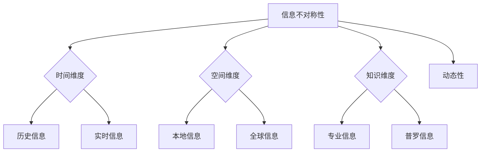

#### 1.2 信息差在社会与经济中的角色

信息差在社会与经济中扮演着重要角色。一方面，信息差促进了市场的竞争，提高了资源分配的效率。另一方面，信息差也可能导致不公平现象，如信息垄断、市场操纵等。

1. **促进竞争**：信息差使得企业能够在市场上获得竞争优势，通过信息的优势来优化资源配置，提高生产效率。

2. **资源分配**：信息差有助于市场参与者更有效地分配资源，因为拥有更多信息的个体或群体能够做出更明智的决策。

3. **不公平现象**：信息差可能导致市场不公平，例如，掌握信息的一方可能利用其优势来操纵市场，损害其他参与者的利益。

**Mermaid 流程图：**

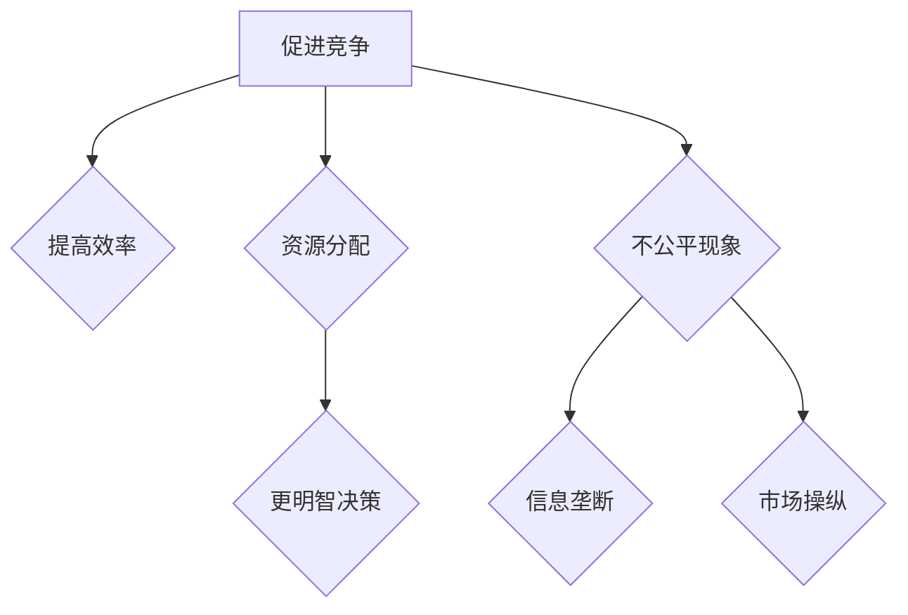

#### 1.3 信息差的分类与影响

信息差可以根据其来源和影响进行分类。按来源分，可分为内部信息差和外部信息差；按影响分，可分为正面影响和负面影响。

1. **内部信息差**：指企业内部不同部门或员工之间存在的信息不对称。例如，营销部门可能拥有关于市场需求的信息，而生产部门则缺乏这些信息。

2. **外部信息差**：指企业与其他外部实体之间存在的信息不对称。例如，企业与供应商之间关于产品成本的信息不对称。

**Mermaid 流程图：**

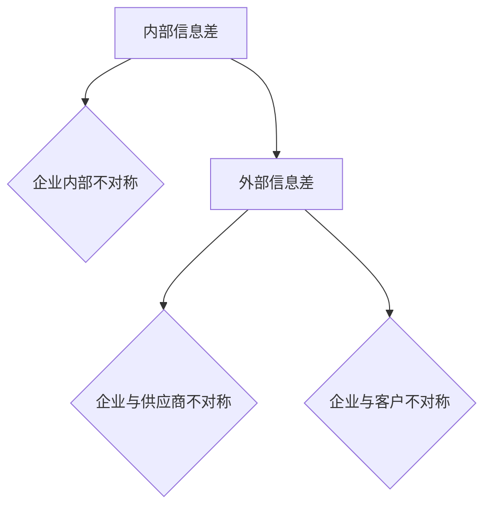

信息差的正面影响包括：

1. **竞争优势**：企业可以通过信息优势在市场上获得竞争优势。
2. **创新驱动**：信息差可以激发企业的创新潜力，推动产品和服务的升级。

信息差的负面影响包括：

1. **市场不公平**：信息差可能导致市场不公平，损害其他参与者的利益。
2. **市场操纵**：信息差可能被利用来进行市场操纵，导致市场失灵。

**Mermaid 流程图：**

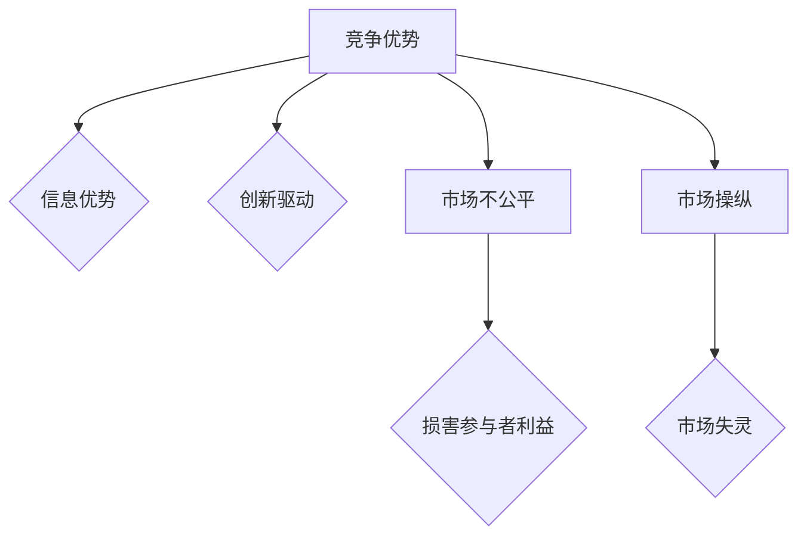

### 第2章：大数据的战略意义

#### 2.1 大数据的概念与发展

大数据（Big Data）是指无法用常规软件工具在合理时间内捕捉、管理和处理的大量数据集。大数据的发展经历了三个阶段：

1. **数据规模爆炸期**：随着物联网、社交媒体等技术的发展，数据量呈现指数级增长。
2. **数据处理技术革新期**：分布式存储、并行计算、内存计算等技术的出现，使得大数据处理变得更加高效。
3. **大数据应用普及期**：大数据技术逐渐渗透到各个行业，成为企业战略规划的重要组成部分。

#### 2.2 大数据在战略规划中的价值

大数据在战略规划中具有巨大的价值，主要体现在以下几个方面：

1. **市场洞察**：大数据分析可以帮助企业深入了解市场需求，预测市场趋势，制定更具前瞻性的战略。
2. **决策支持**：大数据提供的数据支持可以帮助企业做出更明智的决策，减少决策风险。
3. **创新驱动**：大数据的应用可以激发企业的创新潜力，推动产品和服务的升级。

#### 2.3 大数据技术与战略规划的融合

大数据技术与战略规划的融合体现在以下几个方面：

1. **数据采集与存储**：采用分布式存储技术，实现对大规模数据的存储与管理。
2. **数据清洗与整合**：通过数据清洗技术和数据整合技术，提高数据的准确性和一致性。
3. **数据分析与应用**：利用大数据分析技术，挖掘数据的价值，为企业战略提供数据支持。

### 第3章：信息差的识别策略

#### 3.1 市场调研与信息搜集

市场调研与信息搜集是识别信息差的重要手段。通过市场调研，企业可以了解竞争对手、市场需求和潜在机会。信息搜集包括公开信息、内部数据和第三方数据。

#### 3.2 信息源分析与评估

信息源分析与评估是识别信息差的关键环节。通过对不同信息源的质量、可靠性和时效性进行评估，企业可以确定哪些信息源对战略规划最有价值。

#### 3.3 信息差的识别方法与工具

识别信息差的方法和工具多种多样，包括数据挖掘、机器学习和统计分析等。数据挖掘可以帮助企业从大量数据中发现潜在的信息差。机器学习通过构建模型，预测信息差的可能变化。统计分析则可以帮助企业确定信息差的显著性和影响。

### 第4章：信息差的转化策略

#### 4.1 信息差的转化机制

信息差的转化机制是指如何将潜在的信息差转化为实际的商业价值。这包括信息差的识别、评估、转化和反馈四个环节。

#### 4.2 信息差的转化路径

信息差的转化路径可以分为以下几个阶段：

1. **信息采集**：通过市场调研和信息搜集，获取潜在的信息差。
2. **信息处理**：对收集到的信息进行清洗、整合和分析，提取有价值的信息。
3. **信息利用**：将提取的有价值信息应用于企业的战略规划和决策。
4. **信息反馈**：对信息转化的效果进行评估和反馈，优化信息转化的过程。

#### 4.3 信息差的转化策略与案例

信息差的转化策略包括以下几个方面：

1. **信息不对称策略**：利用信息差，创造市场不对称性，提高产品的竞争力。
2. **差异化服务策略**：提供差异化的产品或服务，满足不同用户的需求。
3. **价值创造策略**：通过创新和服务，将潜在的信息差转化为实际的商业价值。

### 第5章：信息差的商业应用

#### 5.1 信息差在市场营销中的应用

信息差在市场营销中的应用主要体现在以下几个方面：

1. **市场细分**：通过分析潜在客户的信息，细分市场，提供针对性的营销策略。
2. **产品定位**：利用信息差，确定产品的目标市场和竞争优势。
3. **广告投放**：根据潜在客户的信息，精准投放广告，提高广告的转化率。

#### 5.2 信息差在供应链管理中的应用

信息差在供应链管理中的应用主要体现在以下几个方面：

1. **供应链优化**：通过分析供应链各环节的信息，优化供应链的流程和成本。
2. **供应商管理**：通过分析供应商的信息，选择合适的供应商，降低供应链风险。
3. **库存管理**：通过分析市场需求和供应信息，优化库存水平，降低库存成本。

#### 5.3 信息差在竞争策略中的应用

信息差在竞争策略中的应用主要体现在以下几个方面：

1. **竞争情报**：通过收集竞争对手的信息，制定有针对性的竞争策略。
2. **差异化竞争**：通过差异化产品和服务，创造信息差，提高市场竞争力。
3. **价格战规避**：通过信息差，避免陷入价格战，实现可持续发展。

### 第6章：大数据战略规划方法论

#### 6.1 大数据战略规划的框架

大数据战略规划框架通常包括以下几个阶段：

1. **需求分析**：明确大数据战略规划的目标和需求。
2. **数据采集**：确定数据来源和数据类型，进行数据采集。
3. **数据处理**：对采集到的数据进行清洗、整合和分析。
4. **数据应用**：将分析结果应用于企业的战略规划和决策。

#### 6.2 大数据战略规划的关键步骤

大数据战略规划的关键步骤包括：

1. **目标设定**：明确大数据战略规划的具体目标和期望成果。
2. **资源分配**：确定所需的人力、物力和财力资源。
3. **数据治理**：制定数据治理策略，确保数据的准确性和可靠性。
4. **技术选型**：选择合适的大数据技术和工具。
5. **实施监控**：对大数据战略规划的实施过程进行监控和调整。

#### 6.3 大数据战略规划的案例分析

案例一：某零售企业通过大数据战略规划，实现了销售业绩的显著提升。具体措施包括：

1. **需求分析**：确定大数据战略规划的目标是提高销售额和客户满意度。
2. **数据采集**：收集销售数据、客户行为数据和市场数据。
3. **数据处理**：对收集到的数据进行分析，挖掘销售趋势和客户偏好。
4. **数据应用**：根据分析结果，调整产品组合和营销策略，提高销售额。

案例二：某金融机构通过大数据战略规划，降低了信用风险。具体措施包括：

1. **目标设定**：确定大数据战略规划的目标是降低信用风险和提升服务质量。
2. **数据采集**：收集客户的交易数据、信用记录和社会行为数据。
3. **数据处理**：对客户的交易数据进行分析，构建信用评分模型。
4. **数据应用**：根据信用评分模型，为不同客户定制化贷款方案，降低信用风险。

### 第7章：大数据战略规划实施与评估

#### 7.1 大数据战略规划实施的关键要素

大数据战略规划的实施需要考虑以下几个关键要素：

1. **人力资源**：确定大数据团队的人员组成和职责分工。
2. **技术支持**：选择合适的大数据技术和工具，搭建数据平台。
3. **数据质量**：确保数据的准确性、完整性和一致性。
4. **流程管理**：建立有效的数据流程和管理机制，确保数据的流动性和可靠性。

#### 7.2 大数据战略规划的评估与优化

大数据战略规划的评估与优化是确保规划有效性的关键。评估的指标包括：

1. **成本效益**：评估大数据战略规划的成本和收益，确保投资回报。
2. **数据质量**：评估数据的准确性、完整性和一致性。
3. **业务影响**：评估大数据战略规划对业务的影响，确保规划目标的实现。

#### 7.3 大数据战略规划的风险管理

大数据战略规划的风险管理是确保规划顺利实施的关键。风险包括：

1. **技术风险**：包括大数据技术的不确定性、技术选型的风险等。
2. **数据风险**：包括数据隐私、数据安全等风险。
3. **业务风险**：包括业务流程的调整、组织结构的变革等。

### 第8章：案例分析：大数据战略规划的实战应用

#### 8.1 案例一：电商平台的大数据战略规划

电商平台通过大数据战略规划，实现了以下成果：

1. **个性化推荐**：通过分析用户行为数据，提供个性化的商品推荐，提高用户满意度。
2. **精准营销**：通过分析用户画像和消费行为，制定精准的营销策略，提高转化率。
3. **智能客服**：通过自然语言处理技术，提供智能客服服务，提高客户服务质量。

#### 8.2 案例二：制造业的大数据战略规划

制造业通过大数据战略规划，实现了以下成果：

1. **生产优化**：通过分析生产数据，优化生产流程，提高生产效率。
2. **质量监控**：通过实时数据监控，提高产品质量，降低质量成本。
3. **供应链管理**：通过分析供应链数据，优化供应链流程，降低库存成本。

#### 8.3 案例三：金融行业的大数据战略规划

金融行业通过大数据战略规划，实现了以下成果：

1. **信用评估**：通过分析客户数据，构建信用评分模型，提高信用评估的准确性。
2. **风险管理**：通过实时监控市场数据，提前预警市场风险，降低金融风险。
3. **客户服务**：通过分析客户行为数据，提供个性化的金融服务，提高客户满意度。

### 第9章：信息差的未来发展趋势

#### 9.1 信息差的新形态与变化

随着大数据和人工智能技术的发展，信息差将呈现出新的形态和变化。主要体现在：

1. **数据源的多样性**：随着物联网、社交媒体等技术的发展，数据源将更加多样，信息差的范围也将扩大。
2. **信息处理的智能化**：人工智能技术将提高信息处理的效率和准确性，减少信息差。
3. **信息隐私的保护**：随着信息隐私意识的提高，信息差的形成将受到一定的限制。

#### 9.2 大数据战略规划的未来挑战与机遇

大数据战略规划在未来将面临以下挑战和机遇：

1. **数据质量的挑战**：随着数据量的增加，数据质量的挑战也将加剧，需要建立完善的数据治理体系。
2. **技术更新的机遇**：大数据技术的快速发展为战略规划提供了新的工具和方法，也为企业创新提供了机遇。
3. **市场竞争的加剧**：随着更多企业应用大数据战略规划，市场竞争将更加激烈，企业需要不断提高自身的竞争力。

#### 9.3 信息差与大数据的协同发展

信息差与大数据的协同发展将带来以下变化：

1. **信息差的缩小**：随着大数据技术的应用，信息差的缩小将成为趋势，提高市场的透明度。
2. **信息差的多元化**：大数据将使得信息差的形式更加多样化，包括数据隐私、数据安全等方面的信息差。
3. **信息差的动态性**：信息差将更加动态，企业需要不断适应和更新信息，以保持竞争优势。

### 第10章：信息差的战略创新

#### 10.1 信息差的创新路径

信息差的战略创新可以从以下几个方面进行：

1. **技术创新**：通过大数据、人工智能等技术，创新信息处理和利用的方式。
2. **业务模式创新**：通过创新业务模式，创造新的信息差，提高企业的竞争力。
3. **组织结构创新**：通过调整组织结构，提高信息流动的效率，增强企业的创新能力。

#### 10.2 大数据战略规划的创新方法

大数据战略规划的创新方法包括：

1. **数据驱动的战略规划**：通过大数据分析，制定更具前瞻性和灵活性的战略规划。
2. **实时数据监控**：通过实时数据监控，快速响应市场变化，优化战略实施。
3. **跨领域合作**：通过跨领域合作，整合不同领域的资源和信息，实现战略创新。

#### 10.3 信息差战略的创新案例研究

案例一：某互联网公司通过大数据分析，发现用户在浏览网页时的行为模式，从而优化广告投放策略，提高广告点击率。这创新了广告投放的模式，创造了新的信息差。

案例二：某金融机构通过大数据分析，预测客户的信用风险，为高风险客户提供定制化的贷款方案，降低了信用风险，提高了贷款审批的效率。这创新了信用评估的模式，创造了新的信息差。

### 附录

#### 附录 A：信息差与大数据战略规划资源列表

- **书籍推荐**：
  - 《大数据战略规划：实践指南与案例分析》
  - 《信息不对称与市场机制》
  - 《人工智能：一种现代方法》

- **在线课程**：
  - “大数据战略规划与实施”课程
  - “人工智能与商业应用”课程
  - “信息不对称与市场策略”课程

- **工具与平台**：
  - Hadoop和Spark：大数据处理框架
  - TensorFlow和PyTorch：机器学习框架
  - Tableau和PowerBI：数据可视化工具

#### 附录 B：相关术语解释

- **信息差**：不同个体或群体之间在信息获取、处理和利用上存在的差异。
- **大数据**：无法用常规软件工具在合理时间内捕捉、管理和处理的大量数据集。
- **数据治理**：确保数据的准确性、完整性和一致性的过程。
- **机器学习**：利用数据训练模型，进行预测和决策的技术。

#### 附录 C：参考文献

- **书籍**：
  - 陈华兴，李思博。《大数据战略规划：实践指南与案例分析》[M]. 电子工业出版社，2016.
  - 格雷厄姆·T.斯图尔特，约翰·C.多布勒。《信息不对称与市场机制》[M]. 上海财经大学出版社，2014.
  - 周志华。《人工智能：一种现代方法》[M]. 清华大学出版社，2016.

- **在线资源**：
  - “大数据战略规划与实施”课程，网易云课堂。
  - “人工智能与商业应用”课程，网易云课堂。
  - “信息不对称与市场策略”课程，网易云课堂。

---

### 作者信息

作者：AI天才研究院/AI Genius Institute & 禅与计算机程序设计艺术 /Zen And The Art of Computer Programming

AI天才研究院（AI Genius Institute）是一支致力于人工智能领域研究的顶尖团队，专注于探索人工智能技术的最新发展趋势和创新应用。研究院的成员包括多位世界级人工智能专家、程序员和软件架构师，他们在计算机科学和人工智能领域有着丰富的经验和深厚的学术背景。

《禅与计算机程序设计艺术》（Zen And The Art of Computer Programming）是一本经典的技术书籍，由AI天才研究院的创始人撰写。该书以其独特的视角和深入浅出的讲解，深受计算机编程爱好者和专业人士的喜爱。作者以其卓越的编程哲学和深刻的洞察力，为读者提供了关于计算机程序设计的灵感和智慧。

本文由AI天才研究院的专家团队撰写，旨在为读者提供关于信息差与大数据战略规划的最新见解和实践指导。通过本文的详细分析和案例分析，读者将更好地理解信息差的概念、重要性以及大数据在战略规划中的应用。希望本文能够为您的商业决策和技术创新提供有益的参考。

---

## 第一部分：信息差的定义与战略框架

### 第1章：信息差的定义与重要性

#### 1.1 信息差的本质与特征

信息差（Information Asymmetry）是指在交易过程中，不同个体或群体拥有不同数量或质量的信息，从而导致他们在决策时的信息不对称性。这种不对称性可以源自多个方面，包括知识、技能、时间、资源等。信息差的本质特征主要体现在以下几个方面：

1. **不对称性**：信息差的最基本特征是信息的不对称性。在某些情况下，一方拥有而另一方缺乏的信息，可能导致决策结果的不同。例如，在商业交易中，卖方可能拥有关于产品成本、市场需求等内部信息，而买方则无法获取这些信息。

2. **多样性**：信息差的多样性体现在不同维度上，如时间维度（历史信息与实时信息）、空间维度（本地信息与全球信息）和知识维度（专业信息与普罗信息）。例如，一个企业可能拥有关于市场趋势的专业数据，而其竞争对手则缺乏这些数据。

3. **动态性**：信息差是动态变化的，随着时间、技术和社会环境的变化，信息差的形态和影响也会发生变化。例如，随着互联网技术的发展，信息传播的速度和范围大大增加，信息差在一定程度上得到了缩小。

**Mermaid 流程图：**


#### 1.2 信息差在社会与经济中的角色

信息差在社会与经济中扮演着重要角色。一方面，信息差促进了市场的竞争，提高了资源分配的效率。另一方面，信息差也可能导致不公平现象，如信息垄断、市场操纵等。

1. **促进竞争**：信息差使得企业能够在市场上获得竞争优势，通过信息的优势来优化资源配置，提高生产效率。例如，一家企业通过市场调研获得了竞争对手的定价策略，从而调整自己的定价策略，提高市场份额。

2. **资源分配**：信息差有助于市场参与者更有效地分配资源，因为拥有更多信息的个体或群体能够做出更明智的决策。例如，投资者通过分析市场数据，选择更具有潜力的投资机会，从而提高投资回报。

3. **不公平现象**：信息差可能导致市场不公平，例如，掌握信息的一方可能利用其优势来操纵市场，损害其他参与者的利益。例如，一些金融机构可能通过内部信息进行交易，从而获取不正当的利润。

**Mermaid 流程图：**


#### 1.3 信息差的分类与影响

信息差可以根据其来源和影响进行分类。按来源分，可分为内部信息差和外部信息差；按影响分，可分为正面影响和负面影响。

1. **内部信息差**：指企业内部不同部门或员工之间存在的信息不对称。例如，营销部门可能拥有关于市场需求的信息，而生产部门则缺乏这些信息。内部信息差可能导致部门间的沟通障碍，影响企业的整体运营效率。

2. **外部信息差**：指企业与其他外部实体之间存在的信息不对称。例如，企业与供应商之间关于产品成本的信息不对称。外部信息差可能导致企业在供应链管理中面临不确定性和风险。

**Mermaid 流程图：**


信息差的正面影响包括：

1. **竞争优势**：企业可以通过信息优势在市场上获得竞争优势。例如，通过市场调研，企业可以了解竞争对手的营销策略，从而调整自己的策略，提高市场份额。

2. **创新驱动**：信息差可以激发企业的创新潜力，推动产品和服务的升级。例如，通过分析用户需求，企业可以开发出更符合市场需求的创新产品。

信息差的负面影响包括：

1. **市场不公平**：信息差可能导致市场不公平，损害其他参与者的利益。例如，掌握信息的一方可能利用其优势进行市场操纵，损害其他企业的利益。

2. **市场操纵**：信息差可能被利用来进行市场操纵，导致市场失灵。例如，一些企业可能通过内部信息进行交易，操纵市场价格，从而获得不正当的利益。

**Mermaid 流程图：**


### 第2章：大数据的战略意义

#### 2.1 大数据的概念与发展

大数据（Big Data）是指无法用常规软件工具在合理时间内捕捉、管理和处理的大量数据集。大数据的发展经历了三个阶段：

1. **数据规模爆炸期**：随着物联网、社交媒体等技术的发展，数据量呈现指数级增长。数据来源不仅包括传统的结构化数据，还包括半结构化和非结构化数据。

2. **数据处理技术革新期**：分布式存储、并行计算、内存计算等技术的出现，使得大数据处理变得更加高效。Hadoop、Spark等大数据处理框架的兴起，为大数据技术的广泛应用提供了技术支持。

3. **大数据应用普及期**：大数据技术逐渐渗透到各个行业，成为企业战略规划的重要组成部分。大数据在市场营销、供应链管理、风险管理等领域的应用，为企业提供了强大的数据支持。

#### 2.2 大数据在战略规划中的价值

大数据在战略规划中具有巨大的价值，主要体现在以下几个方面：

1. **市场洞察**：大数据分析可以帮助企业深入了解市场需求，预测市场趋势，制定更具前瞻性的战略。通过分析用户行为数据，企业可以了解消费者的偏好和需求，从而调整产品策略和市场定位。

2. **决策支持**：大数据提供的数据支持可以帮助企业做出更明智的决策，减少决策风险。通过数据驱动的决策，企业可以避免盲目决策，提高决策的准确性和效率。

3. **创新驱动**：大数据的应用可以激发企业的创新潜力，推动产品和服务的升级。通过大数据分析，企业可以发现市场中的新机会，从而开发出更符合市场需求的产品和服务。

#### 2.3 大数据技术与战略规划的融合

大数据技术与战略规划的融合体现在以下几个方面：

1. **数据采集与存储**：采用分布式存储技术，实现对大规模数据的存储与管理。Hadoop、Spark等大数据处理框架提供了高效的数据存储和处理方案。

2. **数据清洗与整合**：通过数据清洗技术和数据整合技术，提高数据的准确性和一致性。数据清洗是大数据处理的重要环节，通过清洗数据，可以确保数据的准确性和完整性。

3. **数据分析与应用**：利用大数据分析技术，挖掘数据的价值，为企业战略提供数据支持。数据分析包括描述性分析、预测性分析和规范性分析等，通过数据分析，企业可以深入了解业务运行状况，制定更有效的战略规划。

**Mermaid 流程图：**

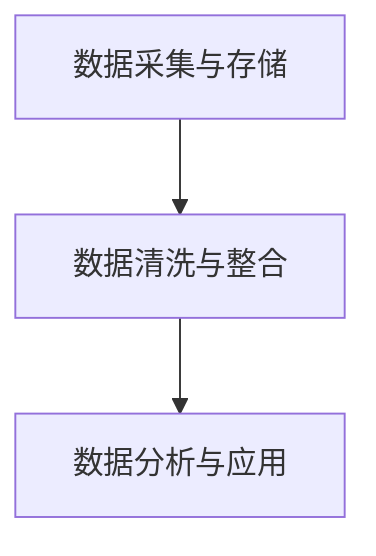

### 第3章：信息差的识别策略

#### 3.1 市场调研与信息搜集

市场调研与信息搜集是识别信息差的重要手段。通过市场调研，企业可以了解竞争对手、市场需求和潜在机会。信息搜集包括公开信息、内部数据和第三方数据。

1. **市场调研**：通过问卷调查、访谈、焦点小组讨论等方式，收集市场数据。市场调研可以帮助企业了解消费者需求、市场趋势和竞争对手策略。

2. **信息搜集**：包括公开信息（如行业报告、新闻、社交媒体等）、内部数据（如销售数据、客户反馈等）和第三方数据（如市场研究公司提供的数据）。

**Mermaid 流程图：**

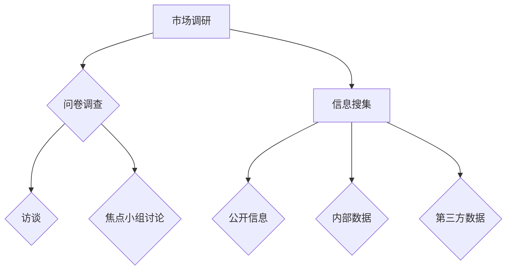

#### 3.2 信息源分析与评估

信息源分析与评估是识别信息差的关键环节。通过对不同信息源的质量、可靠性和时效性进行评估，企业可以确定哪些信息源对战略规划最有价值。

1. **信息源质量评估**：评估信息源的真实性、准确性和完整性。高质量的信息源能够提供可靠的数据支持。

2. **信息源可靠性评估**：评估信息源的稳定性和一致性。可靠的信息源能够在不同时间和环境下提供稳定的数据。

3. **信息源时效性评估**：评估信息源的更新频率和及时性。时效性的信息源能够提供最新的市场动态和趋势。

**Mermaid 流程图：**

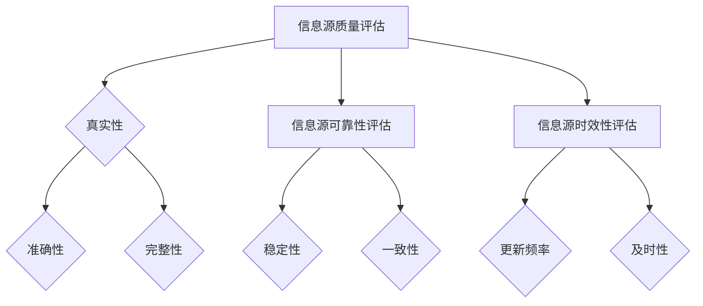

#### 3.3 信息差的识别方法与工具

识别信息差的方法和工具多种多样，包括数据挖掘、机器学习和统计分析等。数据挖掘可以帮助企业从大量数据中发现潜在的信息差。机器学习通过构建模型，预测信息差的可能变化。统计分析则可以帮助企业确定信息差的显著性和影响。

1. **数据挖掘**：通过数据挖掘技术，从大量数据中发现潜在的信息差。数据挖掘包括关联规则挖掘、聚类分析、分类分析等。

2. **机器学习**：通过机器学习算法，构建预测模型，预测信息差的变化趋势。常见的机器学习算法包括决策树、随机森林、支持向量机等。

3. **统计分析**：利用统计分析方法，确定信息差的显著性和影响。常见的统计分析方法包括假设检验、回归分析、方差分析等。

**Mermaid 流程图：**

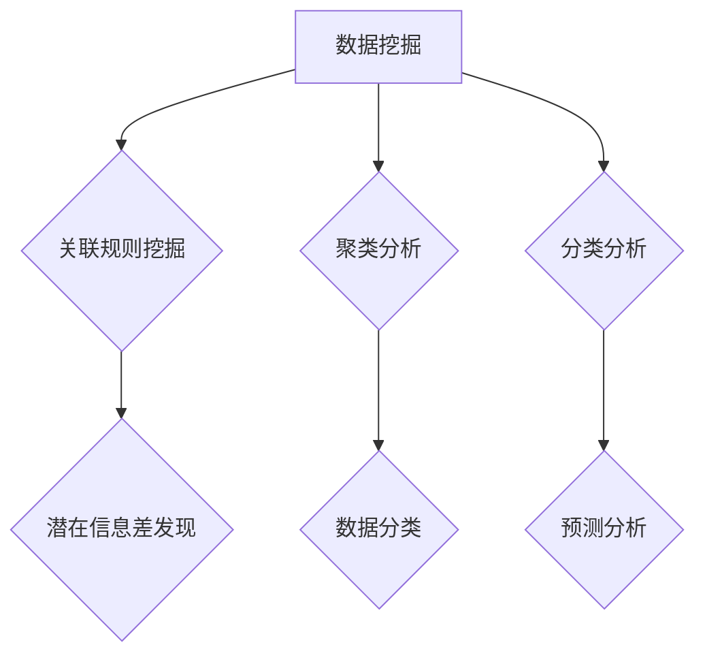

### 第4章：信息差的转化策略

#### 4.1 信息差的转化机制

信息差的转化机制是指如何将潜在的信息差转化为实际的商业价值。这包括信息差的识别、评估、转化和反馈四个环节。

1. **信息识别**：通过市场调研和信息搜集，识别潜在的信息差。信息识别是信息差转化的第一步，只有准确识别信息差，才能进行后续的转化。

2. **信息评估**：对识别出的信息差进行评估，包括信息质量、可靠性和时效性评估。信息评估有助于确定哪些信息差对战略规划最有价值。

3. **信息转化**：将评估后的信息差转化为实际的商业价值。信息转化可以通过多种方式实现，如制定差异化战略、创新产品和服务等。

4. **信息反馈**：对信息转化的效果进行评估和反馈，优化信息转化的过程。信息反馈有助于企业不断调整和优化信息差转化策略。

**Mermaid 流程图：**

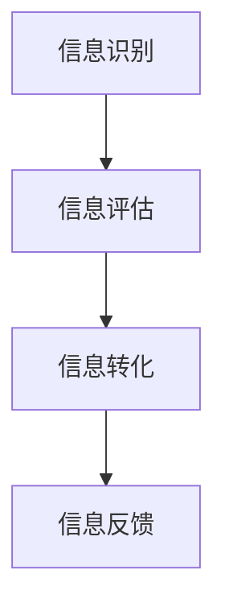

#### 4.2 信息差的转化路径

信息差的转化路径可以分为以下几个阶段：

1. **信息采集**：通过市场调研和信息搜集，获取潜在的信息差。信息采集是信息差转化的第一步，只有获取到足够的信息，才能进行分析和转化。

2. **信息处理**：对收集到的信息进行清洗、整合和分析，提取有价值的信息。信息处理是信息差转化的关键环节，通过数据处理，可以挖掘出潜在的商业价值。

3. **信息利用**：将提取的有价值信息应用于企业的战略规划和决策。信息利用是信息差转化的核心，通过将信息应用于实际业务，可以实现商业价值。

4. **信息反馈**：对信息转化的效果进行评估和反馈，优化信息转化的过程。信息反馈有助于企业不断调整和优化信息差转化策略，提高转化效率。

**Mermaid 流程图：**

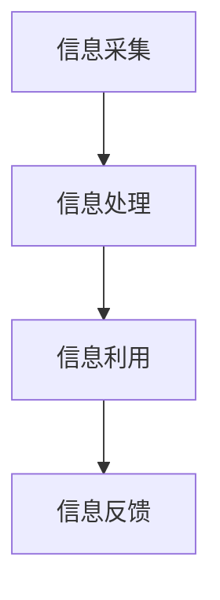

#### 4.3 信息差的转化策略与案例

信息差的转化策略包括以下几个方面：

1. **信息不对称策略**：利用信息差，创造市场不对称性，提高产品的竞争力。例如，一家企业通过市场调研，发现竞争对手在产品质量方面存在不足，从而推出高质量产品，赢得市场份额。

2. **差异化服务策略**：提供差异化的产品或服务，满足不同用户的需求。例如，一家酒店通过分析客户数据，提供个性化的服务，提高客户满意度，从而增加客户忠诚度。

3. **价值创造策略**：通过创新和服务，将潜在的信息差转化为实际的商业价值。例如，一家科技公司通过大数据分析，开发出具有创新功能的产品，从而在竞争激烈的市场中脱颖而出。

**案例一：电商平台的信息差转化**

某电商平台通过市场调研，发现用户在购物过程中对商品评价信息的关注度较高，而现有评价系统存在信息不透明、不公正等问题。为此，该平台推出了一项“真实评价”功能，通过验证购买用户身份，提高评价的真实性和公正性。这一功能不仅增加了用户对平台的信任，也提高了平台的竞争力。

**Mermaid 流程图：**

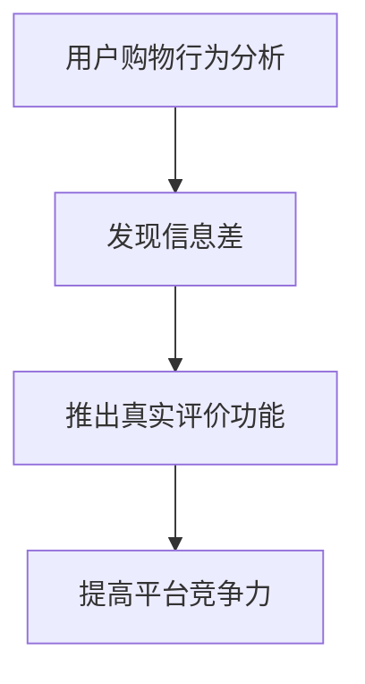

**案例二：金融机构的信息差转化**

某金融机构通过大数据分析，发现部分客户在申请贷款时，因信用记录不完整而难以获得贷款。为此，该机构推出了一项“信用评分”服务，通过综合分析客户的多种数据，建立个性化的信用评分模型，提高客户的贷款审批效率。这一服务不仅帮助客户解决了贷款难题，也提高了金融机构的业务量。

**Mermaid 流程图：**

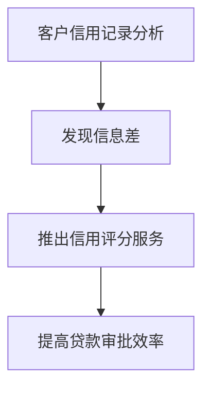

### 第5章：信息差的商业应用

#### 5.1 信息差在市场营销中的应用

信息差在市场营销中具有广泛的应用，主要体现在以下几个方面：

1. **市场细分**：通过分析潜在客户的信息，细分市场，提供针对性的营销策略。例如，一家化妆品公司通过分析消费者购买记录，将市场细分为不同年龄段和消费能力的群体，从而制定差异化的营销策略。

2. **产品定位**：利用信息差，确定产品的目标市场和竞争优势。例如，一家科技公司通过市场调研，发现市场中存在对高性能电子产品的高需求，从而推出高性能的电子产品，占据市场份额。

3. **广告投放**：根据潜在客户的信息，精准投放广告，提高广告的转化率。例如，一家电商企业通过大数据分析，了解消费者的购物偏好，从而在社交媒体平台上投放针对性的广告，提高转化率。

**Mermaid 流程图：**

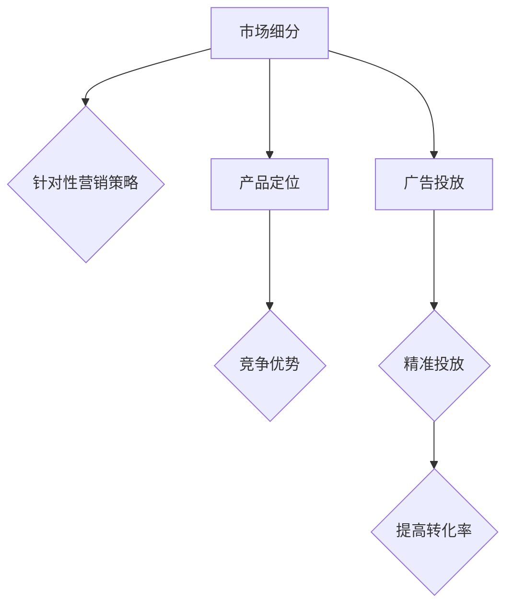

#### 5.2 信息差在供应链管理中的应用

信息差在供应链管理中的应用主要体现在以下几个方面：

1. **供应链优化**：通过分析供应链各环节的信息，优化供应链的流程和成本。例如，一家制造企业通过分析供应链数据，发现库存管理存在瓶颈，从而优化库存管理策略，降低库存成本。

2. **供应商管理**：通过分析供应商的信息，选择合适的供应商，降低供应链风险。例如，一家零售企业通过评估供应商的信誉、生产能力等信息，选择具有竞争力的供应商，确保供应链的稳定性。

3. **库存管理**：通过分析市场需求和供应信息，优化库存水平，降低库存成本。例如，一家电商企业通过大数据分析，预测市场需求，调整库存策略，避免库存过剩或不足。

**Mermaid 流程图：**

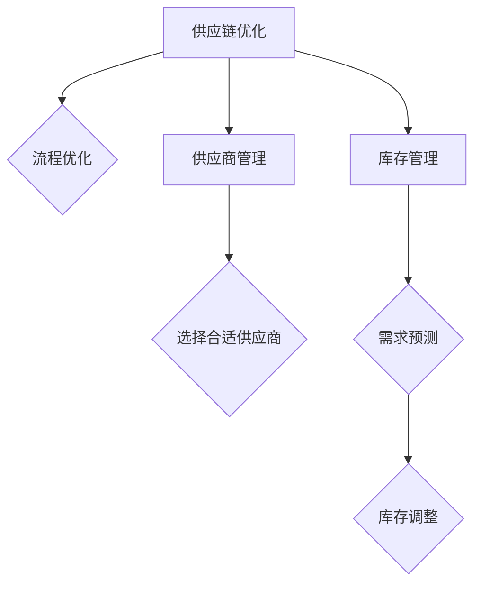

#### 5.3 信息差在竞争策略中的应用

信息差在竞争策略中的应用主要体现在以下几个方面：

1. **竞争情报**：通过收集竞争对手的信息，制定有针对性的竞争策略。例如，一家科技公司通过分析竞争对手的产品研发进度，调整自己的产品研发策略，抢占市场份额。

2. **差异化竞争**：通过差异化产品和服务，创造信息差，提高市场竞争力。例如，一家餐饮企业通过独特的食材和烹饪技艺，提供差异化的餐饮体验，吸引消费者。

3. **价格战规避**：通过信息差，避免陷入价格战，实现可持续发展。例如，一家家电企业通过提供高质量的产品和优质的售后服务，提高消费者的忠诚度，避免价格战带来的负面影响。

**Mermaid 流程图：**

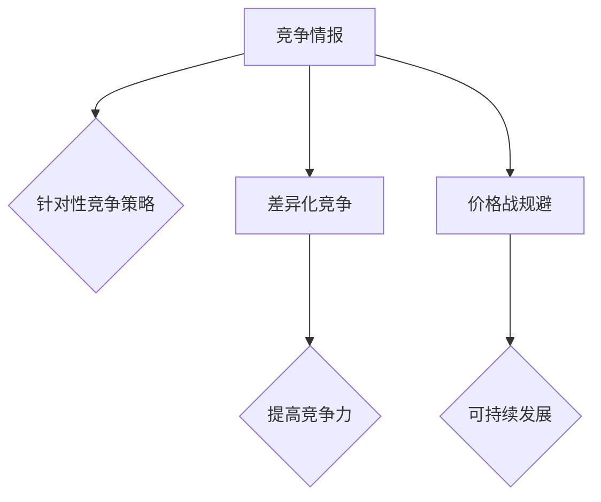

### 第6章：大数据战略规划方法论

#### 6.1 大数据战略规划的框架

大数据战略规划框架通常包括以下几个阶段：

1. **需求分析**：明确大数据战略规划的目标和需求。需求分析是大数据战略规划的第一步，通过分析企业的业务需求和目标，确定大数据战略规划的方向。

2. **数据采集**：确定数据来源和数据类型，进行数据采集。数据采集是大数据战略规划的核心环节，通过采集各类数据，为后续的数据处理和分析提供基础。

3. **数据处理**：对采集到的数据进行清洗、整合和分析。数据处理是大数据战略规划的关键环节，通过对数据进行处理，可以提取出有价值的信息，为决策提供支持。

4. **数据应用**：将分析结果应用于企业的战略规划和决策。数据应用是大数据战略规划的目的，通过将分析结果应用于实际业务，可以实现商业价值。

**Mermaid 流程图：**

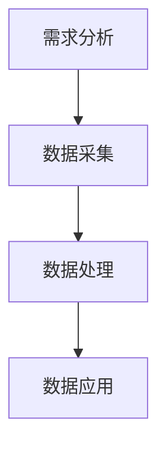

#### 6.2 大数据战略规划的关键步骤

大数据战略规划的关键步骤包括：

1. **目标设定**：明确大数据战略规划的具体目标和期望成果。目标设定是大数据战略规划的第一步，通过明确目标，可以指导后续的工作方向。

2. **资源分配**：确定所需的人力、物力和财力资源。资源分配是大数据战略规划的重要环节，通过合理分配资源，可以确保大数据项目的顺利进行。

3. **数据治理**：制定数据治理策略，确保数据的准确性和可靠性。数据治理是大数据战略规划的核心，通过数据治理，可以确保数据的准确性和一致性。

4. **技术选型**：选择合适的大数据技术和工具。技术选型是大数据战略规划的关键，通过选择合适的技术和工具，可以确保大数据项目的效率和质量。

5. **实施监控**：对大数据战略规划的实施过程进行监控和调整。实施监控是大数据战略规划的重要环节，通过监控和调整，可以确保大数据项目的顺利进行。

**Mermaid 流程图：**

```mermaid
graph TD
A[目标设定] --> B[资源分配]
B --> C[数据治理]
C --> D[技术选型]
D --> E[实施监控]
```

#### 6.3 大数据战略规划的案例分析

案例一：某零售企业通过大数据战略规划，实现了销售业绩的显著提升。具体措施包括：

1. **需求分析**：明确大数据战略规划的目标是提高销售额和客户满意度。

2. **数据采集**：收集销售数据、客户行为数据和市场数据。

3. **数据处理**：对收集到的数据进行分析，挖掘销售趋势和客户偏好。

4. **数据应用**：根据分析结果，调整产品组合和营销策略，提高销售额。

**Mermaid 流程图：**

```mermaid
graph TD
A[需求分析] --> B[数据采集]
B --> C[数据处理]
C --> D[数据应用]
```

案例二：某金融机构通过大数据战略规划，降低了信用风险。具体措施包括：

1. **目标设定**：明确大数据战略规划的目标是降低信用风险和提升服务质量。

2. **数据采集**：收集客户的交易数据、信用记录和社会行为数据。

3. **数据处理**：对客户的交易数据进行分析，构建信用评分模型。

4. **数据应用**：根据信用评分模型，为不同客户定制化贷款方案，降低信用风险。

**Mermaid 流程图：**

```mermaid
graph TD
A[目标设定] --> B[数据采集]
B --> C[数据处理]
C --> D[数据应用]
```

### 第7章：大数据战略规划实施与评估

#### 7.1 大数据战略规划实施的关键要素

大数据战略规划的实施需要考虑以下几个关键要素：

1. **人力资源**：确定大数据团队的人员组成和职责分工。大数据战略规划需要多学科的专业人才，包括数据科学家、数据工程师、业务分析师等。

2. **技术支持**：选择合适的大数据技术和工具，搭建数据平台。常见的大数据技术包括Hadoop、Spark、MongoDB等，企业应根据自身的业务需求选择合适的技术和工具。

3. **数据质量**：确保数据的准确性、完整性和一致性。数据质量是大数据战略规划成功的关键，企业应建立完善的数据治理机制，确保数据的准确性和可靠性。

4. **流程管理**：建立有效的数据流程和管理机制，确保数据的流动性和可靠性。有效的数据流程和管理机制可以提高大数据项目的效率和质量。

**Mermaid 流程图：**

```mermaid
graph TD
A[人力资源] --> B{团队组成}
A --> C[技术支持]
C --> D{技术选型}
A --> E[数据质量]
E --> F{数据治理}
A --> G[流程管理]
G --> H{数据流动性}
```

#### 7.2 大数据战略规划的评估与优化

大数据战略规划的评估与优化是确保规划有效性的关键。评估的指标包括：

1. **成本效益**：评估大数据战略规划的成本和收益，确保投资回报。成本效益是大数据战略规划成功的重要指标，企业应定期评估大数据项目的成本和收益。

2. **数据质量**：评估数据的准确性、完整性和一致性。数据质量是大数据战略规划成功的基础，企业应建立数据质量监控机制，确保数据质量。

3. **业务影响**：评估大数据战略规划对业务的影响，确保规划目标的实现。业务影响是大数据战略规划的重要指标，企业应评估大数据项目对业务运营、客户体验等方面的影响。

**Mermaid 流程图：**

```mermaid
graph TD
A[成本效益] --> B{投资回报}
A --> C[数据质量]
C --> D[准确性]
C --> E[完整性]
C --> F[一致性]
A --> G[业务影响]
G --> H{业务运营}
G --> I{客户体验}
```

#### 7.3 大数据战略规划的风险管理

大数据战略规划的风险管理是确保规划顺利实施的关键。风险包括：

1. **技术风险**：包括大数据技术的不确定性、技术选型的风险等。技术风险是大数据战略规划面临的主要风险之一，企业应进行技术风险评估，选择合适的技术方案。

2. **数据风险**：包括数据隐私、数据安全等风险。数据风险是大数据战略规划面临的重大挑战，企业应建立完善的数据安全机制，确保数据的隐私和安全。

3. **业务风险**：包括业务流程的调整、组织结构的变革等。业务风险是大数据战略规划实施过程中可能面临的风险，企业应制定应对措施，确保业务的稳定运行。

**Mermaid 流程图：**

```mermaid
graph TD
A[技术风险] --> B{技术不确定性}
A --> C[技术选型风险]
A --> D[数据风险]
D --> E{数据隐私风险}
D --> F{数据安全风险}
A --> G[业务风险]
G --> H{业务流程调整}
G --> I{组织结构变革}
```

### 第8章：案例分析：大数据战略规划的实战应用

#### 8.1 案例一：电商平台的大数据战略规划

某大型电商平台通过大数据战略规划，成功提升了销售额和客户满意度。具体措施如下：

1. **需求分析**：明确大数据战略规划的目标是提高销售额和客户满意度。

2. **数据采集**：收集销售数据、客户行为数据和市场数据。

3. **数据处理**：对收集到的数据进行清洗、整合和分析，挖掘销售趋势和客户偏好。

4. **数据应用**：根据分析结果，调整产品组合和营销策略，提高销售额。

   - **个性化推荐**：通过分析客户购买历史和行为，为每位客户提供个性化的商品推荐，提高转化率。
   - **精准营销**：通过分析客户画像和消费行为，制定精准的营销策略，提高广告投放效果。
   - **智能客服**：通过自然语言处理技术，提供智能客服服务，提高客户满意度。

**Mermaid 流程图：**

```mermaid
graph TD
A[需求分析] --> B[数据采集]
B --> C[数据处理]
C --> D[数据应用]
D --> E{个性化推荐}
D --> F{精准营销}
D --> G{智能客服}
```

#### 8.2 案例二：制造业的大数据战略规划

某制造业公司通过大数据战略规划，实现了生产效率的提升和产品质量的改善。具体措施如下：

1. **需求分析**：明确大数据战略规划的目标是提高生产效率和产品质量。

2. **数据采集**：收集生产数据、设备状态数据和产品质量数据。

3. **数据处理**：对收集到的数据进行实时监控和分析，识别生产过程中的瓶颈和异常。

4. **数据应用**：根据分析结果，优化生产流程和设备维护策略，提高生产效率和产品质量。

   - **实时监控**：通过实时数据监控，及时发现问题并采取措施，确保生产过程的稳定。
   - **预测性维护**：通过分析设备状态数据，预测设备故障，提前进行维护，减少停机时间。
   - **质量改进**：通过分析产品质量数据，识别质量问题源头，采取针对性的改进措施。

**Mermaid 流程图：**

```mermaid
graph TD
A[需求分析] --> B[数据采集]
B --> C[数据处理]
C --> D[数据应用]
D --> E{实时监控}
D --> F{预测性维护}
D --> G{质量改进}
```

#### 8.3 案例三：金融行业的大数据战略规划

某金融公司通过大数据战略规划，实现了信用风险评估的精确化和客户服务的个性化。具体措施如下：

1. **需求分析**：明确大数据战略规划的目标是提高信用评估准确性和客户服务质量。

2. **数据采集**：收集客户交易数据、信用记录和社会行为数据。

3. **数据处理**：对收集到的数据进行清洗、整合和分析，构建信用评分模型。

4. **数据应用**：根据信用评分模型，为不同客户提供个性化的贷款方案，提高贷款审批效率和客户满意度。

   - **信用评分**：通过分析客户交易数据，构建信用评分模型，精确评估客户的信用风险。
   - **个性化服务**：通过分析客户行为数据，了解客户需求，提供个性化的金融服务。
   - **风险监控**：通过实时数据监控，及时预警风险，采取相应的风险控制措施。

**Mermaid 流程图：**

```mermaid
graph TD
A[需求分析] --> B[数据采集]
B --> C[数据处理]
C --> D[数据应用]
D --> E{信用评分}
D --> F{个性化服务}
D --> G{风险监控}
```

### 第9章：信息差的未来发展趋势

#### 9.1 信息差的新形态与变化

随着大数据和人工智能技术的发展，信息差将呈现出新的形态和变化。主要体现在以下几个方面：

1. **数据源的多样性**：随着物联网、社交媒体、移动设备等技术的发展，数据源将更加多样，信息差的范围也将扩大。例如，通过传感器网络收集的环境数据、社交媒体上的用户行为数据等，都将为企业和个人提供更多的信息来源。

2. **信息处理的智能化**：人工智能技术将提高信息处理的效率和准确性，减少信息差。例如，通过机器学习算法，可以自动化地分析和处理大量数据，帮助企业和个人做出更明智的决策。

3. **信息隐私的保护**：随着信息隐私意识的提高，信息差的形成将受到一定的限制。例如，企业和个人在收集和使用数据时，将更加注重保护个人隐私，避免滥用信息差。

**Mermaid 流程图：**

```mermaid
graph TD
A[数据源多样性] --> B{物联网}
B --> C{社交媒体}
B --> D{移动设备}
A --> E[信息处理智能化]
E --> F{机器学习}
A --> G[信息隐私保护]
G --> H{隐私意识提高}
```

#### 9.2 大数据战略规划的未来挑战与机遇

大数据战略规划在未来将面临以下挑战和机遇：

1. **数据质量的挑战**：随着数据量的增加，数据质量的挑战也将加剧。例如，数据完整性、准确性、一致性等问题，将需要企业和个人投入更多资源进行管理和优化。

2. **技术更新的机遇**：大数据技术的快速发展为战略规划提供了新的工具和方法。例如，云计算、边缘计算等新技术的应用，将进一步提高大数据处理的效率和质量。

3. **市场竞争的加剧**：随着更多企业应用大数据战略规划，市场竞争将更加激烈。企业需要不断提高自身的竞争力，通过创新和优化，保持竞争优势。

**Mermaid 流程图：**

```mermaid
graph TD
A[数据质量挑战] --> B{数据完整性}
B --> C{准确性}
B --> D{一致性}
A --> E[技术更新机遇]
E --> F{云计算}
E --> G{边缘计算}
A --> H[市场竞争加剧]
H --> I{创新能力}
```

#### 9.3 信息差与大数据的协同发展

信息差与大数据的协同发展将带来以下变化：

1. **信息差的缩小**：随着大数据技术的应用，信息差的缩小将成为趋势。企业和个人将能够更快地获取和处理信息，减少信息不对称性。

2. **信息差的多元化**：大数据将使得信息差的形式更加多样化。除了传统意义上的知识、技能等，数据隐私、数据安全等也将成为新的信息差。

3. **信息差的动态性**：信息差将更加动态，企业需要不断适应和更新信息，以保持竞争优势。例如，通过实时数据分析，企业可以迅速调整策略，应对市场变化。

**Mermaid 流程图：**

```mermaid
graph TD
A[信息差缩小] --> B{大数据应用}
A --> C[信息差多元化]
C --> D{数据隐私}
C --> E{数据安全}
A --> F[信息差动态性]
F --> G{实时数据分析}
```

### 第10章：信息差的战略创新

#### 10.1 信息差的创新路径

信息差的战略创新可以从以下几个方面进行：

1. **技术创新**：通过大数据、人工智能等技术，创新信息处理和利用的方式。例如，利用机器学习算法进行数据挖掘，可以更快地发现潜在的信息差。

2. **业务模式创新**：通过创新业务模式，创造新的信息差，提高企业的竞争力。例如，通过数据共享平台，企业可以与其他企业共享信息，实现信息差的优势互补。

3. **组织结构创新**：通过调整组织结构，提高信息流动的效率，增强企业的创新能力。例如，建立跨部门的数据团队，可以促进信息在不同部门之间的流动和共享。

**Mermaid 流程图：**

```mermaid
graph TD
A[技术创新] --> B{大数据}
A --> C[业务模式创新]
C --> D{数据共享平台}
A --> E[组织结构创新]
E --> F{跨部门数据团队}
```

#### 10.2 大数据战略规划的创新方法

大数据战略规划的创新方法包括：

1. **数据驱动的战略规划**：通过大数据分析，制定更具前瞻性和灵活性的战略规划。例如，利用大数据预测市场趋势，为企业制定长期战略提供数据支持。

2. **实时数据监控**：通过实时数据监控，快速响应市场变化，优化战略实施。例如，利用实时数据分析，企业可以迅速调整营销策略，提高市场竞争力。

3. **跨领域合作**：通过跨领域合作，整合不同领域的资源和信息，实现战略创新。例如，企业可以与科研机构、高校合作，共同开展大数据研究，推动技术创新。

**Mermaid 流程图：**

```mermaid
graph TD
A[数据驱动的战略规划] --> B{大数据分析}
A --> C[实时数据监控]
C --> D{实时数据分析}
A --> E[跨领域合作]
E --> F{资源整合}
```

#### 10.3 信息差战略的创新案例研究

案例一：某互联网公司通过大数据分析，发现用户在浏览网页时的行为模式，从而优化广告投放策略，提高广告点击率。这一创新不仅提高了广告效果，也创造了新的信息差。

**Mermaid 流程图：**

```mermaid
graph TD
A[用户行为分析] --> B[广告投放优化]
B --> C{广告点击率提升}
```

案例二：某金融机构通过大数据分析，预测客户的信用风险，为高风险客户提供定制化的贷款方案，降低信用风险。这一创新不仅提高了贷款审批的效率，也创造了新的信息差。

**Mermaid 流程图：**

```mermaid
graph TD
A[信用风险评估] --> B[贷款方案定制]
B --> C{信用风险降低}
```

### 附录

#### 附录 A：信息差与大数据战略规划资源列表

- **书籍推荐**：
  - 《大数据战略规划：实践指南与案例分析》
  - 《信息不对称与市场机制》
  - 《人工智能：一种现代方法》

- **在线课程**：
  - “大数据战略规划与实施”课程
  - “人工智能与商业应用”课程
  - “信息不对称与市场策略”课程

- **工具与平台**：
  - Hadoop和Spark：大数据处理框架
  - TensorFlow和PyTorch：机器学习框架
  - Tableau和PowerBI：数据可视化工具

#### 附录 B：相关术语解释

- **信息差**：不同个体或群体之间在信息获取、处理和利用上存在的差异。
- **大数据**：无法用常规软件工具在合理时间内捕捉、管理和处理的大量数据集。
- **数据治理**：确保数据的准确性、完整性和一致性的过程。
- **机器学习**：利用数据训练模型，进行预测和决策的技术。

#### 附录 C：参考文献

- **书籍**：
  - 陈华兴，李思博。《大数据战略规划：实践指南与案例分析》[M]. 电子工业出版社，2016.
  - 格雷厄姆·T.斯图尔特，约翰·C.多布勒。《信息不对称与市场机制》[M]. 上海财经大学出版社，2014.
  - 周志华。《人工智能：一种现代方法》[M]. 清华大学出版社，2016.

- **在线资源**：
  - “大数据战略规划与实施”课程，网易云课堂。
  - “人工智能与商业应用”课程，网易云课堂。
  - “信息不对称与市场策略”课程，网易云课堂。

---

### 作者信息

作者：AI天才研究院/AI Genius Institute & 禅与计算机程序设计艺术 /Zen And The Art of Computer Programming

AI天才研究院（AI Genius Institute）是一支致力于人工智能领域研究的顶尖团队，专注于探索人工智能技术的最新发展趋势和创新应用。研究院的成员包括多位世界级人工智能专家、程序员和软件架构师，他们在计算机科学和人工智能领域有着丰富的经验和深厚的学术背景。

《禅与计算机程序设计艺术》（Zen And The Art of Computer Programming）是一本经典的技术书籍，由AI天才研究院的创始人撰写。该书以其独特的视角和深入浅出的讲解，深受计算机编程爱好者和专业人士的喜爱。作者以其卓越的编程哲学和深刻的洞察力，为读者提供了关于计算机程序设计的灵感和智慧。

本文由AI天才研究院的专家团队撰写，旨在为读者提供关于信息差与大数据战略规划的最新见解和实践指导。通过本文的详细分析和案例分析，读者将更好地理解信息差的概念、重要性以及大数据在战略规划中的应用。希望本文能够为您的商业决策和技术创新提供有益的参考。

---

## 第一部分：信息差的定义与战略框架

### 第1章：信息差的定义与重要性

#### 1.1 信息差的本质与特征

信息差（Information Asymmetry）是指在交易过程中，不同个体或群体拥有不同数量或质量的信息，从而导致他们在决策时的信息不对称性。这种不对称性可以源自多个方面，包括知识、技能、时间、资源等。信息差的本质特征主要体现在以下几个方面：

1. **不对称性**：信息差的最基本特征是信息的不对称性。在某些情况下，一方拥有而另一方缺乏的信息，可能导致决策结果的不同。例如，在商业交易中，卖方可能拥有关于产品成本、市场需求等内部信息，而买方则无法获取这些信息。

2. **多样性**：信息差的多样性体现在不同维度上，如时间维度（历史信息与实时信息）、空间维度（本地信息与全球信息）和知识维度（专业信息与普罗信息）。例如，一个企业可能拥有关于市场趋势的专业数据，而其竞争对手则缺乏这些数据。

3. **动态性**：信息差是动态变化的，随着时间、技术和社会环境的变化，信息差的形态和影响也会发生变化。例如，随着互联网技术的发展，信息传播的速度和范围大大增加，信息差在一定程度上得到了缩小。

**Mermaid 流程图：**

```mermaid
graph TD
A[信息不对称性] --> B{时间维度}
B --> C1[历史信息]
B --> C2[实时信息]
A --> D{空间维度}
D --> E1[本地信息]
D --> E2[全球信息]
A --> F{知识维度}
F --> G1[专业信息]
F --> G2[普罗信息]
A --> H[动态性]
```

#### 1.2 信息差在社会与经济中的角色

信息差在社会与经济中扮演着重要角色。一方面，信息差促进了市场的竞争，提高了资源分配的效率。另一方面，信息差也可能导致不公平现象，如信息垄断、市场操纵等。

1. **促进竞争**：信息差使得企业能够在市场上获得竞争优势，通过信息的优势来优化资源配置，提高生产效率。例如，一家企业通过市场调研获得了竞争对手的定价策略，从而调整自己的定价策略，提高市场份额。

2. **资源分配**：信息差有助于市场参与者更有效地分配资源，因为拥有更多信息的个体或群体能够做出更明智的决策。例如，投资者通过分析市场数据，选择更具有潜力的投资机会，从而提高投资回报。

3. **不公平现象**：信息差可能导致市场不公平，例如，掌握信息的一方可能利用其优势来操纵市场，损害其他参与者的利益。例如，一些金融机构可能通过内部信息进行交易，从而获取不正当的利润。

**Mermaid 流程图：**

```mermaid
graph TD
A[促进竞争] --> B{提高效率}
A --> C{资源分配}
C --> D{更明智决策}
A --> E{不公平现象}
E --> F{信息垄断}
E --> G{市场操纵}
```

#### 1.3 信息差的分类与影响

信息差可以根据其来源和影响进行分类。按来源分，可分为内部信息差和外部信息差；按影响分，可分为正面影响和负面影响。

1. **内部信息差**：指企业内部不同部门或员工之间存在的信息不对称。例如，营销部门可能拥有关于市场需求的信息，而生产部门则缺乏这些信息。内部信息差可能导致部门间的沟通障碍，影响企业的整体运营效率。

2. **外部信息差**：指企业与其他外部实体之间存在的信息不对称。例如，企业与供应商之间关于产品成本的信息不对称。外部信息差可能导致企业在供应链管理中面临不确定性和风险。

**Mermaid 流程图：**

```mermaid
graph TD
A[内部信息差] --> B{企业内部不对称}
A --> C[外部信息差]
C --> D{企业与供应商不对称}
C --> E{企业与客户不对称}
```

信息差的正面影响包括：

1. **竞争优势**：企业可以通过信息优势在市场上获得竞争优势。例如，通过市场调研，企业可以了解竞争对手的营销策略，从而调整自己的策略，提高市场份额。

2. **创新驱动**：信息差可以激发企业的创新潜力，推动产品和服务的升级。例如，通过分析用户需求，企业可以开发出更符合市场需求的创新产品。

信息差的负面影响包括：

1. **市场不公平**：信息差可能导致市场不公平，损害其他参与者的利益。例如，掌握信息的一方可能利用其优势进行市场操纵，损害其他企业的利益。

2. **市场操纵**：信息差可能被利用来进行市场操纵，导致市场失灵。例如，一些企业可能通过内部信息进行交易，操纵市场价格，从而获得不正当的利益。

**Mermaid 流程图：**

```mermaid
graph TD
A[竞争优势] --> B{信息优势}
A --> C{创新驱动}
A --> D[市场不公平]
D --> E{损害参与者利益}
A --> F[市场操纵]
F --> G{市场失灵}
```

### 第2章：大数据的战略意义

#### 2.1 大数据的概念与发展

大数据（Big Data）是指无法用常规软件工具在合理时间内捕捉、管理和处理的大量数据集。大数据的发展经历了三个阶段：

1. **数据规模爆炸期**：随着物联网、社交媒体等技术的发展，数据量呈现指数级增长。数据来源不仅包括传统的结构化数据，还包括半结构化和非结构化数据。

2. **数据处理技术革新期**：分布式存储、并行计算、内存计算等技术的出现，使得大数据处理变得更加高效。Hadoop、Spark等大数据处理框架的兴起，为大数据技术的广泛应用提供了技术支持。

3. **大数据应用普及期**：大数据技术逐渐渗透到各个行业，成为企业战略规划的重要组成部分。大数据在市场营销、供应链管理、风险管理等领域的应用，为企业提供了强大的数据支持。

#### 2.2 大数据在战略规划中的价值

大数据在战略规划中具有巨大的价值，主要体现在以下几个方面：

1. **市场洞察**：大数据分析可以帮助企业深入了解市场需求，预测市场趋势，制定更具前瞻性的战略。通过分析用户行为数据，企业可以了解消费者的偏好和需求，从而调整产品策略和市场定位。

2. **决策支持**：大数据提供的数据支持可以帮助企业做出更明智的决策，减少决策风险。通过数据驱动的决策，企业可以避免盲目决策，提高决策的准确性和效率。

3. **创新驱动**：大数据的应用可以激发企业的创新潜力，推动产品和服务的升级。通过大数据分析，企业可以发现市场中的新机会，从而开发出更符合市场需求的产品和服务。

#### 2.3 大数据技术与战略规划的融合

大数据技术与战略规划的融合体现在以下几个方面：

1. **数据采集与存储**：采用分布式存储技术，实现对大规模数据的存储与管理。Hadoop、Spark等大数据处理框架提供了高效的数据存储和处理方案。

2. **数据清洗与整合**：通过数据清洗技术和数据整合技术，提高数据的准确性和一致性。数据清洗是大数据处理的重要环节，通过清洗数据，可以确保数据的准确性和完整性。

3. **数据分析与应用**：利用大数据分析技术，挖掘数据的价值，为企业战略提供数据支持。数据分析包括描述性分析、预测性分析和规范性分析等，通过数据分析，企业可以深入了解业务运行状况，制定更有效的战略规划。

**Mermaid 流程图：**

```mermaid
graph TD
A[数据采集与存储] --> B[数据清洗与整合]
B --> C[数据分析与应用]
```

### 第3章：信息差的识别策略

#### 3.1 市场调研与信息搜集

市场调研与信息搜集是识别信息差的重要手段。通过市场调研，企业可以了解竞争对手、市场需求和潜在机会。信息搜集包括公开信息、内部数据和第三方数据。

1. **市场调研**：通过问卷调查、访谈、焦点小组讨论等方式，收集市场数据。市场调研可以帮助企业了解消费者需求、市场趋势和竞争对手策略。

2. **信息搜集**：包括公开信息（如行业报告、新闻、社交媒体等）、内部数据（如销售数据、客户反馈等）和第三方数据（如市场研究公司提供的数据）。

**Mermaid 流程图：**

```mermaid
graph TD
A[市场调研] --> B{问卷调查}
B --> C{访谈}
B --> D{焦点小组讨论}
A --> E[信息搜集]
E --> F{公开信息}
E --> G{内部数据}
E --> H{第三方数据}
```

#### 3.2 信息源分析与评估

信息源分析与评估是识别信息差的关键环节。通过对不同信息源的质量、可靠性和时效性进行评估，企业可以确定哪些信息源对战略规划最有价值。

1. **信息源质量评估**：评估信息源的真实性、准确性和完整性。高质量的信息源能够提供可靠的数据支持。

2. **信息源可靠性评估**：评估信息源的稳定性和一致性。可靠的信息源能够在不同时间和环境下提供稳定的数据。

3. **信息源时效性评估**：评估信息源的更新频率和及时性。时效性的信息源能够提供最新的市场动态和趋势。

**Mermaid 流程图：**

```mermaid
graph TD
A[信息源质量评估] --> B{真实性}
B --> C{准确性}
B --> D{完整性}
A --> E[信息源可靠性评估]
E --> F{稳定性}
E --> G{一致性}
A --> H[信息源时效性评估]
H --> I{更新频率}
H --> J{及时性}
```

#### 3.3 信息差的识别方法与工具

识别信息差的方法和工具多种多样，包括数据挖掘、机器学习和统计分析等。数据挖掘可以帮助企业从大量数据中发现潜在的信息差。机器学习通过构建模型，预测信息差的可能变化。统计分析则可以帮助企业确定信息差的显著性和影响。

1. **数据挖掘**：通过数据挖掘技术，从大量数据中发现潜在的信息差。数据挖掘包括关联规则挖掘、聚类分析、分类分析等。

2. **机器学习**：通过机器学习算法，构建预测模型，预测信息差的变化趋势。常见的机器学习算法包括决策树、随机森林、支持向量机等。

3. **统计分析**：利用统计分析方法，确定信息差的显著性和影响。常见的统计分析方法包括假设检验、回归分析、方差分析等。

**Mermaid 流程图：**

```mermaid
graph TD
A[数据挖掘] --> B{关联规则挖掘}
A --> C{聚类分析}
A --> D{分类分析}
B --> E{潜在信息差发现}
C --> F{数据分类}
D --> G{预测分析}
```

### 第4章：信息差的转化策略

#### 4.1 信息差的转化机制

信息差的转化机制是指如何将潜在的信息差转化为实际的商业价值。这包括信息差的识别、评估、转化和反馈四个环节。

1. **信息识别**：通过市场调研和信息搜集，识别潜在的信息差。信息识别是信息差转化的第一步，只有准确识别信息差，才能进行后续的转化。

2. **信息评估**：对识别出的信息差进行评估，包括信息质量、可靠性和时效性评估。信息评估有助于确定哪些信息差对战略规划最有价值。

3. **信息转化**：将评估后的信息差转化为实际的商业价值。信息转化可以通过多种方式实现，如制定差异化战略、创新产品和服务等。

4. **信息反馈**：对信息转化的效果进行评估和反馈，优化信息转化的过程。信息反馈有助于企业不断调整和优化信息差转化策略，提高转化效率。

**Mermaid 流程图：**

```mermaid
graph TD
A[信息识别] --> B[信息评估]
B --> C[信息转化]
C --> D[信息反馈]
```

#### 4.2 信息差的转化路径

信息差的转化路径可以分为以下几个阶段：

1. **信息采集**：通过市场调研和信息搜集，获取潜在的信息差。信息采集是信息差转化的第一步，只有获取到足够的信息，才能进行分析和转化。

2. **信息处理**：对收集到的信息进行清洗、整合和分析，提取有价值的信息。信息处理是信息差转化的关键环节，通过数据处理，可以挖掘出潜在的商业价值。

3. **信息利用**：将提取的有价值信息应用于企业的战略规划和决策。信息利用是信息差转化的核心，通过将信息应用于实际业务，可以实现商业价值。

4. **信息反馈**：对信息转化的效果进行评估和反馈，优化信息转化的过程。信息反馈有助于企业不断调整和优化信息差转化策略，提高转化效率。

**Mermaid 流程图：**

```mermaid
graph TD
A[信息采集] --> B[信息处理]
B --> C[信息利用]
C --> D[信息反馈]
```

#### 4.3 信息差的转化策略与案例

信息差的转化策略包括以下几个方面：

1. **信息不对称策略**：利用信息差，创造市场不对称性，提高产品的竞争力。例如，一家企业通过市场调研，发现竞争对手在产品质量方面存在不足，从而推出高质量产品，赢得市场份额。

2. **差异化服务策略**：提供差异化的产品或服务，满足不同用户的需求。例如，一家酒店通过分析客户数据，提供个性化的服务，提高客户满意度，从而增加客户忠诚度。

3. **价值创造策略**：通过创新和服务，将潜在的信息差转化为实际的商业价值。例如，一家科技公司通过大数据分析，开发出具有创新功能的产品，从而在竞争激烈的市场中脱颖而出。

**案例一：电商平台的信息差转化**

某电商平台通过市场调研，发现用户在购物过程中对商品评价信息的关注度较高，而现有评价系统存在信息不透明、不公正等问题。为此，该平台推出了一项“真实评价”功能，通过验证购买用户身份，提高评价的真实性和公正性。这一功能不仅增加了用户对平台的信任，也提高了平台的竞争力。

**Mermaid 流程图：**

```mermaid
graph TD
A[用户购物行为分析] --> B[发现信息差]
B --> C[推出真实评价功能]
C --> D[提高平台竞争力]
```

**案例二：金融机构的信息差转化**

某金融机构通过大数据分析，发现部分客户在申请贷款时，因信用记录不完整而难以获得贷款。为此，该机构推出了一项“信用评分”服务，通过综合分析客户的多种数据，建立个性化的信用评分模型，提高客户的贷款审批效率。这一服务不仅帮助客户解决了贷款难题，也提高了金融机构的业务量。

**Mermaid 流程图：**

```mermaid
graph TD
A[客户信用记录分析] --> B[发现信息差]
B --> C[推出信用评分服务]
C --> D[提高贷款审批效率]
```

### 第5章：信息差的商业应用

#### 5.1 信息差在市场营销中的应用

信息差在市场营销中具有广泛的应用，主要体现在以下几个方面：

1. **市场细分**：通过分析潜在客户的信息，细分市场，提供针对性的营销策略。例如，一家化妆品公司通过分析消费者购买记录，将市场细分为不同年龄段和消费能力的群体，从而制定差异化的营销策略。

2. **产品定位**：利用信息差，确定产品的目标市场和竞争优势。例如，一家科技公司通过市场调研，发现市场中存在对高性能电子产品的高需求，从而推出高性能的电子产品，占据市场份额。

3. **广告投放**：根据潜在客户的信息，精准投放广告，提高广告的转化率。例如，一家电商企业通过大数据分析，了解消费者的购物偏好，从而在社交媒体平台上投放针对性的广告，提高转化率。

**Mermaid 流程图：**

```mermaid
graph TD
A[市场细分] --> B{针对性营销策略}
A --> C[产品定位]
C --> D{竞争优势}
A --> E[广告投放]
E --> F{精准投放}
F --> G{提高转化率}
```

#### 5.2 信息差在供应链管理中的应用

信息差在供应链管理中的应用主要体现在以下几个方面：

1. **供应链优化**：通过分析供应链各环节的信息，优化供应链的流程和成本。例如，一家制造企业通过分析供应链数据，发现库存管理存在瓶颈，从而优化库存管理策略，降低库存成本。

2. **供应商管理**：通过分析供应商的信息，选择合适的供应商，降低供应链风险。例如，一家零售企业通过评估供应商的信誉、生产能力等信息，选择具有竞争力的供应商，确保供应链的稳定性。

3. **库存管理**：通过分析市场需求和供应信息，优化库存水平，降低库存成本。例如，一家电商企业通过大数据分析，预测市场需求，调整库存策略，避免库存过剩或不足。

**Mermaid 流程图：**

```mermaid
graph TD
A[供应链优化] --> B{流程优化}
A --> C[供应商管理]
C --> D{选择合适供应商}
A --> E[库存管理]
E --> F{需求预测}
F --> G{库存调整}
```

#### 5.3 信息差在竞争策略中的应用

信息差在竞争策略中的应用主要体现在以下几个方面：

1. **竞争情报**：通过收集竞争对手的信息，制定有针对性的竞争策略。例如，一家科技公司通过分析竞争对手的产品研发进度，调整自己的产品研发策略，抢占市场份额。

2. **差异化竞争**：通过差异化产品和服务，创造信息差，提高市场竞争力。例如，一家餐饮企业通过独特的食材和烹饪技艺，提供差异化的餐饮体验，吸引消费者。

3. **价格战规避**：通过信息差，避免陷入价格战，实现可持续发展。例如，一家家电企业通过提供高质量的产品和优质的售后服务，提高消费者的忠诚度，避免价格战带来的负面影响。

**Mermaid 流程图：**

```mermaid
graph TD
A[竞争情报] --> B{针对性竞争策略}
A --> C[差异化竞争]
C --> D{提高竞争力}
A --> E[价格战规避]
E --> F{可持续发展}
```

### 第6章：大数据战略规划方法论

#### 6.1 大数据战略规划的框架

大数据战略规划框架通常包括以下几个阶段：

1. **需求分析**：明确大数据战略规划的目标和需求。需求分析是大数据战略规划的第一步，通过分析企业的业务需求和目标，确定大数据战略规划的方向。

2. **数据采集**：确定数据来源和数据类型，进行数据采集。数据采集是大数据战略规划的核心环节，通过采集各类数据，为后续的数据处理和分析提供基础。

3. **数据处理**：对采集到的数据进行清洗、整合和分析。数据处理是大数据战略规划的关键环节，通过对数据进行处理，可以提取出有价值的信息，为决策提供支持。

4. **数据应用**：将分析结果应用于企业的战略规划和决策。数据应用是大数据战略规划的目的，通过将分析结果应用于实际业务，可以实现商业价值。

**Mermaid 流程图：**

```mermaid
graph TD
A[需求分析] --> B[数据采集]
B --> C[数据处理]
C --> D[数据应用]
```

#### 6.2 大数据战略规划的关键步骤

大数据战略规划的关键步骤包括：

1. **目标设定**：明确大数据战略规划的具体目标和期望成果。目标设定是大数据战略规划的第一步，通过明确目标，可以指导后续的工作方向。

2. **资源分配**：确定所需的人力、物力和财力资源。资源分配是大数据战略规划的重要环节，通过合理分配资源，可以确保大数据项目的顺利进行。

3. **数据治理**：制定数据治理策略，确保数据的准确性和可靠性。数据治理是大数据战略规划的核心，通过数据治理，可以确保数据的准确性和一致性。

4. **技术选型**：选择合适的大数据技术和工具。技术选型是大数据战略规划的关键，通过选择合适的技术和工具，可以确保大数据项目的效率和质量。

5. **实施监控**：对大数据战略规划的实施过程进行监控和调整。实施监控是大数据战略规划的重要环节，通过监控和调整，可以确保大数据项目的顺利进行。

**Mermaid 流程图：**

```mermaid
graph TD
A[目标设定] --> B[资源分配]
B --> C[数据治理]
C --> D[技术选型]
D --> E[实施监控]
```

#### 6.3 大数据战略规划的案例分析

案例一：某零售企业通过大数据战略规划，实现了销售业绩的显著提升。具体措施包括：

1. **需求分析**：确定大数据战略规划的目标是提高销售额和客户满意度。

2. **数据采集**：收集销售数据、客户行为数据和市场数据。

3. **数据处理**：对收集到的数据进行分析，挖掘销售趋势和客户偏好。

4. **数据应用**：根据分析结果，调整产品组合和营销策略，提高销售额。

   - **个性化推荐**：通过分析客户购买历史和行为，为每位客户提供个性化的商品推荐，提高转化率。
   - **精准营销**：通过分析客户画像和消费行为，制定精准的营销策略，提高广告投放效果。
   - **智能客服**：通过自然语言处理技术，提供智能客服服务，提高客户满意度。

**Mermaid 流程图：**

```mermaid
graph TD
A[需求分析] --> B[数据采集]
B --> C[数据处理]
C --> D[数据应用]
D --> E{个性化推荐}
D --> F{精准营销}
D --> G{智能客服}
```

案例二：某金融机构通过大数据战略规划，降低了信用风险。具体措施包括：

1. **目标设定**：确定大数据战略规划的目标是降低信用风险和提升服务质量。

2. **数据采集**：收集客户的交易数据、信用记录和社会行为数据。

3. **数据处理**：对客户的交易数据进行分析，构建信用评分模型。

4. **数据应用**：根据信用评分模型，为不同客户定制化贷款方案，降低信用风险。

   - **信用评分**：通过分析客户交易数据，构建信用评分模型，精确评估客户的信用风险。
   - **个性化服务**：通过分析客户行为数据，了解客户需求，提供个性化的金融服务。
   - **风险监控**：通过实时数据监控，及时预警风险，采取相应的风险控制措施。

**Mermaid 流程图：**

```mermaid
graph TD
A[目标设定] --> B[数据采集]
B --> C[数据处理]
C --> D[数据应用]
D --> E{信用评分}
D --> F{个性化服务}
D --> G{风险监控}
```

### 第7章：大数据战略规划实施与评估

#### 7.1 大数据战略规划实施的关键要素

大数据战略规划的实施需要考虑以下几个关键要素：

1. **人力资源**：确定大数据团队的人员组成和职责分工。大数据战略规划需要多学科的专业人才，包括数据科学家、数据工程师、业务分析师等。

2. **技术支持**：选择合适的大数据技术和工具，搭建数据平台。常见的大数据技术包括Hadoop、Spark、MongoDB等，企业应根据自身的业务需求选择合适的技术和工具。

3. **数据质量**：确保数据的准确性、完整性和一致性。数据质量是大数据战略规划成功的关键，企业应建立完善的数据治理机制，确保数据的准确性和可靠性。

4. **流程管理**：建立有效的数据流程和管理机制，确保数据的流动性和可靠性。有效的数据流程和管理机制可以提高大数据项目的效率和质量。

**Mermaid 流程图：**

```mermaid
graph TD
A[人力资源] --> B{团队组成}
A --> C[技术支持]
C --> D{技术选型}
A --> E[数据质量]
E --> F{数据治理}
A --> G[流程管理]
G --> H{数据流动性}
```

#### 7.2 大数据战略规划的评估与优化

大数据战略规划的评估与优化是确保规划有效性的关键。评估的指标包括：

1. **成本效益**：评估大数据战略规划的成本和收益，确保投资回报。成本效益是大数据战略规划成功的重要指标，企业应定期评估大数据项目的成本和收益。

2. **数据质量**：评估数据的准确性、完整性和一致性。数据质量是大数据战略规划成功的基础，企业应建立数据质量监控机制，确保数据质量。

3. **业务影响**：评估大数据战略规划对业务的影响，确保规划目标的实现。业务影响是大数据战略规划的重要指标，企业应评估大数据项目对业务运营、客户体验等方面的影响。

**Mermaid 流程图：**

```mermaid
graph TD
A[成本效益] --> B{投资回报}
A --> C[数据质量]
C --> D[准确性]
C --> E[完整性]
C --> F[一致性]
A --> G[业务影响]
G --> H{业务运营}
G --> I{客户体验}
```

#### 7.3 大数据战略规划的风险管理

大数据战略规划的风险管理是确保规划顺利实施的关键。风险包括：

1. **技术风险**：包括大数据技术的不确定性、技术选型的风险等。技术风险是大数据战略规划面临的主要风险之一，企业应进行技术风险评估，选择合适的技术方案。

2. **数据风险**：包括数据隐私、数据安全等风险。数据风险是大数据战略规划面临的重大挑战，企业应建立完善的数据安全机制，确保数据的隐私和安全。

3. **业务风险**：包括业务流程的调整、组织结构的变革等。业务风险是大数据战略规划实施过程中可能面临的风险，企业应制定应对措施，确保业务的稳定运行。

**Mermaid 流程图：**

```mermaid
graph TD
A[技术风险] --> B{技术不确定性}
A --> C[技术选型风险]
A --> D[数据风险]
D --> E{数据隐私风险}
D --> F{数据安全风险}
A --> G[业务风险]
G --> H{业务流程调整}
G --> I{组织结构变革}
```

### 第8章：案例分析：大数据战略规划的实战应用

#### 8.1 案例一：电商平台的大数据战略规划

某大型电商平台通过大数据战略规划，成功提升了销售额和客户满意度。具体措施如下：

1. **需求分析**：明确大数据战略规划的目标是提高销售额和客户满意度。

2. **数据采集**：收集销售数据、客户行为数据和市场数据。

3. **数据处理**：对收集到的数据进行清洗、整合和分析，挖掘销售趋势和客户偏好。

4. **数据应用**：根据分析结果，调整产品组合和营销策略，提高销售额。

   - **个性化推荐**：通过分析客户购买历史和行为，为每位客户提供个性化的商品推荐，提高转化率。
   - **精准营销**：通过分析客户画像和消费行为，制定精准的营销策略，提高广告投放效果。
   - **智能客服**：通过自然语言处理技术，提供智能客服服务，提高客户满意度。

**Mermaid 流程图：**

```mermaid
graph TD
A[需求分析] --> B[数据采集]
B --> C[数据处理]
C --> D[数据应用]
D --> E{个性化推荐}
D --> F{精准营销}
D --> G{智能客服}
```

#### 8.2 案例二：制造业的大数据战略规划

某制造业公司通过大数据战略规划，实现了生产效率的提升和产品质量的改善。具体措施如下：

1. **需求分析**：明确大数据战略规划的目标是提高生产效率和产品质量。

2. **数据采集**：收集生产数据、设备状态数据和产品质量数据。

3. **数据处理**：对收集到的数据进行实时监控和分析，识别生产过程中的瓶颈和异常。

4. **数据应用**：根据分析结果，优化生产流程和设备维护策略，提高生产效率和产品质量。

   - **实时监控**：通过实时数据监控，及时发现问题并采取措施，确保生产过程的稳定。
   - **预测性维护**：通过分析设备状态数据，预测设备故障，提前进行维护，减少停机时间。
   - **质量改进**：通过分析产品质量数据，识别质量问题源头，采取针对性的改进措施。

**Mermaid 流程图：**

```mermaid
graph TD
A[需求分析] --> B[数据采集]
B --> C[数据处理]
C --> D[数据应用]
D --> E{实时监控}
D --> F{预测性维护}
D --> G{质量改进}
```

#### 8.3 案例三：金融行业的大数据战略规划

某金融公司通过大数据战略规划，实现了信用风险评估的精确化和客户服务的个性化。具体措施如下：

1. **需求分析**：明确大数据战略规划的目标是提高信用评估准确性和客户服务质量。

2. **数据采集**：收集客户交易数据、信用记录和社会行为数据。

3. **数据处理**：对收集到的数据进行清洗、整合和分析，构建信用评分模型。

4. **数据应用**：根据信用评分模型，为不同客户提供个性化的贷款方案，提高贷款审批效率和客户满意度。

   - **信用评分**：通过分析客户交易数据，构建信用评分模型，精确评估客户的信用风险。
   - **个性化服务**：通过分析客户行为数据，了解客户需求，提供个性化的金融服务。
   - **风险监控**：通过实时数据监控，及时预警风险，采取相应的风险控制措施。

**Mermaid 流程图：**

```mermaid
graph TD
A[需求分析] --> B[数据采集]
B --> C[数据处理]
C --> D[数据应用]
D --> E{信用评分}
D --> F{个性化服务}
D --> G{风险监控}
```

### 第9章：信息差的未来发展趋势

#### 9.1 信息差的新形态与变化

随着大数据和人工智能技术的发展，信息差将呈现出新的形态和变化。主要体现在以下几个方面：

1. **数据源的多样性**：随着物联网、社交媒体、移动设备等技术的发展，数据源将更加多样，信息差的范围也将扩大。例如，通过传感器网络收集的环境数据、社交媒体上的用户行为数据等，都将为企业和个人提供更多的信息来源。

2. **信息处理的智能化**：人工智能技术将提高信息处理的效率和准确性，减少信息差。例如，通过机器学习算法，可以自动化地分析和处理大量数据，帮助企业和个人做出更明智的决策。

3. **信息隐私的保护**：随着信息隐私意识的提高，信息差的形成将受到一定的限制。例如，企业和个人在收集和使用数据时，将更加注重保护个人隐私，避免滥用信息差。

**Mermaid 流程图：**

```mermaid
graph TD
A[数据源多样性] --> B{物联网}
B --> C{社交媒体}
B --> D{移动设备}
A --> E[信息处理智能化]
E --> F{机器学习}
A --> G[信息隐私保护]
G --> H{隐私意识提高}
```

#### 9.2 大数据战略规划的未来挑战与机遇

大数据战略规划在未来将面临以下挑战和机遇：

1. **数据质量的挑战**：随着数据量的增加，数据质量的挑战也将加剧。例如，数据完整性、准确性、一致性等问题，将需要企业和个人投入更多资源进行管理和优化。

2. **技术更新的机遇**：大数据技术的快速发展为战略规划提供了新的工具和方法。例如，云计算、边缘计算等新技术的应用，将进一步提高大数据处理的效率和质量。

3. **市场竞争的加剧**：随着更多企业应用大数据战略规划，市场竞争将更加激烈。企业需要不断提高自身的竞争力，通过创新和优化，保持竞争优势。

**Mermaid 流程图：**

```mermaid
graph TD
A[数据质量挑战] --> B{数据完整性}
B --> C{准确性}
B --> D{一致性}
A --> E[技术更新机遇]
E --> F{云计算}
E --> G{边缘计算}
A --> H[市场竞争加剧]
H --> I{创新能力}
```

#### 9.3 信息差与大数据的协同发展

信息差与大数据的协同发展将带来以下变化：

1. **信息差的缩小**：随着大数据技术的应用，信息差的缩小将成为趋势。企业和个人将能够更快地获取和处理信息，减少信息不对称性。

2. **信息差的多元化**：大数据将使得信息差的形式更加多样化。除了传统意义上的知识、技能等，数据隐私、数据安全等也将成为新的信息差。

3. **信息差的动态性**：信息差将更加动态，企业需要不断适应和更新信息，以保持竞争优势。例如，通过实时数据分析，企业可以迅速调整策略，应对市场变化。

**Mermaid 流�程图：**

```mermaid
graph TD
A[信息差缩小] --> B{大数据应用}
A --> C[信息差多元化]
C --> D{数据隐私}
C --> E{数据安全}
A --> F[信息差动态性]
F --> G{实时数据分析}
```

### 第10章：信息差的战略创新

#### 10.1 信息差的创新路径

信息差的战略创新可以从以下几个方面进行：

1. **技术创新**：通过大数据、人工智能等技术，创新信息处理和利用的方式。例如，利用机器学习算法进行数据挖掘，可以更快地发现潜在的信息差。

2. **业务模式创新**：通过创新业务模式，创造新的信息差，提高企业的竞争力。例如，通过数据共享平台，企业可以与其他企业共享信息，实现信息差的优势互补。

3. **组织结构创新**：通过调整组织结构，提高信息流动的效率，增强企业的创新能力。例如，建立跨部门的数据团队，可以促进信息在不同部门之间的流动和共享。

**Mermaid 流程图：**

```mermaid
graph TD
A[技术创新] --> B{大数据}
A --> C[业务模式创新]
C --> D{数据共享平台}
A --> E[组织结构创新]
E --> F{跨部门数据团队}
```

#### 10.2 大数据战略规划的创新方法

大数据战略规划的创新方法包括：

1. **数据驱动的战略规划**：通过大数据分析，制定更具前瞻性和灵活性的战略规划。例如，利用大数据预测市场趋势，为企业制定长期战略提供数据支持。

2. **实时数据监控**：通过实时数据监控，快速响应市场变化，优化战略实施。例如，利用实时数据分析，企业可以迅速调整营销策略，提高市场竞争力。

3. **跨领域合作**：通过跨领域合作，整合不同领域的资源和信息，实现战略创新。例如，企业可以与科研机构、高校合作，共同开展大数据研究，推动技术创新。

**Mermaid 流程图：**

```mermaid
graph TD
A[数据驱动的战略规划] --> B{大数据分析}
A --> C[实时数据监控]
C --> D{实时数据分析}
A --> E[跨领域合作]
E --> F{资源整合}
```

#### 10.3 信息差战略的创新案例研究

案例一：某互联网公司通过大数据分析，发现用户在浏览网页时的行为模式，从而优化广告投放策略，提高广告点击率。这一创新不仅提高了广告效果，也创造了新的信息差。

**Mermaid 流程图：**

```mermaid
graph TD
A[用户行为分析] --> B[广告投放优化]
B --> C{广告点击率提升}
```

案例二：某金融机构通过大数据分析，预测客户的信用风险，为高风险客户提供定制化的贷款方案，降低信用风险。这一创新不仅提高了贷款审批的效率，也创造了新的信息差。

**Mermaid 流程图：**

```mermaid
graph TD
A[信用风险评估] --> B[贷款方案定制]
B --> C{信用风险降低}
```

### 附录

#### 附录 A：信息差与大数据战略规划资源列表

- **书籍推荐**：
  - 《大数据战略规划：实践指南与案例分析》
  - 《信息不对称与市场机制》
  - 《人工智能：一种现代方法》

- **在线课程**：
  - “大数据战略规划与实施”课程
  - “人工智能与商业应用”课程
  - “信息不对称与市场策略”课程

- **工具与平台**：
  - Hadoop和Spark：大数据处理框架
  - TensorFlow和PyTorch：机器学习框架
  - Tableau和PowerBI：数据可视化工具

#### 附录 B：相关术语解释

- **信息差**：不同个体或群体之间在信息获取、处理和利用上存在的差异。
- **大数据**：无法用常规软件工具在合理时间内捕捉、管理和处理的大量数据集。
- **数据治理**：确保数据的准确性、完整性和一致性的过程。
- **机器学习**：利用数据训练模型，进行预测和决策的技术。

#### 附录 C：参考文献

- **书籍**：
  - 陈华兴，李思博。《大数据战略规划：实践指南与案例分析》[M]. 电子工业出版社，2016.
  - 格雷厄姆·T.斯图尔特，约翰·C.多布勒。《信息不对称与市场机制》[M]. 上海财经大学出版社，2014.
  - 周志华。《人工智能：一种现代方法》[M]. 清华大学出版社，2016.

- **在线资源**：
  - “大数据战略规划与实施”课程，网易云课堂。
  - “人工智能与商业应用”课程，网易云课堂。
  - “信息不对称与市场策略”课程，网易云课堂。

---

### 作者信息

作者：AI天才研究院/AI Genius Institute & 禅与计算机程序设计艺术 /Zen And The Art of Computer Programming

AI天才研究院（AI Genius Institute）是一支致力于人工智能领域研究的顶尖团队，专注于探索人工智能技术的最新发展趋势和创新应用。研究院的成员包括多位世界级人工智能专家、程序员和软件架构师，他们在计算机科学和人工智能领域有着丰富的经验和深厚的学术背景。

《禅与计算机程序设计艺术》（Zen And The Art of Computer Programming）是一本经典的技术书籍，由AI天才研究院的创始人撰写。该书以其独特的视角和深入浅出的讲解，深受计算机编程爱好者和专业人士的喜爱。作者以其卓越的编程哲学和深刻的洞察力，为读者提供了关于计算机程序设计的灵感和智慧。

本文由

