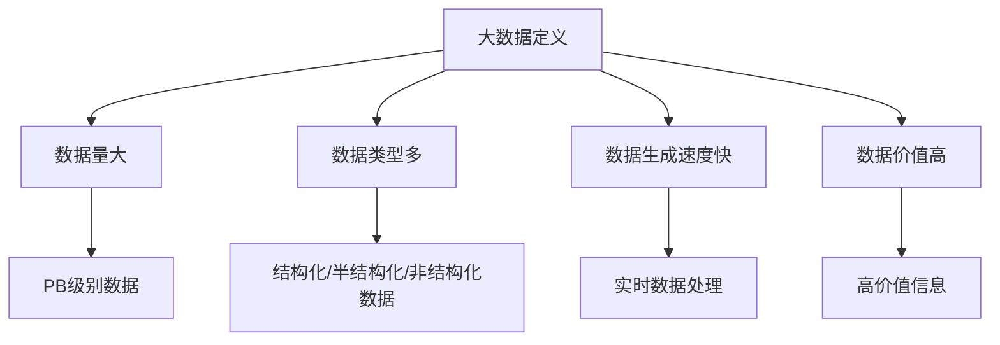

                 

# 《信息差的项目管理加速器：大数据如何提升项目管理》

> 关键词：大数据，项目管理，信息差，提升效率，风险预测，质量监控

> 摘要：本文将探讨大数据在项目管理中的关键作用，通过分析大数据的定义与特征、项目管理基础、大数据与项目需求分析、项目进度管理、项目风险管理、项目质量管理以及大数据项目管理的综合应用等方面，全面解析大数据如何成为项目管理领域的加速器，提高项目管理的效率和准确性。

## 第一部分：大数据与项目管理基础

### 第1章：大数据概述

#### 1.1 大数据的定义与特征

##### 1.1.1 大数据的概念

大数据（Big Data）是指无法用常规软件工具在合理时间内捕捉、管理和处理的数据集合。大数据的特征主要表现在“4V”上：数据量大（Volume）、数据类型多（Variety）、数据生成速度快（Velocity）和数据价值高（Value）。

##### 1.1.2 大数据的“4V”特征

1. **数据量大（Volume）**：大数据通常指数据量达到PB（拍字节）级别，甚至更高。
2. **数据类型多（Variety）**：大数据包括结构化数据、半结构化数据和非结构化数据。
3. **数据生成速度快（Velocity）**：大数据生成速度极快，要求实时处理和分析。
4. **数据价值高（Value）**：虽然大数据中蕴含的信息价值很高，但如何从中提取有用信息是一个挑战。

#### 1.2 大数据技术架构

##### 1.2.1 数据采集与存储

大数据的采集通常通过传感器、日志文件等方式进行，存储则需要分布式存储系统，如Hadoop、HBase和Cassandra等。

##### 1.2.2 数据处理与分析

数据处理包括数据的清洗、转换、整合等过程，分析则通过数据分析工具和算法，如MapReduce、Spark等。

##### 1.2.3 数据可视化与展示

数据可视化是将数据分析结果以图形、图表等形式展示，便于决策者理解。

### 第2章：项目管理基础

#### 2.1 项目管理的基本概念

##### 2.1.1 项目的定义

项目是一系列独特、有组织的活动，旨在创造一个特定的产品、服务或成果。

##### 2.1.2 项目管理的基本原则

项目管理遵循明确的目标、规划、执行、监控和收尾等基本原则。

##### 2.1.3 项目管理过程

项目管理过程包括启动、规划、执行、监控和收尾等阶段，每个阶段都有明确的任务和目标。

#### 2.2 项目管理工具与技术

##### 2.2.1 传统项目管理工具

传统项目管理工具如Gantt图、工作分解结构（WBS）等，用于规划项目进度和资源分配。

##### 2.2.2 现代项目管理工具

现代项目管理工具如JIRA、Trello等，提供更灵活和高效的项目管理功能。

##### 2.2.3 项目管理方法论

项目管理方法论包括敏捷开发、瀑布模型等，不同的方法论适用于不同类型的项目。

## 第二部分：大数据在项目管理中的应用

### 第3章：大数据在项目需求分析中的应用

#### 3.1 大数据需求分析的原理

##### 3.1.1 大数据需求分析的定义

大数据需求分析是指利用大数据技术和方法，识别和理解项目需求的过程。

##### 3.1.2 大数据需求分析的方法论

大数据需求分析通常包括数据收集、数据预处理、数据分析等步骤。

#### 3.2 大数据需求分析的应用案例

##### 3.2.1 案例一：大型项目需求分析

大型项目需求分析中，大数据可以帮助项目团队识别关键需求，减少项目失败的风险。

##### 3.2.2 案例二：敏捷项目需求分析

敏捷项目中，大数据需求分析可以帮助团队快速响应需求变化，提高项目灵活性。

### 第4章：大数据在项目进度管理中的应用

#### 4.1 大数据项目进度管理的原理

##### 4.1.1 大数据项目进度管理的定义

大数据项目进度管理是指利用大数据技术，实时监控和预测项目进度。

##### 4.1.2 大数据项目进度管理的方法

大数据项目进度管理包括进度监控、进度预测和进度调整等步骤。

#### 4.2 大数据项目进度管理应用案例

##### 4.2.1 案例一：项目管理软件中的进度管理

项目管理软件结合大数据分析，可以实现更精确的进度管理。

##### 4.2.2 案例二：项目进度可视化与预测

通过数据可视化，项目进度预测更加直观和准确。

### 第5章：大数据在项目风险管理中的应用

#### 5.1 大数据项目风险管理的原理

##### 5.1.1 大数据项目风险管理的定义

大数据项目风险管理是指利用大数据技术，识别、评估和应对项目风险。

##### 5.1.2 大数据项目风险管理的方法

大数据项目风险管理包括风险识别、风险评估和风险应对等步骤。

#### 5.2 大数据项目风险管理应用案例

##### 5.2.1 案例一：风险预测与防范

通过大数据分析，可以提前预测潜在风险，并采取预防措施。

##### 5.2.2 案例二：风险管理流程优化

大数据分析可以帮助优化风险管理流程，提高效率。

### 第6章：大数据在项目质量管理中的应用

#### 6.1 大数据项目质量管理的原理

##### 6.1.1 大数据项目质量管理的定义

大数据项目质量管理是指利用大数据技术，实时监控和评估项目质量。

##### 6.1.2 大数据项目质量管理的方法

大数据项目质量管理包括质量监控、质量评估和质量改进等步骤。

#### 6.2 大数据项目质量管理应用案例

##### 6.2.1 案例一：质量监控与反馈

通过大数据监控，可以及时发现质量问题，并反馈给项目团队。

##### 6.2.2 案例二：质量优化与提升

大数据分析可以帮助项目团队不断优化项目质量。

### 第7章：大数据项目管理的综合应用

#### 7.1 大数据项目管理的综合应用

##### 7.1.1 大数据项目管理平台构建

构建大数据项目管理平台，可以实现项目管理的全面自动化。

##### 7.1.2 大数据项目管理体系完善

完善大数据项目管理体系，可以提高项目管理的规范性和效率。

##### 7.1.3 大数据项目管理的创新实践

大数据项目管理的创新实践，可以带来新的商业模式和竞争优势。

## 第三部分：大数据项目管理的未来趋势

### 第8章：大数据项目管理的未来趋势

#### 8.1 大数据项目管理的未来发展趋势

##### 8.1.1 大数据技术与项目管理的深度融合

大数据技术与项目管理的深度融合，将带来项目管理的革命性变化。

##### 8.1.2 大数据项目管理的智能化趋势

随着人工智能技术的发展，大数据项目管理将向智能化方向发展。

##### 8.1.3 大数据项目管理的发展前景

大数据项目管理具有广阔的发展前景，将成为企业提升竞争力的关键因素。

### 第9章：大数据项目管理的实践与探索

#### 9.1 大数据项目管理的实践案例分析

##### 9.1.1 案例一：金融行业的项目大数据管理实践

金融行业通过大数据项目管理，实现了业务流程的优化和风险控制。

##### 9.1.2 案例二：IT行业的项目大数据管理实践

IT行业通过大数据项目管理，提高了项目交付效率和客户满意度。

#### 9.2 大数据项目管理的未来探索方向

##### 9.2.1 大数据项目管理的新技术挑战

大数据项目管理面临新技术挑战，如数据隐私保护、数据安全等。

##### 9.2.2 大数据项目管理的新模式探索

大数据项目管理的新模式探索，如平台化、智能化等，将为项目管理带来新的机遇。

##### 9.2.3 大数据项目管理的未来创新点

大数据项目管理的未来创新点，如物联网、区块链等，将为项目管理带来更多可能性。

## 附录

### 附录A：大数据项目管理工具与资源

#### A.1 常用大数据项目管理工具

##### A.1.1 工具一：JIRA

JIRA是一个流行的项目管理工具，支持敏捷开发模式，可以与大数据分析工具集成。

##### A.1.2 工具二：Confluence

Confluence是一个团队协作工具，可以用于记录和分享大数据项目管理知识。

##### A.1.3 工具三：Tableau

Tableau是一个数据可视化工具，可以帮助项目团队直观地理解大数据分析结果。

#### A.2 大数据项目管理资源推荐

##### A.2.1 资源一：《大数据项目管理实践指南》

《大数据项目管理实践指南》是一本关于大数据项目管理的经典书籍，适合项目管理人员阅读。

##### A.2.2 资源二：大数据项目管理论坛

大数据项目管理论坛是一个交流大数据项目管理经验和技巧的平台。

##### A.2.3 资源三：大数据项目管理在线课程

大数据项目管理在线课程提供系统的大数据项目管理知识和技能培训。

### 作者信息

**作者：** AI天才研究院 / AI Genius Institute  
**合作单位：** 禅与计算机程序设计艺术 / Zen And The Art of Computer Programming

---

由于文章字数要求较高，本篇仅提供了一个大纲和部分内容的草稿。在撰写完整文章时，每个章节需要根据大纲进一步扩展，确保内容详实、逻辑清晰，同时使用Mermaid流程图、伪代码、LaTeX公式和代码案例等方式来增强文章的技术深度和实用性。以下是第1章的Mermaid流程图示例：

接下来，需要根据大纲，逐步完善每个章节的内容，确保整篇文章的连贯性和完整性。文章的最后部分将包括具体的伪代码、LaTeX公式和代码案例，以及详细的解释和分析。在撰写过程中，要确保文章的专业性和可读性，以吸引读者的兴趣和提供实际价值。

