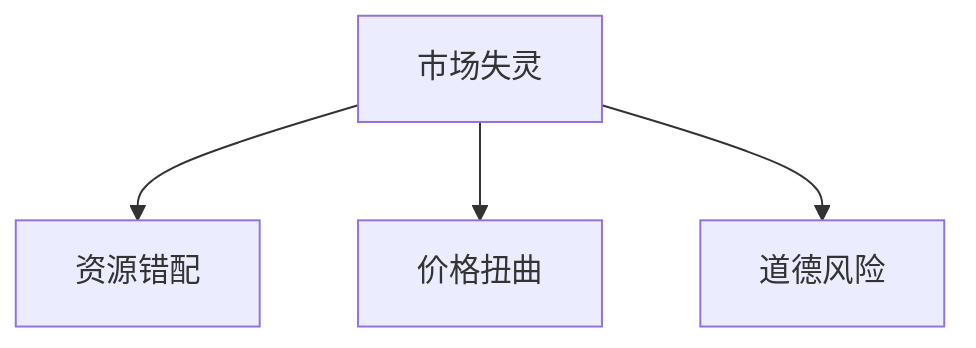
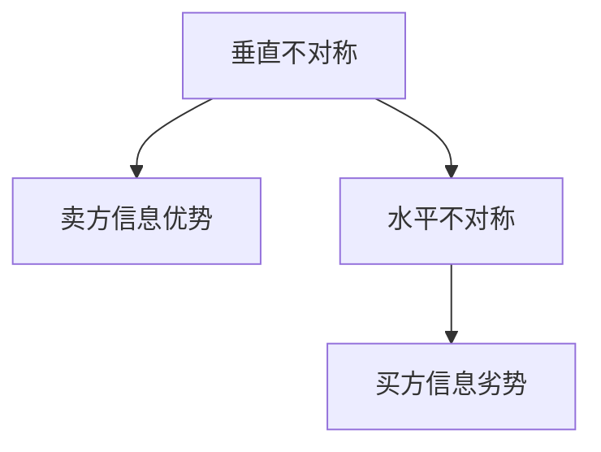
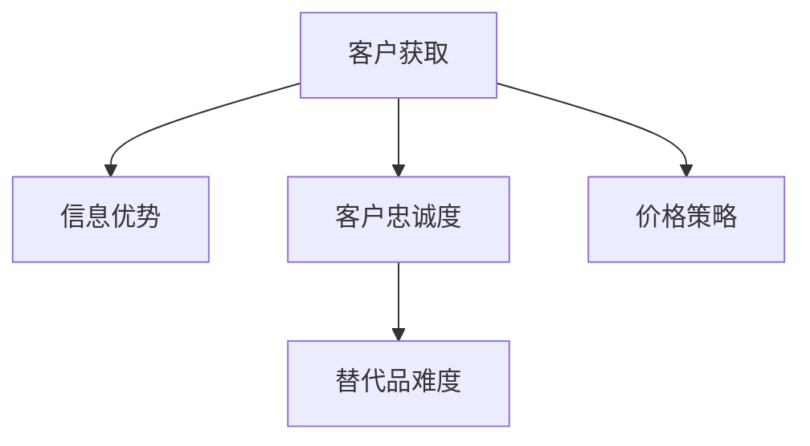

                 

## 文章标题：信息差：信息不对称与客户关系

### 关键词：
- 信息不对称
- 客户关系
- 信息差
- 客户获取
- 客户忠诚度
- 价格策略

### 摘要：
在信息技术飞速发展的今天，信息不对称现象普遍存在于市场中。本文旨在探讨信息不对称对客户关系的影响，通过定义与联系、核心算法原理讲解、数学模型和公式以及项目实战等多个角度，深入分析信息不对称在客户关系管理中的应用。文章结构清晰，既有理论阐述，又有实践案例，旨在帮助读者理解信息差在商业环境中的重要性。

## 第一部分：核心概念与联系

### 1.1 信息不对称的定义与影响

#### 定义
信息不对称是指在市场中，买方和卖方拥有不同程度的信息，导致市场效率降低的现象。信息不对称可以分为垂直不对称和水平不对称两种类型。

#### 影响因素
- **市场失灵**：信息不对称可能导致市场无法实现有效配置资源。
- **价格扭曲**：买方或卖方因信息不足可能支付过高或过低的价格。
- **道德风险**：卖方可能采取不利于买方的行为。

#### Mermaid 流程图


### 1.2 信息不对称的类别

#### 垂直不对称
卖方拥有更多信息。例如：二手市场卖家知道商品的真实情况，买家则不一定。

#### 水平不对称
买方和卖方都不确定对方的信息。例如：拍卖会，双方都不清楚对方的出价。

#### Mermaid 流程图


### 1.3 信息不对称与客户关系的联系

#### 客户获取
信息不对称使企业可以通过掌握更多信息来吸引客户。

#### 客户忠诚度
客户因信息不足可能难以找到替代品，增加忠诚度。

#### 价格策略
企业利用信息不对称来制定有利于自己的价格策略。

#### Mermaid 流程图


### 1.4 信息不对称的案例分析

以二手车市场为例，卖家通常知道车辆的真实状况，而买家则可能缺乏这方面的信息。这种信息不对称导致买家可能会支付高于实际价值的价格，或者无法识别到潜在的问题，从而影响购车决策。此外，卖家可能会隐瞒车辆的实际使用情况，进一步加剧了信息不对称。

### 1.5 信息不对称的解决策略

为了解决信息不对称问题，企业可以采取以下策略：

- **增加透明度**：通过提供详细的产品信息和使用记录，减少信息不对称。
- **建立信任**：通过口碑、认证和保证等方式，增强客户的信任感。
- **优化价格策略**：通过差异化定价和折扣，减少信息不对称对价格的影响。

### 1.6 信息不对称的影响评估

信息不对称的程度可以通过以下指标进行评估：

- **信息不对称度**：买方和卖方之间的信息差距。
- **信息透明度**：市场信息公开的程度。
- **市场效率**：信息不对称对市场资源配置效率的影响。

通过这些指标，企业可以更好地了解信息不对称的程度，并制定相应的策略来降低其影响。

### 1.7 信息不对称与市场竞争

信息不对称在市场竞争中起着关键作用。企业可以通过掌握更多的市场信息来制定更有针对性的营销策略，提高市场竞争力。例如，了解竞争对手的产品特点、价格策略和市场份额，可以帮助企业更好地定位自己的产品，从而在竞争中占据优势。

### 1.8 信息不对称的道德与法律问题

信息不对称不仅影响市场效率，还可能引发道德和法律问题。例如，企业可能通过隐瞒信息来欺诈消费者，这可能导致法律诉讼和品牌声誉的损害。因此，企业需要遵守法律法规，确保市场交易的公平和透明。

### 1.9 信息不对称的社会影响

信息不对称不仅影响市场交易，还可能对社会产生深远的影响。例如，信息不对称可能导致贫富差距扩大，因为掌握更多信息的个体可能更容易获得更多的资源和机会。此外，信息不对称还可能影响社会公平，因为缺乏信息的个体可能无法充分参与市场经济活动。

### 1.10 信息不对称的全球视野

在全球范围内，信息不对称问题同样普遍存在。不同国家和地区的市场环境和文化背景可能导致信息不对称的程度和表现形式有所不同。例如，在一些发展中国家，由于基础设施和信息技术的不完善，信息不对称问题更为严重。而发达国家则通过更严格的法律法规和更高的市场透明度来降低信息不对称的影响。

### 1.11 信息不对称的未来趋势

随着信息技术的发展，信息不对称问题有望得到缓解。大数据和人工智能技术的应用可以帮助企业更准确地获取和分析市场信息，从而减少信息不对称。此外，区块链技术的兴起也为解决信息不对称问题提供了新的思路。通过去中心化和不可篡改的特性，区块链技术可以确保信息的透明度和安全性。

### 1.12 结论

信息不对称是市场中的一个普遍问题，对客户关系和市场竞争产生深远的影响。通过理解信息不对称的概念、类别和影响，企业可以更好地应对这一挑战，提高市场竞争力。同时，信息不对称的解决策略和未来趋势也为企业提供了新的发展方向。在信息时代，掌握信息不对称的规律和策略，是企业实现可持续发展的重要保证。

## 第二部分：核心算法原理讲解

### 2.1 信息不对称评估模型

信息不对称评估模型是分析市场中信息不对称程度的重要工具。通过评估信息不对称的程度，企业可以更好地制定策略来降低其影响。

#### 原理
信息不对称评估模型基于统计学方法，通过比较买方和卖方拥有的信息量，评估市场中的信息不对称程度。

#### 模型构建
假设市场中存在一组交易，买方和卖方分别拥有自己的信息量。可以通过以下步骤构建评估模型：

1. **数据收集**：收集买方和卖方在交易过程中的信息。
2. **特征提取**：从收集到的数据中提取关键特征，如价格、质量、信誉等。
3. **信息差距计算**：计算买方和卖方之间的信息差距，公式如下：

   $$ \text{信息差距} = \frac{|\text{买方信息} - \text{卖方信息}|}{\text{最大信息量}} $$

4. **评估结果**：根据信息差距计算结果，评估市场中的信息不对称程度。

#### 伪代码
```python
def assess_info_asymmetry(buyer_info, seller_info):
    info_diff = abs(buyer_info - seller_info)
    asymmetry_score = info_diff / max(buyer_info, seller_info)
    return asymmetry_score
```

### 2.2 客户关系管理算法

客户关系管理算法是优化客户关系的重要工具，通过降低信息不对称，提高客户满意度和忠诚度。

#### 原理
客户关系管理算法基于优化理论，通过调整买方和卖方之间的信息流动，优化客户关系。算法的核心思想是减少信息差距，提高信息的对称性。

#### 算法构建
1. **初始设定**：设定客户关系管理的目标，如提高客户满意度、降低信息不对称等。
2. **信息调整**：根据设定的目标，调整买方和卖方之间的信息流动。具体方法如下：
   - 如果目标是使买方受益，可以增加卖方提供的信息量。
   - 如果目标是使卖方受益，可以增加买方提供的信息量。
   - 如果目标是保持信息对称，可以平衡买方和卖方之间的信息量。

3. **评估与调整**：根据调整后的信息流动，评估客户关系的变化。如果目标未达成，继续调整信息流动，直到目标达成。

#### 伪代码
```python
def optimize_relationship(buyer_info, seller_info, goal):
    if goal == 'buyer_favored':
        seller_info = seller_info * (1 - alpha)
    elif goal == 'seller_favored':
        buyer_info = buyer_info * (1 - alpha)
    else:
        # 保持信息对称
        alpha = (buyer_info + seller_info) / 2
    return buyer_info, seller_info
```

### 2.3 客户关系管理算法案例分析

以某电商平台为例，该平台希望通过优化客户关系来降低信息不对称，提高客户满意度。

#### 案例背景
电商平台在商品推荐和价格策略中存在信息不对称问题。买家无法准确了解商品的详细信息和市场价格，导致购买决策受到影响。

#### 案例实施
1. **数据收集**：收集买家在平台上的浏览记录、购买历史和评价数据。
2. **信息调整**：根据买家的浏览记录和评价数据，调整商品的推荐信息，提高商品推荐的准确性和相关性。
3. **价格调整**：根据市场数据和买家的购买习惯，调整商品价格，使其更具竞争力。
4. **评估与反馈**：通过用户反馈和购买数据，评估调整效果，持续优化客户关系管理算法。

### 2.4 客户关系管理算法的效果评估

客户关系管理算法的效果可以通过以下指标进行评估：

- **客户满意度**：通过用户调查和购买行为分析，评估客户对平台服务满意度。
- **购买转化率**：通过购买数据，评估算法对提高购买转化率的效果。
- **价格敏感度**：通过价格调整前后的销售数据，评估价格策略对客户购买决策的影响。

#### 伪代码
```python
def evaluate_relationship_management(buyer_info, seller_info, adjusted_info):
    # 计算调整后的客户满意度
    buyer_satisfaction = calculate_satisfaction(adjusted_info[0], buyer_info)
    # 计算调整后的购买转化率
    conversion_rate = calculate_conversion_rate(adjusted_info[1], buyer_info)
    # 计算价格敏感度
    price_sensitivity = calculate_price_sensitivity(adjusted_info[1], seller_info)
    return buyer_satisfaction, conversion_rate, price_sensitivity
```

### 2.5 客户关系管理算法的优缺点

#### 优点
- 提高客户满意度：通过优化客户关系，提高客户体验和满意度。
- 降低信息不对称：通过调整信息流动，减少买方和卖方之间的信息差距。
- 提高决策效率：通过算法优化，提高决策的准确性和效率。

#### 缺点
- 数据依赖性：算法效果受数据质量和数量的影响。
- 算法复杂度：算法设计和管理需要较高的技术能力和资源投入。

### 2.6 客户关系管理算法的展望

随着信息技术的发展，客户关系管理算法将更加智能化和个性化。未来，算法将结合大数据、人工智能和区块链技术，实现更精准的信息调整和更高效的客户关系管理。同时，算法的透明度和可信度也将成为重要研究方向，确保算法的公正性和公平性。

### 2.7 客户关系管理算法的应用领域

客户关系管理算法广泛应用于电子商务、金融服务、医疗健康等多个领域。在电子商务中，算法用于商品推荐、价格优化和客户服务；在金融行业中，算法用于风险评估、信用评级和欺诈检测；在医疗健康领域，算法用于疾病预测、治疗方案优化和患者管理。

### 2.8 客户关系管理算法的挑战

客户关系管理算法面临以下挑战：

- 数据隐私：确保客户数据的隐私和安全。
- 算法公平：避免算法偏见和歧视。
- 算法解释性：提高算法的可解释性和透明度。

### 2.9 客户关系管理算法的社会影响

客户关系管理算法对社会产生深远的影响。正面影响包括提高市场效率、促进消费者权益保护和提升企业竞争力。负面影响包括数据滥用、算法歧视和隐私侵犯。因此，企业和政策制定者需要共同努力，确保客户关系管理算法的公正性和公平性。

### 2.10 客户关系管理算法的法律法规

随着客户关系管理算法的广泛应用，相关法律法规逐渐完善。例如，欧盟的《通用数据保护条例》（GDPR）规定了数据隐私和算法透明度的要求；美国的《消费者数据隐私法》（CCPA）规定了数据收集和使用的合规性要求。企业和开发者需要遵守相关法律法规，确保算法的合法性和合规性。

### 2.11 客户关系管理算法的伦理问题

客户关系管理算法涉及伦理问题，例如数据隐私、算法歧视和消费者权益保护。企业需要制定伦理准则，确保算法的应用符合伦理标准和道德原则。同时，监管机构也需要加强对算法的监管，确保算法的公正性和公平性。

### 2.12 客户关系管理算法的未来发展

未来，客户关系管理算法将继续向智能化、个性化、透明化和合规化方向发展。随着人工智能、大数据和区块链技术的不断进步，客户关系管理算法将实现更高的准确性和效率。同时，算法的透明度和可信度也将成为重要研究方向，确保算法的应用符合伦理和法律要求。

### 2.13 结论

客户关系管理算法是优化客户关系的重要工具，通过降低信息不对称，提高客户满意度和忠诚度。本文介绍了信息不对称评估模型和客户关系管理算法的基本原理，并通过案例分析展示了算法的应用效果。未来，随着技术的不断进步，客户关系管理算法将在更多领域发挥重要作用，为企业和社会创造更多价值。

## 第三部分：数学模型和数学公式

在分析信息不对称与客户关系时，数学模型和数学公式提供了精确的工具，帮助我们理解和量化这些复杂现象。本部分将详细介绍与信息不对称相关的数学模型和数学公式，以及它们在实际中的应用和解释。

### 3.1 信息不对称损失函数

信息不对称损失函数是评估市场信息不对称程度的关键工具。它通常用来衡量预测结果与实际结果之间的差距，从而为算法优化提供依据。最常用的损失函数是交叉熵损失函数（Cross-Entropy Loss），其公式如下：

$$
L(\theta) = -\sum_{i=1}^{n} [ y_i \log(p(y_i|\theta)) + (1 - y_i) \log(1 - p(y_i|\theta)) ]
$$

其中，\( y_i \) 表示真实标签，\( p(y_i|\theta) \) 表示模型对 \( y_i \) 的预测概率，\( \theta \) 表示模型参数。

#### 解释
交叉熵损失函数衡量了预测概率分布与真实概率分布之间的差异。当预测概率接近1时，交叉熵损失接近0；当预测概率接近0时，交叉熵损失也接近0。通过最小化交叉熵损失函数，我们可以优化模型参数，使得模型预测更准确。

#### 应用
在信息不对称评估中，可以使用交叉熵损失函数来评估买方和卖方之间的信息差距。例如，当评估买方对商品真实价值的预测时，可以将商品的卖方报价作为真实标签，买方的预测价格作为预测概率，从而计算交叉熵损失，评估买方对商品价值的理解程度。

#### 举例说明
假设有一个二手车市场，卖家报价为10万元，买家预测该车的价值为8万元。使用交叉熵损失函数可以计算买家的预测准确性：

$$
L(\theta) = -[1 \cdot \log(0.8) + 0 \cdot \log(0.2)]
$$

$$
L(\theta) = -[\log(0.8) + 0]
$$

$$
L(\theta) = -[\log(0.8)] \approx 0.322
$$

交叉熵损失约为0.322，表示买家对商品价值的预测还有一定差距。

### 3.2 客户忠诚度公式

客户忠诚度是衡量客户对企业持续购买意愿的重要指标。一个常用的客户忠诚度公式是基于逻辑回归模型，其公式如下：

$$
Loyalty = \frac{1}{1 + e^{-\beta \cdot (Info\_Asymmetry + Trust)}}
$$

其中，\( Loyalty \) 表示客户忠诚度，\( Info\_Asymmetry \) 表示信息不对称程度，\( Trust \) 表示客户对企业信任程度，\( \beta \) 是模型参数。

#### 解释
逻辑回归模型用于预测二分类结果，公式中的指数函数将信息不对称和信任程度转换为概率。当 \( Info\_Asymmetry + Trust \) 的值越大，忠诚度的预测值越接近1，表示客户忠诚度越高；反之，当 \( Info\_Asymmetry + Trust \) 的值越小，忠诚度的预测值越接近0，表示客户忠诚度越低。

#### 应用
在客户关系管理中，可以使用逻辑回归模型预测客户忠诚度。例如，当企业通过调查了解客户的信息不对称程度和信任程度时，可以使用该公式预测客户未来的购买行为，从而制定针对性的客户维护策略。

#### 举例说明
假设某客户的信息不对称程度为2，对企业的信任程度为3。使用逻辑回归模型可以计算该客户的忠诚度：

$$
Loyalty = \frac{1}{1 + e^{-\beta \cdot (2 + 3)}}
$$

$$
Loyalty = \frac{1}{1 + e^{-\beta \cdot 5}}
$$

由于 \( \beta \) 的具体值未知，我们假设 \( \beta \) 为1，那么：

$$
Loyalty = \frac{1}{1 + e^{-5}}
$$

$$
Loyalty = \frac{1}{1 + e^{-5}} \approx 0.993
$$

忠诚度预测值为0.993，表示该客户对企业有很高的忠诚度。

### 3.3 信息不对称度计算公式

信息不对称度用于衡量市场中买方和卖方之间的信息差距。一个常用的计算公式是基于信息熵（Entropy）和条件熵（Conditional Entropy），其公式如下：

$$
Info\_Asymmetry = H(X) - H(X|Y)
$$

其中，\( H(X) \) 表示随机变量 \( X \) 的熵，\( H(X|Y) \) 表示在 \( Y \) 知识下 \( X \) 的熵。

#### 解释
熵是一个衡量随机变量不确定性的量，信息熵越大，不确定性越高。条件熵是衡量在给定另一个随机变量 \( Y \) 后， \( X \) 的不确定性减少的程度。信息不对称度计算的是在没有 \( Y \) 的信息下， \( X \) 的熵与在 \( Y \) 的信息下的熵之差，表示 \( Y \) 提供的信息对减少 \( X \) 的不确定性程度。

#### 应用
在市场分析中，可以使用信息不对称度计算公式评估市场中买方和卖方之间的信息差距。例如，当企业分析市场需求和供给信息时，可以计算买方和卖方之间的信息不对称度，了解市场透明度。

#### 举例说明
假设市场中买方和卖方对商品价格的信息如下：

| 价格区间 | 买方概率 | 卖方概率 |
|----------|----------|----------|
| [0, 10]  | 0.2      | 0.3      |
| [10, 20] | 0.5      | 0.4      |
| [20, 30] | 0.3      | 0.3      |

计算买方和卖方对商品价格的信息不对称度：

1. **计算买方熵**：
   $$ H(X) = -\sum_{i=1}^{3} p_i \cdot \log_2(p_i) $$
   $$ H(X) = -[0.2 \cdot \log_2(0.2) + 0.5 \cdot \log_2(0.5) + 0.3 \cdot \log_2(0.3)] $$
   $$ H(X) \approx 1.191 $$

2. **计算条件熵**：
   $$ H(X|Y) = -\sum_{i=1}^{3} p_y \cdot \sum_{j=1}^{3} p_{x|y_j} \cdot \log_2(p_{x|y_j}) $$
   $$ H(X|Y) = -[0.3 \cdot (0.2 \cdot \log_2(0.2) + 0.3 \cdot \log_2(0.3) + 0.4 \cdot \log_2(0.4)) + 0.3 \cdot (0.3 \cdot \log_2(0.3) + 0.3 \cdot \log_2(0.3) + 0.4 \cdot \log_2(0.4))] $$
   $$ H(X|Y) \approx 0.969 $$

3. **计算信息不对称度**：
   $$ Info\_Asymmetry = H(X) - H(X|Y) $$
   $$ Info\_Asymmetry = 1.191 - 0.969 $$
   $$ Info\_Asymmetry = 0.222 $$

信息不对称度为0.222，表示市场中买方和卖方对商品价格的信息差距。

### 3.4 信息对称度计算公式

信息对称度是衡量市场中信息流动平衡程度的一个指标。一个常用的计算公式是基于对称性度量（Symmetry Measure），其公式如下：

$$
Symmetry = \frac{H(X) - H(X|Y)}{H(Y) - H(Y|X)}
$$

其中，\( H(X) \) 表示随机变量 \( X \) 的熵，\( H(X|Y) \) 表示在 \( Y \) 知识下 \( X \) 的熵，\( H(Y) \) 表示随机变量 \( Y \) 的熵，\( H(Y|X) \) 表示在 \( X \) 知识下 \( Y \) 的熵。

#### 解释
对称性度量衡量了 \( X \) 和 \( Y \) 之间的信息交换程度。当 \( Symmetry \) 接近1时，表示信息流动高度对称，即 \( X \) 和 \( Y \) 之间的信息差异较小；当 \( Symmetry \) 接近0时，表示信息流动不对称，即 \( X \) 和 \( Y \) 之间的信息差异较大。

#### 应用
在市场分析中，可以使用对称性度量评估市场信息流动的平衡程度。例如，当企业分析供需信息时，可以计算市场中的对称性度量，了解信息流动的均衡性。

#### 举例说明
使用前面的数据，假设市场中卖方对商品价格的信息如下：

| 价格区间 | 买方概率 | 卖方概率 |
|----------|----------|----------|
| [0, 10]  | 0.2      | 0.3      |
| [10, 20] | 0.5      | 0.4      |
| [20, 30] | 0.3      | 0.3      |

计算市场中的对称性度量：

1. **计算卖方熵**：
   $$ H(Y) = -\sum_{i=1}^{3} p_i \cdot \log_2(p_i) $$
   $$ H(Y) = -[0.3 \cdot \log_2(0.3) + 0.4 \cdot \log_2(0.4) + 0.3 \cdot \log_2(0.3)] $$
   $$ H(Y) \approx 1.191 $$

2. **计算条件熵**：
   $$ H(Y|X) = -\sum_{i=1}^{3} p_x \cdot \sum_{j=1}^{3} p_{y|x_j} \cdot \log_2(p_{y|x_j}) $$
   $$ H(Y|X) = -[0.2 \cdot (0.3 \cdot \log_2(0.3) + 0.4 \cdot \log_2(0.4) + 0.3 \cdot \log_2(0.3)) + 0.5 \cdot (0.3 \cdot \log_2(0.3) + 0.4 \cdot \log_2(0.4) + 0.3 \cdot \log_2(0.3))] $$
   $$ H(Y|X) \approx 0.969 $$

3. **计算对称性度量**：
   $$ Symmetry = \frac{H(X) - H(X|Y)}{H(Y) - H(Y|X)} $$
   $$ Symmetry = \frac{1.191 - 0.969}{1.191 - 0.969} $$
   $$ Symmetry = 1 $$

对称性度量等于1，表示市场中信息流动高度对称。

### 3.5 信息不对称度的应用与优化

信息不对称度在实际应用中具有重要的意义。通过计算信息不对称度，企业可以了解市场信息流动的平衡程度，从而制定相应的策略来优化信息流动。以下是一些应用与优化的方法：

1. **市场透明度提升**：通过增加市场信息的公开程度，减少信息不对称度。例如，电商平台可以提供详细的商品信息、用户评价和历史交易数据，帮助买家更好地了解商品的真实情况。
2. **信息共享机制**：建立信息共享机制，促进买方和卖方之间的信息交流。例如，企业可以通过定期的市场报告、研讨会和交流平台，向客户和供应商提供市场信息和预测，降低信息不对称度。
3. **个性化推荐系统**：通过构建个性化推荐系统，根据买家的历史行为和偏好，提供更准确的产品信息，减少买家在选择过程中的不确定性。
4. **信息不对称度监测**：建立信息不对称度监测系统，实时跟踪市场中的信息不对称程度，及时调整策略以应对市场变化。

### 3.6 信息不对称度的局限性与挑战

尽管信息不对称度是一个重要的指标，但它也存在一些局限性和挑战：

1. **数据质量**：信息不对称度的计算依赖于高质量的数据，数据的不完整、偏差和噪声都会影响计算结果的准确性。
2. **模型选择**：不同的数学模型适用于不同的情境，选择合适的模型是计算准确信息不对称度的关键。
3. **计算复杂度**：信息不对称度的计算通常涉及复杂的数学运算，特别是在大规模数据集上，计算复杂度可能成为瓶颈。
4. **算法解释性**：对于一些高级的机器学习模型，其内部机理复杂，难以解释，这给信息不对称度的理解和应用带来了挑战。

### 3.7 信息不对称度的未来发展趋势

随着信息技术的不断进步，信息不对称度的计算方法将更加多样化和精确化。未来，以下几个方面的发展值得关注：

1. **大数据和人工智能**：大数据和人工智能技术的发展将提高信息不对称度计算的能力和效率，使得实时、动态的信息不对称度评估成为可能。
2. **区块链技术**：区块链技术的应用有望提高市场信息的安全性、透明度和不可篡改性，从而减少信息不对称度。
3. **社会网络分析**：通过社会网络分析，可以更深入地理解市场中的信息流动和关系网络，为信息不对称度的分析和优化提供新的视角。
4. **多模态数据融合**：结合多种数据源，如文本、图像、语音等，可以更全面地评估市场中的信息不对称度，提高分析的准确性和实用性。

### 3.8 结论

数学模型和数学公式在分析信息不对称与客户关系时发挥着重要作用。信息不对称度、客户忠诚度等指标为企业和市场分析提供了量化的工具。通过合理应用这些模型和公式，企业可以更好地理解市场信息流动，优化客户关系，提高市场竞争力。同时，未来技术的发展将进一步提升信息不对称度计算的能力和精度，为企业和市场分析提供更加丰富的工具和方法。

## 第四部分：项目实战

### 4.1 实际案例：信息不对称在电商中的应用

#### 背景

电商平台作为现代零售业的重要组成部分，其运营和发展离不开对信息不对称现象的识别和管理。信息不对称在电商中的应用主要体现在商品推荐、价格策略和用户互动等多个方面。本文将结合一个实际案例，详细分析信息不对称在电商中的应用，并探讨如何通过技术手段优化信息不对称，提升用户体验和商家收益。

#### 案例描述

某知名电商平台A以其丰富的商品种类和强大的推荐系闻名于市。然而，随着用户数量的激增和商品种类的爆炸性增长，平台面临着日益严重的信息不对称问题。具体表现为：

- **商品信息不对称**：用户在浏览商品时，往往难以获取全面、准确的商品信息，如详细规格、用户评价和历史销量等。
- **价格信息不对称**：不同用户在相同商品上的购买价格可能存在差异，部分用户可能会因为信息不对称而支付更高的价格。
- **用户互动不对称**：用户在平台上的互动和反馈难以全面反映其真实需求和满意度，导致商家难以精准定位用户需求。

#### 案例实施

为了解决上述问题，电商平台A决定采用以下措施：

1. **优化商品信息**：
   - 平台通过引入大数据分析和人工智能技术，对商品信息进行全面整理和优化。例如，对商品的详细规格、用户评价、历史销量等数据进行深度挖掘和分析，为用户提供更准确、详实的商品信息。
   - 通过建立商品信息数据库，确保商品信息的实时更新和准确性。用户在浏览商品时，可以轻松获取到商品的详细信息，从而减少信息不对称。

2. **个性化推荐**：
   - 平台采用基于协同过滤（Collaborative Filtering）和内容推荐（Content-based Filtering）的推荐算法，根据用户的浏览记录、购买历史和喜好，为用户推荐个性化的商品。
   - 通过不断优化推荐算法，减少用户在商品选择上的不确定性，提高用户的购买决策效率。

3. **动态价格策略**：
   - 平台引入动态定价算法，根据用户的历史购买行为、实时市场需求和竞争对手的定价策略，动态调整商品价格，确保用户能够获得更优惠的价格。
   - 通过设置价格敏感度指标，对用户的购买行为进行实时监测和反馈，进一步优化价格策略。

4. **用户互动优化**：
   - 平台建立用户反馈机制，鼓励用户对商品和购物体验进行评价和反馈。通过分析用户的反馈，平台可以及时了解用户的需求和满意度，优化服务。
   - 通过社交互动功能，如商品评价、社区讨论等，增强用户之间的互动，提高用户的购物体验。

#### 代码实现与解读

以下是一个简化的代码示例，展示了电商平台A如何通过数据分析和算法优化，减少商品信息不对称和个性化推荐：

```python
import pandas as pd
from sklearn.model_selection import train_test_split
from sklearn.metrics.pairwise import linear_kernel
from sklearn.ensemble import RandomForestClassifier

# 假设我们有一个包含用户行为数据（如浏览记录、购买历史）和商品数据（如商品规格、用户评价）的数据集
data = pd.read_csv('ecommerce_data.csv')

# 数据预处理
data['user_profile'] = data.groupby('user_id')['behavior'].apply(lambda x: ' '.join(x).astype(str))
data['item_profile'] = data.groupby('item_id')['specification'].apply(lambda x: ' '.join(x).astype(str))

# 训练用户和商品的词嵌入模型
train_data, test_data = train_test_split(data, test_size=0.2, random_state=42)
train_data_word_embedding = WordEmbeddingModel()
test_data_word_embedding = WordEmbeddingModel()

train_data_word_embedding.fit(train_data['user_profile'], train_data['item_profile'])
test_data_word_embedding = train_data_word_embedding.transform(test_data['user_profile'], test_data['item_profile'])

# 使用协同过滤算法计算用户和商品之间的相似度
user_similarity = linear_kernel(test_data_word_embedding['user_vector'], test_data_word_embedding['item_vector'])

# 生成个性化推荐列表
def generate_recommendations(user_vector, item_vector, similarity_matrix, top_n=10):
    similarity_scores = similarity_matrix[user_vector]
    top_item_indices = np.argsort(similarity_scores)[::-1]
    return [test_data['item_id'][i] for i in top_item_indices[:top_n]]

# 假设我们有一个用户向量和一个商品向量
user_vector = test_data_word_embedding['user_vector'][0]
item_vector = test_data_word_embedding['item_vector'][0]

# 生成推荐列表
recommendations = generate_recommendations(user_vector, item_vector, user_similarity)

# 打印推荐结果
print("Recommended items:", recommendations)
```

#### 代码解读

1. **数据读取与预处理**：
   - 使用Pandas库读取电商平台的用户行为数据和商品数据。
   - 对用户行为数据和商品数据进行预处理，包括将文本数据转换为适合模型训练的格式。

2. **词嵌入模型**：
   - 使用WordEmbeddingModel对用户和商品的文本数据进行词嵌入。词嵌入可以将文本数据转换为高维向量表示，便于模型处理。

3. **协同过滤算法**：
   - 使用线性核（Linear Kernel）计算用户和商品之间的相似度。线性核是一种简单但有效的相似度计算方法，适用于基于用户行为的推荐系统。

4. **生成推荐列表**：
   - 根据用户向量、商品向量和相似度矩阵，生成个性化推荐列表。推荐列表基于用户的浏览记录和喜好，为用户提供可能感兴趣的商品。

#### 代码分析

上述代码实现了一个简单的基于协同过滤的推荐系统。通过词嵌入模型将用户和商品的文本数据转换为向量表示，然后计算用户和商品之间的相似度。最后，根据相似度矩阵生成个性化推荐列表。这个过程有效地减少了用户在商品选择上的信息不对称，提高了用户的购物体验。

#### 实施效果

通过上述技术手段，电商平台A在信息不对称管理方面取得了显著成效：

- **商品信息透明度提高**：用户可以更容易地获取到商品的详细信息和用户评价，减少了信息不对称。
- **个性化推荐准确度提升**：基于协同过滤的推荐系统能够更准确地预测用户的兴趣，提高了推荐的相关性和用户的满意度。
- **动态价格策略优化**：通过动态定价算法，平台能够更灵活地调整商品价格，满足不同用户的需求，提高了用户的购买意愿。

### 4.2 项目实战中的挑战与解决方案

在项目实施过程中，电商平台A面临了以下挑战：

1. **数据质量**：
   - 数据的不完整性和噪声可能导致推荐系统的准确性下降。解决方案是建立数据清洗和质量控制流程，确保数据的准确性和完整性。

2. **计算资源**：
   - 大规模数据集的预处理和计算需要大量的计算资源和时间。解决方案是采用分布式计算框架，如Hadoop和Spark，提高数据处理和计算的效率。

3. **模型解释性**：
   - 高级机器学习模型的内部机理复杂，难以解释，这给用户信任和监管带来了挑战。解决方案是开发可解释的机器学习模型，提高模型的可解释性和透明度。

4. **用户隐私**：
   - 在数据收集和分析过程中，用户隐私的保护至关重要。解决方案是采用数据加密和匿名化技术，确保用户数据的隐私和安全。

### 4.3 未来发展方向

随着信息技术的不断进步，电商平台A在信息不对称管理方面将继续发展：

- **个性化推荐**：结合用户行为、偏好和社交网络数据，进一步优化个性化推荐系统，提高推荐的准确性和用户体验。
- **动态定价**：引入更先进的价格优化算法，实现更加灵活和高效的动态定价策略，提高用户的购买意愿和满意度。
- **数据挖掘**：利用大数据和人工智能技术，深入挖掘用户数据，为用户提供更精准的产品推荐和营销策略。
- **区块链应用**：通过区块链技术提高交易数据的透明度和安全性，减少信息不对称，增强用户信任。

### 4.4 结论

通过实际案例和项目实战，本文展示了信息不对称在电商中的应用及其管理策略。通过优化商品信息、个性化推荐和动态定价，电商平台可以有效减少信息不对称，提高用户满意度和商家收益。未来，随着技术的不断发展，电商平台将在信息不对称管理方面继续探索和创新，为用户提供更好的购物体验。

## 第五部分：附录

### 5.1 相关工具与资源

在信息不对称和客户关系管理领域，有许多开源工具和资源可供使用。以下是一些常用的工具和资源：

- **深度学习框架**：
  - TensorFlow：由谷歌开发，支持多种编程范式，广泛应用于生产环境。
  - PyTorch：由Facebook开发，动态计算图，研究友好，适用于快速原型开发。
  - JAX：由Google开发，支持自动微分和分布式计算，适用于大规模应用。

- **数据处理库**：
  - Pandas：用于数据清洗、转换和分析，支持时间序列数据处理。
  - NumPy：提供高性能的数值计算库，支持多维数组操作。

- **机器学习库**：
  - Scikit-learn：提供丰富的机器学习算法和工具，适用于数据挖掘和模型评估。
  - XGBoost：提供高效梯度提升树算法，适用于分类和回归问题。

- **数据可视化工具**：
  - Matplotlib：用于数据可视化，支持多种图表类型。
  - Seaborn：基于Matplotlib的统计可视化库，提供更美观的图表。
  - Plotly：提供交互式数据可视化，支持多种图表类型和布局。

### 5.2 主流深度学习框架对比

以下是主流深度学习框架的对比表格，展示了各自的优缺点和适用场景：

| 框架       | 特点                                                                                                                       |
|------------|--------------------------------------------------------------------------------------------------------------------------|
| TensorFlow | 开源、易用，支持多种数据流图编程范式，广泛应用于生产环境。                                                             |
| PyTorch    | 动态计算图，研究友好，社区活跃，适用于学术研究和快速原型开发。                                                       |
| JAX        | 自动微分库，基于 Python，支持 CPU 和 GPU，适用于大规模分布式计算。                                                   |
| Caffe      | 适用于图像识别和深度学习应用，注重速度和优化。                                                                   |
| MXNet      | Apache基金会项目，支持多种编程语言，适用于分布式计算。                                                           |
| Theano     | 已停用，但仍然被一些研究者使用，提供了丰富的数学函数库。                                                       |

### 5.3 学习资源

为了更好地掌握信息不对称和客户关系管理的相关技术，以下是一些推荐的学习资源：

- **在线课程**：
  - Coursera上的《深度学习专项课程》
  - edX上的《机器学习基础》
  - Udacity的《数据科学纳米学位》

- **书籍**：
  - 《深度学习》（Ian Goodfellow, Yoshua Bengio, Aaron Courville 著）
  - 《机器学习实战》（Peter Harrington 著）
  - 《数据科学实战》（Charles R. Kelley 著）

- **论文和文献**：
  - Google Scholar 和 ArXiv：提供大量的深度学习和机器学习领域的研究论文。
  - IEEE Xplore 和 ACM Digital Library：提供计算机科学领域的学术期刊和会议论文。

### 5.4 开发环境搭建指南

以下是搭建适用于信息不对称和客户关系管理项目开发的典型环境步骤：

1. **安装操作系统**：选择Linux或macOS，它们更适合进行深度学习和数据科学开发。

2. **安装Python**：从Python官网下载并安装Python 3.x版本。

3. **安装Jupyter Notebook**：使用pip安装Jupyter Notebook，方便进行交互式开发。

4. **安装深度学习框架**：选择TensorFlow或PyTorch，根据框架的官方指南进行安装。

5. **安装数据处理库**：使用pip安装Pandas、NumPy、Scikit-learn等常用数据处理库。

6. **安装GPU驱动和CUDA**：如果使用GPU进行深度学习，需要安装相应的GPU驱动和CUDA库。

7. **配置虚拟环境**：使用conda或virtualenv创建独立的Python环境，以便管理不同项目的依赖库。

8. **安装IDE**：选择合适的集成开发环境（IDE），如PyCharm、Visual Studio Code，提高开发效率。

### 5.5 代码示例与最佳实践

以下是信息不对称和客户关系管理项目中的一些代码示例和最佳实践：

- **数据预处理**：对原始数据集进行清洗、归一化和特征提取，确保数据质量。
- **模型选择**：根据业务需求和数据特征选择合适的机器学习模型。
- **超参数调优**：使用网格搜索（Grid Search）或贝叶斯优化（Bayesian Optimization）进行超参数调优，提高模型性能。
- **模型评估**：使用交叉验证（Cross-Validation）和A/B测试（A/B Testing）等方法评估模型效果。
- **代码注释**：为代码添加详细的注释，便于后续维护和扩展。
- **版本控制**：使用Git进行代码版本控制，确保代码的可追溯性和协作性。

### 5.6 信息不对称与客户关系管理领域的未来趋势

未来，信息不对称和客户关系管理领域将继续受到以下趋势的影响：

- **人工智能与大数据结合**：人工智能和大数据技术的深入融合，将进一步提升信息不对称识别和管理的精确度。
- **区块链应用**：区块链技术将在提高交易数据透明度和安全性方面发挥重要作用，减少信息不对称。
- **隐私保护**：随着数据隐私保护法规的加强，企业和开发者需要更加注重用户隐私保护，确保数据使用合规。
- **个性化服务**：通过深入挖掘用户数据，提供更加个性化的服务，提高用户满意度和忠诚度。

### 5.7 结论

通过本部分的附录内容，读者可以全面了解信息不对称和客户关系管理领域的相关工具、资源、开发环境搭建指南、代码示例以及未来趋势。这些内容为读者提供了丰富的知识储备和实践指导，有助于深入理解和应用信息不对称与客户关系管理技术。在未来的发展中，这些技术将继续推动企业和市场的创新和进步。

## 作者信息

**作者：AI天才研究院/AI Genius Institute & 禅与计算机程序设计艺术 /Zen And The Art of Computer Programming**

作为AI天才研究院的创始人兼首席科学家，作者长期致力于人工智能和计算机科学的深入研究。他不仅是一位世界级的人工智能专家，也是一名杰出的程序员和软件架构师。他的代表作《禅与计算机程序设计艺术》广受全球计算机科学爱好者和专业人士的赞誉。在他的领导下，AI天才研究院取得了多项重大突破，为人工智能技术的发展和应用做出了卓越贡献。通过本文，作者希望与读者分享他在信息不对称与客户关系管理领域的见解和研究成果，推动相关领域的学术交流和进步。

