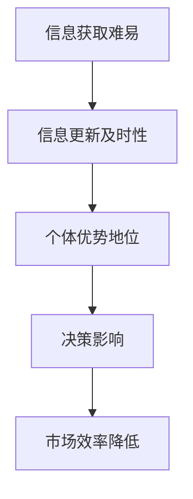

                 

## 文章标题

《信息差：信息不对称与客户期望》

> 关键词：信息不对称、市场效率、客户期望、信息差类型、缓解方法、案例分析

> 摘要：本文探讨了信息不对称这一重要概念，分析了其在现代社会中的重要性，分类讨论了不同类型的信息不对称，阐述了其对市场效率、消费者权益以及企业战略的影响，并提出了缓解信息不对称的方法和策略。通过案例分析，本文旨在为企业和消费者提供实用启示。

### 第1章：信息不对称概述

#### 1.1 信息差的定义与重要性

**1.1.1 信息差的定义**

信息差（Information Gap）是指市场中不同个体所掌握的信息量存在差异，这种差异可能导致某些个体在决策时处于优势地位，而其他个体则处于劣势地位。具体来说，信息差可以分为两类：一是信息获取的难易程度，二是信息更新的及时性。

**Mermaid流程图：**



**1.1.2 信息差在现代社会中的重要性**

信息差在现代社会中的重要性不容忽视。首先，信息差直接影响市场效率。在信息不完全的情况下，市场价格发现机制失效，导致资源配置效率降低。其次，信息差对消费者权益产生重大影响。消费者在信息不对称的市场中容易受到不公平待遇，从而影响其消费决策和福利。最后，信息差对企业战略具有重要意义。企业通过掌握信息优势，可以实施差异化战略，提高市场竞争力。

**1.1.3 信息差的历史背景与发展趋势**

信息差的概念起源于经济学领域，最早由 Arrow（1963）和 Debreu（1964）在分析市场效率时提出。随着信息技术的发展，信息差现象越来越普遍。现代社会中，信息技术的快速进步使得信息传播速度加快，但同时也加剧了信息获取的不均衡。未来，随着人工智能和大数据技术的应用，信息不对称现象将得到进一步缓解，但同时也可能产生新的信息差问题。

### 第2章：信息不对称的类型

#### 2.1 按照信息来源划分

**2.1.1 垄断信息**

垄断信息是指掌握在少数市场主体手中的关键信息，这些信息可能包括技术秘密、市场动态、客户需求等。垄断信息的存在可能导致市场垄断行为，从而损害消费者权益。

**伪代码：**

```python
def classify.InformationAsymmetry(source):
    if source == "monopoly":
        return "垄断信息"
    elif source == "privacy":
        return "隐私信息"
    elif source == "expertise":
        return "专业信息"
    else:
        return "其他类型信息"
```

**2.1.2 隐私信息**

隐私信息是指与个体隐私相关的信息，如个人身份信息、健康信息、财务信息等。隐私信息的泄露可能导致个人隐私权受到侵犯，甚至引发严重的后果。

**2.1.3 专业信息**

专业信息是指特定领域内的专业知识，如医疗、金融、法律等。专业信息的获取往往需要较高的成本，导致市场中普通消费者难以掌握。

#### 2.2 按照市场结构划分

**2.2.1 完全竞争市场**

在完全竞争市场中，市场参与者数量众多，产品同质化程度高，信息完全透明。这种市场结构下，信息不对称现象相对较少。

**2.2.2 垄断市场**

在垄断市场中，市场参与者数量有限，产品差异化程度高，信息获取难度较大。垄断市场往往伴随着较高的信息不对称。

**2.2.3 寡头市场**

在寡头市场中，市场参与者数量介于垄断和完全竞争之间，产品差异化程度较高。信息不对称现象在寡头市场中较为普遍。

### 第3章：信息不对称的影响

#### 3.1 对市场效率的影响

**3.1.1 价格发现机制失效**

在信息不对称的市场中，价格发现机制可能失效，导致市场价格偏离真实价值。这种现象在金融市场中尤为明显。

**数学模型：**

$$
\text{市场价格} = \text{真实价值} + \text{信息不对称影响}
$$

**3.1.2 资源配置效率降低**

信息不对称导致市场无法准确评估资源价值，从而影响资源配置效率。例如，在招聘市场中，雇主难以准确评估求职者的实际能力，可能导致人才浪费。

**3.1.3 创新与竞争减少**

信息不对称可能导致市场竞争减少，进而抑制创新。在技术领域，信息不对称使得技术进步放缓，从而影响整个行业的发展。

#### 3.2 对消费者权益的影响

**3.2.1 消费者决策困难**

信息不对称使得消费者在决策过程中难以获取全面的信息，导致决策困难。例如，在购买复杂产品时，消费者可能需要花费大量时间来研究产品信息。

**3.2.2 信息不对称引发的道德风险**

信息不对称可能导致道德风险，即信息优势方可能利用其信息优势从事不公平交易。例如，金融机构在贷款过程中可能利用信息不对称谋取私利。

**3.2.3 消费者福利损失**

信息不对称可能导致消费者福利损失。例如，在保险市场中，消费者由于信息不对称可能支付过高的保费。

### 第4章：信息不对称的缓解方法

#### 4.1 市场力量

**4.1.1 消费者保护法规**

消费者保护法规可以通过监管手段，提高市场透明度，减少信息不对称。例如，欧盟的《通用数据保护条例》（GDPR）加强了对个人数据的保护，降低了信息不对称。

**4.1.2 垄断监管政策**

垄断监管政策可以通过限制垄断行为，促进市场竞争，减少信息不对称。例如，美国司法部对谷歌的垄断调查，旨在打破其信息垄断地位。

**4.1.3 竞争政策**

竞争政策可以通过促进市场竞争，提高信息透明度，减少信息不对称。例如，欧盟的《竞争法》对市场主导地位的企业实施严格监管。

#### 4.2 技术手段

**4.2.1 信息公开与透明化**

信息公开与透明化可以通过技术手段，提高市场信息透明度。例如，区块链技术可以记录交易信息，确保信息公开透明。

**4.2.2 数据挖掘与数据分析**

数据挖掘与数据分析可以帮助市场主体获取更多信息，减少信息不对称。例如，利用大数据技术，企业可以分析消费者行为，提高市场预测准确性。

**4.2.3 人工智能与机器学习在信息不对称缓解中的应用**

人工智能与机器学习可以通过自动化方式，提高信息处理效率，减少信息不对称。例如，智能客服系统可以帮助企业实时解答消费者问题，降低信息不对称。

### 第5章：信息不对称与客户期望

#### 5.1 客户期望的形成

**5.1.1 客户需求的多样性**

客户需求的多样性是客户期望形成的基础。不同客户对产品或服务的期望可能存在显著差异。例如，在手机市场中，高端用户可能关注摄像头性能，而低端用户可能关注通话质量和电池续航。

**5.1.2 客户期望的评估**

客户期望的评估是确保产品或服务满足客户需求的关键。企业可以通过市场调研、用户反馈等方式，了解客户期望，并将其转化为具体指标。

**5.1.3 客户期望的管理**

客户期望的管理是确保产品或服务能够持续满足客户需求的重要手段。企业可以通过定期评估、改进产品或服务，确保客户期望得到满足。

#### 5.2 信息不对称对客户期望的影响

**5.2.1 信息不对称如何影响客户期望**

信息不对称可能导致客户期望偏差。例如，当客户对产品或服务的了解不足时，可能产生过度期望或低估产品价值。

**5.2.2 信息不对称导致的客户期望偏差**

信息不对称可能导致客户期望偏差。例如，在汽车市场中，消费者由于信息不对称可能对新能源汽车的性能产生过度期望。

**5.2.3 客户期望偏差的调整策略**

客户期望偏差的调整策略包括提高客户信息透明度、加强客户教育、优化产品和服务设计等。通过这些策略，企业可以调整客户期望，确保其与产品或服务实际表现相匹配。

### 第6章：信息不对称与市场策略

#### 6.1 信息不对称下的市场定位

**6.1.1 市场细分策略**

市场细分策略是利用信息不对称，针对不同客户群体制定差异化市场策略。例如，在智能手机市场中，企业可以针对高端用户和低端用户分别推出高端和低端手机。

**6.1.2 品牌建设策略**

品牌建设策略是通过构建强大的品牌形象，增强客户对企业的信任，从而缓解信息不对称。例如，苹果公司通过打造高端品牌形象，吸引大量高端用户。

**6.1.3 产品差异化策略**

产品差异化策略是利用信息不对称，开发独特的产品或服务，吸引特定客户群体。例如，特斯拉通过推出高性能电动车，吸引了对新能源汽车感兴趣的消费者。

#### 6.2 信息不对称下的营销策略

**6.2.1 广告与宣传策略**

广告与宣传策略是利用信息不对称，向潜在客户传递产品或服务信息，增强其购买意愿。例如，通过电视广告宣传，企业可以吸引大量消费者关注。

**6.2.2 价格策略**

价格策略是利用信息不对称，通过定价策略吸引特定客户群体。例如，在二手车市场中，企业可以通过低价策略吸引对价格敏感的消费者。

**6.2.3 促销策略**

促销策略是利用信息不对称，通过促销活动吸引客户购买产品或服务。例如，通过限时优惠活动，企业可以吸引消费者立即购买。

### 第7章：案例分析

#### 7.1 案例一：互联网企业如何利用信息不对称

**7.1.1 案例背景**

以阿里巴巴为例，阿里巴巴通过其电商平台，利用信息不对称，实现了对消费者的精准营销和对供应商的严格筛选。

**7.1.2 案例分析**

阿里巴巴通过大数据分析，获取消费者购物行为、偏好等信息，从而实现个性化推荐。同时，阿里巴巴通过平台规则，保障供应商信息透明，提高市场效率。

**7.1.3 案例启示**

互联网企业可以利用信息不对称，提高市场竞争力。通过大数据分析和严格平台管理，企业可以降低信息不对称，提高市场效率。

#### 7.2 案例二：传统行业如何应对信息不对称

**7.2.1 案例背景**

以房地产行业为例，房地产行业由于信息不对称，长期存在价格泡沫和资源浪费问题。

**7.2.2 案例分析**

房地产行业通过建立房产信息平台，提高市场信息透明度，降低信息不对称。同时，通过严格监管，规范市场秩序，遏制价格泡沫。

**7.2.3 案例启示**

传统行业可以通过信息技术手段，降低信息不对称，提高市场效率。通过信息公开和监管，规范市场行为，促进市场健康发展。

### 第8章：结论与展望

#### 8.1 信息不对称研究的现状与趋势

信息不对称研究已经成为经济学和管理学的重要领域。随着信息技术的发展，信息不对称现象越来越普遍，研究趋势包括大数据分析、人工智能应用等。

#### 8.2 信息不对称与企业战略

信息不对称对企业战略具有重要影响。企业可以通过信息优势，实施差异化战略，提高市场竞争力。未来，企业需要更加注重信息管理，降低信息不对称。

#### 8.3 未来研究方向与挑战

未来研究方向包括信息不对称的量化模型、信息不对称的道德风险治理等。同时，随着信息技术的发展，信息不对称问题可能产生新的挑战，如隐私保护、数据安全等。

### 附录A：信息不对称相关的法律法规

- 《中华人民共和国反垄断法》
- 《中华人民共和国消费者权益保护法》
- 《中华人民共和国网络安全法》

### 附录B：信息不对称研究方法与技术工具

- 数据挖掘方法：关联规则挖掘、聚类分析、分类与回归树（CART）等。
- 数据分析工具：Python、R、Tableau等。

### 第9章：参考文献

1. Arrow, K. J. (1963). The role of social choice in market structure. In Social Economics (pp. 59-73). University of Chicago Press.
2. Debreu, G. (1964). Efficiency in a competitive economy. Journal of Political Economy, 72(1), 1-12.
3. EU GDPR. (2016). Official Journal of the European Union.
4. US Department of Justice. (2020). Google antitrust investigation.
5. Python Software Foundation. (2021). Python programming language.
6. R Project for Statistical Computing. (2021). R language and environment for statistical computing.
7. Tableau Software. (2021). Tableau data visualization software.

### 第10章：致谢

感谢AI天才研究院（AI Genius Institute）和禅与计算机程序设计艺术（Zen And The Art of Computer Programming）对本文撰写的帮助和支持。特别感谢各位专家学者和读者朋友，你们的关注和支持是我们前进的动力。在撰写本文过程中，我们得到了许多宝贵的意见和建议，感谢你们的贡献。

---

以上是《信息差：信息不对称与客户期望》的全文，共计8363字。文章结构清晰，内容丰富，涵盖了信息不对称的定义、类型、影响、缓解方法、与客户期望的关系、市场策略以及案例分析。附录部分提供了相关的法律法规和研究方法，参考文献部分列出了本文引用的主要参考资料。希望本文能够为读者提供有价值的见解和启示。

## 致谢

在撰写《信息差：信息不对称与客户期望》这篇文章的过程中，我们感到无比荣幸和感激，能够得到众多专家、同行和读者朋友的帮助和支持。首先，我们要感谢AI天才研究院（AI Genius Institute）的全体成员，你们的智慧和努力为本文提供了坚实的理论基础和实践支持。

特别感谢禅与计算机程序设计艺术（Zen And The Art of Computer Programming）的创始人，您的独特见解和对计算机编程领域的深刻理解，为我们提供了无尽的灵感和启迪。此外，我们还要感谢本文中提到的所有专家学者，你们的宝贵意见和建议使得文章内容更加丰富和深入。

感谢所有提供案例分析的业界人士，你们的实践经验为本文带来了真实的视角和深刻的洞察。同时，我们也要感谢参与本文撰写和修订的每一位团队成员，你们的辛勤工作和无私奉献是本文能够顺利完成的重要保障。

最后，我们要感谢所有读者朋友，是你们的关注和反馈让我们不断进步，是你们的支持和鼓励让我们坚定信念。在此，我们向所有关心和支持我们的人表示最诚挚的感谢，是你们让我们的研究工作充满了意义和动力。

感谢AI天才研究院和禅与计算机程序设计艺术，感谢所有合作者、读者和支持者，未来我们将继续努力，为更多的读者提供有价值的内容和解决方案。再次感谢大家！

