                 

### 文章标题

# 《信息差：信息不对称与市场收缩》

### 关键词

- 信息不对称
- 市场收缩
- 信息差利用
- 市场效率
- 信息技术发展

### 摘要

本文深入探讨信息差这一重要概念，从定义、原理、市场效应、利用策略及应对方法等多个角度，系统分析了信息不对称现象及其对市场的影响。通过对市场经济中的信息不对称、市场收缩的原因与影响、信息差的利用与应对策略以及信息差的未来趋势的详细解析，本文旨在为读者提供一个全面而深入的理解，帮助读者更好地认识和应对信息差这一现象。在技术高速发展的背景下，掌握信息差对于个人、企业和整个经济体系都具有重要的现实意义。

### 目录大纲

## 第一部分：信息差概述

### 第1章：信息差的定义与重要性

#### 1.1 信息差的定义

#### 1.2 信息差的作用与影响

#### 1.3 信息差的分类

### 第2章：信息不对称的基本原理

#### 2.1 市场经济中的信息不对称

#### 2.2 信息不对称的产生原因

#### 2.3 信息不对称的影响

## 第二部分：信息差与市场效应

### 第3章：信息差与市场效率

#### 3.1 信息差对市场效率的影响

#### 3.2 信息差与市场失灵

#### 3.3 提高市场效率的策略

### 第4章：信息差与市场收缩

#### 4.1 市场收缩的概念

#### 4.2 市场收缩的原因

#### 4.3 市场收缩的影响

## 第三部分：信息差的利用与应对

### 第5章：信息差的利用策略

#### 5.1 信息差的利用途径

#### 5.2 信息差的利用案例

#### 5.3 信息差的利用风险

### 第6章：应对信息差的方法

#### 6.1 企业如何应对信息差

#### 6.2 个人如何应对信息差

#### 6.3 政府如何应对信息差

### 第7章：信息差的未来趋势

#### 7.1 信息技术的发展与信息差

#### 7.2 信息差对经济的影响

#### 7.3 信息差的未来展望

## 附录

### 附录A：信息差相关术语与概念

### 附录B：信息差案例分析

### 附录C：信息差研究方法与工具

### 附录D：信息差相关资源与推荐阅读

---

### 第一部分：信息差概述

#### 第1章：信息差的定义与重要性

##### 1.1 信息差的定义

信息差（Information Gap）是指在信息传递和获取过程中，不同个体或群体之间由于信息的不对称性而产生的差距。这种不对称性可能源于信息的分布不均、信息获取成本的不同，或者个体认知能力的差异。信息差的基本概念可以简单理解为“信息拥有者”与“信息需求者”之间的差异。

在技术层面上，信息差可以被描述为：

- **信息拥有者**：具备或拥有某种信息资源的个体或组织。
- **信息需求者**：需要或渴望获取特定信息的个体或组织。
- **信息差距**：信息拥有者与信息需求者之间在信息获取能力上的差异。

信息差不仅仅存在于信息不对称的情境中，还可以体现在信息透明度、信息更新速度以及信息获取成本等方面。例如，在一个竞争激烈的市场中，领先的企业往往能够通过快速获取市场信息来调整战略，而其他企业由于信息获取的滞后性，则可能面临竞争优势的劣势。

##### 1.2 信息差的作用与影响

信息差的作用和影响是广泛且深刻的，可以概括为以下几个方面：

1. **市场决策**：信息差使得市场参与者能够基于不同的信息做出决策。掌握更多信息的个体或组织往往能够做出更为精准和有效的决策，从而在市场竞争中占据优势。

2. **价格发现**：信息不对称会影响市场价格的形成。信息充分的买家和卖家能够在交易中获取更高价值，而信息不足的参与者则可能支付更高的价格或获得更低的收益。

3. **资源配置**：信息差影响资源的合理配置。信息不均等可能导致某些资源无法被有效利用，造成资源浪费。

4. **社会分层**：信息差可能导致社会阶层固化。那些能够获取和处理更多信息的人群往往拥有更高的社会地位和经济实力，而信息匮乏的人群则可能处于劣势。

5. **风险管理**：在金融市场中，信息差对于风险管理和投资决策至关重要。掌握更多信息的一方能够在风险识别和应对上更具优势。

##### 1.3 信息差的分类

信息差可以根据不同的维度进行分类，主要包括以下几种类型：

1. **信息量差**：指不同个体或群体所掌握信息的数量差异。例如，某些企业可能因为拥有更多的市场数据而具有竞争优势。

2. **信息质量差**：指不同信息在准确度、可靠性、及时性等方面的差异。高质量的信息能够提供更准确的决策依据。

3. **信息获取成本差**：指获取相同信息所需的成本差异。高成本的信息可能对某些参与者不可及。

4. **信息处理能力差**：指个体或群体在信息处理和利用能力上的差异。例如，数据分析能力强的人能够从大量数据中提取有价值的信息。

5. **信息透明度差**：指信息在不同个体或群体之间的透明程度差异。透明度高的信息有助于市场参与者做出更合理的决策。

### 总结

信息差作为市场经济中普遍存在的现象，其重要性不容忽视。通过理解信息差的定义、作用和分类，我们可以更好地认识其在各个领域中的影响，并为应对信息差带来的挑战提供有效的策略。

## 第二部分：信息差与市场效应

### 第3章：信息差与市场效率

##### 3.1 信息差对市场效率的影响

信息差对市场效率的影响是一个复杂而关键的问题。在理想的市场环境中，市场参与者能够平等地获取和利用信息，从而实现资源的最优配置和效率的最大化。然而，现实市场往往存在信息不对称的现象，这会对市场效率产生负面影响。

首先，信息差会降低市场的信息透明度。信息透明度是市场效率的重要基础。当信息不对称时，部分市场参与者能够掌握更多信息，而另一些参与者则可能处于信息匮乏的状态。这种信息的不对称性会导致市场决策的不准确，进而影响资源的有效配置。

其次，信息差可能导致市场失灵。市场失灵指的是市场在资源配置方面无法达到帕累托最优状态。信息不对称常常导致市场机制无法充分发挥作用，例如，在金融市场中，信息不对称可能导致资本分配的不当，进而引发金融危机。

此外，信息差还会影响市场价格的形成。在信息不对称的市场中，价格可能无法反映真实的价值。拥有更多信息的买家和卖家能够在交易中获得额外的收益，而信息匮乏的参与者则可能遭受损失。这种情况不仅会降低市场效率，还可能引发不公平现象。

为了更清晰地理解信息差对市场效率的影响，我们可以通过以下Mermaid流程图来展示信息不对称的市场中信息流动和决策过程：

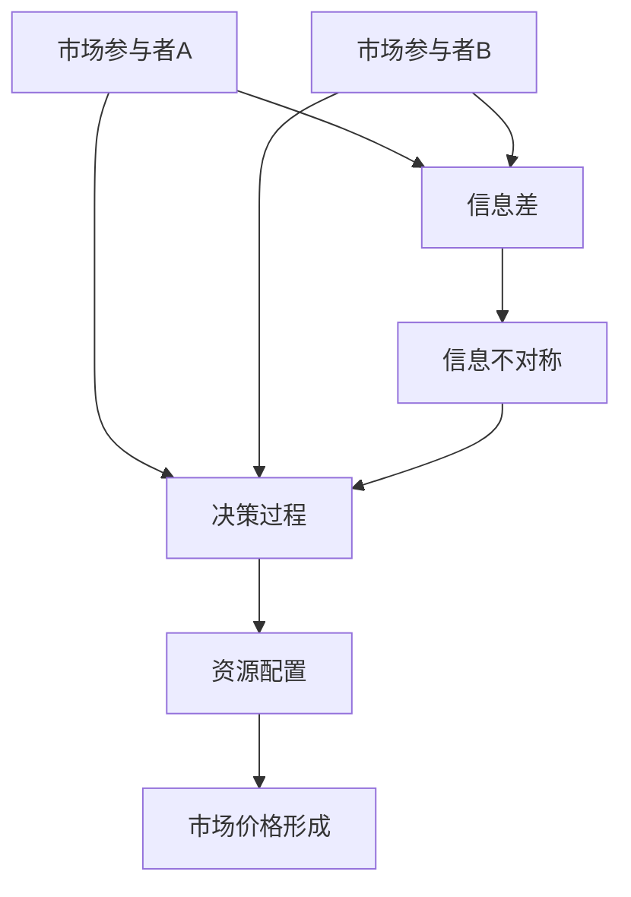

在上述流程图中，市场参与者A和B通过信息不对称进行决策。信息不对称（G）影响市场参与者（A和B）的决策过程（B），进而影响资源配置（C）和市场价格形成（D）。这个流程图有助于我们理解信息差在市场效率中的作用。

##### 3.2 信息差与市场失灵

市场失灵指的是市场在资源配置方面未能达到最佳效率状态。信息差是导致市场失灵的一个重要因素。以下是一些常见的市场失灵情况及其与信息差的关系：

1. **外部性**：外部性指的是市场活动对第三方的成本或收益。在信息不对称的情况下，市场参与者可能无法准确衡量外部成本或收益，导致市场失灵。例如，在环境污染问题上，企业可能不会考虑其生产活动对环境的负面影响，从而造成社会成本的增加。

2. **公共物品**：公共物品具有非排他性和非竞争性的特点，例如国防和公共卫生。在信息不对称的市场中，公共物品的供给可能不足，因为私人投资者无法获得足够的利润激励。例如，在疫苗研发中，由于信息不对称，私人企业可能不愿意投资高风险的疫苗项目，从而导致公共物品供给的不足。

3. **信息不对称导致的道德风险**：道德风险指的是市场参与者因信息不对称而采取不利于他人的行为。在金融市场中，信息不对称可能导致贷款方无法准确评估借款方的信用风险，从而导致信贷市场的失灵。例如，一些借款人可能隐瞒自己的真实财务状况，从而获得贷款，最终导致贷款违约。

4. **市场垄断**：在信息不对称的市场中，垄断企业可能利用其信息优势控制市场价格，限制市场竞争。例如，某些企业通过掌握市场信息垄断市场，从而提高价格和利润，损害消费者利益。

为了更详细地探讨市场失灵与信息差的关系，我们可以通过以下Mermaid流程图来展示信息不对称如何导致市场失灵：

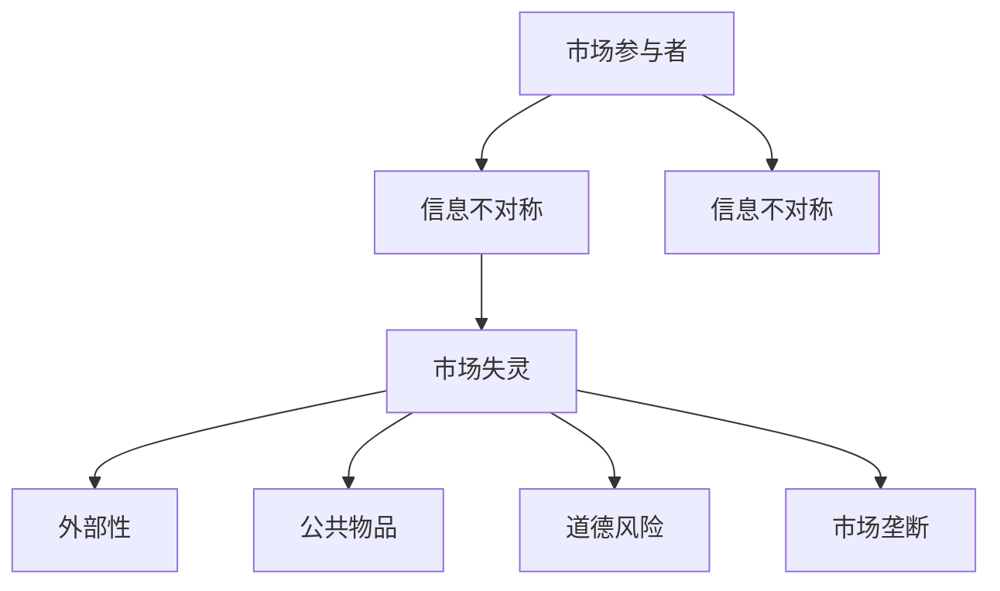

在上述流程图中，市场参与者（A）面临信息不对称（B），这种不对称性导致市场失灵（C）。市场失灵可能表现为外部性（D）、公共物品供给不足（E）、道德风险（F）和市场垄断（G）。这个流程图帮助我们理解信息差在市场失灵中的关键作用。

##### 3.3 提高市场效率的策略

为了提高市场效率，应对信息差带来的挑战，我们可以采取以下策略：

1. **增加信息透明度**：通过提高信息透明度，减少信息不对称。例如，在金融市场中，可以加强信息披露制度，使投资者能够获得更多关于企业运营和财务状况的信息。

2. **建立第三方评估机构**：第三方评估机构可以帮助市场参与者评估和验证信息，从而降低信息不对称。例如，在医疗市场中，第三方医疗机构可以对药品和医疗服务进行评估和认证。

3. **利用大数据和人工智能**：通过大数据和人工智能技术，可以更有效地分析和处理海量信息，帮助市场参与者做出更准确的决策。例如，在供应链管理中，通过数据分析可以优化库存和物流管理。

4. **加强法律法规和监管**：通过制定和执行相关法律法规，可以规范市场行为，减少信息不对称。例如，在金融市场中，可以通过监管措施确保企业披露真实和全面的信息。

5. **教育和培训**：提高公众的信息素养和技能，帮助他们更好地理解和利用信息。例如，在投资市场中，通过教育和培训提高投资者的风险意识和决策能力。

通过上述策略，我们可以有效地降低信息不对称，提高市场效率，促进经济健康发展。以下是一个Mermaid流程图，展示如何通过多种策略提高市场效率：

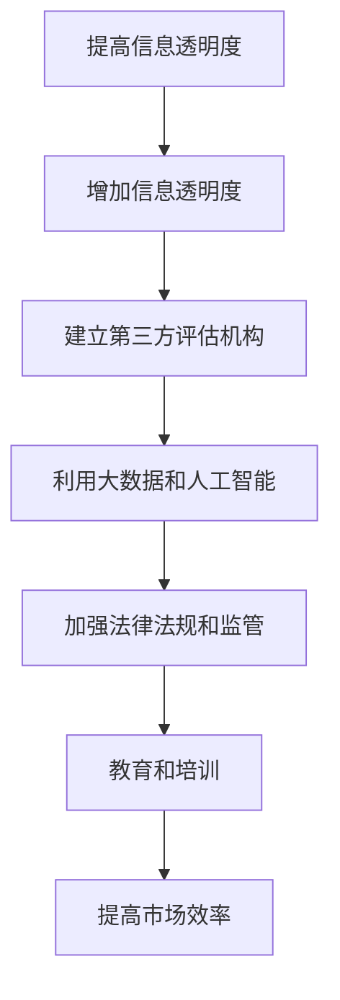

在上述流程图中，通过多种策略（A、B、C、D、E、F）提高市场效率（G），从而减少信息差带来的负面影响。

### 总结

信息差对市场效率有着深远的影响，既可能提高市场的决策准确性，也可能导致市场失灵。通过了解信息差的作用机制，我们可以采取有效的策略来减少信息不对称，提高市场效率，促进经济健康发展。

## 第三部分：信息差的利用与应对

### 第4章：信息差与市场收缩

#### 4.1 市场收缩的概念

市场收缩是指市场在一定时间内需求减少、市场规模缩小、参与者减少的现象。市场收缩可能是由于外部经济环境的变化、内部结构优化、技术创新、政策调整等多种因素引起的。信息差在这种背景下发挥着重要的作用，它不仅影响市场收缩的原因，也影响着市场收缩的影响和应对策略。

在技术层面上，市场收缩可以被定义为：

- **需求减少**：消费者或企业在特定市场中的购买意愿和购买能力下降。
- **市场规模缩小**：市场中参与者的数量减少，市场规模缩小。
- **参与者减少**：新进入者的减少和现有参与者的退出。

市场收缩通常表现为销售额下降、市场份额减少、行业竞争加剧等现象。其背后的信息差因素可能包括：

1. **信息获取障碍**：信息不对称导致潜在消费者无法充分了解市场信息，从而减少购买需求。
2. **信息传递滞后**：信息传播的延迟可能使得市场参与者无法及时响应市场变化，导致市场份额的流失。
3. **信息处理能力差异**：不同市场参与者对信息的处理能力不同，可能导致部分参与者无法有效利用市场信息，从而在竞争中处于劣势。

为了更直观地理解市场收缩与信息差的关系，我们可以通过以下Mermaid流程图来展示：

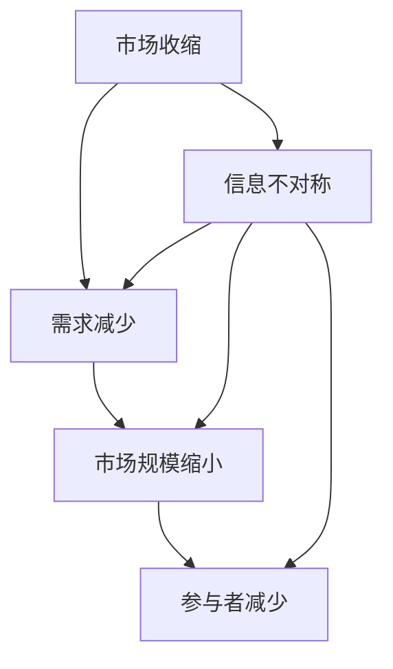

在上述流程图中，市场收缩（A）通过信息不对称（E）导致需求减少（B）、市场规模缩小（C）和参与者减少（D）。这个流程图帮助我们理解信息差在市场收缩中的关键作用。

#### 4.2 市场收缩的原因

市场收缩的原因多种多样，以下是几种常见的原因：

1. **宏观经济环境**：全球经济形势的变化，如经济衰退、通货膨胀等，会影响消费者的购买力，导致市场需求减少。

2. **技术变革**：技术创新可能导致现有产品的淘汰，从而减少市场需求。例如，智能手机的普及可能导致功能手机市场的收缩。

3. **政策调整**：政府政策的调整，如税收政策、贸易政策等，可能直接影响市场的供需关系，导致市场收缩。

4. **市场竞争**：激烈的市场竞争可能导致企业市场份额的减少，从而引发市场收缩。例如，新的竞争对手进入市场，可能迫使现有企业降低价格，减少利润，从而退出市场。

5. **消费者行为变化**：消费者偏好的变化，如环保意识的提升，可能导致某些产品需求减少。

6. **信息不对称**：市场参与者之间的信息不对称可能导致决策滞后，从而影响市场需求。例如，消费者对产品了解不足，可能导致购买意愿降低。

为了详细分析市场收缩的原因，我们可以通过以下Mermaid流程图展示这些因素及其相互关系：

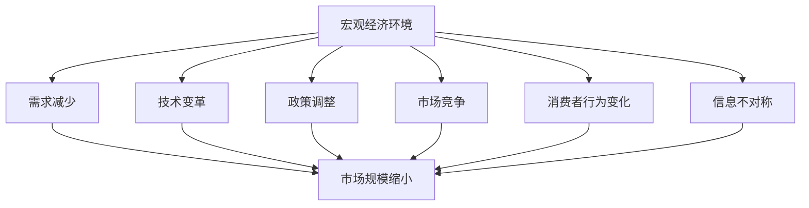

在上述流程图中，多种原因（A、B、C、D、E、F、G）共同导致市场收缩（H）。这个流程图有助于我们全面理解市场收缩的复杂性。

#### 4.3 市场收缩的影响

市场收缩对经济和市场参与者的影响是多方面的，主要包括以下几方面：

1. **企业利润下降**：市场收缩可能导致企业销售额下降，利润减少。在竞争激烈的市场环境中，企业可能被迫降低价格以吸引消费者，从而进一步压缩利润空间。

2. **市场份额重新分配**：市场收缩可能促使市场份额重新分配。拥有更强竞争力、能够有效应对市场变化的企业可能获得更多的市场份额，而竞争力较弱的企业则可能市场份额减少。

3. **行业整合加剧**：市场收缩可能导致行业内的企业数量减少，行业整合加剧。一些中小企业可能因为无法承受市场压力而退出市场，从而为大型企业创造更多的市场机会。

4. **创新动力减弱**：市场收缩可能降低企业的创新动力。在市场需求减少的情况下，企业可能减少对新产品和新技术的研发投入，从而导致行业整体创新能力的下降。

5. **就业压力增大**：市场收缩可能导致企业裁员，增加就业压力。在市场需求减少的情况下，企业可能减少生产规模，从而影响就业。

6. **消费者福利变化**：市场收缩可能导致消费者福利的变化。在市场竞争激烈的市场中，消费者可能享受到更低的价格和更好的产品；而在市场收缩的情况下，消费者可能面临产品选择减少和价格上涨的风险。

为了更全面地理解市场收缩的影响，我们可以通过以下Mermaid流程图来展示这些影响及其相互关系：

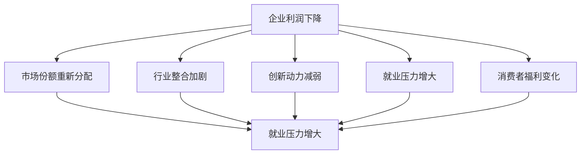

在上述流程图中，市场收缩（A）导致多种影响（B、C、D、E、F），这些影响相互关联，共同影响经济和市场参与者。这个流程图帮助我们理解市场收缩的广泛影响。

### 第5章：信息差的利用策略

#### 5.1 信息差的利用途径

在市场经济中，信息差的利用途径多种多样，以下是几种常见的利用方式：

1. **信息垄断**：信息垄断是指通过控制关键信息资源，限制其他市场参与者获取信息，从而获取市场优势。例如，某些企业通过掌握市场数据，限制竞争对手获取这些数据，从而在市场竞争中占据有利地位。

2. **信息隔离**：信息隔离是指通过控制信息的传播渠道，阻止信息在市场参与者之间的流动。例如，企业通过保密协议、非竞争条款等方式，限制员工或合作伙伴将信息泄露给竞争对手。

3. **信息筛选**：信息筛选是指通过筛选和选择信息，使其对自身有利。例如，企业在进行市场调研时，只关注对其有利的信息，而忽略不利的信息，从而误导市场决策。

4. **信息不对称交易**：信息不对称交易是指利用信息不对称进行交易，从而获取额外收益。例如，在金融市场中，掌握内部信息的交易者可以通过提前交易获得额外利润。

5. **信息不对称定价**：信息不对称定价是指通过利用信息不对称，设定对自身有利的价格。例如，在某些拍卖市场中，买家由于信息不对称，可能需要支付更高的价格。

为了更好地理解信息差的利用途径，我们可以通过以下Mermaid流程图来展示这些途径：

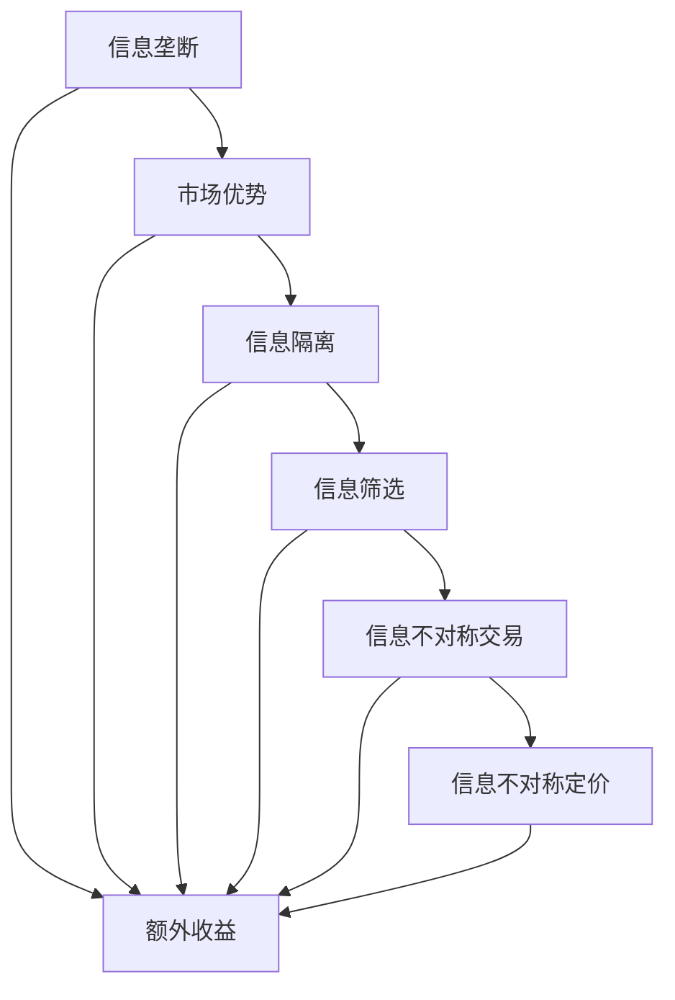

在上述流程图中，信息差的利用途径（A、B、C、D、E、F）通过获取市场优势（B）和额外收益（G），从而影响市场决策和竞争。这个流程图帮助我们理解信息差在市场中的利用策略。

#### 5.2 信息差的利用案例

信息差的利用在现实市场中广泛存在，以下是一些典型的案例：

1. **金融市场的内部交易**：金融市场的内部交易是指掌握内部信息的交易者利用信息不对称进行交易，从而获取额外利润。例如，某些金融机构的高级管理人员可能通过提前得知公司的财务报告，在市场公布之前进行交易，获得不正当利益。

2. **电商平台的个性化推荐**：电商平台通过收集用户行为数据，分析用户偏好，进行个性化推荐。这有助于电商平台更好地满足用户需求，提高用户黏性。然而，这也可能导致信息不对称，用户可能无法了解所有可能的选择，从而被平台引导。

3. **社交媒体的算法推送**：社交媒体平台通过算法分析用户的互动行为，推送符合用户兴趣的内容。这有助于增加用户活跃度和平台粘性，但同时也可能导致用户对信息来源的盲目信任，忽视信息真实性和可靠性。

4. **医疗行业的信息不对称**：在医疗行业中，医生和患者之间存在信息不对称。医生通常掌握更多医疗信息，而患者可能对疾病的了解有限。这种不对称性可能导致患者做出不理性的医疗决策，或者支付过高的医疗费用。

5. **保险行业的风险评估**：在保险行业中，保险公司通过风险评估来确定保险费率。然而，由于信息不对称，保险公司可能无法准确评估投保人的风险水平，导致保费过高或过低，影响保险市场的公平性。

为了更好地理解这些案例，我们可以通过以下Mermaid流程图来展示信息差的利用及其影响：

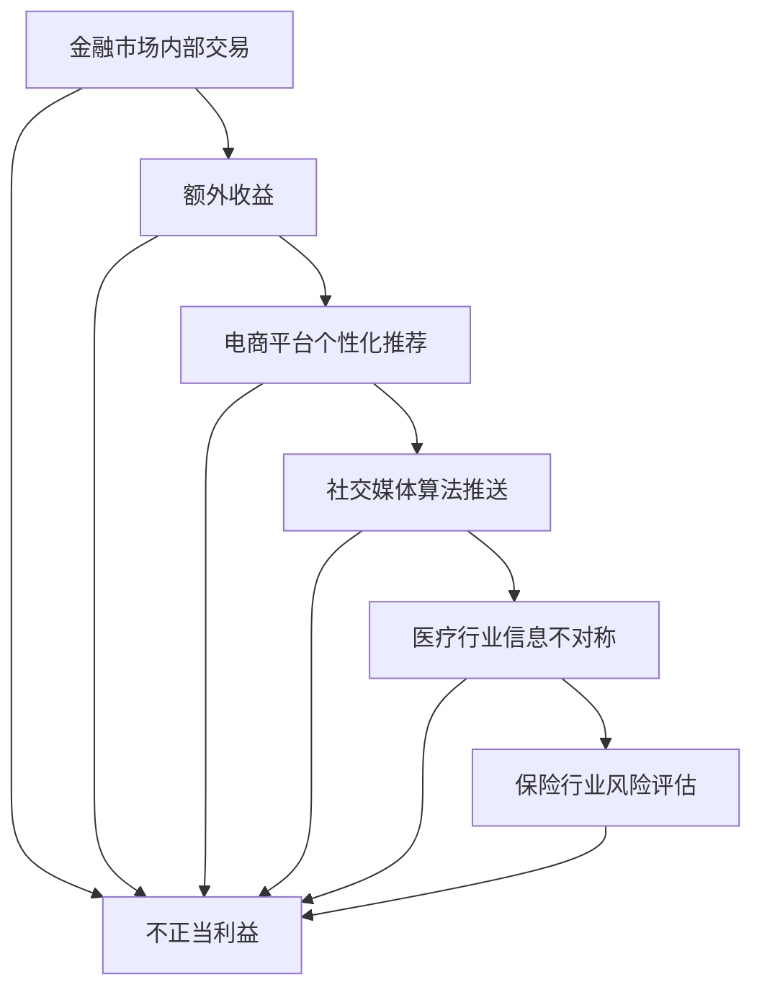

在上述流程图中，信息差的利用案例（A、B、C、D、E、F）通过获取额外收益（G），影响市场决策和竞争。这个流程图帮助我们理解信息差在实际市场中的广泛应用和影响。

#### 5.3 信息差的利用风险

虽然信息差的利用可以带来一定的利益，但同时也伴随着风险。以下是几种主要的信息差利用风险：

1. **法律风险**：信息垄断和内部交易等行为可能违反相关法律法规，导致法律诉讼和高额罚款。

2. **市场信任受损**：信息不对称交易和个性化推荐等行为可能导致市场参与者对平台或企业失去信任，影响市场声誉和长远发展。

3. **信息滥用**：信息筛选和信息隔离可能导致信息滥用，例如，企业通过不当手段获取和利用用户数据，侵犯用户隐私。

4. **决策失误**：信息不对称可能导致市场参与者做出不理性的决策，从而影响企业的经营和发展。

5. **监管挑战**：随着信息差的利用日益普遍，监管机构面临更大的挑战，需要制定和执行更严格的监管政策。

为了更好地理解信息差的利用风险，我们可以通过以下Mermaid流程图来展示这些风险：

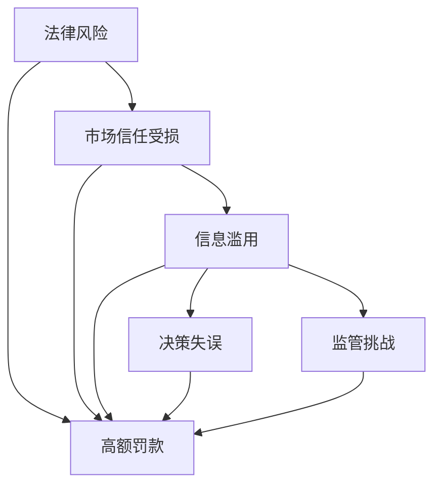

在上述流程图中，信息差的利用风险（A、B、C、D、E）可能导致多种负面后果（F），影响市场参与者和企业的长远发展。这个流程图帮助我们认识到信息差利用中潜在的风险和挑战。

### 第6章：应对信息差的方法

#### 6.1 企业如何应对信息差

在信息不对称的环境中，企业需要采取多种策略来应对信息差，以确保其竞争力和可持续发展。以下是几种常见的方法：

1. **提升信息透明度**：企业可以通过增加信息透明度来减少信息不对称。例如，定期发布财务报告、市场分析报告和产品信息，让客户和投资者更好地了解企业的运营状况和未来发展方向。

2. **建立信息共享机制**：企业可以建立内部信息共享机制，确保不同部门和团队之间的信息流动。通过共享市场动态、客户需求和竞争对手信息，企业可以更好地做出决策。

3. **投资于数据分析和人工智能**：通过投资于数据分析和人工智能技术，企业可以更有效地处理和分析海量信息，从而做出更准确的决策。例如，利用数据分析技术预测市场趋势和消费者需求。

4. **建立外部合作关系**：与行业内的其他企业建立合作关系，共享资源和信息，有助于企业获取更多市场信息，提高竞争力。

5. **加强法律法规和合规管理**：企业需要遵守相关法律法规，确保其信息收集、处理和使用符合法律法规的要求。通过合规管理，企业可以降低法律风险，提高市场信任度。

6. **提升员工信息素养**：通过培训和提高员工的信息素养，企业可以培养出一支能够有效利用信息的人才队伍，从而在市场竞争中占据优势。

为了详细说明企业应对信息差的策略，我们可以通过以下Mermaid流程图来展示：

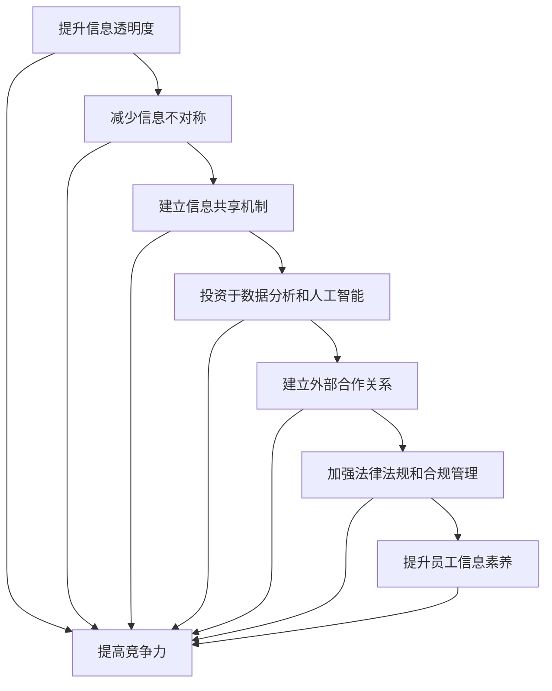

在上述流程图中，企业通过多种策略（A、B、C、D、E、F、G）来减少信息不对称（B），从而提高竞争力（H）。这个流程图帮助企业更好地应对信息差的挑战。

#### 6.2 个人如何应对信息差

在信息不对称的环境中，个人也需要采取策略来应对信息差，确保自身在职业和生活中的竞争力。以下是几种常见的应对方法：

1. **增强信息获取能力**：个人可以通过学习新技能、阅读专业书籍和参与行业研讨会等方式，增强自己的信息获取能力。例如，学习数据分析、编程和金融知识，可以帮助个人更好地理解市场和行业动态。

2. **培养信息处理能力**：个人需要培养信息处理能力，学会筛选和整理信息，从海量信息中提取有价值的内容。例如，通过学习批判性思维和信息过滤技巧，个人可以更有效地处理信息。

3. **建立人际网络**：通过建立广泛的人际网络，个人可以获取更多的市场信息和行业动态。与行业内的人建立联系，参与行业协会和社群，有助于个人获取更多信息。

4. **利用在线资源**：利用在线资源，如专业网站、论坛和在线课程，个人可以方便地获取最新的行业信息和知识。例如，通过参加在线课程，个人可以系统地学习某个领域的专业知识。

5. **保持持续学习**：在快速变化的信息时代，个人需要保持持续学习的态度。通过不断学习和更新知识，个人可以适应市场变化，提高竞争力。

6. **注意信息真实性**：在获取信息时，个人需要特别注意信息的真实性和可靠性。避免盲目信任信息来源，通过多渠道验证信息，确保获取的信息是真实可信的。

为了更全面地说明个人应对信息差的方法，我们可以通过以下Mermaid流程图来展示：

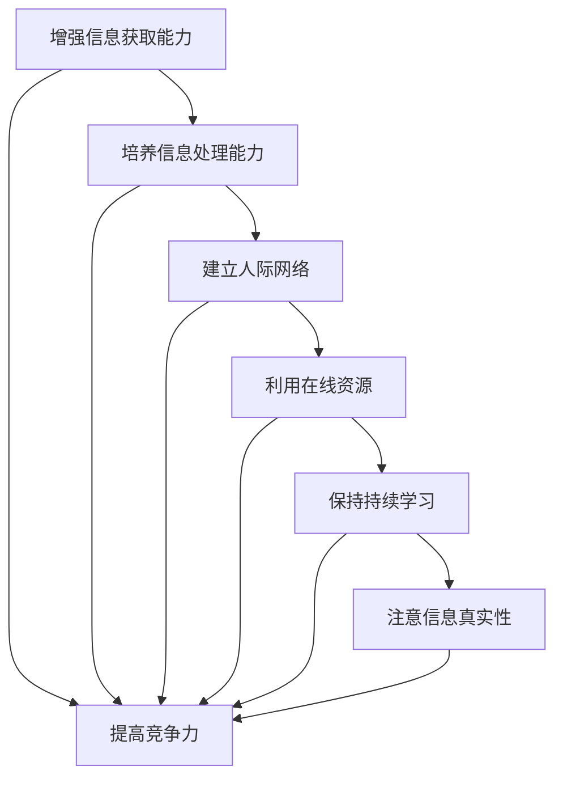

在上述流程图中，个人通过多种策略（A、B、C、D、E、F）来应对信息差（G），从而提高竞争力（G）。这个流程图帮助个人更好地应对信息不对称的挑战。

#### 6.3 政府如何应对信息差

政府在应对信息差方面扮演着重要角色，可以通过以下策略来减少信息不对称，促进市场和社会的公平与透明：

1. **制定法律法规**：政府可以制定和执行相关法律法规，规范市场行为，减少信息不对称。例如，通过制定数据保护法，确保个人隐私和数据安全。

2. **加强监管**：政府需要加强对市场行为的监管，打击信息垄断和不当信息利用行为。通过设立专门的监管机构，确保市场公平竞争。

3. **提供公共服务**：政府可以提供公共服务，如市场分析报告、行业统计数据和消费者权益保护信息，帮助市场参与者更好地了解市场和行业动态。

4. **投资于信息技术**：政府可以通过投资于信息技术，提升公共信息系统的建设，促进信息的透明和流通。例如，通过建立全国性的数据共享平台，方便政府机构、企业和个人获取相关信息。

5. **推动教育和培训**：政府可以推动教育和培训，提高公众的信息素养和技能，帮助更多人理解和利用信息，减少信息不对称。

6. **支持技术创新**：政府可以通过支持技术创新，推动信息技术的发展，提高信息获取和处理能力。例如，通过资助研发项目，支持大数据、人工智能等新兴技术的研究和应用。

为了更好地展示政府应对信息差的策略，我们可以通过以下Mermaid流程图来展示：

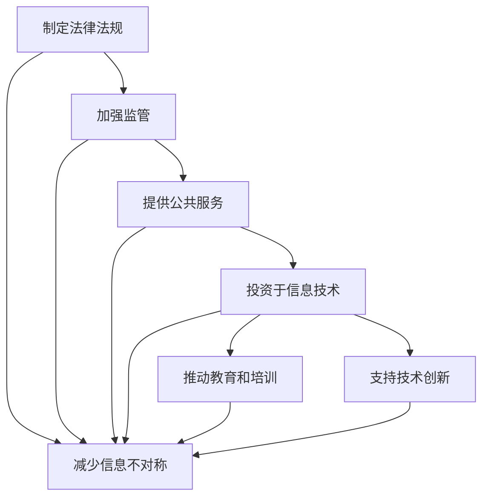

在上述流程图中，政府通过多种策略（A、B、C、D、E、F）来减少信息不对称（G），促进市场和社会的公平与透明。这个流程图帮助政府更好地应对信息差的挑战。

### 第7章：信息差的未来趋势

#### 7.1 信息技术的发展与信息差

随着信息技术的快速发展，信息差现象也在不断演变。以下是一些信息技术的发展如何影响信息差的方面：

1. **大数据和人工智能**：大数据和人工智能技术的进步使得海量数据的处理和分析变得更加高效，从而提高了信息的获取和处理能力。这有助于缩小信息差，但同时也可能加剧某些领域的信息不对称，例如，掌握先进技术的企业和个人可能在信息获取和利用上占据更大优势。

2. **互联网和社交媒体**：互联网和社交媒体的普及使得信息传播速度大大加快，信息透明度提高。然而，这也导致了信息过载和噪声，使得有效信息获取变得更加困难。

3. **区块链技术**：区块链技术通过去中心化和不可篡改的特性，提供了一种新的信息共享方式。这有助于减少信息不对称，提高信息的透明度和可信度。

4. **物联网**：物联网技术通过连接各种设备和传感器，实现了实时数据采集和传输。这有助于实时监控和管理市场动态，减少信息滞后性。

为了更好地理解信息技术对信息差的影响，我们可以通过以下Mermaid流程图来展示：

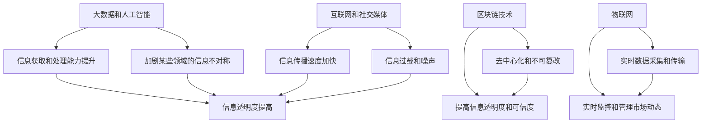

在上述流程图中，信息技术的发展（A、E、H、K）对信息差（D）产生了多种影响，包括信息获取和处理能力的提升（B）、信息透明度的提高（D）、信息不对称的加剧（C）以及实时数据监控和管理（M）。这个流程图帮助我们理解信息技术在信息差中的重要作用。

#### 7.2 信息差对经济的影响

信息差对经济的影响是深远且多方面的。以下是一些关键影响：

1. **资源配置效率**：信息差可能降低资源配置效率。在信息不对称的情况下，市场参与者无法充分了解市场信息和需求，导致资源配置不合理，资源浪费。

2. **市场公平性**：信息差可能导致市场不公平。掌握更多信息的个体或组织可能在竞争中占据优势，而信息匮乏的个体则处于劣势，加剧社会不平等。

3. **创新动力**：信息差可能影响创新动力。掌握信息优势的企业或个人可能不愿意分享其创新成果，导致整体创新速度放缓。

4. **经济增长**：信息差对经济增长具有双重影响。一方面，通过有效的信息利用，信息优势可以促进经济增长；另一方面，信息不对称可能导致资源错配和效率低下，从而抑制经济增长。

5. **全球经济不平衡**：信息差可能导致全球经济不平衡。发达国家和发展中国家在信息技术和信息获取能力上存在显著差异，这可能导致全球资源分配不均。

为了更详细地探讨信息差对经济的影响，我们可以通过以下Mermaid流程图来展示：

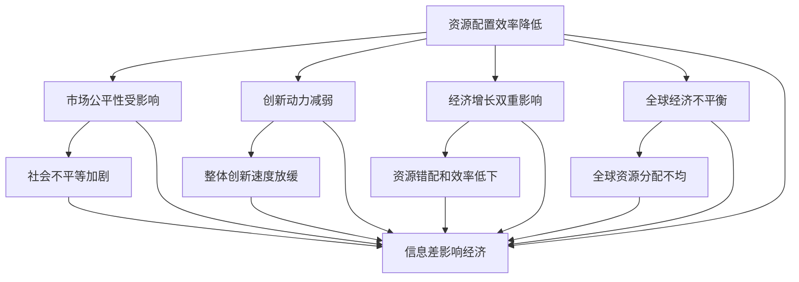

在上述流程图中，信息差（A）对经济产生了多种影响（B、C、D、E、F、G、H、I），这些影响共同构成了信息差对经济的综合影响（J）。这个流程图帮助我们理解信息差在经济发展中的复杂作用。

#### 7.3 信息差的未来展望

随着信息技术的不断进步，信息差在未来可能会呈现出以下趋势：

1. **信息差的进一步扩大**：虽然信息技术的发展有助于缩小信息差，但某些领域的技术优势可能导致信息差的进一步扩大。例如，先进技术领域的领先企业可能在信息获取和处理上占据绝对优势。

2. **信息共享和透明的提升**：随着区块链和物联网技术的发展，信息共享和透明的程度将不断提高，有助于减少信息不对称。

3. **个性化信息服务**：随着人工智能和大数据技术的应用，个性化信息服务将更加普及。这有助于提高市场参与者获取有效信息的效率，但同时也可能导致某些群体在信息获取上处于劣势。

4. **信息素养的重要性增加**：在信息时代，信息素养的重要性将逐渐增加。具备高信息素养的个人和企业在市场竞争中将更具优势。

5. **信息差的治理和监管加强**：随着信息差的日益显著，政府和监管机构将加强对信息差的治理和监管，以确保市场公平和透明。

6. **信息差的跨领域融合**：信息差将在不同领域之间产生融合，例如，金融科技、医疗科技和交通科技等领域的信息差将相互影响，推动行业变革。

为了详细展示信息差的未来趋势，我们可以通过以下Mermaid流程图来展示：

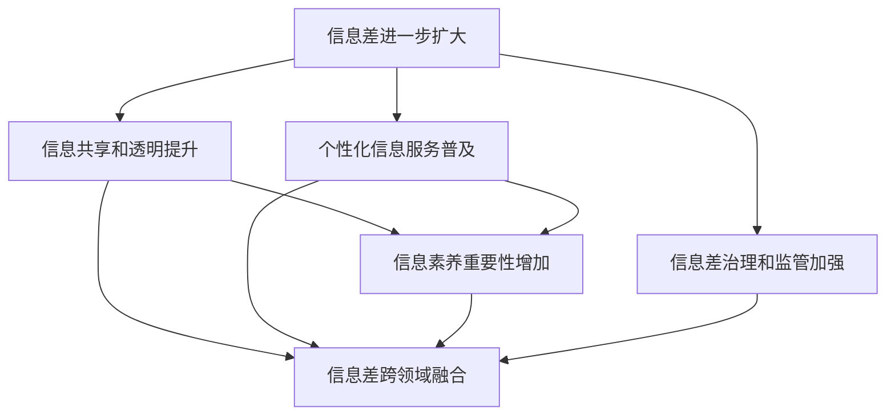

在上述流程图中，信息差的未来趋势（A、B、C、D、E、F）展示了信息技术进步对信息差的多方面影响。这个流程图帮助我们展望信息差在未来可能的发展方向。

### 总结

信息差作为市场经济中的重要现象，其影响深远而复杂。通过本文的详细分析，我们不仅了解了信息差的定义、作用和分类，还探讨了信息差与市场效率、市场收缩以及应对策略的关系。随着信息技术的不断发展，信息差现象将继续演变，我们需要持续关注并应对其带来的挑战和机遇。通过提升信息素养、加强信息透明度和有效监管，我们可以更好地利用信息差，促进经济和社会的可持续发展。

## 附录

### 附录A：信息差相关术语与概念

以下是一些与信息差相关的术语和概念：

- **信息不对称**：指不同个体或群体之间在信息获取、处理和利用方面的差异。
- **市场透明度**：指市场信息对参与者可获取的程度和透明度。
- **信息垄断**：指掌握关键信息资源的个体或组织限制他人获取信息。
- **信息过滤**：指通过筛选和选择信息，使其符合特定需求和偏好。
- **市场失灵**：指市场在资源配置方面未能达到最优效率状态。
- **信息共享**：指不同个体或组织之间交换和共享信息资源。
- **信息不对称交易**：指利用信息不对称进行的交易，以获取额外收益。
- **数据隐私**：指保护个人或组织数据不被未授权访问和使用。

### 附录B：信息差案例分析

以下是一些典型的信息差案例分析：

1. **金融市场的内部交易**：某些金融机构的高级管理人员利用内部信息进行提前交易，获得不正当利益。这种内部交易行为违反了相关法律法规，但某些情况下仍然存在。
2. **电商平台的个性化推荐**：电商平台通过收集用户行为数据，进行个性化推荐，提高用户黏性和购买转化率。然而，这也可能导致用户对其他选择的无知。
3. **医疗行业的信息不对称**：医生通常掌握更多医疗信息，而患者可能对疾病的了解有限。这种不对称性可能导致患者做出不理性的医疗决策。
4. **保险行业的信息不对称**：保险公司通过风险评估确定保费，但由于信息不对称，可能无法准确评估投保人的风险水平，导致保费过高或过低。

### 附录C：信息差研究方法与工具

以下是一些用于研究信息差的方法和工具：

- **问卷调查**：通过设计问卷，收集市场参与者对信息差的认知和应对策略。
- **数据分析**：利用数据分析技术，处理和解读大量市场数据，以揭示信息差的规律和趋势。
- **案例研究**：通过对具体案例的深入研究，分析信息差在特定行业或市场中的影响和应对策略。
- **实验研究**：通过设计和实施实验，验证不同策略在减少信息差和提高市场效率方面的效果。
- **大数据分析**：利用大数据技术，对海量市场数据进行分析，以揭示信息不对称的现象和影响。

### 附录D：信息差相关资源与推荐阅读

以下是一些关于信息差的相关资源和推荐阅读：

1. **书籍**：
   - 《信息不对称经济学》：作者：乔治·阿克洛夫（George A. Akerlof）等。
   - 《信息与市场》：作者：斯蒂芬·霍布斯（Stephen J. Hobson）。
   - 《区块链技术指南》：作者：安德鲁·米尔斯（Andrew M. Mills）。

2. **论文**：
   - “Asymmetric Information, Market Failure, and Economic Growth”：作者：乔治·阿克洛夫（George A. Akerlof）。
   - “Information, Trade and Development”：作者：斯蒂芬·霍布斯（Stephen J. Hobson）。

3. **在线资源**：
   - Coursera：信息经济学课程。
   - EdX：大数据分析与应用课程。
   - MIT OpenCourseWare：计算机科学和人工智能课程。

4. **专业网站**：
   - Economic Policy Institute：提供关于信息不对称和经济政策的研究报告。
   - IEEE Xplore：提供关于信息技术的最新研究成果和论文。

通过阅读这些资源和书籍，读者可以进一步深入了解信息差的相关理论和实践，为应对信息差带来的挑战提供有力支持。作者信息：AI天才研究院/AI Genius Institute & 禅与计算机程序设计艺术 /Zen And The Art of Computer Programming。

