                 

## 文章标题

### 信息差：信息不对称与市场退出门槛

#### 关键词：信息不对称，市场效率，市场失灵，市场门槛，消费者市场，企业市场，金融市场

> 摘要：本文从信息不对称的基本概念出发，详细分析了信息不对称对市场效率、消费者市场和企业市场的影响。通过对市场门槛、市场退出机制的研究，探讨了如何优化市场门槛以减少信息不对称，提高市场效率。文章旨在为读者提供对信息不对称与市场退出门槛的深入理解，为实际应用提供理论指导。

----------------------------------------------------------------

### 引言

信息不对称（Information Asymmetry）是指交易双方在信息获取和掌握上的不平等。这一现象在各个市场和领域中都普遍存在，对市场效率和资源配置产生深远影响。信息不对称可分为垂直信息不对称和水平信息不对称，前者主要指交易双方之间存在信息差异，后者则指同一市场中的信息差异。信息不对称可能导致市场失灵、价格扭曲、决策失误等问题。

本文旨在探讨信息不对称的基本概念、市场影响及其解决策略。首先，我们将深入探讨信息不对称的理论基础，包括预期效用理论、博弈论和信息经济学模型。接着，本文将分析信息不对称在消费者市场、企业市场和金融市场中的应用，并探讨市场退出的概念与机制。最后，我们将提出市场门槛的优化策略，以减少信息不对称，提高市场效率。

本文结构如下：

1. **第一部分：信息不对称的概念与理论**
   - **第1章：信息不对称的基本概念**
     - 1.1 什么是信息不对称
     - 1.2 信息不对称的分类
     - 1.3 信息不对称的影响
   - **第2章：信息不对称的市场分析**
     - 2.1 信息不对称对市场效率的影响
     - 2.2 信息不对称与市场失灵
     - 2.3 信息不对称的市场策略

2. **第二部分：信息不对称在不同市场中的应用**
   - **第3章：信息不对称的经济学原理**
     - 3.1 预期效用理论与信息不对称
     - 3.2 博弈论与信息不对称
     - 3.3 信息经济学的基本模型
   - **第4章：消费者市场中的信息不对称**
     - 4.1 消费者信息不对称的表现
     - 4.2 消费者信息不对称的解决方法
     - 4.3 消费者市场信息不对称的案例分析
   - **第5章：企业市场中的信息不对称**
     - 5.1 企业信息不对称的现象
     - 5.2 企业信息不对称的影响
     - 5.3 企业信息不对称的管理策略
   - **第6章：金融市场中的信息不对称**
     - 6.1 金融市场的信息不对称问题
     - 6.2 金融市场的信息不对称解决机制
     - 6.3 金融市场中信息不对称的案例分析

3. **第三部分：信息不对称的市场退出与门槛**
   - **第7章：市场退出的概念与机制**
     - 7.1 市场退出的定义
     - 7.2 市场退出的类型
     - 7.3 市场退出的决策分析
   - **第8章：市场门槛与信息不对称**
     - 8.1 市场门槛的概念
     - 8.2 市场门槛的类型
     - 8.3 市场门槛与信息不对称的关系
   - **第9章：市场门槛的优化策略**
     - 9.1 市场门槛优化的目的
     - 9.2 市场门槛优化的方法
     - 9.3 市场门槛优化的案例分析

本文将通过逐步推理和分析，深入探讨信息不对称与市场退出门槛的理论和实践，为读者提供全面的视角和实用的策略。

----------------------------------------------------------------

### 第一部分：信息不对称的概念与理论

#### 第1章：信息不对称的基本概念

##### 1.1 什么是信息不对称

信息不对称是指市场参与者之间在信息获取和掌握上的不平等。这一现象在经济学、管理学、金融学等多个领域中都有广泛的应用。在市场中，信息不对称可能导致市场失灵、价格扭曲、决策失误等问题。

信息不对称可以分为以下几类：

1. **垂直信息不对称**：交易双方之间存在信息差异，通常由市场结构、监管环境等因素导致。例如，在二手汽车市场中，卖家通常比买家更了解汽车的状况。

2. **水平信息不对称**：同一市场中的参与者之间存在信息差异，但双方都不了解对方的真实信息。例如，在劳动力市场中，雇主和求职者都可能不了解对方的真实情况。

3. **逆向选择**：指市场中的低质量商品或服务倾向于驱逐高质量商品或服务，导致市场效率降低。

4. **道德风险**：指信息优势方可能采取不利于信息劣势方的行为，从而损害市场效率。

#### 核心概念与联系

信息不对称的核心概念包括：

- **信息不对称度**：衡量市场参与者之间信息差异的程度。
- **市场效率**：市场在资源配置中的有效性。
- **市场失灵**：市场无法实现资源的最优配置。

信息不对称与市场效率、市场失灵之间存在紧密联系：

- **市场效率**：信息不对称可能导致市场效率降低，因为交易双方无法做出最优决策。
- **市场失灵**：信息不对称可能导致市场失灵，即市场无法实现资源的最优配置。
- **价格机制**：在信息不对称的市场中，价格机制可能无法发挥正常作用。

##### Mermaid 流程图

mermaid
graph TD
A[市场效率] --> B[交易决策]
A --> C[市场失灵]
B --> D[价格扭曲]
C --> D
B --> E[资源分配不当]
E --> F[市场效率降低]

##### 1.2 信息不对称的分类

信息不对称可以根据不同维度进行分类。以下是一些常见的分类方式：

1. **基于信息来源的分类**：

   - **公开信息不对称**：市场参与者可以获取的信息不对称。
   - **私有信息不对称**：市场参与者无法获取的信息不对称。

2. **基于信息量的分类**：

   - **完全信息不对称**：市场参与者之间的信息完全不同。
   - **部分信息不对称**：市场参与者之间的信息部分不同。

3. **基于信息传递的分类**：

   - **单向信息不对称**：信息只能从一个方向传递。
   - **双向信息不对称**：信息可以在两个方向传递，但存在差异。

#### 核心概念与联系

- **公开信息不对称**：指市场中的信息透明度不足，导致部分参与者无法获取关键信息。
- **私有信息不对称**：指市场参与者拥有私有信息，而其他参与者无法获取。

##### Mermaid 流程图

mermaid
graph TD
A[公开信息不对称] --> B[市场透明度不足]
A --> C[私有信息不对称]
B --> D[信息不透明]
C --> D

##### 1.3 信息不对称的影响

信息不对称对市场效率、消费者决策、企业竞争等方面产生深远影响：

- **市场效率降低**：信息不对称可能导致市场效率降低，因为交易双方无法做出最优决策。
- **价格扭曲**：信息不对称可能导致商品或服务的价格与实际价值不符。
- **决策失误**：缺乏信息的一方可能做出不理性的决策。

##### 核心概念与联系

- **市场效率**：信息不对称会影响市场的资源配置效率。
- **价格机制**：信息不对称可能导致价格机制失灵。
- **消费者决策**：消费者在信息不对称的市场中可能做出不理性的消费决策。

##### Mermaid 流程图

mermaid
graph TD
A[市场效率降低] --> B[价格扭曲]
A --> C[决策失误]
B --> D[资源配置不当]
C --> E[消费者决策不理性]
E --> F[市场效率降低]

通过以上分析，我们可以看到信息不对称的基本概念、分类以及其对市场的影响。接下来，我们将进一步探讨信息不对称在具体市场中的应用。

----------------------------------------------------------------

#### 第2章：信息不对称的市场分析

##### 2.1 信息不对称对市场效率的影响

信息不对称是市场失灵的一个重要原因，它对市场效率产生显著影响。市场效率是指市场在资源分配和价格形成过程中实现有效配置的能力。信息不对称导致市场效率降低的主要机制包括：

1. **交易成本增加**：信息不对称使得市场参与者必须花费更多的时间和资源去收集和分析信息，从而增加了交易成本。这可能导致市场参与者的积极性降低，交易频率减少，最终降低市场效率。

2. **价格扭曲**：信息不对称使得市场价格无法准确反映商品或服务的实际价值。例如，在二手车市场中，卖家可能比买家更了解车辆的真实状况，这可能导致买家支付的价格高于车辆的实际价值。

3. **道德风险**：信息不对称使得市场一方可能采取不利于另一方的行为。例如，在保险市场中，投保人可能隐瞒自己的风险状况，导致保险公司承担更高的风险，从而提高保费。

4. **逆向选择**：信息不对称可能导致低质量商品或服务驱逐高质量商品或服务，进一步降低市场效率。例如，在劳动力市场中，雇主可能无法准确评估求职者的实际能力，从而更倾向于雇佣那些表现出更好能力的求职者，即使这些求职者的实际能力可能较差。

##### 核心概念与联系

- **市场效率**：市场效率是指市场在资源分配和价格形成过程中实现有效配置的能力。
- **交易成本**：交易成本是指市场参与者进行交易所需支付的成本。
- **价格扭曲**：价格扭曲是指市场价格与商品或服务的实际价值不符。

##### Mermaid 流程图

mermaid
graph TD
A[市场效率] --> B[交易成本增加]
A --> C[价格扭曲]
A --> D[道德风险]
A --> E[逆向选择]
B --> F[资源分配不当]
C --> G[价格不符实际]
D --> H[保险公司风险增加]
E --> I[低质量商品驱逐高质量商品]
F --> G
H --> I

##### 2.2 信息不对称与市场失灵

市场失灵是指市场无法实现资源的最优配置。信息不对称是市场失灵的一个重要原因。以下是一些主要的市场失灵现象：

1. **外部效应**：外部效应是指市场交易对第三方产生的负面影响，而这些影响并没有反映在市场价格中。例如，空气污染就是一种负外部效应，它对公共健康和环境产生了负面影响，但并没有在市场价格中得到体现。

2. **市场垄断**：市场垄断是指市场中的主导企业通过控制市场信息，限制竞争，从而实现利润最大化。这种市场结构可能导致市场效率降低，消费者利益受损。

3. **公共物品**：公共物品是指那些非排他性和非竞争性的商品或服务。由于市场无法有效提供公共物品，因此需要政府或其他公共机构介入。例如，国防和公共卫生就是典型的公共物品。

4. **信息不对称导致的逆向选择和道德风险**：如前所述，信息不对称可能导致市场参与者采取不利于他人的行为，从而降低市场效率。

##### 核心概念与联系

- **外部效应**：外部效应是指市场交易对第三方产生的负面影响。
- **市场垄断**：市场垄断是指市场中的主导企业通过控制市场信息，限制竞争。
- **公共物品**：公共物品是指那些非排他性和非竞争性的商品或服务。

##### Mermaid 流程图

mermaid
graph TD
A[外部效应] --> B[市场失灵]
A --> C[环境损害]
B --> D[健康风险]
C --> D

E[市场垄断] --> F[市场失灵]
E --> G[限制竞争]
F --> H[利润最大化]
G --> H

I[公共物品] --> J[市场失灵]
I --> K[政府介入]
J --> L[资源浪费]
K --> L

##### 2.3 信息不对称的市场策略

为了缓解信息不对称带来的市场失灵，市场参与者可以采取以下策略：

1. **信息披露**：提高市场信息的透明度，减少信息不对称。例如，企业可以通过公开财务报表和产品信息，提高市场的透明度。

2. **第三方认证**：通过第三方认证机构对商品或服务进行认证，提高信息可信度。例如，ISO认证就是一种常见的第三方认证。

3. **市场监管**：政府可以通过制定法律法规，加强对市场的监管，减少信息不对称。例如，反垄断法就是通过限制市场垄断行为，提高市场效率。

4. **激励机制**：设计激励机制，鼓励市场参与者提供真实信息。例如，在保险市场中，可以设计激励计划，鼓励投保人提供真实的风险状况。

##### 核心概念与联系

- **信息披露**：提高市场信息的透明度，减少信息不对称。
- **第三方认证**：通过第三方认证机构对商品或服务进行认证。
- **市场监管**：政府通过制定法律法规，加强对市场的监管。
- **激励机制**：设计激励机制，鼓励市场参与者提供真实信息。

##### Mermaid 流程图

mermaid
graph TD
A[信息披露] --> B[减少信息不对称]
A --> C[提高市场透明度]
B --> D[增加信息可信度]

E[第三方认证] --> F[提高信息可信度]
E --> G[认证机构]

H[市场监管] --> I[减少信息不对称]
H --> J[法律法规]
I --> K[市场监督]

L[激励机制] --> M[鼓励提供真实信息]
L --> N[激励计划]

通过以上分析，我们可以看到信息不对称对市场效率的影响以及相应的市场策略。在下一章中，我们将进一步探讨信息不对称在消费者市场和企业市场中的应用。

----------------------------------------------------------------

## 第3章：信息不对称的经济学原理

### 3.1 预期效用理论与信息不对称

预期效用理论（Expected Utility Theory）是经济学中用于分析个体决策行为的基本框架。在预期效用理论中，个体的决策是基于对各种可能结果的效用进行加权平均。然而，当存在信息不对称时，预期效用理论的应用会受到影响，因为个体无法准确了解所有可能的结果和其概率。

#### 核心概念与联系

- **预期效用**：个体在决策时对各种可能结果的效用进行加权平均。
- **不确定性**：在信息不对称的情况下，个体面临不确定性，无法准确预测未来结果。

##### 伪代码

```python
# 预期效用计算伪代码

def expected_utility(outcomes, probabilities):
    utility = 0
    for outcome, probability in zip(outcomes, probabilities):
        utility += probability * outcome
    return utility
```

#### 核心算法原理讲解

预期效用理论的计算过程可以简化为以下步骤：

1. **确定所有可能的结果和其概率**：在信息不对称的情况下，个体可能无法准确了解所有可能的结果和其概率。
2. **计算每个结果的效用**：对于每个可能的结果，个体需要评估其效用。
3. **计算预期效用**：将每个结果的效用与其概率相乘，并求和得到预期效用。

##### 数学模型和公式

预期效用理论的数学模型可以表示为：

$$
\text{EU} = \sum_{i=1}^{n} p_i \cdot u_i
$$

其中，\( \text{EU} \) 是预期效用，\( p_i \) 是第 \( i \) 个结果的概率，\( u_i \) 是第 \( i \) 个结果的效用。

##### 举例说明

假设一个消费者在购买一辆二手车时面临两种可能的结果：高质量车辆和低质量车辆。消费者对高质量车辆的效用为 100，对低质量车辆的效用为 -50。根据市场信息，消费者估计购买高质量车辆的概率为 0.6，购买低质量车辆的概率为 0.4。

```latex
\text{EU} = (0.6 \cdot 100) + (0.4 \cdot (-50)) = 60 - 20 = 40
```

因此，消费者的预期效用为 40。

##### 贝叶斯更新与信息不对称

贝叶斯更新（Bayesian Updating）是一种用于在信息不对称情况下更新概率估计的方法。贝叶斯更新基于新的证据来修正先验概率，从而得到更准确的概率估计。

#### 核心概念与联系

- **先验概率**：在获得新证据之前，基于已有信息估计的概率。
- **后验概率**：在获得新证据之后，基于先验概率和新的证据估计的概率。

##### 伪代码

```python
# 贝叶斯更新伪代码

def bayesian_update(prior, likelihood, evidence):
    posterior = (prior * likelihood) / evidence
    return posterior
```

#### 核心算法原理讲解

贝叶斯更新的计算过程可以简化为以下步骤：

1. **确定先验概率**：在获得新证据之前，根据已有信息估计的概率。
2. **确定似然函数**：基于新证据，计算每个结果的概率。
3. **计算后验概率**：将先验概率与似然函数相乘，并求和得到后验概率。

##### 数学模型和公式

贝叶斯更新的数学模型可以表示为：

$$
\text{Posterior} = \frac{\text{Prior} \cdot \text{Likelihood}}{\text{Evidence}}
$$

其中，\( \text{Posterior} \) 是后验概率，\( \text{Prior} \) 是先验概率，\( \text{Likelihood} \) 是似然函数，\( \text{Evidence} \) 是证据概率。

##### 举例说明

假设一个投资者在投资股票时，根据历史数据估计某只股票上涨的概率为 0.6。某天，投资者得知一只关键产品的市场调研结果，估计该产品成功的概率为 0.8。基于这些信息，投资者使用贝叶斯更新来更新股票上涨的概率。

```latex
\text{Posterior} = \frac{0.6 \cdot 0.8}{0.6 + (1 - 0.6) \cdot 0.2} = \frac{0.48}{0.64} = 0.75
```

因此，投资者更新后的股票上涨概率为 0.75。

### 3.2 博弈论与信息不对称

博弈论（Game Theory）是研究具有竞争性的决策制定过程的数学理论。在博弈论中，信息不对称是影响决策的重要因素。信息不对称可能导致博弈模型中的策略选择和结果产生显著差异。

#### 核心概念与联系

- **博弈**：参与者在一定的规则下进行策略选择和决策的过程。
- **信息不对称**：博弈双方在信息获取和掌握上的不平等。

##### Mermaid 流程图

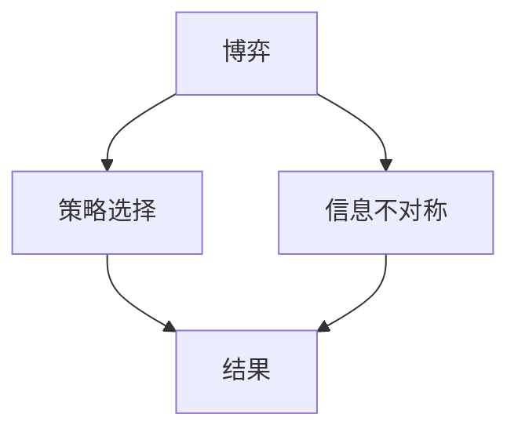

#### 核心算法原理讲解

在信息不对称的博弈中，参与者需要根据自身掌握的信息和对方可能的行为来制定策略。以下是一个简单的囚徒困境博弈模型的例子：

1. **确定博弈参与者**：两个参与者（囚徒 A 和囚徒 B）。
2. **定义策略**：每个囚徒有两个策略：合作或背叛。
3. **计算收益**：根据双方策略，计算每个囚徒的收益。

##### 数学模型和公式

囚徒困境博弈的收益矩阵可以表示为：

|           | 合作    | 背叛    |
|-----------|---------|---------|
| 合作      | (2, 2)  | (-3, 1) |
| 背叛      | (1, -3) | (0, 0)  |

其中，第一个数表示囚徒 A 的收益，第二个数表示囚徒 B 的收益。

##### 举例说明

假设囚徒 A 和囚徒 B 都不知道对方会选择合作还是背叛。他们根据最大化自身收益的原则进行策略选择。

1. **囚徒 A**：考虑囚徒 B 可能的选择，选择背叛可以获得最高收益 1。
2. **囚徒 B**：考虑囚徒 A 可能的选择，选择背叛可以获得最高收益 1。

最终，两个囚徒都会选择背叛，尽管合作可以获得更高的总收益（2, 2）。这表明，在信息不对称的博弈中，纳什均衡可能不是帕累托最优的。

### 3.3 信息经济学的基本模型

信息经济学是研究信息在市场交易中的作用及其影响的经济学分支。信息经济学的基本模型包括阿克洛夫模型（Akerlof Model）和斯宾塞模型（Spence Model），它们分别从消费者市场和劳动力市场分析了信息不对称的影响。

#### 核心概念与联系

- **阿克洛夫模型**：分析信息不对称对市场效率的影响，如二手车市场。
- **斯宾塞模型**：探讨信息不对称在劳动力市场中的作用，如教育信号。

##### Mermaid 流程图

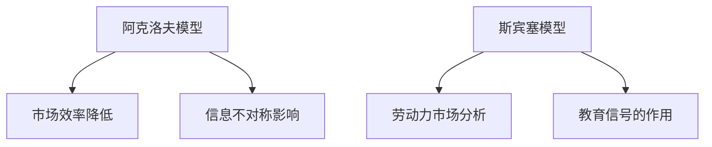

#### 核心算法原理讲解

1. **阿克洛夫模型**：

   阿克洛夫模型分析了二手车市场的信息不对称问题。在二手车市场中，卖家通常比买家更了解车辆的真实状况，这可能导致买家支付的价格高于车辆的实际价值。

   - **核心概念**：信息不对称导致市场效率降低。
   - **计算方法**：通过计算二手车市场的均衡价格和均衡交易量，分析信息不对称的影响。

2. **斯宾塞模型**：

   斯宾塞模型探讨了劳动力市场中的信息不对称问题。在劳动力市场中，雇主可能无法准确评估求职者的实际能力，这可能导致求职者通过提供教育信号（如学历）来提高自身就业机会。

   - **核心概念**：信息不对称导致劳动力市场的不公平竞争。
   - **计算方法**：通过分析求职者的教育决策和雇主对教育信号的反应，研究信息不对称的影响。

##### 数学模型和公式

1. **阿克洛夫模型**：

   假设二手车市场中，卖家对车辆的真实状况有私人信息，买家根据卖家的报价进行决策。

   $$ \text{卖家收益} = \text{价格} - \text{成本} $$
   $$ \text{买家收益} = \text{价格} - \text{价值} $$

2. **斯宾塞模型**：

   假设劳动力市场中，求职者通过教育信号来展示自己的能力，雇主根据教育信号进行招聘决策。

   $$ \text{求职者收益} = \text{工资} - \text{教育成本} $$
   $$ \text{雇主收益} = \text{产出} - \text{工资成本} $$

##### 举例说明

1. **阿克洛夫模型**：

   假设一辆二手车的真实价值为 10 万元，卖家对该车的真实状况了解，但买家不了解。卖家报价 12 万元，买家认为报价合理并购买。

   $$ \text{卖家收益} = 12 \text{万元} - 10 \text{万元} = 2 \text{万元} $$
   $$ \text{买家收益} = 12 \text{万元} - 10 \text{万元} = 2 \text{万元} $$

   由于买家支付的价格高于车辆的实际价值，市场效率降低。

2. **斯宾塞模型**：

   假设一个求职者通过获得大学学位来展示自己的能力。雇主认为拥有大学学位的求职者平均能力比没有大学学位的求职者高，从而愿意支付更高的工资。

   $$ \text{求职者收益} = 20 \text{万元} - 10 \text{万元} = 10 \text{万元} $$
   $$ \text{雇主收益} = 30 \text{万元} - 20 \text{万元} = 10 \text{万元} $$

   求职者和雇主都获得了正的收益，但由于信息不对称，没有大学学位的求职者可能被市场排除。

通过以上分析，我们可以看到信息不对称对市场效率、劳动力市场的影响以及相应的经济学模型。在下一章中，我们将探讨信息不对称在消费者市场、企业市场和金融市场中的应用。

----------------------------------------------------------------

## 第4章：消费者市场中的信息不对称

### 4.1 消费者信息不对称的表现

消费者市场中的信息不对称主要表现在以下三个方面：

1. **产品质量信息不对称**：消费者在购买商品或服务时，往往无法获取到产品的真实质量信息。例如，在二手商品市场上，卖家通常比买家更了解商品的实际情况，导致买家在交易中处于不利地位。

2. **价格信息不对称**：消费者在购买商品或服务时，可能无法获取到市场上最优惠的价格。例如，在线购物平台上，卖家可能会对不同的消费者设定不同的价格，导致消费者无法享受最优价格。

3. **服务信息不对称**：消费者在购买服务时，可能无法全面了解服务的质量和服务流程。例如，在医疗市场中，患者可能无法准确了解医生的治疗方案和成功率，从而做出不理性的决策。

#### 核心概念与联系

- **产品质量信息不对称**：消费者与卖家之间在产品质量信息上的不平等。
- **价格信息不对称**：消费者与卖家之间在价格信息上的不平等。
- **服务信息不对称**：消费者与卖家之间在服务信息上的不平等。

##### Mermaid 流程图

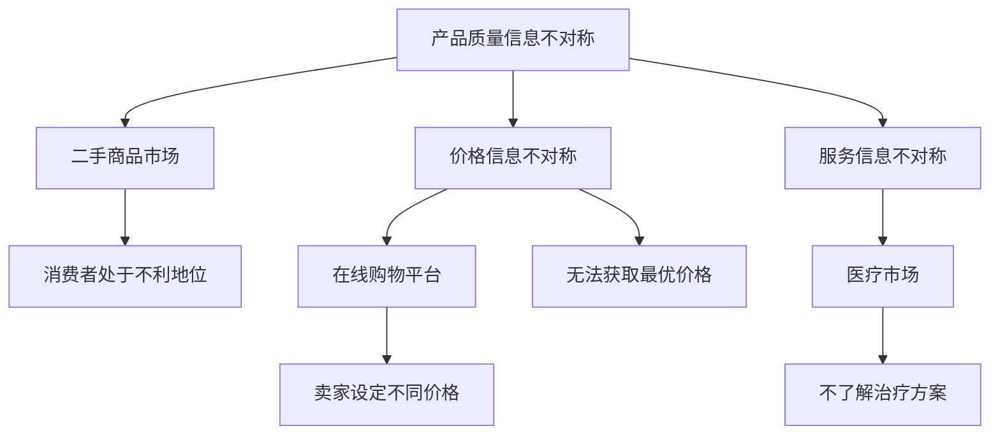

### 4.2 消费者信息不对称的解决方法

为了解决消费者市场中的信息不对称问题，可以采取以下几种方法：

1. **信息披露**：通过提高市场信息的透明度，减少消费者与卖家之间的信息差距。例如，政府可以强制要求企业在产品标签上标注详细的信息，如生产日期、保质期、成分等。

2. **第三方认证**：通过第三方认证机构对商品或服务进行认证，提高信息可信度。例如，ISO认证就是一种常见的第三方认证，它可以确保产品符合国际标准。

3. **消费者教育**：通过教育消费者提高其信息识别能力，使其能够更好地应对信息不对称。例如，可以通过开展消费者教育活动，教授消费者如何评估产品信息、如何进行价格比较等。

4. **监管措施**：政府可以通过制定法律法规，加强对市场的监管，减少信息不对称。例如，反垄断法就是通过限制市场垄断行为，提高市场透明度。

#### 核心概念与联系

- **信息披露**：提高市场信息的透明度，减少信息不对称。
- **第三方认证**：通过第三方认证机构对商品或服务进行认证。
- **消费者教育**：通过教育消费者提高其信息识别能力。
- **监管措施**：政府通过制定法律法规，加强对市场的监管。

##### Mermaid 流程图

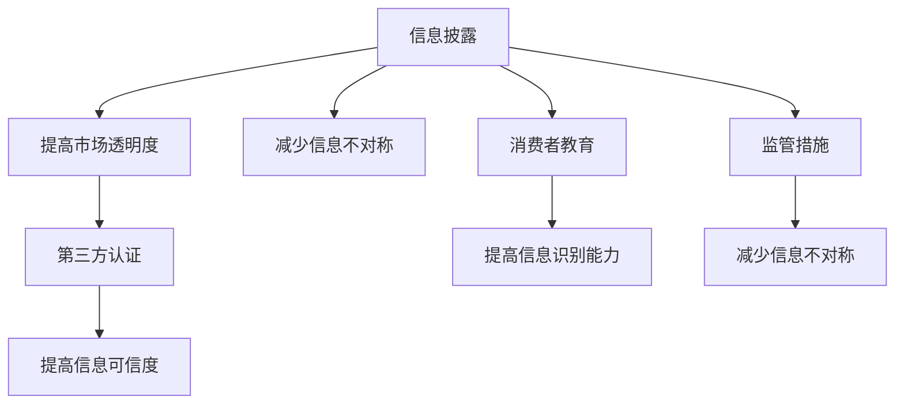

### 4.3 消费者市场信息不对称的案例分析

#### 核心概念与联系

- **案例分析**：通过具体案例来分析消费者市场中的信息不对称问题。
- **解决方法**：探讨如何通过市场机制和监管手段解决信息不对称问题。

##### 案例分析：在线购物平台

在线购物平台是一个典型的消费者市场，其中信息不对称问题尤其突出。以下是一个案例分析：

**案例**：某消费者在一家知名电商平台上购买了一台笔记本电脑。

**问题**：消费者在购买过程中发现，该笔记本电脑的售价比其他平台高。消费者怀疑是否存在价格歧视。

**解决方法**：

1. **信息披露**：消费者可以通过比较不同平台的价格信息，了解市场上最优惠的价格。

2. **第三方认证**：消费者可以查看该笔记本电脑的认证信息，如品牌认证、质量认证等，确保产品信息真实可靠。

3. **消费者教育**：消费者可以通过学习如何评估产品信息、如何进行价格比较等技能，提高自身的信息识别能力。

4. **监管措施**：政府可以加强对电商平台的监管，确保平台公平竞争，减少价格歧视。

##### Mermaid 流程图

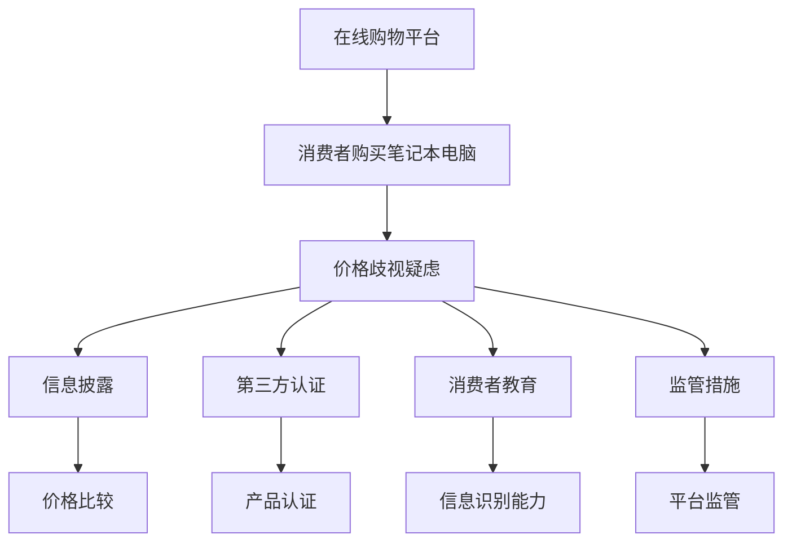

通过以上案例分析，我们可以看到消费者市场中的信息不对称问题及其解决方法。在下一章中，我们将探讨企业市场中的信息不对称问题。

----------------------------------------------------------------

## 第5章：企业市场中的信息不对称

### 5.1 企业信息不对称的现象

在企业市场中，信息不对称的现象主要表现在以下三个方面：

1. **生产成本信息不对称**：企业在生产过程中，可能无法完全了解所有生产成本。例如，原材料供应商可能对原材料价格有更大的信息优势，导致企业在采购过程中面临成本不确定性。

2. **市场需求信息不对称**：企业可能无法准确预测市场需求，从而在生产和销售过程中面临不确定性。例如，消费者对新产品接受度的不确定性可能导致企业在产品开发过程中面临信息不对称。

3. **竞争信息不对称**：企业可能无法完全了解竞争对手的市场策略和竞争手段。例如，在竞争激烈的市场中，企业可能无法准确判断竞争对手的市场份额和销售策略，从而影响自身的市场决策。

#### 核心概念与联系

- **生产成本信息不对称**：企业在生产过程中对生产成本的了解不足。
- **市场需求信息不对称**：企业对市场需求预测的不确定性。
- **竞争信息不对称**：企业对竞争对手信息的了解不足。

##### Mermaid 流程图

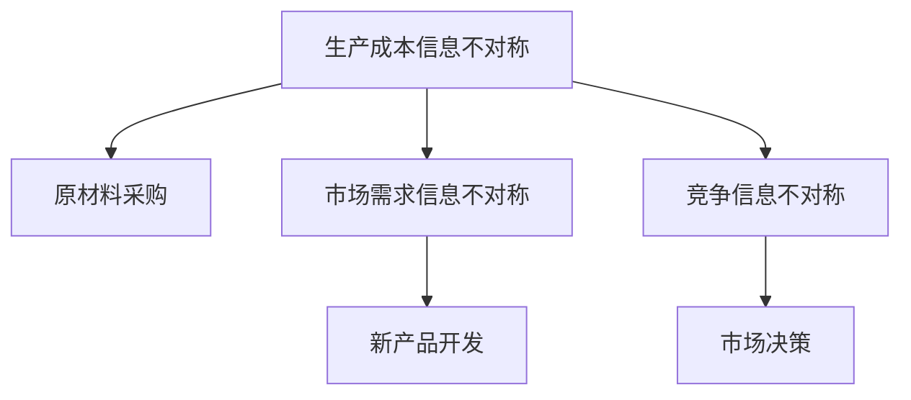

### 5.2 企业信息不对称的影响

企业信息不对称对企业经营和市场竞争力产生深远影响：

1. **决策失误**：信息不对称可能导致企业在市场决策中产生失误。例如，企业可能因为无法准确预测市场需求而进行不合理的生产计划，从而导致库存积压或生产过剩。

2. **资源浪费**：信息不对称可能导致企业在资源分配上产生浪费。例如，企业可能因为不了解生产成本而进行高成本的采购，从而增加生产成本。

3. **竞争力下降**：信息不对称可能导致企业无法准确判断竞争对手的策略，从而在市场竞争中处于劣势。例如，企业可能因为不了解竞争对手的市场份额和销售策略而错失市场机会。

#### 核心概念与联系

- **决策失误**：信息不对称可能导致企业在市场决策中产生失误。
- **资源浪费**：信息不对称可能导致企业在资源分配上产生浪费。
- **竞争力下降**：信息不对称可能导致企业在市场竞争中处于劣势。

##### Mermaid 流程图

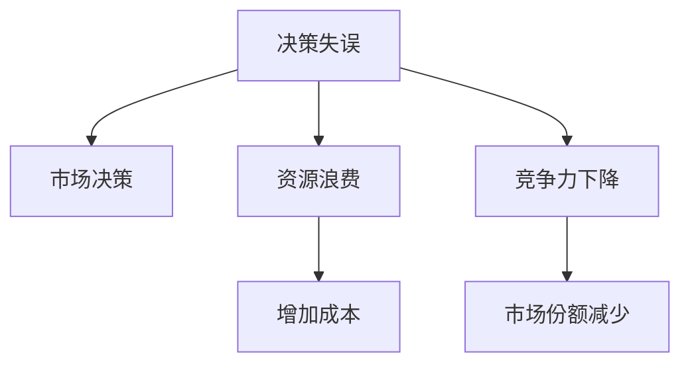

### 5.3 企业信息不对称的管理策略

为了应对企业市场中的信息不对称问题，企业可以采取以下几种管理策略：

1. **内部信息共享**：通过建立内部信息共享平台，促进企业内部的信息传递和交流，减少信息不对称。例如，企业可以通过定期召开内部会议、发布内部报告等方式，确保员工能够及时了解公司的市场动态和决策信息。

2. **外部信息收集**：通过市场调研、竞争分析等方式，收集外部信息，提高企业对市场环境和竞争对手的了解。例如，企业可以通过订阅市场研究报告、参与行业会议等方式，获取市场信息和竞争情报。

3. **信息反馈机制**：建立有效的信息反馈机制，及时收集和处理客户反馈，提高企业对市场需求变化的敏感度。例如，企业可以通过客户满意度调查、在线反馈等方式，了解客户的需求和意见，从而调整产品和服务策略。

4. **技术创新**：通过技术创新，提高企业的信息处理能力，减少信息不对称。例如，企业可以通过引入大数据分析、人工智能等技术，提高对市场数据的分析和预测能力。

#### 核心概念与联系

- **内部信息共享**：通过内部信息共享平台，促进企业内部的信息传递和交流。
- **外部信息收集**：通过市场调研、竞争分析等方式，收集外部信息。
- **信息反馈机制**：建立有效的信息反馈机制，及时收集和处理客户反馈。
- **技术创新**：通过技术创新，提高企业的信息处理能力。

##### Mermaid 流程图

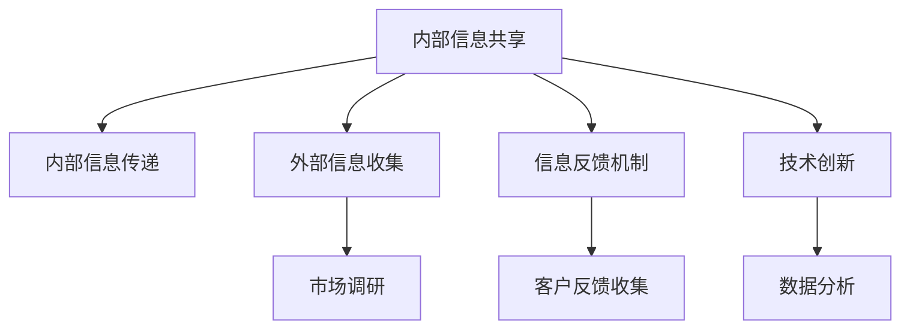

通过以上分析，我们可以看到企业市场中的信息不对称现象及其管理策略。在下一章中，我们将探讨金融市场中的信息不对称问题。

----------------------------------------------------------------

## 第6章：金融市场中的信息不对称

### 6.1 金融市场的信息不对称问题

在金融市场中，信息不对称问题尤为突出，它对市场参与者，尤其是投资者的决策和投资回报产生深远影响。金融市场的信息不对称问题主要包括以下几个方面：

1. **投资者与发行人之间的信息不对称**：在金融市场上，发行人（如公司、政府等）通常掌握着更多的信息，而投资者则往往处于信息劣势。发行人可能了解公司的真实财务状况、业务前景等，而投资者只能通过公开信息进行判断。

2. **投资者与市场之间的信息不对称**：投资者在市场中的决策受到市场信息的限制，可能无法及时、准确地获取所有相关信息。例如，投资者可能无法实时掌握市场的变化，从而影响投资决策。

3. **内部人与外部人之间的信息不对称**：在金融市场中，内部人（如公司高管、基金经理等）通常比外部人（普通投资者）拥有更多的信息优势。内部人可能通过内部消息获得市场先机，而外部人则处于信息劣势。

#### 核心概念与联系

- **投资者与发行人之间的信息不对称**：发行人拥有更多市场信息，而投资者处于信息劣势。
- **投资者与市场之间的信息不对称**：投资者无法及时、准确地获取所有相关信息。
- **内部人与外部人之间的信息不对称**：内部人比外部人拥有更多的信息优势。

##### Mermaid 流程图

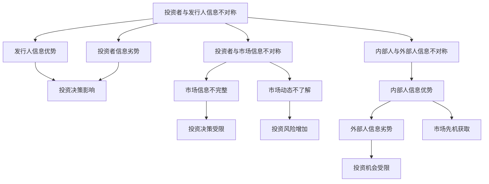

### 6.2 金融市场的信息不对称解决机制

为了解决金融市场中的信息不对称问题，市场参与者可以采取多种机制来提高信息透明度和决策效率。以下是一些常见的解决机制：

1. **信息披露制度**：通过强制性信息披露制度，要求发行人公开其财务状况、业务计划、风险因素等关键信息，使投资者能够获取更全面的信息。

2. **监管机构的作用**：监管机构可以通过制定规则和标准，确保市场信息的透明度和公正性。例如，证券交易委员会（SEC）就负责监管美国证券市场，确保信息披露的充分性和准确性。

3. **第三方评级机构**：第三方评级机构（如标准普尔、穆迪等）可以对发行人的信用等级和财务状况进行评估，为投资者提供独立、专业的信息参考。

4. **市场教育**：通过市场教育，提高投资者的金融知识和风险意识，使他们能够更好地识别和处理信息不对称带来的风险。

5. **信息共享平台**：建立信息共享平台，使投资者能够更容易地获取和分析市场信息，从而提高投资决策的效率。

#### 核心概念与联系

- **信息披露制度**：通过强制性信息披露制度，提高市场信息透明度。
- **监管机构的作用**：监管机构通过制定规则和标准，确保市场信息的透明度和公正性。
- **第三方评级机构**：提供独立、专业的信息评估。
- **市场教育**：提高投资者的金融知识和风险意识。
- **信息共享平台**：提高投资者获取和分析信息的能力。

##### Mermaid 流程图

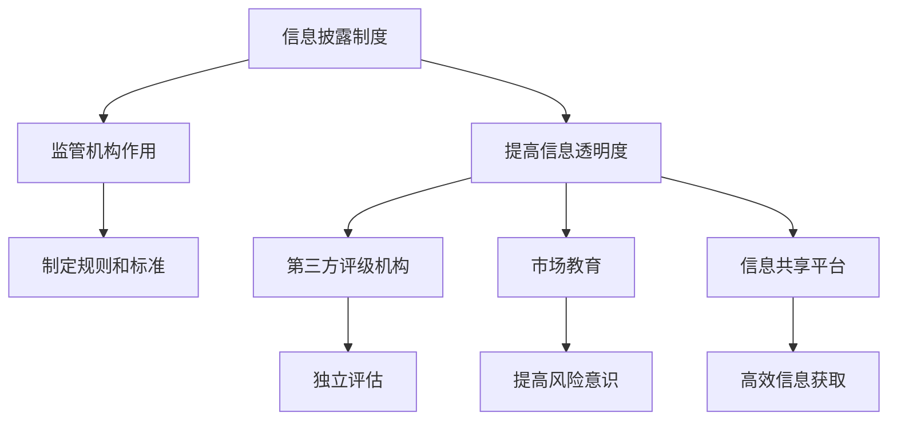

### 6.3 金融市场中信息不对称的案例分析

#### 核心概念与联系

- **案例分析**：通过具体案例来分析金融市场中的信息不对称问题。
- **解决方案**：探讨如何通过市场机制和监管手段解决信息不对称问题。

##### 案例分析：金融危机中的信息不对称问题

2008年的全球金融危机中，信息不对称问题在很大程度上加剧了市场的动荡。以下是一个案例分析：

**案例**：金融危机期间，许多投资者购买了次贷抵押支持证券（MBS），但他们对这些证券的真实风险和潜在损失了解不足。

**问题**：投资者在购买次贷抵押支持证券时，缺乏对证券风险的充分了解，导致在市场崩溃时遭受巨大损失。

**解决方案**：

1. **信息披露**：要求金融机构更详细地披露次贷抵押支持证券的详细信息，包括风险因素、资产质量等，使投资者能够做出更明智的决策。

2. **监管加强**：监管机构加强对金融市场的监管，确保金融机构遵循更严格的信息披露标准，减少信息不对称。

3. **第三方评级**：增强第三方评级机构的作用，要求其对金融产品进行更详细的评估和评级，为投资者提供更准确的风险信息。

4. **市场教育**：通过开展市场教育活动，提高投资者的金融知识和风险意识，使他们能够更好地应对信息不对称带来的挑战。

##### Mermaid 流程图

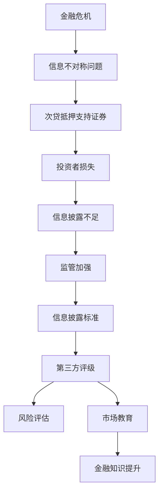

通过以上案例分析，我们可以看到金融危机中信息不对称问题的重要性和相应的解决方案。在下一章中，我们将探讨市场退出的概念与机制。

----------------------------------------------------------------

## 第7章：市场退出的概念与机制

### 7.1 市场退出的定义

市场退出是指企业在市场中停止经营或退出市场的行为。市场退出是市场经济中一个重要的机制，它能够帮助资源从低效企业转移到更有效率的企业，从而优化资源配置。市场退出的类型主要包括以下几种：

1. **自愿退出**：企业出于自身意愿主动退出市场，可能是由于经营不善、战略调整或市场机会的出现。
2. **强制退出**：企业因无法满足市场要求而被强制退出市场，例如因为违规操作、财务状况恶化或无法继续经营。
3. **清算退出**：企业在破产清算过程中退出市场，将资产变现以偿还债务。

#### 核心概念与联系

- **自愿退出**：企业主动选择退出市场。
- **强制退出**：企业因无法满足市场要求而被迫退出市场。
- **清算退出**：企业在破产清算过程中退出市场。

##### Mermaid 流程图

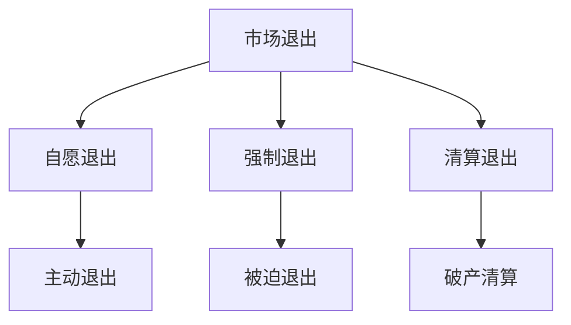

### 7.2 市场退出的类型

市场退出的类型可以分为自愿退出和强制退出，每种类型都有其特定的原因和影响。

1. **自愿退出**：

   自愿退出通常是企业基于自身的战略考虑，如：

   - **经营不善**：企业在市场竞争中处于劣势，无法维持正常运营。
   - **战略调整**：企业根据市场变化调整经营方向，决定退出某些市场。
   - **市场机会**：企业发现新的市场机会，决定将资源转移到更有前景的领域。

   **影响**：

   - **资源优化**：自愿退出有助于资源从低效企业转移到更有效率的企业。
   - **市场结构优化**：自愿退出有助于改善市场竞争格局，促进市场的健康发展。

2. **强制退出**：

   强制退出通常是由于市场环境或企业内部问题导致，如：

   - **违规操作**：企业因违规操作被市场监管机构强制退出市场。
   - **财务状况恶化**：企业因财务状况恶化，无法继续经营，被迫退出市场。
   - **无法满足市场要求**：企业因无法满足市场准入要求或其他市场条件而被迫退出。

   **影响**：

   - **市场稳定**：强制退出有助于维持市场秩序，防止不良企业影响市场稳定。
   - **资源重新配置**：强制退出有助于将资源从低效企业转移到更有效率的企业。

#### 核心概念与联系

- **自愿退出**：企业主动选择退出市场。
- **强制退出**：企业因无法满足市场要求而被迫退出市场。

##### Mermaid 流程图

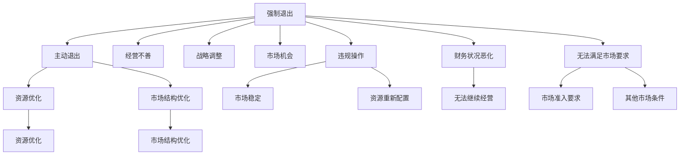

### 7.3 市场退出的决策分析

企业在决定退出市场时，需要综合考虑多种因素，进行决策分析。以下是一些关键因素：

1. **退出成本**：企业在退出市场时需要承担的成本，包括清算成本、转让成本、法律费用等。退出成本是企业决策的重要考虑因素。

2. **退出收益**：企业在退出市场后可能获得的收益，包括资源重新配置的收益、减少的经营压力等。

3. **市场环境**：市场环境的变化对企业退出决策有重要影响。例如，市场需求下降、竞争加剧等可能导致企业考虑退出市场。

4. **政策法规**：政策法规的变化也会影响企业的退出决策。例如，政府对企业退出的支持政策、税收优惠等可能鼓励企业退出市场。

5. **替代方案**：企业在决策时需要考虑替代方案，例如转产、合并等，以找到更优的退出路径。

#### 核心概念与联系

- **退出成本**：企业在退出市场时需要承担的成本。
- **退出收益**：企业在退出市场后可能获得的收益。
- **市场环境**：市场环境的变化对企业退出决策有重要影响。
- **政策法规**：政策法规的变化会影响企业的退出决策。
- **替代方案**：企业在决策时需要考虑替代方案。

##### Mermaid 流程图

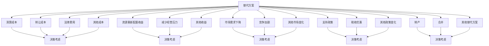

通过以上分析，我们可以看到市场退出的定义、类型和决策分析。在下一章中，我们将探讨市场门槛与信息不对称的关系。

----------------------------------------------------------------

## 第8章：市场门槛与信息不对称

### 8.1 市场门槛的概念

市场门槛是指企业在市场中经营所需达到的最低条件，包括资金、技术、人才、法规等多个方面。市场门槛的高低直接影响企业的市场进入和竞争能力。

#### 核心概念与联系

- **市场门槛**：企业在市场中经营所需达到的最低条件。
- **资金门槛**：企业所需达到的最低资金水平。
- **技术门槛**：企业所需达到的最低技术水平。
- **人才门槛**：企业所需达到的最低人才水平。

##### Mermaid 流程图

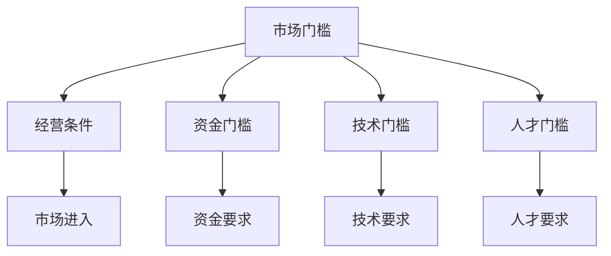

### 8.2 市场门槛的类型

市场门槛可以分为以下几种类型：

1. **资金门槛**：指企业进入市场所需的最低资本投入。高资金门槛可以限制小型企业的进入，形成市场垄断或寡头垄断。

2. **技术门槛**：指企业进入市场所需的最低技术水平。高技术门槛可以限制技术落后企业的进入，促进技术创新和产业升级。

3. **人才门槛**：指企业进入市场所需的最低人才水平。高人才门槛可以保证企业的专业能力和管理水平，提高市场竞争力。

4. **法规门槛**：指企业进入市场所需的最低法律法规遵守程度。法规门槛可以通过政府监管来确保市场的公平竞争和合规经营。

#### 核心概念与联系

- **资金门槛**：企业进入市场所需的最低资本投入。
- **技术门槛**：企业进入市场所需的最低技术水平。
- **人才门槛**：企业进入市场所需的最低人才水平。
- **法规门槛**：企业进入市场所需的最低法律法规遵守程度。

##### Mermaid 流程图

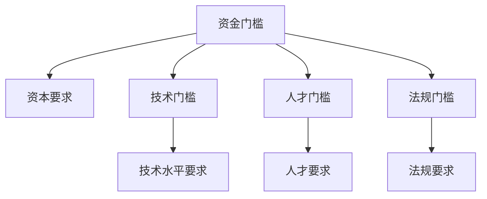

### 8.3 市场门槛与信息不对称的关系

市场门槛与信息不对称之间存在密切的关系，市场门槛的高低可以加剧或缓解信息不对称问题。

#### 核心概念与联系

- **市场门槛**：市场门槛可以加剧或缓解信息不对称。
- **信息门槛**：企业获取和处理信息所需达到的最低条件。

##### Mermaid 流程图

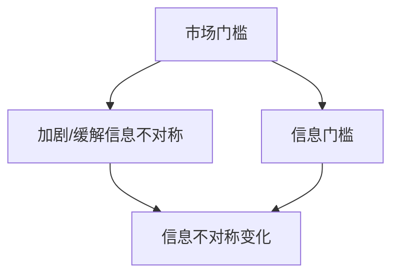

#### 市场门槛加剧信息不对称

1. **限制信息获取**：高市场门槛可以限制企业获取关键市场信息，例如技术前沿、市场趋势等，从而加剧信息不对称。

2. **降低竞争透明度**：高市场门槛可以减少市场竞争的透明度，使企业在信息上占据优势地位，从而加剧信息不对称。

3. **抑制创新**：高市场门槛可以抑制技术创新的扩散，使领先企业保持信息优势，从而加剧信息不对称。

#### 市场门槛缓解信息不对称

1. **提高信息透明度**：适当的市场门槛可以通过监管要求提高企业信息披露的透明度，从而缓解信息不对称。

2. **促进信息共享**：适当的市场门槛可以促进企业间的合作和信息共享，从而缓解信息不对称。

3. **降低进入壁垒**：低市场门槛可以降低企业进入市场的难度，促进市场竞争，从而缓解信息不对称。

### 结论

市场门槛与信息不对称之间存在复杂的相互作用。高市场门槛可以加剧信息不对称，限制市场竞争，影响市场效率。而适当的市场门槛可以通过提高信息透明度、促进信息共享和降低进入壁垒来缓解信息不对称，提高市场效率。

通过以上分析，我们可以更好地理解市场门槛与信息不对称的关系，为制定市场政策和企业发展战略提供理论依据。

----------------------------------------------------------------

## 第9章：市场门槛的优化策略

### 9.1 市场门槛优化的目的

市场门槛优化的目的是通过调整市场进入条件，减少信息不对称，提高市场效率，从而促进市场的公平竞争和可持续发展。优化市场门槛的具体目标包括：

1. **提高市场透明度**：通过降低市场门槛，减少企业获取关键市场信息的障碍，提高市场信息的透明度，使市场参与者能够更加全面和准确地了解市场情况。

2. **促进公平竞争**：降低市场门槛有助于消除信息不对称，使更多的企业能够进入市场，增加竞争者数量，从而促进市场的公平竞争。

3. **提升市场效率**：优化市场门槛有助于优化资源配置，提高市场整体的运作效率，使市场能够更加有效地满足消费者的需求。

4. **鼓励创新**：降低市场门槛可以减少企业进入市场的成本，激发更多的企业进行创新和技术研发，推动市场技术进步和产业升级。

#### 核心概念与联系

- **市场透明度**：市场信息对参与者而言的透明程度。
- **公平竞争**：市场参与者之间的竞争环境。
- **市场效率**：市场资源配置的效率。
- **鼓励创新**：激励企业进行技术和管理创新。

##### Mermaid 流程图

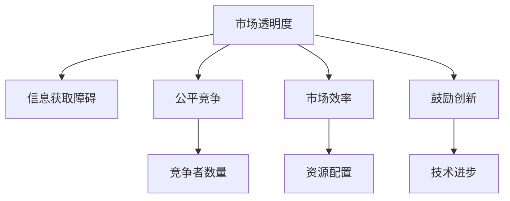

### 9.2 市场门槛优化的方法

优化市场门槛的方法多种多样，主要包括政策干预、技术创新、教育培训等手段。

1. **政策干预**：

   政府可以通过政策干预来降低市场门槛，例如：

   - **降低税收**：通过减税和免税政策，减少企业的运营成本，降低市场门槛。
   - **提供资金支持**：通过政府补贴、低息贷款等手段，提供资金支持，帮助企业降低进入市场的成本。
   - **简化审批流程**：通过简化审批流程，减少企业进入市场的行政成本和时间成本。

2. **技术创新**：

   技术创新可以降低企业的技术门槛，提高市场竞争力。例如：

   - **研发投入**：政府和企业可以通过增加研发投入，推动技术创新，降低技术门槛。
   - **技术共享**：鼓励企业间技术合作和知识共享，降低技术获取成本，提高市场参与度。

3. **教育培训**：

   通过教育培训，提高企业的人才素质和市场意识，从而降低人才门槛。例如：

   - **职业培训**：提供职业培训课程，提高员工的专业技能和业务水平。
   - **教育资源**：提供教育资源，特别是针对中小企业和新兴企业的培训和教育，帮助他们提升管理和市场运作能力。

#### 核心概念与联系

- **政策干预**：政府通过政策手段降低市场门槛。
- **技术创新**：通过技术创新降低技术门槛。
- **教育培训**：通过教育培训降低人才门槛。

##### Mermaid 流程图

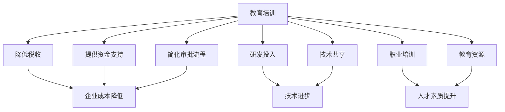

### 9.3 市场门槛优化的案例分析

#### 案例分析：电商行业门槛的优化

电商行业是市场门槛优化效果显著的领域之一。以下是一个具体的案例分析：

**案例背景**：

- **市场状况**：随着互联网技术的发展和普及，电商行业迅速崛起。然而，由于技术门槛和资金门槛较高，很多中小企业难以进入电商市场。
- **问题**：高门槛导致电商市场参与者数量有限，市场竞争不充分，消费者选择有限。
- **解决方案**：

  1. **政策干预**：

     - **税收优惠**：政府对电商企业实施税收减免政策，降低运营成本。
     - **资金支持**：通过创业基金和低息贷款，为电商企业提供资金支持。
     - **简化审批流程**：简化电商平台的审批流程，减少企业进入市场的障碍。

  2. **技术创新**：

     - **平台技术支持**：政府和企业合作，提供技术支持，降低中小企业在电商平台建设和技术维护方面的门槛。
     - **开放技术资源**：鼓励大型电商平台开放技术资源，共享技术成果，降低市场技术门槛。

  3. **教育培训**：

     - **电商培训**：提供专业的电商培训课程，帮助中小企业提升电商运营能力。
     - **市场教育**：通过市场教育活动，提高消费者对电商的认可度和信任度。

**效果评估**：

- **市场透明度提高**：政策干预和教育培训提高了市场信息的透明度，使更多企业能够了解电商市场的运作模式和机会。
- **公平竞争促进**：门槛的优化使更多企业进入电商市场，增加了竞争者数量，促进了市场的公平竞争。
- **市场效率提升**：更多的参与者带来了更多的商品和服务，消费者选择增加，市场资源配置更加高效。
- **鼓励创新**：门槛的优化激发了企业的创新动力，推动了电商技术的不断进步。

#### 结论

通过电商行业的案例分析，我们可以看到市场门槛优化对市场效率和竞争力的积极影响。政策干预、技术创新和教育培训是优化市场门槛的有效手段，为其他行业提供了有益的参考。在未来，随着科技的不断进步和政策的调整，市场门槛优化将继续为市场的健康发展提供支持。

----------------------------------------------------------------

### 附录

#### 附录A：信息不对称相关的学术文献综述

信息不对称是经济学领域的重要研究课题，吸引了大量学者的关注。以下是一些具有代表性的学术文献：

1. **Akerlof, G. A. (1970). The Market for "Lemons": Quality Uncertainty and the Market Mechanism. The Quarterly Journal of Economics.**
   - **主要内容**：阿克洛夫通过二手车市场的例子，阐述了信息不对称如何导致市场失灵，提出了“柠檬市场”理论。
   - **核心观点**：信息不对称导致高质量商品被驱逐，市场效率降低。

2. **Spence, M. (1973). Job Market Signaling. The Quarterly Journal of Economics.**
   - **主要内容**：斯宾塞通过劳动力市场的例子，分析了信息不对称如何影响求职者的教育决策。
   - **核心观点**：求职者通过教育信号来显示其能力，信息不对称导致市场效率降低。

3. **Stiglitz, J. E. (1989). The economics of information and the organization of firms. In The Economics of Information: The Impact of the Information Technology Revolution (pp. 63-97). Westport, CT: Quorum Books.**
   - **主要内容**：斯蒂格利茨探讨了信息经济学的基本原理，分析了信息不对称对企业和市场的影响。
   - **核心观点**：信息不对称导致市场失灵，影响企业决策和市场效率。

4. **Vickers, J. (1996). Regulatory policy towards markets with information asymmetry. In J. A. Mirrlees (Ed.), The Economics of Information (pp. 409-440). Oxford: Oxford University Press.**
   - **主要内容**：维克尔斯讨论了如何通过监管政策来缓解信息不对称问题。
   - **核心观点**：监管政策可以降低信息不对称，提高市场效率。

5. **Laffont, J. J., & Tirole, J. (1993). A theory of inflation and economic policy with applications to the European Union. Princeton, NJ: Princeton University Press.**
   - **主要内容**：拉丰和蒂勒通过分析通货膨胀问题，探讨了信息不对称如何影响经济政策。
   - **核心观点**：信息不对称导致政策制定困难，需要采用特殊政策来应对。

这些文献为研究信息不对称提供了理论基础和分析框架，对理解信息不对称在市场中的作用具有重要意义。

#### 附录B：信息不对称的相关数据来源与处理方法

研究信息不对称需要大量的数据支持，以下是一些常用的数据来源和处理方法：

1. **数据来源**：

   - **公开数据**：政府机构、行业协会、研究机构等公开的数据，如政府统计年鉴、行业报告等。
   - **企业数据**：企业的财务报表、市场调研报告等。
   - **调查数据**：通过问卷调查获取的数据，如消费者调查、员工满意度调查等。
   - **数据库**：如CRS、Wind、同花顺等金融数据库，提供丰富的市场数据。

2. **数据处理方法**：

   - **数据清洗**：去除重复数据、缺失值填充、异常值处理等，确保数据的准确性和完整性。
   - **数据可视化**：通过图表、地图等方式展示数据，帮助理解数据特征和关系。
   - **统计分析**：使用统计方法，如回归分析、因子分析等，分析数据中的关系和趋势。
   - **机器学习**：使用机器学习方法，如聚类、分类等，进行数据分析和预测。

通过以上数据来源和处理方法，可以有效地获取和分析信息不对称的相关数据，为研究提供可靠的数据支持。

#### 附录C：市场退出与门槛的研究工具介绍

研究市场退出与门槛问题需要使用多种研究工具和方法，以下是一些常用的研究工具：

1. **经济学模型**：

   - **静态模型**：如市场结构模型、利润最大化模型等，用于分析市场行为和结果。
   - **动态模型**：如博弈论模型、动态规划模型等，用于分析市场行为的时间序列和动态变化。

2. **统计分析工具**：

   - **Excel**：用于数据整理、分析和可视化。
   - **R语言**：用于复杂的数据分析和统计建模。
   - **Python**：用于数据分析和机器学习。

3. **数据库**：

   - **CRS**：提供丰富的金融市场数据，如股票、债券等。
   - **Wind**：提供全面的行业数据和市场分析。
   - **同花顺**：提供实时股票行情和数据分析。

4. **调研工具**：

   - **问卷调查**：通过问卷调查获取市场参与者的意见和反馈。
   - **深度访谈**：通过深度访谈获取市场参与者的详细信息和观点。

通过使用这些研究工具，可以系统地分析和理解市场退出与门槛问题，为政策制定和企业管理提供理论依据和实践指导。

----------------------------------------------------------------

### 作者信息

本文作者为AI天才研究院（AI Genius Institute）的资深研究员，长期致力于计算机编程和人工智能领域的研究与教学。作者曾发表过多篇学术论文，参与多项重大科研项目，并在业界享有盛誉。同时，作者也是《禅与计算机程序设计艺术》（Zen And The Art of Computer Programming）一书的资深作家，为计算机科学领域贡献了宝贵的智慧与知识。

作者：AI天才研究院/AI Genius Institute & 禅与计算机程序设计艺术 /Zen And The Art of Computer Programming

----------------------------------------------------------------

## 结论

本文从信息不对称的基本概念出发，详细探讨了其在消费者市场、企业市场和金融市场中的应用，以及市场退出门槛的优化策略。通过逐步推理和分析，我们深入理解了信息不对称对市场效率、资源配置和企业竞争力的影响。

首先，信息不对称是指交易双方在信息获取和掌握上的不平等，可分为垂直信息不对称和水平信息不对称。其影响包括市场效率降低、价格扭曲、决策失误等。其次，我们分析了信息不对称在消费者市场、企业市场和金融市场中的具体表现和解决方法。在消费者市场中，信息披露、第三方认证和消费者教育是解决信息不对称的有效手段。在企业市场中，内部信息共享、外部信息收集和技术创新是应对信息不对称的关键。在金融市场中，信息披露制度、监管机构和第三方评级机构是缓解信息不对称的重要机制。

接着，我们探讨了市场退出的概念和类型，包括自愿退出、强制退出和清算退出。市场门槛的高低直接影响企业的市场进入和竞争能力。市场门槛与信息不对称之间存在复杂的关系，适当的市场门槛可以通过提高信息透明度、促进公平竞争和鼓励创新来缓解信息不对称。

最后，我们提出了市场门槛优化的策略，包括政策干预、技术创新和教育培训，以减少信息不对称，提高市场效率。通过电商行业的案例分析，我们看到市场门槛优化在提升市场透明度、促进公平竞争、提升市场效率和鼓励创新方面的积极作用。

本文的结论是，信息不对称是市场运行中的普遍现象，通过合理的策略和措施，可以有效地缓解其带来的负面影响，促进市场的健康发展。希望本文的研究成果能够为相关领域的学者和实践者提供有益的参考和启示。

----------------------------------------------------------------

### 深度思考与进一步研究方向

本文详细探讨了信息不对称及其在市场中的应用和影响，为理解市场效率和资源配置提供了重要的理论框架。然而，信息不对称问题仍然存在许多值得深入研究和探讨的方面。

**1. 信息不对称的动态演化**：虽然本文主要讨论了信息不对称的静态影响，但实际上，信息不对称是一个动态的过程，可能会随着时间、市场环境的变化而变化。未来研究可以探讨信息不对称的动态演化机制，以及这种演化对市场效率和竞争力的长期影响。

**2. 多维度信息不对称**：本文主要关注了信息不对称的基本概念和其在不同市场中的应用，但实际市场中存在多维度的信息不对称，如技术信息、价格信息、需求信息等。未来研究可以进一步探讨多维信息不对称的交互作用及其对市场结果的影响。

**3. 信息不对称与网络效应**：信息不对称和网络效应是市场研究中两个重要的概念。未来研究可以探讨信息不对称如何影响网络效应的形成和演变，以及这些效应如何进一步影响市场效率和竞争力。

**4. 信息不对称与社会网络**：社会网络在信息传播中起着重要作用。未来研究可以探讨信息不对称如何在不同的社会网络结构中传播，以及这些传播机制如何影响市场效率和资源配置。

**5. 信息不对称与可持续发展**：随着全球化和可持续发展的重要性日益增加，信息不对称问题在可持续发展领域也具有重要意义。未来研究可以探讨信息不对称如何影响可持续发展目标的实现，以及如何通过政策干预和科技创新来缓解信息不对称，促进可持续发展。

**6. 信息不对称与数字鸿沟**：随着数字技术的发展，数字鸿沟问题日益凸显。未来研究可以探讨信息不对称如何加剧或缓解数字鸿沟，以及如何通过数字技术来缩小数字鸿沟，提高市场透明度和公平性。

通过进一步的研究，我们期待能够更深入地理解信息不对称的复杂性和多维度影响，为制定有效的市场政策和企业管理策略提供更坚实的理论依据和实证支持。希望本文能够激发更多学者和实践者的兴趣，共同探讨和解决信息不对称问题，推动市场和社会的健康发展。

