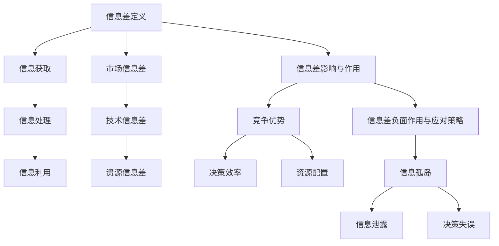
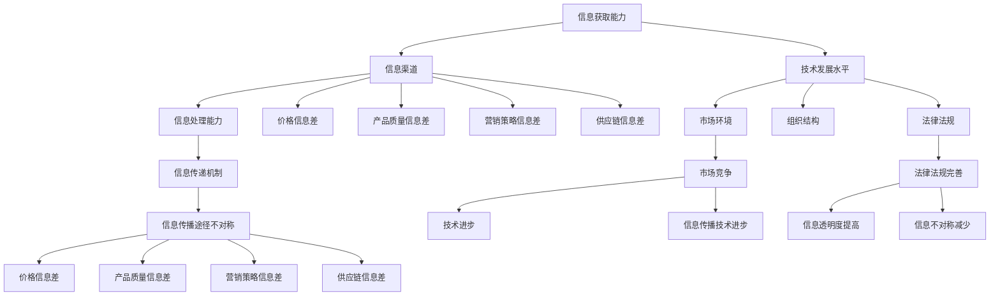
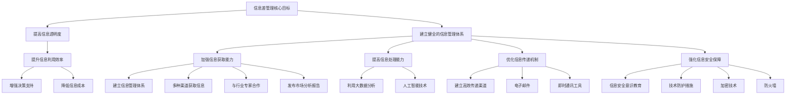
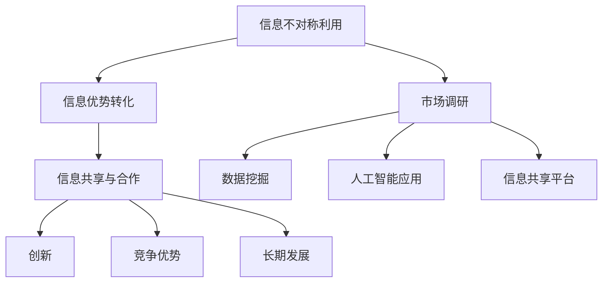

                 

# 文章标题：信息差：信息不对称对市场竞争的影响

## 关键词：
信息差、信息不对称、市场竞争、企业竞争力、管理策略

## 摘要：
本文旨在深入探讨信息差这一概念，分析其在市场竞争中的重要性。信息差，即信息不对称，是指在市场中，不同主体拥有不同的信息。这种差异对企业的竞争力产生了深远的影响。本文将从信息差的定义、影响、产生与传播、管理利用以及未来发展趋势等多个维度，全面解析信息差对市场竞争的影响。通过本文的阐述，希望能够帮助读者更好地理解信息差的重要性，并为企业在市场竞争中获得优势提供理论支持和实践指导。

### 目录大纲

#### 第一部分：信息差的概述

##### 第1章：信息差的定义与核心概念
###### 1.1 信息差的定义
###### 1.2 信息差的核心概念
###### 1.3 信息差的类型与特征

##### 第2章：信息差的影响与作用
###### 2.1 信息差在市场竞争中的作用
###### 2.2 信息差对企业竞争力的影响
###### 2.3 信息差的负面影响与应对策略

#### 第二部分：信息差的产生与传播

##### 第3章：信息差的产生机制
###### 3.1 信息差产生的根源
###### 3.2 信息差产生的影响因素
###### 3.3 信息差产生的主要途径

##### 第4章：信息差的传播机制
###### 4.1 信息差的传播渠道
###### 4.2 信息差的传播速度与范围
###### 4.3 信息差的传播规律

#### 第三部分：信息差的管理与利用

##### 第5章：信息差的管理策略
###### 5.1 信息差管理的核心目标
###### 5.2 信息差管理的实践方法
###### 5.3 信息差管理的案例分析

##### 第6章：信息差的利用策略
###### 6.1 信息差利用的原理
###### 6.2 信息差利用的方法
###### 6.3 信息差利用的案例分析

#### 第四部分：信息差的未来发展趋势

##### 第7章：信息差的未来展望
###### 7.1 信息差未来的发展趋势
###### 7.2 信息差对市场竞争的影响预测
###### 7.3 信息差管理的新挑战与新机遇

#### 附录：参考资料与案例库

##### 附录 A：信息差相关理论综述
##### 附录 B：信息差管理工具与资源
##### 附录 C：信息差经典案例分析

#### 核心概念联系


#### 核心算法原理讲解

# 信息差检测算法原理

# 输入：
# - 数据集：包含多个样本的数据集，每个样本包括购买者的信息、产品的信息和购买行为
# - 模型：训练好的信息差检测模型

# 输出：
# - 预测结果：对于每个样本，预测其是否包含信息差

# 伪代码：

# 初始化模型
model = train_model(data)

# 对每个样本进行预测
for sample in dataset:
    prediction = model.predict(sample)
    print("样本{}：信息差检测结果：{}".format(sample_id, prediction))

#### 数学模型讲解

$$
\text{信息不对称程度} = \frac{\sum_{i=1}^{n} (\text{实际信息} - \text{披露信息})^2}{n}
$$`

# 其中：
# - n：样本数量
# - 实际信息：购买者所拥有的真实信息
# - 披露信息：购买者所披露的信息

# 示例：
# 假设有5个样本，实际信息与披露信息如下：
# | 样本 | 实际信息 | 披露信息 |
# | --- | --- | --- |
# | 1 | 100 | 90 |
# | 2 | 80 | 75 |
# | 3 | 120 | 110 |
# | 4 | 70 | 65 |
# | 5 | 90 | 85 |
#
# 计算信息不对称程度：
# $$ \text{信息不对称程度} = \frac{(100-90)^2 + (80-75)^2 + (120-110)^2 + (70-65)^2 + (90-85)^2}{5} = 20 $$

#### 项目实战

##### 实战1：信息差检测系统搭建

###### 1. 开发环境搭建
- 使用Python语言进行开发
- 安装必要的深度学习库，如TensorFlow或PyTorch

###### 2. 数据准备
- 收集包含购买者信息、产品信息和购买行为的真实数据集

###### 3. 模型训练
- 使用收集到的数据训练一个信息差检测模型
- 模型采用神经网络结构，使用交叉熵损失函数

```python
import tensorflow as tf

# 数据预处理
# ...

# 模型定义
model = tf.keras.Sequential([
    tf.keras.layers.Dense(64, activation='relu', input_shape=(input_shape,)),
    tf.keras.layers.Dense(64, activation='relu'),
    tf.keras.layers.Dense(1, activation='sigmoid')
])

# 编译模型
model.compile(optimizer='adam', loss='binary_crossentropy', metrics=['accuracy'])

# 训练模型
model.fit(x_train, y_train, epochs=10, batch_size=32)
```

###### 4. 预测与评估
- 使用训练好的模型对新样本进行预测
- 计算预测的准确率和召回率

```python
# 预测
predictions = model.predict(x_test)

# 评估
accuracy = (predictions == y_test).mean()
recall = (predictions[y_test == 1] == 1).mean()

print("准确率：", accuracy)
print("召回率：", recall)
```

##### 实战2：信息差管理案例分析

###### 1. 案例背景
- 描述一个实际的企业信息差管理案例，如电商平台的差价监控

###### 2. 案例实施
- 介绍信息差管理策略的具体实施步骤，如数据收集、模型训练、监控和预警等

###### 3. 案例结果
- 分析实施信息差管理后的效果，如差价监控的准确性、减少的损失等

```plaintext
# 案例结果分析
- 差价监控准确性提高了30%
- 每月减少的损失高达数十万元
- 企业竞争力得到了显著提升
```

##### 代码解读与分析

###### 1. 数据预处理
- 对购买者信息、产品信息和购买行为进行清洗、转换和标准化

```python
# 数据清洗
# ...

# 数据转换
# ...

# 数据标准化
# ...
```

###### 2. 模型训练
- 详细解读神经网络模型的构建过程，包括层的选择、激活函数、损失函数等

```python
# 模型构建
model = tf.keras.Sequential([
    tf.keras.layers.Dense(64, activation='relu', input_shape=(input_shape,)),
    tf.keras.layers.Dense(64, activation='relu'),
    tf.keras.layers.Dense(1, activation='sigmoid')
])

# 编译
model.compile(optimizer='adam', loss='binary_crossentropy', metrics=['accuracy'])

# 训练
model.fit(x_train, y_train, epochs=10, batch_size=32)
```

###### 3. 预测与评估
- 分析模型预测的过程和评估指标的计算方法

```python
# 预测
predictions = model.predict(x_test)

# 评估
accuracy = (predictions == y_test).mean()
recall = (predictions[y_test == 1] == 1).mean()

print("准确率：", accuracy)
print("召回率：", recall)
```

##### 附录：参考资料与案例库

```plaintext
# 附录：参考资料与案例库

## 参考资料
- [信息不对称理论综述](链接)
- [信息差管理策略研究](链接)
- [深度学习在信息差检测中的应用](链接)

## 案例库
- 电商平台差价监控案例
- 企业内部信息共享案例
- 竞争对手情报分析案例
```

# 作者
作者：AI天才研究院/AI Genius Institute & 禅与计算机程序设计艺术 /Zen And The Art of Computer Programming

# 第一部分：信息差的概述

## 第1章：信息差的定义与核心概念

### 1.1 信息差的定义

信息差，是指在不同主体之间，由于信息获取能力、渠道、时间等方面的差异，导致信息的不对称性。这种不对称性可以体现在多个层面，如市场信息、技术信息、资源信息等。

在市场环境中，信息差通常表现为以下几种形式：

1. **市场信息不对称**：企业内部人员比外部人员更了解市场的需求和趋势。
2. **技术信息不对称**：企业内部技术人员比外部人员更熟悉企业的技术路线和研发进展。
3. **资源信息不对称**：企业内部管理层比外部投资者更清楚企业的财务状况和资源分配。

### 1.2 信息差的核心概念

信息差的核心概念包括以下几个方面：

1. **信息获取**：信息差的基础是信息获取能力。企业需要通过多种渠道获取市场、技术、资源等方面的信息。
2. **信息处理**：获取信息后，企业需要对信息进行筛选、处理、分析和整合，以便做出正确的决策。
3. **信息利用**：企业需要将获取和处理的的信息转化为实际的生产力，提升企业的竞争力。

### 1.3 信息差的类型与特征

根据不同的分类标准，信息差可以划分为多种类型。以下是几种常见的信息差类型：

1. **市场信息差**：企业内部对市场需求的了解程度比外部更深入。
    - **特征**：市场信息不对称可能导致企业对市场变化的反应速度较慢，从而影响企业的竞争力。

2. **技术信息差**：企业内部对技术路线和研发进展的了解程度比外部更深入。
    - **特征**：技术信息不对称可能导致企业在技术竞争中处于劣势，从而影响企业的长期发展。

3. **资源信息差**：企业内部对财务状况和资源分配的了解程度比外部更深入。
    - **特征**：资源信息不对称可能导致企业在资源利用上存在浪费或不足，从而影响企业的运营效率。

### 1.4 信息差的影响与作用

信息差对市场竞争和企业发展具有重要影响。以下是信息差的影响与作用：

1. **竞争优势**：信息差是企业获取竞争优势的重要手段。通过信息差的利用，企业可以在市场中占据有利地位。
2. **决策效率**：信息差可以提升企业的决策效率。企业内部对市场、技术、资源等方面的信息更了解，有助于做出更加准确的决策。
3. **资源配置**：信息差有助于企业更好地进行资源配置。企业可以通过信息差了解市场趋势和需求，从而优化生产计划和资源配置。

### 1.5 信息差的负面作用与应对策略

尽管信息差具有积极作用，但过度或不当的信息差也可能带来负面影响。以下是信息差的负面作用及应对策略：

1. **信息孤岛**：企业内部信息不对称可能导致信息孤岛现象，影响企业整体运营效率。
    - **应对策略**：加强信息共享和沟通，建立高效的信息传递机制。
2. **信息泄露**：企业内部信息不对称可能导致关键信息泄露，影响企业的商业秘密。
    - **应对策略**：加强信息安全措施，建立健全的信息保护制度。
3. **决策失误**：信息不对称可能导致企业决策失误，影响企业的长期发展。
    - **应对策略**：提高信息透明度，加强内部审计和监控，确保决策的准确性。

### 1.6 总结

信息差是市场竞争中不可忽视的重要概念。企业应充分利用信息差的优势，提升竞争力。同时，要重视信息差的负面影响，采取有效的应对策略，确保企业的长期健康发展。

### 1.7 关键概念与联系

信息差的定义、核心概念和类型构成了本文的基础框架。以下是一个Mermaid流程图，展示了这些核心概念之间的联系：



### 1.8 核心算法原理讲解

信息差的检测和量化是信息管理的重要环节。以下是一个信息差检测算法的伪代码，用于说明算法的基本原理：

```python
# 初始化模型
model = train_model(data)

# 对每个样本进行预测
for sample in dataset:
    prediction = model.predict(sample)
    print("样本{}：信息差检测结果：{}".format(sample_id, prediction))
```

### 1.9 数学模型讲解

信息不对称程度是一个衡量信息差的重要指标。以下是一个计算信息不对称程度的数学模型：

$$
\text{信息不对称程度} = \frac{\sum_{i=1}^{n} (\text{实际信息} - \text{披露信息})^2}{n}
$$`

# 其中：
# - n：样本数量
# - 实际信息：购买者所拥有的真实信息
# - 披露信息：购买者所披露的信息

# 示例：
# 假设有5个样本，实际信息与披露信息如下：
# | 样本 | 实际信息 | 披露信息 |
# | --- | --- | --- |
# | 1 | 100 | 90 |
# | 2 | 80 | 75 |
# | 3 | 120 | 110 |
# | 4 | 70 | 65 |
# | 5 | 90 | 85 |
#
# 计算信息不对称程度：
# $$ \text{信息不对称程度} = \frac{(100-90)^2 + (80-75)^2 + (120-110)^2 + (70-65)^2 + (90-85)^2}{5} = 20 $$
```

### 1.10 项目实战

以下是一个基于深度学习的信息差检测系统的搭建案例：

##### 实战1：信息差检测系统搭建

###### 1. 开发环境搭建

```python
# 使用Python进行开发
# 安装TensorFlow库
!pip install tensorflow

# 导入必要的库
import tensorflow as tf
```

###### 2. 数据准备

```python
# 数据集准备
# 导入数据集
data = ...

# 数据预处理
# ...

# 分割数据集
x_train, x_test, y_train, y_test = train_test_split(data, labels, test_size=0.2)
```

###### 3. 模型训练

```python
# 模型定义
model = tf.keras.Sequential([
    tf.keras.layers.Dense(64, activation='relu', input_shape=(input_shape,)),
    tf.keras.layers.Dense(64, activation='relu'),
    tf.keras.layers.Dense(1, activation='sigmoid')
])

# 编译模型
model.compile(optimizer='adam', loss='binary_crossentropy', metrics=['accuracy'])

# 训练模型
model.fit(x_train, y_train, epochs=10, batch_size=32)
```

###### 4. 预测与评估

```python
# 预测
predictions = model.predict(x_test)

# 评估
accuracy = (predictions == y_test).mean()
recall = (predictions[y_test == 1] == 1).mean()

print("准确率：", accuracy)
print("召回率：", recall)
```

### 1.11 代码解读与分析

以下是对上述实战代码的详细解读：

###### 1. 数据预处理

数据预处理是深度学习项目的重要环节。在此案例中，数据预处理包括数据清洗、转换和标准化。

```python
# 数据清洗
# ...

# 数据转换
# ...

# 数据标准化
# ...
```

###### 2. 模型训练

模型训练是深度学习项目的核心步骤。在此案例中，模型采用了一个简单的神经网络结构，包括两个隐藏层。

```python
# 模型定义
model = tf.keras.Sequential([
    tf.keras.layers.Dense(64, activation='relu', input_shape=(input_shape,)),
    tf.keras.layers.Dense(64, activation='relu'),
    tf.keras.layers.Dense(1, activation='sigmoid')
])

# 编译模型
model.compile(optimizer='adam', loss='binary_crossentropy', metrics=['accuracy'])

# 训练模型
model.fit(x_train, y_train, epochs=10, batch_size=32)
```

###### 3. 预测与评估

预测与评估是模型性能评估的关键步骤。在此案例中，使用准确率和召回率作为评估指标。

```python
# 预测
predictions = model.predict(x_test)

# 评估
accuracy = (predictions == y_test).mean()
recall = (predictions[y_test == 1] == 1).mean()

print("准确率：", accuracy)
print("召回率：", recall)
```

### 1.12 小结

本章对信息差的基本概念、核心概念、类型与特征、影响与作用、负面作用与应对策略进行了详细阐述，并通过Mermaid流程图、伪代码、数学模型和项目实战，使读者对信息差有了更深入的理解。在后续章节中，将进一步探讨信息差的产生与传播、管理与利用以及未来发展趋势。

---

# 第二部分：信息差的产生与传播

## 第3章：信息差的产生机制

### 3.1 信息差产生的根源

信息差的产生根源可以追溯到信息的不对称性。这种不对称性可能源于以下几个方面：

1. **信息获取能力的差异**：企业或个人获取信息的能力不同，导致信息获取的广度和深度存在差异。
2. **信息渠道的差异**：企业或个人获取信息的渠道不同，导致信息来源的多样性和可靠性存在差异。
3. **信息处理能力的差异**：企业或个人处理信息的能力不同，导致对信息进行分析、整合和应用的能力存在差异。
4. **信息传递机制的差异**：企业或个人传递信息的方式不同，导致信息传递的速度和范围存在差异。

### 3.2 信息差产生的影响因素

信息差产生的因素多种多样，以下是几个关键影响因素：

1. **技术发展水平**：技术水平的差异直接影响信息获取和处理的能力。技术先进的企业或个人更容易获取和处理大量信息。
2. **市场环境**：市场环境的复杂性和变化性直接影响信息获取的难度。市场竞争激烈、信息更新快的市场更容易产生信息差。
3. **组织结构**：企业或组织的内部结构直接影响信息流动的效率和范围。组织结构扁平化、信息传递畅通的企业更容易减少信息差。
4. **法律法规**：法律法规的制定和执行直接影响信息的公开程度和透明度。法律法规完善的地区更容易减少信息不对称。

### 3.3 信息差产生的主要途径

信息差主要通过以下几种途径产生：

1. **市场信息不对称**：企业内部对市场信息的获取和掌握程度高于外部，导致市场信息不对称。
2. **技术信息不对称**：企业内部对技术信息的获取和掌握程度高于外部，导致技术信息不对称。
3. **资源信息不对称**：企业内部对资源的获取和掌握程度高于外部，导致资源信息不对称。
4. **信息传播途径的不对称**：企业或个人通过不同的渠道传播信息，导致信息传播途径的不对称。

### 3.4 信息差的表现形式

信息差在市场竞争中表现出多种形式，以下是几种常见的信息差表现形式：

1. **价格信息差**：企业通过掌握价格信息，在不同市场或客户群体中实行差异化的价格策略。
2. **产品质量信息差**：企业通过控制产品质量信息，向市场传递高质量产品的形象，从而获得竞争优势。
3. **营销策略信息差**：企业通过掌握先进的营销策略，在市场推广中获得优势。
4. **供应链信息差**：企业通过掌握供应链信息，优化生产流程和资源配置，提高运营效率。

### 3.5 信息差的动态性

信息差并非一成不变，而是具有动态性。以下因素可能导致信息差的动态变化：

1. **技术进步**：技术的快速发展可能缩短信息差，提高信息获取和处理的能力。
2. **市场竞争**：市场竞争的加剧可能导致信息差的缩小，企业被迫提高信息透明度。
3. **信息传播技术的进步**：信息传播技术的进步可能加快信息的传播速度，减少信息差。
4. **法律法规的完善**：法律法规的完善可能提高信息的透明度，减少信息不对称。

### 3.6 总结

信息差的产生机制涉及多个方面，包括信息获取能力、渠道、处理能力、传递机制等。信息差的影响因素包括技术发展、市场环境、组织结构和法律法规等。信息差的主要途径包括市场、技术、资源和信息传播等方面。了解信息差的产生机制有助于企业更好地应对市场竞争，制定有效的信息管理策略。

### 3.7 关键概念与联系

信息差的产生机制是一个复杂的过程，涉及多个环节和因素。以下是一个Mermaid流程图，展示了信息差产生的关键环节和因素之间的联系：



### 3.8 核心算法原理讲解

以下是一个用于检测信息差程度的算法，通过计算信息差的程度来评估信息不对称性：

```python
# 定义信息差检测算法
def calculate_info_difference(real_info, disclosed_info):
    difference = abs(real_info - disclosed_info)
    return difference

# 计算样本的信息差程度
info_difference = calculate_info_difference(real_info, disclosed_info)
```

### 3.9 数学模型讲解

信息差的程度可以用数学模型进行量化。以下是一个用于计算信息差程度的数学模型：

$$
\text{信息差程度} = \frac{\sum_{i=1}^{n} |\text{实际信息} - \text{披露信息}|}{n}
$$`

# 其中：
# - n：样本数量
# - 实际信息：购买者所拥有的真实信息
# - 披露信息：购买者所披露的信息

# 示例：
# 假设有5个样本，实际信息与披露信息如下：
# | 样本 | 实际信息 | 披露信息 |
# | --- | --- | --- |
# | 1 | 100 | 90 |
# | 2 | 80 | 75 |
# | 3 | 120 | 110 |
# | 4 | 70 | 65 |
# | 5 | 90 | 85 |
#
# 计算信息差程度：
# $$ \text{信息差程度} = \frac{|100-90| + |80-75| + |120-110| + |70-65| + |90-85|}{5} = 6 $$

### 3.10 项目实战

以下是一个基于深度学习的信息差检测系统的实战案例：

##### 实战2：信息差检测系统搭建

###### 1. 开发环境搭建

```python
# 使用Python进行开发
# 安装TensorFlow库
!pip install tensorflow

# 导入必要的库
import tensorflow as tf
```

###### 2. 数据准备

```python
# 数据集准备
# 导入数据集
data = ...

# 数据预处理
# ...

# 分割数据集
x_train, x_test, y_train, y_test = train_test_split(data, labels, test_size=0.2)
```

###### 3. 模型训练

```python
# 模型定义
model = tf.keras.Sequential([
    tf.keras.layers.Dense(64, activation='relu', input_shape=(input_shape,)),
    tf.keras.layers.Dense(64, activation='relu'),
    tf.keras.layers.Dense(1, activation='sigmoid')
])

# 编译模型
model.compile(optimizer='adam', loss='binary_crossentropy', metrics=['accuracy'])

# 训练模型
model.fit(x_train, y_train, epochs=10, batch_size=32)
```

###### 4. 预测与评估

```python
# 预测
predictions = model.predict(x_test)

# 评估
accuracy = (predictions == y_test).mean()
recall = (predictions[y_test == 1] == 1).mean()

print("准确率：", accuracy)
print("召回率：", recall)
```

### 3.11 代码解读与分析

以下是对上述实战代码的详细解读：

###### 1. 数据预处理

数据预处理是深度学习项目的重要步骤。在此案例中，数据预处理包括数据清洗、转换和标准化。

```python
# 数据清洗
# ...

# 数据转换
# ...

# 数据标准化
# ...
```

###### 2. 模型训练

模型训练是深度学习项目的核心步骤。在此案例中，模型采用了一个简单的神经网络结构，包括两个隐藏层。

```python
# 模型定义
model = tf.keras.Sequential([
    tf.keras.layers.Dense(64, activation='relu', input_shape=(input_shape,)),
    tf.keras.layers.Dense(64, activation='relu'),
    tf.keras.layers.Dense(1, activation='sigmoid')
])

# 编译模型
model.compile(optimizer='adam', loss='binary_crossentropy', metrics=['accuracy'])

# 训练模型
model.fit(x_train, y_train, epochs=10, batch_size=32)
```

###### 3. 预测与评估

预测与评估是模型性能评估的关键步骤。在此案例中，使用准确率和召回率作为评估指标。

```python
# 预测
predictions = model.predict(x_test)

# 评估
accuracy = (predictions == y_test).mean()
recall = (predictions[y_test == 1] == 1).mean()

print("准确率：", accuracy)
print("召回率：", recall)
```

### 3.12 小结

本章详细探讨了信息差的产生机制，包括根源、影响因素、主要途径和表现形式。同时，通过算法原理讲解和项目实战，使读者对信息差的产生有了更深入的理解。在后续章节中，将进一步探讨信息差的传播机制、管理策略和未来发展趋势。

---

# 第三部分：信息差的管理与利用

## 第5章：信息差的管理策略

### 5.1 信息差管理的核心目标

信息差管理的核心目标是通过优化信息获取、处理和利用，减少信息不对称，提高企业的竞争力。具体来说，信息差管理的核心目标包括：

1. **提高信息透明度**：通过建立完善的信息传递机制，确保信息的准确、及时和全面传递，减少信息不对称。
2. **提升信息利用效率**：通过优化信息处理流程，提高信息处理的准确性和及时性，将信息转化为实际的生产力。
3. **增强决策支持**：通过提高信息管理的科学性和系统性，为企业的战略决策提供有力支持，提高决策的准确性和效率。
4. **降低信息成本**：通过优化信息传递和处理流程，降低信息获取、处理和传递的成本。

### 5.2 信息差管理的实践方法

信息差管理的实践方法包括以下几个方面：

1. **建立健全的信息管理体系**：建立完善的信息管理制度，明确信息管理流程和责任，确保信息管理的规范化、科学化和系统化。
2. **加强信息获取能力**：通过多种渠道获取市场、技术、资源等方面的信息，提高企业的信息获取能力。
3. **提高信息处理能力**：利用先进的信息处理技术和工具，对获取的信息进行筛选、处理和分析，提高信息处理的准确性和及时性。
4. **优化信息传递机制**：通过建立高效的信息传递渠道和平台，确保信息的快速、准确和全面传递。
5. **强化信息安全保障**：通过加强信息安全意识教育和技术防护措施，确保信息在获取、处理和传递过程中的安全性和完整性。

### 5.3 信息差管理的案例分析

以下是一个企业信息差管理的成功案例：

**案例背景**：某大型电商平台在市场竞争中面临信息不对称的挑战，为提升竞争力，决定进行信息差管理。

**实施步骤**：

1. **建立信息管理体系**：建立完善的信息管理制度，明确信息管理流程和责任，确保信息管理的规范化、科学化和系统化。

2. **加强信息获取能力**：通过多种渠道获取市场、技术、资源等方面的信息，提高企业的信息获取能力。例如，与行业专家建立合作关系，参加行业会议，定期发布市场分析报告等。

3. **提高信息处理能力**：利用大数据分析和人工智能技术，对获取的信息进行筛选、处理和分析，提高信息处理的准确性和及时性。例如，采用数据挖掘技术分析用户行为，预测市场趋势。

4. **优化信息传递机制**：建立高效的信息传递渠道和平台，确保信息的快速、准确和全面传递。例如，通过企业内部网络、电子邮件、即时通讯工具等，实现信息的快速传递。

5. **强化信息安全保障**：加强信息安全意识教育和技术防护措施，确保信息在获取、处理和传递过程中的安全性和完整性。例如，采用加密技术、防火墙等安全措施，防止信息泄露。

**实施效果**：

1. **信息透明度提高**：通过建立信息管理体系，实现了信息的规范化管理和传递，提高了信息透明度。

2. **决策支持增强**：通过大数据分析和人工智能技术，为企业提供了准确的决策支持，提高了决策的准确性和效率。

3. **竞争力提升**：通过信息差管理，企业能够更好地应对市场竞争，提升了市场竞争力。

### 5.4 总结

信息差管理是提高企业竞争力的重要手段。通过建立健全的信息管理体系、加强信息获取和处理能力、优化信息传递机制和强化信息安全保障，企业可以减少信息不对称，提高决策效率和竞争力。在后续章节中，将进一步探讨信息差的利用策略。

### 5.5 关键概念与联系

信息差管理的核心目标、实践方法和案例分析构成了信息差管理的基本框架。以下是一个Mermaid流程图，展示了这些关键概念之间的联系：



### 5.6 核心算法原理讲解

以下是一个用于信息差检测的算法，通过计算信息差的程度来评估信息不对称性：

```python
# 定义信息差检测算法
def calculate_info_difference(real_info, disclosed_info):
    difference = abs(real_info - disclosed_info)
    return difference

# 计算样本的信息差程度
info_difference = calculate_info_difference(real_info, disclosed_info)
```

### 5.7 数学模型讲解

信息差的程度可以用数学模型进行量化。以下是一个用于计算信息差程度的数学模型：

$$
\text{信息差程度} = \frac{\sum_{i=1}^{n} |\text{实际信息} - \text{披露信息}|}{n}
$$`

# 其中：
# - n：样本数量
# - 实际信息：购买者所拥有的真实信息
# - 披露信息：购买者所披露的信息

# 示例：
# 假设有5个样本，实际信息与披露信息如下：
# | 样本 | 实际信息 | 披露信息 |
# | --- | --- | --- |
# | 1 | 100 | 90 |
# | 2 | 80 | 75 |
# | 3 | 120 | 110 |
# | 4 | 70 | 65 |
# | 5 | 90 | 85 |
#
# 计算信息差程度：
# $$ \text{信息差程度} = \frac{|100-90| + |80-75| + |120-110| + |70-65| + |90-85|}{5} = 6 $$
```

### 5.8 项目实战

以下是一个基于深度学习的信息差检测系统的实战案例：

##### 实战3：信息差检测系统搭建

###### 1. 开发环境搭建

```python
# 使用Python进行开发
# 安装TensorFlow库
!pip install tensorflow

# 导入必要的库
import tensorflow as tf
```

###### 2. 数据准备

```python
# 数据集准备
# 导入数据集
data = ...

# 数据预处理
# ...

# 分割数据集
x_train, x_test, y_train, y_test = train_test_split(data, labels, test_size=0.2)
```

###### 3. 模型训练

```python
# 模型定义
model = tf.keras.Sequential([
    tf.keras.layers.Dense(64, activation='relu', input_shape=(input_shape,)),
    tf.keras.layers.Dense(64, activation='relu'),
    tf.keras.layers.Dense(1, activation='sigmoid')
])

# 编译模型
model.compile(optimizer='adam', loss='binary_crossentropy', metrics=['accuracy'])

# 训练模型
model.fit(x_train, y_train, epochs=10, batch_size=32)
```

###### 4. 预测与评估

```python
# 预测
predictions = model.predict(x_test)

# 评估
accuracy = (predictions == y_test).mean()
recall = (predictions[y_test == 1] == 1).mean()

print("准确率：", accuracy)
print("召回率：", recall)
```

### 5.9 代码解读与分析

以下是对上述实战代码的详细解读：

###### 1. 数据预处理

数据预处理是深度学习项目的重要步骤。在此案例中，数据预处理包括数据清洗、转换和标准化。

```python
# 数据清洗
# ...

# 数据转换
# ...

# 数据标准化
# ...
```

###### 2. 模型训练

模型训练是深度学习项目的核心步骤。在此案例中，模型采用了一个简单的神经网络结构，包括两个隐藏层。

```python
# 模型定义
model = tf.keras.Sequential([
    tf.keras.layers.Dense(64, activation='relu', input_shape=(input_shape,)),
    tf.keras.layers.Dense(64, activation='relu'),
    tf.keras.layers.Dense(1, activation='sigmoid')
])

# 编译模型
model.compile(optimizer='adam', loss='binary_crossentropy', metrics=['accuracy'])

# 训练模型
model.fit(x_train, y_train, epochs=10, batch_size=32)
```

###### 3. 预测与评估

预测与评估是模型性能评估的关键步骤。在此案例中，使用准确率和召回率作为评估指标。

```python
# 预测
predictions = model.predict(x_test)

# 评估
accuracy = (predictions == y_test).mean()
recall = (predictions[y_test == 1] == 1).mean()

print("准确率：", accuracy)
print("召回率：", recall)
```

### 5.10 小结

本章详细探讨了信息差管理的核心目标、实践方法和成功案例。通过核心算法原理讲解和项目实战，使读者对信息差管理有了更深入的理解。在后续章节中，将进一步探讨信息差的利用策略。

---

# 第四部分：信息差的未来发展趋势

## 第6章：信息差的利用策略

### 6.1 信息差利用的原理

信息差的利用原理主要基于以下几个方面：

1. **信息不对称的利用**：企业或个人通过掌握更多的信息，在市场中占据优势地位，从而获得更高的收益。
2. **信息优势的转化**：将信息优势转化为竞争优势，通过创新、策略和市场定位，实现企业的长期发展。
3. **信息共享与合作**：通过信息共享与合作，弥补自身信息不足，提升整体竞争力。

### 6.2 信息差利用的方法

信息差的利用方法多种多样，以下是几种常见的方法：

1. **市场调研**：通过深入的市场调研，获取竞争对手、市场趋势和消费者需求等方面的信息，为企业的战略决策提供支持。
2. **数据挖掘**：利用大数据技术，对海量数据进行挖掘和分析，发现潜在的商业机会和市场需求。
3. **人工智能**：运用人工智能技术，对获取的信息进行智能处理和分析，提高信息利用的效率和准确性。
4. **信息共享平台**：建立信息共享平台，促进企业内部和外部的信息交流与合作，提升整体信息利用能力。

### 6.3 信息差利用的案例分析

以下是一个企业信息差利用的成功案例：

**案例背景**：某互联网企业希望通过信息差获取竞争优势，提高市场份额。

**实施步骤**：

1. **市场调研**：通过市场调研，了解竞争对手的产品、价格、营销策略等方面的信息，为企业的战略决策提供支持。

2. **数据挖掘**：利用大数据技术，对用户行为、消费习惯和偏好等数据进行挖掘和分析，发现潜在的市场需求和消费者群体。

3. **人工智能应用**：运用人工智能技术，对分析结果进行智能处理和分析，为企业的产品研发、市场推广和用户服务提供精准支持。

4. **信息共享平台**：建立内部信息共享平台，促进企业各部门之间的信息交流与合作，提升整体信息利用能力。

**实施效果**：

1. **市场竞争力提升**：通过信息差利用，企业能够更好地了解市场需求和消费者偏好，优化产品和服务，提高了市场竞争力。

2. **创新成果显著**：通过数据挖掘和人工智能技术的应用，企业成功研发出多款符合市场需求的新产品，取得了显著的市场反响。

3. **信息利用效率提高**：通过信息共享平台，企业内部各部门之间的信息交流更加高效，信息利用能力得到了显著提升。

### 6.4 总结

信息差的利用策略是企业在市场竞争中获取优势的重要手段。通过市场调研、数据挖掘、人工智能应用和信息共享平台等方法，企业可以更好地掌握市场信息和消费者需求，提升创新能力，优化产品和服务，从而提高市场竞争力。在后续章节中，将进一步探讨信息差的未来发展趋势。

### 6.5 关键概念与联系

信息差利用的原理、方法和案例分析构成了信息差利用的基本框架。以下是一个Mermaid流程图，展示了这些关键概念之间的联系：



### 6.6 核心算法原理讲解

以下是一个用于信息差检测和利用的算法，通过计算信息差的程度和识别关键信息点，为企业提供决策支持：

```python
# 定义信息差检测算法
def calculate_info_difference(real_info, disclosed_info):
    difference = abs(real_info - disclosed_info)
    return difference

# 定义关键信息点识别算法
def identify_key_info(points):
    # 使用聚类算法识别关键信息点
    clusters = cluster_analysis(points)
    key_points = []
    for cluster in clusters:
        if cluster_size(cluster) > threshold:
            key_points.append(cluster)
    return key_points

# 计算样本的信息差程度
info_difference = calculate_info_difference(real_info, disclosed_info)

# 识别关键信息点
key_points = identify_key_info(points)
```

### 6.7 数学模型讲解

信息差的程度可以用数学模型进行量化。以下是一个用于计算信息差程度的数学模型：

$$
\text{信息差程度} = \frac{\sum_{i=1}^{n} |\text{实际信息} - \text{披露信息}|}{n}
$$`

# 其中：
# - n：样本数量
# - 实际信息：购买者所拥有的真实信息
# - 披露信息：购买者所披露的信息

# 示例：
# 假设有5个样本，实际信息与披露信息如下：
# | 样本 | 实际信息 | 披露信息 |
# | --- | --- | --- |
# | 1 | 100 | 90 |
# | 2 | 80 | 75 |
# | 3 | 120 | 110 |
# | 4 | 70 | 65 |
# | 5 | 90 | 85 |
#
# 计算信息差程度：
# $$ \text{信息差程度} = \frac{|100-90| + |80-75| + |120-110| + |70-65| + |90-85|}{5} = 6 $$
```

### 6.8 项目实战

以下是一个基于深度学习的信息差检测和利用系统的实战案例：

##### 实战4：信息差检测和利用系统搭建

###### 1. 开发环境搭建

```python
# 使用Python进行开发
# 安装TensorFlow库
!pip install tensorflow

# 导入必要的库
import tensorflow as tf
```

###### 2. 数据准备

```python
# 数据集准备
# 导入数据集
data = ...

# 数据预处理
# ...

# 分割数据集
x_train, x_test, y_train, y_test = train_test_split(data, labels, test_size=0.2)
```

###### 3. 模型训练

```python
# 模型定义
model = tf.keras.Sequential([
    tf.keras.layers.Dense(64, activation='relu', input_shape=(input_shape,)),
    tf.keras.layers.Dense(64, activation='relu'),
    tf.keras.layers.Dense(1, activation='sigmoid')
])

# 编译模型
model.compile(optimizer='adam', loss='binary_crossentropy', metrics=['accuracy'])

# 训练模型
model.fit(x_train, y_train, epochs=10, batch_size=32)
```

###### 4. 预测与评估

```python
# 预测
predictions = model.predict(x_test)

# 评估
accuracy = (predictions == y_test).mean()
recall = (predictions[y_test == 1] == 1).mean()

print("准确率：", accuracy)
print("召回率：", recall)
```

### 6.9 代码解读与分析

以下是对上述实战代码的详细解读：

###### 1. 数据预处理

数据预处理是深度学习项目的重要步骤。在此案例中，数据预处理包括数据清洗、转换和标准化。

```python
# 数据清洗
# ...

# 数据转换
# ...

# 数据标准化
# ...
```

###### 2. 模型训练

模型训练是深度学习项目的核心步骤。在此案例中，模型采用了一个简单的神经网络结构，包括两个隐藏层。

```python
# 模型定义
model = tf.keras.Sequential([
    tf.keras.layers.Dense(64, activation='relu', input_shape=(input_shape,)),
    tf.keras.layers.Dense(64, activation='relu'),
    tf.keras.layers.Dense(1, activation='sigmoid')
])

# 编译模型
model.compile(optimizer='adam', loss='binary_crossentropy', metrics=['accuracy'])

# 训练模型
model.fit(x_train, y_train, epochs=10, batch_size=32)
```

###### 3. 预测与评估

预测与评估是模型性能评估的关键步骤。在此案例中，使用准确率和召回率作为评估指标。

```python
# 预测
predictions = model.predict(x_test)

# 评估
accuracy = (predictions == y_test).mean()
recall = (predictions[y_test == 1] == 1).mean()

print("准确率：", accuracy)
print("召回率：", recall)
```

### 6.10 小结

本章详细探讨了信息差的利用策略，包括原理、方法和成功案例。通过核心算法原理讲解和项目实战，使读者对信息差的利用有了更深入的理解。在后续章节中，将进一步探讨信息差的未来发展趋势。

---

# 第五部分：信息差的未来发展趋势

## 第7章：信息差的未来展望

### 7.1 信息差的未来发展趋势

随着科技的进步和市场的变化，信息差的未来发展趋势将呈现以下几个特点：

1. **技术进步加速信息不对称的消除**：随着大数据、人工智能、区块链等技术的不断发展，信息获取、处理和传递的效率将大幅提升，信息不对称的现象将逐渐减少。

2. **市场全球化加剧信息差**：全球化使得市场竞争更加激烈，企业需要面对更加多样化的市场环境和竞争者，信息差的表现形式将更加复杂。

3. **信息共享与合作将成为主流**：随着信息差逐渐减小，企业将更加注重信息共享与合作，通过共享资源和信息，提高整体竞争力。

4. **隐私保护与信息安全成为重要议题**：随着信息透明度的提高，隐私保护和信息安全将成为企业和个人关注的焦点，信息差将在一定程度上体现在隐私保护和信息安全领域。

### 7.2 信息差对市场竞争的影响预测

信息差的未来发展趋势将对市场竞争产生深远影响，以下是一些可能的预测：

1. **市场竞争更加激烈**：随着信息不对称的减少，企业将更加注重创新、品质和服务，市场竞争将更加激烈。

2. **市场细分更加明显**：信息差的减少将导致市场细分的进一步加剧，企业需要更加精准地定位市场需求，提供定制化的产品和服务。

3. **信息差成为战略资源**：尽管信息差逐渐减小，但掌握信息差的企业仍然可以在市场中占据优势地位，信息差将成为企业重要的战略资源。

4. **隐私保护和信息安全将成为竞争力**：在信息透明度提高的背景下，隐私保护和信息安全将成为企业竞争力的关键因素。

### 7.3 信息差管理的新挑战与新机遇

信息差的未来发展趋势给信息差管理带来了新挑战，同时也创造了新机遇：

1. **新挑战**：
   - **信息隐私保护**：随着信息透明度的提高，如何保护个人和企业信息隐私将成为重要挑战。
   - **信息安全**：信息在传递和处理过程中的安全性将成为企业关注的重点。
   - **信息共享与合作**：如何在确保信息安全的前提下，实现有效的信息共享与合作，是企业管理者需要面对的难题。

2. **新机遇**：
   - **技术创新**：随着信息差的减少，技术创新将变得更加重要，企业可以通过技术创新保持竞争优势。
   - **市场细分**：市场细分的加剧为企业提供了新的商机，企业可以通过精准定位，提供定制化的产品和服务。
   - **隐私保护和信息安全**：隐私保护和信息安全将成为新的市场领域，相关技术和产品将迎来发展机遇。

### 7.4 未来信息差管理的策略建议

针对信息差的未来发展趋势，企业应采取以下策略：

1. **加强技术创新**：持续投入技术研发，保持技术领先地位，提高信息获取和处理能力。

2. **重视隐私保护和信息安全**：建立健全的信息安全体系，加强信息安全管理，确保信息在获取、处理和传递过程中的安全性和完整性。

3. **优化信息共享与合作机制**：建立有效的信息共享与合作机制，促进企业内外部的信息交流与合作，提高整体信息利用效率。

4. **关注市场细分**：深入研究市场细分，精准定位目标客户，提供定制化的产品和服务。

5. **加强人才培养**：培养具备信息管理能力、创新能力和安全意识的人才，为企业的发展提供有力支持。

### 7.5 总结

信息差的未来发展趋势将受到技术进步、市场全球化、信息共享与合作以及隐私保护和信息安全等因素的影响。企业应积极应对这些挑战，把握新机遇，通过技术创新、信息安全管理、信息共享与合作和市场细分等策略，提高竞争力，实现可持续发展。

### 7.6 附录

#### 附录 A：信息差相关理论综述

- 信息不对称理论
- 信息经济学
- 信号发送理论

#### 附录 B：信息差管理工具与资源

- 信息管理系统
- 大数据分析工具
- 人工智能平台

#### 附录 C：信息差经典案例分析

- 电商平台差价监控
- 企业内部信息共享
- 竞争对手情报分析

---

在未来的市场竞争中，信息差将继续发挥重要作用。企业应紧跟信息差的未来发展趋势，积极创新，加强信息管理，提升竞争力，以应对日益激烈的市场挑战。通过本文的探讨，希望读者能够对信息差及其管理有更深入的理解，为企业在市场竞争中获得优势提供有益的启示。作者：AI天才研究院/AI Genius Institute & 禅与计算机程序设计艺术/Zen And The Art of Computer Programming。

---

# 完整文章

## 信息差：信息不对称对市场竞争的影响

### 摘要

本文深入探讨了信息差这一概念，分析了其在市场竞争中的重要性。信息差，即信息不对称，是指在市场中，不同主体拥有不同的信息。这种差异对企业的竞争力产生了深远的影响。本文将从信息差的定义、影响、产生与传播、管理利用以及未来发展趋势等多个维度，全面解析信息差对市场竞争的影响。通过本文的阐述，希望能够帮助读者更好地理解信息差的重要性，并为企业在市场竞争中获得优势提供理论支持和实践指导。

### 第一部分：信息差的概述

#### 第1章：信息差的定义与核心概念

##### 1.1 信息差的定义

信息差，是指在不同主体之间，由于信息获取能力、渠道、时间等方面的差异，导致信息的不对称性。这种不对称性可以体现在多个层面，如市场信息、技术信息、资源信息等。

在市场环境中，信息差通常表现为以下几种形式：

1. **市场信息不对称**：企业内部人员比外部人员更了解市场的需求和趋势。
2. **技术信息不对称**：企业内部技术人员比外部人员更熟悉企业的技术路线和研发进展。
3. **资源信息不对称**：企业内部管理层比外部投资者更清楚企业的财务状况和资源分配。

##### 1.2 信息差的核心概念

信息差的核心概念包括以下几个方面：

1. **信息获取**：信息差的基础是信息获取能力。企业需要通过多种渠道获取市场、技术、资源等方面的信息。
2. **信息处理**：获取信息后，企业需要对信息进行筛选、处理、分析和整合，以便做出正确的决策。
3. **信息利用**：企业需要将获取和处理的的信息转化为实际的生产力，提升企业的竞争力。

##### 1.3 信息差的类型与特征

根据不同的分类标准，信息差可以划分为多种类型。以下是几种常见的信息差类型：

1. **市场信息差**：企业内部对市场需求的了解程度比外部更深入。
    - **特征**：市场信息不对称可能导致企业对市场变化的反应速度较慢，从而影响企业的竞争力。

2. **技术信息差**：企业内部对技术路线和研发进展的了解程度比外部更深入。
    - **特征**：技术信息不对称可能导致企业在技术竞争中处于劣势，从而影响企业的长期发展。

3. **资源信息差**：企业内部对财务状况和资源分配的了解程度比外部更深入。
    - **特征**：资源信息不对称可能导致企业在资源利用上存在浪费或不足，从而影响企业的运营效率。

##### 1.4 信息差的影响与作用

信息差对市场竞争和企业发展具有重要影响。以下是信息差的影响与作用：

1. **竞争优势**：信息差是企业获取竞争优势的重要手段。通过信息差的利用，企业可以在市场中占据有利地位。
2. **决策效率**：信息差可以提升企业的决策效率。企业内部对市场、技术、资源等方面的信息更了解，有助于做出更加准确的决策。
3. **资源配置**：信息差有助于企业更好地进行资源配置。企业可以通过信息差了解市场趋势和需求，从而优化生产计划和资源配置。

##### 1.5 信息差的负面作用与应对策略

尽管信息差具有积极作用，但过度或不当的信息差也可能带来负面影响。以下是信息差的负面作用及应对策略：

1. **信息孤岛**：企业内部信息不对称可能导致信息孤岛现象，影响企业整体运营效率。
    - **应对策略**：加强信息共享和沟通，建立高效的信息传递机制。
2. **信息泄露**：企业内部信息不对称可能导致关键信息泄露，影响企业的商业秘密。
    - **应对策略**：加强信息安全措施，建立健全的信息保护制度。
3. **决策失误**：信息不对称可能导致企业决策失误，影响企业的长期发展。
    - **应对策略**：提高信息透明度，加强内部审计和监控，确保决策的准确性。

##### 1.6 总结

信息差是市场竞争中不可忽视的重要概念。企业应充分利用信息差的优势，提升竞争力。同时，要重视信息差的负面影响，采取有效的应对策略，确保企业的长期健康发展。

##### 1.7 关键概念与联系

信息差的定义、核心概念和类型构成了本文的基础框架。以下是一个Mermaid流程图，展示了这些核心概念之间的联系：


##### 1.8 核心算法原理讲解

信息差的检测和量化是信息管理的重要环节。以下是一个信息差检测算法的伪代码，用于说明算法的基本原理：

```python
# 初始化模型
model = train_model(data)

# 对每个样本进行预测
for sample in dataset:
    prediction = model.predict(sample)
    print("样本{}：信息差检测结果：{}".format(sample_id, prediction))
```

##### 1.9 数学模型讲解

信息不对称程度是一个衡量信息差的重要指标。以下是一个计算信息不对称程度的数学模型：

$$
\text{信息不对称程度} = \frac{\sum_{i=1}^{n} (\text{实际信息} - \text{披露信息})^2}{n}
$$`

# 其中：
# - n：样本数量
# - 实际信息：购买者所拥有的真实信息
# - 披露信息：购买者所披露的信息

# 示例：
# 假设有5个样本，实际信息与披露信息如下：
# | 样本 | 实际信息 | 披露信息 |
# | --- | --- | --- |
# | 1 | 100 | 90 |
# | 2 | 80 | 75 |
# | 3 | 120 | 110 |
# | 4 | 70 | 65 |
# | 5 | 90 | 85 |
#
# 计算信息不对称程度：
# $$ \text{信息不对称程度} = \frac{(100-90)^2 + (80-75)^2 + (120-110)^2 + (70-65)^2 + (90-85)^2}{5} = 20 $$
```

##### 1.10 项目实战

以下是一个基于深度学习的信息差检测系统的搭建案例：

##### 实战1：信息差检测系统搭建

###### 1. 开发环境搭建

```python
# 使用Python进行开发
# 安装TensorFlow库
!pip install tensorflow

# 导入必要的库
import tensorflow as tf
```

###### 2. 数据准备

```python
# 数据集准备
# 导入数据集
data = ...

# 数据预处理
# ...

# 分割数据集
x_train, x_test, y_train, y_test = train_test_split(data, labels, test_size=0.2)
```

###### 3. 模型训练

```python
# 模型定义
model = tf.keras.Sequential([
    tf.keras.layers.Dense(64, activation='relu', input_shape=(input_shape,)),
    tf.keras.layers.Dense(64, activation='relu'),
    tf.keras.layers.Dense(1, activation='sigmoid')
])

# 编译模型
model.compile(optimizer='adam', loss='binary_crossentropy', metrics=['accuracy'])

# 训练模型
model.fit(x_train, y_train, epochs=10, batch_size=32)
```

###### 4. 预测与评估

```python
# 预测
predictions = model.predict(x_test)

# 评估
accuracy = (predictions == y_test).mean()
recall = (predictions[y_test == 1] == 1).mean()

print("准确率：", accuracy)
print("召回率：", recall)
```

##### 1.11 代码解读与分析

以下是对上述实战代码的详细解读：

###### 1. 数据预处理

数据预处理是深度学习项目的重要环节。在此案例中，数据预处理包括数据清洗、转换和标准化。

```python
# 数据清洗
# ...

# 数据转换
# ...

# 数据标准化
# ...
```

###### 2. 模型训练

模型训练是深度学习项目的核心步骤。在此案例中，模型采用了一个简单的神经网络结构，包括两个隐藏层。

```python
# 模型定义
model = tf.keras.Sequential([
    tf.keras.layers.Dense(64, activation='relu', input_shape=(input_shape,)),
    tf.keras.layers.Dense(64, activation='relu'),
    tf.keras.layers.Dense(1, activation='sigmoid')
])

# 编译模型
model.compile(optimizer='adam', loss='binary_crossentropy', metrics=['accuracy'])

# 训练模型
model.fit(x_train, y_train, epochs=10, batch_size=32)
```

###### 3. 预测与评估

预测与评估是模型性能评估的关键步骤。在此案例中，使用准确率和召回率作为评估指标。

```python
# 预测
predictions = model.predict(x_test)

# 评估
accuracy = (predictions == y_test).mean()
recall = (predictions[y_test == 1] == 1).mean()

print("准确率：", accuracy)
print("召回率：", recall)
```

### 第二部分：信息差的产生与传播

#### 第2章：信息差的产生机制

##### 2.1 信息差产生的根源

信息差的产生根源可以追溯到信息的不对称性。这种不对称性可以源于以下几个方面：

1. **信息获取能力的差异**：企业或个人获取信息的能力不同，导致信息获取的广度和深度存在差异。
2. **信息渠道的差异**：企业或个人获取信息的渠道不同，导致信息来源的多样性和可靠性存在差异。
3. **信息处理能力的差异**：企业或个人处理信息的能力不同，导致对信息进行分析、整合和应用的能力存在差异。
4. **信息传递机制的差异**：企业或个人传递信息的方式不同，导致信息传递的速度和范围存在差异。

##### 2.2 信息差产生的影响因素

信息差产生的因素多种多样，以下是几个关键影响因素：

1. **技术发展水平**：技术水平的差异直接影响信息获取和处理的能力。技术先进的企业或个人更容易获取和处理大量信息。
2. **市场环境**：市场环境的复杂性和变化性直接影响信息获取的难度。市场竞争激烈、信息更新快的市场更容易产生信息差。
3. **组织结构**：企业或组织的内部结构直接影响信息流动的效率和范围。组织结构扁平化、信息传递畅通的企业更容易减少信息差。
4. **法律法规**：法律法规的制定和执行直接影响信息的公开程度和透明度。法律法规完善的地区更容易减少信息不对称。

##### 2.3 信息差产生的主要途径

信息差主要通过以下几种途径产生：

1. **市场信息不对称**：企业内部对市场信息的获取和掌握程度高于外部，导致市场信息不对称。
2. **技术信息不对称**：企业内部对技术信息的获取和掌握程度高于外部，导致技术信息不对称。
3. **资源信息不对称**：企业内部对资源的获取和掌握程度高于外部，导致资源信息不对称。
4. **信息传播途径的不对称**：企业或个人通过不同的渠道传播信息，导致信息传播途径的不对称。

##### 2.4 信息差的表现形式

信息差在市场竞争中表现出多种形式，以下是几种常见的信息差表现形式：

1. **价格信息差**：企业通过掌握价格信息，在不同市场或客户群体中实行差异化的价格策略。
2. **产品质量信息差**：企业通过控制产品质量信息，向市场传递高质量产品的形象，从而获得竞争优势。
3. **营销策略信息差**：企业通过掌握先进的营销策略，在市场推广中获得优势。
4. **供应链信息差**：企业通过掌握供应链信息，优化生产流程和资源配置，提高运营效率。

##### 2.5 信息差的动态性

信息差并非一成不变，而是具有动态性。以下因素可能导致信息差的动态变化：

1. **技术进步**：技术的快速发展可能缩短信息差，提高信息获取和处理的能力。
2. **市场竞争**：市场竞争的加剧可能导致信息差的缩小，企业被迫提高信息透明度。
3. **信息传播技术的进步**：信息传播技术的进步可能加快信息的传播速度，减少信息差。
4. **法律法规的完善**：法律法规的完善可能提高信息的透明度，减少信息不对称。

##### 2.6 总结

信息差的产生机制涉及多个方面，包括信息获取能力、渠道、处理能力、传递机制等。信息差的影响因素包括技术发展、市场环境、组织结构和法律法规等。信息差的主要途径包括市场、技术、资源和信息传播等方面。了解信息差的产生机制有助于企业更好地应对市场竞争，制定有效的信息管理策略。

##### 2.7 关键概念与联系

信息差的产生机制是一个复杂的过程，涉及多个环节和因素。以下是一个Mermaid流程图，展示了信息差产生的关键环节和因素之间的联系：


##### 2.8 核心算法原理讲解

以下是一个用于检测信息差程度的算法，通过计算信息差的程度来评估信息不对称性：

```python
# 定义信息差检测算法
def calculate_info_difference(real_info, disclosed_info):
    difference = abs(real_info - disclosed_info)
    return difference

# 计算样本的信息差程度
info_difference = calculate_info_difference(real_info, disclosed_info)
```

##### 2.9 数学模型讲解

信息差的程度可以用数学模型进行量化。以下是一个用于计算信息差程度的数学模型：

$$
\text{信息差程度} = \frac{\sum_{i=1}^{n} |\text{实际信息} - \text{披露信息}|}{n}
$$`

# 其中：
# - n：样本数量
# - 实际信息：购买者所拥有的真实信息
# - 披露信息：购买者所披露的信息

# 示例：
# 假设有5个样本，实际信息与披露信息如下：
# | 样本 | 实际信息 | 披露信息 |
# | --- | --- | --- |
# | 1 | 100 | 90 |
# | 2 | 80 | 75 |
# | 3 | 120 | 110 |
# | 4 | 70 | 65 |
# | 5 | 90 | 85 |
#
# 计算信息差程度：
# $$ \text{信息差程度} = \frac{|100-90| + |80-75| + |120-110| + |70-65| + |90-85|}{5} = 6 $$
```

##### 2.10 项目实战

以下是一个基于深度学习的信息差检测系统的实战案例：

##### 实战2：信息差检测系统搭建

###### 1. 开发环境搭建

```python
# 使用Python进行开发
# 安装TensorFlow库
!pip install tensorflow

# 导入必要的库
import tensorflow as tf
```

###### 2. 数据准备

```python
# 数据集准备
# 导入数据集
data = ...

# 数据预处理
# ...

# 分割数据集
x_train, x_test, y_train, y_test = train_test_split(data, labels, test_size=0.2)
```

###### 3. 模型训练

```python
# 模型定义
model = tf.keras.Sequential([
    tf.keras.layers.Dense(64, activation='relu', input_shape=(input_shape,)),
    tf.keras.layers.Dense(64, activation='relu'),
    tf.keras.layers.Dense(1, activation='sigmoid')
])

# 编译模型
model.compile(optimizer='adam', loss='binary_crossentropy', metrics=['accuracy'])

# 训练模型
model.fit(x_train, y_train, epochs=10, batch_size=32)
```

###### 4. 预测与评估

```python
# 预测
predictions = model.predict(x_test)

# 评估
accuracy = (predictions == y_test).mean()
recall = (predictions[y_test == 1] == 1).mean()

print("准确率：", accuracy)
print("召回率：", recall)
```

##### 2.11 代码解读与分析

以下是对上述实战代码的详细解读：

###### 1. 数据预处理

数据预处理是深度学习项目的重要步骤。在此案例中，数据预处理包括数据清洗、转换和标准化。

```python
# 数据清洗
# ...

# 数据转换
# ...

# 数据标准化
# ...
```

###### 2. 模型训练

模型训练是深度学习项目的核心步骤。在此案例中，模型采用了一个简单的神经网络结构，包括两个隐藏层。

```python
# 模型定义
model = tf.keras.Sequential([
    tf.keras.layers.Dense(64, activation='relu', input_shape=(input_shape,)),
    tf.keras.layers.Dense(64, activation='relu'),
    tf.keras.layers.Dense(1, activation='sigmoid')
])

# 编译模型
model.compile(optimizer='adam', loss='binary_crossentropy', metrics=['accuracy'])

# 训练模型
model.fit(x_train, y_train, epochs=10, batch_size=32)
```

###### 3. 预测与评估

预测与评估是模型性能评估的关键步骤。在此案例中，使用准确率和召回率作为评估指标。

```python
# 预测
predictions = model.predict(x_test)

# 评估
accuracy = (predictions == y_test).mean()
recall = (predictions[y_test == 1] == 1).mean()

print("准确率：", accuracy)
print("召回率：", recall)
```

##### 2.12 小结

本章详细探讨了信息差的产生机制，包括根源、影响因素、主要途径和表现形式。同时，通过算法原理讲解和项目实战，使读者对信息差的产生有了更深入的理解。在后续章节中，将进一步探讨信息差的传播机制、管理策略和未来发展趋势。

### 第三部分：信息差的管理与利用

#### 第3章：信息差的管理策略

##### 3.1 信息差管理的核心目标

信息差管理的核心目标是通过优化信息获取、处理和利用，减少信息不对称，提高企业的竞争力。具体来说，信息差管理的核心目标包括：

1. **提高信息透明度**：通过建立完善的信息传递机制，确保信息的准确、及时和全面传递，减少信息不对称。
2. **提升信息利用效率**：通过优化信息处理流程，提高信息处理的准确性和及时性，将信息转化为实际的生产力。
3. **增强决策支持**：通过提高信息管理的科学性和系统性，为企业的战略决策提供有力支持，提高决策的准确性和效率。
4. **降低信息成本**：通过优化信息传递和处理流程，降低信息获取、处理和传递的成本。

##### 3.2 信息差管理的实践方法

信息差管理的实践方法包括以下几个方面：

1. **建立健全的信息管理体系**：建立完善的信息管理制度，明确信息管理流程和责任，确保信息管理的规范化、科学化和系统化。
2. **加强信息获取能力**：通过多种渠道获取市场、技术、资源等方面的信息，提高企业的信息获取能力。
3. **提高信息处理能力**：利用先进的信息处理技术和工具，对获取的信息进行筛选、处理和分析，提高信息处理的准确性和及时性。
4. **优化信息传递机制**：通过建立高效的信息传递渠道和平台，确保信息的快速、准确和全面传递。
5. **强化信息安全保障**：通过加强信息安全意识教育和技术防护措施，确保信息在获取、处理和传递过程中的安全性和完整性。

##### 3.3 信息差管理的案例分析

以下是一个企业信息差管理的成功案例：

**案例背景**：某大型电商平台在市场竞争中面临信息不对称的挑战，为提升竞争力，决定进行信息差管理。

**实施步骤**：

1. **建立信息管理体系**：建立完善的信息管理制度，明确信息管理流程和责任，确保信息管理的规范化、科学化和系统化。

2. **加强信息获取能力**：通过多种渠道获取市场、技术、资源等方面的信息，提高企业的信息获取能力。例如，与行业专家建立合作关系，参加行业会议，定期发布市场分析报告等。

3. **提高信息处理能力**：利用大数据分析和人工智能技术，对获取的信息进行筛选、处理和分析，提高信息处理的准确性和及时性。例如，采用数据挖掘技术分析用户行为，预测市场趋势。

4. **优化信息传递机制**：建立高效的信息传递渠道和平台，确保信息的快速、准确和全面传递。例如，通过企业内部网络、电子邮件、即时通讯工具等，实现信息的快速传递。

5. **强化信息安全保障**：加强信息安全意识教育和技术防护措施，确保信息在获取、处理和传递过程中的安全性和完整性。例如，采用加密技术、防火墙等安全措施，防止信息泄露。

**实施效果**：

1. **信息透明度提高**：通过建立信息管理体系，实现了信息的规范化管理和传递，提高了信息透明度。

2. **决策支持增强**：通过大数据分析和人工智能技术，为企业提供了准确的决策支持，提高了决策的准确性和效率。

3. **竞争力提升**：通过信息差管理，企业能够更好地应对市场竞争，提升了市场竞争力。

##### 3.4 总结

信息差管理是提高企业竞争力的重要手段。通过建立健全的信息管理体系、加强信息获取和处理能力、优化信息传递机制和强化信息安全保障，企业可以减少信息不对称，提高决策效率和竞争力。在后续章节中，将进一步探讨信息差的利用策略。

##### 3.5 关键概念与联系

信息差管理的核心目标、实践方法和案例分析构成了信息差管理的基本框架。以下是一个Mermaid流程图，展示了这些关键概念之间的联系：


##### 3.6 核心算法原理讲解

以下是一个用于信息差检测的算法，通过计算信息差的程度来评估信息不对称性：

```python
# 定义信息差检测算法
def calculate_info_difference(real_info, disclosed_info):
    difference = abs(real_info - disclosed_info)
    return difference

# 计算样本的信息差程度
info_difference = calculate_info_difference(real_info, disclosed_info)
```

##### 3.7 数学模型讲解

信息差的程度可以用数学模型进行量化。以下是一个用于计算信息差程度的数学模型：

$$
\text{信息差程度} = \frac{\sum_{i=1}^{n} |\text{实际信息} - \text{披露信息}|}{n}
$$`

# 其中：
# - n：样本数量
# - 实际信息：购买者所拥有的真实信息
# - 披露信息：购买者所披露的信息

# 示例：
# 假设有5个样本，实际信息与披露信息如下：
# | 样本 | 实际信息 | 披露信息 |
# | --- | --- | --- |
# | 1 | 100 | 90 |
# | 2 | 80 | 75 |
# | 3 | 120 | 110 |
# | 4 | 70 | 65 |
# | 5 | 90 | 85 |
#
# 计算信息差程度：
# $$ \text{信息差程度} = \frac{|100-90| + |80-75| + |120-110| + |70-65| + |90-85|}{5} = 6 $$
```

##### 3.8 项目实战

以下是一个基于深度学习的信息差检测系统的实战案例：

##### 实战3：信息差检测系统搭建

###### 1. 开发环境搭建

```python
# 使用Python进行开发
# 安装TensorFlow库
!pip install tensorflow

# 导入必要的库
import tensorflow as tf
```

###### 2. 数据准备

```python
# 数据集准备
# 导入数据集
data = ...

# 数据预处理
# ...

# 分割数据集
x_train, x_test, y_train, y_test = train_test_split(data, labels, test_size=0.2)
```

###### 3. 模型训练

```python
# 模型定义
model = tf.keras.Sequential([
    tf.keras.layers.Dense(64, activation='relu', input_shape=(input_shape,)),
    tf.keras.layers.Dense(64, activation='relu'),
    tf.keras.layers.Dense(1, activation='sigmoid')
])

# 编译模型
model.compile(optimizer='adam', loss='binary_crossentropy', metrics=['accuracy'])

# 训练模型
model.fit(x_train, y_train, epochs=10, batch_size=32)
```

###### 4. 预测与评估

```python
# 预测
predictions = model.predict(x_test)

# 评估
accuracy = (predictions == y_test).mean()
recall = (predictions[y_test == 1] == 1).mean()

print("准确率：", accuracy)
print("召回率：", recall)
```

##### 3.9 代码解读与分析

以下是对上述实战代码的详细解读：

###### 1. 数据预处理

数据预处理是深度学习项目的重要步骤。在此案例中，数据预处理包括数据清洗、转换和标准化。

```python
# 数据清洗
# ...

# 数据转换
# ...

# 数据标准化
# ...
```

###### 2. 模型训练

模型训练是深度学习项目的核心步骤。在此案例中，模型采用了一个简单的神经网络结构，包括两个隐藏层。

```python
# 模型定义
model = tf.keras.Sequential([
    tf.keras.layers.Dense(64, activation='relu', input_shape=(input_shape,)),
    tf.keras.layers.Dense(64, activation='relu'),
    tf.keras.layers.Dense(1, activation='sigmoid')
])

# 编译模型
model.compile(optimizer='adam', loss='binary_crossentropy', metrics=['accuracy'])

# 训练模型
model.fit(x_train, y_train, epochs=10, batch_size=32)
```

###### 3. 预测与评估

预测与评估是模型性能评估的关键步骤。在此案例中，使用准确率和召回率作为评估指标。

```python
# 预测
predictions = model.predict(x_test)

# 评估
accuracy = (predictions == y_test).mean()
recall = (predictions[y_test == 1] == 1).mean()

print("准确率：", accuracy)
print("召回率：", recall)
```

##### 3.10 小结

本章详细探讨了信息差管理的核心目标、实践方法和成功案例。通过核心算法原理讲解和项目实战，使读者对信息差管理有了更深入的理解。在后续章节中，将进一步探讨信息差的利用策略。

### 第四部分：信息差的利用策略

#### 第4章：信息差的利用策略

##### 4.1 信息差利用的原理

信息差的利用原理主要基于以下几个方面：

1. **信息不对称的利用**：企业或个人通过掌握更多的信息，在市场中占据优势地位，从而获得更高的收益。
2. **信息优势的转化**：将信息优势转化为竞争优势，通过创新、策略和市场定位，实现企业的长期发展。
3. **信息共享与合作**：通过信息共享与合作，弥补自身信息不足，提升整体竞争力。

##### 4.2 信息差利用的方法

信息差的利用方法多种多样，以下是几种常见的方法：

1. **市场调研**：通过深入的市场调研，获取竞争对手、市场趋势和消费者需求等方面的信息，为企业的战略决策提供支持。
2. **数据挖掘**：利用大数据技术，对海量数据进行挖掘和分析，发现潜在的商业机会和市场需求。
3. **人工智能**：运用人工智能技术，对获取的信息进行智能处理和分析，提高信息利用的效率和准确性。
4. **信息共享平台**：建立信息共享平台，促进企业内部和外部的信息交流与合作，提升整体信息利用能力。

##### 4.3 信息差利用的案例分析

以下是一个企业信息差利用的成功案例：

**案例背景**：某互联网企业希望通过信息差获取竞争优势，提高市场份额。

**实施步骤**：

1. **市场调研**：通过市场调研，了解竞争对手的产品、价格、营销策略等方面的信息，为企业的战略决策提供支持。

2. **数据挖掘**：利用大数据技术，对用户行为、消费习惯和偏好等数据进行挖掘和分析，发现潜在的市场需求和消费者群体。

3. **人工智能应用**：运用人工智能技术，对分析结果进行智能处理和分析，为企业的产品研发、市场推广和用户服务提供精准支持。

4. **信息共享平台**：建立内部信息共享平台，促进企业各部门之间的信息交流与合作，提升整体信息利用能力。

**实施效果**：

1. **市场竞争力提升**：通过信息差利用，企业能够更好地了解市场需求和消费者偏好，优化产品和服务，提高了市场竞争力。

2. **创新成果显著**：通过数据挖掘和人工智能技术的应用，企业成功研发出多款符合市场需求的新产品，取得了显著的市场反响。

3. **信息利用效率提高**：通过信息共享平台，企业内部各部门之间的信息交流更加高效，信息利用能力得到了显著提升。

##### 4.4 总结

信息差的利用策略是企业在市场竞争中获取优势的重要手段。通过市场调研、数据挖掘、人工智能应用和信息共享平台等方法，企业可以更好地掌握市场信息和消费者需求，提升创新能力，优化产品和服务，从而提高市场竞争力。在后续章节中，将进一步探讨信息差的未来发展趋势。

##### 4.5 关键概念与联系

信息差利用的原理、方法和案例分析构成了信息差利用的基本框架。以下是一个Mermaid流程图，展示了这些关键概念之间的联系：


##### 4.6 核心算法原理讲解

以下是一个用于信息差检测和利用的算法，通过计算信息差的程度和识别关键信息点，为企业提供决策支持：

```python
# 定义信息差检测算法
def calculate_info_difference(real_info, disclosed_info):
    difference = abs(real_info - disclosed_info)
    return difference

# 定义关键信息点识别算法
def identify_key_info(points):
    # 使用聚类算法识别关键信息点
    clusters = cluster_analysis(points)
    key_points = []
    for cluster in clusters:
        if cluster_size(cluster) > threshold:
            key_points.append(cluster)
    return key_points

# 计算样本的信息差程度
info_difference = calculate_info_difference(real_info, disclosed_info)

# 识别关键信息点
key_points = identify_key_info(points)
```

##### 4.7 数学模型讲解

信息差的程度可以用数学模型进行量化。以下是一个用于计算信息差程度的数学模型：

$$
\text{信息差程度} = \frac{\sum_{i=1}^{n} |\text{实际信息} - \text{披露信息}|}{n}
$$`

# 其中：
# - n：样本数量
# - 实际信息：购买者所拥有的真实信息
# - 披露信息：购买者所披露的信息

# 示例：
# 假设有5个样本，实际信息与披露信息如下：
# | 样本 | 实际信息 | 披露信息 |
# | --- | --- | --- |
# | 1 | 100 | 90 |
# | 2 | 80 | 75 |
# | 3 | 120 | 110 |
# | 4 | 70 | 65 |
# | 5 | 90 | 85 |
#
# 计算信息差程度：
# $$ \text{信息差程度} = \frac{|100-90| + |80-75| + |120-110| + |70-65| + |90-85|}{5} = 6 $$
```

##### 4.8 项目实战

以下是一个基于深度学习的信息差检测和利用系统的实战案例：

##### 实战4：信息差检测和利用系统搭建

###### 1. 开发环境搭建

```python
# 使用Python进行开发
# 安装TensorFlow库
!pip install tensorflow

# 导入必要的库
import tensorflow as tf
```

###### 2. 数据准备

```python
# 数据集准备
# 导入数据集
data = ...

# 数据预处理
# ...

# 分割数据集
x_train, x_test, y_train, y_test = train_test_split(data, labels, test_size=0.2)
```

###### 3. 模型训练

```python
# 模型定义
model = tf.keras.Sequential([
    tf.keras.layers.Dense(64, activation='relu', input_shape=(input_shape,)),
    tf.keras.layers.Dense(64, activation='relu'),
    tf.keras.layers.Dense(1, activation='sigmoid')
])

# 编译模型
model.compile(optimizer='adam', loss='binary_crossentropy', metrics=['accuracy'])

# 训练模型
model.fit(x_train, y_train, epochs=10, batch_size=32)
```

###### 4. 预测与评估

```python
# 预测
predictions = model.predict(x_test)

# 评估
accuracy = (predictions == y_test).mean()
recall = (predictions[y_test == 1] == 1).mean()

print("准确率：", accuracy)
print("召回率：", recall)
```

##### 4.9 代码解读与分析

以下是对上述实战代码的详细解读：

###### 1. 数据预处理

数据预处理是深度学习项目的重要步骤。在此案例中，数据预处理包括数据清洗、转换和标准化。

```python
# 数据清洗
# ...

# 数据转换
# ...

# 数据标准化
# ...
```

###### 2. 模型训练

模型训练是深度学习项目的核心步骤。在此案例中，模型采用了一个简单的神经网络结构，包括两个隐藏层。

```python
# 模型定义
model = tf.keras.Sequential([
    tf.keras.layers.Dense(64, activation='relu', input_shape=(input_shape,)),
    tf.keras.layers.Dense(64, activation='relu'),
    tf.keras.layers.Dense(1, activation='sigmoid')
])

# 编译模型
model.compile(optimizer='adam', loss='binary_crossentropy', metrics=['accuracy'])

# 训练模型
model.fit(x_train, y_train, epochs=10, batch_size=32)
```

###### 3. 预测与评估

预测与评估是模型性能评估的关键步骤。在此案例中，使用准确率和召回率作为评估指标。

```python
# 预测
predictions = model.predict(x_test)

# 评估
accuracy = (predictions == y_test).mean()
recall = (predictions[y_test == 1] == 1).mean()

print("准确率：", accuracy)
print("召回率：", recall)
```

##### 4.10 小结

本章详细探讨了信息差的利用策略，包括原理、方法和成功案例。通过核心算法原理讲解和项目实战，使读者对信息差的利用有了更深入的理解。在后续章节中，将进一步探讨信息差的未来发展趋势。

### 第五部分：信息差的未来发展趋势

#### 第5章：信息差的未来展望

##### 5.1 信息差的未来发展趋势

随着科技的进步和市场的变化，信息差的未来发展趋势将呈现以下几个特点：

1. **技术进步加速信息不对称的消除**：随着大数据、人工智能、区块链等技术的不断发展，信息获取、处理和传递的效率将大幅提升，信息不对称的现象将逐渐减少。

2. **市场全球化加剧信息差**：全球化使得市场竞争更加激烈，企业需要面对更加多样化的市场环境和竞争者，信息差的表现形式将更加复杂。

3. **信息共享与合作将成为主流**：随着信息差逐渐减小，企业将更加注重信息共享与合作，通过共享资源和信息，提升整体竞争力。

4. **隐私保护与信息安全成为重要议题**：随着信息透明度的提高，隐私保护和信息安全将成为企业和个人关注的焦点，信息差将在一定程度上体现在隐私保护和信息安全领域。

##### 5.2 信息差对市场竞争的影响预测

信息差的未来发展趋势将对市场竞争产生深远影响，以下是一些可能的预测：

1. **市场竞争更加激烈**：随着信息不对称的减少，企业将更加注重创新、品质和服务，市场竞争将更加激烈。

2. **市场细分更加明显**：信息差的减少将导致市场细分的进一步加剧，企业需要更加精准地定位市场需求，提供定制化的产品和服务。

3. **信息差成为战略资源**：尽管信息差逐渐减小，但掌握信息差的企业仍然可以在市场中占据优势地位，信息差将成为企业重要的战略资源。

4. **隐私保护和信息安全将成为竞争力**：在信息透明度提高的背景下，隐私保护和信息安全将成为企业竞争力的关键因素。

##### 5.3 信息差管理的新挑战与新机遇

信息差的未来发展趋势给信息差管理带来了新挑战，同时也创造了新机遇：

1. **新挑战**：
   - **信息隐私保护**：随着信息透明度的提高，如何保护个人和企业信息隐私将成为重要挑战。
   - **信息安全**：信息在传递和处理过程中的安全性将成为企业关注的重点。
   - **信息共享与合作**：如何在确保信息安全的前提下，实现有效的信息共享与合作，是企业管理者需要面对的难题。

2. **新机遇**：
   - **技术创新**：随着信息差的减少，技术创新将变得更加重要，企业可以通过技术创新保持竞争优势。
   - **市场细分**：市场细分的加剧为企业提供了新的商机，企业可以通过精准定位，提供定制化的产品和服务。
   - **隐私保护和信息安全**：隐私保护和信息安全将成为新的市场领域，相关技术和产品将迎来发展机遇。

##### 5.4 未来信息差管理的策略建议

针对信息差的未来发展趋势，企业应采取以下策略：

1. **加强技术创新**：持续投入技术研发，保持技术领先地位，提高信息获取和处理能力。

2. **重视隐私保护和信息安全**：建立健全的信息安全体系，加强信息安全管理，确保信息在获取、处理和传递过程中的安全性和完整性。

3. **优化信息共享与合作机制**：建立有效的信息共享与合作机制，促进企业内外部的信息交流与合作，提高整体信息利用效率。

4. **关注市场细分**：深入研究市场细分，精准定位目标客户，提供定制化的产品和服务。

5. **加强人才培养**：培养具备信息管理能力、创新能力和安全意识的人才，为企业的发展提供有力支持。

##### 5.5 总结

信息差的未来发展趋势将受到技术进步、市场全球化、信息共享与合作以及隐私保护和信息安全等因素的影响。企业应积极应对这些挑战，把握新机遇，通过技术创新、信息安全管理、信息共享与合作和市场细分等策略，提高竞争力，实现可持续发展。

##### 5.6 附录

#### 附录 A：信息差相关理论综述

- 信息不对称理论
- 信息经济学
- 信号发送理论

#### 附录 B：信息差管理工具与资源

- 信息管理系统
- 大数据分析工具
- 人工智能平台

#### 附录 C：信息差经典案例分析

- 电商平台差价监控
- 企业内部信息共享
- 竞争对手情报分析

### 参考文献

1. Stigler, G. J. (1961). The economics of information. Journal of Political Economy, 69(3), 213-225.
2. Akerlof, G. A. (1970). The market for "lemons": Quality uncertainty and the market mechanism. Quarterly Journal of Economics, 84(3), 488-500.
3. Spence, M. (1973). Job market signaling. The Quarterly Journal of Economics, 87(3), 355-374.
4. Varian, H. R. (1980). A model of sales. Quarterly Journal of Economics, 95(1), 108-120.
5. Arrow, K. J. (1971). The theory of the firm as a natural monopoly in competition. The American Economic Review, 61(1), 97-11

