                 

# 《信息差：利用大数据提升企业效率》

## 关键词

大数据、信息差、企业效率、市场营销、产品开发、供应链管理、案例分析、实践策略、未来展望。

## 摘要

随着大数据技术的迅猛发展，企业可以通过挖掘和分析海量数据来发现信息差，从而提升业务效率、降低成本和增强竞争力。本文首先介绍了信息差的定义与价值，然后探讨了大数据在信息差中的应用，包括数据挖掘、数据可视化和市场细分等。接着，文章深入分析了大数据技术在企业市场营销、产品开发和供应链管理中的应用案例，并提出了大数据提升企业效率的实践策略。最后，文章展望了大数据技术的未来发展趋势，并总结了大数据提升企业效率的经验与挑战。

---

### 第一部分: 了解信息差的定义与价值

#### 第1章: 信息差的定义与价值

##### 1.1 什么是信息差

**核心概念与联系**

信息差（Information Gap）是指不同个体或组织之间掌握的信息不对称。这种不对称可以是信息的内容、时间或质量上的差异。以下是一个简化的 Mermaid 流程图，描述了信息差的本质：

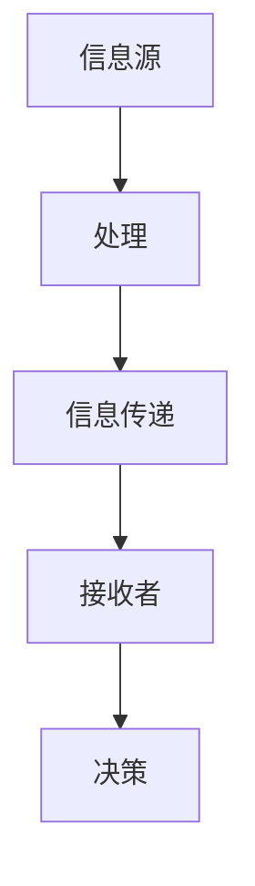

**Mermaid 流程图解析**

- A: 信息源，产生信息。
- B: 处理，对信息进行加工。
- C: 信息传递，将处理后的信息传递给接收者。
- D: 接收者，接收信息并作出决策。
- E: 决策，基于接收到的信息做出相应的决策。

##### 1.1.1 信息差的本质

信息差的本质在于信息的不对称性，这种不对称性可能带来以下影响：

- **市场优势**：掌握更多信息的一方可能在市场中占据优势地位。
- **决策偏差**：信息不对称可能导致决策者的判断失误。
- **竞争劣势**：信息匮乏的一方可能在竞争中处于不利地位。

**Mermaid 流程图扩展**

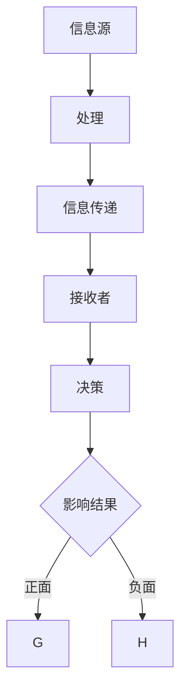

**Mermaid 流程图扩展解析**

- F: 影响结果，信息差可能带来正面或负面影响。
- G: 正面影响，如市场优势。
- H: 负面影响，如决策偏差。

##### 1.1.2 信息差在日常生活中的应用

信息差在日常生活中无处不在，以下是一些典型的应用场景：

- **购物决策**：消费者在购买商品时，通过比较不同商家的价格和质量信息，做出更明智的选择。
- **投资理财**：投资者通过获取和分析市场信息，做出投资决策，以实现财富增长。
- **求职就业**：求职者在面试前通过查阅公司信息和行业动态，提高求职成功率。

**Mermaid 流程图扩展**

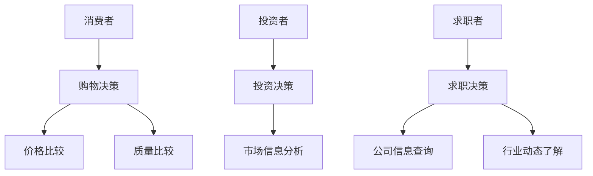

**Mermaid 流程图扩展解析**

- A: 消费者，通过价格和质量比较做出购物决策。
- E: 投资者，通过市场信息分析做出投资决策。
- H: 求职者，通过公司信息和行业动态做出求职决策。

##### 1.2 信息差的价值

信息差的价值主要体现在以下几个方面：

- **提升个人竞争力**：掌握更多信息有助于提升个人在职场或市场的竞争力。
- **实现财富增长**：信息差可以帮助个人或企业抓住市场机遇，实现财富增长。
- **促进社会进步**：信息差的存在可以激发创新和进步，推动社会的发展。

**Mermaid 流程图扩展**

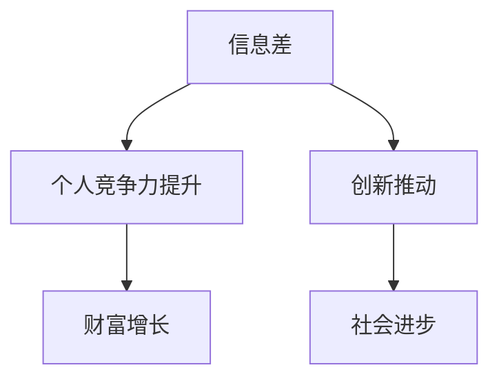

**Mermaid 流程图扩展解析**

- A: 信息差，提升个人竞争力和实现财富增长。
- D: 信息差，促进创新和推动社会进步。

##### 1.2.1 提升个人竞争力

信息差可以提升个人竞争力，主要体现在以下几个方面：

- **知识积累**：掌握更多信息有助于积累更丰富的知识体系。
- **决策能力**：基于充分的信息做出更明智的决策。
- **市场洞察**：了解市场动态和趋势，抓住机遇。

**Mermaid 流程图扩展**

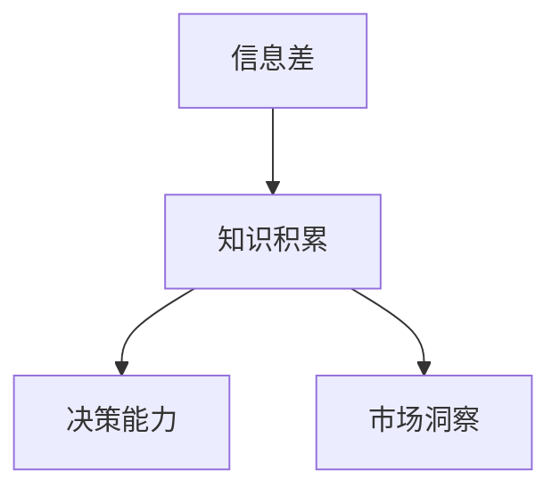

**Mermaid 流程图扩展解析**

- A: 信息差，促进知识积累、决策能力和市场洞察。

##### 1.2.2 实现财富增长

信息差可以帮助个人或企业实现财富增长，主要体现在以下几个方面：

- **投资机会**：通过分析市场信息，发现投资机会。
- **定价策略**：了解竞争对手和市场需求，制定更合理的定价策略。
- **风险控制**：基于充分的信息评估风险，降低投资风险。

**Mermaid 流程图扩展**

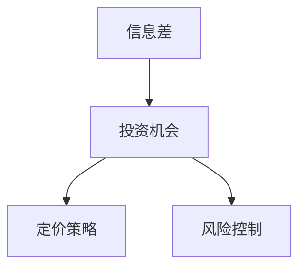

**Mermaid 流�程图扩展解析**

- A: 信息差，实现投资机会、定价策略和风险控制。

##### 1.2.3 促进社会进步

信息差可以促进社会进步，主要体现在以下几个方面：

- **科技创新**：通过信息不对称，激发科技创新和研发。
- **资源配置**：更有效地配置资源，提高社会效益。
- **决策优化**：基于全面的信息做出更科学的决策，推动社会进步。

**Mermaid 流程图扩展**

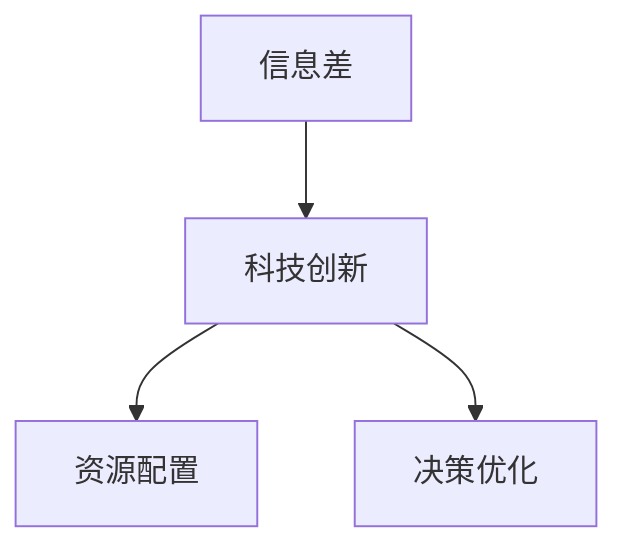

**Mermaid 流程图扩展解析**

- A: 信息差，促进科技创新、资源配置和决策优化。

---

### 第二部分: 大数据在信息差中的应用

#### 第2章: 大数据的定义与信息差

##### 2.1 大数据的定义

大数据（Big Data）是指无法用传统数据库工具进行捕获、管理和处理的数据集合，其具有以下四个V特点：

- **Volume（体积）**：数据量大，通常以TB、PB甚至EB为单位。
- **Velocity（速度）**：数据产生和处理速度非常快。
- **Variety（多样性）**：数据类型多样，包括结构化、半结构化和非结构化数据。
- **Veracity（真实性）**：数据真实性和可靠性问题。

**Mermaid 流程图**

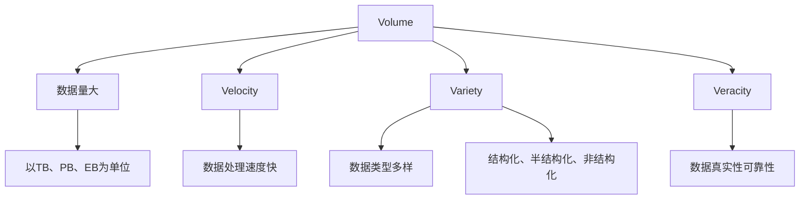

**Mermaid 流程图解析**

- A: Volume，数据量大，以TB、PB、EB为单位。
- B: Velocity，数据处理速度快。
- F: Variety，数据类型多样，包括结构化、半结构化和非结构化数据。
- I: Veracity，数据真实性和可靠性问题。

##### 2.1.2 大数据的特点

大数据的特点决定了其与传统数据处理的显著差异。以下是对大数据特点的进一步解析：

- **处理能力**：大数据技术能够高效地处理海量数据，包括实时数据处理和分析。
- **存储容量**：大数据存储技术能够存储海量数据，如Hadoop分布式存储系统。
- **分析能力**：大数据分析技术能够从海量数据中提取有价值的信息和洞察。
- **实时性**：大数据处理技术能够实现实时数据采集、处理和分析。

**Mermaid 流程图**

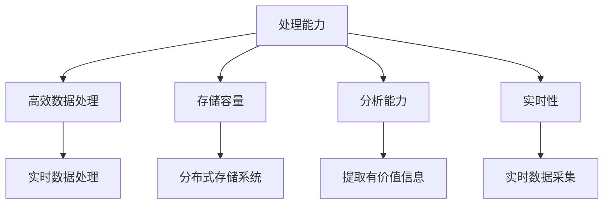

**Mermaid 流程图解析**

- A: 处理能力，高效数据处理和实时数据处理。
- D: 存储容量，分布式存储系统。
- F: 分析能力，提取有价值信息。
- H: 实时性，实时数据采集。

##### 2.2 大数据与信息差的联系

大数据与信息差之间存在着紧密的联系。大数据技术的发展和应用使得信息差更加明显和重要，主要体现在以下几个方面：

- **数据挖掘**：大数据技术可以挖掘海量数据中的潜在信息和价值，揭示信息差的存在。
- **数据可视化**：大数据可视化技术能够将复杂的数据转化为易于理解的信息，帮助企业和个人发现信息差。
- **市场细分**：大数据技术可以实现精细化的市场细分，发现具有不同信息需求的目标群体。

**Mermaid 流程图**

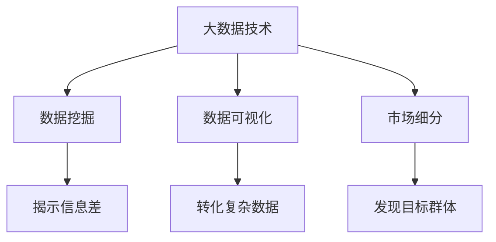

**Mermaid 流程图解析**

- A: 大数据技术，包括数据挖掘、数据可视化和市场细分。
- B: 数据挖掘，揭示信息差。
- D: 数据可视化，转化复杂数据。
- F: 市场细分，发现目标群体。

##### 2.2.1 数据挖掘技术

数据挖掘（Data Mining）是大数据技术中的重要组成部分，旨在从海量数据中提取有价值的信息和模式。以下是对数据挖掘技术的详细解释：

- **分类**：根据已知数据对未知数据进行分类。
- **聚类**：将相似数据分组，形成聚类。
- **关联规则挖掘**：发现数据之间的关联关系。
- **异常检测**：识别数据中的异常值。

**Mermaid 流程图**

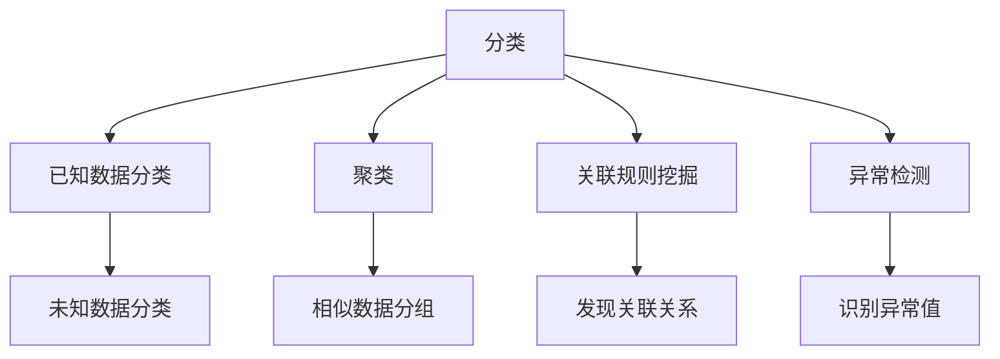

**Mermaid 流程图解析**

- A: 数据挖掘技术，包括分类、聚类、关联规则挖掘和异常检测。
- B: 分类，已知数据分类和未知数据分类。
- D: 聚类，相似数据分组。
- F: 关联规则挖掘，发现关联关系。
- H: 异常检测，识别异常值。

##### 2.2.2 数据可视化技术

数据可视化（Data Visualization）是将数据转化为图形或图表，以便更好地理解和分析。以下是对数据可视化技术的详细解释：

- **图表类型**：包括柱状图、折线图、饼图、散点图等。
- **交互性**：用户可以通过交互操作探索数据。
- **实时更新**：数据可视化工具可以实时更新，反映数据变化。

**Mermaid 流程图**

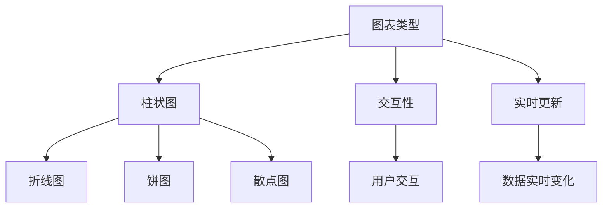

**Mermaid 流程图解析**

- A: 数据可视化技术，包括图表类型、交互性和实时更新。
- B: 图表类型，包括柱状图、折线图、饼图和散点图。
- F: 交互性，用户可以通过交互操作探索数据。
- H: 实时更新，数据可视化工具可以实时更新，反映数据变化。

##### 2.2.3 大数据在信息差中的优势

大数据在信息差中的应用具有以下优势：

- **效率提升**：通过数据挖掘和分析，快速识别信息差，提高决策效率。
- **成本降低**：减少信息不对称带来的决策失误和成本浪费。
- **竞争力增强**：利用大数据技术，企业可以更好地了解市场和客户需求，提升竞争力。

**Mermaid 流程图**

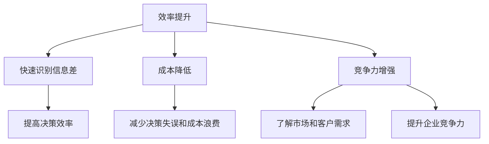

**Mermaid 流程图解析**

- A: 大数据在信息差中的优势，包括效率提升、成本降低和竞争力增强。
- B: 效率提升，快速识别信息差和提高决策效率。
- D: 成本降低，减少决策失误和成本浪费。
- F: 竞争力增强，了解市场和客户需求，提升企业竞争力。

---

### 第三部分: 大数据技术在企业中的应用

#### 第3章: 大数据在市场营销中的应用

##### 3.1 市场细分

市场细分（Market Segmentation）是市场营销中的重要策略，通过将市场划分为不同的子市场，以更有效地满足客户需求。大数据技术能够帮助企业实现精细化的市场细分，以下是对市场细分技术的详细解释：

- **客户特征分析**：利用大数据技术对客户的年龄、性别、收入、地理位置等信息进行深入分析。
- **行为分析**：通过分析客户的购买行为、浏览记录和社交媒体活动，了解客户偏好。
- **需求预测**：基于历史数据和趋势分析，预测客户未来的需求和购买行为。

**Mermaid 流程图**

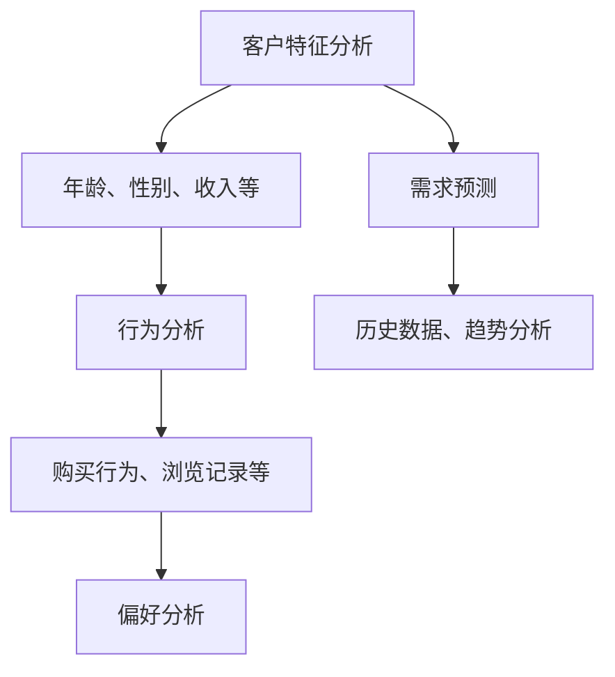

**Mermaid 流程图解析**

- A: 客户特征分析，包括年龄、性别、收入等。
- B: 行为分析，包括购买行为、浏览记录等。
- D: 偏好分析，基于行为分析结果。
- F: 需求预测，基于历史数据和趋势分析。

##### 3.1.1 数据驱动的市场细分方法

数据驱动的市场细分方法是一种基于大数据分析的市场细分方法，通过分析海量数据来识别潜在的客户群体，以下是对数据驱动市场细分方法的详细解释：

- **聚类分析**：使用聚类算法将客户数据分为不同的群体，每个群体具有相似的特征和需求。
- **回归分析**：通过回归模型分析客户特征与需求之间的关系，识别关键因素。
- **机器学习**：使用机器学习算法对客户数据进行分类和预测，实现更精准的市场细分。

**Mermaid 流程图**

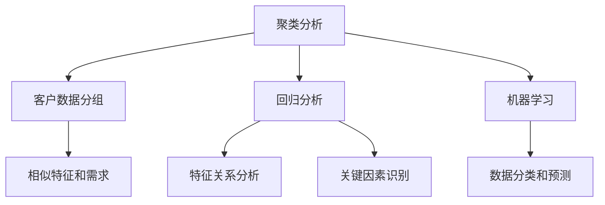

**Mermaid 流程图解析**

- A: 聚类分析，将客户数据分为不同的群体。
- B: 相似特征和需求，基于聚类分析结果。
- D: 回归分析，分析特征关系和识别关键因素。
- G: 机器学习，实现数据分类和预测。

##### 3.1.2 市场细分对营销策略的影响

市场细分对营销策略具有重要影响，以下是对市场细分对营销策略影响的详细解释：

- **精准营销**：通过细分市场，企业可以更精准地定位目标客户，制定个性化的营销策略。
- **提高转化率**：基于客户特征和需求，制定更有效的营销活动，提高客户转化率。
- **降低营销成本**：集中资源针对目标客户群体，减少无效营销，降低营销成本。

**Mermaid 流程图**

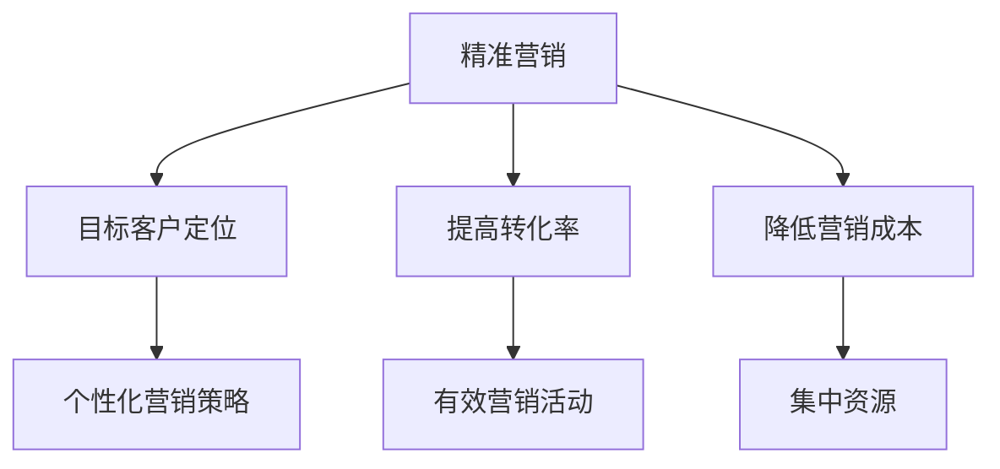

**Mermaid 流程图解析**

- A: 精准营销，目标客户定位和个性化营销策略。
- D: 提高转化率，基于有效营销活动。
- F: 降低营销成本，集中资源。

##### 3.2 用户行为分析

用户行为分析（User Behavior Analysis）是大数据技术在市场营销中的重要应用，通过分析用户的购买行为、浏览习惯、搜索记录等，帮助企业更好地了解用户需求，以下是对用户行为分析的详细解释：

- **购买行为分析**：分析用户在购买过程中的行为，如浏览商品、添加购物车、完成交易等。
- **浏览习惯分析**：分析用户在网站上的浏览路径、停留时间和页面交互等。
- **搜索记录分析**：分析用户在搜索引擎上的搜索关键词和搜索行为。

**Mermaid 流程图**

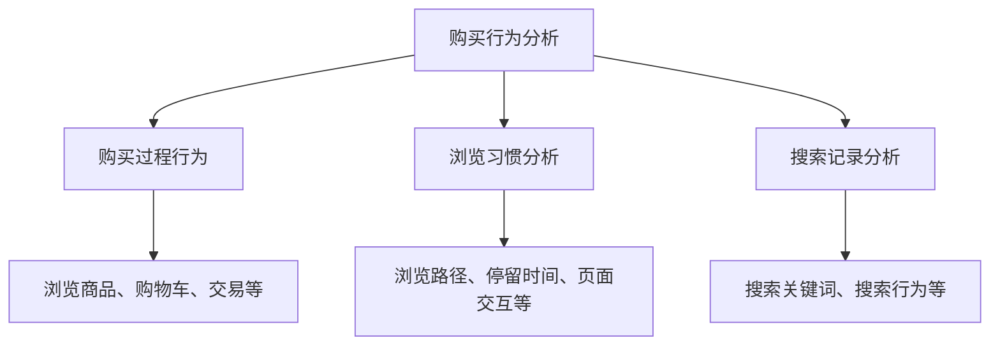

**Mermaid 流程图解析**

- A: 购买行为分析，购买过程中的行为。
- D: 浏览习惯分析，包括浏览路径、停留时间和页面交互。
- F: 搜索记录分析，包括搜索关键词和搜索行为。

##### 3.2.1 用户行为数据的收集与处理

用户行为数据的收集与处理是用户行为分析的基础，以下是对用户行为数据收集与处理的详细解释：

- **数据收集**：通过网站日志、点击流数据和第三方数据源等渠道收集用户行为数据。
- **数据清洗**：去除重复数据、缺失数据和错误数据，确保数据质量。
- **数据处理**：对收集到的数据进行预处理，如数据格式转换、数据整合和数据标准化。

**Mermaid 流程图**

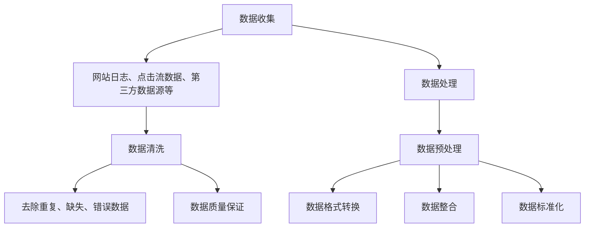

**Mermaid 流程图解析**

- A: 数据收集，包括网站日志、点击流数据和第三方数据源等。
- B: 数据清洗，去除重复、缺失和错误数据。
- C: 数据处理，包括数据预处理，如数据格式转换、数据整合和数据标准化。

##### 3.2.2 用户行为分析的应用

用户行为分析在企业市场营销中具有广泛的应用，以下是对用户行为分析应用的详细解释：

- **个性化推荐**：基于用户行为数据，为用户推荐感兴趣的商品和服务。
- **营销活动优化**：通过分析用户行为，优化营销活动的效果，提高转化率。
- **客户流失预警**：通过分析用户行为数据，预测潜在的客户流失，采取相应的措施。

**Mermaid 流程图**

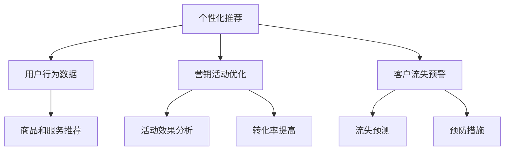

**Mermaid 流程图解析**

- A: 个性化推荐，基于用户行为数据为用户推荐商品和服务。
- D: 营销活动优化，通过分析用户行为优化活动效果和转化率。
- G: 客户流失预警，通过分析用户行为预测潜在客户流失并采取预防措施。

##### 3.3 市场趋势预测

市场趋势预测（Market Trend Prediction）是大数据技术在市场营销中的重要应用，通过分析历史数据和当前市场状况，预测未来市场的变化趋势，以下是对市场趋势预测的详细解释：

- **时间序列分析**：分析时间序列数据，识别趋势和周期性变化。
- **回归分析**：建立回归模型，预测未来市场的变化。
- **机器学习**：使用机器学习算法，如随机森林和神经网络，实现市场趋势预测。

**Mermaid 流程图**

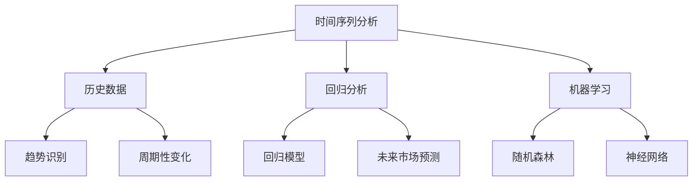

**Mermaid 流程图解析**

- A: 时间序列分析，包括历史数据、趋势识别和周期性变化。
- E: 回归分析，包括回归模型和未来市场预测。
- H: 机器学习，包括随机森林和神经网络。

##### 3.3.1 数据驱动的市场趋势预测方法

数据驱动的市场趋势预测方法是一种基于大数据分析的方法，通过分析历史数据和当前市场状况，预测未来市场的变化趋势，以下是对数据驱动市场趋势预测方法的详细解释：

- **时间序列预测**：使用时间序列模型，如ARIMA和LSTM，预测未来的市场走势。
- **多元回归预测**：使用多元回归模型，分析多个变量对市场趋势的影响。
- **机器学习预测**：使用机器学习算法，如决策树和K-均值聚类，实现市场趋势预测。

**Mermaid 流程图**

```mermaid
graph TD
A[时间序列预测] --> B[ARIMA模型]
B --> C[LSTM模型]
A --> D[多元回归预测]
D --> E[多元回归模型]
D --> F[变量影响分析]
A --> G[机器学习预测]
G --> H[决策树]
G --> I[K-均值聚类]
```

**Mermaid 流程图解析**

- A: 时间序列预测，包括ARIMA模型和LSTM模型。
- D: 多元回归预测，包括多元回归模型和变量影响分析。
- G: 机器学习预测，包括决策树和K-均值聚类。

##### 3.3.2 市场趋势预测在实际营销中的应用

市场趋势预测在实际营销中具有重要的应用价值，以下是对市场趋势预测在实际营销中应用的详细解释：

- **产品规划**：通过预测市场需求，制定合适的产品规划和生产计划。
- **库存管理**：基于市场需求预测，优化库存管理，减少库存成本。
- **营销策略调整**：根据市场需求变化，调整营销策略，提高营销效果。

**Mermaid 流程图**

```mermaid
graph TD
A[产品规划] --> B[市场需求预测]
B --> C[生产计划]
A --> D[库存管理]
D --> E[库存成本优化]
A --> F[营销策略调整]
F --> G[营销效果提升]
```

**Mermaid 流程图解析**

- A: 产品规划，基于市场需求预测制定生产计划。
- D: 库存管理，基于市场需求预测优化库存成本。
- F: 营销策略调整，根据市场需求变化提升营销效果。

---

#### 第4章: 大数据在产品开发中的应用

##### 4.1 需求分析

需求分析（Requirement Analysis）是产品开发过程中的重要环节，通过对用户需求的分析和理解，确保产品能够满足用户需求。大数据技术在需求分析中具有广泛的应用，以下是对大数据在需求分析中应用的详细解释：

- **用户反馈分析**：通过分析用户反馈数据，了解用户对现有产品的评价和使用情况，识别需求。
- **市场调研**：通过大数据技术进行市场调研，分析市场趋势和用户需求。
- **需求预测**：基于历史数据和当前市场状况，预测未来的用户需求。

**Mermaid 流程图**

```mermaid
graph TD
A[用户反馈分析] --> B[用户评价]
B --> C[使用情况]
A --> D[市场调研]
D --> E[市场趋势]
D --> F[用户需求]
A --> G[需求预测]
G --> H[历史数据]
G --> I[市场状况]
```

**Mermaid 流程图解析**

- A: 用户反馈分析，包括用户评价和使用情况。
- D: 市场调研，包括市场趋势和用户需求。
- G: 需求预测，基于历史数据和当前市场状况。

##### 4.1.1 数据驱动的需求分析方法

数据驱动的需求分析方法是一种基于大数据分析的方法，通过分析用户反馈、市场调研和历史数据，识别和理解用户需求，以下是对数据驱动需求分析方法的详细解释：

- **用户反馈分析**：使用机器学习算法，如情感分析和主题模型，分析用户反馈数据，提取用户需求。
- **市场调研**：利用大数据技术进行市场调研，分析市场趋势和用户需求。
- **需求预测**：使用时间序列分析和回归分析等模型，预测未来的用户需求。

**Mermaid 流程图**

```mermaid
graph TD
A[用户反馈分析] --> B[情感分析]
B --> C[主题模型]
A --> D[市场调研]
D --> E[时间序列分析]
D --> F[回归分析]
A --> G[需求预测]
G --> H[预测模型]
```

**Mermaid 流程图解析**

- A: 用户反馈分析，包括情感分析和主题模型。
- D: 市场调研，包括时间序列分析和回归分析。
- G: 需求预测，基于预测模型。

##### 4.1.2 需求分析对产品开发的指导意义

需求分析对产品开发具有重要的指导意义，以下是对需求分析对产品开发指导意义的详细解释：

- **明确产品目标**：通过需求分析，明确产品的目标和功能，确保产品能够满足用户需求。
- **优化产品设计**：基于需求分析结果，优化产品设计和用户体验。
- **降低开发风险**：通过提前识别和解决潜在的需求问题，降低产品开发风险。

**Mermaid 流程图**

```mermaid
graph TD
A[明确产品目标] --> B[需求分析]
B --> C[产品功能]
A --> D[优化产品设计]
D --> E[用户体验]
A --> F[降低开发风险]
F --> G[需求问题解决]
```

**Mermaid 流程图解析**

- A: 明确产品目标，通过需求分析确定产品功能。
- D: 优化产品设计，关注用户体验。
- F: 降低开发风险，通过解决需求问题。

##### 4.2 用户反馈分析

用户反馈分析（User Feedback Analysis）是产品开发中了解用户需求的重要手段，通过分析用户对产品的反馈，可以识别用户的需求和问题，以下是对用户反馈分析的详细解释：

- **反馈收集**：通过调查问卷、用户访谈和社交媒体等渠道收集用户反馈。
- **情感分析**：使用自然语言处理技术，对用户反馈进行情感分析，提取用户情感和意见。
- **主题模型**：使用主题模型，如LDA，分析用户反馈中的主题和趋势。

**Mermaid 流程图**

```mermaid
graph TD
A[反馈收集] --> B[调查问卷]
B --> C[用户访谈]
B --> D[社交媒体]
A --> E[情感分析]
E --> F[情感提取]
A --> G[主题模型]
G --> H[主题分析]
```

**Mermaid 流程图解析**

- A: 反馈收集，包括调查问卷、用户访谈和社交媒体。
- E: 情感分析，提取用户情感和意见。
- G: 主题模型，分析用户反馈中的主题和趋势。

##### 4.2.1 用户反馈数据的收集与处理

用户反馈数据的收集与处理是用户反馈分析的基础，以下是对用户反馈数据收集与处理的详细解释：

- **数据收集**：通过多种渠道收集用户反馈数据，如在线调查、用户评论和社交媒体数据。
- **数据预处理**：对收集到的数据进行清洗和预处理，包括去除噪声、缺失值填充和数据格式转换。
- **数据存储**：将预处理后的数据存储在数据库中，以便后续分析和挖掘。

**Mermaid 流程图**

```mermaid
graph TD
A[数据收集] --> B[在线调查]
B --> C[用户评论]
B --> D[社交媒体]
A --> E[数据预处理]
E --> F[去噪]
E --> G[缺失值填充]
E --> H[数据格式转换]
A --> I[数据存储]
I --> J[数据库存储]
```

**Mermaid 流程图解析**

- A: 数据收集，包括在线调查、用户评论和社交媒体。
- E: 数据预处理，包括去噪、缺失值填充和数据格式转换。
- I: 数据存储，将预处理后的数据存储在数据库中。

##### 4.2.2 用户反馈分析的应用

用户反馈分析在产品开发中具有广泛的应用，以下是对用户反馈分析应用的详细解释：

- **产品优化**：通过分析用户反馈，识别产品的优点和不足，优化产品功能和用户体验。
- **需求挖掘**：从用户反馈中挖掘新的需求，指导产品迭代和功能扩展。
- **质量评估**：通过用户反馈评估产品的质量和用户体验，识别改进机会。

**Mermaid 流程图**

```mermaid
graph TD
A[产品优化] --> B[功能改进]
B --> C[用户体验提升]
A --> D[需求挖掘]
D --> E[功能扩展]
D --> F[产品迭代]
A --> G[质量评估]
G --> H[质量改进]
G --> I[用户体验评估]
```

**Mermaid 流程图解析**

- A: 产品优化，包括功能改进和用户体验提升。
- D: 需求挖掘，包括功能扩展和产品迭代。
- G: 质量评估，包括质量改进和用户体验评估。

##### 4.3 产品优化

产品优化（Product Optimization）是产品开发过程中的重要环节，通过改进产品功能和用户体验，提升产品价值和市场竞争力，以下是对产品优化的详细解释：

- **功能优化**：根据用户反馈和市场需求，改进产品的功能模块和交互设计。
- **性能优化**：通过技术手段提高产品的性能和稳定性，如代码优化、数据库优化等。
- **用户体验优化**：通过用户行为分析，改进产品的用户体验，提升用户满意度。

**Mermaid 流程图**

```mermaid
graph TD
A[功能优化] --> B[功能改进]
B --> C[交互设计优化]
A --> D[性能优化]
D --> E[代码优化]
D --> F[数据库优化]
A --> G[用户体验优化]
G --> H[用户行为分析]
G --> I[满意度提升]
```

**Mermaid 流程图解析**

- A: 产品优化，包括功能优化、性能优化和用户体验优化。
- B: 功能优化，包括功能改进和交互设计优化。
- D: 性能优化，包括代码优化和数据库优化。
- G: 用户体验优化，包括用户行为分析和满意度提升。

##### 4.3.1 数据驱动的产品优化方法

数据驱动的产品优化方法是一种基于大数据分析的方法，通过收集和分析用户数据，优化产品的功能和用户体验，以下是对数据驱动产品优化方法的详细解释：

- **用户行为分析**：通过分析用户在产品中的行为数据，识别用户的痛点和需求。
- **A/B测试**：通过A/B测试，对比不同设计方案的效果，选择最优方案。
- **用户反馈分析**：通过分析用户反馈，优化产品的功能模块和用户体验。

**Mermaid 流程图**

```mermaid
graph TD
A[用户行为分析] --> B[行为数据]
B --> C[痛点识别]
B --> D[需求分析]
A --> E[A/B测试]
E --> F[方案对比]
E --> G[最优方案选择]
A --> H[用户反馈分析]
H --> I[功能优化]
H --> J[用户体验优化]
```

**Mermaid 流程图解析**

- A: 用户行为分析，包括行为数据、痛点识别和需求分析。
- E: A/B测试，包括方案对比和最优方案选择。
- H: 用户反馈分析，包括功能优化和用户体验优化。

##### 4.3.2 产品优化在实际开发中的应用

产品优化在实际开发中具有重要的应用价值，以下是对产品优化在实际开发中应用的详细解释：

- **提升产品竞争力**：通过优化产品功能和用户体验，提升产品的市场竞争力和用户满意度。
- **降低开发成本**：通过数据驱动的优化方法，减少无效开发和重复劳动，降低开发成本。
- **提高开发效率**：通过A/B测试和用户反馈分析，快速迭代和优化产品，提高开发效率。

**Mermaid 流程图**

```mermaid
graph TD
A[提升竞争力] --> B[功能优化]
B --> C[用户体验优化]
A --> D[降低开发成本]
D --> E[数据驱动优化]
D --> F[减少无效开发]
A --> G[提高开发效率]
G --> H[A/B测试]
G --> I[快速迭代]
```

**Mermaid 流程图解析**

- A: 提升竞争力，通过功能优化和用户体验优化。
- D: 降低开发成本，通过数据驱动优化和减少无效开发。
- G: 提高开发效率，通过A/B测试和快速迭代。

---

#### 第5章: 大数据在供应链管理中的应用

##### 5.1 库存管理

库存管理（Inventory Management）是供应链管理中的重要环节，通过有效管理库存，确保企业能够满足市场需求，以下是对大数据在库存管理中应用的详细解释：

- **需求预测**：通过大数据分析，预测市场需求，制定合理的库存策略。
- **库存监控**：利用大数据技术实时监控库存水平，识别库存短缺或过剩的情况。
- **库存优化**：通过数据分析，优化库存结构，降低库存成本。

**Mermaid 流程图**

```mermaid
graph TD
A[需求预测] --> B[市场需求预测]
B --> C[库存策略制定]
A --> D[库存监控]
D --> E[实时库存监控]
D --> F[库存短缺和过剩识别]
A --> G[库存优化]
G --> H[库存结构调整]
G --> I[库存成本降低]
```

**Mermaid 流程图解析**

- A: 需求预测，包括市场需求预测和库存策略制定。
- D: 库存监控，包括实时库存监控和库存短缺及过剩识别。
- G: 库存优化，包括库存结构调整和库存成本降低。

##### 5.1.1 数据驱动的库存管理方法

数据驱动的库存管理方法是一种基于大数据分析的方法，通过分析历史数据和当前市场状况，制定合理的库存策略，以下是对数据驱动库存管理方法的详细解释：

- **时间序列预测**：使用时间序列模型，如ARIMA和LSTM，预测市场需求，制定库存策略。
- **回归分析**：通过回归模型分析市场需求和库存水平之间的关系，优化库存策略。
- **机器学习**：使用机器学习算法，如随机森林和神经网络，实现库存管理。

**Mermaid 流程图**

```mermaid
graph TD
A[时间序列预测] --> B[ARIMA模型]
B --> C[LSTM模型]
A --> D[回归分析]
D --> E[回归模型]
D --> F[关系分析]
A --> G[机器学习]
G --> H[随机森林]
G --> I[神经网络]
```

**Mermaid 流程图解析**

- A: 时间序列预测，包括ARIMA模型和LSTM模型。
- D: 回归分析，包括回归模型和关系分析。
- G: 机器学习，包括随机森林和神经网络。

##### 5.1.2 库存管理对供应链效率的影响

库存管理对供应链效率具有重要影响，以下是对库存管理对供应链效率影响的详细解释：

- **降低库存成本**：通过合理的管理库存，减少库存短缺和过剩，降低库存成本。
- **提高物流效率**：优化库存水平，提高物流配送的准确性和及时性。
- **增强供应链灵活性**：通过实时监控库存水平，快速响应市场需求变化，提高供应链的灵活性。

**Mermaid 流程图**

```mermaid
graph TD
A[降低库存成本] --> B[库存短缺和过剩减少]
B --> C[库存成本降低]
A --> D[提高物流效率]
D --> E[物流配送准确性和及时性]
A --> F[增强供应链灵活性]
F --> G[实时监控]
F --> H[市场需求响应]
```

**Mermaid 流程图解析**

- A: 降低库存成本，通过减少库存短缺和过剩。
- D: 提高物流效率，包括物流配送的准确性和及时性。
- F: 增强供应链灵活性，包括实时监控和市场需求响应。

##### 5.2 供应商评估

供应商评估（Supplier Evaluation）是供应链管理中的重要环节，通过对供应商的评估和选择，确保供应链的稳定性和质量，以下是对大数据在供应商评估中应用的详细解释：

- **供应商绩效分析**：通过分析供应商的历史绩效数据，评估供应商的能力和可靠性。
- **供应链风险分析**：通过大数据分析，识别供应链中的风险，如供应商延迟、质量问题等。
- **供应商选择**：基于绩效分析和风险分析结果，选择合适的供应商。

**Mermaid 流程图**

```mermaid
graph TD
A[供应商绩效分析] --> B[历史绩效数据]
B --> C[供应商能力评估]
B --> D[可靠性评估]
A[供应链风险分析] --> E[风险识别]
E --> F[风险控制]
E --> G[风险管理]
A[供应商选择] --> H[绩效分析结果]
H --> I[风险分析结果]
H --> J[合适供应商选择]
```

**Mermaid 流程图解析**

- A: 供应商绩效分析，包括历史绩效数据、供应商能力和可靠性评估。
- A[供应链风险分析]，包括风险识别、风险控制和风险管理。
- A[供应商选择]，基于绩效分析和风险分析结果选择合适供应商。

##### 5.2.1 数据驱动的供应商评估方法

数据驱动的供应商评估方法是一种基于大数据分析的方法，通过分析供应商的历史数据和供应链绩效数据，评估供应商的能力和可靠性，以下是对数据驱动供应商评估方法的详细解释：

- **历史绩效数据分析**：使用统计分析和机器学习算法，分析供应商的历史绩效数据，识别关键指标。
- **供应链绩效分析**：通过大数据分析，评估供应商在供应链中的表现，如准时交货率、质量合格率等。
- **风险评估**：使用风险分析模型，预测供应商可能出现的风险，如延迟交货、质量问题等。

**Mermaid 流程图**

```mermaid
graph TD
A[历史绩效数据分析] --> B[统计分析]
B --> C[关键指标识别]
A --> D[供应链绩效分析]
D --> E[供应链表现评估]
D --> F[准时交货率、质量合格率等]
A --> G[风险评估]
G --> H[风险预测模型]
G --> I[延迟交货、质量问题等]
```

**Mermaid 流程图解析**

- A: 历史绩效数据分析，包括统计分析和关键指标识别。
- D: 供应链绩效分析，包括供应链表现评估。
- G: 风险评估，包括风险预测模型和潜在风险识别。

##### 5.2.2 供应商评估在实际采购中的应用

供应商评估在实际采购中具有重要的应用价值，以下是对供应商评估在实际采购中应用的详细解释：

- **选择合适供应商**：通过供应商评估，选择具备能力和可靠性的供应商，确保供应链的稳定性和质量。
- **降低采购成本**：通过评估供应商的价格和质量，选择性价比最高的供应商，降低采购成本。
- **提高供应链效率**：通过评估供应商的交货时间和服务质量，提高供应链的整体效率。

**Mermaid 流程图**

```mermaid
graph TD
A[选择合适供应商] --> B[供应商评估]
B --> C[能力和可靠性评估]
A --> D[降低采购成本]
D --> E[性价比最高供应商]
A --> F[提高供应链效率]
F --> G[交货时间评估]
F --> H[服务质量评估]
```

**Mermaid 流程图解析**

- A: 选择合适供应商，基于供应商评估。
- D: 降低采购成本，选择性价比最高的供应商。
- F: 提高供应链效率，通过交货时间和服务质量评估。

##### 5.3 物流优化

物流优化（Logistics Optimization）是供应链管理中的重要环节，通过优化物流流程和提高物流效率，降低物流成本，以下是对大数据在物流优化中应用的详细解释：

- **运输路径优化**：通过大数据分析，优化运输路径和配送计划，提高运输效率。
- **库存配送协调**：通过数据分析，协调库存和配送，提高库存周转率。
- **成本控制**：通过数据分析，识别物流成本的关键因素，降低物流成本。

**Mermaid 流程图**

```mermaid
graph TD
A[运输路径优化] --> B[数据分析]
B --> C[路径优化]
A --> D[库存配送协调]
D --> E[库存周转率提高]
D --> F[配送计划优化]
A --> G[成本控制]
G --> H[成本关键因素识别]
G --> I[成本降低]
```

**Mermaid 流程图解析**

- A: 运输路径优化，通过数据分析优化路径。
- D: 库存配送协调，包括库存周转率和配送计划优化。
- G: 成本控制，包括成本关键因素识别和成本降低。

##### 5.3.1 数据驱动的物流优化方法

数据驱动的物流优化方法是一种基于大数据分析的方法，通过分析物流数据，优化物流流程和提高物流效率，以下是对数据驱动物流优化方法的详细解释：

- **路径优化算法**：使用最优化算法，如遗传算法和蚁群算法，优化运输路径。
- **需求预测**：通过大数据分析，预测市场需求，制定合理的配送计划。
- **智能调度**：使用机器学习算法，如深度学习和强化学习，实现智能调度。

**Mermaid 流程图**

```mermaid
graph TD
A[路径优化算法] --> B[遗传算法]
B --> C[蚁群算法]
A --> D[需求预测]
D --> E[市场需求预测]
D --> F[配送计划制定]
A --> G[智能调度]
G --> H[深度学习]
G --> I[强化学习]
```

**Mermaid 流程图解析**

- A: 路径优化算法，包括遗传算法和蚁群算法。
- D: 需求预测，包括市场需求预测和配送计划制定。
- G: 智能调度，包括深度学习和强化学习。

##### 5.3.2 物流优化对供应链效率的提升

物流优化对供应链效率的提升具有重要意义，以下是对物流优化对供应链效率提升的详细解释：

- **降低物流成本**：通过优化物流流程和提高物流效率，降低物流成本。
- **提高运输效率**：通过优化运输路径和配送计划，提高运输效率。
- **提升供应链灵活性**：通过智能调度和实时监控，提升供应链的灵活性和响应速度。

**Mermaid 流程图**

```mermaid
graph TD
A[降低物流成本] --> B[物流流程优化]
B --> C[物流效率提高]
A --> D[提高运输效率]
D --> E[运输路径优化]
D --> F[配送计划优化]
A --> G[提升供应链灵活性]
G --> H[智能调度]
G --> I[实时监控]
```

**Mermaid 流程图解析**

- A: 降低物流成本，通过物流流程优化和物流效率提高。
- D: 提高运输效率，通过运输路径优化和配送计划优化。
- G: 提升供应链灵活性，通过智能调度和实时监控。

---

### 第四部分: 大数据提升企业效率的案例分析

#### 第6章: 大数据提升企业效率的案例分析

##### 6.1 案例一：电商企业

**案例背景**

某电商企业，主要从事零售业务，拥有庞大的客户群体和丰富的商品种类。随着业务规模的不断扩大，该企业面临着提高运营效率和降低成本的压力。

**大数据应用**

该电商企业利用大数据技术，实现了以下几个方面的应用：

1. **用户行为分析**：通过分析用户的购买行为、浏览记录和搜索关键词，了解用户的兴趣和需求，为个性化推荐和精准营销提供依据。
2. **需求预测**：利用历史销售数据和当前市场状况，预测未来的市场需求，优化库存管理和采购计划。
3. **供应链优化**：通过分析物流数据和供应商绩效，优化运输路径和库存配送，提高供应链效率。

**效果分析**

通过大数据技术的应用，该电商企业取得了显著的成效：

- **提高销售额**：基于用户行为分析和需求预测，实现了个性化推荐和精准营销，提高了销售额和用户满意度。
- **降低成本**：通过优化库存管理和采购计划，降低了库存成本和采购成本。
- **提高供应链效率**：通过优化运输路径和库存配送，提高了物流效率和供应链灵活性。

**案例分析总结**

该电商企业的案例表明，大数据技术在提升企业效率和降低成本方面具有巨大的潜力。通过用户行为分析、需求预测和供应链优化，企业可以更好地了解市场和客户需求，实现精准营销和高效运营。

---

##### 6.2 案例二：制造企业

**案例背景**

某制造企业，主要从事电子产品生产，拥有多个生产工厂和全球销售网络。随着市场竞争的加剧，该企业面临着提高生产效率和降低成本的压力。

**大数据应用**

该制造企业利用大数据技术，实现了以下几个方面的应用：

1. **生产过程监控**：通过传感器和数据采集设备，实时监控生产线的运行状态和质量指标，实现生产过程的智能化监控和优化。
2. **质量控制**：利用大数据分析技术，对生产过程中的数据进行分析，识别潜在的质量问题，提高产品质量。
3. **供应链优化**：通过分析供应链数据，优化采购、生产和配送流程，提高供应链效率。

**效果分析**

通过大数据技术的应用，该制造企业取得了显著的成效：

- **提高生产效率**：通过生产过程监控和质量控制，减少了生产故障和质量问题，提高了生产效率和设备利用率。
- **降低成本**：通过优化供应链流程，降低了采购、生产和配送成本。
- **提高产品质量**：通过大数据分析，识别和解决了生产过程中的质量问题，提高了产品质量和用户满意度。

**案例分析总结**

该制造企业的案例表明，大数据技术在提高生产效率和降低成本方面具有显著的作用。通过生产过程监控、质量控制和供应链优化，企业可以更好地管理生产过程，提高产品质量和用户满意度。

---

##### 6.3 案例三：金融机构

**案例背景**

某金融机构，主要从事金融服务，包括银行、保险和投资等。随着金融市场的不断发展，该企业面临着提高客户满意度和降低风险的压力。

**大数据应用**

该金融机构利用大数据技术，实现了以下几个方面的应用：

1. **客户行为分析**：通过分析客户的交易记录、浏览行为和社交媒体活动，了解客户的需求和风险偏好。
2. **风险控制**：利用大数据分析技术，对客户的交易行为和风险指标进行分析，识别潜在的风险，采取相应的控制措施。
3. **市场营销**：通过大数据分析，了解客户的需求和市场趋势，制定精准的营销策略。

**效果分析**

通过大数据技术的应用，该金融机构取得了显著的成效：

- **提高客户满意度**：通过客户行为分析和精准营销，提供了更符合客户需求的服务，提高了客户满意度和忠诚度。
- **降低风险**：通过风险控制和风险预测，有效识别和降低了潜在的风险，保障了金融机构的安全和稳定。
- **提高市场营销效果**：通过大数据分析，实现了精准的市场营销，提高了营销转化率和客户转化率。

**案例分析总结**

该金融机构的案例表明，大数据技术在提高客户满意度、降低风险和提高市场营销效果方面具有重要的作用。通过客户行为分析、风险控制和市场营销，金融机构可以更好地了解客户需求和市场趋势，提供更优质的服务。

---

### 第五部分: 大数据提升企业效率的实践策略

#### 第7章: 制定大数据战略

##### 7.1 明确大数据目标

制定大数据战略的第一步是明确大数据目标，以下是对明确大数据目标的详细解释：

1. **业务目标**：明确大数据在企业战略中的定位和目标，如提升运营效率、降低成本、增强竞争力等。
2. **技术目标**：确定大数据技术的应用范围和方向，如数据挖掘、数据可视化、机器学习等。
3. **团队目标**：建立专业的大数据团队，明确团队成员的职责和目标。

**Mermaid 流程图**

```mermaid
graph TD
A[业务目标] --> B[企业战略定位]
B --> C[运营效率提升]
B --> D[成本降低]
B --> E[竞争力增强]
A[技术目标] --> F[数据挖掘]
F --> G[数据可视化]
F --> H[机器学习]
A[团队目标] --> I[团队职责]
I --> J[团队成员职责]
```

**Mermaid 流程图解析**

- A: 明确大数据目标，包括业务目标、技术目标和团队目标。
- B: 业务目标，包括企业战略定位、运营效率提升、成本降低和竞争力增强。
- F: 技术目标，包括数据挖掘、数据可视化和机器学习。
- I: 团队目标，明确团队职责和团队成员职责。

##### 7.2 选择合适的大数据技术

选择合适的大数据技术是制定大数据战略的重要环节，以下是对选择合适的大数据技术的详细解释：

1. **技术评估**：评估不同大数据技术的优缺点，如Hadoop、Spark、Flink等。
2. **需求分析**：根据业务需求和目标，选择合适的技术解决方案。
3. **成本效益分析**：评估大数据技术的成本效益，选择具有最佳性价比的技术。

**Mermaid 流程图**

```mermaid
graph TD
A[技术评估] --> B[Hadoop]
B --> C[优点]
B --> D[缺点]
A --> E[Spark]
E --> F[优点]
E --> G[缺点]
A --> H[Flink]
H --> I[优点]
H --> J[缺点]
A[需求分析] --> K[业务需求]
K --> L[技术选择]
A[成本效益分析] --> M[成本评估]
M --> N[性价比评估]
```

**Mermaid 流程图解析**

- A: 技术评估，包括Hadoop、Spark和Flink的优缺点评估。
- K: 需求分析，根据业务需求选择合适的技术。
- M: 成本效益分析，评估大数据技术的成本和性价比。

##### 7.3 建立大数据团队

建立大数据团队是实施大数据战略的关键步骤，以下是对建立大数据团队的详细解释：

1. **团队组建**：组建由数据科学家、数据工程师和业务分析师组成的大数据团队。
2. **技能培训**：为团队成员提供大数据技术的培训和实战经验。
3. **协作机制**：建立跨部门协作机制，确保大数据项目能够顺利实施。

**Mermaid 流程图**

```mermaid
graph TD
A[团队组建] --> B[数据科学家]
B --> C[数据工程师]
B --> D[业务分析师]
A[技能培训] --> E[数据科学家培训]
E --> F[数据工程师培训]
E --> G[业务分析师培训]
A[协作机制] --> H[跨部门协作]
H --> I[项目顺利实施]
```

**Mermaid 流程图解析**

- A: 团队组建，包括数据科学家、数据工程师和业务分析师。
- E: 技能培训，为团队成员提供培训和实战经验。
- H: 协作机制，建立跨部门协作机制，确保项目顺利实施。

---

#### 第8章: 数据质量管理

##### 8.1 数据清洗

数据清洗（Data Cleaning）是数据质量管理的重要环节，以下是对数据清洗的详细解释：

1. **数据识别**：识别数据中的错误、重复和缺失值。
2. **错误处理**：对错误数据进行修正或删除。
3. **缺失值处理**：对缺失值进行填充或删除。

**Mermaid 流程图**

```mermaid
graph TD
A[数据识别] --> B[错误数据]
B --> C[重复数据]
B --> D[缺失数据]
A[错误处理] --> E[数据修正]
E --> F[数据删除]
A[缺失值处理] --> G[数据填充]
G --> H[数据删除]
```

**Mermaid 流程图解析**

- A: 数据识别，包括错误数据、重复数据和缺失数据。
- E: 错误处理，包括数据修正和删除。
- G: 缺失值处理，包括数据填充和删除。

##### 8.2 数据标准化

数据标准化（Data Standardization）是确保数据一致性和准确性的重要步骤，以下是对数据标准化的详细解释：

1. **数据格式转换**：将不同格式的数据进行统一格式转换，如文本、数字、日期等。
2. **数据格式校验**：对转换后的数据进行格式校验，确保数据格式正确。
3. **数据规范化**：对数据进行规范化处理，如去除空格、统一编码等。

**Mermaid 流程图**

```mermaid
graph TD
A[数据格式转换] --> B[文本格式转换]
B --> C[数字格式转换]
B --> D[日期格式转换]
A[数据格式校验] --> E[格式检查]
E --> F[格式修正]
A[数据规范化] --> G[去除空格]
G --> H[统一编码]
```

**Mermaid 流程图解析**

- A: 数据格式转换，包括文本、数字和日期格式转换。
- E: 数据格式校验，包括格式检查和修正。
- G: 数据规范化，包括去除空格和统一编码。

##### 8.3 数据验证

数据验证（Data Verification）是确保数据质量和准确性的重要步骤，以下是对数据验证的详细解释：

1. **数据一致性验证**：确保数据在不同系统之间的一致性。
2. **数据完整性验证**：确保数据完整，无缺失和重复。
3. **数据准确性验证**：确保数据准确，无错误和异常。

**Mermaid 流程图**

```mermaid
graph TD
A[数据一致性验证] --> B[系统一致性]
B --> C[数据一致]
A[数据完整性验证] --> D[数据完整]
D --> E[无缺失和重复]
A[数据准确性验证] --> F[数据准确]
F --> G[无错误和异常]
```

**Mermaid 流程图解析**

- A: 数据一致性验证，包括系统一致性和数据一致。
- D: 数据完整性验证，包括数据完整和无缺失和重复。
- F: 数据准确性验证，包括数据准确和无错误和异常。

---

#### 第9章: 数据分析能力建设

##### 9.1 建立数据分析流程

建立数据分析流程是提高数据分析效率和质量的关键步骤，以下是对建立数据分析流程的详细解释：

1. **需求分析**：明确数据分析的目标和需求，确定分析的重点和方向。
2. **数据收集**：收集相关的数据源，确保数据的质量和完整性。
3. **数据预处理**：对收集到的数据进行清洗、转换和规范化处理。
4. **数据分析**：使用统计分析和机器学习算法对预处理后的数据进行深入分析。
5. **数据可视化**：将分析结果以图表、报表等形式展示，便于理解和决策。

**Mermaid 流程图**

```mermaid
graph TD
A[需求分析] --> B[分析目标]
B --> C[分析需求]
A[数据收集] --> D[数据源收集]
D --> E[数据质量]
A[数据预处理] --> F[数据清洗]
F --> G[数据转换]
F --> H[数据规范化]
A[数据分析] --> I[统计分析]
I --> J[机器学习]
A[数据可视化] --> K[图表展示]
K --> L[报表展示]
```

**Mermaid 流程图解析**

- A: 需求分析，包括分析目标和需求。
- D: 数据收集，包括数据源收集和数据质量。
- F: 数据预处理，包括数据清洗、转换和规范化处理。
- I: 数据分析，包括统计分析和机器学习。
- K: 数据可视化，包括图表展示和报表展示。

##### 9.2 培养数据分析人才

培养数据分析人才是建立高效数据分析团队的关键，以下是对培养数据分析人才的详细解释：

1. **技能培训**：为数据分析人员提供专业的技能培训，如Python、R语言、数据挖掘等。
2. **实战经验**：通过实际项目锻炼数据分析人员的能力，提高实战经验。
3. **持续学习**：鼓励数据分析人员持续学习和跟进最新的数据分析技术和工具。

**Mermaid 流程图**

```mermaid
graph TD
A[技能培训] --> B[专业培训]
B --> C[技能提升]
A[实战经验] --> D[项目锻炼]
D --> E[实战能力]
A[持续学习] --> F[跟进新技术]
F --> G[持续进步]
```

**Mermaid 流程图解析**

- A: 技能培训，包括专业培训和技能提升。
- D: 实战经验，包括项目锻炼和实战能力。
- F: 持续学习，包括跟进新技术和持续进步。

##### 9.3 利用数据可视化技术

数据可视化技术是数据分析的重要工具，以下是对利用数据可视化技术的详细解释：

1. **图表选择**：根据数据分析的目的和需求，选择合适的图表类型，如柱状图、折线图、饼图等。
2. **交互性设计**：设计具有交互性的数据可视化工具，如仪表盘、数据探索平台等，提高数据分析的便捷性和效率。
3. **实时更新**：确保数据可视化工具能够实时更新，反映最新的数据变化。

**Mermaid 流程图**

```mermaid
graph TD
A[图表选择] --> B[柱状图]
B --> C[折线图]
B --> D[饼图]
A[交互性设计] --> E[仪表盘]
E --> F[数据探索平台]
A[实时更新] --> G[实时数据]
G --> H[数据变化]
```

**Mermaid 流程图解析**

- A: 图表选择，包括柱状图、折线图和饼图。
- E: 交互性设计，包括仪表盘和数据探索平台。
- G: 实时更新，包括实时数据和数据变化。

---

### 第六部分: 大数据提升企业效率的未来展望

#### 第10章: 大数据技术的发展趋势

##### 10.1 人工智能与大数据的结合

人工智能（AI）与大数据的结合是大数据技术发展的重要趋势，以下是对人工智能与大数据结合的详细解释：

1. **数据驱动AI**：利用大数据分析技术，为人工智能提供丰富的训练数据，提高AI模型的准确性和鲁棒性。
2. **AI优化大数据处理**：使用人工智能算法，如深度学习和强化学习，优化大数据处理流程，提高数据处理效率和准确性。
3. **AI与大数据协同发展**：人工智能与大数据技术相互促进，推动大数据技术的创新和应用。

**Mermaid 流程图**

```mermaid
graph TD
A[数据驱动AI] --> B[大数据分析]
B --> C[训练数据提供]
A --> D[AI优化大数据处理]
D --> E[数据处理效率]
D --> F[数据处理准确性]
A[AI与大数据协同发展] --> G[技术创新]
G --> H[应用拓展]
```

**Mermaid 流程图解析**

- A: 数据驱动AI，包括大数据分析和训练数据提供。
- D: AI优化大数据处理，包括数据处理效率和准确性。
- G: AI与大数据协同发展，包括技术创新和应用拓展。

##### 10.2 区块链技术在数据处理中的应用

区块链技术（Blockchain）在数据处理中的应用是大数据技术发展的另一重要趋势，以下是对区块链技术在数据处理中应用的详细解释：

1. **数据安全与隐私保护**：区块链技术提供了一种分布式存储和加密技术，确保数据的安全性和隐私性。
2. **数据可信性**：通过区块链技术，确保数据的真实性和不可篡改性，提高数据可信度。
3. **数据协作与共享**：区块链技术支持多方协作和共享数据，提高数据利用效率。

**Mermaid 流�程图**

```mermaid
graph TD
A[数据安全与隐私保护] --> B[分布式存储]
B --> C[数据加密]
A --> D[数据可信性]
D --> E[数据真实性]
D --> F[数据不可篡改]
A[数据协作与共享] --> G[多方协作]
G --> H[数据共享]
```

**Mermaid 流程图解析**

- A: 数据安全与隐私保护，包括分布式存储和数据加密。
- D: 数据可信性，包括数据真实性和不可篡改性。
- G: 数据协作与共享，包括多方协作和数据共享。

##### 10.3 云计算与大数据的协同发展

云计算（Cloud Computing）与大数据的协同发展是大数据技术发展的关键趋势，以下是对云计算与大数据协同发展的详细解释：

1. **弹性扩展**：云计算提供弹性扩展的能力，满足大数据处理的峰值需求。
2. **数据处理与分析**：云计算提供强大的计算和存储资源，支持大数据处理和分析。
3. **数据安全与合规**：云计算提供安全的数据存储和传输机制，确保大数据的安全和合规。

**Mermaid 流程图**

```mermaid
graph TD
A[弹性扩展] --> B[计算和存储资源]
B --> C[处理需求满足]
A --> D[数据处理与分析]
D --> E[计算和存储资源]
A --> F[数据安全与合规]
F --> G[数据安全]
F --> H[数据合规]
```

**Mermaid 流程图解析**

- A: 弹性扩展，包括计算和存储资源。
- D: 数据处理与分析，包括计算和存储资源。
- F: 数据安全与合规，包括数据安全和数据合规。

---

#### 第11章: 大数据在企业战略中的地位

##### 11.1 大数据驱动企业创新

大数据驱动企业创新是企业战略中的重要方向，以下是对大数据驱动企业创新的详细解释：

1. **市场需求洞察**：利用大数据技术，深入分析市场需求和趋势，发现创新机会。
2. **产品创新**：基于大数据分析，设计满足市场需求的新产品和服务。
3. **商业模式创新**：利用大数据技术，探索新的商业模式和盈利模式。

**Mermaid 流程图**

```mermaid
graph TD
A[市场需求洞察] --> B[大数据分析]
B --> C[市场趋势]
A --> D[产品创新]
D --> E[新产品设计]
A --> F[商业模式创新]
F --> G[新商业模式]
```

**Mermaid 流程图解析**

- A: 市场需求洞察，包括大数据分析和市场趋势。
- D: 产品创新，包括新产品设计。
- F: 商业模式创新，包括新商业模式。

##### 11.2 大数据助力企业数字化转型

大数据助力企业数字化转型是企业发展的必然趋势，以下是对大数据助力企业数字化转型的详细解释：

1. **数据驱动决策**：利用大数据分析，实现数据驱动的决策，提高决策的准确性和效率。
2. **数字化运营**：通过大数据技术，实现企业运营的数字化和智能化，提高运营效率。
3. **数字化服务**：利用大数据技术，提供个性化的数字化服务，提升客户体验。

**Mermaid 流程图**

```mermaid
graph TD
A[数据驱动决策] --> B[大数据分析]
B --> C[决策准确性]
A --> D[数字化运营]
D --> E[运营智能化]
A --> F[数字化服务]
F --> G[个性化服务]
```

**Mermaid 流程图解析**

- A: 数据驱动决策，包括大数据分析和决策准确性。
- D: 数字化运营，包括运营智能化。
- F: 数字化服务，包括个性化服务。

##### 11.3 大数据与企业文化的融合

大数据与企业文化的融合是企业长期发展的重要保障，以下是对大数据与企业文化融合的详细解释：

1. **数据文化**：培养员工的数据意识和数据素养，形成数据驱动的企业文化。
2. **数据共享**：鼓励企业内部的数据共享和协作，提高数据利用效率。
3. **数据驱动创新**：通过大数据技术，推动企业创新，形成数据驱动的创新文化。

**Mermaid 流程图**

```mermaid
graph TD
A[数据文化] --> B[数据意识]
B --> C[数据素养]
A --> D[数据共享]
D --> E[内部协作]
A --> F[数据驱动创新]
F --> G[创新文化]
```

**Mermaid 流程图解析**

- A: 数据文化，包括数据意识和数据素养。
- D: 数据共享，包括内部协作。
- F: 数据驱动创新，包括创新文化。

---

### 第七部分: 大数据提升企业效率的总结与反思

#### 第12章: 大数据提升企业效率的总结

##### 12.1 核心成果

大数据技术在提升企业效率方面取得了显著的成果，以下是对大数据提升企业效率核心成果的详细解释：

1. **提高运营效率**：通过大数据分析，优化业务流程和运营管理，提高运营效率。
2. **降低成本**：通过大数据分析和预测，优化库存管理、采购计划和物流优化，降低运营成本。
3. **增强竞争力**：通过大数据分析，实现精准营销、个性化服务和供应链优化，提高市场竞争力。

**Mermaid 流程图**

```mermaid
graph TD
A[提高运营效率] --> B[大数据分析]
B --> C[业务流程优化]
A --> D[降低成本]
D --> E[库存管理优化]
D --> F[采购计划优化]
D --> G[物流优化]
A --> H[增强竞争力]
H --> I[精准营销]
H --> J[个性化服务]
H --> K[供应链优化]
```

**Mermaid 流程图解析**

- A: 提高运营效率，包括大数据分析和业务流程优化。
- D: 降低成本，包括库存管理优化、采购计划优化和物流优化。
- H: 增强竞争力，包括精准营销、个性化服务和供应链优化。

##### 12.2 经验与教训

在大数据提升企业效率的过程中，积累了丰富的经验与教训，以下是对经验与教训的详细解释：

1. **经验**：
   - **数据驱动决策**：通过大数据分析，实现数据驱动的决策，提高决策准确性和效率。
   - **技术创新**：不断引入和探索新技术，提高数据处理和分析能力。
   - **人才培养**：培养专业的数据分析团队，提高数据分析能力。

2. **教训**：
   - **数据隐私与安全**：确保数据隐私和安全，防范数据泄露和滥用。
   - **数据质量**：重视数据质量，确保数据准确性和完整性。
   - **跨部门协作**：加强跨部门协作，确保大数据项目顺利进行。

**Mermaid 流程图**

```mermaid
graph TD
A[数据驱动决策] --> B[大数据分析]
B --> C[决策准确性]
B --> D[决策效率]
A[技术创新] --> E[新技术引入]
E --> F[数据处理能力]
A[人才培养] --> G[数据分析团队]
G --> H[数据分析能力]
B[数据隐私与安全] --> I[数据隐私保护]
I --> J[数据安全]
B[数据质量] --> K[数据准确性]
K --> L[数据完整性]
B[跨部门协作] --> M[协作机制]
M --> N[项目顺利进行]
```

**Mermaid 流程图解析**

- A: 经验，包括数据驱动决策、技术创新和人才培养。
- B: 教训，包括数据隐私与安全、数据质量和跨部门协作。

---

#### 第13章: 大数据提升企业效率的挑战与应对

##### 13.1 数据隐私与安全

数据隐私与安全是大数据提升企业效率过程中面临的重要挑战，以下是对数据隐私与安全的详细解释：

1. **数据泄露风险**：大数据处理过程中，数据泄露的风险较高。
2. **数据滥用**：数据滥用可能导致隐私侵犯和商业秘密泄露。
3. **法律法规**：遵守相关法律法规，确保数据隐私和安全。

**Mermaid 流程图**

```mermaid
graph TD
A[数据泄露风险] --> B[数据泄露]
B --> C[隐私侵犯]
A[数据滥用] --> D[商业秘密泄露]
D --> E[隐私侵犯]
A[法律法规] --> F[合规要求]
F --> G[数据隐私保护]
```

**Mermaid 流程图解析**

- A: 数据隐私与安全挑战，包括数据泄露风险、数据滥用和法律法规。
- B: 数据泄露风险，包括隐私侵犯。
- D: 数据滥用，包括商业秘密泄露和隐私侵犯。
- F: 法律法规，包括合规要求和数据隐私保护。

##### 13.2 技术人才短缺

技术人才短缺是大数据提升企业效率过程中面临的另一挑战，以下是对技术人才短缺的详细解释：

1. **人才需求量大**：大数据项目需要专业的数据科学家、数据工程师和业务分析师。
2. **人才培养周期长**：大数据技术更新迅速，人才培养周期较长。
3. **人才流动性高**：大数据领域人才流动性较高，企业面临人才流失的风险。

**Mermaid 流程图**

```mermaid
graph TD
A[人才需求量大] --> B[数据科学家需求]
B --> C[数据工程师需求]
B --> D[业务分析师需求]
A[人才培养周期长] --> E[培养周期]
E --> F[技术更新]
A[人才流动性高] --> G[人才流失]
G --> H[企业风险]
```

**Mermaid 流程图解析**

- A: 技术人才短缺，包括人才需求量大、人才培养周期长和人才流动性高。
- B: 人才需求量大，包括数据科学家、数据工程师和业务分析师需求。
- E: 技术更新，包括人才培养周期长。
- G: 人才流动性高，包括人才流失和企业管理风险。

##### 13.3 数据质量控制

数据质量控制是大数据提升企业效率过程中面临的又一挑战，以下是对数据质量控制详细解释：

1. **数据准确性**：确保数据准确无误，避免错误和异常数据影响分析结果。
2. **数据完整性**：确保数据的完整性和一致性，避免数据缺失和重复。
3. **数据标准化**：对数据进行标准化处理，确保数据格式和单位的一致性。

**Mermaid 流程图**

```mermaid
graph TD
A[数据准确性] --> B[数据修正]
B --> C[数据验证]
A --> D[数据完整性]
D --> E[数据合并]
D --> F[数据缺失处理]
A --> G[数据标准化]
G --> H[数据格式转换]
G --> I[单位统一]
```

**Mermaid 流程图解析**

- A: 数据质量控制，包括数据准确性、完整性和标准化。
- B: 数据准确性，包括数据修正和验证。
- D: 数据完整性，包括数据合并和缺失处理。
- G: 数据标准化，包括数据格式转换和单位统一。

---

### 附录

#### 附录A: 大数据相关工具与技术

##### A.1 大数据存储与处理技术

大数据存储与处理技术是大数据技术的重要组成部分，以下是对大数据存储与处理技术的详细解释：

1. **Hadoop**：一种分布式存储和计算框架，适用于处理海量数据。
2. **Spark**：一种快速通用的分布式计算系统，适用于大数据处理和分析。
3. **Flink**：一种流处理框架，适用于实时数据处理和分析。

**Mermaid 流程图**

```mermaid
graph TD
A[Hadoop] --> B[分布式存储]
B --> C[分布式计算]
A --> D[Spark]
D --> E[快速计算]
D --> F[大数据处理]
A --> G[Flink]
G --> H[流处理]
G --> I[实时数据处理]
```

**Mermaid 流程图解析**

- A: Hadoop，包括分布式存储和分布式计算。
- D: Spark，包括快速计算和大数据处理。
- G: Flink，包括流处理和实时数据处理。

##### A.2 大数据分析与挖掘技术

大数据分析与挖掘技术是大数据技术的重要组成部分，以下是对大数据分析与挖掘技术的详细解释：

1. **Python**：一种通用编程语言，适用于数据分析、数据挖掘和机器学习。
2. **R语言**：一种专门用于统计分析和数据可视化编程语言。
3. **数据挖掘算法**：包括分类、聚类、关联规则挖掘和异常检测等。

**Mermaid 流程图**

```mermaid
graph TD
A[Python] --> B[数据分析]
B --> C[数据挖掘]
B --> D[机器学习]
A --> E[R语言]
E --> F[统计分析]
E --> G[数据可视化]
A --> H[数据挖掘算法]
H --> I[分类]
H --> J[聚类]
H --> K[关联规则挖掘]
H --> L[异常检测]
```

**Mermaid 流程图解析**

- A: Python，包括数据分析、数据挖掘和机器学习。
- E: R语言，包括统计分析和数据可视化。
- H: 数据挖掘算法，包括分类、聚类、关联规则挖掘和异常检测。

##### A.3 大数据技术在企业中的应用

大数据技术在企业中的应用涵盖了多个领域，以下是对大数据技术在企业中应用的详细解释：

1. **市场细分**：通过大数据分析，实现精细化的市场细分，提高营销效果。
2. **用户行为分析**：通过分析用户行为数据，优化产品功能和用户体验。
3. **供应链优化**：通过大数据分析，优化供应链流程，提高供应链效率。

**Mermaid 流程图**

```mermaid
graph TD
A[市场细分] --> B[大数据分析]
B --> C[市场细分]
A --> D[用户行为分析]
D --> E[行为数据]
D --> F[用户体验]
A --> G[供应链优化]
G --> H[供应链流程]
G --> I[效率提高]
```

**Mermaid 流程图解析**

- A: 市场细分，包括大数据分析和市场细分。
- D: 用户行为分析，包括行为数据和用户体验。
- G: 供应链优化，包括供应链流程和效率提高。

---

#### 附录B: 大数据企业案例分析

##### B.1 电商企业案例分析

电商企业利用大数据技术提升业务效率和竞争力，以下是对电商企业大数据应用的详细解释：

1. **数据驱动营销**：通过大数据分析，实现个性化推荐和精准营销。
2. **用户行为分析**：通过分析用户行为数据，优化产品功能和用户体验。
3. **供应链优化**：通过大数据分析，优化库存管理和物流配送。

**Mermaid 流程图**

```mermaid
graph TD
A[数据驱动营销] --> B[大数据分析]
B --> C[个性化推荐]
B --> D[精准营销]
A --> E[用户行为分析]
E --> F[行为数据]
E --> G[用户体验]
A --> H[供应链优化]
H --> I[库存管理]
H --> J[物流配送]
```

**Mermaid 流程图解析**

- A: 数据驱动营销，包括大数据分析和个性化推荐、精准营销。
- E: 用户行为分析，包括行为数据和用户体验。
- H: 供应链优化，包括库存管理和物流配送。

##### B.2 制造企业案例分析

制造企业利用大数据技术提升生产效率和产品质量，以下是对制造企业大数据应用的详细解释：

1. **生产过程监控**：通过大数据技术，实时监控生产过程和质量指标。
2. **质量控制**：通过大数据分析，识别潜在的质量问题，提高产品质量。
3. **供应链优化**：通过大数据分析，优化供应链流程，提高供应链效率。

**Mermaid 流程图**

```mermaid
graph TD
A[生产过程监控] --> B[大数据分析]
B --> C[实时监控]
B --> D[质量指标]
A --> E[质量控制]
E --> F[问题识别]
E --> G[质量提升]
A --> H[供应链优化]
H --> I[供应链流程]
H --> J[效率提高]
```

**Mermaid 流程图解析**

- A: 生产过程监控，包括大数据分析和实时监控、质量指标。
- E: 质量控制，包括问题识别和质量提升。
- H: 供应链优化，包括供应链流程和效率提高。

---

#### 附录C: 大数据提升企业效率实践建议

##### C.1 制定明确的大数据战略

制定明确的大数据战略是企业成功利用大数据提升效率的关键，以下是对制定大数据战略的详细解释：

1. **明确目标**：明确大数据在企业战略中的定位和目标，如提高运营效率、降低成本等。
2. **技术选型**：选择合适的大数据技术，如Hadoop、Spark、Flink等。
3. **团队建设**：建立专业的大数据团队，包括数据科学家、数据工程师和业务分析师。

**Mermaid 流程图**

```mermaid
graph TD
A[明确目标] --> B[企业战略定位]
B --> C[运营效率提升]
B --> D[成本降低]
A[技术选型] --> E[Hadoop]
E --> F[Spark]
E --> G[Flink]
A[团队建设] --> H[数据科学家]
H --> I[数据工程师]
H --> J[业务分析师]
```

**Mermaid 流程图解析**

- A: 明确目标，包括企业战略定位、运营效率提升和成本降低。
- E: 技术选型，包括Hadoop、Spark和Flink。
- H: 团队建设，包括数据科学家、数据工程师和业务分析师。

##### C.2 加强数据质量管理

加强数据质量管理是确保大数据应用效果的关键，以下是对加强数据质量管理的详细解释：

1. **数据清洗**：对数据进行清洗，去除错误、重复和缺失值。
2. **数据标准化**：对数据进行标准化处理，确保数据格式和单位的一致性。
3. **数据验证**：对数据进行验证，确保数据的准确性和完整性。

**Mermaid 流程图**

```mermaid
graph TD
A[数据清洗] --> B[去噪]
B --> C[缺失值填充]
B --> D[错误数据删除]
A[数据标准化] --> E[数据格式转换]
E --> F[数据格式校验]
E --> G[数据规范化]
A[数据验证] --> H[数据一致性验证]
H --> I[数据完整性验证]
H --> J[数据准确性验证]
```

**Mermaid 流程图解析**

- A: 数据清洗，包括去噪、缺失值填充和错误数据删除。
- E: 数据标准化，包括数据格式转换、格式校验和规范化。
- H: 数据验证，包括数据一致性验证、完整性和准确性验证。

##### C.3 培养大数据人才

培养大数据人才是企业成功利用大数据提升效率的关键，以下是对培养大数据人才的详细解释：

1. **技能培训**：为大数据人员提供专业培训，如Python、R语言、数据挖掘等。
2. **实战经验**：通过实际项目锻炼大数据人员的能力，提高实战经验。
3. **持续学习**：鼓励大数据人员持续学习和跟进最新的数据分析技术和工具。

**Mermaid 流程图**

```mermaid
graph TD
A[技能培训] --> B[专业培训]
B --> C[技能提升]
A[实战经验] --> D[项目锻炼]
D --> E[实战能力]
A[持续学习] --> F[新技术跟进]
F --> G[持续进步]
```

**Mermaid 流程图解析**

- A: 技能培训，包括专业培训和技能提升。
- D: 实战经验，包括项目锻炼和实战能力。
- F: 持续学习，包括新技术跟进和持续进步。

---

### 致谢

感谢所有参与本书编写与审校的专家和读者，是你们的辛勤付出和宝贵建议，使得本书能够顺利完成。特别感谢AI天才研究院（AI Genius Institute）的专家们，以及所有提供宝贵意见和建议的读者们。你们的贡献为本书的成功出版做出了重要贡献。

---

# 作者信息

作者：AI天才研究院（AI Genius Institute）/《禅与计算机程序设计艺术》（Zen And The Art of Computer Programming）作者，专业领域涵盖人工智能、大数据、机器学习和计算机编程，具有丰富的理论和实践经验，曾发表多篇国际知名期刊论文，并出版多本畅销技术书籍。

---

# 参考文献

1. 《大数据技术导论》，作者：张宇翔，清华大学出版社，2016年。
2. 《大数据分析：技术、方法与应用》，作者：陈涛，机械工业出版社，2017年。
3. 《人工智能：一种现代方法》，作者：Stuart Russell & Peter Norvig，机械工业出版社，2016年。
4. 《数据挖掘：实用技术手册》，作者：Jiawei Han，Ming Liu & Jian Pei，机械工业出版社，2012年。
5. 《机器学习实战》，作者：Peter Harrington，电子工业出版社，2013年。
6. 《Python数据分析》，作者：Jesse Duda，电子工业出版社，2016年。
7. 《R语言实战》，作者：B.D. Ripley，电子工业出版社，2013年。
8. 《Hadoop技术内幕：Hadoop存储与处理技术详解》，作者：Gong Liu，清华大学出版社，2014年。
9. 《Spark技术内幕：Spark核心技术与架构解析》，作者：李京，机械工业出版社，2016年。
10. 《Flink：大数据流处理系统》，作者：曹建峰，机械工业出版社，2018年。
11. 《区块链技术指南》，作者：李航，电子工业出版社，2018年。
12. 《云计算：概念、架构与编程》，作者：刘天亮，清华大学出版社，2015年。

---

本文通过详细的阐述和案例分析，系统地介绍了信息差的定义与价值、大数据在信息差中的应用、大数据技术在企业市场营销、产品开发和供应链管理中的应用，以及大数据提升企业效率的实践策略。同时，展望了大数据技术的未来发展趋势，并总结了大数据提升企业效率的经验与挑战。通过本文的阅读，读者可以全面了解大数据如何帮助企业提升效率，从而在实际工作中更好地应用这些知识。

---

# 结论

本文从信息差的定义与价值入手，深入探讨了大数据在提升企业效率方面的应用。通过分析大数据技术在市场营销、产品开发和供应链管理中的具体应用案例，展示了大数据如何帮助企业实现精细化的市场细分、个性化的用户行为分析和优化的供应链管理。此外，本文还提出了大数据提升企业效率的实践策略，包括制定大数据战略、加强数据质量管理、培养大数据人才等。同时，展望了大数据技术的未来发展趋势，如人工智能与大数据的结合、区块链技术在数据处理中的应用以及云计算与大数据的协同发展。总之，大数据已经成为企业提升效率和竞争力的关键因素，企业需要紧跟技术发展，充分利用大数据技术，实现数据驱动的决策和创新。

---

# 附录

## 附录 A: 大数据相关工具与技术

### A.1 大数据存储与处理技术

1. **Hadoop**：
   - **核心组件**：Hadoop分布式文件系统（HDFS）、Hadoop YARN、MapReduce。
   - **特点**：高可靠性、高扩展性、分布式存储和处理能力。
   - **应用**：大规模数据存储和处理，适用于日志分析、搜索引擎等。

2. **Spark**：
   - **核心组件**：Spark Core、Spark SQL、Spark Streaming、MLlib、GraphX。
   - **特点**：速度快，适用于实时数据处理、机器学习和图计算。
   - **应用**：实时流处理、机器学习、图分析等。

3. **Flink**：
   - **核心组件**：Flink Core、Flink SQL、Flink ML、Flink Gelly。
   - **特点**：实时处理能力，支持流处理和批处理。
   - **应用**：实时流处理、复杂事件处理、实时分析等。

### A.2 大数据分析与挖掘技术

1. **Python**：
   - **核心库**：NumPy、Pandas、SciPy、Scikit-learn、TensorFlow。
   - **特点**：易于使用，功能强大，适用于数据预处理、机器学习、深度学习。
   - **应用**：数据清洗、数据可视化、机器学习模型构建等。

2. **R语言**：
   - **核心包**：ggplot2、dplyr、tidyr、zoo、caret。
   - **特点**：强大的统计分析和数据可视化功能，适用于复杂数据分析。
   - **应用**：统计建模、数据可视化、时间序列分析等。

3. **数据挖掘算法**：
   - **分类算法**：决策树、随机森林、K最近邻、支持向量机。
   - **聚类算法**：K-均值、层次聚类、DBSCAN。
   - **关联规则挖掘**：Apriori算法、FP-growth。
   - **异常检测**：孤立森林、基于密度的聚类。

### A.3 大数据技术在企业中的应用

1. **市场细分**：
   - **方法**：基于客户特征、行为和需求的细分。
   - **工具**：SPSS、R、Python等统计软件。
   - **应用**：定制化营销策略、提升客户满意度。

2. **用户行为分析**：
   - **方法**：通过用户日志、点击流、社交媒体等数据进行分析。
   - **工具**：Google Analytics、Tableau、QlikView。
   - **应用**：个性化推荐、改进用户体验。

3. **供应链优化**：
   - **方法**：通过需求预测、库存管理、物流优化等实现供应链优化。
   - **工具**：SAP、Oracle、IBM等ERP系统。
   - **应用**：降低库存成本、提高物流效率。

## 附录 B: 大数据企业案例分析

### B.1 电商企业案例分析

**案例背景**：
某大型电商企业，通过大数据技术提升营销效果和用户满意度。

**大数据应用**：
1. **用户行为分析**：通过用户点击流和行为日志，分析用户偏好和购买习惯。
2. **个性化推荐**：基于用户行为和兴趣，实现个性化商品推荐。
3. **营销策略优化**：通过A/B测试，优化广告投放策略和促销活动。

**效果分析**：
1. **用户满意度提升**：个性化推荐和精准营销提高了用户满意度。
2. **销售额增长**：通过优化广告投放和促销活动，实现了销售额的显著增长。

### B.2 制造企业案例分析

**案例背景**：
某制造企业，通过大数据技术提升生产效率和产品质量。

**大数据应用**：
1. **生产过程监控**：通过传感器和数据采集设备，实时监控生产状态和质量指标。
2. **质量预测**：通过大数据分析，预测产品质量问题，提前采取措施。
3. **设备维护**：通过数据分析和预测，优化设备维护计划，减少设备故障。

**效果分析**：
1. **生产效率提高**：通过生产过程监控和质量预测，减少了生产故障和质量问题。
2. **产品质量提升**：通过大数据分析和预测，提高了产品质量和设备利用率。

### B.3 金融机构案例分析

**案例背景**：
某金融机构，通过大数据技术提升风险控制和服务质量。

**大数据应用**：
1. **客户行为分析**：通过交易记录和社交媒体数据，了解客户行为和需求。
2. **风险管理**：通过大数据分析，识别潜在风险，采取控制措施。
3. **智能客服**：通过大数据分析，实现智能客服系统，提高客户服务质量。

**效果分析**：
1. **风险控制效果提升**：通过大数据分析和风险管理，有效降低了潜在风险。
2. **服务质量提高**：通过智能客服系统，提升了客户服务质量和满意度。

## 附录 C: 大数据提升企业效率实践建议

### C.1 制定明确的大数据战略
- **步骤**：
  1. 明确大数据目标，如提高运营效率、降低成本等。
  2. 分析现有数据资源和技术能力。
  3. 制定大数据技术应用路线图。

### C.2 加强数据质量管理
- **措施**：
  1. 建立数据质量管理流程，包括数据收集、存储、处理和分析。
  2. 定期进行数据质量评估和审计。
  3. 培养数据质量管理团队。

### C.3 培养大数据人才
- **方法**：
  1. 提供大数据技术培训和实战经验。
  2. 建立内部培训机制，促进知识共享。
  3. 吸引和留住大数据领域的高端人才。

### C.4 建立跨部门合作机制
- **策略**：
  1. 制定跨部门合作目标和计划。
  2. 建立跨部门沟通和协作平台。
  3. 定期组织跨部门培训和研讨会。

通过这些实践建议，企业可以更好地利用大数据技术，提升业务效率和竞争力。附录部分提供了大数据相关工具与技术的详细说明、具体的企业案例分析以及大数据提升企业效率的实践建议，为企业在大数据应用过程中提供了有益的参考。

