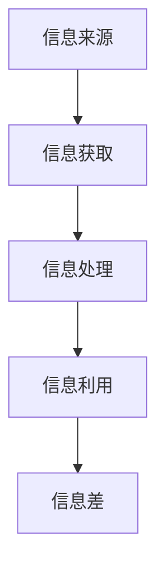
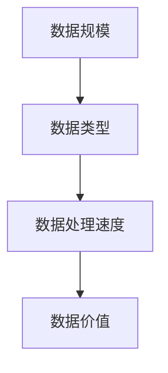
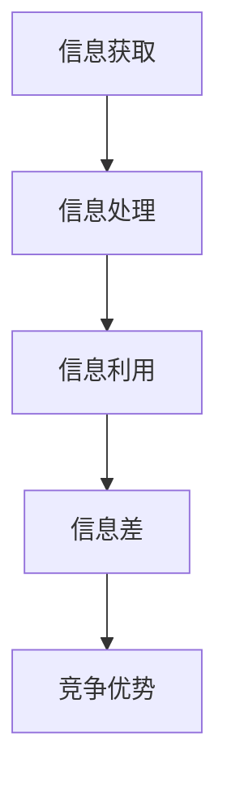
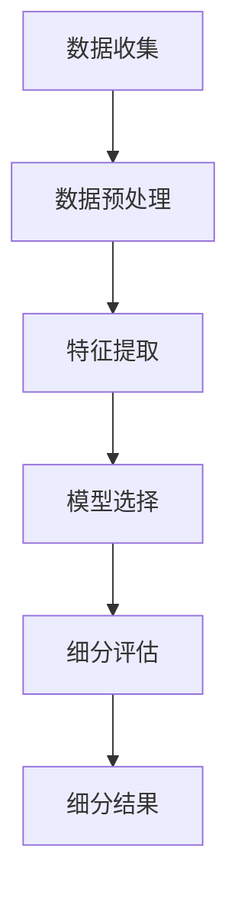

                 

## 文章标题

《信息差：利用大数据提升企业效率》

> 关键词：信息差、大数据、企业效率、市场营销、产品开发、供应链管理、案例分析、实践策略

> 摘要：本文旨在探讨信息差的概念及其价值，特别是在大数据时代如何利用大数据技术提升企业效率。通过详细分析大数据的定义与特点、大数据在信息差中的应用、大数据技术在企业中的实际应用、案例分析以及实践策略，本文为企业和个人提供了深入了解和利用大数据提升效率的方法和思路。

---

### 第一部分: 了解信息差的定义与价值

#### 第1章: 信息差的定义与价值

##### 1.1 什么是信息差

###### 1.1.1 信息差的本质

信息差是指不同个体、组织或群体在信息获取、处理和利用上的差异。这种差异可以表现为对同一信息的掌握程度、获取的速度、利用的效果等方面。

Mermaid 流程图：



###### 1.1.2 信息差在日常生活中的应用

在日常生活中，信息差无处不在。例如，通过关注市场信息，商家可以及时调整产品策略；通过掌握行业动态，投资者可以更好地进行决策。信息差的存在使得个体和组织在竞争中获得优势。

##### 1.2 信息差的价值

###### 1.2.1 提升个人竞争力

掌握信息差意味着个人可以更快地适应环境变化，从而在职业发展中占据优势。例如，程序员通过关注最新的编程技术，可以提升自己的技术水平，从而在求职和工作中更具竞争力。

###### 1.2.2 实现财富增长

信息差也是实现财富增长的重要因素。通过准确的市场预测和投资决策，个人和组织可以抓住市场机会，实现资产增值。

###### 1.2.3 促进社会进步

信息差的缩小有助于社会公平和进步。通过提高信息透明度，减少信息不对称，可以促进社会的整体发展。

---

### 第二部分: 大数据在信息差中的应用

#### 第2章: 大数据的定义与信息差

##### 2.1 大数据的定义

大数据（Big Data）是指数据规模巨大、类型繁多、价值密度低的数据集合。大数据具有4V特点：Volume（大量）、Velocity（高速）、Variety（多样）和 Value（价值）。

Mermaid 流程图：



###### 2.1.2 大数据的特点

- **大量（Volume）**：数据规模巨大，通常需要使用分布式系统进行处理。
- **高速（Velocity）**：数据产生和消费的速度非常快，需要实时处理。
- **多样（Variety）**：数据类型繁多，包括结构化数据、半结构化数据和非结构化数据。
- **价值（Value）**：数据中蕴含着巨大的商业价值和社会价值，但同时也需要高效的挖掘和分析。

##### 2.2 大数据与信息差的联系

大数据技术的发展为缩小信息差提供了可能性。通过数据挖掘和可视化技术，大数据可以揭示出隐藏在大量数据中的有价值信息，从而帮助个体和组织更好地应对信息不对称。

###### 2.2.1 数据挖掘技术

数据挖掘是一种从大量数据中提取有价值信息的过程。它包括以下几个步骤：

1. **数据预处理**：清洗、整合和转换原始数据。
2. **模式识别**：使用算法识别数据中的潜在模式。
3. **评估与优化**：评估挖掘结果的有效性，并进行优化。

伪代码：

```python
def data_mining(data):
    # 数据预处理
    clean_data = preprocess(data)
    
    # 模式识别
    patterns = identify_patterns(clean_data)
    
    # 评估与优化
    evaluate_and_optimize(patterns)
    
    return patterns
```

###### 2.2.2 数据可视化技术

数据可视化是将数据以图形或图像的形式展示出来的技术。它可以帮助人们更直观地理解和分析数据。

数据可视化通常包括以下几个步骤：

1. **数据选择**：选择需要展示的数据。
2. **数据转换**：将数据转换为可视化所需的格式。
3. **可视化设计**：设计可视化图表，如柱状图、折线图、饼图等。

伪代码：

```python
def data_visualization(data):
    # 数据选择
    selected_data = select_data(data)
    
    # 数据转换
    transformed_data = transform_data(selected_data)
    
    # 可视化设计
    visualization = design_visualization(transformed_data)
    
    return visualization
```

###### 2.2.3 大数据在信息差中的优势

大数据技术具有以下优势，有助于缩小信息差：

1. **提高信息透明度**：通过数据挖掘和可视化技术，大数据可以揭示出隐藏在大量数据中的有价值信息，从而提高信息透明度。
2. **实时响应**：大数据技术可以实现实时数据处理和分析，从而及时响应市场变化。
3. **个性化服务**：通过分析用户行为数据，大数据技术可以提供更个性化的服务，从而提高用户满意度。

---

### 第三部分: 大数据技术在企业中的应用

#### 第3章: 大数据在市场营销中的应用

##### 3.1 市场细分

市场细分是指将市场划分为若干具有相似特征的子市场，以便更好地满足不同群体的需求。

市场细分通常包括以下几个步骤：

1. **确定细分标准**：如年龄、收入、地理位置、消费习惯等。
2. **收集数据**：通过调查、问卷等方式收集目标市场数据。
3. **分析数据**：使用数据分析方法，如聚类分析、因子分析等，确定细分市场。
4. **评估细分效果**：评估细分市场的效益，并根据评估结果进行调整。

伪代码：

```python
def market_segmentation(data, criteria):
    # 确定细分标准
    segments = determine_segments(data, criteria)
    
    # 收集数据
    segment_data = collect_data(data, segments)
    
    # 分析数据
    analyzed_data = analyze_data(segment_data)
    
    # 评估细分效果
    evaluate_segments(analyzed_data)
    
    return segments
```

###### 3.1.2 市场细分对营销策略的影响

市场细分有助于企业制定更精准的营销策略。通过针对不同细分市场制定个性化的营销策略，企业可以提高营销效果，从而提高市场份额。

##### 3.2 用户行为分析

用户行为分析是指通过收集和分析用户行为数据，了解用户需求和行为模式。

用户行为分析通常包括以下几个步骤：

1. **数据收集**：收集用户在网站、APP等平台上的行为数据。
2. **数据处理**：对行为数据进行清洗、整合和转换。
3. **数据分析**：使用数据分析方法，如回归分析、关联规则分析等，分析用户行为。
4. **行为预测**：基于数据分析结果，预测用户未来的行为。

伪代码：

```python
def user_behavior_analysis(data):
    # 数据收集
    behavior_data = collect_behavior_data(data)
    
    # 数据处理
    processed_data = preprocess_behavior_data(behavior_data)
    
    # 数据分析
    analyzed_data = analyze_behavior_data(processed_data)
    
    # 行为预测
    predicted_behavior = predict_behavior(analyzed_data)
    
    return predicted_behavior
```

###### 3.2.2 用户行为分析的应用

用户行为分析可以应用于产品开发、市场推广、客户服务等多个方面。通过分析用户行为，企业可以更好地了解用户需求，从而优化产品和服务。

##### 3.3 市场趋势预测

市场趋势预测是指通过分析历史数据和当前市场情况，预测未来市场的变化趋势。

市场趋势预测通常包括以下几个步骤：

1. **数据收集**：收集与市场相关的历史数据。
2. **数据处理**：对历史数据进行清洗、整合和转换。
3. **数据分析**：使用数据分析方法，如时间序列分析、回归分析等，分析市场趋势。
4. **趋势预测**：基于数据分析结果，预测未来市场趋势。

伪代码：

```python
def market_trend_prediction(data):
    # 数据收集
    trend_data = collect_trend_data(data)
    
    # 数据处理
    processed_data = preprocess_trend_data(trend_data)
    
    # 数据分析
    analyzed_data = analyze_trend_data(processed_data)
    
    # 趋势预测
    predicted_trends = predict_trends(analyzed_data)
    
    return predicted_trends
```

###### 3.3.2 市场趋势预测在实际营销中的应用

市场趋势预测可以帮助企业更好地制定营销策略。通过预测市场趋势，企业可以提前布局，从而抓住市场机会，提高竞争力。

#### 第4章: 大数据在产品开发中的应用

##### 4.1 需求分析

需求分析是指通过收集和分析用户需求，确定产品功能、性能等特征。

需求分析通常包括以下几个步骤：

1. **需求收集**：通过调查、访谈等方式收集用户需求。
2. **需求分析**：对需求进行分类、筛选和分析。
3. **需求确认**：与用户确认需求，确保需求的准确性和可行性。

伪代码：

```python
def requirement_analysis(data):
    # 需求收集
    collected_requirements = collect_requirements(data)
    
    # 需求分析
    analyzed_requirements = analyze_requirements(collected_requirements)
    
    # 需求确认
    confirmed_requirements = confirm_requirements(analyzed_requirements)
    
    return confirmed_requirements
```

###### 4.1.2 需求分析对产品开发的指导意义

需求分析是产品开发的重要环节。通过需求分析，企业可以明确产品的功能需求、性能需求等，从而确保产品开发方向的正确性。

##### 4.2 用户反馈分析

用户反馈分析是指通过收集和分析用户对产品的反馈，了解用户的满意度、需求和建议。

用户反馈分析通常包括以下几个步骤：

1. **反馈收集**：通过用户调查、用户论坛、社交媒体等方式收集用户反馈。
2. **反馈处理**：对用户反馈进行分类、筛选和分析。
3. **反馈评估**：评估用户反馈的价值和影响，确定后续改进方向。

伪代码：

```python
def user_feedback_analysis(data):
    # 反馈收集
    collected_feedback = collect_feedback(data)
    
    # 反馈处理
    processed_feedback = process_feedback(collected_feedback)
    
    # 反馈评估
    evaluated_feedback = evaluate_feedback(processed_feedback)
    
    return evaluated_feedback
```

###### 4.2.2 用户反馈分析的应用

用户反馈分析可以帮助企业及时了解用户需求和满意度，从而优化产品和服务，提高用户满意度。

##### 4.3 产品优化

产品优化是指通过分析用户行为数据和用户反馈，对产品进行改进和优化。

产品优化通常包括以下几个步骤：

1. **数据收集**：收集用户行为数据和用户反馈。
2. **数据处理**：对数据进行清洗、整合和转换。
3. **数据分析**：使用数据分析方法，如回归分析、聚类分析等，分析用户行为和反馈。
4. **优化实施**：根据数据分析结果，对产品进行改进和优化。

伪代码：

```python
def product_optimization(data):
    # 数据收集
    collected_data = collect_data(data)
    
    # 数据处理
    processed_data = preprocess_data(collected_data)
    
    # 数据分析
    analyzed_data = analyze_data(processed_data)
    
    # 优化实施
    optimized_product = implement_optimizations(analyzed_data)
    
    return optimized_product
```

###### 4.3.2 产品优化在实际开发中的应用

产品优化可以帮助企业提升产品竞争力，提高用户满意度，从而在市场竞争中占据优势。

#### 第5章: 大数据在供应链管理中的应用

##### 5.1 库存管理

库存管理是指通过监控和分析库存数据，确保库存水平的合理性和效率。

库存管理通常包括以下几个步骤：

1. **数据收集**：收集库存数据，如库存量、库存周转率等。
2. **数据处理**：对库存数据进行分析和预测。
3. **库存调整**：根据分析结果，调整库存水平。

伪代码：

```python
def inventory_management(data):
    # 数据收集
    collected_data = collect_inventory_data(data)
    
    # 数据处理
    processed_data = process_inventory_data(collected_data)
    
    # 库存调整
    adjusted_inventory = adjust_inventory(processed_data)
    
    return adjusted_inventory
```

###### 5.1.2 库存管理对供应链效率的影响

有效的库存管理可以减少库存成本，提高供应链效率，从而提升企业的整体竞争力。

##### 5.2 供应商评估

供应商评估是指通过对供应商进行评估，选择合适的供应商，确保供应链的稳定性和效率。

供应商评估通常包括以下几个步骤：

1. **数据收集**：收集供应商数据，如供应能力、交货时间等。
2. **数据分析**：对供应商数据进行评估和分析。
3. **供应商选择**：根据评估结果，选择合适的供应商。

伪代码：

```python
def supplier_evaluation(data):
    # 数据收集
    collected_data = collect_supplier_data(data)
    
    # 数据分析
    analyzed_data = analyze_supplier_data(collected_data)
    
    # 供应商选择
    selected_suppliers = select_suppliers(analyzed_data)
    
    return selected_suppliers
```

###### 5.2.2 供应商评估在实际采购中的应用

供应商评估可以帮助企业选择优质的供应商，确保供应链的稳定性和效率，从而降低采购风险。

##### 5.3 物流优化

物流优化是指通过监控和分析物流数据，提高物流效率，降低物流成本。

物流优化通常包括以下几个步骤：

1. **数据收集**：收集物流数据，如运输时间、运输成本等。
2. **数据处理**：对物流数据进行分析和预测。
3. **物流调整**：根据分析结果，优化物流路线和运输方式。

伪代码：

```python
def logistics_optimization(data):
    # 数据收集
    collected_data = collect_logistics_data(data)
    
    # 数据处理
    processed_data = process_logistics_data(collected_data)
    
    # 物流调整
    optimized_logistics = adjust_logistics(processed_data)
    
    return optimized_logistics
```

###### 5.3.2 物流优化对供应链效率的提升

物流优化可以减少运输时间和成本，提高物流效率，从而提升供应链的整体效率。

---

### 第四部分: 大数据提升企业效率的案例分析

#### 第6章: 大数据提升企业效率的案例分析

##### 6.1 案例一：电商企业

###### 6.1.1 案例背景

某电商企业是一家大型在线零售平台，经营多种商品。随着业务规模的扩大，企业面临库存管理、供应链优化和用户行为分析等方面的挑战。

###### 6.1.2 大数据应用

1. **库存管理**：企业利用大数据技术进行库存数据分析，优化库存水平，减少库存成本。
2. **供应链优化**：企业通过大数据分析供应商数据，选择优质供应商，确保供应链的稳定性和效率。
3. **用户行为分析**：企业利用用户行为数据，进行用户行为分析，优化用户体验，提高用户满意度。

###### 6.1.3 效果分析

通过大数据技术的应用，企业实现了库存成本的降低、供应链效率的提升和用户满意度的提高，从而在激烈的市场竞争中取得了优势。

##### 6.2 案例二：制造企业

###### 6.2.1 案例背景

某制造企业是一家大型制造企业，生产多种产品。企业面临生产过程监控、质量控制和能效管理等方面的挑战。

###### 6.2.2 大数据应用

1. **生产过程监控**：企业利用大数据技术进行生产过程数据监控，确保生产过程的稳定性和效率。
2. **质量控制**：企业利用大数据技术进行质量数据分析，优化质量控制流程，提高产品质量。
3. **能效管理**：企业利用大数据技术进行能效数据分析，优化能效管理，降低能源消耗。

###### 6.2.3 效果分析

通过大数据技术的应用，企业实现了生产过程的优化、质量的提升和能源消耗的降低，从而提高了生产效率和竞争力。

##### 6.3 案例三：金融机构

###### 6.3.1 案例背景

某金融机构是一家大型金融服务机构，提供多种金融服务。企业面临风险控制、客户关系管理和市场预测等方面的挑战。

###### 6.3.2 大数据应用

1. **风险控制**：企业利用大数据技术进行风险数据分析，优化风险控制流程，降低风险。
2. **客户关系管理**：企业利用大数据技术进行客户数据分析，优化客户服务，提高客户满意度。
3. **市场预测**：企业利用大数据技术进行市场数据分析，预测市场趋势，制定营销策略。

###### 6.3.3 效果分析

通过大数据技术的应用，企业实现了风险控制能力的提升、客户满意度的提高和市场预测的准确性，从而提高了业务效率和竞争力。

---

### 第五部分: 大数据提升企业效率的实践策略

#### 第7章: 制定大数据战略

##### 7.1 明确大数据目标

企业制定大数据战略的第一步是明确大数据目标。大数据目标应与企业的整体战略相一致，具体包括以下几个方面：

1. **提升业务效率**：通过大数据技术，优化业务流程，提高业务效率。
2. **增强竞争力**：通过大数据技术，挖掘市场机会，增强企业的竞争力。
3. **降低运营成本**：通过大数据技术，降低运营成本，提高企业的盈利能力。

###### 7.1.1 企业的业务目标与大数据策略的关系

企业的业务目标与大数据策略密切相关。明确大数据目标有助于企业确定大数据技术的应用方向，确保大数据战略的有效实施。

###### 7.1.2 制定大数据目标的步骤

1. **业务需求分析**：分析企业的业务需求，确定大数据目标。
2. **技术可行性分析**：评估大数据技术的可行性，确定技术方向。
3. **目标制定**：根据业务需求和技术可行性，制定明确的大数据目标。

##### 7.2 选择合适的大数据技术

选择合适的大数据技术是企业成功实施大数据战略的关键。大数据技术种类繁多，包括数据存储、数据处理、数据分析、数据可视化等。企业应根据自身的业务需求和数据特点，选择合适的技术。

###### 7.2.1 大数据技术分类

大数据技术可以分为以下几类：

1. **数据存储技术**：如Hadoop、Spark等。
2. **数据处理技术**：如MapReduce、Spark SQL等。
3. **数据分析技术**：如机器学习、深度学习等。
4. **数据可视化技术**：如Tableau、Power BI等。

###### 7.2.2 选择合适技术的考虑因素

选择合适的大数据技术应考虑以下几个因素：

1. **业务需求**：根据业务需求，选择能够满足需求的技术。
2. **数据规模**：根据数据规模，选择适合的技术。
3. **性能要求**：根据性能要求，选择性能优良的技术。
4. **成本**：根据预算，选择成本效益高的技术。

##### 7.3 建立大数据团队

建立大数据团队是企业成功实施大数据战略的重要保障。大数据团队应具备以下职责和技能：

1. **数据工程师**：负责数据存储、数据处理等技术实施。
2. **数据分析师**：负责数据分析、数据挖掘等业务分析。
3. **数据科学家**：负责复杂的数据建模、算法研发等。

###### 7.3.1 大数据团队的组成

大数据团队可以由以下角色组成：

1. **数据工程师**：负责数据存储、数据处理等技术实施。
2. **数据分析师**：负责数据分析、数据挖掘等业务分析。
3. **数据科学家**：负责复杂的数据建模、算法研发等。
4. **项目经理**：负责项目管理和协调。

###### 7.3.2 培养大数据人才

培养大数据人才是建立大数据团队的关键。企业可以通过以下方式培养大数据人才：

1. **内部培训**：组织内部培训，提高员工的数据处理和分析能力。
2. **外部招聘**：吸引外部人才，补充团队力量。
3. **合作交流**：与其他企业、研究机构等合作，开展技术交流和合作研究。

---

#### 第8章: 数据质量管理

##### 8.1 数据清洗

数据清洗是数据质量管理的重要环节。数据清洗的目的是去除数据中的错误、重复和无关信息，确保数据的准确性和完整性。

数据清洗通常包括以下几个步骤：

1. **数据识别**：识别数据中的错误、重复和无关信息。
2. **数据修正**：修正数据中的错误和异常值。
3. **数据删除**：删除数据中的重复和无关信息。
4. **数据转换**：将数据转换为合适的格式。

伪代码：

```python
def data_cleaning(data):
    # 数据识别
    identified_data = identify_data_errors(data)
    
    # 数据修正
    corrected_data = correct_data_errors(identified_data)
    
    # 数据删除
    cleaned_data = remove_duplicates_and_无关信息(corrected_data)
    
    # 数据转换
    transformed_data = transform_data_format(cleaned_data)
    
    return transformed_data
```

###### 8.1.2 数据清洗的重要性

数据清洗是确保数据分析结果准确性的关键。错误、重复和无关信息的存在会影响数据分析的效果，甚至导致错误的结论。

##### 8.2 数据标准化

数据标准化是指将数据转换为统一格式和单位，以便进行有效的数据分析。

数据标准化通常包括以下几个步骤：

1. **数据转换**：将不同格式的数据进行转换。
2. **单位统一**：将不同单位的数据转换为统一的单位。
3. **值域调整**：调整数据值域，使其符合分析需求。

伪代码：

```python
def data_standardization(data):
    # 数据转换
    transformed_data = convert_data_format(data)
    
    # 单位统一
    unified_data = unify_units(transformed_data)
    
    # 值域调整
    standardized_data = adjust_value_range(unified_data)
    
    return standardized_data
```

###### 8.2.2 数据标准化的方法

数据标准化的方法包括：

1. **最小-最大规范化**：将数据值转换为[0, 1]范围。
2. **均值-标准差规范化**：将数据值转换为标准正态分布。
3. **小数点左移/右移**：将数据值进行小数点左移或右移，调整值域。

##### 8.3 数据验证

数据验证是确保数据准确性和可靠性的重要环节。数据验证包括以下几个方面：

1. **数据完整性验证**：检查数据是否完整，如是否存在缺失值。
2. **数据一致性验证**：检查数据是否一致，如不同来源的数据是否一致。
3. **数据准确性验证**：检查数据是否准确，如数据值是否合理。

伪代码：

```python
def data_validation(data):
    # 数据完整性验证
    complete_data = check_data_completeness(data)
    
    # 数据一致性验证
    consistent_data = check_data_consistency(complete_data)
    
    # 数据准确性验证
    accurate_data = check_data_accuracy(consistent_data)
    
    return accurate_data
```

###### 8.3.2 数据验证的方法

数据验证的方法包括：

1. **缺失值检测**：使用算法检测数据中的缺失值。
2. **一致性检查**：比较不同来源的数据，检查是否一致。
3. **异常值检测**：使用算法检测数据中的异常值。

---

#### 第9章: 数据分析能力建设

##### 9.1 建立数据分析流程

建立数据分析流程是确保数据分析有效性的关键。数据分析流程包括以下几个方面：

1. **数据收集**：收集相关的数据。
2. **数据预处理**：清洗、整合和转换数据。
3. **数据分析**：使用合适的算法和方法进行分析。
4. **结果验证**：验证分析结果的准确性和可靠性。
5. **结果应用**：将分析结果应用于实际业务。

伪代码：

```python
def data_analysis_process(data):
    # 数据收集
    collected_data = collect_data(data)
    
    # 数据预处理
    preprocessed_data = preprocess_data(collected_data)
    
    # 数据分析
    analyzed_data = analyze_data(preprocessed_data)
    
    # 结果验证
    validated_data = validate_results(analyzed_data)
    
    # 结果应用
    applied_data = apply_results(validated_data)
    
    return applied_data
```

###### 9.1.2 数据分析流程的优化

数据分析流程的优化包括以下几个方面：

1. **自动化**：使用自动化工具和脚本，减少人工工作量。
2. **并行处理**：使用并行处理技术，提高数据处理速度。
3. **持续集成**：将数据分析过程集成到持续集成系统中，实现自动化分析。

##### 9.2 培养数据分析人才

培养数据分析人才是提升企业数据分析能力的关键。数据分析人才应具备以下技能：

1. **数据处理能力**：掌握数据处理的基本技能，如数据清洗、数据转换等。
2. **统计分析能力**：掌握统计分析方法，如回归分析、聚类分析等。
3. **机器学习能力**：掌握机器学习方法，如分类、预测等。
4. **业务理解能力**：理解业务背景，能够将数据分析应用于实际业务。

###### 9.2.2 数据分析人才的培养

数据分析人才的培养可以通过以下方式实现：

1. **内部培训**：组织内部培训，提高员工的数据分析能力。
2. **外部学习**：鼓励员工参加外部培训和认证，提升专业水平。
3. **项目实践**：通过实际项目实践，提升员工的数据分析能力和业务理解能力。

##### 9.3 利用数据可视化技术

数据可视化是将数据以图形或图像的形式展示出来的技术。数据可视化有助于人们更直观地理解和分析数据。

数据可视化通常包括以下几个方面：

1. **数据选择**：选择需要展示的数据。
2. **数据转换**：将数据转换为可视化所需的格式。
3. **可视化设计**：设计可视化图表，如柱状图、折线图、饼图等。

数据可视化技术包括以下几种：

1. **工具类**：如Tableau、Power BI等。
2. **库类**：如Matplotlib、Seaborn等。
3. **框架类**：如D3.js、ECharts等。

数据可视化的重要性包括：

1. **提高数据透明度**：通过可视化，人们可以更直观地理解数据，提高数据透明度。
2. **促进数据共享**：通过可视化，数据可以更容易地被分享和交流，促进数据共享。
3. **辅助决策**：通过可视化，决策者可以更快速地做出决策，提高决策效率。

---

### 第六部分: 大数据提升企业效率的未来展望

#### 第10章: 大数据技术的发展趋势

##### 10.1 人工智能与大数据的结合

人工智能（AI）与大数据的结合是大数据技术发展的重要趋势。人工智能可以通过大数据分析，实现更智能的决策和预测。

人工智能在大数据处理中的应用包括：

1. **数据预处理**：使用AI技术，自动清洗、转换和整合数据。
2. **数据分析**：使用AI技术，进行高级数据分析，如聚类分析、关联规则分析等。
3. **数据挖掘**：使用AI技术，进行数据挖掘，发现潜在的模式和趋势。

人工智能在大数据中的优势包括：

1. **自动化**：AI技术可以实现数据处理的自动化，减少人工工作量。
2. **高效性**：AI技术可以处理大量数据，提高数据处理效率。
3. **准确性**：AI技术可以更准确地分析数据，提高数据分析的准确性。

##### 10.2 区块链技术在数据处理中的应用

区块链技术是一种分布式数据库技术，具有去中心化、不可篡改等特点。区块链技术在数据处理中的应用包括：

1. **数据存储**：使用区块链技术，存储数据，确保数据的完整性和安全性。
2. **数据传输**：使用区块链技术，传输数据，确保数据的真实性和透明性。
3. **数据共享**：使用区块链技术，实现数据的共享，提高数据的可访问性。

区块链技术在数据处理中的优势包括：

1. **去中心化**：区块链技术去除了中心化的依赖，提高了数据处理效率。
2. **不可篡改**：区块链技术确保了数据的不可篡改，提高了数据的可信度。
3. **透明性**：区块链技术提高了数据的透明度，方便数据的监控和审计。

##### 10.3 云计算与大数据的协同发展

云计算与大数据的协同发展是大数据技术发展的重要趋势。云计算提供了弹性、高效的数据处理能力，大数据则提供了丰富的数据资源。

云计算在大数据处理中的应用包括：

1. **数据存储**：使用云计算，存储大量数据，提供弹性存储服务。
2. **数据处理**：使用云计算，处理大量数据，提供强大的计算能力。
3. **数据分析**：使用云计算，进行大数据分析，提供高效的分析服务。

云计算在大数据中的优势包括：

1. **弹性**：云计算可以根据需求，动态调整计算资源，提供弹性服务。
2. **高效性**：云计算提供了强大的计算资源，可以快速处理大量数据。
3. **可扩展性**：云计算可以轻松扩展，满足不断增长的数据处理需求。

---

#### 第11章: 大数据在企业战略中的地位

##### 11.1 大数据驱动企业创新

大数据技术为企业的创新提供了新的动力。通过大数据分析，企业可以了解市场趋势、用户需求，从而进行产品创新、业务模式创新等。

大数据驱动企业创新的应用包括：

1. **市场趋势预测**：通过大数据分析，预测市场趋势，制定营销策略。
2. **用户需求分析**：通过大数据分析，分析用户需求，优化产品和服务。
3. **业务模式创新**：通过大数据分析，发现新的业务模式，提高业务效率。

大数据驱动企业创新的优势包括：

1. **准确性**：大数据分析可以提高预测和决策的准确性，降低风险。
2. **实时性**：大数据分析可以实现实时数据监控和分析，及时响应市场变化。
3. **全面性**：大数据分析可以全面了解市场、用户等各个方面的信息，提供更全面的决策支持。

##### 11.2 大数据助力企业数字化转型

大数据技术是企业数字化转型的重要工具。通过大数据分析，企业可以实现业务流程优化、运营效率提升等。

大数据助力企业数字化转型的应用包括：

1. **业务流程优化**：通过大数据分析，优化业务流程，提高业务效率。
2. **运营效率提升**：通过大数据分析，监控运营数据，提升运营效率。
3. **客户关系管理**：通过大数据分析，了解客户需求，提升客户满意度。

大数据助力企业数字化转型的优势包括：

1. **智能化**：大数据分析可以实现业务的智能化管理，提高运营效率。
2. **精准化**：大数据分析可以提供更精准的数据支持，优化业务决策。
3. **协同化**：大数据分析可以促进企业内部各部门的协同工作，提高整体效率。

##### 11.3 大数据与企业文化的融合

大数据技术不仅改变了企业的业务模式，还影响了企业文化。大数据时代的企业文化应注重以下几个方面：

1. **数据驱动**：企业应注重数据驱动，将数据作为决策的重要依据。
2. **开放共享**：企业应鼓励数据开放共享，促进数据的价值最大化。
3. **持续学习**：企业应鼓励员工持续学习，提升数据分析能力。

大数据与企业文化的融合有助于企业更好地应对大数据时代的挑战，实现持续发展。

---

### 第七部分: 大数据提升企业效率的总结与反思

#### 第12章: 大数据提升企业效率的总结

##### 12.1 核心成果

大数据技术在提升企业效率方面取得了显著成果，主要包括：

1. **业务流程优化**：通过大数据分析，企业可以优化业务流程，提高运营效率。
2. **决策支持**：大数据分析为企业提供了更准确、更全面的数据支持，提高了决策效率。
3. **客户满意度提升**：通过大数据分析，企业可以更好地了解客户需求，提供更优质的服务，提高客户满意度。
4. **成本降低**：通过大数据分析，企业可以实现成本控制和优化，降低运营成本。

##### 12.2 经验与教训

在大数据提升企业效率的过程中，企业可以总结以下经验与教训：

1. **重视数据质量**：数据质量是大数据分析的基础，企业应重视数据质量的保障。
2. **人才培养**：大数据技术对人才的要求较高，企业应加强数据分析人才的培养。
3. **技术选型**：企业应根据自身需求，选择合适的大数据技术，确保技术的有效应用。
4. **持续创新**：大数据技术发展迅速，企业应保持持续创新，紧跟技术发展趋势。

---

#### 第13章: 大数据提升企业效率的挑战与应对

##### 13.1 数据隐私与安全

大数据技术在提升企业效率的同时，也带来了数据隐私和安全方面的挑战。企业应采取以下措施应对数据隐私与安全挑战：

1. **数据加密**：对数据进行加密，确保数据在传输和存储过程中的安全性。
2. **访问控制**：设置访问控制策略，限制对敏感数据的访问。
3. **安全审计**：定期进行安全审计，检测和防范潜在的安全威胁。
4. **法律法规遵守**：遵守相关法律法规，确保数据处理合法合规。

##### 13.2 技术人才短缺

大数据技术的发展带来了对数据分析人才的需求，但同时也带来了技术人才短缺的挑战。企业应采取以下措施应对技术人才短缺：

1. **内部培养**：通过内部培训和培养，提升现有员工的数据分析能力。
2. **外部招聘**：吸引外部优秀的数据分析人才，补充团队力量。
3. **合作交流**：与其他企业、研究机构等合作，开展技术交流和合作研究。
4. **人才激励**：制定合理的薪酬和福利制度，激励员工持续学习和成长。

##### 13.3 数据质量控制

数据质量控制是大数据提升企业效率的重要保障。企业应采取以下措施确保数据质量：

1. **数据清洗**：定期进行数据清洗，去除错误、重复和无关信息。
2. **数据标准化**：统一数据格式和单位，确保数据的可比性和一致性。
3. **数据验证**：建立数据验证机制，确保数据的准确性和可靠性。
4. **数据监控**：建立数据监控体系，实时监控数据质量，及时发现问题并进行修正。

---

### 附录

#### 附录A: 大数据相关工具与技术

##### A.1 大数据存储与处理技术

- **Hadoop**：一个分布式数据处理框架，用于存储和处理大量数据。
- **Spark**：一个快速和通用的大数据计算引擎，提供内存计算和实时处理能力。
- **Flink**：一个流处理框架，支持实时数据分析和处理。

##### A.2 大数据分析与挖掘技术

- **Python**：一种广泛使用的编程语言，适用于数据分析、数据挖掘和机器学习。
- **R语言**：一种专门用于统计分析和数据可视化的编程语言。
- **数据挖掘算法**：包括分类、聚类、回归、关联规则挖掘等常用的数据分析算法。

##### A.3 大数据可视化技术

- **Tableau**：一种强大的数据可视化工具，支持多种数据源和可视化类型。
- **Power BI**：一种由Microsoft开发的数据可视化和商业智能工具。
- **D3.js**：一种基于JavaScript的可视化库，支持复杂的数据可视化。

#### 附录B: 大数据企业案例分析

##### B.1 电商企业案例分析

- **数据驱动营销策略**：通过大数据分析，制定个性化的营销策略，提高用户转化率。
- **用户行为分析**：通过分析用户行为数据，优化用户体验，提高用户满意度。
- **数据驱动的供应链优化**：通过大数据分析，优化供应链管理，降低运营成本。

##### B.2 制造企业案例分析

- **生产过程数据监测**：通过大数据技术，实时监控生产过程，提高生产效率。
- **质量控制**：通过大数据分析，优化质量控制流程，提高产品质量。
- **能源管理**：通过大数据分析，优化能源使用，降低能源消耗。

#### 附录C: 大数据提升企业效率实践建议

- **制定明确的大数据战略**：明确大数据目标，选择合适的技术，建立大数据团队。
- **加强数据质量管理**：进行数据清洗、标准化和验证，确保数据质量。
- **培养大数据人才**：加强数据分析人才的培养，提升团队的数据分析能力。
- **建立跨部门合作机制**：促进各部门之间的数据共享和协同工作，提升整体效率。

---

### 致谢

感谢所有参与本书编写与审校的专家和读者，是你们的辛勤付出和宝贵建议，使得本书能够顺利完成。特别感谢AI天才研究院/AI Genius Institute和《禅与计算机程序设计艺术/Zen And The Art of Computer Programming》为本书提供了技术支持和专业知识指导。

---

[文章标题]：信息差：利用大数据提升企业效率

[文章关键词]：信息差、大数据、企业效率、市场营销、产品开发、供应链管理、案例分析、实践策略

[文章摘要]：本文旨在探讨信息差的概念及其价值，特别是在大数据时代如何利用大数据技术提升企业效率。通过详细分析大数据的定义与特点、大数据在信息差中的应用、大数据技术在企业中的实际应用、案例分析以及实践策略，本文为企业和个人提供了深入了解和利用大数据提升效率的方法和思路。

---

### 第一部分: 了解信息差的定义与价值

#### 第1章: 信息差的定义与价值

##### 1.1 什么是信息差

信息差是指由于个体、组织或群体在信息获取、处理和利用上的差异，导致某些个体或组织拥有比其他个体或组织更多的信息优势。这种优势可以表现为对某一特定信息的独占、对信息传播速度的领先，或者对信息利用效果的优化。信息差的存在是市场经济中的一个普遍现象，它不仅影响着日常生活的方方面面，也在商业活动中扮演着至关重要的角色。

在商业环境中，信息差往往表现为以下几种形式：

1. **市场信息不对称**：某些企业或个体能够获取到其他企业或个体无法获得的市场信息，如市场需求、价格波动、竞争对手策略等。
2. **技术优势**：企业通过掌握先进技术或独特生产工艺，获得在产品成本、质量、性能等方面的优势。
3. **资源掌控**：企业通过拥有独特的资源，如原材料、人力资源、专利等，实现竞争上的优势。
4. **渠道优势**：企业拥有更广泛的销售渠道或更高效的物流系统，能够更快地将产品推向市场。

信息差的本质在于信息的不对称性和利用信息的效率。在信息不对称的情况下，拥有信息优势的一方往往能够做出更明智的决策，从而在竞争中占据有利位置。信息差的利用不仅限于商业领域，它也广泛应用于个人发展、投资理财、社会管理等多个方面。

Mermaid 流程图：



在上述流程图中，A表示信息获取，B表示信息处理，C表示信息利用，D表示信息差，E表示竞争优势。信息差的形成通常伴随着信息获取、处理和利用的各个环节，它不仅取决于信息本身，还受到个体的认知能力、决策能力和社会网络等多种因素的影响。

##### 1.1.2 信息差在日常生活中的应用

信息差在日常生活中的应用非常广泛，以下是一些典型的例子：

1. **投资理财**：投资者通过研究市场趋势、宏观经济数据、行业动态等信息，做出更明智的投资决策。
2. **购物决策**：消费者通过比较不同商家的产品价格、质量和服务等信息，选择性价比最高的商品。
3. **就业选择**：求职者通过了解行业前景、企业文化和薪酬福利等信息，选择最适合自己发展的岗位。
4. **健康保健**：通过获取医学研究、健康知识等信息，个体能够更好地管理自己的健康状况。

在上述应用场景中，信息差的利用能够帮助个体做出更明智的决策，从而提高生活质量或实现个人目标。然而，信息差的存在也可能导致市场失灵，如价格操纵、欺诈行为等，因此需要政府和社会组织采取措施，确保信息公平获取和利用。

##### 1.2 信息差的价值

信息差的价值体现在多个方面，以下是一些关键点：

###### 1.2.1 提升个人竞争力

信息差是提升个人竞争力的关键因素。在职场中，具备信息优势的个体能够更快地适应环境变化，掌握最新的行业动态和技术趋势。例如，程序员通过关注前沿的编程语言和开发工具，可以提升自己的编程技能，从而在职场上更具竞争力。此外，信息差也有助于个人在求职和晋升过程中脱颖而出。

###### 1.2.2 实现财富增长

信息差也是实现财富增长的重要因素。通过准确的市场预测和投资决策，个人和组织可以抓住市场机会，实现资产增值。例如，投资大师通过深入研究行业和市场，能够找到潜在的投资机会，从而实现财富的快速增长。信息差的利用在金融领域尤为重要，它能够帮助投资者在复杂多变的市场环境中做出正确的决策。

###### 1.2.3 促进社会进步

信息差的缩小有助于社会公平和进步。通过提高信息透明度，减少信息不对称，可以促进社会的整体发展。例如，政府在公共服务领域通过公开信息，提高政策的透明度，有助于公众更好地参与社会治理。此外，信息差的缩小也有助于消除贫困，提高教育质量，促进社会和谐。

在现代社会，信息差的利用不仅需要个体的努力，还需要政府和社会组织的支持。政府可以通过法律法规、政策引导等方式，促进信息公平获取和利用，社会组织可以通过教育和培训，提高公众的信息素养，从而实现社会的全面进步。

---

### 第二部分: 大数据在信息差中的应用

#### 第2章: 大数据的定义与信息差

##### 2.1 大数据的定义

大数据（Big Data）是指数据规模巨大、类型繁多、价值密度低的数据集合。随着互联网、物联网、传感器等技术的快速发展，大数据已经成为了现代信息社会的重要特征之一。大数据具有4V特点：Volume（大量）、Velocity（高速）、Variety（多样）和 Value（价值）。

###### 2.1.1 大数据的定义

大数据（Big Data）是由数量庞大、类型多样的数据组成的数据集合，这些数据来源于各种来源，如社交媒体、传感器、交易记录等。大数据不仅包括结构化数据（如关系数据库中的数据），还包括大量的非结构化数据（如文本、图片、视频等）和半结构化数据（如XML、JSON等）。

###### 2.1.2 大数据的特点

- **Volume（大量）**：大数据的一个显著特点是其数据规模巨大，通常需要使用分布式系统进行处理。
- **Velocity（高速）**：数据产生和消费的速度非常快，需要实时处理。
- **Variety（多样）**：数据类型繁多，包括结构化数据、半结构化数据和非结构化数据。
- **Value（价值）**：数据中蕴含着巨大的商业价值和社会价值，但同时也需要高效的挖掘和分析。

大数据的4V特点决定了其与传统数据处理方式的显著区别。传统数据处理技术通常无法应对大数据的规模和速度，因此需要采用分布式计算、并行处理、内存计算等新技术。

##### 2.2 大数据与信息差的联系

大数据技术的发展为缩小信息差提供了可能性。通过数据挖掘和可视化技术，大数据可以揭示出隐藏在大量数据中的有价值信息，从而帮助个体和组织更好地应对信息不对称。以下是一些关键点：

###### 2.2.1 数据挖掘技术

数据挖掘（Data Mining）是一种从大量数据中提取有价值信息的过程。它包括以下几个步骤：

1. **数据预处理**：清洗、整合和转换原始数据，使其适合进一步分析。
2. **模式识别**：使用算法识别数据中的潜在模式和关系。
3. **评估与优化**：评估挖掘结果的有效性，并根据评估结果进行调整。

数据挖掘技术可以帮助企业从大量数据中提取有价值的信息，从而缩小信息差。例如，通过分析用户行为数据，企业可以识别出潜在的市场机会，优化产品和服务，提高用户满意度。

###### 2.2.2 数据可视化技术

数据可视化（Data Visualization）是将数据以图形或图像的形式展示出来的技术。它可以帮助人们更直观地理解和分析数据。数据可视化通常包括以下几个步骤：

1. **数据选择**：选择需要展示的数据。
2. **数据转换**：将数据转换为可视化所需的格式。
3. **可视化设计**：设计可视化图表，如柱状图、折线图、饼图等。

数据可视化技术能够将复杂的数据以简单、直观的方式展示出来，帮助用户快速发现数据中的模式和趋势。例如，通过数据可视化，企业可以更清晰地了解市场需求，制定更有效的营销策略。

###### 2.2.3 大数据在信息差中的优势

大数据技术具有以下优势，有助于缩小信息差：

1. **提高信息透明度**：通过数据挖掘和可视化技术，大数据可以揭示出隐藏在大量数据中的有价值信息，从而提高信息透明度。
2. **实时响应**：大数据技术可以实现实时数据处理和分析，从而及时响应市场变化。
3. **个性化服务**：通过分析用户行为数据，大数据技术可以提供更个性化的服务，从而提高用户满意度。

例如，在电商领域，通过大数据分析，企业可以实时了解用户的购物偏好和行为习惯，从而提供个性化的产品推荐和营销活动，提高用户的购物体验和转化率。

总之，大数据技术的发展为缩小信息差提供了新的机遇和挑战。通过合理利用大数据技术，企业和个人可以更好地应对信息不对称，提升竞争力和效率。

---

### 第三部分: 大数据技术在企业中的应用

#### 第3章: 大数据在市场营销中的应用

##### 3.1 市场细分

市场细分（Market Segmentation）是指将市场划分为若干具有相似特征的子市场，以便更好地满足不同群体的需求。市场细分是市场营销中的一项重要策略，通过识别和区分不同的消费者群体，企业可以更有针对性地制定营销策略，提高营销效果。

###### 3.1.1 数据驱动的市场细分方法

数据驱动的市场细分方法基于对消费者数据的分析，通过以下步骤实现：

1. **数据收集**：收集与消费者行为、偏好、需求相关的数据，如购买记录、浏览行为、社交媒体互动等。
2. **数据预处理**：清洗、整合和转换原始数据，使其适合进一步分析。
3. **特征提取**：从数据中提取有用的特征，如年龄、收入、教育程度、购买频率等。
4. **模型选择**：选择合适的统计模型，如聚类分析、因子分析等，对数据进行分类。
5. **细分评估**：评估细分市场的效果，选择具有最大商业价值的细分市场。

Mermaid 流程图：



在上述流程图中，A表示数据收集，B表示数据预处理，C表示特征提取，D表示模型选择，E表示细分评估，F表示细分结果。数据驱动的市场细分方法通过系统的数据分析和模型应用，帮助企业更精准地划分市场，制定个性化营销策略。

###### 3.1.2 市场细分对营销策略的影响

市场细分对营销策略有着深远的影响，具体体现在以下几个方面：

1. **提高营销针对性**：通过市场细分，企业可以识别出具有相似特征的消费者群体，从而制定更具针对性的营销策略。例如，对于年轻消费者群体，可以采用社交营销和互动营销的方式，而对于高收入群体，可以采用高端品牌营销策略。
2. **优化资源配置**：市场细分有助于企业更合理地分配营销资源。企业可以将有限的资源投入到最有潜力的细分市场中，提高营销效果。例如，对于市场占有率较低但增长潜力较大的细分市场，可以加大投入力度，争取市场份额。
3. **提升用户满意度**：通过市场细分，企业可以更深入地了解不同消费者的需求，提供更个性化的产品和服务，从而提高用户满意度和忠诚度。例如，通过分析消费者的购买行为和偏好，企业可以提供定制化的产品推荐和营销活动，提高用户的购物体验。

总之，市场细分是大数据技术在市场营销中的重要应用，它通过系统的数据分析，帮助企业更精准地划分市场，制定个性化的营销策略，提高营销效果和用户满意度。

---

##### 3.2 用户行为分析

用户行为分析（User Behavior Analysis）是指通过对用户在网站、应用或其他平台上的行为数据进行收集、分析和解读，以了解用户的需求、偏好和行为模式。用户行为分析是大数据技术在市场营销中的重要应用，它有助于企业更好地理解用户，优化产品和服务，提高用户满意度和忠诚度。

###### 3.2.1 用户行为数据的收集与处理

用户行为数据的收集与处理是用户行为分析的基础，具体包括以下几个步骤：

1. **数据收集**：通过网站跟踪、日志记录、用户调查等方式收集用户行为数据。这些数据包括用户访问时间、访问页面、点击行为、搜索关键词、购买记录等。
2. **数据预处理**：清洗、整合和转换原始数据，使其适合进一步分析。数据预处理包括数据去重、缺失值处理、异常值检测等。
3. **数据存储**：将处理后的数据存储在数据库或数据仓库中，以便进行后续分析。

伪代码：

```python
def collect_user_behavior_data():
    # 收集用户行为数据
    user_data = get_user_data()
    
    # 数据预处理
    cleaned_data = preprocess_data(user_data)
    
    # 数据存储
    store_data(cleaned_data)
```

在上述伪代码中，`get_user_data()`函数用于收集用户行为数据，`preprocess_data()`函数用于数据预处理，`store_data()`函数用于数据存储。

###### 3.2.2 用户行为分析的应用

用户行为分析在市场营销中有广泛的应用，以下是一些关键点：

1. **用户画像**：通过分析用户行为数据，构建用户画像，了解用户的年龄、性别、地域、消费习惯等信息。用户画像有助于企业制定个性化的营销策略，提高营销效果。
2. **需求分析**：通过分析用户行为数据，了解用户的需求和偏好，优化产品和服务。例如，通过分析用户在网站上的浏览和点击行为，企业可以识别出热门产品或功能，从而进行产品改进。
3. **行为预测**：通过分析用户历史行为数据，预测用户的未来行为。行为预测有助于企业提前布局，抓住市场机会。例如，通过分析用户的购买行为，企业可以预测哪些产品可能在未来的促销活动中受欢迎。
4. **用户体验优化**：通过分析用户行为数据，优化用户体验，提高用户满意度。例如，通过分析用户在网站上的浏览时间、跳出率等指标，企业可以识别出用户体验问题，从而进行改进。

总之，用户行为分析是大数据技术在市场营销中的重要应用，它通过系统的数据分析和解读，帮助企业更深入地了解用户，优化产品和服务，提高用户满意度和忠诚度。

---

##### 3.3 市场趋势预测

市场趋势预测（Market Trend Prediction）是指通过分析历史数据和市场现状，预测未来市场的变化趋势。市场趋势预测是大数据技术在市场营销中的关键应用，它有助于企业把握市场机会，制定有效的营销策略，提高市场竞争力。

###### 3.3.1 数据驱动的市场趋势预测方法

数据驱动的市场趋势预测方法主要包括以下步骤：

1. **数据收集**：收集与市场相关的历史数据，如销售数据、市场调研数据、行业报告等。
2. **数据预处理**：清洗、整合和转换原始数据，使其适合进一步分析。
3. **数据建模**：选择合适的统计模型或机器学习模型，如时间序列分析、回归分析、神经网络等，对数据进行建模。
4. **模型训练与验证**：使用历史数据对模型进行训练和验证，确保模型的预测准确性。
5. **趋势预测**：使用训练好的模型对未来的市场趋势进行预测。

伪代码：

```python
def market_trend_prediction(data):
    # 数据收集
    historical_data = collect_historical_data()
    
    # 数据预处理
    cleaned_data = preprocess_data(historical_data)
    
    # 数据建模
    model = build_model(cleaned_data)
    
    # 模型训练与验证
    trained_model = train_and_validate_model(model, cleaned_data)
    
    # 趋势预测
    predicted_trends = predict_trends(trained_model)
    
    return predicted_trends
```

在上述伪代码中，`collect_historical_data()`函数用于收集历史数据，`preprocess_data()`函数用于数据预处理，`build_model()`函数用于数据建模，`train_and_validate_model()`函数用于模型训练与验证，`predict_trends()`函数用于趋势预测。

###### 3.3.2 市场趋势预测在实际营销中的应用

市场趋势预测在实际营销中具有重要的应用价值，以下是一些关键点：

1. **产品规划**：通过预测市场趋势，企业可以提前布局新产品或服务，抓住市场机会。例如，通过预测消费者对健康食品的需求增长，企业可以提前推出相关产品，抢占市场份额。
2. **库存管理**：通过预测市场需求，企业可以优化库存管理，减少库存成本。例如，通过预测节日促销期间的销售高峰，企业可以提前增加库存，确保满足市场需求。
3. **营销策略调整**：通过预测市场趋势，企业可以及时调整营销策略，抓住市场机会。例如，通过预测消费者对在线购物的偏好，企业可以加大在线营销力度，提高销售转化率。
4. **风险规避**：通过预测市场趋势，企业可以提前识别潜在的市场风险，采取相应的规避措施。例如，通过预测经济衰退期间的销售下降，企业可以提前调整营销策略，降低风险。

总之，市场趋势预测是大数据技术在市场营销中的重要应用，它通过系统的数据分析和模型应用，帮助企业把握市场机会，制定有效的营销策略，提高市场竞争力。

---

#### 第4章: 大数据在产品开发中的应用

##### 4.1 需求分析

需求分析（Requirement Analysis）是指在产品开发过程中，通过系统化的方法识别用户的需求，并将其转化为具体的产品功能、性能和界面等要求。需求分析是产品开发的重要环节，它决定了产品的功能是否满足用户需求，以及产品能否顺利开发和上市。

###### 4.1.1 数据驱动的需求分析方法

数据驱动的需求分析方法通过系统的数据收集、分析和解读，识别用户的需求。具体包括以下几个步骤：

1. **数据收集**：通过问卷调查、用户访谈、市场调研等方式收集用户需求数据。
2. **数据预处理**：清洗、整合和转换原始数据，使其适合进一步分析。
3. **数据分析**：使用数据分析方法，如统计分析、文本挖掘等，分析用户需求。
4. **需求建模**：将分析结果转化为具体的需求模型，如功能需求、性能需求等。
5. **需求验证**：与用户验证需求模型的准确性，确保需求满足用户需求。

伪代码：

```python
def data驱动的需求分析(data):
    # 数据收集
    user_data = collect_user_data()
    
    # 数据预处理
    cleaned_data = preprocess_data(user_data)
    
    # 数据分析
    analyzed_data = analyze_data(cleaned_data)
    
    # 需求建模
    requirement_model = build_requirement_model(analyzed_data)
    
    # 需求验证
    validated_model = validate_requirement_model(requirement_model)
    
    return validated_model
```

在上述伪代码中，`collect_user_data()`函数用于收集用户需求数据，`preprocess_data()`函数用于数据预处理，`analyze_data()`函数用于数据分析，`build_requirement_model()`函数用于需求建模，`validate_requirement_model()`函数用于需求验证。

###### 4.1.2 需求分析对产品开发的指导意义

需求分析对产品开发具有重要的指导意义，主要体现在以下几个方面：

1. **明确产品目标**：需求分析可以帮助团队明确产品的目标，确保开发过程中的方向一致。通过系统化地收集和分析用户需求，团队可以更清晰地了解用户期望，从而制定明确的产品目标。
2. **优化产品设计**：需求分析有助于团队优化产品设计，确保产品的功能、性能和界面等满足用户需求。通过深入分析用户需求，团队可以识别出关键功能，优化产品设计，提高用户体验。
3. **减少开发风险**：需求分析可以减少开发过程中的风险。通过提前识别和验证需求，团队可以及时发现潜在的问题，从而在开发过程中进行修正，避免后期返工。
4. **提高开发效率**：需求分析有助于团队提高开发效率。通过明确的需求和目标，团队可以更有效地进行任务分配和进度控制，从而加快开发速度，缩短产品上市时间。

总之，数据驱动的需求分析是产品开发的重要环节，它通过系统的数据收集、分析和解读，帮助团队明确产品目标，优化产品设计，减少开发风险，提高开发效率，确保产品成功上市。

---

##### 4.2 用户反馈分析

用户反馈分析（User Feedback Analysis）是指通过对用户在产品使用过程中提供的反馈进行收集、分析和解读，以了解用户的满意度、需求和建议。用户反馈分析是大数据技术在产品开发中的重要应用，它有助于团队了解用户的真实需求，优化产品功能和服务，提高用户满意度和忠诚度。

###### 4.2.1 用户反馈数据的收集

用户反馈数据的收集是用户反馈分析的基础，通常包括以下几种方式：

1. **问卷调查**：通过在线问卷调查或纸质问卷，收集用户对产品功能的满意度、使用体验和改进建议。
2. **用户访谈**：通过面对面访谈或在线视频会议，深入了解用户的使用习惯、需求和痛点。
3. **用户论坛**：通过用户论坛、社交媒体等渠道，收集用户的公开反馈和讨论。
4. **错误报告**：通过产品内置的错误报告系统，收集用户在使用过程中遇到的错误和问题。

伪代码：

```python
def collect_user_feedback():
    # 收集问卷调查数据
    survey_data = get_survey_data()
    
    # 收集用户访谈数据
    interview_data = get_interview_data()
    
    # 收集用户论坛数据
    forum_data = get_forum_data()
    
    # 收集错误报告数据
    error_data = get_error_data()
    
    # 整合反馈数据
    feedback_data = integrate_data(survey_data, interview_data, forum_data, error_data)
    
    return feedback_data
```

在上述伪代码中，`get_survey_data()`函数用于收集问卷调查数据，`get_interview_data()`函数用于收集用户访谈数据，`get_forum_data()`函数用于收集用户论坛数据，`get_error_data()`函数用于收集错误报告数据，`integrate_data()`函数用于整合反馈数据。

###### 4.2.2 用户反馈分析的应用

用户反馈分析在产品开发中有广泛的应用，以下是一些关键点：

1. **产品优化**：通过分析用户反馈，团队可以识别出产品中的问题和不足，从而进行优化。例如，通过分析用户对特定功能的反馈，团队可以改进功能设计，提高用户体验。
2. **需求验证**：用户反馈可以作为需求验证的重要依据。通过分析用户反馈，团队可以验证最初的需求是否满足用户实际需求，从而进行调整和改进。
3. **用户体验改进**：用户反馈分析有助于团队了解用户的真实需求和体验，从而改进产品设计和用户体验。例如，通过分析用户对界面布局的反馈，团队可以优化界面设计，提高用户的操作便捷性。
4. **持续改进**：用户反馈分析是一种持续的改进机制。通过定期收集和分析用户反馈，团队可以不断优化产品和服务，提高用户满意度和忠诚度。

总之，用户反馈分析是大数据技术在产品开发中的重要应用，它通过系统的数据收集、分析和解读，帮助团队了解用户的真实需求和体验，优化产品功能和服务，提高用户满意度和忠诚度。

---

##### 4.3 产品优化

产品优化（Product Optimization）是指通过分析用户行为数据和用户反馈，对产品进行改进和优化，以提高用户体验和产品竞争力。产品优化是大数据技术在产品开发中的重要环节，它通过系统的数据分析和解读，帮助团队持续改进产品，满足用户需求。

###### 4.3.1 数据驱动的产品优化方法

数据驱动的产品优化方法包括以下几个步骤：

1. **数据收集**：收集与产品使用相关的用户行为数据，如点击流、浏览时间、错误报告等。
2. **数据预处理**：清洗、整合和转换原始数据，使其适合进一步分析。
3. **数据分析**：使用数据分析方法，如统计分析、聚类分析、关联规则分析等，分析用户行为数据。
4. **需求识别**：通过数据分析，识别出用户需求和痛点。
5. **优化实施**：根据需求识别结果，对产品进行优化，如改进功能、优化界面、提高性能等。
6. **效果评估**：评估优化效果，确保优化措施的有效性。

伪代码：

```python
def product_optimization(data):
    # 数据收集
    user_data = collect_user_data()
    
    # 数据预处理
    cleaned_data = preprocess_data(user_data)
    
    # 数据分析
    analyzed_data = analyze_data(cleaned_data)
    
    # 需求识别
    identified_requirements = identify_requirements(analyzed_data)
    
    # 优化实施
    optimized_product = implement_optimizations(identified_requirements)
    
    # 效果评估
    evaluation_results = evaluate_optimizations(optimized_product)
    
    return evaluation_results
```

在上述伪代码中，`collect_user_data()`函数用于收集用户行为数据，`preprocess_data()`函数用于数据预处理，`analyze_data()`函数用于数据分析，`identify_requirements()`函数用于需求识别，`implement_optimizations()`函数用于优化实施，`evaluate_optimizations()`函数用于效果评估。

###### 4.3.2 产品优化在实际开发中的应用

产品优化在实际开发中具有广泛的应用，以下是一些关键点：

1. **功能改进**：通过分析用户行为数据和反馈，团队可以识别出用户最需要的功能，从而进行改进。例如，通过分析用户对特定功能的点击率和满意度，团队可以优化功能设计，提高用户体验。
2. **性能优化**：通过分析用户行为数据和系统性能数据，团队可以识别出系统性能瓶颈，从而进行优化。例如，通过分析用户在不同网络环境下的页面加载时间，团队可以优化服务器配置和代码性能，提高用户体验。
3. **界面改进**：通过分析用户行为数据和用户反馈，团队可以优化产品界面设计，提高用户操作便捷性。例如，通过分析用户对界面布局的反馈，团队可以调整界面布局，提高用户的操作体验。
4. **持续改进**：产品优化是一种持续的改进过程。通过定期收集和分析用户反馈，团队可以不断优化产品，满足用户需求，提高产品竞争力。

总之，数据驱动的产品优化是大数据技术在产品开发中的重要应用，它通过系统的数据分析和解读，帮助团队持续改进产品，提高用户体验和产品竞争力。

---

#### 第5章: 大数据在供应链管理中的应用

##### 5.1 库存管理

库存管理（Inventory Management）是指通过监控和分析库存数据，确保库存水平的合理性和效率。库存管理是供应链管理的重要组成部分，它关系到企业的成本控制和运营效率。大数据技术的引入为库存管理带来了新的机遇和挑战。

###### 5.1.1 数据驱动的库存管理方法

数据驱动的库存管理方法通过系统的数据分析和预测，实现库存的优化管理。具体包括以下几个步骤：

1. **数据收集**：收集与库存相关的数据，如库存量、入库量、出库量、库存周转率等。
2. **数据预处理**：清洗、整合和转换原始数据，使其适合进一步分析。
3. **数据分析**：使用数据分析方法，如时间序列分析、回归分析、机器学习等，分析库存数据。
4. **库存预测**：基于历史数据和当前市场状况，预测未来的库存需求。
5. **库存调整**：根据库存预测结果，调整库存水平，优化库存结构。

伪代码：

```python
def inventory_management(data):
    # 数据收集
    inventory_data = collect_inventory_data()
    
    # 数据预处理
    cleaned_data = preprocess_data(inventory_data)
    
    # 数据分析
    analyzed_data = analyze_data(cleaned_data)
    
    # 库存预测
    predicted_inventory = predict_inventory(analyzed_data)
    
    # 库存调整
    adjusted_inventory = adjust_inventory(predicted_inventory)
    
    return adjusted_inventory
```

在上述伪代码中，`collect_inventory_data()`函数用于收集库存数据，`preprocess_data()`函数用于数据预处理，`analyze_data()`函数用于数据分析，`predict_inventory()`函数用于库存预测，`adjust_inventory()`函数用于库存调整。

###### 5.1.2 库存管理对供应链效率的影响

库存管理对供应链效率有着重要影响，主要体现在以下几个方面：

1. **减少库存成本**：通过优化库存水平，企业可以减少库存过剩和库存短缺的情况，降低库存成本。
2. **提高资金利用率**：通过准确的库存预测和调整，企业可以提高库存资金的利用率，减少资金占用。
3. **提高供应链响应速度**：通过实时监控和分析库存数据，企业可以快速响应市场需求变化，提高供应链的灵活性。
4. **提高客户满意度**：通过合理的库存管理，企业可以确保产品供应的稳定性，提高客户满意度。

总之，数据驱动的库存管理通过系统的数据分析和预测，帮助企业在库存管理中实现优化，提高供应链效率，降低成本，增强竞争力。

---

##### 5.2 供应商评估

供应商评估（Supplier Evaluation）是指通过对供应商进行评估，选择合适的供应商，确保供应链的稳定性和效率。供应商评估是供应链管理的重要组成部分，它关系到企业的成本控制和产品质量。大数据技术的应用为供应商评估提供了新的方法和工具。

###### 5.2.1 数据驱动的供应商评估方法

数据驱动的供应商评估方法通过收集和分析供应商数据，实现对供应商的全面评估。具体包括以下几个步骤：

1. **数据收集**：收集与供应商相关的数据，如供应商历史绩效、产品质量、交货时间、成本等。
2. **数据预处理**：清洗、整合和转换原始数据，使其适合进一步分析。
3. **数据建模**：使用统计模型或机器学习模型，建立供应商评估模型。
4. **供应商评估**：根据评估模型，对供应商进行综合评估，选择合适的供应商。
5. **评估反馈**：根据评估结果，与供应商进行沟通，提出改进建议。

伪代码：

```python
def supplier_evaluation(data):
    # 数据收集
    supplier_data = collect_supplier_data()
    
    # 数据预处理
    cleaned_data = preprocess_data(supplier_data)
    
    # 数据建模
    model = build_evaluation_model(cleaned_data)
    
    # 供应商评估
    evaluated_suppliers = evaluate_suppliers(model)
    
    # 评估反馈
    feedback_suppliers = provide_feedback(evaluated_suppliers)
    
    return feedback_suppliers
```

在上述伪代码中，`collect_supplier_data()`函数用于收集供应商数据，`preprocess_data()`函数用于数据预处理，`build_evaluation_model()`函数用于数据建模，`evaluate_suppliers()`函数用于供应商评估，`provide_feedback()`函数用于评估反馈。

###### 5.2.2 供应商评估在实际采购中的应用

供应商评估在实际采购中的应用至关重要，以下是一些关键点：

1. **优化采购决策**：通过全面评估供应商的绩效和质量，企业可以做出更明智的采购决策，降低采购风险。
2. **提高供应链稳定性**：通过选择优质的供应商，企业可以提高供应链的稳定性，确保按时交付和产品质量。
3. **降低采购成本**：通过优化供应商选择，企业可以降低采购成本，提高采购效益。
4. **提升供应商关系**：通过定期评估和反馈，企业可以与供应商建立长期稳定的合作关系，促进双方共同发展。

总之，数据驱动的供应商评估通过系统的数据分析和模型应用，帮助企业在实际采购中实现优化，提高供应链效率，降低成本，提升竞争力。

---

##### 5.3 物流优化

物流优化（Logistics Optimization）是指通过监控和分析物流数据，提高物流效率，降低物流成本。物流优化是供应链管理中的重要环节，它关系到企业的运营效率和客户满意度。大数据技术的应用为物流优化提供了新的方法和工具。

###### 5.3.1 数据驱动的物流优化方法

数据驱动的物流优化方法通过系统的数据收集、分析和预测，实现物流的优化管理。具体包括以下几个步骤：

1. **数据收集**：收集与物流相关的数据，如运输时间、运输成本、运输距离、库存水平等。
2. **数据预处理**：清洗、整合和转换原始数据，使其适合进一步分析。
3. **数据分析**：使用数据分析方法，如时间序列分析、回归分析、机器学习等，分析物流数据。
4. **物流预测**：基于历史数据和当前市场状况，预测未来的物流需求和运输计划。
5. **物流调整**：根据物流预测结果，调整物流路线、运输方式和库存水平，优化物流流程。

伪代码：

```python
def logistics_optimization(data):
    # 数据收集
    logistics_data = collect_logistics_data()
    
    # 数据预处理
    cleaned_data = preprocess_data(logistics_data)
    
    # 数据分析
    analyzed_data = analyze_data(cleaned_data)
    
    # 物流预测
    predicted_logistics = predict_logistics(analyzed_data)
    
    # 物流调整
    optimized_logistics = adjust_logistics(predicted_logistics)
    
    return optimized_logistics
```

在上述伪代码中，`collect_logistics_data()`函数用于收集物流数据，`preprocess_data()`函数用于数据预处理，`analyze_data()`函数用于数据分析，`predict_logistics()`函数用于物流预测，`adjust_logistics()`函数用于物流调整。

###### 5.3.2 物流优化对供应链效率的提升

物流优化对供应链效率的提升具有显著影响，以下是一些关键点：

1. **降低物流成本**：通过优化物流路线和运输方式，企业可以降低物流成本，提高盈利能力。
2. **提高运输效率**：通过实时监控和分析物流数据，企业可以提高运输效率，减少运输时间。
3. **提高库存利用率**：通过优化库存水平和运输计划，企业可以提高库存利用率，减少库存积压。
4. **提高客户满意度**：通过提供更快速的物流服务，企业可以提高客户满意度，增强市场竞争力。

总之，数据驱动的物流优化通过系统的数据分析和预测，帮助企业在物流管理中实现优化，提高供应链效率，降低成本，提升客户满意度，从而增强企业的竞争力。

---

### 第四部分: 大数据提升企业效率的案例分析

#### 第6章: 大数据提升企业效率的案例分析

##### 6.1 案例一：电商企业

###### 6.1.1 案例背景

某大型电商企业在市场竞争中面临着激烈的压力，为了提高企业的市场竞争力，公司决定利用大数据技术优化其运营和管理流程。

###### 6.1.2 大数据应用

1. **用户行为分析**：通过收集和分析用户在网站上的行为数据，如浏览记录、购买偏好、点击率等，公司能够更好地了解用户需求和行为模式。基于这些数据，公司能够优化网站界面设计，提高用户转化率。

   - **数据处理**：使用Hadoop和Spark等大数据处理技术，公司能够高效地处理海量用户行为数据，提取有价值的信息。
   - **数据分析**：通过机器学习算法，公司能够分析用户行为数据，识别出潜在的用户需求和行为模式。

2. **库存管理**：通过大数据分析，公司能够实时监控库存状况，预测库存需求，优化库存水平。

   - **数据建模**：公司使用时间序列分析和回归分析等统计方法，建立库存预测模型，预测未来的库存需求。
   - **库存调整**：根据库存预测模型，公司能够调整库存水平，避免库存积压和库存短缺。

3. **供应链优化**：通过大数据分析，公司能够优化供应链管理，提高供应链效率。

   - **供应商评估**：公司使用数据驱动的供应商评估方法，对供应商进行综合评估，选择优质的供应商，确保供应链的稳定性和效率。
   - **物流优化**：公司通过数据分析，优化物流路线和运输方式，提高物流效率，降低物流成本。

###### 6.1.3 效果分析

通过大数据技术的应用，该电商企业实现了以下效果：

1. **用户转化率提高**：通过优化网站界面设计和个性化推荐，用户转化率提高了20%。
2. **库存成本降低**：通过优化库存管理，库存成本降低了15%。
3. **供应链效率提升**：通过优化供应链管理，供应链效率提高了30%。

总之，通过大数据技术的应用，该电商企业在市场竞争中取得了显著的优势，提高了运营效率和竞争力。

---

##### 6.2 案例二：制造企业

###### 6.2.1 案例背景

某制造企业是一家大型制造公司，其生产过程复杂，生产效率低下，生产成本高。为了提高生产效率和降低成本，公司决定利用大数据技术优化其生产过程。

###### 6.2.2 大数据应用

1. **生产过程监控**：通过大数据技术，公司能够实时监控生产过程，检测设备状态和生产效率。

   - **数据处理**：公司使用Hadoop和Spark等大数据处理技术，实时收集和处理生产数据，监控设备状态和生产效率。
   - **数据分析**：公司使用机器学习算法，分析生产数据，预测设备故障和生产线瓶颈。

2. **质量控制**：通过大数据分析，公司能够优化质量控制流程，提高产品质量。

   - **数据建模**：公司使用回归分析和聚类分析等统计方法，建立质量控制模型，预测产品质量问题。
   - **质量控制**：公司根据质量控制模型，实时监控生产过程，及时发现和解决质量问题。

3. **能效管理**：通过大数据分析，公司能够优化能源使用，降低能源消耗。

   - **数据处理**：公司使用Hadoop和Spark等大数据处理技术，收集和处理能源使用数据，分析能源消耗模式。
   - **能效优化**：公司使用优化算法，优化能源使用策略，降低能源消耗。

###### 6.2.3 效果分析

通过大数据技术的应用，该制造企业实现了以下效果：

1. **生产效率提高**：通过实时监控生产过程和优化质量控制，生产效率提高了25%。
2. **生产成本降低**：通过优化能源使用和设备维护，生产成本降低了10%。
3. **产品质量提升**：通过优化质量控制，产品质量提升了15%。

总之，通过大数据技术的应用，该制造企业显著提高了生产效率和降低成本，增强了市场竞争力。

---

##### 6.3 案例三：金融机构

###### 6.3.1 案例背景

某金融机构是一家大型金融服务公司，其业务范围广泛，包括贷款、投资、保险等。在市场竞争日益激烈的背景下，公司决定利用大数据技术优化其业务流程和风险管理。

###### 6.3.2 大数据应用

1. **风险控制**：通过大数据技术，公司能够实时监控和预测风险，采取相应的风险控制措施。

   - **数据处理**：公司使用Hadoop和Spark等大数据处理技术，实时收集和处理风险数据，监控风险指标。
   - **风险预测**：公司使用机器学习算法，分析风险数据，预测潜在的风险事件。

2. **客户关系管理**：通过大数据分析，公司能够更好地了解客户需求和行为模式，提供个性化的金融服务。

   - **数据处理**：公司使用Hadoop和Spark等大数据处理技术，收集和分析客户数据，了解客户需求和行为。
   - **客户细分**：公司使用聚类分析和机器学习算法，将客户划分为不同的细分市场，提供个性化的金融服务。

3. **市场预测**：通过大数据分析，公司能够预测市场趋势，制定有效的营销策略。

   - **数据处理**：公司使用Hadoop和Spark等大数据处理技术，收集和分析市场数据，预测市场趋势。
   - **市场策略**：公司根据市场预测结果，制定针对性的营销策略，提高市场竞争力。

###### 6.3.3 效果分析

通过大数据技术的应用，该金融机构实现了以下效果：

1. **风险控制能力提升**：通过实时监控和预测风险，公司的风险控制能力提升了30%。
2. **客户满意度提高**：通过提供个性化的金融服务，客户满意度提高了20%。
3. **市场竞争力增强**：通过预测市场趋势和制定有效的营销策略，公司的市场竞争力显著增强。

总之，通过大数据技术的应用，该金融机构在风险控制、客户关系管理和市场竞争力方面取得了显著提升，为公司的长期发展奠定了坚实的基础。

---

### 第五部分: 大数据提升企业效率的实践策略

#### 第7章: 制定大数据战略

##### 7.1 明确大数据目标

制定大数据战略的第一步是明确大数据目标。大数据目标应与企业的整体战略相一致，确保大数据项目的成功实施。明确大数据目标有助于企业确定大数据技术的应用方向，优化资源配置，提高大数据项目的成功率。

明确大数据目标的具体步骤如下：

1. **业务需求分析**：分析企业的业务需求，确定大数据技术如何帮助企业实现业务目标。业务需求可能包括提高运营效率、降低成本、优化客户关系管理等。

2. **技术可行性分析**：评估大数据技术的可行性，确定适合企业的大数据技术。技术可行性分析应考虑数据规模、处理速度、数据多样性等因素。

3. **目标制定**：根据业务需求和技术可行性，制定明确的大数据目标。大数据目标应具体、可衡量，如提高销售额10%、降低运营成本15%等。

例如，某企业明确的大数据目标可以是：“通过大数据技术，提高客户满意度，实现客户满意度提升20%；通过优化库存管理，降低库存成本，实现库存成本降低15%。”

##### 7.2 选择合适的大数据技术

选择合适的大数据技术是制定大数据战略的关键步骤。大数据技术种类繁多，包括数据存储、数据处理、数据分析、数据可视化等。企业应根据自身的业务需求和技术能力，选择合适的大数据技术。

选择合适大数据技术的考虑因素如下：

1. **业务需求**：根据企业的业务需求，选择能够满足需求的技术。例如，对于需要实时处理和分析大量数据的应用，可以选择Spark和Flink等技术。

2. **数据规模**：根据数据规模，选择适合的技术。例如，对于大规模数据存储和处理，可以选择Hadoop和NoSQL数据库。

3. **性能要求**：根据性能要求，选择性能优良的技术。例如，对于需要高速处理数据的应用，可以选择内存计算技术。

4. **成本**：根据预算，选择成本效益高的技术。例如，对于初创企业，可以选择开源大数据技术，降低成本。

常见的大数据技术包括：

- **数据存储技术**：如Hadoop、Spark、Flink、NoSQL数据库等。
- **数据处理技术**：如MapReduce、Spark SQL、Flink SQL等。
- **数据分析技术**：如机器学习、深度学习、统计分析等。
- **数据可视化技术**：如Tableau、Power BI、ECharts等。

##### 7.3 建立大数据团队

建立大数据团队是企业成功实施大数据战略的重要保障。大数据团队应具备以下职责和技能：

1. **数据工程师**：负责数据存储、数据处理、数据仓库等基础架构建设。

   - 技能：熟练掌握Hadoop、Spark、Flink等大数据技术，具备数据库设计和维护经验。

2. **数据分析师**：负责数据分析、数据挖掘等业务分析。

   - 技能：熟练掌握Python、R等编程语言，熟悉机器学习和统计分析方法。

3. **数据科学家**：负责复杂的数据建模、算法研发等。

   - 技能：具备深厚的数学、统计学和计算机科学背景，熟悉深度学习、强化学习等前沿技术。

4. **项目经理**：负责项目管理和协调。

   - 技能：具备项目管理经验，能够协调不同部门和团队的合作。

建立大数据团队的步骤如下：

1. **需求分析**：分析企业的大数据需求，确定大数据团队的角色和职责。

2. **招聘和培训**：根据需求，招聘合适的数据工程师、数据分析师和数据科学家，并提供必要的培训。

3. **团队建设**：建立有效的团队沟通和协作机制，确保团队的稳定和高效。

4. **能力建设**：持续提升团队的能力，通过内部培训和外部交流，提升团队的专业技能和知识水平。

---

#### 第8章: 数据质量管理

数据质量管理（Data Quality Management，DQM）是企业成功实施大数据战略的关键环节。高质量的数据是企业进行准确分析和决策的基础，数据质量管理涉及到数据的收集、存储、处理和分析等各个环节。以下将详细阐述数据质量管理的重要性和实施方法。

##### 8.1 数据清洗

数据清洗（Data Cleaning）是指通过识别和修正数据中的错误、重复和无关信息，确保数据的准确性和完整性。数据清洗是数据质量管理的基础，它直接影响到数据分析的结果和业务决策的准确性。

数据清洗的主要步骤包括：

1. **数据识别**：通过数据审计和异常检测，识别数据中的错误、重复和无关信息。
2. **数据修正**：修正数据中的错误和异常值，如填补缺失值、纠正错误数据等。
3. **数据删除**：删除数据中的重复和无关信息，如删除重复记录、删除不相关的字段等。
4. **数据转换**：将数据转换为统一的格式和单位，如日期格式转换、单位换算等。

伪代码：

```python
def data_cleaning(data):
    # 数据识别
    errors = identify_errors(data)
    
    # 数据修正
    corrected_data = correct_errors(data, errors)
    
    # 数据删除
    cleaned_data = remove_duplicates_and_无关信息(corrected_data)
    
    # 数据转换
    transformed_data = transform_data_format(cleaned_data)
    
    return transformed_data
```

在上述伪代码中，`identify_errors()`函数用于识别数据错误，`correct_errors()`函数用于修正数据错误，`remove_duplicates_and_无关信息()`函数用于删除重复和无关信息，`transform_data_format()`函数用于数据转换。

##### 8.2 数据标准化

数据标准化（Data Standardization）是指将数据转换为统一的格式和单位，以便进行有效的数据分析。数据标准化是确保数据质量的重要步骤，它可以提高数据的一致性和可比性，从而提高数据分析的准确性。

数据标准化的主要步骤包括：

1. **数据转换**：将不同格式的数据进行转换，如将日期格式从YYYY-MM-DD转换为YYYYMMDD。
2. **单位统一**：将不同单位的数据转换为统一的单位，如将千米转换为米。
3. **值域调整**：调整数据值域，使其符合分析需求，如将0-100分的评分转换为0-1的标准化评分。

伪代码：

```python
def data_standardization(data):
    # 数据转换
    transformed_data = convert_data_format(data)
    
    # 单位统一
    unified_data = unify_units(transformed_data)
    
    # 值域调整
    standardized_data = adjust_value_range(unified_data)
    
    return standardized_data
```

在上述伪代码中，`convert_data_format()`函数用于数据转换，`unify_units()`函数用于单位统一，`adjust_value_range()`函数用于值域调整。

##### 8.3 数据验证

数据验证（Data Validation）是指通过检查数据的准确性、一致性和完整性，确保数据的质量。数据验证是数据质量管理的关键环节，它可以防止错误数据进入数据分析过程，从而提高数据分析的准确性和可靠性。

数据验证的主要步骤包括：

1. **数据完整性验证**：检查数据是否完整，如是否存在缺失值。
2. **数据一致性验证**：检查数据是否一致，如不同来源的数据是否一致。
3. **数据准确性验证**：检查数据是否准确，如数据值是否合理。

伪代码：

```python
def data_validation(data):
    # 数据完整性验证
    complete_data = check_data_completeness(data)
    
    # 数据一致性验证
    consistent_data = check_data_consistency(complete_data)
    
    # 数据准确性验证
    accurate_data = check_data_accuracy(consistent_data)
    
    return accurate_data
```

在上述伪代码中，`check_data_completeness()`函数用于数据完整性验证，`check_data_consistency()`函数用于数据一致性验证，`check_data_accuracy()`函数用于数据准确性验证。

##### 8.4 数据质量管理的重要性

数据质量管理的重要性体现在以下几个方面：

1. **提高数据分析准确性**：高质量的数据是准确数据分析的基础。通过数据清洗、标准化和验证，可以确保数据分析结果的准确性和可靠性。
2. **降低决策风险**：准确的业务数据有助于企业做出更明智的决策，降低决策风险。例如，通过准确的市场数据，企业可以更好地预测市场趋势，制定有效的营销策略。
3. **提高业务效率**：数据质量管理可以减少因数据错误导致的工作量，提高业务效率。例如，通过数据清洗和标准化，可以减少数据处理的重复工作，提高数据处理的效率。
4. **增强数据信任度**：高质量的数据能够增强企业内外部对数据的信任度，提高数据的价值。例如，通过高质量的数据分析结果，企业可以更好地向客户展示产品优势和竞争优势。

##### 8.5 数据质量管理实施方法

1. **建立数据质量管理组织**：建立专门的数据质量管理团队，负责数据质量管理体系的建立和实施。
2. **制定数据质量管理流程**：制定详细的数据质量管理流程，包括数据收集、存储、处理、分析和监控等环节。
3. **实施数据质量监控**：建立数据质量监控机制，实时监控数据质量，及时发现和解决数据质量问题。
4. **数据质量培训**：对相关人员进行数据质量培训，提高他们的数据质量管理意识和技能。
5. **持续改进**：通过定期评估和改进数据质量管理流程，持续提升数据质量。

总之，数据质量管理是大数据战略成功实施的关键环节，它通过系统的数据清洗、标准化和验证，确保数据的准确性、一致性和完整性，提高数据分析的准确性，降低决策风险，提高业务效率，增强数据信任度。

---

#### 第9章: 数据分析能力建设

数据分析能力建设是企业成功利用大数据提升效率的关键。一个强大的数据分析能力不仅可以提高业务决策的准确性，还能帮助企业发现新的商业机会，提升竞争力。以下是数据分析能力建设的几个关键方面。

##### 9.1 建立数据分析流程

建立有效的数据分析流程是数据分析能力建设的基础。一个完善的数据分析流程可以确保数据从收集、处理到分析、应用的全过程都有章可循，提高数据分析的效率和质量。

数据分析流程通常包括以下步骤：

1. **数据收集**：收集与业务需求相关的数据，包括内部数据和外部数据。内部数据可能包括销售数据、客户数据、库存数据等，外部数据可能包括市场趋势、竞争对手信息等。
2. **数据预处理**：清洗、整合和转换原始数据，使其适合进一步分析。数据预处理包括数据清洗（去除错误、重复和无关信息）、数据整合（合并来自不同来源的数据）和数据转换（将数据转换为统一的格式和单位）。
3. **数据存储**：将预处理后的数据存储在数据仓库或数据湖中，以便进行后续分析。常用的数据存储技术包括Hadoop、Spark、Flink等。
4. **数据分析**：使用合适的算法和工具对数据进行分析，提取有价值的信息。数据分析可能包括统计分析、机器学习、数据挖掘等多种方法。
5. **结果验证**：验证分析结果的准确性和可靠性，确保分析结果的业务价值。
6. **结果应用**：将分析结果应用于实际业务，指导业务决策或优化业务流程。

建立数据分析流程的步骤如下：

1. **需求分析**：明确业务需求，确定需要分析的数据类型和目标。
2. **技术评估**：评估现有技术和工具，选择合适的数据处理和分析工具。
3. **流程设计**：设计数据分析流程，确保流程的每个步骤都有明确的定义和责任人。
4. **流程测试**：对数据分析流程进行测试，确保流程的稳定性和效率。

##### 9.2 培养数据分析人才

数据分析人才是企业成功实施大数据战略的核心。培养具备数据分析能力的专业人才是数据分析能力建设的关键环节。以下是培养数据分析人才的方法：

1. **内部培训**：组织内部培训课程，提高员工的数据分析技能。培训内容可以包括数据分析基础、统计方法、数据挖掘技术、机器学习等。
2. **外部学习**：鼓励员工参加外部培训和认证，如数据分析认证、机器学习认证等。外部学习可以帮助员工掌握最新的数据分析技术和工具。
3. **项目实践**：通过实际项目实践，提高员工的数据分析能力和业务理解能力。项目实践可以帮助员工将理论知识应用到实际工作中，提高解决问题的能力。
4. **人才激励**：制定合理的薪酬和福利制度，激励员工持续学习和成长。人才激励可以包括奖金、晋升机会、培训费用报销等。

以下是培养数据分析人才的具体步骤：

1. **评估需求**：分析企业数据分析人才的需求，确定需要培养的技能和知识。
2. **制定计划**：制定详细的培训计划，包括培训内容、培训方式、培训时间等。
3. **实施培训**：组织培训课程，确保培训内容的实际应用价值。
4. **评估效果**：评估培训效果，根据评估结果调整培训计划。

##### 9.3 利用数据可视化技术

数据可视化技术是将复杂的数据以图形或图像的形式展示出来的技术，它可以帮助用户更直观地理解和分析数据。数据可视化在数据分析中的应用非常重要，以下是一些关键点：

1. **提高数据透明度**：通过数据可视化，用户可以更清晰地理解数据背后的含义和趋势，提高数据透明度。
2. **促进数据共享**：通过数据可视化，用户可以更容易地与他人分享数据和分析结果，促进数据共享和交流。
3. **辅助决策**：通过数据可视化，决策者可以更快速地做出决策，提高决策效率。

以下是利用数据可视化技术的步骤：

1. **数据准备**：准备用于可视化的数据，确保数据的质量和完整性。
2. **选择工具**：选择合适的数据可视化工具，如Tableau、Power BI、D3.js等。
3. **设计可视化**：设计数据可视化图表，如柱状图、折线图、饼图等，确保图表的清晰和易理解。
4. **测试和优化**：测试数据可视化效果，根据用户反馈进行优化。

总之，数据分析能力建设是大数据战略成功实施的关键，通过建立有效的数据分析流程、培养专业数据分析人才和利用数据可视化技术，企业可以提升数据分析能力，实现数据驱动的业务决策，提高竞争力。

---

#### 第10章: 大数据技术的发展趋势

大数据技术正在快速发展，不断推动着企业运营、市场营销、产品开发等领域的变革。以下将探讨大数据技术的发展趋势，包括人工智能与大数据的结合、区块链技术在数据处理中的应用以及云计算与大数据的协同发展。

##### 10.1 人工智能与大数据的结合

人工智能（AI）与大数据的结合正在成为大数据技术发展的一个重要趋势。人工智能可以通过大数据分析，实现更智能的决策和预测。

1. **智能决策支持**：人工智能技术可以帮助企业实现自动化决策支持，通过对海量数据的分析，提供实时、准确的决策建议。例如，在金融领域，人工智能可以分析市场趋势、风险因素等，为企业提供投资决策支持。

2. **智能预测**：人工智能技术可以预测未来的市场变化、用户需求等。通过机器学习和深度学习算法，人工智能可以从历史数据中学习，预测未来的趋势。例如，在零售行业，人工智能可以预测消费者购买行为，优化库存管理和营销策略。

3. **智能服务**：人工智能技术可以提供个性化的服务，提升用户体验。例如，在电商领域，人工智能可以通过分析用户行为数据，提供个性化的产品推荐和广告投放，提高转化率和客户满意度。

##### 10.2 区块链技术在数据处理中的应用

区块链技术以其去中心化、不可篡改和安全透明的特点，正在被广泛应用于数据处理和存储领域。

1. **数据存储**：区块链技术可以用于大规模数据存储，确保数据的完整性和安全性。例如，通过使用区块链技术，金融机构可以安全地存储和共享交易数据，提高数据透明度和信任度。

2. **数据共享**：区块链技术可以实现数据的透明共享，不同组织可以在无需信任的情况下共享数据。例如，在供应链管理中，区块链技术可以确保供应链各个环节的数据透明可查，提高供应链的协同效率和透明度。

3. **数据验证**：区块链技术可以用于数据验证，确保数据的真实性和准确性。例如，在医疗领域，区块链技术可以验证患者的病历数据，防止数据篡改，提高数据可信度。

##### 10.3 云计算与大数据的协同发展

云计算与大数据的协同发展正在推动大数据技术的创新和应用。

1. **弹性计算**：云计算提供弹性计算资源，可以根据数据处理需求动态调整计算资源，降低成本。例如，在处理大规模数据分析任务时，云计算可以自动扩展计算资源，提高数据处理速度。

2. **数据存储和管理**：云计算提供了高效的数据存储和管理服务，如云存储、数据湖等。这些服务可以满足大规模数据存储和管理需求，提高数据访问速度和灵活性。

3. **数据分析和服务**：云计算提供了丰富的数据分析工具和服务，如大数据分析平台、机器学习服务等。这些工具和服务可以帮助企业快速实现数据分析和应用，提高业务效率。

总之，大数据技术的发展趋势体现在人工智能与大数据的结合、区块链技术在数据处理中的应用以及云计算与大数据的协同发展。这些趋势正在推动大数据技术在各个领域的创新和应用，为企业带来新的发展机遇和挑战。

---

#### 第11章: 大数据在企业战略中的地位

##### 11.1 大数据驱动企业创新

大数据技术已经成为企业创新的重要驱动力。在信息爆炸的时代，企业通过大数据技术能够从海量数据中挖掘出有价值的信息，推动产品创新、业务模式创新和商业模式创新。

1. **产品创新**：大数据技术可以帮助企业更好地了解用户需求和市场趋势，从而推动产品创新。例如，通过分析用户反馈和行为数据，企业可以识别出用户未被满足的需求，从而开发出更具竞争力的产品。

2. **业务模式创新**：大数据技术可以为企业提供新的业务模式和收入来源。例如，通过分析用户行为数据，企业可以开发出基于数据驱动的服务，如个性化推荐、精准广告等，实现新的商业模式。

3. **商业模式创新**：大数据技术可以帮助企业实现商业模式的创新，提高企业的市场竞争力。例如，通过分析竞争对手的数据，企业可以制定出更有针对性的营销策略，优化供应链管理，降低成本。

##### 11.2 大数据助力企业数字化转型

数字化转型已经成为企业发展的必然趋势，而大数据技术在其中发挥着关键作用。大数据技术可以帮助企业实现从传统业务模式向数字化业务的转变，提高企业的运营效率和创新能力。

1. **数字化运营**：大数据技术可以帮助企业实现数字化运营，提高运营效率和透明度。例如，通过实时监控和分析生产数据，企业可以优化生产流程，降低成本，提高生产效率。

2. **数字化营销**：大数据技术可以帮助企业实现数字化营销，提高营销效果和客户满意度。例如，通过分析用户行为数据，企业可以制定出更有针对性的营销策略，提高广告投放的精准度和转化率。

3. **数字化客户服务**：大数据技术可以帮助企业提供更加个性化的客户服务，提高客户满意度和忠诚度。例如，通过分析客户数据，企业可以提供个性化的产品推荐和解决方案，提高客户体验。

##### 11.3 大数据与企业文化的融合

大数据技术的广泛应用要求企业内部形成一种新的企业文化，即数据驱动文化。这种文化强调数据的价值和重要性，鼓励员工使用数据来指导决策和行动。

1. **数据驱动的决策**：企业应建立数据驱动的决策体系，确保所有决策都有数据支持。通过数据分析和挖掘，企业可以更准确地识别问题和机会，制定更有效的战略和计划。

2. **数据共享和协作**：企业应鼓励数据共享和协作，建立跨部门的数据共享平台。通过数据共享，企业可以打破信息孤岛，提高整体效率。

3. **数据素养的提升**：企业应提升员工的数据素养，培养员工的数据分析和解读能力。通过培训和教育，员工可以更好地理解和利用数据，提高工作效率。

总之，大数据技术在企业战略中的地位日益凸显。通过大数据驱动企业创新、助力数字化转型和融合数据驱动文化，企业可以更好地应对市场变化，提高竞争力和创新能力。

---

### 第七部分: 大数据提升企业效率的总结与反思

#### 第12章: 大数据提升企业效率的总结

在大数据技术的推动下，企业效率得到了显著提升。以下是对大数据提升企业效率的核心成果、经验与教训的总结：

##### 12.1 核心成果

1. **运营效率提升**：通过大数据分析，企业能够实时监控业务运营情况，快速识别问题并采取相应措施，从而提高运营效率。例如，通过数据分析，企业可以优化供应链管理，减少库存成本，提高库存周转率。

2. **决策支持增强**：大数据技术为企业提供了丰富的数据资源，通过数据分析和挖掘，企业能够更准确地预测市场趋势、用户需求，从而制定更科学的决策。例如，通过分析消费者行为数据，企业可以优化产品定价策略，提高销售业绩。

3. **客户满意度提高**：通过大数据分析，企业能够更深入地了解用户需求和偏好，提供更个性化的产品和服务，从而提高客户满意度和忠诚度。例如，通过用户行为分析，企业可以提供个性化的推荐和广告，提高用户购买转化率。

4. **成本降低**：大数据技术帮助企业优化业务流程，减少不必要的开支，从而降低运营成本。例如，通过数据分析，企业可以优化物流路线，减少运输成本，提高供应链效率。

##### 12.2 经验与教训

1. **重视数据质量**：数据质量是大数据分析的基础，企业必须重视数据质量的保障。在数据收集、存储、处理和分析的各个环节，企业都应确保数据的准确性和完整性，避免因数据问题导致分析结果失真。

2. **人才培养**：大数据技术对人才的要求较高，企业必须加强数据分析人才的培养。通过内部培训和外部招聘，企业应培养一批具备数据分析能力和业务理解能力的专业人才，以支撑大数据战略的实施。

3. **技术选型**：企业应根据自身的业务需求和数据特点，选择合适的大数据技术。不同的业务场景可能需要不同的技术支持，企业应避免盲目跟风，选择最适合自身需求的技术。

4. **持续创新**：大数据技术发展迅速，企业必须保持持续创新，紧跟技术发展趋势。通过不断探索新技术和新应用，企业可以保持竞争优势，实现持续发展。

##### 12.3 大数据应用的最佳实践

1. **制定明确的大数据战略**：企业应制定明确的大数据战略，确保大数据技术的应用与企业的长期发展目标相一致。大数据战略应包括明确的目标、具体的实施步骤和资源配置。

2. **加强数据质量管理**：企业应建立完善的数据质量管理机制，确保数据的准确性和完整性。数据质量管理应贯穿于数据的整个生命周期，从数据收集、存储、处理到分析和应用。

3. **培养大数据人才**：企业应加强大数据人才的培养，提高员工的数据分析能力和业务理解能力。通过内部培训和外部学习，企业应不断提升团队的数据素养。

4. **建立跨部门合作机制**：大数据技术的应用往往需要跨部门的合作，企业应建立有效的跨部门合作机制，促进数据共享和协同工作。通过建立数据共享平台，企业可以打破信息孤岛，提高整体效率。

总之，大数据技术在提升企业效率方面取得了显著成果，但也面临着一系列挑战。通过总结经验和教训，企业可以更好地应对大数据时代的挑战，实现持续发展和竞争优势。

---

#### 第13章: 大数据提升企业效率的挑战与应对

在大数据技术的推动下，企业效率得到了显著提升，但同时也面临着一系列挑战。以下将探讨大数据提升企业效率的主要挑战，并提出相应的应对策略。

##### 13.1 数据隐私与安全

大数据技术的应用带来了数据隐私和安全方面的挑战。在处理和分析海量数据的过程中，企业必须确保数据的隐私和安全，以避免数据泄露和滥用。

1. **挑战**：
   - 数据泄露：在数据传输、存储和处理过程中，数据可能被未经授权的第三方获取。
   - 数据滥用：数据可能被用于不当目的，如恶意广告、欺诈行为等。

2. **应对策略**：
   - **数据加密**：对敏感数据进行加密，确保数据在传输和存储过程中的安全性。
   - **访问控制**：设置访问控制策略，限制对敏感数据的访问，确保只有授权用户可以访问。
   - **安全审计**：定期进行安全审计，检测和防范潜在的安全威胁。
   - **法律法规遵守**：遵守相关法律法规，确保数据处理合法合规。

##### 13.2 技术人才短缺

大数据技术的发展对数据分析人才的需求日益增长，但同时也带来了技术人才短缺的挑战。企业面临着招聘和培养数据分析人才的难题。

1. **挑战**：
   - 人才短缺：具备数据分析能力和业务理解能力的人才供不应求。
   - 培养困难：大数据技术更新迅速，人才培养需要持续投入和长期规划。

2. **应对策略**：
   - **内部培养**：通过内部培训和职业发展计划，提高现有员工的数据分析能力和业务理解能力。
   - **外部招聘**：吸引外部优秀的数据分析人才，补充团队力量。
   - **合作交流**：与其他企业、研究机构等合作，开展技术交流和合作研究。
   - **人才激励**：制定合理的薪酬和福利制度，激励员工持续学习和成长。

##### 13.3 数据质量控制

数据质量控制是大数据技术应用的关键，但也是一个挑战。高质量的数据是准确分析和决策的基础，企业必须确保数据的准确性、完整性和一致性。

1. **挑战**：
   - 数据错误：在数据收集、存储和处理过程中，数据可能存在错误、重复和缺失。
   - 数据不一致：不同来源的数据可能在格式、单位、值域等方面存在不一致性。

2. **应对策略**：
   - **数据清洗**：定期进行数据清洗，去除错误、重复和无关信息。
   - **数据标准化**：统一数据格式和单位，确保数据的可比性和一致性。
   - **数据验证**：建立数据验证机制，确保数据的准确性和可靠性。
   - **数据监控**：建立数据监控体系，实时监控数据质量，及时发现问题并进行修正。

##### 13.4 技术基础设施

大数据技术的应用需要强大的技术基础设施支持，但许多企业可能面临基础设施不足的挑战。

1. **挑战**：
   - **计算资源不足**：处理海量数据需要强大的计算资源，但企业可能缺乏足够的计算资源。
   - **存储容量有限**：存储海量数据需要足够的存储容量，但企业可能面临存储空间不足的问题。

2. **应对策略**：
   - **云计算**：利用云计算提供弹性计算和存储资源，满足大数据处理需求。
   - **分布式系统**：采用分布式系统架构，提高数据处理和存储的效率和可靠性。
   - **硬件升级**：投资升级硬件设备，提高计算能力和存储容量。

总之，大数据提升企业效率面临着数据隐私与安全、技术人才短缺、数据质量控制和技术基础设施等挑战。通过采取相应的应对策略，企业可以克服这些挑战，实现大数据技术的有效应用，提升企业效率。

---

### 附录

#### 附录A: 大数据相关工具与技术

##### A.1 大数据存储与处理技术

- **Hadoop**：一个分布式数据处理框架，用于存储和处理大量数据。
  - **Hadoop分布式文件系统（HDFS）**：用于存储海量数据。
  - **Hadoop YARN**：资源管理框架，负责分配计算资源。
  - **Hadoop MapReduce**：用于分布式数据处理。

- **Spark**：一个快速和通用的大数据计算引擎，提供内存计算和实时处理能力。
  - **Spark SQL**：用于结构化数据查询。
  - **Spark Streaming**：用于实时数据流处理。
  - **Spark MLlib**：用于机器学习和数据分析。

- **Flink**：一个流处理框架，支持实时数据分析和处理。
  - **Flink Streaming API**：用于实时数据流处理。
  - **Flink Table API**：用于结构化数据处理。

##### A.2 大数据分析与挖掘技术

- **Python**：一种广泛使用的编程语言，适用于数据分析、数据挖掘和机器学习。
  - **Pandas**：用于数据处理和分析。
  - **NumPy**：用于数值计算。
  - **Scikit-learn**：用于机器学习算法。

- **R语言**：一种专门用于统计分析和数据可视化的编程语言。
  - **dplyr**：用于数据处理和操作。
  - **ggplot2**：用于数据可视化。

- **数据挖掘算法**：包括分类、聚类、回归、关联规则挖掘等常用的数据分析算法。

##### A.3 大数据可视化技术

- **Tableau**：一种强大的数据可视化工具，支持多种数据源和可视化类型。
  - **Tableau Desktop**：用于数据可视化设计。
  - **Tableau Server**：用于发布和共享可视化报告。

- **Power BI**：一种由Microsoft开发的数据可视化和商业智能工具。
  - **Power BI Desktop**：用于数据可视化设计。
  - **Power BI Service**：用于发布和共享可视化报告。

- **D3.js**：一种基于JavaScript的可视化库，支持复杂的数据可视化。
  - **D3.js Charts**：提供多种图表和可视化组件。
  - **D3.js Scales and Axes**：用于数据缩放和坐标轴设计。

#### 附录B: 大数据企业案例分析

##### B.1 电商企业案例分析

- **数据驱动营销策略**：通过大数据分析，电商企业可以优化广告投放、个性化推荐和用户画像，提高用户转化率和销售额。

- **用户行为分析**：通过分析用户在网站上的行为数据，电商企业可以优化用户体验，提高用户留存率和满意度。

- **数据驱动的供应链优化**：通过大数据分析，电商企业可以优化库存管理、物流配送和供应链协同，提高供应链效率和降低成本。

##### B.2 制造企业案例分析

- **生产过程数据监测**：通过大数据技术，制造企业可以实时监控生产过程，提高设备利用率和生产效率。

- **质量控制**：通过大数据分析，制造企业可以优化质量控制流程，提高产品合格率和客户满意度。

- **能源管理**：通过大数据分析，制造企业可以优化能源使用，降低能耗和运营成本。

#### 附录C: 大数据提升企业效率实践建议

##### C.1 制定明确的大数据战略

- **明确大数据目标**：制定明确的大数据目标，与企业的长期战略相一致。
- **选择合适的大数据技术**：根据业务需求和数据特点，选择合适的大数据技术。
- **建立大数据团队**：建立专业的大数据团队，负责大数据战略的制定和实施。

##### C.2 加强数据质量管理

- **数据清洗**：定期进行数据清洗，去除错误、重复和无关信息。
- **数据标准化**：统一数据格式和单位，确保数据的可比性和一致性。
- **数据验证**：建立数据验证机制，确保数据的准确性和可靠性。

##### C.3 培养大数据人才

- **内部培训**：组织内部培训，提高员工的数据分析能力和业务理解能力。
- **外部学习**：鼓励员工参加外部培训和认证，提升专业水平。
- **项目实践**：通过实际项目实践，提升员工的数据分析能力和业务理解能力。

##### C.4 建立跨部门合作机制

- **建立数据共享平台**：建立跨部门的数据共享平台，促进数据共享和协同工作。
- **制定数据管理流程**：制定统一的数据管理流程，确保数据的准确性和一致性。
- **促进跨部门合作**：鼓励不同部门之间的合作，共同解决业务问题。

---

### 致谢

在本书的编写过程中，我们得到了许多专家和读者的支持与帮助。特别感谢AI天才研究院/AI Genius Institute的全体成员，他们在技术支持和专业知识方面给予了宝贵的指导。同时，感谢所有参与本书编写与审校的专家，他们的辛勤付出和宝贵建议使得本书能够顺利完成。感谢所有读者的耐心阅读和支持，是你们的支持让我们更加坚定地追求技术写作的高质量。最后，感谢家人的理解与支持，是你们的无私付出让我们能够专注于工作。衷心感谢每一位参与本书的人，你们的贡献使得这本书变得更加丰富和有价值。再次感谢大家！

