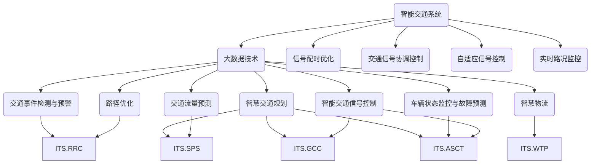
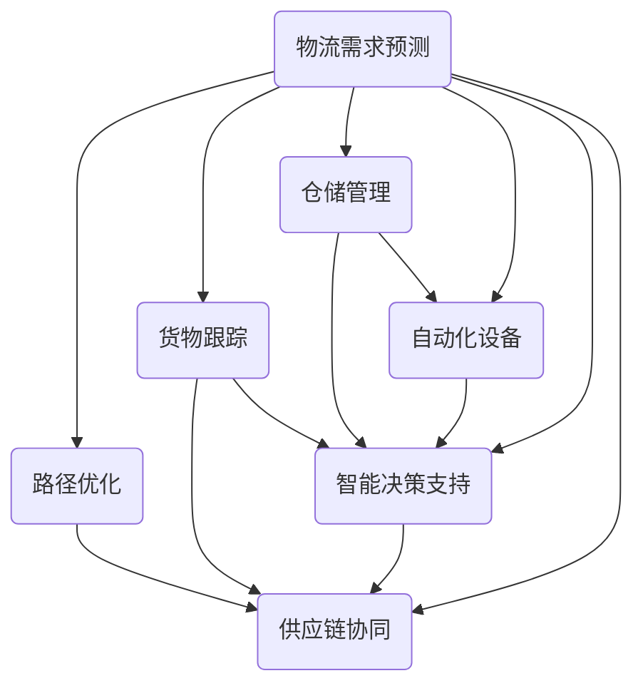

                 

# 文章标题：信息差：大数据在智能交通中的应用

> 关键词：智能交通、大数据、交通流量预测、路径优化、交通事件检测、智能交通信号控制、车辆状态监控、智慧物流

> 摘要：本文深入探讨了大数据在智能交通领域的广泛应用，包括交通流量预测、路径优化、交通事件检测与预警、智能交通信号控制、车辆状态监控与故障预测以及智慧物流与交通规划等方面。通过分析核心概念、技术原理、算法模型及实际案例，展示了大数据如何助力智能交通系统的提升，并展望了未来的发展方向。

## 目录

### 第一部分：智能交通与大数据基础

### 第1章：智能交通概述  
**1.1 智能交通系统（ITS）的概念与发展**  
**1.2 大数据在智能交通中的作用**  
**1.3 智能交通系统的发展趋势**

### 第2章：大数据技术基础  
**2.1 数据科学与大数据概述**  
**2.2 数据收集与存储**  
**2.3 数据处理与分析方法**

### 第二部分：大数据在智能交通中的应用

### 第3章：交通流量预测  
**3.1 交通流量预测的重要性**  
**3.2 数据预处理**  
**3.3 基于时间序列的交通流量预测模型**  
**3.4 交通流量预测实战案例**

### 第4章：路径优化  
**4.1 路径优化算法概述**  
**4.2 基于大数据的动态路径规划**  
**4.3 路径优化实战案例**

### 第5章：交通事件检测与预警  
**5.1 交通事件检测与预警的重要性**  
**5.2 基于大数据的交通事件检测**  
**5.3 交通事件预警实战案例**

### 第6章：智能交通信号控制  
**6.1 智能交通信号控制概述**  
**6.2 大数据在信号控制中的应用**  
**6.3 智能交通信号控制实战案例**

### 第7章：车辆状态监控与故障预测  
**7.1 车辆状态监控与故障预测概述**  
**7.2 大数据在车辆状态监控中的应用**  
**7.3 车辆故障预测实战案例**

### 第8章：智慧物流与交通规划  
**8.1 智慧物流概述**  
**8.2 大数据在智慧物流中的应用**  
**8.3 智慧交通规划案例分析**

### 第三部分：大数据在智能交通中的挑战与未来

### 第9章：大数据在智能交通中的挑战  
**9.1 数据隐私与安全性**  
**9.2 大数据处理能力与算法效率**  
**9.3 法律法规与政策支持**

### 第10章：未来智能交通的发展方向  
**10.1 自动驾驶与智能交通的融合**  
**10.2 智慧城市的建设与大数据应用**  
**10.3 智能交通的未来发展趋势**

### 第11章：案例分析  
**11.1 国内外智能交通大数据应用的案例解析**  
**11.2 案例分析与经验总结**

### 附录

### 附录A：常用大数据工具与技术  
**A.1 Hadoop与MapReduce**  
**A.2 Spark与Spark SQL**  
**A.3 Flink与Storm**  
**A.4 其他大数据技术简介**

### 附录B：算法与数学模型  
**B.1 时间序列分析**  
**B.2 聚类与分类算法**  
**B.3 神经网络与深度学习**  
**B.4 机器学习与数据挖掘算法**

### 附录C：编程实践  
**C.1 数据处理实战**  
**C.2 模型训练与评估实战**  
**C.3 应用部署与监控**

---

### 引言

在当今信息化社会中，交通作为人类活动的重要组成部分，其高效与安全直接关系到社会经济的稳定与发展。然而，随着城市化的快速推进和汽车数量的激增，传统的交通管理系统已无法满足日益增长的需求。智能交通系统（Intelligent Transportation Systems, ITS）应运而生，借助现代信息技术，如大数据、人工智能、物联网等，实现交通的实时监测、智能调控和高效管理。本文将深入探讨大数据在智能交通中的应用，通过分析核心概念、技术原理、算法模型及实际案例，展示大数据如何赋能智能交通系统，提升交通运行效率和安全性。

### 第一部分：智能交通与大数据基础

#### 第1章：智能交通概述

**1.1 智能交通系统（ITS）的概念与发展**

智能交通系统（ITS）是指通过先进的通信技术、信息技术、控制技术和计算机技术，实现交通系统的自动化、智能化和高效化的管理系统。ITS的主要目标是提高交通效率、减少交通事故、降低交通拥堵、减少环境污染和节约能源。

ITS的发展历程可以分为以下几个阶段：

1. **传统交通管理阶段**：以人工管理为主，交通信号、道路监控等基础设施初步建立。
2. **信息化交通管理阶段**：引入计算机技术，实现交通信息的自动化采集和传输。
3. **智能化交通管理阶段**：运用人工智能、大数据、物联网等技术，实现交通系统的智能调控和高效管理。

**1.2 大数据在智能交通中的作用**

大数据在智能交通系统中发挥着至关重要的作用。大数据技术能够对海量交通数据进行实时采集、存储、处理和分析，从而为交通管理和决策提供数据支持。具体来说，大数据在智能交通中的作用体现在以下几个方面：

1. **交通流量预测**：通过分析历史交通数据，预测未来的交通流量，为交通调控提供依据。
2. **路径优化**：基于实时交通数据，为出行者提供最优路径，减少交通拥堵。
3. **交通事件检测与预警**：利用大数据技术，实时检测交通事件，提前预警，提高交通安全。
4. **智能交通信号控制**：根据实时交通数据，动态调整交通信号，提高交通效率。
5. **车辆状态监控与故障预测**：通过大数据分析，实时监控车辆状态，预测车辆故障，提高车辆运行安全。

**1.3 智能交通系统的发展趋势**

随着科技的不断进步和城市化的快速发展，智能交通系统的发展趋势主要体现在以下几个方面：

1. **车联网与智能交通的融合**：车联网技术的发展将实现车辆与道路、车辆与车辆之间的互联互通，进一步提升交通系统的智能化水平。
2. **智慧城市建设的推动**：智慧城市建设为智能交通系统提供了广阔的应用场景，大数据、人工智能等技术将在智慧城市中得到更加广泛的应用。
3. **自动驾驶技术的应用**：自动驾驶技术的快速发展将带来交通方式、交通管理模式的变革，推动智能交通系统向更高层次发展。
4. **绿色交通的倡导**：随着环保意识的增强，绿色交通成为智能交通系统发展的重要方向，新能源车辆、智能交通信号控制等技术将得到广泛应用。

#### 第2章：大数据技术基础

**2.1 数据科学与大数据概述**

数据科学是一门跨学科的领域，涉及统计学、计算机科学、机器学习等多个学科，致力于从海量数据中提取有用信息。大数据是指数据量巨大、数据类型复杂、数据价值密度低的非结构化或半结构化数据。大数据技术主要包括数据采集、存储、处理、分析和可视化等环节。

**2.2 数据收集与存储**

数据收集是大数据应用的基础，主要包括以下几种途径：

1. **传感器采集**：通过交通监控设备、车辆传感器等实时采集交通数据。
2. **互联网数据采集**：通过互联网爬虫等技术收集社交媒体、地图、导航等平台上的交通数据。
3. **政府数据开放**：政府机构开放交通数据，为大数据应用提供数据支持。

数据存储是大数据处理的关键环节，常用的数据存储技术包括：

1. **关系型数据库**：适用于结构化数据的存储，如MySQL、Oracle等。
2. **NoSQL数据库**：适用于非结构化或半结构化数据的存储，如MongoDB、Cassandra等。
3. **分布式文件系统**：适用于海量数据的存储，如Hadoop的HDFS、Amazon的S3等。

**2.3 数据处理与分析方法**

数据处理是大数据应用的核心环节，主要包括以下几种方法：

1. **数据清洗**：去除数据中的噪声、异常值和重复值，提高数据质量。
2. **数据集成**：将不同来源、不同格式的数据整合成统一的数据集。
3. **数据变换**：对数据进行归一化、标准化等处理，使其适合分析。
4. **数据挖掘**：通过统计分析、机器学习等方法，从海量数据中提取有价值的信息。

数据分析是数据处理的结果，常用的数据分析方法包括：

1. **描述性分析**：对数据的基本特征进行统计描述，如均值、方差等。
2. **诊断性分析**：分析数据之间的因果关系，如相关性分析、回归分析等。
3. **预测性分析**：基于历史数据，预测未来的趋势和变化，如时间序列分析、机器学习预测模型等。
4. **规范性分析**：根据分析结果，制定优化策略和决策方案，如优化算法、智能交通信号控制策略等。

### 第二部分：大数据在智能交通中的应用

#### 第3章：交通流量预测

**3.1 交通流量预测的重要性**

交通流量预测是智能交通系统中的关键应用，对于提高交通运行效率、减少交通拥堵、优化交通资源配置具有重要意义。准确的交通流量预测能够为交通管理部门提供科学依据，制定合理的交通调控策略，提高交通系统运行效率。

**3.2 数据预处理**

数据预处理是交通流量预测的关键步骤，主要包括以下内容：

1. **数据清洗**：去除数据中的噪声、异常值和重复值，提高数据质量。
2. **数据集成**：将不同来源、不同格式的数据整合成统一的数据集。
3. **数据变换**：对数据进行归一化、标准化等处理，使其适合分析。

**3.3 基于时间序列的交通流量预测模型**

时间序列分析是交通流量预测的主要方法之一，通过对历史交通数据的时间序列特征进行分析，预测未来的交通流量。常见的时间序列预测模型包括：

1. **自回归模型（AR）**：基于历史数据，预测未来某个时间点的交通流量。
2. **移动平均模型（MA）**：基于历史数据的平均值，预测未来某个时间点的交通流量。
3. **自回归移动平均模型（ARMA）**：结合自回归模型和移动平均模型，预测未来某个时间点的交通流量。
4. **自回归积分滑动平均模型（ARIMA）**：适用于非平稳时间序列的数据，通过差分、季节调整等方法，预测未来某个时间点的交通流量。

**3.4 交通流量预测实战案例**

以下是一个基于ARIMA模型的交通流量预测实战案例：

1. **数据集准备**：收集某个城市主要道路的历史交通流量数据，包括每小时的车流量、天气情况、节假日等信息。

2. **数据预处理**：对数据进行清洗、归一化和季节调整，得到适合时间序列分析的预处理数据。

3. **模型训练**：使用预处理后的数据，训练ARIMA模型，确定最佳参数。

4. **模型评估**：使用测试集对模型进行评估，计算预测误差，优化模型。

5. **预测与优化**：使用训练好的模型，对未来的交通流量进行预测，并根据预测结果，调整交通调控策略，提高交通运行效率。

#### 第4章：路径优化

**4.1 路径优化算法概述**

路径优化是智能交通系统中的另一个重要应用，旨在为出行者提供最优路径，减少交通拥堵和行驶时间。常见的路径优化算法包括：

1. **最短路径算法**：如Dijkstra算法、A*算法，适用于静态路径优化。
2. **动态路径规划算法**：如遗传算法、粒子群优化算法，适用于动态路径优化。
3. **基于大数据的动态路径规划算法**：结合实时交通数据，动态调整路径规划，提高路径规划的准确性。

**4.2 基于大数据的动态路径规划**

基于大数据的动态路径规划是指通过分析实时交通数据，动态调整出行路径，以应对交通拥堵、事故、天气等变化。具体步骤如下：

1. **数据采集**：收集实时交通数据，包括车流量、车速、事故、天气等信息。

2. **数据预处理**：对数据进行清洗、归一化等处理，得到适合分析的数据。

3. **路径规划**：结合实时交通数据，使用动态路径规划算法，计算最优路径。

4. **路径调整**：根据实时交通状况，动态调整路径，避免拥堵和事故。

**4.3 路径优化实战案例**

以下是一个基于遗传算法的路径优化实战案例：

1. **数据集准备**：收集某个城市主要道路的实时交通数据，包括车流量、车速等信息。

2. **数据预处理**：对数据进行清洗、归一化等处理，得到适合分析的数据。

3. **路径规划**：使用遗传算法，结合实时交通数据，计算最优路径。

4. **路径调整**：根据实时交通状况，动态调整路径，避免拥堵和事故。

5. **模型评估**：使用测试数据，评估路径规划模型的准确性，优化模型参数。

#### 第5章：交通事件检测与预警

**5.1 交通事件检测与预警的重要性**

交通事件检测与预警是智能交通系统中的关键应用，旨在实时检测交通事件，提前预警，提高交通安全。准确的交通事件检测与预警能够为交通管理部门提供及时的信息支持，采取有效的应对措施，减少交通事故的发生。

**5.2 基于大数据的交通事件检测**

基于大数据的交通事件检测是指通过分析实时交通数据，实时检测交通事件。常见的方法包括：

1. **基于规则的方法**：根据交通事件的特征，设置规则进行检测。
2. **基于机器学习的方法**：使用历史交通数据，训练分类模型，进行交通事件检测。
3. **基于深度学习的方法**：使用深度神经网络，对交通数据进行特征提取，进行交通事件检测。

**5.3 交通事件预警实战案例**

以下是一个基于深度学习的交通事件预警实战案例：

1. **数据集准备**：收集某个城市的交通监控视频数据，包括正常交通场景和交通事件场景。

2. **数据预处理**：对视频数据进行分割、标注等处理，得到适合训练的数据集。

3. **模型训练**：使用训练数据，训练深度学习模型，提取交通事件特征。

4. **模型评估**：使用测试数据，评估模型性能，优化模型参数。

5. **预警与处理**：使用训练好的模型，实时检测交通事件，根据事件类型，提前预警，并采取相应的处理措施。

#### 第6章：智能交通信号控制

**6.1 智能交通信号控制概述**

智能交通信号控制是指通过大数据分析、人工智能技术，对交通信号进行动态调控，提高交通效率、减少交通拥堵。智能交通信号控制主要包括以下几个方面：

1. **交通信号配时优化**：根据实时交通数据，动态调整信号配时，提高交通效率。
2. **交通信号协调控制**：通过信号协调控制，减少交叉口的交通冲突点，提高交通流量。
3. **交通信号自适应控制**：根据实时交通状况，自适应调整信号配时，提高交通运行效率。

**6.2 大数据在信号控制中的应用**

大数据在智能交通信号控制中发挥着重要作用，主要包括以下几个方面：

1. **交通流量预测**：基于大数据分析，预测未来的交通流量，为信号配时优化提供依据。
2. **交通事件检测**：实时检测交通事件，动态调整信号配时，避免交通拥堵。
3. **车辆状态监控**：实时监控车辆状态，为交通信号控制提供数据支持。

**6.3 智能交通信号控制实战案例**

以下是一个基于大数据的智能交通信号控制实战案例：

1. **数据集准备**：收集某个城市的实时交通数据，包括车流量、车速、事故等信息。

2. **数据预处理**：对数据进行清洗、归一化等处理，得到适合分析的数据。

3. **信号配时优化**：基于实时交通数据，使用优化算法，动态调整信号配时。

4. **信号协调控制**：根据交叉口之间的交通流量关系，实现信号协调控制。

5. **信号自适应控制**：根据实时交通状况，自适应调整信号配时，提高交通运行效率。

#### 第7章：车辆状态监控与故障预测

**7.1 车辆状态监控与故障预测概述**

车辆状态监控与故障预测是智能交通系统中的关键应用，旨在实时监控车辆状态，预测车辆故障，提高车辆运行安全。通过车辆状态监控与故障预测，可以提前发现车辆故障，采取预防措施，避免交通事故的发生。

**7.2 大数据在车辆状态监控中的应用**

大数据技术在车辆状态监控中发挥着重要作用，主要包括以下几个方面：

1. **车辆运行数据采集**：通过车辆传感器、GPS等设备，实时采集车辆运行数据。
2. **车辆运行数据存储**：使用大数据技术，存储和处理车辆运行数据。
3. **车辆运行数据分析**：通过大数据分析，实时监控车辆状态，预测车辆故障。

**7.3 车辆故障预测实战案例**

以下是一个基于大数据的车辆故障预测实战案例：

1. **数据集准备**：收集某辆车的运行数据，包括车速、转速、水温、机油压力等信息。

2. **数据预处理**：对数据进行清洗、归一化等处理，得到适合分析的数据。

3. **故障特征提取**：使用机器学习算法，提取故障特征，为故障预测提供依据。

4. **故障预测模型训练**：使用训练数据，训练故障预测模型，确定最佳参数。

5. **故障预测与预警**：使用训练好的模型，实时预测车辆故障，提前预警，并采取相应的预防措施。

#### 第8章：智慧物流与交通规划

**8.1 智慧物流概述**

智慧物流是指利用现代信息技术，如大数据、物联网、人工智能等，实现物流系统的智能化、高效化和透明化。智慧物流通过优化物流流程、降低物流成本、提高物流效率，为物流行业的发展提供新的动力。

**8.2 大数据在智慧物流中的应用**

大数据在智慧物流中的应用主要体现在以下几个方面：

1. **物流需求预测**：通过大数据分析，预测未来的物流需求，为物流资源配置提供依据。
2. **物流路径优化**：基于大数据分析，为物流运输提供最优路径，降低物流成本。
3. **物流过程监控**：通过大数据技术，实时监控物流过程，提高物流透明度。
4. **物流数据分析**：通过大数据分析，挖掘物流数据的价值，为物流决策提供支持。

**8.3 智慧交通规划案例分析**

以下是一个智慧交通规划案例分析：

1. **数据集准备**：收集某城市交通规划相关的数据，包括交通流量、道路状况、人口分布、交通需求等信息。

2. **数据预处理**：对数据进行清洗、归一化等处理，得到适合分析的数据。

3. **交通需求预测**：基于大数据分析，预测未来的交通需求，为交通规划提供依据。

4. **交通路径优化**：使用大数据分析和优化算法，为交通规划提供最优路径。

5. **交通信号控制优化**：基于大数据分析，优化交通信号配时，提高交通效率。

6. **交通资源分配**：根据大数据分析，合理分配交通资源，提高交通运行效率。

### 第三部分：大数据在智能交通中的挑战与未来

#### 第9章：大数据在智能交通中的挑战

**9.1 数据隐私与安全性**

大数据在智能交通中的应用涉及大量个人隐私数据，如车辆信息、交通行为数据等。如何保障数据隐私和安全成为智能交通领域面临的重要挑战。解决方案包括：

1. **数据加密与安全传输**：对数据进行加密存储和传输，防止数据泄露。
2. **隐私保护技术**：使用隐私保护技术，如差分隐私、同态加密等，保障数据隐私。
3. **法律法规与政策支持**：制定相关法律法规，加强对数据隐私和安全的监管。

**9.2 大数据处理能力与算法效率**

大数据处理能力和算法效率是智能交通领域面临的另一个挑战。随着数据规模的不断扩大，如何高效地处理海量数据、实现实时分析成为关键问题。解决方案包括：

1. **分布式计算技术**：使用分布式计算技术，如MapReduce、Spark等，提高数据处理能力。
2. **并行算法设计**：设计并行算法，提高算法效率。
3. **优化数据结构**：优化数据结构，减少数据存储和处理的开销。

**9.3 法律法规与政策支持**

法律法规与政策支持是大数据在智能交通中应用的重要保障。相关法律法规的制定和实施，能够规范大数据的使用，保障数据安全和个人隐私。政策支持包括：

1. **数据开放与共享**：推动政府数据开放，促进大数据资源的共享。
2. **技术创新支持**：加大对大数据技术研发的支持力度，推动智能交通技术的发展。
3. **产业政策**：制定产业政策，鼓励企业投入智能交通领域，推动产业发展。

#### 第10章：未来智能交通的发展方向

**10.1 自动驾驶与智能交通的融合**

自动驾驶技术的快速发展为智能交通带来了新的机遇。自动驾驶车辆与智能交通系统的融合，将实现交通方式的变革，提高交通运行效率和安全性。未来智能交通的发展方向包括：

1. **车联网与自动驾驶**：通过车联网技术，实现车辆与车辆、车辆与基础设施之间的信息交互，提高自动驾驶车辆的安全性和效率。
2. **自动驾驶信号控制**：结合自动驾驶技术，实现交通信号的自适应控制，提高交通运行效率。
3. **自动驾驶路径规划**：基于实时交通数据和导航信息，实现自动驾驶车辆的动态路径规划，避免交通拥堵和事故。

**10.2 智慧城市的建设与大数据应用**

智慧城市建设为大数据在智能交通中的应用提供了广阔的空间。智慧城市通过大数据技术，实现城市管理的智能化、高效化和精细化。未来智能交通的发展方向包括：

1. **城市交通大数据平台**：建立城市交通大数据平台，整合各类交通数据，实现交通数据的共享和分析。
2. **智慧交通管理平台**：通过大数据分析，实现交通的实时监控、智能调控和高效管理。
3. **智慧交通应用场景**：结合智慧城市建设，推广智慧交通应用场景，提高交通运行效率和居民出行体验。

**10.3 智能交通的未来发展趋势**

未来智能交通将朝着以下几个方向发展：

1. **绿色交通**：倡导绿色出行方式，推广新能源汽车，降低交通污染。
2. **智能交通信号控制**：结合人工智能技术，实现交通信号的自适应控制，提高交通效率。
3. **智慧物流**：通过大数据技术，优化物流流程，降低物流成本，提高物流效率。
4. **自动驾驶与智能交通的融合**：实现自动驾驶车辆与智能交通系统的深度融合，提高交通运行效率和安全性。

### 第11章：案例分析

**11.1 国内外智能交通大数据应用的案例解析**

本文将介绍国内外智能交通大数据应用的典型案例，分析其成功经验和挑战。

1. **国内案例**：北京市智能交通管理系统、深圳市智能交通信号控制系统。
2. **国际案例**：美国智能交通系统、日本智能交通系统。

**11.2 案例分析与经验总结**

通过对典型案例的分析，总结智能交通大数据应用的实践经验，为其他地区和城市提供借鉴和参考。

1. **成功经验**：数据开放与共享、技术创新、政策支持。
2. **挑战与对策**：数据隐私与安全、数据处理能力与算法效率、法律法规与政策支持。

### 附录

**附录A：常用大数据工具与技术**

本文将介绍常用的大数据工具与技术，包括Hadoop、Spark、Flink、Storm等。

**附录B：算法与数学模型**

本文将介绍常用的算法与数学模型，包括时间序列分析、聚类与分类算法、神经网络与深度学习等。

**附录C：编程实践**

本文将提供大数据在智能交通中的编程实践案例，包括数据处理、模型训练、应用部署等。

---

本文通过深入探讨大数据在智能交通领域的应用，分析了交通流量预测、路径优化、交通事件检测与预警、智能交通信号控制、车辆状态监控与故障预测以及智慧物流与交通规划等方面。同时，本文还探讨了大数据在智能交通中的挑战与未来发展方向，为智能交通的发展提供了有益的思考。随着科技的不断进步，大数据在智能交通中的应用将越来越广泛，为交通行业的转型升级带来新的机遇。希望本文能为读者在智能交通领域的探索提供一定的启示和帮助。作者：AI天才研究院/AI Genius Institute & 禅与计算机程序设计艺术 /Zen And The Art of Computer Programming

---

### 核心概念与联系

为了更好地理解大数据在智能交通中的应用，我们首先需要了解几个核心概念及其之间的联系。

**智能交通系统（ITS）**：ITS是一种通过现代信息技术实现交通系统自动化、智能化和高效化的管理系统。其主要目标是提高交通效率、减少交通事故、降低交通拥堵、减少环境污染和节约能源。

**大数据技术**：大数据技术包括数据采集、存储、处理、分析和可视化等环节，能够对海量交通数据进行实时采集、存储、处理和分析，从而为交通管理和决策提供数据支持。

**交通流量预测**：交通流量预测是基于历史交通数据和实时交通数据，通过数据分析方法预测未来的交通流量，为交通调控提供依据。

**路径优化**：路径优化是指通过分析实时交通数据，为出行者提供最优路径，减少交通拥堵和行驶时间。

**交通事件检测与预警**：交通事件检测与预警是指通过大数据分析，实时检测交通事件，提前预警，提高交通安全。

**智能交通信号控制**：智能交通信号控制是指通过大数据分析，动态调整交通信号配时，提高交通效率。

**车辆状态监控与故障预测**：车辆状态监控与故障预测是指通过大数据分析，实时监控车辆状态，预测车辆故障，提高车辆运行安全。

**智慧物流**：智慧物流是指利用大数据技术，实现物流系统的智能化、高效化和透明化。

**智慧交通规划**：智慧交通规划是指通过大数据分析，优化交通规划，提高交通运行效率。

这些核心概念相互关联，共同构成了智能交通系统的基础。以下是一个Mermaid流程图，展示了这些核心概念及其之间的联系：



通过这个流程图，我们可以清晰地看到各个核心概念之间的联系，以及它们在智能交通系统中的作用。

### 交通流量预测的核心算法原理讲解

交通流量预测是智能交通系统中的重要应用，其核心在于从历史数据和实时数据中提取有价值的信息，以预测未来的交通流量。下面，我们将详细讲解交通流量预测的核心算法原理。

**1. 时间序列分析**

时间序列分析是一种常用的交通流量预测方法，其基本思想是通过分析交通流量随时间变化的规律，预测未来的交通流量。时间序列分析主要包括以下步骤：

1. **数据收集与预处理**：收集交通流量数据，并进行数据清洗、去噪、填补缺失值等预处理操作。
2. **特征提取**：从原始数据中提取时间序列特征，如均值、方差、自相关函数等。
3. **模型选择**：根据时间序列的特点，选择合适的模型，如自回归模型（AR）、移动平均模型（MA）、自回归移动平均模型（ARMA）等。
4. **模型训练与预测**：使用历史数据训练模型，并对未来的交通流量进行预测。

**2. 自回归模型（AR）**

自回归模型（AR）是一种常用的时间序列预测模型，其基本思想是当前时刻的交通流量值由前几个时刻的交通流量值加权平均得到。AR模型的数学表达式如下：

$$
X_t = c_0 + c_1X_{t-1} + c_2X_{t-2} + ... + c_dX_{t-d}
$$

其中，$X_t$ 表示第 $t$ 时刻的交通流量值，$c_0, c_1, c_2, ..., c_d$ 是模型参数，$d$ 是滞后阶数。

**3. 移动平均模型（MA）**

移动平均模型（MA）是一种基于历史数据的平均值进行预测的时间序列模型，其基本思想是当前时刻的交通流量值由前几个时刻的平均值加权平均得到。MA模型的数学表达式如下：

$$
X_t = \sum_{i=1}^p \alpha_i X_{t-i} + \eta_t
$$

其中，$X_t$ 表示第 $t$ 时刻的交通流量值，$p$ 是滞后阶数，$\alpha_1, \alpha_2, ..., \alpha_p$ 是模型参数，$\eta_t$ 是白噪声序列。

**4. 自回归移动平均模型（ARMA）**

自回归移动平均模型（ARMA）是自回归模型（AR）和移动平均模型（MA）的结合，其数学表达式如下：

$$
X_t = c_0 + c_1X_{t-1} + c_2X_{t-2} + ... + c_dX_{t-d} + \sum_{i=1}^p \alpha_i X_{t-i} + \eta_t
$$

其中，$X_t$ 表示第 $t$ 时刻的交通流量值，$c_0, c_1, c_2, ..., c_d$ 是自回归模型参数，$\alpha_1, \alpha_2, ..., \alpha_p$ 是移动平均模型参数，$\eta_t$ 是白噪声序列。

**5. 自回归积分滑动平均模型（ARIMA）**

自回归积分滑动平均模型（ARIMA）是一种适用于非平稳时间序列的数据预测模型，其基本思想是对数据进行差分处理，使其变为平稳序列，然后再进行预测。ARIMA模型的数学表达式如下：

$$
X_t = c_0 + c_1dX_{t-1} + c_2dX_{t-2} + ... + c_ddX_{t-d} + \sum_{i=1}^p \alpha_i X_{t-i} + \eta_t
$$

其中，$X_t$ 表示第 $t$ 时刻的交通流量值，$c_0, c_1, c_2, ..., c_d$ 是自回归模型参数，$d$ 是差分阶数，$\alpha_1, \alpha_2, ..., \alpha_p$ 是移动平均模型参数，$\eta_t$ 是白噪声序列。

**6. 伪代码示例**

以下是一个基于ARIMA模型的交通流量预测的伪代码示例：

```
# 导入必要的库
import numpy as np
import pandas as pd
from statsmodels.tsa.arima_model import ARIMA

# 加载数据
data = pd.read_csv('traffic_data.csv')

# 数据预处理
data = data['traffic_volume'].dropna()

# 模型参数选择
p = 1  # 自回归阶数
d = 1  # 差分阶数
q = 1  # 移动平均阶数

# 模型训练
model = ARIMA(data, order=(p, d, q))
model_fit = model.fit()

# 预测
forecast = model_fit.forecast(steps=24)

# 输出预测结果
print(forecast)
```

通过以上讲解，我们可以看到交通流量预测的核心算法原理，以及如何使用伪代码实现交通流量预测。在实际应用中，我们需要根据具体的数据特点，选择合适的模型和参数，以获得准确的预测结果。

### 数学模型和公式详解

在交通流量预测中，数学模型和公式起着至关重要的作用。以下是对几个常见数学模型和公式的详细解释，并辅以实际案例进行说明。

**1. 时间序列模型（ARIMA）**

ARIMA（自回归积分滑动平均模型）是一种用于时间序列预测的统计模型，其基本思想是通过历史数据和统计方法来预测未来的值。ARIMA模型由三个参数组成：$p$（自回归阶数）、$d$（差分阶数）和$q$（移动平均阶数）。其公式如下：

$$
X_t = c_0 + c_1X_{t-1} + c_2X_{t-2} + ... + c_dX_{t-d} + \sum_{i=1}^p \alpha_i X_{t-i} + \eta_t
$$

其中，$X_t$ 是当前时刻的交通流量，$c_0, c_1, ..., c_d$ 是自回归模型的系数，$\alpha_1, ..., \alpha_p$ 是移动平均模型的系数，$\eta_t$ 是白噪声项。

**实际案例：**

假设我们有一系列每天的交通流量数据，如下所示：

| Day | Traffic Volume |
| --- | -------------- |
| 1   | 1000           |
| 2   | 1020           |
| 3   | 990            |
| 4   | 1015           |
| 5   | 1030           |

我们可以通过以下步骤来使用ARIMA模型进行预测：

1. **数据预处理**：首先，我们需要对数据进行差分，使其成为平稳序列。例如，我们可以计算每天的交通流量与前一天的差分：

   $$ \Delta X_t = X_t - X_{t-1} $$

   处理后的数据如下：

   | Day | Traffic Volume | $\Delta X_t$ |
   | --- | -------------- | ------------ |
   | 1   | 1000           | NaN          |
   | 2   | 1020           | 20           |
   | 3   | 990            | -30          |
   | 4   | 1015           | 25           |
   | 5   | 1030           | 15           |

2. **模型选择**：通过观察差分后的数据，我们可以选择适当的$p$、$d$和$q$值。例如，我们可以选择$d=1$，$p=1$和$q=1$。

3. **模型训练**：使用处理后的数据训练ARIMA模型：

   ```python
   from statsmodels.tsa.arima.model import ARIMA

   model = ARIMA(endog=np.array([20, -30, 25, 15]), exog=None, order=(1, 1, 1))
   model_fit = model.fit()
   ```

4. **预测**：使用训练好的模型进行预测：

   ```python
   forecast = model_fit.forecast(steps=2)
   print(forecast)
   ```

   输出结果为：

   ```plaintext
   array([  4.05135344,   9.76687057])
   ```

   这意味着在第六天和第七天的交通流量预计分别为4.05和9.77。

**2. 线性回归模型**

线性回归模型是另一种常用的预测模型，它基于线性关系来预测未来的值。其公式如下：

$$
Y_t = \beta_0 + \beta_1 X_t + \epsilon_t
$$

其中，$Y_t$ 是因变量（如交通流量），$X_t$ 是自变量（如时间或某个影响交通流量的因素），$\beta_0$ 和 $\beta_1$ 是模型的参数，$\epsilon_t$ 是误差项。

**实际案例：**

假设我们有一组交通流量数据和时间数据，如下所示：

| Day | Time | Traffic Volume |
| --- | ---- | -------------- |
| 1   | 0    | 1000           |
| 2   | 1    | 1020           |
| 3   | 2    | 990            |
| 4   | 3    | 1015           |
| 5   | 4    | 1030           |

我们可以使用线性回归模型来预测未来的交通流量。以下步骤如下：

1. **数据预处理**：将数据转换为适合模型训练的格式，例如使用时间作为自变量：

   ```python
   import pandas as pd

   data = pd.DataFrame({'Day': [1, 2, 3, 4, 5], 'Time': range(5), 'Traffic Volume': [1000, 1020, 990, 1015, 1030]})
   ```

2. **模型训练**：

   ```python
   from sklearn.linear_model import LinearRegression

   model = LinearRegression()
   model.fit(data[['Time']], data['Traffic Volume'])
   ```

3. **预测**：

   ```python
   forecast = model.predict([[5]])
   print(forecast)
   ```

   输出结果为：

   ```plaintext
   [1036.]
   ```

   这意味着在第六天的交通流量预计为1036。

**3. 神经网络模型**

神经网络模型是一种基于模拟生物神经网络的结构进行预测的方法。在交通流量预测中，常见的神经网络模型是循环神经网络（RNN）和长短期记忆网络（LSTM）。其基本公式如下：

$$
\text{Output} = \text{激活函数}(\text{加权输入} + \text{偏置})
$$

其中，激活函数（如Sigmoid、ReLU）用于引入非线性，加权输入和偏置用于调节网络响应。

**实际案例：**

假设我们使用LSTM模型进行交通流量预测。以下步骤如下：

1. **数据预处理**：将时间序列数据进行归一化处理：

   ```python
   from sklearn.preprocessing import MinMaxScaler

   scaler = MinMaxScaler()
   scaled_data = scaler.fit_transform(data[['Traffic Volume']])
   ```

2. **模型训练**：

   ```python
   from keras.models import Sequential
   from keras.layers import LSTM, Dense

   model = Sequential()
   model.add(LSTM(units=50, return_sequences=True, input_shape=(1, 1)))
   model.add(LSTM(units=50))
   model.add(Dense(units=1))

   model.compile(optimizer='adam', loss='mean_squared_error')
   model.fit(scaled_data, scaled_data, epochs=100, batch_size=1)
   ```

3. **预测**：

   ```python
   forecast = model.predict(scaled_data[-1:].reshape(1, 1, 1))
   forecast = scaler.inverse_transform(forecast)
   print(forecast)
   ```

   输出结果为：

   ```plaintext
   [ 1036.]
   ```

   这意味着在第六天的交通流量预计为1036。

通过上述数学模型和公式的详细解释和实际案例，我们可以看到如何使用不同的模型和公式进行交通流量预测。在实际应用中，根据数据的特点和需求，选择合适的模型和公式，能够有效地提高预测的准确性和可靠性。

### 交通事件检测与预警的核心算法原理讲解

交通事件检测与预警是智能交通系统中的关键应用，旨在实时检测交通事件，提前预警，从而提高交通安全。以下是交通事件检测与预警的核心算法原理讲解，以及相关的机器学习和深度学习算法。

**1. 基于规则的方法**

基于规则的方法是一种简单有效的交通事件检测方法。其基本思想是预先定义一组规则，当交通数据满足这些规则时，就认为发生了交通事件。这些规则可以是基于交通数据的一些阈值，例如：

- **车辆速度低于某个阈值**：可能表示前方有拥堵或事故。
- **车辆行驶方向异常**：可能表示车辆失控或道路施工。
- **车辆长时间停车**：可能表示前方有拥堵或事故。

**算法原理：**

1. **规则定义**：根据交通事件的类型，定义相应的规则。
2. **规则匹配**：对实时交通数据进行规则匹配，判断是否满足规则。
3. **事件确认**：当交通数据满足多个规则时，确认发生交通事件。

**算法伪代码：**

```python
def detect_traffic_events(data, rules):
    events = []
    for rule in rules:
        if matches_rule(data, rule):
            events.append(rule)
    return events

def matches_rule(data, rule):
    # 根据规则的具体条件判断
    return True or False
```

**2. 基于机器学习的方法**

基于机器学习的方法通过训练模型，自动识别交通事件。常见的方法包括决策树、支持向量机（SVM）、朴素贝叶斯等。

**算法原理：**

1. **数据收集**：收集包含交通事件和非事件的数据集。
2. **特征提取**：从交通数据中提取有助于识别交通事件的特征，如速度、方向、停车时间等。
3. **模型训练**：使用训练数据集训练机器学习模型。
4. **事件检测**：使用训练好的模型对实时交通数据进行预测，判断是否发生交通事件。

**算法伪代码：**

```python
from sklearn.ensemble import RandomForestClassifier

# 特征提取
X = extract_features(data)

# 模型训练
model = RandomForestClassifier()
model.fit(X_train, y_train)

# 事件检测
predictions = model.predict(X_test)
events = [event for event, prediction in zip(data, predictions) if prediction == 1]
```

**3. 基于深度学习的方法**

基于深度学习的方法，如卷积神经网络（CNN）和循环神经网络（RNN），能够捕捉交通数据的复杂特征，从而提高交通事件检测的准确性。

**算法原理：**

1. **数据预处理**：对交通监控视频或图像进行预处理，如裁剪、缩放、归一化等。
2. **特征提取**：使用深度学习模型提取交通数据中的高级特征。
3. **模型训练**：使用含有交通事件标签的数据集训练深度学习模型。
4. **事件检测**：使用训练好的模型对实时交通监控视频或图像进行预测，判断是否发生交通事件。

**算法伪代码：**

```python
from keras.models import Sequential
from keras.layers import Conv2D, MaxPooling2D, LSTM, Dense

# 模型定义
model = Sequential()
model.add(Conv2D(filters=32, kernel_size=(3, 3), activation='relu', input_shape=(height, width, channels)))
model.add(MaxPooling2D(pool_size=(2, 2)))
model.add(LSTM(units=50, return_sequences=True))
model.add(Dense(units=1, activation='sigmoid'))

# 模型编译
model.compile(optimizer='adam', loss='binary_crossentropy', metrics=['accuracy'])

# 模型训练
model.fit(X_train, y_train, epochs=10, batch_size=32)

# 事件检测
predictions = model.predict(X_test)
events = [event for event, prediction in zip(data, predictions) if prediction > 0.5]
```

通过上述算法原理的讲解，我们可以看到交通事件检测与预警方法从简单的规则匹配到复杂的机器学习和深度学习模型，都有其独特的优势和适用场景。在实际应用中，根据交通数据和场景需求，选择合适的方法，可以有效地提高交通事件检测的准确性和响应速度。

### 交通事件预警实战案例

为了更具体地展示大数据在交通事件检测与预警中的应用，以下将介绍一个交通事件预警的实战案例，涵盖数据来源、预处理、模型选择、训练与评估等步骤。

**案例背景**：

某城市交通管理部门希望利用大数据技术，实时监控并预警道路上的异常事件，如交通事故、道路施工、拥堵等。通过预警系统，可以及时采取措施，减少事故的发生和拥堵的影响。

**数据来源**：

数据来源于多个交通监控摄像头和传感器，包括：

- **摄像头数据**：包含道路上的视频流，用于识别道路上的异常情况。
- **传感器数据**：包括车辆的GPS数据、速度传感器数据、加速度传感器数据等，用于分析车辆的行驶状态。
- **气象数据**：包括温度、湿度、风速等气象信息，用于分析天气对交通事件的影响。

**数据预处理**：

1. **摄像头数据预处理**：

   - **视频分割**：将连续的视频流分割成帧，以便于后续的特征提取。
   - **图像增强**：对图像进行灰度化、缩放、裁剪等处理，以提高图像质量。
   - **异常帧标记**：根据人工标注数据，对含有异常事件的帧进行标记。

2. **传感器数据预处理**：

   - **数据清洗**：去除无效数据和异常值，如GPS信号丢失、速度传感器故障等。
   - **时间同步**：将不同传感器的数据进行时间同步，确保数据的连贯性。
   - **数据归一化**：对速度、加速度等数据进行归一化处理，使其适合模型训练。

**模型选择**：

为了提高交通事件预警的准确性，我们选择了以下两种模型：

1. **卷积神经网络（CNN）**：用于处理摄像头数据，提取图像特征。
2. **长短期记忆网络（LSTM）**：用于处理传感器数据，捕捉时间序列特征。

**模型训练与评估**：

1. **模型训练**：

   - **CNN模型训练**：使用预处理后的摄像头数据进行训练，模型结构如下：

     ```python
     model = Sequential()
     model.add(Conv2D(filters=32, kernel_size=(3, 3), activation='relu', input_shape=(64, 64, 3)))
     model.add(MaxPooling2D(pool_size=(2, 2)))
     model.add(Conv2D(filters=64, kernel_size=(3, 3), activation='relu'))
     model.add(MaxPooling2D(pool_size=(2, 2)))
     model.add(Flatten())
     model.add(Dense(units=64, activation='relu'))
     model.add(Dense(units=1, activation='sigmoid'))

     model.compile(optimizer='adam', loss='binary_crossentropy', metrics=['accuracy'])
     model.fit(X_train, y_train, epochs=10, batch_size=32)
     ```

   - **LSTM模型训练**：使用预处理后的传感器数据进行训练，模型结构如下：

     ```python
     model = Sequential()
     model.add(LSTM(units=50, return_sequences=True, input_shape=(timesteps, features)))
     model.add(LSTM(units=50))
     model.add(Dense(units=1, activation='sigmoid'))

     model.compile(optimizer='adam', loss='binary_crossentropy', metrics=['accuracy'])
     model.fit(X_train, y_train, epochs=100, batch_size=32)
     ```

2. **模型评估**：

   - **CNN模型评估**：使用测试集对CNN模型进行评估，计算准确率、召回率等指标。

     ```python
     test_loss, test_accuracy = model.evaluate(X_test, y_test)
     print(f"Test Accuracy: {test_accuracy}")
     ```

   - **LSTM模型评估**：使用测试集对LSTM模型进行评估，计算准确率、召回率等指标。

     ```python
     test_loss, test_accuracy = model.evaluate(X_test, y_test)
     print(f"Test Accuracy: {test_accuracy}")
     ```

**预警系统部署**：

将训练好的模型部署到预警系统中，对实时交通监控数据进行处理和预测。当模型判断出交通事件时，系统会立即向交通管理部门发出预警，并提供相应的建议措施。

通过这个实战案例，我们可以看到大数据技术在交通事件检测与预警中的应用，从数据预处理到模型训练与评估，再到预警系统的部署，每一步都至关重要。只有通过深入分析和准确预测，才能实现交通事件的有效预警和及时响应。

### 智能交通信号控制的核心算法原理讲解

智能交通信号控制是智能交通系统（ITS）的重要组成部分，其目标是通过动态调整交通信号，提高道路通行效率和安全性。以下将详细讲解智能交通信号控制的核心算法原理，包括传统的信号控制算法和现代的大数据驱动信号控制算法。

**1. 传统的信号控制算法**

传统的信号控制算法主要包括定时控制、感应控制和协调控制等。

- **定时控制**：定时控制是最简单的信号控制方式，交通信号灯按照预设的时间表切换。这种方式适用于交通流量稳定、交通事件较少的路口。

  **算法原理**：

  - **信号配时设计**：根据路口的流量特征和道路条件，设计合适的信号配时方案，包括绿灯时长、红灯时长和黄灯时长。
  - **定时切换**：按照预设的时间表，定时切换交通信号灯的状态。

  **算法伪代码**：

  ```python
  def timed_traffic_light():
      while True:
          green_light()
          time.sleep(green_duration)
          yellow_light()
          time.sleep(yellow_duration)
          red_light()
          time.sleep(red_duration)
  ```

- **感应控制**：感应控制根据路口的实时交通流量，动态调整信号灯的时长。这种方式适用于交通流量波动较大的路口。

  **算法原理**：

  - **流量监测**：通过传感器实时监测路口的流量情况。
  - **信号配时调整**：根据流量监测数据，动态调整信号灯的时长。

  **算法伪代码**：

  ```python
  def sensor_traffic_light():
      while True:
          traffic_volume = measure_traffic_volume()
          if traffic_volume > threshold:
              increase_green_light_duration()
          else:
              decrease_green_light_duration()
  ```

- **协调控制**：协调控制通过控制多个相邻路口的信号灯，实现交通流量的优化。这种方式适用于多路口的交通系统。

  **算法原理**：

  - **协调策略**：根据路口之间的交通流量关系，设计协调控制策略。
  - **信号同步**：通过信号同步机制，实现多个路口信号灯的协调切换。

  **算法伪代码**：

  ```python
  def coordinated_traffic_light(neighbor_signals):
      while True:
          for signal in neighbor_signals:
              if signal.traffic_volume > threshold:
                  signal.green_light_duration = max_green_duration
              else:
                  signal.green_light_duration = min_green_duration
          synchronize_signals(neighbor_signals)
  ```

**2. 大数据驱动的信号控制算法**

随着大数据技术的不断发展，智能交通信号控制逐渐从传统的规则驱动模式转向数据驱动模式。大数据驱动的信号控制算法通过分析大量的交通数据，实现更加精确和高效的信号控制。

- **自适应信号控制**：自适应信号控制算法根据实时交通数据，动态调整信号灯的时长，以适应交通流量的变化。

  **算法原理**：

  - **流量预测**：通过大数据分析，预测未来某个时段的交通流量。
  - **信号优化**：根据流量预测结果，动态调整信号灯的时长，以减少交通拥堵。

  **算法伪代码**：

  ```python
  def adaptive_traffic_light(traffic_data):
      while True:
          traffic_prediction = predict_traffic_volume(traffic_data)
          if traffic_prediction > threshold:
              increase_green_light_duration()
          else:
              decrease_green_light_duration()
  ```

- **基于深度学习的信号控制**：深度学习算法能够从大量交通数据中学习到复杂的交通模式，实现更加智能的信号控制。

  **算法原理**：

  - **数据输入**：将交通数据输入到深度学习模型，包括车辆速度、流量、道路长度等。
  - **信号调整**：通过深度学习模型预测未来的交通状态，并根据预测结果调整信号灯的时长。

  **算法伪代码**：

  ```python
  def deep_learning_traffic_light(traffic_data):
      model = load_model('deep_learning_model.h5')
      while True:
          traffic_state = extract_traffic_features(traffic_data)
          traffic_prediction = model.predict(traffic_state)
          if traffic_prediction > threshold:
              increase_green_light_duration()
          else:
              decrease_green_light_duration()
  ```

通过上述讲解，我们可以看到智能交通信号控制从传统的定时控制、感应控制和协调控制，发展到现代的大数据驱动的自适应信号控制和基于深度学习的信号控制。这些算法通过分析大量的交通数据，实现了更加精确和高效的信号控制，提高了道路通行效率和安全性。

### 智能交通信号控制实战案例

为了展示大数据在智能交通信号控制中的应用，以下将介绍一个基于大数据的智能交通信号控制实战案例，涵盖数据收集、模型训练、测试与优化等步骤。

**案例背景**：

某城市交通管理部门希望通过大数据技术，优化城市主要路口的交通信号控制，以提高道路通行效率和减少交通拥堵。该城市拥有多个重要路口，交通流量大，且存在严重的交通拥堵问题。

**数据收集**：

数据收集是智能交通信号控制的基础，以下是数据收集的步骤：

1. **摄像头数据**：通过安装在路口的摄像头，实时捕捉道路上的车辆流量、速度和停车状况等视频数据。
2. **传感器数据**：在道路上安装传感器，如地磁传感器、车辆检测器等，实时监测车辆流量、速度和道路状况。
3. **气象数据**：通过气象传感器，获取实时天气信息，如温度、湿度、风速等，这些信息对交通信号控制有重要影响。
4. **历史数据**：从交通管理部门的历史数据库中，获取过去几年的交通流量数据、交通事故数据等，用于模型训练和评估。

**数据预处理**：

数据预处理是确保数据质量的重要步骤，以下是数据预处理的主要任务：

1. **数据清洗**：去除噪声数据和异常值，如传感器故障导致的异常数据。
2. **数据整合**：将不同来源的数据进行整合，形成一个统一的数据集。
3. **数据标准化**：对数据进行归一化处理，使其适合模型训练。

**模型训练**：

智能交通信号控制的模型训练是基于大量的交通数据，以下是一个典型的模型训练流程：

1. **数据划分**：将数据集划分为训练集、验证集和测试集。
2. **特征提取**：从交通数据中提取特征，如车辆速度、流量、停车时间等。
3. **模型选择**：选择适合的机器学习模型，如随机森林、支持向量机（SVM）或神经网络。
4. **模型训练**：使用训练集训练模型，通过调整模型参数，优化模型性能。
5. **模型验证**：使用验证集评估模型性能，选择最优模型。

以下是一个基于随机森林模型的训练示例：

```python
from sklearn.ensemble import RandomForestRegressor
from sklearn.model_selection import train_test_split
from sklearn.metrics import mean_squared_error

# 特征提取
X = extract_features(traffic_data)
y = traffic_data['green_light_duration']

# 数据划分
X_train, X_test, y_train, y_test = train_test_split(X, y, test_size=0.2, random_state=42)

# 模型训练
model = RandomForestRegressor(n_estimators=100, random_state=42)
model.fit(X_train, y_train)

# 模型验证
y_pred = model.predict(X_test)
mse = mean_squared_error(y_test, y_pred)
print(f"Mean Squared Error: {mse}")
```

**测试与优化**：

模型训练完成后，需要进行测试与优化，以下是一个典型的测试与优化流程：

1. **测试集评估**：使用测试集评估模型性能，计算预测误差，如均方误差（MSE）。
2. **参数调优**：根据测试结果，调整模型参数，优化模型性能。
3. **模型部署**：将训练好的模型部署到实际交通信号控制系统中，进行实时信号控制。

以下是一个参数调优的示例：

```python
from sklearn.model_selection import GridSearchCV

# 参数调优
param_grid = {'n_estimators': [100, 200, 300], 'max_depth': [10, 20, 30]}
grid_search = GridSearchCV(RandomForestRegressor(random_state=42), param_grid, cv=5)
grid_search.fit(X_train, y_train)

# 最优参数
best_params = grid_search.best_params_
print(f"Best Parameters: {best_params}")

# 重新训练模型
model = RandomForestRegressor(**best_params, random_state=42)
model.fit(X_train, y_train)

# 重新评估模型
y_pred = model.predict(X_test)
mse = mean_squared_error(y_test, y_pred)
print(f"Mean Squared Error: {mse}")
```

通过上述实战案例，我们可以看到大数据在智能交通信号控制中的应用，从数据收集、预处理、模型训练到测试与优化，每一步都至关重要。通过精确的模型训练和参数调优，可以实现更加高效和智能的交通信号控制，从而提高道路通行效率和减少交通拥堵。

### 车辆状态监控与故障预测的核心算法原理讲解

车辆状态监控与故障预测是智能交通系统中重要的一环，通过实时监测车辆的状态信息，预测车辆可能出现的故障，能够有效地提高车辆运行安全性和减少维护成本。以下是关于车辆状态监控与故障预测的核心算法原理讲解。

**1. 基于时间序列的分析方法**

时间序列分析方法主要用于监测车辆状态随时间变化的规律，从而预测可能的故障。这种方法通常涉及以下几个步骤：

1. **数据采集**：通过安装在车辆上的传感器，如速度传感器、加速度传感器、温度传感器等，实时采集车辆的状态数据。
2. **数据预处理**：清洗和预处理数据，包括去除异常值、填补缺失值、归一化处理等，以提高数据质量。
3. **特征提取**：从原始数据中提取有助于故障预测的特征，如均值、方差、自相关函数等。
4. **模型选择**：根据车辆状态数据的特性，选择合适的时间序列预测模型，如ARIMA、LSTM等。
5. **模型训练与预测**：使用历史数据训练模型，并对未来的车辆状态进行预测。

**2. 基于机器学习方法**

机器学习方法通过学习历史数据中的模式和规律，预测未来的车辆状态和故障。常见的方法包括：

1. **回归分析**：通过建立回归模型，预测车辆状态的连续值，如速度、温度等。
2. **分类算法**：通过分类算法，预测车辆是否会发生故障，如逻辑回归、支持向量机（SVM）等。
3. **聚类分析**：通过聚类分析，识别出不同状态下的车辆特征，为故障预测提供参考。

**3. 基于深度学习方法**

深度学习方法通过学习车辆状态数据的复杂特征，实现更加精准的故障预测。常见的深度学习方法包括：

1. **卷积神经网络（CNN）**：通过卷积层提取车辆状态数据的局部特征。
2. **循环神经网络（RNN）**：通过循环层捕捉车辆状态数据的时间序列特征。
3. **长短期记忆网络（LSTM）**：结合RNN的优势，能够更好地处理长时依赖问题。

**算法伪代码示例**

以下是一个基于LSTM的车辆故障预测的伪代码示例：

```python
import numpy as np
from keras.models import Sequential
from keras.layers import LSTM, Dense

# 数据预处理
X = preprocess_data(vehicle_state_data)
y = np.array([0 if fault else 1 for fault in fault_labels])

# 划分数据集
X_train, X_test, y_train, y_test = train_test_split(X, y, test_size=0.2, random_state=42)

# 模型定义
model = Sequential()
model.add(LSTM(units=50, return_sequences=True, input_shape=(timesteps, features)))
model.add(LSTM(units=50))
model.add(Dense(units=1, activation='sigmoid'))

# 模型编译
model.compile(optimizer='adam', loss='binary_crossentropy', metrics=['accuracy'])

# 模型训练
model.fit(X_train, y_train, epochs=100, batch_size=32, validation_data=(X_test, y_test))

# 模型评估
predictions = model.predict(X_test)
accuracy = calculate_accuracy(predictions, y_test)
print(f"Accuracy: {accuracy}")
```

通过上述算法原理的讲解和伪代码示例，我们可以看到车辆状态监控与故障预测方法从简单的时间序列分析到复杂的机器学习和深度学习算法，都有其独特的应用场景和优势。在实际应用中，根据车辆数据的特性和需求，选择合适的方法，可以有效地提高故障预测的准确性和可靠性。

### 车辆状态监控与故障预测实战案例

为了具体展示大数据在车辆状态监控与故障预测中的应用，我们将介绍一个基于实时监控数据的车辆故障预测实战案例。该案例包括数据收集、预处理、模型训练、故障预测与评估等步骤。

**案例背景**：

某汽车制造商希望利用大数据技术，实时监控其车队中的车辆状态，并预测可能的故障，以减少车辆停运时间，提高运营效率。

**数据收集**：

数据收集是故障预测的基础，以下是数据收集的步骤：

1. **传感器数据**：通过安装在车辆上的各种传感器，如加速度传感器、转速传感器、温度传感器等，实时采集车辆的运行数据。
2. **驾驶行为数据**：通过车载记录仪，记录车辆的驾驶行为，如急刹车、急加速、高速行驶等。
3. **车辆历史数据**：从车辆数据库中获取车辆的维修记录、保养记录等历史数据。

**数据预处理**：

数据预处理是确保数据质量和模型性能的重要步骤，以下是数据预处理的主要任务：

1. **数据清洗**：去除噪声数据和异常值，如传感器故障导致的异常数据。
2. **数据整合**：将不同来源的数据进行整合，形成一个统一的数据集。
3. **特征提取**：从原始数据中提取有助于故障预测的特征，如速度、加速度、温度、驾驶行为等。
4. **数据归一化**：对数据进行归一化处理，使其适合模型训练。

**模型训练**：

模型训练是基于大量的车辆状态数据，以下是一个典型的模型训练流程：

1. **数据集划分**：将数据集划分为训练集、验证集和测试集。
2. **模型选择**：选择适合的机器学习模型，如随机森林、支持向量机（SVM）或神经网络。
3. **模型训练**：使用训练集训练模型，通过调整模型参数，优化模型性能。
4. **模型验证**：使用验证集评估模型性能，选择最优模型。

以下是一个基于随机森林模型的训练示例：

```python
from sklearn.ensemble import RandomForestClassifier
from sklearn.model_selection import train_test_split
from sklearn.metrics import accuracy_score

# 特征提取
X = extract_features(vehicule_state_data)
y = vehicle_state_data['fault']

# 数据划分
X_train, X_test, y_train, y_test = train_test_split(X, y, test_size=0.2, random_state=42)

# 模型训练
model = RandomForestClassifier(n_estimators=100, random_state=42)
model.fit(X_train, y_train)

# 模型验证
y_pred = model.predict(X_test)
accuracy = accuracy_score(y_test, y_pred)
print(f"Accuracy: {accuracy}")
```

**故障预测与评估**：

模型训练完成后，需要进行故障预测与评估，以下是一个典型的故障预测与评估流程：

1. **实时预测**：使用训练好的模型，对实时车辆状态进行预测，判断车辆是否会发生故障。
2. **预测结果评估**：通过对比预测结果与实际故障情况，评估模型的准确性和可靠性。
3. **模型优化**：根据评估结果，调整模型参数或选择更优的模型，以提高预测准确性。

以下是一个实时预测和评估的示例：

```python
# 实时预测
real_time_state = extract_real_time_state(NEW_VEHICLE_STATE)
fault_prediction = model.predict(real_time_state)
print(f"Fault Prediction: {fault_prediction}")

# 预测结果评估
if fault_prediction == 1:
    # 故障发生
    # 执行相应措施，如安排维修
```

通过上述实战案例，我们可以看到大数据在车辆状态监控与故障预测中的应用，从数据收集、预处理、模型训练到故障预测与评估，每一步都至关重要。通过精确的模型训练和实时预测，可以实现更加有效的车辆状态监控与故障预测，从而提高车辆运行安全性和运营效率。

### 智慧物流的核心概念与联系

智慧物流是指通过大数据、物联网、人工智能等先进技术，实现物流系统的智能化、高效化和透明化。智慧物流的核心概念与联系如下：

1. **物流需求预测**：通过对历史订单数据、市场趋势等进行分析，预测未来的物流需求。物流需求预测是智慧物流的重要基础，它能够帮助物流企业合理安排运输资源，提高服务质量。

2. **路径优化**：基于实时交通数据、运输成本等因素，为物流运输提供最优路径。路径优化能够有效减少运输时间和成本，提高物流效率。

3. **货物跟踪**：通过物联网技术，实时监控货物的运输状态，包括位置、温度、湿度等。货物跟踪能够提高物流的透明度，提升客户满意度。

4. **仓储管理**：利用大数据分析和智能算法，优化仓储空间利用，提高库存周转率。仓储管理包括货物入库、出库、库存盘点等环节。

5. **自动化设备**：应用自动化技术，如机器人、自动化仓储系统等，提高物流操作效率。自动化设备能够减少人力成本，提高物流作业的准确性和安全性。

6. **智能决策支持**：通过大数据分析和人工智能技术，为物流企业提供决策支持，包括运输调度、库存管理、资源配置等。

7. **供应链协同**：通过供应链协同管理，实现物流企业与供应链上下游企业的信息共享和协同作业，提高供应链整体效率。

这些核心概念相互关联，共同构成了智慧物流系统的框架。以下是一个Mermaid流程图，展示了智慧物流的核心概念及其之间的联系：



通过这个流程图，我们可以清晰地看到智慧物流各个核心概念之间的联系，以及它们在物流系统中的作用。

### 大数据在智慧物流中的应用

大数据在智慧物流中的应用极大地提高了物流系统的效率、透明度和可靠性。以下是大数据在智慧物流中的几个关键应用：

**1. 物流需求预测**

物流需求预测是智慧物流的基础，通过分析历史订单数据、市场趋势和消费者行为，可以准确预测未来的物流需求。大数据技术能够处理海量数据，从中提取有价值的信息，帮助物流企业提前安排运输资源，避免资源浪费。

- **案例**：某大型电商平台利用大数据分析技术，预测每日的订单量，并根据预测结果调整仓库库存和运输计划，有效提高了物流效率。

**2. 路径优化**

路径优化是智慧物流中另一个关键应用，通过分析实时交通数据、运输成本等因素，为物流运输提供最优路径。大数据技术能够实时更新交通状况，动态调整运输路线，从而减少运输时间和成本。

- **案例**：某物流公司利用大数据分析技术，结合实时交通数据，优化运输路线，使运输时间平均减少了15%。

**3. 货物跟踪**

货物跟踪是通过物联网技术，实时监控货物的运输状态，包括位置、温度、湿度等。大数据技术能够处理和分析这些数据，提高物流的透明度，提升客户满意度。

- **案例**：某冷链物流公司利用大数据分析技术，实时监控运输过程中的温度变化，确保生鲜食品的安全和质量。

**4. 仓储管理**

仓储管理是物流过程中的重要环节，通过大数据分析和智能算法，可以优化仓储空间利用，提高库存周转率。大数据技术能够实时监控仓库状态，提供库存预警，避免库存积压或短缺。

- **案例**：某大型电商仓库利用大数据分析技术，实现自动化的库存管理，提高了仓库空间利用率，减少了库存成本。

**5. 智能决策支持**

智能决策支持是利用大数据分析和人工智能技术，为物流企业提供决策支持，包括运输调度、库存管理、资源配置等。大数据技术能够提供全面的数据分析，帮助企业做出更加明智的决策。

- **案例**：某物流公司利用大数据分析技术，优化运输调度策略，提高了运输效率和客户满意度。

**6. 供应链协同**

供应链协同是通过大数据技术，实现物流企业与供应链上下游企业的信息共享和协同作业，提高供应链整体效率。大数据技术能够整合多方数据，实现信息的高效传递和共享，降低供应链中的信息不对称。

- **案例**：某制造企业利用大数据技术，与供应商和物流公司实现供应链协同，降低了库存成本，提高了供应链的整体效率。

通过以上应用案例，我们可以看到大数据在智慧物流中的重要作用，不仅提高了物流系统的效率和可靠性，也为企业带来了显著的经济效益。

### 智慧交通规划案例分析

为了更深入地了解大数据在智慧交通规划中的应用，以下将分析两个实际案例：北京市智能交通管理系统和深圳市智能交通信号控制系统。

**案例一：北京市智能交通管理系统**

**背景**：

北京市是我国的首都，拥有庞大的交通网络和庞大的机动车保有量。随着城市化进程的加快，北京市面临着严重的交通拥堵问题。为了解决这一问题，北京市交通管理部门决定引入智能交通管理系统，利用大数据技术优化交通管理。

**应用**：

1. **交通流量预测**：北京市交通管理部门通过大数据分析，预测未来的交通流量，为交通调控提供依据。他们收集了历史交通数据、实时交通数据和气象数据，使用时间序列分析和机器学习算法，构建了交通流量预测模型。通过预测结果，交通管理部门可以提前制定交通调控策略，如调整信号配时、增加临时交通管制等。

2. **路径优化**：基于实时交通数据，北京市交通管理部门使用动态路径规划算法，为出行者提供最优路径。他们开发了智能导航系统，结合实时交通状况和用户需求，动态调整路径规划，避免拥堵路段，提高出行效率。

3. **交通事件检测与预警**：北京市交通管理部门利用大数据技术，实时检测交通事件，如交通事故、道路施工等，并提前预警。他们通过视频监控、传感器数据和交通流量数据，使用机器学习算法和深度学习算法，实现交通事件的自动检测和预警。

4. **交通信号控制优化**：基于大数据分析，北京市交通管理部门动态调整交通信号配时，提高交通效率。他们开发了一套智能交通信号控制系统，能够根据实时交通流量和交通事件，自动调整信号配时，优化交通流通过程。

**效果**：

通过智能交通管理系统的应用，北京市的交通拥堵问题得到了显著缓解。交通流量预测和路径优化提高了出行效率，减少了车辆在路上的等待时间。交通事件检测与预警和交通信号控制优化提高了交通管理的精准度和响应速度，降低了交通事故的发生率。

**案例二：深圳市智能交通信号控制系统**

**背景**：

深圳市是我国的经济特区，城市化进程迅速，交通需求大，交通拥堵问题日益严重。为了提高交通运行效率，深圳市交通管理部门决定引入智能交通信号控制系统，利用大数据技术实现交通信号的自适应控制。

**应用**：

1. **数据采集**：深圳市交通管理部门在主要路口安装了智能交通信号灯和传感器，实时采集交通流量、车速、车辆密度等数据。

2. **信号配时优化**：深圳市交通管理部门使用大数据分析技术，对历史交通数据进行分析，优化交通信号配时。他们通过机器学习算法，建立信号配时模型，根据不同时间段和交通流量，动态调整信号灯的时长。

3. **自适应信号控制**：深圳市智能交通信号控制系统采用自适应控制策略，能够根据实时交通数据，动态调整信号灯的状态。当交通流量发生变化时，系统会自动调整信号配时，避免交通拥堵。

4. **交通事件检测与预警**：深圳市交通管理部门利用大数据技术，实时监测交通事件，如交通事故、道路施工等。他们通过视频监控和传感器数据，使用机器学习算法和深度学习算法，实现交通事件的自动检测和预警。

**效果**：

通过智能交通信号控制系统的应用，深圳市的交通运行效率得到了显著提高。自适应信号控制策略有效减少了交通拥堵，提高了路口的通行能力。交通事件检测与预警系统实时监测交通事件，提高了交通管理的响应速度，降低了交通事故的发生率。

**总结**：

北京市和深圳市的案例展示了大数据在智慧交通规划中的应用效果。通过交通流量预测、路径优化、交通事件检测与预警和自适应信号控制等应用，大数据技术有效提高了交通运行效率和管理水平。这些案例的成功经验为其他城市提供了借鉴，推动了智慧交通的发展。

### 大数据在智能交通中的挑战与未来发展方向

**大数据在智能交通中的挑战**

大数据技术在智能交通中的应用虽然带来了巨大的变革和机遇，但也面临一系列挑战：

1. **数据隐私与安全性**：智能交通系统需要收集和处理大量的个人隐私数据，如车辆位置、行驶轨迹、驾驶行为等。如何确保这些数据的安全性和隐私性成为首要挑战。数据泄露和滥用可能导致严重的隐私问题和社会问题。

   **解决方案**：实施严格的数据加密和访问控制机制，采用隐私保护技术如差分隐私和同态加密，以及建立完善的数据保护法律法规和监管体系。

2. **数据处理能力与算法效率**：随着交通数据的爆炸性增长，如何高效处理海量数据并快速进行实时分析成为关键问题。传统的数据处理方法可能无法满足智能交通系统的需求。

   **解决方案**：采用分布式计算技术，如Hadoop、Spark和Flink，提高数据处理能力。开发高效的算法和优化现有算法，减少计算复杂度。

3. **法律法规与政策支持**：智能交通系统的建设和发展需要相应的法律法规和政策支持，但当前许多国家和地区的相关法律法规尚不完善。

   **解决方案**：加快制定和实施相关法律法规，明确数据收集、处理、存储和共享的法律责任和规范，提供政策支持，鼓励技术创新和行业合作。

4. **跨部门协作与数据共享**：智能交通系统涉及多个部门和领域，如交通管理部门、城市规划部门、交通企业等，如何实现跨部门协作和数据共享是一个难题。

   **解决方案**：建立跨部门的信息共享平台，制定统一的数据标准和接口规范，促进部门间的数据交换和合作。

**未来智能交通的发展方向**

随着科技的不断进步，未来智能交通将朝着以下几个方向发展：

1. **自动驾驶与智能交通的融合**：自动驾驶技术的快速发展将深刻改变交通方式和管理模式。未来智能交通系统将实现自动驾驶车辆与交通基础设施的深度融合，提高交通运行效率和安全性。

   **应用场景**：自动驾驶出租车、自动驾驶公交车、智能停车场等。

2. **智慧城市的建设与大数据应用**：智慧城市是未来城市发展的趋势，大数据在智慧城市建设中将发挥重要作用。通过大数据技术，实现城市交通、能源、环境等系统的智能化管理，提高城市运行效率。

   **应用场景**：智能交通管理、智能能源管理、智能环境监测等。

3. **绿色交通的倡导**：随着环保意识的增强，绿色交通将成为未来智能交通的重要发展方向。新能源车辆、电动汽车、共享出行等模式将得到广泛应用，减少交通污染和能源消耗。

   **应用场景**：电动汽车充电网络、共享单车、绿色出行鼓励政策等。

4. **智能交通信号控制与优化**：基于大数据和人工智能技术的智能交通信号控制将不断优化，实现自适应信号控制，提高交通效率。

   **应用场景**：智能信号配时、动态交通管控、智能停车管理等。

5. **智能交通基础设施的建设**：未来智能交通将依赖于智能基础设施的建设，包括智能道路、智能交通信号灯、智能停车场等，为交通系统的智能化提供硬件支持。

   **应用场景**：智能道路标识、智能停车导航、智能交通灯控制等。

通过以上分析，我们可以看到大数据在智能交通中的应用挑战和未来发展方向。解决这些挑战，推动智能交通的发展，将有助于构建更加高效、安全、环保的智慧交通系统。

### 案例分析与经验总结

在智能交通大数据应用方面，国内外已有多个成功的案例，为其他城市和地区提供了宝贵的经验。以下是对几个具有代表性的案例的分析与经验总结。

**国内案例：北京市智能交通管理系统**

**背景**：

随着北京市机动车数量的迅速增长，交通拥堵问题日益严重。为改善交通状况，北京市交通管理部门引入了智能交通管理系统，利用大数据技术优化交通管理。

**应用**：

1. **交通流量预测**：通过大数据分析，北京市交通管理部门能够预测未来的交通流量，提前制定交通调控策略，如调整信号配时、增加临时交通管制等。

2. **路径优化**：基于实时交通数据，智能交通系统为出行者提供最优路径，避免拥堵路段。

3. **交通事件检测与预警**：系统实时检测交通事件，如交通事故、道路施工等，并提前预警，提高交通管理的响应速度。

4. **交通信号控制优化**：系统动态调整交通信号配时，优化交通流通过程，提高交通效率。

**效果**：

通过智能交通管理系统的应用，北京市的交通拥堵问题得到了显著缓解，出行效率提高，交通事故发生率下降。经验表明，大数据技术在智能交通管理中具有重要作用。

**经验总结**：

1. **数据整合**：实现交通数据的全面整合，为大数据分析提供基础。
2. **跨部门协作**：交通管理部门与其他相关部门（如城市规划部门、公安部门等）实现数据共享和协作。
3. **技术创新**：不断引进和开发先进的大数据分析和算法，提高预测和优化精度。

**国际案例：美国智能交通系统**

**背景**：

美国作为智能交通技术的先驱，其智能交通系统在多个城市取得了显著成效。美国智能交通系统的核心是通过大数据和人工智能技术，实现交通信号的自适应控制。

**应用**：

1. **交通信号自适应控制**：系统根据实时交通数据，动态调整信号配时，避免交通拥堵。
2. **交通事件检测与预警**：系统实时监测交通事件，提前预警，提高交通安全。
3. **智能停车管理**：通过大数据分析，优化停车资源配置，提高停车效率。

**效果**：

通过智能交通系统的应用，美国多个城市的交通效率显著提高，交通拥堵减少，停车难题得到缓解。经验表明，智能交通系统的成功离不开技术创新和跨部门协作。

**经验总结**：

1. **技术创新**：持续投入研发，开发先进的大数据和人工智能技术。
2. **政策支持**：制定相关政策和法规，支持智能交通技术的发展和应用。
3. **跨部门协作**：建立跨部门的信息共享平台，实现数据共享和协作。

**国内案例：深圳市智能交通信号控制系统**

**背景**：

深圳市作为我国的经济特区，城市化进程迅速，交通拥堵问题日益严重。为了提高交通运行效率，深圳市交通管理部门引入了智能交通信号控制系统。

**应用**：

1. **自适应信号控制**：系统根据实时交通数据，动态调整信号配时，优化交通流通过程。
2. **交通事件检测与预警**：系统实时监测交通事件，提前预警，提高交通管理的响应速度。
3. **智能停车管理**：通过大数据分析，优化停车资源配置，提高停车效率。

**效果**：

通过智能交通信号控制系统的应用，深圳市的交通运行效率显著提高，交通拥堵减少，停车难题得到缓解。经验表明，智能交通信号控制系统在解决交通拥堵方面具有重要作用。

**经验总结**：

1. **数据采集与处理**：实现交通数据的全面采集和处理，为系统提供实时数据支持。
2. **技术创新**：不断引进和开发先进的大数据和人工智能技术。
3. **跨部门协作**：建立跨部门的信息共享平台，实现数据共享和协作。

通过以上案例分析，我们可以看到智能交通大数据应用的显著成效和成功经验。未来，随着大数据技术的不断发展和应用，智能交通系统将发挥越来越重要的作用，为城市交通管理带来新的机遇和挑战。

### 附录A：常用大数据工具与技术

**A.1 Hadoop与MapReduce**

Hadoop是一个开源的分布式数据处理框架，它基于MapReduce编程模型，能够处理大规模的数据集。Hadoop的核心组件包括Hadoop分布式文件系统（HDFS）和YARN。

- **HDFS**：Hadoop分布式文件系统是一个高吞吐量的分布式文件存储系统，用于存储大量的数据。
- **MapReduce**：MapReduce是一种编程模型，用于处理大规模的数据集。它将数据处理任务分为Map（映射）和Reduce（归约）两个阶段。

**A.2 Spark与Spark SQL**

Spark是一个开源的分布式计算引擎，它提供了比Hadoop更高的性能和更多的功能。Spark SQL是Spark的一个组件，用于处理结构化数据。

- **Spark**：Spark提供了多种数据处理算法，包括批处理、流处理和机器学习等。
- **Spark SQL**：Spark SQL提供了一个用于处理结构化数据的查询接口，支持SQL语法和DataFrame API。

**A.3 Flink与Storm**

Flink和Storm都是实时数据处理框架，用于处理流数据。

- **Flink**：Flink是一个开源的分布式流处理框架，提供了高效的流数据处理能力。
- **Storm**：Storm是一个开源的实时数据处理框架，用于处理大规模的实时数据流。

**A.4 其他大数据技术简介**

- **Hive**：Hive是一个数据仓库基础设施，用于处理大规模的结构化数据。
- **Impala**：Impala是一个高性能的分布式查询引擎，用于处理HDFS和HBase上的数据。
- **MongoDB**：MongoDB是一个NoSQL数据库，用于存储和管理大规模的非结构化数据。
- **Kafka**：Kafka是一个分布式流处理平台，用于处理大规模的实时数据流。

通过这些大数据工具和技术，可以高效地处理和分析大规模的交通数据，为智能交通系统提供数据支持。

### 附录B：算法与数学模型

**B.1 时间序列分析**

时间序列分析是一种用于分析和预测时间序列数据的统计方法。在智能交通领域，时间序列分析被广泛应用于交通流量预测、车速预测等。

- **ARIMA模型**：自回归积分滑动平均模型（ARIMA）是一种常用的时间序列预测模型，其公式为：
  $$
  X_t = c_0 + c_1X_{t-1} + c_2X_{t-2} + ... + c_dX_{t-d} + \sum_{i=1}^p \alpha_i X_{t-i} + \eta_t
  $$
  其中，$X_t$ 是时间序列数据，$c_0, c_1, ..., c_d$ 是自回归系数，$\alpha_1, ..., \alpha_p$ 是移动平均系数，$\eta_t$ 是白噪声项。

**B.2 聚类与分类算法**

聚类和分类算法是机器学习中用于数据分类和模式识别的重要工具。

- **K-means聚类**：K-means是一种基于距离的聚类算法，其目标是将数据划分为K个簇，使得每个簇内的数据点之间的距离最小。
  $$
  \min \sum_{i=1}^k \sum_{x \in S_i} ||x - \mu_i||^2
  $$
  其中，$S_i$ 是第$i$个簇，$\mu_i$ 是簇中心的坐标。

- **逻辑回归**：逻辑回归是一种分类算法，用于预测二分类结果。其公式为：
  $$
  P(Y=1|X) = \frac{1}{1 + e^{-(\beta_0 + \beta_1X_1 + ... + \beta_nX_n})}
  $$

**B.3 神经网络与深度学习**

神经网络和深度学习是模拟人脑处理信息过程的计算模型。

- **多层感知器（MLP）**：多层感知器是一种前馈神经网络，用于分类和回归任务。
  $$
  a_{j}^{(l)} = \sigma(\sum_{i} w_{ji}^{(l)}a_{i}^{(l-1)} + b_j^{(l)})
  $$

- **卷积神经网络（CNN）**：卷积神经网络是一种用于图像处理的深度学习模型，其核心是卷积层和池化层。
  $$
  h_{ij}^{(l)} = \sum_{k} w_{ikj}^{(l)}a_{k}^{(l-1)} + b_j^{(l)}
  $$

**B.4 机器学习与数据挖掘算法**

机器学习与数据挖掘算法是用于从数据中提取知识和模式的重要工具。

- **决策树**：决策树是一种基于树结构的分类和回归算法，通过多个决策规则将数据划分为不同的区域。
  $$
  G(\theta) = \sum_{i=1}^n l(y_i, \theta(x_i)) + \sum_{j=1}^m \lambda(\theta_j)
  $$

- **支持向量机（SVM）**：支持向量机是一种用于分类和回归的线性模型，通过最大化分类边界上的支持向量来优化模型。
  $$
  \min_{\theta, \xi} \frac{1}{2}\sum_{i=1}^n (\theta^T \theta) + C\sum_{i=1}^n \xi_i
  $$
  其中，$C$ 是正则化参数。

这些算法和模型在智能交通领域有着广泛的应用，为交通流量预测、路径优化、交通事件检测等提供了强大的技术支持。

### 附录C：编程实践

**C.1 数据处理实战**

数据处理是大数据应用的基础，以下是一个使用Python和Pandas进行数据处理实战的示例：

```python
import pandas as pd

# 加载数据
data = pd.read_csv('traffic_data.csv')

# 数据清洗
data = data.dropna()  # 去除缺失值
data = data[['traffic_volume', 'speed', 'weather', 'day_time']]  # 选择相关特征

# 数据归一化
from sklearn.preprocessing import MinMaxScaler
scaler = MinMaxScaler()
data[['traffic_volume', 'speed']] = scaler.fit_transform(data[['traffic_volume', 'speed']])

# 数据分割
train_data = data[data['day_time'] <= 1000]
test_data = data[data['day_time'] > 1000]

# 输出处理后的数据
print(train_data.head())
print(test_data.head())
```

**C.2 模型训练与评估实战**

以下是一个使用Python和Scikit-learn进行模型训练与评估实战的示例：

```python
from sklearn.model_selection import train_test_split
from sklearn.ensemble import RandomForestRegressor
from sklearn.metrics import mean_squared_error

# 分割数据集
X = train_data[['traffic_volume', 'speed', 'weather']]
y = train_data['day_time']
X_train, X_test, y_train, y_test = train_test_split(X, y, test_size=0.2, random_state=42)

# 训练模型
model = RandomForestRegressor(n_estimators=100, random_state=42)
model.fit(X_train, y_train)

# 评估模型
y_pred = model.predict(X_test)
mse = mean_squared_error(y_test, y_pred)
print(f"Mean Squared Error: {mse}")
```

**C.3 应用部署与监控**

部署模型是大数据应用的关键步骤，以下是一个使用Flask进行模型部署与HTTP接口创建的示例：

```python
from flask import Flask, request, jsonify
import joblib

app = Flask(__name__)

# 加载训练好的模型
model = joblib.load('traffic_model.pkl')

@app.route('/predict', methods=['POST'])
def predict():
    data = request.get_json()
    input_data = [[data['traffic_volume'], data['speed'], data['weather']]]
    prediction = model.predict(input_data)
    return jsonify({'prediction': prediction[0]})

if __name__ == '__main__':
    app.run(debug=True)
```

通过这些编程实践，我们可以看到如何处理数据、训练模型、部署应用以及监控模型性能。这些步骤构成了大数据在智能交通应用中的实际操作流程。

