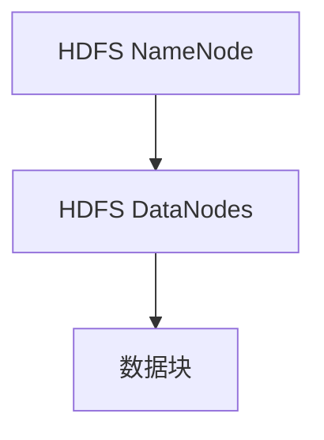

                 

# 《信息差：大数据如何提升市场研究》

> 关键词：大数据、市场研究、信息差、数据采集、数据处理、数据挖掘、可视化

> 摘要：随着大数据技术的迅速发展，市场研究的方法和效率得到了显著提升。本文将探讨大数据如何通过信息差的作用，推动市场研究的深入与发展。从大数据的定义、作用与挑战，到数据采集、处理与分析，再到大数据在具体行业中的应用案例，以及未来的发展趋势与挑战，本文将一步步分析大数据在市场研究中的关键作用，为相关领域的研究与应用提供参考。

### 《信息差：大数据如何提升市场研究》目录大纲

## 第一部分：引言

### 第1章：大数据时代下的市场研究

#### 1.1 什么是大数据

#### 1.2 大数据在市场研究中的作用

#### 1.3 大数据带来的挑战与机遇

### 第2章：市场研究中的信息差

#### 2.1 信息差的概念

#### 2.2 信息差在市场研究中的应用

#### 2.3 信息差的产生原因及应对策略

## 第二部分：大数据技术基础

### 第3章：大数据采集与处理技术

#### 3.1 数据采集技术

##### 3.1.1 离线数据采集

##### 3.1.2 实时数据采集

#### 3.2 数据处理技术

##### 3.2.1 数据清洗

##### 3.2.2 数据整合

### 第4章：大数据存储与管理技术

#### 4.1 数据存储技术

##### 4.1.1 传统数据库存储

##### 4.1.2 分布式存储系统

#### 4.2 数据管理技术

##### 4.2.1 数据质量管理

##### 4.2.2 数据安全与隐私保护

## 第三部分：大数据分析技术

### 第5章：市场研究中的数据挖掘方法

#### 5.1 数据挖掘的基本概念

#### 5.2 常见的数据挖掘算法

##### 5.2.1 机器学习算法

##### 5.2.2 数据挖掘流程

### 第6章：大数据可视化与报告

#### 6.1 数据可视化技术

##### 6.1.1 可视化工具选择

##### 6.1.2 数据可视化设计原则

#### 6.2 市场研究报告撰写

##### 6.2.1 报告结构

##### 6.2.2 有效沟通与呈现

## 第四部分：大数据在市场研究中的应用案例

### 第7章：案例分析一：零售行业大数据应用

#### 7.1 零售行业大数据采集

#### 7.2 零售行业大数据分析

#### 7.3 零售行业大数据报告

### 第8章：案例分析二：金融行业大数据应用

#### 8.1 金融行业大数据采集

#### 8.2 金融行业大数据分析

#### 8.3 金融行业大数据报告

### 第9章：大数据在市场研究中的发展趋势与挑战

#### 9.1 大数据在市场研究中的发展趋势

#### 9.2 大数据在市场研究中的挑战

#### 9.3 未来展望

## 附录

### 附录 A：大数据工具与资源推荐

#### A.1 大数据开源工具推荐

#### A.2 大数据学习资源推荐

#### A.3 大数据社区与论坛推荐

#### A.4 大数据相关书籍推荐

## 结论

### 作者：AI天才研究院/AI Genius Institute & 禅与计算机程序设计艺术 /Zen And The Art of Computer Programming

## 第1章：大数据时代下的市场研究

### 1.1 什么是大数据

大数据（Big Data）指的是在数量、种类、速度和真实性（Volume, Variety, Velocity, and Veracity）方面远远超出传统数据处理能力的数据集合。这些数据可能来自于各种来源，包括社交网络、传感器、机器日志等，其体量通常在 terabyte（千兆字节）级别甚至更高。

在市场研究领域，大数据的定义可以从以下几个方面来理解：

1. **数量（Volume）**：市场研究中的数据量大，涵盖了消费者的购买记录、社交媒体互动、用户行为数据等。
2. **种类（Variety）**：数据来源多样，包括结构化数据（如数据库）和非结构化数据（如图像、文本、视频等）。
3. **速度（Velocity）**：市场研究需要快速处理和分析数据，以迅速响应市场变化。
4. **真实性（Veracity）**：数据质量直接影响市场研究的准确性，因此数据真实性至关重要。

### 1.2 大数据在市场研究中的作用

大数据在市场研究中的作用主要体现在以下几个方面：

1. **深度洞察消费者行为**：通过分析消费者的购买历史、搜索行为和社交媒体互动，企业可以深入了解消费者的需求和行为模式，从而制定更精准的市场策略。
2. **优化产品和服务**：大数据分析可以帮助企业识别市场趋势和机会，优化产品设计和改进服务，提高客户满意度和忠诚度。
3. **竞争情报**：通过分析竞争对手的数据，企业可以了解竞争对手的市场策略、产品定位和用户评价，从而制定相应的应对策略。
4. **预测市场趋势**：大数据分析可以识别市场中的潜在趋势和变化，帮助企业预测未来的市场走向，提前做好准备。

### 1.3 大数据带来的挑战与机遇

尽管大数据为市场研究带来了巨大的机遇，但也伴随着一些挑战：

**挑战：**

1. **数据质量**：大数据质量参差不齐，包含大量的噪声和不完整的数据，这给数据分析带来了挑战。
2. **数据隐私和安全**：大数据往往涉及敏感信息，如个人隐私数据，如何保护这些数据的安全和隐私是一个重要问题。
3. **数据分析技能短缺**：大数据分析需要专业的技能和知识，但目前具备这些技能的人才相对短缺。

**机遇：**

1. **更准确的预测模型**：大数据使得市场研究可以建立更准确的预测模型，提高预测的准确性。
2. **实时决策支持**：大数据技术使得企业能够实时分析数据，做出更快速和准确的决策。
3. **降低成本**：大数据技术可以提高数据处理效率，降低市场研究的成本。

### 结论

大数据在市场研究中的应用已经变得不可或缺。通过大数据技术，企业可以更深入地了解市场和消费者，优化产品和服务，制定更精准的市场策略。然而，要充分发挥大数据的潜力，企业需要克服数据质量、隐私和安全等挑战，并培养具备数据分析技能的专业人才。

在接下来的章节中，我们将进一步探讨大数据在市场研究中的具体应用和技术细节。

## 第2章：市场研究中的信息差

### 2.1 信息差的概念

信息差（Information Gap）是指不同个体或组织之间在信息获取、处理和应用上的差异。在市场研究领域，信息差通常表现为以下几种情况：

1. **市场信息不对称**：部分企业或个体掌握了市场上独特的、有价值的信息，而其他竞争者则无法获取到这些信息。
2. **数据资源差异**：不同企业或研究机构拥有的数据资源数量和质量存在显著差异，这直接影响到他们的市场研究深度和广度。
3. **数据处理能力差异**：在数据分析能力上，一些企业拥有强大的技术团队和先进的分析工具，而另一些企业则可能依赖于传统的分析手段。

### 2.2 信息差在市场研究中的应用

信息差在市场研究中的应用主要表现在以下几个方面：

1. **竞争策略制定**：拥有更多信息的企业能够更准确地了解市场趋势和消费者需求，从而制定更有针对性的竞争策略。
2. **产品定位**：通过大数据分析，企业可以识别出市场中的细分领域和潜在用户群体，从而进行更精准的产品定位。
3. **营销决策**：信息差使得企业在营销活动中能够更有效地投放广告、推广产品，提高营销效率。

### 2.3 信息差的产生原因及应对策略

信息差的产生原因主要包括以下几个方面：

1. **数据资源分布不均**：不同企业或研究机构的数据资源获取能力不同，这导致数据资源分布不均。
2. **技术手段差异**：大数据技术的应用水平参差不齐，一些企业拥有更先进的技术手段和工具，而另一些企业则可能缺乏这些资源。
3. **数据隐私和安全**：数据隐私和安全问题使得一些企业不敢轻易共享数据，从而导致信息差。

应对信息差的策略包括：

1. **数据共享与合作**：企业可以通过建立数据共享平台或与相关机构合作，共享数据资源，缩小信息差。
2. **技术升级与培训**：企业应不断升级数据分析技术，加强数据分析团队的培训，提高数据处理能力。
3. **数据隐私保护**：在共享数据时，企业应采取措施确保数据隐私和安全，增强数据共享的信心。

### 结论

信息差在市场研究中具有重要的意义，它既是竞争的重要资源，也是企业制定策略和优化决策的关键依据。通过理解信息差的产生原因和应对策略，企业可以更有效地利用大数据资源，提高市场研究水平，从而在激烈的市场竞争中占据优势。

在下一章中，我们将探讨大数据技术基础，深入理解大数据的采集、处理和分析技术。

## 第3章：大数据采集与处理技术

### 3.1 数据采集技术

数据采集是大数据处理的第一步，其质量直接影响后续的数据分析和市场研究效果。数据采集技术可以分为以下两大类：

#### 3.1.1 离线数据采集

离线数据采集是指在非实时环境下收集数据的过程，通常用于收集历史数据或长期积累的数据。这种方法具有以下特点：

1. **批量处理**：离线数据采集通常以批量形式处理，能够处理大量数据。
2. **时间灵活性**：可以按照固定的周期进行数据采集，不受实时数据流的影响。
3. **成本相对较低**：离线数据采集不需要实时传输和处理数据，因此成本相对较低。

**离线数据采集的具体方法包括：**

1. **数据库备份**：通过备份现有的数据库来获取历史数据。
2. **网络爬虫**：使用爬虫程序从互联网上获取公开的、结构化的数据。
3. **日志文件分析**：通过分析服务器或设备的日志文件，获取相关的数据信息。

#### 3.1.2 实时数据采集

实时数据采集是指在数据产生的同时立即进行采集的过程，通常用于获取最新的市场动态和用户行为数据。这种方法具有以下特点：

1. **实时性**：能够实时获取数据，及时响应市场变化。
2. **高效性**：实时数据采集可以快速处理大量数据，提高数据处理效率。
3. **挑战性**：实时数据采集对系统响应速度和稳定性要求较高，技术难度较大。

**实时数据采集的具体方法包括：**

1. **消息队列**：使用消息队列系统（如Kafka、RabbitMQ）来实时传输和存储数据。
2. **流处理框架**：使用流处理框架（如Apache Storm、Apache Flink）来实时分析数据。
3. **API集成**：通过API接口实时获取外部系统或平台的数据。

### 3.2 数据处理技术

数据处理是大数据技术的核心环节，其目的是将原始数据转化为有价值的信息。数据处理技术主要包括数据清洗、数据整合和数据存储等步骤。

#### 3.2.1 数据清洗

数据清洗是数据处理的重要步骤，其目的是去除数据中的噪声和错误，提高数据质量。数据清洗主要包括以下操作：

1. **缺失值处理**：对缺失数据进行填补或删除。
2. **异常值处理**：检测并处理数据中的异常值。
3. **重复值处理**：去除数据中的重复记录。

**数据清洗的伪代码示例：**

```python
# 假设data是原始数据集
def clean_data(data):
    # 去除缺失值
    cleaned_data = data.dropna()
    
    # 检测并处理异常值
    for feature in cleaned_data.columns:
        q1 = cleaned_data[feature].quantile(0.25)
        q3 = cleaned_data[feature].quantile(0.75)
        iqr = q3 - q1
        lower_bound = q1 - 1.5 * iqr
        upper_bound = q3 + 1.5 * iqr
        cleaned_data = cleaned_data[(cleaned_data[feature] >= lower_bound) & (cleaned_data[feature] <= upper_bound)]
    
    # 去除重复值
    cleaned_data = cleaned_data.drop_duplicates()
    
    return cleaned_data
```

#### 3.2.2 数据整合

数据整合是将来自不同来源和格式的数据合并为统一的数据集，以便进行后续分析。数据整合主要包括以下操作：

1. **数据转换**：将不同数据源的数据格式转换为统一格式。
2. **数据合并**：将多个数据表合并为一个完整的数据集。
3. **数据融合**：将来自不同维度的数据进行合并，形成多维数据集。

**数据整合的伪代码示例：**

```python
# 假设data1和data2是两个数据集
def integrate_data(data1, data2):
    # 数据转换
    data1['new_column'] = data1['original_column'] * 10
    data2['new_column'] = data2['original_column'] * 10
    
    # 数据合并
    integrated_data = pd.merge(data1, data2, on='common_column')
    
    return integrated_data
```

### 结论

大数据的采集与处理技术是市场研究的重要基础。通过离线数据采集和实时数据采集，企业可以获取到丰富的数据资源。数据清洗和数据整合技术则能够确保数据的质量和一致性，为后续的数据分析和市场研究提供可靠的数据支持。

在下一章中，我们将探讨大数据存储与管理技术，进一步了解如何高效管理和利用大数据资源。

## 第4章：大数据存储与管理技术

### 4.1 数据存储技术

大数据存储技术是指用于存储和管理大规模数据的系统和技术。随着数据量的激增，传统的集中式数据库已无法满足大数据存储的需求，分布式存储系统成为了主流选择。

#### 4.1.1 传统数据库存储

传统数据库存储是指使用关系型数据库（如MySQL、PostgreSQL）来存储和管理数据。这种方法具有以下优点：

1. **数据结构化**：传统数据库支持结构化数据存储，便于查询和管理。
2. **事务处理**：传统数据库提供ACID（原子性、一致性、隔离性、持久性）保障，适合事务性操作。
3. **易于维护**：传统数据库具有完善的备份和恢复机制，便于维护和管理。

然而，传统数据库在处理大规模数据时存在以下局限性：

1. **扩展性差**：传统数据库在数据量达到一定程度后，扩展性较差，难以满足数据增长需求。
2. **性能瓶颈**：随着数据量的增加，传统数据库的性能会逐渐下降，出现瓶颈。
3. **高成本**：大型传统数据库系统通常成本较高，对硬件资源要求严格。

#### 4.1.2 分布式存储系统

分布式存储系统是将数据分散存储在多个节点上，通过分布式协议进行管理和访问的系统。这种方法具有以下优点：

1. **高扩展性**：分布式存储系统能够无缝扩展，适应数据量的快速增长。
2. **高性能**：分布式存储系统通过并行处理，提高了数据访问和处理速度。
3. **高可用性**：分布式存储系统具有自动故障转移和容错机制，提高了系统的可靠性。

常见的分布式存储系统包括Hadoop的HDFS（Hadoop Distributed File System）和Apache Cassandra。以下是一个HDFS的基本架构图：



在HDFS中，数据被分割成固定大小的数据块（默认为128MB或256MB），这些数据块被分散存储在不同的DataNode上。NameNode负责管理文件系统的命名空间和客户端对文件的访问，而DataNode负责数据块的存储和检索。

### 4.2 数据管理技术

数据管理技术是指用于确保数据质量、安全性和一致性的方法。在大数据环境中，数据管理变得更加复杂和重要。

#### 4.2.1 数据质量管理

数据质量管理是指通过各种方法确保数据准确、完整、一致和可靠。数据质量管理包括以下内容：

1. **数据清洗**：去除数据中的噪声和错误，提高数据质量。
2. **数据标准化**：将数据转换为统一的格式和标准，便于数据整合和分析。
3. **数据监控**：实时监控数据质量，及时发现并处理数据问题。

**数据质量管理的伪代码示例：**

```python
# 假设data是原始数据集
def data_quality_management(data):
    # 数据清洗
    cleaned_data = clean_data(data)
    
    # 数据标准化
    standardized_data = standardize_data(cleaned_data)
    
    return standardized_data
```

#### 4.2.2 数据安全与隐私保护

数据安全与隐私保护是指确保数据在存储、传输和处理过程中的安全性和隐私性。数据安全与隐私保护包括以下内容：

1. **数据加密**：使用加密算法对敏感数据进行加密，防止未授权访问。
2. **访问控制**：设置访问权限，确保只有授权用户可以访问特定数据。
3. **数据备份**：定期备份数据，防止数据丢失或损坏。
4. **隐私保护**：对个人隐私数据进行脱敏处理，确保个人隐私不被泄露。

**数据安全与隐私保护的伪代码示例：**

```python
# 假设data是包含个人隐私数据的数据集
def data_security_and_privacy_protection(data):
    # 数据加密
    encrypted_data = encrypt_data(data)
    
    # 设置访问控制
    access_controlled_data = set_access_control(encrypted_data)
    
    return access_controlled_data
```

### 结论

大数据存储与管理技术是大数据应用的重要基础。传统数据库存储适用于结构化数据的存储和管理，而分布式存储系统则能够应对大规模数据的高扩展性和高性能需求。数据质量管理与安全与隐私保护技术确保了数据的准确性和安全性，为大数据在市场研究中的广泛应用提供了保障。

在下一章中，我们将探讨市场研究中的数据挖掘方法，深入分析如何利用大数据技术发现市场中的潜在机会和趋势。

## 第5章：市场研究中的数据挖掘方法

### 5.1 数据挖掘的基本概念

数据挖掘（Data Mining）是指从大量数据中提取有价值的信息和知识的过程。在市场研究领域，数据挖掘的目标通常包括以下几种：

1. **关联规则挖掘**：发现数据项之间的关联关系，例如消费者购买行为中的商品关联。
2. **分类**：将数据分为不同的类别，例如客户分类、市场细分等。
3. **聚类**：将相似的数据项分组，形成不同的簇，用于市场细分和用户行为分析。
4. **预测**：基于历史数据预测未来的趋势或行为，例如销售预测、用户流失预测等。

### 5.2 常见的数据挖掘算法

在市场研究中，常见的数据挖掘算法包括关联规则挖掘、分类算法、聚类算法和预测算法等。以下将介绍这些算法的基本原理和应用。

#### 5.2.1 关联规则挖掘

关联规则挖掘是一种用于发现数据项之间关联性的方法。它基于频繁项集和置信度两个概念。

**频繁项集**：频繁项集是指在一组数据项中，出现次数超过最小支持度阈值的所有项集。

**置信度**：置信度表示在已知一个前件的情况下，后件出现的概率。

**Apriori算法**：Apriori算法是一种经典的关联规则挖掘算法，其基本思想是利用频繁项集的支持度进行递归搜索。

**Apriori算法的伪代码示例：**

```python
def apriori(data, min_support, min_confidence):
    # 计算频繁项集
    frequent_itemsets = find_frequent_itemsets(data, min_support)
    
    # 生成关联规则
    association_rules = generate_association_rules(frequent_itemsets, min_confidence)
    
    return association_rules
```

#### 5.2.2 分类算法

分类算法用于将数据项分配到不同的类别中。常见的分类算法包括K-近邻（K-Nearest Neighbors, KNN）、决策树（Decision Tree）和支持向量机（Support Vector Machine, SVM）等。

**K-近邻算法**：K-近邻算法基于“相似性”原则，通过计算新数据点与训练数据点的距离，根据最近的K个邻居的类别来预测新数据点的类别。

**K-近邻算法的伪代码示例：**

```python
def knn_predict(new_data, training_data, labels, k):
    # 计算新数据点与训练数据点的距离
    distances = compute_distances(new_data, training_data)
    
    # 选择最近的K个邻居
    neighbors = select_k_neighbors(distances, k)
    
    # 预测新数据点的类别
    predicted_label = majority_vote(neighbors, labels)
    
    return predicted_label
```

**决策树算法**：决策树是一种基于树形结构进行决策的算法，通过一系列的测试将数据划分成不同的区域。

**决策树算法的伪代码示例：**

```python
def build_decision_tree(data, labels):
    # 创建决策树
    tree = create_tree(data, labels)
    
    return tree

def classify_data(tree, new_data):
    # 使用决策树分类新数据点
    predicted_label = classify(new_data, tree)
    
    return predicted_label
```

#### 5.2.3 聚类算法

聚类算法用于将相似的数据项分组，形成不同的簇。常见的聚类算法包括K-均值（K-Means）算法和层次聚类（Hierarchical Clustering）等。

**K-均值算法**：K-均值算法是一种基于距离度量的聚类算法，其目标是使簇内的数据点尽可能接近，簇间的数据点尽可能远。

**K-均值算法的伪代码示例：**

```python
def kmeans(data, k):
    # 初始化中心点
    centroids = initialize_centroids(data, k)
    
    # 聚类过程
    while not_converged(centroids, prev_centroids):
        # 分配数据点到最近的中心点
        clusters = assign_points_to_clusters(data, centroids)
        
        # 更新中心点
        centroids = update_centroids(clusters, k)
    
    return clusters, centroids
```

**层次聚类算法**：层次聚类算法通过逐步合并或分裂已有的簇，形成不同层次的聚类结构。

**层次聚类算法的伪代码示例：**

```python
def hierarchical_clustering(data):
    # 初始化聚类结构
    clustering_structure = initialize_clustering_structure(data)
    
    # 聚类过程
    while not_terminated(clustering_structure):
        # 合并或分裂簇
        clustering_structure = merge_or_split_clusters(clustering_structure)
    
    return clustering_structure
```

#### 5.2.4 预测算法

预测算法用于基于历史数据预测未来的趋势或行为。常见的预测算法包括时间序列分析、回归分析和神经网络等。

**时间序列分析**：时间序列分析用于分析时间序列数据，识别趋势、季节性和周期性等特征。

**时间序列分析的伪代码示例：**

```python
def time_series_analysis(data):
    # 识别趋势
    trend = identify_trend(data)
    
    # 识别季节性
    seasonality = identify_seasonality(data)
    
    # 识别周期性
    cyclic = identify_cyclic(data)
    
    return trend, seasonality, cyclic
```

**回归分析**：回归分析用于建立因变量与自变量之间的关系模型，通过模型预测未来的值。

**回归分析的伪代码示例：**

```python
def regression_analysis(data, target):
    # 训练回归模型
    model = train_regression_model(data, target)
    
    # 预测未来值
    predicted_values = predict_future_values(model, data)
    
    return predicted_values
```

**神经网络**：神经网络是一种基于生物神经网络原理构建的算法，用于复杂的预测和分类任务。

**神经网络的伪代码示例：**

```python
def neural_network(data, target):
    # 创建神经网络
    network = create_neural_network(data, target)
    
    # 训练神经网络
    trained_network = train_network(network, data, target)
    
    # 预测未来值
    predicted_values = predict_values(trained_network, data)
    
    return predicted_values
```

### 结论

市场研究中的数据挖掘方法通过发现数据项之间的关联、分类、聚类和预测等过程，帮助企业深入理解市场和消费者行为，从而制定更精准的市场策略。常见的算法包括关联规则挖掘、分类算法、聚类算法和预测算法等，每种算法都有其独特的原理和应用场景。

在下一章中，我们将探讨大数据可视化与报告技术，介绍如何通过可视化手段更直观地呈现数据分析和市场研究的成果。

## 第6章：大数据可视化与报告

### 6.1 数据可视化技术

数据可视化是将数据以图形或图表的形式呈现，帮助人们直观地理解数据信息和趋势。在大数据环境下，数据可视化技术发挥着至关重要的作用。

#### 6.1.1 可视化工具选择

选择合适的可视化工具是数据可视化成功的关键。以下是一些常见的数据可视化工具：

1. **Tableau**：Tableau是一款功能强大的可视化工具，支持多种数据源，提供丰富的图表类型和交互功能。
2. **Power BI**：Power BI是微软推出的数据可视化工具，与Excel紧密集成，易于使用和部署。
3. **D3.js**：D3.js是一款基于JavaScript的可视化库，可以创建复杂和交互式的可视化图表。
4. **ECharts**：ECharts是一款开源的JavaScript图表库，提供多种图表类型和丰富的配置选项。

**选择可视化工具的考虑因素：**

- **数据量**：对于大规模数据，需要选择能够高效处理和渲染数据的工具。
- **交互性**：根据需求选择是否需要交互式可视化，例如筛选、过滤和缩放功能。
- **易用性**：选择易于学习和使用的工具，降低使用门槛。

#### 6.1.2 数据可视化设计原则

设计良好的数据可视化应遵循以下原则：

1. **清晰性**：图表应清晰传达数据的主要信息和趋势，避免冗余和复杂。
2. **准确性**：图表应准确反映数据，避免误导读者。
3. **对比性**：通过对比不同数据集，突出数据差异和趋势。
4. **可用性**：图表应易于阅读和理解，提供必要的交互功能，提高用户的使用体验。

**设计数据可视化的步骤：**

1. **确定可视化目标**：明确数据可视化需要传达的信息和目标。
2. **选择合适的图表类型**：根据数据的类型和目标选择合适的图表类型，如柱状图、折线图、饼图等。
3. **设计图表布局**：合理安排图表的布局和元素，确保数据可视化清晰易读。
4. **添加注释和标签**：为图表添加必要的注释和标签，帮助读者更好地理解数据。
5. **测试和优化**：对数据可视化进行测试，收集用户反馈，不断优化和完善。

### 6.2 市场研究报告撰写

市场研究报告是对市场研究结果的总结和呈现，帮助企业和决策者理解和应用研究结果。撰写有效的市场研究报告需要注意以下几个方面：

#### 6.2.1 报告结构

一个完整的市场研究报告通常包括以下部分：

1. **封面**：包括报告标题、日期、作者和联系方式等信息。
2. **摘要**：简要概括报告的主要内容和结论。
3. **目录**：列出报告的主要章节和子章节，便于读者快速定位。
4. **引言**：介绍市场研究的背景、目的和范围。
5. **数据分析**：详细描述数据采集、处理和分析的过程，展示分析结果。
6. **讨论与结论**：分析研究结果，提出建议和结论。
7. **附录**：包括相关数据、图表和参考文献等。

#### 6.2.2 有效沟通与呈现

撰写市场研究报告时，应注重有效沟通与呈现，确保读者能够清晰理解研究报告的内容和结论。以下是一些技巧：

1. **简洁明了**：使用简洁明了的语言，避免冗长和复杂的句子。
2. **图表与文字结合**：合理使用图表和图片，与文字内容相互补充，提高信息的传达效果。
3. **结构清晰**：报告结构应逻辑清晰，层次分明，便于读者阅读和理解。
4. **强调重点**：在讨论和结论部分，强调研究结果和关键发现，突出重要信息。
5. **互动与反馈**：鼓励读者提出问题和反馈，通过互动提高报告的应用价值。

### 结论

大数据可视化与报告技术是市场研究的重要环节，通过数据可视化，企业可以直观地呈现数据分析结果，帮助决策者更好地理解市场趋势和消费者行为。撰写有效的市场研究报告则需要清晰的结构、简洁的语言和有效的沟通技巧，确保研究报告能够为实际应用提供有力支持。

在下一章中，我们将通过具体案例展示大数据在市场研究中的应用，深入分析大数据技术如何帮助企业提升市场研究效率和质量。

## 第7章：案例分析一：零售行业大数据应用

### 7.1 零售行业大数据采集

零售行业是大数据技术应用的典型代表之一。在零售行业中，大数据的采集主要包括以下几个方面：

#### 数据来源：

1. **销售数据**：零售企业的销售数据包括销售额、销售量、产品类别、销售渠道等信息。
2. **客户数据**：客户数据包括客户基本信息、购买历史、偏好和评价等。
3. **库存数据**：库存数据包括商品库存量、库存周转率、商品分类等信息。
4. **市场数据**：市场数据包括竞争对手的销售情况、市场趋势、消费者行为等。

#### 数据采集方式：

1. **POS系统**：通过零售企业的POS系统实时采集销售数据。
2. **CRM系统**：通过客户关系管理系统（CRM）收集客户数据。
3. **传感器和数据采集器**：在仓库和店面安装传感器和数据采集器，实时监测库存数据。
4. **市场调研**：通过在线调查、问卷调查等方式收集市场数据。

**案例：某大型零售企业大数据采集过程**

某大型零售企业通过POS系统和CRM系统实时采集销售数据，并通过传感器和数据采集器监测库存情况。此外，企业还定期进行市场调研，收集消费者偏好和竞争对手信息。

1. **销售数据采集**：POS系统每笔交易都会生成详细的销售记录，包括商品名称、价格、销售时间等信息。
2. **客户数据采集**：CRM系统记录客户的基本信息和购买历史，并通过会员卡和积分系统收集更多客户数据。
3. **库存数据采集**：传感器和数据采集器实时监测仓库库存，更新库存信息。
4. **市场数据采集**：通过定期市场调研，收集消费者偏好和竞争对手数据。

### 7.2 零售行业大数据分析

在收集到大量数据后，零售企业需要对数据进行处理和分析，以发现市场趋势和消费者行为。

#### 数据处理：

1. **数据清洗**：去除销售数据中的缺失值、异常值和重复记录。
2. **数据整合**：将不同来源的数据整合为统一的数据集，便于分析。
3. **数据转换**：将不同格式的数据转换为统一格式，便于处理和分析。

**案例：某大型零售企业大数据处理过程**

某大型零售企业采用以下步骤对数据进行处理：

1. **数据清洗**：去除销售数据中的无效记录，如价格为零的交易记录。
2. **数据整合**：将销售数据、客户数据和库存数据整合为一个统一的数据集。
3. **数据转换**：将不同格式的数据转换为CSV格式，便于后续分析。

#### 数据分析：

1. **销售趋势分析**：分析销售额、销售量和商品类别等指标，识别销售趋势。
2. **消费者行为分析**：分析客户的购买历史和偏好，识别消费者的购买模式和需求。
3. **库存管理分析**：分析库存量和库存周转率，优化库存管理。
4. **市场分析**：分析市场数据和竞争对手数据，了解市场趋势和竞争环境。

**案例：某大型零售企业大数据分析过程**

某大型零售企业采用以下分析方法：

1. **销售趋势分析**：通过时间序列分析，识别销售额和销售量的变化趋势。
2. **消费者行为分析**：通过关联规则挖掘，发现不同商品之间的关联关系，识别消费者的购买偏好。
3. **库存管理分析**：通过聚类分析，将库存量相似的商品分为一组，优化库存管理。
4. **市场分析**：通过市场调研数据，识别市场趋势和竞争对手策略，为企业决策提供支持。

### 7.3 零售行业大数据报告

在完成数据分析后，零售企业需要撰写大数据报告，总结分析结果，为企业决策提供依据。

#### 报告结构：

1. **封面**：报告标题、日期、作者和联系方式等基本信息。
2. **摘要**：简要概括报告的主要内容和结论。
3. **引言**：介绍零售企业大数据分析的目的和背景。
4. **数据分析**：详细描述数据处理和分析过程，展示分析结果。
5. **讨论与结论**：分析研究结果，提出建议和结论。
6. **附录**：包括相关数据、图表和参考文献等。

**案例：某大型零售企业大数据报告**

某大型零售企业的大数据报告包括以下内容：

1. **封面**：报告标题为“2023年零售行业大数据分析报告”，日期为2023年1月，作者为数据分析团队。
2. **摘要**：简要概括报告的主要内容，包括销售趋势、消费者行为、库存管理和市场分析等方面的分析结果。
3. **引言**：介绍报告的背景和目的，说明大数据分析对零售企业的重要性。
4. **数据分析**：详细描述数据处理和分析过程，展示分析结果，包括销售趋势图、消费者行为图、库存管理表等。
5. **讨论与结论**：分析研究结果，提出针对销售、库存管理和市场策略等方面的建议。
6. **附录**：包括数据源、数据处理工具和参考文献等。

### 结论

零售行业大数据应用通过数据采集、处理和分析，帮助企业深入了解市场和消费者行为，优化销售和库存管理，制定更精准的市场策略。通过具体案例展示，我们看到了大数据技术在零售行业中的广泛应用和显著成效。

在下一章中，我们将探讨大数据在金融行业的应用，分析大数据技术如何提升金融市场的效率和安全性。

## 第8章：案例分析二：金融行业大数据应用

### 8.1 金融行业大数据采集

金融行业是一个高度依赖数据和信息分析的领域，大数据技术的应用极大地提升了金融市场的效率和准确性。金融行业大数据采集主要涉及以下几个方面：

#### 数据来源：

1. **交易数据**：包括股票、债券、外汇等金融交易的数据，如交易时间、价格、成交量等。
2. **用户数据**：包括客户的个人信息、交易行为、信用记录等。
3. **市场数据**：包括宏观经济指标、行业动态、市场新闻等。
4. **外部数据**：包括社交媒体信息、新闻报道、政策法规等。

#### 数据采集方式：

1. **交易所系统**：通过交易所的交易系统实时采集交易数据。
2. **客户关系管理系统（CRM）**：通过CRM系统收集用户数据和交易行为数据。
3. **第三方数据提供商**：通过第三方数据提供商获取市场数据、宏观经济指标等。
4. **网络爬虫**：通过网络爬虫技术收集社交媒体信息、新闻报道等外部数据。

**案例：某大型银行的大数据采集过程**

某大型银行通过以下方式进行大数据采集：

1. **交易数据采集**：银行交易系统每笔交易都会生成详细的数据记录，包括交易时间、交易金额、交易双方等。
2. **用户数据采集**：通过CRM系统收集客户的个人信息、交易行为、信用记录等。
3. **市场数据采集**：通过第三方数据提供商获取宏观经济指标、市场动态等。
4. **外部数据采集**：使用网络爬虫技术收集社交媒体信息、新闻报道等。

### 8.2 金融行业大数据分析

金融行业大数据分析的目标是通过数据挖掘和分析，发现市场趋势、预测金融风险、优化投资策略等。以下是一些常见的大数据分析方法：

#### 数据处理：

1. **数据清洗**：去除交易数据中的噪声和错误，如异常交易记录、缺失数据等。
2. **数据整合**：将来自不同来源的数据整合为统一的数据集，便于分析。
3. **数据转换**：将不同格式的数据转换为统一格式，便于处理和分析。

**案例：某大型银行的数据处理过程**

某大型银行采用以下步骤对数据进行处理：

1. **数据清洗**：去除交易数据中的无效记录，如交易金额为零的交易记录。
2. **数据整合**：将交易数据、用户数据和外部数据整合为统一的数据集。
3. **数据转换**：将不同格式的数据转换为CSV格式，便于后续分析。

#### 数据分析：

1. **市场趋势分析**：通过时间序列分析，识别市场趋势和周期性变化。
2. **风险分析**：通过统计分析、机器学习等方法，识别潜在风险和异常交易。
3. **客户行为分析**：通过关联规则挖掘、分类算法等方法，分析客户的交易行为和风险偏好。
4. **投资策略优化**：通过数据挖掘和优化算法，制定更有效的投资策略。

**案例：某大型银行的大数据分析过程**

某大型银行采用以下分析方法：

1. **市场趋势分析**：通过时间序列分析，识别股票市场、债券市场等金融市场的变化趋势。
2. **风险分析**：通过机器学习算法，识别潜在的金融风险，如市场操纵、洗钱等。
3. **客户行为分析**：通过关联规则挖掘，分析客户的交易行为，识别高风险客户。
4. **投资策略优化**：通过优化算法，制定基于数据的投资组合策略，提高投资收益。

### 8.3 金融行业大数据报告

在完成大数据分析后，金融企业需要撰写大数据报告，为决策者提供分析结果和决策依据。以下是一个金融行业大数据报告的结构和内容：

#### 报告结构：

1. **封面**：报告标题、日期、作者和联系方式等基本信息。
2. **摘要**：简要概括报告的主要内容和结论。
3. **引言**：介绍金融行业大数据分析的目的和背景。
4. **数据分析**：详细描述数据处理和分析过程，展示分析结果。
5. **风险分析**：分析市场风险和潜在风险，提出风险控制措施。
6. **客户分析**：分析客户交易行为和风险偏好，提出客户管理策略。
7. **投资策略**：基于数据分析，提出优化投资策略的建议。
8. **附录**：包括相关数据、图表和参考文献等。

**案例：某大型银行的大数据报告**

某大型银行的大数据报告包括以下内容：

1. **封面**：报告标题为“2023年金融市场大数据分析报告”，日期为2023年1月，作者为数据分析团队。
2. **摘要**：简要概括报告的主要内容，包括市场趋势、风险分析、客户分析和投资策略等方面的分析结果。
3. **引言**：介绍报告的背景和目的，说明大数据分析在金融市场中的重要性。
4. **数据分析**：详细描述数据处理和分析过程，展示分析结果，包括市场趋势图、风险分析表、客户行为分析图等。
5. **风险分析**：分析市场风险和潜在风险，提出相应的风险控制措施。
6. **客户分析**：分析客户交易行为和风险偏好，提出客户管理策略。
7. **投资策略**：基于数据分析，提出优化投资策略的建议。
8. **附录**：包括数据源、数据处理工具和参考文献等。

### 结论

金融行业大数据应用通过数据采集、处理和分析，帮助企业深入了解金融市场、识别风险和优化投资策略。通过具体案例展示，我们看到了大数据技术在金融市场中的广泛应用和显著成效。

在下一章中，我们将探讨大数据在市场研究中的发展趋势与挑战，为大数据在市场研究领域的未来发展提供洞见。

## 第9章：大数据在市场研究中的发展趋势与挑战

### 9.1 大数据在市场研究中的发展趋势

大数据在市场研究中的应用正在不断发展和深化，呈现出以下趋势：

1. **实时性增强**：随着实时数据采集和处理技术的进步，市场研究能够更快速地响应市场变化，实现实时决策。
2. **智能化与自动化**：通过机器学习和人工智能技术，市场研究自动化水平不断提高，减少人力成本，提高分析精度。
3. **跨行业应用**：大数据技术不仅应用于零售、金融等传统行业，还逐渐渗透到医疗、教育、制造等新兴领域。
4. **数据融合与分析**：随着数据种类的增多和数据量的增长，市场研究开始融合多种数据来源，进行综合分析，以获得更全面的市场洞察。
5. **隐私保护和数据安全**：随着数据隐私和安全问题的日益突出，市场研究将更加重视数据保护和用户隐私。

### 9.2 大数据在市场研究中的挑战

尽管大数据在市场研究中的应用前景广阔，但仍面临以下挑战：

1. **数据质量**：大数据中存在大量的噪声和不完整的数据，如何提高数据质量是当前亟待解决的问题。
2. **数据处理能力**：大规模数据处理的计算能力和存储资源需求巨大，对于许多企业和研究机构来说，这是一项巨大的挑战。
3. **人才短缺**：具备大数据分析和处理技能的专业人才相对短缺，如何培养和吸引这些人才是企业面临的难题。
4. **数据隐私与安全**：大数据往往涉及敏感信息，如何在保护用户隐私的同时，有效利用数据，是企业需要面对的挑战。
5. **算法透明性和解释性**：随着机器学习和人工智能技术的应用，数据分析结果可能变得难以解释，如何提高算法的透明性和解释性，是当前研究的一个热点问题。

### 9.3 未来展望

展望未来，大数据在市场研究中的应用将呈现以下趋势：

1. **跨领域融合**：大数据技术将与其他技术（如物联网、区块链等）深度融合，推动市场研究方法的创新。
2. **个性化分析**：基于用户数据的个性化分析将变得更加精准，帮助企业实现更高效的营销和客户服务。
3. **智能化决策支持**：随着人工智能技术的进步，市场研究将实现更智能的决策支持，帮助企业快速应对市场变化。
4. **数据治理与合规**：企业将更加重视数据治理，确保数据合规性和安全性，为大数据在市场研究中的广泛应用提供保障。

### 结论

大数据在市场研究中的应用正不断发展和完善，既带来了巨大的机遇，也带来了诸多挑战。通过不断的技术创新和人才培养，大数据有望在未来进一步推动市场研究的深入发展，为企业和决策者提供更强大、更智能的数据支持。

在附录部分，我们将推荐一些大数据工具、资源和书籍，以供读者学习和参考。

### 附录 A：大数据工具与资源推荐

随着大数据技术的快速发展，市场上涌现了众多优秀的大数据工具和资源。以下是一些值得推荐的开源工具、学习资源、社区和书籍，旨在帮助读者深入了解大数据技术，提升数据分析能力。

#### A.1 大数据开源工具推荐

1. **Hadoop**：Apache Hadoop是一个开源的大数据框架，用于分布式存储和处理大数据。它包括HDFS（分布式文件系统）、MapReduce（分布式数据处理）、HBase（分布式数据库）等组件。

2. **Spark**：Apache Spark是一个快速和通用的大数据计算引擎，支持内存计算和分布式数据处理。它提供了丰富的API，包括Spark SQL、Spark Streaming等，适合进行大规模数据处理和分析。

3. **Flink**：Apache Flink是一个流处理框架，支持实时数据处理和批处理。它提供了丰富的API，可以进行复杂的实时计算和分析。

4. **Kafka**：Apache Kafka是一个分布式流处理平台，用于构建实时数据流系统。它提供了高吞吐量、可扩展和高可靠性的消息队列服务，适用于数据采集和实时数据处理。

5. **Elasticsearch**：Elasticsearch是一个分布式、RESTful搜索引擎，用于构建大数据搜索引擎和分析平台。它支持全文搜索、数据分析、实时索引等特性。

#### A.2 大数据学习资源推荐

1. **Coursera**：Coursera提供了众多免费的大数据课程，包括“大数据分析”、“大数据技术基础”等，适合初学者和专业人士。

2. **edX**：edX同样提供了丰富的免费大数据课程，如“大数据分析与数据科学”、“机器学习与数据挖掘”等。

3. **Udacity**：Udacity的“大数据工程师纳米学位”课程涵盖了大数据基础、数据处理、数据分析等内容，适合有志于大数据领域发展的读者。

4. **数据科学博客**：例如“数据科学博客”、“机器学习博客”等，提供大量的技术文章、教程和案例分析，有助于读者了解大数据技术的最新动态和应用。

#### A.3 大数据社区与论坛推荐

1. **Stack Overflow**：Stack Overflow是一个全球最大的开发社区，大数据相关的提问和解答非常丰富，适合解决技术难题。

2. **GitHub**：GitHub上有大量的大数据开源项目，包括代码、文档和讨论，可以帮助读者深入了解大数据技术的实现和应用。

3. **LinkedIn Learning**：LinkedIn Learning提供了大量的在线视频教程，涵盖大数据处理、数据分析、机器学习等多个方面。

4. **DataCamp**：DataCamp是一个在线学习平台，提供交互式大数据课程，帮助读者实践和掌握大数据技术。

#### A.4 大数据相关书籍推荐

1. **《大数据时代》**：作者：肯尼斯·库克耶（Ken屈服·库克耶），介绍了大数据的概念、应用和发展趋势。

2. **《大数据技术导论》**：作者：刘军平、陈俊，详细讲解了大数据技术的基础知识、架构和实现。

3. **《大数据之路：阿里巴巴大数据实践》**：作者：李津、李俊、高伟，分享了阿里巴巴在大数据技术、架构和业务应用方面的实践经验。

4. **《机器学习》**：作者：周志华，介绍了机器学习的基本概念、算法和应用，是大数据分析的重要基础。

通过以上推荐，读者可以更全面地了解大数据技术的各个方面，提升自己在大数据领域的知识和技能。希望这些工具和资源能够为读者提供实用的帮助，推动大数据技术的学习和应用。

### 结论

大数据技术在市场研究中的应用正日益广泛，本文通过详细的分析和案例展示，揭示了大数据如何提升市场研究的深度和广度。随着大数据技术的不断发展和完善，市场研究将迎来更加智能化、个性化的新时代。希望本文能够为读者提供有益的启示，激发对大数据技术在市场研究中的深入探索和应用。在未来的学习和实践中，不断探索和创新，充分发挥大数据技术的潜力，为企业决策和市场发展提供有力支持。

### 作者

**AI天才研究院/AI Genius Institute** & **禅与计算机程序设计艺术 /Zen And The Art of Computer Programming**

