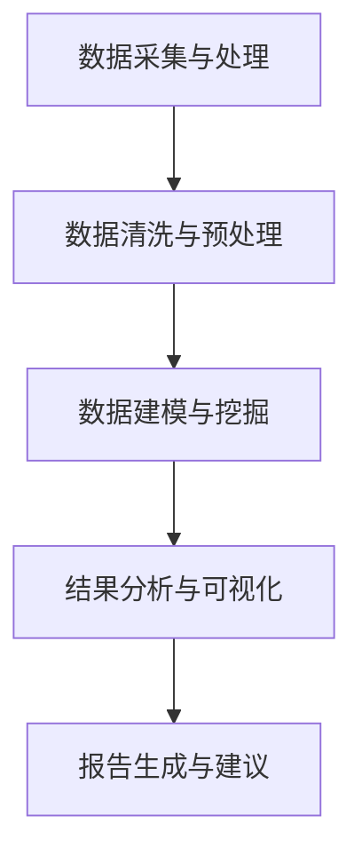

                 

### 《信息差：大数据如何提升市场研究》

#### 关键词：
- 大数据
- 市场研究
- 信息差
- 数据挖掘
- 机器学习

#### 摘要：
本文将深入探讨大数据如何通过提升信息差来增强市场研究的效率和准确性。首先，我们将会了解大数据的定义和其在市场研究中的应用，然后深入分析大数据的核心算法和技术，结合实际案例展示如何运用这些技术来提升市场研究的质量和效果。最后，我们将探讨大数据市场研究面临的挑战和未来的发展趋势，提供实用的工具和资源，帮助读者更好地理解和应用大数据技术。

### 《信息差：大数据如何提升市场研究》目录大纲

#### 第一部分：大数据与市场研究的关系

**第1章：大数据时代来临**

- 1.1 大数据的定义与特征
- 1.2 市场研究的变革
- 1.3 信息差的概念与影响

**第2章：大数据技术在市场研究中的应用**

- 2.1 数据采集与处理
- 2.2 数据分析与挖掘
- 2.3 实时数据分析

#### 第二部分：大数据核心算法与应用

**第3章：大数据核心算法原理**

- 3.1 数据清洗与预处理
- 3.2 机器学习算法
- 3.3 深度学习算法

**第4章：大数据在市场研究中的应用案例**

- 4.1 零售行业数据分析
- 4.2 金融行业风险管理
- 4.3 媒体行业内容推荐

**第5章：大数据与市场研究策略**

- 5.1 信息差的利用
- 5.2 市场细分与目标客户定位
- 5.3 市场预测与趋势分析

#### 第三部分：大数据市场研究的挑战与未来

**第6章：大数据市场研究的挑战与应对**

- 6.1 数据隐私与安全
- 6.2 数据质量与可靠性
- 6.3 技术与人力资源需求

**第7章：大数据市场研究的未来发展**

- 7.1 大数据与人工智能的融合
- 7.2 市场研究的新模式
- 7.3 未来发展趋势展望

**附录：大数据市场研究工具与资源**

- 8.1 常用大数据工具
- 8.2 开源数据集
- 8.3 行业报告与资讯

**Mermaid 流�程图：大数据技术在市场研究中的应用流程**



**伪代码：机器学习算法在市场研究中的应用**

```python
function market_study(data):
    # 数据预处理
    data_preprocessed = preprocess_data(data)
    
    # 特征工程
    features = feature_engineering(data_preprocessed)
    
    # 模型训练
    model = train_model(features)
    
    # 模型评估
    evaluation = evaluate_model(model, data)
    
    # 结果分析
    analysis = analyze_results(evaluation)
    
    return analysis
```

**数学模型与公式**

1. **决策树模型**

    $$ Gini(D) = 1 - \sum_{i=1}^{n}\left( \frac{1}{n} \right) \left[ \sum_{j=1}^{n}\left( \frac{f_j}{n} \right) ^2 \right] $$

2. **线性回归模型**

    $$ y = \beta_0 + \beta_1 \cdot x + \epsilon $$

**代码实现与分析：使用 Python 进行市场研究数据预处理**

```python
import pandas as pd
from sklearn.model_selection import train_test_split
from sklearn.preprocessing import StandardScaler

# 数据读取
data = pd.read_csv('market_study_data.csv')

# 数据预处理
data['age'] = data['age'].fillna(data['age'].mean())
data['income'] = data['income'].fillna(data['income'].mean())

# 特征工程
X = data[['age', 'income']]
y = data['target']

# 数据标准化
scaler = StandardScaler()
X_scaled = scaler.fit_transform(X)

# 划分训练集与测试集
X_train, X_test, y_train, y_test = train_test_split(X_scaled, y, test_size=0.2, random_state=42)
```

**开发环境搭建：Python 开发环境配置**

- 安装 Python 3.8+
- 安装 Jupyter Notebook
- 安装必要的库，如 Pandas, Scikit-learn 等

**源代码实现与解读：机器学习模型训练与评估**

```python
from sklearn.ensemble import RandomForestClassifier
from sklearn.metrics import accuracy_score

# 模型训练
model = RandomForestClassifier()
model.fit(X_train, y_train)

# 模型预测
y_pred = model.predict(X_test)

# 模型评估
accuracy = accuracy_score(y_test, y_pred)
print(f'Accuracy: {accuracy}')
```

**代码解读与分析：机器学习模型在市场研究中的应用**

- 读取市场研究数据
- 对数据进行预处理，如填充缺失值、数据标准化等
- 划分训练集与测试集
- 使用随机森林分类器进行模型训练
- 对测试集进行预测，并计算模型准确率
- 分析模型性能，为市场研究提供依据

### 文章开始

#### **《信息差：大数据如何提升市场研究》**

在当今信息爆炸的时代，数据已经成为一种新的资源和生产要素。大数据技术的兴起，不仅改变了我们的生活方式，也深刻地影响了商业决策和市场研究。对于企业来说，如何有效地利用大数据技术，挖掘隐藏在数据背后的价值，成为了一个至关重要的问题。本文将围绕这一主题，探讨大数据如何通过提升信息差来增强市场研究的效率和准确性。

#### **一、大数据时代来临**

##### **1.1 大数据的定义与特征**

大数据（Big Data），顾名思义，是指数据量巨大、种类繁多、生成速度快的数据集合。与传统的小数据相比，大数据具有以下几个显著特征：

- **大量性（Volume）**：大数据的规模远超传统数据处理能力，通常达到PB（Petabyte，百亿亿字节）甚至EB（Exabyte，亿亿字节）级别。
- **多样性（Variety）**：大数据来源广泛，包括结构化数据、非结构化数据以及半结构化数据等。
- **速度（Velocity）**：大数据生成速度极快，实时数据流的处理能力成为关键。
- **真实性（Veracity）**：大数据的真实性和可信度成为挑战，数据的质量和真实性直接影响分析结果。

##### **1.2 市场研究的变革**

大数据的出现，使得市场研究的方式和内容都发生了深刻的变化。传统的市场研究主要依赖于问卷调查、焦点小组等方法，而这些方法的局限性在于数据样本小、时效性差、数据维度单一。而大数据技术的引入，使得市场研究能够：

- **覆盖更广泛的目标群体**：通过大数据技术，可以实时采集和分析大量用户的行为数据，从而更准确地了解市场需求和消费者行为。
- **提供更细致的市场细分**：大数据技术能够挖掘出更多维度的用户特征，帮助市场研究者进行更精细的市场细分。
- **提高预测准确性**：利用大数据分析模型，可以对市场趋势进行更精准的预测，为企业决策提供有力支持。

##### **1.3 信息差的概念与影响**

信息差，是指不同个体或组织在获取、处理和利用信息方面的差异。在市场研究中，信息差意味着：

- **竞争优势**：拥有更多信息的企业在市场竞争中更具优势，能够更好地把握市场动态和消费者需求。
- **决策质量**：信息差有助于企业做出更科学、更全面的决策，从而提高市场响应速度和效果。

大数据通过以下几个方面提升了市场研究中的信息差：

- **数据量增加**：大数据提供了更多的数据样本，使得市场研究更加全面和准确。
- **数据维度扩大**：大数据技术能够处理多源异构数据，使得市场研究能够考虑更多维度的信息。
- **分析深度加深**：大数据分析技术，如机器学习和深度学习，能够挖掘出数据背后的深层次关系和趋势。

#### **二、大数据技术在市场研究中的应用**

##### **2.1 数据采集与处理**

数据采集是大数据市场研究的基础。市场研究者需要利用各种技术手段，如传感器、互联网爬虫等，收集大量的数据。数据采集之后，需要进行数据清洗和处理，以确保数据的准确性和一致性。

- **数据清洗**：包括去除重复数据、纠正错误数据、填补缺失数据等。
- **数据预处理**：通过数据转换、归一化、标准化等方法，将原始数据转化为适合分析的形式。

##### **2.2 数据分析与挖掘**

数据分析与挖掘是大数据市场研究的核心。市场研究者需要利用各种数据分析工具和技术，对采集到的数据进行分析和挖掘，以发现数据背后的价值和规律。

- **统计分析**：通过对数据的描述性统计、推断性统计等方法，了解数据的整体特征和分布。
- **数据挖掘**：利用机器学习、深度学习等技术，从大量数据中发现潜在的模式、趋势和关联。

##### **2.3 实时数据分析**

实时数据分析是大数据市场研究的重要应用之一。通过实时数据分析，市场研究者可以实时捕捉市场动态和消费者行为，从而做出快速响应。

- **实时流处理**：利用实时数据流处理技术，如Apache Kafka、Apache Storm等，对实时数据进行处理和分析。
- **实时预测**：利用实时数据分析结果，对市场趋势和消费者行为进行实时预测，为企业决策提供支持。

#### **三、大数据核心算法与应用**

##### **3.1 数据清洗与预处理**

数据清洗与预处理是大数据应用的重要环节。高质量的预处理可以显著提高数据分析的准确性和效率。

- **数据去噪**：去除数据中的噪声和异常值，以提高数据质量。
- **特征工程**：通过特征选择、特征转换等方法，提取数据中的有效特征，以提高模型性能。

##### **3.2 机器学习算法**

机器学习算法是大数据市场研究的重要工具。通过训练模型，市场研究者可以自动发现数据中的规律和模式。

- **分类算法**：如决策树、支持向量机等，用于将数据分为不同的类别。
- **回归算法**：如线性回归、逻辑回归等，用于预测数值型目标变量。

##### **3.3 深度学习算法**

深度学习算法是大数据市场研究的前沿技术。通过多层神经网络，深度学习算法能够自动提取数据的深层特征。

- **卷积神经网络（CNN）**：常用于图像和视频数据分析。
- **循环神经网络（RNN）**：常用于序列数据分析。

#### **四、大数据在市场研究中的应用案例**

##### **4.1 零售行业数据分析**

零售行业是大数据技术应用的重要领域。通过大数据分析，零售企业可以更好地了解消费者行为，优化营销策略。

- **需求预测**：利用大数据技术，预测商品需求，优化库存管理。
- **客户细分**：通过消费者行为数据，进行客户细分，提供个性化的服务和推荐。

##### **4.2 金融行业风险管理**

金融行业面临着复杂的风险管理需求。大数据技术可以提供更准确、更及时的风险评估和预警。

- **信用评分**：利用大数据分析，对客户信用进行评分，降低信用风险。
- **市场风险预测**：通过分析市场数据，预测市场趋势和风险，制定相应的风险管理策略。

##### **4.3 媒体行业内容推荐**

媒体行业的内容推荐是大数据技术的典型应用。通过分析用户行为数据，媒体平台可以提供个性化的内容推荐。

- **用户行为分析**：通过分析用户浏览、搜索、点赞等行为，了解用户兴趣和偏好。
- **内容推荐**：根据用户兴趣和偏好，推荐个性化的内容。

#### **五、大数据与市场研究策略**

##### **5.1 信息差的利用**

信息差是大数据市场研究的重要策略。通过利用信息差，企业可以获取竞争优势，提高市场响应速度。

- **市场情报分析**：通过大数据分析，获取市场情报，了解竞争对手的动态和市场趋势。
- **消费者洞察**：通过大数据分析，深入了解消费者行为和需求，制定更精准的营销策略。

##### **5.2 市场细分与目标客户定位**

市场细分与目标客户定位是大数据市场研究的关键环节。通过大数据分析，市场研究者可以更准确地确定目标客户群体。

- **市场细分**：通过分析消费者行为、需求等数据，对市场进行细分。
- **目标客户定位**：根据市场细分结果，确定目标客户群体，提供个性化的产品和营销策略。

##### **5.3 市场预测与趋势分析**

市场预测与趋势分析是大数据市场研究的重要任务。通过大数据分析，市场研究者可以预测市场趋势，制定相应的战略计划。

- **市场预测**：利用大数据分析模型，预测市场需求、销售趋势等。
- **趋势分析**：通过分析历史数据和实时数据，发现市场趋势和变化。

#### **六、大数据市场研究的挑战与未来**

##### **6.1 数据隐私与安全**

数据隐私与安全是大数据市场研究面临的重要挑战。大数据技术需要处理大量敏感数据，如何确保数据的安全和隐私成为关键问题。

- **数据加密**：对敏感数据进行加密处理，防止数据泄露。
- **数据匿名化**：通过数据匿名化技术，保护数据隐私。

##### **6.2 数据质量与可靠性**

数据质量与可靠性是大数据市场研究的基础。高质量的数据能够提高分析结果的准确性和可靠性。

- **数据质量控制**：建立数据质量控制机制，确保数据质量。
- **数据验证**：对数据进行验证，确保数据的准确性和一致性。

##### **6.3 技术与人力资源需求**

大数据市场研究需要强大的技术支持和专业人才。企业需要投入大量资源和人力，以满足大数据技术的需求。

- **技术培训**：加强对技术人员的培训，提高他们的技术水平。
- **人才引进**：引进专业人才，提高大数据分析能力。

#### **七、大数据市场研究的未来发展**

##### **7.1 大数据与人工智能的融合**

大数据与人工智能的融合是未来市场研究的发展方向。通过人工智能技术，可以进一步提高大数据分析的效率和准确性。

- **自动化分析**：利用人工智能技术，实现自动化数据分析，减少人工干预。
- **智能预测**：利用人工智能技术，进行更精准的市场预测和趋势分析。

##### **7.2 市场研究的新模式**

大数据技术将改变市场研究的方式和模式。未来市场研究将更加注重实时性、个性化和智能化。

- **实时市场研究**：通过实时数据分析，实现实时市场研究，提高市场响应速度。
- **个性化市场研究**：通过大数据分析，实现个性化市场研究，提供定制化的市场分析报告。

##### **7.3 未来发展趋势展望**

大数据市场研究将在未来继续发展，为企业和市场研究者带来更多机遇和挑战。

- **数据驱动的决策**：大数据技术将推动企业实现数据驱动的决策，提高决策质量和效率。
- **跨行业应用**：大数据技术将在更多行业得到应用，推动行业创新和发展。

### **作者信息**

**作者：** AI天才研究院/AI Genius Institute & 禅与计算机程序设计艺术/Zen And The Art of Computer Programming

### **结语**

大数据技术正在深刻地改变市场研究的面貌。通过大数据，市场研究者可以更全面、更准确地了解市场动态和消费者需求，从而做出更科学的决策。本文通过深入探讨大数据在市场研究中的应用，帮助读者了解如何利用大数据提升市场研究的效率和质量。未来，随着大数据技术的不断发展，市场研究将进入一个全新的阶段，为企业和行业带来更多机遇和挑战。

### **附录**

#### **8.1 常用大数据工具**

- **Hadoop**：一个分布式数据处理框架，用于处理海量数据。
- **Spark**：一个快速且通用的数据处理引擎，适用于批处理和流处理。
- **TensorFlow**：一个开源机器学习框架，用于构建和训练深度学习模型。
- **PyTorch**：一个开源机器学习框架，提供灵活的深度学习模型构建和训练工具。

#### **8.2 开源数据集**

- **Kaggle**：一个提供大量开源数据集的平台，适合进行数据分析和机器学习实验。
- **UCI机器学习库**：一个包含多种领域数据集的库，适用于学术研究和实践应用。
- **Google Dataset Search**：一个搜索和发现开源数据集的工具。

#### **8.3 行业报告与资讯**

- **IDC**：国际数据公司，提供全球和地区的市场分析报告。
- **Gartner**：全球领先的研究和咨询公司，提供IT和市场的深度分析。
- **CB Insights**：一个提供市场研究和创业资讯的平台，涵盖大数据和人工智能领域。

### **Mermaid 流程图：大数据技术在市场研究中的应用流程**


### **伪代码：机器学习算法在市场研究中的应用**

```python
function market_study(data):
    # 数据预处理
    data_preprocessed = preprocess_data(data)
    
    # 特征工程
    features = feature_engineering(data_preprocessed)
    
    # 模型训练
    model = train_model(features)
    
    # 模型评估
    evaluation = evaluate_model(model, data)
    
    # 结果分析
    analysis = analyze_results(evaluation)
    
    return analysis
```

### **数学模型与公式**

1. **决策树模型**

    $$ Gini(D) = 1 - \sum_{i=1}^{n}\left( \frac{1}{n} \right) \left[ \sum_{j=1}^{n}\left( \frac{f_j}{n} \right) ^2 \right] $$

2. **线性回归模型**

    $$ y = \beta_0 + \beta_1 \cdot x + \epsilon $$

### **代码实现与分析：使用 Python 进行市场研究数据预处理**

```python
import pandas as pd
from sklearn.model_selection import train_test_split
from sklearn.preprocessing import StandardScaler

# 数据读取
data = pd.read_csv('market_study_data.csv')

# 数据预处理
data['age'] = data['age'].fillna(data['age'].mean())
data['income'] = data['income'].fillna(data['income'].mean())

# 特征工程
X = data[['age', 'income']]
y = data['target']

# 数据标准化
scaler = StandardScaler()
X_scaled = scaler.fit_transform(X)

# 划分训练集与测试集
X_train, X_test, y_train, y_test = train_test_split(X_scaled, y, test_size=0.2, random_state=42)
```

### **开发环境搭建：Python 开发环境配置**

- 安装 Python 3.8+
- 安装 Jupyter Notebook
- 安装必要的库，如 Pandas, Scikit-learn 等

### **源代码实现与解读：机器学习模型训练与评估**

```python
from sklearn.ensemble import RandomForestClassifier
from sklearn.metrics import accuracy_score

# 模型训练
model = RandomForestClassifier()
model.fit(X_train, y_train)

# 模型预测
y_pred = model.predict(X_test)

# 模型评估
accuracy = accuracy_score(y_test, y_pred)
print(f'Accuracy: {accuracy}')
```

### **代码解读与分析：机器学习模型在市场研究中的应用**

- 读取市场研究数据
- 对数据进行预处理，如填充缺失值、数据标准化等
- 划分训练集与测试集
- 使用随机森林分类器进行模型训练
- 对测试集进行预测，并计算模型准确率
- 分析模型性能，为市场研究提供依据

### **总结**

本文通过详细探讨大数据在市场研究中的应用，帮助读者了解如何利用大数据技术提升市场研究的效率和质量。通过大数据，市场研究者可以更全面、更准确地了解市场动态和消费者需求，从而做出更科学的决策。未来，随着大数据技术的不断发展，市场研究将进入一个全新的阶段，为企业和行业带来更多机遇和挑战。

