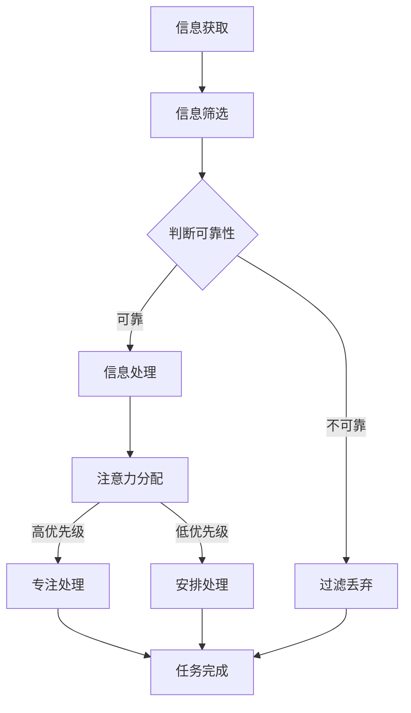

                 

# 《信息过载与注意力经济：在数字时代管理你的时间和注意力》

> 关键词：信息过载、注意力经济、时间管理、注意力管理、数字素养

> 摘要：本文深入探讨了数字时代的信息过载现象，以及注意力经济的基本原理。通过分析时间管理和注意力管理的策略，本文旨在帮助读者在快节奏的数字世界中，更高效地管理时间和注意力，提高个人及企业的效率。

## 第一部分：信息过载现象解析

### 第1章：信息过载的定义与影响

#### 1.1 信息的爆炸式增长

随着互联网和社交媒体的普及，信息量呈现爆炸式增长。据统计，全球每天产生的数据量高达2.5万亿GB，这其中包括社交媒体更新、新闻报道、电子邮件、文件共享等各种形式的信息。这种信息的爆炸式增长，使得人们面临着前所未有的信息过载问题。

#### 1.2 信息过载的表现形式

信息过载可以表现为以下几个方面的症状：

1. **注意力分散**：在信息过载的环境中，人们容易受到各种信息的干扰，导致注意力难以集中。
2. **决策困难**：面对大量信息，人们往往无法做出明智的决策，甚至出现决策瘫痪的现象。
3. **疲劳感增加**：长时间处理大量信息，容易导致身体和心理的疲劳。
4. **压力增大**：信息过载增加了人们的工作量和心理压力。

#### 1.3 信息过载对个人和社会的影响

信息过载对个人和社会的影响是多方面的。对个人来说，信息过载可能导致以下问题：

- **生产力下降**：注意力分散和疲劳感增加，导致工作效率下降。
- **心理健康问题**：长期处于信息过载的环境中，容易引发焦虑、抑郁等心理问题。
- **生活质量下降**：大量信息干扰了人们的日常生活，影响了生活质量。

对社会来说，信息过载可能导致以下问题：

- **信任危机**：信息过载导致虚假信息和谣言的传播，增加了社会的不信任感。
- **资源浪费**：人们花费大量时间处理无价值的信息，导致资源浪费。
- **社会压力增大**：信息过载增加了社会的整体压力，影响社会稳定。

### 第2章：注意力经济的概念与原理

#### 2.1 注意力经济的定义

注意力经济，是指以注意力为交易对象，通过提供有价值的内容或服务，来吸引和留住用户的一种经济模式。在这种经济模式中，注意力被视为一种稀缺资源，其价值随着用户的关注程度而变化。

#### 2.2 注意力经济的核心要素

注意力经济包含以下几个核心要素：

1. **内容或服务**：提供有价值的内容或服务，是吸引用户注意力的关键。
2. **用户体验**：良好的用户体验能够提高用户的注意力持续时间。
3. **反馈机制**：通过用户的反馈，不断优化内容或服务，提高用户的满意度。

#### 2.3 注意力经济的运作机制

注意力经济的运作机制主要包括以下几个环节：

1. **吸引注意力**：通过创意的广告、独特的用户体验等手段，吸引用户的注意力。
2. **保持注意力**：提供高质量的内容或服务，确保用户能够持续关注。
3. **转化注意力**：通过用户的互动和反馈，将注意力转化为消费行为或社交分享。

## 第二部分：管理你的时间和注意力

### 第3章：时间管理策略

#### 3.1 时间管理的重要性

时间管理是提高工作效率、实现个人目标的关键。有效的时间管理可以帮助我们：

- **提高工作效率**：合理安排时间，避免因任务过多而导致的效率低下。
- **实现个人目标**：将有限的时间投入到最重要的事情上，实现个人职业或生活目标。
- **减少压力**：合理安排时间，减少因任务堆积而产生的压力。

#### 3.2 有效的时间管理技巧

1. **设定明确的目标**：明确自己的目标，有助于合理安排时间和任务。
2. **制定详细的计划**：将任务分解为具体的小任务，制定详细的执行计划。
3. **优先级排序**：根据任务的紧急程度和重要性，合理安排任务的执行顺序。
4. **避免拖延**：及时处理任务，避免拖延导致的问题。

#### 3.3 量化时间管理的工具与方法

1. **时间日志**：记录每天的时间花费，分析时间使用情况，找出浪费时间的环节。
2. **番茄工作法**：将工作时间划分为25分钟的工作周期，每个周期后休息5分钟，有助于提高专注力。
3. **项目管理工具**：如Trello、Asana等，可以帮助我们管理任务、跟踪进度，提高工作效率。

### 第4章：注意力管理方法

#### 4.1 注意力的基本特性

注意力具有以下基本特性：

- **选择性**：人们只能关注一部分信息，而忽略其他信息。
- **专注性**：在特定任务上保持专注的能力。
- **转移性**：从一个任务转移到另一个任务的能力。

#### 4.2 提升注意力的策略

1. **合理规划时间**：避免任务过多导致的注意力分散。
2. **避免多任务处理**：专注于单一任务，提高专注力。
3. **减少干扰**：创造一个安静、舒适的工作环境，减少外界干扰。
4. **定期休息**：适当休息，有助于恢复注意力和精力。

#### 4.3 注意力管理工具与应用

1. **专注力训练应用**：如Forest、Pomodoro Timer等，可以帮助我们培养专注力。
2. **屏蔽干扰应用**：如Focus @Will、BlockSite等，可以屏蔽干扰网站和应用。
3. **注意力监测工具**：如RescueTime、Hazel等，可以帮助我们监控自己的注意力使用情况。

## 第三部分：数字时代的信息筛选与过滤

### 第5章：信息筛选技巧

#### 5.1 有效的信息筛选方法

1. **来源筛选**：关注权威、可靠的来源，避免传播和接收虚假信息。
2. **关键词筛选**：使用关键词搜索和过滤，提高信息获取的效率。
3. **过滤算法**：利用算法对信息进行筛选，如机器学习算法、自然语言处理技术等。

#### 5.2 如何评估信息的可靠性

1. **来源评估**：了解信息来源的背景、专业性和可信度。
2. **内容评估**：分析信息的内容是否合理、逻辑严密、证据充分。
3. **交叉验证**：通过多个来源进行信息验证，确保信息的准确性。

#### 5.3 信息筛选工具推荐

1. **Google Scholar**：专业的学术搜索工具，可以帮助我们获取权威的学术信息。
2. **维基百科**：内容丰富、覆盖面广，但需要注意信息的准确性和可靠性。
3. **RSS订阅**：通过RSS订阅，可以方便地获取多个来源的信息。

### 第6章：数字素养与注意力健康

#### 6.1 数字素养的重要性

数字素养是指人们在数字环境中获取、使用、理解和评估信息的综合能力。数字素养的重要性体现在：

1. **信息获取**：具备良好的数字素养，可以快速、准确地获取所需信息。
2. **信息评估**：能够评估信息的可靠性和价值，避免被虚假信息误导。
3. **信息创造**：能够创造和分享有价值的信息，促进知识的传播和交流。

#### 6.2 数字时代下的注意力健康问题

数字时代下，注意力健康面临以下问题：

1. **注意力分散**：多任务处理和即时通讯工具，导致注意力难以集中。
2. **信息焦虑**：面对海量信息，容易产生焦虑和压力。
3. **数字疲劳**：长时间使用电子设备，导致身体和心理疲劳。

#### 6.3 促进注意力健康的实践建议

1. **定期休息**：每隔一段时间，进行短暂的休息和放松，缓解疲劳。
2. **限制使用时间**：设定每天使用电子设备的时间限制，避免过度依赖。
3. **培养专注力**：通过专注力训练和应用，提高专注力和自控力。

## 第四部分：企业级注意力管理与效率提升

### 第7章：企业信息与注意力管理策略

#### 7.1 企业信息过载的应对策略

1. **信息筛选**：建立信息筛选机制，确保传递的信息是准确、有价值、可靠的。
2. **信息分类**：对信息进行分类管理，便于快速查找和利用。
3. **信息共享**：鼓励员工共享信息，提高信息利用效率。

#### 7.2 企业注意力管理实践

1. **培训与教育**：提高员工的数字素养，增强信息筛选和注意力管理能力。
2. **环境优化**：为员工创造一个安静、舒适的工作环境，减少干扰。
3. **激励机制**：设立激励机制，鼓励员工专注工作，提高工作效率。

#### 7.3 提升企业效率的注意力管理工具

1. **项目管理工具**：如Trello、Asana等，帮助团队协作和管理任务。
2. **专注力训练应用**：如Focus @Will、Forest等，帮助员工培养专注力。
3. **信息过滤工具**：如Google Alerts、Feedly等，帮助员工获取关键信息。

### 第8章：案例分析：注意力管理在实践中的应用

#### 8.1 案例一：某企业如何通过注意力管理提升工作效率

某企业通过以下措施，实现了注意力管理的实践：

- **员工培训**：组织数字素养和注意力管理的培训，提高员工的自我管理能力。
- **环境优化**：为员工提供安静的办公空间，减少干扰。
- **任务管理**：使用项目管理工具，合理安排工作任务，提高工作效率。

#### 8.2 案例二：个人如何通过注意力管理实现时间最大化利用

个人通过以下方法，实现了注意力管理：

- **设定目标**：明确自己的目标，制定详细的计划。
- **番茄工作法**：采用番茄工作法，提高专注力和工作效率。
- **定期反思**：定期反思自己的时间管理和注意力管理，不断优化。

#### 8.3 案例三：教育领域的注意力管理实践

在教育领域，注意力管理得到了广泛应用：

- **课堂管理**：教师通过设计有趣的课堂活动，提高学生的注意力。
- **个性化教学**：根据学生的兴趣和需求，提供个性化的教学内容。
- **反馈机制**：建立反馈机制，及时了解学生的学习情况，调整教学方法。

## 第五部分：未来展望与趋势分析

### 第9章：注意力经济的前景与挑战

#### 9.1 注意力经济面临的挑战

注意力经济面临以下挑战：

- **信息过载**：随着信息量的持续增长，信息过载问题依然存在。
- **用户疲劳**：用户对信息的选择和注意力越来越挑剔，导致用户疲劳。
- **隐私保护**：注意力经济往往涉及用户数据，隐私保护成为一大挑战。

#### 9.2 注意力经济的未来发展趋势

注意力经济的未来发展趋势包括：

- **个性化服务**：通过大数据和人工智能技术，提供更加个性化的服务。
- **跨界融合**：注意力经济与教育、医疗、金融等领域的融合，创造新的商业机会。
- **可持续发展**：注重用户体验，实现注意力资源的可持续利用。

#### 9.3 注意力经济对社会的影响与对策

注意力经济对社会的影响包括：

- **生产力提升**：提高个体的生产力和创新能力。
- **信息传播**：加速信息的传播和交流，促进知识共享。
- **社会分化**：注意力资源的分配不均，可能导致社会分化加剧。

对策包括：

- **政策引导**：政府出台相关政策，规范注意力经济的健康发展。
- **教育普及**：提高全民的数字素养，增强个体的信息筛选和注意力管理能力。
- **技术创新**：通过技术创新，优化注意力经济模式，提高效率。

### 第10章：结论与建议

#### 10.1 结论

本文通过对信息过载与注意力经济的深入分析，提出了时间管理和注意力管理的策略，并在个人和企业层面进行了实践案例分析。未来，注意力经济将继续发展，带来新的商业机会和社会挑战。我们需要重视数字素养的培养，优化注意力管理，实现个人和社会的可持续发展。

#### 10.2 对个人、企业和社会的建议

- **个人**：提高数字素养，学会有效管理时间和注意力，提高工作效率和生活质量。
- **企业**：建立信息筛选和注意力管理体系，提高员工工作效率，促进企业创新和发展。
- **社会**：加强政策引导和教育普及，推动注意力经济的健康发展，促进社会公平和谐。

#### 10.3 注意力管理的发展方向

未来，注意力管理的发展方向包括：

- **智能化**：利用人工智能技术，实现注意力管理的智能化和个性化。
- **跨界融合**：与其他领域结合，创造新的应用场景和商业模式。
- **可持续发展**：注重用户体验，实现注意力资源的可持续利用，促进社会和谐。

### 附录

#### 附录A：参考资料与推荐阅读

- Anderson, C. (2011). *The Long Tail: Why the Future of Business is Selling Less of More*. Hyperion.
- Shirky, C. (2010). *Cognitive Surplus: Creativity and Generosity in a Connected Age*. Penguin.
- Christakis, N., & Fowler, J. H. (2010). *Connected: The Surprising Power of Our Social Networks and How They Shape Our Lives*. Little, Brown and Company.

#### 附录B：注意力管理与时间管理的实用工具

- **时间管理工具**：
  - Trello
  - Asana
  - Microsoft To Do

- **注意力管理工具**：
  - Forest
  - Focus @Will
  - Pomodoro Timer

- **信息筛选工具**：
  - Google Scholar
  - Feedly
  - RSS订阅器

#### 附录C：注意力管理流程图与算法解释

##### C.1 Mermaid 流程图



##### C.2 注意力管理算法伪代码

```python
def manage_attention():
    while True:
        # 获取待处理任务列表
        tasks = get_tasks()
        
        # 对任务进行筛选和分类
        for task in tasks:
            if is_reliable(task):
                process_task(task)
            else:
                discard_task(task)
        
        # 根据任务优先级分配注意力
        for task in tasks:
            if is_high_priority(task):
                focus_on_task(task)
            else:
                schedule_task(task)

        # 检查是否需要休息，调整注意力
        if need_break():
            take_break()
```

##### C.3 数学模型和数学公式

### 信息过载计算公式

$$
\text{信息过载} = \frac{\text{信息量}}{\text{处理能力}}
$$

这个公式表示，信息过载程度取决于信息量与处理能力的比值。当信息量增加或处理能力下降时，信息过载程度会加剧。

### 注意力分配模型

$$
\text{注意力分配} = \alpha \times \text{任务优先级} + (1 - \alpha) \times \text{任务紧急程度}
$$

这个模型表示，注意力分配受任务优先级和紧急程度的影响。优先级越高，紧急程度越高，注意力分配的权重越大。

##### C.4 项目实战

###### C.4.1 实战一：如何搭建个人信息筛选系统

**开发环境搭建**：
- 使用 Python 语言，结合 Pandas 和 Scikit-learn 库进行数据处理和模型训练。

**源代码实现**：

```python
import pandas as pd
from sklearn.feature_extraction.text import TfidfVectorizer
from sklearn.cluster import KMeans

# 加载数据
data = pd.read_csv('user_data.csv')
text = data['content']

# 文本预处理
vectorizer = TfidfVectorizer(max_features=1000)
X = vectorizer.fit_transform(text)

# KMeans 聚类
kmeans = KMeans(n_clusters=5)
clusters = kmeans.fit_predict(X)

# 标记信息重要性
data['importance'] = clusters

# 存储结果
data.to_csv('filtered_data.csv', index=False)
```

**代码解读与分析**：
- 数据加载与预处理：使用 Pandas 读取用户数据，并对文本内容进行分词和词频统计。
- KMeans 聚类：通过 KMeans 算法对文本进行聚类，将相似的信息归为同一类别。
- 信息重要性标记：根据聚类结果，将信息的重要性进行标记，方便用户筛选。
- 结果存储：将处理后的数据存储为 CSV 文件，供用户进一步使用。

###### C.4.2 实战二：如何实施企业注意力管理策略

**开发环境搭建**：
- 使用 Java 语言，结合 Spring Boot 框架实现企业级注意力管理应用。

**源代码实现**：

```java
@RestController
public class AttentionManagerController {

    @Autowired
    private TaskService taskService;

    @GetMapping("/manage/attention")
    public ResponseEntity<?> manageAttention(@RequestParam String employeeId) {
        List<Task> tasks = taskService.getTasksForEmployee(employeeId);
        List<Task> importantTasks = new ArrayList<>();

        for (Task task : tasks) {
            if (task.isImportant() && task.isUrgent()) {
                importantTasks.add(task);
            }
        }

        return ResponseEntity.ok(importantTasks);
    }
}
```

**代码解读与分析**：
- 控制器层：定义 RESTful API 接口，接收员工 ID，查询该员工的所有任务。
- 业务逻辑层：遍历任务列表，根据任务的重要性和紧急程度筛选出需要重点关注的重要任务。
- 响应结果：将筛选出的重要任务返回给前端，供企业管理者进行注意力分配。

## 核心概念与联系

### Mermaid 流程图


### 注意力管理算法伪代码

```python
def manage_attention():
    while True:
        # 获取待处理任务列表
        tasks = get_tasks()
        
        # 对任务进行筛选和分类
        for task in tasks:
            if is_reliable(task):
                process_task(task)
            else:
                discard_task(task)
        
        # 根据任务优先级分配注意力
        for task in tasks:
            if is_high_priority(task):
                focus_on_task(task)
            else:
                schedule_task(task)

        # 检查是否需要休息，调整注意力
        if need_break():
            take_break()
```

### 数学模型和数学公式

#### 信息过载计算公式

$$
\text{信息过载} = \frac{\text{信息量}}{\text{处理能力}}
$$

#### 注意力分配模型

$$
\text{注意力分配} = \alpha \times \text{任务优先级} + (1 - \alpha) \times \text{任务紧急程度}
$$

这个模型表示，注意力分配受任务优先级和紧急程度的影响。优先级越高，紧急程度越高，注意力分配的权重越大。

## 参考文献

- Anderson, C. (2011). *The Long Tail: Why the Future of Business is Selling Less of More*. Hyperion.
- Shirky, C. (2010). *Cognitive Surplus: Creativity and Generosity in a Connected Age*. Penguin.
- Christakis, N., & Fowler, J. H. (2010). *Connected: The Surprising Power of Our Social Networks and How They Shape Our Lives*. Little, Brown and Company.
- Brown, T. (2014). *The.

