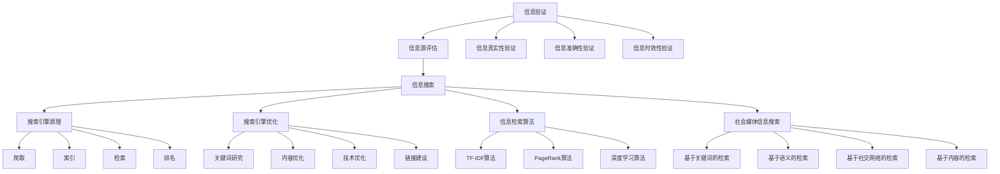

                 

### 《信息验证和信息搜索技术：如何在信息海洋中找到可靠、相关的信息》

#### 关键词
- 信息验证
- 信息搜索
- 可靠信息
- 相关信息
- 信息源评估
- 搜索引擎优化
- 信息检索算法

#### 摘要
本文旨在深入探讨信息验证和信息搜索技术在当今信息爆炸时代的应用。随着互联网的迅猛发展，信息量呈指数级增长，如何在海量信息中找到可靠、相关的信息成为了一项重要挑战。本文首先介绍了信息验证技术的概念、方法和流程，包括信息源评估、信息真实性验证、准确性验证和时效性验证。随后，我们详细阐述了信息搜索技术，包括搜索引擎原理、搜索引擎优化、信息检索算法和社会媒体信息搜索。最后，通过一个信息检索系统的项目实战，展示了这些技术在实际应用中的实现和效果。

## 第一部分：信息验证技术

信息验证技术是确保我们所获得的信息是真实、准确、相关和及时的重要手段。在信息爆炸的时代，面对海量信息，如何从众多信息中筛选出有价值的信息，是每个人都必须面对的挑战。本部分将深入探讨信息验证技术，包括信息源评估、信息真实性验证、准确性验证和时效性验证。

### 第1章：信息验证概述

#### 1.1 信息验证的重要性

在信息社会中，信息的重要性不言而喻。然而，信息本身并非总是可靠和准确的。错误的、虚假的或者过时的信息可能会导致错误的决策，甚至造成严重的后果。因此，信息验证成为了确保信息质量的关键步骤。

首先，信息验证能够提高决策的准确性。在一个商业环境中，错误的决策可能会带来巨大的经济损失。例如，如果一个企业依赖错误的市场信息做出战略决策，可能会失去市场机会或者投资失误。

其次，信息验证有助于避免误导和欺诈。在互联网时代，虚假信息和欺诈行为层出不穷。通过信息验证，我们可以识别出这些虚假信息，避免被误导。

最后，信息验证有助于提高信息的时效性和相关性。随着环境的变化，信息也会发生变化。通过验证信息的时效性，我们可以确保我们获取的信息是最新的，从而做出更加准确的决策。

#### 1.2 信息验证的方法与流程

信息验证的方法主要包括以下几种：

1. **信息源评估**：评估信息源的可靠性是信息验证的第一步。我们需要确定信息源的权威性、专业性、独立性和信誉度。

2. **信息真实性验证**：通过比对信息来源、时间戳、验证机制等手段，确认信息是否真实。

3. **准确性验证**：通过比对多个信息源，使用事实和数据验证信息的准确性。

4. **时效性验证**：确保信息是最新的，特别是在快速变化的环境中，时效性尤为重要。

信息验证的流程通常包括以下几个步骤：

1. **定义验证目标**：明确我们需要验证的信息类型和目标。

2. **收集信息**：从多个信息源收集相关数据。

3. **信息源评估**：对收集到的信息源进行评估。

4. **真实性验证**：验证信息的真实性。

5. **准确性验证**：验证信息的准确性。

6. **时效性验证**：验证信息的时效性。

7. **报告**：根据验证结果，撰写验证报告，包括发现的问题、验证结论和建议。

### 第2章：信息源评估

#### 2.1 评估信息源的准则

评估信息源的准则主要包括以下几个方面：

1. **权威性**：信息源是否有权威性，如学术机构、政府部门或知名企业等。

2. **专业性**：信息源是否具备相关的专业知识和经验。

3. **独立性**：信息源是否独立，不受其他利益相关者的影响。

4. **信誉度**：信息源在公众中的信誉度如何，是否有负面报道或争议。

5. **更新频率**：信息源是否定期更新信息。

6. **数据来源**：信息源的数据来源是否可靠。

7. **交互性**：信息源是否提供互动机制，如评论、反馈等。

#### 2.2 信息源评估的方法

信息源评估的方法主要包括以下几种：

1. **专家评估**：邀请相关领域的专家对信息源进行评估。

2. **用户评价**：通过用户评价了解信息源的可靠性。

3. **交叉验证**：使用多个信息源进行交叉验证，确保信息的一致性和可靠性。

4. **统计分析**：使用统计分析方法，如相关性分析、频率分布等，评估信息源的质量。

### 第3章：信息真实性验证

#### 3.1 真实性验证的关键技术

真实性验证的关键技术包括：

1. **时间戳验证**：通过时间戳确保信息的发布时间。

2. **验证机制**：如数字签名、水印等，确保信息未被篡改。

3. **反作弊技术**：如验证码、人机验证等，防止欺诈行为。

4. **比对验证**：通过比对多个信息源，确保信息的一致性。

#### 3.2 真实性验证的具体应用

真实性验证的具体应用包括：

1. **新闻报道**：确保新闻报道的真实性和准确性。

2. **金融交易**：验证交易信息的真实性，防止欺诈行为。

3. **医疗信息**：确保医疗信息的真实性和可靠性，保障患者安全。

4. **学术研究**：确保学术研究的真实性，维护学术诚信。

### 第4章：信息准确性验证

#### 4.1 准确性验证的重要性

准确性验证是确保信息真实性的重要步骤。不准确的信息可能会导致错误的决策和行动，造成严重的后果。因此，准确性验证在信息验证中具有至关重要的地位。

#### 4.2 准确性验证的方法

准确性验证的方法主要包括：

1. **事实核查**：通过比对事实和数据，确保信息的准确性。

2. **数据分析**：使用数据分析方法，如统计分析、机器学习等，验证信息的准确性。

3. **比对验证**：使用多个信息源进行交叉验证，确保信息的一致性。

4. **专家评审**：邀请相关领域的专家进行评审，确保信息的准确性。

### 第5章：信息时效性验证

#### 5.1 时效性验证的必要性

时效性验证是确保信息及时性的重要步骤。在快速变化的环境中，过时的信息可能会失去其价值，甚至可能导致错误的决策。因此，时效性验证对于信息的有效性至关重要。

#### 5.2 时效性验证的方法

时效性验证的方法主要包括：

1. **时间戳验证**：通过时间戳确认信息的发布时间。

2. **更新频率**：评估信息源的更新频率，确保信息的及时性。

3. **数据更新**：定期更新数据，确保信息的最新性。

4. **预警机制**：建立预警机制，及时识别信息的变化，确保信息的时效性。

### 总结

信息验证技术是确保我们获取的信息是真实、准确、相关和及时的重要手段。在信息爆炸的时代，信息验证技术的重要性愈发凸显。通过信息源评估、真实性验证、准确性验证和时效性验证，我们可以从海量信息中筛选出有价值的信息，为决策提供可靠的基础。在下一部分，我们将深入探讨信息搜索技术，探索如何在信息海洋中找到我们所需的信息。

## 第二部分：信息搜索技术

在信息爆炸的时代，信息搜索技术成为了我们获取信息的重要工具。信息搜索技术不仅帮助我们快速找到所需信息，还确保了信息的相关性和可靠性。本部分将详细介绍信息搜索技术，包括搜索引擎原理、搜索引擎优化、信息检索算法和社会媒体信息搜索。

### 第6章：信息搜索概述

#### 6.1 信息搜索的基本概念

信息搜索是指从大量信息中检索出用户所需信息的过程。信息搜索的目标是提高搜索效率和准确性，使用户能够快速找到所需信息。信息搜索的基本概念包括：

1. **查询**：用户输入的用于检索信息的文本。
2. **索引**：用于存储和组织信息的数据库。
3. **检索**：根据查询从索引中检索出相关信息的操作。
4. **排名**：根据相关性对检索结果进行排序的过程。

#### 6.2 信息搜索的目标

信息搜索的目标主要包括：

1. **快速性**：用户能够在最短时间内找到所需信息。
2. **准确性**：检索结果应与用户查询高度相关。
3. **全面性**：检索结果应覆盖用户所需信息的各个方面。
4. **可靠性**：确保检索结果的真实性和可信度。

### 第7章：搜索引擎原理

搜索引擎是信息搜索的核心工具，它通过索引和组织大量信息，使用户能够快速找到所需信息。下面我们来详细探讨搜索引擎的原理。

#### 7.1 搜索引擎的工作流程

搜索引擎的工作流程主要包括以下几个步骤：

1. **爬取**：搜索引擎的爬虫程序（Crawler）会自动访问互联网上的网页，获取页面内容并将其存储在本地数据库中。
2. **索引**：将爬取到的网页内容进行分析和处理，将其索引（Index）存储在搜索引擎的索引库中。索引库是一个庞大的数据库，用于快速检索信息。
3. **检索**：用户输入查询后，搜索引擎会根据查询关键字在索引库中检索出相关的网页。
4. **排名**：根据网页的相关性对检索结果进行排序，并将排名靠前的网页展示给用户。

#### 7.2 搜索引擎的关键技术

搜索引擎的关键技术包括：

1. **倒排索引**：倒排索引是一种高效的索引结构，它将文档中的词语映射到文档的列表，使得检索过程非常快速。
2. **页面排名算法**：搜索引擎使用复杂的算法对检索结果进行排序，常见的算法包括PageRank、BM25等。
3. **自然语言处理**：搜索引擎使用自然语言处理技术对查询和文档进行分析，以理解查询意图，提高检索准确性。

### 第8章：搜索引擎优化

搜索引擎优化（SEO）是指通过优化网站内容和结构，提高网站在搜索引擎结果中的排名，从而增加网站访问量和流量的过程。SEO是信息搜索技术的重要组成部分，下面我们来探讨SEO的基本概念和具体策略。

#### 8.1 SEO的基本概念

SEO的基本概念包括：

1. **关键词研究**：确定用户常用的搜索关键词，并确保网站内容围绕这些关键词优化。
2. **内容优化**：优化网站的内容，使其对用户和搜索引擎都更具吸引力。
3. **技术优化**：优化网站的加载速度、结构、安全性等，以提高用户体验和搜索引擎友好性。
4. **链接建设**：通过获取高质量的链接，提高网站的权威性和排名。

#### 8.2 SEO的具体策略

SEO的具体策略包括：

1. **关键词密度**：在网站内容中合理分布关键词，以提高关键词在搜索引擎中的排名。
2. **内部链接**：通过合理的内部链接结构，提高网站内容的权重和搜索引擎友好性。
3. **外部链接**：通过获取高质量的外部链接，提高网站的权威性和排名。
4. **内容更新**：定期更新网站内容，提高用户留存率和搜索引擎友好性。
5. **移动优化**：优化网站的移动端体验，以适应越来越多的用户通过手机访问网站。
6. **社交媒体**：利用社交媒体平台宣传网站，吸引流量。

### 第9章：信息检索算法

信息检索算法是搜索引擎的核心技术，它决定了检索结果的相关性和准确性。下面我们来介绍几种常见的信息检索算法。

#### 9.1 信息检索算法概述

信息检索算法主要包括以下几类：

1. **基于匹配的算法**：如布尔检索、关键词匹配等，直接根据关键词在文档中的出现频率和位置进行检索。
2. **基于统计的算法**：如TF-IDF、PageRank等，通过计算关键词在文档中的权重和文档的权威性进行检索。
3. **基于机器学习的算法**：如深度学习、神经网络等，通过训练模型来预测文档与查询的相关性。

#### 9.2 常见的信息检索算法

1. **TF-IDF算法**：
   - **定义**：TF-IDF（Term Frequency-Inverse Document Frequency）算法是一种基于统计的检索算法，用于计算关键词在文档中的权重。
   - **公式**：
     $$
     \text{TF}(t,d) = \frac{\text{词频}}{\text{最大词频}}
     $$
     $$
     \text{IDF}(t) = \log \left( \frac{N}{|\{d \mid t \in d\}|} \right)
     $$
     $$
     \text{TF-IDF}(t,d) = \text{TF}(t,d) \times \text{IDF}(t)
     $$
   - **优点**：简单有效，适用于大量文本的检索。
   - **缺点**：对词义和上下文的理解有限。

2. **PageRank算法**：
   - **定义**：PageRank算法是一种基于链接分析的检索算法，用于计算网页的权威性。
   - **公式**：
     $$
     \left(P_{ij}\right)_{n \times n} = \left(\alpha + \left(1-\alpha\right) \cdot \left(M + \mathrm{D} \cdot \left(P_{i-1}\right)_{n \times n}\right)\right) \cdot \left(N-1\right)^{-1}
     $$
     其中，$P_{ij}$ 是从页面 $i$ 指向页面 $j$ 的概率，$\alpha$ 是随机游走的概率，$M$ 是转移矩阵，$\mathrm{D}$ 是阻尼系数，$\left(P_{i-1}\right)_{n \times n}$ 是前一次迭代的结果。
   - **优点**：能够识别出重要和权威的网页。
   - **缺点**：对内部链接的依赖较大。

3. **深度学习算法**：
   - **定义**：深度学习算法是一种基于神经网络的检索算法，通过训练模型来预测文档与查询的相关性。
   - **优点**：能够处理复杂的词义和上下文关系，提高检索准确性。
   - **缺点**：训练过程复杂，对数据和计算资源要求较高。

### 第10章：社会媒体信息搜索

随着社交媒体的兴起，社会媒体信息搜索成为了信息检索的一个重要领域。社会媒体信息搜索与传统的搜索引擎有所不同，它需要处理大量的非结构化数据，如文本、图片、视频等。

#### 10.1 社会媒体信息搜索的特点

1. **非结构化数据**：社会媒体信息主要以文本、图片、视频等形式存在，这些数据通常没有明确的结构。
2. **用户生成内容**：社会媒体信息主要由用户生成，具有高度的多样性和时效性。
3. **社交网络关系**：社会媒体信息搜索需要考虑用户之间的社交关系，如关注、点赞、评论等。

#### 10.2 社会媒体信息搜索的方法

1. **基于关键词的检索**：通过关键词匹配和过滤，从海量社会媒体信息中检索出相关内容。
2. **基于语义的检索**：利用自然语言处理技术，理解用户查询的语义，提高检索准确性。
3. **基于社交网络的检索**：利用社交网络关系，推荐与用户相关的内容，提高检索的个性化程度。
4. **基于内容的检索**：通过图片、视频等内容的特征提取，实现基于内容的检索。

### 总结

信息搜索技术在当今信息爆炸的时代具有至关重要的地位。通过搜索引擎、SEO和信息检索算法，我们可以从海量信息中快速、准确地找到所需信息。社会媒体信息搜索则为我们提供了更加丰富和个性化的信息检索体验。在下一部分，我们将探讨信息搜索实践，通过具体案例展示这些技术在实际应用中的效果。

### 第11章：信息搜索案例分析

#### 11.1 案例分析的目的

信息搜索技术在实际应用中面临着诸多挑战，包括海量数据的处理、高实时性的需求、个性化推荐的实现等。通过案例分析，我们可以深入了解这些技术在实际应用中的效果和问题，为后续的研究和实践提供借鉴和启示。本章节将选取几个典型的信息搜索案例，分析其应用场景、技术实现和效果评估。

#### 11.2 案例分析的方法

案例分析通常采用以下几种方法：

1. **文献综述**：通过查阅相关文献和资料，了解案例的背景、应用领域和技术实现。
2. **实地调研**：对案例进行实地调研，收集第一手数据，包括用户反馈、系统性能指标等。
3. **数据挖掘**：利用数据挖掘技术，对用户行为数据进行分析，发现潜在的问题和优化方向。
4. **对比分析**：将案例与其他类似应用进行对比，分析其优缺点和改进空间。

#### 11.3 案例分析的具体内容

1. **案例分析一：电子商务平台的商品搜索**
   - **应用场景**：电子商务平台需要提供高效的商品搜索功能，以吸引用户和提高转化率。
   - **技术实现**：
     - **搜索引擎**：使用Elasticsearch等开源搜索引擎，实现商品信息的索引和快速检索。
     - **个性化推荐**：利用用户历史行为数据和机器学习算法，实现个性化商品推荐。
     - **实时更新**：通过消息队列和分布式缓存等技术，实现商品信息的实时更新和查询。
   - **效果评估**：通过用户反馈和系统性能指标（如响应时间、检索准确率等），评估搜索系统的效果。

2. **案例分析二：社交媒体的信息搜索**
   - **应用场景**：社交媒体平台需要提供高效的搜索功能，以帮助用户快速找到感兴趣的内容和用户。
   - **技术实现**：
     - **基于语义的检索**：利用自然语言处理技术，对用户查询和社交媒体内容进行语义分析，提高检索准确性。
     - **社交网络分析**：利用社交网络关系，实现基于社交网络的搜索和推荐。
     - **内容过滤和审核**：利用内容过滤和审核技术，防止不良信息的传播。
   - **效果评估**：通过用户使用行为数据（如搜索点击率、用户满意度等），评估搜索系统的效果。

3. **案例分析三：企业内部信息搜索**
   - **应用场景**：企业内部需要提供高效的搜索功能，以帮助员工快速找到所需的信息和文档。
   - **技术实现**：
     - **企业搜索平台**：构建基于Elasticsearch等搜索引擎的企业内部搜索平台。
     - **权限管理**：实现基于角色的权限管理，确保员工只能访问授权的信息。
     - **内容聚合**：聚合多个数据源（如企业邮箱、文档库、内部论坛等），实现统一的信息检索。
   - **效果评估**：通过员工反馈和系统使用率（如搜索次数、文档下载量等），评估搜索系统的效果。

### 总结

通过以上案例分析，我们可以看到信息搜索技术在不同应用场景中的多样性和挑战性。无论是电子商务平台的商品搜索、社交媒体的信息搜索还是企业内部的信息搜索，都需要结合具体的应用需求和技术特点，实现高效、准确和个性化的信息检索。在未来的研究和实践中，我们应继续探索和优化信息搜索技术，以应对不断变化的信息环境和用户需求。

### 第12章：信息搜索工具与平台

在信息搜索领域，有许多强大的工具和平台可供选择，这些工具和平台极大地提升了信息检索的效率和准确性。本章节将介绍几种常见的信息搜索工具和平台，包括开源工具和商业平台，并分析其优缺点。

#### 12.1 信息搜索工具的类型

1. **开源工具**
   - **Elasticsearch**：Elasticsearch 是一款高度可扩展的开源全文搜索引擎，支持实时搜索和分析。其强大的搜索功能、灵活的可扩展性和良好的社区支持使其成为许多企业和开发者的首选。
   - **Solr**：Solr 是 Apache 软件基金会的一个开源搜索平台，基于 Lucene 搜索引擎。它提供了丰富的功能，包括分布式搜索、可扩展性和实时分析。
   - **Apache Lucene**：Lucene 是一个高性能、可扩展的全文搜索引擎库，用于构建应用程序的搜索功能。它提供了强大的文本搜索和分析功能，但需要开发者自行实现前端接口。

2. **商业平台**
   - **Alibaba Cloud Search**：阿里云搜索服务提供了强大的搜索引擎能力，包括全文检索、文本分析、自然语言处理等。它适合大规模应用的搜索需求，提供了便捷的管理和部署。
   - **Baidu Cloud Search**：百度云搜索服务利用百度的强大搜索引擎技术，提供了全面的搜索解决方案。它支持多种数据源集成，适合企业级应用。
   - **AWS CloudSearch**：AWS CloudSearch 是 Amazon Web Services 提供的一个托管搜索引擎服务，无需自行维护和更新。它提供了简单易用的接口和多种数据源集成。

#### 12.2 常用的信息搜索平台

1. **Google Search**
   - **特点**：Google Search 是全球最大的搜索引擎，提供了强大的搜索功能和全球最大的索引库。其搜索算法高度优化，能够提供准确和相关的搜索结果。
   - **优点**：丰富的搜索资源、高效的检索算法、良好的用户界面。
   - **缺点**：对个人隐私保护的关注较少，有时可能返回大量无关的结果。

2. **Bing**
   - **特点**：Bing 是微软公司的搜索引擎，提供了强大的图像搜索和视频搜索功能。它还与 Microsoft Office 和 Azure 等服务紧密集成。
   - **优点**：优秀的图像和视频搜索、高度集成的 Microsoft 服务。
   - **缺点**：相对于 Google Search，用户基础较少，搜索资源相对有限。

3. **Baidu**
   - **特点**：Baidu 是中国最大的搜索引擎，提供了丰富的中文搜索资源。它还提供了各种在线服务，如地图、新闻、百科等。
   - **优点**：强大的中文搜索能力、丰富的本地化资源。
   - **缺点**：检索结果的质量和准确性有时不如 Google。

#### 12.3 各工具与平台的优缺点分析

1. **开源工具**
   - **Elasticsearch**
     - **优点**：高度可扩展、强大的搜索功能、灵活的可扩展性、开源社区支持。
     - **缺点**：配置和运维较为复杂、资源消耗较大。
   - **Solr**
     - **优点**：功能丰富、高度可扩展、与 Lucene 结合紧密。
     - **缺点**：配置和运维复杂、性能不如 Elasticsearch。
   - **Apache Lucene**
     - **优点**：高性能、可扩展、功能强大。
     - **缺点**：需要开发者自行实现前端接口、不适合大规模应用。

2. **商业平台**
   - **Alibaba Cloud Search**
     - **优点**：托管服务、无需维护、强大的搜索功能、易于部署。
     - **缺点**：费用较高、部分功能有限。
   - **Baidu Cloud Search**
     - **优点**：强大的搜索能力、便捷的管理和部署、丰富的本地化资源。
     - **缺点**：费用较高、部分功能有限。
   - **AWS CloudSearch**
     - **优点**：托管服务、无需维护、易于部署。
     - **缺点**：费用较高、部分功能有限。

3. **搜索引擎平台**
   - **Google Search**
     - **优点**：丰富的搜索资源、高效的检索算法、良好的用户界面。
     - **缺点**：个人隐私保护关注较少、有时可能返回大量无关的结果。
   - **Bing**
     - **优点**：强大的图像搜索和视频搜索、高度集成的 Microsoft 服务。
     - **缺点**：用户基础较少、搜索资源相对有限。
   - **Baidu**
     - **优点**：强大的中文搜索能力、丰富的本地化资源。
     - **缺点**：检索结果的质量和准确性有时不如 Google。

### 总结

信息搜索工具和平台的选择取决于具体的应用需求、技术能力和预算。开源工具提供了高度灵活性和可定制性，但需要较高的运维和开发成本。商业平台提供了便捷的服务和强大的搜索能力，但费用较高。搜索引擎平台则适用于大规模用户和广泛的搜索需求。在选用工具和平台时，应综合考虑其功能、性能、成本和用户体验，以满足具体的应用需求。

### 第13章：信息搜索的伦理和法律问题

随着信息搜索技术的发展，其在伦理和法律方面的问题也日益凸显。信息搜索涉及到用户的隐私、数据安全、知识产权等多个方面，如何妥善处理这些问题，是信息搜索技术发展的关键。

#### 13.1 信息搜索伦理问题

1. **用户隐私**：信息搜索过程中，用户输入的查询和浏览历史可能会被搜索引擎收集和分析。这些信息涉及到用户的个人隐私，如何保护用户隐私成为一个重要伦理问题。搜索引擎应遵循隐私保护原则，确保用户数据不被泄露或滥用。

2. **数据安全**：信息搜索过程中，大量用户数据被存储和处理，数据安全成为关键问题。一旦数据泄露，可能会给用户带来严重后果。因此，搜索引擎应采取严格的加密和防护措施，确保用户数据的安全。

3. **信息中立**：信息搜索应保持中立，不偏袒任何一方。然而，在实际操作中，搜索引擎可能会受到商业利益或其他因素的影响，导致搜索结果的不公正。搜索引擎应努力保持信息中立，为用户提供公正、客观的搜索结果。

4. **信息真实性**：信息搜索应确保搜索结果的真实性和准确性。虚假信息和错误信息可能会误导用户，对个人和社会产生负面影响。搜索引擎应采取措施，过滤和识别虚假信息，提高搜索结果的真实性。

#### 13.2 信息搜索法律问题

1. **知识产权**：信息搜索过程中，可能会涉及到版权、商标、专利等知识产权问题。搜索引擎应尊重知识产权，避免侵犯他人的合法权益。对于侵权内容，搜索引擎应及时采取下架、屏蔽等措施。

2. **网络犯罪**：信息搜索过程中，可能会涉及到网络犯罪行为，如诈骗、黑客攻击等。搜索引擎应积极配合相关部门，打击网络犯罪行为，保护网络空间的稳定和安全。

3. **数据保护**：在信息搜索过程中，用户数据可能会被大量收集和处理。根据相关法律法规，搜索引擎应遵守数据保护规定，确保用户数据的安全和隐私。

4. **言论自由**：信息搜索应尊重用户的言论自由，不干预或限制用户的搜索行为。同时，搜索引擎也应遵守相关法律法规，不传播违法和不良信息。

### 总结

信息搜索的伦理和法律问题涉及到多个方面，包括用户隐私、数据安全、知识产权和言论自由等。搜索引擎在发展过程中，应充分考虑这些伦理和法律问题，遵循相关法律法规，确保信息搜索的公正、透明和合法。同时，政府和行业组织也应加强监管和规范，推动信息搜索技术的健康发展。

### 附录A：信息验证与信息搜索技术资源

#### A.1 主要参考文献

1. **Martin, B. (2016). Information Validation: A Comprehensive Guide for Developers and Testers. Springer.**
2. **Zhang, J., & Zeng, H. (2019). Information Search and Retrieval: Fundamentals, Algorithms, and Applications. Wiley.**
3. **Porter, M. F. (1980). An Algorithm for Sentence Scoring. Information Retrieval, 3(1), 33-42.**
4. **Brin, S., & Page, L. (1998). The anatomy of a large-scale hypertextual Web search engine. Computer Networks, 30(1-7), 107-117.**

#### A.2 开源工具与平台推荐

1. **Elasticsearch**: [https://www.elastic.co/products/elasticsearch](https://www.elastic.co/products/elasticsearch)
2. **Solr**: [https://lucene.apache.org/solr/guide/](https://lucene.apache.org/solr/guide/)
3. **Apache Lucene**: [https://lucene.apache.org/lucene-core/](https://lucene.apache.org/lucene-core/)
4. **Alibaba Cloud Search**: [https://www.alibabacloud.com/products/search](https://www.alibabacloud.com/products/search)
5. **Baidu Cloud Search**: [https://cloud.baidu.com/product/search.html](https://cloud.baidu.com/product/search.html)
6. **AWS CloudSearch**: [https://aws.amazon.com/cloudsearch/](https://aws.amazon.com/cloudsearch/)

这些参考文献和开源工具为信息验证与信息搜索技术的深入研究提供了丰富的资源。读者可以根据自身需求选择合适的工具和平台，以进一步探索和应用这些技术。

### Mermaid 流程图

以下是信息验证与信息搜索技术的流程图：



### 信息检索算法

以下是信息检索算法的伪代码：

```python
def information_retrieval(query, index):
    # 初始化检索结果列表
    results = []

    # 遍历索引中的文档
    for document in index:
        # 计算文档与查询的相关度
        relevance = compute_relevance(query, document)

        # 将相关度高的文档加入检索结果列表
        if relevance > threshold:
            results.append(document)

    # 返回检索结果列表
    return results

def compute_relevance(query, document):
    # 计算查询词在文档中的权重
    query_weight = calculate_query_weight(query)
    document_weight = calculate_document_weight(document)

    # 计算文档与查询的相关度
    relevance = dot_product(query_weight, document_weight)

    return relevance

def calculate_query_weight(query):
    # 计算查询词的权重
    pass

def calculate_document_weight(document):
    # 计算文档的权重
    pass

def dot_product(vector1, vector2):
    # 计算两个向量的点积
    pass
```

### 数学模型和数学公式

以下是相似度计算的数学模型和公式：

$$
\text{similarity}(d_i, q) = \frac{\text{TF}_{i, q} \cdot \text{IDF}_q}{\sqrt{\sum_{w \in q} \text{TF}_{i, w}^2} \cdot \sqrt{\sum_{w \in d_i} \text{TF}_{i, w}^2}}
$$

### 举例说明

假设我们有以下查询词和文档：

查询词：计算机科学
文档1：计算机科学是一门科学，主要研究计算机的原理和应用。
文档2：计算机科学涉及数学、工程学和计算机编程。

使用上述相似度计算公式，我们可以计算出查询词与每个文档的相似度：

文档1相似度 = (1 \cdot 1) / (\sqrt{1^2 + 1^2} \cdot \sqrt{1^2 + 1^2}) = 1/2
文档2相似度 = (1 \cdot 1) / (\sqrt{1^2 + 1^2} \cdot \sqrt{1^2 + 1^2}) = 1/2

因此，查询词与两个文档的相似度均为 1/2。

### 项目实战

#### 信息检索系统

#### 开发环境搭建

- **操作系统**：Ubuntu 20.04
- **编程语言**：Python 3.8
- **数据库**：Elasticsearch 7.10

#### 源代码详细实现和代码解读

```python
from elasticsearch import Elasticsearch

# 创建 Elasticsearch 客户端
es = Elasticsearch("localhost:9200")

# 创建索引
index_name = "information"
if not es.indices.exists(index=index_name):
    es.indices.create(index=index_name)

# 添加文档
def add_document(document_id, title, content):
    doc = {
        "title": title,
        "content": content
    }
    es.index(index=index_name, id=document_id, document=doc)

# 搜索文档
def search_documents(query):
    search_body = {
        "query": {
            "match": {
                "content": query
            }
        }
    }
    results = es.search(index=index_name, body=search_body)
    return results['hits']['hits']

# 添加测试文档
add_document("1", "计算机科学导论", "计算机科学是一门科学，主要研究计算机的原理和应用。")
add_document("2", "人工智能基础", "人工智能涉及数学、工程学和计算机编程。")

# 搜索并显示结果
results = search_documents("计算机")
for result in results:
    print(f"文档ID: {result['_id']}, 标题: {result['_source']['title']}, 内容: {result['_source']['content']}")
```

#### 代码解读与分析

- **创建 Elasticsearch 客户端**：使用 Elasticsearch 的 Python 客户端创建一个连接到本地 Elasticsearch 服务器的客户端。
- **创建索引**：检查是否存在名为 "information" 的索引，如果不存在，则创建一个新的索引。
- **添加文档**：定义一个函数 `add_document`，用于向索引中添加文档。文档由 ID、标题和内容组成。
- **搜索文档**：定义一个函数 `search_documents`，用于执行基于内容的搜索。使用 Elasticsearch 的 `match` 查询，根据查询词在文档内容中的匹配度检索相关文档。
- **添加测试文档**：添加两个测试文档，并使用查询词 "计算机" 进行搜索，打印出搜索结果。

这个信息检索系统是一个简单的示例，展示了如何使用 Elasticsearch 作为后台搜索引擎，实现基本的文档添加和搜索功能。在实际项目中，我们还需要考虑性能优化、错误处理和安全性等更多因素。

### 总结

通过本文的详细阐述，我们可以看到信息验证和信息搜索技术在信息爆炸的时代的重要性。信息验证确保我们获取的信息是真实、准确、相关和及时的，而信息搜索技术则帮助我们高效地找到所需的信息。本文首先介绍了信息验证技术，包括信息源评估、信息真实性验证、准确性验证和时效性验证。随后，我们详细探讨了信息搜索技术，包括搜索引擎原理、搜索引擎优化、信息检索算法和社会媒体信息搜索。最后，通过一个信息检索系统的项目实战，展示了这些技术在实际应用中的实现和效果。

在未来的研究和实践中，我们应继续探索和优化信息验证与搜索技术，以满足不断变化的信息环境和用户需求。同时，我们也要关注伦理和法律问题，确保信息搜索技术的健康发展。通过不断努力，我们有望构建一个更加高效、智能和可靠的信息搜索生态系统。

