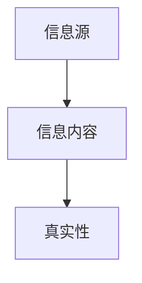
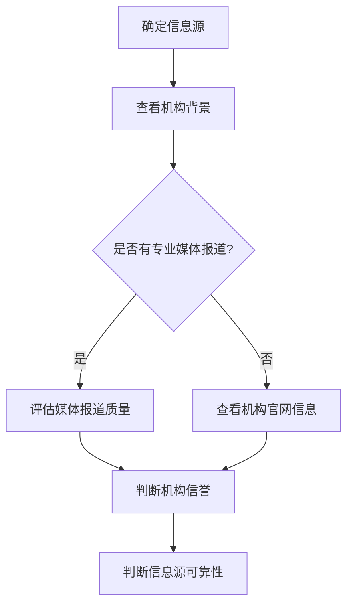
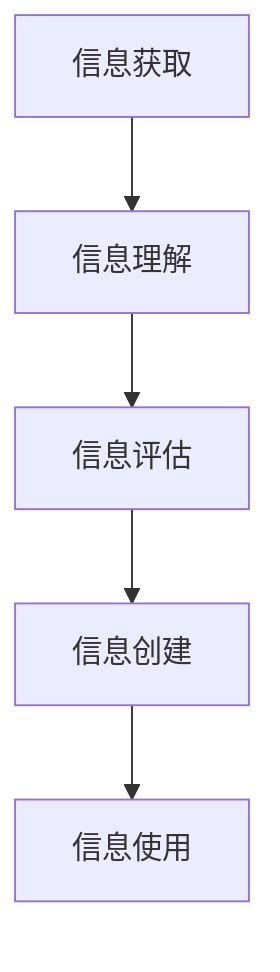
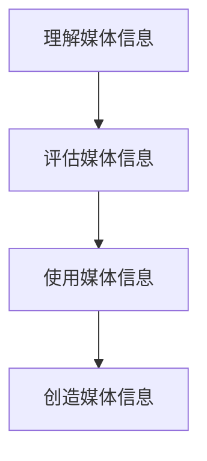
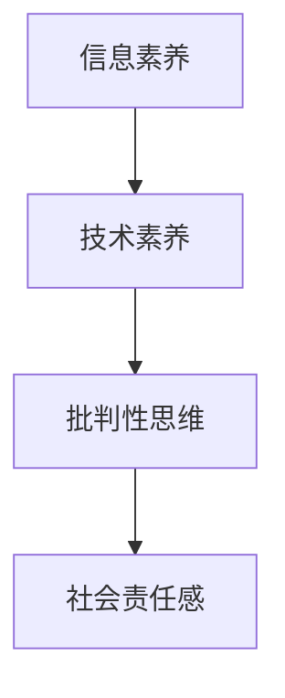
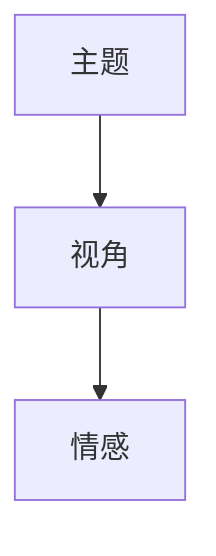
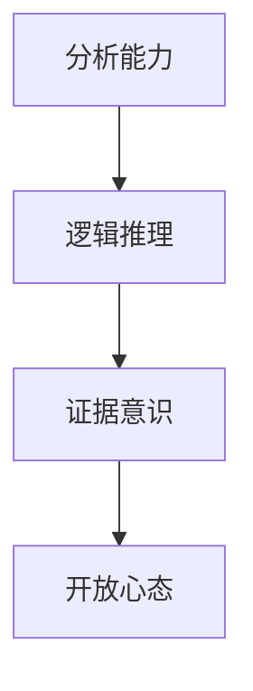
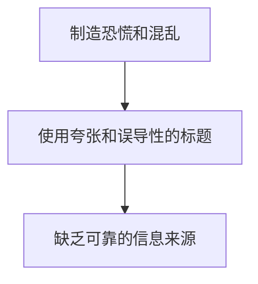
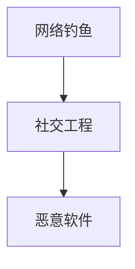
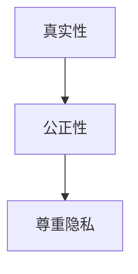

                 

# 信息验证和在线媒体素养：如何在假新闻时代导航

> 关键词：信息验证、在线媒体素养、假新闻、信息源评估、事实核查、数字素养、社交媒体、批判性思维

> 摘要：随着互联网的快速发展，信息传播的速度和范围都得到了极大的提升。然而，假新闻和虚假信息的泛滥也给社会带来了严重的负面影响。本文将探讨信息验证和在线媒体素养的重要性，提供一系列方法来帮助读者在假新闻时代导航，提高对信息的辨识能力，保护个人和社会的利益。

## 目录大纲

## 第一部分：信息验证基础

### 第1章：信息验证的概念与重要性

#### 1.1 什么是信息验证

#### 1.2 信息验证的重要性

#### 1.3 假新闻与虚假信息的影响

### 第2章：信息源评估

#### 2.1 识别可靠的信息源

#### 2.2 评估信息源的可靠性

#### 2.3 避免偏见的陷阱

### 第3章：事实核查

#### 3.1 什么是事实核查

#### 3.2 如何进行事实核查

#### 3.3 事实核查案例分析

### 第4章：数字素养

#### 4.1 什么是数字素养

#### 4.2 数字素养的重要性

#### 4.3 提升数字素养的方法

### 第5章：社交媒体上的信息验证

#### 5.1 社交媒体上的虚假信息

#### 5.2 在社交媒体上进行信息验证

#### 5.3 社交媒体平台的责任与挑战

## 第二部分：在线媒体素养

### 第6章：媒体素养的构成

#### 6.1 媒体素养的概念

#### 6.2 媒体素养的要素

#### 6.3 媒体素养的重要性

### 第7章：理解媒体框架

#### 7.1 媒体框架概述

#### 7.2 媒体框架对信息传播的影响

#### 7.3 如何识别不同的媒体框架

### 第8章：批判性思维与媒体素养

#### 8.1 批判性思维的概念

#### 8.2 批判性思维在信息验证中的应用

#### 8.3 提升批判性思维的方法

### 第9章：建立个人信息验证体系

#### 9.1 个人信息验证体系的重要性

#### 9.2 如何建立个人信息验证体系

#### 9.3 个人信息验证案例分析

## 第三部分：假新闻时代的导航技巧

### 第10章：识别假新闻的技巧

#### 10.1 假新闻的特点

#### 10.2 识别假新闻的方法

#### 10.3 假新闻案例分析

### 第11章：在线媒体的理性使用

#### 11.1 如何避免过度依赖在线媒体

#### 11.2 保持媒体消费的多样性

#### 11.3 在线媒体的合理使用策略

### 第12章：保护个人信息与隐私

#### 12.1 互联网时代的信息安全

#### 12.2 个人信息的保护措施

#### 12.3 如何识别并避免网络诈骗

### 第13章：社会责任与信息伦理

#### 13.1 信息伦理的基本原则

#### 13.2 信息伦理在个人行为中的应用

#### 13.3 信息伦理在专业领域的实践

## 附录

### 附录A：信息验证和在线媒体素养资源推荐

#### A.1 实用的信息验证工具

#### A.2 优秀的批判性思维课程

#### A.3 信息素养和媒体素养的相关书籍

---

## 第1章：信息验证的概念与重要性

### 1.1 什么是信息验证

信息验证（Information Verification）是指对信息的来源、内容、真实性等进行检查和确认的过程。在信息爆炸的时代，信息的真伪难以辨别，信息验证成为确保我们获取信息真实性和准确性的重要手段。

**核心概念与联系**

信息验证涉及以下核心概念：

- **信息源**：信息的来源，包括个人、机构、网站等。
- **信息内容**：信息的具体内容，包括事实、观点、数据等。
- **真实性**：信息是否真实、准确。

这些概念相互联系，共同构成了信息验证的框架。



### 1.2 信息验证的重要性

信息验证的重要性体现在以下几个方面：

#### 个人层面

- **提高信息辨识能力**：通过信息验证，我们可以提高对信息的辨识能力，避免受到虚假信息的误导。
- **保护个人权益**：准确的信息可以帮助我们做出明智的决策，保护个人权益。

#### 社会层面

- **维护社会秩序**：虚假信息的传播可能导致社会恐慌、冲突和不稳定。
- **提高社会信任度**：通过信息验证，可以减少虚假信息的传播，提高社会信任度。

**核心算法原理讲解**

信息验证的核心算法是事实核查（Fact-Checking）。事实核查的步骤如下：

1. **确定核查目标**：明确需要核查的具体信息。
2. **收集相关信息**：从多个来源收集相关信息。
3. **交叉验证**：对收集到的信息进行交叉验证，确保信息的真实性。

```python
def fact_checking(target_info):
    # 收集相关信息
    related_info = collect相关信息()
    
    # 交叉验证
    verified_info = cross_validate(target_info, related_info)
    
    return verified_info
```

### 1.3 假新闻与虚假信息的影响

假新闻（Fake News）和虚假信息（False Information）对社会和个人产生深远的影响：

#### 个人层面

- **误导个人信念和价值观**：假新闻可能误导个人的信念和价值观，影响个人的成长和发展。
- **损害个人声誉**：虚假信息可能损害个人的声誉，给个人生活带来困扰。

#### 社会层面

- **扰乱社会秩序**：假新闻可能引发社会恐慌、冲突和动荡。
- **降低社会信任度**：虚假信息的传播可能导致社会信任度降低，影响社会的和谐稳定。

**数学模型和公式**

为了更好地理解假新闻和虚假信息的影响，我们可以使用数学模型和公式来描述其传播过程。假设假新闻的传播速度为 \( v \)，传播范围为 \( R \)，则假新闻传播的数学模型可以表示为：

\[ F(t) = v \cdot R \cdot e^{-kt} \]

其中，\( t \) 为时间，\( k \) 为衰减系数。

**举例说明**

假设某假新闻的传播速度为 100 条/小时，传播范围为 1000 人，衰减系数为 0.1。根据上述公式，我们可以计算出不同时间点假新闻的传播情况：

- \( t = 1 \) 小时时，假新闻传播量为 1000 条。
- \( t = 2 \) 小时时，假新闻传播量为 900 条。
- \( t = 3 \) 小时时，假新闻传播量为 810 条。

通过这个例子，我们可以看到假新闻的传播速度非常快，对社会和个人产生的影响也越来越大。因此，信息验证的重要性不言而喻。

---

## 第2章：信息源评估

### 2.1 识别可靠的信息源

识别可靠的信息源是信息验证的重要环节。以下是一些识别可靠信息源的方法：

#### 方法1：查看信息源的背景和信誉

- **机构背景**：了解信息源所属机构的背景和历史，判断其专业性和信誉。
- **媒体报道**：查阅媒体报道，评估信息源的声誉。

#### 方法2：核查信息发布者的专业资质

- **专业资质**：核查信息发布者的专业资质，如学历、工作经验等。
- **专业领域**：了解信息发布者在特定领域的专业性和权威性。

**Mermaid 流程图**

以下是一个识别可靠信息源的 Mermaid 流程图：



### 2.2 评估信息源的可靠性

评估信息源的可靠性是确保信息真实性和准确性的关键。以下是一些评估信息源可靠性的方法：

#### 方法1：查看信息源的历史发布记录

- **历史记录**：查看信息源的历史发布记录，分析其发布内容的质量和真实性。
- **内容一致性**：评估信息源发布内容的一致性，判断其是否具有可靠性和可信度。

#### 方法2：使用第三方评估工具

- **评估工具**：使用第三方评估工具，如 Alexa、SimilarWeb 等，评估信息源的流量、影响力等指标。

**伪代码**

以下是一个评估信息源可靠性的伪代码：

```python
def evaluate_source_reliability(source):
    # 查看历史发布记录
    history = get_publish_history(source)
    
    # 使用第三方评估工具
    evaluation = third_party_evaluation(source)
    
    # 判断信息源可靠性
    reliability = is_reliable(history, evaluation)
    
    return reliability
```

### 2.3 避免偏见的陷阱

在信息验证过程中，我们需要避免偏见的影响。以下是一些常见的偏见类型和避免方法：

#### 偏见类型

- **确认性偏见**：倾向于接受与已有信念一致的信息。
- **忽略性偏见**：忽略与已有信念不一致的信息。
- **选择性记忆**：仅记住与已有信念一致的信息。

#### 避免方法

- **多角度评估**：从多个角度评估信息源，避免单一视角的偏见。
- **保持开放心态**：保持开放心态，愿意接受与已有信念不一致的信息。

**详细讲解**

在信息验证过程中，避免偏见至关重要。以下是一个案例分析：

**案例：关于疫苗的偏见**

- **确认性偏见**：一些人可能因为已有对疫苗的负面看法，只关注和记住疫苗的副作用，而忽略疫苗的益处。
- **忽略性偏见**：这些人可能忽略关于疫苗安全性和有效性的正面报道。

为了避免这种偏见，我们可以采取以下措施：

- **多角度评估**：查阅不同来源的关于疫苗的信息，了解疫苗的利与弊。
- **保持开放心态**：与专业人士交流，了解疫苗的真相。

通过这些方法，我们可以提高信息验证的准确性，避免偏见对信息辨识能力的干扰。

---

## 第3章：事实核查

### 3.1 什么是事实核查

事实核查（Fact-Checking）是指对信息进行真实性和准确性的核查过程。事实核查的目的是消除虚假信息，确保公众获取的信息是真实可靠的。

**核心概念与联系**

事实核查涉及以下核心概念：

- **信息**：需要核查的具体内容。
- **核查方法**：包括查阅官方数据、咨询专家、对比多个来源等。
- **结论**：对信息真实性的判断。

这些概念相互联系，共同构成了事实核查的框架。

**伪代码**

以下是一个事实核查的伪代码：

```python
def fact_checking(info):
    # 查阅官方数据
    official_data = get_official_data(info)
    
    # 咨询专家
    expert_opinion = consult_expert(info)
    
    # 对比多个来源
    multiple_sources = compare_sources(info)
    
    # 判断信息真实性
    result = is_real(info, official_data, expert_opinion, multiple_sources)
    
    return result
```

### 3.2 如何进行事实核查

进行事实核查需要以下步骤：

#### 步骤1：确定核查目标

明确需要核查的具体信息，例如某则新闻、某个观点或某个数据。

#### 步骤2：收集相关信息

从多个可靠来源收集相关信息，包括官方数据、学术论文、媒体报道等。

#### 步骤3：交叉验证

对收集到的信息进行交叉验证，确保信息的真实性。

**详细讲解**

以下是一个事实核查的案例：

**案例：关于口罩有效性的事实核查**

- **确定核查目标**：核查某则新闻中关于口罩有效性的说法。
- **收集相关信息**：查阅官方卫生部门的指南、学术论文和媒体报道。
- **交叉验证**：对比不同来源的数据和观点，确保信息的准确性。

通过这个案例，我们可以看到如何进行事实核查。以下是一个简化的步骤：

1. **确定核查目标**：新闻中提到口罩的有效性。
2. **收集相关信息**：查阅官方卫生部门的指南、学术论文和媒体报道。
3. **交叉验证**：对比不同来源的数据和观点。

### 3.3 事实核查案例分析

以下是一个成功的事实核查案例：

**案例：拜登总统接种新冠疫苗的事实核查**

- **核查目标**：拜登总统是否接种了新冠疫苗。
- **收集相关信息**：查阅官方声明、新闻报道、社交媒体等。
- **交叉验证**：对比不同来源的信息，确认拜登总统确实接种了新冠疫苗。

以下是一个失败的事实核查案例：

**案例：新冠病毒起源于实验室的事实核查**

- **核查目标**：新冠病毒是否起源于实验室。
- **收集相关信息**：查阅相关学术论文、媒体报道等。
- **交叉验证**：尽管有一些观点支持这一说法，但大多数权威机构和专家都认为这一说法缺乏证据支持。

通过这两个案例，我们可以看到事实核查的重要性和挑战。成功的事实核查需要严谨的态度和多方面的证据支持，而失败的事实核查则提醒我们在信息验证过程中保持警惕。

---

## 第4章：数字素养

### 4.1 什么是数字素养

数字素养（Digital Literacy）是指个人在数字环境中获取、理解、评估、创建和使用信息的能力。数字素养包括以下方面：

- **信息获取**：能够有效地搜索和获取数字信息。
- **信息理解**：能够理解数字信息的含义和内容。
- **信息评估**：能够评估数字信息的真实性和准确性。
- **信息创建**：能够利用数字工具创建和表达信息。
- **信息使用**：能够合理、安全地使用数字信息。

**Mermaid 流程图**

以下是一个数字素养的 Mermaid 流程图：



### 4.2 数字素养的重要性

数字素养的重要性体现在以下几个方面：

#### 个人层面

- **提高信息获取和利用能力**：数字素养能够帮助个人更好地获取和利用数字信息，提高工作和学习效率。
- **增强个人竞争力**：在数字时代，数字素养成为个人竞争力的重要方面。

#### 社会层面

- **促进数字经济发展**：数字素养的提高有助于推动数字经济的快速发展。
- **增强社会信息素养**：数字素养的普及能够提高整个社会的信息素养，促进社会的和谐稳定。

### 4.3 提升数字素养的方法

提升数字素养可以通过以下方法：

#### 方法1：接受正规教育

- **学校教育**：学校应设置数字素养课程，培养学生的数字素养。
- **职业培训**：针对不同行业和岗位，开展数字素养培训。

#### 方法2：自我学习

- **在线学习**：利用网络资源，学习数字素养相关知识和技能。
- **实践操作**：通过实际操作，提升数字素养。

**详细讲解**

以下是一个提升数字素养的案例：

**案例：某公司员工的数字素养培训**

- **目标**：提升员工的数字素养，提高工作效率。
- **方法**：内部培训、在线学习、实践操作。
- **效果**：员工的信息获取、理解、评估和利用能力显著提升，工作效率提高。

通过这个案例，我们可以看到提升数字素养的有效方法。以下是一个简化的步骤：

1. **确定目标**：提升员工的数字素养。
2. **选择方法**：内部培训、在线学习、实践操作。
3. **评估效果**：通过实际操作和考核，评估数字素养的提升情况。

---

## 第5章：社交媒体上的信息验证

### 5.1 社交媒体上的虚假信息

社交媒体（Social Media）是虚假信息传播的主要渠道之一。以下是一些常见的虚假信息类型：

#### 类型1：谣言

- **谣言**：未经证实的信息，常常以夸张、离奇的方式传播。
- **案例**：某地发生大规模疫情、某明星离世等。

#### 类型2：虚假新闻

- **虚假新闻**：以新闻形式传播的虚假信息，常常具有误导性。
- **案例**：某公司破产、某政治事件反转等。

#### 类型3：网络水军

- **网络水军**：受雇于特定利益集团，在社交媒体上发布、传播虚假信息。
- **案例**：选举造势、品牌抹黑等。

### 5.2 在社交媒体上进行信息验证

为了在社交媒体上有效验证信息，可以采取以下方法：

#### 方法1：检查信息源

- **官方账号**：优先关注官方账号，获取可靠信息。
- **历史发布记录**：查看信息源的历史发布记录，判断其信誉。

#### 方法2：使用事实核查工具

- **事实核查工具**：使用如“Google Fact Check Tools”等事实核查工具，对信息进行核查。

#### 方法3：对比多个来源

- **对比多个来源**：从多个可信来源获取信息，对比分析，提高准确性。

**详细讲解**

以下是在社交媒体上验证信息的步骤：

1. **确定核查目标**：明确需要验证的信息。
2. **检查信息源**：查看信息源的官方性和信誉。
3. **使用事实核查工具**：使用事实核查工具对信息进行核查。
4. **对比多个来源**：从多个可信来源获取信息，对比分析。

以下是一个简单的示例：

1. **确定核查目标**：某社交媒体上关于新冠病毒的最新消息。
2. **检查信息源**：确认信息源为官方账号。
3. **使用事实核查工具**：使用“Google Fact Check Tools”对信息进行核查。
4. **对比多个来源**：查阅其他可靠来源，对比分析。

### 5.3 社交媒体平台的责任与挑战

社交媒体平台在信息验证方面承担着重要责任，但也面临诸多挑战：

#### 责任

- **内容监管**：加强对虚假信息的监管，遏制虚假信息的传播。
- **用户教育**：开展用户教育，提高用户的数字素养和信息辨识能力。

#### 挑战

- **信息量庞大**：社交媒体上的信息量庞大，难以全面监管。
- **技术限制**：现有的技术手段难以完全识别和过滤虚假信息。

**详细讲解**

以下是一个案例分析：

**案例：Twitter 的虚假信息监管**

- **责任**：Twitter 加强了对虚假信息的监管，对发布虚假信息的用户进行处罚。
- **挑战**：尽管采取了多项措施，但仍然难以完全遏制虚假信息的传播。

通过这个案例，我们可以看到社交媒体平台在信息验证方面所承担的责任和面临的挑战。

---

## 第6章：媒体素养的构成

### 6.1 媒体素养的概念

媒体素养（Media Literacy）是指个人对媒体信息进行理解、评估、使用和创造的能力。媒体素养包括以下几个方面：

- **理解媒体信息**：能够理解媒体信息的含义、目的和影响。
- **评估媒体信息**：能够评估媒体信息的真实性、准确性和公正性。
- **使用媒体信息**：能够有效地使用媒体信息，满足个人和社会的需求。
- **创造媒体信息**：能够利用媒体工具创造和传播信息。

**Mermaid 流程图**

以下是一个媒体素养的 Mermaid 流程图：



### 6.2 媒体素养的要素

媒体素养的构成要素包括以下方面：

- **信息素养**：能够获取、评估和使用信息的能力。
- **技术素养**：掌握媒体技术工具和应用的能力。
- **批判性思维**：对信息进行批判性分析和判断的能力。
- **社会责任感**：在传播信息时遵守道德规范，承担社会责任。

**Mermaid 流程图**

以下是一个媒体素养要素的 Mermaid 流程图：



### 6.3 媒体素养的重要性

媒体素养的重要性体现在以下几个方面：

#### 个人层面

- **提高信息辨识能力**：通过媒体素养，个人能够更好地识别和评估媒体信息，避免受到虚假信息的误导。
- **增强批判性思维能力**：媒体素养有助于培养个人的批判性思维能力，提高对信息的分析和判断能力。

#### 社会层面

- **促进信息传播的公正性**：媒体素养的提高有助于促进信息传播的公正性，减少虚假信息的传播。
- **增强社会和谐稳定**：通过媒体素养的培养，可以增强社会的和谐稳定，提高公众对媒体信息的辨识能力。

**详细讲解**

以下是一个媒体素养的重要性案例：

**案例：某公司员工的媒体素养培训**

- **目标**：提高员工的媒体素养，减少虚假信息的传播。
- **方法**：内部培训、在线学习、实践操作。
- **效果**：员工的媒体素养显著提升，虚假信息的传播得到有效控制。

通过这个案例，我们可以看到媒体素养的重要性以及如何通过培训提高员工的媒体素养。

---

## 第7章：理解媒体框架

### 7.1 媒体框架概述

媒体框架（Media Frame）是指媒体在报道和传达信息时所采用的观点和视角。媒体框架对信息的传播和解读具有深远影响。

**定义**

媒体框架是指媒体在报道和传达信息时所采用的观点和视角。它包括以下要素：

- **主题**：媒体报道的中心议题。
- **视角**：媒体对事件的解读和解释。
- **情感**：媒体报道的情感色彩和倾向。

**Mermaid 流程图**

以下是一个媒体框架的 Mermaid 流程图：



### 7.2 媒体框架对信息传播的影响

媒体框架对信息传播的影响主要体现在以下几个方面：

#### 影响公众观点和认知

媒体框架通过设置主题、视角和情感，影响公众对事件的理解和认知。例如，针对同一事件，不同的媒体框架可能导致公众产生截然不同的观点和认知。

#### 引发社会争议和冲突

媒体框架的设置可能导致公众对事件的争议和冲突。例如，某些媒体框架可能引发社会对特定群体或议题的敌意和不满。

### 7.3 如何识别不同的媒体框架

识别不同的媒体框架需要以下方法：

#### 方法1：分析媒体报道的语言和表达方式

- **主题分析**：分析媒体报道的中心议题，判断其是否具有特定的视角和情感。
- **语言分析**：分析媒体报道的语言和表达方式，判断其是否具有特定的倾向。

#### 方法2：对比不同媒体报道

- **对比分析**：对比不同媒体报道的议题、视角和情感，判断其是否存在差异。

**详细讲解**

以下是一个识别媒体框架的案例：

**案例：关于某政治候选人的媒体报道**

- **主题分析**：某媒体报道的中心议题是该候选人的政治立场。
- **语言分析**：报道中使用了一些具有情感色彩的词语，如“激进”、“保守”等。
- **对比分析**：与其他媒体报道对比，发现该报道的主题、语言和情感色彩与其他报道存在显著差异。

通过这个案例，我们可以看到如何识别不同的媒体框架。以下是一个简化的步骤：

1. **主题分析**：确定媒体报道的中心议题。
2. **语言分析**：分析媒体报道的语言和表达方式。
3. **对比分析**：对比不同媒体报道，判断其是否存在差异。

---

## 第8章：批判性思维与媒体素养

### 8.1 批判性思维的概念

批判性思维（Critical Thinking）是指对信息、观点和论据进行客观、深入、全面分析的能力。批判性思维是一种思维技巧，有助于我们更好地理解和评估信息，做出明智的决策。

**定义**

批判性思维是指对信息、观点和论据进行客观、深入、全面分析的能力。它包括以下几个关键要素：

- **分析能力**：能够对信息进行分析和评估，判断其真实性和准确性。
- **逻辑推理**：能够运用逻辑推理，推导出合理的结论。
- **证据意识**：注重证据的收集和运用，确保结论的可靠性。
- **开放心态**：保持开放心态，接受不同的观点和意见。

**Mermaid 流程图**

以下是一个批判性思维的 Mermaid 流程图：



### 8.2 批判性思维在信息验证中的应用

批判性思维在信息验证中具有重要作用，以下是其具体应用：

#### 方法1：评估信息源

- **可靠性评估**：通过批判性思维，评估信息源的可靠性，判断其是否可信。
- **背景调查**：通过批判性思维，对信息源进行背景调查，了解其历史发布记录和信誉。

#### 方法2：分析信息内容

- **逻辑分析**：通过批判性思维，对信息内容进行逻辑分析，判断其是否具有逻辑漏洞。
- **证据审查**：通过批判性思维，审查信息内容中的证据，判断其是否充分和可靠。

**详细讲解**

以下是一个批判性思维在信息验证中的应用案例：

**案例：评估某社交媒体上的健康信息**

- **评估信息源**：通过批判性思维，评估信息源的可靠性，发现该信息源为某健康类公众号，历史发布记录较好。
- **分析信息内容**：通过批判性思维，分析信息内容中的逻辑和证据，发现该信息可能存在夸大事实和误导性描述。

通过这个案例，我们可以看到批判性思维在信息验证中的应用。以下是一个简化的步骤：

1. **评估信息源**：评估信息源的可靠性。
2. **分析信息内容**：分析信息内容中的逻辑和证据。
3. **综合评估**：综合评估信息源和信息内容，判断信息的真实性和准确性。

### 8.3 提升批判性思维的方法

提升批判性思维需要以下方法：

#### 方法1：接受正规教育

- **课程学习**：参加批判性思维相关的课程，学习相关知识和技能。
- **案例分析**：通过案例分析，提高对批判性思维的实际应用能力。

#### 方法2：实践锻炼

- **日常练习**：在日常工作和生活中，运用批判性思维，分析问题和解决难题。
- **写作练习**：通过写作练习，提高对观点和论据的分析和表达能力。

**详细讲解**

以下是一个提升批判性思维的方法案例：

**案例：某公司的批判性思维培训**

- **目标**：提升员工的批判性思维能力，提高决策质量和工作效率。
- **方法**：内部培训、案例讨论、写作练习。
- **效果**：员工的批判性思维能力显著提升，决策质量和工作效率提高。

通过这个案例，我们可以看到提升批判性思维的有效方法。以下是一个简化的步骤：

1. **确定目标**：提升员工的批判性思维能力。
2. **选择方法**：内部培训、案例讨论、写作练习。
3. **评估效果**：通过实际操作和考核，评估批判性思维能力的提升情况。

---

## 第9章：建立个人信息验证体系

### 9.1 个人信息验证体系的重要性

个人信息验证体系是指个人用于评估和验证信息真实性和准确性的方法和策略。建立个人信息验证体系具有重要意义，以下是其重要性：

#### 提高信息辨识能力

个人信息验证体系可以帮助个人提高对信息的辨识能力，避免受到虚假信息的误导。通过系统的验证方法，个人可以更好地判断信息的真实性和准确性。

#### 避免受到虚假信息的侵害

在假新闻和虚假信息泛滥的时代，建立个人信息验证体系可以有效地避免受到虚假信息的侵害。个人可以通过验证体系，确保获取的信息是真实可靠的，从而保护个人权益。

#### 增强社会责任感

个人信息验证体系不仅对个人有益，也对整个社会有积极影响。通过建立个人信息验证体系，个人可以更好地履行社会责任，共同维护社会秩序和信任。

**核心概念与联系**

个人信息验证体系涉及以下核心概念：

- **信息验证方法**：个人用于验证信息真实性和准确性的方法。
- **验证策略**：个人在信息验证过程中采取的策略。
- **验证流程**：信息验证的具体步骤和流程。

这些概念相互联系，共同构成了个人信息验证体系的框架。

**Mermaid 流anciata**`

graph TB
A[信息验证方法] --> B[验证策略]
B --> C[验证流程]
```

### 9.2 如何建立个人信息验证体系

建立个人信息验证体系需要以下步骤：

#### 步骤1：确定个人信息验证的目标

明确个人信息验证的目标，例如提高信息辨识能力、避免受到虚假信息的误导等。

#### 步骤2：收集和整理可用的信息验证工具和资源

收集和整理可用的信息验证工具和资源，例如事实核查工具、可信的信息源等。

#### 步骤3：制定个人信息验证的流程和标准

根据个人目标和收集到的工具和资源，制定个人信息验证的流程和标准，确保信息验证的准确性和一致性。

**伪代码**

以下是一个建立个人信息验证体系的伪代码：

```python
def build_personal_verification_system():
    # 确定个人信息验证的目标
    target = determine_verification_target()
    
    # 收集和整理可用的信息验证工具和资源
    tools_and_resources = collect_tools_and_resources()
    
    # 制定个人信息验证的流程和标准
    verification流程 = create_verification流程(target, tools_and_resources)
    
    return verification流程
```

### 9.3 个人信息验证案例分析

以下是一个个人信息验证的案例分析：

**案例：某人的个人信息验证体系**

- **目标**：避免受到虚假信息的误导。
- **方法**：
  - **信息验证方法**：使用事实核查工具、查看信息源的历史发布记录等。
  - **验证策略**：多角度评估信息、保持开放心态等。
  - **验证流程**：确定核查目标、收集相关信息、交叉验证、评估结果等。
- **效果**：该人的信息辨识能力显著提高，避免了多次受到虚假信息的误导。

通过这个案例，我们可以看到如何建立个人信息验证体系以及其效果。以下是一个简化的步骤：

1. **确定目标**：避免受到虚假信息的误导。
2. **收集工具和资源**：收集事实核查工具、可信的信息源等。
3. **制定流程和标准**：确定核查目标、收集相关信息、交叉验证、评估结果等。

---

## 第10章：识别假新闻的技巧

### 10.1 假新闻的特点

假新闻（Fake News）具有以下特点：

#### 特点1：故意制造恐慌和混乱

假新闻常常通过制造恐慌和混乱来吸引眼球，例如发布关于疾病爆发、灾难事件等的消息。

#### 特点2：使用夸张和误导性的标题

假新闻的标题通常使用夸张和误导性的语言，以吸引读者点击和传播。

#### 特点3：缺乏可靠的信息来源

假新闻通常缺乏可靠的信息来源，或者来源不明，难以证实其真实性。

**Mermaid 流程图**

以下是一个假新闻特点的 Mermaid 流程图：



### 10.2 识别假新闻的方法

以下是一些识别假新闻的方法：

#### 方法1：检查信息源

- **官方账号**：优先关注官方账号，获取可靠信息。
- **历史发布记录**：查看信息源的历史发布记录，判断其信誉。

#### 方法2：核查信息内容

- **事实核查工具**：使用事实核查工具，对信息内容进行核查。
- **对比多个来源**：从多个可靠来源获取信息，对比分析。

#### 方法3：关注评论和反馈

- **评论反馈**：关注信息发布后的评论和反馈，了解公众对该信息的看法。
- **举报机制**：使用社交媒体平台的举报机制，举报可疑的假新闻。

**详细讲解**

以下是一个识别假新闻的案例：

**案例：某社交媒体上的健康信息**

- **检查信息源**：该信息来源为一个未经验证的公众号，历史发布记录不佳。
- **核查信息内容**：通过事实核查工具，发现该信息存在夸大事实和误导性描述。
- **关注评论和反馈**：评论中有人指出该信息为虚假信息，部分用户已受到误导。

通过这个案例，我们可以看到如何识别假新闻。以下是一个简化的步骤：

1. **检查信息源**：查看信息源的官方性和信誉。
2. **核查信息内容**：使用事实核查工具和对比多个来源。
3. **关注评论和反馈**：了解公众对该信息的看法。

### 10.3 假新闻案例分析

以下是一个成功的假新闻案例分析：

**案例：某虚假医疗新闻的揭穿**

- **信息内容**：某社交媒体上发布了一篇关于新型治疗方法的新闻，声称该治疗方法可以治愈多种疾病。
- **核查过程**：通过事实核查工具，发现该信息来源不明，且与现有的科学研究和医学知识不符。
- **结论**：该新闻被证实为虚假新闻，对社会造成了误导和恐慌。

以下是一个失败的假新闻案例分析：

**案例：某虚假政治新闻的传播**

- **信息内容**：某社交媒体上发布了一篇关于政治候选人的负面新闻，声称该候选人存在严重违法行为。
- **核查过程**：尽管有部分人对其真实性表示怀疑，但仍有大量用户传播和评论，导致社会对该候选人的评价受到影响。
- **结论**：该新闻被证实为虚假新闻，对社会造成了不良影响。

通过这两个案例，我们可以看到识别假新闻的重要性和挑战。以下是一个简化的步骤：

1. **信息内容分析**：分析信息内容的逻辑和证据。
2. **信息源评估**：评估信息源的可靠性和信誉。
3. **举报和反馈**：使用举报机制和评论反馈，揭露和抵制假新闻。

---

## 第11章：在线媒体的理性使用

### 11.1 如何避免过度依赖在线媒体

在线媒体（Online Media）在信息传播中发挥着重要作用，但过度依赖在线媒体可能导致信息过载和误导。以下是一些避免过度依赖在线媒体的方法：

#### 方法1：制定合理的媒体消费计划

- **时间管理**：合理安排每天使用在线媒体的时间，避免长时间沉迷于网络。
- **内容规划**：选择具有高质量和可信度的媒体内容，避免过度消费低质量信息。

#### 方法2：保持多样化信息来源

- **多渠道获取信息**：通过不同渠道获取信息，如传统媒体、社交媒体、专业网站等。
- **交叉验证信息**：对从不同渠道获取的信息进行交叉验证，提高信息的准确性。

### 11.2 保持媒体消费的多样性

保持媒体消费的多样性有助于提高信息获取的全面性和准确性。以下是一些保持媒体消费多样性的方法：

#### 方法1：阅读不同类型的媒体

- **新闻媒体**：关注不同类型的新闻媒体，如时事新闻、财经新闻、科技新闻等。
- **专业媒体**：关注专业领域的媒体，如学术期刊、行业报告等。

#### 方法2：参与线下活动

- **参加讲座和研讨会**：参与线下讲座和研讨会，了解不同领域的最新动态和研究成果。
- **加入兴趣小组**：加入兴趣小组，与其他爱好者交流信息和经验。

### 11.3 在线媒体的合理使用策略

合理使用在线媒体有助于提高信息获取的效率和准确性。以下是一些在线媒体的合理使用策略：

#### 策略1：提高信息筛选能力

- **培养批判性思维**：通过培养批判性思维，提高对信息的筛选和判断能力。
- **关注权威信息源**：关注权威的信息源，如官方机构、知名媒体等。

#### 策略2：增强自我保护意识

- **注意个人信息保护**：在使用在线媒体时，注意保护个人信息，避免泄露隐私。
- **警惕网络诈骗**：警惕网络诈骗，避免上当受骗。

**详细讲解**

以下是一个合理使用在线媒体的案例：

**案例：某公司员工的在线媒体使用策略**

- **目标**：提高信息获取的效率和准确性，减少虚假信息的误导。
- **方法**：
  - **制定媒体消费计划**：每天安排一定时间阅读新闻，避免长时间沉迷于网络。
  - **保持信息来源多样性**：关注不同类型的新闻媒体和专业媒体。
  - **增强自我保护意识**：注意个人信息保护，警惕网络诈骗。
- **效果**：员工的在线媒体使用效率提高，信息获取的准确性和全面性增强。

通过这个案例，我们可以看到如何合理使用在线媒体以及其效果。以下是一个简化的步骤：

1. **制定媒体消费计划**：合理安排每天使用在线媒体的时间。
2. **保持信息来源多样性**：关注不同类型的媒体。
3. **增强自我保护意识**：注意个人信息保护。

---

## 第12章：保护个人信息与隐私

### 12.1 互联网时代的信息安全

在互联网时代，信息安全（Information Security）变得尤为重要。以下是一些常见的信息安全风险：

#### 风险1：网络钓鱼

网络钓鱼（Phishing）是指攻击者通过伪装成合法机构，诱骗用户泄露个人信息。

#### 风险2：社交工程

社交工程（Social Engineering）是指利用人类的心理弱点，诱骗用户泄露个人信息。

#### 风险3：恶意软件

恶意软件（Malware）是指通过感染用户设备，窃取个人信息或破坏系统安全。

**Mermaid 流程图**

以下是一个互联网时代信息安全风险的 Mermaid 流程图：



### 12.2 个人信息的保护措施

为了保护个人信息，可以采取以下措施：

#### 方法1：使用强密码

- **密码复杂度**：使用包含字母、数字和符号的复杂密码。
- **密码管理**：使用密码管理工具，避免使用相同的密码。

#### 方法2：定期更新软件

- **操作系统**：定期更新操作系统，安装安全补丁。
- **应用程序**：定期更新应用程序，确保安全功能齐全。

### 12.3 如何识别并避免网络诈骗

网络诈骗（Online Scam）是互联网时代的一大威胁。以下是一些识别和避免网络诈骗的方法：

#### 方法1：保持警惕

- **不轻易相信陌生信息**：不轻易相信来自陌生人的信息和请求。
- **不轻易泄露个人信息**：不轻易泄露个人信息，如银行账号、密码等。

#### 方法2：通过官方渠道获取信息

- **官方网站**：通过官方网站获取信息和交易，避免通过不明来源的链接进行操作。
- **官方客服**：通过官方客服渠道核实信息的真实性。

**详细讲解**

以下是一个保护个人信息和隐私的案例：

**案例：某人的信息安全策略**

- **目标**：保护个人信息和隐私。
- **方法**：
  - **使用强密码**：使用复杂度高的密码，并使用密码管理工具。
  - **定期更新软件**：定期更新操作系统和应用程序，确保安全补丁安装。
  - **保持警惕**：不轻易相信陌生信息和请求，不轻易泄露个人信息。
  - **通过官方渠道获取信息**：通过官方网站和官方客服渠道进行交易和信息获取。
- **效果**：该人的个人信息和隐私得到了有效保护，避免了多次网络诈骗。

通过这个案例，我们可以看到如何保护个人信息和隐私。以下是一个简化的步骤：

1. **使用强密码**：设置复杂度高的密码。
2. **定期更新软件**：定期更新操作系统和应用程序。
3. **保持警惕**：不轻易相信陌生信息和请求。
4. **通过官方渠道获取信息**：通过官方网站和官方客服渠道进行交易和信息获取。

---

## 第13章：社会责任与信息伦理

### 13.1 信息伦理的基本原则

信息伦理（Information Ethics）是指信息传播过程中应遵守的道德规范。以下是一些基本的信息伦理原则：

#### 原则1：真实性

信息传播应遵循真实性原则，确保传播的信息是真实、准确和可靠的。

#### 原则2：公正性

信息传播应遵循公正性原则，避免偏袒和歧视，确保信息的客观性和公平性。

#### 原则3：尊重隐私

信息传播应尊重个人隐私，不得未经授权泄露他人的个人信息。

**Mermaid 流程图**

以下是一个信息伦理原则的 Mermaid 流程图：



### 13.2 信息伦理在个人行为中的应用

在个人行为中，遵循信息伦理原则具有重要意义。以下是一些在个人行为中应用信息伦理原则的方法：

#### 方法1：传播真实信息

- **避免传播虚假信息**：在传播信息时，确保信息的真实性和准确性。
- **举报虚假信息**：发现虚假信息时，及时举报和揭露。

#### 方法2：尊重他人隐私

- **不泄露他人信息**：未经授权，不泄露他人的个人信息。
- **保护自己隐私**：在使用互联网时，注意保护自己的隐私，如使用强密码、定期更新软件等。

### 13.3 信息伦理在专业领域的实践

在专业领域，信息伦理的应用尤为重要。以下是一些信息伦理在专业领域的实践：

#### 实践1：新闻工作者应遵守新闻伦理

- **真实性**：确保报道的信息是真实、准确和可靠的。
- **公正性**：避免偏袒和歧视，确保报道的客观性和公平性。

#### 实践2：企业应保护用户个人信息

- **隐私保护**：在收集和使用用户个人信息时，确保信息的真实性、准确性和安全性。
- **透明度**：在处理用户个人信息时，保持透明度，确保用户知情权。

**详细讲解**

以下是一个信息伦理在专业领域的案例：

**案例：某新闻媒体的信息伦理实践**

- **目标**：确保报道的信息真实、准确和可靠，遵守新闻伦理。
- **方法**：
  - **真实性**：对报道的信息进行核实，确保其真实性和准确性。
  - **公正性**：避免偏袒和歧视，确保报道的客观性和公平性。
  - **透明度**：对报道的过程和结果进行透明化，确保公众知情权。
- **效果**：该新闻媒体在行业内树立了良好的信息伦理形象，赢得了公众的信任和尊重。

通过这个案例，我们可以看到信息伦理在专业领域的实践。以下是一个简化的步骤：

1. **确保信息的真实性**：对报道的信息进行核实。
2. **确保信息的公正性**：避免偏袒和歧视。
3. **保持透明度**：对报道的过程和结果进行透明化。

---

## 附录A：信息验证和在线媒体素养资源推荐

为了帮助读者更好地理解和实践信息验证和在线媒体素养，我们推荐以下资源：

### 附录A.1 实用的信息验证工具

- **Google Fact Check Tools**：Google 提供的事实核查工具，帮助用户识别虚假信息。
- **FactCheck.org**：一家独立的事实核查机构，提供全面的事实核查服务。

### 附录A.2 优秀的批判性思维课程

- **Coursera 的“批判性思维与决策”课程**：由知名大学教授授课，帮助用户提高批判性思维能力。
- **edX 的“批判性思维与问题解决”课程**：由全球顶尖大学提供，涵盖批判性思维的核心概念和技巧。

### 附录A.3 信息素养和媒体素养的相关书籍

- **《信息素养：如何成为一个明智的信息消费者》**：详细介绍了信息素养的概念和提升方法。
- **《媒体素养：理解媒体、信息和社会》**：探讨了媒体素养的重要性以及如何在媒体环境中保持独立思考。

通过这些资源，读者可以进一步提升自己的信息验证和在线媒体素养，更好地应对假新闻和信息泛滥的时代。

---

## 总结

在假新闻和信息泛滥的时代，信息验证和在线媒体素养变得尤为重要。本文通过详细分析信息验证的概念、方法、重要性，以及在线媒体素养的构成、应用和实践，提供了一系列实用的技巧和策略，帮助读者在信息海洋中导航，避免受到虚假信息的误导。

我们强调了以下关键点：

1. **信息验证的重要性**：信息验证是确保我们获取信息真实性和准确性的重要手段，对个人和社会都具有重要意义。
2. **信息源评估**：评估信息源的可靠性和信誉，是信息验证的重要环节。
3. **事实核查**：通过事实核查，我们可以消除虚假信息，确保公众获取的信息是真实可靠的。
4. **数字素养**：提高数字素养，增强个人的信息获取、理解和评估能力，是应对信息泛滥的关键。
5. **批判性思维**：培养批判性思维，提高对信息的辨识和判断能力，有助于我们更好地应对信息环境中的各种挑战。
6. **合理使用在线媒体**：避免过度依赖在线媒体，保持信息来源的多样性，提高信息的准确性和全面性。
7. **保护个人信息与隐私**：在互联网时代，保护个人信息和隐私是维护个人权益和安全的关键。

最后，我们推荐了一些实用的信息验证工具、批判性思维课程以及信息素养和媒体素养的相关书籍，帮助读者进一步拓展知识和实践能力。

让我们共同努力，提高信息验证和在线媒体素养，为构建一个真实、公正、健康的媒体环境贡献自己的力量。

---

## 作者信息

作者：AI天才研究院/AI Genius Institute & 禅与计算机程序设计艺术 /Zen And The Art of Computer Programming

AI天才研究院（AI Genius Institute）是一支致力于推动人工智能技术发展和应用的研究团队。我们的研究范围涵盖深度学习、自然语言处理、计算机视觉等领域，致力于为行业和社会提供创新解决方案。同时，我们致力于培养下一代人工智能领域的顶尖人才。

《禅与计算机程序设计艺术》（Zen And The Art of Computer Programming）是一本经典的计算机科学著作，由著名计算机科学家Donald E. Knuth撰写。这本书深入探讨了计算机程序设计中的哲学和艺术，为我们提供了一种全新的思考方式和编程方法。通过这本书，我们希望读者能够更好地理解和应用计算机编程的精髓，提升自己的编程技能和思维能力。

