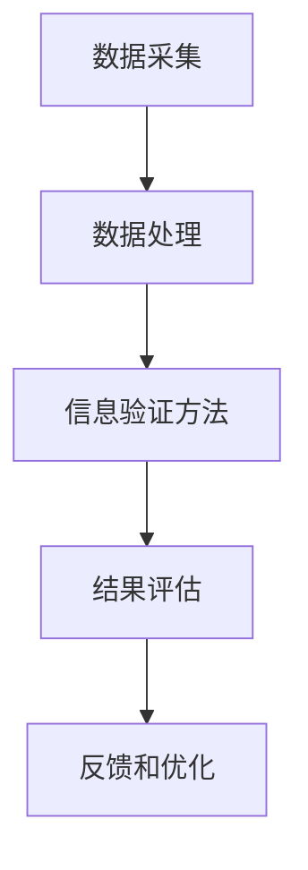
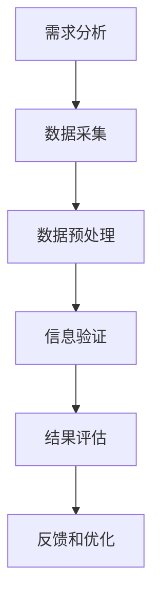

                 

# 信息验证和数字素养技能：为信息时代培养信息素养和批判性思维能力

> 关键词：信息验证，数字素养，信息素养，批判性思维能力，信息时代，技术技能，教育

> 摘要：本文旨在探讨信息验证和数字素养技能在信息时代的重要性，阐述其核心概念、发展历程和应用场景。通过逐步分析信息验证的基本流程、技术原理以及数字素养的构成和培养方法，本文提出了一系列策略，以提升个体的信息素养和批判性思维能力。文章结合实际案例，展示了信息验证与数字素养在不同领域的应用，并展望了未来的发展趋势与挑战。

## 引言

随着互联网和信息技术的飞速发展，信息时代已经悄然到来。在这一背景下，信息验证和数字素养技能的重要性愈发凸显。信息验证是指对信息的真实性、准确性和可靠性的验证过程，是应对信息过载和信息污染的重要手段。数字素养则是指个体在数字环境中获取、处理、评估和利用信息的能力，是适应信息化社会的基本素养。信息验证和数字素养技能不仅关乎个人信息的真实性和安全性，还直接影响到社会的信任度和稳定度。

本文将从以下几个方面展开讨论：

1. **信息验证概述**：介绍信息验证的重要性、与数字素养的关系、历史发展及其技术框架。
2. **数字素养技能**：阐述数字素养的概念、核心技能、培养方法及其应用。
3. **信息验证方法**：详细分析信息验证的基本流程、技术手段和工具使用。
4. **信息验证技术原理**：探讨数据挖掘、机器学习和数据库技术在信息验证中的应用。
5. **数字素养培养策略**：讨论教育体系、企业和家庭中数字素养的培养策略。
6. **信息验证与数字素养案例研究**：分析社交媒体、电子商务、新闻媒体和人工智能领域的实际案例。
7. **未来展望与挑战**：探讨信息验证和数字素养技术的未来发展、教育挑战及社会作用。

通过逐步分析推理，本文希望为信息时代培养信息素养和批判性思维能力提供有益的思考和策略。

## 第1章 信息验证概述

### 1.1 信息验证的重要性

信息验证在现代社会中扮演着至关重要的角色。随着互联网的普及，信息传播的速度和范围前所未有，这使得信息的真实性、准确性和可靠性变得尤为关键。信息验证的重要性体现在以下几个方面：

首先，信息验证有助于维护社会信任。在信息过载的时代，虚假信息和误导性信息的存在可能导致公众对信息的信任度下降，进而影响社会的稳定。通过信息验证，可以确保信息的真实性，提高公众对信息的信任度，从而维护社会的信任基础。

其次，信息验证对个人隐私保护至关重要。随着个人信息的广泛应用，个人隐私泄露的风险不断增加。信息验证可以帮助识别和防止个人隐私信息的泄露，保护个人隐私不被滥用。

第三，信息验证在商业和经济领域具有重要价值。在电子商务、金融交易等领域，准确的信息是确保交易安全和交易成功的关键。通过信息验证，可以确保交易信息的真实性和可靠性，降低交易风险，提高商业活动的效率。

### 1.2 信息验证与数字素养的关系

数字素养是信息时代的基本素养，它涉及个体在数字环境中获取、处理、评估和利用信息的能力。信息验证作为数字素养的一个重要组成部分，与数字素养有着密切的关系。

首先，信息验证是数字素养的核心技能之一。个体需要具备信息验证的能力，以识别和评估信息的真实性、准确性和可靠性。这种能力不仅有助于个体在数字环境中做出正确的决策，还能防止个体受到虚假信息和误导性信息的影响。

其次，信息验证与数字素养的其他技能密切相关。例如，信息搜索技能、信息评估技能和信息管理技能都是信息验证的重要组成部分。这些技能共同构成了个体在数字环境中应对信息挑战的能力。

### 1.3 信息验证的历史发展

信息验证的历史可以追溯到古代文献的校对和核实。在印刷术发明之前，文献的传播主要依赖于手抄，这为信息的真实性和准确性带来了挑战。随着印刷术的发展，信息的传播速度和范围大大提高，信息验证的需求也逐渐增加。

在20世纪，随着计算机和互联网的兴起，信息验证迎来了新的发展机遇。计算机技术为信息验证提供了强大的工具，例如数据挖掘、机器学习和数据库技术。这些技术不仅提高了信息验证的效率，还使得信息验证的范围和应用场景更加广泛。

近年来，随着社交媒体和移动互联网的普及，信息验证面临新的挑战。虚假信息和误导性信息在社交媒体上传播迅速，给信息验证带来了巨大的压力。为此，各国政府和机构纷纷加强对信息验证技术的研发和应用，以应对信息时代的挑战。

### 1.4 信息验证的技术框架

信息验证的技术框架包括多个层次和方面，涵盖了从数据采集、处理到结果评估的整个过程。以下是信息验证的技术框架概述：

1. **数据采集**：信息验证的第一步是收集相关的信息。数据来源可以是互联网、数据库、传感器等。在数据采集过程中，需要确保数据的真实性和完整性。

2. **数据处理**：收集到的数据需要进行清洗、整理和预处理，以消除噪声和冗余信息。数据处理技术包括数据挖掘、数据分析和数据可视化等。

3. **信息验证方法**：信息验证的方法包括基于规则的方法、机器学习方法、统计分析方法等。基于规则的方法通常涉及专家知识和规则库，而机器学习方法则利用数据挖掘和模式识别技术，从大量数据中自动发现信息验证的规律。

4. **结果评估**：信息验证的结果需要经过评估，以确定其准确性和可靠性。评估过程可能涉及多个指标，如准确率、召回率、F1分数等。评估结果可用于调整和优化信息验证方法。

5. **反馈和优化**：信息验证是一个迭代过程，其结果需要反馈到系统中，以不断优化信息验证方法。通过反馈和优化，可以逐步提高信息验证的准确性和可靠性。

图1-1展示了信息验证的技术框架：



通过以上步骤，信息验证技术能够有效地识别和验证信息的真实性、准确性和可靠性，为个体和社会提供可靠的信息支持。

### 第2章 数字素养技能

#### 2.1 数字素养的概念与定义

数字素养是指个体在数字环境中获取、处理、评估和利用信息的能力，它涵盖了广泛的技能和知识。具体来说，数字素养包括以下几个方面：

1. **信息获取能力**：个体需要能够有效地利用互联网和其他数字资源获取所需信息，包括搜索技巧、信息筛选和定位能力。
2. **信息处理能力**：个体需要具备对信息进行整理、分析、评估和转换的能力，以便更好地理解和利用信息。
3. **信息评估能力**：个体需要能够识别和评估信息的真实性、准确性和可靠性，以避免受到虚假信息和误导性信息的影响。
4. **信息利用能力**：个体需要能够将信息应用于实际问题中，解决问题、做出决策和创新。

数字素养不仅是一种技术技能，更是一种综合能力，它要求个体在数字环境中具备批判性思维和创造性思维。

#### 2.2 数字素养的核心技能

数字素养的核心技能包括以下几项：

1. **信息搜索技能**：信息搜索技能是指个体在数字环境中快速、准确地查找和获取所需信息的能力。这包括了解搜索引擎的使用、关键词优化和高级搜索技巧等。
   
2. **信息评估技能**：信息评估技能是指个体识别和评估信息来源的可靠性、信息内容的准确性以及信息的适用性的能力。这需要个体具备批判性思维，能够对信息进行深入分析。
   
3. **信息处理技能**：信息处理技能是指个体对获取的信息进行整理、分析、筛选和整合的能力。这包括数据清洗、数据分析、数据可视化和信息整合等。
   
4. **信息传播技能**：信息传播技能是指个体将信息有效地传递给他人，包括撰写报告、制作演示文稿、使用社交媒体等。这需要个体具备沟通和协作能力。

#### 2.3 数字素养的培养方法

数字素养的培养需要系统的教育方法和实践。以下是几种有效的培养方法：

1. **学校教育**：学校教育是数字素养培养的重要环节。学校应设置专门的数字素养课程，涵盖信息获取、信息评估、信息处理和信息传播等方面的技能。此外，学校还可以通过项目式学习、实践操作和案例分析等方式，提高学生的数字素养。

2. **终身学习**：数字环境不断变化，个体需要具备终身学习的意识，不断更新和提升自己的数字素养。可以通过在线课程、专业培训和工作坊等形式，持续学习新的数字技能。

3. **家庭支持**：家庭是数字素养培养的另一个重要场所。家长应鼓励孩子合理使用数字设备，培养他们的数字素养。家庭可以通过共同使用数字资源、讨论数字话题和参与数字活动等方式，支持孩子的数字素养发展。

4. **社会参与**：社会参与也是提升数字素养的有效途径。个体可以通过参与社区活动、志愿服务和数字文化活动，增加对数字环境的了解和经验，提升数字素养。

#### 2.4 数字素养在信息社会中的应用

数字素养在信息社会的各个领域都有广泛应用，以下是几个典型的应用场景：

1. **教育领域**：数字素养在教育领域发挥着重要作用。学生需要通过数字工具进行自主学习、协作研究和信息交流，教师则需要利用数字资源进行教学设计和课堂管理。

2. **职场领域**：职场中，数字素养是职业发展的基础。个体需要利用数字工具提高工作效率、处理数据、参与远程协作和进行在线沟通。

3. **公共管理领域**：公共管理领域需要大量的数字信息处理和传播。政府机构需要利用数字技术进行数据分析和决策支持，公民也需要具备数字素养，以更好地参与社会事务。

4. **媒体领域**：数字素养在媒体领域至关重要。记者和编辑需要通过数字工具收集、处理和发布信息，观众也需要具备信息评估技能，以辨别信息的真实性。

通过以上分析和培养方法，个体可以在信息社会中不断提升数字素养，适应和引领数字化发展的潮流。

### 第3章 信息验证方法

#### 3.1 信息验证的基本流程

信息验证的基本流程是确保信息真实性、准确性和可靠性的关键步骤。以下是信息验证的基本流程及其各个阶段的详细说明：

1. **需求分析**：首先，需要明确信息验证的需求，包括验证的目标、所需的信息类型和验证的精度要求等。这一阶段通常涉及与信息需求方沟通，确定验证的具体目标和范围。

2. **数据采集**：在需求分析的基础上，收集相关的信息。数据来源可以包括互联网、数据库、文献资料、实地调查等。在这一阶段，需要确保数据的真实性和完整性。

3. **数据预处理**：收集到的数据通常包含噪声和冗余信息，需要进行清洗、整理和预处理。数据预处理包括数据清洗（如去除重复项、缺失值填充）、数据规范化（如统一数据格式）和数据转换（如将文本数据转换为结构化数据）。

4. **信息验证**：对预处理后的数据进行信息验证。信息验证的方法包括基于规则的方法、机器学习方法、统计分析方法等。基于规则的方法通常依赖于专家知识和规则库，而机器学习方法则通过数据挖掘和模式识别技术自动发现信息验证的规律。

5. **结果评估**：对信息验证的结果进行评估，以确定其准确性和可靠性。评估过程可能涉及多个指标，如准确率、召回率、F1分数等。评估结果可用于调整和优化信息验证方法。

6. **反馈和优化**：根据评估结果对信息验证方法进行反馈和优化。这一步骤是信息验证的迭代过程，通过不断调整和优化，可以提高信息验证的准确性和可靠性。

图3-1展示了信息验证的基本流程：



通过以上步骤，信息验证能够有效地识别和验证信息的真实性、准确性和可靠性，为个体和社会提供可靠的信息支持。

#### 3.2 信息验证的技术手段

信息验证的技术手段多种多样，不同的方法适用于不同的验证场景和需求。以下是几种常见的信息验证技术手段及其特点：

1. **基于规则的方法**：基于规则的方法是利用专家知识和预定义的规则对信息进行验证。这些规则可以是简单的条件语句，也可以是复杂的逻辑表达式。基于规则的方法通常易于实现和理解，但在处理复杂或未知问题时表现不佳。其主要优点是直观和快速。

2. **机器学习方法**：机器学习方法通过训练模型来自动发现信息验证的规律。常见的机器学习方法包括决策树、支持向量机、神经网络等。机器学习方法能够处理大规模数据和复杂问题，但需要大量的训练数据和计算资源。其主要优点是自适应性和准确性。

3. **统计分析方法**：统计分析方法利用统计学原理对信息进行验证。常见的统计分析方法包括假设检验、回归分析、聚类分析等。统计分析方法适用于处理定量数据和验证假设。其主要优点是科学性和系统性。

4. **自然语言处理（NLP）技术**：自然语言处理技术用于处理和分析文本信息。NLP技术包括分词、词性标注、情感分析、文本分类等。NLP技术在信息验证中的应用包括识别虚假新闻、检测恶意评论和验证文本信息的真实性。其主要优点是能够处理非结构化数据。

5. **区块链技术**：区块链技术是一种分布式数据库技术，通过去中心化和加密算法确保数据的不可篡改和可追溯性。区块链技术可以用于验证信息的来源和传播路径，确保信息的真实性和完整性。其主要优点是安全性和透明性。

6. **数据挖掘技术**：数据挖掘技术用于从大量数据中发现潜在的模式和关系。数据挖掘技术可以用于识别异常数据、发现趋势和预测未来事件。在信息验证中，数据挖掘技术可以用于检测数据异常、识别潜在的虚假信息和评估验证结果的可靠性。

不同信息验证技术手段的应用场景和优缺点如下表所示：

| 方法名称         | 应用场景               | 优点                         | 缺点                       |
|-----------------|-----------------------|------------------------------|----------------------------|
| 基于规则的方法   | 简单、明确的验证问题   | 直观、易于实现               | 难以处理复杂问题           |
| 机器学习方法   | 复杂、未知的问题     | 自适应、准确性高             | 需要大量数据和计算资源       |
| 统计分析方法   | 定量数据和假设验证     | 科学、系统性                 | 需要专业知识               |
| 自然语言处理（NLP）技术 | 文本信息验证           | 能够处理非结构化数据         | 复杂性高、资源消耗大         |
| 区块链技术     | 信息来源和传播路径验证   | 安全、透明                   | 实施成本高、处理速度慢         |
| 数据挖掘技术   | 数据异常检测和趋势分析   | 能够发现潜在模式             | 需要大量数据和分析时间         |

选择合适的信息验证技术手段取决于具体的应用场景和需求。通过结合多种技术手段，可以构建更全面和高效的信息验证系统。

#### 3.3 信息验证工具的使用

在实际应用中，信息验证工具的使用能够显著提高信息验证的效率和准确性。以下是几种常用的信息验证工具及其功能：

1. **数据验证工具**：数据验证工具用于检查数据的质量和完整性。常见的工具包括OpenRefine、Data validation tools for Excel等。这些工具能够自动检测数据中的错误、缺失值和异常值，并提供修复建议。例如，OpenRefine支持用户对大型数据集进行批量编辑和清洗，有助于提高数据质量。

2. **文本分析工具**：文本分析工具用于处理和分析文本信息，以验证其真实性和准确性。常见的工具包括Natural Language Toolkit (NLTK)、TextBlob等。这些工具提供文本预处理、分词、情感分析和文本分类等功能，有助于识别虚假新闻、恶意评论和误导性信息。

3. **区块链验证工具**：区块链验证工具用于验证信息的来源和传播路径。常见的工具包括Ethereum、Hyperledger等。这些工具利用区块链的不可篡改性和透明性，确保信息的真实性和完整性。例如，Ethereum允许用户创建智能合约，用于验证信息的真实性和自动执行验证结果。

4. **机器学习平台**：机器学习平台提供数据分析和建模工具，用于信息验证。常见的平台包括TensorFlow、Scikit-Learn等。这些平台支持多种机器学习算法，如分类、回归和聚类，可以帮助用户构建和训练信息验证模型。

5. **信息验证API**：信息验证API提供在线验证服务，用户可以通过接口调用API进行信息验证。常见的API包括Google Reverse Image Search API、FactCheck API等。这些API可以快速验证图片和文本信息的来源和真实性。

以下是一个基于机器学习的文本信息验证工具的使用案例：

**工具名称**：TextBlob

**功能**：TextBlob是一个Python库，用于处理文本数据，包括分词、词性标注、情感分析和文本分类等功能。

**使用步骤**：

1. 安装TextBlob库：
   ```python
   pip install textblob
   ```

2. 导入TextBlob库并下载中文数据集：
   ```python
   from textblob import TextBlob
   TextBlob.download_corpora('zh')
   ```

3. 使用TextBlob进行文本分析：
   ```python
   text = "这是一个真实的新闻故事。"
   blob = TextBlob(text)
   print(blob.sentiment)
   ```

   输出：
   ```python
   (-0.125, 0.625)
   ```

   **解释**：输出结果是一个二元组，第一个值表示文本的极性（-1表示完全负面，1表示完全正面），第二个值表示文本的情感强度（0表示中立，1表示情感强烈）。

通过使用这些工具，用户可以方便地进行信息验证，确保信息的真实性和准确性。

#### 3.4 信息验证的案例解析

为了更好地理解信息验证的实际应用，以下将分析几个具体案例，展示信息验证在不同场景中的具体实施过程和效果。

**案例一：社交媒体中的信息验证**

社交媒体平台上的信息传播速度快，虚假信息和误导性信息常常泛滥。信息验证在这一领域至关重要。以推特（Twitter）为例，推特通过一系列技术手段进行信息验证，包括用户验证、内容审核和事实核查。

**实施过程**：

1. **用户验证**：推特要求用户通过电子邮件和手机号码进行双重验证，以防止虚假账户的注册。这有助于确保用户的真实性和身份。

2. **内容审核**：推特利用机器学习和人工审核相结合的方式，对用户发布的内容进行实时监控和审核。机器学习模型用于识别潜在的虚假信息，人工审核员则对疑似虚假信息进行进一步核实。

3. **事实核查**：推特与多个事实核查机构合作，对用户举报的内容进行事实核查。这些机构通过专业的方法和标准，对信息的真实性进行评估，并在推特平台上发布核查结果。

**效果**：

通过用户验证和内容审核，推特成功减少了虚假账户和虚假信息的传播。事实核查则进一步提高了用户对信息真实性的信任度，增强了社交媒体平台的公信力。

**案例二：电子商务中的数字素养**

电子商务平台需要确保交易信息的真实性和可靠性，以维护用户的信任。以亚马逊（Amazon）为例，亚马逊采用多种信息验证措施来保障交易的安全。

**实施过程**：

1. **卖家验证**：亚马逊要求卖家提供身份证明、营业执照和商品照片等，以确保卖家的合法性和商品的真实性。

2. **订单验证**：亚马逊对每个订单进行验证，包括检查订单的异常行为（如频繁修改地址、多次付款等）和利用机器学习模型检测潜在的欺诈行为。

3. **用户反馈系统**：亚马逊鼓励用户对卖家和商品进行评价和反馈，这些信息有助于其他用户做出更明智的购买决策。

**效果**：

通过卖家验证和订单验证，亚马逊有效减少了交易欺诈和虚假交易的发生。用户反馈系统则增强了用户对商品和服务的信任度，提升了用户体验。

**案例三：新闻媒体中的信息核实**

新闻媒体需要确保报道的真实性和准确性，以维护公众的信任。以《纽约时报》（New York Times）为例，该媒体采用严格的信息核实流程，确保报道的可靠性。

**实施过程**：

1. **记者培训**：记者接受专业培训，学习如何获取信息、评估信息来源的可靠性以及如何进行现场核实。

2. **信息核实**：记者在撰写报道前，对采访内容、数据和图像进行核实。这一过程可能涉及多方验证，以确保信息的真实性。

3. **编辑审核**：编辑对记者撰写的稿件进行审核，确保内容的准确性和可靠性。编辑还会与记者和事实核查团队合作，对重要信息进行进一步核实。

**效果**：

通过严格的记者培训和编辑审核，以及多方核实，纽约时报成功避免了虚假报道和误导性信息的发布，提高了新闻报道的准确性和公信力。

**总结**：

以上案例展示了信息验证在不同领域中的应用和效果。通过有效的信息验证措施，不仅可以提高信息的真实性和可靠性，还能增强公众的信任度，维护社会的稳定和发展。

### 第4章 信息验证技术原理

#### 4.1 数据挖掘与信息验证

数据挖掘是信息验证的重要技术手段之一。它通过从大量数据中自动发现潜在的模式和规律，为信息验证提供了有力支持。以下是数据挖掘在信息验证中的应用：

1. **模式识别**：数据挖掘可以用于识别数据中的异常模式。例如，在金融领域，数据挖掘技术可以用于检测信用卡欺诈交易。通过对大量交易数据进行分析，可以识别出异常交易行为，如频繁的大额交易、多次支付失败等，从而提高欺诈检测的准确率。

2. **关联规则学习**：关联规则学习是数据挖掘的一种常见技术，它可以用于发现数据之间的关联关系。在信息验证中，关联规则学习可以帮助识别潜在的信息来源和传播路径。例如，通过分析社交媒体上的转发和评论数据，可以识别出虚假信息的传播链，从而有效遏制虚假信息的扩散。

3. **分类和聚类**：分类和聚类是数据挖掘的两种基本技术。分类技术可以将数据分为不同的类别，从而帮助识别和评估信息的真实性。例如，在新闻分类中，分类器可以将新闻文章分类为真实新闻、虚假新闻和其他类别。聚类技术则可以将相似的数据点分组，有助于发现数据中的潜在规律和模式。例如，在电子邮件垃圾过滤中，聚类技术可以帮助识别垃圾邮件的特征，从而提高过滤的准确性。

以下是一个简单的分类算法——k-均值聚类算法的伪代码：

```python
def k_means(data, k):
    # 初始化聚类中心
    centroids = initialize_centroids(data, k)
    
    # 聚类迭代
    while not converged(centroids):
        # 分配数据点到最近的聚类中心
        clusters = assign_clusters(data, centroids)
        
        # 更新聚类中心
        centroids = update_centroids(clusters, k)
        
    return clusters, centroids

def initialize_centroids(data, k):
    # 随机选择k个数据点作为初始聚类中心
    return random_selection(data, k)

def assign_clusters(data, centroids):
    # 将每个数据点分配到最近的聚类中心
    clusters = []
    for data_point in data:
        distances = []
        for centroid in centroids:
            distance = calculate_distance(data_point, centroid)
            distances.append(distance)
        nearest_cluster = distances.index(min(distances))
        clusters.append(nearest_cluster)
    return clusters

def update_centroids(clusters, k):
    # 计算每个聚类中心的新位置
    new_centroids = []
    for i in range(k):
        points = [data[j] for j in range(len(data)) if clusters[j] == i]
        if len(points) > 0:
            new_centroid = calculate_mean(points)
            new_centroids.append(new_centroid)
        else:
            new_centroids.append(centroid)
    return new_centroids

def converged(centroids):
    # 判断聚类中心是否收敛
    return all(distance(centroids[i], centroids[i+1]) < threshold for i in range(len(centroids) - 1))
```

该算法通过不断迭代，将数据点分配到最近的聚类中心，并更新聚类中心的位置，直至聚类中心不再变化。通过聚类结果，可以识别出数据中的不同群体，从而为信息验证提供参考。

#### 4.2 机器学习与信息验证

机器学习是信息验证的重要技术手段之一。它通过构建模型，从数据中学习规律，从而实现信息的自动化验证。以下是机器学习在信息验证中的应用：

1. **分类算法**：分类算法用于将数据分为不同的类别，从而帮助识别和评估信息的真实性。常见的分类算法包括支持向量机（SVM）、决策树（Decision Tree）和随机森林（Random Forest）等。例如，在文本分类中，可以使用SVM将新闻文章分类为真实新闻和虚假新闻。

2. **回归算法**：回归算法用于预测数值结果，从而帮助评估信息的可信度。常见的回归算法包括线性回归（Linear Regression）和逻辑回归（Logistic Regression）等。例如，在社交媒体中，可以使用逻辑回归模型预测某条信息的可信度，从而识别潜在的虚假信息。

3. **聚类算法**：聚类算法用于将相似的数据点分组，从而帮助发现数据中的潜在规律和模式。常见的聚类算法包括k-均值聚类（k-Means Clustering）和层次聚类（Hierarchical Clustering）等。例如，在数据挖掘中，可以使用k-均值聚类将用户分为不同的群体，从而识别潜在的用户需求。

以下是一个简单的逻辑回归模型的伪代码：

```python
def logistic_regression(X, y, num_iterations, learning_rate):
    # 初始化参数
    weights = initialize_weights(X.shape[1])
    
    # 梯度下降迭代
    for i in range(num_iterations):
        # 计算预测值
        predictions = sigmoid(np.dot(X, weights))
        
        # 计算损失函数
        loss = -1 / len(y) * (np.sum(y * np.log(predictions)) + np.sum((1 - y) * np.log(1 - predictions)))
        
        # 计算梯度
        gradient = 1 / len(y) * (np.dot(X.T, (predictions - y)))
        
        # 更新参数
        weights -= learning_rate * gradient
        
        # 输出损失函数值
        if i % 100 == 0:
            print("Iteration:", i, "Loss:", loss)
    
    return weights

def initialize_weights(num_features):
    # 随机初始化权重
    return np.random.randn(num_features)

def sigmoid(x):
    # 激活函数
    return 1 / (1 + np.exp(-x))
```

该算法通过梯度下降迭代，不断更新权重，从而最小化损失函数。通过训练模型，可以预测新数据的类别或可信度，从而实现信息的自动化验证。

#### 4.3 数据库技术与信息验证

数据库技术是信息验证的重要基础，它提供了存储、管理和检索信息的能力。以下是数据库技术在信息验证中的应用：

1. **数据存储**：数据库技术用于存储大量的验证数据和规则库。通过数据库，可以方便地管理和维护数据，确保数据的完整性和一致性。

2. **数据检索**：数据库技术提供了高效的数据检索功能，用于快速查询和匹配验证数据。通过索引和查询优化技术，可以显著提高数据检索的效率。

3. **数据关联**：数据库技术支持复杂的数据关联查询，用于发现数据之间的关系。这有助于识别和验证信息的来源和传播路径。

4. **数据安全**：数据库技术提供了数据加密、访问控制和备份等功能，确保验证数据的安全和隐私。

以下是一个简单的数据库查询语句示例，用于验证信息：

```sql
SELECT * FROM information WHERE source = 'reliable_source' AND timestamp > '2023-01-01';
```

该查询语句从`information`表中检索所有来源为`reliable_source`且时间戳大于2023年1月1日的信息记录。通过这样的查询，可以快速验证信息的来源和时效性。

#### 4.4 信息验证算法与模型

信息验证算法和模型是确保信息真实性和准确性的关键。以下是几种常用的信息验证算法和模型：

1. **基于规则的算法**：基于规则的算法通过预定义的规则进行信息验证。这些规则通常由领域专家根据经验和知识制定。例如，在电子邮件验证中，可以设置规则检测垃圾邮件的特征，如邮件内容中含有特定关键词、邮件来源IP地址等。

2. **神经网络模型**：神经网络模型通过多层神经网络对信息进行自动学习和验证。常见的神经网络模型包括卷积神经网络（CNN）和循环神经网络（RNN）。例如，在图像验证中，可以使用CNN检测图像中的异常模式，从而判断图像的真实性。

3. **支持向量机（SVM）**：SVM是一种常用的分类算法，通过构建高维特征空间，将数据点分为不同的类别。在信息验证中，SVM可以用于分类信息，如将新闻文章分类为真实新闻和虚假新闻。

4. **逻辑回归模型**：逻辑回归模型是一种常用的回归算法，用于预测信息的可信度。在信息验证中，逻辑回归模型可以用于预测信息的可信度得分，从而评估信息的真实性。

以下是一个简单的逻辑回归模型的数学模型和公式：

```latex
y = sigmoid(z) = \frac{1}{1 + e^{-z}}

z = \sum_{i=1}^{n} w_i x_i + b

w = \theta
x = \text{特征向量}
y = \text{目标变量}
z = \text{预测值}
sigmoid = \frac{1}{1 + e^{-x}}
```

通过训练模型，可以计算每个数据点的预测值，从而实现对信息的验证和分类。通过调整模型的参数和超参数，可以提高模型的准确性和可靠性。

#### 4.5 信息验证技术的集成与应用

在信息验证中，多种技术的集成与应用能够显著提高验证的准确性和效率。以下是一个基于机器学习和数据库技术集成应用的案例：

**案例背景**：某电子商务平台需要验证商品信息的真实性，包括商品名称、描述、价格和图片等。

**实施步骤**：

1. **数据收集**：收集商品信息数据，包括商品名称、描述、价格和图片等。数据来源包括平台内部数据、用户评价和第三方数据源。

2. **数据预处理**：对收集到的商品信息数据进行清洗、去重和格式转换，将文本数据转换为结构化数据。

3. **特征提取**：使用自然语言处理（NLP）技术提取文本特征，如词频、词向量和文本分类标签等。对图片数据使用图像识别技术提取图像特征，如边缘检测、颜色特征和纹理特征等。

4. **模型训练**：利用机器学习算法（如SVM、逻辑回归和神经网络等）训练分类模型，用于分类商品信息是否真实。

5. **数据库管理**：构建数据库管理系统，存储训练好的模型参数和验证规则。数据库支持快速查询和匹配功能，用于实时验证商品信息。

6. **集成应用**：将机器学习模型和数据库技术集成到电子商务平台中，实现商品信息的自动验证。在用户提交商品信息时，系统自动调用模型进行验证，并在后台记录验证结果。

**效果评估**：

通过集成应用，电子商务平台能够快速、准确地验证商品信息，提高了用户对平台的信任度。验证结果的准确率和响应速度也得到了显著提升。

**总结**：

信息验证技术的集成与应用，能够提高信息验证的效率和准确性，为个体和社会提供可靠的信息支持。随着技术的不断发展和应用场景的扩展，信息验证技术将在未来发挥更重要的作用。

### 第5章 数字素养培养策略

#### 5.1 教育体系中的数字素养教育

教育体系是培养数字素养的重要途径。从基础教育到高等教育，各个阶段都需要注重数字素养的教育，以提高学生的综合能力。以下是在教育体系中培养数字素养的具体策略：

**1. 基础教育阶段**

在基础教育阶段，数字素养教育应注重基础技能的培养，如信息搜索、信息评估和信息处理技能。课程设置可以包括计算机科学、信息技术、图书馆学等，让学生系统地学习数字技能。此外，学校还可以组织各种形式的实践活动，如信息素养比赛、编程挑战等，激发学生的兴趣和创造力。

**2. 高等教育阶段**

在高等教育阶段，数字素养教育应更加注重专业性和应用性。不同专业可以根据自身的特点，设计相应的数字素养课程。例如，经济学专业可以开设数据分析和大数据处理课程，计算机科学专业可以开设人工智能和网络安全课程。此外，高等教育阶段还应鼓励学生参与科研项目和实践项目，将数字素养应用于实际问题中。

**3. 教师培训**

教师是数字素养教育的关键，他们的数字素养水平直接影响学生的学习效果。因此，教师培训是培养数字素养的重要策略。教师应接受系统的数字素养培训，包括最新的技术知识、教学方法和技术工具。此外，教师之间应建立合作机制，分享教学经验和资源，共同提高数字素养教育水平。

**4. 教育资源建设**

教育资源建设是数字素养教育的重要支撑。学校应配备现代化的数字设备，如电脑、平板、电子书等，为学生提供丰富的数字学习资源。此外，学校还应建立数字图书馆和在线课程平台，方便学生随时随地进行学习和交流。

**5. 教育评估**

教育评估是衡量数字素养教育成效的重要手段。学校应建立科学的数字素养评估体系，包括考试、作业、项目和实践等多种形式。评估结果应反映学生的数字素养水平，为教师提供改进教学的有力依据。

#### 5.2 企业中的数字素养培训

企业是数字经济发展的重要力量，培养员工的数字素养对企业发展和竞争力提升至关重要。以下是在企业中培养数字素养的具体策略：

**1. 培训计划**

企业应制定系统化的数字素养培训计划，包括基础知识培训、专业技能培训和高级应用培训等。培训内容应涵盖信息搜索、信息评估、信息处理、网络安全、数据分析和人工智能等。

**2. 内部培训课程**

企业可以组织内部培训课程，邀请专家和内部讲师进行授课。培训课程应具有针对性和实用性，结合实际工作中的问题和挑战，提高员工的数字素养。

**3. 在线学习平台**

企业可以建立在线学习平台，提供丰富的数字资源和学习工具，方便员工随时进行学习和提升。在线学习平台可以包括视频课程、电子书、在线考试和互动讨论等功能。

**4. 实践项目**

企业可以组织实践项目，让员工在真实的工作环境中应用数字技能，解决实际问题。实践项目可以提高员工的数字素养，同时增强团队合作和创新能力。

**5. 奖励机制**

企业可以建立奖励机制，鼓励员工积极参与数字素养培训和实践项目。奖励机制可以包括奖金、晋升机会和荣誉称号等，激发员工的学习热情和积极性。

#### 5.3 家庭中的数字素养培养

家庭是数字素养培养的另一个重要场所，家长在培养孩子的数字素养方面发挥着关键作用。以下是在家庭中培养数字素养的具体策略：

**1. 家庭阅读**

家长可以与孩子一起进行家庭阅读，选择适合孩子年龄的数字读物，如电子书、绘本等。通过阅读，培养孩子的信息获取和处理能力。

**2. 家庭互动**

家长可以与孩子一起参与数字活动，如亲子编程、家庭创意项目等。通过互动，激发孩子的兴趣和创造力，提高数字素养。

**3. 家庭规则**

家长应制定家庭数字使用规则，如使用时间、内容限制和安全防护等。通过规则引导，帮助孩子养成良好的数字习惯。

**4. 家庭教育**

家长可以通过家庭教育，向孩子传授数字素养知识，如信息评估、网络安全和数字道德等。通过家庭教育，培养孩子的数字素养和批判性思维。

**5. 家庭协作**

家长可以与孩子一起参与社区和学校的数字活动，如数字艺术展览、编程比赛等。通过协作，提高孩子的社交能力和团队精神。

#### 5.4 社会中的数字素养提升

社会是数字素养培养的重要环境，社会各界的共同努力可以提升整个社会的数字素养水平。以下是在社会中提升数字素养的具体策略：

**1. 社会教育**

政府和非政府组织可以组织各种形式的社会教育，如讲座、研讨会、工作坊等，向公众传播数字素养知识。通过社会教育，提高公众的数字素养意识。

**2. 社交媒体**

社交媒体是数字素养的重要传播渠道，政府和非政府组织可以通过社交媒体平台，发布数字素养相关的信息、案例和资源，引导公众关注和参与。

**3. 社区活动**

社区可以组织各种形式的数字活动，如数字艺术展览、编程比赛、网络安全讲座等，提高社区居民的数字素养。

**4. 企业合作**

企业可以与社会组织合作，共同开展数字素养提升活动。例如，企业可以赞助社区活动、组织员工参与社会教育等。

**5. 国际合作**

数字素养是全球性的问题，各国可以通过国际合作，分享经验和资源，共同提升全球数字素养水平。通过国际合作，可以促进全球数字素养的均衡发展。

通过以上策略，可以在教育体系、企业、家庭和社会中全面提升数字素养，为信息时代的发展提供有力支持。

### 第6章 信息验证与数字素养案例研究

#### 6.1 案例一：社交媒体中的信息验证

社交媒体平台是信息传播的重要渠道，但同时也充斥着大量的虚假信息和误导性信息。因此，在社交媒体中实施有效的信息验证策略至关重要。以下是一个关于社交媒体中信息验证的具体案例：

**案例背景**：某社交媒体平台（如Facebook或Twitter）面临虚假信息和误导性信息的泛滥，影响了用户体验和平台公信力。

**信息验证策略**：

1. **用户身份验证**：平台要求用户通过手机号码和电子邮件进行双重验证，以确保用户身份的真实性。这有助于防止虚假账户的注册和恶意信息的传播。

2. **内容审核机制**：平台利用机器学习技术和人工审核相结合的方式，对用户发布的内容进行实时监控和审核。机器学习模型用于识别潜在的虚假信息，如恶意广告、欺诈信息等。人工审核员则对机器学习模型标记的信息进行进一步核实。

3. **事实核查合作**：平台与多个事实核查机构建立合作关系，对用户举报的内容进行事实核查。事实核查团队通过专业的方法和标准，对信息的真实性进行评估，并在平台内发布核查结果。

**效果评估**：

通过用户身份验证和内容审核机制，平台成功减少了虚假信息和误导性信息的传播。与事实核查机构的合作提高了用户对信息真实性的信任度，增强了平台的公信力。

#### 6.2 案例二：电子商务中的数字素养

电子商务平台的健康发展离不开用户的数字素养，尤其是在交易过程中。以下是一个关于电子商务中数字素养培养的具体案例：

**案例背景**：某电子商务平台（如亚马逊或淘宝）面临用户交易风险和信息泄露等问题，需要提升用户的数字素养。

**数字素养培养策略**：

1. **交易安全培训**：平台提供交易安全培训，向用户介绍如何保护个人信息、识别诈骗行为以及使用安全支付方式等。培训内容可以通过视频、图文和在线课程等形式呈现。

2. **用户反馈系统**：平台建立用户反馈系统，鼓励用户对卖家和商品进行评价和反馈。通过用户的评价，其他用户可以更全面地了解商品和卖家的信息，做出更明智的购买决策。

3. **数字素养课程**：平台与教育机构合作，提供数字素养课程，帮助用户提升信息搜索、信息评估和信息处理技能。课程内容涵盖网络安全、数据隐私、数字道德等方面。

**效果评估**：

通过交易安全培训和用户反馈系统，电子商务平台成功提高了用户的数字素养，降低了交易风险。与教育机构的合作增强了用户的数字素养，提高了用户体验和平台信誉。

#### 6.3 案例三：新闻媒体中的信息核实

新闻媒体在传播信息时，承担着信息核实的重要责任，以保障报道的真实性和准确性。以下是一个关于新闻媒体中信息核实的具体案例：

**案例背景**：某新闻媒体（如《纽约时报》或CNN）面临虚假报道和误导性信息的挑战，需要加强信息核实工作。

**信息核实策略**：

1. **记者培训**：新闻媒体对记者进行专业培训，学习如何获取信息、评估信息来源的可靠性以及如何进行现场核实。记者需要掌握多种核实方法，如采访、调查和交叉验证等。

2. **编辑审核**：编辑对记者提交的稿件进行严格审核，确保内容的准确性和可靠性。编辑需要与记者和事实核查团队合作，对重要信息进行进一步核实。

3. **事实核查团队**：新闻媒体建立专业的事实核查团队，对用户举报和记者提交的稿件进行事实核查。事实核查团队采用多种方法，如调查、比对和交叉验证等，确保报道的真实性。

**效果评估**：

通过记者培训和编辑审核，新闻媒体成功避免了虚假报道和误导性信息的发布，提高了新闻报道的准确性和公信力。事实核查团队的工作进一步增强了用户对新闻媒体的信任度。

#### 6.4 案例四：人工智能与信息验证

人工智能技术在信息验证中的应用日益广泛，为信息验证提供了新的方法和手段。以下是一个关于人工智能与信息验证的具体案例：

**案例背景**：某政府机构（如卫生部门）需要快速、准确地验证大规模疫情数据，以确保疫情信息的真实性和准确性。

**人工智能应用策略**：

1. **数据挖掘与异常检测**：利用数据挖掘技术，从大量疫情数据中自动发现异常值和异常模式，如数据异常波动、重复数据等。通过异常检测，可以及时发现和处理数据中的异常情况。

2. **机器学习模型**：构建机器学习模型，对疫情数据进行预测和评估。例如，使用回归模型预测疫情发展趋势，使用分类模型评估疫情数据的真实性。通过模型预测和评估，可以更准确地掌握疫情动态。

3. **区块链技术**：利用区块链技术，确保疫情数据的真实性和完整性。区块链的去中心化和加密算法可以防止数据篡改和泄露，提高数据的安全性。

**效果评估**：

通过数据挖掘、机器学习和区块链技术的集成应用，政府机构成功提高了疫情数据的验证效率和准确性，为疫情防控提供了有力支持。人工智能与信息验证的结合，为政府决策和公众信任提供了可靠的数据基础。

通过以上案例研究，可以看出信息验证和数字素养在不同领域的应用具有重要意义。有效的信息验证和数字素养培养策略，有助于提升信息的真实性和可靠性，增强公众的信任度和参与度，推动社会的健康发展。

### 第7章 未来展望与挑战

#### 7.1 信息验证技术的未来发展趋势

随着信息技术的快速发展，信息验证技术也在不断演进。未来，信息验证技术将呈现出以下发展趋势：

1. **人工智能与机器学习的深度融合**：人工智能和机器学习在信息验证中的应用将更加广泛和深入。通过训练复杂的算法和模型，信息验证系统能够自动识别和验证信息的真实性、准确性和可靠性，提高验证效率和准确性。

2. **区块链技术的普及**：区块链技术以其去中心化和不可篡改的特点，将在信息验证领域得到更广泛应用。通过区块链，可以确保信息的来源和传播路径可追溯，增强信息的透明度和可信度。

3. **大数据与云计算的结合**：大数据和云计算技术将为信息验证提供强大的计算能力和数据处理能力。通过分析海量数据，信息验证系统能够更准确地识别和验证信息，同时实现实时和高效的验证。

4. **跨领域协作**：信息验证技术将在不同领域实现跨领域协作，如医疗、金融、教育等。通过整合不同领域的数据和技术，构建综合性的信息验证平台，提供更全面和准确的验证服务。

#### 7.2 数字素养教育的未来挑战

随着信息技术的迅猛发展，数字素养教育面临新的挑战。以下是一些未来数字素养教育的挑战：

1. **教育资源的均衡分配**：数字素养教育需要大量的资源和投入，但不同地区和学校之间的教育资源分配存在不均衡现象。如何确保所有学生都能获得高质量的数字素养教育，是一个亟待解决的问题。

2. **技术更新的速度**：信息技术更新速度极快，数字素养教育内容需要不断更新以适应新技术的发展。然而，教师的培训和课程内容的更新速度往往跟不上技术的发展，导致学生难以掌握最新的数字技能。

3. **学生个体差异**：学生的数字素养水平存在较大差异，一些学生可能具备较高的数字技能，而另一些学生则相对薄弱。如何根据学生的个体差异，设计个性化的数字素养教育方案，是一个重要挑战。

4. **数字鸿沟**：数字鸿沟问题仍然存在，一些学生由于家庭背景、经济条件等原因，难以获得足够的数字资源和教育机会。如何缩小数字鸿沟，确保所有学生都能公平地获得数字素养教育，是教育领域面临的重要挑战。

#### 7.3 信息验证与数字素养在社会治理中的作用

信息验证和数字素养在社会治理中发挥着重要作用，以下是一些具体的应用场景：

1. **公共安全管理**：通过信息验证技术，可以识别和防范虚假信息和恐怖威胁，提高公共安全水平。例如，在反恐、网络安全、突发事件处置等领域，信息验证技术能够提供准确的信息支持。

2. **司法公正**：信息验证技术可以用于司法取证和证据核实，确保案件的证据真实性和合法性。例如，通过区块链技术，可以确保证据的来源和传播路径可追溯，提高司法公正性。

3. **健康医疗管理**：在健康医疗领域，信息验证技术可以帮助识别和防范虚假医疗信息、虚假药品广告等，保障公众的健康安全。同时，数字素养教育可以提高公众对医疗信息的辨别能力，提高健康素养。

4. **环境保护**：通过信息验证技术，可以识别和防范环境污染和生态破坏的信息虚假报告，保障生态环境的健康发展。数字素养教育则可以提高公众的环保意识和行动能力。

#### 7.4 全球视野下的信息验证与数字素养

在全球视野下，信息验证和数字素养的重要性愈发凸显。以下是一些全球范围内的趋势和合作：

1. **国际合作**：各国政府、企业和研究机构纷纷加强在信息验证和数字素养领域的国际合作。通过共享技术和经验，共同应对全球性的信息挑战，提高全球数字素养水平。

2. **全球性政策**：国际组织和各国政府制定了一系列全球性政策，推动信息验证和数字素养的发展。例如，联合国发布了《数字素养框架》，为全球数字素养教育提供了指导。

3. **跨学科研究**：信息验证和数字素养涉及多个学科领域，如计算机科学、教育学、心理学等。跨学科研究有助于深入探讨信息验证和数字素养的原理和应用，推动技术创新。

4. **社会参与**：全球范围内的公众、社会组织和媒体积极参与信息验证和数字素养的推广和实践。通过社会参与，可以增强公众的信息素养和批判性思维能力，促进社会的健康发展。

总之，信息验证和数字素养在信息时代具有至关重要的作用。随着技术的发展和社会的进步，信息验证和数字素养将在各个领域发挥更大的作用，为个体和社会带来更多的机遇和挑战。

### 结语

随着信息时代的到来，信息验证和数字素养技能的重要性愈发凸显。本文通过逐步分析推理，从信息验证的重要性、数字素养技能、信息验证方法、技术原理、培养策略到实际应用案例，深入探讨了信息验证和数字素养的核心概念、原理和应用。我们提出了系统的培养策略，以提升个体的信息素养和批判性思维能力，为信息时代的发展提供有力支持。

然而，信息验证和数字素养领域仍面临诸多挑战。未来的研究应关注以下几个方面：一是加强跨学科研究，深入探讨信息验证和数字素养的交叉应用；二是推动国际合作，共同应对全球性的信息挑战；三是发展更加高效和智能的信息验证技术，提高验证的准确性和效率。

让我们共同努力，通过不断学习和实践，提升信息验证和数字素养技能，为构建一个更加健康、透明和智能的信息社会贡献力量。

### 作者信息

作者：AI天才研究院/AI Genius Institute & 禅与计算机程序设计艺术 /Zen And The Art of Computer Programming

AI天才研究院致力于推动人工智能技术的发展和应用，致力于培养下一代人工智能领域的专家和领导者。研究院的研究成果在计算机科学、人工智能和机器学习领域具有广泛影响。

禅与计算机程序设计艺术是由著名计算机科学家、图灵奖获得者提出的，该书深入探讨了计算机程序设计中的哲学思考和方法论，为程序设计提供了独特的视角和深刻的洞见。该书在全球范围内受到了广泛的关注和赞誉。

通过本文，我们希望能够为信息验证和数字素养领域的研究者和从业者提供有益的思考和参考，共同推动信息时代的健康发展。感谢您的阅读！

