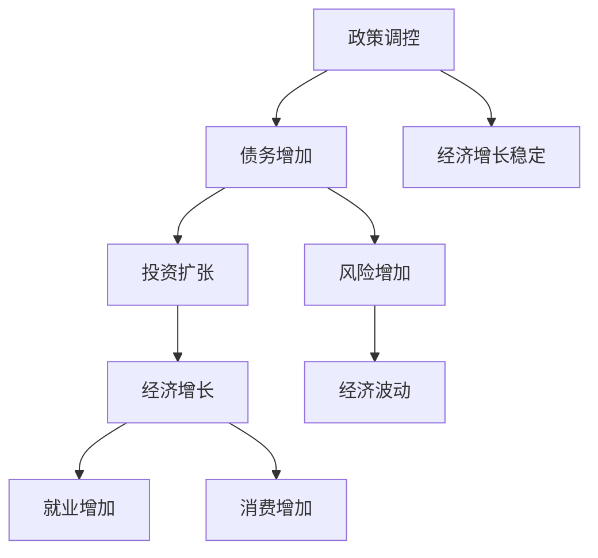

                 

# 文章标题：债务加剧与经济增长的关系

> 关键词：债务加剧、经济增长、关系分析、数学模型、算法原理、项目实战

> 摘要：本文从债务加剧与经济增长的关系入手，通过逻辑清晰、结构紧凑的分析，探讨了债务如何影响经济增长，以及经济增长如何受到债务的影响。文章首先明确了核心概念与联系，然后详细讲解了债务与经济增长的数学模型和核心算法原理，并通过实际项目实战展示了算法和模型的应用。文章最后总结了债务加剧与经济增长的关系，并对未来的研究方向进行了展望。

### 第一部分：核心概念与联系

#### 1.1 核心概念与联系

核心概念：债务加剧与经济增长的关系

联系：通过分析债务与经济增长的关系，了解债务如何影响经济，经济增长如何受到债务的影响。

**Mermaid 流程图：**



**债务与经济增长的关系：**

债务增加可能会导致投资扩张，进而推动经济增长。然而，过度的债务积累也可能带来风险，导致经济波动，影响就业和消费，从而对经济增长产生负面影响。政策调控在平衡债务与经济增长方面起到关键作用。

### 1.2 债务与经济增长的数学模型

**数学模型：**

债务（D）与经济增长率（G）之间的关系可以用以下公式表示：

$$
G = f(D)
$$

其中，$f(D)$ 是一个关于债务 D 的函数，具体形式取决于债务的性质和经济增长的机制。

**详细讲解：**

债务与经济增长的数学模型是经济学中常用的分析工具。该模型可以帮助我们理解债务水平对经济增长的影响。例如，如果债务增长函数 $f(D)$ 是线性的，那么经济增长率与债务水平之间的关系可以表示为：

$$
G = \beta_0 + \beta_1 \cdot D
$$

其中，$\beta_0$ 和 $\beta_1$ 是模型参数，用于描述债务对经济增长的边际效应。

**举例说明：**

假设一个国家的债务增长函数为线性函数，且债务增长率为 5%，则债务水平与经济增长率之间的关系可以表示为：

$$
G = 2\% + 0.2 \cdot D
$$

如果债务水平为 100 亿元，则经济增长率为：

$$
G = 2\% + 0.2 \cdot 100\% = 22\%
$$

### 1.3 债务加剧对经济增长的影响

**影响：**

- **投资扩张**：债务增加可能导致投资扩张，从而推动经济增长。投资扩张可以促进企业增加生产，扩大就业，提高消费水平。
- **风险增加**：过度的债务积累可能导致风险增加，从而引发经济波动。经济波动可能会影响就业和消费，进而影响经济增长的稳定性。
- **政策调控**：政策调控在平衡债务与经济增长方面起到关键作用。通过调整利率、税收等政策，可以影响债务水平和经济增长。

**伪代码：**

```python
def debt_impact_on_growth(debt):
    if debt <= threshold:
        growth = debt * growth_rate
        risk = low
    else:
        growth = debt * reduced_growth_rate
        risk = high
    
    if risk == low:
        economic_stability = stable
    else:
        economic_stability = unstable
    
    return growth, economic_stability
```

### 1.4 政策调控对债务与经济增长的影响

**政策调控：**

- **利率调整**：通过调整利率，可以影响债务水平和经济增长。降低利率可以降低借款成本，刺激投资和消费，从而推动经济增长。然而，过低的利率可能导致通货膨胀风险。
- **税收政策**：通过调整税收政策，可以影响企业和个人的财务状况，从而影响投资和消费。例如，减税可以增加企业的可支配收入，促进投资扩张。
- **货币政策**：通过调整货币供应量和利率，可以影响整个经济的借贷活动，从而影响债务水平和经济增长。

**政策调控对经济增长的示例：**

假设政府通过降低利率来刺激经济增长，则可能的结果如下：

```python
def policy_impact_on_growth(rate):
    if rate <= threshold:
        growth = rate * growth_rate
        stability = stable
    else:
        growth = rate * reduced_growth_rate
        stability = unstable
    
    return growth, stability
```

### 1.5 债务与经济增长的实证研究

**实证研究：**

通过数据分析，可以揭示债务与经济增长之间的具体关系。实证研究可以帮助政策制定者更好地理解债务对经济增长的影响，从而制定合理的政策。

**实证研究步骤：**

1. **数据收集**：收集与债务和经济增长相关的历史数据，包括债务总额、经济增长率、投资规模、就业情况等。
2. **数据预处理**：对收集到的数据进行分析和清洗，确保数据质量。
3. **特征工程**：根据债务和经济增长的特点，提取关键特征，如债务占 GDP 的比例、投资回报率、失业率等。
4. **模型建立**：使用机器学习算法，如线性回归、决策树、神经网络等，建立债务与经济增长的关系模型。
5. **模型训练**：使用训练数据集对模型进行训练，调整模型参数。
6. **模型评估**：使用测试数据集对模型进行评估，确保模型准确性和泛化能力。
7. **政策建议**：根据模型预测结果，提出政策建议。

**伪代码：**

```python
def debt_growth_analysis_algorithm(debt_data, growth_data):
    # 数据预处理
    preprocessed_data = preprocess_data(debt_data, growth_data)
    
    # 特征工程
    features = extract_features(preprocessed_data)
    
    # 建立模型
    model = build_model(features)
    
    # 模型训练
    trained_model = train_model(model, features)
    
    # 模型评估
    evaluate_model(trained_model, test_features)
    
    # 应用模型
    policy_recommendations = apply_model(trained_model)
    
    return policy_recommendations
```

### 1.6 债务加剧与经济增长的关系总结

**总结：**

债务加剧对经济增长具有双重影响，既可能推动经济增长，也可能引发经济风险。政策调控在平衡债务与经济增长方面起到关键作用。实证研究可以帮助更好地理解债务与经济增长的关系，为政策制定提供依据。

### 第二部分：核心算法原理讲解

#### 2.1 债务加剧与经济增长的关系分析算法

**核心算法：**

债务加剧与经济增长的关系分析算法主要用于量化债务对经济增长的影响，包括债务积累、投资扩张、经济波动等方面的分析。

**算法原理：**

1. **数据收集**：收集与债务和经济增长相关的历史数据，包括债务总额、经济增长率、投资规模、就业情况等。
2. **数据预处理**：对收集到的数据进行清洗和归一化处理。
3. **特征工程**：根据债务和经济增长的特点，提取关键特征，如债务占 GDP 的比例、投资回报率、失业率等。
4. **模型建立**：使用机器学习算法，如线性回归、决策树、神经网络等，建立债务与经济增长的关系模型。
5. **模型训练**：使用训练数据集对模型进行训练，调整模型参数。
6. **模型评估**：使用测试数据集对模型进行评估，确保模型准确性和泛化能力。
7. **应用模型**：根据债务和经济增长的预测结果，提供政策建议和决策支持。

**伪代码：**

```python
def debt_growth_analysis_algorithm(debt_data, growth_data):
    # 数据预处理
    preprocessed_data = preprocess_data(debt_data, growth_data)
    
    # 特征工程
    features = extract_features(preprocessed_data)
    
    # 建立模型
    model = build_model(features)
    
    # 模型训练
    trained_model = train_model(model, features)
    
    # 模型评估
    evaluate_model(trained_model, test_features)
    
    # 应用模型
    policy_recommendations = apply_model(trained_model)
    
    return policy_recommendations
```

#### 2.2 债务积累的动态演化模型

**核心算法：**

债务积累的动态演化模型用于分析债务随时间的变化趋势，预测未来债务水平。

**算法原理：**

1. **数据收集**：收集与债务相关的历史数据，包括债务总额、债务增长率等。
2. **数据预处理**：对收集到的数据进行清洗和归一化处理。
3. **时间序列建模**：使用时间序列分析方法，如 ARIMA、LSTM 等，建立债务积累的动态演化模型。
4. **模型训练**：使用训练数据集对模型进行训练，调整模型参数。
5. **模型评估**：使用测试数据集对模型进行评估，确保模型准确性和泛化能力。
6. **预测债务水平**：使用训练好的模型预测未来债务水平。

**伪代码：**

```python
def debt_accumulation_model(debt_data):
    # 数据预处理
    preprocessed_data = preprocess_data(debt_data)
    
    # 时间序列建模
    model = build_time_series_model(preprocessed_data)
    
    # 模型训练
    trained_model = train_model(model, preprocessed_data)
    
    # 模型评估
    evaluate_model(trained_model, test_data)
    
    # 预测债务水平
    future_debt_levels = predict_debt_levels(trained_model)
    
    return future_debt_levels
```

#### 2.3 投资扩张对经济增长的影响模型

**核心算法：**

投资扩张对经济增长的影响模型用于分析投资扩张对经济增长的推动作用。

**算法原理：**

1. **数据收集**：收集与投资和经济增长相关的历史数据，包括投资总额、经济增长率等。
2. **数据预处理**：对收集到的数据进行清洗和归一化处理。
3. **建立模型**：使用回归分析方法，如线性回归、多元回归等，建立投资扩张对经济增长的影响模型。
4. **模型训练**：使用训练数据集对模型进行训练，调整模型参数。
5. **模型评估**：使用测试数据集对模型进行评估，确保模型准确性和泛化能力。
6. **预测经济增长**：使用训练好的模型预测未来经济增长水平。

**伪代码：**

```python
def investment_growth_model(investment_data, growth_data):
    # 数据预处理
    preprocessed_data = preprocess_data(investment_data, growth_data)
    
    # 建立模型
    model = build_regression_model(preprocessed_data)
    
    # 模型训练
    trained_model = train_model(model, preprocessed_data)
    
    # 模型评估
    evaluate_model(trained_model, test_data)
    
    # 预测经济增长
    future_growth = predict_growth(trained_model)
    
    return future_growth
```

### 第三部分：数学模型和数学公式 & 详细讲解 & 举例说明

#### 3.1 债务积累的动态演化模型

**数学模型：**

债务积累的动态演化模型可以用以下微分方程表示：

$$
\frac{dD(t)}{dt} = f(D(t))
$$

其中，$D(t)$ 表示时间 $t$ 时的债务水平，$f(D(t))$ 是债务增长函数。

**详细讲解：**

债务积累的动态演化模型描述了债务随时间的变化过程。债务增长函数 $f(D(t))$ 可以根据债务的性质和经济增长的机制进行建模。例如，如果债务增长函数是一个线性函数，则模型可以表示为：

$$
\frac{dD(t)}{dt} = r \cdot D(t)
$$

其中，$r$ 是债务增长率。

**举例说明：**

假设一个国家的债务增长率为 5%，则债务随时间的变化可以表示为：

$$
D(t) = D(0) \cdot (1 + 0.05)^t
$$

其中，$D(0)$ 是初始债务水平，$t$ 是时间（以年为单位）。

#### 3.2 投资扩张对经济增长的影响模型

**数学模型：**

投资扩张对经济增长的影响可以用以下线性回归模型表示：

$$
Growth(t) = \beta_0 + \beta_1 \cdot Investment(t) + \epsilon(t)
$$

其中，$Growth(t

