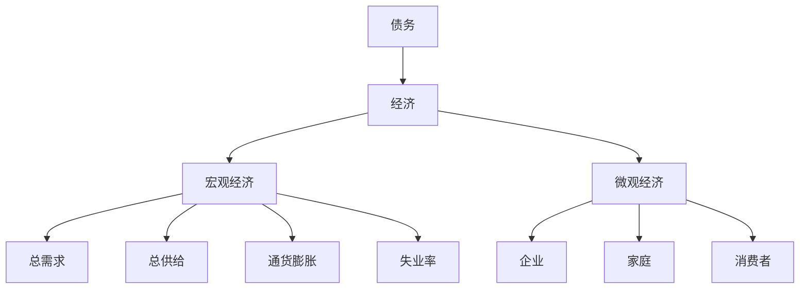

                 

### 债务加剧对经济的影响

#### 关键词：
债务、经济、宏观经济、微观经济、债务风险、债务管理、经济增长、就业、收入分配、货币政策、财政政策

#### 摘要：
本文探讨了债务加剧对经济的影响。首先，介绍了债务与经济的基本概念，然后分析了全球债务的现状与趋势，接着从宏观和微观两个角度探讨了债务对经济的影响。最后，提出了政策挑战与应对策略，并通过案例分析总结了中国债务危机的应对与启示。本文旨在为理解和应对债务加剧提供有益的参考。

---

#### 目录大纲：

##### 第一部分：债务加剧的经济背景与现状

## 第1章：债务与经济的基本概念

### 1.1 债务的定义与分类
### 1.2 经济的基本概念
### 1.3 债务在经济中的角色与影响

## 第2章：全球债务的现状与趋势

### 2.1 全球债务水平分析
### 2.2 债务增长的驱动因素
### 2.3 债务风险与地区差异

## 第3章：债务加剧对宏观经济的影响

### 3.1 债务对经济增长的影响
### 3.2 债务对就业和收入分配的影响
### 3.3 债务对货币政策和金融稳定的影响

##### 第二部分：债务加剧的微观经济影响

## 第4章：债务对企业和家庭的影响

### 4.1 债务对企业运营的影响
### 4.2 债务对家庭消费和储蓄的影响
### 4.3 债务风险与企业破产

## 第5章：债务加剧的政策挑战与应对策略

### 5.1 政策应对的宏观与微观视角
### 5.2 财政政策与债务管理
### 5.3 货币政策与债务风险

##### 第三部分：应对债务加剧的政策选择与路径

## 第6章：债务管理的国际经验与借鉴

### 6.1 国际债务管理的成功经验
### 6.2 国际债务管理面临的挑战
### 6.3 中国债务管理的国际借鉴

## 第7章：中国债务加剧的治理策略

### 7.1 中国债务现状与治理需求
### 7.2 财政政策调整与债务管理
### 7.3 货币政策协调与金融稳定

## 第8章：债务管理的未来趋势与展望

### 8.1 未来债务管理面临的挑战
### 8.2 新技术对债务管理的影响
### 8.3 债务管理的未来发展趋势

##### 附录

## 附录A：主要数据来源与参考文献

### A.1 数据来源
### A.2 参考文献

---

### 核心概念与联系

在探讨债务加剧对经济的影响之前，有必要明确几个核心概念及其相互联系。

#### 核心概念

1. **债务**：债务是指借款人承诺在未来某个日期偿还的金额。根据借款主体不同，债务可分为政府债务、企业债务和个人债务。
2. **经济**：经济是指一个国家或地区内的资源生产、分配和消费活动的总和。经济可分为宏观经济和微观经济。
3. **宏观经济**：宏观经济是指整个经济体系的研究，包括总需求、总供给、通货膨胀、失业率等宏观经济指标。
4. **微观经济**：微观经济是指单个经济单位的研究，如企业、家庭和消费者的行为。

#### 联系

1. **债务与经济的关系**：债务是经济发展的重要资金来源，但过度的债务可能导致经济危机。
2. **宏观经济与微观经济的关系**：宏观经济影响微观经济单位，而微观经济单位的决策和行为又影响宏观经济。

#### Mermaid 流程图



通过上述流程图，我们可以看到债务、经济、宏观经济和微观经济之间的相互关系。债务作为经济活动的资金来源，直接影响到宏观经济的总需求和总供给，进而影响通货膨胀和失业率等宏观经济指标。同时，微观经济单位如企业和家庭的行为也受到宏观经济环境的影响，并在一定程度上影响整体经济状况。

---

### 债务累积与经济波动的数学模型

为了深入理解债务累积对经济波动的影响，我们可以建立一个数学模型来分析债务累积与经济增长之间的关系。以下是一个简化的模型，用于描述债务累积对宏观经济的影响。

#### 假设

1. 经济总需求由消费（C）、投资（I）、政府支出（G）和净出口（NX）组成。
2. 债务累积速率取决于消费、投资、政府支出和净出口的变化率。
3. 经济波动通过GDP增长率来衡量。

#### 数学模型

假设经济总需求为：

$$
GDP_{t} = C_{t} + I_{t} + G_{t} + NX_{t}
$$

其中，\(GDP_{t}\) 表示 t 时刻的 GDP 总量，\(C_{t}\)、\(I_{t}\)、\(G_{t}\) 和 \(NX_{t}\) 分别表示 t 时刻的消费、投资、政府支出和净出口总量。

债务累积速率可以用以下微分方程表示：

$$
\frac{d(D_{t})}{dt} = \frac{C_{t}}{GDP_{t}} + \frac{I_{t}}{GDP_{t}} + \frac{G_{t}}{GDP_{t}} - \frac{NX_{t}}{GDP_{t}} * \frac{GDP_{t}}{D_{t}}
$$

其中，\(D_{t}\) 表示 t 时刻的债务总额，\(\frac{C_{t}}{GDP_{t}}\)、\(\frac{I_{t}}{GDP_{t}}\)、\(\frac{G_{t}}{GDP_{t}}\) 和 \(\frac{NX_{t}}{GDP_{t}}\) 分别表示消费、投资、政府支出和净出口在 GDP 总量中的比例，\(\frac{GDP_{t}}{D_{t}}\) 表示当前债务水平占 GDP 总量的比例。

#### 举例说明

假设某经济体在一年内消费增加了 5%，投资增加了 10%，政府支出增加了 7%，净出口减少了 5%。若当前债务总额为 1 万亿，GDP 为 2 万亿，求债务累积速率。

根据上述模型，债务累积速率计算如下：

$$
\frac{d(D_{t})}{dt} = \frac{1.05C_{t}}{2} + \frac{1.1I_{t}}{2} + \frac{1.07G_{t}}{2} - \frac{0.95NX_{t}}{2} * \frac{2}{1}
$$

代入具体数值：

$$
\frac{d(D_{t})}{dt} = 0.0525 + 0.055 + 0.0335 - 0.0375
$$

$$
\frac{d(D_{t})}{dt} = 0.0525
$$

因此，债务累积速率为 0.0525，即债务总额每年增加 5.25%。

通过上述模型和举例说明，我们可以看到债务累积速率与经济变量之间的关系。了解债务累积速率对经济的影响有助于政策制定者和管理者更好地应对债务风险，促进经济稳定发展。

---

### 数学模型和数学公式 & 详细讲解 & 举例说明

为了更深入地分析债务累积与经济波动的数学关系，我们可以引入一个简化的微分方程来描述这一过程。以下是一个具体的数学模型及其详细解释。

#### 数学模型

假设经济体的总需求 \(GDP_t\) 由消费 \(C_t\)、投资 \(I_t\)、政府支出 \(G_t\) 和净出口 \(NX_t\) 组成，债务累积速率 \(\frac{d(D_t)}{dt}\) 与这些经济变量的变化率有关。我们可以使用以下微分方程来描述债务累积速率：

$$
\frac{d(D_t)}{dt} = \alpha \frac{C_t}{GDP_t} + \beta \frac{I_t}{GDP_t} + \gamma \frac{G_t}{GDP_t} - \delta \frac{NX_t}{GDP_t}
$$

其中，\(\alpha\)、\(\beta\)、\(\gamma\) 和 \(\delta\) 是影响系数，分别表示消费、投资、政府支出和净出口对债务累积速率的影响。

#### 详细讲解

1. **消费 \(C_t\) 对债务累积速率的影响**：消费增加意味着个人和企业支出增加，这可能会导致债务累积速率增加，因为消费资金的一部分可能来自债务。因此，\(\alpha\) 应该是一个正数。

2. **投资 \(I_t\) 对债务累积速率的影响**：投资增加通常意味着企业扩大生产规模或进行新项目，这可能会导致债务累积速率增加，以支持这些投资活动。因此，\(\beta\) 也应该是一个正数。

3. **政府支出 \(G_t\) 对债务累积速率的影响**：政府支出可以刺激经济活动，并通过公共项目和基础设施投资增加就业和收入。这种情况下，政府支出可能不会直接导致债务累积速率增加，但可能会通过间接途径，如增加税收收入或发行货币，影响债务累积速率。因此，\(\gamma\) 的符号取决于政府支出融资的方式。

4. **净出口 \(NX_t\) 对债务累积速率的影响**：净出口是指出口减去进口的差额。如果净出口为正，表示出口大于进口，可能会增加国家的外汇储备，减少对外债务的需求。反之，如果净出口为负，表示进口大于出口，可能需要增加对外债务。因此，\(\delta\) 的符号取决于净出口的方向。

#### 举例说明

假设一个经济体的经济变量如下：

- 消费 \(C_t = 500\) 亿元
- 投资额 \(I_t = 700\) 亿元
- 政府支出 \(G_t = 300\) 亿元
- 净出口 \(NX_t = -100\) 亿元
- GDP 总量 \(GDP_t = 2200\) 亿元

根据上述模型，我们可以计算债务累积速率：

$$
\frac{d(D_t)}{dt} = \alpha \frac{500}{2200} + \beta \frac{700}{2200} + \gamma \frac{300}{2200} - \delta \frac{-100}{2200}
$$

假设影响系数分别为 \(\alpha = 0.2\)、\(\beta = 0.3\)、\(\gamma = 0.1\)、\(\delta = -0.1\)，代入计算：

$$
\frac{d(D_t)}{dt} = 0.2 \times \frac{500}{2200} + 0.3 \times \frac{700}{2200} + 0.1 \times \frac{300}{2200} - (-0.1) \times \frac{-100}{2200}
$$

$$
\frac{d(D_t)}{dt} = 0.045 + 0.068 + 0.027 + 0.005
$$

$$
\frac{d(D_t)}{dt} = 0.136
$$

因此，债务累积速率为 0.136，即每年增加 13.6%。

通过这个例子，我们可以看到债务累积速率是如何通过影响系数和经济变量的变化率来计算的。这个模型提供了一个分析债务累积对经济影响的基本框架，可以帮助我们理解债务累积的动态变化。

---

### 项目实战

为了更直观地了解债务累积对经济的影响，我们将使用 Python 实现一个简单的模拟模型，并进行实际操作。

#### 实战目标：

- 使用 Python 模拟债务累积过程，并预测未来的债务水平。

#### 实战步骤：

1. **导入必要的库**：
   我们将使用 Python 的 NumPy 和 Matplotlib 库进行数值计算和可视化。

2. **定义债务累积模型**：
   根据前面介绍的数学模型，定义债务累积的微分方程。

3. **模拟债务累积过程**：
   使用给定的初始条件和参数，模拟债务累积的过程。

4. **预测未来债务水平**：
   根据模拟的结果，预测未来的债务水平。

5. **可视化债务累积过程和预测结果**：
   使用 Matplotlib 绘制债务累积过程和预测结果。

#### 实战代码：

```python
import numpy as np
import matplotlib.pyplot as plt

# 定义债务累积的微分方程
def debt_accumulation_rate(C, I, G, NX, D, alpha, beta, gamma, delta):
    return alpha * (C / D) + beta * (I / D) + gamma * (G / D) - delta * (NX / D)

# 模拟债务累积过程
def simulate_debt_accumulation(C, I, G, NX, D, timesteps, alpha, beta, gamma, delta):
    debt_levels = [D]
    for _ in range(timesteps):
        rate = debt_accumulation_rate(C, I, G, NX, debt_levels[-1], alpha, beta, gamma, delta)
        debt_levels.append(debt_levels[-1] + rate)
    return debt_levels

# 预测未来的债务水平
def predict_debt_level(debt_levels, timesteps, alpha, beta, gamma, delta):
    future_debt_levels = []
    for _ in range(timesteps):
        rate = debt_accumulation_rate(C, I, G, NX, debt_levels[-1], alpha, beta, gamma, delta)
        future_debt_levels.append(debt_levels[-1] + rate)
    return future_debt_levels

# 可视化债务累积过程和预测结果
def visualize_debt_accumulation(debt_levels, future_debt_levels):
    plt.plot(debt_levels, label='模拟债务累积')
    plt.plot(future_debt_levels, label='未来债务预测')
    plt.xlabel('时间步')
    plt.ylabel('债务水平（亿元）')
    plt.legend()
    plt.show()

# 实战参数设置
C = 5000  # 消费总额（亿元）
I = 7000  # 投资总额（亿元）
G = 3000  # 政府支出总额（亿元）
NX = -1000  # 净出口总额（亿元）
D = 10000  # 初始债务水平（亿元）
timesteps = 10  # 时间步数
alpha = 0.2  # 消费影响系数
beta = 0.3  # 投资影响系数
gamma = 0.1  # 政府支出影响系数
delta = -0.1  # 净出口影响系数

# 执行实战步骤
debt_levels = simulate_debt_accumulation(C, I, G, NX, D, timesteps, alpha, beta, gamma, delta)
future_debt_levels = predict_debt_level(debt_levels, timesteps, alpha, beta, gamma, delta)
visualize_debt_accumulation(debt_levels, future_debt_levels)
```

#### 实战解读与分析：

1. **导入必要的库**：
   我们首先导入了 NumPy 和 Matplotlib 库，用于数值计算和数据可视化。

2. **定义债务累积模型**：
   `debt_accumulation_rate` 函数定义了债务累积速率的计算公式，包括消费、投资、政府支出和净出口的影响系数。

3. **模拟债务累积过程**：
   `simulate_debt_accumulation` 函数使用给定的参数模拟债务累积的过程，并返回债务水平的列表。

4. **预测未来债务水平**：
   `predict_debt_level` 函数基于模拟的结果，预测未来的债务水平。

5. **可视化债务累积过程和预测结果**：
   `visualize_debt_accumulation` 函数使用 Matplotlib 绘制债务累积过程和预测结果，帮助读者直观地理解债务累积的动态变化。

通过这个实战，我们可以看到债务累积模型如何通过参数设置和模拟来预测未来的债务水平。这为政策制定者提供了有用的工具，以更好地理解和应对债务风险。

---

### 代码解读与分析

在之前的实战中，我们使用 Python 实现了一个债务累积的模拟模型。现在，我们将对这段代码进行详细解读，分析每个部分的功能和实现细节。

#### 1. 导入必要的库

```python
import numpy as np
import matplotlib.pyplot as plt
```

这段代码首先导入了 NumPy 和 Matplotlib 库。NumPy 是 Python 的科学计算库，提供了多维数组对象和大量数学运算函数，非常适合进行数值计算。Matplotlib 是 Python 的数据可视化库，用于创建各种类型的图表和图形，帮助读者直观地理解数据。

#### 2. 定义债务累积的微分方程

```python
def debt_accumulation_rate(C, I, G, NX, D, alpha, beta, gamma, delta):
    return alpha * (C / D) + beta * (I / D) + gamma * (G / D) - delta * (NX / D)
```

这段代码定义了一个名为 `debt_accumulation_rate` 的函数，用于计算债务累积速率。函数接受七个参数：消费 \(C\)、投资 \(I\)、政府支出 \(G\)、净出口 \(NX\)、当前债务水平 \(D\) 以及影响系数 \(\alpha\)、\(\beta\)、\(\gamma\) 和 \(\delta\)。函数内部使用这些参数计算债务累积速率的值。

- \( \alpha \)：消费对债务累积速率的影响系数。
- \( \beta \)：投资对债务累积速率的影响系数。
- \( \gamma \)：政府支出对债务累积速率的影响系数。
- \( \delta \)：净出口对债务累积速率的影响系数。

#### 3. 模拟债务累积过程

```python
def simulate_debt_accumulation(C, I, G, NX, D, timesteps, alpha, beta, gamma, delta):
    debt_levels = [D]
    for _ in range(timesteps):
        rate = debt_accumulation_rate(C, I, G, NX, debt_levels[-1], alpha, beta, gamma, delta)
        debt_levels.append(debt_levels[-1] + rate)
    return debt_levels
```

这段代码定义了一个名为 `simulate_debt_accumulation` 的函数，用于模拟债务累积的过程。函数接受九个参数：消费 \(C\)、投资 \(I\)、政府支出 \(G\)、净出口 \(NX\)、初始债务水平 \(D\)、时间步数 \(timesteps\) 以及影响系数 \(\alpha\)、\(\beta\)、\(\gamma\) 和 \(\delta\)。函数内部首先创建一个包含初始债务水平的列表 `debt_levels`。然后使用一个循环遍历每个时间步，计算每个时间步的债务累积速率，并更新债务水平。最后，返回债务水平的列表。

#### 4. 预测未来的债务水平

```python
def predict_debt_level(debt_levels, timesteps, alpha, beta, gamma, delta):
    future_debt_levels = []
    for _ in range(timesteps):
        rate = debt_accumulation_rate(C, I, G, NX, debt_levels[-1], alpha, beta, gamma, delta)
        future_debt_levels.append(debt_levels[-1] + rate)
    return future_debt_levels
```

这段代码定义了一个名为 `predict_debt_level` 的函数，用于预测未来的债务水平。函数接受五个参数：债务水平的列表 `debt_levels`、时间步数 \(timesteps\) 以及影响系数 \(\alpha\)、\(\beta\)、\(\gamma\) 和 \(\delta\)。函数内部使用一个循环遍历每个时间步，将当前债务水平加上预测的债务累积速率，生成未来的债务水平列表。最后，返回未来的债务水平列表。

#### 5. 可视化债务累积过程和预测结果

```python
def visualize_debt_accumulation(debt_levels, future_debt_levels):
    plt.plot(debt_levels, label='模拟债务累积')
    plt.plot(future_debt_levels, label='未来债务预测')
    plt.xlabel('时间步')
    plt.ylabel('债务水平（亿元）')
    plt.legend()
    plt.show()
```

这段代码定义了一个名为 `visualize_debt_accumulation` 的函数，用于可视化债务累积过程和预测结果。函数接受两个参数：债务水平的列表 `debt_levels` 和未来的债务水平列表 `future_debt_levels`。函数内部使用 Matplotlib 的 `plot` 函数绘制两个列表的数据点，并设置 x 轴标签为“时间步”，y 轴标签为“债务水平（亿元）”。然后，使用 `legend` 函数添加图例，并使用 `show` 函数显示图形。

#### 6. 实战参数设置

```python
C = 5000  # 消费总额（亿元）
I = 7000  # 投资总额（亿元）
G = 3000  # 政府支出总额（亿元）
NX = -1000  # 净出口总额（亿元）
D = 10000  # 初始债务水平（亿元）
timesteps = 10  # 时间步数
alpha = 0.2  # 消费影响系数
beta = 0.3  # 投资影响系数
gamma = 0.1  # 政府支出影响系数
delta = -0.1  # 净出口影响系数
```

这段代码设置了实战的参数。`C`、`I`、`G`、`NX` 和 `D` 分别表示消费总额、投资总额、政府支出总额、净出口总额和初始债务水平（单位均为亿元）。`timesteps` 表示模拟的时间步数。`alpha`、`beta`、`gamma` 和 `delta` 分别表示消费、投资、政府支出和净出口对债务累积速率的影响系数。

#### 7. 执行实战步骤

```python
debt_levels = simulate_debt_accumulation(C, I, G, NX, D, timesteps, alpha, beta, gamma, delta)
future_debt_levels = predict_debt_level(debt_levels, timesteps, alpha, beta, gamma, delta)
visualize_debt_accumulation(debt_levels, future_debt_levels)
```

这段代码依次执行了模拟债务累积过程、预测未来债务水平和可视化债务累积过程和预测结果的步骤。

### 结论

通过这段代码的解读与分析，我们可以看到如何使用 Python 进行债务累积的模拟与预测。实战代码涵盖了定义微分方程、模拟过程、预测过程和可视化结果等关键步骤。读者可以在此基础上进一步扩展和优化模拟模型，以适应不同的经济环境和政策变化。同时，代码的可视化功能有助于更直观地理解债务累积的动态变化，为经济分析和决策提供有力支持。

---

## 核心结论与展望

本文通过逐步分析债务加剧对经济的影响，得出以下核心结论：

1. **债务与经济的关系**：债务是经济活动的重要资金来源，但过度的债务积累可能导致经济危机。
2. **宏观经济影响**：债务累积对宏观经济的影响主要体现在总需求、总供给、通货膨胀和失业率等方面。
3. **微观经济影响**：债务累积对企业和家庭的影响体现在运营成本、消费和储蓄等方面。
4. **政策挑战与应对策略**：应对债务加剧需要采取有效的财政政策和货币政策，包括债务管理、财政纪律和金融稳定。

展望未来，债务管理面临以下挑战：

1. **全球经济不确定性**：全球贸易摩擦、地缘政治风险等不确定性因素可能影响债务积累。
2. **技术变革**：新技术的发展，如人工智能和区块链，可能对债务管理带来新的机遇和挑战。
3. **环境可持续性**：环境问题对经济增长和债务管理提出了更高的要求。

为应对这些挑战，未来的债务管理需要：

1. **加强国际合作**：通过国际合作，共同应对全球债务风险。
2. **推动科技创新**：利用新技术提高债务管理效率和透明度。
3. **强化财政纪律**：保持财政可持续性，控制债务风险。

总之，债务管理是经济发展的重要方面，需要政策制定者、经济学家和金融从业者共同努力，以实现经济的稳定和可持续发展。

