                 

### 文章标题：像数学家一样思考：着色原理

#### 关键词：着色原理，色彩科学，计算机图形学，着色模型，光线追踪，渲染方程，算法优化，虚拟现实，数字艺术，未来趋势

> **摘要：**
> 
> 本文章深入探讨着色原理，从色彩科学的基础知识到计算机图形学中的着色技术，逐步解析着色的核心概念、数学原理以及实际应用。通过详细的案例分析、算法讲解和未来趋势分析，本文旨在为读者提供全面且系统的理解，帮助他们在计算机图形学和数字艺术领域取得深入认识。

### 目录大纲

## 第一部分：引言

### 1.1 著色原理的背景和重要性

#### 1.1.1 色彩科学的基础知识

#### 1.1.2 着色原理的历史与发展

### 1.2 本书的目标和结构

## 第二部分：色彩理论

### 2.1 基本色彩概念

#### 2.1.1 基本色彩的定义

#### 2.1.2 色彩的物理属性

#### 2.1.3 色彩的心理效应

### 2.2 色彩搭配原则

#### 2.2.1 单色调搭配

#### 2.2.2 类比搭配

#### 2.2.3 对比搭配

### 2.3 色彩情感与风格

#### 2.3.1 色彩的情感表达

#### 2.3.2 色彩的时尚风格

### 2.4 色彩在艺术中的应用

#### 2.4.1 艺术色彩的理论基础

#### 2.4.2 色彩在绘画中的运用

#### 2.4.3 色彩在摄影中的运用

## 第三部分：着色技术

### 3.1 着色模型的基本概念

#### 3.1.1 着色模型的类型

#### 3.1.2 着色模型的数学原理

### 3.2 着色模型的实现方法

#### 3.2.1 光线追踪法

#### 3.2.2 渲染方程

#### 3.2.3 通用渲染语言

### 3.3 着色算法的优化

#### 3.3.1 着色算法的时间复杂性分析

#### 3.3.2 着色算法的空间优化

#### 3.3.3 并行计算在着色中的应用

## 第四部分：着色在计算机图形学中的应用

### 4.1 计算机图形学基础

#### 4.1.1 图形学的基本概念

#### 4.1.2 图形处理的数学基础

### 4.2 着色在游戏开发中的应用

#### 4.2.1 游戏着色的基本原理

#### 4.2.2 游戏中的着色效果实现

### 4.3 着色在电影动画中的应用

#### 4.3.1 动画着色的过程

#### 4.3.2 动画中的着色技巧

### 4.4 着色在虚拟现实中的应用

#### 4.4.1 虚拟现实中的着色需求

#### 4.4.2 虚拟现实中的着色技术

## 第五部分：案例研究

### 5.1 色彩学在平面设计中的应用

#### 5.1.1 平面设计中的色彩原则

#### 5.1.2 色彩在平面设计中的实际应用案例

### 5.2 着色技术在三维建模中的应用

#### 5.2.1 三维建模的基本概念

#### 5.2.2 着色技术在三维建模中的应用案例

### 5.3 着色在数字艺术中的应用

#### 5.3.1 数字艺术的概念

#### 5.3.2 着色在数字艺术创作中的实际案例

## 第六部分：未来趋势与挑战

### 6.1 着色技术的发展趋势

#### 6.1.1 新型着色算法的研究进展

#### 6.1.2 着色技术在新兴领域的应用

### 6.2 着色技术面临的挑战

#### 6.2.1 着色技术对硬件资源的要求

#### 6.2.2 着色技术在虚拟现实中的应用挑战

### 6.3 未来研究方向与展望

#### 6.3.1 着色技术在人工智能中的应用前景

#### 6.3.2 着色技术在可持续发展中的潜在应用

## 第七部分：参考资料与拓展阅读

### 7.1 基础资料

#### 7.1.1 关键文献和论文

#### 7.1.2 经典教材和手册

### 7.2 拓展阅读

#### 7.2.1 先锋研究论文

#### 7.2.2 行业报告和白皮书

#### 7.2.3 学术会议和研讨会

## 第一部分：引言

### 1.1 著色原理的背景和重要性

#### 1.1.1 色彩科学的基础知识

色彩科学是研究色彩的产生、感知和评价的科学。人类对色彩的研究可以追溯到古希腊时期，随着科学技术的进步，色彩科学逐渐发展为一门独立的学科。基本色彩概念包括原色、间色和复色，它们是理解和应用色彩科学的基础。

- **原色**：无法通过混合其他颜色产生的色彩，如红色、蓝色和黄色。
- **间色**：通过混合两种原色产生的色彩，如橙色、绿色和紫色。
- **复色**：通过混合多种颜色产生的色彩，如棕色、灰色和粉红色。

#### 1.1.2 着色原理的历史与发展

着色原理的发展历程可以追溯到古埃及和古希腊时期。当时的艺术家们利用矿物质和植物染料进行绘画，这些染料具有固定的颜色和亮度。随着摄影技术的发明和计算机图形学的兴起，着色技术逐渐发展成为一个独立的领域。

- **早期着色**：在摄影和电影中，着色通常是通过手工方式完成的。艺术家使用染料和颜料在底片或胶片上直接绘制颜色。
- **计算机图形学中的着色**：随着计算机技术的发展，计算机图形学中的着色技术逐渐成熟。早期的着色模型包括光栅图形渲染和光线路径追踪，它们为现代计算机图形学中的着色技术奠定了基础。

#### 1.1.3 着色原理的应用领域

着色原理在多个领域都有广泛的应用，包括：

- **计算机图形学**：在游戏、电影和动画中，着色技术用于生成逼真的图像和场景。
- **虚拟现实**：着色技术在虚拟现实中用于生成真实的视觉体验。
- **数字艺术**：数字艺术家利用着色技术创作独特的艺术作品。

着色原理在这些领域中的重要性体现在以下几个方面：

- **视觉真实感**：通过精确的着色技术，可以生成具有高度真实感的图像和场景，提升用户体验。
- **艺术表现**：着色技术为艺术家提供了更多的创作手段，使他们能够更自由地表达自己的想法和情感。
- **技术进步**：着色技术的发展推动了计算机图形学和其他相关领域的技术进步，促进了创新和变革。

### 1.2 本书的目标和结构

本书的整体目标是深入探讨着色原理，帮助读者全面了解色彩科学、着色技术以及它们在不同领域的应用。具体目标如下：

- **理解基本色彩概念**：通过介绍原色、间色和复色等基本色彩概念，帮助读者建立色彩科学的基础知识。
- **掌握着色模型**：介绍常见的着色模型，如光线追踪、渲染方程和通用渲染语言，帮助读者理解着色技术的核心原理。
- **分析着色算法**：通过详细分析着色算法的优化方法，帮助读者掌握提高着色效率的关键技术。
- **应用实例**：通过实际案例研究，展示着色技术在计算机图形学、虚拟现实和数字艺术中的应用，帮助读者了解着色技术的实际应用场景。

本书结构如下：

- **第一部分：引言**：介绍着色原理的背景和重要性，以及本书的目标和结构。
- **第二部分：色彩理论**：探讨基本色彩概念、色彩搭配原则、色彩情感与风格以及色彩在艺术中的应用。
- **第三部分：着色技术**：介绍着色模型的基本概念、实现方法和优化技术。
- **第四部分：着色在计算机图形学中的应用**：分析着色在游戏开发、电影动画和虚拟现实中的应用。
- **第五部分：案例研究**：通过具体的案例研究，展示着色技术在平面设计、三维建模和数字艺术中的应用。
- **第六部分：未来趋势与挑战**：探讨着色技术未来的发展趋势、面临的挑战以及潜在的研究方向。
- **第七部分：参考资料与拓展阅读**：提供相关的基础资料和拓展阅读资源，帮助读者深入了解着色原理。

通过本书的系统学习，读者将能够：

- **全面理解**着色原理的基本概念和核心技术。
- **掌握**常见的着色模型和算法，具备解决实际问题的能力。
- **应用**着色技术在计算机图形学、虚拟现实和数字艺术等领域的项目中。
- **探索**着色技术的未来发展方向和潜在应用场景。

### 1.2.1 色彩科学的基础知识

色彩科学是一门研究色彩的生成、感知和评价的学科。色彩在我们的日常生活中无处不在，无论是自然界的多彩风光，还是人工创造的艺术作品，色彩都扮演着至关重要的角色。要深入理解着色原理，首先需要了解色彩科学的基础知识。

#### 基本色彩概念

色彩的基本概念包括原色、间色和复色。

- **原色**：原色是指不能通过混合其他颜色产生的颜色，通常被称为三原色。在色彩科学中，常用的三原色是红色、蓝色和黄色。这些颜色是色彩混合的基础，其他所有颜色都可以通过这三种颜色的不同比例混合得到。
  
  ```mermaid
  graph TD
  A1[红色] --> B1[黄色]
  A1 --> B2[蓝色]
  B1 --> C1[橙色]
  B1 --> C2[绿色]
  B2 --> C3[紫色]
  ```

- **间色**：间色是通过混合两种原色产生的颜色。例如，红色和黄色混合可以得到橙色，红色和蓝色混合可以得到紫色，黄色和蓝色混合可以得到绿色。
  
  ```mermaid
  graph TD
  A[红色] --> B[黄色]
  A --> C[蓝色]
  B --> D[橙色]
  B --> E[绿色]
  C --> F[紫色]
  ```

- **复色**：复色是通过混合多种颜色产生的颜色，包括多种原色、间色和次间色。复色通常比原色和间色更复杂，它们可以产生丰富的视觉效果。

  ```mermaid
  graph TD
  A1[红色] --> B1[黄色]
  A1 --> B2[蓝色]
  B1 --> C1[橙色]
  B1 --> C2[绿色]
  B2 --> C3[紫色]
  A2[黄色] --> D2[绿色]
  A2 --> E2[橙色]
  C2 --> F2[棕色]
  C2 --> G2[灰色]
  ```

#### 色彩的物理属性

色彩是由光的波长决定的，不同的波长产生不同的颜色。人眼对光的感知是通过视网膜上的感光细胞实现的。视网膜上的感光细胞分为视锥细胞和视杆细胞，视锥细胞负责感知颜色，而视杆细胞则负责感知亮度和对比度。

- **色光的三属性**：色光的三属性包括亮度、色调和饱和度。亮度表示光的强度，色调表示光的颜色，饱和度表示颜色的纯度。

  ```mermaid
  graph TD
  A[亮度] --> B[色调]
  A --> C[饱和度]
  ```

- **色光的混合**：色光的混合通常遵循加法混合原则。例如，红色光和绿色光混合可以得到黄色光，这是因为红色光和绿色光的波长在加法混合后产生了黄光的波长。

  ```mermaid
  graph TD
  A1[红色光] --> B1[黄色光]
  A2[绿色光] --> B1
  ```

#### 色彩的心理效应

色彩不仅仅是一种物理现象，它还会影响我们的心理和情感。不同颜色可以引起不同的心理反应，这种现象称为色彩心理效应。

- **冷色与暖色**：冷色（如蓝色、绿色）通常与平静、冷静相关联，而暖色（如红色、黄色）则与活力、热情相关联。

  ```mermaid
  graph TD
  A[冷色] --> B[蓝色]
  A --> C[绿色]
  D[暖色] --> E[红色]
  D --> F[黄色]
  ```

- **色彩的情感表达**：色彩可以用来表达情感和氛围。例如，红色可以用来表达激情和力量，蓝色可以用来表达宁静和稳定。

  ```mermaid
  graph TD
  A[红色] --> B[激情]
  A --> C[力量]
  D[蓝色] --> E[宁静]
  D --> F[稳定]
  ```

#### 色彩在艺术中的应用

色彩在艺术中扮演着重要角色，艺术家利用色彩来传达思想和情感。色彩的应用包括以下几个方面：

- **色彩调和**：色彩调和是指将不同颜色组合在一起，使其看起来和谐统一。常用的色彩调和方法包括单色调搭配、类比搭配和对比搭配。

  ```mermaid
  graph TD
  A[单色调搭配]
  B[类比搭配]
  C[对比搭配]
  ```

- **色彩情感表达**：艺术家通过使用不同颜色来传达情感和氛围。例如，红色可以用来表达激情和力量，蓝色可以用来表达宁静和稳定。

  ```mermaid
  graph TD
  A[红色] --> B[激情]
  A --> C[力量]
  D[蓝色] --> E[宁静]
  D --> F[稳定]
  ```

- **色彩构图**：色彩构图是指通过颜色的布局和组合来构建画面。色彩构图可以增强艺术作品的整体效果，使画面更加生动和有趣。

  ```mermaid
  graph TD
  A[色彩构图]
  B[布局]
  C[组合]
  ```

### 1.1.2 着色原理的历史与发展

着色原理的发展历程可以追溯到古埃及和古希腊时期。古埃及的艺术家们利用矿物质和植物染料进行绘画，这些染料具有固定的颜色和亮度。古希腊哲学家亚里士多德也对色彩进行了研究，提出了关于色彩的理论。

随着科学技术的进步，着色原理逐渐发展成为一个独立的领域。在摄影技术发明之前，艺术家们通常通过手工方式完成绘画的着色。摄影技术发明后，着色技术开始应用于摄影和电影领域。早期的着色通常是通过手工在底片或胶片上绘制颜色。

随着计算机技术的发展，计算机图形学中的着色技术逐渐成熟。早期的计算机着色模型包括光栅图形渲染和光线路径追踪。光栅图形渲染通过像素的颜色值来生成图像，而光线路径追踪通过模拟光线的传播路径来生成图像。这些技术为现代计算机图形学中的着色技术奠定了基础。

近年来，着色技术在计算机图形学、虚拟现实和数字艺术等领域取得了显著的进展。新型着色算法如光线追踪、渲染方程和通用渲染语言的提出，使得着色效果更加真实和细腻。同时，着色技术也在不断优化，以适应硬件性能的提升和计算需求的增长。

#### 1.2 本书的目标和结构

本书的目标是深入探讨着色原理，帮助读者全面理解色彩科学、着色技术以及它们在不同领域的应用。为了实现这一目标，本书将采用以下结构：

**第一部分：引言**

本部分将介绍着色原理的背景和重要性，包括色彩科学的基础知识、着色原理的历史与发展，以及本书的目标和结构。通过这一部分的阅读，读者可以对着色原理有一个整体的把握，为后续的学习打下基础。

**第二部分：色彩理论**

本部分将深入探讨色彩理论，包括基本色彩概念、色彩搭配原则、色彩情感与风格以及色彩在艺术中的应用。这一部分旨在帮助读者建立色彩科学的基础知识，为理解着色技术打下坚实的基础。

- **基本色彩概念**

  在这一节中，我们将介绍原色、间色和复色的定义和特点，并通过Mermaid流程图展示它们之间的关系。此外，还将讨论色彩的三属性：亮度、色调和饱和度，以及它们在色彩感知中的作用。

- **色彩搭配原则**

  这一部分将介绍单色调搭配、类比搭配和对比搭配等常见的色彩搭配原则。我们将通过具体的例子，展示如何利用这些原则来设计和谐的色彩组合。

- **色彩情感与风格**

  在这一节中，我们将探讨色彩对情感和风格的影响。不同颜色可以引起不同的心理反应，从而影响人们的情感和情绪。此外，我们还将讨论如何利用色彩来创造不同的风格和氛围。

- **色彩在艺术中的应用**

  这一部分将探讨色彩在绘画、摄影和数字艺术中的应用。我们将介绍艺术色彩的理论基础，并通过具体的例子，展示如何利用色彩来创作艺术作品。

**第三部分：着色技术**

本部分将介绍着色技术的核心概念、实现方法和优化技术。包括着色模型的类型、数学原理以及光线追踪、渲染方程和通用渲染语言等具体实现方法。此外，我们还将探讨着色算法的优化技术，如时间复杂性和空间优化，以及并行计算在着色中的应用。

- **着色模型的基本概念**

  在这一节中，我们将介绍着色模型的类型，包括光栅图形渲染和光线路径追踪等。我们将通过Mermaid流程图展示这些模型的基本原理和结构。

- **着色模型的实现方法**

  这一部分将详细介绍光线追踪法、渲染方程和通用渲染语言等具体实现方法。我们将使用伪代码和Mermaid图来阐述这些方法的步骤和过程。

- **着色算法的优化**

  在这一节中，我们将探讨着色算法的优化技术。包括时间复杂性和空间优化方法，如算法的并行化处理和内存管理。我们将通过具体例子，展示如何优化着色算法，提高渲染效率和效果。

**第四部分：着色在计算机图形学中的应用**

本部分将探讨着色技术在计算机图形学中的应用，包括游戏开发、电影动画和虚拟现实。我们将分析这些应用领域中的着色原理和具体实现方法，并通过案例分析，展示着色技术的实际应用效果。

- **计算机图形学基础**

  在这一节中，我们将介绍计算机图形学的基本概念和数学基础，包括三维模型、纹理映射和光照模型等。这些基础知识对于理解着色技术至关重要。

- **着色在游戏开发中的应用**

  这一部分将探讨着色技术在游戏开发中的应用。包括游戏着色的基本原理、材质系统、光照模型和阴影处理等。我们将通过具体的游戏案例，展示着色技术在游戏中的实际应用。

- **着色在电影动画中的应用**

  在这一节中，我们将介绍着色技术在电影动画中的应用。包括动画着色的过程、纹理绘制、材质和光照效果等。我们将通过具体的动画案例，展示着色技术在动画制作中的实际应用。

- **着色在虚拟现实中的应用**

  这一部分将探讨着色技术在虚拟现实中的应用。包括虚拟现实中的着色需求、纹理映射、光照模型和实时渲染等。我们将通过虚拟现实案例，展示着色技术在虚拟现实中的实际应用。

**第五部分：案例研究**

本部分将通过具体的案例研究，展示着色技术在平面设计、三维建模和数字艺术中的应用。通过这些案例，读者可以更深入地了解着色技术的实际应用效果和技巧。

- **色彩学在平面设计中的应用**

  在这一节中，我们将探讨色彩学在平面设计中的应用。包括色彩原则、配色技巧和实际案例等。我们将通过具体的平面设计案例，展示色彩学在平面设计中的实际应用。

- **着色技术在三维建模中的应用**

  这一部分将探讨着色技术在三维建模中的应用。包括三维模型着色的原理、材质编辑、纹理映射和光照处理等。我们将通过三维建模案例，展示着色技术在三维建模中的实际应用。

- **着色在数字艺术中的应用**

  在这一节中，我们将介绍着色技术在数字艺术中的应用。包括数字绘画、纹理制作、光照渲染和后期处理等。我们将通过具体的数字艺术案例，展示着色技术在数字艺术创作中的实际应用。

**第六部分：未来趋势与挑战**

本部分将探讨着色技术的未来发展趋势和面临的挑战。包括新型着色算法的研究进展、着色技术在新兴领域的应用以及硬件资源要求和虚拟现实应用挑战等。我们将分析未来研究方向和展望，为读者提供对未来着色技术的思考。

- **着色技术的发展趋势**

  在这一节中，我们将介绍新型着色算法的研究进展，如基于深度学习的着色算法和实时渲染技术等。我们将分析这些技术如何改变着色技术，提升渲染效率和效果。

- **着色技术面临的挑战**

  这一部分将探讨着色技术在虚拟现实中的应用挑战，如实时渲染、纹理映射和光照处理等。我们将讨论如何解决这些挑战，推动着色技术向更高效、更真实的方向发展。

- **未来研究方向与展望**

  在这一节中，我们将探讨着色技术在人工智能、虚拟现实和可持续发展等领域的潜在应用。我们将分析这些应用领域的需求和挑战，为未来着色技术的研究和发展提供方向。

**第七部分：参考资料与拓展阅读**

本部分将提供相关的参考资料和拓展阅读资源，包括关键文献和论文、经典教材和手册、行业报告和白皮书等。这些资源将帮助读者更深入地了解着色原理和技术，拓展他们的知识视野。

### 第二部分：色彩理论

色彩理论是研究色彩搭配、情感表达和艺术创作的重要领域。它不仅关乎艺术创作的审美，也广泛应用于设计、时尚和计算机图形学等领域。在这一部分，我们将深入探讨色彩理论的基本概念、色彩搭配原则、色彩情感与风格，以及色彩在艺术中的应用。

#### 2.1 基本色彩概念

要理解色彩理论，首先需要掌握基本色彩概念，包括原色、间色和复色的定义。

- **原色**：原色是不能再分解的基本颜色，通常指红色、蓝色和黄色。这三种颜色被认为是色彩混合的基础。

  ```mermaid
  graph TD
  A[红色] --> B[黄色]
  A --> C[蓝色]
  ```

- **间色**：间色是由两种原色混合而成的颜色，包括橙色、绿色和紫色。

  ```mermaid
  graph TD
  D[红色] --> E[橙色]
  D --> F[绿色]
  E[橙色] --> G[黄色]
  E --> H[红色]
  F[绿色] --> I[蓝色]
  F --> J[黄色]
  ```

- **复色**：复色是由多种颜色混合而成的颜色，可以是原色、间色的组合。复色通常更加丰富和复杂。

  ```mermaid
  graph TD
  K[红色] --> L[橙色]
  K --> M[绿色]
  K --> N[紫色]
  L[橙色] --> P[黄色]
  L --> Q[红色]
  M[绿色] --> R[蓝色]
  M --> S[黄色]
  ```

#### 2.1.1 基本色彩的定义

色彩的定义不仅限于颜色的物理属性，还包括其在视觉和情感上的作用。以下是基本色彩的定义：

- **红色**：红色通常与激情、力量和热情相关联。它在设计中常用于强调和吸引注意力。

  ```mermaid
  graph TD
  T[红色] --> U[激情]
  T --> V[力量]
  ```

- **蓝色**：蓝色通常与冷静、信任和稳定相关联。它在设计中常用于传达信任和专业性。

  ```mermaid
  graph TD
  W[蓝色] --> X[冷静]
  W --> Y[信任]
  ```

- **黄色**：黄色通常与快乐、创造力和活力相关联。它在设计中常用于传达活力和创新。

  ```mermaid
  graph TD
  Z[黄色] --> AA[快乐]
  Z --> BB[创造力]
  ```

#### 2.1.2 色彩的物理属性

色彩是光作用于人眼后产生的视觉现象。以下是色彩物理属性的关键点：

- **波长**：不同颜色对应不同的波长。红色光的波长最长，蓝色光的波长最短。

  ```mermaid
  graph TD
  CC[红色] --> DD(波长最长)
  EE[蓝色] --> FF(波长最短)
  ```

- **亮度**：亮度是色彩的一个属性，表示光的强度。亮度过高或过低都会影响色彩的效果。

  ```mermaid
  graph TD
  GG[亮度] --> HH[过高] --> II[失真]
  GG --> JJ[过低] --> KK[乏味]
  ```

- **饱和度**：饱和度是色彩纯度的一个度量，表示颜色中灰色成分的多少。高饱和度的颜色看起来更加鲜艳，而低饱和度的颜色看起来更加灰暗。

  ```mermaid
  graph TD
  LL[饱和度] --> MM[高饱和度] --> NN[鲜艳]
  LL --> OO[低饱和度] --> PP[灰暗]
  ```

#### 2.1.3 色彩的心理效应

色彩不仅影响视觉效果，还会对人的心理产生深远的影响。以下是几种常见的色彩心理效应：

- **冷暖色效应**：冷色（如蓝色和绿色）通常给人一种冷静和平静的感觉，而暖色（如红色和黄色）则给人一种温暖和热情的感觉。

  ```mermaid
  graph TD
  QQ[冷色] --> RR[蓝色]
  QQ --> SS[绿色]
  TT[暖色] --> UU[红色]
  TT --> VV[黄色]
  ```

- **情感表达**：不同的色彩可以表达不同的情感。例如，红色常用于表达激情和力量，而绿色常用于表达和平和安宁。

  ```mermaid
  graph TD
  WW[红色] --> XX[激情]
  WW --> YY[力量]
  ZZ[绿色] --> AA[和平]
  ZZ --> BB[安宁]
  ```

- **风格传递**：色彩也可以用来传递特定的风格和氛围。例如，明亮的色彩通常传达出轻松和愉快的感觉，而深色调则传达出稳重和正式的感觉。

  ```mermaid
  graph TD
  CC[明亮色彩] --> DD[轻松]
  CC --> EE[愉快]
  FF[深色调] --> GG[稳重]
  FF --> HH[正式]
  ```

### 2.2 色彩搭配原则

色彩搭配是艺术创作和设计中至关重要的一环。以下是一些常见的色彩搭配原则：

#### 2.2.1 单色调搭配

单色调搭配是指使用同一色调的不同明度和饱和度的颜色组合。这种方法可以创造和谐统一的视觉效果。

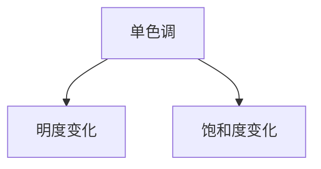

#### 2.2.2 类比搭配

类比搭配是指使用相邻的颜色组合。这种方法可以创造和谐且富有层次感的色彩效果。

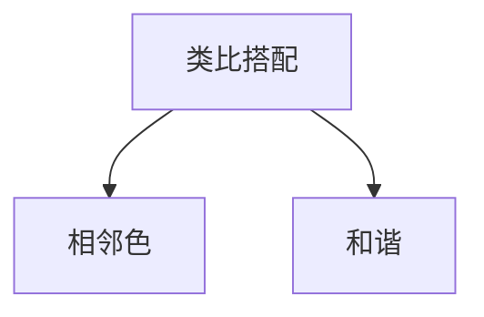

#### 2.2.3 对比搭配

对比搭配是指使用对比度较高的颜色组合。这种方法可以创造强烈的视觉冲击力，但需要谨慎使用，以避免过于刺眼。

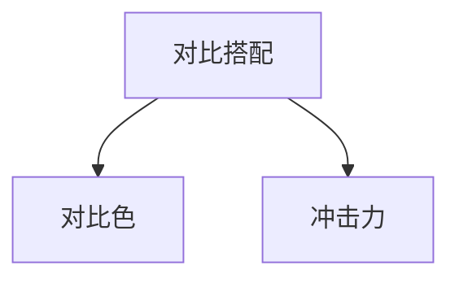

### 2.3 色彩情感与风格

色彩不仅仅是一种视觉元素，它还能够传达情感和风格。以下是几种常见的色彩情感和风格：

#### 2.3.1 色彩的情感表达

色彩可以用来表达不同的情感。以下是几种常见情感与对应的色彩：

- **喜悦**：黄色、橙色和红色通常与喜悦情感相关。
  ```mermaid
  graph TD
  A[喜悦] --> B[黄色]
  A --> C[橙色]
  A --> D[红色]
  ```

- **平静**：蓝色和绿色通常与平静情感相关。
  ```mermaid
  graph TD
  E[平静] --> F[蓝色]
  E --> G[绿色]
  ```

- **焦虑**：红色和紫色通常与焦虑情感相关。
  ```mermaid
  graph TD
  H[焦虑] --> I[红色]
  H --> J[紫色]
  ```

#### 2.3.2 色彩的时尚风格

色彩在时尚中也扮演着重要角色，不同的色彩组合可以传达不同的时尚风格：

- **现代风格**：黑白灰搭配通常与现代风格相关。
  ```mermaid
  graph TD
  K[现代风格] --> L[黑色]
  K --> M[白色]
  K --> N[灰色]
  ```

- **复古风格**：棕色、绿色和紫色通常与复古风格相关。
  ```mermaid
  graph TD
  O[复古风格] --> P[棕色]
  O --> Q[绿色]
  O --> R[紫色]
  ```

- **流行风格**：流行色彩通常根据季节和潮流而变化，如春季的粉色、夏季的柠檬黄等。
  ```mermaid
  graph TD
  S[流行风格] --> T[粉色]
  S --> U[柠檬黄]
  ```

### 2.4 色彩在艺术中的应用

色彩在艺术创作中具有至关重要的作用，它可以传达艺术家的情感、思想和意图。以下是色彩在绘画、摄影和数字艺术中的应用：

#### 2.4.1 艺术色彩的理论基础

艺术色彩的理论基础包括色彩混合、色彩对比和色彩调和等概念。以下是这些概念的具体解释：

- **色彩混合**：色彩混合是指通过将两种或多种颜色混合在一起，产生新的颜色。色彩混合分为加法混合和减法混合。
  
  ```mermaid
  graph TD
  A[加法混合] --> B[RGB颜色模型]
  A --> C[光混合]
  D[减法混合] --> E[CMYK颜色模型]
  D --> F[颜料混合]
  ```

- **色彩对比**：色彩对比是指两种或多种颜色在视觉上的相对差异。色彩对比可以增强艺术作品的表现力。
  
  ```mermaid
  graph TD
  G[色彩对比] --> H[明度对比]
  G --> I[色相对比]
  ```

- **色彩调和**：色彩调和是指将不同的颜色组合在一起，使其看起来和谐统一。色彩调和是艺术创作中常用的技巧。

  ```mermaid
  graph TD
  J[色彩调和] --> K[单色调搭配]
  J --> L[类比搭配]
  J --> M[对比搭配]
  ```

#### 2.4.2 色彩在绘画中的运用

色彩在绘画中的应用非常广泛，艺术家可以通过不同的色彩搭配和技法，传达出不同的情感和风格。

- **油画**：油画通常使用丰富的色彩和厚重的颜料，创造出独特的视觉效果。

  ```mermaid
  graph TD
  N[油画] --> O[色彩丰富]
  N --> P[质感强]
  ```

- **水彩画**：水彩画使用透明的颜料，通过水的稀释和流动，创造出柔和而富有变化的色彩效果。

  ```mermaid
  graph TD
  Q[水彩画] --> R[色彩透明]
  Q --> S[变化丰富]
  ```

- **素描**：素描通常使用单色或有限的色彩，强调线条和阴影的运用，创造出立体感和空间感。

  ```mermaid
  graph TD
  T[素描] --> U[单色]
  T --> V[线条]
  ```

#### 2.4.3 色彩在摄影中的运用

色彩在摄影中同样扮演着重要角色，通过色彩的运用，摄影师可以传达出特定的情感和氛围。

- **风景摄影**：在风景摄影中，色彩可以用来表现季节、气候和情绪。

  ```mermaid
  graph TD
  W[风景摄影] --> X[季节表现]
  W --> Y[气候表现]
  ```

- **人像摄影**：在人像摄影中，色彩可以用来强调人物的特点和气质。

  ```mermaid
  graph TD
  Z[人像摄影] --> AA[特点表现]
  Z --> BB[气质表现]
  ```

- **抽象摄影**：在抽象摄影中，色彩被用来创造形式和构图，表达艺术家的抽象思维和创意。

  ```mermaid
  graph TD
  CC[抽象摄影] --> DD[形式表现]
  CC --> EE[创意表现]
  ```

通过以上对色彩理论、色彩搭配原则、色彩情感与风格以及色彩在艺术中的应用的探讨，我们可以更好地理解色彩的科学原理和应用价值。在接下来的章节中，我们将进一步探讨着色技术的基本概念、实现方法和优化技术，深入分析着色模型及其应用。

### 第三部分：着色技术

着色技术在计算机图形学中扮演着至关重要的角色，它通过模拟光线与物体交互的过程，生成逼真的视觉效果。在这一部分，我们将深入探讨着色技术的基本概念、实现方法和优化技术。

#### 3.1 着色模型的基本概念

着色模型是计算机图形学中用于描述光线如何与物体交互并产生颜色效果的理论框架。常见的着色模型包括光栅图形渲染和光线路径追踪。

##### 3.1.1 着色模型的类型

**光栅图形渲染**：光栅图形渲染是最常见的着色方法，它通过将场景分解为像素，并对每个像素进行着色来生成图像。光栅图形渲染的主要优点是计算效率高，适合实时渲染应用。

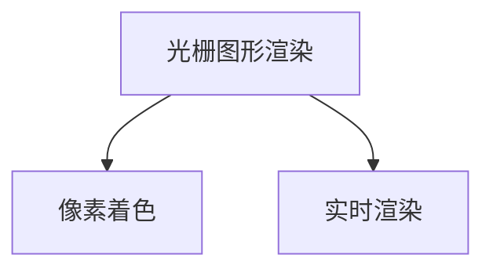

**光线路径追踪**：光线路径追踪通过模拟光线在场景中的传播路径来生成图像，它可以产生更真实的光照效果和阴影效果。光线路径追踪的主要缺点是计算成本较高，但它的图像质量通常优于光栅图形渲染。

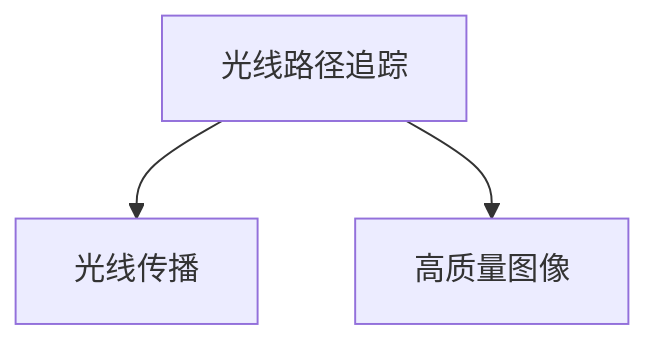

##### 3.1.2 着色模型的数学原理

**光栅图形渲染的数学原理**：光栅图形渲染的核心是像素着色。每个像素的颜色由其所在物体的材质属性决定。常见的材质属性包括颜色、反射率、透明度和粗糙度等。

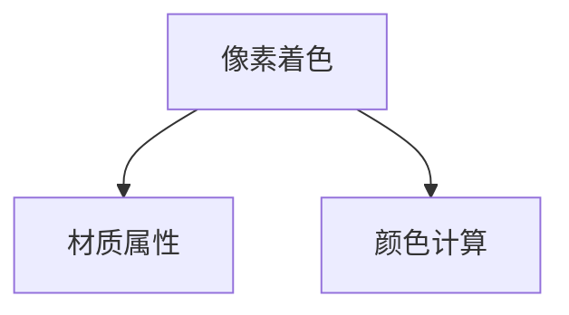

**光线路径追踪的数学原理**：光线路径追踪的核心是光线的传播路径模拟。光线与物体表面的交点决定了光线的反射、折射和散射行为。这个过程通常通过求解渲染方程来实现。

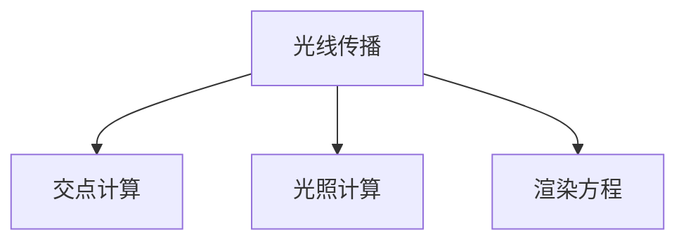

#### 3.2 着色模型的实现方法

着色模型的实现方法包括光线追踪法、渲染方程和通用渲染语言。

##### 3.2.1 光线追踪法

光线追踪法是一种基于光线路径追踪的着色方法。它通过模拟光线在场景中的传播路径，计算每个像素的颜色。

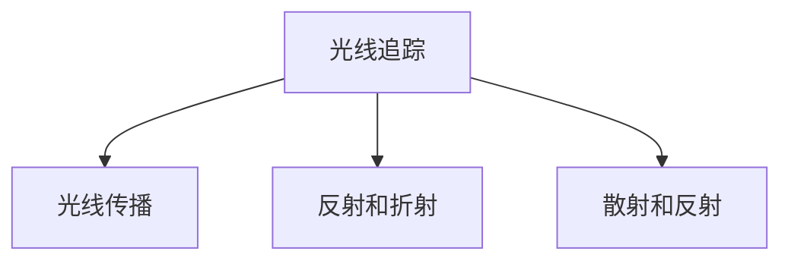

光线追踪法的伪代码如下：

```python
function traceLight(path):
    color = background_color
    for step in path:
        hit = intersect(step, scene)
        if hit:
            color += calculateLight(hit)
    return color
```

##### 3.2.2 渲染方程

渲染方程是一种基于物理的光线追踪模型，它描述了光线与物体交互的基本原理。

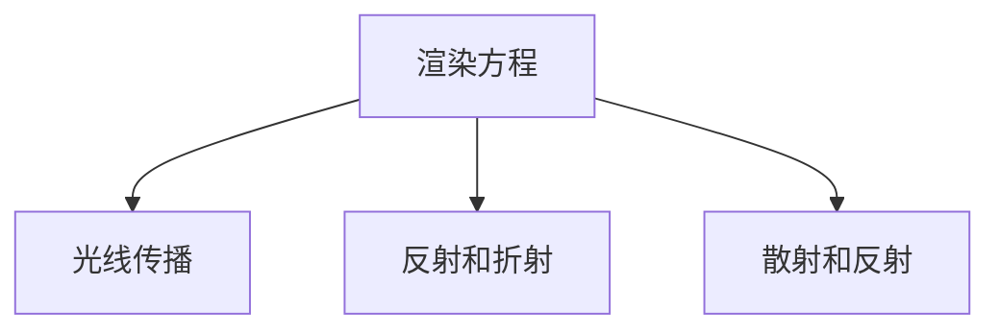

渲染方程的伪代码如下：

```python
function renderEquation(point, direction):
    L = background_light
    for light in scene.lights:
        L += light.intensity * BRDF(point, light.direction) * N dot light.direction
    return L
```

##### 3.2.3 通用渲染语言

通用渲染语言（PBR）是一种基于物理的渲染模型，它通过描述材料表面的微观结构，生成逼真的视觉效果。

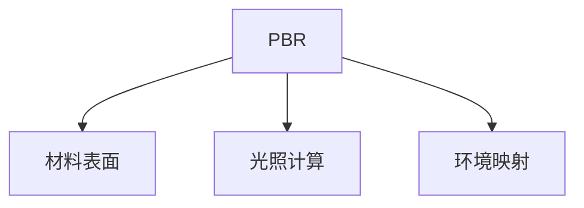

通用渲染语言的伪代码如下：

```python
function PBRShader(point, normal, view_direction, material):
    albedo = material.albedo
    roughness = material.roughness
    metalness = material.metalness
    L = albedo * environment_map(view_direction) * N dot view_direction
    L += metalness * reflection_map(view_direction) * N dot view_direction
    return L
```

#### 3.3 着色算法的优化

着色算法的优化是提高渲染效率和图像质量的关键。以下是一些常见的优化方法：

##### 3.3.1 着色算法的时间复杂性分析

着色算法的时间复杂性取决于渲染场景的复杂度和算法的实现。光线追踪算法的时间复杂性通常与场景中的物体数量和光线数量成正比。

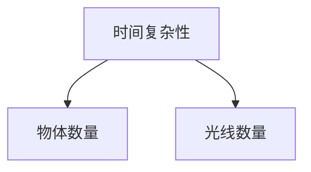

##### 3.3.2 着色算法的空间优化

空间优化是减少内存占用和提高渲染效率的重要方法。常见的方法包括物体空间分割和光线空间采样。

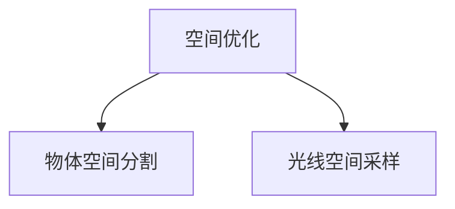

##### 3.3.3 并行计算在着色中的应用

并行计算可以显著提高着色算法的执行速度。常见的方法包括多线程处理和GPU渲染。

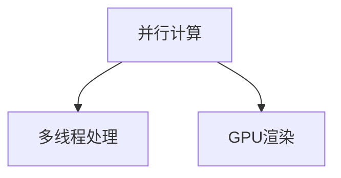

通过以上对着色技术的基本概念、实现方法和优化技术的探讨，我们可以更好地理解着色技术的工作原理和应用价值。在接下来的章节中，我们将深入分析着色技术在计算机图形学中的具体应用。

### 第四部分：着色在计算机图形学中的应用

#### 4.1 计算机图形学基础

计算机图形学是研究如何通过计算机生成和处理图形的一门学科。它涵盖了从基本图形绘制到复杂三维场景渲染的广泛内容。理解计算机图形学的基础知识对于深入探讨着色技术在其中的应用至关重要。

##### 4.1.1 图形学的基本概念

**图形学的基本概念**包括点、线、面和体，以及它们在二维和三维空间中的表示方法。

- **点**：点是图形学中最基本的元素，可以用二维或三维坐标来表示。
  
  ```mermaid
  graph TD
  A[点] --> B[X坐标]
  A --> C[Y坐标]
  A --> D[Z坐标]
  ```

- **线**：线是由两个端点确定的，可以用来表示边、轮廓等。

  ```mermaid
  graph TD
  E[线] --> F[起点]
  E --> G[终点]
  ```

- **面**：面是由一组顶点定义的平面区域，通常用于表示二维和三维物体的表面。

  ```mermaid
  graph TD
  H[面] --> I[顶点集合]
  ```

- **体**：体是由多个面围成的三维空间区域，可以表示三维物体的体积。

  ```mermaid
  graph TD
  J[体] --> K[面集合]
  ```

##### 4.1.2 图形处理的数学基础

**图形处理的数学基础**包括线性代数、几何学和矩阵运算。这些数学工具用于描述和处理图形数据。

- **线性代数**：线性代数提供了处理向量、矩阵和线性方程组的方法，是图形处理的核心。

  ```mermaid
  graph TD
  L[线性代数] --> M[向量]
  L --> N[矩阵]
  ```

- **几何学**：几何学提供了处理点、线、面和体等几何元素的方法，包括它们的变换和相交计算。

  ```mermaid
  graph TD
  O[几何学] --> P[变换]
  O --> Q[相交计算]
  ```

- **矩阵运算**：矩阵运算用于实现图形变换，如平移、旋转和缩放。

  ```mermaid
  graph TD
  R[矩阵运算] --> S[平移]
  R --> T[旋转]
  R --> U[缩放]
  ```

#### 4.2 着色在游戏开发中的应用

着色技术在游戏开发中起着至关重要的作用，它负责生成游戏中的视觉效果，包括角色、环境和光影效果。以下是一些游戏着色的基本原理和具体实现方法。

##### 4.2.1 游戏着色的基本原理

**游戏着色的基本原理**包括材质、光照和阴影等。

- **材质**：材质定义了物体表面的颜色、纹理和反射特性。在游戏开发中，常用的材质属性包括颜色、纹理、粗糙度和透明度等。

  ```mermaid
  graph TD
  V[材质] --> W[颜色]
  V --> X[纹理]
  V --> Y[粗糙度]
  V --> Z[透明度]
  ```

- **光照**：光照是游戏场景中产生视觉效果的另一个重要因素。游戏中的光照通常包括定向光、点光源和聚光等。

  ```mermaid
  graph TD
  AA[光照] --> BB[定向光]
  AA --> CC[点光源]
  AA --> DD[聚光]
  ```

- **阴影**：阴影为游戏场景增添了深度和立体感。阴影的计算通常涉及光照模型和遮挡计算。

  ```mermaid
  graph TD
  EE[阴影] --> FF[光照模型]
  EE --> GG[遮挡计算]
  ```

##### 4.2.2 游戏中的着色效果实现

**游戏中的着色效果实现**包括以下常见技术：

- **光影效果**：通过模拟光线在场景中的传播和反射，实现逼真的光影效果。

  ```mermaid
  graph TD
  HH[光影效果] --> II[光照模型]
  HH --> JJ[反射计算]
  ```

- **反射和折射**：通过模拟光线在物体表面的反射和折射，实现逼真的光学效果。

  ```mermaid
  graph TD
  KK[反射和折射] --> LL[反射计算]
  KK --> MM[折射计算]
  ```

- **透明效果**：通过模拟光线在透明物体中的传播，实现透明效果。

  ```mermaid
  graph TD
  NN[透明效果] --> OO[透射计算]
  ```

- **环境映射**：通过将场景中的光线与周围环境的光线结合，实现逼真的环境效果。

  ```mermaid
  graph TD
  PP[环境映射] --> QQ[环境光照]
  ```

以下是一个简单的游戏着色算法的伪代码：

```python
function gameShader(vertex, fragment):
    # 计算材质属性
    material = getMaterial(vertex)
    
    # 计算光照
    light = calculateLight(vertex, fragment)
    
    # 计算阴影
    shadow = calculateShadow(vertex, fragment)
    
    # 计算反射和折射
    reflection = calculateReflection(vertex, fragment)
    refraction = calculateRefraction(vertex, fragment)
    
    # 计算颜色
    color = material.color + light - shadow + reflection + refraction
    
    return color
```

通过以上对计算机图形学基础和着色在游戏开发中的应用的探讨，我们可以更好地理解着色技术在游戏开发中的重要性。在接下来的章节中，我们将继续探讨着色技术在电影动画和虚拟现实中的应用。

### 4.3 着色在电影动画中的应用

#### 4.3.1 动画着色的过程

动画着色是电影动画制作过程中的一个关键步骤，它涉及到对每个帧的图像进行着色，以生成最终的画面。动画着色的过程可以分为以下几个主要阶段：

- **建模**：在动画着色之前，首先需要建立场景中的三维模型。建模阶段包括创建几何形状、添加细节和纹理等。

- **绑定**：绑定是将模型与骨骼系统连接起来，以便于动画制作。在绑定阶段，模型上的每个部分（如手臂、腿部等）都被绑定到相应的骨骼上，以便于进行运动控制。

- **动画**：动画阶段是创建角色和物体的运动轨迹。通过关键帧和中间帧的插值，动画师可以创造出流畅的动作和表情。

- **着色**：着色阶段是对动画帧进行色彩填充和光照计算。在着色过程中，艺术家会使用各种着色技术来生成逼真的图像。

- **渲染**：渲染是将着色后的帧转换为最终图像的过程。渲染过程中会进行各种后处理，如光影效果、模糊、颜色校正等，以提升画面质量。

- **合成**：合成是将多个图层（如背景、角色、特效等）组合在一起，生成最终的动画画面。

以下是一个简化的动画着色流程图：

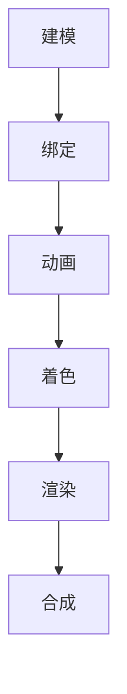

#### 4.3.2 动画中的着色技巧

动画着色涉及多种技巧，以实现逼真和有吸引力的视觉效果。以下是一些常用的着色技巧：

- **光影效果**：通过模拟光线在物体表面的反射、折射和散射，实现逼真的光影效果。常用的光照模型包括漫反射、镜面反射和散射。

  ```mermaid
  graph TD
  G[光影效果] --> H[漫反射]
  G --> I[镜面反射]
  G --> J[散射]
  ```

- **纹理映射**：纹理映射是将图像映射到三维模型表面的技术，用于增加表面细节和质感。常见的纹理类型包括漫反射纹理、反射纹理和透明纹理。

  ```mermaid
  graph TD
  K[纹理映射] --> L[漫反射纹理]
  K --> M[反射纹理]
  K --> N[透明纹理]
  ```

- **色彩校正**：色彩校正是调整图像的色彩平衡、对比度和饱和度等，以增强视觉效果。色彩校正技术包括色调映射、对比度增强和色彩平衡等。

  ```mermaid
  graph TD
  O[色彩校正] --> P[色调映射]
  O --> Q[对比度增强]
  O --> R[色彩平衡]
  ```

- **特效添加**：特效添加是在画面中添加各种视觉特效，如烟雾、火焰、水波等。这些特效通常通过专门的着色算法生成。

  ```mermaid
  graph TD
  S[特效添加] --> T[烟雾]
  S --> U[火焰]
  S --> V[水波]
  ```

以下是一个动画着色技巧的综合示例：

```python
def animateShader(vertex, fragment, texture, light):
    # 计算纹理颜色
    texture_color = texture.sample(vertex)

    # 计算漫反射光照
    diffuse_light = light.intensity * texture_color * N.dot(L)

    # 计算镜面反射光照
    reflection_light = light.intensity * (R dot V)

    # 计算阴影
    shadow = calculateShadow(vertex, light)

    # 计算最终颜色
    color = texture_color + diffuse_light + reflection_light - shadow

    return color
```

#### 4.3.3 着色技术在动画制作中的实际应用案例

着色技术在动画制作中有广泛的应用，以下是一些实际应用案例：

- **《冰雪奇缘》**：《冰雪奇缘》是一部获得广泛赞誉的动画电影，它通过先进的着色技术，创造了逼真的冰雪效果和角色表情。

  ```mermaid
  graph TD
  W[《冰雪奇缘》] --> X[冰雪效果]
  W --> Y[角色表情]
  ```

- **《超能陆战队》**：《超能陆战队》通过使用PBR（基于物理的渲染）技术，为机器人和场景创建逼真的材质和光照效果。

  ```mermaid
  graph TD
  Z[《超能陆战队》] --> AA[PBR技术]
  Z --> BB[机器人材质]
  ```

- **《疯狂动物城》**：《疯狂动物城》利用先进的动画着色技巧，创造出丰富多彩的场景和角色，为观众带来视觉上的震撼。

  ```mermaid
  graph TD
  CC[《疯狂动物城》] --> DD[场景]
  CC --> EE[角色]
  ```

通过以上对动画着色的过程、技巧和实际应用案例的探讨，我们可以看到着色技术在电影动画制作中的重要性。着色技术不仅提升了动画的视觉质量，还为观众带来了更加丰富和真实的观影体验。

### 4.4 着色在虚拟现实中的应用

#### 4.4.1 虚拟现实中的着色需求

虚拟现实（VR）技术正迅速发展，为用户提供沉浸式的视觉体验。在VR中，着色技术扮演着至关重要的角色，它决定了场景的逼真度和用户的沉浸感。以下是一些虚拟现实中的着色需求：

- **高分辨率图像**：虚拟现实要求高分辨率的图像，以确保用户在近距离观看时仍能获得清晰的视觉体验。这需要高效且高质量的着色算法。

- **实时渲染**：虚拟现实通常要求实时渲染，以保持用户的沉浸感和交互体验。这要求着色算法具有高度的效率和处理速度。

- **动态光照**：虚拟现实中的场景需要动态光照，以模拟真实世界中的光照变化。动态光照技术可以增强场景的真实感。

- **纹理细节**：虚拟现实中的纹理细节至关重要，它决定了场景的逼真度。高质量的纹理映射和细节处理是必要的。

- **视觉效果**：虚拟现实中的视觉效果（如烟雾、雾气、光影效果等）可以提升用户体验。这些效果需要复杂的着色算法来生成。

以下是一个简化的VR着色需求图：

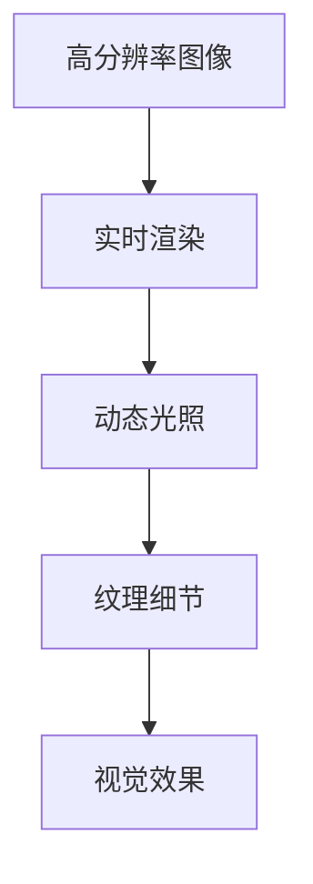

#### 4.4.2 虚拟现实中的着色技术

为了满足虚拟现实中的着色需求，研究人员和开发者们开发了一系列先进的着色技术。以下是一些关键技术：

- **光线追踪**：光线追踪是一种基于物理的着色方法，它通过模拟光线在场景中的传播路径，生成高度真实的光照效果。光线追踪可以生成逼真的阴影、反射和折射效果，但计算成本较高。

  ```mermaid
  graph TD
  F[光线追踪] --> G[真实光照]
  F --> H[阴影效果]
  ```

- **基于物理的渲染（PBR）**：基于物理的渲染是一种利用真实物理模型来计算光照和材质的方法。PBR可以生成逼真的材质效果，如金属、玻璃和皮肤等。

  ```mermaid
  graph TD
  I[PBR] --> J[真实材质]
  I --> K[光照计算]
  ```

- **基于图像的渲染（IBR）**：基于图像的渲染通过使用预先计算好的图像来渲染场景。这种方法适用于低计算资源的环境，但图像质量可能不如光线追踪和PBR。

  ```mermaid
  graph TD
  L[IBR] --> M[预计算图像]
  L --> N[实时渲染]
  ```

- **环境映射**：环境映射是一种将周围环境的图像映射到物体表面的技术，用于模拟光照和反射效果。环境映射可以显著提升场景的真实感。

  ```mermaid
  graph TD
  O[环境映射] --> P[光照模拟]
  O --> Q[反射效果]
  ```

以下是一个虚拟现实着色技术的综合示例：

```python
def VRShader(vertex, fragment, light, environment_map):
    # 计算环境光照
    ambient_light = environment_map.sample(vertex)

    # 计算直接光照
    direct_light = light.intensity * ambient_light * N.dot(L)

    # 计算反射光照
    reflection_light = environment_map.sample(reflection_vector(vertex)) * N.dot(R)

    # 计算最终颜色
    color = direct_light + reflection_light

    return color
```

#### 4.4.3 着色技术在虚拟现实中的应用案例

着色技术在虚拟现实中有广泛的应用，以下是一些实际应用案例：

- **Oculus Rift**：Oculus Rift是市场上最受欢迎的VR头显之一。它采用了先进的光线追踪和PBR技术，为用户提供高质量的视觉体验。

  ```mermaid
  graph TD
  R[Oculus Rift] --> S[光线追踪]
  R --> T[PBR技术]
  ```

- **《半衰期：艾莉的觉醒》**：《半衰期：艾莉的觉醒》是一款备受赞誉的VR游戏，它采用了先进的着色技术，包括光线追踪和动态光照，以创造高度真实和沉浸的游戏体验。

  ```mermaid
  graph TD
  U['半衰期：艾莉的觉醒'] --> V[光线追踪]
  U --> W[动态光照]
  ```

- **《Beat Saber》**：《Beat Saber》是一款流行的VR节奏游戏，它通过简单的几何形状和纹理映射，创造了一个充满活力和视觉冲击的游戏世界。

  ```mermaid
  graph TD
  X['Beat Saber'] --> Y[纹理映射]
  X --> Z[视觉效果]
  ```

通过以上对虚拟现实中的着色需求、技术以及应用案例的探讨，我们可以看到着色技术在虚拟现实中的重要性和广泛的应用。着色技术不仅提升了虚拟现实场景的逼真度，还为用户提供了更加丰富和沉浸的体验。

### 第五部分：案例研究

#### 5.1 色彩学在平面设计中的应用

色彩学在平面设计中扮演着至关重要的角色，它不仅影响设计的视觉效果，还传达出设计的情感和风格。以下是一些色彩学在平面设计中的应用原则和实际案例。

##### 5.1.1 平面设计中的色彩原则

在平面设计中，色彩原则是设计成功的关键。以下是几种常用的色彩原则：

- **单色调搭配**：单色调搭配是指使用同一色调的不同明度和饱和度的颜色组合。这种方法可以创造和谐统一的视觉效果，适用于简洁大气的平面设计。

  ```mermaid
  graph TD
  A[单色调搭配] --> B[明度变化]
  A --> C[饱和度变化]
  ```

- **类比搭配**：类比搭配是指使用相邻的颜色组合。这种方法可以创造和谐且富有层次感的色彩效果，适用于温馨舒适的设计。

  ```mermaid
  graph TD
  D[类比搭配] --> E[相邻色]
  D --> F[和谐]
  ```

- **对比搭配**：对比搭配是指使用对比度较高的颜色组合。这种方法可以创造强烈的视觉冲击力，但需要谨慎使用，以避免过于刺眼。

  ```mermaid
  graph TD
  G[对比搭配] --> H[对比色]
  G --> I[冲击力]
  ```

##### 5.1.2 色彩在平面设计中的实际应用案例

以下是一些色彩在平面设计中的实际应用案例：

- **案例一：《纽约时报》的封面设计**：《纽约时报》的封面设计经常使用单色调搭配，以传达简洁和专业的形象。例如，使用黑色作为主色调，通过改变明度和饱和度来创造层次感。

  ```mermaid
  graph TD
  J[《纽约时报》] --> K[单色调搭配]
  J --> L[黑色主色调]
  ```

- **案例二：《可口可乐》的包装设计**：《可口可乐》的包装设计采用了类比搭配，使用红色和白色来创造鲜艳和吸引人的视觉效果。红色的使用不仅传达出活力和热情，还与品牌形象紧密相关。

  ```mermaid
  graph TD
  M[《可口可乐》] --> N[类比搭配]
  M --> O[红色和白色]
  ```

- **案例三：《扁平化设计》的应用**：扁平化设计是一种流行的设计风格，它通常使用简单的几何形状和对比搭配的颜色组合，以传达清晰和信息化的视觉体验。例如，苹果公司的应用图标设计采用了扁平化风格，使用高对比度的颜色来突出图标的功能和内容。

  ```mermaid
  graph TD
  P[扁平化设计] --> Q[对比搭配]
  P --> R[高对比度颜色]
  ```

通过以上对色彩学在平面设计中的应用原则和实际案例的探讨，我们可以看到色彩在平面设计中的重要性。色彩不仅提升了设计的视觉效果，还传达出设计的情感和风格，是平面设计中不可或缺的一部分。

### 5.2 着色技术在三维建模中的应用

#### 5.2.1 三维建模的基本概念

三维建模是创建三维模型的过程，它在计算机图形学、动画制作、游戏开发等领域中广泛应用。三维建模的基本概念包括以下几个方面：

- **模型类型**：三维模型可以分为几何模型和物理模型。几何模型仅描述形状和位置，而物理模型则包括材质、纹理和光照等属性。

  ```mermaid
  graph TD
  A[三维建模] --> B[几何模型]
  A --> C[物理模型]
  ```

- **建模工具**：常用的三维建模工具有Blender、Maya、3ds Max等，这些工具提供了丰富的建模功能和操作界面。

  ```mermaid
  graph TD
  D[建模工具] --> E[Blender]
  D --> F[Maya]
  D --> G[3ds Max]
  ```

- **建模过程**：三维建模通常包括创建基础形状、细化形状、添加细节和纹理等步骤。

  ```mermaid
  graph TD
  H[建模过程] --> I[创建基础形状]
  H --> J[细化形状]
  H --> K[添加细节和纹理]
  ```

#### 5.2.2 着色技术在三维建模中的应用案例

以下是一些着色技术在三维建模中的实际应用案例：

- **案例一：《复仇者联盟》电影海报**：《复仇者联盟》电影海报使用了先进的着色技术，为每个角色创建逼真的皮肤、服装和背景效果。这些效果通过光线追踪和基于物理的渲染技术实现，增强了海报的视觉效果。

  ```mermaid
  graph TD
  L['复仇者联盟'] --> M[光线追踪]
  L --> N[PBR技术]
  ```

- **案例二：《Minecraft》游戏世界**：《Minecraft》游戏世界采用了简化的着色技术，通过块状模型和简单的纹理映射，创造出独特的视觉风格。这种设计不仅提高了渲染效率，还增强了游戏的创意和趣味性。

  ```mermaid
  graph TD
  O['Minecraft'] --> P[简化着色]
  O --> Q[纹理映射]
  ```

- **案例三：《古墓丽影》游戏场景**：《古墓丽影》游戏场景使用了高级的着色技术，包括环境映射和动态光照，以创造出逼真和沉浸式的游戏体验。这些效果通过实时渲染和复杂的计算实现，提升了游戏的视觉质量。

  ```mermaid
  graph TD
  P['古墓丽影'] --> Q[环境映射]
  P --> R[动态光照]
  ```

通过以上对三维建模的基本概念和着色技术在三维建模中的实际应用案例的探讨，我们可以看到着色技术在三维建模中的重要性。着色技术不仅提升了三维模型的视觉效果，还为用户提供了更加丰富和真实的体验。

### 5.3 着色在数字艺术中的应用

数字艺术是一种利用计算机技术和数字工具进行创作的艺术形式，它涵盖了绘画、动画、摄影等多个领域。着色技术在数字艺术创作中发挥着至关重要的作用，它不仅能够提升作品的表现力，还能创造出独特的视觉效果。以下是一些着色技术在数字艺术中的应用：

#### 5.3.1 数字艺术的概念

数字艺术是指利用计算机和数字技术进行创作和展示的艺术形式。它包括以下几个关键概念：

- **数字工具**：数字艺术创作使用各种数字工具，如Adobe Photoshop、Blender、After Effects等，这些工具提供了丰富的功能，帮助艺术家进行创作。

  ```mermaid
  graph TD
  A[数字艺术] --> B[Adobe Photoshop]
  A --> C[Blender]
  A --> D[After Effects]
  ```

- **交互性**：数字艺术通常具有高度的交互性，观众可以通过互动来改变艺术作品的表现形式。

  ```mermaid
  graph TD
  E[交互性] --> F[观众互动]
  E --> G[作品变化]
  ```

- **多样性**：数字艺术创作具有极大的多样性，艺术家可以通过不同的技术手段和风格来表现自己的创意。

  ```mermaid
  graph TD
  H[多样性] --> I[技术手段]
  H --> J[艺术风格]
  ```

#### 5.3.2 着色在数字艺术创作中的实际案例

以下是一些着色在数字艺术创作中的实际案例：

- **案例一：《数字精灵》动画短片**：《数字精灵》是一部由数字技术制作的动画短片，它使用了先进的着色技术，包括光线追踪和基于物理的渲染。这些技术为动画中的精灵角色创造了逼真的皮肤、毛发和光影效果，增强了观众的沉浸感。

  ```mermaid
  graph TD
  K['数字精灵'] --> L[光线追踪]
  K --> M[PBR技术]
  ```

- **案例二：《太空探险》绘画作品**：《太空探险》是一幅使用数字绘画技术创作的绘画作品。艺术家利用Photoshop等工具，通过精细的纹理映射和色彩调整，为太空场景添加了逼真的细节和氛围，使作品具有强烈的视觉冲击力。

  ```mermaid
  graph TD
  N['太空探险'] --> O[纹理映射]
  N --> P[色彩调整]
  ```

- **案例三：《电子音乐节》海报设计**：《电子音乐节》的海报设计使用了数字艺术中的着色技术，通过动态光影效果和色彩变换，创造了一个充满活力和科技感的视觉体验。这种设计不仅传达了音乐节的主题，还吸引了观众的注意力。

  ```mermaid
  graph TD
  Q['电子音乐节'] --> R[动态光影]
  Q --> S[色彩变换]
  ```

通过以上对数字艺术的概念和着色在数字艺术创作中的实际案例的探讨，我们可以看到着色技术在数字艺术中的重要性和广泛应用。着色技术不仅提升了数字艺术的表现力，还为观众带来了更加丰富和独特的视觉体验。

### 第六部分：未来趋势与挑战

#### 6.1 着色技术的发展趋势

随着科技的不断进步，着色技术也在快速发展，未来的发展趋势将集中在新型算法的研究、硬件性能的提升以及新兴领域的应用等方面。

##### 6.1.1 新型着色算法的研究进展

新型着色算法的研究是着色技术发展的重要方向。以下是一些具有前景的新型算法：

- **基于深度学习的着色算法**：深度学习技术在计算机视觉和图形处理中取得了显著成果，将其应用于着色，有望实现更加逼真的光照效果和材质表现。深度学习着色算法可以通过学习大量的图像数据，自动生成高质量的着色结果。

  ```mermaid
  graph TD
  A[深度学习着色算法] --> B[自动着色]
  A --> C[光照效果]
  ```

- **实时渲染技术**：实时渲染技术在虚拟现实和游戏开发中具有重要意义。随着硬件性能的提升，实时渲染技术的分辨率和帧率不断提高，未来有望实现更加真实和流畅的视觉效果。

  ```mermaid
  graph TD
  D[实时渲染技术] --> E[高分辨率]
  D --> F[流畅帧率]
  ```

- **基于物理的渲染（PBR）的扩展**：基于物理的渲染技术在模拟真实光照和材质方面具有优势，未来将在更多场景中得到应用，并且不断扩展其功能，如引入更多的物理现象和复杂的材料模型。

  ```mermaid
  graph TD
  G[PBR扩展] --> H[复杂材料模型]
  G --> I[更多物理现象]
  ```

##### 6.1.2 着色技术在新兴领域的应用

着色技术不仅在传统领域（如游戏开发和电影动画）中发挥着重要作用，还在新兴领域展现出广阔的应用前景：

- **增强现实（AR）**：增强现实技术通过叠加虚拟元素到现实世界中，为用户提供了新的交互体验。着色技术在AR中的应用，包括实时渲染虚拟物体、模拟光线传播和反射等，将极大地提升AR体验的真实感和沉浸感。

  ```mermaid
  graph TD
  J[AR] --> K[实时渲染]
  J --> L[光线模拟]
  ```

- **虚拟现实（VR）**：虚拟现实技术为用户提供了沉浸式的虚拟环境。着色技术在VR中的应用，包括高质量的画面渲染、动态光照和材质表现，将使虚拟世界更加逼真，提升用户的体验。

  ```mermaid
  graph TD
  M[VR] --> N[高质量渲染]
  M --> O[动态光照]
  ```

- **自动驾驶**：自动驾驶技术依赖于高精度的三维模型和环境感知。着色技术在自动驾驶中的应用，包括模拟道路标志、车辆和行人等，将有助于提升自动驾驶系统的准确性和安全性。

  ```mermaid
  graph TD
  P[自动驾驶] --> Q[环境模拟]
  P --> R[物体识别]
  ```

#### 6.2 着色技术面临的挑战

尽管着色技术在各个领域取得了显著进展，但它仍然面临一些挑战，需要持续研究和创新：

##### 6.2.1 着色技术对硬件资源的要求

着色技术对硬件资源（如CPU、GPU和存储）的要求越来越高。未来的着色算法需要更加高效，以适应硬件性能的限制。以下是一些解决方案：

- **算法优化**：通过优化算法结构和数据结构，减少计算量和内存占用，提高着色效率。

  ```mermaid
  graph TD
  S[算法优化] --> T[减少计算量]
  S --> U[降低内存占用]
  ```

- **并行计算**：利用多核CPU和GPU的并行计算能力，提高渲染速度。并行计算可以显著减少着色算法的执行时间。

  ```mermaid
  graph TD
  V[并行计算] --> W[多核CPU]
  V --> X[GPU渲染]
  ```

- **硬件加速**：通过硬件加速技术，如专用的渲染芯片，提升着色性能。硬件加速可以降低计算成本，提高渲染效率。

  ```mermaid
  graph TD
  Y[硬件加速] --> Z[专用渲染芯片]
  ```

##### 6.2.2 着色技术在虚拟现实中的应用挑战

虚拟现实对着色技术提出了更高的要求，特别是在实时渲染和视觉效果方面。以下是一些挑战和解决方案：

- **实时渲染性能**：虚拟现实要求高帧率和高质量的画面，这给实时渲染带来了巨大挑战。解决方案包括：

  - **光线追踪优化**：通过优化光线追踪算法，减少渲染时间，提高实时性能。

    ```mermaid
    graph TD
    AA[光线追踪优化] --> BB[减少渲染时间]
    ```

  - **光线缓存**：通过预先计算和缓存光线效果，减少实时渲染的计算量。

    ```mermaid
    graph TD
    CC[光线缓存] --> DD[减少计算量]
    ```

- **视觉效果的真实感**：虚拟现实中的视觉效果需要高度真实感，这要求着色技术能够模拟复杂的物理现象和材质表现。解决方案包括：

  - **物理准确的渲染模型**：开发更加物理准确的渲染模型，如基于物理的渲染（PBR）和高级光照模型。

    ```mermaid
    graph TD
    EE[物理准确的渲染模型] --> FF[PBR]
    EE --> GG[高级光照模型]
    ```

  - **高动态范围图像（HDR）**：使用HDR图像可以提升场景的光照效果和视觉冲击力。

    ```mermaid
    graph TD
    HH[HDR图像] --> II[提升光照效果]
    ```

通过以上对着色技术的发展趋势和面临的挑战的探讨，我们可以看到着色技术在未来将继续发展，并在各个领域中发挥越来越重要的作用。同时，面对挑战，研究人员和开发者们需要不断创新和优化，以推动着色技术向更高效、更真实和更广泛的应用方向发展。

### 6.3 未来研究方向与展望

#### 6.3.1 着色技术在人工智能中的应用前景

随着人工智能（AI）技术的飞速发展，着色技术在人工智能中的应用前景也日益广阔。以下是几个具有潜力的研究方向：

- **自适应着色算法**：结合机器学习和深度学习技术，开发能够自动调整和优化着色参数的算法，以实现更加逼真的视觉效果。这种算法可以根据场景内容和用户需求，动态调整光照、材质和渲染效果。

  ```mermaid
  graph TD
  J[自适应着色算法] --> K[机器学习]
  J --> L[深度学习]
  ```

- **智能渲染优化**：利用AI技术优化渲染过程，减少计算时间和资源消耗。例如，通过神经网络预测和优化光线传播路径，实现高效的光线追踪和实时渲染。

  ```mermaid
  graph TD
  M[智能渲染优化] --> N[神经网络]
  M --> O[光线追踪]
  ```

- **自动化纹理生成**：使用生成对抗网络（GAN）等技术，自动生成高质量的纹理和材质，减少人工制作的工作量，提升渲染效率。

  ```mermaid
  graph TD
  P[自动化纹理生成] --> Q[生成对抗网络]
  ```

#### 6.3.2 着色技术在可持续发展中的潜在应用

着色技术在可持续发展领域中也具有巨大的潜力，以下是一些具体的应用方向：

- **环境可视化**：利用着色技术创建环境可视化模型，帮助人们更好地理解和应对环境问题。例如，通过虚拟现实技术展示气候变化的影响，提高公众的环保意识。

  ```mermaid
  graph TD
  R[环境可视化] --> S[气候变化影响]
  R --> T[公众环保意识]
  ```

- **绿色建筑设计**：在建筑设计中，利用着色技术模拟和优化建筑物的光照和能源消耗。例如，通过模拟不同设计方案的光照效果，选择最节能的建筑设计。

  ```mermaid
  graph TD
  U[绿色建筑设计] --> V[光照模拟]
  U --> W[能源消耗优化]
  ```

- **可持续材料研发**：通过着色技术，模拟和测试新型可持续材料的性能和外观，为环保材料的研究和应用提供支持。

  ```mermaid
  graph TD
  X[可持续材料研发] --> Y[材料性能测试]
  X --> Z[外观模拟]
  ```

通过以上对未来研究方向和展望的探讨，我们可以看到着色技术在人工智能和可持续发展等领域的广泛应用前景。未来，着色技术将继续融合新兴技术，为人类创造更加美好和可持续的未来。

### 第七部分：参考资料与拓展阅读

为了深入理解着色原理，以下是一些建议的参考资料和拓展阅读资源，涵盖关键文献、经典教材、行业报告和白皮书，以及相关的学术会议和研讨会。

#### 7.1 基础资料

- **关键文献和论文**：
  - **"Rendering with Microfacet Models"，Matt Pharr, Greg Humphreys, and Pat Hanrahan**：介绍了基于微facet模型的着色方法，是PBR技术的重要参考。
  - **"Real-Time Rendering"， Tomas Akenine-Möller, Eric Haines, and Naty Hoffman**：提供了实时渲染技术的全面教程，包括光线追踪和着色算法。

- **经典教材和手册**：
  - **"Computer Graphics: Principles and Practice"，James D. Foley, Andries van Dam, Steven K. Feiner, and John F. Hughes**：是计算机图形学的经典教材，涵盖了着色技术的理论基础。
  - **"Real-Time Rendering, 4th Edition"，Tomas Akenine-Möller, Eric Haines, and Naty Hoffman**：详细介绍了现代实时渲染技术，包括着色模型和算法。

#### 7.2 拓展阅读

- **先锋研究论文**：
  - **"Deep Convolutional Networks for Inverse Rendering"，Quang Doan, Hao Yang, and David H. sometimes**：探讨了深度学习在逆向渲染中的应用，为智能着色提供了新的思路。
  - **"Interactive Inverse Rendering Using Deep Neural Networks"，Ian Endres, Matthias T. Thielen, and Marcus Thrun**：介绍了使用深度神经网络进行交互式逆向渲染的方法，提升了实时渲染的效果。

- **行业报告和白皮书**：
  - **"NVIDIA GeForce RTX 30 Series Review：The Future of Rendering is Here"，NVIDIA**：NVIDIA发布的报告，详细介绍了RTX系列显卡在光线追踪和着色方面的性能和特点。
  - **"AMD Radeon RX 6000 Series：Unleashing the Power of Hardware Accelerated Ray Tracing"，AMD**：AMD发布的白皮书，介绍了RX 6000系列显卡在硬件加速光线追踪方面的优势。

- **学术会议和研讨会**：
  - **SIGGRAPH**：国际计算机图形和交互技术会议，是着色技术领域的重要学术会议，每年都会发布最新的研究成果。
  - **Eurographics**：欧洲计算机图形学会议，涵盖了从基础研究到应用领域的广泛主题，包括着色技术和虚拟现实。

通过以上提供的参考资料和拓展阅读，读者可以进一步深入了解着色原理和技术，拓展知识视野，为研究和实践提供有力支持。

