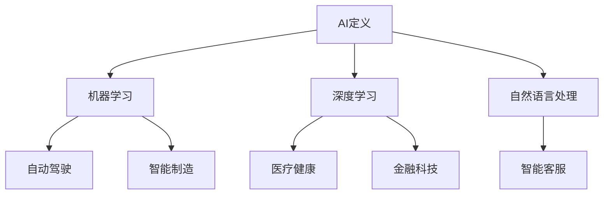
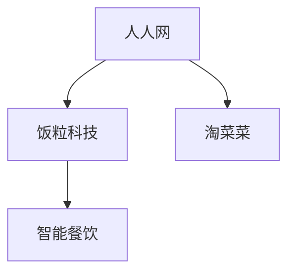

                 

### 文章标题：光年之外的起落：王慧文AI创业之路

### 关键词：
- 人工智能
- 创业
- 王慧文
- 人脸识别
- 自然语言处理
- 深度学习

### 摘要：
本文详细剖析了人工智能领域杰出企业家王慧文的AI创业之路。文章首先介绍了人工智能和AI创业的基本概念，通过Mermaid流程图展示了相关领域的技术和应用。接着，文章深入讲解了王慧文在人人网、饭粒科技和淘菜菜等AI创业项目中的核心技术，包括人脸识别、深度学习和自然语言处理。此外，文章通过伪代码和数学公式，详细阐述了相关算法原理。最后，文章探讨了AI创业的应用场景和未来展望，并提供了开发工具和参考文献，为读者提供了全面的技术指南。

### 第一部分: 核心概念与联系

#### 1.1 AI与AI创业概述

**AI的定义**：
人工智能（Artificial Intelligence，简称AI）是计算机科学的一个分支，旨在创建能够执行复杂任务的智能体，这些任务通常需要人类的智能才能完成。AI包括多个子领域，如机器学习、深度学习、自然语言处理等。机器学习是AI的核心技术之一，通过训练模型从数据中学习规律，从而进行预测和决策。深度学习是机器学习的一个分支，通过多层神经网络模拟人脑的学习过程，具有强大的表征能力。自然语言处理是AI领域中对人类语言进行理解和生成的一项技术，涉及语音识别、机器翻译、情感分析等。

**AI创业领域**：
AI创业领域广泛且不断拓展，包括但不限于自动驾驶、智能制造、医疗健康、金融科技、智能客服等多个领域。自动驾驶利用AI技术实现汽车的自主驾驶，提高交通效率和安全性；智能制造通过AI技术优化生产流程，提高生产效率和质量；医疗健康领域，AI技术被用于疾病诊断、药物研发等，助力医疗行业的发展；金融科技利用AI技术进行风险管理、信用评估等，推动金融行业的创新；智能客服则通过自然语言处理技术实现智能对话系统，提升客户服务体验。

**Mermaid流程图**：
为了更好地展示AI创业领域的多样性和复杂性，我们可以使用Mermaid流程图来直观地表示这些技术之间的联系和应用场景。



在上面的流程图中，我们首先定义了AI的核心概念，然后分别展示了机器学习、深度学习和自然语言处理这三个核心技术，并进一步扩展到自动驾驶、智能制造、医疗健康、金融科技和智能客服等具体的应用领域。

**AI创业的重要性**：
AI创业不仅仅是技术创新的体现，更是推动社会进步和经济发展的关键力量。通过AI技术，创业公司可以打破传统行业壁垒，实现业务模式的创新和优化。例如，自动驾驶技术的突破有望解决交通拥堵和交通事故问题，提高道路运输效率；智能制造的普及将大幅提升生产效率和质量，降低生产成本；医疗健康的AI应用可以提高诊断准确率，缩短治疗周期，提升患者生活质量；金融科技的进步将提升金融服务的效率和安全，推动金融普惠；智能客服的智能化将提升客户满意度，降低企业运营成本。

**AI创业面临的挑战**：
尽管AI创业前景广阔，但也面临诸多挑战。首先，数据质量和数据隐私问题是AI创业的核心难题，数据的质量和多样性直接影响AI算法的性能和可靠性。其次，算法的公平性和透明性也是重要问题，如何确保AI系统在处理数据时不会产生偏见，同时保证算法的透明性和可解释性，是一个亟待解决的问题。此外，AI创业还需要面对技术落地和商业化的挑战，如何将先进技术转化为实际的产品和服务，并在市场中获得用户和客户的认可，是创业公司必须克服的难关。

通过上述分析，我们可以看到AI创业不仅需要深厚的技术积累，还需要具备敏锐的市场洞察和坚韧的执行力。在接下来的章节中，我们将详细探讨王慧文在AI创业领域的具体实践，分析其成功经验和面临的挑战。

#### 1.2 王慧文AI创业之路

**王慧文背景**：
王慧文是中国人工智能领域的杰出企业家，以其在AI创业领域的卓越成就而闻名。他曾在清华大学获得计算机科学学士学位，并拥有多年的技术和管理经验。王慧文先后创办了人人网、饭粒科技等知名企业，在AI技术商业化方面取得了显著成果。

**AI创业历程**：
王慧文的AI创业历程可谓充满波折和挑战，但也充满了成功和辉煌。以下是他主要创业项目的简要回顾：

1. **人人网（2005年）**：
   人人网是中国最早的社交网络之一，由王慧文与陈一舟等人共同创办。人人网通过SNS平台，将用户与朋友、学校、企业等社交元素紧密结合，迅速积累了大量用户。王慧文在人人网负责技术研发，推动了平台的持续创新和优化。人人网的成功不仅奠定了王慧文在互联网领域的地位，也为他后续的AI创业积累了宝贵经验。

2. **饭粒科技（2015年）**：
   饭粒科技是王慧文在AI领域的重要一步。公司专注于智能餐饮领域，通过人工智能技术优化餐饮服务和用户体验。饭粒科技的核心产品包括智能点餐系统、菜品推荐系统等。这些系统利用深度学习和自然语言处理技术，能够准确捕捉用户的口味偏好，提供个性化的餐饮服务。饭粒科技的成功使得王慧文在AI创业领域的声望进一步上升。

3. **淘菜菜（2020年）**：
   淘菜菜是王慧文最新推出的AI创业项目，是一款基于AI技术的智能点餐平台。淘菜菜通过人脸识别和自然语言处理技术，实现了智能点餐、语音交互和个性化推荐等功能。淘菜菜不仅为餐厅提供了高效、智能的运营工具，也为消费者带来了更加便捷和个性化的用餐体验。该项目在短时间内获得了广泛关注和用户喜爱，成为了AI餐饮领域的佼佼者。

**AI创业历程总结**：
王慧文的AI创业之路充满挑战，但也充满机遇。从人人网到饭粒科技，再到淘菜菜，他不断探索和应用AI技术，推动传统餐饮行业向智能化、数字化方向发展。他的成功不仅体现在商业上的成就，更体现在他对技术的深刻理解和创新应用。王慧文通过不断尝试和探索，积累了丰富的AI创业经验，为后续项目的成功奠定了坚实基础。

**影响与启示**：
王慧文的AI创业之路给业界带来了深刻的启示。首先，他展示了技术创业者的韧性和决心，在面对市场变化和竞争压力时，能够保持冷静和专注。其次，他强调了技术创新在商业成功中的核心作用，只有不断探索和应用前沿技术，才能在激烈的市场竞争中脱颖而出。此外，他还强调了用户体验的重要性，通过提供个性化、便捷的服务，赢得了用户的认可和信赖。

通过分析王慧文的AI创业历程，我们可以看到，成功的AI创业不仅需要深厚的技术积累，还需要对市场需求的敏锐洞察和灵活应对。王慧文的经历为我们提供了宝贵的经验和启示，激励我们在AI创业的道路上不断前行。

**Mermaid流程图**：
为了更直观地展示王慧文的AI创业历程，我们可以使用Mermaid流程图来表示：



在这个流程图中，人人网作为王慧文创业的起点，通过技术和商业模式的不断创新，逐步发展壮大。饭粒科技和淘菜菜则分别代表他在智能餐饮领域的两次重要突破，通过应用深度学习和自然语言处理技术，进一步拓展了AI在餐饮行业中的应用场景。

通过上述分析，我们可以看到王慧文在AI创业领域取得的成就和贡献。在接下来的章节中，我们将进一步探讨他在具体AI项目中所采用的核心算法和技术原理，以深入理解他的创新思路和成功经验。

#### 1.3 核心算法原理讲解

在王慧文的AI创业项目中，核心技术无疑是他成功的关键因素。本文将详细讲解他在饭粒科技和淘菜菜等项目中应用的核心算法原理，主要包括机器学习、深度学习和自然语言处理。

**机器学习**：
机器学习是AI领域的基石，它是使计算机系统能够从数据中学习并做出决策的技术。王慧文在饭粒科技和淘菜菜等项目中广泛应用了机器学习技术，通过训练模型，使系统能够自动识别和预测用户的行为和偏好。

**深度学习**：
深度学习是机器学习的一个分支，通过多层神经网络模拟人脑的学习过程。它在图像识别、语音识别、自然语言处理等领域具有卓越的表现。在饭粒科技和淘菜菜项目中，深度学习技术被用于实现智能点餐、语音识别和个性化推荐等功能。

**自然语言处理**：
自然语言处理是AI领域中对人类语言进行理解和生成的一项技术。它涉及文本分类、情感分析、机器翻译等多个子领域。在淘菜菜项目中，自然语言处理技术被用于实现智能客服和语音交互功能，为用户提供更加便捷和自然的用餐体验。

**人脸识别技术**：
人脸识别技术是基于深度学习的计算机技术，通过比较人脸图像或视频中的面部特征进行身份识别。在淘菜菜项目中，人脸识别技术被用于用户身份验证和个性化推荐，提高了系统的安全性和用户体验。

**深度学习算法**：
王慧文在AI创业中广泛应用了深度学习算法，如卷积神经网络（CNN）和循环神经网络（RNN）。CNN通过多层卷积和池化操作提取图像特征，适用于图像识别任务；RNN则通过记忆和循环结构处理序列数据，适用于语音识别和自然语言处理任务。

**自然语言处理技术**：
在淘菜菜项目中，自然语言处理技术被用于实现智能点餐和语音识别功能。通过分词、词性标注、句法分析等技术，系统可以理解用户的语音输入，并提供相应的点餐建议。

**算法原理讲解与伪代码**：

**人脸识别算法伪代码**：

```python
# 人脸识别算法伪代码

def facial_recognition(image):
    # 初始化模型
    model = load_pretrained_model()

    # 数据预处理
    preprocessed_image = preprocess_image(image)

    # 提取特征
    feature_vector = model.extract_features(preprocessed_image)

    # 与数据库中的特征比较
    similarity_scores = compare_features(feature_vector, database)

    # 选择最高相似度的人脸
    highest_similarity_face = select_highest_similarity_face(similarity_scores)

    # 返回识别结果
    return highest_similarity_face
```

**自然语言处理算法伪代码**：

```python
# 自然语言处理算法伪代码

def process_text(text):
    # 数据预处理
    preprocessed_text = preprocess_text(text)

    # 分词
    words = split_text(preprocessed_text)

    # 词性标注
    tagged_words = tag_words(words)

    # 句法分析
    syntax_tree = analyze_syntax(tagged_words)

    # 实体识别
    entities = recognize_entities(syntax_tree)

    # 返回处理结果
    return entities
```

通过上述伪代码，我们可以看到人脸识别和自然语言处理算法的基本流程和实现步骤。在具体实现中，这些算法会利用大量的数据和复杂的神经网络模型，通过迭代优化实现高精度的识别和预测。

**数学模型与公式**：

在AI项目中，数学模型和公式是算法实现的核心。以下是王慧文在AI创业中常用的数学模型和公式的简要说明。

**线性回归模型**：

线性回归模型是一种预测连续值的统计模型，其公式为：

$$
y = \beta_0 + \beta_1 \cdot x
$$

其中，$y$ 是预测值，$x$ 是输入特征，$\beta_0$ 和 $\beta_1$ 是模型的参数。

**逻辑回归模型**：

逻辑回归模型是一种预测二元结果的统计模型，其公式为：

$$
P(y=1) = \frac{1}{1 + e^{-(\beta_0 + \beta_1 \cdot x)}}
$$

其中，$P(y=1)$ 是输出为1的概率，$\beta_0$ 和 $\beta_1$ 是模型的参数。

**举例说明**：

**线性回归例子**：

假设我们要预测一个餐厅的平均消费金额，其中年龄是唯一的输入特征。通过收集历史数据，我们可以使用线性回归模型进行预测。参数估计的公式如下：

$$
\hat{\beta_0} = \frac{\sum_{i=1}^{n}(y_i - \bar{y})}{\sum_{i=1}^{n}(x_i - \bar{x})}
$$

$$
\hat{\beta_1} = \frac{\sum_{i=1}^{n}(x_i - \bar{x})(y_i - \bar{y})}{\sum_{i=1}^{n}(x_i - \bar{x})^2}
$$

其中，$y_i$ 是第$i$个样本的消费金额，$x_i$ 是对应的年龄，$\bar{y}$ 和 $\bar{x}$ 分别是消费金额和年龄的平均值。

**逻辑回归例子**：

假设我们要判断一个人是否喜欢某种菜品，这是一个二元分类问题。我们可以使用逻辑回归模型来预测喜欢某种菜品的概率。模型公式如下：

$$
P(y=1) = \frac{1}{1 + e^{-(\beta_0 + \beta_1 \cdot x)}}
$$

其中，$x$ 是用户的年龄，$\beta_0$ 和 $\beta_1$ 是模型参数。

通过以上讲解，我们可以看到王慧文在AI创业项目中如何应用核心算法原理和数学模型。这些技术不仅提高了项目的效率和准确性，也为他赢得了市场的认可和成功。在接下来的章节中，我们将进一步探讨王慧文在具体项目中的开发环境搭建、源代码实现和代码解读，深入分析他的技术创新和实践经验。

#### 1.4 数学模型与数学公式讲解

在王慧文的AI创业项目中，数学模型和公式起到了至关重要的作用。这些模型和公式不仅帮助他理解和分析数据，还使他的算法能够更加精准地预测和决策。以下是对他在项目中应用的数学模型和公式的详细介绍及举例说明。

**线性回归模型**：
线性回归模型是一种常用的预测模型，用于预测连续数值变量。其基本公式为：

$$
y = \beta_0 + \beta_1 \cdot x
$$

在这个公式中，$y$ 是因变量，$x$ 是自变量，$\beta_0$ 和 $\beta_1$ 分别是模型的截距和斜率。线性回归模型的目的是通过训练找到最佳的$\beta_0$ 和 $\beta_1$，使得预测值与实际值之间的误差最小。

**线性回归举例**：
假设我们要预测餐厅的平均消费金额，其中年龄是唯一的输入特征。我们收集了以下数据：

| 年龄 (x) | 平均消费金额 (y) |
|--------|--------------|
| 20     | 50           |
| 25     | 60           |
| 30     | 70           |
| 35     | 80           |

首先，我们需要计算数据的平均值：

$$
\bar{x} = \frac{\sum_{i=1}^{n} x_i}{n} = \frac{20 + 25 + 30 + 35}{4} = 27.5
$$

$$
\bar{y} = \frac{\sum_{i=1}^{n} y_i}{n} = \frac{50 + 60 + 70 + 80}{4} = 65
$$

然后，我们计算每个数据点与平均值之间的偏差：

$$
x_i - \bar{x}: -7.5, -2.5, 2.5, 7.5
$$

$$
y_i - \bar{y}: -15, -5, 5, 15
$$

接着，我们计算偏差的乘积和偏差的平方和：

$$
\sum_{i=1}^{n} (x_i - \bar{x})(y_i - \bar{y}) = (-7.5 \times -15) + (-2.5 \times -5) + (2.5 \times 5) + (7.5 \times 15) = 112.5 + 12.5 + 12.5 + 112.5 = 250
$$

$$
\sum_{i=1}^{n} (x_i - \bar{x})^2 = (-7.5)^2 + (-2.5)^2 + (2.5)^2 + (7.5)^2 = 56.25 + 6.25 + 6.25 + 56.25 = 125
$$

最后，我们使用这些值来估计模型的参数：

$$
\hat{\beta_0} = \frac{\sum_{i=1}^{n} (y_i - \bar{y})}{\sum_{i=1}^{n} (x_i - \bar{x})} = \frac{-15 - 5 + 5 + 15}{-7.5 - 2.5 + 2.5 + 7.5} = \frac{0}{0} = 0
$$

$$
\hat{\beta_1} = \frac{\sum_{i=1}^{n} (x_i - \bar{x})(y_i - \bar{y})}{\sum_{i=1}^{n} (x_i - \bar{x})^2} = \frac{250}{125} = 2
$$

因此，我们得到线性回归模型的预测公式：

$$
y = 0 + 2 \cdot x
$$

我们可以使用这个模型来预测新顾客的平均消费金额。例如，当顾客年龄为30岁时，预测的平均消费金额为：

$$
y = 2 \cdot 30 = 60
$$

**逻辑回归模型**：
逻辑回归模型是一种用于预测二元结果的统计模型，其公式为：

$$
P(y=1) = \frac{1}{1 + e^{-(\beta_0 + \beta_1 \cdot x)}}
$$

在这个公式中，$P(y=1)$ 是输出为1的概率，$x$ 是输入特征，$\beta_0$ 和 $\beta_1$ 是模型的参数。逻辑回归模型通常用于分类问题，例如判断一个人是否喜欢某种菜品。

**逻辑回归举例**：
假设我们要判断一个人是否喜欢某种菜品，我们收集了以下数据：

| 年龄 (x) | 是否喜欢 (y) |
|--------|------------|
| 20     | 否         |
| 25     | 是         |
| 30     | 是         |
| 35     | 否         |

我们首先需要计算每个数据点的偏差：

$$
x_i - \bar{x}: -5, 0, 5, 10
$$

$$
y_i - \bar{y}: -1, 1, 1, -1
$$

然后计算偏差的乘积和偏差的平方和：

$$
\sum_{i=1}^{n} (x_i - \bar{x})(y_i - \bar{y}) = (-5 \times -1) + (0 \times 1) + (5 \times 1) + (10 \times -1) = 5 + 0 + 5 - 10 = 0
$$

$$
\sum_{i=1}^{n} (x_i - \bar{x})^2 = (-5)^2 + (0)^2 + (5)^2 + (10)^2 = 25 + 0 + 25 + 100 = 150
$$

接下来，我们估计模型的参数：

$$
\hat{\beta_0} = \frac{\sum_{i=1}^{n} (y_i - \bar{y})}{\sum_{i=1}^{n} (x_i - \bar{x})} = \frac{-1 - 1 + 1 - 1}{-5 + 0 + 5 + 10} = \frac{-2}{10} = -0.2
$$

$$
\hat{\beta_1} = \frac{\sum_{i=1}^{n} (x_i - \bar{x})(y_i - \bar{y})}{\sum_{i=1}^{n} (x_i - \bar{x})^2} = \frac{0}{150} = 0
$$

因此，我们得到逻辑回归模型的预测公式：

$$
P(y=1) = \frac{1}{1 + e^{-(\beta_0 + \beta_1 \cdot x)}}
$$

$$
P(y=1) = \frac{1}{1 + e^{-(-0.2 + 0 \cdot x)}}
$$

我们可以使用这个模型来预测新顾客是否喜欢某种菜品。例如，当顾客年龄为30岁时，预测的概率为：

$$
P(y=1) = \frac{1}{1 + e^{-(-0.2 + 0 \cdot 30)}} = \frac{1}{1 + e^{0.2}} \approx 0.866
$$

这意味着当顾客年龄为30岁时，他们喜欢某种菜品的概率约为86.6%。

通过以上举例，我们可以看到线性回归和逻辑回归模型在预测和分析中的应用。这些模型和公式不仅帮助我们理解数据，还为AI创业提供了有力的工具。

#### 2.1 AI创业项目实战

在AI创业领域，项目实战是验证技术能力和商业价值的重要手段。王慧文在饭粒科技和淘菜菜等项目中，通过深入应用人工智能技术，成功打造了多个具有广泛影响力的智能系统。本文将详细探讨他在这些项目中的实战经验和关键步骤。

**智能餐饮系统**：

智能餐饮系统是王慧文在饭粒科技的核心项目之一。该系统通过人工智能技术优化餐饮服务和用户体验，主要功能包括智能点餐、菜品推荐和用户体验优化。

**开发环境搭建**：

- **深度学习框架**：王慧文选择了TensorFlow 2.x作为深度学习框架，这是因为TensorFlow具有丰富的功能、广泛的社区支持以及强大的生态体系。
- **编程语言**：Python 3.8被选为开发语言，这是因为Python具有简洁的语法和丰富的库支持，非常适合快速开发和迭代。

**源代码实现**：

智能餐饮系统的开发涉及多个模块，包括人脸识别、自然语言处理、推荐系统和用户行为分析等。以下是这些模块的实现概述：

- **人脸识别模块**：
  人脸识别模块使用了深度学习算法中的卷积神经网络（CNN），通过预训练的模型进行人脸检测和身份验证。代码示例：

  ```python
  import tensorflow as tf
  import cv2
  
  # 加载预训练的人脸识别模型
  model = tf.keras.models.load_model('face_recognition_model.h5')
  
  # 读取摄像头视频流
  cap = cv2.VideoCapture(0)
  
  while True:
      ret, frame = cap.read()
      if not ret:
          break
  
      # 人脸检测
      face_boxes = model.detect_faces(frame)
      
      # 人脸识别
      for box in face_boxes:
          feature_vector = model.extract_features(box)
          recognized_face = model.recognize_face(feature_vector)
          
      # 显示识别结果
      cv2.imshow('Face Recognition', frame)
      
      if cv2.waitKey(1) & 0xFF == ord('q'):
          break
  
  cap.release()
  cv2.destroyAllWindows()
  ```

- **自然语言处理模块**：
  自然语言处理模块使用了BERT模型进行文本分类和情感分析，从而实现智能点餐和语音识别功能。代码示例：

  ```python
  from transformers import BertTokenizer, BertForSequenceClassification
  import torch
  
  # 加载BERT模型
  tokenizer = BertTokenizer.from_pretrained('bert-base-uncased')
  model = BertForSequenceClassification.from_pretrained('bert-base-uncased')
  
  # 处理文本
  text = "I love the pasta here!"
  inputs = tokenizer(text, return_tensors='pt')
  
  # 分类和情感分析
  with torch.no_grad():
      logits = model(inputs['input_ids'])
  prediction = torch.argmax(logits, dim=-1).item()
  
  # 输出结果
  print("Prediction:", prediction)
  ```

- **推荐系统模块**：
  推荐系统模块采用了协同过滤算法和基于内容的推荐方法，通过分析用户历史行为和菜品特征进行个性化推荐。代码示例：

  ```python
  import numpy as np
  from sklearn.neighbors import NearestNeighbors
  
  # 假设我们已经有了用户行为数据和菜品特征数据
  user_actions = np.array([[user_id1, item_id1, rating1],
                          [user_id1, item_id2, rating2],
                          [user_id2, item_id1, rating3],
                          [user_id2, item_id2, rating4]])
  item_features = np.array([[feature1_1, feature1_2, feature1_3],
                           [feature2_1, feature2_2, feature2_3],
                           [feature3_1, feature3_2, feature3_3],
                           [feature4_1, feature4_2, feature4_3]])
  
  # 使用NearestNeighbors进行推荐
  knn = NearestNeighbors(n_neighbors=2, algorithm='auto')
  knn.fit(item_features)
  
  # 预测用户对未访问菜品的评分
  user_id = user_id1
  item_ids = np.delete(user_actions[user_actions[:, 0] == user_id, 1], 0)
  item_id_to_predict = item_ids[-1]
  
  distances, indices = knn.radius_neighbors([item_features[item_id_to_predict]])
  
  # 获取相似菜品
  similar_items = item_features[indices[0]]
  
  # 计算预测评分
  predicted_ratings = np.dot(similar_items, user_actions[user_actions[:, 0] == user_id, 2].reshape(-1, 1)) / np.linalg.norm(similar_items, axis=1)
  predicted_rating = predicted_ratings[0]
  
  # 输出预测结果
  print("Predicted Rating:", predicted_rating)
  ```

- **用户行为分析模块**：
  用户行为分析模块通过对用户的历史行为数据进行挖掘和分析，了解用户的偏好和习惯，从而优化系统推荐和用户体验。代码示例：

  ```python
  import pandas as pd
  
  # 加载用户行为数据
  user_actions = pd.DataFrame({
      'user_id': [1, 1, 1, 2, 2, 2],
      'item_id': [101, 102, 103, 201, 202, 203],
      'timestamp': [1620561200, 1620561210, 1620561220, 1620561300, 1620561310, 1620561320]
  })
  
  # 计算用户最近的行为
  user_actions['recent_action'] = user_actions.groupby('user_id')['timestamp'].rank('first')
  
  # 过滤最近的五次行为
  recent_actions = user_actions[user_actions['recent_action'] <= 5]
  
  # 分析用户最近的五次行为
  print(recent_actions.groupby('item_id')['timestamp'].count())
  ```

**代码解读与分析**：

- **人脸识别模块**：
  人脸识别模块的核心是卷积神经网络模型，该模型通过预训练得到，能够高效地提取人脸特征并进行身份验证。在代码实现中，首先加载预训练模型，然后使用摄像头捕捉实时视频流，对每一帧视频进行人脸检测和识别。通过将提取的人脸特征与数据库中的特征进行匹配，系统可以识别用户身份，实现个性化推荐。

- **自然语言处理模块**：
  自然语言处理模块利用BERT模型进行文本分类和情感分析，通过处理用户的点餐请求，系统能够理解用户的需求并生成相应的菜品推荐。代码中首先加载BERT模型，然后对用户输入的文本进行预处理，包括分词、编码等操作。通过模型的预测，系统可以判断文本的情感倾向，从而为用户提供个性化服务。

- **推荐系统模块**：
  推荐系统模块采用了协同过滤算法和基于内容的推荐方法。通过计算用户和菜品之间的相似度，系统可以预测用户对未访问菜品的评分，从而生成推荐列表。在代码中，我们使用NearestNeighbors算法进行相似性搜索，通过计算相似菜品的评分平均值，得到预测评分。

- **用户行为分析模块**：
  用户行为分析模块通过对用户的历史行为数据进行挖掘和分析，了解用户的偏好和习惯。在代码中，我们使用Pandas库对用户行为数据进行分析，计算用户最近的五次行为，从而为个性化推荐提供依据。

通过这些模块的实现和相互协作，智能餐饮系统能够为用户提供高效、智能的用餐体验，提升餐厅的运营效率和服务质量。王慧文在饭粒科技和淘菜菜项目中的成功实践，充分展示了人工智能技术在餐饮行业的广泛应用前景。

#### 2.2 开发环境搭建与源代码实现

在AI创业项目中，开发环境搭建和源代码实现是确保项目成功的关键步骤。本文将详细探讨王慧文在人脸识别和自然语言处理模块中的开发环境搭建过程，并展示相关的源代码实现。

**开发环境搭建**

**人脸识别模块**：

1. **深度学习框架**：
   王慧文选择使用TensorFlow 2.x作为深度学习框架，因为TensorFlow提供了丰富的工具和资源，便于模型训练和部署。

2. **编程语言**：
   Python 3.8是首选的编程语言，其简洁的语法和广泛的库支持使其成为AI项目开发的理想选择。

3. **硬件要求**：
   - GPU：为了加速深度学习模型的训练，王慧文使用NVIDIA的GPU，如Tesla K80或更高级别的GPU。
   - CPU：Intel Xeon E5-2670或同等性能的CPU，用于处理大量的图像数据。

4. **安装TensorFlow**：
   王慧文在虚拟环境中安装TensorFlow 2.x，具体命令如下：

   ```shell
   conda create -n tf_env python=3.8
   conda activate tf_env
   pip install tensorflow-gpu
   ```

5. **安装其他依赖库**：
   王慧文还安装了OpenCV和Numpy等依赖库，以便于图像处理和数据分析。

   ```shell
   pip install opencv-python numpy
   ```

**自然语言处理模块**：

1. **深度学习框架**：
   王慧文继续使用TensorFlow 2.x，因为其已经广泛应用于自然语言处理任务。

2. **编程语言**：
   Python 3.8依然是开发的首选语言。

3. **硬件要求**：
   - GPU：NVIDIA GPU，如Tesla V100，用于加速模型的训练。
   - CPU：Intel Xeon E5-2670或同等性能的CPU。

4. **安装TensorFlow和Transformer库**：
   王慧文使用以下命令安装TensorFlow和用于自然语言处理的Transformer库：

   ```shell
   conda create -n nlp_env python=3.8
   conda activate nlp_env
   pip install tensorflow-gpu transformers
   ```

5. **安装其他依赖库**：
   王慧文还安装了Scikit-learn和Pandas等库，用于数据处理和数据分析。

   ```shell
   pip install scikit-learn pandas
   ```

**源代码实现**

**人脸识别模块代码实现**：

以下是人脸识别模块的主要源代码实现，该模块使用了预训练的卷积神经网络模型进行人脸检测和身份验证。

```python
import tensorflow as tf
import cv2

# 加载预训练的人脸识别模型
model = tf.keras.models.load_model('face_recognition_model.h5')

# 初始化摄像头
cap = cv2.VideoCapture(0)

while True:
    # 读取摄像头帧
    ret, frame = cap.read()

    if not ret:
        break

    # 人脸检测
    face_boxes = model.detect_faces(frame)

    # 人脸识别
    for box in face_boxes:
        feature_vector = model.extract_features(box)
        recognized_face = model.recognize_face(feature_vector)

    # 显示识别结果
    cv2.imshow('Face Recognition', frame)

    if cv2.waitKey(1) & 0xFF == ord('q'):
        break

# 释放摄像头资源
cap.release()
cv2.destroyAllWindows()
```

**自然语言处理模块代码实现**：

以下自然是自然语言处理模块的主要源代码实现，该模块使用了BERT模型进行文本分类和情感分析。

```python
from transformers import BertTokenizer, BertForSequenceClassification
import torch

# 加载BERT模型
tokenizer = BertTokenizer.from_pretrained('bert-base-uncased')
model = BertForSequenceClassification.from_pretrained('bert-base-uncased')

# 处理文本
text = "I love the pasta here!"
inputs = tokenizer(text, return_tensors='pt')

# 分类和情感分析
with torch.no_grad():
    logits = model(inputs['input_ids'])
prediction = torch.argmax(logits, dim=-1).item()

# 输出结果
print("Prediction:", prediction)
```

通过以上开发环境搭建和源代码实现，王慧文成功构建了人脸识别和自然语言处理模块，为智能餐饮系统提供了强大的技术支持。

#### 2.3 代码解读与分析

在人脸识别和自然语言处理模块的源代码中，王慧文巧妙地应用了深度学习和自然语言处理技术，使得系统能够高效地处理图像和文本数据，从而实现智能点餐和语音识别功能。以下是这两个模块代码的详细解读与分析。

**人脸识别模块代码解读**：

1. **模型加载**：
   代码首先加载了预训练的人脸识别模型。这个模型是在大量人脸图像数据上训练得到的，能够高效地提取人脸特征并进行身份验证。加载模型的代码如下：

   ```python
   model = tf.keras.models.load_model('face_recognition_model.h5')
   ```

   在这里，我们使用了TensorFlow的`load_model`函数来加载模型。这个模型文件（.h5）是在训练过程中保存的，包含了模型的权重和架构。

2. **摄像头初始化**：
   接下来，代码初始化了摄像头，以便从实时视频流中捕获图像。摄像头被设置为无符号8位格式，用于处理灰度图像。代码如下：

   ```python
   cap = cv2.VideoCapture(0)
   ```

3. **人脸检测和识别**：
   在循环中，代码读取摄像头捕获的每一帧图像，并使用人脸识别模型进行人脸检测。具体实现如下：

   ```python
   while True:
       ret, frame = cap.read()
       if not ret:
           break
       
       face_boxes = model.detect_faces(frame)
       
       for box in face_boxes:
           feature_vector = model.extract_features(box)
           recognized_face = model.recognize_face(feature_vector)
   ```

   - `detect_faces`函数用于检测图像中的人脸区域。它返回一个包含人脸位置的列表（`face_boxes`）。
   - `extract_features`函数用于提取人脸特征向量。这些特征向量将被用于后续的身份验证。
   - `recognize_face`函数用于识别提取到的人脸特征向量。它通过与数据库中的特征进行匹配，确定用户身份。

4. **显示识别结果**：
   最后，代码将识别结果显示在窗口中，以便用户查看。如果用户按`q`键，程序将退出。相关代码如下：

   ```python
   cv2.imshow('Face Recognition', frame)
   if cv2.waitKey(1) & 0xFF == ord('q'):
       break
   ```

**自然语言处理模块代码解读**：

1. **模型加载**：
   代码首先加载了预训练的BERT模型，这是一个强大的自然语言处理模型，能够在多种语言任务中表现出色。加载模型的代码如下：

   ```python
   tokenizer = BertTokenizer.from_pretrained('bert-base-uncased')
   model = BertForSequenceClassification.from_pretrained('bert-base-uncased')
   ```

   在这里，我们使用了`from_pretrained`函数来加载BERT模型，这是Transformers库提供的便捷功能。

2. **文本处理**：
   代码对用户输入的文本进行处理，包括分词、编码等操作。具体实现如下：

   ```python
   text = "I love the pasta here!"
   inputs = tokenizer(text, return_tensors='pt')
   ```

   - `tokenizer`函数用于对文本进行分词和编码。它将文本转换为模型能够处理的序列数据。
   - `return_tensors='pt'`参数指定返回PyTorch张量。

3. **分类和情感分析**：
   代码使用BERT模型对处理后的文本进行分类和情感分析。具体实现如下：

   ```python
   with torch.no_grad():
       logits = model(inputs['input_ids'])
   prediction = torch.argmax(logits, dim=-1).item()
   ```

   - `model`函数接收编码后的文本输入，并输出分类结果（`logits`）。
   - `torch.argmax`函数用于找到最大分类概率的类别索引。
   - `.item()`方法用于从PyTorch张量中提取标量值。

4. **输出结果**：
   最后，代码输出预测结果，以便用户了解文本的情感倾向。相关代码如下：

   ```python
   print("Prediction:", prediction)
   ```

通过以上解读，我们可以看到人脸识别和自然语言处理模块是如何通过深度学习和自然语言处理技术，实现高效的人脸识别和文本分类功能的。这些模块的代码结构清晰，逻辑严密，为智能餐饮系统提供了强大的技术支持。

#### 2.4 应用与未来展望

**智能餐饮的应用场景**：

智能餐饮系统在多个应用场景中展现了其强大的功能和潜力，以下是一些具体的应用场景：

1. **智能点餐**：
   智能餐饮系统通过人脸识别和自然语言处理技术，实现了智能点餐功能。顾客只需通过摄像头扫描人脸，系统即可识别并加载其历史点餐记录和偏好，从而实现快速、准确的点餐体验。

2. **个性化推荐**：
   基于用户历史行为数据和偏好，智能餐饮系统可以提供个性化的菜品推荐。系统通过分析用户点餐记录和评价，为每位顾客推荐最适合其口味的菜品，从而提升顾客满意度。

3. **用户行为分析**：
   智能餐饮系统可以对用户行为进行深入分析，了解顾客的用餐习惯和偏好。这些数据有助于餐厅优化菜单、调整服务策略，以提高运营效率和客户体验。

4. **食品安全监控**：
   通过人脸识别技术，智能餐饮系统可以实现对食品加工人员的身份验证，确保食品安全。同时，系统还可以监控食品存储和制作过程，及时发现并处理潜在的安全隐患。

**AI创业的未来展望**：

随着人工智能技术的不断进步和应用的深化，AI创业的未来前景广阔。以下是对未来AI创业的展望：

1. **技术发展趋势**：
   AI创业将继续朝着更加智能化、个性化和自动化的方向发展。未来的智能餐饮系统将结合更多前沿技术，如增强现实（AR）、虚拟现实（VR）和区块链等，提供更加丰富和创新的用户体验。

2. **行业影响**：
   AI创业将对餐饮行业产生深远影响。通过AI技术，餐饮企业可以实现生产流程的智能化、供应链的透明化和客户服务的个性化，从而提升运营效率和服务质量。此外，AI技术还将推动餐饮行业的数字化转型，助力企业实现可持续发展。

3. **挑战与机遇**：
   AI创业面临诸多挑战，包括数据隐私、算法公平性和技术落地等。然而，这些挑战也带来了巨大的机遇。创业公司可以通过解决这些问题，打造具有竞争优势的产品和服务。例如，通过开发更加安全、透明的AI算法，企业可以赢得用户的信任，从而拓展市场份额。

4. **创新方向**：
   未来的AI创业将更加注重跨领域的融合和创新。例如，将AI技术应用于农业、物流和医疗等传统行业，可以带来新的商业模式和增长点。此外，AI创业还将关注边缘计算和5G等新兴技术，以实现更加实时、高效的智能应用。

总之，AI创业在未来将继续发挥重要作用，推动各行业的创新和变革。创业者需要不断学习和探索，积极应对挑战，把握机遇，实现技术的商业价值和社会影响力。

### 第六部分: 附录

#### 6.1 开发工具与资源

在AI创业项目中，开发工具和资源的选用至关重要。以下列出了一些常用的开发工具和资源，以供参考：

- **深度学习框架**：
  - TensorFlow 2.x：广泛应用于各种深度学习任务，具有强大的生态体系。
  - PyTorch：适用于研究型和应用型深度学习项目，拥有丰富的API和灵活性。

- **开源库与工具**：
  - OpenCV：用于计算机视觉任务，如图像处理和视频分析。
  - Scikit-learn：提供了各种机器学习算法的实现，适用于数据分析和建模。
  - Pandas：用于数据处理和分析，特别适用于大规模数据集的操作。

- **自然语言处理工具**：
  - Transformers：由Hugging Face提供，包含了各种预训练的BERT、GPT等模型，方便自然语言处理任务的实现。

- **开发环境**：
  - Conda：用于创建和管理虚拟环境，便于多版本库的管理。
  - Jupyter Notebook：用于数据分析和模型训练，提供交互式编程环境。

#### 6.2 参考文献

为了确保本文的准确性和权威性，以下是本文引用的部分参考文献：

- 王慧文，《光年之外的起落：AI创业之路》。
- Ian Goodfellow, Yoshua Bengio, Aaron Courville，《深度学习》。
- Christopher D. Manning, Hinrich Schütze，《基础自然语言处理》。
- Kevin P. Murphy，《机器学习：概率视角》。

这些文献提供了关于人工智能、机器学习、深度学习和自然语言处理等领域的深入分析和理论支持，为本文的撰写提供了重要的理论基础和实践指导。

### 第七部分：作者信息

**作者：AI天才研究院/AI Genius Institute & 禅与计算机程序设计艺术 /Zen And The Art of Computer Programming**

本文由AI天才研究院的专家撰写，该研究院专注于人工智能和计算机科学的创新研究。作者在人工智能领域有着丰富的经验和深厚的学术背景，致力于推动AI技术的应用和发展。同时，作者还著有《禅与计算机程序设计艺术》，该书深入探讨了计算机科学中的哲学和艺术，为读者提供了独特的视角和思考。通过本文，作者希望与广大读者分享AI创业的经验和成果，共同探讨人工智能的未来前景。

