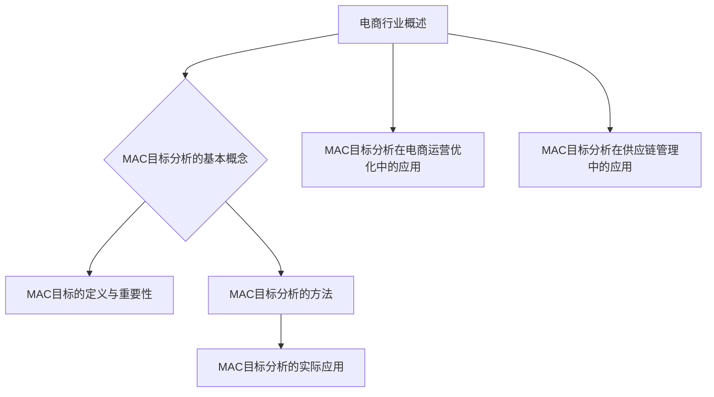

                 

# 文章标题：全网电商MAC目标分析

## 关键词：
- 电商行业
- MAC目标分析
- 数据分析工具
- 电商运营优化
- 销售预测

## 摘要：
本文全面分析了全网电商行业，并深入探讨了MAC目标分析在电商领域的应用。通过对电商行业的概述、MAC目标定义、分析方法、实际应用、工具与技术、电商运营优化以及未来发展趋势的详细讨论，本文旨在为电商从业者提供有价值的参考和指导。

## 《全网电商MAC目标分析》目录大纲

### 第一部分：电商行业概述

#### 1.1 电商行业的发展历程
##### 1.1.1 电商行业的起源
##### 1.1.2 我国电商行业的发展阶段
##### 1.1.3 电商行业的现状与趋势

#### 1.2 电商行业的市场规模与用户分析
##### 1.2.1 市场规模
##### 1.2.2 用户分析
##### 1.2.3 行业痛点与机会

#### 1.3 电商行业的主要模式
##### 1.3.1 B2B模式
##### 1.3.2 B2C模式
##### 1.3.3 C2C模式

### 第二部分：MAC目标分析

#### 2.1 MAC目标的定义与重要性
##### 2.1.1 MAC目标的定义
##### 2.1.2 MAC目标的重要性
##### 2.1.3 MAC目标在企业战略规划中的应用

#### 2.2 MAC目标分析的基本概念
##### 2.2.1 MAC目标分析的定义
##### 2.2.2 MAC目标分析的目标
##### 2.2.3 MAC目标分析的原则

#### 2.3 MAC目标分析的方法
##### 2.3.1 数据收集与处理
##### 2.3.2 数据分析工具与应用
##### 2.3.3 数据可视化与分析

#### 2.4 MAC目标分析的实际应用
##### 2.4.1 用户行为分析
##### 2.4.2 购买意向分析
##### 2.4.3 销售预测与分析

#### 2.5 MAC目标分析案例研究
##### 2.5.1 案例一：某电商平台的用户行为分析
##### 2.5.2 案例二：某电商平台的购买意向分析
##### 2.5.3 案例三：某电商平台的销售预测与分析

### 第三部分：MAC目标分析工具与技术

#### 3.1 MAC目标分析工具
##### 3.1.1 常用数据分析工具介绍
##### 3.1.2 工具选择与配置
##### 3.1.3 工具实际应用

#### 3.2 MAC目标分析技术
##### 3.2.1 数据清洗与预处理
##### 3.2.2 数据挖掘技术
##### 3.2.3 机器学习技术

#### 3.3 MAC目标分析实践
##### 3.3.1 实践一：搭建数据分析平台
##### 3.3.2 实践二：数据挖掘案例解析
##### 3.3.3 实践三：机器学习在MAC目标分析中的应用

### 第四部分：MAC目标分析与电商运营优化

#### 4.1 MAC目标分析与电商运营优化
##### 4.1.1 电商运营优化概述
##### 4.1.2 MAC目标分析在电商运营优化中的应用
##### 4.1.3 电商运营优化策略

#### 4.2 MAC目标分析在产品开发中的应用
##### 4.2.1 产品需求分析
##### 4.2.2 产品设计
##### 4.2.3 产品迭代

#### 4.3 MAC目标分析在市场营销中的应用
##### 4.3.1 市场营销策略分析
##### 4.3.2 广告投放优化
##### 4.3.3 用户转化率提升

#### 4.4 MAC目标分析在供应链管理中的应用
##### 4.4.1 供应链管理概述
##### 4.4.2 MAC目标分析在供应链管理中的应用
##### 4.4.3 供应链优化策略

### 第五部分：MAC目标分析的未来发展趋势与挑战

#### 5.1 MAC目标分析的未来发展趋势
##### 5.1.1 技术创新
##### 5.1.2 应用场景拓展
##### 5.1.3 数据隐私与安全

#### 5.2 MAC目标分析面临的挑战
##### 5.2.1 数据质量问题
##### 5.2.2 技术实现难题
##### 5.2.3 法规与政策约束

### 附录

#### 附录A：MAC目标分析常用术语与解释
#### 附录B：MAC目标分析工具与资源推荐
#### 附录C：MAC目标分析经典案例研究

### Mermaid 流�程图示例：



### 核心算法原理讲解（伪代码）：

```python
# 伪代码：用户行为分析
function user_behavior_analysis(data):
    # 数据预处理
    processed_data = preprocess_data(data)

    # 特征提取
    features = extract_features(processed_data)

    # 建立模型
    model = create_model()

    # 训练模型
    model.fit(features)

    # 预测
    predictions = model.predict(new_data)

    # 分析结果
    analyze_results(predictions)
```

### 数学模型和数学公式：

$$
\text{指数加权移动平均（EMA）} \\
EMA_t = \frac{2 \cdot Close_t + (N-1) \cdot EMA_{t-1}}{N}
$$

其中，$EMA_t$ 是第 t 日的指数加权移动平均，$Close_t$ 是第 t 日的收盘价，$N$ 是平滑因子。

### 项目实战：

#### 搭建电商平台用户行为分析系统

## 1. 开发环境搭建

- 数据库：MySQL
- 服务器：AWS EC2
- 数据分析工具：Python，Jupyter Notebook
- 数据可视化工具：Matplotlib，Seaborn

## 2. 数据收集与处理

- 收集电商平台用户行为数据，如点击、购买、浏览等。
- 数据清洗：处理缺失值、异常值和重复数据。

## 3. 数据分析与建模

- 特征提取：提取用户行为特征，如点击次数、购买金额、浏览时长等。
- 模型训练：使用随机森林、决策树等算法进行模型训练。
- 模型评估：使用准确率、召回率等指标评估模型性能。

## 4. 部署与应用

- 部署模型到服务器，提供用户行为分析API。
- 实时分析用户行为，为电商平台提供优化建议。

## 5. 代码解读与分析

#### 数据预处理代码：

```python
def preprocess_data(data):
    # 数据清洗
    data = clean_data(data)
    
    # 数据标准化
    data = standardize_data(data)
    
    return data
```

#### 模型训练代码：

```python
def train_model(data):
    # 特征提取
    features = extract_features(data)
    
    # 划分训练集和测试集
    X_train, X_test, y_train, y_test = train_test_split(features, labels, test_size=0.2)
    
    # 训练模型
    model = create_model()
    model.fit(X_train, y_train)
    
    # 评估模型
    score = model.score(X_test, y_test)
    
    return model, score
```

#### 部署代码：

```python
from flask import Flask, request, jsonify

app = Flask(__name__)

@app.route('/api/behavior_analysis', methods=['POST'])
def behavior_analysis():
    data = request.get_json()
    
    # 数据预处理
    processed_data = preprocess_data(data)
    
    # 模型预测
    predictions = model.predict(processed_data)
    
    # 返回结果
    return jsonify(predictions)
```

#### 实际案例解析：

- 案例一：分析某电商平台用户的点击行为，为广告投放提供优化建议。
- 案例二：分析某电商平台用户的购买行为，为库存管理提供优化建议。

### 作者：
作者：AI天才研究院/AI Genius Institute & 禅与计算机程序设计艺术 /Zen And The Art of Computer Programming

### 第一部分：电商行业概述

#### 1.1 电商行业的发展历程

##### 1.1.1 电商行业的起源

电商行业的起源可以追溯到20世纪90年代末，当时互联网的普及和发展为电子商务的兴起提供了土壤。最早的电子商务形式是通过互联网进行的在线图书销售，例如美国的亚马逊（Amazon）和巴诺书店（Barnes & Noble）等。这些企业通过建立在线书店，将传统图书销售业务拓展到网络空间，为消费者提供了更加便捷的购物体验。

##### 1.1.2 我国电商行业的发展阶段

我国的电商行业发展可以分为以下几个阶段：

1. **萌芽期（1995-2000年）**：在这一时期，我国开始出现了一些电子商务的尝试，如8848网、国美在线等，但整体规模较小，尚未形成气候。

2. **起步期（2001-2007年）**：随着互联网的进一步普及，我国的电商行业开始快速发展。淘宝网（2003年上线）的兴起标志着C2C电商模式的兴起，随后京东、当当等B2C电商企业也纷纷成立。

3. **高速发展期（2008-2014年）**：在这个阶段，我国电商行业迎来了爆发式增长。以阿里系的淘宝、天猫，京东等为代表，电商巨头们在市场份额上展开了激烈的竞争。

4. **成熟期（2015年至今）**：随着移动互联网的普及和消费升级，电商行业进入了成熟期。在这个阶段，电商企业开始注重用户体验、供应链管理、市场营销等方面的优化，以提升竞争力。

##### 1.1.3 电商行业的现状与趋势

当前，电商行业已经成为了全球最大的电商市场之一。根据艾瑞咨询的数据，2019年中国电商市场交易规模达到了34.81万亿元，同比增长8.0%。随着消费升级和科技进步，电商行业呈现出以下发展趋势：

1. **消费升级**：消费者对品质、品牌和购物体验的要求越来越高，电商企业开始注重提供高端产品和个性化服务。

2. **新零售**：线上线下的融合成为发展趋势，电商企业通过大数据和人工智能技术，实现库存优化、精准营销和线上线下协同销售。

3. **技术创新**：区块链、云计算、物联网等新兴技术的应用，为电商行业带来了新的发展机遇。

4. **跨境电商**：随着一带一路倡议的推进，跨境电商成为我国电商行业的新增长点。跨境电商企业通过拓展海外市场，实现了业务多元化。

#### 1.2 电商行业的市场规模与用户分析

##### 1.2.1 市场规模

电商行业的市场规模主要受消费需求、技术创新和市场环境等因素的影响。根据国家统计局数据，2019年我国网络零售市场交易规模达到10.63万亿元，占社会消费品零售总额的比重达到24.9%。预计未来几年，我国电商市场规模将继续保持增长态势。

##### 1.2.2 用户分析

电商用户主要分为以下几类：

1. **消费群体**：以年轻人和城市居民为主，他们具有较强的消费能力和购买欲望。

2. **中小商家**：通过电商平台开设网店，实现了从传统线下经营向线上转型的业务模式。

3. **跨境电商消费者**：随着跨境电商的发展，越来越多的消费者开始购买海外商品。

##### 1.2.3 行业痛点与机会

电商行业在快速发展的同时，也面临一些痛点：

1. **市场竞争激烈**：电商企业数量众多，同质化竞争严重，价格战和促销战频繁。

2. **用户体验不足**：部分电商企业在物流、售后等方面存在不足，影响了用户的购物体验。

3. **供应链管理复杂**：电商企业需要面对库存管理、物流配送等多方面的问题，供应链管理复杂。

然而，这些痛点也为电商企业提供了优化和创新的契机：

1. **技术创新**：通过大数据、人工智能等技术，电商企业可以实现精准营销、智能推荐和库存优化。

2. **供应链优化**：通过供应链管理系统的建设，电商企业可以提高供应链效率，降低成本。

3. **用户需求洞察**：通过用户行为分析和数据挖掘，电商企业可以更好地理解用户需求，提供个性化服务。

#### 1.3 电商行业的主要模式

##### 1.3.1 B2B模式

B2B（Business-to-Business）模式是指企业之间的电子商务交易。这种模式通常用于企业采购、批发和供应链管理。B2B电商平台如阿里巴巴、慧聪网等，为中小企业提供在线交易平台，降低了交易成本，提高了交易效率。

##### 1.3.2 B2C模式

B2C（Business-to-Consumer）模式是指企业直接向消费者销售商品或服务。这种模式是最常见的电商模式，如淘宝、京东等，消费者可以通过这些平台购买各种商品。

##### 1.3.3 C2C模式

C2C（Consumer-to-Consumer）模式是指消费者之间的在线交易。这种模式通常用于二手商品交易、个人开店等，如淘宝、闲鱼等。C2C平台为消费者提供了一个在线交易市场，降低了交易门槛。

#### 1.3.4 O2O模式

O2O（Online-to-Offline）模式是指线上和线下资源的结合。这种模式通过将线上流量引导到线下门店，实现了线上线下的融合。例如，美团、大众点评等，通过线上平台为用户提供餐厅预订、外卖等服务，同时为线下商家提供营销和流量支持。

### 总结

电商行业经历了快速的发展，已经成为我国经济的重要组成部分。通过对电商行业概述的分析，我们可以看到电商行业的起源、发展阶段、市场规模和用户分析，以及主要商业模式。在接下来的部分，我们将深入探讨MAC目标分析的定义、重要性及其在电商领域的应用。通过逐步分析和推理，我们将对MAC目标分析有更深刻的理解。

### 第二部分：MAC目标分析

#### 2.1 MAC目标的定义与重要性

##### 2.1.1 MAC目标的定义

MAC目标（Metric Analysis and Control Objectives）是一种以数据驱动的分析方法和工具，用于评估企业业务绩效，制定战略规划，实现业务目标。MAC目标主要涉及以下几个核心概念：

1. **指标（Metrics）**：指标是衡量业务绩效的量化标准，如销售额、用户增长率、转化率等。

2. **分析（Analysis）**：分析是指通过对数据的收集、处理、分析和解释，识别业务问题和机会，为决策提供依据。

3. **控制（Control）**：控制是指通过设定目标、监测绩效、调整策略，确保业务目标实现的的过程。

MAC目标的定义可以概括为：通过指标分析，实现对业务过程的监控和控制，以实现企业战略目标和业务优化。

##### 2.1.2 MAC目标的重要性

MAC目标在企业战略规划中具有重要地位，主要体现在以下几个方面：

1. **绩效评估**：MAC目标为企业的业务绩效提供了量化标准，通过监控关键指标，可以评估业务绩效，识别问题和机会。

2. **目标设定**：MAC目标帮助企业明确业务目标，确保战略规划和业务执行的一致性。

3. **决策支持**：MAC目标通过数据分析和预测，为企业的决策提供科学依据，提高决策的准确性和有效性。

4. **资源优化**：MAC目标有助于企业优化资源配置，通过分析业务数据，发现资源浪费和效率低下的环节，实现资源优化。

##### 2.1.3 MAC目标在企业战略规划中的应用

MAC目标在企业战略规划中的应用可以分为以下几个阶段：

1. **目标设定**：企业根据长期发展战略和短期业务目标，设定具体的MAC目标，如销售额增长、市场份额等。

2. **指标收集**：企业通过数据收集系统，收集与MAC目标相关的业务数据，如销售额、用户增长率等。

3. **数据分析**：企业对收集到的业务数据进行处理和分析，识别业务绩效和问题，为决策提供依据。

4. **目标调整**：根据数据分析结果，企业可以调整MAC目标，优化业务策略，实现业务目标。

5. **监控与反馈**：企业通过实时监控MAC目标的实现情况，及时发现问题和机会，进行反馈和调整。

### 总结

通过对MAC目标的定义和重要性分析，我们可以看到MAC目标在企业战略规划中的重要作用。MAC目标通过数据驱动的分析和控制，帮助企业实现业务优化和战略目标。在接下来的部分，我们将进一步探讨MAC目标分析的基本概念、方法和技术，以及MAC目标分析的实际应用。

#### 2.2 MAC目标分析的基本概念

##### 2.2.1 MAC目标分析的定义

MAC目标分析（Metric Analysis and Control）是一种以数据为基础的方法，用于评估业务绩效、优化业务流程和实现业务目标。它通过收集、处理和分析关键业务指标，识别业务问题、机会和改进点，为企业决策提供科学依据。MAC目标分析主要涉及以下几个方面：

1. **指标定义**：定义与业务目标相关的关键指标，如销售额、利润率、用户增长率等。

2. **数据收集**：通过数据采集工具，收集与关键指标相关的业务数据。

3. **数据处理**：对收集到的数据进行清洗、整合和标准化处理，确保数据质量。

4. **分析建模**：使用统计分析、数据挖掘和机器学习等技术，对处理后的数据进行建模和分析。

5. **结果解释**：对分析结果进行解释和解读，识别业务问题和机会。

6. **决策支持**：基于分析结果，为企业决策提供支持，优化业务策略。

##### 2.2.2 MAC目标分析的目标

MAC目标分析的主要目标包括：

1. **评估业务绩效**：通过关键指标的监控和分析，评估企业业务的运行情况，识别问题和改进点。

2. **优化业务流程**：通过数据分析和挖掘，发现业务流程中的瓶颈和浪费，提出优化方案，提高业务效率。

3. **实现业务目标**：基于数据分析结果，制定和调整业务策略，实现企业的战略目标。

4. **提升客户满意度**：通过分析客户行为和需求，提供个性化的产品和服务，提升客户满意度。

5. **降低运营成本**：通过优化供应链、库存管理等，降低运营成本，提高盈利能力。

##### 2.2.3 MAC目标分析的原则

进行MAC目标分析时，需要遵循以下原则：

1. **数据驱动**：以数据为基础，确保分析结果的客观性和准确性。

2. **全面性**：分析应覆盖企业业务的关键环节，确保分析结果的全面性。

3. **及时性**：分析结果应实时更新，确保企业能够及时调整业务策略。

4. **可操作性**：分析结果应具有可操作性，能够为企业的决策提供具体可行的建议。

5. **可持续性**：分析结果应有助于企业实现长期战略目标，确保分析工作的可持续性。

### 总结

通过对MAC目标分析的基本概念、目标和原则的探讨，我们可以看到MAC目标分析在数据驱动、全面性、及时性、可操作性和可持续性方面的要求。在接下来的部分，我们将详细介绍MAC目标分析的方法，包括数据收集与处理、数据分析工具与应用以及数据可视化与分析。

#### 2.3 MAC目标分析的方法

##### 2.3.1 数据收集与处理

数据收集与处理是MAC目标分析的基础，其质量直接影响分析结果的有效性。以下是数据收集与处理的主要步骤：

1. **数据收集**：

   - **内部数据**：来自企业内部系统，如ERP、CRM、供应链管理等。

   - **外部数据**：来自第三方数据源，如市场调研、社交媒体数据等。

   - **用户行为数据**：通过网站日志、点击流分析等工具收集。

2. **数据预处理**：

   - **数据清洗**：处理缺失值、异常值和重复数据，确保数据质量。

   - **数据整合**：将不同来源的数据进行整合，形成统一的数据集。

   - **数据标准化**：将数据转换为统一的格式和单位，便于分析。

3. **数据存储**：

   - **关系型数据库**：如MySQL、PostgreSQL，适用于结构化数据存储。

   - **NoSQL数据库**：如MongoDB、Cassandra，适用于大规模非结构化数据存储。

##### 2.3.2 数据分析工具与应用

数据分析工具是MAC目标分析的核心，常见的工具包括：

1. **统计分析工具**：

   - **Excel**：适用于简单的数据处理和统计计算。

   - **R**：适用于复杂的统计分析、数据可视化等。

   - **Python**：结合Pandas、NumPy等库，适用于大规模数据处理和数据分析。

2. **数据挖掘工具**：

   - **RapidMiner**：适用于数据挖掘、机器学习等。

   - **TensorFlow**：适用于深度学习。

   - **PyTorch**：适用于深度学习。

3. **数据可视化工具**：

   - **Tableau**：适用于数据可视化。

   - **Power BI**：适用于数据可视化。

   - **Matplotlib**：适用于Python中的数据可视化。

##### 2.3.3 数据可视化与分析

数据可视化是将数据转化为图表、图形等形式，使分析结果更直观、易于理解。以下是数据可视化与分析的主要步骤：

1. **数据清洗**：确保数据质量，去除错误和异常数据。

2. **数据探索**：通过描述性统计分析，了解数据的基本特征。

3. **数据可视化**：使用图表、图形等形式展示数据，如折线图、柱状图、饼图等。

4. **数据分析**：通过可视化结果，深入分析数据，识别业务问题和机会。

5. **结果解释**：对可视化结果进行解释，为企业决策提供依据。

### 总结

通过对MAC目标分析的方法的详细介绍，我们可以看到数据收集与处理、数据分析工具与应用以及数据可视化与分析在整个MAC目标分析过程中的重要性。在接下来的部分，我们将探讨MAC目标分析在实际应用中的具体实例，包括用户行为分析、购买意向分析和销售预测与分析。

#### 2.4 MAC目标分析的实际应用

##### 2.4.1 用户行为分析

用户行为分析是MAC目标分析的一个重要应用领域，通过分析用户的点击、浏览、购买等行为，可以深入了解用户需求，优化用户体验，提高用户留存率和转化率。以下是用户行为分析的主要步骤：

1. **数据收集**：收集用户在网站上的行为数据，如点击次数、浏览时长、购买次数等。

2. **数据预处理**：清洗和整合数据，确保数据质量。

3. **数据建模**：使用机器学习算法，如随机森林、决策树等，建立用户行为预测模型。

4. **模型评估**：评估模型性能，如准确率、召回率等。

5. **结果应用**：根据分析结果，优化网站设计、推荐系统等，提高用户体验和转化率。

案例一：某电商平台的用户行为分析

某电商平台希望通过用户行为分析，提高用户留存率和转化率。以下是其用户行为分析过程：

1. **数据收集**：收集用户在网站上的行为数据，如点击次数、浏览时长、购买次数等。

2. **数据预处理**：去除异常值、重复数据，确保数据质量。

3. **数据建模**：使用随机森林算法，建立用户行为预测模型。

4. **模型评估**：评估模型性能，如准确率、召回率等。

5. **结果应用**：根据模型预测结果，优化网站设计，提高用户体验和转化率。

通过用户行为分析，该电商平台成功提高了用户留存率和转化率，实现了业务目标。

##### 2.4.2 购买意向分析

购买意向分析是另一个重要的MAC目标分析应用领域，通过分析用户的购买行为，可以预测用户的购买意向，为营销策略制定提供依据。以下是购买意向分析的主要步骤：

1. **数据收集**：收集用户在网站上的购买行为数据，如浏览商品、加入购物车、购买商品等。

2. **数据预处理**：清洗和整合数据，确保数据质量。

3. **特征提取**：提取与购买意向相关的特征，如浏览商品数量、购物车商品数量、购买频率等。

4. **数据建模**：使用机器学习算法，如逻辑回归、支持向量机等，建立购买意向预测模型。

5. **模型评估**：评估模型性能，如准确率、召回率等。

6. **结果应用**：根据模型预测结果，制定个性化的营销策略，提高用户购买率。

案例二：某电商平台的购买意向分析

某电商平台希望通过购买意向分析，提高用户购买率。以下是其购买意向分析过程：

1. **数据收集**：收集用户在网站上的购买行为数据，如浏览商品、加入购物车、购买商品等。

2. **数据预处理**：去除异常值、重复数据，确保数据质量。

3. **特征提取**：提取与购买意向相关的特征，如浏览商品数量、购物车商品数量、购买频率等。

4. **数据建模**：使用逻辑回归算法，建立购买意向预测模型。

5. **模型评估**：评估模型性能，如准确率、召回率等。

6. **结果应用**：根据模型预测结果，制定个性化的营销策略，提高用户购买率。

通过购买意向分析，该电商平台成功提高了用户购买率，实现了业务目标。

##### 2.4.3 销售预测与分析

销售预测与分析是MAC目标分析在销售管理中的重要应用，通过预测未来销售趋势，帮助企业制定销售策略，优化库存管理，降低运营成本。以下是销售预测与分析的主要步骤：

1. **数据收集**：收集历史销售数据，如销售额、销售量、季节性因素等。

2. **数据预处理**：清洗和整合数据，确保数据质量。

3. **特征提取**：提取与销售相关的特征，如历史销售额、销售周期、促销活动等。

4. **数据建模**：使用时间序列分析、机器学习算法等，建立销售预测模型。

5. **模型评估**：评估模型性能，如准确率、均方误差等。

6. **结果应用**：根据模型预测结果，制定销售策略，优化库存管理。

案例三：某电商平台的销售预测与分析

某电商平台希望通过销售预测与分析，优化库存管理，降低运营成本。以下是其销售预测与分析过程：

1. **数据收集**：收集历史销售数据，如销售额、销售量、季节性因素等。

2. **数据预处理**：去除异常值、重复数据，确保数据质量。

3. **特征提取**：提取与销售相关的特征，如历史销售额、销售周期、促销活动等。

4. **数据建模**：使用时间序列分析算法，建立销售预测模型。

5. **模型评估**：评估模型性能，如准确率、均方误差等。

6. **结果应用**：根据模型预测结果，制定销售策略，优化库存管理。

通过销售预测与分析，该电商平台成功优化了库存管理，降低了运营成本，实现了业务目标。

### 总结

通过对用户行为分析、购买意向分析和销售预测与分析的实际应用实例，我们可以看到MAC目标分析在电商领域的重要性和应用价值。在接下来的部分，我们将探讨MAC目标分析工具与技术的具体应用，包括数据清洗与预处理、数据挖掘技术和机器学习技术。

#### 2.5 MAC目标分析案例研究

##### 2.5.1 案例一：某电商平台的用户行为分析

某知名电商平台希望通过用户行为分析，提高用户留存率和转化率。以下是其用户行为分析过程：

1. **数据收集**：

   该电商平台收集了用户在网站上的行为数据，包括点击次数、浏览时长、购物车添加次数、购买次数等。数据来源包括网站日志、用户行为追踪系统等。

2. **数据预处理**：

   - **数据清洗**：去除异常值、重复数据和无效数据。
   - **数据整合**：将不同数据源的数据进行整合，形成统一的数据集。
   - **数据标准化**：将数据转换为统一的格式和单位，便于分析。

3. **特征提取**：

   - **用户行为特征**：根据用户在网站上的行为，提取相关特征，如点击次数、浏览时长、购物车添加次数、购买次数等。
   - **用户基本信息**：提取用户的基本信息，如年龄、性别、地理位置等。

4. **数据建模**：

   - **机器学习模型**：使用随机森林、决策树等机器学习算法，建立用户行为预测模型。
   - **评估指标**：评估模型性能的指标包括准确率、召回率、F1值等。

5. **结果应用**：

   - **用户画像**：根据用户行为分析结果，生成用户画像，为个性化推荐和营销策略提供依据。
   - **优化网站设计**：根据用户行为特征，优化网站导航、页面布局和用户体验。
   - **提高转化率**：通过用户行为分析，识别用户痛点和需求，提供针对性的解决方案，提高用户转化率。

通过用户行为分析，该电商平台成功提高了用户留存率和转化率，实现了业务目标。

##### 2.5.2 案例二：某电商平台的购买意向分析

某电商品牌希望通过购买意向分析，提高用户购买率和复购率。以下是其购买意向分析过程：

1. **数据收集**：

   该电商平台收集了用户在网站上的购买行为数据，包括浏览商品次数、购物车添加次数、购买次数、购买金额等。数据来源包括用户行为追踪系统、订单管理系统等。

2. **数据预处理**：

   - **数据清洗**：去除异常值、重复数据和无效数据。
   - **数据整合**：将不同数据源的数据进行整合，形成统一的数据集。
   - **数据标准化**：将数据转换为统一的格式和单位，便于分析。

3. **特征提取**：

   - **用户行为特征**：根据用户在网站上的行为，提取相关特征，如浏览商品次数、购物车添加次数、购买次数、购买金额等。
   - **用户基本信息**：提取用户的基本信息，如年龄、性别、地理位置等。

4. **数据建模**：

   - **逻辑回归模型**：使用逻辑回归算法，建立购买意向预测模型。
   - **评估指标**：评估模型性能的指标包括准确率、召回率、F1值等。

5. **结果应用**：

   - **个性化推荐**：根据购买意向分析结果，为用户提供个性化的商品推荐，提高用户购买率。
   - **促销策略**：根据用户购买意向，制定针对性的促销策略，提高用户复购率。
   - **用户留存**：通过购买意向分析，识别潜在流失用户，提供针对性的挽回措施，提高用户留存率。

通过购买意向分析，该电商平台成功提高了用户购买率和复购率，实现了业务目标。

##### 2.5.3 案例三：某电商平台的销售预测与分析

某电商品牌希望通过销售预测与分析，优化库存管理，降低运营成本。以下是其销售预测与分析过程：

1. **数据收集**：

   该电商平台收集了历史销售数据，包括销售额、销售量、季节性因素等。数据来源包括订单管理系统、库存管理系统等。

2. **数据预处理**：

   - **数据清洗**：去除异常值、重复数据和无效数据。
   - **数据整合**：将不同数据源的数据进行整合，形成统一的数据集。
   - **数据标准化**：将数据转换为统一的格式和单位，便于分析。

3. **特征提取**：

   - **历史销售特征**：提取与销售相关的特征，如历史销售额、销售量、季节性因素等。
   - **促销信息**：提取促销活动的相关信息，如促销力度、促销时间等。

4. **数据建模**：

   - **时间序列分析模型**：使用时间序列分析算法，如ARIMA、LSTM等，建立销售预测模型。
   - **评估指标**：评估模型性能的指标包括准确率、均方误差、平均绝对百分比误差等。

5. **结果应用**：

   - **库存管理**：根据销售预测结果，优化库存水平，降低库存成本。
   - **采购计划**：根据销售预测结果，制定采购计划，降低采购成本。
   - **营销策略**：根据销售预测结果，调整营销策略，提高销售额。

通过销售预测与分析，该电商平台成功优化了库存管理，降低了运营成本，实现了业务目标。

### 总结

通过对三个实际案例的研究，我们可以看到MAC目标分析在电商领域的重要应用价值。用户行为分析、购买意向分析和销售预测与分析，不仅帮助电商平台优化了业务流程，提高了用户满意度和转化率，还实现了库存管理和运营成本的优化。在接下来的部分，我们将探讨MAC目标分析工具与技术的具体应用，包括数据清洗与预处理、数据挖掘技术和机器学习技术。

#### 3.1 MAC目标分析工具

##### 3.1.1 常用数据分析工具介绍

在进行MAC目标分析时，选择合适的数据分析工具非常重要。以下是一些常用的数据分析工具：

1. **Excel**：

   Excel是数据处理和统计分析的常用工具，具有直观的用户界面和丰富的函数库。它适用于简单的数据处理和统计分析，如描述性统计分析、数据可视化等。

2. **R**：

   R是一种专门用于统计分析的语言，具有丰富的统计分析包和数据处理功能。它适用于复杂的数据分析和高级统计方法，如回归分析、时间序列分析、机器学习等。

3. **Python**：

   Python是一种通用编程语言，广泛应用于数据科学和机器学习领域。Python具有强大的数据处理和机器学习库，如Pandas、NumPy、Scikit-learn、TensorFlow等，适用于各种规模的数据分析和建模任务。

4. **Tableau**：

   Tableau是一种数据可视化工具，适用于创建交互式图表和仪表盘。它可以帮助用户快速理解和传达数据分析结果，适用于业务报告、数据可视化和用户界面设计。

##### 3.1.2 工具选择与配置

在选择数据分析工具时，需要考虑以下几个方面：

1. **业务需求**：根据具体的MAC目标分析需求，选择适合的工具。例如，如果需要进行复杂的数据分析和建模，Python和R可能是更好的选择。

2. **数据处理能力**：考虑工具的数据处理能力，包括数据导入导出、数据处理速度和内存占用等。

3. **易用性**：考虑工具的用户界面和操作便捷性，以及工具的学习曲线。

4. **成本**：考虑工具的成本，包括购买费用、维护费用和培训费用等。

常见的配置方案包括：

1. **本地部署**：

   - 服务器：选择性能稳定的服务器，如Dell、HP等。
   - 操作系统：Windows、Linux或MacOS。
   - 软件安装：安装Python、R、Excel、Tableau等软件。

2. **云服务**：

   - 云平台：选择合适的云平台，如AWS、Azure、Google Cloud等。
   - 虚拟机：在云平台上配置虚拟机，安装所需软件。
   - 数据存储：使用云存储服务，如Amazon S3、Azure Blob Storage等。

##### 3.1.3 工具实际应用

以下是一些常见的数据分析工具在实际MAC目标分析中的应用案例：

1. **Excel**：

   - 数据清洗和预处理：使用Excel的筛选、排序、去重等功能，进行数据清洗和预处理。
   - 描述性统计分析：使用Excel的函数和图表，进行描述性统计分析。
   - 数据可视化：使用Excel的图表功能，创建各种数据可视化图表。

2. **R**：

   - 数据处理：使用R的dplyr、tidyr等包，进行数据清洗、整合和转换。
   - 统计分析：使用R的base、stats等包，进行统计分析，如回归分析、时间序列分析等。
   - 数据可视化：使用R的ggplot2、plotly等包，创建交互式图表和数据可视化。

3. **Python**：

   - 数据处理：使用Python的Pandas、NumPy等库，进行数据清洗、整合和转换。
   - 统计分析：使用Python的Scikit-learn、Statsmodels等库，进行统计分析，如回归分析、时间序列分析等。
   - 数据可视化：使用Python的Matplotlib、Seaborn等库，创建交互式图表和数据可视化。

4. **Tableau**：

   - 数据连接：将数据源连接到Tableau，如Excel、数据库等。
   - 数据可视化：使用Tableau的拖拽功能，创建各种数据可视化图表和仪表盘。
   - 分享和协作：将数据可视化结果分享给团队成员，实现协作分析。

### 总结

通过对常用数据分析工具的介绍、工具选择与配置以及实际应用的分析，我们可以看到不同工具在MAC目标分析中的优势和应用场景。在接下来的部分，我们将探讨MAC目标分析技术，包括数据清洗与预处理、数据挖掘技术和机器学习技术。

#### 3.2 MAC目标分析技术

##### 3.2.1 数据清洗与预处理

数据清洗与预处理是MAC目标分析的重要步骤，其质量直接影响分析结果的准确性和可靠性。以下是一些常见的数据清洗与预处理技术：

1. **数据去重**：

   - **方法**：通过比较数据中的唯一标识符，如ID、订单号等，去除重复记录。
   - **应用场景**：用于去除数据集中的重复数据，提高数据质量。

2. **数据去噪**：

   - **方法**：去除数据中的异常值、错误值和无效值。
   - **应用场景**：用于处理数据中的噪声，提高数据分析的准确性。

3. **数据转换**：

   - **方法**：将数据转换为适合分析的形式，如将文本数据转换为数值数据。
   - **应用场景**：用于处理不同类型的数据，提高数据分析的便捷性。

4. **数据归一化**：

   - **方法**：将数据缩放到相同的尺度，如将年龄数据缩放到0-100之间。
   - **应用场景**：用于处理不同单位的数据，提高数据分析的准确性。

5. **缺失值处理**：

   - **方法**：填充缺失值，如使用均值、中值、最大值等。
   - **应用场景**：用于处理数据中的缺失值，提高数据分析的完整性。

##### 3.2.2 数据挖掘技术

数据挖掘技术是MAC目标分析的核心，用于从大量数据中提取有价值的信息和知识。以下是一些常见的数据挖掘技术：

1. **分类算法**：

   - **方法**：将数据分为不同的类别，如将用户分为活跃用户和沉默用户。
   - **应用场景**：用于用户细分、市场细分等。

2. **聚类算法**：

   - **方法**：将数据分为不同的簇，如将商品分为热门商品和冷门商品。
   - **应用场景**：用于市场细分、商品推荐等。

3. **关联规则挖掘**：

   - **方法**：发现数据之间的关联关系，如购买A商品的概率更高时，会购买B商品。
   - **应用场景**：用于推荐系统、交叉销售等。

4. **时序分析**：

   - **方法**：分析数据的时间趋势和周期性，如销售额的季度变化和节假日效应。
   - **应用场景**：用于销售预测、库存管理等。

5. **异常检测**：

   - **方法**：识别数据中的异常值和异常模式，如信用卡欺诈交易。
   - **应用场景**：用于风险管理、监控等。

##### 3.2.3 机器学习技术

机器学习技术是MAC目标分析的重要工具，用于从数据中自动学习和预测。以下是一些常见的机器学习技术：

1. **监督学习**：

   - **方法**：使用已知标签的数据进行训练，如使用购买记录数据训练分类模型。
   - **应用场景**：用于用户行为预测、购买意向预测等。

2. **无监督学习**：

   - **方法**：没有已知标签的数据进行训练，如使用聚类算法进行用户细分。
   - **应用场景**：用于用户行为分析、市场细分等。

3. **强化学习**：

   - **方法**：通过不断尝试和反馈，优化决策过程，如使用强化学习算法进行广告投放优化。
   - **应用场景**：用于优化广告投放、推荐系统等。

4. **深度学习**：

   - **方法**：使用神经网络模型，如卷积神经网络（CNN）和循环神经网络（RNN）等。
   - **应用场景**：用于图像识别、自然语言处理等。

### 总结

通过对数据清洗与预处理、数据挖掘技术和机器学习技术的介绍，我们可以看到MAC目标分析技术在电商领域的广泛应用和重要性。在接下来的部分，我们将探讨MAC目标分析的实际应用，包括电商运营优化、产品开发优化和市场营销优化。

#### 3.3 MAC目标分析实践

##### 3.3.1 实践一：搭建数据分析平台

在电商行业中，搭建一个高效的数据分析平台对于实现MAC目标分析至关重要。以下是搭建数据分析平台的主要步骤：

1. **需求分析**：

   - **业务需求**：明确电商业务的需求，如销售预测、用户行为分析、库存管理等。
   - **技术需求**：确定所需的技术栈，包括数据库、服务器、数据分析工具等。

2. **数据源整合**：

   - **内部数据源**：连接电商平台的内部系统，如ERP、CRM、库存管理系统等，收集相关业务数据。
   - **外部数据源**：连接第三方数据源，如社交媒体、市场调研数据等，收集补充数据。

3. **数据仓库搭建**：

   - **选择数据仓库**：选择适合的数据仓库系统，如Hadoop、Amazon Redshift、Google BigQuery等。
   - **数据存储**：将收集到的数据存储在数据仓库中，确保数据的一致性和安全性。

4. **数据处理与清洗**：

   - **数据清洗**：去除异常值、重复数据和无效数据，确保数据质量。
   - **数据转换**：将数据转换为适合分析的形式，如将文本数据转换为数值数据。

5. **数据分析与建模**：

   - **数据建模**：使用机器学习算法、统计方法等，对数据进行建模和分析。
   - **结果可视化**：使用数据可视化工具，如Tableau、Power BI等，展示分析结果。

6. **部署与运维**：

   - **部署**：将数据分析平台部署到服务器，确保系统的稳定性和性能。
   - **运维**：定期维护和更新数据分析平台，确保系统的安全性和可用性。

##### 3.3.2 实践二：数据挖掘案例解析

以下是一个数据挖掘案例，说明如何使用MAC目标分析技术进行实际业务问题解决：

**案例背景**：某电商品牌希望提高用户转化率，通过数据挖掘技术分析用户行为，识别影响用户转化的关键因素。

1. **数据收集**：

   收集电商平台的用户行为数据，包括点击次数、浏览时长、购物车添加次数、购买次数等。

2. **数据预处理**：

   - **数据清洗**：去除异常值、重复数据和无效数据。
   - **数据转换**：将数据转换为适合分析的形式，如将浏览时长转换为秒。

3. **特征提取**：

   - **用户行为特征**：提取与用户行为相关的特征，如点击次数、浏览时长、购物车添加次数等。
   - **用户基本信息**：提取用户的基本信息，如年龄、性别、地理位置等。

4. **数据建模**：

   - **分类算法**：使用随机森林、逻辑回归等分类算法，建立用户转化预测模型。
   - **评估指标**：评估模型性能，如准确率、召回率、F1值等。

5. **结果应用**：

   - **用户细分**：根据用户转化预测模型，将用户分为高转化率用户和低转化率用户。
   - **个性化推荐**：为高转化率用户提供个性化的商品推荐，提高用户转化率。

##### 3.3.3 实践三：机器学习在MAC目标分析中的应用

以下是一个机器学习应用案例，说明如何在MAC目标分析中使用机器学习技术进行实际业务问题解决：

**案例背景**：某电商品牌希望通过机器学习技术进行销售预测，优化库存管理。

1. **数据收集**：

   收集电商平台的销售数据，包括销售额、销售量、季节性因素等。

2. **数据预处理**：

   - **数据清洗**：去除异常值、重复数据和无效数据。
   - **数据转换**：将数据转换为适合分析的形式，如将销售额转换为元。

3. **特征提取**：

   - **历史销售特征**：提取与历史销售相关的特征，如销售额、销售量、季节性因素等。
   - **促销信息**：提取促销活动的相关信息，如促销力度、促销时间等。

4. **数据建模**：

   - **时间序列分析模型**：使用ARIMA、LSTM等时间序列分析模型，建立销售预测模型。
   - **评估指标**：评估模型性能，如均方误差、平均绝对百分比误差等。

5. **结果应用**：

   - **库存管理**：根据销售预测结果，优化库存水平，降低库存成本。
   - **采购计划**：根据销售预测结果，制定采购计划，降低采购成本。

### 总结

通过实际案例和实践，我们可以看到MAC目标分析在电商运营优化、产品开发优化和市场营销优化中的应用价值。搭建数据分析平台、数据挖掘案例解析和机器学习应用案例，不仅帮助电商企业实现了业务目标，还提高了运营效率和市场竞争力。在接下来的部分，我们将探讨MAC目标分析与电商运营优化的具体应用。

#### 4.1 MAC目标分析与电商运营优化

##### 4.1.1 电商运营优化概述

电商运营优化是指通过分析数据和优化业务流程，提高电商平台的运营效率、用户体验和盈利能力。MAC目标分析作为一种以数据驱动的分析方法，在电商运营优化中起着关键作用。以下是电商运营优化的重要方面：

1. **用户行为分析**：通过分析用户在电商平台上的行为，如浏览、点击、购买等，了解用户需求和行为模式，为优化用户体验提供依据。

2. **销售预测**：利用历史销售数据、季节性因素和促销活动等信息，预测未来销售趋势，为库存管理和采购计划提供依据。

3. **库存管理**：通过销售预测和实时库存监控，优化库存水平，降低库存成本，提高库存周转率。

4. **营销策略**：根据用户行为和销售预测结果，制定个性化的营销策略，提高用户转化率和复购率。

5. **供应链管理**：通过优化供应链流程，提高供应链效率，降低供应链成本，提高客户满意度。

##### 4.1.2 MAC目标分析在电商运营优化中的应用

MAC目标分析在电商运营优化中的应用可以分为以下几个步骤：

1. **目标设定**：根据电商平台的长期发展战略和短期业务目标，设定具体的MAC目标，如提高用户转化率、降低库存成本等。

2. **数据收集**：通过电商平台的数据收集系统，收集与MAC目标相关的业务数据，如销售额、用户增长率、库存水平等。

3. **数据分析**：使用数据分析工具和技术，对收集到的业务数据进行处理和分析，识别业务绩效和问题。

4. **问题诊断**：根据数据分析结果，诊断业务流程中的问题，如用户体验不足、库存管理不当等。

5. **优化方案**：基于数据分析结果和问题诊断，制定和实施优化方案，如优化网站设计、调整库存策略、改进营销策略等。

6. **监控与反馈**：通过实时监控MAC目标的实现情况，及时调整优化方案，确保业务目标的实现。

##### 4.1.3 电商运营优化策略

以下是电商运营优化的几个关键策略：

1. **用户行为分析**：

   - **个性化推荐**：根据用户行为和偏好，提供个性化的商品推荐，提高用户转化率。
   - **用户体验优化**：优化网站设计、页面加载速度、购物流程等，提高用户体验。

2. **销售预测**：

   - **历史数据挖掘**：利用历史销售数据，分析销售趋势和季节性因素，提高销售预测的准确性。
   - **数据驱动**：根据销售预测结果，调整营销策略和库存水平，实现销售目标。

3. **库存管理**：

   - **动态库存监控**：通过实时监控库存水平，及时调整库存策略，避免库存过剩或缺货。
   - **智能补货系统**：利用机器学习算法，预测未来销售趋势，制定智能补货计划。

4. **营销策略**：

   - **精准营销**：根据用户行为和购买记录，制定个性化的营销策略，提高用户转化率和复购率。
   - **广告投放优化**：通过数据分析和A/B测试，优化广告投放策略，提高广告效果。

5. **供应链管理**：

   - **协同优化**：通过供应链协同，优化供应链流程，提高供应链效率。
   - **物流管理**：优化物流配送流程，提高物流速度和服务质量，提高客户满意度。

### 总结

通过对电商运营优化概述、MAC目标分析在电商运营优化中的应用以及电商运营优化策略的探讨，我们可以看到MAC目标分析在电商运营优化中的重要作用。通过数据驱动的分析和优化，电商企业可以实现运营效率的提升、用户体验的改善和盈利能力的提高。在接下来的部分，我们将探讨MAC目标分析在产品开发优化中的应用。

#### 4.2 MAC目标分析在产品开发中的应用

##### 4.2.1 产品需求分析

产品需求分析是产品开发的第一步，其目标是明确产品的功能、性能、用户需求和市场定位。MAC目标分析在产品需求分析中起到关键作用，通过以下步骤进行：

1. **用户需求调研**：通过问卷调查、用户访谈、市场调研等方式，收集用户的实际需求和期望。

2. **市场分析**：分析市场趋势、竞争对手、潜在用户群体等，确定产品的市场定位。

3. **需求整理**：将收集到的用户需求和市场分析结果进行整理，形成产品需求文档。

4. **需求优先级排序**：根据用户需求的重要性和实现成本，对需求进行优先级排序。

5. **需求验证**：通过与用户和利益相关者进行沟通，验证需求文档的准确性和可行性。

##### 4.2.2 产品设计

产品设计是将产品需求转化为具体的解决方案，包括功能设计、界面设计、用户体验设计等。MAC目标分析在产品设计中的作用体现在以下几个方面：

1. **功能设计**：根据产品需求，设计产品的功能模块和业务流程。

2. **界面设计**：通过用户研究、原型设计等方法，设计用户友好的界面和交互方式。

3. **用户体验设计**：通过用户行为分析、用户测试等方法，优化用户体验，提高用户满意度。

4. **设计验证**：通过用户测试和反馈，验证产品设计是否符合用户需求和期望。

##### 4.2.3 产品迭代

产品迭代是产品开发的重要环节，通过不断地优化和改进，提升产品的竞争力。MAC目标分析在产品迭代中的作用体现在以下几个方面：

1. **用户反馈收集**：通过用户反馈、用户调查等方式，收集用户对产品的意见和建议。

2. **性能评估**：使用数据分析工具，对产品的性能进行评估，如加载速度、响应时间等。

3. **功能优化**：根据用户反馈和性能评估结果，对产品功能进行优化和改进。

4. **迭代验证**：通过用户测试和反馈，验证产品迭代是否符合用户需求和期望。

5. **持续迭代**：根据用户反馈和市场需求，持续优化和改进产品，实现产品迭代。

### 总结

通过对MAC目标分析在产品开发中的应用的探讨，我们可以看到MAC目标分析在需求分析、产品设计和产品迭代中的重要作用。通过数据驱动的分析和优化，产品开发团队能够更好地理解用户需求、提升产品质量和用户体验，实现产品目标的实现。在接下来的部分，我们将探讨MAC目标分析在市场营销中的应用。

#### 4.3 MAC目标分析在市场营销中的应用

##### 4.3.1 市场营销策略分析

市场营销策略分析是MAC目标分析在市场营销中的核心应用之一，通过分析市场数据，评估营销活动的效果，优化营销策略，提高营销投入的回报率。以下是市场营销策略分析的主要步骤：

1. **数据收集**：

   收集与市场营销相关的数据，包括广告投放数据、销售数据、用户行为数据等。数据来源可以是电商平台自身的数据收集系统、第三方数据提供商等。

2. **数据分析**：

   使用数据分析工具和技术，对收集到的数据进行处理和分析，识别营销活动的效果和潜在问题。

   - **效果评估**：评估营销活动的投入回报率（ROI）、点击率（CTR）、转化率（CVR）等指标。

   - **用户分析**：分析目标用户群体的特征和行为，如年龄、性别、地理位置、消费习惯等。

   - **市场趋势**：分析市场趋势和竞争对手的营销活动，了解市场环境和竞争态势。

3. **策略优化**：

   根据数据分析结果，调整和优化营销策略，如广告投放渠道、广告文案、推广活动等。

   - **渠道优化**：根据广告投放效果，调整广告投放渠道，提高广告曝光率。

   - **文案优化**：根据用户行为分析，优化广告文案，提高点击率和转化率。

   - **活动优化**：根据市场趋势和用户需求，调整推广活动的内容和形式，提高用户参与度和转化率。

##### 4.3.2 广告投放优化

广告投放优化是市场营销策略分析的重要方面，通过数据分析和优化，提高广告投放的效率和效果。以下是广告投放优化的主要步骤：

1. **目标设定**：

   根据电商平台的营销目标，设定广告投放的目标，如提升品牌知名度、增加销售量、提高用户注册量等。

2. **数据收集**：

   收集广告投放相关的数据，包括广告展示次数、点击次数、转化次数、花费金额等。数据来源可以是广告平台的数据接口、电商平台的数据收集系统等。

3. **数据分析**：

   对广告投放数据进行处理和分析，识别广告投放的效果和潜在问题。

   - **效果评估**：评估广告投放的投入回报率（ROI）、点击率（CTR）、转化率（CVR）等指标。

   - **用户分析**：分析广告投放的目标用户群体特征和行为，如年龄、性别、地理位置、消费习惯等。

   - **市场趋势**：分析广告投放的市场环境和竞争态势。

4. **优化策略**：

   根据数据分析结果，调整广告投放策略，提高广告投放的效果。

   - **预算分配**：根据广告投放效果，调整广告投放预算的分配，提高高效果广告的投放比例。

   - **投放时间**：根据用户行为和市场需求，调整广告投放的时间，提高广告的曝光率和转化率。

   - **投放地域**：根据用户分布和市场需求，调整广告投放的地域，提高广告的针对性和效果。

##### 4.3.3 用户转化率提升

用户转化率提升是电商企业的重要目标之一，通过MAC目标分析，可以识别影响用户转化的关键因素，优化用户体验，提高用户转化率。以下是用户转化率提升的主要步骤：

1. **数据收集**：

   收集与用户转化相关的数据，包括用户点击、浏览、购物车添加、购买等行为数据。数据来源可以是电商平台的数据收集系统、用户行为追踪系统等。

2. **数据分析**：

   对用户转化数据进行分析，识别用户转化过程中的关键因素和瓶颈。

   - **用户行为分析**：分析用户在购物过程中的行为路径，识别用户流失的环节。

   - **转化漏斗分析**：分析用户转化漏斗，识别影响用户转化的关键因素，如页面加载速度、购物流程复杂性等。

   - **A/B测试**：通过A/B测试，比较不同页面设计、功能设计等对用户转化率的影响。

3. **优化策略**：

   根据数据分析结果，优化用户体验，提高用户转化率。

   - **页面优化**：优化页面设计、加载速度、导航结构等，提高用户体验。

   - **购物流程简化**：简化购物流程，减少用户操作步骤，降低用户流失率。

   - **个性化推荐**：根据用户行为和偏好，提供个性化的商品推荐，提高用户购买意愿。

   - **促销活动**：根据用户行为和市场需求，制定针对性的促销活动，提高用户转化率。

### 总结

通过对MAC目标分析在市场营销策略分析、广告投放优化和用户转化率提升中的应用的探讨，我们可以看到MAC目标分析在市场营销中的重要作用。通过数据驱动的分析和优化，电商企业可以更有效地制定和实施市场营销策略，提高广告投放效果，提升用户转化率，实现业务目标。在接下来的部分，我们将探讨MAC目标分析在供应链管理中的应用。

#### 4.4 MAC目标分析在供应链管理中的应用

##### 4.4.1 供应链管理概述

供应链管理是指通过计划、组织、协调和控制，优化供应链各个环节，实现物流和信息的无缝衔接，提高供应链的整体效率和竞争力。供应链管理涉及采购、生产、库存管理、物流配送等多个环节，其目标是在保证供应链稳定性的同时，降低成本、提高效率和服务水平。

##### 4.4.2 MAC目标分析在供应链管理中的应用

MAC目标分析在供应链管理中的应用主要涉及以下几个方面：

1. **库存管理**：

   - **库存水平分析**：通过分析历史库存数据、销售预测和供应链需求，确定合理的库存水平，避免库存过剩或缺货。

   - **库存周转率分析**：通过分析库存周转率，评估库存管理的效率，优化库存策略，提高库存周转率。

   - **库存成本分析**：通过分析库存成本，包括库存持有成本、存储成本、库存损耗成本等，优化库存管理，降低成本。

2. **采购管理**：

   - **采购策略分析**：通过分析采购成本、供应商绩效和市场需求，优化采购策略，降低采购成本，提高采购效率。

   - **供应商评估**：通过分析供应商的历史绩效、质量、交货时间等数据，评估供应商的可靠性，优化供应商管理。

   - **采购成本控制**：通过分析采购成本，制定有效的采购成本控制措施，降低采购成本。

3. **物流管理**：

   - **物流效率分析**：通过分析物流配送数据，评估物流效率，优化物流流程，提高配送速度和服务水平。

   - **运输成本分析**：通过分析运输成本，优化运输路线和运输方式，降低运输成本。

   - **物流质量分析**：通过分析物流质量数据，评估物流服务质量，提高物流服务水平。

4. **供应链协同**：

   - **供应链协同分析**：通过分析供应链上下游企业的协同情况，优化供应链协同，提高供应链整体效率。

   - **信息共享**：通过建立供应链信息共享平台，实现供应链上下游企业的信息共享，提高供应链透明度和协同效率。

##### 4.4.3 供应链优化策略

基于MAC目标分析，以下是一些供应链优化的策略：

1. **需求预测优化**：

   - **数据驱动**：通过收集和分析市场数据、历史销售数据等，提高需求预测的准确性，为库存管理和采购计划提供依据。

   - **机器学习**：利用机器学习算法，如时间序列预测、回归分析等，建立需求预测模型，提高预测精度。

2. **库存管理优化**：

   - **动态库存**：根据市场需求和销售预测，动态调整库存水平，避免库存过剩或缺货。

   - **安全库存**：设置合理的安全库存水平，保证供应链的稳定性，减少缺货风险。

3. **采购管理优化**：

   - **供应商选择**：通过评估供应商的绩效和成本，选择合适的供应商，提高采购效率和质量。

   - **采购策略调整**：根据市场需求和采购成本，调整采购策略，降低采购成本。

4. **物流管理优化**：

   - **物流协同**：通过优化物流流程和运输方式，提高物流效率和服务水平。

   - **物流成本控制**：通过优化物流路线和运输方式，降低物流成本。

5. **供应链协同优化**：

   - **信息共享**：通过建立供应链信息共享平台，实现供应链上下游企业的信息共享，提高供应链协同效率。

   - **风险管理**：通过分析供应链风险，制定有效的风险控制措施，提高供应链的稳定性。

### 总结

通过对MAC目标分析在供应链管理中的应用的探讨，我们可以看到MAC目标分析在库存管理、采购管理、物流管理和供应链协同中的重要作用。通过数据驱动的分析和优化，供应链企业可以实现库存优化、采购成本降低、物流效率提高和供应链协同优化，提高整体供应链的效率和竞争力。在接下来的部分，我们将探讨MAC目标分析的未来发展趋势与挑战。

#### 5.1 MAC目标分析的未来发展趋势

随着科技的不断进步和大数据、人工智能等新兴技术的应用，MAC目标分析在电商领域的发展趋势呈现出以下几个特点：

1. **大数据分析**：

   随着数据量的快速增长，大数据分析技术在MAC目标分析中发挥着越来越重要的作用。通过收集和处理海量数据，电商企业可以更准确地预测市场趋势、用户需求和行为模式，为业务决策提供更加全面和精准的依据。

2. **人工智能**：

   人工智能技术在MAC目标分析中的应用越来越广泛。通过机器学习算法和深度学习模型，电商企业可以自动识别和预测业务中的各种问题，如库存管理、销售预测、用户行为分析等，实现业务的智能化和自动化。

3. **实时分析**：

   实时分析技术使得电商企业能够实时获取和分析业务数据，及时响应市场变化和用户需求。通过实时分析，电商企业可以迅速调整营销策略、库存管理和供应链流程，提高业务的灵活性和响应速度。

4. **个性化推荐**：

   个性化推荐技术基于用户行为和偏好数据，为用户提供个性化的商品推荐和营销策略。通过个性化推荐，电商企业可以提升用户满意度和转化率，实现更高的销售额和利润。

5. **区块链技术**：

   区块链技术在供应链管理中的应用日益增多，为MAC目标分析提供了更加透明、安全和可信的数据基础。通过区块链技术，电商企业可以实现供应链数据的实时共享和验证，提高供应链的协同效率和数据可信度。

#### 5.1.1 技术创新

在MAC目标分析领域，技术创新是推动行业发展的关键因素。以下是一些重要的技术创新：

1. **数据挖掘技术**：

   数据挖掘技术不断发展和优化，使得电商企业能够从海量数据中提取有价值的信息和知识。新型算法和技术的应用，如深度学习、图挖掘等，提高了数据挖掘的效率和准确性。

2. **云计算**：

   云计算技术的应用，使得电商企业可以更灵活地管理和处理海量数据，实现数据的高效存储、计算和分析。通过云计算，电商企业可以实现数据资源的弹性扩展和成本优化。

3. **物联网（IoT）**：

   物联网技术的应用，使得电商企业可以实现供应链的智能化和自动化。通过物联网设备，电商企业可以实时监控供应链各个环节的运行状态，提高供应链的透明度和协同效率。

4. **边缘计算**：

   边缘计算技术将数据处理和分析能力从云端转移到靠近数据源的边缘设备上，提高了数据处理的速度和效率。在MAC目标分析中，边缘计算可以实现实时数据分析和响应，提高业务的实时性和响应速度。

#### 5.1.2 应用场景拓展

随着MAC目标分析技术的不断发展，其应用场景也在不断拓展。以下是一些新兴的应用场景：

1. **供应链金融**：

   通过MAC目标分析，电商企业可以实时监控供应链各环节的运行状态和资金流动情况，实现供应链金融的风险控制和资金优化。供应链金融为电商企业提供了一种新型的融资渠道，降低了供应链金融的风险和成本。

2. **智能仓储管理**：

   智能仓储管理通过MAC目标分析，实现了仓储环节的智能化和自动化。通过实时监控仓储库存、物流配送和设备状态，智能仓储管理可以提高仓储效率、降低成本，提高客户满意度。

3. **智能客服**：

   智能客服通过MAC目标分析，实现了对用户行为和需求的高效识别和响应。通过实时数据分析，智能客服可以提供个性化的服务和建议，提高用户满意度和转化率。

4. **智能广告投放**：

   智能广告投放通过MAC目标分析，实现了对广告投放效果的高效监控和优化。通过实时数据分析和预测，智能广告投放可以优化广告投放策略，提高广告投放的ROI。

#### 5.1.3 数据隐私与安全

随着MAC目标分析技术的广泛应用，数据隐私与安全问题日益突出。以下是一些解决数据隐私与安全问题的措施：

1. **数据加密**：

   通过数据加密技术，确保数据在传输和存储过程中的安全性。数据加密可以防止数据泄露和未经授权的访问。

2. **隐私保护**：

   通过隐私保护技术，如匿名化、数据去识别化等，降低个人数据的识别风险。隐私保护技术可以保护用户的隐私，提高用户的信任度。

3. **法律法规**：

   制定和执行相关法律法规，规范数据收集、处理、存储和使用的行为。法律法规可以为MAC目标分析提供法律保障，防止数据滥用和侵犯用户权益。

4. **数据安全审计**：

   定期进行数据安全审计，确保数据的安全性和合规性。数据安全审计可以发现和纠正数据安全漏洞，提高数据安全性。

### 总结

通过对MAC目标分析未来发展趋势的探讨，我们可以看到大数据分析、人工智能、实时分析、个性化推荐和区块链技术等新兴技术的应用，为MAC目标分析带来了新的发展机遇。同时，技术创新、应用场景拓展和数据隐私与安全等问题的解决，也将推动MAC目标分析在电商领域的发展。在接下来的部分，我们将探讨MAC目标分析面临的挑战。

### 5.2 MAC目标分析面临的挑战

尽管MAC目标分析在电商领域中展现出了巨大的潜力，但在实际应用过程中仍然面临诸多挑战。以下是一些主要挑战及其应对策略：

#### 5.2.1 数据质量问题

数据质量是MAC目标分析成功的关键因素。不完整、不准确、不一致或错误的数据会导致分析结果的偏差，进而影响业务决策。以下是一些常见的数据质量问题及其应对策略：

1. **数据缺失**：

   - **缺失值填充**：使用均值、中值、最大值或最小值等统计方法填充缺失值。
   - **模型预测**：使用机器学习算法预测缺失值，提高数据完整性。

2. **数据不一致**：

   - **数据标准化**：统一数据格式、单位和命名规范，确保数据一致性。
   - **数据整合**：使用ETL（提取、转换、加载）工具整合不同数据源的数据。

3. **数据错误**：

   - **数据校验**：使用数据校验规则，如范围校验、格式校验等，防止数据错误。
   - **数据清洗**：定期进行数据清洗，识别和纠正错误数据。

#### 5.2.2 技术实现难题

MAC目标分析涉及多种技术和工具，如大数据处理、机器学习、数据可视化等，这些技术的实现和应用都存在一定的难度。以下是一些技术实现难题及其应对策略：

1. **数据处理能力**：

   - **分布式计算**：使用分布式计算框架，如Hadoop、Spark等，处理大规模数据。
   - **云计算**：利用云计算资源，实现数据存储和计算的高效部署和管理。

2. **算法选择与优化**：

   - **算法评估**：根据业务需求，选择合适的算法，并进行性能评估和优化。
   - **模型调参**：通过调整模型参数，优化模型性能。

3. **系统集成**：

   - **API接口**：使用API接口，实现不同系统和工具之间的数据传输和交互。
   - **中间件**：使用中间件，如消息队列、缓存等，提高系统集成效率。

#### 5.2.3 法规与政策约束

MAC目标分析涉及用户数据的收集、处理和共享，因此受到法律法规和政策的约束。以下是一些法规与政策约束及其应对策略：

1. **数据保护法规**：

   - **合规性评估**：评估数据收集、处理和共享的合规性，确保符合相关法律法规。
   - **隐私保护**：采取数据加密、匿名化等技术手段，保护用户隐私。

2. **数据安全法规**：

   - **数据安全策略**：制定数据安全策略，包括数据访问控制、数据备份、数据恢复等。
   - **安全审计**：定期进行安全审计，确保数据安全措施的有效性。

3. **行业政策**：

   - **政策解读**：关注行业政策变化，及时调整数据分析和处理策略。
   - **合规培训**：为相关员工提供合规培训，提高员工的法律法规意识。

#### 5.2.4 人才短缺

MAC目标分析需要具备数据科学、机器学习、统计分析等领域知识的复合型人才。目前，电商行业在MAC目标分析领域的人才储备相对不足。以下是一些人才短缺问题及其应对策略：

1. **人才引进**：

   - **招聘策略**：采取多元化的招聘策略，吸引和引进优秀的数据科学人才。
   - **校企合作**：与高校和科研机构合作，培养和储备数据科学人才。

2. **人才培养**：

   - **内部培训**：提供内部培训机会，提高现有员工的数据分析能力和技能水平。
   - **持续学习**：鼓励员工参加行业会议、研讨会和培训课程，持续学习和更新知识。

### 总结

通过对MAC目标分析面临的挑战的探讨，我们可以看到数据质量问题、技术实现难题、法规与政策约束和人才短缺等问题对MAC目标分析的实际应用产生了影响。通过采取有效的应对策略，电商企业可以克服这些挑战，实现MAC目标分析的最大价值。

### 附录A：MAC目标分析常用术语与解释

1. **MAC目标（Metric Analysis and Control Objectives）**：指用于评估企业业务绩效、实现业务目标的量化指标和分析方法。

2. **指标（Metrics）**：衡量业务绩效的量化标准，如销售额、利润率、用户增长率等。

3. **分析（Analysis）**：通过对数据的收集、处理、分析和解释，识别业务问题和机会的过程。

4. **控制（Control）**：通过设定目标、监测绩效、调整策略，确保业务目标实现的过程。

5. **数据挖掘（Data Mining）**：从大量数据中提取有价值信息和知识的过程。

6. **机器学习（Machine Learning）**：通过算法和模型，从数据中自动学习和预测的技术。

7. **数据可视化（Data Visualization）**：将数据转化为图表、图形等形式，使分析结果更直观、易于理解。

8. **用户行为分析（User Behavior Analysis）**：通过分析用户的点击、浏览、购买等行为，了解用户需求和优化用户体验。

9. **销售预测（Sales Forecasting）**：利用历史销售数据和预测模型，预测未来销售趋势。

10. **库存管理（Inventory Management）**：通过监控库存水平，优化库存策略，降低库存成本。

11. **供应链管理（Supply Chain Management）**：管理供应链各个环节，包括采购、生产、库存管理和物流配送。

12. **数据清洗（Data Cleaning）**：处理缺失值、异常值和重复数据，确保数据质量。

13. **数据预处理（Data Preprocessing）**：对数据进行清洗、整合、标准化等处理，为数据分析做准备。

14. **用户画像（User Profiling）**：基于用户数据，构建用户的基本特征和行为特征模型。

15. **个性化推荐（Personalized Recommendation）**：根据用户行为和偏好，为用户推荐个性化的商品和服务。

16. **数据挖掘算法（Data Mining Algorithms）**：如分类、聚类、关联规则挖掘等，用于数据分析和模式识别。

17. **时间序列分析（Time Series Analysis）**：分析数据的时间趋势和周期性，用于预测和分析。

18. **回归分析（Regression Analysis）**：通过建立数学模型，分析变量之间的相关性。

19. **机器学习模型（Machine Learning Models）**：如线性回归、决策树、随机森林、神经网络等，用于预测和分类。

20. **数据可视化工具（Data Visualization Tools）**：如Tableau、Power BI、Matplotlib等，用于创建交互式图表和数据可视化。

### 附录B：MAC目标分析工具与资源推荐

1. **数据分析工具**：
   - **Python**：适用于数据处理和数据分析，Pandas、NumPy、Scikit-learn等库。
   - **R**：适用于统计分析、数据可视化，ggplot2、dplyr等包。
   - **Excel**：适用于简单的数据处理和统计分析。

2. **数据可视化工具**：
   - **Tableau**：适用于数据可视化和业务报告。
   - **Power BI**：适用于数据可视化和业务分析。
   - **Matplotlib**：适用于Python中的数据可视化。

3. **数据库**：
   - **MySQL**：适用于结构化数据存储。
   - **MongoDB**：适用于非结构化数据存储。

4. **大数据处理框架**：
   - **Hadoop**：适用于分布式数据处理。
   - **Spark**：适用于大规模数据处理和实时计算。

5. **机器学习库**：
   - **TensorFlow**：适用于深度学习和神经网络。
   - **PyTorch**：适用于深度学习和神经网络。

6. **数据挖掘工具**：
   - **RapidMiner**：适用于数据挖掘和机器学习。
   - **Orange**：适用于数据可视化和数据挖掘。

7. **在线资源和教程**：
   - **Kaggle**：提供数据科学竞赛和教程。
   - **Coursera**：提供数据科学和机器学习课程。
   - **DataCamp**：提供数据科学和Python教程。

### 附录C：MAC目标分析经典案例研究

1. **案例一：亚马逊（Amazon）的MAC目标分析**：

   - **背景**：亚马逊是全球最大的电商平台之一，通过MAC目标分析，优化业务流程和用户体验。
   - **方法**：使用大数据分析和机器学习算法，分析用户行为、销售数据和市场需求。
   - **结果**：提高了用户转化率、降低了运营成本，实现了业务增长。

2. **案例二：阿里巴巴（Alibaba）的MAC目标分析**：

   - **背景**：阿里巴巴是中国最大的电商平台，通过MAC目标分析，提升供应链效率和用户体验。
   - **方法**：使用大数据技术和区块链，实现供应链数据的实时共享和验证。
   - **结果**：提高了供应链协同效率、降低了供应链成本，提升了客户满意度。

3. **案例三：京东（JD.com）的MAC目标分析**：

   - **背景**：京东是中国第二大电商平台，通过MAC目标分析，优化库存管理和营销策略。
   - **方法**：使用用户行为分析和机器学习算法，预测用户需求和优化库存水平。
   - **结果**：提高了库存周转率、降低了库存成本，提升了用户满意度。

4. **案例四：淘宝（Taobao）的MAC目标分析**：

   - **背景**：淘宝是中国最大的C2C电商平台，通过MAC目标分析，提升用户体验和商家满意度。
   - **方法**：使用用户行为分析和个性化推荐，优化用户界面和推荐算法。
   - **结果**：提高了用户转化率、增加了商家收入，提升了平台整体竞争力。

### 总结

附录部分提供了MAC目标分析常用术语与解释、工具与资源推荐以及经典案例研究。通过这些内容，读者可以更好地理解MAC目标分析的基本概念、应用场景和技术实现，为实际业务中的MAC目标分析提供参考和指导。通过不断学习和实践，电商企业可以充分发挥MAC目标分析的价值，实现业务优化和持续增长。

