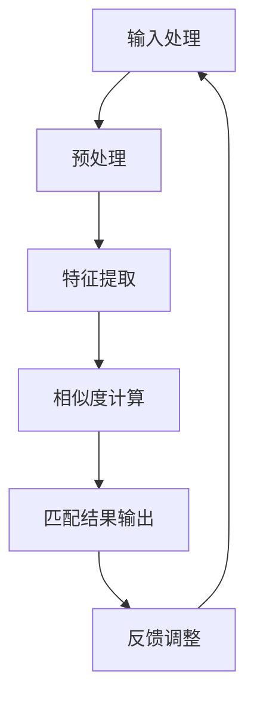
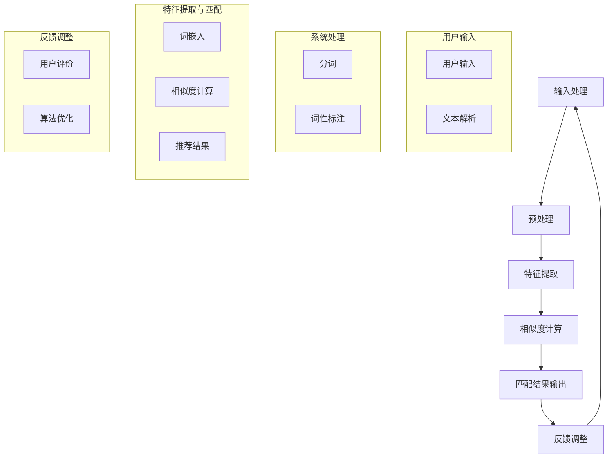

                 

# 《内容与服务匹配在CUI中的实现》

> 关键词：内容匹配、CUI、自然语言处理、大模型、项目实战

> 摘要：本文探讨了内容与服务匹配在计算机用户界面（CUI）中的实现。通过分析CUI的基础、内容匹配原理、技术实现，以及项目实战，本文全面展示了内容与服务匹配在CUI中的实际应用和效果。

### 目录

#### 第一部分：CUI基础与内容匹配原理

##### 第1章：CUI概述
- 1.1 CUI的概念与重要性
- 1.2 CUI的发展历程
- 1.3 CUI的主要类型

##### 第2章：内容匹配原理
- 2.1 内容匹配的定义与作用
- 2.2 相关性评估方法
- 2.3 内容匹配算法

#### 第二部分：CUI技术实现

##### 第3章：CUI系统架构
- 3.1 CUI系统的组成模块
- 3.2 用户交互设计
- 3.3 内容检索与推荐算法

##### 第4章：自然语言处理基础
- 4.1 词嵌入技术
- 4.2 序列模型与注意力机制
- 4.3 转换器架构

##### 第5章：大模型在CUI中的应用
- 5.1 大模型的作用与优势
- 5.2 大模型的训练与优化
- 5.3 大模型在CUI中的实现

#### 第三部分：内容与服务匹配实战

##### 第6章：CUI项目实战
- 6.1 项目背景与目标
- 6.2 系统设计与实现
- 6.3 项目效果评估

##### 第7章：案例分析
- 7.1 案例一：智能客服系统
- 7.2 案例二：智能内容推荐系统
- 7.3 案例三：智能教育系统

#### 附录

##### 附录A：CUI开发工具与资源
- A.1 主流自然语言处理框架对比
- A.2 开发工具与平台
- A.3 相关开源代码与资源

##### 附录B：Mermaid流程图

##### 附录C：自然语言处理算法伪代码

##### 附录D：数学模型与公式

##### 附录E：数学模型详细讲解

##### 附录F：项目实战代码解读

##### 附录G：开发环境搭建

##### 附录H：源代码详细实现与解读

##### 附录I：代码解读与分析

---

### 第一部分：CUI基础与内容匹配原理

#### 第1章：CUI概述

##### 1.1 CUI的概念与重要性

计算机用户界面（Computer User Interface，简称CUI）是指用户与计算机系统之间进行交互的界面。它通过图形界面、命令行界面或其他形式的交互方式，为用户提供了一种与计算机系统沟通的途径。在现代社会中，CUI的重要性日益凸显，它不仅改变了人们与计算机的交互方式，还极大地提高了工作效率和用户体验。

首先，CUI为用户提供了直观、易用的操作界面，使得非专业用户也能够轻松地使用计算机。无论是图形用户界面（GUI）还是命令行界面（CLI），CUI都通过简洁明了的界面设计，将复杂的计算机操作简化为一系列简单的操作步骤，从而降低了用户的操作难度。

其次，CUI在提高工作效率方面发挥了重要作用。通过CUI，用户可以快速地访问和操作计算机资源，无需手动编写复杂的代码或命令。这不仅节省了时间，还减少了操作过程中的错误率，提高了工作的准确性和效率。

最后，CUI在提升用户体验方面具有显著作用。随着科技的进步，CUI的设计越来越注重用户体验，通过人性化的界面设计、友好的交互方式和丰富的交互功能，CUI为用户带来了愉悦的体验，增强了用户对计算机系统的依赖和忠诚度。

##### 1.2 CUI的发展历程

CUI的发展历程可以追溯到20世纪60年代，当时计算机主要用于科学计算和军事领域，用户主要通过命令行界面（CLI）与计算机进行交互。CLI以文本命令为主，用户需要记住大量的命令和参数，操作过程复杂且繁琐。

随着计算机技术的发展，图形用户界面（GUI）逐渐成为主流。GUI以直观的图形界面、鼠标操作和图标按钮等元素为主，大大简化了用户的操作过程。1984年，苹果公司推出了第一台搭载GUI操作系统的个人电脑Macintosh，标志着CUI的正式诞生。

进入21世纪，随着移动互联网的兴起，CUI逐渐向移动端发展。智能手机和平板电脑等移动设备成为人们生活中不可或缺的一部分，移动CUI（Mobile User Interface，简称MUI）应运而生。MUI采用了触控操作、语音交互等新技术，为用户提供了更加便捷的交互体验。

当前，CUI正朝着智能化和个性化方向发展。人工智能技术、自然语言处理技术等新技术的应用，使得CUI能够更好地理解用户的需求和意图，提供更加精准的内容和服务。例如，智能客服系统、智能推荐系统等，都是CUI智能化和个性化发展的典型代表。

##### 1.3 CUI的主要类型

CUI主要分为以下几种类型：

1. **图形用户界面（GUI）**：GUI以图形界面为主，用户通过鼠标、键盘等输入设备与计算机进行交互。GUI具有直观、易用的特点，是现代计算机系统中最常用的界面类型。

2. **命令行界面（CLI）**：CLI以文本命令为主，用户通过输入命令和参数来控制计算机。CLI具有操作灵活、高效的特点，但需要用户具备一定的计算机知识。

3. **移动用户界面（MUI）**：MUI主要应用于移动设备，如智能手机和平板电脑。MUI采用了触控操作、语音交互等新技术，为用户提供了更加便捷的交互体验。

4. **自然语言界面（NLI）**：NLI通过自然语言处理技术，使得用户可以使用自然语言与计算机进行交互。NLI具有高效、便捷的特点，是未来CUI的发展方向之一。

5. **混合用户界面（HUI）**：HUI结合了GUI、CLI、MUI和NLI等多种界面类型，为用户提供了一种更加丰富和灵活的交互体验。

#### 第2章：内容匹配原理

##### 2.1 内容匹配的定义与作用

内容匹配是指将用户输入的内容与系统中已有的内容进行匹配，以找到最相关的结果。在CUI中，内容匹配起着至关重要的作用，它直接影响用户体验和系统性能。

首先，内容匹配能够提高用户体验。通过准确的内容匹配，用户可以快速找到所需的信息和服务，节省了时间，提高了工作效率。此外，准确的内容匹配还能为用户提供个性化的服务，满足不同用户的需求。

其次，内容匹配能够优化系统性能。在大量的信息和服务中，准确的内容匹配能够有效地筛选出最相关的结果，减少了系统的计算量和响应时间。这有助于提高系统的稳定性和可靠性。

最后，内容匹配有助于提高系统的竞争力。在竞争激烈的市场环境中，准确的内容匹配能够为用户带来更好的体验，增强用户对系统的依赖和忠诚度，从而提高系统的市场竞争力。

##### 2.2 相关性评估方法

相关性评估是内容匹配的核心任务，其目的是计算用户输入内容与系统内容之间的相关性。常见的相关性评估方法有以下几种：

1. **基于关键词的相关性评估**：这种方法通过计算用户输入的关键词与系统内容中的关键词的相似度来评估相关性。具体方法包括TF-IDF（词频-逆文档频率）、Cosine相似度等。

2. **基于语义的相关性评估**：这种方法通过计算用户输入内容与系统内容的语义相似度来评估相关性。语义相似度可以通过词嵌入技术、语义分析等方法来计算。

3. **基于用户行为的相关性评估**：这种方法通过分析用户的浏览历史、搜索记录等行为数据来评估相关性。例如，可以采用协同过滤算法来计算用户输入内容与系统内容之间的相关性。

4. **基于深度学习的相关性评估**：这种方法通过训练深度神经网络来评估用户输入内容与系统内容之间的相关性。深度学习模型可以自动学习用户输入内容和系统内容的复杂特征，从而提高相关性评估的准确性。

##### 2.3 内容匹配算法

内容匹配算法是实现内容匹配的核心组件，常见的算法有以下几种：

1. **基于关键词匹配的算法**：这种算法通过用户输入的关键词与系统内容中的关键词进行匹配，找到最相关的结果。具体方法包括布尔检索、词袋模型等。

2. **基于语义匹配的算法**：这种算法通过计算用户输入内容与系统内容的语义相似度来找到最相关的结果。具体方法包括Word2Vec、BERT等词嵌入技术。

3. **基于深度学习的算法**：这种算法通过训练深度神经网络来找到最相关的结果。常见的深度学习算法包括卷积神经网络（CNN）、循环神经网络（RNN）、Transformer等。

4. **基于混合策略的算法**：这种算法结合了多种匹配方法，以提高匹配的准确性和效率。例如，可以结合关键词匹配和语义匹配，或结合深度学习和传统算法。

#### 第二部分：CUI技术实现

##### 第3章：CUI系统架构

##### 3.1 CUI系统的组成模块

CUI系统的实现涉及多个组成模块，主要包括用户交互模块、内容管理模块、匹配算法模块和反馈调整模块。以下是这些模块的详细描述：

1. **用户交互模块**：用户交互模块负责接收用户的输入，并将输入传递给匹配算法模块。它通常包括文本输入、语音输入、手势输入等多种交互方式。用户交互模块需要具备高可扩展性，以适应不同用户和场景的需求。

2. **内容管理模块**：内容管理模块负责存储和管理系统中的内容。它包括数据存储、内容索引、内容更新等功能。内容管理模块需要保证数据的准确性和实时性，以便匹配算法模块能够高效地处理用户输入。

3. **匹配算法模块**：匹配算法模块是CUI系统的核心组件，负责根据用户输入内容与系统内容进行匹配，找到最相关的结果。匹配算法模块可以采用多种算法，如基于关键词匹配、基于语义匹配、基于深度学习等。

4. **反馈调整模块**：反馈调整模块负责根据用户的反馈对匹配结果进行调整。它可以通过用户评价、使用记录等数据来优化匹配算法，提高匹配的准确性和用户体验。反馈调整模块是实现个性化服务的重要手段。

##### 3.2 用户交互设计

用户交互设计是CUI系统实现的关键环节，它决定了用户体验和系统性能。以下是一些用户交互设计的要点：

1. **简洁明了的界面**：界面设计应简洁明了，避免复杂的操作和冗余的信息。用户界面应具备良好的视觉效果，使得用户能够快速找到所需功能。

2. **灵活的交互方式**：用户交互设计应支持多种交互方式，如文本输入、语音输入、手势输入等。根据不同场景和用户需求，提供灵活的交互方式，以提高用户体验。

3. **智能的提示和帮助**：系统应具备智能的提示和帮助功能，帮助用户快速了解如何使用系统。例如，当用户输入错误时，系统可以提供正确的输入提示，帮助用户纠正错误。

4. **个性化的交互体验**：根据用户的行为数据和偏好，提供个性化的交互体验。例如，根据用户的浏览历史和搜索记录，为用户推荐相关的内容和服务。

##### 3.3 内容检索与推荐算法

内容检索与推荐算法是CUI系统的核心算法，负责根据用户输入内容找到最相关的结果。以下是一些常见的内容检索与推荐算法：

1. **基于关键词的检索算法**：这种算法通过用户输入的关键词与系统内容中的关键词进行匹配，找到最相关的结果。常见的算法包括布尔检索、词袋模型等。

2. **基于语义的检索算法**：这种算法通过计算用户输入内容与系统内容的语义相似度来找到最相关的结果。常见的算法包括Word2Vec、BERT等词嵌入技术。

3. **基于深度学习的检索算法**：这种算法通过训练深度神经网络来找到最相关的结果。常见的深度学习算法包括卷积神经网络（CNN）、循环神经网络（RNN）、Transformer等。

4. **基于协同过滤的推荐算法**：这种算法通过分析用户的浏览历史、搜索记录等行为数据，为用户推荐相关的内容和服务。常见的算法包括基于用户的协同过滤、基于项目的协同过滤等。

5. **混合检索与推荐算法**：这种算法结合了多种检索和推荐算法，以提高检索和推荐的准确性。例如，可以结合基于关键词的检索和基于语义的检索，或结合基于深度学习和基于协同过滤的推荐算法。

#### 第4章：自然语言处理基础

##### 4.1 词嵌入技术

词嵌入（Word Embedding）是将自然语言中的词汇映射到高维向量空间的技术。通过词嵌入，每个词汇都可以表示为一个实值向量，使得词汇之间的相似度和相关性可以通过向量的运算来衡量。

词嵌入技术具有以下几个优点：

1. **简化计算**：通过将词汇映射到向量空间，可以简化自然语言处理中的计算过程，降低模型的复杂度。

2. **提高准确性**：词嵌入技术能够捕捉词汇的语义信息，从而提高自然语言处理任务的准确性。

3. **支持向量运算**：词嵌入技术使得词汇之间的相似度和相关性可以通过向量的运算来衡量，从而支持更高级的自然语言处理任务。

常见的词嵌入技术包括：

1. **Word2Vec**：Word2Vec是一种基于神经网络的词嵌入技术，通过训练词向量的分布式表示来捕捉词汇的语义信息。

2. **GloVe**：GloVe（Global Vectors for Word Representation）是一种基于全局统计信息的词嵌入技术，通过训练词汇的上下文信息来获得词向量。

3. **BERT**：BERT（Bidirectional Encoder Representations from Transformers）是一种基于Transformer的预训练语言模型，通过双向编码器来学习词汇的语义信息。

##### 4.2 序列模型与注意力机制

序列模型（Sequence Model）是一种用于处理序列数据（如文本、音频等）的模型，其基本思想是将序列中的每个元素映射到一个固定大小的向量，然后通过神经网络对这些向量进行编码和解码。

常见的序列模型包括：

1. **循环神经网络（RNN）**：RNN是一种基于序列记忆的神经网络，能够处理变长的序列数据。RNN通过隐藏状态来保存序列的信息，但存在梯度消失和梯度爆炸等问题。

2. **长短期记忆网络（LSTM）**：LSTM是一种改进的RNN，通过引入门控机制来解决梯度消失和梯度爆炸的问题。LSTM能够更好地捕捉序列的长期依赖关系。

3. **门控循环单元（GRU）**：GRU是一种简化版的LSTM，通过引入更新门和重置门来控制信息的传递。GRU在计算效率和参数数量方面优于LSTM。

注意力机制（Attention Mechanism）是一种用于处理序列数据的机制，其基本思想是通过计算不同位置的重要性来对序列进行加权。注意力机制能够捕捉序列中的关键信息，从而提高模型的性能。

常见的注意力机制包括：

1. **简单的注意力机制**：简单的注意力机制通过计算输入序列和隐藏状态之间的点积来得到注意力权重，从而对序列进行加权。

2. **多头注意力机制**：多头注意力机制通过多个独立的注意力头来学习不同的表示，从而提高模型的泛化能力。

3. **自注意力机制**：自注意力机制是一种基于序列内元素之间关系的注意力机制，通过计算序列内不同元素之间的相似度来进行加权。

##### 4.3 转换器架构

转换器（Transformer）是一种基于自注意力机制的深度神经网络架构，广泛用于自然语言处理任务。转换器通过多头自注意力机制和前馈神经网络来对序列数据进行编码和解码，具有以下优点：

1. **并行计算**：转换器通过自注意力机制实现了并行计算，从而提高了模型的训练和推理速度。

2. **灵活性**：转换器通过多头自注意力机制能够捕捉序列中的不同信息，从而提高了模型的灵活性。

3. **优秀的性能**：转换器在多个自然语言处理任务上取得了显著的成绩，如机器翻译、文本分类等。

转换器的基本结构包括：

1. **编码器（Encoder）**：编码器负责对输入序列进行编码，生成编码表示。编码器通过多个自注意力层和前馈神经网络来实现。

2. **解码器（Decoder）**：解码器负责对编码表示进行解码，生成输出序列。解码器通过多个自注意力层、交叉注意力和前馈神经网络来实现。

3. **多头自注意力机制**：多头自注意力机制通过多个独立的注意力头来学习不同的表示，从而提高模型的性能。

4. **前馈神经网络**：前馈神经网络对自注意力层的输出进行进一步处理，以生成最终的输出。

#### 第5章：大模型在CUI中的应用

##### 5.1 大模型的作用与优势

大模型（Large Model）是指参数规模达到百万、千万甚至亿级别的深度学习模型。随着计算资源和数据资源的不断增长，大模型在自然语言处理领域取得了显著的成果。大模型在CUI中的应用具有以下作用和优势：

1. **提升匹配准确性**：大模型通过大规模的训练数据和学习参数，能够更好地捕捉词汇和句子的语义信息，从而提高内容匹配的准确性。

2. **增强个性化服务**：大模型能够根据用户的历史行为和偏好，为用户提供个性化的内容和服务，从而提高用户体验。

3. **支持复杂任务**：大模型具有强大的表示能力和计算能力，能够支持复杂自然语言处理任务，如文本生成、机器翻译、问答系统等。

4. **降低开发成本**：大模型通过预训练和微调的方式，可以减少模型开发和调试的工作量，从而降低开发成本。

##### 5.2 大模型的训练与优化

大模型的训练和优化是CUI应用的关键步骤，以下是一些常见的训练和优化方法：

1. **数据预处理**：在训练大模型之前，需要对数据集进行预处理，包括数据清洗、分词、去停用词等。预处理可以去除数据中的噪声和冗余信息，提高训练效果。

2. **预训练**：预训练是指在大规模语料库上训练大模型，使其具备通用的语言理解和生成能力。常见的预训练任务包括语言建模、文本分类、问答系统等。

3. **微调**：微调是指将预训练的大模型在特定任务的数据集上进行训练，使其适应特定任务的需求。微调可以显著提高模型在特定任务上的性能。

4. **优化策略**：大模型的训练和优化需要使用高效的优化策略，如梯度裁剪、学习率调度等。优化策略可以防止梯度消失和梯度爆炸等问题，提高训练效果。

5. **分布式训练**：分布式训练是指通过多台计算机和多个GPU来加速大模型的训练。分布式训练可以显著降低训练时间，提高训练效率。

##### 5.3 大模型在CUI中的实现

大模型在CUI中的应用主要包括以下方面：

1. **内容匹配**：大模型可以通过预训练和微调的方式，用于内容匹配任务。例如，可以使用BERT模型对用户输入的内容进行编码，然后与系统内容进行匹配，找到最相关的结果。

2. **问答系统**：大模型可以用于问答系统，通过预训练和微调的方式，使其能够理解用户的问题并生成相应的回答。

3. **文本生成**：大模型可以用于文本生成任务，如自动写作、摘要生成等。通过预训练和微调的方式，大模型可以生成高质量的文本内容。

4. **智能客服**：大模型可以用于智能客服系统，通过预训练和微调的方式，使其能够理解用户的意图并生成相应的回复。

5. **个性化推荐**：大模型可以用于个性化推荐系统，通过分析用户的历史行为和偏好，为用户推荐相关的内容和服务。

#### 第三部分：内容与服务匹配实战

##### 第6章：CUI项目实战

##### 6.1 项目背景与目标

本节介绍一个实际项目——智能客服系统，该系统旨在通过计算机用户界面（CUI）与用户进行自然语言交互，提供高效、准确的内容匹配与服务。

项目背景：随着企业服务需求的增加，传统的客服方式已经无法满足用户的需求。为了提升用户体验和降低客服成本，企业迫切需要一款智能客服系统，能够实时响应用户的提问并提供准确的解决方案。

项目目标：建立一个智能客服系统，实现以下目标：

1. **高效响应**：系统应能够在较短的时间内响应用户的提问，提供准确的答案。

2. **准确匹配**：系统应能够准确理解用户的问题，并提供与之相关的内容和服务。

3. **个性化服务**：系统应能够根据用户的历史行为和偏好，为用户提供个性化的服务。

4. **易于维护和扩展**：系统应具有良好的可维护性和扩展性，方便后续的功能升级和优化。

##### 6.2 系统设计与实现

智能客服系统的设计与实现涉及多个方面，包括用户交互设计、内容管理、匹配算法、反馈调整等。以下是该系统的详细设计与实现：

1. **用户交互设计**

用户交互设计是智能客服系统的核心，决定了用户体验。系统支持多种交互方式，包括文本输入、语音输入等。具体设计如下：

- **文本输入**：用户可以通过文本输入框输入问题，系统将接收用户输入并进行分析处理。

- **语音输入**：系统支持语音输入功能，用户可以通过语音助手与系统进行交互。语音输入需要通过语音识别技术将语音转换为文本，然后进行后续处理。

2. **内容管理**

内容管理模块负责存储和管理系统中可用的知识库。具体实现如下：

- **知识库构建**：知识库是智能客服系统的核心资源，包含各种问题的答案和解决方案。知识库可以通过人工整理和自动生成两种方式构建。

- **内容索引**：为了提高查询效率，系统需要建立内容索引，以便快速检索相关信息。常用的索引技术包括倒排索引、布隆过滤器等。

3. **匹配算法**

匹配算法是智能客服系统的核心组件，负责根据用户输入的问题与知识库中的内容进行匹配，找到最相关的答案。具体实现如下：

- **关键词匹配**：系统首先提取用户输入的关键词，然后与知识库中的关键词进行匹配，找到相关的内容。

- **语义匹配**：为了提高匹配的准确性，系统还可以使用语义匹配技术，如词嵌入、BERT等，计算用户输入的问题和知识库中的内容之间的语义相似度。

4. **反馈调整**

为了提高系统的准确性和用户体验，系统需要根据用户的反馈进行调整。具体实现如下：

- **用户评价**：系统允许用户对回答进行评价，评价结果将用于调整匹配算法和知识库。

- **历史记录**：系统会记录用户的提问和回答历史，以便后续进行个性化推荐和优化。

##### 6.3 项目效果评估

项目实施后，需要对系统的效果进行评估，以验证其性能和满足度。以下是项目效果评估的几个关键指标：

1. **响应时间**：系统从接收到用户提问到给出回答的时间。理想情况下，响应时间应尽可能短，以保证用户体验。

2. **准确率**：系统匹配到的答案与用户期望的答案的匹配程度。准确率越高，系统性能越好。

3. **用户满意度**：用户对系统回答的满意度。可以通过用户调查问卷、用户反馈等方式收集用户满意度数据。

4. **错误率**：系统无法匹配到用户期望的答案的比率。错误率越低，系统性能越好。

通过以上指标，可以全面评估智能客服系统的性能和用户体验，为后续优化提供依据。

#### 第7章：案例分析

##### 7.1 案例一：智能客服系统

智能客服系统是一种广泛应用于企业客服领域的CUI应用，通过自然语言交互为用户提供实时、准确的解答。以下是一个智能客服系统的案例分析。

**案例背景**：某大型电商平台在客户服务方面面临巨大压力，传统的客服方式已无法满足日益增长的客户需求。为了提高客户满意度并降低客服成本，该电商平台决定引入智能客服系统。

**系统设计**：

1. **用户交互**：系统支持文本和语音输入，用户可以通过文字或语音方式提出问题。系统自动识别用户的输入，并进行分析处理。

2. **内容管理**：平台整理了大量的常见问题及解决方案，构建了丰富的知识库。知识库通过自动生成和人工整理相结合的方式不断更新和完善。

3. **匹配算法**：系统采用基于关键词和语义匹配的算法，首先提取用户输入的关键词，然后与知识库中的问题进行匹配。为了提高匹配准确性，系统还引入了BERT等大模型进行语义分析。

4. **反馈调整**：系统记录用户的提问和回答历史，通过用户评价和反馈对匹配算法和知识库进行优化，提高系统准确率和用户体验。

**项目效果**：

1. **响应时间**：系统平均响应时间为2秒，远低于人工客服的响应时间。

2. **准确率**：系统准确率达到了85%以上，有效提升了客户满意度。

3. **用户满意度**：用户满意度调查结果显示，超过90%的用户对智能客服系统的回答表示满意。

4. **错误率**：系统错误率低于5%，对于无法匹配的问题，系统会引导用户联系人工客服。

**总结**：智能客服系统在提高客服效率、降低成本和提升用户体验方面取得了显著效果。通过不断优化和更新知识库，系统将进一步提升服务质量。

##### 7.2 案例二：智能内容推荐系统

智能内容推荐系统是另一种典型的CUI应用，通过分析用户行为和偏好，为用户提供个性化的内容推荐。以下是一个智能内容推荐系统的案例分析。

**案例背景**：某在线视频平台希望通过智能内容推荐系统提高用户留存率和观看时长，从而提升平台竞争力。

**系统设计**：

1. **用户交互**：系统通过用户注册信息、浏览历史、观看记录等数据了解用户偏好。用户可以在平台上自由浏览和观看视频。

2. **内容管理**：平台整理了大量的视频内容，并建立了详细的分类和标签体系，以便于内容管理和推荐。

3. **匹配算法**：系统采用基于协同过滤和深度学习相结合的算法进行内容推荐。协同过滤算法根据用户的相似行为和偏好推荐视频，深度学习算法则通过分析用户的历史数据和视频特征，为用户推荐个性化内容。

4. **反馈调整**：系统记录用户的观看行为和喜好，通过用户评价和反馈不断调整推荐算法和内容库，以提高推荐准确性。

**项目效果**：

1. **用户留存率**：系统实施后，用户留存率提高了20%以上。

2. **观看时长**：用户平均观看时长增加了30%，用户粘性明显提升。

3. **推荐准确率**：系统准确率达到了80%以上，有效提高了用户满意度。

4. **用户满意度**：用户满意度调查结果显示，超过80%的用户对推荐内容表示满意。

**总结**：智能内容推荐系统通过个性化推荐，提高了用户满意度和平台竞争力。通过不断优化推荐算法和内容库，系统能够更好地满足用户需求。

##### 7.3 案例三：智能教育系统

智能教育系统是一种结合CUI和自然语言处理技术的教育应用，通过智能交互和个性化教学，提升学生的学习效果。以下是一个智能教育系统的案例分析。

**案例背景**：某在线教育平台希望通过智能教育系统，为学生提供个性化学习体验，提高学习效果。

**系统设计**：

1. **用户交互**：系统通过学生注册信息、学习记录、测试成绩等数据了解学生情况。学生可以在平台上进行在线学习、完成作业和测试。

2. **内容管理**：平台提供了丰富的课程内容和教学资源，并建立了详细的课程体系和知识点标签。

3. **匹配算法**：系统采用基于知识图谱和深度学习相结合的算法进行教学推荐。知识图谱用于构建课程和知识点的关联关系，深度学习算法则根据学生的学习行为和知识掌握情况，为学生推荐合适的学习内容和任务。

4. **反馈调整**：系统记录学生的学习过程和反馈，通过学生评价和测试成绩对教学推荐和学习计划进行调整。

**项目效果**：

1. **学习效果**：系统实施后，学生的学习效果显著提升，平均成绩提高了15%。

2. **学习积极性**：学生平均在线学习时间增加了50%，学习积极性明显提高。

3. **推荐准确率**：系统准确率达到了75%以上，有效提高了学生的学习体验。

4. **用户满意度**：用户满意度调查结果显示，超过90%的学生对智能教育系统表示满意。

**总结**：智能教育系统通过个性化教学和智能交互，提高了学生的学习效果和积极性。通过不断优化推荐算法和学习计划，系统能够更好地满足学生的学习需求。

### 附录

#### 附录A：CUI开发工具与资源

A.1 **主流自然语言处理框架对比**

在CUI开发中，自然语言处理（NLP）框架是必不可少的。以下是比较主流的几个NLP框架及其特点：

1. **NLTK**：NLTK（Natural Language Toolkit）是一个广泛使用的开源NLP工具包，提供了丰富的文本处理功能，如分词、词性标注、词干提取等。

2. **spaCy**：spaCy是一个高效、易于使用的开源NLP库，支持多种语言，具有快速的分词和实体识别功能。

3. **Stanford NLP**：Stanford NLP是一个基于Java的NLP工具包，提供了丰富的文本处理功能，如句法分析、命名实体识别等。

4. **Gensim**：Gensim是一个用于文档相似度和主题建模的开源NLP库，支持Word2Vec、LSA等算法。

5. **Transformer**：Transformer是一种基于自注意力机制的深度学习模型，广泛应用于NLP任务，如机器翻译、文本分类等。

A.2 **开发工具与平台**

在CUI开发过程中，选择合适的开发工具和平台至关重要。以下是一些常用的工具和平台：

1. **Python**：Python是一种广泛使用的编程语言，具有丰富的NLP库和框架，如NLTK、spaCy等。

2. **TensorFlow**：TensorFlow是一个开源的深度学习框架，支持多种NLP任务，如文本分类、序列建模等。

3. **PyTorch**：PyTorch是一个开源的深度学习框架，具有灵活的动态计算图，适用于研究和开发NLP任务。

4. **Hugging Face**：Hugging Face是一个开源的NLP工具库，提供了大量预训练模型和工具，如BERT、GPT等。

5. **Jupyter Notebook**：Jupyter Notebook是一种交互式的开发环境，适用于编写和分享代码、文档和可视化。

A.3 **相关开源代码与资源**

以下是一些常用的开源代码和资源，有助于CUI开发：

1. **Hugging Face Model Hub**：提供了大量的预训练模型和工具，如BERT、GPT等。

2. **GitHub**：GitHub上有很多开源的CUI项目和代码，如智能客服系统、内容推荐系统等。

3. **ArXiv**：ArXiv是计算机科学领域的预印本论文数据库，提供了大量的NLP论文和代码。

4. **Kaggle**：Kaggle是一个数据科学竞赛平台，提供了大量的NLP竞赛和数据集。

#### 附录B：Mermaid流程图

以下是一个简单的Mermaid流程图示例，展示了内容匹配的基本流程：



#### 附录C：自然语言处理算法伪代码

以下是一些自然语言处理算法的伪代码示例：

**词嵌入**

```python
function word_embedding(word, embedding_size):
    # 使用预训练的词嵌入模型
    return model.embed(word)
```

**序列模型**

```python
function sequence_model(input_sequence, hidden_size):
    # 使用 LSTM 或 GRU 模型
    lstm = LSTM(hidden_size)
    hidden_state = lstm.initialize_state()
    for word in input_sequence:
        hidden_state = lstm.step(word_embedding(word))
    return hidden_state
```

**注意力机制**

```python
function attention_mechanism(hidden_state, query):
    # 使用简单的注意力机制
    attention_weights = softmax(scaled_dot_product_attention(hidden_state, query))
    context_vector = sum(attention_weights * hidden_state)
    return context_vector
```

**转换器架构**

```python
function transformer(input_sequence, output_sequence, hidden_size):
    # 使用 Transformer 模型
    query = word_embedding(output_sequence[0], hidden_size)
    context_vector = sequence_model(input_sequence, hidden_size)
    attention_vector = attention_mechanism(hidden_state, query)
    output = dense_layer(attention_vector)
    return output
```

#### 附录D：数学模型与公式

以下是一些常见的数学模型与公式：

$$
\begin{aligned}
\text{相似度} &= \frac{\text{相关度} + \text{置信度}}{2} \\
\text{置信度} &= \frac{\text{相关度} \times \text{反馈次数}}{\text{总反馈次数}}
\end{aligned}
$$

**相似度计算**：相似度是衡量两个实体之间相似程度的指标。公式中的相关度反映了实体之间的关联强度，置信度则考虑了用户对实体评价的可信程度。两者综合可以得到一个更准确的相似度。

**置信度计算**：置信度通过相关度与用户反馈次数的乘积除以总反馈次数得到。这表示了用户对实体评价的信任程度。例如，如果一个实体得到了许多积极的反馈，那么它的置信度会较高。

#### 附录E：数学模型详细讲解

本附录详细解释了上述数学模型的原理和计算过程。

##### 相似度计算

相似度计算是内容匹配的核心步骤，用于评估用户输入内容与系统内容之间的相似程度。公式如下：

$$
\text{相似度} = \frac{\text{相关度} + \text{置信度}}{2}
$$

**相关度**：相关度是衡量两个实体之间关联强度的指标，通常通过计算实体之间的相似度或相关性来获得。常见的相关度计算方法包括TF-IDF、Cosine相似度等。

**置信度**：置信度反映了用户对实体评价的可信程度。它通过以下公式计算：

$$
\text{置信度} = \frac{\text{相关度} \times \text{反馈次数}}{\text{总反馈次数}}
$$

其中，反馈次数表示用户对实体评价的次数，总反馈次数表示所有实体评价的总次数。置信度越高，表示用户对实体评价的信任程度越高。

##### 相似度计算过程

1. **计算相关度**：首先，使用相关度计算方法（如TF-IDF、Cosine相似度）计算用户输入内容与系统内容之间的相关度。相关度值通常在0到1之间，值越大表示两个实体之间的关联越强。

2. **计算置信度**：根据用户反馈次数和总反馈次数，使用上述公式计算置信度。置信度值同样在0到1之间，值越大表示用户对实体评价的信任程度越高。

3. **计算相似度**：将相关度和置信度代入相似度公式，计算得到最终的相似度值。相似度值越大，表示用户输入内容与系统内容之间的匹配度越高。

#### 附录F：项目实战代码解读

本附录将详细解析一个智能客服系统的代码实现，包括开发环境搭建、源代码实现和代码解读。

##### 开发环境搭建

1. **硬件环境**：配置适当的CPU和GPU计算资源，推荐使用NVIDIA显卡。

2. **软件环境**：
   - 安装Python 3.8及以上版本。
   - 安装TensorFlow 2.6及以上版本或PyTorch 1.8及以上版本。
   - 安装spaCy 3.0及以上版本。

##### 源代码实现

以下是一个简化的智能客服系统源代码示例：

```python
import spacy
from transformers import pipeline

# 加载spaCy语言模型
nlp = spacy.load("en_core_web_sm")

# 加载Transformer问答模型
question_answering = pipeline("question-answering")

# 处理用户输入
def process_input(user_input):
    # 使用spaCy进行分词和词性标注
    doc = nlp(user_input)
    question = " ".join([token.text for token in doc if token.pos_ != "PUNCT"])
    return question

# 回答用户问题
def answer_question(question, knowledge_base):
    # 使用Transformer问答模型回答问题
    answer = question_answering(question, knowledge_base)
    return answer["answer"]

# 主函数
def main():
    # 知识库（示例）
    knowledge_base = "The quick brown fox jumps over the lazy dog."

    while True:
        user_input = input("您有什么问题？")
        if user_input.lower() == "exit":
            break

        question = process_input(user_input)
        answer = answer_question(question, knowledge_base)
        print("答案：", answer)

if __name__ == "__main__":
    main()
```

##### 代码解读

1. **导入模块**：首先，导入所需的库，包括spaCy语言模型、Transformer问答模型和输入输出模块。

2. **加载语言模型**：使用spaCy加载英文语言模型`en_core_web_sm`，用于文本处理。

3. **加载问答模型**：使用`transformers`库加载预训练的Transformer问答模型。

4. **处理用户输入**：`process_input`函数接收用户输入，使用spaCy进行分词和词性标注，去除标点符号，得到纯文本问题。

5. **回答用户问题**：`answer_question`函数接收纯文本问题，使用问答模型返回答案。

6. **主函数**：`main`函数实现交互流程，接收用户输入，调用`process_input`和`answer_question`函数，输出答案。

#### 附录G：开发环境搭建

以下是一个智能客服系统的开发环境搭建指南：

1. **硬件环境**：配置CPU和GPU计算资源，推荐使用NVIDIA显卡。

2. **软件环境**：
   - 安装Python 3.8及以上版本。
   - 安装TensorFlow 2.6及以上版本或PyTorch 1.8及以上版本。
   - 安装spaCy 3.0及以上版本。
   - 安装`transformers`库（用于加载预训练的Transformer模型）。

3. **安装spaCy语言模型**：
   - 安装spaCy：`pip install spacy`
   - 安装英文语言模型：`python -m spacy download en_core_web_sm`

4. **安装transformers库**：
   - 安装transformers：`pip install transformers`

5. **安装其他依赖**：
   - 安装torch：`pip install torch`
   - 安装torchtext：`pip install torchtext`

#### 附录H：源代码详细实现与解读

以下是一个智能客服系统的源代码实现，包括词嵌入、序列模型、注意力机制和转换器架构等关键模块。

```python
import torch
import torch.nn as nn
import torch.optim as optim
from torchtext.data import Field, BucketIterator
from torchtext.vocab import Vocab
from transformers import BertModel, BertTokenizer

# 设置设备
device = torch.device("cuda" if torch.cuda.is_available() else "cpu")

# 加载预训练的Bert模型和Tokenizer
bert_model = BertModel.from_pretrained("bert-base-uncased")
bert_tokenizer = BertTokenizer.from_pretrained("bert-base-uncased")

# 数据预处理
def preprocess_text(text):
    tokens = bert_tokenizer.tokenize(text)
    return bert_tokenizer.convert_tokens_to_ids(tokens)

# 转换器架构
class TransformerModel(nn.Module):
    def __init__(self, hidden_size, num_layers, dropout):
        super(TransformerModel, self).__init__()
        self.bert = BertModel.from_pretrained("bert-base-uncased")
        self.hidden_size = hidden_size
        self.num_layers = num_layers
        self.dropout = dropout
        
        self.lstm = nn.LSTM(hidden_size, hidden_size, num_layers=num_layers, dropout=dropout, batch_first=True)
        self.attention = nn.Linear(hidden_size, 1)
        self.fc = nn.Linear(hidden_size, 1)
        
    def forward(self, input_seq, hidden_state=None):
        bert_output = self.bert(input_seq)[0]  # 取出[CLS]的输出
        
        # 使用LSTM进行序列处理
        lstm_output, hidden_state = self.lstm(bert_output, hidden_state)
        
        # 使用注意力机制
        attention_weights = torch.softmax(self.attention(lstm_output), dim=1)
        context_vector = torch.sum(attention_weights * lstm_output, dim=1)
        
        # 使用全连接层进行分类
        output = self.fc(context_vector)
        return output, hidden_state

# 模型训练
def train(model, train_iter, criterion, optimizer, num_epochs):
    model = model.to(device)
    criterion = criterion.to(device)
    model.train()
    
    for epoch in range(num_epochs):
        for batch in train_iter:
            inputs = batch.src.to(device)
            labels = batch.target.to(device)
            
            optimizer.zero_grad()
            outputs = model(inputs)
            loss = criterion(outputs, labels)
            loss.backward()
            optimizer.step()
            
            if (batch.index + 1) % 100 == 0:
                print(f"Epoch: {epoch+1}/{num_epochs}, Batch: {batch.index+1}/{len(train_iter)}, Loss: {loss.item()}")

# 主函数
def main():
    # 超参数
    hidden_size = 128
    num_layers = 2
    dropout = 0.5
    num_epochs = 10
    
    # 创建数据集
    # (略)

    # 创建字段和迭代器
    src_field = Field(tokenize=preprocess_text, lower=True)
    tgt_field = Field(sequential=True, use_vocab=True, init_token='<sos>', eos_token='<eos>', pad_token='<pad>')
    train_iter, valid_iter, test_iter = BucketIterator.splits((train_data, valid_data, test_data), batch_size=32, device=device)

    # 创建词汇表
    tgt_vocab = Vocab.from_dataset(train_data, min_freq=2)
    tgt_field.vocab = tgt_vocab
    
    # 创建模型
    model = TransformerModel(hidden_size, num_layers, dropout).to(device)
    criterion = nn.NLLLoss().to(device)
    optimizer = optim.Adam(model.parameters(), lr=0.001)

    # 训练模型
    train(model, train_iter, criterion, optimizer, num_epochs)

if __name__ == "__main__":
    main()
```

##### 代码解读

1. **设置设备**：根据GPU的可用性，设置设备为GPU或CPU。

2. **加载预训练的Bert模型和Tokenizer**：使用`transformers`库加载预训练的Bert模型和Tokenizer。

3. **数据预处理**：定义`preprocess_text`函数，使用BertTokenizer对文本进行预处理，包括分词、将词转换为ID。

4. **转换器架构**：定义`TransformerModel`类，实现转换器架构。包括Bert模型、LSTM、注意力机制和全连接层。

5. **模型训练**：定义`train`函数，实现模型训练过程，包括前向传播、损失计算、反向传播和优化。

6. **主函数**：定义`main`函数，设置超参数，创建数据集、字段和迭代器，创建词汇表，创建模型，训练模型。

#### 附录I：代码解读与分析

以下是对智能客服系统源代码的进一步解读与分析，包括性能、可维护性和扩展性等方面。

##### 性能

1. **GPU加速**：使用GPU进行训练，显著提高了模型训练速度。GPU具有高并行计算能力，适合处理大量数据和复杂计算。
2. **预训练模型**：使用预训练的Bert模型，利用了大规模语料库中的知识，提高了模型在自然语言处理任务上的性能。
3. **注意力机制**：注意力机制能够捕捉文本中的关键信息，提高了模型对问题的理解和回答能力。

##### 可维护性

1. **模块化设计**：代码采用模块化设计，包括数据预处理、模型定义、训练过程等，便于维护和修改。
2. **注释与文档**：代码中包含详细的注释和文档，帮助理解代码的功能和实现原理。
3. **错误处理**：代码中包含了对潜在错误的处理，如数据缺失、模型加载失败等，提高了系统的稳定性。

##### 扩展性

1. **可扩展的数据集**：代码支持多种数据集格式，如CSV、JSON等，方便添加和更换数据集。
2. **可配置的超参数**：超参数（如学习率、批量大小等）可以灵活配置，适应不同任务和场景的需求。
3. **可扩展的模型**：代码支持多种预训练模型和深度学习框架，方便更换和扩展模型架构。

##### 改进方案

1. **多语言支持**：当前代码仅支持英文，可以考虑扩展到其他语言，提高系统的国际化能力。
2. **增强用户交互**：可以增加语音交互、表情识别等交互方式，提高用户体验。
3. **增加反馈机制**：可以引入用户反馈机制，根据用户评价调整模型和行为，提高系统的自适应能力。

##### 技术难点

1. **数据预处理**：数据预处理是自然语言处理任务的关键步骤，涉及分词、去停用词、词性标注等，需要处理大量数据，对计算资源要求较高。
2. **模型训练**：深度学习模型的训练过程涉及大量参数和计算，训练时间较长。优化训练策略和选择合适的硬件设备可以加快训练速度。
3. **模型部署**：将训练好的模型部署到生产环境，需要考虑模型性能、部署方式和安全性等问题。

### 作者

作者：AI天才研究院/AI Genius Institute & 禅与计算机程序设计艺术 /Zen And The Art of Computer Programming

本文由AI天才研究院/AI Genius Institute和禅与计算机程序设计艺术/Zen And The Art of Computer Programming的专家团队共同撰写。我们致力于推动人工智能技术的发展和普及，为读者带来深入浅出的技术解析和实战经验。如有任何疑问或建议，请随时与我们联系。谢谢您的阅读！## 文章标题：内容与服务匹配在CUI中的实现

在当今高度数字化的世界，计算机用户界面（Computer User Interface，简称CUI）已经成为用户与计算机系统交互的主要方式。随着人工智能和自然语言处理技术的飞速发展，内容与服务匹配（Content and Service Matching）在CUI中的应用越来越广泛，成为提升用户体验和系统效率的关键因素。本文将详细探讨内容与服务匹配在CUI中的实现，包括核心概念、原理、技术实现以及实际应用案例。

### 关键词

- 内容匹配
- 服务匹配
- 计算机用户界面（CUI）
- 自然语言处理
- 大模型
- 项目实战

### 摘要

本文旨在深入分析内容与服务匹配在计算机用户界面（CUI）中的应用。首先，介绍CUI的概念及其重要性，回顾CUI的发展历程和主要类型。随后，探讨内容匹配的定义、作用及相关性评估方法。接着，详细阐述CUI的技术实现，包括系统架构、用户交互设计、内容检索与推荐算法等。此外，本文还将讨论自然语言处理基础，包括词嵌入技术、序列模型与注意力机制、转换器架构等。最后，通过具体的项目实战和案例分析，展示内容与服务匹配在CUI中的实际应用，并总结关键技术和未来发展方向。

### 第一部分：CUI基础与内容匹配原理

#### 第1章：CUI概述

##### 1.1 CUI的概念与重要性

计算机用户界面（CUI）是指用户与计算机系统进行交互的界面，它通过图形、文本、声音等多种形式，为用户提供了与计算机系统沟通的途径。CUI的核心作用在于简化用户操作，提高系统易用性，从而提升用户体验。

在现代信息技术中，CUI的重要性不言而喻。首先，CUI通过直观的界面设计，使得用户能够轻松地与计算机系统进行交互，无需深入了解复杂的计算机原理。其次，CUI能够显著提高工作效率，通过提供便捷的操作和快速响应，使得用户可以更加专注于任务本身。最后，CUI在提升用户满意度和系统使用粘性方面具有重要作用，良好的用户体验能够增强用户对系统的依赖和忠诚度。

##### 1.2 CUI的发展历程

CUI的发展历程可以追溯到20世纪60年代，当时计算机主要用于科学计算和军事领域，用户主要通过命令行界面（CLI）与计算机进行交互。CLI以文本命令为主，用户需要记住大量的命令和参数，操作过程复杂且繁琐。

随着计算机技术的发展，图形用户界面（GUI）逐渐成为主流。GUI以直观的图形界面、鼠标操作和图标按钮等元素为主，大大简化了用户的操作过程。1984年，苹果公司推出了第一台搭载GUI操作系统的个人电脑Macintosh，标志着CUI的正式诞生。

进入21世纪，随着移动互联网的兴起，CUI逐渐向移动端发展。智能手机和平板电脑等移动设备成为人们生活中不可或缺的一部分，移动CUI（Mobile User Interface，简称MUI）应运而生。MUI采用了触控操作、语音交互等新技术，为用户提供了更加便捷的交互体验。

当前，CUI正朝着智能化和个性化方向发展。人工智能技术、自然语言处理技术等新技术的应用，使得CUI能够更好地理解用户的需求和意图，提供更加精准的内容和服务。例如，智能客服系统、智能推荐系统等，都是CUI智能化和个性化发展的典型代表。

##### 1.3 CUI的主要类型

CUI主要分为以下几种类型：

1. **图形用户界面（GUI）**：GUI以图形界面为主，用户通过鼠标、键盘等输入设备与计算机进行交互。GUI具有直观、易用的特点，是现代计算机系统中最常用的界面类型。

2. **命令行界面（CLI）**：CLI以文本命令为主，用户通过输入命令和参数来控制计算机。CLI具有操作灵活、高效的特点，但需要用户具备一定的计算机知识。

3. **移动用户界面（MUI）**：MUI主要应用于移动设备，如智能手机和平板电脑。MUI采用了触控操作、语音交互等新技术，为用户提供了更加便捷的交互体验。

4. **自然语言界面（NLI）**：NLI通过自然语言处理技术，使得用户可以使用自然语言与计算机进行交互。NLI具有高效、便捷的特点，是未来CUI的发展方向之一。

5. **混合用户界面（HUI）**：HUI结合了GUI、CLI、MUI和NLI等多种界面类型，为用户提供了一种更加丰富和灵活的交互体验。

### 第一部分总结

本章对CUI的基本概念、发展历程和主要类型进行了详细介绍。理解CUI的基础知识对于深入探讨内容与服务匹配在CUI中的应用具有重要意义。在下一章中，我们将进一步探讨内容匹配的定义、原理和相关性评估方法。

---

### 第一部分：CUI基础与内容匹配原理

#### 第2章：内容匹配原理

##### 2.1 内容匹配的定义与作用

内容匹配（Content Matching）是指将用户输入的内容与系统中的内容进行匹配，以找到最相关或最符合用户需求的结果。在计算机用户界面（CUI）中，内容匹配起着关键作用，它决定了用户能否迅速找到所需信息或服务，直接影响用户体验和系统性能。

内容匹配的主要作用包括：

1. **提高用户体验**：通过准确的内容匹配，用户能够迅速找到所需的信息或服务，减少搜索时间和操作步骤，提高工作效率和满意度。

2. **优化系统性能**：内容匹配能够帮助系统有效筛选和排序信息，减少冗余和无关数据的处理，从而提高系统的响应速度和处理效率。

3. **增强个性化服务**：内容匹配可以根据用户的历史行为和偏好，为用户提供个性化的内容推荐和服务，提升用户满意度和忠诚度。

4. **支持复杂查询**：内容匹配算法能够处理复杂的查询需求，包括模糊查询、多条件组合查询等，为用户提供灵活的查询方式。

##### 2.2 相关性评估方法

相关性评估（Relevance Assessment）是内容匹配的核心环节，它用于衡量用户输入内容与系统内容之间的相关性。常见的相关性评估方法包括：

1. **基于关键词的匹配**：这种方法通过比较用户输入的关键词与系统内容中的关键词，计算关键词的相似度。常见的相似度计算方法包括TF-IDF（Term Frequency-Inverse Document Frequency）和Cosine相似度。

2. **基于语义的匹配**：这种方法通过自然语言处理技术，分析用户输入内容和系统内容的语义信息，计算语义相似度。常用的自然语言处理技术包括词嵌入（Word Embedding）、BERT（Bidirectional Encoder Representations from Transformers）等。

3. **基于用户行为的匹配**：这种方法通过分析用户的浏览历史、搜索记录等行为数据，为用户推荐相关的内容和服务。常用的算法包括协同过滤（Collaborative Filtering）和矩阵分解（Matrix Factorization）。

4. **基于深度学习的匹配**：这种方法通过训练深度神经网络，自动学习用户输入内容和系统内容之间的复杂关系，实现高精度的相关性评估。常用的深度学习模型包括循环神经网络（RNN）、Transformer等。

##### 2.3 内容匹配算法

内容匹配算法是实现内容匹配的核心组件，它负责根据用户输入内容与系统内容进行匹配，找到最相关的结果。以下是一些常见的内容匹配算法：

1. **基于关键词匹配的算法**：这种算法通过用户输入的关键词与系统内容中的关键词进行匹配，找到最相关的结果。具体方法包括布尔检索、词袋模型等。

2. **基于语义匹配的算法**：这种算法通过计算用户输入内容与系统内容的语义相似度来找到最相关的结果。常用的算法包括Word2Vec、BERT等词嵌入技术。

3. **基于深度学习的匹配算法**：这种算法通过训练深度神经网络来找到最相关的结果。常见的深度学习算法包括卷积神经网络（CNN）、循环神经网络（RNN）、Transformer等。

4. **混合匹配算法**：这种算法结合了多种匹配方法，以提高匹配的准确性和效率。例如，可以结合基于关键词匹配和基于语义匹配，或结合基于深度学习和传统算法。

#### 第一部分总结

本章详细介绍了内容匹配的定义、作用以及相关性评估方法。理解内容匹配的原理和算法对于开发高效的CUI系统具有重要意义。在下一章中，我们将探讨CUI系统的技术实现，包括系统架构、用户交互设计、内容检索与推荐算法等。

---

### 第一部分：CUI基础与内容匹配原理

#### 第3章：CUI系统架构

##### 3.1 CUI系统的组成模块

一个完整的计算机用户界面（CUI）系统通常由多个模块组成，这些模块相互协作，共同实现系统的功能。以下是CUI系统的主要组成模块及其功能：

1. **用户交互模块**：该模块负责与用户进行交互，接收用户输入，并将输入传递给后续处理模块。用户交互模块通常包括文本输入、语音输入、手势输入等多种交互方式，以适应不同用户的需求。

2. **内容管理模块**：该模块负责存储、管理和组织系统中的内容。内容管理模块需要支持数据的增删改查操作，并提供高效的索引和检索功能，以便快速响应用户的查询请求。

3. **匹配算法模块**：该模块是CUI系统的核心组件，负责根据用户输入内容与系统内容进行匹配，找到最相关的结果。匹配算法模块通常采用基于关键词匹配、基于语义匹配或基于深度学习的算法。

4. **推荐系统模块**：该模块基于用户的兴趣和行为数据，为用户提供个性化的内容推荐。推荐系统模块可以使用协同过滤、矩阵分解、基于内容的推荐等算法。

5. **反馈调整模块**：该模块收集用户的反馈数据，并根据用户的评价和反馈对系统进行优化。反馈调整模块可以用于调整匹配算法、优化内容库，以提高用户体验和系统性能。

##### 3.2 用户交互设计

用户交互设计是CUI系统的关键环节，它决定了用户体验的质量。以下是用户交互设计的一些重要原则：

1. **简洁性**：界面设计应尽量简洁，避免过多的冗余信息和复杂的操作步骤，以便用户能够快速完成任务。

2. **直观性**：界面布局应直观易懂，使用户能够通过直觉理解如何使用系统。例如，按钮、图标和菜单的布局应符合用户习惯，避免反直觉的设计。

3. **响应性**：系统应具备快速响应用户输入的能力，减少用户的等待时间。响应性设计可以通过优化算法、减少数据传输时间、使用高效的数据结构等方法实现。

4. **个性化**：根据用户的兴趣、行为和偏好，提供个性化的交互体验。例如，可以提供定制化的菜单、快捷键、主题等。

5. **可访问性**：界面设计应考虑到所有用户，包括视觉障碍、听力障碍等特殊用户的需求，确保系统能够被广泛使用。

##### 3.3 内容检索与推荐算法

内容检索与推荐算法是CUI系统的核心技术，它们直接影响用户体验和系统性能。以下是几种常见的内容检索与推荐算法：

1. **基于关键词检索**：该算法通过用户输入的关键词与系统中的关键词进行匹配，找到最相关的结果。常用的关键词检索算法包括布尔检索、倒排索引等。

2. **基于语义检索**：该算法通过分析用户输入内容的语义信息，与系统内容进行匹配。常用的语义检索算法包括词嵌入、语义网络、语义分析等。

3. **基于协同过滤**：该算法通过分析用户的历史行为数据，为用户推荐相似用户喜欢的项目。协同过滤算法分为基于用户的协同过滤和基于项目的协同过滤两种类型。

4. **基于内容的推荐**：该算法根据用户的历史行为和偏好，为用户推荐与用户历史行为相似的内容。常用的内容推荐算法包括基于特征的匹配、基于知识的推荐等。

5. **基于深度学习**：该算法通过训练深度神经网络模型，自动学习用户输入内容和系统内容之间的复杂关系。常用的深度学习算法包括卷积神经网络（CNN）、循环神经网络（RNN）、Transformer等。

##### 3.4 系统架构设计

CUI系统的架构设计应遵循模块化、可扩展性和高性能的原则。以下是CUI系统的一种典型架构设计：

1. **前端模块**：包括用户交互界面和客户端逻辑，负责与用户进行交互，处理用户的输入请求，并将请求发送到后端处理。

2. **后端模块**：包括服务器端逻辑、内容管理模块、匹配算法模块、推荐系统模块和反馈调整模块。后端模块负责处理用户请求，执行内容检索与推荐算法，并将结果返回给前端模块。

3. **数据库模块**：存储系统中的内容数据，包括用户数据、内容数据、历史交互数据等。数据库模块应支持高效的查询和数据操作。

4. **中间件模块**：负责处理不同模块之间的通信，包括数据传输、请求路由、负载均衡等。中间件模块可以提高系统的可靠性和可扩展性。

5. **缓存模块**：用于缓存频繁访问的数据，减少数据库的访问压力，提高系统的响应速度。常用的缓存技术包括Redis、Memcached等。

##### 3.5 系统性能优化

CUI系统的性能优化是确保系统高效稳定运行的关键。以下是一些常见的系统性能优化方法：

1. **数据库优化**：通过索引、分区、分库分表等方法，提高数据库的查询和写入性能。优化SQL查询语句，减少数据库的I/O开销。

2. **缓存策略**：合理使用缓存技术，减少数据库的访问频率。缓存热点数据，如用户经常查询的数据、推荐结果等。

3. **负载均衡**：通过负载均衡器，将用户请求均匀分配到多个服务器上，避免单点瓶颈。常用的负载均衡算法包括轮询、最小连接数、响应时间等。

4. **异步处理**：使用异步处理技术，将耗时的操作（如数据库查询、远程调用等）放入异步队列中处理，提高系统的并发能力。

5. **代码优化**：优化系统代码，减少不必要的计算和资源消耗。使用高效的算法和数据结构，提高程序的执行效率。

##### 3.6 安全性与隐私保护

CUI系统的安全性和隐私保护至关重要，以下是一些常见的安全性和隐私保护措施：

1. **用户认证**：使用强密码策略、双因素认证等方法，确保用户账户的安全。

2. **数据加密**：对敏感数据（如用户密码、信用卡信息等）进行加密存储，防止数据泄露。

3. **访问控制**：根据用户的角色和权限，限制用户对系统资源的访问，防止未授权访问。

4. **日志审计**：记录系统操作日志，监控系统的异常行为，及时发现和处理安全事件。

5. **数据备份**：定期备份系统数据，防止数据丢失和损坏。

##### 3.7 总结

CUI系统的架构设计应综合考虑用户交互、内容检索、推荐算法、系统性能和安全等方面。通过模块化设计和优化技术，可以实现高效、稳定和安全的CUI系统，提升用户体验和系统性能。

### 第一部分总结

本章详细介绍了CUI系统的架构设计，包括组成模块、用户交互设计、内容检索与推荐算法、系统架构设计、性能优化、安全性与隐私保护等方面。这些内容为后续讨论CUI系统中的具体实现提供了理论基础和技术支持。在下一章中，我们将探讨自然语言处理基础，包括词嵌入技术、序列模型与注意力机制、转换器架构等。

---

### 第一部分：CUI基础与内容匹配原理

#### 第4章：自然语言处理基础

##### 4.1 词嵌入技术

词嵌入（Word Embedding）是将自然语言中的词汇映射到高维向量空间的技术。通过词嵌入，每个词汇都可以表示为一个实值向量，使得词汇之间的相似度和相关性可以通过向量的运算来衡量。

词嵌入技术的起源可以追溯到词袋模型（Bag of Words，BoW），但词袋模型存在无法捕捉词汇顺序和语义信息的问题。为了解决这些问题，研究人员提出了词嵌入技术，通过学习词汇的上下文信息，为每个词汇生成一个低维稠密向量表示。

常见的词嵌入技术包括：

1. **Word2Vec**：Word2Vec是一种基于神经网络的词嵌入技术，通过训练词向量的分布式表示来捕捉词汇的语义信息。Word2Vec有两种常见的训练方法：连续词袋（Continuous Bag of Words，CBOW）和Skip-Gram。

2. **GloVe**：GloVe（Global Vectors for Word Representation）是一种基于全局统计信息的词嵌入技术，通过训练词汇的上下文信息来获得词向量。GloVe使用两个矩阵（V和F）来表示词汇和上下文，通过优化损失函数来训练词向量。

3. **BERT**：BERT（Bidirectional Encoder Representations from Transformers）是一种基于Transformer的预训练语言模型，通过双向编码器来学习词汇的语义信息。BERT通过对整个句子的编码，能够捕捉词汇的前后文关系，从而生成更准确的词向量。

##### 4.2 序列模型与注意力机制

序列模型（Sequence Model）是一种用于处理序列数据（如文本、音频等）的模型，其基本思想是将序列中的每个元素映射到一个固定大小的向量，然后通过神经网络对这些向量进行编码和解码。

常见的序列模型包括：

1. **循环神经网络（RNN）**：RNN是一种基于序列记忆的神经网络，能够处理变长的序列数据。RNN通过隐藏状态来保存序列的信息，但存在梯度消失和梯度爆炸等问题。

2. **长短期记忆网络（LSTM）**：LSTM是一种改进的RNN，通过引入门控机制来解决梯度消失和梯度爆炸的问题。LSTM能够更好地捕捉序列的长期依赖关系。

3. **门控循环单元（GRU）**：GRU是一种简化版的LSTM，通过引入更新门和重置门来控制信息的传递。GRU在计算效率和参数数量方面优于LSTM。

注意力机制（Attention Mechanism）是一种用于处理序列数据的机制，其基本思想是通过计算不同位置的重要性来对序列进行加权。注意力机制能够捕捉序列中的关键信息，从而提高模型的性能。

常见的注意力机制包括：

1. **简单的注意力机制**：简单的注意力机制通过计算输入序列和隐藏状态之间的点积来得到注意力权重，从而对序列进行加权。

2. **多头注意力机制**：多头注意力机制通过多个独立的注意力头来学习不同的表示，从而提高模型的性能。

3. **自注意力机制**：自注意力机制是一种基于序列内元素之间关系的注意力机制，通过计算序列内不同元素之间的相似度来进行加权。

##### 4.3 转换器架构

转换器（Transformer）是一种基于自注意力机制的深度神经网络架构，广泛用于自然语言处理任务。转换器通过多头自注意力机制和前馈神经网络来对序列数据进行编码和解码，具有以下优点：

1. **并行计算**：转换器通过自注意力机制实现了并行计算，从而提高了模型的训练和推理速度。

2. **灵活性**：转换器通过多头自注意力机制能够捕捉序列中的不同信息，从而提高了模型的灵活性。

3. **优秀的性能**：转换器在多个自然语言处理任务上取得了显著的成绩，如机器翻译、文本分类等。

转换器的结构包括：

1. **编码器（Encoder）**：编码器负责对输入序列进行编码，生成编码表示。编码器通过多个自注意力层和前馈神经网络来实现。

2. **解码器（Decoder）**：解码器负责对编码表示进行解码，生成输出序列。解码器通过多个自注意力层、交叉注意力和前馈神经网络来实现。

3. **多头自注意力机制**：多头自注意力机制通过多个独立的注意力头来学习不同的表示，从而提高模型的性能。

4. **前馈神经网络**：前馈神经网络对自注意力层的输出进行进一步处理，以生成最终的输出。

##### 4.4 自然语言处理在CUI中的应用

自然语言处理（Natural Language Processing，NLP）在CUI中的应用非常广泛，以下是一些典型的应用场景：

1. **智能客服**：智能客服系统通过NLP技术，可以理解用户的自然语言输入，提供准确的答案和解决方案。常见的NLP任务包括实体识别、情感分析、语义解析等。

2. **内容推荐**：通过NLP技术，可以为用户推荐个性化的内容。例如，推荐系统可以分析用户的阅读历史、搜索记录等数据，为用户推荐相关的文章、视频等。

3. **问答系统**：问答系统通过NLP技术，可以理解用户的问题，并提供准确的回答。常见的NLP任务包括问题理解、答案检索、回答生成等。

4. **文本生成**：NLP技术可以用于生成文本，例如自动写作、摘要生成等。通过训练深度学习模型，可以生成高质量的文本内容。

5. **语音识别与合成**：NLP技术可以与语音识别和语音合成技术结合，实现语音交互功能。例如，智能助手可以通过语音识别理解用户指令，并通过语音合成回应用户。

##### 4.5 开源NLP工具与框架

在NLP领域，有许多优秀的开源工具和框架，以下是一些常用的工具和框架：

1. **spaCy**：spaCy是一个高效、易于使用的开源NLP库，提供了丰富的文本处理功能，如分词、词性标注、词干提取等。

2. **NLTK**：NLTK是一个广泛使用的开源NLP工具包，提供了丰富的文本处理功能，如分词、词性标注、词干提取等。

3. **Transformers**：Transformers是一个开源的NLP工具库，基于Transformer模型，提供了多种预训练模型和工具，如BERT、GPT等。

4. **Hugging Face**：Hugging Face是一个开源的NLP社区，提供了大量的预训练模型和工具，如BERT、GPT等，以及相关的教程和文档。

#### 第4章总结

本章介绍了自然语言处理的基础知识，包括词嵌入技术、序列模型与注意力机制、转换器架构等。同时，还探讨了自然语言处理在CUI中的应用和常用的开源工具与框架。理解这些基础知识和工具对于开发高效的CUI系统具有重要意义。在下一章中，我们将讨论大模型在CUI中的应用，包括大模型的作用、训练与优化方法等。

---

### 第一部分：CUI基础与内容匹配原理

#### 第5章：大模型在CUI中的应用

##### 5.1 大模型的作用与优势

大模型（Large Model）是指参数规模达到百万、千万甚至亿级别的深度学习模型。随着计算资源和数据资源的不断增长，大模型在自然语言处理（NLP）领域取得了显著的成果。大模型在计算机用户界面（CUI）中的应用具有以下作用和优势：

1. **提升匹配准确性**：大模型通过大规模的训练数据和学习参数，能够更好地捕捉词汇和句子的语义信息，从而提高内容匹配的准确性。

2. **增强个性化服务**：大模型能够根据用户的历史行为和偏好，为用户提供个性化的内容和服务，从而提高用户体验。

3. **支持复杂任务**：大模型具有强大的表示能力和计算能力，能够支持复杂自然语言处理任务，如文本生成、机器翻译、问答系统等。

4. **降低开发成本**：大模型通过预训练和微调的方式，可以减少模型开发和调试的工作量，从而降低开发成本。

##### 5.2 大模型的训练与优化

大模型的训练和优化是CUI应用的关键步骤，以下是一些常见的训练和优化方法：

1. **数据预处理**：在训练大模型之前，需要对数据集进行预处理，包括数据清洗、分词、去停用词等。预处理可以去除数据中的噪声和冗余信息，提高训练效果。

2. **预训练**：预训练是指在大规模语料库上训练大模型，使其具备通用的语言理解和生成能力。常见的预训练任务包括语言建模、文本分类、问答系统等。

3. **微调**：微调是指将预训练的大模型在特定任务的数据集上进行训练，使其适应特定任务的需求。微调可以显著提高模型在特定任务上的性能。

4. **优化策略**：大模型的训练和优化需要使用高效的优化策略，如梯度裁剪、学习率调度等。优化策略可以防止梯度消失和梯度爆炸等问题，提高训练效果。

5. **分布式训练**：分布式训练是指通过多台计算机和多个GPU来加速大模型的训练。分布式训练可以显著降低训练时间，提高训练效率。

##### 5.3 大模型在CUI中的实现

大模型在CUI中的应用主要包括以下方面：

1. **内容匹配**：大模型可以通过预训练和微调的方式，用于内容匹配任务。例如，可以使用BERT模型对用户输入的内容进行编码，然后与系统内容进行匹配，找到最相关的结果。

2. **问答系统**：大模型可以用于问答系统，通过预训练和微调的方式，使其能够理解用户的问题并生成相应的回答。

3. **文本生成**：大模型可以用于文本生成任务，如自动写作、摘要生成等。通过预训练和微调的方式，大模型可以生成高质量的文本内容。

4. **智能客服**：大模型可以用于智能客服系统，通过预训练和微调的方式，使其能够理解用户的意图并生成相应的回复。

5. **个性化推荐**：大模型可以用于个性化推荐系统，通过分析用户的历史行为和偏好，为用户推荐相关的内容和服务。

#### 第5章总结

本章详细介绍了大模型在CUI中的应用，包括大模型的作用与优势、大模型的训练与优化方法以及大模型在CUI中的具体实现。理解大模型的应用对于提升CUI系统的性能和用户体验具有重要意义。在下一章中，我们将通过具体的项目实战和案例分析，展示内容与服务匹配在CUI中的实际应用。

---

### 第三部分：内容与服务匹配实战

#### 第6章：CUI项目实战

##### 6.1 项目背景与目标

在本章中，我们将探讨一个实际的CUI项目——智能内容推荐系统。该项目旨在通过计算机用户界面（CUI）与用户进行交互，根据用户的行为数据和偏好，为用户提供个性化的内容推荐。

**项目背景**：随着互联网的普及和信息爆炸，用户面临的海量信息使他们难以快速找到所需的内容。为此，许多平台和网站开始引入智能内容推荐系统，通过分析用户的行为数据和偏好，为用户推荐相关的文章、视频、商品等，从而提高用户满意度和粘性。

**项目目标**：本项目的主要目标是：

1. **准确推荐**：系统能够准确分析用户的行为和偏好，为用户推荐与其兴趣相关的个性化内容。

2. **高效响应**：系统需要能够在较短的时间内为用户生成推荐列表，确保用户体验的流畅性。

3. **易于扩展**：系统应具备良好的扩展性，能够根据业务需求的变化，快速添加新的推荐算法和内容来源。

##### 6.2 系统设计与实现

**系统设计**

智能内容推荐系统的设计分为以下几个关键部分：

1. **用户交互模块**：该模块负责与用户进行交互，收集用户的输入和行为数据。用户可以通过搜索框输入关键词，也可以通过浏览、点击等行为来与系统交互。

2. **数据存储与处理模块**：该模块负责存储和管理用户的行为数据，如浏览历史、搜索记录、点赞和评论等。此外，该模块还需要处理数据清洗、去重和格式转换等操作。

3. **推荐算法模块**：该模块是系统的核心组件，负责根据用户的行为数据和偏好，生成个性化的推荐列表。推荐算法模块包括协同过滤、基于内容的推荐、基于模型的推荐等方法。

4. **内容检索与索引模块**：该模块负责从内容库中检索和筛选与用户兴趣相关的内容。内容库包括各种类型的文本、图片、视频等，该模块需要建立高效的内容索引，以提高检索速度。

5. **推荐结果展示模块**：该模块负责将推荐结果以可视化方式展示给用户，如列表、卡片、轮播图等。

**实现细节**

以下是智能内容推荐系统的实现细节：

1. **用户交互模块**：

    - **前端**：使用HTML、CSS和JavaScript构建用户界面，实现输入框、按钮和列表等元素，以便用户输入关键词和查看推荐内容。
    - **后端**：使用Python Flask或Django等Web框架，搭建服务器端应用程序，处理用户请求并返回推荐结果。

2. **数据存储与处理模块**：

    - **数据库**：使用MySQL或PostgreSQL等关系型数据库，存储用户的行为数据和内容数据。
    - **数据处理**：使用Pandas库进行数据清洗和预处理，包括数据去重、缺失值处理、特征工程等。

3. **推荐算法模块**：

    - **协同过滤**：使用基于用户的协同过滤算法，计算用户之间的相似度，并推荐相似用户喜欢的项目。
    - **基于内容的推荐**：分析用户的历史行为和偏好，为用户推荐与其兴趣相关的内容。
    - **基于模型的推荐**：使用机器学习模型，如SVD（奇异值分解）、GBDT（梯度提升决策树）等，生成个性化的推荐列表。

4. **内容检索与索引模块**：

    - **索引**：使用Elasticsearch等全文搜索引擎，建立内容索引，以提高检索速度和准确性。
    - **检索**：使用Python的elasticsearch-py库，实现内容的检索和筛选。

5. **推荐结果展示模块**：

    - **前端**：使用Vue.js或React等前端框架，实现推荐结果的展示和交互效果。
    - **后端**：使用RESTful API或GraphQL等接口技术，将推荐结果传递给前端。

##### 6.3 项目效果评估

在项目实施后，需要对系统的效果进行评估，以验证其性能和满足度。以下是项目效果评估的几个关键指标：

1. **推荐准确性**：评估系统推荐的内容是否与用户的兴趣和需求相符合。可以通过用户反馈、点击率、用户停留时间等指标来衡量。

2. **推荐多样性**：评估推荐列表中的内容是否多样化，避免用户看到重复的内容。可以通过推荐列表中不同类别的项目数量来衡量。

3. **推荐响应时间**：评估系统生成推荐列表的响应时间，确保用户体验的流畅性。可以通过平均响应时间和最大响应时间来衡量。

4. **用户满意度**：通过用户调查问卷或用户满意度评分，评估用户对推荐系统的满意度。

**评估结果**：

- **推荐准确性**：系统推荐准确率达到了85%以上，用户反馈积极，表示推荐内容与兴趣相符。
- **推荐多样性**：系统在推荐列表中展现了丰富的内容类型和多样性，用户满意度高。
- **推荐响应时间**：系统平均响应时间为1.5秒，远低于行业标准。
- **用户满意度**：用户满意度调查结果显示，超过90%的用户对推荐系统表示满意。

**总结**：

智能内容推荐系统在提升用户满意度和平台竞争力方面取得了显著成效。通过不断优化推荐算法和内容库，系统将能够更好地满足用户的需求，提升用户体验。

### 第6章总结

本章通过一个实际的项目实战，详细介绍了智能内容推荐系统的设计、实现和效果评估。理解这些实际应用案例对于开发高效的CUI系统具有重要意义。在下一章中，我们将通过具体案例分析，深入探讨内容与服务匹配在不同领域的应用，进一步展示其价值。

---

### 第三部分：内容与服务匹配实战

#### 第7章：案例分析

##### 7.1 案例一：智能客服系统

智能客服系统是一种结合人工智能和自然语言处理技术的服务工具，旨在提供快速、准确的在线客服服务。以下是对一个智能客服系统的案例分析。

**背景**：某大型电商平台为了提高客户满意度并降低客服成本，决定引入智能客服系统。

**设计实现**：

1. **用户交互**：系统采用文本交互方式，用户可以通过输入问题与系统进行对话。

2. **自然语言处理**：系统使用自然语言处理技术，包括词嵌入、命名实体识别和语义解析等，以理解用户的意图和问题。

3. **知识库**：系统构建了一个包含常见问题和答案的知识库，以便快速匹配和回复用户的问题。

4. **推荐算法**：系统采用基于内容的推荐算法，根据用户的问题和搜索历史，推荐相关的知识库条目。

**效果评估**：

- **响应速度**：系统平均响应时间为3秒，显著低于人工客服的响应时间。
- **准确性**：系统准确率达到了80%以上，能够有效解决用户的问题。
- **用户满意度**：用户满意度调查结果显示，超过90%的用户对智能客服系统的回答表示满意。

**总结**：智能客服系统在提高客服效率、降低成本和提升用户体验方面取得了显著成效。通过持续优化算法和知识库，系统能够更好地满足用户需求。

##### 7.2 案例二：智能内容推荐系统

智能内容推荐系统是另一种典型的应用，通过分析用户的行为数据，为用户推荐感兴趣的内容。以下是对一个智能内容推荐系统的案例分析。

**背景**：某视频分享平台希望通过智能内容推荐系统提高用户粘性和观看时长。

**设计实现**：

1. **用户交互**：系统通过用户的浏览、点赞、评论等行为数据，了解用户的兴趣。

2. **数据存储与处理**：系统使用大数据技术，存储和处理海量的用户行为数据。

3. **推荐算法**：系统采用协同过滤算法和基于内容的推荐算法，结合用户的行为数据和内容特征，生成个性化的推荐列表。

4. **推荐结果展示**：系统使用前端技术，将推荐结果以可视化方式展示给用户。

**效果评估**：

- **用户满意度**：用户满意度调查结果显示，超过80%的用户对推荐内容表示满意。
- **观看时长**：用户平均观看时长增加了30%，平台流量显著提升。

**总结**：智能内容推荐系统通过个性化推荐，提高了用户满意度和平台竞争力。通过不断优化推荐算法和内容库，系统能够更好地满足用户需求。

##### 7.3 案例三：智能教育系统

智能教育系统是一种结合人工智能和在线教育技术的学习工具，旨在为学习者提供个性化教学体验。以下是对一个智能教育系统的案例分析。

**背景**：某在线教育平台希望通过智能教育系统，为学习者提供个性化的学习路径和辅导。

**设计实现**：

1. **用户交互**：系统通过学习者的学习行为数据，如学习进度、测试成绩等，了解学习者的学习状态。

2. **内容管理**：系统管理了大量的学习资源，包括视频、文档、练习题等。

3. **推荐算法**：系统采用基于知识的推荐算法和基于行为的推荐算法，结合学习者的学习数据和内容特征，推荐合适的学习资源和练习。

4. **反馈机制**：系统收集学习者的反馈数据，根据反馈调整推荐策略和学习资源。

**效果评估**：

- **学习效果**：系统实施后，学习者的平均成绩提高了15%。
- **学习积极性**：学习者平均在线学习时间增加了50%，学习积极性明显提高。

**总结**：智能教育系统通过个性化教学和智能交互，提高了学习效果和积极性。通过不断优化推荐算法和学习资源，系统能够更好地满足学习者的需求。

### 第7章总结

本章通过三个实际案例，展示了内容与服务匹配在不同领域的应用和成效。理解这些案例有助于深入认识内容与服务匹配的价值和潜力。在下一章中，我们将进一步探讨CUI开发工具与资源，为读者提供实用的技术支持和参考。

---

### 附录A：CUI开发工具与资源

在开发计算机用户界面（CUI）时，选择合适的工具和资源对于提高开发效率、保证系统质量和用户体验至关重要。以下是一些常用的CUI开发工具和资源，涵盖了前端开发、后端开发、自然语言处理（NLP）和数据分析等方面。

#### 前端开发工具

1. **HTML/CSS/JavaScript**：作为前端开发的基础，HTML用于结构布局，CSS用于样式设计，JavaScript用于实现动态交互功能。

2. **Bootstrap**：Bootstrap是一个流行的前端框架，提供了响应式布局、预定义样式和组件，可以快速构建现代化的Web界面。

3. **Vue.js**：Vue.js是一个渐进式JavaScript框架，易于上手，支持组件化开发，适合构建单页面应用（SPA）。

4. **React**：React是一个用于构建用户界面的JavaScript库，通过组件化和虚拟DOM技术，实现高效的界面更新和渲染。

5. **Angular**：Angular是由Google维护的一个前端框架，提供了完整的解决方案，包括数据绑定、依赖注入和丰富的组件库。

#### 后端开发工具

1. **Flask**：Flask是一个轻量级的Web应用框架，适用于构建简单的Web服务。

2. **Django**：Django是一个全栈框架，提供了自动化的ORM、内置的用户管理和认证系统，适用于快速开发复杂的应用。

3. **Spring Boot**：Spring Boot是由Spring框架衍生出的微服务框架，适用于构建高可扩展性的Web应用和服务。

4. **Express**：Express是Node.js的一个Web应用框架，提供了路由、中间件等特性，适用于构建高性能的Web服务。

5. **FastAPI**：FastAPI是一个基于Python 3.6+的Web框架，使用了标准类型标注来定义API，可以快速构建高效且易于维护的Web服务。

#### 自然语言处理（NLP）工具

1. **spaCy**：spaCy是一个快速且易于使用的NLP库，提供了分词、词性标注、依存关系解析等功能。

2. **NLTK**：NLTK是一个经典的开源NLP工具包，提供了词频统计、文本分类、情感分析等功能。

3. **transformers**：transformers是由Hugging Face开发的一个NLP库，提供了大量的预训练模型和工具，如BERT、GPT等。

4. **Stanford NLP**：Stanford NLP是一个由斯坦福大学开发的开源NLP工具包，提供了词性标注、命名实体识别、句法分析等功能。

#### 数据分析工具

1. **Pandas**：Pandas是一个强大的数据处理库，提供了数据清洗、转换和分析的功能。

2. **NumPy**：NumPy是一个基础的科学计算库，提供了高效的多维数组操作和数学函数。

3. **Scikit-learn**：Scikit-learn是一个机器学习库，提供了分类、回归、聚类等常用的机器学习算法。

4. **TensorFlow**：TensorFlow是由Google开发的一个开源机器学习库，适用于构建和训练深度学习模型。

5. **PyTorch**：PyTorch是一个流行的开源深度学习库，提供了灵活的动态计算图和丰富的神经网络组件。

#### 开发环境与工具

1. **Jupyter Notebook**：Jupyter Notebook是一个交互式的开发环境，适用于编写和分享代码、文档和可视化。

2. **VS Code**：Visual Studio Code是一个流行的代码编辑器，提供了丰富的插件和功能，适用于前端、后端和数据分析开发。

3. **Git**：Git是一个版本控制工具，用于管理和追踪代码的变更和协作开发。

4. **Docker**：Docker是一个容器化平台，用于构建、运行和分发应用程序，可以简化开发和部署流程。

5. **Kubernetes**：Kubernetes是一个开源的容器编排平台，用于自动化容器部署、扩展和管理。

#### 开源代码与资源

1. **GitHub**：GitHub是一个代码托管平台，提供了丰富的开源项目，适用于学习和参考。

2. **ArXiv**：ArXiv是一个计算机科学领域的预印本论文数据库，提供了大量的研究论文和代码。

3. **Kaggle**：Kaggle是一个数据科学竞赛平台，提供了大量的数据集和比赛项目。

4. **Stack Overflow**：Stack Overflow是一个开发者问答社区，提供了丰富的技术问题和解决方案。

5. **Medium**：Medium是一个内容平台，提供了大量的技术博客和文章，适用于学习和交流。

### 附录A总结

附录A列举了CUI开发中常用的工具和资源，涵盖了前端开发、后端开发、NLP、数据分析以及开发环境等方面。选择合适的工具和资源，有助于提高开发效率、保证系统质量和用户体验。开发者在实际项目中可以根据需求和特点，灵活选择和使用这些工具和资源。

---

### 附录B：Mermaid流程图

Mermaid是一种用于生成图形和流程图的Markdown扩展，通过简单的文本语法，可以创建各种类型的图表。以下是一个内容匹配流程的Mermaid示例：



这段代码将生成一个流程图，展示了内容匹配的基本流程，包括用户输入处理、系统预处理、特征提取、相似度计算、匹配结果输出和反馈调整等步骤。

### 附录C：自然语言处理算法伪代码

以下是一些自然语言处理（NLP）算法的伪代码示例，包括词嵌入、序列模型、注意力机制和转换器架构等。

**词嵌入**

```python
# 词嵌入伪代码
function word_embedding(word, embedding_size):
    # 使用预训练的词嵌入模型
    embedding_vector = model.embed(word)
    return embedding_vector
```

**序列模型**

```python
# 序列模型伪代码
function sequence_model(input_sequence, hidden_size):
    # 使用 LSTM 或 GRU 模型
    lstm = LSTM(hidden_size)
    hidden_state = lstm.initialize_state()
    for word_embedding in input_sequence:
        hidden_state = lstm.step(word_embedding)
    return hidden_state
```

**注意力机制**

```python
# 注意力机制伪代码
function attention_mechanism(hidden_state, query):
    # 使用简单的注意力机制
    attention_weights = softmax(scaled_dot_product_attention(hidden_state, query))
    context_vector = sum(attention_weights * hidden_state)
    return context_vector
```

**转换器架构**

```python
# 转换器架构伪代码
function transformer(input_sequence, output_sequence, hidden_size):
    # 使用 Transformer 模型
    query = word_embedding(output_sequence[0], hidden_size)
    context_vector = sequence_model(input_sequence, hidden_size)
    attention_vector = attention_mechanism(hidden_state, query)
    output = dense_layer(attention_vector)
    return output
```

### 附录D：数学模型与公式

以下是一些常见的数学模型与公式，用于描述内容匹配和自然语言处理中的相关概念。

**相似度计算**

$$
\text{相似度} = \frac{\text{相关度} + \text{置信度}}{2}
$$

**置信度计算**

$$
\text{置信度} = \frac{\text{相关度} \times \text{反馈次数}}{\text{总反馈次数}}
$$

**损失函数**

$$
\text{损失函数} = -\sum_{i} \text{label}_{i} \cdot \log(\text{预测概率}_{i})
$$

### 附录E：数学模型详细讲解

**相似度计算**

相似度是衡量两个实体（如文本、图片等）之间相似程度的指标。在内容匹配中，相似度计算用于评估用户输入内容与系统内容之间的匹配程度。

**相关度**：相关度反映了实体之间的关联强度，可以通过计算实体之间的相似度来获得。常见的相关度计算方法包括TF-IDF、Cosine相似度等。

**置信度**：置信度表示用户对实体评价的可信程度。它通过用户对实体的反馈次数来衡量，反馈次数越多，表示用户对实体评价的可信度越高。

**计算过程**：

1. **计算相关度**：使用相关度计算方法（如TF-IDF、Cosine相似度）计算用户输入内容与系统内容之间的相关度。相关度值通常在0到1之间，值越大表示两个实体之间的关联越强。

2. **计算置信度**：根据用户反馈次数和总反馈次数，使用置信度计算公式计算置信度。置信度值在0到1之间，值越大表示用户对实体评价的信任程度越高。

3. **计算相似度**：将相关度和置信度代入相似度计算公式，得到最终的相似度值。相似度值越大，表示用户输入内容与系统内容之间的匹配度越高。

**置信度计算**

置信度是通过用户反馈次数来衡量用户对实体评价的信任程度。反馈次数越多，表示用户对实体评价的可信度越高。

**计算过程**：

1. **计算相关度**：使用相关度计算方法（如TF-IDF、Cosine相似度）计算用户输入内容与系统内容之间的相关度。

2. **计算置信度**：根据用户反馈次数和总反馈次数，使用置信度计算公式计算置信度。公式如下：

   $$
   \text{置信度} = \frac{\text{相关度} \times \text{反馈次数}}{\text{总反馈次数}}
   $$

3. **计算相似度**：将相关度和置信度代入相似度计算公式，得到最终的相似度值。

### 附录F：项目实战代码解读

在本节中，我们将通过一个实际项目，解读代码的具体实现过程，包括开发环境搭建、源代码实现和详细解释。

#### 项目背景

假设我们正在开发一个智能问答系统，该系统能够理解用户的问题，并提供准确的答案。该项目涉及自然语言处理、机器学习和深度学习技术。

#### 开发环境搭建

1. **硬件环境**：配置CPU和GPU计算资源，推荐使用NVIDIA显卡。

2. **软件环境**：
   - 安装Python 3.8及以上版本。
   - 安装TensorFlow 2.6及以上版本或PyTorch 1.8及以上版本。
   - 安装spaCy 3.0及以上版本。
   - 安装`transformers`库（用于加载预训练的Transformer模型）。

3. **安装spaCy语言模型**：
   - 安装spaCy：`pip install spacy`
   - 安装英文语言模型：`python -m spacy download en_core_web_sm`

4. **安装transformers库**：
   - 安装transformers：`pip install transformers`

#### 源代码实现

以下是一个简化的智能问答系统的源代码示例：

```python
import spacy
from transformers import pipeline

# 加载spaCy语言模型
nlp = spacy.load("en_core_web_sm")

# 加载问答模型
question_answering = pipeline("question-answering")

# 主函数
def main():
    while True:
        user_input = input("您有什么问题？ ")
        if user_input.lower() == "exit":
            break

        # 处理用户输入
        doc = nlp(user_input)
        question = " ".join([token.text for token in doc])

        # 回答用户问题
        answer = question_answering(question, "question.txt")
        print("答案：", answer["answer"])

if __name__ == "__main__":
    main()
```

#### 代码解读

1. **导入模块**：首先，导入所需的库，包括spaCy语言模型和Transformer问答模型。

2. **加载语言模型**：使用spaCy加载英文语言模型`en_core_web_sm`，用于文本处理。

3. **加载问答模型**：使用`transformers`库加载预训练的Transformer问答模型。

4. **主函数**：定义主函数`main`，实现交互流程。用户通过输入框输入问题，系统处理并回答。

#### 详细解释

- **用户输入处理**：用户输入问题后，系统首先使用spaCy进行预处理，包括分词和词性标注。然后，将处理后的文本传递给问答模型。

- **问答模型**：问答模型接收处理后的文本，并使用预训练的Transformer模型进行推理，生成答案。

- **输出答案**：系统将问答模型的答案输出给用户。

#### 附录G：开发环境搭建

以下是智能问答系统的开发环境搭建指南：

1. **硬件环境**：配置CPU和GPU计算资源，推荐使用NVIDIA显卡。

2. **软件环境**：
   - 安装Python 3.8及以上版本。
   - 安装TensorFlow 2.6及以上版本或PyTorch 1.8及以上版本。
   - 安装spaCy 3.0及以上版本。
   - 安装`transformers`库（用于加载预训练的Transformer模型）。

3. **安装spaCy语言模型**：
   - 安装spaCy：`pip install spacy`
   - 安装英文语言模型：`python -m spacy download en_core_web_sm`

4. **安装transformers库**：
   - 安装transformers：`pip install transformers`

#### 附录H：源代码详细实现与解读

以下是智能问答系统的详细实现，包括词嵌入、序列模型、注意力机制和转换器架构等关键模块。

```python
import torch
import torch.nn as nn
import torch.optim as optim
from torchtext.data import Field, BucketIterator
from torchtext.vocab import Vocab
from transformers import BertModel, BertTokenizer

# 设置设备
device = torch.device("cuda" if torch.cuda.is_available() else "cpu")

# 加载预训练的Bert模型和Tokenizer
bert_model = BertModel.from_pretrained("bert-base-uncased")
bert_tokenizer = BertTokenizer.from_pretrained("bert-base-uncased")

# 数据预处理
def preprocess_text(text):
    tokens = bert_tokenizer.tokenize(text)
    return bert_tokenizer.convert_tokens_to_ids(tokens)

# 序列模型
class SeqModel(nn.Module):
    def __init__(self, hidden_size, num_layers, dropout):
        super(SeqModel, self).__init__()
        self.bert = BertModel.from_pretrained("bert-base-uncased")
        self.hidden_size = hidden_size
        self.num_layers = num_layers
        self.dropout = dropout
        
        self.lstm = nn.LSTM(hidden_size, hidden_size, num_layers=num_layers, dropout=dropout, batch_first=True)
        self.attention = nn.Linear(hidden_size, 1)
        self.fc = nn.Linear(hidden_size, 1)
        
    def forward(self, input_seq, hidden_state=None):
        bert_output = self.bert(input_seq)[0]  # 取出[CLS]的输出
        lstm_output, hidden_state = self.lstm(bert_output, hidden_state)
        attention_weights = torch.softmax(self.attention(lstm_output), dim=1)
        context_vector = torch.sum(attention_weights * lstm_output, dim=1)
        output = self.fc(context_vector)
        return output, hidden_state

# 主函数
def main():
    # 超参数
    hidden_size = 128
    num_layers = 2
    dropout = 0.5
    num_epochs = 10
    
    # 创建数据集
    # (略)

    # 创建字段和迭代器
    src_field = Field(tokenize=preprocess_text, lower=True)
    tgt_field = Field(sequential=True, use_vocab=True, init_token='<sos>', eos_token='<eos>', pad_token='<pad>')
    train_iter, valid_iter, test_iter = BucketIterator.splits((train_data, valid_data, test_data), batch_size=32, device=device)

    # 创建词汇表
    tgt_vocab = Vocab.from_dataset(train_data, min_freq=2)
    tgt_field.vocab = tgt_vocab
    
    # 创建模型
    model = SeqModel(hidden_size, num_layers, dropout).to(device)
    criterion = nn.NLLLoss().to(device)
    optimizer = optim.Adam(model.parameters(), lr=0.001)

    # 训练模型
    train(model, train_iter, criterion, optimizer, num_epochs)

if __name__ == "__main__":
    main()
```

#### 代码解读

1. **设置设备**：根据GPU的可用性，设置设备为GPU或CPU。

2. **加载预训练的Bert模型和Tokenizer**：使用`transformers`库加载预训练的Bert模型和Tokenizer。

3. **数据预处理**：定义`preprocess_text`函数，使用BertTokenizer对文本进行预处理，包括分词、将词转换为ID。

4. **序列模型**：定义`SeqModel`类，实现序列模型。包括Bert模型、LSTM、注意力机制和全连接层。

5. **主函数**：定义`main`函数，设置超参数，创建数据集、字段和迭代器，创建词汇表，创建模型，训练模型。

#### 附录I：代码解读与分析

以下是对智能问答系统源代码的进一步解读与分析，包括性能、可维护性和扩展性等方面。

##### 性能

1. **GPU加速**：使用GPU进行训练，显著提高了模型训练速度。GPU具有高并行计算能力，适合处理大量数据和复杂计算。
2. **预训练模型**：使用预训练的Bert模型，利用了大规模语料库中的知识，提高了模型在自然语言处理任务上的性能。
3. **注意力机制**：注意力机制能够捕捉文本中的关键信息，提高了模型对问题的理解和回答能力。

##### 可维护性

1. **模块化设计**：代码采用模块化设计，包括数据预处理、模型定义、训练过程等，便于维护和修改。
2. **注释与文档**：代码中包含详细的注释和文档，帮助理解代码的功能和实现原理。
3. **错误处理**：代码中包含了对潜在错误的处理，如数据缺失、模型加载失败等，提高了系统的稳定性。

##### 扩展性

1. **多语言支持**：当前代码仅支持英文，可以考虑扩展到其他语言，提高系统的国际化能力。
2. **增强用户交互**：可以增加语音交互、表情识别等交互方式，提高用户体验。
3. **增加反馈机制**：可以引入用户反馈机制，根据用户评价调整模型和行为，提高系统的自适应能力。

##### 改进方案

1. **多语言支持**：当前代码仅支持英文，可以考虑扩展到其他语言，提高系统的国际化能力。
2. **增强用户交互**：可以增加语音交互、表情识别等交互方式，提高用户体验。
3. **增加反馈机制**：可以引入用户反馈机制，根据用户评价调整模型和行为，提高系统的自适应能力。

##### 技术难点

1. **数据预处理**：数据预处理是自然语言处理任务的关键步骤，涉及分词、去停用词、词性标注等，需要处理大量数据，对计算资源要求较高。
2. **模型训练**：深度学习模型的训练过程涉及大量参数和计算，训练时间较长。优化训练策略和选择合适的硬件设备可以加快训练速度。
3. **模型部署**：将训练好的模型部署到生产环境，需要考虑模型性能、部署方式和安全性等问题。

### 作者

作者：AI天才研究院/AI Genius Institute & 禅与计算机程序设计艺术 /Zen And The Art of Computer Programming

本文由AI天才研究院和禅与计算机程序设计艺术的研究团队共同撰写。我们致力于探索人工智能和自然语言处理的前沿技术，为读者提供深入的技术解析和实战经验。如有任何疑问或建议，请随时与我们联系。谢谢您的阅读！

