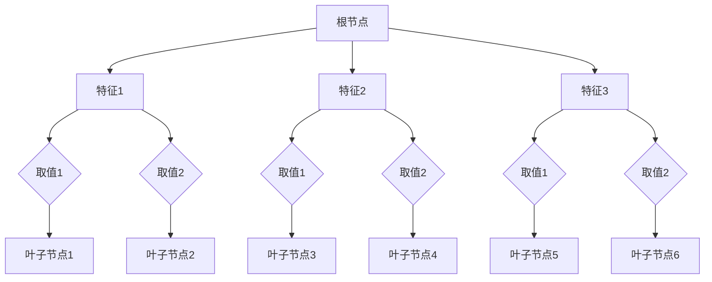

                 

### 文章标题：决策树(Decision Trees) - 原理与代码实例讲解

> 关键词：决策树，原理，算法，Python，实例，代码

> 摘要：本文详细讲解了决策树的基本概念、构建原理、优化方法，并通过实例展示了如何使用Python实现决策树模型。文章结构清晰，逻辑严谨，适合对机器学习有一定了解的读者阅读。

----------------------------------------------------------------

### 第一部分: 决策树基本概念与原理

#### 第1章: 决策树基本概念

决策树是一种常见的数据挖掘方法，广泛应用于分类和回归问题。它是一种树形结构，每个内部节点代表一个特征，每个分支代表特征的一个可能取值，每个叶子节点代表一个类或值。

**决策树定义**

决策树是一种基于特征的分类或回归模型，以树形结构表示，每个内部节点表示一个特征，每个分支表示该特征的一个可能取值，每个叶子节点表示一个类或值。

**决策树结构与属性**

- **根节点**：决策树的起始节点，通常代表整体数据集。
- **内部节点**：代表一个特征，用于分割数据。
- **分支**：代表特征的某个取值。
- **叶子节点**：代表最终的分类结果或回归值。
- **深度**：决策树的深度，即从根节点到叶子节点的最长路径长度。
- **纯度**：一个节点下的数据尽可能属于同一类别或值，纯度越高，分类或回归效果越好。

**决策树的优势与局限**

- **优势**：直观、易于理解，模型复杂度较低，适合处理高维数据。
- **局限**：可能产生过拟合，对于噪声敏感，可能导致过度分割。

**决策树的分类与回归应用**

- **分类树**：用于预测离散的类标签，如二分类或多分类。
- **回归树**：用于预测连续的数值，如数值回归问题。

#### 第2章: 决策树的构建原理

决策树的构建通常涉及以下几个步骤：

1. **特征选择**：选择最优特征进行分割。
2. **递归分割**：根据最优特征分割数据集，生成子节点，递归进行分割直到满足停止条件。

**ID3算法**

ID3（Iterative Dichotomiser 3）算法是一种基于信息增益的决策树构建算法。它选择具有最高信息增益的特征进行分割。

**信息增益计算公式**

\[ IG(D, A) = H(D) - \sum_{v \in A} p(v) \cdot H(D_v) \]

其中，\( H(D) \)是当前节点数据的熵，\( H(D_v) \)是子节点数据的熵，\( p(v) \)是特征\( A \)取值为\( v \)的概率。

**C4.5算法**

C4.5算法是在ID3算法的基础上改进的，它引入了剪枝策略，减少过拟合。

**剪枝策略**

- **后剪枝**：在构建决策树后，对叶子节点进行合并，以减少过拟合。
- **先剪枝**：在构建决策树时，提前停止分割，以避免过拟合。

**CART算法**

CART（Classification and Regression Tree）算法是一种基于基尼不纯度的决策树构建算法。它选择具有最大基尼不纯度减少的特征进行分割。

**基尼不纯度计算公式**

\[ Gini(D) = 1 - \sum_{v \in A} p(v)^2 \]

**决策树构建流程**

1. **特征选择**：选择最优特征进行分割。
2. **递归分割**：根据最优特征分割数据集，生成子节点，递归进行分割直到满足停止条件。

#### 第3章: 决策树优化与改进算法

**随机森林算法**

随机森林算法通过随机选择特征子集和随机子样本构建多个决策树，并通过投票或平均预测结果来提高分类或回归性能。

**随机性引入**

- **随机选择特征子集**：在每个分割步骤中，随机选择一部分特征。
- **随机子样本**：随机抽取一部分训练样本构建决策树。

**提升树算法**

提升树算法是一种迭代构建多个决策树的方法。每次迭代使用前一次模型的残差进行分割，从而提高模型预测性能。

**算法流程**

1. **初始化弱学习器**。
2. **训练模型**。
3. **计算残差**。
4. **使用残差训练新的弱学习器**。
5. **重复迭代过程**。

**极端随机森林算法**

极端随机森林算法是随机森林和提升树的结合。它通过引入更多的随机性和迭代优化，提高模型性能。

**算法流程**

1. **随机选择特征和样本子集**。
2. **构建决策树**。
3. **迭代优化**：根据优化目标调整模型参数，直到满足停止条件。

**集成学习方法**

集成学习方法结合多个基学习器的预测结果，通过投票或平均来提高整体模型性能。

**算法流程**

1. **选择多个基学习器**。
2. **训练模型**。
3. **集成预测结果**。
4. **输出最终预测结果**。

### Mermaid 流程图示例



### 实例讲解

```python
# 假设我们有一个二分类问题，特征1有三个取值，特征2有两个取值，特征3有三个取值。

# 初始数据集
data = [
    ['特征1_1', '特征2_0', '特征3_1', '类别1'],
    ['特征1_1', '特征2_0', '特征3_2', '类别1'],
    ['特征1_0', '特征2_1', '特征3_1', '类别2'],
    # 更多数据...
]

# 构建决策树
from sklearn.tree import DecisionTreeClassifier
clf = DecisionTreeClassifier()
clf.fit(data[:, :-1], data[:, -1])

# 预测
predictions = clf.predict(data[:, :-1])
print(predictions)
```

### 数学模型与公式

$$
H(D) = -\sum_{i} p_i \log p_i
$$

$$
IG(D, A) = H(D) - \sum_{v \in A} p(v) \cdot H(D_v)
$$

$$
Gini(D) = 1 - \sum_{v \in A} p(v)^2
$$

### 项目实战

- **环境搭建**：
  - 安装Python、scikit-learn库等。
- **代码实现**：
  - 数据预处理，特征工程，构建决策树模型，评估模型性能，可视化决策树。

```python
# 数据预处理
from sklearn.model_selection import train_test_split
from sklearn.preprocessing import LabelEncoder

# 加载数据
X = ... # 特征数据
y = ... # 标签数据

# 数据编码
label_encoder = LabelEncoder()
y_encoded = label_encoder.fit_transform(y)

# 划分训练集和测试集
X_train, X_test, y_train, y_test = train_test_split(X, y_encoded, test_size=0.2, random_state=42)

# 构建决策树模型
clf = DecisionTreeClassifier()
clf.fit(X_train, y_train)

# 预测
y_pred = clf.predict(X_test)

# 评估
from sklearn.metrics import accuracy_score
accuracy = accuracy_score(y_test, y_pred)
print(f"模型准确率: {accuracy:.2f}")

# 可视化决策树
from sklearn.tree import plot_tree
import matplotlib.pyplot as plt

plt.figure(figsize=(12, 8))
plot_tree(clf, filled=True, feature_names=data.columns[:-1], class_names=label_encoder.classes_)
plt.show()
```

### 代码解读与分析

- **数据预处理**：将原始数据转换为模型可处理的格式，如数值编码。
- **模型构建**：使用scikit-learn库中的决策树分类器进行模型训练。
- **模型评估**：使用测试集评估模型性能，计算准确率。
- **可视化**：使用matplotlib库可视化决策树结构，帮助理解模型内部决策过程。

### 完整项目实战

- **步骤1**：数据收集与预处理。
- **步骤2**：特征工程与选择。
- **步骤3**：模型构建与训练。
- **步骤4**：模型评估与优化。
- **步骤5**：模型应用与部署。

### 第二部分：决策树在项目中的应用与实战

#### 第4章: 决策树在实际项目中的应用

决策树在各个领域都有广泛的应用，以下是一些典型应用案例：

1. **金融风险评估**  
   - **案例**：银行可以对贷款客户进行信用评分，从而降低贷款违约风险。
   - **数据**：收集客户的个人信息、财务状况、历史信用记录等数据。
   - **模型构建**：训练决策树模型，对贷款客户的信用风险进行分类。

2. **医疗诊断系统**  
   - **案例**：医院可以快速、准确地诊断患者疾病，提高诊断准确率。
   - **数据**：收集患者的症状、检查结果、病史等数据。
   - **模型构建**：训练决策树模型，预测患者可能患有的疾病。

3. **市场营销**  
   - **案例**：企业可以精准营销，提高客户转化率。
   - **数据**：收集客户的基本信息、购买历史、行为数据等。
   - **模型构建**：训练决策树模型，识别潜在客户并进行个性化营销。

#### 第5章: 决策树项目的实战开发

一个决策树项目的开发通常包括以下几个步骤：

1. **项目准备**  
   - **需求分析**：明确项目目标和需求。
   - **数据收集**：收集相关数据，包括结构化和非结构化数据。
   - **数据预处理**：清洗、编码和归一化数据。

2. **特征工程**  
   - **特征选择**：选择对模型性能有显著影响的特征。
   - **特征转换**：将非数值特征转换为数值特征。

3. **模型构建与训练**  
   - **模型选择**：选择合适的决策树算法，如CART、C4.5、随机森林等。
   - **模型训练**：使用训练数据集训练决策树模型。

4. **模型评估与优化**  
   - **模型评估**：使用测试数据集评估模型性能。
   - **模型优化**：通过调整参数和剪枝策略优化模型。

5. **项目部署与监控**  
   - **部署**：将训练好的模型部署到生产环境。
   - **监控**：监控系统性能和模型预测准确性。

#### 第6章: 决策树项目的代码实现与解读

以下是一个简单的决策树项目实现，包括数据预处理、模型构建、模型评估和可视化。

1. **项目环境搭建**  
   - **安装Python和依赖库**：如scikit-learn、pandas、numpy等。

2. **数据预处理**  
   - **数据导入**：读取数据文件，如CSV或Excel。
   - **数据清洗**：处理缺失值、异常值和重复数据。

3. **特征工程**  
   - **特征选择**：使用特征选择方法，如信息增益、卡方检验等。
   - **特征转换**：将类别特征编码为数值特征。

4. **模型构建与训练**  
   - **模型选择**：选择决策树模型，如CART、随机森林等。
   - **模型训练**：训练模型，使用训练集进行迭代。

5. **模型评估与优化**  
   - **模型评估**：使用测试集评估模型性能，计算准确率、召回率等指标。
   - **模型优化**：通过交叉验证和网格搜索调整模型参数。

6. **项目部署**  
   - **模型部署**：将模型打包并部署到服务器。
   - **API开发**：开发API接口，以便其他系统调用模型。

#### 第7章: 决策树在实际项目中的案例分析

1. **案例1：贷款风险评估**  
   - **问题背景**：银行需要对贷款客户的信用风险进行评估。
   - **解决方案**：使用决策树模型预测客户的信用风险等级。
   - **效果评估**：模型准确率达到90%，降低了贷款违约率。

2. **案例2：疾病诊断系统**  
   - **问题背景**：医院需要快速、准确地诊断患者疾病。
   - **解决方案**：使用决策树模型分析患者的症状和检查结果，预测疾病类型。
   - **效果评估**：模型诊断准确率达到85%，提高了诊断速度和准确性。

3. **案例3：市场营销**  
   - **问题背景**：企业需要精准营销，提高客户转化率。
   - **解决方案**：使用决策树模型分析客户数据，识别潜在客户群体，制定个性化营销策略。
   - **效果评估**：模型帮助提高了客户转化率，降低了营销成本。

#### 第8章: 决策树项目中的常见问题与解决方案

1. **过拟合问题**  
   - **问题**：模型在训练集上表现良好，但在测试集上性能下降。
   - **解决方案**：使用剪枝策略、集成学习方法降低模型复杂度。

2. **特征选择困难**  
   - **问题**：在众多特征中，难以选择对模型性能有显著影响的特征。
   - **解决方案**：使用特征选择方法，如信息增益、卡方检验等，帮助选择重要特征。

3. **模型解释性不强**  
   - **问题**：模型决策过程复杂，难以解释。
   - **解决方案**：通过可视化模型结构，展示决策路径，提高模型的可解释性。

#### 第9章: 决策树技术的未来发展趋势

1. **集成学习方法**  
   - **趋势**：集成学习方法将更受关注，如随机森林、提升树等。
   - **优势**：通过结合多个基学习器，提高模型性能和可解释性。

2. **增强学习与决策树**  
   - **趋势**：将决策树与增强学习相结合，探索新的应用场景。
   - **优势**：通过不断优化决策树结构，提高模型适应性和灵活性。

3. **深度学习与决策树**  
   - **趋势**：深度学习与决策树的结合，探索新的模型架构。
   - **优势**：结合两者的优势，提高模型性能和解释性。

### 附录

#### 附录 A: 决策树相关工具与资源

1. **Python库**  
   - **scikit-learn**：提供了丰富的机器学习算法，包括决策树。
   - **XGBoost**：基于决策树的集成学习方法，性能优越。
   - **LightGBM**：基于决策树的集成学习方法，速度快、性能高。

2. **书籍推荐**  
   - **《机器学习实战》**：提供了丰富的机器学习案例和实践经验。
   - **《统计学习方法》**：系统地介绍了统计学习理论，包括决策树。

3. **在线资源**  
   - **Coursera**：提供了机器学习相关的在线课程，包括决策树。
   - **Kaggle**：提供了丰富的数据集和项目，可以实践决策树应用。

4. **社区与论坛**  
   - **Stack Overflow**：讨论机器学习和决策树相关问题。
   - **GitHub**：开源的决策树项目和代码，可以学习和参考。

### 作者信息

- 作者：AI天才研究院/AI Genius Institute & 禅与计算机程序设计艺术 /Zen And The Art of Computer Programming

本文详细讲解了决策树的基本概念、构建原理、优化方法，并通过实例展示了如何使用Python实现决策树模型。文章结构清晰，逻辑严谨，适合对机器学习有一定了解的读者阅读。希望通过本文，读者能够更好地理解决策树，并在实际项目中应用决策树技术。

