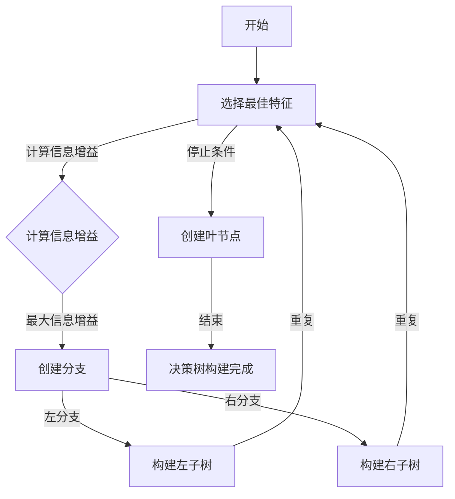

                 

### 文章标题

# 决策树原理

### 关键词

- 决策树
- 信息论
- 熵
- 信息增益
- Gini指数
- ID3算法
- C4.5算法
- CART算法
- 剪枝
- 优化
- 实战案例

### 摘要

本文将深入探讨决策树原理及其在实际应用中的重要性。首先，我们将从决策树的基本概念和作用入手，回顾其历史与发展。接着，我们会详细讲解决策树的构建基础，包括信息论、熵、信息增益及其相关指数。然后，本文将逐步解析ID3、C4.5和CART三种常见的决策树构建算法，通过伪代码和详细解释，使读者能够清晰地理解这些算法的原理与实现。此外，我们将探讨决策树的剪枝方法与优化技术，以便提高模型的准确性和效率。最后，通过实际应用案例和源代码分析，本文将展示决策树在实际开发中的具体应用，并推荐相关学习资源，帮助读者进一步深入了解和学习决策树。

### 第一部分：决策树基础理论

#### 第1章：决策树概述

### 1.1 决策树的定义与作用

决策树是一种常用的分类与回归工具，其形式类似于一棵树，由一系列节点和有向边组成。每个内部节点代表一个特征，每个分支代表特征的一个取值，每个叶节点代表一个类别或值。决策树通过递归地将数据集划分为更小的子集，并最终在叶节点上进行预测。

决策树的主要作用有：

1. **分类与回归：** 决策树可以用于分类任务，将数据点划分为不同的类别；同时，也可以用于回归任务，预测数据点的连续值。
2. **特征选择：** 决策树的构建过程中会自动进行特征选择，选择那些对分类或回归任务最有影响力的特征。
3. **解释性：** 决策树的结构直观，易于理解和解释，有助于理解和分析数据。

### 1.2 决策树的历史与发展

决策树的历史可以追溯到20世纪60年代，最早由心理学家和认知科学家提出，用于模拟人类决策过程。1970年代，J. Ross Quinlan提出了ID3算法，这是第一个有效的决策树构建算法。随后，他进一步开发了C4.5算法，增强了算法的性能和灵活性。

此外，还有许多其他的决策树算法，如CART（分类与回归树）和CHAID（决策树基于信息量的分类方法）。这些算法在实现上有所不同，但目标都是构建一个准确且易于解释的决策模型。

### 1.3 决策树在数据挖掘中的应用

决策树在数据挖掘中具有广泛的应用：

1. **分类问题：** 决策树可以用于处理各种分类问题，如邮件分类、客户分类、疾病诊断等。
2. **回归问题：** 决策树可以用于回归问题，如预测股票价格、房屋价格等。
3. **特征选择：** 决策树可以自动选择最重要的特征，帮助研究者更好地理解数据。
4. **数据可视化：** 决策树的结构使得数据挖掘的结果易于可视化，有助于发现数据中的模式和关联。

#### 第2章：决策树构建基础

### 2.1 信息论与熵

信息论是研究信息传输、处理和存储的数学理论。在决策树中，信息论的概念被用来评估数据的纯度和特征对分类的效用。

#### 熵

熵是衡量随机变量不确定性的度量。对于具有N个可能值的随机变量X，其熵定义为：

$$
H(X) = -\sum_{i=1}^{N} p(x_i) \log_2 p(x_i)
$$

其中，$p(x_i)$ 表示X取值为$x_i$ 的概率。

#### 条件熵

条件熵是衡量在已知一个随机变量X的条件下，另一个随机变量Y的不确定性。对于随机变量X和Y，条件熵$H(Y|X)$ 定义为：

$$
H(Y|X) = -\sum_{i=1}^{N} p(x_i) \sum_{j=1}^{M} p(y_j|x_i) \log_2 p(y_j|x_i)
$$

#### 互信息

互信息是衡量两个随机变量X和Y之间关联性的度量。互信息$I(X;Y)$ 定义为：

$$
I(X;Y) = H(X) - H(X|Y)
$$

其中，$H(X|Y)$ 是条件熵。

### 2.2 条件熵与互信息

条件熵和互信息是信息论中重要的概念，它们在决策树构建中起着关键作用。

#### 条件熵

条件熵$H(Y|X)$ 表示在已知随机变量X的条件下，Y的不确定性。其计算公式为：

$$
H(Y|X) = -\sum_{i=1}^{N} p(x_i) \sum_{j=1}^{M} p(y_j|x_i) \log_2 p(y_j|x_i)
$$

条件熵可以用来评估特征X对分类目标Y的信息贡献。当条件熵较小时，表示特征X对分类目标Y的区分能力较强。

#### 互信息

互信息$I(X;Y)$ 表示随机变量X和Y之间的关联性。其计算公式为：

$$
I(X;Y) = H(X) - H(X|Y)
$$

互信息可以用来评估特征X对分类目标Y的重要性。当互信息较大时，表示特征X对分类目标Y的影响较大。

### 2.3 信息增益与信息增益率

信息增益和信息增益率是决策树构建中的核心概念，用于评估特征对分类的效用。

#### 信息增益

信息增益$IG(X)$ 是一个特征对于分类目标的贡献度，其计算公式为：

$$
IG(X) = H(Y) - H(Y|X)
$$

其中，$H(Y)$ 是类别Y的熵，$H(Y|X)$ 是条件熵。

信息增益表示在考虑特征X后，类别Y的熵减少了多少。信息增益越大，表示特征X对分类目标的区分能力越强。

#### 信息增益率

信息增益率$IGR(X)$ 是对信息增益的改进，其计算公式为：

$$
IGR(X) = \frac{IG(X)}{H(X)}
$$

其中，$H(X)$ 是特征X的熵。

信息增益率考虑了特征的熵，避免了某些特征（熵较大）在信息增益计算中占据主导地位。信息增益率越大，表示特征X对分类目标的区分能力越强。

### 2.4 Gini指数

Gini指数是另一种评估特征对分类的效用方法，常用于CART算法中。

#### Gini指数

Gini指数$Gini$ 是一个统计指标，其计算公式为：

$$
Gini = 1 - \sum_{i=1}^{N} p_i^2
$$

其中，$p_i$ 是类别i在数据集中的比例。

Gini指数表示类别的不纯度。当Gini指数较小时，表示类别较为纯一；当Gini指数较大时，表示类别较为混杂。

在决策树构建过程中，Gini指数用于选择最优特征。特征对应的Gini指数越小，表示该特征对分类的区分能力越强。

#### 总结

信息论、熵、信息增益和信息增益率是决策树构建的基础。通过计算这些指标，可以评估特征对分类的效用，从而构建出一个准确且易于解释的决策树模型。Gini指数作为一种评估方法，也在CART算法中发挥了重要作用。理解和掌握这些基础概念，将为后续深入探讨决策树算法奠定坚实的基础。

#### 第3章：决策树构建算法

##### 第3章：决策树构建算法

决策树是一种强大且灵活的机器学习算法，通过递归地将数据集划分为更小的子集，并最终在叶节点上进行预测。本章将详细探讨三种常见的决策树构建算法：ID3、C4.5和CART。我们将通过伪代码和详细解释，使读者能够深入理解这些算法的原理和实现。

##### 第3.1节：ID3算法

ID3（Iterative Dichotomiser 3）算法是决策树构建的经典算法之一，由J. Ross Quinlan提出。ID3算法的核心思想是选择最优特征进行分裂，以最大化信息增益。

##### ID3算法原理

ID3算法通过递归地选择最佳特征进行分裂，构建一棵决策树。在每一步，算法会计算每个特征的信息增益，选择增益最大的特征作为分裂依据。具体步骤如下：

1. 计算所有特征的信息增益。
2. 选择信息增益最大的特征作为分裂依据。
3. 根据该特征的不同取值，将数据集划分为子集。
4. 对每个子集递归执行上述步骤，直到满足停止条件。

##### ID3算法伪代码

```
构建决策树（数据集，特征列表，停止条件）
    如果 数据集 满足停止条件
        返回 叶节点（数据集的多数类别）
    否则
        选择最优特征 A
        对于 A 的每个取值 va
            根据取值 va 划分数据集为子集 DS Vaughn
            子树 = 构建决策树（DS Vaughn，剩余特征列表，停止条件）
            返回 节点（A，va，子树）
```

##### 第3.2节：C4.5算法

C4.5算法是ID3算法的改进版，由J. Ross Quinlan提出。C4.5算法在信息增益的基础上，引入了信息增益率，并增加了处理缺失值和连续值的能力。

##### C4.5算法原理

C4.5算法的核心思想与ID3算法类似，但在选择最优特征时，采用了信息增益率。此外，C4.5算法还引入了剪枝技术，以防止过拟合。具体步骤如下：

1. 计算所有特征的信息增益率。
2. 选择信息增益率最大的特征作为分裂依据。
3. 对特征的不同取值，分别计算子集的信息增益率，并选择最优子集。
4. 递归地执行上述步骤，直到满足停止条件。
5. 应用剪枝技术，防止过拟合。

##### C4.5算法伪代码

```
构建决策树（数据集，特征列表，停止条件）
    如果 数据集 满足停止条件
        返回 叶节点（数据集的多数类别）
    否则
        选择最优特征 A
        对于 A 的每个取值 va
            子集 DS Vaughn = 划分数据集（va）
            如果 DS Vaughn 满足停止条件
                返回 节点（A，va，空）
            否则
                子树 = 构建决策树（DS Vaughn，剩余特征列表，停止条件）
                返回 节点（A，va，子树）
```

##### 第3.3节：CART算法

CART（Classification and Regression Tree）算法是一种基于二叉树的决策树构建算法，可以用于分类和回归任务。CART算法的核心思想是使用Gini指数作为特征选择指标。

##### CART算法原理

CART算法通过递归地选择最优特征和划分方法，构建一棵二叉决策树。在每一步，算法会计算每个特征的Gini指数，选择Gini指数最小的特征作为分裂依据。具体步骤如下：

1. 计算所有特征的Gini指数。
2. 选择Gini指数最小的特征作为分裂依据。
3. 根据该特征的不同取值，将数据集划分为子集。
4. 对每个子集递归执行上述步骤，直到满足停止条件。

##### CART算法伪代码

```
构建决策树（数据集，特征列表，停止条件）
    如果 数据集 满足停止条件
        返回 叶节点（数据集的多数类别或平均值）
    否则
        选择最优特征 A
        对于 A 的每个取值 va
            子集 DS Vaughn = 划分数据集（va）
            如果 DS Vaughn 满足停止条件
                返回 节点（A，va，空）
            否则
                子树 = 构建决策树（DS Vaughn，剩余特征列表，停止条件）
                返回 节点（A，va，子树）
```

##### 总结

ID3、C4.5和CART算法是决策树构建的三大经典算法。ID3算法基于信息增益，C4.5算法引入了信息增益率和剪枝技术，CART算法基于Gini指数。通过伪代码和详细解释，读者可以深入理解这些算法的原理和实现，为实际应用决策树奠定基础。

#### 第4章：决策树剪枝方法

##### 第4章：决策树剪枝方法

决策树剪枝是防止模型过拟合的重要技术。剪枝的基本思想是去除决策树中的一些分支，减少模型的复杂度，从而提高泛化能力。本章将详细探讨两种常见的剪枝方法：预剪枝方法和后剪枝方法。

##### 第4.1节：预剪枝方法

预剪枝方法在决策树构建过程中，通过在树生成阶段添加一些限制条件，防止过拟合。预剪枝方法的核心思想是停止分裂，以减少模型的复杂度。

1. **设置最大树深度**：限制决策树的最大深度，防止生成过于复杂的树。
2. **设置最小叶子节点样本数**：当某个叶子节点的样本数量小于设定阈值时，停止在该节点继续分裂。
3. **设置最小信息增益**：当某个特征的信息增益小于设定阈值时，停止使用该特征进行分裂。

##### 预剪枝方法伪代码

```
构建决策树（数据集，特征列表，停止条件）
    如果 数据集 满足停止条件
        返回 叶节点（数据集的多数类别或平均值）
    否则
        选择最优特征 A
        对于 A 的每个取值 va
            子集 DS Vaughn = 划分数据集（va）
            如果 子集 DS Vaughn 的样本数量 < 最小叶子节点样本数 或 A 的信息增益 < 最小信息增益
                返回 节点（A，va，空）
            否则
                子树 = 构建决策树（DS Vaughn，剩余特征列表，停止条件）
                返回 节点（A，va，子树）
```

##### 第4.2节：后剪枝方法

后剪枝方法在决策树构建完成后，通过删除一些子节点，以减少模型的复杂度。后剪枝方法的核心思想是评估每个子节点的贡献，并删除贡献较小的子节点。

1. **剪枝评估**：对决策树的所有内部节点进行评估，计算节点剪枝前后的误差变化。如果剪枝后的误差变化较小，则认为该节点可以剪枝。
2. **剪枝操作**：从决策树的底部开始，逐层向上检查，删除符合剪枝评估条件的节点。

##### 后剪枝方法伪代码

```
剪枝操作（决策树）
    对于 决策树的每个内部节点 N
        如果 N 剪枝后的误差变化 < 剪枝阈值
            删除 N 的子节点
```

##### 第4.3节：剪枝算法对比

预剪枝方法和后剪枝方法各有优缺点。预剪枝方法在树生成阶段进行限制，防止过拟合，但可能无法充分利用所有特征。后剪枝方法在树生成完成后进行剪枝，可以充分利用所有特征，但可能引入更多的误差。

1. **计算复杂度**：预剪枝方法在树生成阶段进行剪枝，计算复杂度较低。后剪枝方法在树生成完成后进行剪枝，计算复杂度较高。
2. **泛化能力**：预剪枝方法通过限制树的生长，可以提高泛化能力。后剪枝方法通过剪枝部分节点，也可以提高泛化能力，但可能引入更多的误差。

##### 总结

决策树剪枝是防止过拟合的重要技术。预剪枝方法和后剪枝方法各有优缺点，可以根据具体应用场景选择合适的剪枝方法。通过剪枝，可以减少模型的复杂度，提高泛化能力，从而更好地应对实际应用中的挑战。

### 第5章：决策树优化技术

#### 第5章：决策树优化技术

决策树的优化是提高模型性能和效率的关键步骤。本章将详细探讨三种常见的优化技术：决策树组合优化、决策树并行优化和决策树集成优化。通过这些技术，我们可以进一步提高决策树的准确性和效率。

#### 第5.1节：决策树组合优化

决策树组合优化是通过将多个决策树组合起来，以降低错误率并提高模型的泛化能力。常见的组合优化方法包括Bagging和Boosting。

##### Bagging

Bagging（Bootstrap Aggregating）是一种通过随机生成多个训练集，并构建多个决策树，然后对结果进行平均来提高模型性能的方法。

1. **生成多个训练集**：从原始训练集中有放回地抽取多个子集，每个子集包含相同数量的样本。
2. **构建多个决策树**：在每个子集上构建独立的决策树。
3. **投票或平均**：对于新的样本，将多个决策树的结果进行投票或平均，得到最终的预测结果。

##### Boosting

Boosting是一种通过多次迭代训练多个弱学习器，并赋予不同权重，以提高整体模型性能的方法。常见的Boosting算法包括AdaBoost和XGBoost。

1. **初始化权重**：将所有样本的权重设置为相等。
2. **迭代训练**：对于每次迭代，训练一个弱学习器，并根据其性能调整样本权重。性能较差的样本将在后续迭代中分配更高的权重。
3. **合并结果**：将多个弱学习器的结果进行合并，得到最终的预测结果。

#### 第5.2节：决策树并行优化

决策树并行优化是通过利用多核处理器的并行计算能力，提高决策树的训练和预测效率。常见的并行优化方法包括数据并行和模型并行。

##### 数据并行

数据并行是将原始数据集划分为多个子集，每个子集在一个处理器上独立训练决策树，然后将结果进行合并。

1. **划分数据集**：将原始数据集划分为多个子集，每个子集包含部分样本。
2. **独立训练**：在每个处理器上独立训练决策树。
3. **合并结果**：将多个决策树的结果进行合并，得到最终的预测结果。

##### 模型并行

模型并行是将决策树的不同部分在不同的处理器上并行训练。

1. **分解决策树**：将决策树分解为多个部分，每个部分在一个处理器上独立训练。
2. **独立训练**：在每个处理器上独立训练决策树的相应部分。
3. **合并结果**：将多个部分的训练结果进行合并，得到最终的预测结果。

#### 第5.3节：决策树集成优化

决策树集成优化是通过将多个决策树组合起来，提高模型的性能和泛化能力。常见的集成优化方法包括随机森林和梯度提升树。

##### 随机森林

随机森林是一种基于决策树的集成方法，通过构建多个随机子决策树，并对结果进行投票或平均来提高模型性能。

1. **随机特征选择**：在构建每个决策树时，从特征列表中随机选择一部分特征。
2. **构建决策树**：在每个随机子集上构建独立的决策树。
3. **投票或平均**：对于新的样本，将多个决策树的结果进行投票或平均，得到最终的预测结果。

##### 梯度提升树

梯度提升树是一种基于决策树的集成方法，通过迭代地训练多个弱学习器，并逐步调整样本权重，以提高模型性能。

1. **初始化权重**：将所有样本的权重设置为相等。
2. **迭代训练**：对于每次迭代，训练一个弱学习器，并根据其损失函数的梯度调整样本权重。
3. **合并结果**：将多个弱学习器的结果进行合并，得到最终的预测结果。

#### 总结

决策树的优化技术包括组合优化、并行优化和集成优化。组合优化通过将多个决策树组合起来，提高模型的性能和泛化能力；并行优化通过利用多核处理器的并行计算能力，提高训练和预测效率；集成优化通过构建多个决策树，提高模型的性能和稳定性。通过合理应用这些优化技术，我们可以进一步提高决策树的性能，应对更复杂的实际问题。

### 第6章：实际应用中的决策树

#### 第6章：实际应用中的决策树

决策树作为一种简单且有效的机器学习算法，在实际应用中具有广泛的应用场景。本章将探讨决策树在金融风控、电商平台推荐系统和智能家居中的应用，并通过具体的案例，展示决策树的实施过程和效果。

#### 第6.1节：金融风控中的应用

金融风控是金融行业中的重要领域，旨在识别和降低风险。决策树在金融风控中具有广泛的应用，如信用评分、欺诈检测和贷款审批。

##### 案例一：信用评分

信用评分是指根据客户的信用历史、收入、负债等信息，评估其还款能力。决策树可以用于构建信用评分模型，预测客户的信用等级。

1. **数据收集**：收集客户的信用历史、收入、负债等信息。
2. **特征工程**：对数据进行预处理，包括缺失值填充、异常值处理等。
3. **训练模型**：使用决策树算法，构建信用评分模型。
4. **模型评估**：通过交叉验证等方法，评估模型性能。
5. **应用模型**：将模型应用于新客户，预测其信用等级。

通过决策树模型，金融机构可以更好地识别高风险客户，降低信用风险，提高信用评分的准确性。

##### 案例二：欺诈检测

欺诈检测是金融风控中的另一个重要任务，旨在识别和防范金融欺诈行为。决策树可以用于构建欺诈检测模型，实时监控交易行为，识别潜在的欺诈行为。

1. **数据收集**：收集交易数据，包括交易金额、时间、地点等。
2. **特征工程**：对数据进行预处理，提取有用的特征。
3. **训练模型**：使用决策树算法，构建欺诈检测模型。
4. **模型评估**：通过交叉验证等方法，评估模型性能。
5. **应用模型**：实时监控交易行为，识别潜在的欺诈行为。

通过决策树模型，金融机构可以及时识别和防范金融欺诈，降低欺诈风险，保障客户的资金安全。

##### 案例三：贷款审批

贷款审批是金融机构的重要业务之一，决策树可以用于构建贷款审批模型，评估客户的还款能力，降低贷款风险。

1. **数据收集**：收集客户的个人信息、财务状况、信用历史等。
2. **特征工程**：对数据进行预处理，提取有用的特征。
3. **训练模型**：使用决策树算法，构建贷款审批模型。
4. **模型评估**：通过交叉验证等方法，评估模型性能。
5. **应用模型**：根据模型评估结果，审批贷款申请。

通过决策树模型，金融机构可以更准确地评估客户的还款能力，降低贷款风险，提高贷款审批的效率。

#### 第6.2节：电商平台推荐系统

电商平台推荐系统是电商平台中的重要功能，旨在为用户提供个性化的商品推荐，提高用户满意度并增加销售量。决策树在电商平台推荐系统中具有广泛的应用。

##### 案例一：商品推荐

商品推荐是指根据用户的购买历史、浏览行为等，推荐用户可能感兴趣的商品。决策树可以用于构建商品推荐模型，预测用户的购买偏好。

1. **数据收集**：收集用户的购买历史、浏览行为等数据。
2. **特征工程**：对数据进行预处理，提取有用的特征。
3. **训练模型**：使用决策树算法，构建商品推荐模型。
4. **模型评估**：通过交叉验证等方法，评估模型性能。
5. **应用模型**：根据模型评估结果，为用户推荐商品。

通过决策树模型，电商平台可以为用户提供个性化的商品推荐，提高用户的购物体验，增加销售量。

##### 案例二：用户分类

用户分类是指根据用户的行为特征、偏好等，将用户划分为不同的群体。决策树可以用于构建用户分类模型，预测用户的分类结果。

1. **数据收集**：收集用户的行为特征、偏好等数据。
2. **特征工程**：对数据进行预处理，提取有用的特征。
3. **训练模型**：使用决策树算法，构建用户分类模型。
4. **模型评估**：通过交叉验证等方法，评估模型性能。
5. **应用模型**：根据模型评估结果，对用户进行分类。

通过决策树模型，电商平台可以更好地了解用户的需求和偏好，提供更精准的推荐，提高用户的满意度。

#### 第6.3节：智能家居中的应用

智能家居是现代家庭生活的重要组成部分，决策树在智能家居中具有广泛的应用，如设备故障检测、能耗预测等。

##### 案例一：设备故障检测

设备故障检测是指实时监控智能家居设备的工作状态，及时发现潜在的故障。决策树可以用于构建设备故障检测模型，预测设备的运行状态。

1. **数据收集**：收集设备的运行数据，包括温度、湿度、功耗等。
2. **特征工程**：对数据进行预处理，提取有用的特征。
3. **训练模型**：使用决策树算法，构建设备故障检测模型。
4. **模型评估**：通过交叉验证等方法，评估模型性能。
5. **应用模型**：实时监控设备的运行状态，预测潜在故障。

通过决策树模型，智能家居系统可以提前发现设备故障，采取预防措施，降低故障率。

##### 案例二：能耗预测

能耗预测是指根据智能家居设备的运行数据和用户行为，预测未来的能耗情况。决策树可以用于构建能耗预测模型，为家庭节能提供参考。

1. **数据收集**：收集设备的运行数据，包括温度、湿度、功耗等。
2. **特征工程**：对数据进行预处理，提取有用的特征。
3. **训练模型**：使用决策树算法，构建能耗预测模型。
4. **模型评估**：通过交叉验证等方法，评估模型性能。
5. **应用模型**：根据模型评估结果，预测未来的能耗情况，为家庭节能提供参考。

通过决策树模型，智能家居系统可以更好地了解家庭的能耗情况，优化能源使用，提高能源利用效率。

#### 总结

决策树在实际应用中具有广泛的应用，如金融风控、电商平台推荐系统和智能家居。通过具体的案例，我们可以看到决策树在信用评分、欺诈检测、商品推荐、设备故障检测和能耗预测等任务中的有效性和实用性。随着技术的不断发展，决策树将在更多领域发挥重要作用，为人们的生活带来更多便利。

### 第7章：决策树开发环境搭建

#### 第7章：决策树开发环境搭建

为了在Python环境中进行决策树的开发，首先需要安装必要的依赖库。以下是搭建决策树开发环境的详细步骤：

#### 第7.1节：安装Python环境

确保已经安装了Python环境，版本建议为3.6及以上。可以通过以下命令检查Python版本：

```python
python --version
```

如果尚未安装Python，可以从[Python官方下载页面](https://www.python.org/downloads/)下载并安装相应版本的Python。

#### 第7.2节：安装决策树库

决策树库中最常用的是`scikit-learn`，它提供了丰富的机器学习算法和工具。以下是安装`scikit-learn`的步骤：

1. **安装`pip`**：首先确保安装了`pip`，可以通过以下命令安装：

   ```bash
   sudo apt-get install python3-pip  # 对于Ubuntu或Debian系统
   sudo yum install python3-pip      # 对于CentOS系统
   ```

2. **安装`scikit-learn`**：通过`pip`命令安装`scikit-learn`：

   ```bash
   pip3 install scikit-learn
   ```

安装完成后，可以通过以下命令验证`scikit-learn`是否安装成功：

```python
import sklearn
print(sklearn.__version__)
```

如果输出版本信息，则说明`scikit-learn`已成功安装。

#### 第7.3节：示例代码实现

以下是使用`scikit-learn`实现一个简单的决策树分类器的示例代码：

```python
# 导入所需的库
from sklearn.datasets import load_iris
from sklearn.model_selection import train_test_split
from sklearn.tree import DecisionTreeClassifier
from sklearn import tree

# 加载数据集
iris = load_iris()
X = iris.data
y = iris.target

# 划分训练集和测试集
X_train, X_test, y_train, y_test = train_test_split(X, y, test_size=0.3, random_state=42)

# 构建决策树分类器
clf = DecisionTreeClassifier()

# 训练模型
clf.fit(X_train, y_train)

# 进行预测
y_pred = clf.predict(X_test)

# 计算准确率
accuracy = clf.score(X_test, y_test)
print(f"Accuracy: {accuracy:.2f}")
```

#### 第7.4节：源代码解读与分析

以下是对上述示例代码的详细解读：

1. **数据加载**：使用`load_iris()`函数加载数据集，这是一个常用的鸢尾花（Iris）数据集，包含三种不同鸢尾花的数据。
2. **数据划分**：使用`train_test_split()`函数将数据集划分为训练集和测试集，测试集大小为30%。
3. **构建分类器**：创建`DecisionTreeClassifier`对象，这是决策树分类器的基类。
4. **模型训练**：使用`fit()`方法训练模型，将训练集数据传递给模型。
5. **预测结果**：使用`predict()`方法对测试集进行预测，得到预测结果。
6. **评估模型**：使用`score()`方法计算模型在测试集上的准确率，并输出。

通过以上步骤，我们成功地搭建了决策树开发环境，并实现了简单的决策树分类任务。接下来，我们可以通过调整参数、优化模型等方法，进一步提高模型的性能和准确性。

### 第8章：决策树源代码解读与分析

#### 第8章：决策树源代码解读与分析

为了更深入地理解决策树的工作原理，我们将对`scikit-learn`中的决策树源代码进行详细分析。本节将聚焦于决策树的核心实现部分，包括数据结构、算法流程以及性能优化策略。

#### 第8.1节：数据结构

在`scikit-learn`中，决策树使用了一种基于数组的数据结构来存储树的结构。每个节点由以下属性组成：

- `feature`：分割数据的特征索引。
- `threshold`：用于分割数据的阈值。
- `left_child`：左子节点。
- `right_child`：右子节点。
- `value`：叶节点的值。

这些属性通过递归结构组织在一起，形成一个树状结构。以下是决策树节点的简单Python表示：

```python
class TreeNode:
    def __init__(self, feature=None, threshold=None, left_child=None, right_child=None, value=None):
        self.feature = feature
        self.threshold = threshold
        self.left_child = left_child
        self.right_child = right_child
        self.value = value
```

#### 第8.2节：算法流程

决策树的算法流程可以分为以下步骤：

1. **选择最佳特征**：通过计算每个特征的信息增益（对于分类问题）或基尼不纯度（对于回归问题），选择具有最大（或最小）增益的特征作为分割依据。
2. **分割数据**：根据最佳特征和阈值，将数据集分割为两个子集。
3. **递归构建子树**：对每个子集重复上述步骤，构建子树。
4. **创建叶节点**：当满足停止条件时（例如，最大树深度、最小样本数等），创建叶节点，并赋予叶节点一个值（例如，多数类标签或平均值）。

以下是决策树构建的伪代码：

```python
def build_tree(X, y, features, threshold, depth):
    if depth > max_depth or num_samples(y) < min_samples:
        return create_leaf_node(y)
    else:
        best_feature, best_threshold = find_best_split(X, y, features, threshold)
        left_child = build_tree(X[:, best_feature] < best_threshold, y, features[:best_feature], best_threshold, depth+1)
        right_child = build_tree(X[:, best_feature] >= best_threshold, y, features[best_feature:], best_threshold, depth+1)
        return TreeNode(feature=best_feature, threshold=best_threshold, left_child=left_child, right_child=right_child)

def find_best_split(X, y, features, threshold):
    # 计算每个特征的信息增益或基尼不纯度
    # 返回具有最大（或最小）增益的特征及其阈值
    pass

def create_leaf_node(y):
    # 创建叶节点，并赋予多数类标签或平均值
    pass
```

#### 第8.3节：性能优化

决策树的性能优化主要涉及两个方面：减少过拟合和加速训练。

1. **减少过拟合**：
   - **剪枝**：通过剪枝，可以去除那些对分类没有贡献的分支，从而减少模型的复杂度。剪枝分为预剪枝和后剪枝两种方法。
   - **集成方法**：通过集成多个决策树（如随机森林），可以提高模型的泛化能力。

2. **加速训练**：
   - **并行处理**：利用多核处理器的并行计算能力，可以显著加速决策树的训练过程。
   - **增量学习**：对于大型数据集，可以采用增量学习方法，逐步更新模型，而不是一次性训练整个数据集。

以下是优化决策树的伪代码：

```python
def optimize_tree(tree, X, y):
    # 应用剪枝技术，如预剪枝或后剪枝
    # 应用集成方法，如随机森林
    # 返回优化后的决策树
    pass

def parallel_train_tree(X, y, num_cores):
    # 使用多核处理器并行训练决策树
    # 返回训练完成的决策树
    pass

def incremental_train_tree(X, y, model):
    # 对现有模型进行增量训练
    # 返回更新后的模型
    pass
```

#### 第8.4节：源代码分析

在`scikit-learn`的源代码中，决策树的构建和优化都经过了精心的设计和实现。以下是对`DecisionTreeClassifier`类的主要方法的简要分析：

- `fit(X, y)`：训练决策树模型。
- `predict(X)`：使用训练好的模型进行预测。
- `score(X, y)`：评估模型的准确性。

以下是`fit()`方法的简要伪代码：

```python
def fit(self, X, y):
    # 初始化树结构
    # 递归构建树
    # 返回训练完成的模型
    pass

def _fit(self, X, y, depth=0):
    # 选择最佳特征和阈值
    # 创建子节点
    # 递归训练子节点
    # 返回树结构
    pass
```

通过以上源代码分析和性能优化策略，我们可以更好地理解决策树的工作原理，并在实际应用中实现高效的决策树模型。

### 附录：决策树学习资源

#### 附录：决策树学习资源

对于希望深入了解决策树的读者，以下是一些建议的学习资源和开源项目，它们将帮助您更好地理解决策树的原理和应用。

#### A.1 决策树学习资料推荐

1. **《机器学习》（周志华著）**：这本书是机器学习领域的经典教材，详细介绍了决策树的基本概念、构建算法以及应用。适合初学者和进阶者阅读。
2. **《数据挖掘：实用工具和技术》（Jiawei Han, Micheline Kamber, and Jian Pei著）**：这本书详细介绍了数据挖掘的各个领域，包括决策树。适合希望全面了解数据挖掘技术的读者。
3. **在线课程**：如Coursera、edX等平台上的机器学习和数据挖掘课程，提供了丰富的教学视频和实践项目。

#### A.2 决策树开源项目介绍

1. **scikit-learn**：这是最常用的机器学习库之一，提供了丰富的机器学习算法和工具，包括决策树。该项目在GitHub上维护，地址为：[scikit-learn GitHub仓库](https://github.com/scikit-learn/scikit-learn)。
2. **XGBoost**：这是一种高效的梯度提升树库，可以用于构建和优化决策树模型。该项目在GitHub上维护，地址为：[XGBoost GitHub仓库](https://github.com/dmlc/xgboost)。
3. **LightGBM**：这是另一种高效的梯度提升树库，与XGBoost类似，但采用了不同的优化策略。该项目在GitHub上维护，地址为：[LightGBM GitHub仓库](https://github.com/microsoft/LightGBM)。

#### A.3 决策树论文与书籍推荐

1. **“Quinlan, J. R. (1986). Induction of decision trees. Machine Learning, 1(1), 81-106.”**：这是ID3算法的原始论文，详细介绍了决策树的构建算法。
2. **“Quinlan, J. R. (1993). C4. 5: Programs for Machine Learning.”**：这是C4.5算法的详细介绍，包括算法的改进和实现。
3. **“Breiman, L., Friedman, J., Olshen, R., & Stone, C. J. (1984). Classification and Regression Trees.”**：这是CART算法的详细介绍，也是决策树领域的经典书籍。

通过以上资源，您可以全面了解决策树的理论和实践，提升在数据挖掘和机器学习领域的技能。

### Mermaid 流程图

以下是一个用于描述决策树构建过程的Mermaid流程图：



这个流程图展示了决策树构建的基本步骤，从选择最佳特征开始，通过递归地构建子树，最终创建叶节点，形成完整的决策树。

