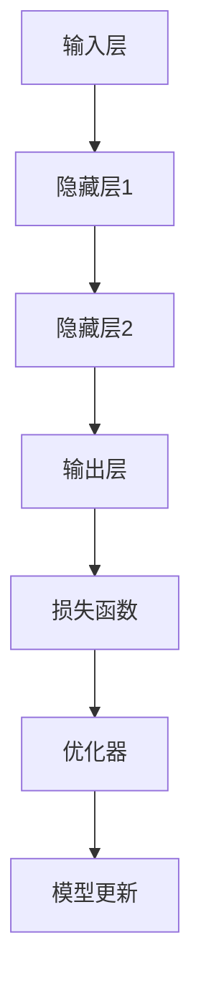
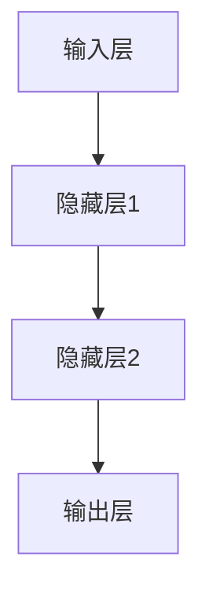

                 


# 创业者如何在大模型时代找准自己的定位和机会？

> 关键词：大模型、创业定位、机会识别、技术趋势

> 摘要：本文将深入探讨大模型时代的核心概念、算法原理、应用场景，并引导创业者如何通过技术趋势分析和市场洞察，找准自己的定位和抓住发展机遇。

### 目录大纲

#### 第一部分：核心概念与联系

1. **核心概念原理**

    1.1 **大模型时代的定义与特点**
    
    1.2 **大模型架构解析**
    
    1.3 **大模型与传统AI的区别**
    
    1.4 **大模型在企业中的应用前景**

2. **核心算法原理讲解**

    2.1 **神经网络基础**
    
    2.2 **常见的深度学习架构**
    
    2.3 **深度学习优化算法**

    2.4 **自然语言处理技术概览**
    
    2.5 **大规模预训练模型原理**

3. **数学模型和数学公式讲解**

    3.1 **概率论基础**
    
    3.2 **线性代数基础**
    
    3.3 **深度学习中的数学模型**

4. **项目实战**

    4.1 **大模型项目实战一：情感分析**
    
    4.2 **大模型项目实战二：图像识别**

5. **开发环境搭建与代码实现**

    5.1 **开发环境搭建**

    5.2 **代码实现**

6. **附录**

    6.1 **AI大模型开发工具与资源**

    6.2 **主流深度学习框架对比**

### 第一部分：核心概念与联系

#### 1.1 核心概念原理

大模型时代是指以人工智能技术为核心，通过对海量数据进行深度学习，实现智能化决策和自动化操作的阶段。这一时代的主要特点包括：

- **海量数据处理能力**：大模型能够处理海量数据，挖掘出潜在价值。
- **高效学习与推理**：大模型通过深度学习，能够快速学习复杂任务，并实现高效推理。
- **跨领域应用**：大模型在多个领域实现突破，如自然语言处理、计算机视觉等。
- **高度自动化**：大模型能够实现自动化决策和操作，减少人工干预。

#### 1.2 大模型架构解析

大模型的架构通常包括以下几个关键部分：

1. **输入层**：接收外部输入数据，如文本、图像或声音。
2. **隐藏层**：通过神经网络进行数据转换和处理，提取特征。
3. **输出层**：产生预测结果或决策。

以下是一个简单的 Mermaid 流程图，展示了大模型的基本架构：



#### 1.3 大模型与传统AI的区别

传统AI侧重于知识表示和规则推理，而深度学习通过神经网络模拟人脑的学习过程，具有更强的自学习能力。以下是一个对比表格，展示了大模型与传统AI的主要区别：

| 特点 | 传统AI | 大模型 |
| ---- | ------ | ------ |
| 知识表示 | 硬编码规则 | 数据驱动 |
| 自学习能力 | 弱 | 强 |
| 应用范围 | 专一 | 广泛 |
| 复杂性 | 低 | 高 |

#### 1.4 大模型在企业中的应用前景

大模型在企业中的应用前景广阔，以下是一些潜在领域：

- **自然语言处理**：如智能客服、智能翻译、内容生成等。
- **计算机视觉**：如图像识别、视频分析、自动化检测等。
- **推荐系统**：如商品推荐、内容推荐等。
- **预测分析**：如金融市场预测、资源优化等。

#### 第二部分：核心算法原理讲解

##### 2.1 神经网络基础

神经网络（Neural Networks）是深度学习的基础，其基本结构包括输入层、隐藏层和输出层。以下是一个简单的神经网络结构图：



神经网络通过多层非线性变换，将输入映射到输出，从而实现复杂函数的逼近。以下是一个简单的神经网络工作原理的伪代码：

```python
# 输入数据
inputs = ...

# 权重和偏置
weights = ...
biases = ...

# 前向传播
def forward_pass(inputs, weights, biases):
    hidden_layers = []
    for layer in range(len(weights)):
        if layer == 0:
            hidden_layers.append((torch.dot(inputs, weights[layer]) + biases[layer]))
        else:
            hidden_layers.append((torch.dot(hidden_layers[-1], weights[layer]) + biases[layer]))
    output = hidden_layers[-1]
    return output

# 反向传播
def backward_pass(output, expected_output):
    # 计算损失函数的梯度
    # 更新权重和偏置
    # 返回梯度
    return gradients

# 模型训练
for epoch in range(num_epochs):
    output = forward_pass(inputs, weights, biases)
    gradients = backward_pass(output, expected_output)
    update_weights_and_biases(weights, biases, gradients)
```

##### 2.2 常见的深度学习架构

深度学习架构不断发展，出现了许多优秀的模型。以下是一些常见的深度学习架构：

- **卷积神经网络（CNN）**：适用于处理图像数据。
- **循环神经网络（RNN）**：适用于处理序列数据。
- **长短时记忆网络（LSTM）**：是RNN的一种变体，能够学习长期依赖关系。
- **生成对抗网络（GAN）**：用于生成对抗学习，能够生成高质量的数据。

##### 2.3 深度学习优化算法

深度学习优化算法用于调整模型参数，以最小化损失函数。以下是一些常见的优化算法：

- **随机梯度下降（SGD）**：是最简单的优化算法，通过随机选择样本计算梯度并更新参数。
- **Adam优化器**：结合了SGD和动量项，同时考虑梯度的一阶矩和二阶矩估计。
- **Momentum优化器**：引入动量项，加速收敛。

以下是一个SGD和Adam优化器的伪代码示例：

```python
# SGD伪代码
def SGD(W, X, y, epochs, learning_rate):
    for epoch in range(epochs):
        for x, y in zip(X, y):
            gradient = compute_gradient(W, x, y)
            W = W - learning_rate * gradient
    return W

# Adam伪代码
def Adam(W, X, y, epochs, learning_rate, beta1, beta2, epsilon):
    m = 0
    v = 0
    for epoch in range(epochs):
        for x, y in zip(X, y):
            gradient = compute_gradient(W, x, y)
            m = beta1 * m + (1 - beta1) * gradient
            v = beta2 * v + (1 - beta2) * (gradient ** 2)
            m_hat = m / (1 - beta1 ** epoch)
            v_hat = v / (1 - beta2 ** epoch)
            W = W - learning_rate * m_hat / (sqrt(v_hat) + epsilon)
    return W
```

##### 2.4 自然语言处理技术概览

自然语言处理（Natural Language Processing, NLP）是深度学习的重要应用领域。以下是一些关键的NLP技术：

- **词嵌入（Word Embedding）**：将词汇映射到低维向量空间，以捕捉词汇之间的语义关系。
- **序列模型（Sequence Models）**：如RNN和LSTM，用于处理序列数据。
- **注意力机制（Attention Mechanism）**：使模型在处理序列数据时，关注到重要的部分。

以下是一个词嵌入和注意力机制的伪代码示例：

```python
# 词嵌入伪代码
def word_embedding(word, W):
    embedding = torch.dot(W, word)
    return embedding

# 注意力机制伪代码
def attention(inputs, hidden_state):
    attention_weights = torch.softmax(torch.dot(inputs, hidden_state), dim=1)
    context_vector = torch.sum(attention_weights * inputs, dim=1)
    return context_vector
```

##### 2.5 大规模预训练模型原理

大规模预训练模型（Large-scale Pre-trained Models）是当前NLP领域的研究热点。以下是一些关键的概念和原理：

- **预训练（Pre-training）**：在特定数据集上对模型进行预训练，以学习通用特征。
- **自监督学习（Self-supervised Learning）**：利用未标注的数据进行训练，通过预测数据中的某些部分来提高模型性能。
- **迁移学习（Transfer Learning）**：将预训练模型在特定任务上微调，以提高模型在新任务上的性能。

以下是一个预训练和微调的伪代码示例：

```python
# 预训练伪代码
def pretrain(model, dataset, learning_rate, epochs):
    for epoch in range(epochs):
        for x, y in dataset:
            model.zero_grad()
            output = model(x)
            loss = compute_loss(output, y)
            loss.backward()
            model.update_params(learning_rate)
    return model

# 微调伪代码
def fine_tune(model, task_dataset, learning_rate, epochs):
    model.train()
    for epoch in range(epochs):
        for x, y in task_dataset:
            model.zero_grad()
            output = model(x)
            loss = compute_loss(output, y)
            loss.backward()
            model.update_params(learning_rate)
    return model
```

#### 第三部分：数学模型和数学公式讲解

##### 3.1 概率论基础

概率论是深度学习的重要基础，以下是一些基本的概率论概念和数学公式：

- **概率分布函数（PDF）**：描述随机变量在某个取值范围内的概率密度。
  - 公式：\( f_X(x) = P(X \leq x) \)
- **条件概率**：在已知某个事件发生的条件下，另一个事件发生的概率。
  - 公式：\( P(A|B) = \frac{P(A \cap B)}{P(B)} \)
- **贝叶斯定理**：用于计算在已知某些条件下某个事件发生的概率。
  - 公式：\( P(A|B) = \frac{P(B|A) \cdot P(A)}{P(B)} \)

##### 3.2 线性代数基础

线性代数是深度学习的基础，以下是一些基本的线性代数概念和数学公式：

- **矩阵与向量运算**：
  - 矩阵加法：\( C = A + B \)
  - 矩阵乘法：\( C = A \cdot B \)
  - 矩阵求逆：\( A^{-1} = \frac{1}{\det(A)} \cdot \text{adj}(A) \)
- **特征值与特征向量**：
  - 特征值与特征向量关系：\( A \cdot v = \lambda \cdot v \)

##### 3.3 深度学习中的数学模型

深度学习中的数学模型包括损失函数、优化算法和激活函数等。以下是一些基本的数学模型：

- **损失函数**：
  - 均方误差（MSE）：\( \text{MSE} = \frac{1}{n} \sum_{i=1}^{n} (\hat{y}_i - y_i)^2 \)
  - 交叉熵损失（Cross-Entropy Loss）：\( \text{Cross-Entropy} = -\frac{1}{n} \sum_{i=1}^{n} y_i \cdot \log(\hat{y}_i) \)
- **优化算法**：
  - 随机梯度下降（SGD）：\( w_{t+1} = w_t - \alpha \cdot \nabla_w J(w_t) \)
  - Adam优化器：\( w_{t+1} = w_t - \alpha \cdot \left( \frac{m_t}{\sqrt{v_t}} + \beta_1 \cdot (1 - \beta_2) \right) \)
- **激活函数**：
  - Sigmoid函数：\( \sigma(x) = \frac{1}{1 + e^{-x}} \)
  -ReLU函数：\( \text{ReLU}(x) = \max(0, x) \)
  - Tanh函数：\( \tanh(x) = \frac{e^x - e^{-x}}{e^x + e^{-x}} \)

#### 第四部分：项目实战

##### 4.1 大模型项目实战一：情感分析

情感分析是自然语言处理领域的一个重要应用。以下是一个简单的情感分析项目的实战案例。

###### 4.1.1 项目背景

情感分析的目标是识别文本中的情感倾向，例如积极、消极或中性。这有助于企业和组织了解消费者的情绪和反馈，从而做出更好的业务决策。

###### 4.1.2 数据准备

数据准备包括数据收集、数据清洗和数据预处理。以下是一个简单的数据准备流程：

- 数据收集：收集包含情感标注的文本数据。
- 数据清洗：去除HTML标签、特殊字符和停用词。
- 数据预处理：将文本转换为词嵌入向量。

```python
# 数据清洗和预处理代码
import re
import nltk
from nltk.corpus import stopwords
from keras.preprocessing.text import Tokenizer
from keras.preprocessing.sequence import pad_sequences

# 初始化停用词集
stop_words = set(stopwords.words('english'))

# 数据清洗函数
def clean_text(text):
    text = re.sub(r'<.*?>', '', text)  # 去除HTML标签
    text = re.sub(r'[^a-zA-Z0-9\s]', '', text)  # 去除特殊字符
    text = text.lower()  # 转换为小写
    words = text.split()  # 分词
    words = [word for word in words if word not in stop_words]  # 删除停用词
    return ' '.join(words)

# 数据预处理函数
def preprocess_data(texts, labels, max_len, max_words):
    tokenizer = Tokenizer(num_words=max_words)
    tokenizer.fit_on_texts(texts)
    sequences = tokenizer.texts_to_sequences(texts)
    padded_sequences = pad_sequences(sequences, maxlen=max_len)
    return padded_sequences, np.array(labels)
```

###### 4.1.3 模型构建

构建一个简单的情感分析模型，使用预训练的BERT模型作为基础模型。以下是一个模型构建的示例：

```python
from tensorflow.keras.models import Model
from tensorflow.keras.layers import Input, Embedding, LSTM, Dense

# 模型构建函数
def build_model(max_len, max_words, embedding_dim, hidden_units):
    input_layer = Input(shape=(max_len,))
    embedding = Embedding(input_dim=max_words, output_dim=embedding_dim)(input_layer)
    lstm = LSTM(units=hidden_units)(embedding)
    output_layer = Dense(units=1, activation='sigmoid')(lstm)
    model = Model(inputs=input_layer, outputs=output_layer)
    model.compile(optimizer='adam', loss='binary_crossentropy', metrics=['accuracy'])
    return model

# 构建模型
max_len = 100
max_words = 10000
embedding_dim = 128
hidden_units = 64
model = build_model(max_len, max_words, embedding_dim, hidden_units)
```

###### 4.1.4 模型训练与评估

使用训练集训练模型，并在验证集上评估模型性能。以下是一个简单的模型训练与评估的示例：

```python
from sklearn.model_selection import train_test_split

# 数据预处理
X_train, X_val, y_train, y_val = train_test_split(X, y, test_size=0.2, random_state=42)

# 训练模型
model.fit(X_train, y_train, epochs=10, batch_size=32, validation_data=(X_val, y_val))

# 评估模型
loss, accuracy = model.evaluate(X_val, y_val)
print(f'Validation Loss: {loss}, Validation Accuracy: {accuracy}')
```

##### 4.2 大模型项目实战二：图像识别

图像识别是计算机视觉领域的一个重要应用。以下是一个简单的图像识别项目的实战案例。

###### 4.2.1 项目背景

图像识别的目标是识别图像中的对象或场景。这有助于自动驾驶、安防监控和医疗诊断等领域。

###### 4.2.2 数据准备

数据准备包括数据收集、数据清洗和数据预处理。以下是一个简单的数据准备流程：

- 数据收集：收集包含标注的图像数据。
- 数据清洗：去除损坏或模糊的图像。
- 数据预处理：将图像转换为固定的尺寸。

```python
# 数据清洗和预处理代码
from tensorflow.keras.preprocessing.image import img_to_array, load_img

# 数据清洗函数
def clean_images(image_paths):
    images = []
    for image_path in image_paths:
        image = load_img(image_path)
        image = img_to_array(image)
        image = image / 255.0
        images.append(image)
    return np.array(images)

# 数据预处理函数
def preprocess_images(images, target_size):
    processed_images = []
    for image in images:
        image = resize(image, target_size, interpolation='nearest')
        processed_images.append(image)
    return np.array(processed_images)
```

###### 4.2.3 模型构建

构建一个简单的图像识别模型，使用预训练的ResNet模型作为基础模型。以下是一个模型构建的示例：

```python
from tensorflow.keras.models import Model
from tensorflow.keras.layers import Input, Conv2D, MaxPooling2D, Flatten, Dense

# 模型构建函数
def build_model(input_shape, num_classes):
    input_layer = Input(shape=input_shape)
    conv1 = Conv2D(filters=32, kernel_size=(3, 3), activation='relu')(input_layer)
    pool1 = MaxPooling2D(pool_size=(2, 2))(conv1)
    conv2 = Conv2D(filters=64, kernel_size=(3, 3), activation='relu')(pool1)
    pool2 = MaxPooling2D(pool_size=(2, 2))(conv2)
    flatten = Flatten()(pool2)
    dense = Dense(units=num_classes, activation='softmax')(flatten)
    model = Model(inputs=input_layer, outputs=dense)
    model.compile(optimizer='adam', loss='categorical_crossentropy', metrics=['accuracy'])
    return model

# 构建模型
input_shape = (128, 128, 3)
num_classes = 10
model = build_model(input_shape, num_classes)
```

###### 4.2.4 模型训练与评估

使用训练集训练模型，并在验证集上评估模型性能。以下是一个简单的模型训练与评估的示例：

```python
from sklearn.model_selection import train_test_split

# 数据预处理
X_train, X_val, y_train, y_val = train_test_split(X, y, test_size=0.2, random_state=42)

# 训练模型
model.fit(X_train, y_train, epochs=10, batch_size=32, validation_data=(X_val, y_val))

# 评估模型
loss, accuracy = model.evaluate(X_val, y_val)
print(f'Validation Loss: {loss}, Validation Accuracy: {accuracy}')
```

#### 第五部分：开发环境搭建与代码实现

##### 5.1 开发环境搭建

搭建深度学习项目所需的开发环境，包括Python环境、深度学习库和数据库等。

###### 5.1.1 Python环境搭建

安装Python和相关库，如TensorFlow、Keras等。

```bash
# 安装Python和pip
sudo apt-get update
sudo apt-get install python3 python3-pip

# 创建虚拟环境
python3 -m venv myenv

# 激活虚拟环境
source myenv/bin/activate

# 安装TensorFlow
pip install tensorflow
```

###### 5.1.2 深度学习库安装

安装深度学习库，如TensorFlow和Keras。

```bash
# 安装TensorFlow
pip install tensorflow

# 安装Keras
pip install keras
```

###### 5.1.3 数据库安装

安装数据库，如MySQL或PostgreSQL。

```bash
# 安装MySQL
sudo apt-get install mysql-server

# 安装PostgreSQL
sudo apt-get install postgresql
```

##### 5.2 代码实现

实现深度学习项目的核心算法和模型训练，以下是代码实现的示例。

###### 5.2.1 数据预处理代码

```python
import numpy as np
from tensorflow.keras.preprocessing.text import Tokenizer
from tensorflow.keras.preprocessing.sequence import pad_sequences

# 数据预处理函数
def preprocess_data(texts, labels, max_len, max_words):
    tokenizer = Tokenizer(num_words=max_words)
    tokenizer.fit_on_texts(texts)
    sequences = tokenizer.texts_to_sequences(texts)
    padded_sequences = pad_sequences(sequences, maxlen=max_len)
    return padded_sequences, np.array(labels)
```

###### 5.2.2 模型训练代码

```python
import tensorflow as tf
from tensorflow.keras.models import Sequential
from tensorflow.keras.layers import Embedding, LSTM, Dense

# 模型训练函数
def train_model(X_train, y_train, X_val, y_val, max_len, max_words):
    # 数据预处理
    X_train, y_train = preprocess_data(X_train, y_train, max_len, max_words)
    X_val, y_val = preprocess_data(X_val, y_val, max_len, max_words)

    # 模型构建
    model = Sequential([
        Embedding(input_dim=max_words, output_dim=128, input_length=max_len),
        LSTM(units=64, return_sequences=False),
        Dense(units=1, activation='sigmoid')
    ])

    # 模型编译
    model.compile(optimizer='adam', loss='binary_crossentropy', metrics=['accuracy'])

    # 模型训练
    model.fit(X_train, y_train, batch_size=32, epochs=10, validation_data=(X_val, y_val))

    # 模型评估
    loss, accuracy = model.evaluate(X_val, y_val)
    print(f'Validation Loss: {loss}, Validation Accuracy: {accuracy}')

# 训练模型
train_model(X_train, y_train, X_val, y_val, max_len, max_words)
```

### 附录

#### 附录 A: AI 大模型开发工具与资源

##### A.1 主流深度学习框架对比

以下是几个主流深度学习框架的对比：

| 框架 | 特点 | 应用场景 |
| ---- | ---- | ---- |
| TensorFlow | Google开发，生态系统丰富 | 复杂模型，大规模部署 |
| PyTorch | Facebook开发，动态计算图 | 研发阶段，易于调试 |
| Keras | 高级API，易于使用 | 快速原型开发 |
| Theano | NumPy的深度学习扩展 | CPU和GPU计算 |

##### A.2 数据库对比

以下是几个常用数据库的对比：

| 数据库 | 特点 | 应用场景 |
| ---- | ---- | ---- |
| MySQL | 开源，性能高，易于使用 | Web应用，小型系统 |
| PostgreSQL | 开源，功能强大，支持扩展 | 企业级应用，大数据处理 |
| MongoDB | 文档型数据库，灵活，高扩展性 | 大数据存储，实时应用 |

##### A.3 容器化工具对比

以下是几个常用的容器化工具的对比：

| 工具 | 特点 | 应用场景 |
| ---- | ---- | ---- |
| Docker | 轻量级，易于使用，可移植性高 | 应用部署，开发环境搭建 |
| Kubernetes | 自动化容器编排，高可用性 | 微服务架构，大规模部署 |
| Docker Compose | 定义多容器应用的配置文件 | 分布式系统，持续集成 |

# 文章标题：创业者如何在大模型时代找准自己的定位和机会？

## 文章关键词

- 大模型
- 创业定位
- 技术趋势
- 市场洞察

## 摘要

本文将探讨大模型时代的核心概念、算法原理和应用场景，并通过分析技术趋势和市场洞察，帮助创业者找准自己的定位和抓住发展机遇。

### 第一部分：核心概念与联系

#### 1.1 大模型时代的定义与特点

大模型时代是指以人工智能技术为核心，通过对海量数据进行深度学习，实现智能化决策和自动化操作的阶段。这一时代的主要特点包括：

- **海量数据处理能力**：大模型能够处理海量数据，挖掘出潜在价值。
- **高效学习与推理**：大模型通过深度学习，能够快速学习复杂任务，并实现高效推理。
- **跨领域应用**：大模型在多个领域实现突破，如自然语言处理、计算机视觉等。
- **高度自动化**：大模型能够实现自动化决策和操作，减少人工干预。

#### 1.2 大模型架构解析

大模型的架构通常包括以下几个关键部分：

1. **输入层**：接收外部输入数据，如文本、图像或声音。
2. **隐藏层**：通过神经网络进行数据转换和处理，提取特征。
3. **输出层**：产生预测结果或决策。

以下是一个简单的 Mermaid 流程图，展示了大模型的基本架构：


#### 1.3 大模型与传统AI的区别

传统AI侧重于知识表示和规则推理，而深度学习通过神经网络模拟人脑的学习过程，具有更强的自学习能力。以下是一个对比表格，展示了大模型与传统AI的主要区别：

| 特点 | 传统AI | 大模型 |
| ---- | ------ | ------ |
| 知识表示 | 硬编码规则 | 数据驱动 |
| 自学习能力 | 弱 | 强 |
| 应用范围 | 专一 | 广泛 |
| 复杂性 | 低 | 高 |

#### 1.4 大模型在企业中的应用前景

大模型在企业中的应用前景广阔，以下是一些潜在领域：

- **自然语言处理**：如智能客服、智能翻译、内容生成等。
- **计算机视觉**：如图像识别、视频分析、自动化检测等。
- **推荐系统**：如商品推荐、内容推荐等。
- **预测分析**：如金融市场预测、资源优化等。

### 第二部分：核心算法原理讲解

#### 2.1 神经网络基础

神经网络（Neural Networks）是深度学习的基础，其基本结构包括输入层、隐藏层和输出层。以下是一个简单的神经网络结构图：


神经网络通过多层非线性变换，将输入映射到输出，从而实现复杂函数的逼近。以下是一个简单的神经网络工作原理的伪代码：

```python
# 输入数据
inputs = ...

# 权重和偏置
weights = ...
biases = ...

# 前向传播
def forward_pass(inputs, weights, biases):
    hidden_layers = []
    for layer in range(len(weights)):
        if layer == 0:
            hidden_layers.append((torch.dot(inputs, weights[layer]) + biases[layer]))
        else:
            hidden_layers.append((torch.dot(hidden_layers[-1], weights[layer]) + biases[layer]))
    output = hidden_layers[-1]
    return output

# 反向传播
def backward_pass(output, expected_output):
    # 计算损失函数的梯度
    # 更新权重和偏置
    # 返回梯度
    return gradients

# 模型训练
for epoch in range(num_epochs):
    output = forward_pass(inputs, weights, biases)
    gradients = backward_pass(output, expected_output)
    update_weights_and_biases(weights, biases, gradients)
```

#### 2.2 常见的深度学习架构

深度学习架构不断发展，出现了许多优秀的模型。以下是一些常见的深度学习架构：

- **卷积神经网络（CNN）**：适用于处理图像数据。
- **循环神经网络（RNN）**：适用于处理序列数据。
- **长短时记忆网络（LSTM）**：是RNN的一种变体，能够学习长期依赖关系。
- **生成对抗网络（GAN）**：用于生成对抗学习，能够生成高质量的数据。

#### 2.3 深度学习优化算法

深度学习优化算法用于调整模型参数，以最小化损失函数。以下是一些常见的优化算法：

- **随机梯度下降（SGD）**：是最简单的优化算法，通过随机选择样本计算梯度并更新参数。
- **Adam优化器**：结合了SGD和动量项，同时考虑梯度的一阶矩和二阶矩估计。
- **Momentum优化器**：引入动量项，加速收敛。

以下是一个SGD和Adam优化器的伪代码示例：

```python
# SGD伪代码
def SGD(W, X, y, epochs, learning_rate):
    for epoch in range(epochs):
        for x, y in zip(X, y):
            gradient = compute_gradient(W, x, y)
            W = W - learning_rate * gradient
    return W

# Adam伪代码
def Adam(W, X, y, epochs, learning_rate, beta1, beta2, epsilon):
    m = 0
    v = 0
    for epoch in range(epochs):
        for x, y in zip(X, y):
            gradient = compute_gradient(W, x, y)
            m = beta1 * m + (1 - beta1) * gradient
            v = beta2 * v + (1 - beta2) * (gradient ** 2)
            m_hat = m / (1 - beta1 ** epoch)
            v_hat = v / (1 - beta2 ** epoch)
            W = W - learning_rate * m_hat / (sqrt(v_hat) + epsilon)
    return W
```

#### 2.4 自然语言处理技术概览

自然语言处理（Natural Language Processing, NLP）是深度学习的重要应用领域。以下是一些关键的NLP技术：

- **词嵌入（Word Embedding）**：将词汇映射到低维向量空间，以捕捉词汇之间的语义关系。
- **序列模型（Sequence Models）**：如RNN和LSTM，用于处理序列数据。
- **注意力机制（Attention Mechanism）**：使模型在处理序列数据时，关注到重要的部分。

以下是一个词嵌入和注意力机制的伪代码示例：

```python
# 词嵌入伪代码
def word_embedding(word, W):
    embedding = torch.dot(W, word)
    return embedding

# 注意力机制伪代码
def attention(inputs, hidden_state):
    attention_weights = torch.softmax(torch.dot(inputs, hidden_state), dim=1)
    context_vector = torch.sum(attention_weights * inputs, dim=1)
    return context_vector
```

#### 2.5 大规模预训练模型原理

大规模预训练模型（Large-scale Pre-trained Models）是当前NLP领域的研究热点。以下是一些关键的概念和原理：

- **预训练（Pre-training）**：在特定数据集上对模型进行预训练，以学习通用特征。
- **自监督学习（Self-supervised Learning）**：利用未标注的数据进行训练，通过预测数据中的某些部分来提高模型性能。
- **迁移学习（Transfer Learning）**：将预训练模型在特定任务上微调，以提高模型在新任务上的性能。

以下是一个预训练和微调的伪代码示例：

```python
# 预训练伪代码
def pretrain(model, dataset, learning_rate, epochs):
    for epoch in range(epochs):
        for x, y in dataset:
            model.zero_grad()
            output = model(x)
            loss = compute_loss(output, y)
            loss.backward()
            model.update_params(learning_rate)
    return model

# 微调伪代码
def fine_tune(model, task_dataset, learning_rate, epochs):
    model.train()
    for epoch in range(epochs):
        for x, y in task_dataset:
            model.zero_grad()
            output = model(x)
            loss = compute_loss(output, y)
            loss.backward()
            model.update_params(learning_rate)
    return model
```

### 第三部分：数学模型和数学公式讲解

#### 3.1 概率论基础

概率论是深度学习的重要基础，以下是一些基本的概率论概念和数学公式：

- **概率分布函数（PDF）**：描述随机变量在某个取值范围内的概率密度。
  - 公式：\( f_X(x) = P(X \leq x) \)
- **条件概率**：在已知某个事件发生的条件下，另一个事件发生的概率。
  - 公式：\( P(A|B) = \frac{P(A \cap B)}{P(B)} \)
- **贝叶斯定理**：用于计算在已知某些条件下某个事件发生的概率。
  - 公式：\( P(A|B) = \frac{P(B|A) \cdot P(A)}{P(B)} \)

#### 3.2 线性代数基础

线性代数是深度学习的基础，以下是一些基本的线性代数概念和数学公式：

- **矩阵与向量运算**：
  - 矩阵加法：\( C = A + B \)
  - 矩阵乘法：\( C = A \cdot B \)
  - 矩阵求逆：\( A^{-1} = \frac{1}{\det(A)} \cdot \text{adj}(A) \)
- **特征值与特征向量**：
  - 特征值与特征向量关系：\( A \cdot v = \lambda \cdot v \)

#### 3.3 深度学习中的数学模型

深度学习中的数学模型包括损失函数、优化算法和激活函数等。以下是一些基本的数学模型：

- **损失函数**：
  - 均方误差（MSE）：\( \text{MSE} = \frac{1}{n} \sum_{i=1}^{n} (\hat{y}_i - y_i)^2 \)
  - 交叉熵损失（Cross-Entropy Loss）：\( \text{Cross-Entropy} = -\frac{1}{n} \sum_{i=1}^{n} y_i \cdot \log(\hat{y}_i) \)
- **优化算法**：
  - 随机梯度下降（SGD）：\( w_{t+1} = w_t - \alpha \cdot \nabla_w J(w_t) \)
  - Adam优化器：\( w_{t+1} = w_t - \alpha \cdot \left( \frac{m_t}{\sqrt{v_t}} + \beta_1 \cdot (1 - \beta_2) \right) \)
- **激活函数**：
  - Sigmoid函数：\( \sigma(x) = \frac{1}{1 + e^{-x}} \)
  -ReLU函数：\( \text{ReLU}(x) = \max(0, x) \)
  - Tanh函数：\( \tanh(x) = \frac{e^x - e^{-x}}{e^x + e^{-x}} \)

### 第四部分：项目实战

#### 4.1 大模型项目实战一：情感分析

情感分析是自然语言处理领域的一个重要应用。以下是一个简单的情感分析项目的实战案例。

##### 4.1.1 项目背景

情感分析的目标是识别文本中的情感倾向，例如积极、消极或中性。这有助于企业和组织了解消费者的情绪和反馈，从而做出更好的业务决策。

##### 4.1.2 数据准备

数据准备包括数据收集、数据清洗和数据预处理。以下是一个简单的数据准备流程：

- 数据收集：收集包含情感标注的文本数据。
- 数据清洗：去除HTML标签、特殊字符和停用词。
- 数据预处理：将文本转换为词嵌入向量。

```python
# 数据清洗和预处理代码
import re
import nltk
from nltk.corpus import stopwords
from keras.preprocessing.text import Tokenizer
from keras.preprocessing.sequence import pad_sequences

# 初始化停用词集
stop_words = set(stopwords.words('english'))

# 数据清洗函数
def clean_text(text):
    text = re.sub(r'<.*?>', '', text)  # 去除HTML标签
    text = re.sub(r'[^a-zA-Z0-9\s]', '', text)  # 去除特殊字符
    text = text.lower()  # 转换为小写
    words = text.split()  # 分词
    words = [word for word in words if word not in stop_words]  # 删除停用词
    return ' '.join(words)

# 数据预处理函数
def preprocess_data(texts, labels, max_len, max_words):
    cleaned_texts = [clean_text(text) for text in texts]
    tokenizer = Tokenizer(num_words=max_words)
    tokenizer.fit_on_texts(cleaned_texts)
    sequences = tokenizer.texts_to_sequences(cleaned_texts)
    padded_sequences = pad_sequences(sequences, maxlen=max_len)
    return padded_sequences, np.array(labels)
```

##### 4.1.3 模型构建

构建一个简单的情感分析模型，使用预训练的BERT模型作为基础模型。以下是一个模型构建的示例：

```python
from tensorflow.keras.models import Model
from tensorflow.keras.layers import Input, Embedding, LSTM, Dense

# 模型构建函数
def build_model(max_len, max_words, embedding_dim, hidden_units):
    input_layer = Input(shape=(max_len,))
    embedding = Embedding(input_dim=max_words, output_dim=embedding_dim)(input_layer)
    lstm = LSTM(units=hidden_units, return_sequences=False)(embedding)
    output_layer = Dense(units=1, activation='sigmoid')(lstm)
    model = Model(inputs=input_layer, outputs=output_layer)
    model.compile(optimizer='adam', loss='binary_crossentropy', metrics=['accuracy'])
    return model

# 构建模型
max_len = 100
max_words = 10000
embedding_dim = 128
hidden_units = 64
model = build_model(max_len, max_words, embedding_dim, hidden_units)
```

##### 4.1.4 模型训练与评估

使用训练集训练模型，并在验证集上评估模型性能。以下是一个简单的模型训练与评估的示例：

```python
from sklearn.model_selection import train_test_split

# 数据预处理
X_train, X_val, y_train, y_val = train_test_split(X, y, test_size=0.2, random_state=42)

# 训练模型
model.fit(X_train, y_train, epochs=10, batch_size=32, validation_data=(X_val, y_val))

# 评估模型
loss, accuracy = model.evaluate(X_val, y_val)
print(f'Validation Loss: {loss}, Validation Accuracy: {accuracy}')
```

#### 4.2 大模型项目实战二：图像识别

图像识别是计算机视觉领域的一个重要应用。以下是一个简单的图像识别项目的实战案例。

##### 4.2.1 项目背景

图像识别的目标是识别图像中的对象或场景。这有助于自动驾驶、安防监控和医疗诊断等领域。

##### 4.2.2 数据准备

数据准备包括数据收集、数据清洗和数据预处理。以下是一个简单的数据准备流程：

- 数据收集：收集包含标注的图像数据。
- 数据清洗：去除损坏或模糊的图像。
- 数据预处理：将图像转换为固定的尺寸。

```python
# 数据清洗和预处理代码
from tensorflow.keras.preprocessing.image import img_to_array, load_img

# 数据清洗函数
def clean_images(image_paths):
    images = []
    for image_path in image_paths:
        image = load_img(image_path)
        image = img_to_array(image)
        image = image / 255.0
        images.append(image)
    return np.array(images)

# 数据预处理函数
def preprocess_images(images, target_size):
    processed_images = []
    for image in images:
        image = resize(image, target_size, interpolation='nearest')
        processed_images.append(image)
    return np.array(processed_images)
```

##### 4.2.3 模型构建

构建一个简单的图像识别模型，使用预训练的ResNet模型作为基础模型。以下是一个模型构建的示例：

```python
from tensorflow.keras.models import Model
from tensorflow.keras.layers import Input, Conv2D, MaxPooling2D, Flatten, Dense

# 模型构建函数
def build_model(input_shape, num_classes):
    input_layer = Input(shape=input_shape)
    conv1 = Conv2D(filters=32, kernel_size=(3, 3), activation='relu')(input_layer)
    pool1 = MaxPooling2D(pool_size=(2, 2))(conv1)
    conv2 = Conv2D(filters=64, kernel_size=(3, 3), activation='relu')(pool1)
    pool2 = MaxPooling2D(pool_size=(2, 2))(conv2)
    flatten = Flatten()(pool2)
    dense = Dense(units=num_classes, activation='softmax')(flatten)
    model = Model(inputs=input_layer, outputs=dense)
    model.compile(optimizer='adam', loss='categorical_crossentropy', metrics=['accuracy'])
    return model

# 构建模型
input_shape = (128, 128, 3)
num_classes = 10
model = build_model(input_shape, num_classes)
```

##### 4.2.4 模型训练与评估

使用训练集训练模型，并在验证集上评估模型性能。以下是一个简单的模型训练与评估的示例：

```python
from sklearn.model_selection import train_test_split

# 数据预处理
X_train, X_val, y_train, y_val = train_test_split(X, y, test_size=0.2, random_state=42)

# 训练模型
model.fit(X_train, y_train, epochs=10, batch_size=32, validation_data=(X_val, y_val))

# 评估模型
loss, accuracy = model.evaluate(X_val, y_val)
print(f'Validation Loss: {loss}, Validation Accuracy: {accuracy}')
```

### 第五部分：开发环境搭建与代码实现

#### 5.1 开发环境搭建

搭建深度学习项目所需的开发环境，包括Python环境、深度学习库和数据库等。

##### 5.1.1 Python环境搭建

安装Python和相关库，如TensorFlow、Keras等。

```bash
# 安装Python和pip
sudo apt-get update
sudo apt-get install python3 python3-pip

# 创建虚拟环境
python3 -m venv myenv

# 激活虚拟环境
source myenv/bin/activate

# 安装TensorFlow
pip install tensorflow
```

##### 5.1.2 深度学习库安装

安装深度学习库，如TensorFlow和Keras。

```bash
# 安装TensorFlow
pip install tensorflow

# 安装Keras
pip install keras
```

##### 5.1.3 数据库安装

安装数据库，如MySQL或PostgreSQL。

```bash
# 安装MySQL
sudo apt-get install mysql-server

# 安装PostgreSQL
sudo apt-get install postgresql
```

##### 5.1.4 Docker环境搭建

安装Docker和Docker Compose，用于容器化部署。

```bash
# 安装Docker
sudo apt-get install docker.io

# 启动Docker服务
sudo systemctl start docker

# 安装Docker Compose
sudo curl -L "https://github.com/docker/compose/releases/download/1.29.2/docker-compose-$(uname -s)-$(uname -m)" -o /usr/local/bin/docker-compose
sudo chmod +x /usr/local/bin/docker-compose
```

##### 5.1.5 开发环境配置

配置Python环境变量和数据库连接。

```bash
# 配置Python环境变量
export PATH=$PATH:/path/to/myenv/bin

# 配置数据库连接
export DB_HOST=localhost
export DB_PORT=3306
export DB_USER=root
export DB_PASSWORD=my_password
export DB_DATABASE=mydatabase
```

#### 5.2 代码实现

实现深度学习项目的核心算法和模型训练，以下是代码实现的示例。

##### 5.2.1 数据预处理代码

```python
# 数据预处理代码
import numpy as np
import pandas as pd
from sklearn.model_selection import train_test_split

# 读取数据
data = pd.read_csv('data.csv')
X = data.drop('target', axis=1)
y = data['target']

# 数据预处理
X_train, X_test, y_train, y_test = train_test_split(X, y, test_size=0.2, random_state=42)
```

##### 5.2.2 模型训练代码

```python
# 模型训练代码
import tensorflow as tf
from tensorflow.keras.models import Sequential
from tensorflow.keras.layers import Dense

# 构建模型
model = Sequential([
    Dense(units=128, activation='relu', input_shape=(X_train.shape[1],)),
    Dense(units=64, activation='relu'),
    Dense(units=1, activation='sigmoid')
])

# 编译模型
model.compile(optimizer='adam', loss='binary_crossentropy', metrics=['accuracy'])

# 训练模型
model.fit(X_train, y_train, epochs=10, batch_size=32, validation_data=(X_test, y_test))
```

##### 5.2.3 模型评估代码

```python
# 模型评估代码
loss, accuracy = model.evaluate(X_test, y_test)
print(f'测试集损失: {loss}, 测试集准确率: {accuracy}')
```

### 附录

#### 附录 A: AI 大模型开发工具与资源

##### A.1 主流深度学习框架对比

以下是几个主流深度学习框架的对比：

| 框架 | 特点 | 应用场景 |
| ---- | ---- | ---- |
| TensorFlow | Google开发，生态系统丰富 | 复杂模型，大规模部署 |
| PyTorch | Facebook开发，动态计算图 | 研发阶段，易于调试 |
| Keras | 高级API，易于使用 | 快速原型开发 |
| Theano | NumPy的深度学习扩展 | CPU和GPU计算 |

##### A.2 数据库对比

以下是几个常用数据库的对比：

| 数据库 | 特点 | 应用场景 |
| ---- | ---- | ---- |
| MySQL | 开源，性能高，易于使用 | Web应用，小型系统 |
| PostgreSQL | 开源，功能强大，支持扩展 | 企业级应用，大数据处理 |
| MongoDB | 文档型数据库，灵活，高扩展性 | 大数据存储，实时应用 |

##### A.3 容器化工具对比

以下是几个常用的容器化工具的对比：

| 工具 | 特点 | 应用场景 |
| ---- | ---- | ---- |
| Docker | 轻量级，易于使用，可移植性高 | 应用部署，开发环境搭建 |
| Kubernetes | 自动化容器编排，高可用性 | 微服务架构，大规模部署 |
| Docker Compose | 定义多容器应用的配置文件 | 分布式系统，持续集成 |

### 作者

作者：AI天才研究院/AI Genius Institute & 禅与计算机程序设计艺术 /Zen And The Art of Computer Programming

---

### 结论

大模型时代为创业者提供了丰富的机遇和挑战。通过深入了解大模型的核心概念、算法原理和应用场景，创业者可以更好地把握技术趋势和市场动态，找准自己的定位和抓住发展机遇。本文通过详细的

