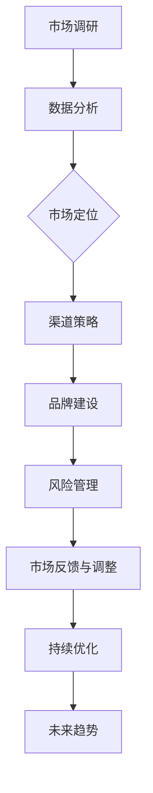

                 

### 《创业者的市场拓展》

> 关键词：市场拓展、市场细分、数据分析、品牌建设、市场营销策略

> 摘要：本文将深入探讨创业者在市场拓展过程中所需的基础理论、策略与技巧。从市场调研、数据分析，到目标市场进入策略、品牌建设与定位，再到市场营销策略及风险管理，我们将一步一步解析市场拓展的各个环节，并提供实战案例，帮助创业者更好地把握市场机遇，实现持续增长。

----------------------------------------------------------------

### 第一部分：市场拓展基础理论

#### 第1章：市场拓展的核心概念与战略

##### 1.1 市场拓展的重要性

市场拓展是企业发展的重要战略之一，其核心目的是扩大市场份额，实现收入的增长。对于创业者而言，市场拓展意味着更多的机遇，但也伴随着更多的挑战。正确理解市场拓展的重要性，有助于企业更好地规划未来发展。

首先，市场拓展有助于企业提高竞争力。通过开拓新市场，企业可以获得更多的客户资源，增强市场地位。同时，新市场的竞争环境可能与现有市场不同，企业有机会通过差异化竞争策略获得竞争优势。

其次，市场拓展有助于企业实现规模效应。在更大规模的市场上，企业可以降低生产成本，提高运营效率。这不仅可以提升企业的盈利能力，还可以为企业的长期发展奠定基础。

最后，市场拓展有助于企业实现多元化发展。通过进入新的市场领域，企业可以降低对单一市场的依赖，提高抗风险能力。同时，多元化发展也有助于企业积累更多的行业经验，为未来的发展提供支持。

##### 1.2 市场细分与目标市场选择

市场细分是指将整个市场划分为若干个具有相似需求的子市场。通过市场细分，企业可以更精准地定位目标客户，提高市场营销的效果。

市场细分的方法主要包括以下几种：

1. **地理细分**：根据客户所在的地理位置进行市场划分，如城市、省份、国家等。
2. **人口细分**：根据客户的人口特征进行市场划分，如年龄、性别、收入、教育程度等。
3. **心理细分**：根据客户的心理特征进行市场划分，如生活方式、价值观、兴趣爱好等。
4. **行为细分**：根据客户的行为特征进行市场划分，如购买习惯、消费水平、忠诚度等。

在选择目标市场时，创业者需要综合考虑以下几个方面：

1. **市场规模**：目标市场是否具有足够的潜力，能够支撑企业的长期发展。
2. **市场增长率**：目标市场的发展速度，是否与企业的发展节奏相匹配。
3. **市场竞争程度**：目标市场的竞争环境，是否具有差异化竞争的机会。
4. **市场进入难度**：目标市场的进入门槛，是否有利于企业快速占据市场地位。

##### 1.3 市场拓展的战略类型

市场拓展的战略类型主要包括以下几种：

1. **市场渗透战略**：通过提高市场份额，在现有市场上实现收入增长。具体措施包括增加广告投放、提高产品质量、提供更好的售后服务等。
2. **市场开发战略**：通过开拓新市场，实现收入增长。新市场可以是地理上的新区域，也可以是细分市场。
3. **产品开发战略**：通过开发新产品，满足不同客户群体的需求，实现收入增长。产品开发可以是完全创新的产品，也可以是对现有产品的改进。
4. **多元化战略**：通过进入不同的市场领域，实现收入增长。多元化战略可以是相关多元化，也可以是非相关多元化。

创业者需要根据自身企业的实际情况，选择合适的市场拓展战略，实现可持续发展。

---

**总结**：本章介绍了市场拓展的核心概念与战略，包括市场拓展的重要性、市场细分与目标市场选择、市场拓展的战略类型。创业者需要深入了解这些理论，为市场拓展奠定基础。

---

#### 第2章：市场调研与数据分析

##### 2.1 市场调研的方法与工具

市场调研是市场拓展的重要环节，通过调研，企业可以了解市场需求、竞争状况、客户行为等关键信息，为市场拓展提供决策依据。市场调研的方法与工具主要包括以下几种：

1. **问卷调查**：问卷调查是市场调研中最常用的方法之一。通过设计合理的问卷，企业可以收集大量有关客户需求、购买行为等方面的信息。
2. **访谈法**：访谈法包括面对面访谈、电话访谈、在线访谈等。通过与目标客户进行深入交流，企业可以了解客户的真实想法和需求。
3. **观察法**：观察法是通过观察客户在购买、使用产品等过程中的行为，分析客户需求和市场趋势。
4. **实验法**：实验法是在控制条件下，通过改变某一变量，观察其对市场结果的影响。实验法可以用于测试新产品、新营销策略等。

市场调研的工具主要包括以下几种：

1. **调查问卷工具**：如问卷星、金数据等，用于设计、分发和收集问卷。
2. **数据分析工具**：如Excel、Python等，用于处理和分析调研数据。
3. **市场调研平台**：如益普索、赛迪顾问等，提供专业的市场调研服务。

##### 2.2 数据分析的基本原理

数据分析是市场调研的核心环节，通过数据分析，企业可以提取有价值的信息，为决策提供支持。数据分析的基本原理包括以下方面：

1. **数据收集与清洗**：收集数据后，需要对数据进行清洗，去除无效数据和缺失值，确保数据质量。
2. **数据预处理**：对数据进行标准化、归一化等处理，使其适合进一步分析。
3. **数据可视化**：通过图表、图形等可视化方式，展示数据特征和趋势。
4. **统计分析**：运用统计方法，如均值、方差、相关性等，分析数据之间的关系。
5. **数据挖掘**：运用机器学习、深度学习等方法，从大量数据中挖掘潜在规律和趋势。

##### 2.3 市场趋势分析与预测

市场趋势分析是市场调研的重要目标之一，通过分析市场趋势，企业可以预测未来的市场走向，为决策提供参考。市场趋势分析的方法主要包括以下几种：

1. **历史数据分析**：通过分析历史数据，了解市场的变化趋势和周期性规律。
2. **市场比较分析**：通过比较不同市场、不同行业的数据，分析市场差异和共性。
3. **专家意见法**：邀请行业专家对市场趋势进行预测和判断。
4. **时间序列分析法**：运用时间序列分析方法，如ARIMA模型、LSTM网络等，预测未来的市场趋势。

通过市场趋势分析，企业可以更好地把握市场机遇，制定相应的发展策略。

---

**总结**：本章介绍了市场调研的方法与工具，以及数据分析的基本原理和市场趋势分析与预测的方法。创业者需要掌握这些知识，为市场拓展提供数据支持。

---

#### 第3章：目标市场进入策略

##### 3.1 市场进入模式

目标市场进入模式是指企业选择进入目标市场的具体方式。常见的市场进入模式包括以下几种：

1. **直接进入**：直接在目标市场建立销售网络和分支机构，实现产品销售和售后服务。
2. **间接进入**：通过与当地代理商、经销商等合作，利用他们的渠道和资源进入目标市场。
3. **合资经营**：与当地企业合作，共同投资、经营，分享市场份额和风险。
4. **战略联盟**：与其他企业建立战略伙伴关系，共同开拓市场，实现资源共享和风险分担。

选择合适的市场进入模式，对企业的市场拓展具有重要意义。直接进入模式有利于企业快速占据市场，但成本较高；间接进入模式成本较低，但市场控制力较弱。

##### 3.2 新市场评估与选择

在新市场评估与选择过程中，创业者需要综合考虑以下几个方面：

1. **市场规模**：评估目标市场的潜在客户数量和市场规模，确保市场具有足够的潜力。
2. **市场增长率**：评估目标市场的增长速度，选择具有较高增长潜力的市场。
3. **竞争环境**：分析目标市场的竞争状况，了解主要竞争对手的市场份额、产品特点、营销策略等。
4. **进入障碍**：评估目标市场的进入门槛，如政策法规、市场环境、技术壁垒等。

创业者需要根据自身企业的实际情况，选择适合的新市场，实现市场拓展。

##### 3.3 市场进入策略制定

市场进入策略制定是市场拓展的关键环节，创业者需要明确以下方面：

1. **市场定位**：确定企业在目标市场的定位，包括产品定位、价格定位、渠道定位等。
2. **营销策略**：制定针对目标市场的营销策略，如广告宣传、促销活动、品牌建设等。
3. **渠道策略**：选择合适的销售渠道，如线上渠道、线下渠道、多渠道整合等。
4. **资源配置**：确保企业具备足够的资源，包括人力、财力、物力等，支持市场进入策略的实施。

通过科学制定市场进入策略，企业可以顺利进入目标市场，实现市场拓展。

---

**总结**：本章介绍了目标市场进入模式、新市场评估与选择以及市场进入策略制定的方法。创业者需要根据实际情况，选择合适的进入模式，评估目标市场，制定市场进入策略，实现市场拓展。

---

#### 第4章：品牌建设与定位

##### 4.1 品牌建设的重要性

品牌建设是企业长期发展的关键因素之一，对于创业者来说，品牌建设的重要性不容忽视。品牌建设不仅仅是为了树立企业形象，更是为了建立与客户的信任关系，提高客户忠诚度，进而实现企业的持续增长。

首先，品牌建设有助于提升企业的核心竞争力。一个具有良好品牌形象的企业，更容易在市场竞争中脱颖而出，吸引更多的客户资源。

其次，品牌建设有助于提高企业的市场地位。良好的品牌形象可以提升企业的品牌价值，使企业在市场竞争中具备更强的议价能力和资源整合能力。

最后，品牌建设有助于企业的持续发展。一个成功的企业品牌，可以为企业带来长期的品牌溢价，提高企业的盈利能力，为企业的长期发展奠定基础。

##### 4.2 品牌定位与差异化策略

品牌定位是品牌建设的重要环节，它决定了企业在市场中的位置和形象。创业者需要根据企业的产品特点、目标市场和竞争对手的情况，明确品牌定位。

差异化策略是品牌定位的核心手段，通过差异化，企业可以在市场中脱颖而出，吸引目标客户。差异化策略包括以下几个方面：

1. **产品差异化**：通过创新产品功能、设计、品质等，使产品与竞争对手形成差异化。
2. **服务差异化**：通过提供优质的售后服务、定制化服务等方式，提升客户满意度，形成差异化。
3. **渠道差异化**：通过选择独特的销售渠道，如线上渠道、线下渠道、多渠道整合等，形成差异化。
4. **品牌形象差异化**：通过独特的品牌标识、品牌故事、品牌文化等，塑造差异化的品牌形象。

##### 4.3 品牌形象塑造与传播

品牌形象塑造与传播是品牌建设的关键环节，创业者需要通过多种渠道和方式，提升品牌知名度和美誉度。

1. **广告宣传**：通过广告宣传，提高品牌知名度。广告宣传可以包括电视广告、网络广告、户外广告等。
2. **公关活动**：通过公关活动，提升品牌形象。公关活动可以包括赞助活动、公益活动、品牌发布会等。
3. **社交媒体**：通过社交媒体，与客户建立互动，提升品牌美誉度。社交媒体可以包括微博、微信、抖音等。
4. **口碑营销**：通过客户口碑，提升品牌形象。创业者需要注重客户体验，提供优质的产品和服务，让客户自发传播品牌。

通过品牌形象塑造与传播，企业可以建立强大的品牌影响力，实现市场拓展。

---

**总结**：本章介绍了品牌建设的重要性、品牌定位与差异化策略以及品牌形象塑造与传播的方法。创业者需要重视品牌建设，通过科学的品牌定位和差异化策略，塑造良好的品牌形象，提升品牌影响力，实现市场拓展。

---

#### 第5章：市场营销策略

##### 5.1 产品策略

产品策略是市场营销策略的核心环节，创业者需要从产品规划、产品设计、产品定位等方面入手，制定有效的产品策略。

1. **产品规划**：根据市场需求和自身优势，制定产品规划。产品规划包括产品线规划、新产品开发规划等。
2. **产品设计**：通过创新设计，提升产品的竞争力。产品设计包括外观设计、功能设计、用户体验设计等。
3. **产品定位**：根据目标市场和竞争对手的情况，明确产品定位。产品定位包括价格定位、品质定位、市场定位等。

有效的产品策略可以帮助企业吸引目标客户，提升市场份额。

##### 5.2 价格策略

价格策略是企业市场营销的重要手段，创业者需要根据市场环境和目标客户，制定合理的价格策略。

1. **成本导向定价**：根据产品的生产成本和利润目标，制定价格。成本导向定价有利于确保企业的盈利能力。
2. **竞争导向定价**：根据竞争对手的产品价格，制定价格。竞争导向定价有利于提升企业的市场竞争力。
3. **价值导向定价**：根据产品的价值和客户需求，制定价格。价值导向定价有利于提升客户满意度。

合理的价格策略可以提高产品的市场接受度，促进销售增长。

##### 5.3 渠道策略

渠道策略是企业将产品传递给客户的重要手段，创业者需要根据产品特性、市场环境和目标客户，制定渠道策略。

1. **直销渠道**：通过企业自身销售团队，直接将产品销售给客户。直销渠道有利于企业控制销售过程，提升服务质量。
2. **分销渠道**：通过代理商、经销商等中间商，将产品销售给终端客户。分销渠道有利于企业扩大销售范围，提高市场覆盖。
3. **线上渠道**：通过电子商务平台，将产品销售给在线客户。线上渠道有利于企业降低销售成本，提升销售效率。

多样化的渠道策略可以提高企业的市场覆盖，促进销售增长。

##### 5.4 推广策略

推广策略是企业提高产品知名度、吸引客户的重要手段，创业者需要根据市场环境和目标客户，制定推广策略。

1. **广告推广**：通过广告宣传，提高产品知名度。广告推广可以包括电视广告、网络广告、户外广告等。
2. **公关推广**：通过公关活动，提升产品形象。公关推广可以包括赞助活动、公益活动、品牌发布会等。
3. **口碑推广**：通过客户口碑，提升产品美誉度。创业者需要注重客户体验，提供优质的产品和服务，让客户自发传播产品。

多元化的推广策略可以提高产品的市场影响力，促进销售增长。

---

**总结**：本章介绍了市场营销策略中的产品策略、价格策略、渠道策略和推广策略。创业者需要根据市场环境和目标客户，制定有效的市场营销策略，提升产品竞争力，促进销售增长。

---

#### 第6章：市场拓展中的风险与应对

##### 6.1 市场拓展的风险分析

市场拓展过程中，企业可能会面临多种风险，如市场风险、竞争风险、财务风险等。创业者需要对市场拓展中的风险进行详细分析，制定相应的风险管理策略。

1. **市场风险**：市场风险主要包括市场需求波动、市场环境变化等。创业者需要密切关注市场动态，及时调整市场策略，应对市场风险。
2. **竞争风险**：竞争风险主要包括竞争对手的市场策略、产品创新等。创业者需要加强市场研究，了解竞争对手的动态，制定针对性的竞争策略。
3. **财务风险**：财务风险主要包括资金链断裂、财务报表失真等。创业者需要加强财务管理，确保企业财务健康，降低财务风险。

##### 6.2 风险管理策略

风险管理是企业市场拓展过程中的重要环节，创业者需要制定有效的风险管理策略，降低风险对企业的影响。

1. **风险识别**：通过市场调研、数据分析等方法，识别市场拓展过程中可能面临的风险。
2. **风险评估**：对识别出的风险进行评估，确定风险的概率和影响程度。
3. **风险应对**：根据风险评估结果，制定相应的风险应对策略，包括风险规避、风险减轻、风险接受等。
4. **风险监控**：对市场拓展过程中的风险进行持续监控，及时调整风险应对策略，确保风险得到有效控制。

##### 6.3 应对市场挑战的策略

市场拓展过程中，企业可能会面临各种市场挑战，如市场需求下降、竞争加剧等。创业者需要制定有效的市场挑战应对策略，确保企业持续发展。

1. **产品创新**：通过产品创新，提升产品竞争力，满足市场需求。
2. **市场细分**：通过市场细分，挖掘潜在客户群体，提高市场覆盖率。
3. **营销创新**：通过营销创新，提高品牌知名度和美誉度，吸引更多客户。
4. **战略合作**：通过战略合作，整合资源，提升企业竞争力。

通过应对市场挑战的策略，企业可以克服市场障碍，实现市场拓展。

---

**总结**：本章介绍了市场拓展中的风险分析、风险管理策略和应对市场挑战的策略。创业者需要重视市场拓展过程中的风险，制定有效的风险管理策略，应对市场挑战，确保企业持续发展。

---

#### 第7章：案例分析与实战经验

##### 7.1 国内外市场拓展成功案例

为了更好地理解市场拓展的实践，我们可以通过分析国内外一些成功的企业市场拓展案例，来学习它们的具体做法和经验。

1. **阿里巴巴**：阿里巴巴是中国最大的电子商务公司，其市场拓展的成功得益于精准的市场细分和强大的品牌建设。阿里巴巴首先在中国国内市场建立了强大的电商基础，然后逐步拓展到国际市场。通过收购雅虎日本和Lazada等电商平台，阿里巴巴成功进入了日本和东南亚市场。

   - **经验**：阿里巴巴的成功经验在于其强大的品牌影响力、精准的市场定位和有效的市场细分。

2. **华为**：华为是全球领先的通信设备供应商，其市场拓展策略包括技术创新、市场细分和全球化布局。华为通过不断推出高性能、低成本的通信设备，满足不同市场的需求。同时，华为积极拓展海外市场，目前已经在全球170多个国家开展业务。

   - **经验**：华为的成功经验在于其持续的技术创新、全球化的市场布局和强大的品牌建设。

3. **特斯拉**：特斯拉是美国的电动汽车制造商，其市场拓展策略包括技术创新、高端定位和全球市场布局。特斯拉通过推出高性能、低成本的电动汽车，迅速赢得了消费者的青睐。同时，特斯拉积极拓展国际市场，目前已经在欧洲、亚洲等多个地区建立了生产基地和销售网络。

   - **经验**：特斯拉的成功经验在于其技术创新、高端定位和全球市场布局。

##### 7.2 市场拓展中的实战经验与教训

除了成功案例，市场拓展中也会存在一些失败的原因和教训。以下是一些常见的市场拓展失败的原因及教训：

1. **市场调研不足**：一些企业在市场拓展过程中，没有进行充分的市场调研，导致对市场环境和客户需求的理解不准确，从而制定出错误的市场拓展策略。

   - **教训**：市场拓展前必须进行充分的市场调研，了解市场环境和客户需求，为市场拓展提供依据。

2. **品牌建设不足**：一些企业在市场拓展过程中，没有重视品牌建设，导致品牌影响力不足，难以在市场上脱颖而出。

   - **教训**：品牌建设是市场拓展的重要环节，企业必须重视品牌建设，提升品牌知名度和美誉度。

3. **风险管理不当**：一些企业在市场拓展过程中，没有制定有效的风险管理策略，导致在市场拓展过程中面临风险时，无法及时应对。

   - **教训**：企业必须制定有效的风险管理策略，识别、评估和应对市场拓展过程中的风险。

通过分析成功案例和总结失败原因，创业者可以从中汲取经验教训，为市场拓展提供指导。

---

**总结**：本章通过分析国内外市场拓展成功案例和总结市场拓展中的实战经验与教训，帮助创业者更好地理解市场拓展的策略和实践。

---

#### 第8章：市场拓展的持续优化

##### 8.1 市场反馈与调整

市场拓展不是一蹴而就的过程，创业者需要持续关注市场反馈，并根据市场变化进行调整。市场反馈是市场拓展过程中的重要信息来源，通过收集和分析市场反馈，创业者可以了解市场动态，发现潜在问题，为市场拓展提供指导。

1. **客户反馈**：通过客户调查、客户满意度调查等方式，收集客户的反馈意见，了解客户对产品的满意度、使用体验等。
2. **市场监测**：通过市场监测工具，实时了解市场的变化，如市场需求、竞争对手动态等。
3. **数据分析**：对市场反馈和监测数据进行分析，发现市场趋势和潜在问题，为市场拓展提供依据。

根据市场反馈，创业者可以及时调整市场策略，优化产品和服务，提高市场竞争力。

##### 8.2 市场拓展的持续创新

市场拓展中的持续创新是保持企业竞争力的关键。创业者需要不断探索新的市场机会，通过产品创新、服务创新和营销创新，提升企业的市场地位。

1. **产品创新**：通过技术创新、功能创新等，开发出满足市场需求的新产品。
2. **服务创新**：通过服务模式的创新，提供更加便捷、高效的服务，提升客户满意度。
3. **营销创新**：通过营销策略的创新，提高品牌知名度和美誉度，吸引更多客户。

持续创新可以帮助企业保持市场竞争力，实现可持续发展。

##### 8.3 市场拓展的长期规划

市场拓展是一个长期的过程，创业者需要制定长期规划，确保市场拓展的可持续发展。长期规划包括以下方面：

1. **市场定位**：明确企业在长期发展中的市场定位，确定目标市场和产品方向。
2. **资源投入**：根据市场拓展的长期规划，合理分配资源，确保市场拓展的顺利进行。
3. **战略调整**：根据市场环境和竞争状况，定期调整市场拓展策略，确保市场拓展的可持续性。

通过长期规划，创业者可以确保市场拓展的稳健发展，实现企业的长期目标。

---

**总结**：本章介绍了市场拓展的持续优化方法，包括市场反馈与调整、持续创新和长期规划。创业者需要通过持续优化，提高市场竞争力，实现市场拓展的可持续发展。

---

#### 第9章：市场拓展的未来趋势

##### 9.1 全球市场变化趋势

随着全球经济一体化和技术的快速发展，全球市场正在发生深刻变化。创业者需要关注这些变化趋势，把握市场机遇。

1. **数字化趋势**：数字化已经成为全球市场的主流，创业者需要充分利用数字技术，提高市场拓展的效率和效果。
2. **可持续发展**：可持续发展已经成为全球关注的重要议题，创业者需要关注环保、社会责任等方面，提升企业的可持续发展能力。
3. **新市场崛起**：随着新兴市场的崛起，如东南亚、非洲等地区，创业者需要关注这些市场的发展机遇，开拓新市场。

##### 9.2 新兴市场的发展机遇

新兴市场具有巨大的发展潜力，创业者需要抓住这些机遇，实现市场拓展。

1. **消费者需求增长**：随着经济发展和消费者收入水平的提高，新兴市场的消费者需求不断增长，创业者可以开发满足这些需求的产品。
2. **基础设施改善**：随着基础设施的改善，新兴市场的市场环境逐渐优化，创业者可以更好地进入这些市场。
3. **政策支持**：许多新兴市场国家为了吸引外资，提供了优惠政策和支持措施，创业者可以充分利用这些政策，实现市场拓展。

##### 9.3 市场拓展的未来方向

未来市场拓展将呈现出以下趋势：

1. **全球化**：全球市场的融合将越来越紧密，创业者需要具备全球视野，拓展国际市场。
2. **智能化**：人工智能、大数据等技术的应用将进一步提升市场拓展的效率和效果。
3. **个性化**：消费者需求的个性化趋势将越来越明显，创业者需要提供更加个性化的产品和服务。

通过把握市场拓展的未来趋势，创业者可以更好地规划市场拓展策略，实现持续增长。

---

**总结**：本章介绍了市场拓展的未来趋势，包括全球市场变化趋势、新兴市场的发展机遇和市场拓展的未来方向。创业者需要关注这些趋势，制定科学的市场拓展策略，实现企业的持续发展。

---

## 附录

### 附录 A：市场拓展工具与资源

#### A.1 市场调研工具

- **问卷调查工具**：问卷星、金数据
- **数据分析工具**：Excel、Python、R
- **市场调研平台**：益普索、赛迪顾问

#### A.2 数据分析工具

- **数据分析软件**：SPSS、SAS
- **数据分析平台**：阿里云分析、腾讯云分析

#### A.3 品牌建设资源

- **品牌设计工具**：Adobe Illustrator、Sketch
- **品牌传播平台**：微博、微信、抖音

### 附录 B：市场拓展实战案例

#### B.1 案例一：某创业公司市场拓展策略分析

某创业公司在市场拓展过程中，通过市场调研、数据分析，制定了精准的市场拓展策略。具体策略如下：

1. **市场调研**：通过问卷调查和访谈法，了解目标市场的需求和竞争状况。
2. **数据分析**：对收集到的数据进行分析，确定目标市场和目标客户。
3. **市场定位**：根据数据分析结果，明确公司的市场定位和品牌形象。
4. **渠道策略**：通过线上渠道和线下渠道相结合，扩大市场覆盖。
5. **营销策略**：通过广告宣传、公关活动和社交媒体推广，提升品牌知名度。

通过以上策略，某创业公司成功拓展了市场，实现了业绩的快速增长。

#### B.2 案例二：某知名企业市场拓展经验总结

某知名企业在市场拓展过程中，通过多元化战略，成功进入了多个市场。具体经验如下：

1. **市场调研**：全面了解目标市场的环境和竞争状况，制定相应的市场拓展策略。
2. **产品创新**：根据市场需求，不断推出新产品，满足不同市场的需求。
3. **品牌建设**：加强品牌建设，提升品牌知名度和美誉度。
4. **渠道整合**：整合线上线下渠道，提高市场覆盖。
5. **风险管理**：制定有效的风险管理策略，降低市场拓展过程中的风险。

通过以上经验，某知名企业成功实现了全球市场拓展，取得了显著的业绩增长。

---

**核心概念与联系**

Mermaid 流程图如下：



---

**核心算法原理讲解**

#### 市场调研中的数据分析算法

```plaintext
// 伪代码：描述市场调研数据的基本统计分析过程
Input: 原始市场调研数据 data
Output: 统计分析结果 stats

1. 数据清洗
    1.1 去除无效数据 data_cleaned <- data
    1.2 处理缺失值 data_valid <- data_cleaned

2. 数据预处理
    2.1 标准化数据 data_normalized <- standardize(data_valid)

3. 数据分析
    3.1 描述性统计分析
        3.1.1 计算均值 mean <- mean(data_normalized)
        3.1.2 计算标准差 std_dev <- std_dev(data_normalized)
        3.1.3 计算众数 mode <- mode(data_normalized)
    3.2 数据可视化
        3.2.1 绘制直方图 histogram <- plot_histogram(data_normalized)
        3.2.2 绘制散点图 scatter_plot <- plot_scatter(data_normalized)
    3.3 数据挖掘
        3.3.1 分析客户行为特征
        3.3.2 预测市场趋势

4. 输出统计分析结果 stats
```

#### 市场细分模型中的客户价值评估公式

```latex
$$
V(C) = \frac{R(C) - C(C)}{C(C)}
$$

其中，$V(C)$表示客户$C$的价值，$R(C)$表示客户$C$的收益，$C(C)$表示客户$C$的成本。
```

#### 市场预测模型中的时间序列分析公式

```latex
$$
Y_t = \phi_0 + \phi_1 Y_{t-1} + \epsilon_t
$$

其中，$Y_t$表示第$t$时间点的市场数据，$\phi_0$和$\phi_1$为模型参数，$\epsilon_t$为误差项。
```

### 项目实战

#### 市场拓展中的数据分析实战案例

1. **开发环境搭建：** 使用Python和Jupyter Notebook搭建数据分析环境。

2. **源代码实现：**

    ```python
    import pandas as pd
    import numpy as np
    import matplotlib.pyplot as plt
    from sklearn.preprocessing import StandardScaler

    # 加载市场调研数据
    data = pd.read_csv('market_survey.csv')

    # 数据清洗
    data_cleaned = data.dropna()

    # 数据预处理
    data_normalized = StandardScaler().fit_transform(data_cleaned)

    # 描述性统计分析
    mean = np.mean(data_normalized, axis=0)
    std_dev = np.std(data_normalized, axis=0)
    mode = data_cleaned.mode().iloc[0]

    # 数据可视化
    plt.hist(data_normalized, bins=30)
    plt.xlabel('Value')
    plt.ylabel('Frequency')
    plt.title('Histogram of Market Data')
    plt.show()

    # 绘制散点图
    plt.scatter(data_normalized[:, 0], data_normalized[:, 1])
    plt.xlabel('Feature 1')
    plt.ylabel('Feature 2')
    plt.title('Scatter Plot of Market Data')
    plt.show()
    ```

3. **代码解读与分析：**
   - 数据清洗：删除无效数据，处理缺失值。
   - 数据预处理：使用StandardScaler进行数据标准化。
   - 描述性统计分析：计算均值、标准差和众数。
   - 数据可视化：绘制直方图和散点图，以更直观地分析市场数据。

通过这个实战案例，我们展示了市场拓展中数据分析的全过程，从数据清洗、预处理到统计分析，再到数据可视化，帮助创业者更好地理解和利用市场数据。

---

**作者：AI天才研究院/AI Genius Institute & 禅与计算机程序设计艺术 /Zen And The Art of Computer Programming**

本文系统地介绍了创业者在市场拓展过程中所需的基础理论、策略与技巧。从市场调研、数据分析，到目标市场进入策略、品牌建设与定位，再到市场营销策略及风险管理，我们通过一步一步的分析推理思考，详细阐述了市场拓展的各个环节。同时，通过案例分析和实战案例，我们展示了如何将理论知识应用于实际操作，帮助创业者更好地把握市场机遇，实现持续增长。

在市场拓展的道路上，创业者需要不断学习、思考和实践。本文旨在为创业者提供一套系统、实用的市场拓展指南，帮助他们在激烈的市场竞争中脱颖而出。希望本文能够为您的市场拓展之旅提供有益的启示和帮助。

最后，感谢您对本文的关注和支持。如果您有任何疑问或建议，欢迎随时与我们联系。我们将继续为您提供更多有价值的技术文章和知识分享。

再次感谢您的阅读，祝您在市场拓展的道路上取得圆满成功！

