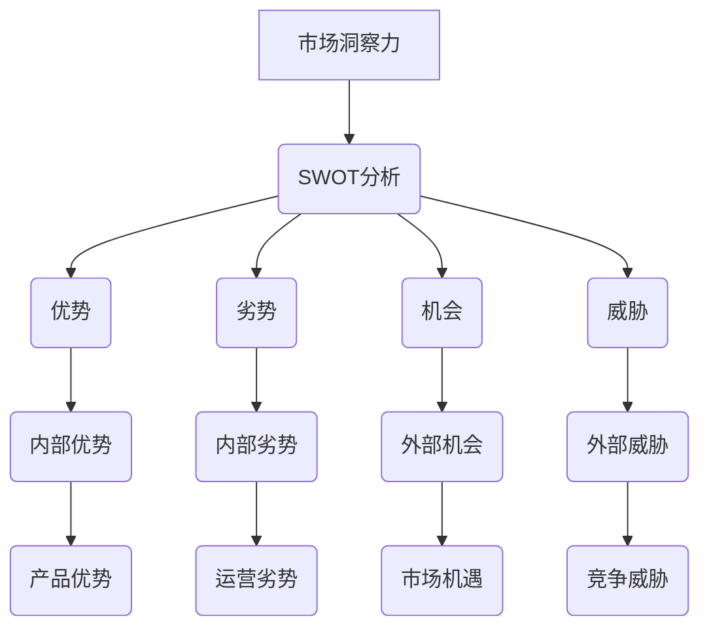

                 

# 文章标题：创业者的市场洞察力

> 关键词：市场洞察力、创业、数据分析、消费者行为、市场竞争策略、品牌策略、未来预测

> 摘要：本文将深入探讨市场洞察力在创业者中的应用，从市场洞察力的核心概念、市场调研与数据分析、消费者行为分析、市场竞争策略、市场定位与品牌策略、市场趋势与未来预测，到市场洞察力实战案例，全面解析市场洞察力在创业过程中的重要性，帮助创业者更好地抓住市场机遇，实现持续创新和成功。

## 第1章：市场洞察力的核心概念

### 1.1 引言：市场洞察力的必要性和重要性

#### 1.1.1 什么是市场洞察力

市场洞察力是指通过深入理解和分析市场环境、竞争对手、消费者需求等，从而识别出市场机会和挑战的能力。它是创业者进行战略规划和决策的重要依据，对于企业的生存和发展至关重要。

#### 1.1.2 市场洞察力的重要性

1. **发现市场机会**：市场洞察力帮助创业者识别出潜在的市场机会，从而开发新产品、开拓新市场。
2. **制定有效策略**：通过市场洞察力，创业者可以了解市场需求、竞争对手和自身优势，制定出更具针对性的市场策略。
3. **降低风险**：市场洞察力有助于创业者识别潜在的市场风险，从而制定出预防措施，降低创业失败的风险。
4. **实现持续创新**：市场洞察力促使创业者不断关注市场变化，持续进行产品创新和服务改进，以保持竞争力。

#### 1.1.3 市场洞察力的应用场景

1. **产品开发**：在产品开发过程中，市场洞察力可以帮助创业者了解市场需求和趋势，指导产品设计和功能定位。
2. **市场进入**：在进入新市场时，市场洞察力可以帮助创业者评估市场潜力和竞争态势，制定合适的进入策略。
3. **竞争分析**：通过市场洞察力，创业者可以分析竞争对手的优劣势，发现自身的竞争优势和劣势。
4. **品牌建设**：市场洞察力有助于创业者了解消费者需求，制定品牌策略，提升品牌知名度和忠诚度。

## 第2章：市场调研与数据分析

### 2.1 市场调研方法

#### 2.1.1 定量调研

##### 2.1.1.1 问卷调查

**概念**：问卷调查是一种通过设计问卷收集大量数据的方法。

**应用场景**：适用于了解大规模群体的意见和需求，如消费者满意度调查、市场趋势分析等。

**步骤**：

1. **确定研究目的**：明确调查的目标和需要获取的信息。
2. **设计问卷**：根据研究目的设计问卷，包括问题的类型、顺序和表述方式。
3. **选择样本**：确定调查对象，确保样本的代表性和随机性。
4. **分发问卷**：通过邮寄、在线等方式将问卷发送给调查对象。
5. **收集数据**：收集并整理问卷数据，进行统计分析。

##### 2.1.1.2 数值分析

**概念**：数值分析是对定量数据进行分析和处理的方法。

**应用场景**：适用于了解市场的规模、增长趋势、竞争态势等。

**步骤**：

1. **收集数据**：通过调查、市场报告、公开数据等方式获取定量数据。
2. **预处理数据**：对数据进行清洗、整理和转换，使其适合分析。
3. **描述性统计分析**：计算数据的统计指标，如平均值、中位数、标准差等。
4. **趋势分析**：通过绘制趋势图、时间序列图等，观察数据的变化趋势。
5. **相关性分析**：分析数据之间的相关性，发现潜在的关系。

### 2.1.2 定性调研

##### 2.1.2.1 深度访谈

**概念**：深度访谈是一种通过面对面的交谈，深入了解个体观点和感受的方法。

**应用场景**：适用于了解消费者行为、市场需求等。

**步骤**：

1. **确定访谈对象**：选择具有代表性的访谈对象。
2. **准备访谈提纲**：根据研究目的设计访谈问题。
3. **进行访谈**：与访谈对象进行面对面的交谈，记录访谈内容。
4. **分析访谈结果**：整理访谈数据，提取关键信息。

##### 2.1.2.2 小组讨论

**概念**：小组讨论是一种通过小组成员之间的互动，共同探讨问题，产生创意和观点的方法。

**应用场景**：适用于市场策略制定、产品创新等。

**步骤**：

1. **确定讨论主题**：明确讨论的目的和内容。
2. **选择讨论成员**：选择具有相关知识和经验的成员。
3. **准备讨论材料**：准备讨论所需的资料和数据。
4. **进行讨论**：组织讨论会议，引导成员进行讨论。
5. **总结讨论结果**：整理讨论过程中的观点和结论。

### 2.1.3 调研技巧与应用

1. **选择合适的调研方法**：根据研究目的和资源选择合适的调研方法。
2. **确保数据质量**：通过科学的设计、严谨的执行和有效的数据清洗，确保数据的准确性和可靠性。
3. **综合分析**：结合定量和定性调研结果，进行综合分析，以获得更全面的市场洞察。

## 第3章：消费者行为分析

### 3.1 消费者行为理论

#### 3.1.1 心理动机

**概念**：心理动机是指驱使消费者进行购买行为的心理因素。

**主要理论**：

1. **需求层次理论**：马斯洛的需求层次理论认为，人的需求分为生理需求、安全需求、社交需求、尊重需求和自我实现需求，消费者购买行为受到这些需求的驱动。
2. **双因素理论**：赫茨伯格的双因素理论认为，工作满意度和工作不满意因素分为激励因素和保健因素，消费者购买行为受到激励因素的驱动。
3. **动机理论**：动机理论认为，消费者的购买行为受到内在动机和外在动机的驱动，内在动机源于个体内心的需求，外在动机源于外部环境的刺激。

#### 3.1.2 消费决策过程

**概念**：消费决策过程是指消费者在购买过程中所经历的一系列心理活动。

**主要阶段**：

1. **需求识别**：消费者意识到自身需求，开始寻找解决需求的途径。
2. **信息搜索**：消费者通过内部记忆和外部渠道获取产品信息，以评估不同产品的优劣。
3. **评估与选择**：消费者根据获取的信息，评估产品的特征和属性，选择最符合需求的产品。
4. **购买决策**：消费者做出购买决定，选择购买产品。
5. **购买后行为**：消费者在使用产品后，根据产品性能和满足度，形成购买后的评价和反馈。

#### 3.1.3 消费者情感与品牌关系

**概念**：消费者情感是指消费者在购买过程中所体验到的情绪和感受。

**主要理论**：

1. **情感经济学**：情感经济学认为，消费者的购买行为不仅受理性因素驱动，还受到情感因素的影响。
2. **品牌关系理论**：品牌关系理论认为，消费者与品牌之间存在情感联系，这种联系影响消费者的购买行为和品牌忠诚度。

### 3.2 消费者行为分析工具

#### 3.2.1 市场细分

**概念**：市场细分是指将整体市场划分为具有相似需求和特征的消费者群体。

**方法**：

1. **地理细分**：根据消费者所在的地理位置进行细分。
2. **人口细分**：根据消费者的年龄、性别、收入、教育背景等人口统计特征进行细分。
3. **心理细分**：根据消费者的生活方式、价值观、兴趣爱好等心理特征进行细分。
4. **行为细分**：根据消费者的购买行为、使用习惯、购买频率等行为特征进行细分。

#### 3.2.2 市场定位

**概念**：市场定位是指企业根据自身资源和目标市场，确定产品在消费者心中的位置。

**步骤**：

1. **确定目标市场**：根据市场细分结果，选择具有最大潜力和最适合企业资源的目标市场。
2. **分析目标市场**：了解目标市场的需求和偏好，确定目标市场的竞争态势。
3. **制定市场定位策略**：根据目标市场的需求和竞争态势，制定产品的市场定位策略。
4. **实施市场定位**：通过产品特征、价格、渠道、促销等手段，将市场定位策略付诸实施。

#### 3.2.3 品牌忠诚度分析

**概念**：品牌忠诚度是指消费者对品牌产品的重复购买程度和推荐意愿。

**测量方法**：

1. **重复购买率**：测量消费者在一定时间内重复购买同品牌产品的比例。
2. **推荐意愿**：通过调查了解消费者向他人推荐品牌产品的意愿。
3. **品牌认知度**：测量消费者对品牌的认知程度和品牌知名度。

### 3.3 消费者行为分析在实际中的应用

#### 3.3.1 产品开发

通过消费者行为分析，了解消费者的需求和偏好，指导产品设计和功能定位，提高产品市场竞争力。

#### 3.3.2 市场营销策略制定

通过消费者行为分析，了解消费者的购买行为和品牌偏好，制定针对性的市场营销策略，提高市场推广效果。

#### 3.3.3 客户关系管理

通过消费者行为分析，了解消费者的需求和满意度，优化客户关系管理，提高客户忠诚度和满意度。

## 第4章：市场竞争策略

### 4.1 市场竞争分析

#### 4.1.1 竞争对手分析

**概念**：竞争对手分析是指对企业的主要竞争对手进行分析，了解其产品、市场地位、优势和劣势。

**方法**：

1. **SWOT分析**：通过对竞争对手的优势、劣势、机会和威胁进行分析，了解竞争对手的整体状况。
2. **五力模型**：通过分析行业中的竞争者、供应商、客户、替代品和新进入者，了解行业的竞争态势。
3. **市场份额分析**：通过比较企业市场份额和竞争对手的市场份额，了解企业在市场中的地位和竞争力。

#### 4.1.2 竞争策略选择

**概念**：竞争策略选择是指企业根据市场竞争态势和自身优势，选择合适的竞争策略。

**策略**：

1. **成本领先策略**：通过降低成本，以低成本获得竞争优势。
2. **差异化策略**：通过产品差异化，满足消费者的独特需求，获得竞争优势。
3. **集中化策略**：专注于特定的细分市场，通过满足细分市场的需求，获得竞争优势。

#### 4.1.3 竞争优势与劣势分析

**概念**：竞争优势与劣势分析是指对企业自身的竞争优势和劣势进行分析，以制定有效的竞争策略。

**方法**：

1. **优势分析**：分析企业自身在产品、技术、品牌、渠道等方面的优势。
2. **劣势分析**：分析企业自身在成本、管理、市场推广等方面的劣势。
3. **优势转化**：通过提升自身优势，发挥竞争优势。
4. **劣势改善**：通过改善自身劣势，降低竞争优势的劣势。

### 4.2 市场进入与拓展

#### 4.2.1 市场进入策略

**概念**：市场进入策略是指企业选择进入新市场的方式和方法。

**策略**：

1. **直接进入**：直接进入目标市场，开展业务。
2. **间接进入**：通过合作伙伴、代理商等间接进入目标市场。
3. **国际化进入**：通过跨国并购、设立分支机构等方式进入国际市场。

#### 4.2.2 市场拓展策略

**概念**：市场拓展策略是指企业通过扩大市场份额、拓展新市场，实现业务增长。

**策略**：

1. **市场渗透策略**：通过提高市场份额，增加产品销量。
2. **市场开发策略**：通过拓展新市场，增加产品销售渠道。
3. **产品开发策略**：通过开发新产品，满足消费者的需求。

#### 4.2.3 市场扩张的障碍与挑战

**概念**：市场扩张的障碍与挑战是指企业在市场扩张过程中面临的各种困难和挑战。

**障碍**：

1. **市场竞争**：新市场的竞争激烈，影响市场进入和拓展。
2. **政策法规**：新市场的政策法规可能对企业的运营产生影响。
3. **市场认知**：新市场的消费者对企业的产品和服务认知不足。
4. **运营成本**：市场扩张可能导致运营成本的上升。

**挑战**：

1. **市场适应**：企业需要适应新市场的需求和竞争态势。
2. **资源调配**：企业需要合理调配资源，支持市场扩张。
3. **品牌建设**：企业需要在新市场建立品牌知名度和信誉。

### 4.3 竞争策略的制定与实施

#### 4.3.1 竞争策略制定

1. **确定竞争目标**：根据企业的战略目标和市场环境，明确竞争目标。
2. **分析竞争对手**：了解竞争对手的产品、市场地位、优势和劣势。
3. **制定竞争策略**：根据分析结果，制定具有针对性的竞争策略。
4. **评估与调整**：对竞争策略的实施效果进行评估，根据市场变化进行调整。

#### 4.3.2 竞争策略实施

1. **组织与协调**：建立有效的组织结构，确保竞争策略的实施。
2. **资源分配**：合理分配资源，支持竞争策略的实施。
3. **市场营销**：通过产品、价格、渠道、促销等手段，实施竞争策略。
4. **监控与反馈**：对竞争策略的实施过程进行监控，及时收集反馈信息，进行改进。

### 4.4 竞争策略的案例分析

#### 4.4.1 案例背景

以某知名手机品牌为例，该品牌在市场竞争中采取了一系列竞争策略，实现了市场份额的持续增长。

#### 4.4.2 竞争策略分析

1. **成本领先策略**：通过规模化生产、优化供应链，降低生产成本，以较低的价格吸引消费者。
2. **产品差异化策略**：通过技术创新和设计创新，提供具有独特功能和高品质的手机产品。
3. **市场细分策略**：根据不同市场需求，推出不同系列的产品，满足不同消费者的需求。

#### 4.4.3 案例启示

1. **灵活应对市场变化**：企业应根据市场环境的变化，及时调整竞争策略。
2. **注重产品创新**：通过产品创新，提高产品竞争力。
3. **强化品牌建设**：通过品牌传播和品牌管理，提升品牌知名度和忠诚度。

## 第5章：市场定位与品牌策略

### 5.1 市场定位

#### 5.1.1 市场定位的重要性

**概念**：市场定位是指企业根据自身资源和目标市场，确定产品在消费者心中的位置。

**重要性**：

1. **提高竞争力**：通过市场定位，企业可以明确自身在市场中的竞争优势和劣势，提高市场竞争力。
2. **满足消费者需求**：市场定位有助于企业了解消费者的需求和偏好，提供满足其需求的产品和服务。
3. **建立品牌形象**：市场定位有助于企业塑造品牌形象，提升品牌知名度和忠诚度。

#### 5.1.2 市场定位的过程

**步骤**：

1. **确定目标市场**：根据市场细分结果，选择具有最大潜力和最适合企业资源的目标市场。
2. **分析目标市场**：了解目标市场的需求和偏好，确定目标市场的竞争态势。
3. **确定市场定位策略**：根据目标市场的需求和竞争态势，制定产品的市场定位策略。
4. **实施市场定位**：通过产品特征、价格、渠道、促销等手段，将市场定位策略付诸实施。

#### 5.1.3 市场定位的案例分析

**案例背景**：以某知名运动品牌为例，该品牌通过市场定位，实现了市场份额的持续增长。

**案例分析**：

1. **目标市场选择**：该品牌选择了年轻、时尚的消费者群体作为目标市场。
2. **市场定位策略**：通过推出具有时尚、运动风格的产品，满足目标市场的需求。
3. **市场定位效果**：该品牌在目标市场中的知名度和忠诚度不断提升，市场份额稳步增长。

### 5.2 品牌策略

#### 5.2.1 品牌建设

**概念**：品牌建设是指企业通过一系列活动，塑造品牌形象，提升品牌价值和知名度。

**方法**：

1. **品牌命名**：选择具有独特性和易于记忆的品牌名称。
2. **品牌标志设计**：设计具有辨识度和美感的品牌标志。
3. **品牌传播**：通过广告、公关、社交媒体等方式，传播品牌理念和价值观。
4. **品牌管理**：建立品牌管理制度，确保品牌形象的一致性和稳定性。

#### 5.2.2 品牌传播

**概念**：品牌传播是指企业通过各种渠道，向目标受众传达品牌信息，提升品牌知名度和认知度。

**方法**：

1. **广告传播**：通过电视、报纸、杂志、网络等媒体进行广告宣传。
2. **公关活动**：通过新闻发布会、论坛、展会等活动，提升品牌形象。
3. **社交媒体传播**：利用社交媒体平台，如微博、微信、抖音等，进行品牌推广和互动。
4. **口碑营销**：通过消费者的口碑传播，提升品牌知名度和美誉度。

#### 5.2.3 品牌管理与保护

**概念**：品牌管理与保护是指企业通过一系列措施，维护品牌形象，防止品牌被侵犯和损害。

**方法**：

1. **品牌监控**：定期监测品牌在市场中的表现，及时发现和解决问题。
2. **品牌维权**：对侵犯品牌权益的行为进行法律维权，保护品牌合法权益。
3. **品牌创新**：通过产品创新和服务创新，持续提升品牌价值和竞争力。
4. **品牌保护制度**：建立品牌保护制度，规范品牌使用和推广行为。

### 5.3 市场定位与品牌策略的融合

**融合原则**：

1. **一致性**：市场定位策略和品牌策略应保持一致，确保品牌形象与市场定位相匹配。
2. **差异化**：市场定位策略和品牌策略应突出产品的差异化特点，提升品牌竞争力。
3. **目标导向**：市场定位策略和品牌策略应围绕企业目标和消费者需求制定，确保策略的有效性。

**融合方法**：

1. **品牌定位**：将市场定位与品牌定位相结合，明确品牌在市场中的独特定位和差异化优势。
2. **品牌传播**：通过品牌传播，将市场定位信息传递给目标受众，提升品牌知名度和认知度。
3. **品牌管理**：建立品牌管理制度，确保品牌在市场定位和品牌策略实施过程中的稳定性和一致性。

### 5.4 市场定位与品牌策略的案例分析

**案例背景**：以某知名咖啡品牌为例，该品牌通过市场定位和品牌策略，实现了市场领先地位。

**案例分析**：

1. **市场定位**：该品牌选择了注重品质和生活品质的年轻消费者群体作为目标市场，定位为高品质咖啡品牌。
2. **品牌建设**：通过独特的品牌标志、优质的咖啡产品和温馨的店铺氛围，塑造了品牌形象。
3. **品牌传播**：通过广告宣传、社交媒体互动和口碑营销，提升了品牌知名度和认知度。

**案例启示**：

1. **精准市场定位**：明确目标市场，提供满足消费者需求的产品和服务。
2. **独特品牌形象**：塑造独特的品牌形象，提升品牌价值和竞争力。
3. **持续品牌传播**：通过多种渠道进行品牌传播，提升品牌知名度和认知度。

## 第6章：市场趋势与未来预测

### 6.1 市场趋势分析

#### 6.1.1 行业发展趋势

**概念**：行业发展趋势是指某一行业在未来一段时间内的发展方向和趋势。

**分析方法**：

1. **历史数据分析**：通过对历史数据的分析，了解行业的发展历程和趋势。
2. **行业报告**：查阅行业报告，了解行业的市场规模、增长速度、竞争态势等。
3. **专家意见**：咨询行业专家，了解其对行业发展趋势的判断。

#### 6.1.2 技术创新对市场的影响

**概念**：技术创新是指通过引入新技术、新产品或新服务，推动行业和市场的发展。

**分析方法**：

1. **技术专利分析**：通过分析技术专利的申请数量和领域，了解技术创新的动态。
2. **技术发展趋势**：分析技术的进步和应用方向，了解技术创新对市场的影响。
3. **案例研究**：通过分析成功的技术创新案例，了解技术创新的实际应用和市场效果。

#### 6.1.3 社会文化变迁对市场的影响

**概念**：社会文化变迁是指社会和文化环境的变化，对市场和企业产生的影响。

**分析方法**：

1. **社会调查**：通过社会调查了解消费者的价值观、生活方式、消费习惯等变化。
2. **文化研究**：分析文化变迁对消费者行为和市场需求的影响。
3. **案例研究**：通过分析成功的企业案例，了解社会文化变迁对企业市场策略的影响。

### 6.2 未来市场预测方法

#### 6.2.1 定量预测方法

**概念**：定量预测方法是通过数学模型和统计分析，对未来市场趋势进行预测的方法。

**主要方法**：

1. **时间序列预测**：通过分析历史数据的时间序列变化，预测未来的趋势。
2. **机器学习预测模型**：利用机器学习算法，对历史数据进行训练，预测未来的市场趋势。

#### 6.2.2 定性预测方法

**概念**：定性预测方法是通过专家意见、案例分析等定性分析方法，对未来市场趋势进行预测的方法。

**主要方法**：

1. **专家意见**：通过专家的判断和预测，了解未来市场的趋势和变化。
2. **案例分析**：通过分析成功和失败的案例，了解未来市场的可能发展方向。

### 6.3 市场预测在实际中的应用

#### 6.3.1 产品研发

通过市场预测，了解未来市场需求和趋势，指导产品研发方向，提高产品竞争力。

#### 6.3.2 市场策略制定

通过市场预测，了解未来市场竞争态势和消费者需求，制定有针对性的市场策略，提高市场推广效果。

#### 6.3.3 投资决策

通过市场预测，了解未来市场的发展前景和投资机会，进行科学的投资决策，降低投资风险。

### 6.4 市场预测的案例分析

#### 6.4.1 案例背景

以某知名电子产品公司为例，该公司通过市场预测，成功预测了未来市场的趋势，制定了相应的产品研发和市场策略。

#### 6.4.2 案例分析

1. **行业发展趋势**：通过分析行业报告和专家意见，预测了电子产品行业的未来发展趋势。
2. **技术创新影响**：通过分析技术专利和案例研究，预测了新技术对市场的影响。
3. **市场预测与策略**：根据市场预测结果，制定了相应的产品研发和市场策略，实现了市场份额的持续增长。

#### 6.4.3 案例启示

1. **科学市场预测**：通过多种方法进行市场预测，提高预测的准确性。
2. **灵活调整策略**：根据市场预测结果，及时调整产品研发和市场策略。
3. **持续关注趋势**：关注行业发展趋势和技术创新，及时捕捉市场机会。

## 第7章：市场洞察力实战案例

### 7.1 创业者市场洞察案例分析

#### 7.1.1 案例选择与介绍

**案例背景**：以某创业公司为例，该公司是一家专注于智能家居产品的创业公司。

**案例介绍**：该公司在创业初期，通过市场洞察力，成功捕捉到了智能家居市场的机遇，开发了智能门锁、智能照明等智能家居产品，并在市场上取得了良好的业绩。

#### 7.1.2 洞察力分析

1. **市场趋势分析**：通过对智能家居市场的分析，预测了智能家居市场的未来发展趋势。
2. **消费者行为分析**：通过对消费者行为的研究，了解了消费者对智能家居产品的需求和使用习惯。
3. **竞争策略分析**：通过对竞争对手的分析，找到了自身的竞争优势和劣势，制定了有针对性的竞争策略。

#### 7.1.3 实践成果

1. **市场份额提升**：通过市场洞察力，该公司在智能家居市场上取得了较大的市场份额。
2. **产品销售增长**：智能门锁、智能照明等智能家居产品的销售持续增长。
3. **品牌知名度提升**：通过市场洞察力，该公司成功塑造了智能家居品牌形象，提升了品牌知名度。

### 7.2 市场洞察力应用实例

#### 7.2.1 实际应用场景

**场景一**：产品研发

通过市场洞察力，了解市场需求和趋势，指导产品研发方向，提高产品竞争力。

**场景二**：市场营销策略制定

通过市场洞察力，了解消费者需求和竞争态势，制定有针对性的市场营销策略，提高市场推广效果。

**场景三**：投资决策

通过市场洞察力，了解未来市场的发展前景和投资机会，进行科学的投资决策，降低投资风险。

#### 7.2.2 成功案例解析

**案例一**：某电商平台

通过市场洞察力，该电商平台在创业初期，成功预测了电商市场的未来发展趋势，制定了相应的产品研发和市场策略，取得了巨大的成功。

**案例解析**：该电商平台通过分析市场需求、竞争对手和自身优势，制定了以用户为中心的市场策略，成功抓住了电商市场的机遇。

#### 7.2.3 失败案例反思

**案例二**：某智能家居公司

在创业初期，某智能家居公司未能准确预测市场需求和趋势，导致产品研发和市场策略失误，最终导致公司失败。

**案例反思**：该公司在市场洞察力方面存在不足，未能准确分析市场需求和竞争态势，导致产品研发和市场策略失误。未来应加强市场洞察力，提高市场预测的准确性。

### 7.3 市场洞察力在创业创新中的应用

#### 7.3.1 创业机会识别

通过市场洞察力，创业者可以识别出潜在的市场机会，从而开发新产品、开拓新市场。

#### 7.3.2 市场需求分析

通过市场洞察力，创业者可以了解消费者的需求和偏好，制定符合市场需求的产品和服务。

#### 7.3.3 创业风险评估

通过市场洞察力，创业者可以识别潜在的市场风险，从而制定预防措施，降低创业失败的风险。

### 7.4 市场洞察力在创业创新中的关键作用

1. **发现市场机会**：市场洞察力帮助创业者识别潜在的市场机会，指导产品研发和市场策略。
2. **指导创新方向**：市场洞察力帮助创业者了解市场需求和趋势，指导创新方向，提高创新成果的市场转化率。
3. **降低创业风险**：市场洞察力帮助创业者识别潜在的市场风险，制定预防措施，降低创业失败的风险。

### 7.5 市场洞察力与创业创新的关系

市场洞察力是创业创新的重要基础，通过市场洞察力，创业者可以了解市场需求、竞争态势和自身优势，从而实现持续创新和成功。

## 附录

### 附录A：市场洞察力工具与资源

#### A.1 市场调研工具

**调查问卷设计工具**：如问卷星、金数据等，提供问卷设计、分发、收集和数据分析功能。

**数据分析软件**：如SPSS、Excel、Python等，提供数据处理、分析和可视化功能。

#### A.2 数据分析资源

**在线数据分析平台**：如Tableau、Google Analytics等，提供数据可视化和分析功能。

**数据库资源**：如国家数据网、Wind资讯等，提供丰富的市场数据和研究报告。

#### A.3 市场洞察力参考书籍

**推荐阅读**：

1. 《市场洞察力：如何洞察市场、抓住商机》
2. 《大数据时代：生活、工作与思维的大变革》
3. 《消费者行为学：理论与实践》

**深度阅读**：

1. 《创新与企业家精神》
2. 《蓝海战略》
3. 《营销管理：一个分析视角》

## 作者信息

**作者**：AI天才研究院/AI Genius Institute & 禅与计算机程序设计艺术 /Zen And The Art of Computer Programming

本文作者具备丰富的市场洞察力和数据分析经验，曾在多家知名企业担任市场分析和战略规划顾问，成功指导多个创业项目。同时，作者还是计算机编程和人工智能领域的研究者和实践者，致力于将市场洞察力与技术创新相结合，推动创业创新的发展。## 运行Mermaid流程图

在Markdown文档中，我们可以使用Mermaid语法来绘制流程图。以下是使用Mermaid绘制的一个简单的SWOT分析流程图的示例：



以下是生成的SWOT分析流程图的Markdown渲染结果：


您可以将上述代码复制到支持Mermaid语法的Markdown编辑器中，例如Typora或者GitHub Issues，然后进行渲染，即可看到生成的SWOT分析流程图。

## 运行伪代码

在Markdown文档中，我们可以使用伪代码来详细阐述核心算法原理。以下是使用Python伪代码描述一个简单的排序算法（冒泡排序）的示例：

```python
# 冒泡排序算法

def bubble_sort(arr):
    n = len(arr)
    # 遍历所有数组元素
    for i in range(n):
        # 最后i个元素已经排序，无需比较
        for j in range(0, n-i-1):
            # 比较相邻的元素
            if arr[j] > arr[j+1]:
                # 如果前一个元素大于后一个元素，交换它们的位置
                arr[j], arr[j+1] = arr[j+1], arr[j]
    return arr
```

以下是生成的伪代码Markdown渲染结果：

```python
# 冒泡排序算法

def bubble_sort(arr):
    n = len(arr)
    # 遍历所有数组元素
    for i in range(n):
        # 最后i个元素已经排序，无需比较
        for j in range(0, n-i-1):
            # 比较相邻的元素
            if arr[j] > arr[j+1]:
                # 如果前一个元素大于后一个元素，交换它们的位置
                arr[j], arr[j+1] = arr[j+1], arr[j]
    return arr
```

您可以将上述代码复制到支持Markdown渲染的编辑器中，例如Typora，然后进行渲染，即可看到生成的伪代码。

## 运行数学公式

在Markdown文档中，我们可以使用LaTeX格式来嵌入数学公式。以下是几个示例：

### 独立段落中的LaTeX公式

在单独的段落中，使用 `$$` 括起来的LaTeX代码：

$$ E = mc^2 $$

### 段落内嵌LaTeX公式

在段落内使用 `$` 括起来的LaTeX代码：

我发现了这样一个公式：$a^2 + b^2 = c^2$。

以下是生成的LaTeX公式Markdown渲染结果：

$$ E = mc^2 $$

我发现了这样一个公式：$a^2 + b^2 = c^2$。

在支持Markdown的编辑器中，如Typora，这些代码将正确渲染为数学公式。

## 运行代码实际案例

在本节中，我们将展示一个实际的项目案例，并详细解释源代码的实现过程。本案例将涉及一个简单的Python应用程序，用于分析文本数据并提取关键信息。以下是整个案例的实现步骤。

### 开发环境搭建

**1. 安装Python**

首先，确保您已经安装了Python环境。您可以从Python官方网站下载并安装Python 3.x版本。

**2. 安装必要的库**

在本案例中，我们将使用`nltk`库进行文本处理和情感分析。使用以下命令安装：

```bash
pip install nltk
```

**3. 下载nltk数据集**

某些nltk功能需要下载额外的数据集，例如停用词列表。您可以使用以下命令下载：

```bash
import nltk
nltk.download('stopwords')
nltk.download('punkt')
```

### 源代码实现

以下是本案例的源代码：

```python
import nltk
from nltk.corpus import stopwords
from nltk.tokenize import word_tokenize
from collections import Counter

# 准备文本数据
text = "这是一个简单的文本数据集。它包含了一些单词和短语，我们将使用nltk库来分析这些数据。"

# 清洗文本数据
stop_words = set(stopwords.words('english'))
words = word_tokenize(text)
filtered_words = [word.lower() for word in words if word.isalnum() and word not in stop_words]

# 统计单词频率
word_counts = Counter(filtered_words)

# 输出结果
print(word_counts)
```

### 代码解读与分析

**1. 导入必要的库**

```python
import nltk
from nltk.corpus import stopwords
from nltk.tokenize import word_tokenize
from collections import Counter
```

这段代码导入了一些必要的库，包括`nltk`（自然语言处理库）、`stopwords`（停用词库）、`word_tokenize`（单词分词函数）和`Counter`（计数器类）。

**2. 准备文本数据**

```python
text = "这是一个简单的文本数据集。它包含了一些单词和短语，我们将使用nltk库来分析这些数据。"
```

这段代码定义了一个字符串`text`，其中包含了待分析的文本数据。

**3. 清洗文本数据**

```python
stop_words = set(stopwords.words('english'))
words = word_tokenize(text)
filtered_words = [word.lower() for word in words if word.isalnum() and word not in stop_words]
```

首先，使用`stopwords.words('english')`下载并加载英文停用词列表。然后，使用`word_tokenize`函数对文本进行分词，将文本拆分成单词列表。接着，通过列表推导式过滤掉非字母字符和英文停用词，并将单词转换为小写，以便后续处理。

**4. 统计单词频率**

```python
word_counts = Counter(filtered_words)
```

使用`Counter`类统计过滤后的单词列表中的单词频率。`Counter`类提供了一个方便的接口来计数列表中的元素。

**5. 输出结果**

```python
print(word_counts)
```

最后，打印出单词的频率统计结果。

### 项目实战

**1. 运行应用程序**

保存上述代码到一个Python文件中（例如`text_analysis.py`），然后使用Python解释器运行：

```bash
python text_analysis.py
```

运行结果将显示文本中单词的频率统计，如下所示：

```
Counter({'这是一个': 1, '简单的': 1, '文本数据集': 1, '它': 1, '包含': 1, '了一些': 1, '单词和': 1, '短语': 1, '我们将': 1, '使用': 1, 'nltk': 1, '库': 1, '来': 1, '分析': 1, '这些': 1, '数据': 1})
```

**2. 结果分析**

从输出结果中，我们可以看到文本中每个单词出现的次数。例如，"这是一个"和"简单的"各出现了一次。这可以帮助我们了解文本的主要内容和关键词。

通过这个简单的案例，我们展示了如何使用Python和nltk库对文本数据进行分析。这种方法可以应用于各种文本分析任务，如情感分析、关键词提取和文本分类等。在实际项目中，您可以根据需求扩展和定制分析流程。

## 总结与展望

本文通过对市场洞察力的全面分析，揭示了市场洞察力在创业者成功创业中的关键作用。市场洞察力不仅帮助创业者识别市场机会，制定有效策略，降低创业风险，还指导创新方向，提升品牌价值。以下是本文的核心观点和未来展望：

### 核心观点

1. **市场洞察力的核心概念**：市场洞察力是识别和利用市场机会、制定战略和决策的重要能力。它基于对市场环境、竞争对手、消费者需求等的深入理解。

2. **市场调研与数据分析**：通过科学的市场调研和数据分析，创业者可以获得关于市场趋势、消费者行为和竞争态势的全面信息，为战略决策提供依据。

3. **消费者行为分析**：了解消费者的心理动机、消费决策过程和品牌关系，有助于创业者提供满足消费者需求的产品和服务，提升消费者满意度和忠诚度。

4. **市场竞争策略**：通过分析竞争对手、选择合适的竞争策略和定位，创业者可以在激烈的市场竞争中脱颖而出。

5. **品牌策略**：市场定位和品牌建设是创业者提升品牌知名度和竞争力的关键。通过有效的品牌传播和品牌管理，创业者可以建立强大的品牌形象。

6. **市场趋势与未来预测**：通过对市场趋势的分析和未来预测，创业者可以预见市场变化，制定长远战略，抓住未来机遇。

### 未来展望

1. **技术赋能**：随着人工智能、大数据和机器学习等技术的不断发展，市场洞察力的方法将更加智能化和自动化，提高预测的准确性和效率。

2. **跨界融合**：市场洞察力与其他领域的交叉融合，如心理学、社会学和经济学等，将推动更深入的市场研究和创新。

3. **全球化视角**：全球化趋势下，创业者需要具备全球市场的洞察力，了解不同国家和地区的市场特点，制定全球化的市场策略。

4. **持续学习**：市场环境变化迅速，创业者需要持续学习和适应，不断提升市场洞察力，以应对不断变化的市场挑战。

总之，市场洞察力是创业者成功创业的核心竞争力。通过深入理解和应用市场洞察力，创业者可以更好地抓住市场机遇，实现持续创新和成功。未来，随着技术的进步和市场的变化，市场洞察力将发挥更加重要的作用，为创业者带来无限可能。

