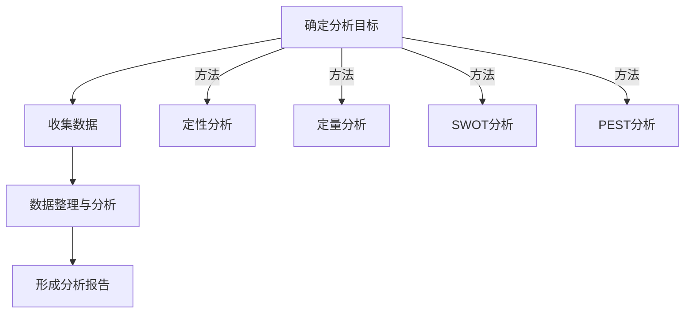
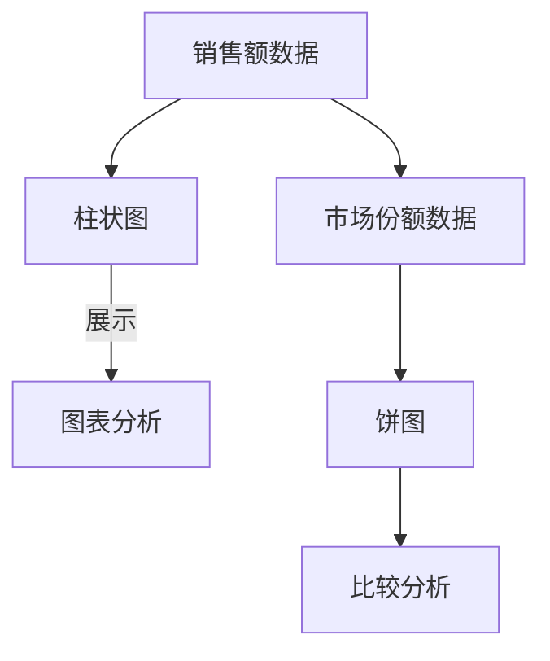

                 

## 文章标题：创业者的市场需求

> 关键词：创业、市场需求、市场分析、机会识别、策略制定、执行与监控

> 摘要：本文旨在为创业者提供系统化的市场分析指导，通过深入探讨市场分析的重要性、方法、策略及其在创业实践中的应用，帮助创业者更好地把握市场动态，识别市场机会，制定有效的市场策略，并确保策略的执行与监控。文章结构分为四个部分：市场分析基础、市场机会识别、市场策略制定与执行、案例分析，旨在为创业者提供一整套实用且系统的市场分析框架。

### 市场分析概述

#### 1.1 市场分析的重要性

市场分析是创业者成功创业的关键步骤之一。它不仅帮助创业者了解目标市场、潜在客户以及竞争对手，还能为创业公司的战略规划提供科学依据。具体来说，市场分析的重要性体现在以下几个方面：

1. **指导创业方向**：通过市场分析，创业者可以明确自己的目标市场，了解市场需求和潜在客户特征，从而制定合适的创业方向和产品定位。

2. **评估市场潜力**：市场分析可以帮助创业者评估目标市场的规模、增长趋势和潜在收益，为投资决策提供支持。

3. **识别竞争者**：了解竞争对手的市场份额、产品特点和营销策略，有助于创业者制定差异化竞争策略。

4. **降低创业风险**：通过全面的市场分析，创业者可以识别潜在的市场风险，并提前制定应对措施，降低创业失败的风险。

5. **优化资源配置**：市场分析有助于创业者合理配置资源，确保在关键环节投入足够的精力和资金。

#### 1.2 市场分析的步骤与方法

市场分析通常包括以下几个步骤：

1. **确定分析目标**：明确市场分析的目的，例如了解市场需求、评估市场潜力、分析竞争对手等。

2. **收集数据**：通过市场调研、行业报告、竞争对手分析等多种途径收集相关数据。

3. **数据整理与分析**：对收集到的数据进行分析，识别市场趋势、客户需求、竞争对手等信息。

4. **形成分析报告**：将分析结果整理成报告，为创业决策提供依据。

市场分析的方法主要包括：

- **定性分析**：通过访谈、焦点小组等方法，深入了解客户的观点和需求。
- **定量分析**：通过问卷调查、统计数据等方法，对市场进行量化分析。
- **SWOT分析**：对创业公司的优势、劣势、机会和威胁进行综合分析。
- **PEST分析**：从政治、经济、社会、技术四个方面分析外部环境。

#### 1.3 市场分析的工具与资源

市场分析需要借助一系列工具和资源，以下是一些常用的工具和资源：

- **调研工具**：如问卷星、腾讯问卷等在线调查工具，可以帮助创业者快速收集数据。
- **数据分析工具**：如Excel、Python等，用于处理和分析数据。
- **市场研究机构**：如艾瑞咨询、赛迪顾问等，提供专业的市场研究报告。
- **社交媒体平台**：如微博、微信公众号等，可以获取实时市场动态和用户反馈。
- **行业报告**：涵盖各个行业的市场分析和预测，为创业者提供有价值的信息。

#### 核心概念与联系

为了更好地理解市场分析，我们可以借助Mermaid流程图来展示其核心概念和步骤：



通过上述步骤和方法，创业者可以系统地开展市场分析，为创业成功奠定基础。

### 核心算法原理讲解

在市场分析中，核心算法原理和数学模型起着至关重要的作用。以下将详细介绍几种常用的算法原理和数学模型，并使用伪代码进行详细阐述。

#### 1. SWOT分析

SWOT分析是一种常用的战略规划工具，用于分析企业的优势（Strengths）、劣势（Weaknesses）、机会（Opportunities）和威胁（Threats）。其基本原理是通过对比分析，帮助企业识别内部和外部环境中的关键因素，从而制定相应的策略。

**伪代码：**

```python
def SWOT_analysis(strengths, weaknesses, opportunities, threats):
    """
    进行SWOT分析，输入企业的优势、劣势、机会和威胁，
    输出综合分析结果。
    """
    # 分析优势
    strength_impact = analyze_impact(strengths)
    
    # 分析劣势
    weakness_impact = analyze_impact(weaknesses)
    
    # 分析机会
    opportunity_impact = analyze_impact(opportunities)
    
    # 分析威胁
    threat_impact = analyze_impact(threats)
    
    # 形成综合分析报告
    report = generate_report(strength_impact, weakness_impact, opportunity_impact, threat_impact)
    return report

def analyze_impact(factors):
    """
    分析因素的影响力，输入因素列表，
    输出影响力评分。
    """
    impact_scores = []
    for factor in factors:
        score = calculate_score(factor)
        impact_scores.append(score)
    return impact_scores

def calculate_score(factor):
    """
    计算单个因素的影响力评分，
    输入因素名称，
    输出评分。
    """
    # 根据因素的重要性和对公司的影响程度计算评分
    score = 0
    if factor in ["技术创新", "品牌优势"]:
        score = 5
    elif factor in ["市场份额", "客户关系"]:
        score = 3
    else:
        score = 1
    return score

def generate_report(strengths, weaknesses, opportunities, threats):
    """
    生成SWOT分析报告，
    输入各因素的影响评分，
    输出报告。
    """
    report = f"""
    SWOT分析报告：
    - 优势：{strengths}
    - 劣势：{weaknesses}
    - 机会：{opportunities}
    - 威胁：{threats}
    """
    return report
```

#### 2. 定量分析

定量分析是市场分析的重要组成部分，通过收集和统计大量数据，对市场趋势和客户行为进行量化分析。以下是一个简单的定量分析算法，用于计算市场份额和客户满意度。

**伪代码：**

```python
def quantitative_analysis(data):
    """
    进行定量分析，输入市场数据，
    输出市场份额和客户满意度。
    """
    # 计算市场份额
    market_share = calculate_market_share(data)
    
    # 计算客户满意度
    customer_satisfaction = calculate_customer_satisfaction(data)
    
    # 形成分析报告
    report = generate_report(market_share, customer_satisfaction)
    return report

def calculate_market_share(data):
    """
    计算市场份额，
    输入市场数据，
    输出市场份额。
    """
    total_sales = sum(data['sales'])
    company_sales = sum(data['company_sales'])
    market_share = company_sales / total_sales
    return market_share

def calculate_customer_satisfaction(data):
    """
    计算客户满意度，
    输入客户反馈数据，
    输出满意度评分。
    """
    total_reviews = len(data['reviews'])
    positive_reviews = sum(data['reviews'])
    satisfaction_score = positive_reviews / total_reviews
    return satisfaction_score

def generate_report(market_share, customer_satisfaction):
    """
    生成定量分析报告，
    输入市场份额和客户满意度，
    输出报告。
    """
    report = f"""
    定量分析报告：
    - 市场份额：{market_share:.2%}
    - 客户满意度：{customer_satisfaction:.2f}
    """
    return report
```

#### 3. PEST分析

PEST分析是一种用于分析外部环境的工具，从政治（Political）、经济（Economic）、社会（Social）和技术（Technological）四个方面评估外部因素对公司的影响。

**伪代码：**

```python
def PEST_analysis(political, economic, social, technological):
    """
    进行PEST分析，输入外部环境数据，
    输出分析结果。
    """
    political_impact = analyze_impact(political)
    economic_impact = analyze_impact(economic)
    social_impact = analyze_impact(social)
    technological_impact = analyze_impact(technological)
    
    # 形成综合分析报告
    report = generate_report(political_impact, economic_impact, social_impact, technological_impact)
    return report

def analyze_impact(factors):
    """
    分析因素的影响力，
    输入因素列表，
    输出影响力评分。
    """
    impact_scores = []
    for factor in factors:
        score = calculate_score(factor)
        impact_scores.append(score)
    return impact_scores

def calculate_score(factor):
    """
    计算单个因素的影响力评分，
    输入因素名称，
    输出评分。
    """
    # 根据因素的重要性和对公司的影响程度计算评分
    score = 0
    if factor in ["政策支持", "经济增长"]:
        score = 5
    elif factor in ["市场需求", "技术创新"]:
        score = 3
    else:
        score = 1
    return score

def generate_report(political, economic, social, technological):
    """
    生成PEST分析报告，
    输入各因素的影响评分，
    输出报告。
    """
    report = f"""
    PEST分析报告：
    - 政治因素：{political}
    - 经济因素：{economic}
    - 社会因素：{social}
    - 技术因素：{technological}
    """
    return report
```

通过上述算法和模型，创业者可以系统地分析和理解市场环境，为创业决策提供科学依据。

#### 1.4 市场数据解读与分析方法

在市场分析过程中，解读与分析市场数据是至关重要的一环。市场数据不仅包括定量数据，如销售额、市场份额等，还包括定性数据，如客户反馈、市场趋势等。以下将介绍几种常用的市场数据解读与分析方法。

##### 1.4.1 数据可视化

数据可视化是将复杂的数据以图形化的形式展示出来，帮助人们更直观地理解和分析数据。常见的数据可视化工具包括Excel、Tableau等。以下是使用Excel进行数据可视化的示例：



通过柱状图和饼图，可以直观地展示销售额和市场份额，帮助创业者分析市场表现。

##### 1.4.2 聚类分析

聚类分析是一种无监督学习算法，用于将数据分为若干个类别，以便更好地理解数据分布和特征。以下是一个简单的K-means聚类分析示例：

**伪代码：**

```python
from sklearn.cluster import KMeans

# 准备数据
data = [[1, 2], [1, 4], [1, 0], [10, 2], [10, 4], [10, 0]]

# 初始化K-means模型
kmeans = KMeans(n_clusters=2, random_state=0).fit(data)

# 获取聚类结果
clusters = kmeans.predict(data)

# 输出聚类结果
print("聚类结果：", clusters)
```

通过聚类分析，可以识别出市场中的不同群体，为市场细分提供依据。

##### 1.4.3 回归分析

回归分析是一种常用的统计方法，用于研究变量之间的关系。以下是一个简单的线性回归分析示例：

**伪代码：**

```python
from sklearn.linear_model import LinearRegression
import numpy as np

# 准备数据
X = np.array([[1], [2], [3], [4], [5]])
y = np.array([1, 2, 2.5, 4, 5])

# 初始化线性回归模型
model = LinearRegression()

# 训练模型
model.fit(X, y)

# 预测结果
predictions = model.predict(X)

# 输出预测结果
print("预测结果：", predictions)
```

通过回归分析，可以了解销售额与市场推广费用之间的关系，为营销策略制定提供依据。

##### 1.4.4 客户细分

客户细分是将客户根据其特征和行为划分为不同的群体，以便更好地进行营销和服务。以下是一个简单的基于聚类分析的客户细分示例：

**伪代码：**

```python
from sklearn.cluster import KMeans

# 准备数据
data = [[1, 2], [1, 4], [1, 0], [10, 2], [10, 4], [10, 0]]

# 初始化K-means模型
kmeans = KMeans(n_clusters=3, random_state=0).fit(data)

# 获取聚类结果
clusters = kmeans.predict(data)

# 根据聚类结果进行客户细分
customers = {
    0: [],
    1: [],
    2: []
}
for i, cluster in enumerate(clusters):
    customers[cluster].append(data[i])

# 输出客户细分结果
print("客户细分结果：", customers)
```

通过客户细分，可以针对不同客户群体制定差异化的营销策略，提高客户满意度和忠诚度。

通过以上市场数据解读与分析方法，创业者可以深入挖掘市场数据的价值，为创业决策提供有力支持。

### 2.1.1 定量调研与定性调研

市场调研是市场分析的核心环节之一，其主要目的是收集与目标市场相关的数据和信息。市场调研可以分为定量调研和定性调研两大类，它们各有特点和应用场景。

#### 定量调研

定量调研是通过量化的方法收集大量数据，以便进行统计分析。它通常采用问卷调查、电话访谈、在线调查等形式。以下是对定量调研的详细分析：

1. **优点**：
   - **数据量大**：定量调研可以收集大量的样本数据，从而提高统计分析的可靠性和代表性。
   - **精确性高**：通过量化指标，可以精确测量市场现象和趋势。
   - **易于比较**：定量数据便于不同时间、不同市场之间的比较分析。

2. **缺点**：
   - **限制性较强**：定量调研通常需要标准化的问题和回答选项，可能无法深入挖掘受访者的深层次想法和感受。
   - **成本较高**：组织大规模的定量调研通常需要耗费大量的人力和财力。

3. **适用场景**：
   - **市场潜力评估**：通过定量调研，可以准确了解市场的规模、增长趋势和潜在收益。
   - **竞争分析**：定量调研有助于了解竞争对手的市场份额、产品特点和营销策略。

#### 定性调研

定性调研是通过非量化的方法收集数据，以深入理解受访者的观点、感受和需求。它通常采用深度访谈、焦点小组、观察法等形式。以下是对定性调研的详细分析：

1. **优点**：
   - **深入挖掘**：定性调研能够深入了解受访者的内心想法和感受，挖掘潜在需求。
   - **灵活性高**：调研过程中可以根据实际情况调整问题和调研方法，适应不同场景。
   - **互动性强**：定性调研通常涉及互动讨论，有助于建立良好的调研氛围。

2. **缺点**：
   - **样本规模有限**：定性调研的样本规模通常较小，结果的代表性和普遍性可能受到限制。
   - **主观性较强**：定性调研结果容易受到调研者和受访者的影响，可能存在偏差。

3. **适用场景**：
   - **产品概念验证**：通过定性调研，可以了解目标客户对产品概念的接受程度和改进建议。
   - **市场趋势研究**：定性调研有助于发现市场中的新兴趋势和机会。

#### 定量调研与定性调研的结合

在实际市场调研中，定量调研和定性调研往往是结合使用的。定量调研提供宏观的数据支持，而定性调研提供微观的洞察和解释。以下是一种结合方法的示例：

1. **阶段一：定性调研**：
   - 进行深度访谈和焦点小组，了解目标客户的需求、偏好和行为。
   - 收集关键问题、重要观点和潜在需求。

2. **阶段二：定量调研**：
   - 根据定性调研结果，设计调查问卷，包括封闭式和开放式问题。
   - 通过问卷调查收集大量数据，进行统计分析。

3. **阶段三：数据分析**：
   - 对定量调研数据进行统计分析，识别市场趋势和关键因素。
   - 结合定性调研结果，进行深入解读和分析。

通过定量调研与定性调研的结合，创业者可以更全面、深入地了解市场，为创业决策提供科学依据。

### 2.1.2 网上调研与实地调研

市场调研的方法多样，网上调研与实地调研是两种常见的调研方式，各自具有独特的优势与挑战。

#### 网上调研

网上调研通过互联网进行数据收集，具有以下特点：

1. **优势**：
   - **成本低**：网上调研无需支付大量的人力和物力成本，只需通过网络平台进行。
   - **覆盖面广**：互联网用户遍布全球，可以覆盖广泛的受众群体。
   - **速度快**：网上调研可以快速收集大量数据，缩短调研周期。

2. **挑战**：
   - **样本代表性不足**：网上调研样本可能无法完全代表总体市场，尤其是对于某些特定群体。
   - **数据真实性**：网上调研容易受到虚假信息和恶意反馈的影响，数据真实性难以保证。

3. **应用场景**：
   - **消费者行为分析**：通过网上调研，可以了解消费者在网络上的行为模式、偏好和购买习惯。
   - **新产品测试**：利用网上调研，可以快速获取用户对新产品概念的反馈和建议。

#### 实地调研

实地调研通过直接接触受访者进行数据收集，具有以下特点：

1. **优势**：
   - **数据可靠性**：实地调研可以确保数据收集的真实性和可靠性，减少虚假反馈。
   - **深入了解**：实地调研可以深入了解受访者的具体情况和需求，获取更深入的见解。
   - **灵活性强**：实地调研可以根据实际情况灵活调整调研内容和流程。

2. **挑战**：
   - **成本高**：实地调研需要支付调研人员的薪酬、交通和设备等成本，费用较高。
   - **时间较长**：实地调研需要实地走访、面对面访谈等环节，时间较长。

3. **应用场景**：
   - **市场细分**：实地调研有助于深入了解不同地区、不同群体的市场特点，进行市场细分。
   - **竞争分析**：实地调研可以深入竞争对手的经营场所，了解其产品、服务和营销策略。

#### 结合应用

在实际市场调研中，通常将网上调研与实地调研结合起来，以取长补短：

1. **初步调研**：
   - 利用网上调研进行初步筛选，确定调研重点和方向。

2. **深入调研**：
   - 通过实地调研深入了解目标市场和客户需求，获取更详细的信息。

3. **数据分析**：
   - 结合网上调研和实地调研的数据，进行综合分析，提高调研结果的可靠性和准确性。

通过网上调研与实地调研的结合，创业者可以更全面、深入地了解市场，为创业决策提供有力支持。

### 2.2 数据分析的基本概念

数据分析是市场分析的核心环节之一，其目的是通过处理和分析数据，提取有价值的信息和洞察，以支持创业决策。以下将介绍数据分析的基本概念，包括数据的类型、来源、清洗与预处理方法。

#### 2.2.1 数据的类型

数据分析涉及多种类型的数据，主要包括以下几种：

1. **结构化数据**：
   - 结构化数据是指存储在数据库中，具有固定结构和格式的数据，如关系型数据库中的表和列。
   - 示例：客户信息、销售数据、财务报表等。

2. **非结构化数据**：
   - 非结构化数据是指没有固定结构和格式的数据，如文本、图像、音频、视频等。
   - 示例：社交媒体评论、新闻报道、客户反馈等。

3. **半结构化数据**：
   - 半结构化数据是指具有部分结构，但不如结构化数据严格的格式，如XML、JSON等。
   - 示例：网页内容、电子邮件等。

#### 2.2.2 数据的来源

数据的来源多种多样，以下是一些常见的数据来源：

1. **内部数据**：
   - 来自公司内部的数据，如销售数据、客户信息、生产数据等。
   - 优势：数据真实可靠，但可能涉及公司隐私和保密问题。

2. **外部数据**：
   - 来自公司外部的数据，如市场研究报告、行业数据、社交媒体数据等。
   - 优势：数据丰富多样，但可能存在真实性和准确性问题。

3. **公开数据**：
   - 来自公共领域或免费提供的数据，如政府公开数据、学术研究数据、公共数据库等。
   - 优势：获取方便，但可能涉及版权和使用限制。

4. **第三方数据**：
   - 来自第三方平台或机构的数据，如广告数据、电商数据、金融数据等。
   - 优势：专业性和准确性较高，但可能涉及费用问题。

#### 2.2.3 数据清洗与预处理

数据清洗与预处理是数据分析的重要步骤，其目的是提高数据的质量和可用性。以下是一些常见的数据清洗与预处理方法：

1. **缺失值处理**：
   - **删除缺失值**：删除含有缺失值的记录，适用于缺失值比例较低的情况。
   - **填充缺失值**：使用统计方法或预设值填充缺失值，如平均值、中位数或最大值。

2. **异常值处理**：
   - **识别异常值**：使用统计学方法（如箱线图、Z-Score等）识别异常值。
   - **处理异常值**：删除、修改或保留异常值，根据实际情况和业务需求进行决策。

3. **数据标准化**：
   - 将不同尺度和量级的数据转换为同一尺度，以便进行统一分析。常用的方法有最小-最大标准化、Z-Score标准化等。

4. **数据转换**：
   - **离散化**：将连续型数据转换为离散型数据，如将年龄划分为几个年龄段。
   - **编码**：将分类数据转换为数值型数据，如将性别编码为0和1。

5. **数据整合**：
   - 将来自不同来源的数据进行整合，消除数据冗余和矛盾。常用的方法有数据合并、联结、消除重复等。

通过数据清洗与预处理，可以确保数据分析的准确性和可靠性，为创业决策提供高质量的数据支持。

### 2.3 市场数据解读与分析方法

市场数据的解读与分析是市场调研的核心环节，通过深入分析市场数据，创业者可以提取有价值的信息和洞察，从而制定更科学、更有效的市场策略。以下将介绍几种常用的市场数据解读与分析方法。

#### 2.3.1 市场趋势分析

市场趋势分析旨在识别市场中的长期变化和趋势，帮助创业者把握市场动态。以下是一些常用的市场趋势分析方法：

1. **时间序列分析**：
   - 时间序列分析是一种基于时间序列数据的统计方法，用于识别和分析市场趋势。
   - **移动平均法**：通过计算数据点的移动平均值，平滑数据波动，识别长期趋势。
   - **指数平滑法**：结合过去的数据点和时间权重，预测未来的市场趋势。

2. **季节性分析**：
   - 季节性分析用于识别数据中的季节性变化，如销售额在一年中的周期性波动。
   - **季节指数法**：通过计算季节性指数，评估各季度的市场表现，识别季节性趋势。

3. **趋势线法**：
   - 趋势线法通过绘制数据点的趋势线，识别市场的基本趋势。
   - **线性回归法**：通过建立线性回归模型，计算趋势线的斜率和截距，预测市场趋势。

#### 2.3.2 客户细分分析

客户细分分析是将市场划分为不同的客户群体，以便针对不同群体制定差异化的市场策略。以下是一些常用的客户细分分析方法：

1. **因子分析**：
   - 因子分析是一种统计方法，用于识别数据中的潜在因子，将客户根据因子进行分类。
   - **K-means聚类**：通过计算客户数据之间的相似性，将客户划分为若干个类别。
   - **决策树**：通过建立决策树模型，将客户按照属性值划分为不同类别。

2. **逻辑回归分析**：
   - 逻辑回归分析是一种分类方法，用于预测客户是否会购买产品或服务。
   - **二元逻辑回归**：通过建立二元逻辑回归模型，预测客户的购买概率。

3. **客户价值分析**：
   - 客户价值分析旨在评估不同客户的贡献和价值，以便为高价值客户提供更多的资源和支持。
   - **CLV（Customer Lifetime Value）**：通过计算客户的终身价值，评估客户的潜在贡献。

#### 2.3.3 竞争对手分析

竞争对手分析是市场数据解读与分析的重要方面，通过了解竞争对手的产品、策略和市场表现，创业者可以制定更有针对性的市场策略。以下是一些常用的竞争对手分析方法：

1. **SWOT分析**：
   - SWOT分析是一种综合分析方法，用于评估竞争对手的优势、劣势、机会和威胁。
   - **优势分析**：识别竞争对手在产品、技术、品牌等方面的优势。
   - **劣势分析**：识别竞争对手在市场、资源、管理等方面的劣势。

2. **市场份额分析**：
   - 市场份额分析用于评估竞争对手在市场中的地位和影响力。
   - **市场份额计算**：通过计算竞争对手在特定市场中的销售额或客户数量，评估市场份额。

3. **价格分析**：
   - 价格分析旨在了解竞争对手的定价策略，包括价格水平、价格变动和折扣策略等。
   - **价格弹性分析**：通过计算价格变化对需求的影响，评估价格策略的合理性。

通过以上市场数据解读与分析方法，创业者可以更全面、深入地了解市场动态，制定科学有效的市场策略。

### 市场机会识别策略

市场机会识别是市场分析的核心任务之一，其目的是通过系统的方法和策略，发现潜在的市场机会，为创业公司提供发展契机。以下将详细介绍市场机会识别的策略，包括SWOT分析、客户需求分析和竞争对手分析。

#### 3.1 市场机会的概念与分类

市场机会是指市场中存在的未被满足的需求或潜在的利润空间。市场机会可以按不同的维度进行分类：

1. **按需求类型分类**：
   - **需求型机会**：基于现有客户的需求，识别出未被满足的需求。
   - **问题型机会**：识别市场中的问题或痛点，通过解决这些问题创造市场机会。
   - **趋势型机会**：基于市场趋势和未来需求，预测未来的市场机会。

2. **按市场范围分类**：
   - **局部市场机会**：在特定地区或市场中发现的机会。
   - **全国市场机会**：在整个国家或地区发现的机会。
   - **全球市场机会**：在全球范围内发现的机会。

3. **按竞争程度分类**：
   - **蓝海机会**：在竞争较少的市场中识别的机会，通常具有较大的发展空间。
   - **红海机会**：在竞争激烈的市场中识别的机会，需要通过差异化策略取得成功。

#### 3.2 市场机会识别的方法

识别市场机会需要系统的方法和策略，以下几种方法是常用的市场机会识别工具：

1. **SWOT分析**

SWOT分析是一种战略规划工具，用于分析企业的优势（Strengths）、劣势（Weaknesses）、机会（Opportunities）和威胁（Threats）。通过SWOT分析，创业者可以全面评估自身和市场环境，识别潜在的机会和威胁。

- **优势分析**：识别企业在产品、技术、管理、品牌等方面的优势，寻找基于优势的市场机会。
- **劣势分析**：识别企业在资源、能力、市场等方面的劣势，通过弥补劣势创造市场机会。
- **机会分析**：分析市场环境中的机遇，如市场需求增长、技术创新、政策支持等，寻找符合企业优势的机会。
- **威胁分析**：识别市场环境中的威胁，如竞争加剧、政策变化、市场饱和等，提前制定应对措施。

2. **客户需求分析**

客户需求分析是识别市场机会的关键步骤，通过了解客户的需求、偏好和行为，创业者可以找到潜在的市场机会。

- **访谈法**：通过面对面或电话访谈，直接了解客户的观点和需求。
- **问卷调查**：通过设计问卷调查，收集大量客户的反馈和意见。
- **焦点小组**：组织小规模的焦点小组讨论，深入了解客户的真实需求。
- **行为观察**：观察客户在使用产品或服务时的行为和反应，发现未被满足的需求。

3. **竞争对手分析**

竞争对手分析是识别市场机会的重要手段，通过分析竞争对手的产品、策略和市场表现，创业者可以发现潜在的市场机会。

- **产品分析**：分析竞争对手的产品特点、功能、优势和劣势，寻找差异化机会。
- **市场策略分析**：了解竞争对手的营销策略、定价策略和渠道策略，发现市场机会。
- **财务分析**：分析竞争对手的财务报告，了解其盈利能力和市场地位，识别市场机会。
- **客户反馈**：通过收集和分析客户对竞争对手的反馈，了解竞争对手的不足，寻找改进机会。

通过以上市场机会识别方法，创业者可以全面、深入地了解市场环境，识别潜在的机会，为创业公司的发展提供科学依据。

### 3.3 市场机会评估与优先级排序

在识别出潜在的市场机会后，创业者需要对这些机会进行评估和优先级排序，以确保资源得到最有效的利用。以下将介绍几种常用的市场机会评估与优先级排序方法。

#### 1. 利益评估法

利益评估法是一种基于潜在收益和资源投入的市场机会评估方法。创业者可以通过以下步骤进行评估：

1. **确定潜在收益**：分析每个市场机会可能带来的收益，包括直接收益和间接收益。
2. **评估资源投入**：分析每个市场机会所需的资源投入，包括资金、人力和时间等。
3. **计算投资回报率**：将潜在收益除以资源投入，计算每个市场机会的投资回报率（ROI）。
4. **排序**：根据投资回报率对市场机会进行排序，优先考虑投资回报率较高的机会。

**公式：**

\[ \text{投资回报率 (ROI)} = \frac{\text{潜在收益}}{\text{资源投入}} \]

#### 2. SWOT分析法

SWOT分析法结合了市场机会的内部优势（Strengths）和外部环境（Opportunities），以评估市场机会的可行性和潜力。

1. **优势分析**：评估每个市场机会与创业公司的优势之间的匹配度，选择与公司优势高度一致的机会。
2. **劣势分析**：评估每个市场机会可能带来的劣势，选择劣势较小或可以弥补的机会。
3. **机会分析**：评估每个市场机会的市场环境、需求趋势和竞争对手情况，选择潜力较大的机会。
4. **威胁分析**：评估每个市场机会可能面临的威胁，选择风险较低的机会。

**步骤：**

1. **列出每个市场机会的优势、劣势、机会和威胁**。
2. **评估每个因素的权重和影响力**。
3. **综合评分**：根据权重和影响力，对每个市场机会进行综合评分。
4. **排序**：根据综合评分对市场机会进行排序。

#### 3. 成本效益分析法

成本效益分析法通过比较市场机会的成本和效益，评估其可行性。以下是一个简单的步骤：

1. **确定每个市场机会的总成本**：包括直接成本（如生产成本、营销成本）和间接成本（如管理成本、时间成本）。
2. **确定每个市场机会的预期效益**：包括直接收益（如销售收入、市场份额）和间接收益（如品牌提升、客户满意度）。
3. **计算成本效益比**：将预期效益除以总成本，计算每个市场机会的成本效益比。
4. **排序**：根据成本效益比对市场机会进行排序。

**公式：**

\[ \text{成本效益比} = \frac{\text{预期效益}}{\text{总成本}} \]

#### 4. 实施难度评估法

实施难度评估法通过评估每个市场机会的执行难度，确定其优先级。以下是一个简单的步骤：

1. **确定每个市场机会的关键成功因素**：包括技术难度、市场进入难度、资源需求等。
2. **评估每个因素的难度**：根据实际情况，为每个因素分配难度评分（例如1-10分）。
3. **计算总难度评分**：将每个关键成功因素的难度评分相加，得到总难度评分。
4. **排序**：根据总难度评分对市场机会进行排序。

**步骤：**

1. **列出每个市场机会的关键成功因素**。
2. **评估每个因素的难度**。
3. **计算总难度评分**。
4. **排序**：根据总难度评分对市场机会进行排序。

通过以上评估与排序方法，创业者可以系统、科学地评估市场机会，确保资源得到合理配置，实现创业目标。

### 市场细分与目标市场选择

#### 4.1 市场细分策略

市场细分是市场策略制定的重要步骤，通过将整体市场划分为不同的子市场，创业者可以更精准地满足不同客户群体的需求，提高市场竞争力。以下是一些常用的市场细分策略：

1. **地理细分**：
   - 根据地理位置将市场划分为不同的区域，如城市、农村、国家等。
   - 优点：能够针对不同地区的消费者行为和需求制定个性化的营销策略。
   - 适用场景：地域性强的产品，如旅游、房地产等。

2. **人口细分**：
   - 根据人口统计特征（如年龄、性别、收入、教育水平等）将市场划分为不同的群体。
   - 优点：能够针对不同人口特征的人群制定差异化的营销策略。
   - 适用场景：消费者群体差异较大的产品，如服装、化妆品等。

3. **行为细分**：
   - 根据消费者的购买行为、使用习惯、消费动机等将市场划分为不同的群体。
   - 优点：能够深入了解消费者的行为特征，提高营销策略的精准度。
   - 适用场景：依赖消费者行为的行业，如零售、电子商务等。

4. **心理细分**：
   - 根据消费者的心理特征（如价值观、生活方式、兴趣爱好等）将市场划分为不同的群体。
   - 优点：能够洞察消费者的内心需求，提供更具吸引力的产品和服务。
   - 适用场景：需要个性化体验的产品，如高端消费品、文化艺术等。

#### 4.2 目标市场的确定

确定目标市场是市场细分策略的核心，创业者需要根据企业的资源和能力，选择最具潜力的目标市场。以下是一个确定目标市场的步骤：

1. **分析市场细分结果**：根据市场细分策略，分析不同细分市场的规模、增长潜力、竞争程度等。

2. **评估自身资源和能力**：考虑企业的资源、技术、市场渠道、品牌影响力等因素，评估企业能够覆盖的细分市场。

3. **选择最具潜力的目标市场**：综合考虑市场潜力和企业的资源能力，选择最具发展潜力的细分市场作为目标市场。

4. **制定市场进入策略**：根据目标市场的特点和需求，制定相应的市场进入策略，如产品定位、定价策略、推广渠道等。

#### 4.3 定位策略与差异化竞争

定位策略是企业在目标市场中确定自身形象和地位的过程，通过差异化竞争，企业可以脱颖而出，获得竞争优势。以下是一些定位策略：

1. **产品定位**：
   - 根据目标市场的需求和偏好，确定产品的功能、品质、价格等方面的特点。
   - 优点：能够满足特定市场的需求，提高市场认可度。
   - 适用场景：差异化明显的产品，如高端电子产品、特色餐饮等。

2. **品牌定位**：
   - 根据企业的品牌形象和市场地位，确定品牌的核心价值和独特卖点。
   - 优点：能够提升品牌认知度和美誉度，增强品牌竞争力。
   - 适用场景：品牌形象重要的行业，如奢侈品、高端服务。

3. **差异化定位**：
   - 通过提供独特的产品特性或服务，使企业在目标市场中脱颖而出。
   - 优点：能够吸引特定消费者群体，建立品牌独特性。
   - 适用场景：竞争激烈的行业，如手机、汽车等。

通过市场细分、目标市场选择和定位策略，创业者可以精准把握市场需求，提升市场竞争力，实现创业目标。

### 5.1 市场目标设定

市场目标设定是市场策略制定过程中的关键步骤，它为创业公司明确了未来的发展方向和战略目标。以下将详细讨论市场目标设定的原则、方法及其重要性。

#### 市场目标设定的原则

1. **SMART原则**：
   - **具体（Specific）**：市场目标要明确、具体，避免模糊不清。
   - **可衡量（Measurable）**：市场目标要具备可量化指标，以便评估和监控。
   - **可实现（Achievable）**：市场目标要基于企业的资源和能力，确保可实现性。
   - **相关（Relevant）**：市场目标要与企业的整体战略和目标保持一致。
   - **有时限（Time-bound）**：市场目标要有明确的时间期限，确保目标的时效性。

2. **SMARTER原则**：
   - **激发创造力（Exciting）**：市场目标要激发创业团队的创造力和热情。
   - **反思性（Reflective）**：市场目标要能够反映企业的核心价值和愿景。
   - **经验性（Empirical）**：市场目标应基于数据和分析，具备科学依据。

#### 市场目标设定的方法

1. **目标分解法**：
   - 将整体市场目标分解为若干个具体、可操作的小目标，以便更好地实施和监控。
   - **步骤**：
     1. 确定整体市场目标。
     2. 分析市场目标和业务流程之间的关联。
     3. 将整体目标分解为具体的小目标。
     4. 为每个小目标设定可量化的指标和时间期限。

2. **目标定位法**：
   - 根据企业的资源和市场环境，确定最具潜力的市场目标。
   - **步骤**：
     1. 分析企业的优势、劣势和市场需求。
     2. 评估不同市场目标的机会和风险。
     3. 选择最符合企业资源和市场定位的目标。
     4. 设定相应的市场目标和实施策略。

3. **目标迭代法**：
   - 在实施市场目标的过程中，根据实际情况和反馈进行动态调整和优化。
   - **步骤**：
     1. 确定初步的市场目标。
     2. 实施目标并监控进度和效果。
     3. 根据反馈和实际情况，调整目标设定。
     4. 重新评估和设定市场目标。

#### 市场目标设定的重要性

1. **明确发展方向**：市场目标为创业公司提供了明确的发展方向，有助于团队聚焦资源和精力。

2. **指导战略规划**：市场目标是制定企业战略的重要依据，确保企业资源分配和战略实施的一致性。

3. **提高执行力**：具体、可量化的市场目标有助于提高团队执行力，确保目标按时完成。

4. **评估效果**：通过设定明确的目标和指标，企业可以评估市场策略的有效性，为后续决策提供依据。

5. **激励团队**：激发性的市场目标能够激发创业团队的创造力和积极性，提高团队凝聚力。

总之，市场目标设定是市场策略制定的核心环节，通过科学、系统的目标设定，创业公司可以更好地把握市场机遇，实现持续发展。

### 市场营销组合策略

市场营销组合策略，也称为4P策略，包括产品（Product）、价格（Price）、促销（Promotion）和渠道（Place）。以下将详细探讨这四个要素及其在市场策略中的应用。

#### 5.2.1 产品策略

产品策略是市场营销组合的核心，其目标是通过满足消费者的需求，提升品牌价值和市场竞争力。以下是一些产品策略的关键点：

1. **产品开发**：根据市场调研和消费者需求，开发具有差异化和创新性的产品。
   - **创新性**：通过技术创新、设计创新等手段，为产品增加独特性。
   - **多样化**：提供多种产品版本，满足不同消费者的需求。

2. **品牌建设**：打造强大的品牌形象，提升品牌知名度和忠诚度。
   - **品牌定位**：明确品牌的核心价值和独特卖点，确保与目标市场相契合。
   - **品牌传播**：通过广告、公关活动等手段，强化品牌在消费者心中的形象。

3. **产品生命周期管理**：根据产品的不同生命周期阶段，制定相应的策略。
   - **引入期**：通过创新和宣传，提高产品的市场知名度。
   - **成长期**：加大市场推广力度，扩大市场份额。
   - **成熟期**：通过优化产品和服务，维持市场份额。
   - **衰退期**：逐步退出市场，或通过降价、促销等手段延长产品生命周期。

#### 5.2.2 价格策略

价格策略直接影响产品的市场表现和企业的盈利能力。以下是一些常见的价格策略：

1. **成本导向定价**：根据产品的成本和利润目标，制定价格。
   - **成本加成定价**：在产品成本基础上，加上一定的利润，确定价格。
   - **目标成本定价**：根据预期的利润目标和市场份额，倒推产品的成本，从而确定价格。

2. **市场需求定价**：根据市场需求和消费者的支付意愿，制定价格。
   - **价值定价**：根据消费者对产品的价值感知，制定相对较高的价格。
   - **渗透定价**：在新产品上市时，采用较低的价格策略，快速占领市场。

3. **竞争导向定价**：根据竞争对手的价格策略，制定本企业的价格。
   - **跟随定价**：与主要竞争对手保持相同的价格水平。
   - **领先定价**：在市场上采取较高的价格策略，以体现产品的品质和品牌价值。
   - **挑战定价**：在市场上采取较低的价格策略，以挑战竞争对手。

#### 5.2.3 促销策略

促销策略旨在通过各种促销手段，激发消费者的购买欲望，提升产品销量。以下是一些常见的促销策略：

1. **广告推广**：通过广告宣传，提升产品的知名度和品牌形象。
   - **传统广告**：如电视、广播、报纸等。
   - **数字广告**：如搜索引擎广告、社交媒体广告等。

2. **公关活动**：通过公关活动，提升品牌形象，建立良好的市场口碑。
   - **新闻发布会**：向公众传达企业的核心价值和最新动态。
   - **赞助活动**：通过赞助体育赛事、文化活动等，提升品牌知名度。

3. **销售促销**：通过各种销售手段，激励消费者购买产品。
   - **打折促销**：通过价格优惠，吸引消费者购买。
   - **赠品促销**：通过赠送小礼品，提升消费者的购买意愿。
   - **捆绑销售**：将多个产品组合在一起，提供优惠价格，增加销售量。

4. **会员营销**：通过会员制度，增加消费者的忠诚度和重复购买率。
   - **积分兑换**：通过积分系统，激励消费者进行更多购买。
   - **会员专属优惠**：为会员提供专属优惠，增强会员的归属感。

#### 5.2.4 渠道策略

渠道策略是指企业通过何种方式将产品传递到消费者手中。以下是一些常见的渠道策略：

1. **直销**：企业直接将产品销售给消费者。
   - **自有销售团队**：企业建立自己的销售团队，直接向消费者销售产品。
   - **在线销售**：通过企业官网、电商平台等渠道进行在线销售。

2. **分销**：企业通过中间商将产品销售给消费者。
   - **批发商**：将产品批量销售给批发商，由批发商分销给零售商。
   - **零售商**：直接将产品销售给最终消费者。

3. **多渠道整合**：结合多种渠道进行销售，提高市场覆盖率和销售效率。
   - **线上线下整合**：在线上电商平台和线下实体店同步销售产品。
   - **渠道互补**：利用不同的渠道特点，互补不足，提高整体销售效果。

通过科学、合理地制定和实施市场营销组合策略，企业可以更好地满足市场需求，提升市场竞争力，实现可持续发展。

### 市场策略实施计划

市场策略实施计划是将制定好的市场策略转化为实际操作的具体步骤，确保市场策略能够有效落地。以下将详细讨论市场策略实施计划的关键步骤和注意事项。

#### 1. 制定详细的实施计划

- **明确目标**：确保每个市场策略的实施计划都明确具体的业务目标，如市场份额、销售额、品牌知名度等。
- **分解任务**：将市场策略分解为若干个具体的任务，确保每个任务都有明确的责任人和时间节点。
- **资源配置**：根据任务需求，合理配置人力资源、资金和物资等资源，确保各项任务能够顺利推进。

#### 2. 制定执行流程

- **制定执行流程图**：使用流程图或Gantt图等工具，将市场策略实施步骤和时间节点进行可视化展示。
- **确定关键节点**：识别实施过程中可能遇到的关键节点和风险点，提前制定应对措施。

#### 3. 设定监控与评估机制

- **设立监控指标**：为每个市场策略设定可量化的监控指标，如销售额、客户满意度、市场占有率等。
- **定期评估**：定期对市场策略的执行情况进行评估，检查各项任务的完成情况和进度。
- **调整优化**：根据评估结果，对市场策略进行调整和优化，确保策略的持续有效。

#### 4. 建立沟通与协作机制

- **建立沟通平台**：建立有效的沟通渠道，如内部邮件、即时通讯工具、会议等，确保团队成员之间的信息畅通。
- **明确责任与权限**：明确各团队成员的责任和权限，确保任务分工清晰，提高协作效率。

#### 5. 注意事项

- **灵活调整**：在市场策略实施过程中，要灵活应对外部环境的变化，及时调整策略和执行计划。
- **风险管理**：对市场策略实施过程中可能出现的风险进行评估，并制定相应的风险应对措施。
- **持续优化**：在市场策略实施过程中，不断收集反馈信息，持续优化策略和执行流程。

通过以上步骤和注意事项，创业者可以确保市场策略的实施计划科学、有效，从而实现创业目标。

### 6.1 市场策略执行过程

市场策略的执行是确保策略目标得以实现的关键环节，涉及多个步骤和环节。以下将详细介绍市场策略执行的主要过程，并使用伪代码来描述执行步骤。

#### 1. 制定执行计划

在开始执行市场策略之前，首先需要制定详细的执行计划。以下是一个简单的执行计划伪代码：

```python
def create_execution_plan(strategies, resources):
    """
    创建市场策略执行计划，
    输入市场策略和资源，
    输出执行计划。
    """
    plan = {
        "strategy": strategies,
        "resources": resources,
        "tasks": [],
        "time_schedule": [],
        "key_metrics": [],
    }
    
    for strategy in strategies:
        task = create_task(strategy)
        plan["tasks"].append(task)
        
        time_schedule = create_time_schedule(strategy, resources)
        plan["time_schedule"].extend(time_schedule)
        
        key_metric = create_key_metric(strategy)
        plan["key_metrics"].append(key_metric)
    
    return plan

def create_task(strategy):
    """
    创建执行任务，
    输入策略，
    输出任务。
    """
    task = {
        "name": strategy["name"],
        "description": strategy["description"],
        "责任人": strategy["责任人"],
    }
    return task

def create_time_schedule(strategy, resources):
    """
    创建时间表，
    输入策略和资源，
    输出时间表。
    """
    time_schedule = []
    for activity in strategy["活动"]:
        start_date = get_start_date(activity, resources)
        end_date = get_end_date(activity, resources)
        time_schedule.append((activity, start_date, end_date))
    return time_schedule

def create_key_metric(strategy):
    """
    创建关键绩效指标，
    输入策略，
    输出关键绩效指标。
    """
    metric = {
        "name": strategy["name"],
        "指标": strategy["关键绩效指标"],
        "目标值": strategy["目标值"],
    }
    return metric

def get_start_date(activity, resources):
    """
    获取活动开始日期，
    输入活动和信息，
    输出开始日期。
    """
    return "2024-01-01"

def get_end_date(activity, resources):
    """
    获取活动结束日期，
    输入活动和信息，
    输出结束日期。
    """
    return "2024-02-28"
```

#### 2. 分配资源

资源分配是确保市场策略能够顺利执行的重要环节。以下是一个资源分配的伪代码：

```python
def allocate_resources(plan, resources):
    """
    分配资源到执行计划，
    输入执行计划和资源，
    输出资源分配结果。
    """
    for task in plan["tasks"]:
        for resource in resources:
            if resource["可用性"] > 0:
                assign_resource_to_task(resource, task)
                update_resource_availability(resource, -1)
                break

def assign_resource_to_task(resource, task):
    """
    将资源分配到任务，
    输入资源和任务，
    输出资源分配结果。
    """
    task["资源"] = resource["名称"]

def update_resource_availability(resource, change):
    """
    更新资源可用性，
    输入资源名称和变化量，
    输出资源可用性更新结果。
    """
    resource["可用性"] += change
```

#### 3. 执行监控

市场策略的执行需要持续的监控，以下是一个监控执行的伪代码：

```python
def monitor_execution(plan):
    """
    监控市场策略执行，
    输入执行计划，
    输出监控结果。
    """
    for task in plan["tasks"]:
        current_date = get_current_date()
        if current_date > task["结束日期"]:
            if task["完成状态"] != "完成":
                raise Exception(f"任务未完成：{task['名称']}")
        else:
            if task["完成状态"] == "完成":
                raise Exception(f"任务过早完成：{task['名称']}")

def get_current_date():
    """
    获取当前日期，
    输出当前日期。
    """
    return "2024-01-15"
```

通过上述伪代码，可以构建一个市场策略执行的基本框架，确保策略的顺利实施和有效监控。

### 6.2 市场策略执行的关键因素

市场策略的有效执行取决于多个关键因素，这些因素包括团队协作、时间管理、资源分配和风险管理等。以下将详细探讨这些关键因素及其在市场策略执行中的重要性。

#### 1. 团队协作

团队协作是市场策略执行的核心，一个高效的团队能够确保市场策略的顺利实施。以下是一些关键点：

- **明确分工**：确保每个团队成员都清楚自己的职责和任务，避免重复劳动和责任不清。
- **沟通畅通**：建立有效的沟通机制，如定期会议、即时通讯工具等，确保团队成员之间的信息流通。
- **共同目标**：确保团队成员都有共同的目标和愿景，提高团队的凝聚力和执行力。
- **激励制度**：制定合理的激励制度，如绩效奖金、晋升机会等，激发团队成员的积极性和创造力。

#### 2. 时间管理

时间管理是确保市场策略按时完成的关键因素。以下是一些时间管理的最佳实践：

- **任务分解**：将复杂的任务分解为若干个小任务，每个小任务都有明确的时间节点和责任人。
- **优先级排序**：根据任务的紧急程度和重要性，对任务进行优先级排序，确保关键任务优先完成。
- **进度监控**：定期检查任务的进度，及时发现和解决问题，确保任务按时完成。
- **弹性计划**：为每个任务预留一定的时间缓冲，以应对不可预见的情况，提高计划的弹性。

#### 3. 资源分配

资源的有效分配是确保市场策略顺利实施的重要保障。以下是一些资源分配的关键点：

- **需求分析**：在制定市场策略时，对所需的资源进行详细分析，确保资源的充分准备。
- **合理分配**：根据任务的优先级和资源需求，合理分配资源，确保关键任务得到足够的资源支持。
- **动态调整**：在执行过程中，根据实际情况动态调整资源的分配，确保资源的优化利用。
- **资源共享**：鼓励团队成员之间的资源共享，提高资源的利用效率。

#### 4. 风险管理

风险管理是市场策略执行中不可或缺的一部分。以下是一些风险管理的关键点：

- **风险识别**：在市场策略执行前，对可能出现的风险进行详细识别和评估，制定相应的应对措施。
- **风险评估**：对识别出的风险进行定量和定性评估，确定风险的重要性和影响程度。
- **风险应对**：根据风险评估结果，制定相应的风险应对策略，如风险回避、风险转移、风险接受等。
- **持续监控**：在市场策略执行过程中，持续监控风险的变化和影响，及时调整风险应对策略。

通过以上关键因素的合理运用，创业者可以确保市场策略的有效执行，提高市场策略的成功率。

### 6.3 市场策略效果评估与调整

市场策略执行完成后，对策略效果进行评估和调整是确保创业公司持续发展的关键步骤。以下将详细讨论市场策略效果评估的方法、调整策略的步骤及注意事项。

#### 6.3.1 市场策略效果评估方法

1. **关键绩效指标（KPI）评估**：
   - **销售额**：评估市场策略对销售额的影响，如月度、季度销售额增长情况。
   - **市场份额**：评估市场策略对市场份额的占有率，如与竞争对手的比较。
   - **客户满意度**：通过调查问卷、用户反馈等方式，了解客户对产品和服务的满意度。
   - **品牌知名度**：评估市场策略对品牌知名度的提升，如品牌提及率、社交媒体关注者数量等。

2. **财务分析**：
   - **投资回报率（ROI）**：计算市场策略投入与收益的比率，评估策略的经济效益。
   - **利润率**：分析市场策略对利润率的影响，包括成本控制和收入增长。
   - **现金流**：评估市场策略对现金流的影响，确保资金的有效利用。

3. **客户细分分析**：
   - **细分市场表现**：根据不同客户群体，分析市场策略对不同细分市场的效果。
   - **客户保留率**：评估市场策略对客户保留率的影响，了解客户的忠诚度。

#### 6.3.2 调整策略的步骤

1. **评估结果分析**：
   - 收集并整理市场策略执行过程中的数据和结果，分析各项关键绩效指标的表现。
   - 识别成功和失败的因素，总结经验教训。

2. **识别问题**：
   - 分析评估结果，识别市场策略中存在的问题和不足之处，如销售额未达标、客户满意度下降等。

3. **制定调整计划**：
   - 根据评估结果和问题识别，制定具体的调整计划，包括策略优化、资源配置调整、执行流程改进等。

4. **实施调整**：
   - 将调整计划付诸实施，确保所有团队成员了解调整内容和执行步骤。
   - 监控调整过程中的进度和效果，及时调整和优化。

5. **反馈与持续改进**：
   - 在调整计划实施后，收集新的数据和信息，评估调整效果。
   - 根据新的评估结果，继续优化和调整市场策略，形成持续改进的闭环。

#### 6.3.3 注意事项

1. **数据真实性**：
   - 在评估过程中，确保数据的真实性和准确性，避免误导决策。

2. **及时反馈**：
   - 及时收集和反馈市场策略执行中的问题，确保能够迅速响应和调整。

3. **灵活调整**：
   - 根据市场环境的变化和实际效果，灵活调整市场策略，确保其适应性和有效性。

4. **持续优化**：
   - 市场策略的调整不是一次性的，需要持续优化和改进，以适应不断变化的市场环境。

通过以上市场策略效果评估与调整的方法和步骤，创业公司可以确保市场策略的科学性和有效性，从而实现持续发展。

### 7.1 案例一：XX公司的市场策略

#### 7.1.1 公司背景

XX公司是一家专注于智能家居设备的创业公司，成立于2018年。公司主要产品包括智能门锁、智能照明系统、智能安防设备等。凭借技术创新和优质服务，XX公司在短时间内取得了显著的市场地位，并得到了广大消费者的认可。

#### 7.1.2 市场分析

在市场分析阶段，XX公司首先确定了目标市场，即中高端消费群体。这些消费者具有较高的消费能力和对智能家居产品的需求。通过市场调研和数据分析，XX公司发现以下市场趋势：

- **智能家居市场快速增长**：随着消费者对生活品质的追求，智能家居市场呈现出快速增长的趋势。
- **安全需求凸显**：特别是在近年来，家庭安全成为消费者关注的重要问题。
- **科技融合趋势**：智能家居设备逐渐与物联网、人工智能等技术相结合，提供更智能、更便捷的解决方案。

#### 7.1.3 市场机会识别

基于市场分析结果，XX公司识别出以下几个市场机会：

1. **市场需求增长**：随着智能家居市场的不断扩大，XX公司有机会进一步扩大市场份额。
2. **技术创新**：通过不断研发新技术，XX公司可以在市场中保持领先地位。
3. **差异化竞争**：在众多竞争者中，XX公司通过提供高质量、高安全性的产品，实现了差异化竞争。
4. **渠道扩展**：通过多渠道销售，XX公司能够更好地覆盖目标市场。

#### 7.1.4 市场策略制定与执行

基于市场机会，XX公司制定了以下市场策略：

1. **产品策略**：
   - 不断推出新技术和新产品，满足消费者的多样化需求。
   - 提高产品质量，确保产品的安全性和可靠性。

2. **价格策略**：
   - 采用渗透定价策略，在产品引入期采用较低的价格，快速占领市场。
   - 随着市场份额的增加，逐步提高产品价格，实现利润最大化。

3. **促销策略**：
   - 利用线上线下多渠道进行广告推广，提高品牌知名度。
   - 举办产品体验活动，增强消费者对产品的认知和信任。
   - 提供优惠和赠品，激励消费者购买。

4. **渠道策略**：
   - 通过线上电商平台和线下实体店，实现多渠道覆盖。
   - 与家居建材市场、房地产开发商等建立合作关系，扩大销售渠道。

在执行过程中，XX公司采取了以下措施：

- **建立高效团队**：确保市场策略的顺利实施，XX公司组建了一支专业的市场营销团队。
- **数据驱动**：通过数据分析和市场反馈，不断优化市场策略。
- **灵活调整**：根据市场变化和竞争态势，灵活调整市场策略。

#### 7.1.5 案例评价与启示

通过有效的市场策略，XX公司取得了显著的市场成绩：

- **市场份额**：在短短几年内，XX公司成功占据了智能家居市场的领先地位。
- **品牌知名度**：品牌知名度大幅提升，消费者对XX公司的认知度和信任度不断提高。
- **利润增长**：随着市场份额的增加和产品价格的提升，公司的利润水平持续增长。

这一案例给创业者的启示包括：

1. **明确目标市场**：了解目标市场的需求和趋势，为创业公司提供清晰的发展方向。
2. **技术创新**：通过不断研发新技术，提升产品竞争力，保持市场领先地位。
3. **差异化竞争**：在竞争激烈的市场中，通过差异化策略，打造独特的品牌形象。
4. **多渠道覆盖**：通过线上线下多渠道销售，实现更广泛的市场覆盖。
5. **数据驱动**：利用数据分析，不断优化市场策略，确保其适应性和有效性。

通过以上成功案例，创业者可以借鉴XX公司的经验，制定适合自己的市场策略，实现创业目标。

### 7.2 案例二：YY公司的市场策略

#### 7.2.1 公司背景

YY公司成立于2015年，是一家专注于移动应用开发的公司，主要产品包括短视频社交应用、直播平台等。通过独特的社交互动功能和创新的视频内容，YY公司迅速积累了大量用户，并在短视频和直播领域占据了重要市场地位。

#### 7.2.2 市场分析

在市场分析阶段，YY公司对当前的市场环境进行了全面评估。以下是一些关键的市场分析结果：

- **市场规模**：随着移动互联网的普及，短视频和直播市场呈现出高速增长态势，市场规模不断扩大。
- **用户行为**：年轻用户是短视频和直播的主要消费者，他们对新鲜、有趣的内容具有强烈的需求。
- **竞争态势**：市场上有众多竞争对手，如抖音、快手等，竞争异常激烈。
- **技术趋势**：人工智能、5G等技术的快速发展，为短视频和直播行业带来了新的发展机遇。

#### 7.2.3 市场机会识别

基于市场分析结果，YY公司识别出以下几个市场机会：

1. **用户需求**：年轻用户对新颖、个性化的内容需求旺盛，YY公司可以通过创新内容形式和功能，吸引更多用户。
2. **技术发展**：通过引入人工智能、5G等技术，YY公司可以提高用户的使用体验，增强产品竞争力。
3. **市场细分**：针对不同用户群体，YY公司可以开发多样化的产品和服务，满足不同需求。
4. **渠道扩展**：通过合作和渠道拓展，YY公司可以扩大市场覆盖范围，提高品牌知名度。

#### 7.2.4 市场策略制定与执行

基于市场机会，YY公司制定了以下市场策略：

1. **产品策略**：
   - 推出多样化的短视频和直播产品，满足不同用户的需求。
   - 引入人工智能算法，个性化推荐内容，提高用户体验。
   - 提供丰富的互动功能，增强用户的参与度和黏性。

2. **价格策略**：
   - 采用免费策略，通过广告收入和增值服务实现盈利。
   - 提供优惠活动和会员服务，吸引更多用户付费。

3. **促销策略**：
   - 通过线上线下多种渠道进行广告宣传，提高品牌知名度。
   - 举办直播活动、短视频大赛等，激发用户参与热情。
   - 与明星、网红合作，利用他们的影响力推广产品。

4. **渠道策略**：
   - 通过与移动运营商、电商平台等合作，实现多渠道销售和推广。
   - 在国际市场上拓展业务，增加海外用户。

在执行过程中，YY公司采取了以下措施：

- **用户调研**：定期进行用户调研，了解用户需求和反馈，优化产品和服务。
- **技术创新**：持续投入研发，引入新技术，提高产品竞争力。
- **数据驱动**：利用大数据分析，优化市场策略和运营决策。
- **灵活调整**：根据市场变化和竞争态势，灵活调整市场策略。

#### 7.2.5 案例评价与启示

通过有效的市场策略，YY公司在短视频和直播领域取得了显著的市场成绩：

- **用户增长**：在短时间内，YY公司成功吸引了大量用户，用户数量持续增长。
- **品牌知名度**：YY公司品牌在市场上具有较高的知名度，成为短视频和直播领域的知名品牌。
- **收入增长**：随着用户数量的增加，YY公司的广告收入和增值服务收入持续增长。

这一案例给创业者的启示包括：

1. **创新内容**：通过创新的内容形式和功能，满足用户需求，提升用户体验。
2. **技术驱动**：通过引入新技术，提高产品竞争力，保持市场领先地位。
3. **市场细分**：针对不同用户群体，开发多样化的产品和服务，提高市场覆盖面。
4. **渠道拓展**：通过多渠道销售和推广，扩大市场覆盖范围，提高品牌知名度。
5. **用户调研**：定期进行用户调研，了解用户需求和反馈，优化产品和服务。

通过以上成功案例，创业者可以借鉴YY公司的经验，制定适合自己的市场策略，实现创业目标。

### 附录A：市场分析常用工具与资源

#### A.1 市场分析工具介绍

1. **调研工具**
   - **问卷星**：提供在线问卷调查功能，可以自定义问卷模板，易于收集和分析数据。
   - **腾讯问卷**：腾讯公司推出的在线问卷调查工具，具有丰富的问卷设计和数据分析功能。

2. **数据分析工具**
   - **Excel**：微软办公软件中的电子表格工具，广泛用于数据整理和分析。
   - **Python**：编程语言，通过各种数据分析和机器学习库（如Pandas、NumPy、Scikit-learn等），进行复杂的数据分析。

3. **市场机会识别工具**
   - **SWOT分析模板**：提供SWOT分析的模板和工具，帮助创业者进行系统化的市场分析。
   - **PEST分析模板**：用于分析外部环境因素，识别市场机会的工具。

#### A.2 市场分析资源推荐

1. **行业报告**
   - **艾瑞咨询**：提供互联网行业深度研究报告，涵盖市场趋势、用户行为、竞争态势等。
   - **赛迪顾问**：提供信息技术和互联网行业的市场分析报告，涉及多个细分领域。

2. **学术论文**
   - **谷歌学术**：全球领先的学术搜索引擎，可以查找相关领域的高质量学术论文。
   - **中国知网**：国内领先的学术文献数据库，提供大量高质量的中文学术论文。

3. **书籍与资料**
   - **《市场分析与营销策略》**：一本系统介绍市场分析方法和营销策略的教科书，适合创业者参考。
   - **《创业者的市场战略》**：探讨创业者如何制定和实施有效的市场战略，提供丰富的案例和实践经验。

通过以上市场分析常用工具与资源，创业者可以更高效地进行市场分析，制定科学的创业策略。

### 作者信息

**作者：AI天才研究院/AI Genius Institute & 禅与计算机程序设计艺术 /Zen And The Art of Computer Programming**

