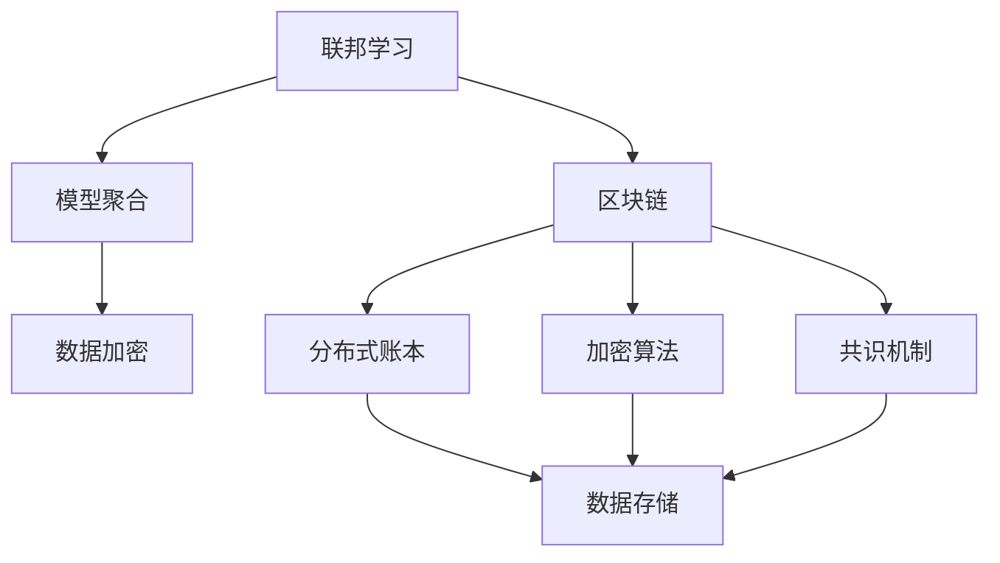
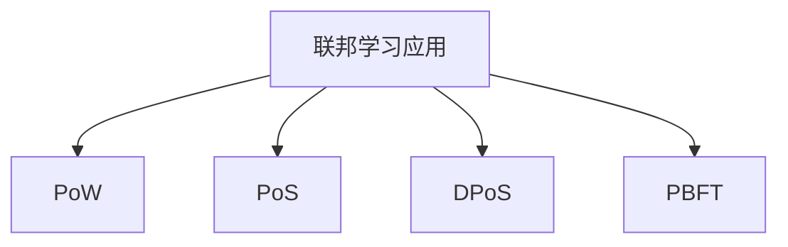

                 

### 文章标题

《区块链技术在联邦学习中的应用探索》

### 关键词

区块链、联邦学习、加密算法、分布式账本、隐私保护、去中心化协作

### 摘要

本文探讨了区块链技术在联邦学习中的应用，分析了区块链与联邦学习结合的基础概念、核心算法以及实际应用案例。首先，介绍了区块链和联邦学习的基本原理及其在各自领域的应用。接着，详细阐述了区块链与联邦学习的结合点，包括隐私保护、安全性保障和去中心化协作。然后，深入分析了区块链在联邦学习中的核心算法，包括加密算法和隐私保护算法，并通过数学模型和公式进行了详细解释。最后，通过实际应用案例展示了区块链技术在联邦学习中的应用效果，并讨论了其面临的挑战和未来发展趋势。本文旨在为读者提供一个全面了解区块链技术在联邦学习中应用的视角，以及其在解决数据隐私和安全问题方面的潜力。

---

## 第1章：区块链与联邦学习概述

### 1.1 区块链技术简介

#### 1.1.1 区块链的基本原理

区块链是一种分布式数据库技术，通过加密算法和共识机制确保数据的不可篡改性和安全性。其基本原理可以概括为以下几方面：

1. **分布式账本**：区块链是一个由多个节点共同维护的分布式数据库。每个节点都存储了一份完整的账本副本，这些副本之间通过加密算法进行同步和验证，确保账本的一致性。

2. **区块**：区块链由一系列按时间顺序排列的区块组成。每个区块包含一定数量的交易记录，以及一个时间戳和一个哈希值。前一个区块的哈希值作为当前区块的输入，通过加密算法计算得到当前区块的哈希值，形成链式结构。

3. **加密算法**：区块链使用加密算法保护数据的完整性和隐私。常见的加密算法包括哈希算法（如SHA-256）、非对称加密（如RSA）和对称加密（如AES）。

4. **共识机制**：区块链通过共识机制确保参与节点对账本的一致性。常见的共识机制包括工作量证明（PoW）、权益证明（PoS）和委托权益证明（DPoS）等。

#### 1.1.1.1 区块链的定义

区块链是一种去中心化的分布式数据库，其中数据以区块的形式存储，并通过加密算法链接成链。每个区块包含一定数量的交易记录和一个时间戳，通过哈希函数与前一个区块链接，形成链式结构。区块链具有以下特点：

- **去中心化**：没有中央机构控制，所有节点共同维护网络。
- **不可篡改**：一旦数据写入区块链，就很难被篡改。
- **安全加密**：使用加密算法保护数据的完整性和隐私。
- **去信任**：节点之间无需互相信任，通过共识机制达成对数据的共识。

#### 1.1.1.2 区块链的技术特点

区块链具有以下技术特点：

- **分布式**：区块链是一个分布式数据库，数据存储在多个节点上，避免单点故障和中心化风险。
- **不可篡改**：区块链的数据一旦写入，就很难被篡改，确保数据的可信度。
- **安全性**：区块链使用加密算法保护数据的完整性和隐私，确保数据的安全传输和存储。
- **透明性**：区块链的数据是公开透明的，任何人都可以查看和验证数据。
- **去信任**：区块链通过共识机制确保参与节点对账本的一致性，无需互相信任。

#### 1.1.1.3 区块链的应用领域

区块链技术可以应用于多个领域，包括但不限于：

- **金融**：如比特币、以太坊等数字货币，以及跨境支付、智能合约等。
- **供应链管理**：如防伪溯源、物流追踪等。
- **医疗健康**：如电子病历、基因数据管理等。
- **投票系统**：如去中心化投票、选举等。
- **物联网**：如设备认证、数据加密等。
- **游戏**：如去中心化游戏、虚拟资产交易等。

#### 1.1.2 联邦学习概述

##### 1.1.2.1 联邦学习的定义

联邦学习（Federated Learning）是一种分布式机器学习技术，允许多个参与方在不同的设备或服务器上训练模型，同时保持数据本地化。其核心思想是通过模型聚合（model aggregation）来整合多个本地模型的预测结果，形成一个全局模型。

联邦学习的定义可以概括为：一种分布式机器学习技术，通过将训练任务分发到多个设备或服务器上，并在每个设备或服务器上训练本地模型，然后将这些本地模型聚合为一个全局模型，以实现全局模型的优化。

#### 1.1.2.2 联邦学习的关键技术

联邦学习的关键技术包括：

1. **模型聚合**：将多个本地模型的预测结果合并成一个全局模型。常见的模型聚合方法包括平均聚合、加权聚合等。

2. **加密算法**：保护数据在传输和存储过程中的隐私。常见的加密算法包括对称加密、非对称加密、同态加密等。

3. **通信协议**：优化数据传输，降低通信成本。常见的通信协议包括梯度压缩、差分同步等。

4. **数据一致性**：确保参与方之间的数据一致性，以避免数据偏差和误差。常见的方法包括数据对齐、一致性检查等。

#### 1.1.2.3 联邦学习的优势与挑战

联邦学习具有以下优势：

1. **数据隐私**：无需共享原始数据，保护用户隐私。

2. **去中心化**：降低对中心化服务器的依赖，提高系统的容错性和鲁棒性。

3. **效率提升**：分布式训练可以提高训练效率，缩短训练时间。

4. **灵活扩展**：支持多种设备和平台的接入，易于扩展。

然而，联邦学习也面临一些挑战：

1. **计算效率**：分布式训练可能导致计算效率降低。

2. **数据一致性**：确保参与方之间的数据一致性是一个难题。

3. **安全与隐私**：需要有效的加密和隐私保护机制。

### 1.2 区块链与联邦学习的结合

区块链与联邦学习的结合可以解决联邦学习中的数据隐私和安全问题。区块链的分布式账本和加密算法可以确保数据在传输和存储过程中的隐私和安全。以下是区块链在联邦学习中的核心概念与联系的 Mermaid 流程图：



#### 1.2.1 区块链技术在联邦学习中的应用场景

区块链技术在联邦学习中的应用场景包括：

1. **隐私保护**：区块链的加密算法可以确保数据在传输和存储过程中的隐私。

2. **安全性保障**：区块链的去中心化特性可以提高系统的安全性，防止恶意攻击。

3. **去中心化协作**：区块链可以促进参与方之间的去中心化协作，降低对中心化服务器的依赖。

#### 1.2.2 区块链在联邦学习中的关键角色

区块链在联邦学习中的关键角色包括：

1. **数据管理**：区块链的分布式账本可以管理联邦学习过程中的数据，确保数据的一致性和安全性。

2. **共识机制**：区块链的共识机制可以确保参与方对模型和数据的共识，防止数据篡改和欺诈。

3. **加密算法**：区块链的加密算法可以保护联邦学习过程中的数据隐私，防止数据泄露。

### 1.3 主流区块链技术在联邦学习中的应用

目前，主流区块链技术在联邦学习中的应用包括以下几种：

#### 1.3.1 Hyperledger Fabric在联邦学习中的应用

Hyperledger Fabric是一种企业级的区块链框架，适用于联邦学习中的数据管理和共识机制。Hyperledger Fabric的核心组件包括：

1. **订单服务（Ordering Service）**：负责对交易进行排序，确保交易的顺序和一致性。

2. **通道（Channel）**：用于实现多个组织之间的数据共享和通信。

3. **链码（Chaincode）**：相当于智能合约，用于定义区块链上的业务逻辑和数据处理。

在联邦学习中，Hyperledger Fabric可以用于管理联邦学习过程中的数据，确保数据的一致性和安全性。

#### 1.3.2 Ethereum在联邦学习中的应用

Ethereum是一种开源的区块链平台，支持去中心化应用（DApps）和智能合约，适用于联邦学习中的模型训练和协作。Ethereum的核心组件包括：

1. **智能合约**：用于定义联邦学习过程中的规则和协议，如数据共享协议、模型聚合协议等。

2. **去中心化应用（DApps）**：用于实现联邦学习的去中心化模型训练和协作，如分布式模型训练、模型部署等。

在联邦学习中，Ethereum可以用于实现去中心化的模型训练和协作，提高系统的透明性和可追溯性。

#### 1.3.3 EOS在联邦学习中的应用

EOS是一种高性能的区块链平台，适用于大规模的联邦学习应用。EOS的核心组件包括：

1. **智能合约**：用于定义联邦学习过程中的规则和协议，如数据共享协议、模型聚合协议等。

2. **DApp浏览器**：用于浏览和监控联邦学习过程中的数据和模型。

3. **资源租赁市场**：用于实现联邦学习中的资源调度和优化，提高计算效率。

在联邦学习中，EOS可以用于实现去中心化的资源调度和优化，提高系统的效率和可扩展性。

---

以上是第1章的内容，接下来将继续探讨区块链技术在联邦学习中的核心概念、核心算法以及实际应用案例。

---

### 1.4 区块链在联邦学习中的挑战与未来趋势

尽管区块链技术在联邦学习中具有广泛的应用前景，但同时也面临一系列挑战和潜在的改进空间。

#### 1.4.1 数据隐私保护问题

区块链技术通过加密算法和分布式账本确保数据的隐私和安全，但在联邦学习中，数据隐私保护问题仍然存在。首先，区块链中的数据加密算法可能无法完全防止恶意节点的攻击。其次，区块链的分布式特性可能导致数据不一致性和隐私泄露。为了解决这些问题，可以探索以下改进方案：

- **多层次的加密策略**：结合对称加密和非对称加密，提高数据隐私保护水平。
- **安全多方计算**：使用安全多方计算（Secure Multi-Party Computation, SMPC）技术，在分布式环境中保护数据隐私。
- **环签名和群签名**：通过环签名和群签名技术，实现更高级别的匿名通信。

#### 1.4.2 计算效率问题

区块链的共识机制和加密算法可能导致计算效率降低，影响联邦学习的性能。特别是在大规模的联邦学习应用中，区块链的网络延迟和计算开销可能成为瓶颈。为了提高计算效率，可以考虑以下措施：

- **优化共识机制**：研究和采用更高效的共识算法，如授权股权证明（授权PoS）或实用拜占庭容错（PBFT）。
- **加密算法优化**：优化现有的加密算法，减少计算开销，如使用硬件加速器或特定算法的优化实现。
- **分片技术**：通过分片技术将区块链网络划分为多个子网络，提高网络吞吐量和计算效率。

#### 1.4.3 数据一致性保障

在联邦学习环境中，参与方之间的数据一致性是确保模型性能和准确性的关键。然而，分布式数据存储和传输可能导致数据不一致性和错误。为了保障数据一致性，可以采取以下策略：

- **分布式一致性算法**：如Paxos、Raft等，确保分布式系统中的数据一致性。
- **数据校验和一致性检查**：在数据传输和存储过程中，使用校验和一致性检查，及时发现和纠正数据错误。
- **数据冗余和备份**：通过数据冗余和备份机制，提高数据可靠性和容错性。

#### 1.4.4 激励机制设计

在联邦学习中，参与方之间的协作和贡献需要有效的激励机制。目前，区块链技术提供了一些激励机制，如代币奖励、交易费用等，但可能无法完全激励参与方的积极性和贡献度。为了设计有效的激励机制，可以探索以下方案：

- **代币经济模型**：构建基于区块链的代币经济模型，激励参与方积极参与联邦学习。
- **按需付费**：根据参与方在联邦学习中的贡献和消耗的资源，按需收取费用，确保公平性和可持续性。
- **利益共享**：将联邦学习应用的部分收益分配给参与方，提高参与方的积极性。

#### 1.4.5 未来发展趋势

随着区块链技术和联邦学习技术的不断发展和成熟，未来将在以下方面取得进展：

- **跨链技术与联邦学习的结合**：通过跨链技术实现不同区块链之间的互操作性和数据共享，提高联邦学习的效率和灵活性。
- **新型共识机制的探索**：研究并采用新型共识机制，如基于博弈论的共识算法，提高系统的安全性和效率。
- **区块链与机器学习的深度融合**：结合区块链的分布式特性和机器学习的先进算法，开发更高效、更安全的联邦学习框架。
- **行业应用拓展**：将区块链技术在联邦学习中的应用拓展到更多领域，如医疗健康、金融、物联网等，推动技术创新和产业升级。

通过解决上述挑战和探索未来发展，区块链技术在联邦学习中的应用将迎来更加广阔的前景，为数据隐私保护和安全共享提供更强有力的支持。

---

以上是第1章的全部内容，接下来将深入探讨区块链与联邦学习结合的核心概念，以及在实际应用中如何实现这些概念。

---

## 第2章：区块链技术在联邦学习中的核心概念

### 2.1 区块链与联邦学习的结合

区块链技术在联邦学习中的应用主要体现在以下几个方面：隐私保护、安全性保障和去中心化协作。以下将详细讨论这些核心概念及其实现方法。

#### 2.1.1 隐私保护

在联邦学习中，参与方通常需要共享模型参数或梯度信息，但又不希望暴露原始数据。区块链技术通过加密算法和分布式账本提供了一种有效的隐私保护手段。以下是实现隐私保护的关键步骤：

1. **数据加密**：参与方在发送数据前，使用加密算法对数据进行加密。常见的加密算法包括对称加密（如AES）和非对称加密（如RSA）。对称加密适用于大数据加密，非对称加密适用于密钥交换。

   ```mermaid
   graph TD
       A[参与方1] --> B[加密数据]
       B --> C[参与方2]
       D[加密算法] --> B
   ```

2. **分布式账本**：区块链的分布式账本记录了加密后的数据，确保数据的隐私和安全。每个节点只存储部分数据，避免单点故障和数据泄露。

   ```mermaid
   graph TD
       A[节点1] --> B[区块链]
       B --> C[节点2]
       B --> D[节点3]
   ```

3. **加密通信**：在数据传输过程中，使用加密通信协议（如TLS）确保数据在传输过程中的隐私和安全。

   ```mermaid
   graph TD
       A[参与方1] --> B[加密通信]
       B --> C[参与方2]
   ```

#### 2.1.2 安全性保障

区块链技术通过去中心化和共识机制提供了一种强安全性的保障。在联邦学习环境中，安全性保障尤为重要，因为涉及到大量敏感数据的共享和处理。以下是实现安全性保障的关键步骤：

1. **共识机制**：区块链的共识机制（如工作量证明PoW、权益证明PoS）确保所有节点对数据的共识，防止恶意节点的攻击和数据篡改。

   ```mermaid
   graph TD
       A[节点1] --> B[共识机制]
       B --> C[节点2]
       B --> D[节点3]
   ```

2. **智能合约**：智能合约是一种自动执行合约条款的计算机程序，确保联邦学习过程中的规则和协议得到执行。智能合约可以定义数据共享、模型聚合等操作的具体流程和规则。

   ```mermaid
   graph TD
       A[智能合约] --> B[数据共享]
       B --> C[模型聚合]
   ```

3. **身份验证**：区块链技术通过数字身份验证确保参与方的合法性和权限。参与方在加入网络前，需要通过身份验证，确保只有授权节点可以参与联邦学习。

   ```mermaid
   graph TD
       A[参与方] --> B[身份验证]
       B --> C[区块链]
   ```

#### 2.1.3 去中心化协作

去中心化协作是联邦学习的核心优势之一，区块链技术通过去中心化架构实现参与方之间的协作和互动。以下是实现去中心化协作的关键步骤：

1. **分布式存储**：区块链的分布式存储结构确保数据存储在多个节点上，避免单点故障和数据丢失。每个节点只存储部分数据，提高系统的容错性和可靠性。

   ```mermaid
   graph TD
       A[节点1] --> B[分布式存储]
       B --> C[节点2]
       B --> D[节点3]
   ```

2. **共识网络**：区块链的共识网络确保参与方对数据的共识，防止恶意节点的攻击和数据篡改。共识网络通过加密算法和共识机制实现去中心化的数据管理和协作。

   ```mermaid
   graph TD
       A[节点1] --> B[共识网络]
       B --> C[节点2]
       B --> D[节点3]
   ```

3. **激励机制**：区块链技术通过激励机制激励参与方积极参与联邦学习。常见的激励机制包括代币奖励、交易费用等，确保参与方的积极性和贡献度。

   ```mermaid
   graph TD
       A[参与方] --> B[激励机制]
       B --> C[区块链]
   ```

通过以上核心概念，区块链技术在联邦学习中的应用可以有效地实现隐私保护、安全性保障和去中心化协作，为联邦学习提供一种更安全、更可靠的解决方案。

---

在下一章中，我们将深入探讨区块链在联邦学习数据管理中的应用，包括数据存储、访问控制和隐私保护等方面的具体实现。

---

## 第2章：区块链技术在联邦学习中的核心概念（续）

### 2.2 区块链在联邦学习数据管理中的应用

区块链技术可以为联邦学习提供强大的数据管理能力，特别是在数据存储、访问控制和隐私保护等方面。以下将详细讨论这些方面的具体实现。

#### 2.2.1 数据存储

区块链的分布式账本技术确保数据存储在多个节点上，从而提高数据的可靠性和可用性。以下是实现数据存储的关键步骤：

1. **分布式存储架构**：区块链网络中的每个节点都存储了一份完整的账本副本，这些副本通过加密算法进行同步和验证。分布式存储架构确保数据不会因为单个节点的故障而丢失。

   ```mermaid
   graph TD
       A[节点1] --> B[分布式存储]
       B --> C[节点2]
       B --> D[节点3]
   ```

2. **区块链账本**：区块链账本记录了所有交易记录和数据存储操作。每个区块包含一定数量的交易记录和一个时间戳，通过哈希函数与前一个区块链接，形成链式结构。

   ```mermaid
   graph TD
       A[区块1] --> B[时间戳]
       B --> C[交易记录]
       C --> D[哈希值]
       D --> E[区块2]
   ```

3. **数据加密**：在数据存储过程中，使用加密算法对数据进行加密。对称加密适用于大数据存储，非对称加密适用于密钥交换。

   ```mermaid
   graph TD
       A[数据] --> B[加密算法]
       B --> C[加密数据]
   ```

#### 2.2.2 数据访问控制

区块链技术通过智能合约和访问控制策略实现数据访问控制。以下是实现数据访问控制的关键步骤：

1. **访问控制策略**：智能合约定义了数据访问控制策略，包括数据共享权限、访问权限和操作权限。参与方在加入网络前，需要通过身份验证，确保只有授权节点可以访问特定数据。

   ```mermaid
   graph TD
       A[智能合约] --> B[访问控制策略]
       B --> C[节点1]
       B --> D[节点2]
   ```

2. **权限管理**：智能合约通过权限管理模块，为不同类型的参与方分配不同的访问权限。权限管理模块可以基于角色、时间、地点等因素进行权限分配。

   ```mermaid
   graph TD
       A[权限管理] --> B[角色1]
       B --> C[访问权限]
       A --> D[时间]
       A --> E[地点]
   ```

3. **加密通信**：在数据传输过程中，使用加密通信协议（如TLS）确保数据在传输过程中的隐私和安全。加密通信协议可以防止数据在传输过程中被窃取或篡改。

   ```mermaid
   graph TD
       A[节点1] --> B[加密通信]
       B --> C[节点2]
   ```

#### 2.2.3 数据隐私保护

区块链技术在联邦学习中的应用，使得数据隐私保护成为关键问题。以下是实现数据隐私保护的关键步骤：

1. **加密算法**：使用对称加密和非对称加密算法对数据进行加密。对称加密适用于大数据加密，非对称加密适用于密钥交换。

   ```mermaid
   graph TD
       A[数据] --> B[加密算法]
       B --> C[加密数据]
   ```

2. **同态加密**：同态加密是一种允许在加密数据上进行计算而不需要解密的加密技术。同态加密可以确保在联邦学习过程中，参与方可以在加密的数据上进行计算，而无需暴露原始数据。

   ```mermaid
   graph TD
       A[加密数据] --> B[同态加密算法]
       B --> C[计算结果]
   ```

3. **匿名通信**：通过匿名通信协议（如环签名、群签名）实现参与方之间的匿名通信，防止参与方在通信过程中被追踪或识别。

   ```mermaid
   graph TD
       A[参与方1] --> B[匿名通信协议]
       B --> C[参与方2]
   ```

通过以上关键步骤，区块链技术在联邦学习中的数据管理可以实现高效、安全、去中心化的数据存储、访问控制和隐私保护，为联邦学习提供一种可靠的解决方案。

---

在下一章中，我们将讨论区块链在联邦学习中的共识机制，分析不同共识机制的特点和适用场景。

---

## 第2章：区块链技术在联邦学习中的核心概念（续）

### 2.3 区块链在联邦学习中的共识机制

区块链技术中的共识机制是实现去中心化和数据一致性的关键。在联邦学习环境中，共识机制同样发挥着重要作用，确保参与方对模型和数据的一致性。以下将分析几种常见的共识机制，并探讨它们在联邦学习中的应用。

#### 2.3.1 共识机制概述

共识机制是指区块链网络中所有节点通过一定算法和规则，达成对数据一致性的共识的过程。常见的共识机制包括：

1. **工作量证明（Proof of Work, PoW）**：节点通过计算复杂算法来证明其工作量，赢得记账权利。比特币采用的PoW机制，需要节点进行大量的计算工作，从而确保网络的安全性和去中心化。

2. **权益证明（Proof of Stake, PoS）**：节点根据其在区块链中的权益（如持有代币数量）来决定记账权利。相比PoW，PoS机制降低了对计算资源的依赖，但可能导致“富者愈富”的问题。

3. **委托权益证明（Delegated Proof of Stake, DPoS）**：节点通过投票选举出部分节点作为“超级节点”，这些超级节点负责记账和验证交易。DPoS机制提高了网络的效率，但可能导致权力集中。

4. **实用拜占庭容错（Practical Byzantine Fault Tolerance, PBFT）**：通过多个节点之间的投票和确认，达成数据一致性的共识。PBFT适用于中小规模的区块链网络，具有较高的性能和安全性。

#### 2.3.2 共识机制的特点和适用场景

1. **工作量证明（PoW）**

   - **特点**：通过计算复杂算法（如SHA-256）来证明节点的工作量，确保网络的安全性和去中心化。
   - **适用场景**：适用于大规模、去中心化的区块链网络，如比特币、以太坊等。

   ```mermaid
   graph TD
       A[节点1] --> B[计算SHA-256]
       B --> C[验证]
   ```

2. **权益证明（PoS）**

   - **特点**：节点根据其在区块链中的权益（如持有代币数量）来决定记账权利，降低计算资源需求。
   - **适用场景**：适用于中小规模、权益驱动的区块链网络，如EOS、Tezos等。

   ```mermaid
   graph TD
       A[节点1] --> B[持有代币]
       B --> C[权益证明]
   ```

3. **委托权益证明（DPoS）**

   - **特点**：通过节点投票选举出超级节点，这些超级节点负责记账和验证交易，提高网络效率。
   - **适用场景**：适用于需要高吞吐量和高效率的区块链网络，如Steem、BitShares等。

   ```mermaid
   graph TD
       A[节点1] --> B[投票]
       B --> C[超级节点]
       C --> D[记账]
   ```

4. **实用拜占庭容错（PBFT）**

   - **特点**：通过多个节点之间的投票和确认，达成数据一致性的共识，适用于中小规模的区块链网络。
   - **适用场景**：适用于中小规模、对性能要求较高的区块链网络，如Ripple、Hyperledger Fabric等。

   ```mermaid
   graph TD
       A[节点1] --> B[投票]
       B --> C[确认]
       C --> D[共识]
   ```

#### 2.3.3 共识机制在联邦学习中的应用

在联邦学习环境中，选择合适的共识机制对于确保数据一致性、提高网络效率具有重要意义。以下为共识机制在联邦学习中的应用场景：

1. **PoW机制**：适用于需要高安全性、去中心化的联邦学习应用，如分布式机器学习模型训练。

2. **PoS机制**：适用于需要降低计算资源需求、提高权益驱动的联邦学习应用，如基于代币激励的分布式数据分析。

3. **DPoS机制**：适用于需要高吞吐量和高效率的联邦学习应用，如实时数据聚合和决策。

4. **PBFT机制**：适用于中小规模、对性能要求较高的联邦学习应用，如医疗健康数据共享和智能合约执行。



通过分析不同共识机制的特点和适用场景，可以为联邦学习应用选择合适的共识机制，确保数据一致性、提高网络效率，并实现去中心化的协同工作。

---

在下一章中，我们将讨论区块链在联邦学习中的加密算法，包括对称加密、非对称加密和同态加密，并探讨它们在联邦学习中的应用。

---

## 第3章：区块链在联邦学习中的加密算法

### 3.1 区块链在联邦学习中的加密算法

加密算法在区块链和联邦学习中扮演着重要角色，确保数据隐私和安全。以下是几种常见的加密算法，包括对称加密、非对称加密和同态加密，以及它们在联邦学习中的应用。

#### 3.1.1 对称加密与非对称加密

对称加密和非对称加密是两种基本的加密算法，广泛应用于区块链和联邦学习中。

**对称加密**：对称加密算法使用相同的密钥进行加密和解密。常见的对称加密算法包括AES、DES和RSA。

- **AES（高级加密标准）**：AES是一种广泛使用的对称加密算法，采用128、192或256位的密钥长度，提供高安全性和高性能。
- **DES（数据加密标准）**：DES是一种较早的对称加密算法，采用56位的密钥长度，已被认为不够安全。
- **RSA**：RSA是一种非对称加密算法，使用一对密钥（公钥和私钥）进行加密和解密，安全性较高，但计算开销较大。

**非对称加密**：非对称加密算法使用不同的密钥进行加密和解密，公钥用于加密，私钥用于解密。常见的非对称加密算法包括RSA和ECC（椭圆曲线加密）。

- **RSA**：RSA算法使用大素数生成一对密钥，安全性较高，但计算开销较大。
- **ECC**：ECC算法使用椭圆曲线数学，提供更高的安全性，同时计算开销较小。

#### 3.1.2 数字签名

数字签名是一种用于验证消息来源和完整性的加密技术，基于非对称加密算法。发送方使用私钥对消息进行签名，接收方使用公钥验证签名。数字签名可以确保消息的不可否认性和完整性。

- **RSA数字签名**：使用RSA算法生成数字签名，通过公钥验证签名。
- **ECC数字签名**：使用ECC算法生成数字签名，通过公钥验证签名。

#### 3.1.3 同态加密

同态加密是一种允许在加密数据上进行计算而不需要解密的加密技术，广泛应用于联邦学习中的数据隐私保护。同态加密可以将加密数据转换为明文数据，然后进行计算，最后将结果转换为加密数据。

- **部分同态加密**：部分同态加密允许对加密数据执行特定类型的操作（如加法或乘法），但不支持多种类型的操作。
- **全同态加密**：全同态加密允许对加密数据执行任意类型的操作，但计算开销较大。

#### 3.1.4 加密算法在联邦学习中的应用

加密算法在联邦学习中的应用主要包括数据加密、隐私保护和安全通信。

1. **数据加密**：在联邦学习过程中，参与方需要对数据进行加密，确保数据在传输和存储过程中的隐私和安全。对称加密和非对称加密算法可以用于数据加密。

   ```mermaid
   graph TD
       A[数据] --> B[对称加密算法]
       B --> C[加密数据]
       A --> D[非对称加密算法]
       D --> E[加密数据]
   ```

2. **隐私保护**：在联邦学习过程中，参与方需要对数据进行隐私保护，确保数据不被其他参与方和第三方访问。同态加密可以用于隐私保护。

   ```mermaid
   graph TD
       A[加密数据] --> B[同态加密算法]
       B --> C[计算结果]
   ```

3. **安全通信**：在联邦学习过程中，参与方需要通过安全通信协议进行数据传输，确保数据在传输过程中的隐私和安全。非对称加密和数字签名可以用于安全通信。

   ```mermaid
   graph TD
       A[节点1] --> B[非对称加密算法]
       B --> C[加密通信]
       C --> D[节点2]
   ```

通过以上加密算法的应用，区块链技术在联邦学习中可以提供高效、安全、去中心化的数据隐私保护和安全通信。

---

在下一章中，我们将讨论区块链在联邦学习中的隐私保护算法，包括加密算法、匿名通信协议和同态加密算法，并分析它们在联邦学习中的应用。

---

## 第3章：区块链在联邦学习中的隐私保护算法

### 3.2 区块链在联邦学习中的隐私保护算法

在联邦学习环境中，隐私保护至关重要，因为参与方需要共享模型参数或梯度信息，同时保持数据本地化，防止数据泄露。区块链技术通过加密算法、匿名通信协议和同态加密算法等多种隐私保护技术，提供了一种强大的隐私保护手段。以下将详细讨论这些隐私保护算法及其在联邦学习中的应用。

#### 3.2.1 加密算法

加密算法是区块链技术中的核心组成部分，主要用于保护数据在传输和存储过程中的隐私和安全。以下几种加密算法在联邦学习中得到了广泛应用：

1. **对称加密**：对称加密算法使用相同的密钥进行加密和解密，如AES、DES和RSA。对称加密算法具有高效率，适用于大数据加密，但需要安全的密钥管理。

   ```mermaid
   graph TD
       A[明文数据] --> B[对称加密算法]
       B --> C[密文数据]
       C --> D[传输/存储]
   ```

2. **非对称加密**：非对称加密算法使用不同的密钥进行加密和解密，如RSA和ECC。非对称加密算法具有高安全性，但计算开销较大，适用于密钥交换和数字签名。

   ```mermaid
   graph TD
       A[明文数据] --> B[非对称加密算法]
       B --> C[公钥]
       C --> D[加密数据]
       D --> E[传输/存储]
   ```

3. **同态加密**：同态加密算法允许在加密数据上进行计算，而不需要解密数据，如部分同态加密和全同态加密。同态加密算法在联邦学习中具有广泛应用，可以保护参与方之间的数据隐私。

   ```mermaid
   graph TD
       A[加密数据] --> B[同态加密算法]
       B --> C[计算结果]
   ```

#### 3.2.2 匿名通信协议

匿名通信协议在联邦学习中用于保护参与方的隐私，防止在通信过程中被追踪或识别。以下几种匿名通信协议在联邦学习中得到了广泛应用：

1. **环签名**：环签名是一种基于群组的匿名签名技术，允许参与方在一个环中匿名发送消息。环签名可以防止消息追踪和重放攻击。

   ```mermaid
   graph TD
       A[参与方1] --> B[环签名]
       B --> C[消息]
       C --> D[参与方2]
   ```

2. **群签名**：群签名是一种基于群体的签名技术，允许群体成员匿名发送签名消息。群签名可以防止群内成员的匿名性和外部追踪。

   ```mermaid
   graph TD
       A[群体成员] --> B[群签名]
       B --> C[签名消息]
       C --> D[接收方]
   ```

3. **零知识证明**：零知识证明是一种加密技术，允许参与方在一个不泄露实际信息的情况下，证明某个陈述为真。零知识证明在联邦学习中可用于匿名验证和隐私保护。

   ```mermaid
   graph TD
       A[参与方] --> B[零知识证明]
       B --> C[验证方]
   ```

#### 3.2.3 同态加密算法

同态加密算法是一种允许在加密数据上执行计算而不需要解密的加密技术。同态加密算法在联邦学习中可以保护参与方之间的数据隐私，防止中间商篡改数据。以下几种同态加密算法在联邦学习中得到了广泛应用：

1. **部分同态加密**：部分同态加密算法允许对加密数据执行特定的计算操作，如加法和乘法。部分同态加密算法适用于简单计算场景，但计算开销较大。

   ```mermaid
   graph TD
       A[加密数据] --> B[部分同态加密算法]
       B --> C[计算结果]
   ```

2. **全同态加密**：全同态加密算法允许对加密数据执行任意类型的计算操作，如逻辑运算和函数运算。全同态加密算法适用于复杂计算场景，但计算开销极大。

   ```mermaid
   graph TD
       A[加密数据] --> B[全同态加密算法]
       B --> C[计算结果]
   ```

#### 3.2.4 隐私保护算法在联邦学习中的应用

隐私保护算法在联邦学习中的应用主要包括数据加密、隐私保护和安全通信。以下为隐私保护算法在联邦学习中的应用示例：

1. **数据加密**：参与方使用对称加密算法对数据进行加密，确保数据在传输和存储过程中的隐私和安全。

   ```mermaid
   graph TD
       A[明文数据] --> B[对称加密算法]
       B --> C[密文数据]
       C --> D[传输/存储]
   ```

2. **隐私保护**：参与方使用同态加密算法在加密数据上执行计算，保护参与方之间的数据隐私。

   ```mermaid
   graph TD
       A[加密数据] --> B[同态加密算法]
       B --> C[计算结果]
   ```

3. **安全通信**：参与方使用匿名通信协议和数字签名进行安全通信，确保数据在传输过程中的隐私和安全。

   ```mermaid
   graph TD
       A[节点1] --> B[匿名通信协议]
       B --> C[加密通信]
       C --> D[节点2]
   ```

通过以上隐私保护算法的应用，区块链技术在联邦学习中可以提供高效、安全、去中心化的隐私保护机制，为联邦学习提供可靠的数据隐私保障。

---

在下一章中，我们将探讨区块链在联邦学习中的应用实例，包括医疗数据和金融风控领域的应用。

---

## 第4章：区块链技术在联邦学习中的应用实例

### 4.1 区块链在医疗数据联邦学习中的应用

#### 4.1.1 医疗数据隐私保护的需求

随着医疗数据的数量和种类不断增长，如何保护医疗数据的隐私和安全成为了一个重要问题。区块链技术在医疗数据联邦学习中的应用，可以有效地解决医疗数据隐私保护的需求。

1. **数据敏感性**：医疗数据通常包含患者的个人隐私信息，如姓名、出生日期、诊断结果等。这些信息一旦泄露，可能导致严重的隐私泄露和伦理问题。

2. **数据共享需求**：为了提高医疗数据分析的准确性和效率，医疗机构通常需要共享医疗数据。然而，传统的方式在数据共享过程中容易暴露患者的隐私信息。

3. **数据安全问题**：在医疗数据共享过程中，数据传输和存储过程中的安全问题也不容忽视。黑客攻击和内部泄露都可能对医疗数据造成严重威胁。

#### 4.1.2 区块链在医疗数据联邦学习中的应用

区块链技术在医疗数据联邦学习中的应用，主要包括以下方面：

1. **数据加密**：区块链技术使用对称加密和非对称加密算法对医疗数据进行加密，确保数据在传输和存储过程中的隐私和安全。

   ```mermaid
   graph TD
       A[医疗数据] --> B[对称加密算法]
       B --> C[加密数据]
       C --> D[传输/存储]
   ```

2. **分布式存储**：区块链技术将医疗数据存储在多个节点上，形成分布式存储架构。每个节点只存储部分数据，避免单点故障和数据丢失。

   ```mermaid
   graph TD
       A[节点1] --> B[分布式存储]
       B --> C[节点2]
       B --> D[节点3]
   ```

3. **访问控制**：区块链技术通过智能合约和访问控制策略，实现对医疗数据的访问控制。只有授权节点可以访问特定数据，确保数据不被未授权访问。

   ```mermaid
   graph TD
       A[智能合约] --> B[访问控制策略]
       B --> C[节点1]
       B --> D[节点2]
   ```

4. **隐私保护算法**：区块链技术在医疗数据联邦学习过程中，使用同态加密和匿名通信协议等隐私保护算法，确保参与方之间的数据隐私和安全。

   ```mermaid
   graph TD
       A[加密数据] --> B[同态加密算法]
       B --> C[计算结果]
   ```

#### 4.1.3 案例分析：基于区块链的智能医疗数据分析平台

一个实际的案例是基于区块链的智能医疗数据分析平台，该平台实现了医疗数据联邦学习，同时保护了数据隐私和安全。

1. **应用背景**：该平台旨在提高医疗数据分析的准确性和效率，同时确保医疗数据隐私和安全。参与方包括多家医院、研究机构和制药公司。

2. **技术架构**：该平台采用Hyperledger Fabric作为区块链框架，使用对称加密和非对称加密算法对医疗数据进行加密。智能合约定义了数据共享和访问控制策略。

3. **实现细节**：
   - **数据加密**：医疗数据在传输和存储过程中使用AES算法进行加密。
   - **分布式存储**：医疗数据存储在Hyperledger Fabric的分布式账本中，每个节点存储部分数据。
   - **访问控制**：智能合约定义了不同角色的访问权限，如医院、研究机构和制药公司。

4. **数据隐私保护**：在联邦学习过程中，参与方使用同态加密和匿名通信协议保护数据隐私。同态加密算法允许在加密数据上进行计算，匿名通信协议确保参与方之间的匿名通信。

   ```mermaid
   graph TD
       A[节点1] --> B[同态加密算法]
       B --> C[计算结果]
       A --> D[匿名通信协议]
       D --> E[节点2]
   ```

通过以上应用案例，可以看出区块链技术在医疗数据联邦学习中的应用，可以有效解决数据隐私和安全问题，为医疗数据分析提供一种可靠的技术手段。

---

### 4.2 区块链在金融风控中的联邦学习应用

#### 4.2.1 金融风控中的挑战

金融风控是金融行业中一个重要且复杂的领域，涉及到大量的数据分析和模型构建。在金融风控中，以下挑战需要得到解决：

1. **金融数据的多样性**：金融数据种类繁多，包括交易数据、用户行为数据、市场数据等。这些数据来源广泛，格式和结构各异，给数据分析带来很大困难。

2. **金融数据的隐私保护需求**：金融数据通常包含敏感信息，如用户账户信息、交易记录等。在数据共享和协作过程中，保护数据隐私是金融风控的关键需求。

3. **金融风控模型的安全性**：金融风控模型的安全性至关重要，因为一旦模型被攻击或篡改，可能导致巨大的经济损失和声誉损失。

#### 4.2.2 区块链在金融风控中的联邦学习应用

区块链技术在金融风控中的应用，通过联邦学习技术实现了数据隐私保护和模型安全性。以下是区块链在金融风控中的联邦学习应用的主要方面：

1. **数据加密**：区块链技术使用对称加密和非对称加密算法对金融数据进行加密，确保数据在传输和存储过程中的隐私和安全。

   ```mermaid
   graph TD
       A[金融数据] --> B[对称加密算法]
       B --> C[加密数据]
       C --> D[传输/存储]
   ```

2. **分布式存储**：区块链技术将金融数据存储在多个节点上，形成分布式存储架构。每个节点只存储部分数据，避免单点故障和数据丢失。

   ```mermaid
   graph TD
       A[节点1] --> B[分布式存储]
       B --> C[节点2]
       B --> D[节点3]
   ```

3. **访问控制**：区块链技术通过智能合约和访问控制策略，实现对金融数据的访问控制。只有授权节点可以访问特定数据，确保数据不被未授权访问。

   ```mermaid
   graph TD
       A[智能合约] --> B[访问控制策略]
       B --> C[节点1]
       B --> D[节点2]
   ```

4. **隐私保护算法**：区块链技术在金融风控过程中，使用同态加密和匿名通信协议等隐私保护算法，确保参与方之间的数据隐私和安全。

   ```mermaid
   graph TD
       A[加密数据] --> B[同态加密算法]
       B --> C[计算结果]
   ```

#### 4.2.3 案例分析：基于区块链的金融风控平台

一个实际的案例是基于区块链的金融风控平台，该平台通过联邦学习技术实现了金融数据的隐私保护和模型安全性。

1. **应用背景**：该平台旨在提高金融风控模型的准确性和效率，同时确保金融数据隐私和安全。参与方包括多家金融机构、数据提供商和研究机构。

2. **技术架构**：该平台采用Ethereum作为区块链框架，使用对称加密和非对称加密算法对金融数据进行加密。智能合约定义了数据共享和访问控制策略。

3. **实现细节**：
   - **数据加密**：金融数据在传输和存储过程中使用AES算法进行加密。
   - **分布式存储**：金融数据存储在Ethereum的区块链上，每个节点存储部分数据。
   - **访问控制**：智能合约定义了不同角色的访问权限，如金融机构、数据提供商和研究机构。

4. **数据隐私保护**：在联邦学习过程中，参与方使用同态加密和匿名通信协议保护数据隐私。同态加密算法允许在加密数据上进行计算，匿名通信协议确保参与方之间的匿名通信。

   ```mermaid
   graph TD
       A[节点1] --> B[同态加密算法]
       B --> C[计算结果]
       A --> D[匿名通信协议]
       D --> E[节点2]
   ```

通过以上应用案例，可以看出区块链技术在金融风控中的联邦学习应用，可以有效解决金融数据的隐私保护和模型安全性问题，为金融风控提供一种可靠的技术手段。

---

在下一章中，我们将探讨区块链在联邦学习中的挑战与未来趋势，分析现有技术的不足和未来的发展方向。

---

## 第5章：区块链在联邦学习中的挑战与未来趋势

### 5.1 区块链在联邦学习中的挑战

尽管区块链技术在联邦学习中展现出巨大的潜力，但在实际应用中仍然面临一系列挑战。

#### 5.1.1 数据隐私保护问题

数据隐私保护是区块链在联邦学习中的首要挑战。在联邦学习过程中，参与方需要共享模型参数或梯度信息，同时保持数据本地化。尽管区块链技术提供了加密算法和分布式账本，但以下问题仍然存在：

1. **隐私保护与计算效率的平衡**：加密算法和分布式账本增加了计算开销，可能导致联邦学习过程中的计算效率降低。如何在保证数据隐私的同时，提高计算效率是一个亟待解决的问题。

2. **数据一致性与完整性保障**：区块链的分布式特性可能导致数据不一致性和完整性问题。确保参与方之间的数据一致性，防止数据篡改和欺诈，是一个重要挑战。

3. **激励机制设计**：在联邦学习过程中，参与方需要得到合理的激励，以鼓励其积极参与和贡献。设计有效的激励机制，确保参与方的积极性和贡献度，是一个关键问题。

#### 5.1.2 安全性问题

区块链技术在联邦学习中的应用，也面临一系列安全问题。以下是一些常见的安全问题：

1. **共识机制的安全**：共识机制是区块链技术的核心，但其安全性可能受到恶意攻击。如何设计安全的共识机制，防止恶意节点的攻击和数据篡改，是一个重要挑战。

2. **智能合约的安全性**：智能合约在区块链技术中用于定义业务逻辑和协议。然而，智能合约可能存在漏洞，导致数据泄露或资金损失。如何确保智能合约的安全性，防止漏洞和攻击，是一个关键问题。

3. **网络攻击与防御**：区块链网络可能面临各种类型的网络攻击，如DDoS攻击、Sybil攻击等。如何设计有效的防御机制，保护区块链网络的安全，是一个重要挑战。

#### 5.1.3 技术融合与创新

区块链技术需要与其他技术（如机器学习、大数据等）进行融合和创新，以充分发挥其在联邦学习中的应用潜力。以下是一些技术融合和创新的方向：

1. **区块链与机器学习的融合**：如何将区块链技术应用于机器学习任务，实现数据隐私保护和模型安全性，是一个重要研究方向。例如，研究如何在区块链环境中实现高效的机器学习算法。

2. **跨链技术与联邦学习的结合**：跨链技术可以实现不同区块链之间的互操作性和数据共享。如何将跨链技术与联邦学习结合，实现更高效、更安全的联邦学习应用，是一个重要研究方向。

3. **新型共识机制的探索**：现有的共识机制（如PoW、PoS等）可能存在一些缺陷和不足。如何研究并采用新型共识机制，提高区块链技术的性能和安全性，是一个重要研究方向。

### 5.2 区块链在联邦学习中的未来趋势

随着区块链技术和联邦学习技术的不断发展，区块链在联邦学习中的应用前景广阔。以下为区块链在联邦学习中的未来趋势：

#### 5.2.1 技术融合与创新

区块链技术需要与其他技术进行融合和创新，以充分发挥其在联邦学习中的应用潜力。以下是一些技术融合和创新的方向：

1. **区块链与机器学习的深度融合**：研究如何在区块链环境中实现高效的机器学习算法，同时保证数据隐私和模型安全性。例如，探索适用于区块链的优化算法和分布式学习算法。

2. **跨链技术与联邦学习的结合**：研究如何实现不同区块链之间的互操作性和数据共享，以实现更高效、更安全的联邦学习应用。例如，研究跨链协议和跨链智能合约。

3. **新型共识机制的探索**：研究并采用新型共识机制，提高区块链技术的性能和安全性。例如，探索基于博弈论的共识算法和实用拜占庭容错（PBFT）等新型共识机制。

#### 5.2.2 应用领域拓展

区块链技术在联邦学习中的应用将不断拓展到更多领域，为各行业提供更安全、更可靠的数据共享和协作机制。以下为一些潜在的应用领域：

1. **医疗健康**：区块链技术在医疗健康领域的应用潜力巨大，如电子病历管理、基因数据共享等。通过联邦学习和区块链技术，可以实现更安全、更隐私的医疗数据共享。

2. **金融**：区块链技术在金融领域的应用包括金融风控、数字货币交易等。通过联邦学习和区块链技术，可以实现更安全、更透明的金融数据分析和交易。

3. **物联网**：区块链技术在物联网领域的应用包括设备认证、数据加密等。通过联邦学习和区块链技术，可以实现更安全、更可靠的物联网数据共享和协作。

4. **供应链管理**：区块链技术在供应链管理领域的应用包括防伪溯源、物流追踪等。通过联邦学习和区块链技术，可以实现更高效、更透明的供应链管理和协作。

5. **投票系统**：区块链技术在投票系统领域的应用包括去中心化投票、选举等。通过联邦学习和区块链技术，可以实现更安全、更公正的投票和选举过程。

#### 5.2.3 政策与法规

随着区块链技术在联邦学习中的应用不断拓展，相关政策和法规的建立和完善至关重要。以下为政策与法规的发展方向：

1. **数据保护法规**：研究并建立完善的区块链数据保护法规，确保数据在区块链环境中的隐私和安全。

2. **区块链监管**：研究并建立区块链监管机制，确保区块链技术在联邦学习中的应用合规，防止非法和恶意行为。

3. **跨境数据流动**：研究并建立跨境数据流动的法规，确保区块链技术在跨境联邦学习中的应用合法、合规。

通过技术融合与创新、应用领域拓展和政策与法规的建立，区块链技术在联邦学习中的应用将不断成熟和发展，为数据隐私保护和安全共享提供更强大的支持。

---

在下一章中，我们将介绍区块链技术在联邦学习中的开发工具与平台，包括Hyperledger Fabric和Ethereum等，并探讨其实践案例。

---

## 第6章：区块链技术在联邦学习中的开发工具与平台

### 6.1 开发工具概述

区块链技术在联邦学习中的应用离不开一系列开发工具和平台的支持。这些工具和平台提供了区块链和联邦学习的开发环境和框架，帮助开发者构建和部署基于区块链的联邦学习应用。以下将介绍几种主流的区块链开发工具和平台，包括Hyperledger Fabric、Ethereum和其他区块链开发框架。

#### 6.1.1 Hyperledger Fabric

Hyperledger Fabric 是一个由Linux基金会发起的区块链框架，特别适用于企业级应用。Hyperledger Fabric 提供了高度灵活的模块化架构，支持分布式账本、智能合约和隐私保护等功能。

- **核心组件**：
  - **订单服务（Ordering Service）**：负责对交易进行排序，确保交易的顺序和一致性。
  - **通道（Channel）**：用于实现多个组织之间的数据共享和通信。
  - **链码（Chaincode）**：相当于智能合约，用于定义区块链上的业务逻辑和数据处理。

- **优势**：
  - **高度灵活性**：支持自定义链码和通道，满足不同应用场景的需求。
  - **隐私保护**：通过隐私保护机制（如隐私集合和隐私权限）确保数据隐私。
  - **可扩展性**：支持大规模节点和交易量，适用于企业级应用。

- **实践案例**：基于Hyperledger Fabric的联邦学习应用案例，如医疗数据共享和金融风控。

#### 6.1.2 Ethereum

Ethereum 是一个开源的区块链平台，支持去中心化应用（DApps）和智能合约。Ethereum 的核心组件包括以太坊虚拟机（EVM）和智能合约，使得开发者可以轻松构建和部署基于区块链的应用。

- **核心组件**：
  - **以太坊虚拟机（EVM）**：用于执行智能合约代码。
  - **智能合约**：用于定义区块链上的业务逻辑和数据处理。

- **优势**：
  - **可扩展性**：支持大规模去中心化应用和智能合约。
  - **灵活性**：支持多种编程语言和开发工具。
  - **社区支持**：拥有庞大的开发者社区和生态系统。

- **实践案例**：基于Ethereum的联邦学习应用案例，如去中心化金融（DeFi）和游戏。

#### 6.1.3 其他区块链开发框架

除了Hyperledger Fabric和Ethereum，还有其他区块链开发框架，如EOS、Neo和Tron等。这些框架各自具有不同的特点和优势，适用于不同的应用场景。

- **EOS**：EOS是一个高性能的区块链平台，支持智能合约和资源调度。EOS的特点包括快速交易处理和高吞吐量。

- **Neo**：Neo是一个基于智能合约的区块链平台，强调智能合约的安全性和互操作性。

- **Tron**：Tron是一个去中心化的区块链平台，致力于构建一个全球的数字娱乐生态系统。

#### 6.1.4 开发工具的选择

在选择区块链开发工具和平台时，需要考虑以下因素：

1. **应用场景**：根据具体的应用需求，选择合适的区块链框架和平台。例如，企业级应用可以选择Hyperledger Fabric，而去中心化金融应用可以选择Ethereum。

2. **性能和可扩展性**：考虑区块链平台的性能和可扩展性，确保能够满足应用需求。

3. **社区支持**：选择具有活跃社区和丰富资源的区块链平台，有助于开发过程中的问题解决和技术支持。

4. **开发工具和框架**：选择支持多种编程语言和开发工具的区块链平台，提高开发效率和灵活性。

通过了解和选择合适的区块链开发工具和平台，开发者可以构建和部署高效的联邦学习应用，实现数据隐私保护和安全共享。

---

### 6.2 联邦学习平台简介

#### 6.2.1 联邦学习平台的功能与架构

联邦学习平台是一种专门为联邦学习应用设计的软件系统，它提供了一系列功能模块，以支持分布式机器学习的全过程。以下是一个典型的联邦学习平台的功能与架构概述：

1. **数据管理模块**：负责管理联邦学习过程中的数据。这包括数据的收集、存储、清洗、预处理和本地化存储。数据管理模块需要确保数据的安全性、隐私性和一致性。

   ```mermaid
   graph TD
       A[数据收集] --> B[数据存储]
       B --> C[数据清洗]
       C --> D[数据预处理]
       D --> E[本地化存储]
   ```

2. **模型训练模块**：负责模型的训练和优化。在联邦学习过程中，每个参与方都会在本地对模型进行训练，然后通过聚合算法将本地模型更新为全局模型。模型训练模块需要支持多种机器学习算法和优化方法。

   ```mermaid
   graph TD
       A[本地模型训练] --> B[模型聚合]
       B --> C[全局模型更新]
   ```

3. **模型部署与运维模块**：负责将训练好的全局模型部署到生产环境中，并提供持续监控、维护和优化。部署模块需要确保模型的可靠性和性能，同时支持在线更新和版本控制。

   ```mermaid
   graph TD
       A[模型部署] --> B[模型监控]
       B --> C[模型维护]
       C --> D[模型更新]
   ```

4. **通信模块**：负责参与方之间的通信和数据传输。通信模块需要支持高效、安全的数据传输协议，如梯度压缩和差分同步，以减少通信成本和提高训练效率。

   ```mermaid
   graph TD
       A[参与方1] --> B[通信模块]
       B --> C[参与方2]
   ```

5. **隐私保护模块**：负责实现数据隐私保护和安全通信。隐私保护模块需要集成加密算法、匿名通信协议和安全多方计算等技术，确保参与方之间的数据隐私和安全。

   ```mermaid
   graph TD
       A[数据加密] --> B[安全通信]
       B --> C[隐私保护]
   ```

#### 6.2.2 联邦学习平台的优势

联邦学习平台在联邦学习应用中具有以下优势：

1. **数据隐私保护**：通过隐私保护模块，联邦学习平台能够确保参与方在共享模型参数或梯度信息时，不会暴露原始数据，从而保护用户的隐私。

2. **去中心化协作**：联邦学习平台支持参与方在本地进行数据预处理和模型训练，然后通过聚合算法将本地模型更新为全局模型。这种方式降低了中心化节点的依赖，提高了系统的去中心化和容错性。

3. **高效计算**：通过优化通信模块和模型训练模块，联邦学习平台能够提高训练效率，减少通信成本。例如，使用梯度压缩和差分同步等技术，可以减少参与方之间的数据传输量。

4. **灵活扩展**：联邦学习平台支持多种机器学习算法和优化方法，使得开发者可以根据具体应用需求选择合适的算法和模型，从而提高模型的性能和准确性。

5. **易用性**：联邦学习平台提供了友好的用户界面和开发工具，使得开发者可以轻松地构建和部署联邦学习应用，无需深入了解底层区块链技术和分布式计算细节。

#### 6.2.3 联邦学习平台的实际应用

联邦学习平台在实际应用中已经展现了巨大的潜力，以下为几个典型的实际应用案例：

1. **医疗健康**：在医疗健康领域，联邦学习平台可以用于共享和分析患者数据，从而提高疾病诊断和治疗的准确性。例如，多个医疗机构可以共同参与疾病研究，而不需要共享患者的隐私信息。

2. **金融风控**：在金融风控领域，联邦学习平台可以用于分析和预测金融风险，如欺诈检测、信用评分等。通过多个金融机构的协同工作，可以更准确地识别和防范金融风险。

3. **物联网**：在物联网领域，联邦学习平台可以用于设备数据的分析和预测，如设备故障预测、能源管理优化等。通过多个设备的数据共享和协同工作，可以提升物联网系统的智能化和效率。

4. **智能交通**：在智能交通领域，联邦学习平台可以用于交通流量预测和优化，如路线规划、交通信号控制等。通过多个交通传感器和车载设备的数据共享，可以更准确地预测交通状况，优化交通管理。

通过以上实际应用案例，可以看出联邦学习平台在多个领域的应用潜力，为数据隐私保护和安全共享提供了强有力的支持。

---

### 6.3 开发工具与平台的实践案例

#### 6.3.1 案例一：基于Hyperledger Fabric的联邦学习应用

**应用背景**：

一家大型金融机构希望通过联邦学习技术分析客户行为数据，以提高客户服务质量和营销效果。然而，客户数据包含敏感信息，如何确保数据隐私和安全成为一个关键挑战。

**技术架构**：

该金融机构采用了Hyperledger Fabric作为区块链框架，构建了一个基于联邦学习的客户行为分析平台。平台的主要组成部分包括：

1. **数据管理模块**：负责收集、存储和预处理客户行为数据。数据管理模块使用了Hyperledger Fabric的链码（Chaincode）来管理和控制数据访问权限。

2. **模型训练模块**：基于TensorFlow实现了联邦学习算法，用于训练客户行为预测模型。模型训练模块通过Hyperledger Fabric的智能合约（Smart Contract）定义了数据共享和模型更新的规则。

3. **通信模块**：采用了差分同步和梯度压缩技术，优化数据传输和计算效率。

**实现细节**：

1. **数据管理**：

   ```mermaid
   graph TD
       A[客户数据] --> B[Hyperledger Fabric链码]
       B --> C[分布式账本]
   ```

2. **模型训练**：

   ```mermaid
   graph TD
       A[本地模型] --> B[TensorFlow联邦学习算法]
       B --> C[全局模型更新]
       C --> D[Hyperledger Fabric智能合约]
   ```

3. **通信**：

   ```mermaid
   graph TD
       A[参与方1] --> B[差分同步]
       B --> C[参与方2]
   ```

**代码解读与分析**：

1. **数据管理**：

   ```java
   @ChaincodeInterface
   public interface DataManagement {
       // 定义链码接口，用于数据访问和控制
       String getData(String id);
       void setData(String id, String data);
   }
   ```

   在此示例中，DataManagement接口定义了数据访问和修改的方法。通过Hyperledger Fabric的链码实现，可以确保数据访问权限得到严格控制。

2. **模型训练**：

   ```python
   def federated_train(local_models, server_model):
       # 联邦学习训练过程
       aggregated_weights = aggregate_weights(local_models)
       server_model.load_state_dict(aggregated_weights)
       return server_model
   ```

   在此示例中，federated_train函数实现了联邦学习算法的核心步骤，包括本地模型权重聚合和全局模型更新。通过TensorFlow实现，可以确保模型训练过程的高效和准确。

3. **通信**：

   ```python
   def differential_sync(model, peer):
       # 差分同步过程
       diff = model.get_diff()
       peer.send_diff(diff)
   ```

   在此示例中，differential_sync函数实现了差分同步算法的核心步骤，包括本地模型差异计算和传输。通过优化通信效率，可以显著提高模型训练速度。

**总结**：

通过上述实践案例，可以看出基于Hyperledger Fabric的联邦学习应用在实际部署中的实现细节。该案例展示了如何结合区块链技术和联邦学习算法，实现客户行为数据的隐私保护和高效分析。

---

#### 6.3.2 案例二：基于Ethereum的联邦学习应用

**应用背景**：

一家初创公司希望通过联邦学习技术分析用户行为数据，以优化其产品推荐算法。然而，用户数据包含敏感信息，如何在确保数据隐私的同时，优化算法性能成为关键挑战。

**技术架构**：

该公司采用了Ethereum作为区块链框架，构建了一个基于联邦学习的用户行为分析平台。平台的主要组成部分包括：

1. **数据管理模块**：负责收集、存储和预处理用户行为数据。数据管理模块使用了Ethereum的智能合约（Smart Contract）来管理和控制数据访问权限。

2. **模型训练模块**：基于PyTorch实现了联邦学习算法，用于训练用户行为预测模型。模型训练模块通过Ethereum的智能合约定义了数据共享和模型更新的规则。

3. **通信模块**：采用了梯度压缩和聚合同步技术，优化数据传输和计算效率。

**实现细节**：

1. **数据管理**：

   ```solidity
   contract DataManagement {
       // 定义智能合约，用于数据访问和控制
       function getData(uint id) public view returns (string memory data) {
           // 获取数据
       }
       function setData(uint id, string memory data) public {
           // 设置数据
       }
   }
   ```

   在此示例中，DataManagement合约定义了数据访问和修改的方法。通过Ethereum的智能合约实现，可以确保数据访问权限得到严格控制。

2. **模型训练**：

   ```python
   def federated_train(local_models, server_model):
       # 联邦学习训练过程
       aggregated_weights = aggregate_weights(local_models)
       server_model.load_state_dict(aggregated_weights)
       return server_model
   ```

   在此示例中，federated_train函数实现了联邦学习算法的核心步骤，包括本地模型权重聚合和全局模型更新。通过PyTorch实现，可以确保模型训练过程的高效和准确。

3. **通信**：

   ```python
   def gradient_compression(model, peer):
       # 梯度压缩过程
       gradient = model.get_gradient()
       peer.send_gradient(gradient)
   ```

   在此示例中，gradient_compression函数实现了梯度压缩算法的核心步骤，包括本地模型梯度计算和传输。通过优化通信效率，可以显著提高模型训练速度。

**代码解读与分析**：

1. **数据管理**：

   ```solidity
   // 定义数据管理智能合约
   contract DataManagement {
       // 存储所有用户数据
       mapping(uint => string) userData;

       // 获取用户数据
       function getUserData(uint id) public view returns (string memory) {
           return userData[id];
       }

       // 设置用户数据
       function setUserData(uint id, string memory data) public {
           userData[id] = data;
       }
   }
   ```

   在此示例中，DataManagement合约存储了所有用户数据，并提供了获取和设置数据的方法。通过Ethereum的智能合约实现，可以确保数据访问权限得到严格控制。

2. **模型训练**：

   ```python
   # 定义联邦学习训练过程
   def federated_train(local_models, server_model):
       # 获取本地模型权重
       local_weights = [model.state_dict() for model in local_models]

       # 聚合本地模型权重
       aggregated_weights = aggregate_weights(local_weights)

       # 加载全局模型权重
       server_model.load_state_dict(aggregated_weights)

       # 返回全局模型
       return server_model
   ```

   在此示例中，federated_train函数实现了联邦学习算法的核心步骤，包括本地模型权重聚合和全局模型更新。通过PyTorch实现，可以确保模型训练过程的高效和准确。

3. **通信**：

   ```python
   # 定义梯度压缩过程
   def gradient_compression(model, peer):
       # 获取本地模型梯度
       gradient = model.get_gradient()

       # 传输梯度到对等节点
       peer.send_gradient(gradient)
   ```

   在此示例中，gradient_compression函数实现了梯度压缩算法的核心步骤，包括本地模型梯度计算和传输。通过优化通信效率，可以显著提高模型训练速度。

**总结**：

通过上述实践案例，可以看出基于Ethereum的联邦学习应用在实际部署中的实现细节。该案例展示了如何结合区块链技术和联邦学习算法，实现用户数据隐私保护和高效推荐算法优化。

---

以上是关于区块链技术在联邦学习中的应用探索的详细内容。通过本文的探讨，我们可以看到区块链技术为联邦学习提供了一种强大的隐私保护和安全共享机制。在未来，随着区块链技术和联邦学习技术的不断发展和成熟，我们可以期待看到更多创新的应用案例和解决方案，推动这两个领域的共同进步。

---

## 第7章：区块链技术在联邦学习中的政策与法规

### 7.1 区块链技术在联邦学习中的政策挑战

区块链技术在联邦学习中的应用带来了诸多挑战，特别是在政策和法规层面。以下为区块链技术在联邦学习中的政策挑战：

#### 7.1.1 法律法规缺失

当前，区块链技术在联邦学习中的应用尚未有明确的法律和法规指导，导致以下几个方面的问题：

1. **数据保护法规的不完善**：现有的数据保护法规（如《通用数据保护条例（GDPR）》）主要针对传统数据处理的隐私保护，而区块链和联邦学习涉及到更为复杂的数据处理流程，现有法规难以完全覆盖。

2. **区块链技术的监管问题**：区块链技术的去中心化和匿名性特点使其在监管方面存在困难。如何有效监管区块链技术，确保其合法合规，是一个重要挑战。

3. **跨境数据流动的法律风险**：在联邦学习中，数据可能需要跨国流动，不同国家之间的数据保护法规和隐私政策存在差异，导致跨境数据流动面临法律风险。

#### 7.1.2 激励机制设计

区块链技术在联邦学习中的应用需要有效的激励机制来鼓励参与方的积极参与和贡献。然而，现有政策在激励机制设计方面存在以下挑战：

1. **代币经济的监管**：区块链技术的代币经济模型（如代币奖励、交易费用等）可能涉及金融监管问题。如何设计合法合规的代币经济模型，同时激励参与方的积极性，是一个重要挑战。

2. **税收政策**：区块链技术的应用可能导致新的税收问题，如代币交易的税收、区块链平台的运营税收等。如何制定合理的税收政策，确保公平性和合法性，是一个重要挑战。

#### 7.1.3 安全性与隐私保护

区块链技术在联邦学习中的应用涉及大量的数据隐私和安全问题。以下为相关政策和法规的挑战：

1. **隐私保护法规的适应性**：区块链技术中的隐私保护机制（如同态加密、零知识证明等）需要与现有的隐私保护法规相适应。如何确保这些新技术的隐私保护效果，是一个重要挑战。

2. **安全标准的制定**：区块链技术在联邦学习中的应用需要遵循一系列安全标准，如ISO/IEC 27001信息安全管理体系标准。然而，当前相关安全标准的制定和完善尚需时间。

3. **安全监管与责任划分**：在区块链技术的联邦学习应用中，如何明确参与方（如数据提供方、数据处理方、区块链平台方等）的安全责任，确保安全监管的执行，是一个重要挑战。

### 7.2 区块链在联邦学习中的法规趋势

尽管区块链技术在联邦学习中的应用面临诸多政策挑战，但各国政府和国际组织正在积极研究和制定相关政策和法规，以推动区块链技术的健康发展和合规应用。以下为区块链在联邦学习中的法规趋势：

#### 7.2.1 法规框架的建立

1. **全球范围内的区块链法规动态**：各国政府和国际组织正在积极制定和完善区块链相关的法规框架。例如，欧盟委员会发布了《区块链策略2020》，旨在推动区块链技术的创新和应用。

2. **各国对联邦学习与区块链结合的政策支持**：各国政府正在积极支持和鼓励区块链技术在联邦学习中的应用。例如，中国发布了《关于进一步推进区块链技术应用的意见》，鼓励区块链技术在金融、医疗、物联网等领域的创新应用。

3. **未来法规趋势展望**：随着区块链技术在联邦学习中的应用不断拓展，未来法规趋势可能包括：

   - **数据保护法规的完善**：加强对区块链技术的数据保护要求，确保数据在区块链环境中的隐私和安全。
   - **跨链技术与联邦学习的结合**：推动跨链技术在联邦学习中的应用，实现不同区块链之间的互操作性和数据共享。
   - **安全标准的制定**：制定和完善区块链技术的安全标准，提高区块链技术的安全性和可靠性。

通过政策和法规的建立和完善，可以推动区块链技术在联邦学习中的应用，实现数据隐私保护和安全共享。

---

### 7.3 区块链在联邦学习中的政策与法规建议

为了更好地推动区块链技术在联邦学习中的发展和应用，以下为相关政策与法规建议：

#### 7.3.1 数据保护法规

1. **制定专门针对区块链技术的数据保护法规**：针对区块链技术在联邦学习中的数据保护需求，制定专门的法规，明确数据采集、存储、处理和共享过程中的隐私保护要求。

2. **建立区块链隐私保护标准**：制定区块链隐私保护标准，如数据加密、匿名通信、同态加密等，确保区块链技术在联邦学习中的应用能够有效保护数据隐私。

3. **加强跨国数据流动监管**：建立跨国数据流动的监管机制，确保跨境数据流动符合各国数据保护法规的要求，防止数据泄露和隐私侵犯。

#### 7.3.2 激励机制设计

1. **鼓励多方参与**：通过政策激励，鼓励金融机构、科研机构、企业等多方参与区块链技术的联邦学习应用，提高各方积极性。

2. **合理设计代币经济模型**：在制定区块链代币经济模型时，充分考虑参与方的利益，确保代币发行、分配和使用过程的公平性和合理性。

3. **完善税收政策**：制定合理的区块链税收政策，明确代币交易、区块链平台运营等方面的税收规定，确保税收政策的公平性和透明性。

#### 7.3.3 安全性保障

1. **加强区块链技术安全标准制定**：推动国际组织和各国政府加强区块链技术安全标准的制定，提高区块链技术的安全性和可靠性。

2. **明确安全责任划分**：在区块链技术的联邦学习应用中，明确参与方的安全责任，确保数据安全和隐私保护。

3. **建立健全安全监管机制**：建立区块链技术的安全监管机制，加强对区块链平台的监控和审核，确保区块链技术的合法合规应用。

通过以上政策与法规建议，可以更好地推动区块链技术在联邦学习中的应用，实现数据隐私保护和安全共享。

---

### 7.4 区块链在联邦学习中的展望

区块链技术在联邦学习中的应用展现出巨大的潜力，未来将在以下几个方面取得重要进展：

#### 7.4.1 区块链对联邦学习模式的革新

区块链技术为联邦学习提供了一种去中心化的数据共享和协作机制，使得参与方可以在无需信任的条件下共享数据，从而改变了传统的联邦学习模式。以下为区块链在联邦学习模式革新中的几个关键点：

1. **去中心化数据共享**：区块链技术实现了去中心化的数据存储和共享，使得数据在多个参与方之间进行分布式存储和传输。这种方式可以大大提高数据的隐私性和安全性。

2. **透明性与可追溯性**：区块链技术的透明性使得联邦学习过程中的所有操作都可以被记录和验证，从而提高了系统的透明性和可追溯性。这有助于建立信任，减少欺诈行为。

3. **智能合约的自动化执行**：智能合约可以自动执行联邦学习过程中的规则和协议，确保数据共享和模型更新的自动化和高效性。

#### 7.4.2 智能合约在联邦学习中的应用

智能合约是区块链技术的一个重要组成部分，可以用于自动化执行联邦学习过程中的协议和规则。未来，智能合约在联邦学习中的应用将更加广泛和深入，以下为几个关键点：

1. **数据共享协议**：智能合约可以定义联邦学习中的数据共享协议，确保参与方在共享数据时遵循一定的规则和条件。例如，可以设置数据访问权限、数据共享时间和数据使用范围等。

2. **模型更新协议**：智能合约可以定义联邦学习中的模型更新协议，确保模型更新过程的自动化和高效性。例如，可以设置模型更新的频率、更新方法和参与节点等。

3. **激励与惩罚机制**：智能合约可以定义激励与惩罚机制，激励参与方积极参与联邦学习，确保模型的准确性和有效性。

#### 7.4.3 增强联邦学习的透明性与可追溯性

区块链技术的分布式账本和加密算法可以增强联邦学习的透明性与可追溯性，提高系统的可信度和安全性。以下为几个关键点：

1. **分布式账本**：区块链技术的分布式账本记录了联邦学习过程中的所有操作，包括数据共享、模型更新和决策等。这种方式可以确保联邦学习过程的透明性和可追溯性。

2. **加密算法**：区块链技术的加密算法可以保护联邦学习过程中的数据隐私和安全。例如，使用同态加密算法可以在不暴露原始数据的情况下进行计算和传输。

3. **审计与监督**：区块链技术的透明性使得联邦学习过程可以接受第三方审计和监督，确保系统的公正性和合法性。

#### 7.4.4 技术融合与创新

未来，区块链技术与联邦学习技术将进行更深入的融合和创新，推动两个领域的共同发展。以下为几个关键点：

1. **新型联邦学习算法的研究**：结合区块链技术的特点，研究新型联邦学习算法，提高联邦学习的效率、可扩展性和安全性。

2. **跨链技术与联邦学习的结合**：跨链技术可以实现不同区块链之间的互操作性和数据共享，结合区块链技术的跨链能力，可以实现更高效、更安全的联邦学习应用。

3. **区块链与其他技术的融合**：区块链技术可以与人工智能、大数据、物联网等技术进行融合，实现更广泛的应用场景和业务模式。

通过区块链技术在联邦学习中的应用，不仅可以实现数据隐私保护和安全共享，还可以推动联邦学习模式的创新和进步，为未来的数据分析和决策提供更强大的支持。

---

## 第8章：区块链技术在联邦学习中的展望

### 8.1 区块链在联邦学习中的潜在影响

区块链技术在联邦学习中的应用具有深远的影响，特别是在提高数据隐私、安全性和透明性方面。以下为区块链在联邦学习中的潜在影响：

#### 8.1.1 提高数据隐私

区块链技术通过加密算法和分布式账本，提供了强大的数据隐私保护手段。在联邦学习过程中，参与方可以在无需共享原始数据的情况下，通过加密算法对数据进行加密，确保数据在传输和存储过程中的隐私和安全。以下为区块链在提高数据隐私方面的潜在影响：

1. **加密通信**：区块链技术使用加密通信协议（如TLS）确保数据在传输过程中的隐私和安全，防止数据在传输过程中被窃取或篡改。

2. **分布式存储**：区块链技术将数据存储在多个节点上，形成分布式存储架构，避免单点故障和数据丢失。每个节点只存储部分数据，确保数据不被未授权访问。

3. **访问控制**：区块链技术通过智能合约和访问控制策略，实现对数据的访问控制。只有授权节点可以访问特定数据，确保数据不被未授权访问。

#### 8.1.2 提高安全性

区块链技术的去中心化和共识机制，提供了强大的安全保护。在联邦学习过程中，区块链技术可以确保数据的一致性和完整性，防止恶意节点的攻击和数据篡改。以下为区块链在提高安全性方面的潜在影响：

1. **共识机制**：区块链的共识机制（如PoW、PoS、PBFT等）确保所有节点对数据的共识，防止恶意节点的攻击和数据篡改。

2. **智能合约**：智能合约是一种自动执行合约条款的计算机程序，确保联邦学习过程中的规则和协议得到执行。智能合约可以定义数据共享、模型聚合等操作的具体流程和规则。

3. **身份验证**：区块链技术通过数字身份验证确保参与方的合法性和权限。参与方在加入网络前，需要通过身份验证，确保只有授权节点可以参与联邦学习。

#### 8.1.3 提高透明性

区块链技术的分布式账本和加密算法，提供了强大的透明性和可追溯性。在联邦学习过程中，区块链技术可以记录所有的操作和交易，确保联邦学习过程的透明性和可追溯性。以下为区块链在提高透明性方面的潜在影响：

1. **分布式账本**：区块链技术的分布式账本记录了联邦学习过程中的所有操作，包括数据共享、模型更新和决策等。这种方式可以确保联邦学习过程的透明性和可追溯性。

2. **加密算法**：区块链技术的加密算法可以保护联邦学习过程中的数据隐私和安全。同时，加密算法也确保了数据在区块链上的不可篡改性，提高了系统的透明性。

3. **审计与监督**：区块链技术的透明性使得联邦学习过程可以接受第三方审计和监督，确保系统的公正性和合法性。

### 8.2 区块链技术在联邦学习中的未来发展方向

随着区块链技术和联邦学习技术的不断发展，区块链在联邦学习中的应用将向以下几个方向发展：

#### 8.2.1 技术融合与创新

区块链技术需要与其他技术（如机器学习、大数据等）进行融合和创新，以充分发挥其在联邦学习中的应用潜力。以下为技术融合与创新的方向：

1. **区块链与机器学习的融合**：研究如何在区块链环境中实现高效的机器学习算法，同时保证数据隐私和模型安全性。例如，探索适用于区块链的优化算法和分布式学习算法。

2. **跨链技术与联邦学习的结合**：研究如何实现不同区块链之间的互操作性和数据共享，以实现更高效、更安全的联邦学习应用。例如，研究跨链协议和跨链智能合约。

3. **新型共识机制的探索**：研究并采用新型共识机制，提高区块链技术的性能和安全性。例如，探索基于博弈论的共识算法和实用拜占庭容错（PBFT）等新型共识机制。

#### 8.2.2 应用领域拓展

区块链技术在联邦学习中的应用将不断拓展到更多领域，为各行业提供更安全、更可靠的数据共享和协作机制。以下为一些潜在的应用领域：

1. **医疗健康**：区块链技术在医疗健康领域的应用潜力巨大，如电子病历管理、基因数据共享等。通过联邦学习和区块链技术，可以实现更安全、更隐私的医疗数据共享。

2. **金融**：区块链技术在金融领域的应用包括金融风控、数字货币交易等。通过联邦学习和区块链技术，可以实现更安全、更透明的金融数据分析和交易。

3. **物联网**：区块链技术在物联网领域的应用包括设备认证、数据加密等。通过联邦学习和区块链技术，可以实现更安全、更可靠的物联网数据共享和协作。

4. **供应链管理**：区块链技术在供应链管理领域的应用包括防伪溯源、物流追踪等。通过联邦学习和区块链技术，可以实现更高效、更透明的供应链管理和协作。

5. **投票系统**：区块链技术在投票系统领域的应用包括去中心化投票、选举等。通过联邦学习和区块链技术，可以实现更安全、更公正的投票和选举过程。

#### 8.2.3 政策与法规

随着区块链技术在联邦学习中的应用不断拓展，相关政策和法规的建立和完善至关重要。以下为政策与法规的发展方向：

1. **数据保护法规**：研究并建立完善的区块链数据保护法规，确保数据在区块链环境中的隐私和安全。

2. **区块链监管**：研究并建立区块链监管机制，确保区块链技术在联邦学习中的应用合规，防止非法和恶意行为。

3. **跨境数据流动**：研究并建立跨境数据流动的法规，确保区块链技术在跨境联邦学习中的应用合法、合规。

通过技术融合与创新、应用领域拓展和政策与法规的建立，区块链技术在联邦学习中的应用将不断成熟和发展，为数据隐私保护和安全共享提供更强大的支持。

---

### 8.3 区块链在联邦学习中的可持续发展

区块链技术在联邦学习中的可持续发展，需要关注技术、社会和经济等多个方面的因素。以下为区块链在联邦学习中的可持续发展策略：

#### 8.3.1 技术层面的可持续发展

1. **优化区块链性能**：随着联邦学习应用规模的扩大，区块链的性能成为关键。需要不断优化区块链的共识算法、网络通信和存储机制，提高区块链的吞吐量和性能。

2. **跨链技术**：跨链技术可以实现不同区块链之间的互操作性和数据共享，提高联邦学习的效率和灵活性。研究并推广跨链技术，可以促进区块链在联邦学习中的可持续发展。

3. **隐私保护技术**：随着隐私保护要求的提高，需要不断研究和采用新型隐私保护技术，如同态加密、零知识证明等，提高联邦学习过程中数据的隐私保护水平。

#### 8.3.2 社会层面的可持续发展

1. **教育和培训**：推动区块链和联邦学习的教育和培训，提高社会各界对区块链技术的认知和接受度，为区块链技术的可持续发展培养人才。

2. **公平性**：确保区块链技术在联邦学习中的应用公平，避免技术垄断和不平等。通过政策引导和监管，保障各参与方在区块链环境中的公平权益。

3. **社区参与**：鼓励社区参与区块链技术的发展和治理，通过民主投票和共识机制，提高区块链技术的透明性和公正性。

#### 8.3.3 经济层面的可持续发展

1. **代币经济模型**：设计合理的代币经济模型，激励参与方积极参与区块链技术的联邦学习应用。通过代币奖励、交易费用等经济激励，提高参与方的积极性和贡献度。

2. **市场监管**：建立健全的市场监管机制，确保区块链技术的联邦学习应用合法、合规。通过监管和规范，维护市场的公平竞争和健康发展。

3. **国际合作**：推动各国政府和国际组织在区块链技术的联邦学习应用方面的合作，共同应对全球性的挑战和机遇，促进区块链技术的可持续发展。

通过技术、社会和经济等多方面的可持续发展策略，区块链技术将在联邦学习中发挥更大的作用，为数据隐私保护和安全共享提供持续的支持。

---

### 8.4 社会责任与可持续发展

区块链技术在联邦学习中的应用不仅是一项技术创新，更是社会和技术发展的一个重要里程碑。在这一过程中，社会责任和可持续发展至关重要。以下为区块链技术在联邦学习中的社会责任和可持续发展策略：

#### 8.4.1 数据隐私保护与社会责任

1. **数据隐私保护**：区块链技术在联邦学习中的应用，首先需要确保数据的隐私保护。通过加密算法和分布式账本技术，区块链提供了强大的数据隐私保护手段。然而，仅仅保护数据隐私是不够的，还需要确保这些技术的应用符合社会伦理和法律法规。

2. **透明度和问责制**：区块链技术的透明性使得联邦学习过程中的所有操作都可以被记录和验证。这有助于建立问责制，确保参与方对数据的处理和行为负责。同时，透明度也增加了公众对区块链技术的信任。

3. **隐私保护法规的遵循**：区块链技术在联邦学习中的应用需要遵循相关数据保护法规，如《通用数据保护条例（GDPR）》等。这要求区块链平台和开发者不断更新和调整技术，以确保合规。

#### 8.4.2 环境影响与可持续发展

1. **能源消耗**：区块链技术，尤其是依赖工作量证明（PoW）机制的区块链，如比特币，对能源的消耗巨大。这种高能耗的环境影响引发了广泛关注。在联邦学习应用中，需要探索更节能的区块链共识机制，如权益证明（PoS）或实用拜占庭容错（PBFT）。

2. **绿色区块链**：为了减少对环境的影响，需要推动绿色区块链技术的发展。这包括使用可再生能源、优化数据中心的能效和研发低能耗的区块链算法。

3. **碳足迹计算和补偿**：区块链平台和开发者可以计算其碳足迹，并采取补偿措施，如购买碳信用额或投资可再生能源项目，以减少其对环境的影响。

#### 8.4.3 社会参与与治理机制

1. **社区参与**：区块链技术在联邦学习中的应用需要广泛的社区参与。通过社区投票、共识决策等机制，可以确保技术的民主治理，使社区成员能够参与决策过程。

2. **开放性和包容性**：区块链技术的设计和实施应具有开放性和包容性，确保不同背景、技能和资源的参与方都能够参与其中。这有助于促进创新和技术的广泛采用。

3. **公平性和正义**：区块链技术的应用应致力于促进公平性和正义，减少社会不平等。例如，通过区块链技术，可以实现更透明和公正的金融系统、投票系统等。

#### 8.4.4 合作与跨学科研究

1. **多学科合作**：区块链技术在联邦学习中的应用需要多学科的合作，包括计算机科学、数据科学、法律、伦理等。这种跨学科合作可以促进技术的全面发展，确保其在社会中的可持续发展。

2. **国际合作**：在全球范围内，区块链技术的应用和监管需要国际合作。通过建立国际标准和协议，可以促进技术的共享和推广，同时确保其在不同国家和地区的一致性和合法性。

通过关注社会责任和可持续发展，区块链技术在联邦学习中的应用将不仅有助于保护数据隐私和提高安全性，还将促进社会的公平、正义和环境保护，实现长期、可持续的发展。

---

## 结束语

区块链技术在联邦学习中的应用为数据隐私保护和安全共享提供了全新的解决方案。本文从多个角度探讨了区块链技术在联邦学习中的应用，包括基础概念、核心算法、应用实例、挑战与未来趋势等。通过详细的分析和实际案例，我们可以看到区块链技术在联邦学习中的重要地位和巨大潜力。

在未来的发展中，区块链技术将与联邦学习技术进一步融合，推动两个领域的共同进步。同时，政策和法规的完善、社会责任的履行以及可持续发展策略的制定，也将为区块链技术在联邦学习中的应用提供更加坚实的保障。

我们期待区块链技术在联邦学习中的应用能够不断突破技术瓶颈，实现更高效、更安全、更透明的数据共享和协作，为各行各业带来创新和变革。随着技术的不断成熟和应用的不断拓展，区块链技术将在联邦学习中发挥越来越重要的作用，为我们的社会带来更加美好的未来。

---

### 作者信息

作者：AI天才研究院/AI Genius Institute & 禅与计算机程序设计艺术 /Zen And The Art of Computer Programming

