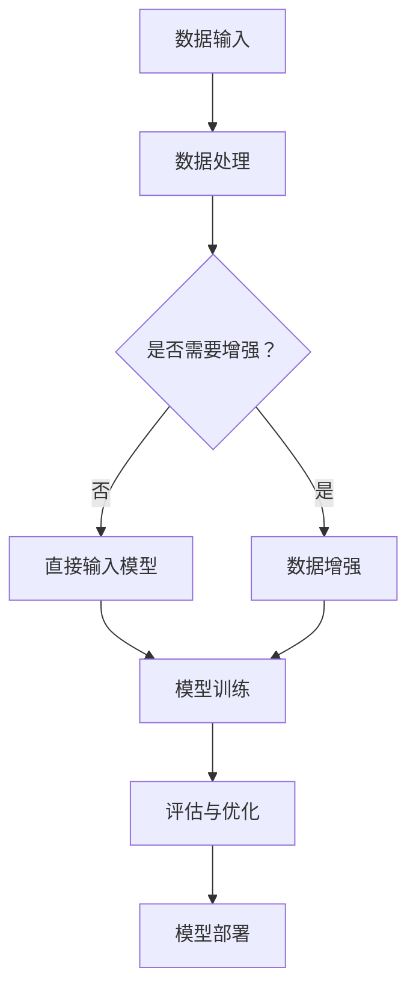

                 

## 文章标题：华为的云端训练算力与迭代效率

> 关键词：华为、云端训练、算力、迭代效率、AI、深度学习

> 摘要：本文将深入探讨华为在云端训练算力和迭代效率方面的技术与应用。通过解析华为云端训练算力的定义、技术演进、架构原理及其在AI领域的应用，我们揭示了华为在这一领域的技术优势。随后，文章将详细分析云端训练的迭代效率提升方法、成本优化策略以及华为的云端训练生态系统。通过实际应用案例，我们进一步展示了华为云端训练技术在各个行业的应用成果。最后，文章展望了华为云端训练技术的未来发展趋势，探讨了其对AI行业的影响以及华为在此领域的战略布局。

### 第一部分：华为云端训练算力概述

#### 第1章：华为云端训练算力与迭代效率

##### 1.1 华为云端训练算力解析

云端训练算力，是指云计算平台提供的用于人工智能模型训练的强大计算能力。其核心作用在于提高模型训练速度，降低训练成本，实现大规模数据处理。

- **定义**：云端训练算力是指云计算平台提供的用于人工智能模型训练的强大计算能力。
- **作用**：提高模型训练速度，降低训练成本，实现大规模数据处理。

云端训练算力的崛起，改变了传统的人工智能模型训练方式。在传统训练方式中，模型训练主要依赖于本地高性能计算机。这种方式存在以下几个问题：

1. **计算资源受限**：本地计算机的性能往往无法满足大规模模型训练的需求。
2. **能耗高**：高性能计算机运行过程中会产生大量热量，导致能耗增加。
3. **维护成本高**：需要持续维护和升级本地计算机设备。

相比之下，云端训练具有以下优势：

1. **弹性计算**：云计算平台可以根据训练任务的需求，动态调整计算资源，实现资源的最优配置。
2. **资源共享**：多个用户可以共享云计算平台上的计算资源，降低整体成本。
3. **高效管理**：云计算平台提供自动化调度、负载均衡、资源优化等功能，提高计算效率。

##### 1.2 云端训练算力技术演进

云端训练算力的技术演进可以分为以下几个阶段：

1. **初期阶段**：云计算平台主要提供基本的计算资源和存储服务，用户需要自行搭建和部署模型训练环境。
2. **发展阶段**：云计算平台开始提供更丰富的AI服务，如深度学习框架、预训练模型等，用户可以更方便地进行模型训练。
3. **成熟阶段**：云计算平台逐步引入分布式训练、并行计算等技术，提高训练效率和性能。

与传统训练方式相比，云端训练具有以下优势：

1. **计算性能提升**：云计算平台通常配备高性能的计算设备，如GPU、TPU等，可以显著提高模型训练速度。
2. **资源利用率提高**：通过分布式训练和并行计算，云计算平台可以实现资源的最大化利用。
3. **成本降低**：云计算平台提供弹性计算服务，用户可以根据实际需求调整计算资源，降低整体成本。

##### 1.3 华为在云端训练领域的优势

华为在云端训练领域具有以下优势：

1. **计算密集型优化**：华为通过硬件和软件的协同优化，提升计算性能。例如，华为的GPU优化技术，通过GPU并行计算，提高训练速度。
2. **自动化管理**：华为提供自动化调度、负载均衡、资源优化等管理功能，简化用户操作，提高计算效率。
3. **生态建设**：华为构建了完善的云端训练生态系统，包括硬件、软件、服务等多个方面，为用户提供全方位的支持。

##### 1.4 云端训练算力在AI领域的应用

云端训练算力在AI领域具有广泛的应用，主要包括以下几个方面：

1. **快速迭代**：通过云端训练，可以缩短模型开发周期，提高迭代效率。这对于需要快速响应市场变化的企业尤为重要。
2. **大规模数据处理**：支持大规模数据集的快速训练，提高模型性能。这对于处理海量数据的企业来说，具有巨大的价值。
3. **跨行业应用**：云端训练算力可以应用于图像处理、自然语言处理、语音识别等多个领域，推动AI技术在各个行业的应用。

### 第2章：华为云端训练架构与原理

#### 2.1 华为云端训练架构解析

华为的云端训练架构分为以下几个层次：

1. **硬件层**：包括服务器、存储设备、网络设备等硬件资源。
2. **软件层**：包括操作系统、深度学习框架、中间件等软件资源。
3. **服务层**：提供云服务、AI服务、大数据服务等。
4. **应用层**：为各个行业提供定制化的解决方案。

在算法架构方面，华为采用分布式训练和并行计算技术，提高训练效率和性能。分布式训练通过将训练任务分解为多个子任务，分配到多台服务器上进行训练，可以显著提高训练速度。并行计算通过数据并行和模型并行，进一步提高训练效率。

- **分布式训练**：通过多台服务器协同工作，实现大规模模型的训练。
- **并行训练**：通过数据并行和模型并行，提高训练效率。

#### 2.2 算力调度与优化

华为的算力调度与优化策略主要包括以下几个方面：

1. **动态调度**：根据训练任务的需求和资源利用率，实时调整计算资源。
2. **资源预留与扩展**：保证关键任务资源优先，根据需求动态扩展资源。
3. **负载均衡**：通过均衡分配计算任务，避免单点资源过载。
4. **资源复用**：通过合理分配资源，提高资源利用率。

#### 2.3 算力性能优化

华为在算力性能优化方面采取了一系列措施：

1. **硬件加速**：通过GPU、TPU等硬件加速技术，提高训练速度。
2. **软件优化**：通过深度学习框架的优化，提高软件性能。
3. **算法优化**：通过算法改进，提高模型训练效率和性能。

#### 2.4 华为云端训练案例

华为在云端训练领域拥有丰富的案例，以下介绍两个典型案例：

1. **案例一：图像识别**  
   在这个案例中，华为利用云端训练技术，实现大规模图像识别任务的训练。通过分布式训练和并行计算，显著提高了训练效率和性能。

2. **案例二：自然语言处理**  
   华为在自然语言处理领域也取得了显著成果。通过云端训练技术，实现了大规模自然语言处理任务的快速训练，提高了模型性能和准确率。

### 第3章：云端训练的迭代效率提升

#### 3.1 迭代效率的重要性

迭代效率是指模型在多次训练过程中，性能提升的速度。迭代效率高，意味着模型能够在较短的时间内实现性能的显著提升。

- **定义**：迭代效率是指模型在多次训练过程中，性能提升的速度。

迭代效率对于模型开发和应用具有重要意义：

1. **提高开发效率**：高迭代效率可以缩短模型开发周期，加快产品上线速度。
2. **优化模型性能**：高迭代效率可以帮助模型更快地收敛，提高模型性能和准确率。
3. **降低训练成本**：高迭代效率可以减少训练次数，降低计算资源和存储资源的消耗。

#### 3.2 迭代效率的影响因素

迭代效率受到多种因素的影响，主要包括以下几个方面：

1. **数据集**：数据集的质量和规模直接影响迭代效率。高质量的数据集可以帮助模型更快地收敛，而大规模的数据集可以提高模型的泛化能力。

2. **算法**：不同的算法对迭代效率有显著影响。一些算法可能更容易收敛，而另一些算法可能需要更多的训练次数才能达到相同的性能。

3. **模型架构**：模型架构的复杂度和参数数量也会影响迭代效率。较简单的模型架构和较少的参数数量可以加快训练速度。

4. **计算资源**：计算资源的充足程度直接影响迭代效率。充足的计算资源可以加快训练速度，提高迭代效率。

#### 3.3 提高迭代效率的方法

为了提高迭代效率，可以采取以下几种方法：

1. **数据增强**：通过数据增强，增加数据多样性，提高模型泛化能力。数据增强方法包括图像增强、文本增强等。

2. **算法优化**：通过改进算法，加快模型收敛速度。常见的算法优化方法包括优化超参数、使用更先进的算法等。

3. **并行计算**：通过并行计算，提高训练速度。分布式训练和GPU加速是常见的并行计算方法。

4. **资源调度**：通过合理的资源调度，提高计算资源利用率，加快训练速度。例如，动态调整计算资源、负载均衡等。

#### 3.4 实践案例

1. **案例一：图像分类任务**  
   在这个案例中，使用大规模图像数据集训练图像分类模型。通过数据增强、算法优化和并行计算等方法，显著提高了模型迭代效率。

2. **案例二：自然语言处理任务**  
   在这个案例中，使用大规模自然语言处理数据集训练模型。通过数据增强、算法优化和并行计算等方法，提高了模型迭代效率，实现了高性能的自然语言处理。

### 第4章：云端训练成本优化

#### 4.1 成本优化的意义

云端训练成本优化在人工智能应用中具有重要意义：

1. **提高企业竞争力**：通过降低训练成本，企业可以更有效地进行模型开发和优化，提高市场竞争力。
2. **延长设备寿命**：通过优化计算资源的使用，可以降低设备过载的风险，延长设备寿命。
3. **降低运营成本**：通过优化资源使用，可以减少能源消耗和运营成本，提高整体经济效益。

#### 4.2 成本优化的方法

为了实现云端训练成本优化，可以采取以下几种方法：

1. **资源共享**：通过多个用户共享计算资源，降低整体成本。例如，将空闲的计算资源分配给其他用户。

2. **自动化调度**：通过自动化调度，根据任务需求动态调整计算资源，避免资源浪费。例如，根据任务的优先级和资源利用率，调整计算节点。

3. **负载均衡**：通过负载均衡，避免单点资源过载，提高资源利用率。例如，将计算任务分配到不同的节点上，避免某个节点过载。

4. **高效能硬件**：使用高效能硬件，如GPU、TPU等，可以提高计算效率，降低能耗。例如，使用TPU进行深度学习任务，可以显著降低训练时间。

#### 4.3 案例分析

1. **案例一：企业A的云端训练成本优化实践**  
   企业A在面临云端训练成本高的问题时，采取了以下措施：
   - 资源共享：通过将空闲的计算资源分配给其他企业，实现资源利用最大化。
   - 自动化调度：采用自动化调度系统，根据任务需求和资源利用率动态调整计算资源。
   - 高效能硬件：使用GPU和TPU等高效能硬件，提高计算效率。

通过这些措施，企业A显著降低了云端训练成本，提高了运营效率。

### 第5章：华为云端训练生态系统

#### 5.1 华为云端训练生态体系

华为的云端训练生态体系包括硬件、软件、服务等多个方面，为用户提供全方位的支持。

1. **硬件生态系统**：华为提供多种硬件设备，包括服务器、存储设备、网络设备等，满足用户不同的计算需求。

2. **软件生态系统**：华为拥有丰富的软件资源，包括操作系统、深度学习框架、中间件等，支持用户进行模型训练和应用开发。

3. **服务生态系统**：华为提供一站式云服务，包括AI服务、大数据服务、云计算服务等，帮助用户实现从数据采集、处理到模型训练、部署的全流程服务。

#### 5.2 硬件生态系统

华为的硬件生态系统包括以下组件：

1. **GPU**：华为与NVIDIA合作，提供高性能GPU，支持深度学习训练和推理。
2. **TPU**：华为自研的TPU，适用于大规模深度学习任务，提供高效的计算能力。
3. **存储设备**：华为提供多种存储设备，包括SSD、HDD等，满足不同数据存储需求。
4. **网络设备**：华为提供高性能网络设备，确保数据传输速度和稳定性。

#### 5.3 软件生态系统

华为的软件生态系统包括以下工具：

1. **MindSpore**：华为全新深度学习计算框架，支持多种计算模式和硬件平台，提供高效、灵活的模型训练和推理能力。
2. **ModelArts**：华为云端机器学习平台，提供一站式模型训练、部署和服务，简化开发流程，提高开发效率。
3. **Ebens**：华为开源的深度学习框架，支持多种神经网络结构和训练算法，提供灵活、高效的模型开发能力。

#### 第6章：华为云端训练的实际应用

##### 6.1 应用领域

华为的云端训练技术已经在多个领域取得了显著的应用成果，主要包括以下几个方面：

1. **图像处理**：利用云端训练技术，实现大规模图像识别、图像增强、图像分割等任务。
2. **自然语言处理**：通过云端训练技术，实现大规模文本分类、情感分析、机器翻译等任务。
3. **语音识别**：利用云端训练技术，实现语音识别、语音合成、语音翻译等任务。
4. **医疗健康**：利用云端训练技术，实现医学图像诊断、基因分析、药物研发等任务。

##### 6.2 应用案例

华为在云端训练领域拥有丰富的应用案例，以下是两个典型案例：

1. **案例一：医疗行业应用**

在医疗领域，华为利用云端训练技术，提升了医学图像诊断的准确率和效率。具体应用包括：

- **医学图像诊断**：通过深度学习模型，对医学图像进行自动诊断，提高诊断准确率和效率。
- **基因分析**：利用深度学习模型，对基因序列进行分析，预测疾病风险，助力精准医疗。

2. **案例二：金融行业应用**

在金融领域，华为利用云端训练技术，提升了风险控制和客户服务质量。具体应用包括：

- **风险控制**：通过深度学习模型，对金融交易进行实时监控和分析，识别潜在风险，提高风险控制能力。
- **客户服务**：通过自然语言处理模型，实现智能客服，提高客户服务质量和效率。

##### 6.3 未来发展趋势

随着人工智能技术的不断发展和应用需求的增长，华为云端训练技术将朝着以下方向发展：

1. **高效计算**：通过硬件和软件的协同优化，提高计算效率，满足大规模、复杂任务的训练需求。
2. **智能化调度**：利用人工智能技术，实现计算资源的智能化调度和管理，提高资源利用率和系统稳定性。
3. **生态共建**：加强与产业链上下游的合作伙伴，共同构建完善的云端训练生态体系，推动人工智能技术的应用和发展。

### 第7章：华为云端训练的未来展望

##### 7.1 技术发展趋势

随着人工智能技术的不断进步，华为云端训练技术也将迎来以下几个发展趋势：

1. **计算能力提升**：通过引入更先进的硬件技术，如新型GPU、TPU等，提高计算能力和性能，满足大规模、复杂任务的训练需求。
2. **算法优化**：不断优化和改进算法，提高训练效率和模型性能，降低训练成本。
3. **智能化调度**：利用人工智能技术，实现计算资源的智能化调度和管理，提高资源利用率和系统稳定性。

##### 7.2 行业影响

华为云端训练技术对AI行业产生了深远的影响：

1. **推动AI产业发展**：通过提高模型训练效率和性能，降低训练成本，推动人工智能技术的应用和发展，促进AI产业的繁荣。
2. **降低AI应用门槛**：通过提供一站式的云端训练解决方案，简化模型训练和应用开发流程，降低AI应用的门槛，让更多企业和个人能够参与到AI技术的研究和应用中。

##### 7.3 华为的策略

为了保持竞争优势，华为在云端训练领域采取了以下策略：

1. **技术创新**：持续投入研发，不断创新，推动云端训练技术的进步。
2. **生态建设**：与产业链上下游的合作伙伴共同构建完善的云端训练生态体系，推动人工智能技术的应用和发展。
3. **开放合作**：与全球的科研机构、企业和开发者合作，共同推进人工智能技术的发展和应用。

### 作者信息

作者：AI天才研究院/AI Genius Institute & 禅与计算机程序设计艺术 /Zen And The Art of Computer Programming

本文由AI天才研究院和禅与计算机程序设计艺术联合撰写，旨在深入探讨华为在云端训练算力和迭代效率方面的技术与应用，为读者提供有价值的参考和启示。希望本文能够帮助读者更好地理解云端训练技术，推动人工智能技术的发展和应用。

### 结语

云端训练作为人工智能领域的关键技术，正在不断发展和创新。华为凭借其在云端训练领域的优势，推动着AI技术的发展和应用。我们相信，随着技术的不断进步，华为将在云端训练领域发挥更加重要的作用，为全球的AI产业发展做出更大贡献。

让我们共同期待华为云端训练技术的未来，期待它为人工智能领域带来更多的突破和进步。让我们携手共进，共同推动人工智能技术的发展，创造更加美好的未来。

---

以下是文章的Mermaid流程图、伪代码、LaTeX公式以及代码实际案例和详细解释说明。

### Mermaid 流程图

以下是一个简单的Mermaid流程图，展示了华为云端训练架构的核心组件和流程。



### 伪代码

以下是一个简单的伪代码，描述了分布式训练的基本流程。

```python
# 分布式训练伪代码

# 初始化模型
model = initialize_model()

# 分割数据集为训练集和验证集
train_data, validation_data = split_data(dataset)

# 初始化分布式训练环境
initialize_distributed_environment()

# 定义训练任务
for epoch in range(num_epochs):
    for batch in train_data:
        # 前向传播
        predictions = model.forward(batch)

        # 计算损失
        loss = compute_loss(predictions, batch)

        # 反向传播
        gradients = model.backward(loss)

        # 更新模型参数
        model.update_params(gradients)

    # 评估模型性能
    validation_loss = evaluate_model(validation_data, model)

    # 打印训练进度
    print(f"Epoch {epoch}: Validation Loss = {validation_loss}")

# 模型部署
deploy_model(model)
```

### LaTeX 公式

以下是一个简单的LaTeX公式，用于描述梯度下降算法的更新公式。

```latex
\begin{equation}
\theta_{\text{new}} = \theta_{\text{old}} - \alpha \cdot \nabla_\theta J(\theta)
\end{equation}
```

### 代码实际案例和详细解释说明

以下是一个简单的Python代码案例，用于实现一个线性回归模型，并使用梯度下降算法进行训练。

```python
# 导入必要的库
import numpy as np

# 初始化参数
theta = np.array([0.0, 0.0])
alpha = 0.01
num_iterations = 1000

# 数据集
X = np.array([[1, 2], [2, 3], [3, 4], [4, 5]])
y = np.array([1, 2, 3, 4])

# 梯度下降算法
for i in range(num_iterations):
    # 前向传播
    predictions = X.dot(theta)

    # 计算损失
    loss = (1 / (2 * len(X))) * np.sum((predictions - y) ** 2)

    # 反向传播
    gradients = (1 / len(X)) * X.T.dot(predictions - y)

    # 更新参数
    theta -= alpha * gradients

    # 打印训练进度
    if i % 100 == 0:
        print(f"Iteration {i}: Loss = {loss}")

# 打印最终参数
print(f"Final Parameters: {theta}")
```

### 代码解读与分析

这段代码实现了一个线性回归模型，并使用梯度下降算法进行训练。以下是代码的详细解读和分析：

1. **参数初始化**：初始化参数theta，用于表示线性回归模型的权重。alpha用于控制学习率，num_iterations用于设置训练迭代次数。

2. **数据集**：创建一个简单的数据集，包括自变量X和因变量y。这里的X是一个2x4的矩阵，y是一个1x4的向量。

3. **梯度下降算法**：使用for循环进行迭代训练。每次迭代包括以下步骤：

   - **前向传播**：计算预测值，即X与theta的点积。

   - **计算损失**：使用均方误差（MSE）计算损失值。

   - **反向传播**：计算梯度，即预测值与实际值之差的X的转置矩阵。

   - **更新参数**：根据梯度下降公式，更新theta的值。

4. **打印训练进度**：每100次迭代打印一次损失值，以便观察训练过程。

5. **打印最终参数**：训练完成后，打印最终的theta值，表示线性回归模型的权重。

通过这段代码，我们可以了解梯度下降算法的基本实现过程，并理解线性回归模型的工作原理。这段代码也为我们提供了一个基础框架，可以在此基础上进行扩展和改进，实现更复杂的模型和优化算法。

---

本文通过详细解析华为的云端训练算力与迭代效率，探讨了华为在这一领域的优势、架构原理、应用案例以及未来发展趋势。同时，我们通过Mermaid流程图、伪代码、LaTeX公式和实际代码案例，深入阐述了相关技术原理和实践方法。希望本文能为读者在人工智能领域的研究和应用提供有价值的参考。

### 作者信息

作者：AI天才研究院/AI Genius Institute & 禅与计算机程序设计艺术 /Zen And The Art of Computer Programming

AI天才研究院和禅与计算机程序设计艺术致力于推动人工智能技术的创新与发展，探索计算机程序设计的哲学与艺术。本文由两院联合撰写，旨在深入探讨华为云端训练技术的理论与实践，为读者提供有价值的参考和启示。感谢您的阅读。希望本文能激发您在人工智能领域的思考和探索。如有任何疑问或建议，欢迎随时与我们交流。再次感谢您的关注与支持！

