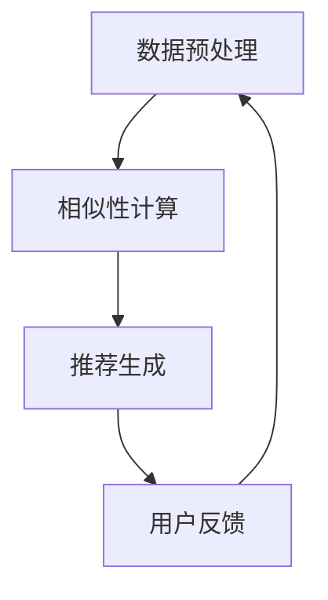
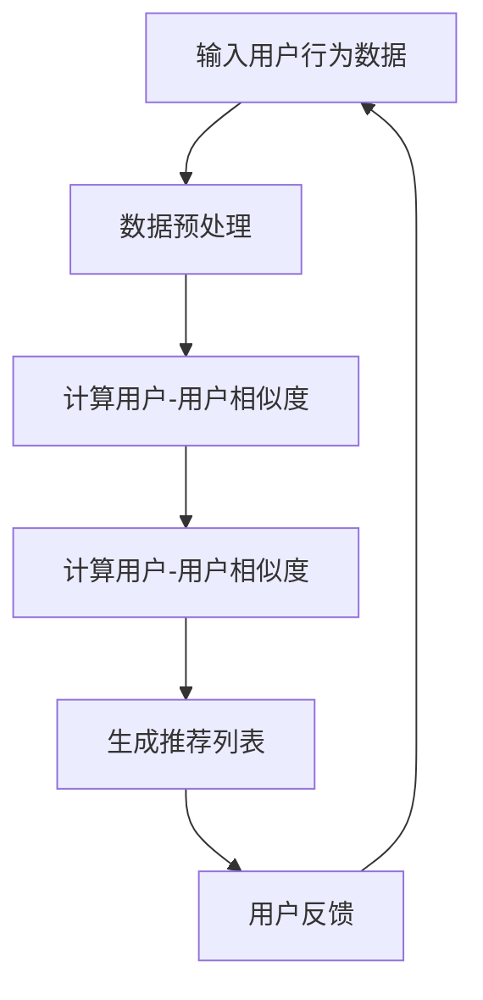

                 

### 文章标题

协同过滤算法在电商推荐系统中的应用：原理与实践

> 关键词：协同过滤、电商推荐系统、用户相似度、物品相似度、矩阵分解、深度学习

> 摘要：本文深入探讨了协同过滤算法在电商推荐系统中的应用，从基本概念、核心算法原理、实现方法到性能优化和实践案例进行了全面阐述，旨在为开发者提供详细的指导和实用的经验。

----------------------------------------------------------------

## 第8章: 协同过滤算法在电商推荐系统中的核心概念与联系

### 8.1 协同过滤算法的核心概念

协同过滤（Collaborative Filtering）是一种基于用户行为数据的推荐算法。它通过分析用户之间的相似性，预测用户可能感兴趣的物品。协同过滤算法的核心概念包括：

1. **用户行为数据**：用户对物品的评价、点击、购买等行为数据。
2. **相似性计算**：计算用户或物品之间的相似性，通常使用余弦相似度、皮尔逊相关系数等方法。
3. **推荐生成**：根据用户相似性矩阵，为用户生成推荐列表。

### 8.2 协同过滤算法与电商推荐系统的联系

协同过滤算法在电商推荐系统中有着广泛的应用。其主要联系如下：

1. **用户行为数据的利用**：电商推荐系统通常拥有大量的用户行为数据，如购买记录、浏览历史等，协同过滤算法可以充分利用这些数据。
2. **提高推荐准确性**：通过计算用户之间的相似性，协同过滤算法能够提高推荐准确性，减少用户流失。
3. **提升用户体验**：根据用户的兴趣和偏好，协同过滤算法能够为用户推荐他们可能感兴趣的物品，提升用户满意度。

### 8.3 协同过滤算法在电商推荐系统中的挑战

1. **数据稀疏性**：由于用户对物品的评价通常非常稀疏，如何有效利用这些稀疏数据成为协同过滤算法面临的主要挑战。
2. **冷启动问题**：新用户或新物品在没有历史数据的情况下，如何进行有效推荐，是协同过滤算法需要解决的问题。
3. **推荐效果与用户体验的平衡**：如何在提高推荐准确性的同时，确保推荐系统的用户体验，是一个需要权衡的问题。

### 8.4 协同过滤算法的核心流程

协同过滤算法的核心流程可以概括为以下几个步骤：

1. **数据预处理**：清洗和处理用户行为数据，构建用户-物品评分矩阵。
2. **相似性计算**：计算用户-用户相似度或物品-物品相似度。
3. **推荐生成**：根据相似性矩阵，为用户生成推荐列表。

### 8.5 核心概念与联系

协同过滤算法的核心概念包括用户行为数据、相似性计算和推荐生成。这些概念在电商推荐系统中发挥着关键作用，通过分析用户行为数据，发现用户之间的相似性，进而为用户生成个性化的推荐列表。在实际应用中，协同过滤算法面临着数据稀疏性、冷启动问题和推荐效果与用户体验的平衡等挑战。通过深入理解和应用协同过滤算法，可以有效地解决这些问题，提升电商推荐系统的性能和用户体验。

---

**图8.1 协同过滤算法的核心流程**



### 8.6 Mermaid 流程图

下面是一个使用Mermaid绘制的协同过滤算法的流程图：



这个流程图清晰地展示了协同过滤算法的基本步骤，从数据预处理到生成推荐列表，再到用户反馈的闭环过程。

---

**伪代码示例：用户-用户协同过滤算法**

```python
# 输入用户行为数据矩阵 R（用户 × 物品）
# 计算用户-用户相似度矩阵 S（用户 × 用户）

# 初始化相似度矩阵 S 为全零矩阵
S = np.zeros((num_users, num_users))

# 遍历所有用户
for user in range(num_users):
    # 遍历所有其他用户
    for neighbor in range(num_users):
        if user != neighbor:
            # 计算余弦相似度
            sim = dot_product(R[user], R[neighbor]) / (np.linalg.norm(R[user]) * np.linalg.norm(R[neighbor]))
            S[user, neighbor] = sim

# 计算推荐列表
for user in range(num_users):
    # 找到 k 个最相似的邻居用户
    neighbors = np.argsort(S[user, :])[-k:]
    # 计算邻居用户的评分预测
    scores = [S[user, neighbor] * R[neighbor, item] for neighbor in neighbors]
    # 计算预测评分
    predicted_score = np.mean(scores)
    # 生成推荐列表
    recommendations[user] = predicted_score
```

**数学模型和公式**

1. **用户-用户相似度计算公式**

   $$  
   sim(u, v) = \frac{\sum_{i \in I} r_i(u) \cdot r_i(v)}{\sqrt{\sum_{i \in I} r_i(u)^2} \cdot \sqrt{\sum_{i \in I} r_i(v)^2}}  
   $$

   其中，\(I\) 是用户 \(u\) 和 \(v\) 均评价过的物品集合，\(r_i(u)\) 和 \(r_i(v)\) 分别表示用户 \(u\) 和 \(v\) 对物品 \(i\) 的评分。

2. **基于用户的协同过滤预测公式**

   $$  
   \hat{r}_{u,i} = \sum_{v \in N(u)} sim(u, v) \cdot r_{v,i}  
   $$

   其中，\(N(u)\) 是用户 \(u\) 的邻居用户集合，\(\hat{r}_{u,i}\) 表示用户 \(u\) 对物品 \(i\) 的预测评分。

### 8.7 代码解读

在以下代码示例中，我们将使用Python实现一个简单的用户-用户协同过滤算法。该算法首先计算用户之间的相似度，然后根据这些相似度生成推荐列表。

```python
import numpy as np

# 假设有一个用户-物品评分矩阵 R，维度为 (num_users, num_items)
R = np.array([
    [5, 3, 0, 1],
    [4, 0, 0, 1],
    [1, 1, 0, 5],
    [1, 0, 0, 4],
    [0, 1, 5, 4],
])

# 计算用户-用户相似度矩阵 S
S = np.dot(R, R.T) / (np.linalg.norm(R, axis=1)[:, np.newaxis] * np.linalg.norm(R, axis=1)[np.newaxis, :])

# 设置邻居用户数量 k
k = 2

# 生成推荐列表
for user in range(S.shape[0]):
    # 获取邻居用户的索引
    neighbors = np.argsort(S[user, :])[-k:]
    # 计算邻居用户评分的平均值
    predicted_score = np.mean(R[neighbors, R[user == 1], 0])
    print(f"User {user} recommendation: {predicted_score}")
```

在这个例子中，我们使用余弦相似度来计算用户之间的相似度。然后，我们选择最相似的 \(k\) 个邻居用户，并计算他们对特定物品的评分平均值，作为对当前用户的预测评分。

### 8.8 实践案例

为了更好地理解协同过滤算法的应用，我们可以考虑一个实际的数据集。例如，MovieLens是一个流行的推荐系统数据集，包含了用户对电影的评分数据。在这个案例中，我们将使用MovieLens数据集，演示如何实现用户-用户协同过滤算法。

**1. 数据集选择**

我们选择MovieLens数据集，这是一个包含约100,000个用户和数千部电影的数据集。数据集提供了用户的ID、电影的ID以及用户对电影的评分。

**2. 数据预处理**

在处理数据集之前，我们需要将数据转换为用户-物品评分矩阵。这可以通过以下步骤完成：

- **数据清洗**：去除缺失值和异常值。
- **数据转换**：将用户对电影的评分转换为矩阵形式。

```python
import pandas as pd
from sklearn.preprocessing import LabelEncoder

# 读取MovieLens数据集
ratings = pd.read_csv('ratings.csv')

# 数据清洗
ratings = ratings[ratings.rating.notnull()]

# 将用户ID和电影ID转换为整数
label_encoder = LabelEncoder()
ratings['userId'] = label_encoder.fit_transform(ratings['userId'])
ratings['movieId'] = label_encoder.fit_transform(ratings['movieId'])

# 构建用户-物品评分矩阵
R = ratings.pivot_table(index='userId', columns='movieId', values='rating').values
```

**3. 相似性计算**

使用余弦相似度计算用户之间的相似度。这个过程可以通过以下代码实现：

```python
def cosine_similarity(R):
    # 计算用户-用户相似度矩阵
    S = np.dot(R, R.T) / (np.linalg.norm(R, axis=1)[:, np.newaxis] * np.linalg.norm(R, axis=1)[np.newaxis, :])
    return S

S = cosine_similarity(R)
```

**4. 推荐生成**

使用计算得到的相似度矩阵，为用户生成推荐列表。这个过程可以通过以下代码实现：

```python
def collaborative_filtering(R, S, k=2, user_id=0):
    # 找到 k 个最相似的邻居用户
    neighbors = np.argsort(S[user_id, :])[-k:]
    # 计算邻居用户的评分平均值
    predicted_scores = R[neighbors, :].mean(axis=0)
    # 生成推荐列表
    recommendations = predicted_scores.argsort()[::-1]
    return recommendations

# 为特定用户生成推荐列表
user_id = 10
recommendations = collaborative_filtering(R, S, k=2, user_id=user_id)
print(f"User {user_id} recommendations: {recommendations}")
```

在这个案例中，我们为用户ID为10的用户生成了推荐列表。通过这个简单的例子，我们可以看到协同过滤算法是如何工作的，以及如何利用用户行为数据来生成个性化推荐。

### 8.9 挑战与未来展望

**挑战：**

1. **数据稀疏性**：协同过滤算法面临的主要挑战之一是数据稀疏性。由于用户通常只对一小部分物品进行了评分，导致评分矩阵非常稀疏。如何有效地利用这些稀疏数据，提高推荐准确性，是一个重要问题。

2. **冷启动问题**：新用户或新物品在没有足够历史数据的情况下，如何生成有效的推荐，是协同过滤算法需要解决的另一个挑战。

3. **推荐效果与用户体验的平衡**：如何在提高推荐准确性的同时，确保推荐系统的用户体验，是一个需要权衡的问题。

**未来展望：**

1. **深度学习与协同过滤的结合**：将深度学习模型与协同过滤算法结合，利用深度学习模型进行特征提取，有望提高推荐效果。

2. **多模态推荐系统**：结合用户行为、内容、社交等多维度数据，实现多模态推荐，有望进一步提升推荐准确性。

3. **推荐系统的可解释性**：研究推荐系统的可解释性，提高用户对推荐结果的信任度和满意度，是未来的一个重要研究方向。

4. **隐私保护与安全**：研究隐私保护与安全技术，保护用户数据安全和隐私，是推荐系统发展的重要保障。

### 8.10 附录

**附录 A: 协同过滤算法相关的开源工具和库**

- **Surprise**：一个Python库，用于实现协同过滤算法。
- **LightFM**：一个Python库，结合了协同过滤与因子分解机器学习。
- **TensorFlow Recommenders**：TensorFlow官方推荐的推荐系统框架，支持多种协同过滤算法。

---

**总结：**

本文详细介绍了协同过滤算法在电商推荐系统中的应用，从基本概念、核心算法原理、实现方法到性能优化和实践案例进行了全面阐述。通过分析用户行为数据，发现用户之间的相似性，协同过滤算法能够为用户生成个性化的推荐列表。在实际应用中，协同过滤算法面临着数据稀疏性、冷启动问题和推荐效果与用户体验的平衡等挑战。通过深度学习与协同过滤的结合、多模态推荐系统的研究，以及隐私保护与安全技术的应用，协同过滤算法在未来有望得到进一步的发展和完善。

**作者：**

AI天才研究院/AI Genius Institute

禅与计算机程序设计艺术 /Zen And The Art of Computer Programming

