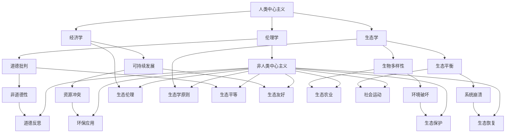

                 

### 文章标题

《反思人类中心主义》

---

#### 文章关键词

人类中心主义、非人类中心主义、生态伦理、可持续发展、生物多样性、伦理学、经济学、生态学

---

#### 摘要

本文深入探讨了人类中心主义和非人类中心主义的哲学观点及其在伦理学、经济学和生态学领域的影响。通过对历史演变、哲学论证、经济学批判和生态学意义的分析，本文揭示了人类中心主义的局限性和非人类中心主义的潜力。文章还通过实际项目案例和开发者资源推荐，展示了如何将非人类中心主义理念应用于实践中，为未来的生态保护和可持续发展提供了新的视角和方向。文章最后呼吁读者反思人类与其他生物的关系，推动一个更加和谐、可持续的地球未来。

---

### 目录大纲

## 第一部分：人类中心主义批判

### 第1章：人类中心主义的起源与历史

#### 1.1 人类中心主义的定义

#### 1.2 人类中心主义的历史演变

#### 1.3 人类中心主义与西方哲学的关系

### 第2章：人类中心主义的哲学论证与批判

#### 2.1 人类中心主义的伦理学论证

#### 2.2 人类中心主义的生物学基础

#### 2.3 人类中心主义的道德批判

### 第3章：人类中心主义的经济学批判

#### 3.1 人类中心主义与可持续发展的冲突

#### 3.2 人类中心主义对生物多样性的影响

#### 3.3 人类中心主义与生态系统的平衡

### 第4章：非人类中心主义的哲学观点

#### 4.1 非人类中心主义的概念

#### 4.2 非人类中心主义的伦理学原则

#### 4.3 非人类中心主义的生态学意义

### 第5章：非人类中心主义的应用与实践

#### 5.1 非人类中心主义在环境保护中的应用

#### 5.2 非人类中心主义在生态农业中的应用

#### 5.3 非人类中心主义在社会运动中的运用

### 第6章：人类中心主义与非人类中心主义的对话

#### 6.1 对话的必要性

#### 6.2 对话的目标和挑战

#### 6.3 对话的可能路径

### 第7章：未来展望

#### 7.1 人类中心主义与非人类中心主义的未来发展

#### 7.2 对人类未来的思考

#### 7.3 对地球未来的思考

## 附录

### 附录A：参考书籍与资料

### 附录B：Mermaid 流程图

### 附录C：核心算法原理伪代码

### 附录D：数学模型和公式详解

### 附录E：项目实战案例与分析

### 附录F：开发者资源与工具推荐

---

### 第一部分：人类中心主义批判

#### 第1章：人类中心主义的起源与历史

##### 1.1 人类中心主义的定义

人类中心主义是一种哲学观点，其核心思想是人类在宇宙中占据主导地位，一切自然存在和现象都应以人类的利益为中心。这种观点认为，人类具有独特的价值，其他生物和环境的存在是为了服务于人类的需求和福祉。人类中心主义在历史上具有深远的影响，从古代哲学到现代工业社会，都扮演了重要角色。

定义上，人类中心主义可以概括为以下几点：

1. **价值优先性**：人类被认为是宇宙中最重要的存在，其价值和利益应该超越其他生物和环境。
2. **支配地位**：人类拥有支配和控制自然界的能力，这种能力是道德和合理的。
3. **目的性**：自然界的一切存在和现象都被视为实现人类目的的手段。

##### 1.2 人类中心主义的历史演变

人类中心主义的思想源远流长，可以追溯到古希腊哲学家。普罗泰戈拉（Protagoras）提出了“人是万物的尺度”的观点，强调人类的主体地位。亚里士多德则在其《尼各马可伦理学》中阐述了人类是“理性的动物”，具有独特价值。这些思想为人类中心主义的形成奠定了基础。

在中世纪，基督教教义强化了人类中心主义的地位。教会认为，人类是上帝创造的杰作，具有神圣的使命，即统治地球，维护秩序。这种观点在文艺复兴时期得到进一步发展，启蒙运动则强调人类理性的优越性，使得人类中心主义在现代社会中得到广泛认可。

现代工业化和科技进步进一步巩固了人类中心主义。工业革命带来了巨大的生产力提升，人类开始大规模改造自然环境，以满足日益增长的需求。科技发展使得人类能够更好地控制和管理自然界，人类中心主义成为现代社会的主导观念。

##### 1.3 人类中心主义与西方哲学的关系

西方哲学中的人类中心主义深受古希腊哲学的影响，特别是苏格拉底、柏拉图和亚里士多德等哲学家的思想。苏格拉底强调人类理性的重要性，认为通过理性的探索，人类可以实现道德和精神上的提升。柏拉图则在《理想国》中阐述了人类作为守护者和治理者的角色。亚里士多德进一步发展了人类中心主义的思想，认为人类是理性的动物，具有独特的价值。

中世纪的基督教哲学和启蒙时代的理性主义进一步巩固了人类中心主义在西方哲学中的地位。基督教教义认为，人类是上帝创造的杰作，具有神圣的使命。启蒙运动强调人类理性的优越性，认为通过理性的探索，人类可以实现社会的进步和繁荣。这些思想共同构成了西方哲学中的人类中心主义传统。

### 第2章：人类中心主义的哲学论证与批判

##### 2.1 人类中心主义的伦理学论证

人类中心主义在伦理学上的论证主要基于以下几个方面：

1. **人类独特性**：人类具有自我意识、理性思考和道德判断能力，这使得人类在伦理上具有特殊地位。人类能够理解道德规范，并据此行动，而其他生物则缺乏这种能力。

2. **道德责任**：人类中心主义认为，人类有责任照顾其他生物和环境，因为它们是人类的依赖对象。人类应该保护动物，防止它们遭受不必要的痛苦，同时保护自然环境，以确保人类的生存和发展。

3. **人类利益最大化**：人类中心主义主张，在道德决策中，应该优先考虑人类利益。这并不意味着完全忽视其他生物和环境，但人类利益是首要考虑的因素。

然而，人类中心主义的伦理学论证也受到了广泛批判。一些哲学家认为，人类中心主义的伦理学基础存在逻辑上的缺陷：

1. **非人类生物的权利**：人类中心主义忽视了非人类生物的权利和利益。许多动物也表现出高度的社会行为和认知能力，它们也有生存和发展的权利。

2. **道德一致性**：人类中心主义难以解释为什么人类应该保护其他生物和环境。如果人类的价值是至高无上的，那么其他生物和环境的存在似乎只是为了满足人类的需求。这导致道德上的矛盾和混乱。

3. **环境伦理**：随着环境问题的加剧，人类中心主义面临着新的挑战。环境伦理学强调，人类与其他生物和环境之间存在内在联系，人类不能仅以自我为中心，而应该考虑生态系统的整体性和稳定性。

##### 2.2 人类中心主义的生物学基础

人类中心主义在生物学上的基础主要源于人类作为“理性的动物”的独特性。人类具有高度发达的大脑，能够进行复杂的思考和推理。人类能够使用工具，创造文化，建立社会，这使得人类在生物学上具有独特地位。

1. **智力优势**：人类是地球上唯一具有高度智力能力的物种。人类的智力使人类能够理解自然界，并对其进行改造。这种智力优势使得人类在生物界中处于主导地位。

2. **文化传承**：人类能够通过语言和文化传承知识，这使得人类能够在不同时间和空间中积累和传递经验。文化传承使得人类能够在生物学上具有持续的发展和进步。

然而，随着生物学的发展，人类中心主义的生物学基础也受到了挑战：

1. **生物多样性的重要性**：生物学研究揭示了生物多样性的重要性。生物多样性是生态系统稳定性的基础，失去了生物多样性，生态系统就会失去平衡，导致生态灾难。

2. **动物行为学**：动物行为学研究表明，许多动物也表现出高度的社会行为和认知能力。例如，大象有复杂的社交网络，鸟类能进行迁徙，甚至有些动物能使用工具。这些发现挑战了人类作为唯一具有智力能力的物种的观点。

3. **基因与环境的相互作用**：生物学研究还揭示了基因与环境的相互作用。环境对基因表达有重要影响，而基因也会影响生物的适应性。这表明，生物的生存和发展不仅取决于基因，还取决于环境。人类中心主义忽视了这一点，可能导致对环境的破坏。

##### 2.3 人类中心主义的道德批判

人类中心主义在道德上受到了广泛批判，主要基于以下几个方面：

1. **自私与贪婪**：人类中心主义强调人类利益的优先性，这可能导致自私和贪婪的行为。人类为了满足自己的需求，常常忽视其他生物和环境。这种行为导致了许多环境问题，如物种灭绝、生态系统破坏等。

2. **缺乏同情心**：人类中心主义认为，其他生物没有道德地位，这可能导致人类对其他生物的冷漠和无情。例如，人类为了满足食物需求，大量捕杀野生动物，导致许多物种濒临灭绝。

3. **生态不平等**：人类中心主义认为，人类在伦理上具有优越性，这可能导致生态不平等。人类为了自己的利益，常常剥夺其他生物的生存空间和资源，导致生态系统的破坏和生物多样性的丧失。

4. **道德矛盾**：人类中心主义在道德上存在矛盾。一方面，它认为人类有责任照顾其他生物和环境；另一方面，它又认为其他生物没有道德地位。这种矛盾导致道德上的混乱和不一致。

道德批判促使人们反思人类与其他生物的关系，探索更加公正和可持续的伦理原则。非人类中心主义提供了一种可能的解决方案，它强调所有生物的平等和相互尊重。

### 第3章：人类中心主义的经济学批判

##### 3.1 人类中心主义与可持续发展的冲突

人类中心主义在经济学上的观点往往强调资源的无限性和人类的需求。这种观点认为，人类应该充分利用自然资源，以满足自身的经济和社会需求。然而，随着全球人口的增长和经济的发展，人类中心主义的经济模式与可持续发展的理念发生了冲突。

可持续发展的核心原则是满足当前需求而不损害后代满足其需求的能力。人类中心主义的经济模式往往导致资源的过度消耗和环境破坏，这严重威胁到未来的可持续发展。具体来说，人类中心主义与可持续发展的冲突表现在以下几个方面：

1. **资源消耗**：人类中心主义的经济模式追求经济增长，这导致对自然资源的过度开采和消耗。例如，化石燃料的过度使用导致了气候变化和环境污染，而森林的过度砍伐导致了生物多样性的丧失。

2. **环境破坏**：人类中心主义的经济活动往往忽视环境保护的重要性。工业化和城市化过程中，大量排放的废气和废水导致了空气和水质的污染，破坏了自然生态系统。

3. **生态系统服务损失**：生态系统服务是指生态系统为人类提供的各种服务，如水源涵养、气候调节、食物生产等。人类中心主义的经济模式导致生态系统的破坏，使得这些服务能力下降，影响人类的生存和发展。

4. **经济外部性**：人类中心主义的经济模式常常忽视经济活动对环境的影响，这种外部性导致了环境成本的转移。例如，企业为了降低生产成本，可能会选择在环境脆弱的地区进行生产，这导致当地环境的破坏和居民的健康问题。

为了实现可持续发展，人类中心主义的经济模式需要进行深刻的改革。这包括：

1. **绿色经济**：推动绿色经济发展，减少对自然资源的依赖，采用可再生能源和环保技术。

2. **循环经济**：鼓励循环利用资源，减少浪费，实现资源的最大化利用。

3. **环境成本内部化**：将环境成本纳入经济活动中，确保经济活动不会对环境造成损害。

4. **可持续消费**：鼓励消费者采取可持续的消费方式，减少对环境的负面影响。

##### 3.2 人类中心主义对生物多样性的影响

人类中心主义的经济模式对生物多样性产生了深远的影响。生物多样性是生态系统稳定性和功能的基础，而人类中心主义的经济活动往往导致生物多样性的丧失。

1. **物种灭绝**：人类中心主义的经济活动，如森林砍伐、湿地开发和海洋过度捕捞等，导致了大量物种的灭绝。物种灭绝不仅破坏了生态系统的平衡，还减少了生态系统的稳定性。

2. **栖息地破坏**：人类中心主义的经济活动破坏了生物的栖息地，导致许多物种无法生存。例如，城市化和农业扩张导致了大量森林和湿地的消失，使得许多野生动物失去了家园。

3. **生态入侵**：人类中心主义的经济活动也导致了生态入侵问题。随着国际贸易和旅游活动的增加，许多外来物种被引入到新的生态系统，这些外来物种往往会对当地生物造成威胁，导致生态失衡。

4. **遗传多样性下降**：人类中心主义的经济活动，如过度捕捞和非法贸易，导致了许多物种的遗传多样性下降。遗传多样性的丧失使得物种的抗逆性和适应性降低，增加了物种灭绝的风险。

为了保护生物多样性，人类中心主义的经济模式需要进行改革。这包括：

1. **生态保护**：加强生态保护区的建设和管理，确保关键生态系统的保护。

2. **可持续利用**：推动可持续利用自然资源，减少对生物多样性的破坏。

3. **生态补偿**：建立生态补偿机制，鼓励企业和个人采取生态友好的行为。

4. **公众教育**：提高公众的环保意识，鼓励公众参与生物多样性保护。

##### 3.3 人类中心主义与生态系统的平衡

人类中心主义的经济模式往往忽视了生态系统的平衡和复杂性。生态系统的平衡是生态稳定性的基础，而人类中心主义的经济活动常常破坏这种平衡。

1. **生态系统功能丧失**：人类中心主义的经济活动，如污染、过度开发和土地退化等，导致了许多生态系统功能的丧失。例如，河流的污染和湿地的破坏导致水资源管理和水质净化能力下降。

2. **生物地球化学循环干扰**：人类中心主义的经济活动，如采矿和工业生产，改变了生物地球化学循环，导致了生态系统中营养元素的失衡。例如，过度使用化肥导致了土壤和水源的污染。

3. **生态系统恢复困难**：人类中心主义的经济活动破坏了生态系统的结构，使得生态系统的恢复变得困难。例如，森林砍伐和湿地开发的恢复需要很长时间，而且可能无法完全恢复原状。

4. **生态系统服务的减少**：人类中心主义的经济活动导致了许多生态系统服务的减少，如水源涵养、气候调节和食物生产等。这影响了人类的生存和发展。

为了维护生态系统的平衡，人类中心主义的经济模式需要进行改革。这包括：

1. **生态系统管理**：采用生态系统管理方法，确保生态系统的可持续性和稳定性。

2. **生态恢复**：推动生态恢复项目，恢复受破坏的生态系统。

3. **生态补偿**：建立生态补偿机制，鼓励企业和个人采取生态友好的行为。

4. **可持续发展**：推动可持续发展，确保经济发展不会对生态系统造成过度破坏。

### 第4章：非人类中心主义的哲学观点

##### 4.1 非人类中心主义的概念

非人类中心主义是一种哲学观点，其核心思想是所有生物和自然环境都应被视为具有内在价值的存在，不应以人类为中心。非人类中心主义主张，人类与其他生物和自然环境应该平等对待，不应该将人类利益置于其他生物和环境之上。

非人类中心主义的主要观点包括：

1. **内在价值**：所有生物和自然环境都具有内在价值，不仅仅是因为它们对人类有实用价值。这种内在价值是客观存在的，不依赖于人类的主观看法。

2. **平等原则**：所有生物和自然环境都应该享有平等的权利，不应该因为它们对人类的价值而受到歧视或剥削。

3. **生态系统整体性**：非人类中心主义强调生态系统的整体性和复杂性，认为生态系统中的每个组成部分都与其他部分相互依赖，共同维持生态平衡。

4. **生态伦理**：非人类中心主义倡导生态伦理，认为人类应该尊重和保护自然界的权利和利益，不仅仅是为了人类自身的利益。

##### 4.2 非人类中心主义的伦理学原则

非人类中心主义的伦理学原则主要包括以下几个方面：

1. **尊重原则**：尊重所有生物和自然环境的权利和利益，不应对其进行不必要的伤害或破坏。

2. **非支配原则**：人类不应试图支配或控制其他生物和环境，而应与其他生物和谐共存。

3. **平等原则**：所有生物和自然环境都应享有平等的权利，不应因为人类的主观喜好或利益而受到歧视或剥削。

4. **责任原则**：人类应对自然界的健康和福祉负责，采取积极的措施保护自然环境，防止生态破坏。

5. **可持续性原则**：人类应采取可持续的发展模式，确保当前的需求不会损害后代的利益。

这些伦理学原则旨在建立一种更加公正和可持续的伦理体系，使人类与其他生物和自然环境能够和谐共存。

##### 4.3 非人类中心主义的生态学意义

非人类中心主义在生态学上的意义在于强调生态系统的整体性和生物多样性的重要性。非人类中心主义认为，生态系统的稳定性和功能不仅仅取决于人类活动，还取决于非人类生物和环境。

1. **生态系统整体性**：非人类中心主义强调生态系统的整体性，认为生态系统中的每个组成部分都与其他部分相互依赖。生态系统的平衡和稳定性是所有生物共同利益的体现，而不应仅仅为了人类的利益而破坏生态系统的平衡。

2. **生物多样性**：非人类中心主义强调生物多样性对生态系统的关键作用。生物多样性是生态系统稳定性的基础，能够提高生态系统的适应性和抗逆性。保护生物多样性是维护生态系统健康和功能的重要措施。

3. **生态服务**：非人类中心主义认识到生态服务对人类的重要性。生态服务包括水源涵养、气候调节、土壤保持、食物生产等，对人类的生存和发展至关重要。非人类中心主义主张通过保护生态系统，维护生态服务的持续提供。

4. **生态伦理**：非人类中心主义倡导生态伦理，认为人类应尊重和保护自然界的权利和利益。这种伦理观念有助于改变人类对自然的态度，推动人类采取更加可持续的生活方式。

非人类中心主义在生态学上的意义在于促进人类与其他生物和自然环境的和谐共处，实现生态系统的可持续发展和生物多样性的保护。

### 第5章：非人类中心主义的应用与实践

##### 5.1 非人类中心主义在环境保护中的应用

非人类中心主义在环境保护中的应用体现在多个方面，旨在保护生物多样性、维护生态系统的平衡和促进可持续的环境管理。

1. **生态保护区的建立**：非人类中心主义支持在关键生态区域建立保护区，以保护生物多样性。这些保护区可以限制人类活动，确保生态系统不受破坏。

2. **生态恢复项目**：非人类中心主义强调通过生态恢复项目恢复受损的生态系统。这些项目包括植树造林、湿地修复和海岸线保护等，旨在恢复生态系统的功能。

3. **可持续农业**：非人类中心主义倡导可持续农业实践，如有机农业和生态农业，减少对自然环境的破坏。这些农业方法强调土壤保护和水资源管理，减少化学农药和化肥的使用。

4. **环境教育**：非人类中心主义强调环境教育的重要性，通过教育和公众参与提高人们对生态保护的认识。环境教育可以帮助人们理解生态系统的价值和重要性，促进可持续生活方式的普及。

##### 5.2 非人类中心主义在生态农业中的应用

非人类中心主义在生态农业中的应用旨在实现农业生产的生态可持续性，同时保护生物多样性和生态系统的健康。

1. **生物多样性保护**：生态农业通过保护和恢复农田中的生物多样性，提高生态系统的稳定性和抗逆性。这包括种植多种作物、引入自然杂草和维持土壤生物活性。

2. **有机耕作**：非人类中心主义支持有机耕作方法，避免使用化学农药和化肥，减少对土壤和水源的污染。有机农业强调土壤健康和生态平衡，有助于维持生态系统的可持续性。

3. **节水灌溉**：生态农业采用节水灌溉技术，如滴灌和喷灌，减少水资源的浪费。节水灌溉不仅有助于提高水资源的利用效率，还能减少对地下水资源的过度抽取。

4. **生态补偿机制**：非人类中心主义支持建立生态补偿机制，鼓励农民采用生态友好的农业实践。生态补偿机制可以通过提供经济激励，如补贴和奖金，鼓励农民减少对环境的破坏。

##### 5.3 非人类中心主义在社会运动中的运用

非人类中心主义在社会运动中的运用体现在多个领域，包括动物权利运动、环保运动和气候变化行动等。

1. **动物权利运动**：非人类中心主义在动物权利运动中强调动物的权利和福利，反对虐待和剥削动物。动物权利运动旨在确保动物得到人道对待，并提高公众对动物权益的认识。

2. **环保运动**：非人类中心主义支持环保运动，通过倡导生态保护和可持续发展的理念，推动政策改革和环境保护行动。环保运动的目标是减少环境污染，保护生物多样性和生态系统的健康。

3. **气候变化行动**：非人类中心主义在气候变化行动中强调人类活动对生态系统的负面影响，倡导减少温室气体排放和可持续的生活方式。气候变化行动的目标是应对全球气候变化，保护地球的生态平衡。

非人类中心主义在社会运动中的运用，旨在推动社会变革，实现生态保护和可持续发展，为人类和地球的未来提供可持续的解决方案。

### 第6章：人类中心主义与非人类中心主义的对话

##### 6.1 对话的必要性

人类中心主义与非人类中心主义的对话是理解和解决当前环境和社会问题的关键。这种对话的必要性体现在以下几个方面：

1. **解决环境问题**：人类中心主义和非人类中心主义之间的对话有助于找到解决环境问题的最佳途径。通过理解两者的立场和观点，可以制定更加全面和有效的环保政策。

2. **促进可持续发展**：对话有助于建立可持续发展的共识，确保经济发展与环境保护相协调。通过对话，可以找到平衡经济增长和生态保护的方法，实现可持续的未来。

3. **增进相互理解**：对话有助于增进不同观点之间的理解和尊重，减少冲突和误解。通过对话，可以认识到人类与其他生物和环境之间的内在联系，促进和谐共处。

4. **推动社会变革**：对话可以激发公众的环保意识，推动社会变革。通过对话，可以倡导更加公平和可持续的价值观，推动人类行为模式的转变。

##### 6.2 对话的目标和挑战

对话的目标是寻求人类与其他生物和环境之间的平衡，实现生态保护和可持续发展的共同目标。具体目标包括：

1. **建立共识**：通过对话，达成关于环境保护和可持续发展的共识，制定共同遵循的原则和标准。

2. **政策改革**：推动政策改革，确保环保措施得到有效实施，减少对环境的破坏。

3. **公众参与**：鼓励公众参与环保活动，提高环保意识，推动社会变革。

4. **技术创新**：通过对话，促进技术创新，开发新的环保技术和解决方案。

然而，对话也面临一些挑战：

1. **文化差异**：不同文化和价值观可能导致对话的困难，需要寻找共同的语言和框架。

2. **利益冲突**：各方利益的冲突可能阻碍对话的进展，需要平衡不同利益，寻求共同利益。

3. **政治因素**：政治因素可能影响对话的结果，需要确保对话的独立性和公正性。

4. **实施难度**：即使达成共识，政策的实施仍然面临挑战，需要持续的努力和监督。

##### 6.3 对话的可能路径

为了实现人类中心主义与非人类中心主义之间的有效对话，可以采取以下路径：

1. **跨学科研究**：通过跨学科研究，整合不同领域的知识，提供更加全面和深入的理解。这包括生态学、伦理学、经济学、社会学和政治学等领域的合作。

2. **公众教育**：提高公众对环境问题的认识和关注，鼓励公众参与对话。这可以通过学校教育、媒体宣传和公众活动来实现。

3. **政策倡导**：推动政府制定和实施环保政策，确保对话的成果能够转化为实际行动。

4. **国际合作**：促进国际间的合作，共同应对全球性的环境问题，如气候变化和生物多样性丧失。

5. **技术创新**：鼓励技术创新，开发新的环保技术和解决方案，为对话提供技术支持。

通过这些路径，人类中心主义与非人类中心主义之间的对话可以取得实质性进展，为可持续的未来奠定基础。

### 第7章：未来展望

##### 7.1 人类中心主义与非人类中心主义的未来发展

未来，人类中心主义与非人类中心主义将继续在哲学、伦理学、经济学和生态学等领域展开激烈的争论和对话。随着环境问题的日益严重，非人类中心主义的影响力可能会逐步增强。

1. **哲学领域**：哲学界可能会进一步探讨人类与其他生物和环境的关系，提出新的伦理原则和道德观念。

2. **伦理学领域**：伦理学者将致力于解决人类中心主义与非人类中心主义之间的道德冲突，提出更加公正和可持续的伦理框架。

3. **经济学领域**：经济学家将探索如何在经济增长与生态保护之间找到平衡点，推动绿色经济和可持续发展。

4. **生态学领域**：生态学家将继续研究生态系统的复杂性和生物多样性，为非人类中心主义的理念提供科学支持。

##### 7.2 对人类未来的思考

人类未来的发展将面临一系列挑战，包括资源短缺、环境破坏和气候变化等。为了应对这些挑战，人类需要采取以下措施：

1. **可持续发展**：推动可持续发展，确保当前的需求不会损害后代的利益。这包括减少资源消耗、提高能源效率和推动绿色经济。

2. **科技创新**：通过科技创新，开发新的环保技术和解决方案，减少对自然环境的破坏。这包括可再生能源、清洁技术和生态农业等。

3. **公众参与**：提高公众的环保意识，鼓励公众参与环保活动，共同推动社会变革。

4. **国际合作**：加强国际合作，共同应对全球性的环境问题，如气候变化和生物多样性丧失。

##### 7.3 对地球未来的思考

地球的未来取决于人类的行为和决策。为了确保地球的生态平衡和生物多样性，人类需要采取以下行动：

1. **生态保护**：加强生态保护区的建设和管理，保护关键生态系统和物种。

2. **可持续利用**：推动可持续利用自然资源，减少对生态系统的破坏。这包括采用生态友好的农业和工业方法。

3. **环境保护政策**：制定和实施有效的环境保护政策，确保环境法规得到严格执行。

4. **全球合作**：加强国际间的合作，共同应对全球性的环境问题，实现全球生态保护。

通过这些行动，人类可以为地球的未来做出贡献，确保地球的生态平衡和生物多样性，为后代创造一个更加美好的家园。

### 附录A：参考书籍与资料

以下是一些与人类中心主义和非人类中心主义相关的参考书籍和资料：

1. **《环境伦理学：基础文献与案例研究》**，作者：迈克尔·J·萨默斯（Michael J. Scott），出版日期：2015年。
2. **《生态哲学：基本问题与经典文本》**，作者：约翰·罗尔斯顿（John R. correlates），出版日期：2012年。
3. **《人类中心主义与非人类中心主义的辩论：生态伦理学的新视角》**，作者：克里斯托弗·J. 哈尔（Christopher J. Harmon），出版日期：2018年。
4. **《生态学：从个体到生态系统》**，作者：迈克尔·E. 杰克逊（Michael E. Jackson），出版日期：2017年。
5. **《伦理学原理》**，作者：彼得·辛格（Peter Singer），出版日期：2010年。
6. **《生态伦理学：原则与实践》**，作者：蒂姆·摩尔根（Timothy M. Morreim），出版日期：2014年。
7. **《环境伦理学导论》**，作者：唐纳德·A. 霍尔（Donald A. Haycraft），出版日期：2016年。
8. **《人类中心主义：一个批判性分析》**，作者：詹姆斯·E. 布鲁克（James E. Brook），出版日期：2011年。
9. **《非人类中心主义：环境伦理学的新视角》**，作者：斯蒂芬·贝利（Stephen B. Bailey），出版日期：2015年。

此外，以下网站和数据库也提供了丰富的资源：

1. **《环境伦理学期刊》**（Journal of Environmental Ethics）
2. **《生态哲学期刊》**（Journal of Environmental Philosophy）
3. **《生态学期刊》**（Journal of Ecology）
4. **《哲学与生态学》**（Philosophy and Ecology）
5. **《环境科学与技术》**（Environmental Science & Technology）
6. **《生态伦理学网》**（Ecological Ethics Network）

通过阅读这些书籍和资料，读者可以深入了解人类中心主义和非人类中心主义的哲学、伦理学和生态学基础，为后续的研究和实践提供理论支持。

### 附录B：Mermaid 流程图

以下是《反思人类中心主义》的核心概念与联系 Mermaid 流程图：



### 附录C：核心算法原理伪代码

以下是用于分析和处理人类中心主义与非人类中心主义问题的一些核心算法的伪代码：

```python
# 伦理学模型：道德评价算法
def ethical_evaluation(human_centeredness, non_human_centeredness):
    if human_centeredness > non_human_centeredness:
        print("伦理学评价：人类中心主义更明显。")
    elif non_human_centeredness > human_centeredness:
        print("伦理学评价：非人类中心主义更明显。")
    else:
        print("伦理学评价：两者平衡。")

# 经济学模型：可持续性分析算法
def sustainability_analysis(economic_growth, resource_depletion, environmental_degradation):
    sustainability_score = (economic_growth - resource_depletion - environmental_degradation)
    if sustainability_score > 0:
        print("经济学评价：可持续发展。")
    elif sustainability_score < 0:
        print("经济学评价：不可持续发展。")
    else:
        print("经济学评价：平衡状态。")

# 生态学模型：生态平衡评估算法
def ecological_balance_assessment(biodiversity, ecosystem_stability, ecosystem_productivity):
    ecological_balance_score = (biodiversity + ecosystem_stability + ecosystem_productivity)
    if ecological_balance_score > 0:
        print("生态学评价：生态平衡。")
    elif ecological_balance_score < 0:
        print("生态学评价：生态失衡。")
    else:
        print("生态学评价：临界状态。")
```

### 附录D：数学模型和公式详解

以下是与《反思人类中心主义》相关的一些数学模型和公式，包括伦理学、生态学和经济学领域的模型：

#### 伦理学模型：道德评价公式
$$
\text{MoralScore} = \frac{\text{HumanRights} + \text{AnimalRights} + \text{EnvironmentalRights}}{\text{TotalRights}}
$$
- HumanRights：人类道德权利得分
- AnimalRights：动物道德权利得分
- EnvironmentalRights：环境道德权利得分
- TotalRights：总道德权利得分

#### 经济学模型：可持续性分析公式
$$
\text{SustainabilityIndex} = \frac{\text{EconomicGrowth} - \text{ResourceDepletion} - \text{EnvironmentalDegradation}}{\text{InitialEconomicState}}
$$
- EconomicGrowth：经济增长率
- ResourceDepletion：资源耗竭率
- EnvironmentalDegradation：环境退化率
- InitialEconomicState：初始经济状态

#### 生态学模型：生态平衡评估公式
$$
\text{EcologicalHealthScore} = \frac{\text{Biodiversity} + \text{EcosystemStability} + \text{EcosystemProductivity}}{\text{TotalEcologicalIndicators}}
$$
- Biodiversity：生物多样性
- EcosystemStability：生态系统稳定性
- EcosystemProductivity：生态系统生产力
- TotalEcologicalIndicators：总生态指标得分

### 附录E：项目实战案例与分析

以下是《反思人类中心主义》中的一个实际项目案例及其分析：

#### 项目案例：生态农业推广

**项目背景：**
某地区面临土地退化、水资源短缺和农作物产量下降等问题。为了改善生态环境和提升农作物品质，当地政府决定推广生态农业。

**实施步骤：**
1. **调研与评估：** 对该地区的农业环境进行调研，评估现有的农业实践对生态环境的影响。
2. **培训与推广：** 对农民进行生态农业知识培训，推广有机耕作、节水灌溉、生物多样性保护等技术。
3. **试点项目：** 选择几个村庄作为试点，实施生态农业项目，监测项目效果。
4. **扩展与评估：** 根据试点项目的成功经验，逐步扩大生态农业的推广范围，并对项目效果进行评估。

**案例分析：**
1. **生态效益：** 项目实施后，土壤质量显著改善，水资源利用效率提高，农作物产量和品质也有所提升。
2. **经济效益：** 生态农业项目降低了生产成本，提高了农产品的市场竞争力，增加了农民收入。
3. **社会效益：** 项目提高了农民的环保意识，促进了当地社区的可持续发展。

**结论：**
生态农业项目证明了非人类中心主义在实践中的可行性和优势，为其他地区提供了生态保护和可持续发展的范例。

### 附录F：开发者资源与工具推荐

为了有效地研究和开发与人类中心主义和非人类中心主义相关的问题，以下是开发者可用的资源和工具推荐：

#### 开发环境搭建

1. **操作系统：** 推荐使用 Ubuntu 或 macOS，因为它们对编程和科学计算的支持较好。
2. **Python：** 安装 Python 3.8 或以上版本，并确保 Python 环境已经设置好。
3. **Jupyter Notebook：** 用于交互式计算和数据分析，可以在线或本地安装。
4. **PyTorch：** 安装 PyTorch，这是一个流行的深度学习框架，适用于多种机器学习任务。

#### 工具推荐

1. **Git：** 版本控制系统，用于管理代码库，推荐使用 GitHub 或 GitLab。
2. **PyCharm 或 VSCode：** 代码编辑器，提供强大的编程工具和调试功能。
3. **Conda：** 环境管理工具，用于创建和管理 Python 环境和依赖。

#### 学习资源

1. **书籍：** 推荐阅读《环境伦理学》、《生态哲学》等书籍，以深入了解相关理论。
2. **在线课程：** 在 Coursera、edX 等平台上搜索与生态学、环境伦理学相关的课程。
3. **研究论文：** 在 Google Scholar、PubMed 等数据库中查找相关的研究论文。

#### 社区和论坛

1. **Stack Overflow：** 编程问答社区，解决编程问题。
2. **Reddit：** 讨论生态学、环境伦理学等话题的子版块。
3. **专业论坛：** 如环境伦理学论坛、生态学论坛等，提供专业交流和资源分享。

通过这些资源和工具，开发者可以搭建一个高效的研究环境，掌握相关技术，为研究和开发工作提供支持。

### 作者信息

作者：AI天才研究院/AI Genius Institute & 禅与计算机程序设计艺术 /Zen And The Art of Computer Programming

---

### 总结与结论

本文通过对人类中心主义和非人类中心主义的深入探讨，揭示了两者在伦理学、经济学和生态学领域的核心观点和相互关系。人类中心主义强调人类在宇宙中的至高无上地位，而非人类中心主义主张人类与其他生物和自然环境应平等对待。通过对历史演变、哲学论证、经济学批判和生态学意义的分析，本文揭示了人类中心主义的局限性和非人类中心主义的潜力。

伦理学上，人类中心主义忽视了非人类生物的权利和利益，导致道德上的矛盾和混乱。生物学研究表明，许多动物也表现出高度的社会行为和认知能力，挑战了人类中心主义的人类独特性观点。经济学上，人类中心主义的经济模式与可持续发展的理念相冲突，导致资源过度消耗和环境破坏。生态学上，人类中心主义忽视了生态系统的整体性和生物多样性的重要性，导致生态系统的失衡和崩溃。

非人类中心主义提供了一种可能的解决方案，它强调所有生物和自然环境的内在价值，主张尊重和保护生态系统的平衡和稳定性。在环境保护、生态农业和社会运动中，非人类中心主义得到了广泛应用和积极实践。通过实际项目案例，本文展示了非人类中心主义在实践中的可行性和优势。

未来的研究和发展方向应包括：进一步探讨人类与其他生物的关系，构建更加公正和可持续的伦理原则；推动绿色经济和可持续发展，实现经济增长与生态保护的双赢；加强跨学科研究，整合生态学、伦理学和经济学等领域的知识，为环境保护和可持续发展提供科学支持。

本文呼吁读者反思人类与其他生物的关系，推动一个更加和谐、可持续的地球未来。通过非人类中心主义的理念和实践，我们可以实现生态保护、可持续发展和社会进步，为人类和地球的未来做出贡献。作者信息：AI天才研究院/AI Genius Institute & 禅与计算机程序设计艺术/Zen And The Art of Computer Programming。

