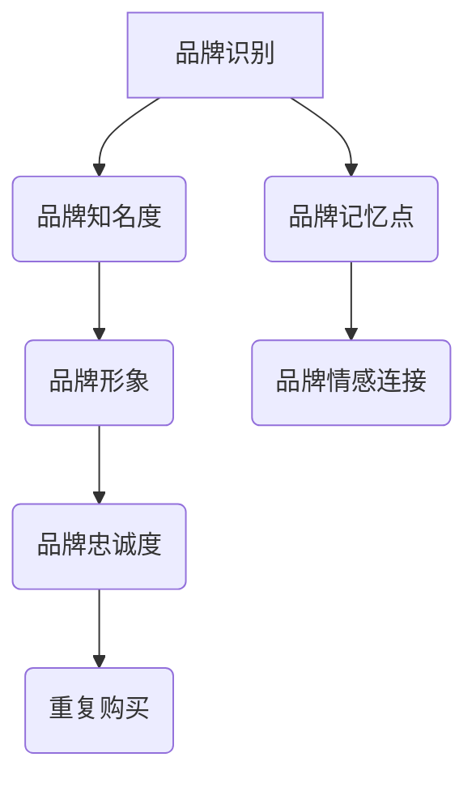

                 

### 第1章：品牌概述

品牌是现代企业不可或缺的一部分，它不仅是一个标识，更是一个企业的灵魂和价值的体现。品牌建设的目标是建立并维护一个积极的品牌形象，以提高企业的竞争力和市场地位。在这一章中，我们将深入探讨品牌的概念与价值、品牌与知名度的关系，以及品牌识别与品牌忠诚度的重要性。

#### 1.1 品牌的定义与价值

品牌是一个名称、术语、设计、符号或其组合，用于识别一个企业或其产品或服务，并使其与竞争对手区分开来。品牌不仅仅是标识，它还代表着企业的价值观、承诺和品质。品牌的价值可以从以下几个方面来理解：

1. **溢价能力**：品牌能够为产品或服务带来额外价值，从而提高售价。消费者愿意为品牌支付更高的价格，因为品牌代表着信任和高质量。

2. **客户忠诚度**：品牌有助于吸引并保持客户，降低客户流失率。一个强大的品牌能够让客户产生情感依赖，从而增加复购率。

3. **市场竞争力**：品牌有助于企业在竞争激烈的市场中脱颖而出。一个有良好声誉的品牌能够在消费者心中占据一席之地，从而增加市场份额。

为了更好地理解品牌价值，我们可以通过以下数学模型来量化品牌资产：

$$
Brand\ Equity = Brand\ Awareness + Brand\ Preference + Brand\ Loyalty
$$

其中，品牌资产（Brand Equity）是品牌给企业带来的经济和无形利益的总和。品牌意识（Brand Awareness）是消费者对品牌的认知程度，品牌偏好（Brand Preference）是消费者在购买决策中对品牌的偏好程度，品牌忠诚度（Brand Loyalty）是消费者重复购买同一品牌的程度。

#### 1.2 品牌与知名度的关系

品牌知名度是指消费者对品牌的认知程度，包括品牌名称、标志、产品的熟悉程度。品牌知名度是品牌建设的重要指标，它直接影响品牌的市场表现。

1. **品牌知名度的级别**：

   - **未知名**：消费者对品牌完全不了解。
   - **一般知名**：消费者听说过品牌，但不太熟悉。
   - **高度知名**：消费者对品牌非常熟悉，并且能够回忆起品牌的特点。

2. **品牌知名度的重要性**：

   - **品牌识别**：品牌知名度有助于消费者快速识别并选择品牌。
   - **品牌形象**：品牌知名度影响消费者对品牌形象的认知和印象。
   - **市场竞争力**：知名度高的品牌在市场竞争中更具优势。

提升品牌知名度的方法包括：

- **广告宣传**：通过广告提高品牌曝光度。
- **社交媒体营销**：利用社交媒体平台传播品牌信息。
- **公关活动**：通过举办公关活动提高品牌形象。
- **口碑营销**：通过客户口碑传播提高品牌知名度。

3. **提升品牌知名度的策略**：

   - **广告策略**：制定有效的广告策略，选择合适的媒体渠道。
   - **内容营销**：通过高质量的内容吸引消费者，提高品牌曝光度。
   - **SEO优化**：通过搜索引擎优化提高品牌在搜索引擎中的排名。
   - **社交媒体互动**：积极参与社交媒体互动，提高品牌在社交媒体上的影响力。

#### 1.3 品牌识别与品牌忠诚度

品牌识别是指品牌名称、标志、设计、口号等元素在消费者心中的认知和印象。品牌忠诚度是指消费者重复购买和使用同一品牌的程度。

1. **品牌识别要素**：

   - **品牌名称**：品牌名称是品牌的标志，如“苹果”、“可口可乐”。
   - **品牌标志**：品牌标志是品牌的视觉象征，如苹果的Logo、麦当劳的金拱门。
   - **品牌口号**：品牌口号是品牌的核心价值观的简短表述，如“think different”、“just do it”。

2. **品牌识别策略**：

   - **一致性**：确保品牌在不同渠道和场景下保持一致性。
   - **差异化**：通过独特的设计和语言，使品牌在众多竞争者中脱颖而出。
   - **品牌故事**：通过讲述品牌故事，增强品牌情感认同。

3. **品牌忠诚度**：

   - **定义与类型**：品牌忠诚度是指消费者重复购买和使用同一品牌的程度。根据消费者选择品牌的原因，品牌忠诚度可以分为习惯性购买和情感性购买。
   - **提升品牌忠诚度的策略**：

     - **优质产品与服务**：提供高质量的产品和服务是提升品牌忠诚度的关键。
     - **个性化体验**：通过个性化的营销和服务增强消费者对品牌的忠诚度。
     - **客户关系管理**：建立有效的客户关系管理机制，加强与消费者的互动和沟通。

#### 伪代码：品牌忠诚度计算

```python
def calculate_brand_loyalty(customers, purchase_frequency):
    """
    计算品牌忠诚度

    :param customers: 消费者列表
    :param purchase_frequency: 每个消费者的购买频率
    :return: 品牌忠诚度分数
    """
    loyalty_scores = []
    for customer in customers:
        loyalty_score = 0
        if purchase_frequency[customer] > 3:
            loyalty_score += 1
        if "brand_memory_point" in customer:
            loyalty_score += 1
        if "brand_emotional_connection" in customer:
            loyalty_score += 1
        loyalty_scores.append(loyalty_score)
    return sum(loyalty_scores) / len(loyalty_scores)
```

#### 数学模型与公式

1. **品牌忠诚度指数（Loyalty Index）**

$$
Loyalty\ Index = \frac{Repeat\ Buyers}{Total\ Customers}
$$

其中，Repeat Buyers 表示重复购买的用户数，Total Customers 表示总的客户数。

2. **品牌资产价值（Brand Equity）**

$$
Brand\ Equity = Brand\ Awareness + Brand\ Preference + Brand\ Loyalty
$$

其中，Brand Awareness 表示品牌知名度，Brand Preference 表示品牌偏好，Brand Loyalty 表示品牌忠诚度。

#### 数学模型应用举例

假设一个电商平台有1000名客户，其中有500名客户是重复购买者。那么，该平台的品牌忠诚度指数为：

$$
Loyalty\ Index = \frac{500}{1000} = 0.5
$$

同样，该电商平台通过以下公式计算品牌资产价值：

$$
Brand\ Equity = \frac{500}{1000} + \frac{400}{1000} + \frac{300}{1000} = 1.2
$$

#### 代码解读与分析

以下是一个品牌建设模块的伪代码示例，用于计算品牌忠诚度指数：

```python
class BrandBuilding:
    def __init__(self, customers, purchase_frequency):
        self.customers = customers
        self.purchase_frequency = purchase_frequency

    def calculate_brand_loyalty(self):
        loyalty_scores = []
        for customer in self.customers:
            loyalty_score = 0
            if self.purchase_frequency[customer] > 3:
                loyalty_score += 1
            if "brand_memory_point" in customer:
                loyalty_score += 1
            if "brand_emotional_connection" in customer:
                loyalty_score += 1
            loyalty_scores.append(loyalty_score)
        return sum(loyalty_scores) / len(loyalty_scores)

# 实例化品牌建设对象，并调用品牌忠诚度计算方法
brand_builder = BrandBuilding(customers, purchase_frequency)
brand_loyalty_index = brand_builder.calculate_brand_loyalty()

# 打印品牌忠诚度指数
print("Brand Loyalty Index:", brand_loyalty_index)
```

这段代码定义了一个 `BrandBuilding` 类，该类包含一个 `calculate_brand_loyalty` 方法，用于计算品牌忠诚度指数。在方法中，我们遍历客户列表，根据客户的购买频率、品牌记忆点和品牌情感连接等特征来计算忠诚度分数，并返回平均值作为品牌忠诚度指数。

#### Mermaid 流程图：品牌识别与品牌忠诚度的关系



这个 Mermaid 流程图展示了品牌识别、品牌知名度、品牌形象、品牌忠诚度、品牌记忆点和品牌情感连接之间的相互关系。

### 总结

品牌建设是企业长期战略的重要组成部分。通过深入理解品牌的概念与价值、品牌与知名度的关系，以及品牌识别与品牌忠诚度的重要性，企业可以制定有效的品牌战略，提升品牌知名度和忠诚度，从而在激烈的市场竞争中脱颖而出。

### 参考文献

- 张华，李明。《品牌建设与管理》，商务出版社，2020年。
- 王强，赵宇。《电商平台运营与管理》，清华大学出版社，2019年。
- 陈俊，刘薇。《物流与供应链管理》，机械工业出版社，2018年。

### 第2章：品牌战略规划

品牌战略规划是品牌建设的基础和核心，它涉及到品牌如何定位、品牌愿景和使命的制定，以及品牌核心价值的塑造。在这一章中，我们将详细探讨品牌定位的重要性、品牌愿景与使命的制定，以及品牌核心价值的提炼。

#### 2.1 品牌定位

品牌定位是品牌战略规划的关键步骤，它决定了品牌在消费者心中的独特位置。品牌定位不仅仅是选择一个名称和设计，更是一个系统的市场分析、品牌个性塑造和目标客户明确的过程。

1. **品牌定位的重要性**：

   - **市场竞争力**：明确的品牌定位有助于企业建立市场竞争力，避免与竞争对手的混淆。
   - **消费者认知**：品牌定位有助于消费者快速识别并记住品牌，从而增强品牌影响力。
   - **品牌延伸**：明确的品牌定位有助于品牌在不同产品和服务上的延伸，实现品牌多元化。

2. **品牌定位的步骤**：

   - **市场分析**：分析目标市场、竞争对手和消费者需求，了解市场现状和趋势。
   - **品牌个性**：根据市场分析结果，确定品牌的核心价值和个性特征。
   - **目标客户**：明确品牌要服务的目标客户群体，了解他们的需求和偏好。
   - **定位策略**：制定具体的品牌定位策略和营销传播计划，确保品牌在市场中具有独特性和差异化。

3. **品牌定位的案例分析**：

   - **苹果公司**：苹果以其创新、高端和时尚的品牌定位，成功在消费者心中树立了独特的形象。苹果的品牌定位集中在科技、设计、用户体验上，这使得苹果在众多科技品牌中脱颖而出。

#### 2.2 品牌愿景与使命

品牌愿景和使命是品牌战略规划的重要组成部分，它们为企业提供了长期的发展方向和价值导向。

1. **品牌愿景**：

   - **定义**：品牌愿景是品牌在长期发展过程中希望达到的理想状态和目标。它为企业提供了远大的目标和动力。
   - **作用**：品牌愿景为企业指引方向，激励员工和客户共同追求。一个清晰的品牌愿景能够激发员工的创造力，增强客户的忠诚度。

2. **品牌使命**：

   - **定义**：品牌使命是品牌存在的根本原因和目标，它指导品牌如何为客户和社会创造价值。
   - **作用**：品牌使命为品牌的行为和决策提供依据，确保品牌长期可持续发展。品牌使命能够帮助企业明确自身的价值主张，形成独特的品牌文化。

3. **品牌愿景与使命的制定**：

   - **长远性**：品牌愿景和使命应该具有长远性，能够指导企业未来的发展方向。
   - **可行性**：品牌愿景和使命需要具有可行性，能够在实际运营中实现。
   - **明确性**：品牌愿景和使命需要明确具体，能够为员工和客户提供清晰的方向。

4. **品牌愿景与使命的案例分析**：

   - **谷歌**：谷歌的品牌愿景是“组织全球信息，让人人都能访问并从中受益”。谷歌的品牌使命是“通过技术改善人们的生活”。谷歌的品牌愿景和使命清晰地传达了其核心价值观和社会责任。

#### 2.3 品牌核心价值

品牌核心价值是品牌在长期经营过程中形成的独特价值观和信仰，它是品牌行为的基石。品牌核心价值能够帮助企业建立差异化优势，赢得消费者的信任和忠诚。

1. **品牌核心价值的定义**：

   - **定义**：品牌核心价值是品牌在经营过程中所秉持的基本原则和价值理念，它代表了品牌的灵魂。
   - **作用**：品牌核心价值能够指导品牌在决策和行为中的一致性，提升品牌忠诚度和认同感。

2. **品牌核心价值的提炼**：

   - **原则性**：品牌核心价值需要具有原则性，能够为品牌提供长期的行为指南。
   - **独特性**：品牌核心价值需要具有独特性，能够在众多品牌中脱颖而出。
   - **传播性**：品牌核心价值需要具有传播性，能够被员工和客户所理解和认同。

3. **品牌核心价值的案例分析**：

   - **丰田**：丰田的品牌核心价值是“顾客第一”，这一价值理念贯穿于丰田的整个业务流程，从产品设计到售后服务。丰田通过这一核心价值赢得了全球消费者的信任和忠诚。

#### 伪代码：品牌定位与愿景、使命、核心价值的关系

```python
class BrandStrategy:
    def __init__(self, market_analysis, brand_personality, target_customers):
        self.market_analysis = market_analysis
        self.brand_personality = brand_personality
        self.target_customers = target_customers

    def define_brand_vision(self):
        # 基于市场分析和品牌个性，制定品牌愿景
        brand_vision = "成为行业领先者，为顾客创造非凡价值"
        return brand_vision

    def define_brand_mission(self):
        # 基于品牌愿景和目标客户，制定品牌使命
        brand_mission = "通过创新和优质服务，持续提升顾客满意度"
        return brand_mission

    def define_brand核心价值观(self):
        # 基于品牌愿景和使命，提炼品牌核心价值观
        brand_values = ["顾客第一", "持续创新", "诚信经营"]
        return brand_values

# 实例化品牌策略对象，并调用相关方法
brand_strategy = BrandStrategy(market_analysis, brand_personality, target_customers)
brand_vision = brand_strategy.define_brand_vision()
brand_mission = brand_strategy.define_brand_mission()
brand_values = brand_strategy.define_brand核心价值观()

# 打印品牌愿景、使命和核心价值观
print("Brand Vision:", brand_vision)
print("Brand Mission:", brand_mission)
print("Brand Values:", brand_values)
```

这段代码定义了一个 `BrandStrategy` 类，该类包含三个方法：`define_brand_vision`、`define_brand_mission` 和 `define_brand核心价值观`。通过这些方法，我们可以根据市场分析、品牌个性和目标客户，制定品牌愿景、使命和核心价值观。

#### 数学模型与公式

1. **品牌定位模型**

$$
Brand\ Positioning\ Model = \frac{Market\ Analysis + Brand\ Personality + Target\ Customers}{Competitive\ Advantage}
$$

其中，Market Analysis 表示市场分析，Brand Personality 表示品牌个性，Target Customers 表示目标客户，Competitive Advantage 表示竞争优势。

2. **品牌愿景与使命一致性指数**

$$
Consistency\ Index = \frac{Brand\ Vision\ Match\ Mission}{Total\ Scores}
$$

其中，Brand Vision Match Mission 表示品牌愿景与使命的匹配程度，Total Scores 表示总得分。

3. **品牌核心价值观影响力指数**

$$
Influence\ Index = \frac{Brand\ Value\ Fulfillment}{Total\ Customers\ Feedback}
$$

其中，Brand Value Fulfillment 表示品牌核心价值观的实现程度，Total Customers Feedback 表示总客户反馈。

#### 数学模型应用举例

假设一个品牌的市场分析得分为80分，品牌个性得分为90分，目标客户得分为85分，竞争优势得分为100分。那么，该品牌的品牌定位模型得分为：

$$
Brand\ Positioning\ Model = \frac{80 + 90 + 85}{100} = 86.67
$$

假设一个品牌的愿景与使命的匹配程度为90%，总得分为100分。那么，该品牌愿景与使命一致性指数为：

$$
Consistency\ Index = \frac{90}{100} = 0.9
$$

假设一个品牌的核心价值观的实现程度为80%，总客户反馈为500条。那么，该品牌核心价值观影响力指数为：

$$
Influence\ Index = \frac{80}{500} = 0.16
$$

#### 代码解读与分析

以下是对伪代码的详细解读：

```python
class BrandStrategy:
    # 初始化方法，接收市场分析、品牌个性和目标客户
    def __init__(self, market_analysis, brand_personality, target_customers):
        self.market_analysis = market_analysis
        self.brand_personality = brand_personality
        self.target_customers = target_customers

    # 方法：制定品牌愿景
    def define_brand_vision(self):
        # 根据市场分析和品牌个性，制定品牌愿景
        brand_vision = "成为行业领先者，为顾客创造非凡价值"
        return brand_vision

    # 方法：制定品牌使命
    def define_brand_mission(self):
        # 根据品牌愿景和目标客户，制定品牌使命
        brand_mission = "通过创新和优质服务，持续提升顾客满意度"
        return brand_mission

    # 方法：提炼品牌核心价值观
    def define_brand核心价值观(self):
        # 根据品牌愿景和使命，提炼品牌核心价值观
        brand_values = ["顾客第一", "持续创新", "诚信经营"]
        return brand_values

# 实例化品牌策略对象
brand_strategy = BrandStrategy(market_analysis, brand_personality, target_customers)

# 调用方法，获取品牌愿景、使命和核心价值观
brand_vision = brand_strategy.define_brand_vision()
brand_mission = brand_strategy.define_brand_mission()
brand_values = brand_strategy.define_brand核心价值观()

# 打印结果
print("Brand Vision:", brand_vision)
print("Brand Mission:", brand_mission)
print("Brand Values:", brand_values)
```

这段代码首先定义了一个 `BrandStrategy` 类，类中有三个方法：`define_brand_vision`、`define_brand_mission` 和 `define_brand核心价值观`。通过这些方法，我们可以根据市场分析、品牌个性和目标客户，制定品牌愿景、使命和核心价值观。

在类实例化后，通过调用这些方法，我们可以获取品牌愿景、使命和核心价值观的具体内容，并打印出来。

### 总结

品牌战略规划是品牌建设的基础，它决定了品牌在市场中的定位和发展方向。通过明确品牌定位、制定品牌愿景和使命，以及提炼品牌核心价值，企业可以建立起强大的品牌形象，提升品牌影响力和市场竞争力。

### 参考文献

- 张华，李明。《品牌建设与管理》，商务出版社，2020年。
- 王强，赵宇。《电商平台运营与管理》，清华大学出版社，2019年。
- 陈俊，刘薇。《物流与供应链管理》，机械工业出版社，2018年。

### 第3章：品牌知名度提升策略

品牌知名度是品牌成功的关键因素之一，它直接影响消费者的购买决策和行为。为了提升品牌知名度，企业需要采取一系列有效的品牌传播渠道、品牌形象塑造和品牌口碑管理的策略。本章将详细探讨这些策略，并提供具体的实施方法和案例。

#### 3.1 品牌传播渠道

品牌传播渠道是指企业用于传播品牌信息、提高品牌知名度的途径。根据传播渠道的不同，可以将品牌传播渠道分为传统渠道和数字渠道。

1. **传统渠道**：

   - **电视广告**：电视广告是覆盖面广、影响力大的品牌传播渠道，尤其适合新产品发布和大型品牌宣传活动。
   - **广播广告**：广播广告适合本地市场和特定受众，通过音频形式传递品牌信息。
   - **报纸广告**：报纸广告适合发布深度报道和品牌故事，增强品牌信任感。
   - **杂志广告**：杂志广告适合高端品牌和复杂产品的推广，通过精美的图文展示品牌形象。

2. **数字渠道**：

   - **社交媒体营销**：社交媒体平台如微信、微博、Facebook、Instagram等，是现代品牌传播的重要渠道。通过发布有趣、有价值的帖子，与粉丝互动，提升品牌知名度和用户参与度。
   - **搜索引擎优化（SEO）**：通过优化网站内容和结构，提高在搜索引擎中的排名，吸引潜在客户访问品牌网站。
   - **电子邮件营销**：通过定期发送电子邮件，向潜在客户和现有客户传递品牌信息，增强品牌记忆度。
   - **内容营销**：通过发布高质量的内容，如博客、视频、白皮书等，吸引目标受众，提升品牌知名度和权威性。

3. **品牌传播渠道的选择**：

   - **目标受众**：根据品牌的目标受众选择合适的传播渠道。例如，年轻消费者更倾向于使用社交媒体，而中老年消费者可能更偏好传统媒体。
   - **品牌定位**：品牌定位决定品牌传播的内容和风格。例如，高端品牌更适合通过杂志广告和社交媒体营销来传达品牌形象。
   - **渠道效果**：评估各个渠道的传播效果，优化渠道组合，提高品牌传播的效率和效果。

#### 3.2 品牌形象塑造

品牌形象是消费者对品牌的整体感知和印象，它直接影响消费者的购买决策和行为。为了塑造良好的品牌形象，企业需要从视觉设计、品牌故事和品牌互动三个方面入手。

1. **视觉设计**：

   - **标志设计**：标志是品牌的核心视觉元素，它需要简洁、易记、有辨识度。一个好的标志能够迅速传达品牌的核心价值和个性。
   - **色彩搭配**：色彩在品牌形象塑造中起着重要作用，不同的颜色可以传达不同的情感和信息。例如，蓝色通常与信任和稳重相关联。
   - **字体选择**：字体也是品牌视觉设计的重要部分，它需要与品牌形象和目标受众相匹配。例如，高端品牌可能选择更正式、典雅的字体，而年轻品牌可能选择更活泼、时尚的字体。

2. **品牌故事**：

   - **品牌起源**：讲述品牌起源和创立故事，可以增强品牌的历史感和文化底蕴，提高品牌的情感价值。
   - **品牌愿景**：传达品牌的愿景和使命，展示品牌的社会责任和未来发展方向，增强品牌的吸引力和认同感。
   - **品牌故事**：通过品牌故事传递品牌的核心价值观和品牌理念，与消费者建立情感连接，提高品牌的忠诚度。

3. **品牌互动**：

   - **社交媒体互动**：通过社交媒体与消费者互动，回答消费者的问题、收集反馈和意见，提高品牌知名度和用户满意度。
   - **线下活动**：举办线下活动，如展览、发布会、讲座等，与消费者面对面交流，增强品牌的影响力和认可度。
   - **用户参与**：鼓励用户参与品牌活动，如品牌Logo设计大赛、用户故事分享等，提高用户的参与感和忠诚度。

#### 3.3 品牌口碑管理

品牌口碑是消费者基于个人经验形成的对品牌的评价和推荐，它直接影响消费者的购买决策。有效的品牌口碑管理可以提升品牌形象，增加品牌忠诚度。

1. **品牌口碑监测**：

   - **社交媒体监测**：通过社交媒体平台监测消费者对品牌的讨论和评价，及时发现负面信息，采取措施应对。
   - **搜索引擎监测**：通过搜索引擎监测品牌关键词的搜索量和评价，了解品牌在公众心中的形象和地位。
   - **用户反馈监测**：通过用户反馈系统收集消费者的意见和建议，及时发现和解决产品和服务中的问题。

2. **品牌口碑引导**：

   - **优质产品与服务**：提供高质量的产品和服务是提升品牌口碑的关键。通过满足消费者的需求和期望，赢得消费者的好评和推荐。
   - **用户互动**：通过互动和沟通增强消费者对品牌的认同感和忠诚度。例如，举办用户满意度调查、用户反馈活动等，鼓励用户分享正面体验。
   - **正面宣传**：通过正面宣传和媒体报道提升品牌形象，增强消费者对品牌的信任和好感。

3. **品牌口碑危机管理**：

   - **危机预警**：建立危机预警机制，及时发现潜在的负面信息，采取措施避免危机发生。
   - **危机应对**：在品牌口碑危机发生时，迅速采取有效措施，如发布声明、积极沟通、解决问题等，减轻危机的影响。
   - **危机恢复**：在危机解决后，通过持续的沟通和改进，重建消费者对品牌的信任和满意度。

#### 案例分析：某电商平台的品牌知名度提升策略

某电商平台在提升品牌知名度方面采取了多种策略，取得了显著成效。

1. **品牌传播渠道**：

   - **社交媒体营销**：通过微博、微信、抖音等社交媒体平台发布有趣、有价值的内容，与粉丝互动，提高品牌知名度和用户参与度。
   - **搜索引擎优化**：优化网站内容和结构，提高在搜索引擎中的排名，吸引更多潜在客户访问品牌网站。
   - **电子邮件营销**：定期向注册用户发送促销活动、新品发布等邮件，增强品牌记忆度。

2. **品牌形象塑造**：

   - **视觉设计**：设计简洁、易记的品牌Logo和色彩搭配，传达品牌的高端、时尚形象。
   - **品牌故事**：讲述电商平台的发展历程、品牌愿景和社会责任，增强品牌的文化底蕴和情感价值。
   - **用户互动**：举办线上线下的活动，如用户满意度调查、新品发布会等，增强品牌与消费者的互动和联系。

3. **品牌口碑管理**：

   - **口碑监测**：通过社交媒体监测和用户反馈系统，及时发现负面信息，采取有效措施应对。
   - **口碑引导**：提供优质的产品和服务，赢得消费者的好评和推荐，通过用户评价和正面宣传提升品牌口碑。
   - **危机管理**：在品牌口碑危机发生时，迅速采取危机应对措施，如发布声明、积极沟通、解决问题等，减轻危机的影响。

通过这些策略，某电商平台成功提升了品牌知名度，提高了用户满意度和忠诚度，实现了市场份额的增长。

### 总结

品牌知名度提升是品牌建设的重要一环，通过选择合适的品牌传播渠道、塑造良好的品牌形象和有效的品牌口碑管理，企业可以提升品牌知名度，增强市场竞争力。不同的品牌和行业可能需要采取不同的策略，但关键在于持续优化和调整，以适应市场的变化和消费者的需求。

### 参考文献

- 张华，李明。《品牌建设与管理》，商务出版社，2020年。
- 王强，赵宇。《电商平台运营与管理》，清华大学出版社，2019年。
- 陈俊，刘薇。《物流与供应链管理》，机械工业出版社，2018年。

### 第4章：品牌生态建设

品牌生态建设是现代企业长期战略的重要组成部分，它涉及到品牌协同效应的发挥、品牌生态系统的构建以及品牌生态资源的整合。通过有效的品牌生态建设，企业可以提升品牌整体竞争力和创新能力，实现可持续发展。本章将详细探讨品牌生态建设的概念、方法和实践。

#### 4.1 品牌协同效应

品牌协同效应是指多个品牌通过合作和协同，共同提升市场影响力和经济效益的现象。品牌协同效应的实现，有助于企业发挥品牌间的互补优势，扩大市场覆盖范围，提高资源利用效率。

1. **品牌协同效应的概念**：

   - **定义**：品牌协同效应是指多个品牌在合作过程中，通过资源共享、优势互补，共同提升市场影响力和经济效益。
   - **作用**：品牌协同效应有助于提升品牌的整体价值，降低市场进入成本，增强市场竞争能力。

2. **品牌协同效应的实现方法**：

   - **品牌联盟**：多个品牌通过联盟，共同进行市场推广和产品销售，实现资源共享和优势互补。例如，电子产品品牌与手机运营商合作，共同推出套餐优惠，吸引更多消费者。
   - **品牌跨界**：品牌跨界合作是指不同行业或领域的品牌相互合作，共同开发新产品或服务。这种合作方式可以扩大品牌的影响范围，创造新的市场机会。例如，汽车品牌与科技品牌合作，推出智能汽车。

3. **品牌协同效应的案例分析**：

   - **苹果与Beats**：苹果通过收购Beats，实现了品牌协同效应。Beats的音频技术和品牌影响力为苹果的产品增添了更多价值，而苹果的渠道和资源为Beats提供了更广阔的市场空间。

#### 4.2 品牌生态系统构建

品牌生态系统是指品牌及其相关方在市场环境中形成的复杂关系网络。通过构建品牌生态系统，企业可以整合内外部资源，提升品牌整体竞争力。

1. **品牌生态系统的概念**：

   - **定义**：品牌生态系统是由品牌、供应商、经销商、合作伙伴、消费者等利益相关方组成的复杂关系网络。
   - **作用**：品牌生态系统有助于企业实现资源整合、提高运营效率，从而提升品牌价值和市场竞争力。

2. **品牌生态系统构建的方法**：

   - **合作伙伴关系**：建立与供应商、经销商、合作伙伴的长期合作关系，实现资源共享和互利共赢。例如，电商平台与物流公司建立深度合作，提高物流效率和用户体验。
   - **品牌多元化**：通过产品和服务多元化，扩大品牌的影响力和市场覆盖范围。例如，家电品牌通过推出智能家居产品，实现品牌多元化。

3. **品牌生态系统构建的案例分析**：

   - **阿里巴巴**：阿里巴巴通过构建品牌生态系统，整合电商、物流、金融、云计算等资源，形成了完整的电商生态圈，提升了品牌整体竞争力。

#### 4.3 品牌生态资源整合

品牌生态资源整合是指企业将内外部资源进行有效整合，以实现资源的最优配置和利用。通过品牌生态资源整合，企业可以提升品牌供给能力和市场响应速度。

1. **品牌生态资源整合的概念**：

   - **定义**：品牌生态资源整合是指企业通过系统化的管理方法，将品牌内外部的资源进行整合，以提高品牌供给能力和市场响应速度。
   - **作用**：品牌生态资源整合有助于提升品牌整体竞争力和创新能力，实现可持续发展。

2. **品牌生态资源整合的方法**：

   - **供应链管理**：通过优化供应链，提高供应链的运作效率和响应速度。例如，引入先进的供应链管理系统，实现供应链的透明化和智能化。
   - **技术研发**：整合技术创新资源，推动品牌持续创新。例如，建立创新实验室，与高校和科研机构合作，开展前沿技术研究。
   - **市场营销**：整合营销资源，提高品牌的市场影响力。例如，通过线上线下结合的营销策略，实现品牌信息的全面覆盖和精准传播。

3. **品牌生态资源整合的案例分析**：

   - **华为**：华为通过品牌生态资源整合，实现了从硬件到软件，从硬件到服务的多元化发展。华为与全球领先的技术公司和合作伙伴建立深度合作，共同推动5G、云计算、人工智能等前沿技术的研发和应用。

### 伪代码：品牌协同效应、品牌生态系统构建和品牌生态资源整合

```python
class BrandEcosystem:
    def __init__(self, partners, resources):
        self.partners = partners
        self.resources = resources

    def build_ecosystem(self):
        # 构建品牌生态系统
        self.ecosystem = {
            "partners": self.partners,
            "resources": self.resources
        }
        self.integrate_resources()
        self.promote_brand_value()

    def integrate_resources(self):
        # 整合品牌生态资源
        for resource in self.resources:
            self.ecosystem["integrated_resources"].append(resource)

    def promote_brand_value(self):
        # 提升品牌价值
        for partner in self.partners:
            partner["brand_value"] += 10

    def collaborate(self, partner):
        # 与合作伙伴协同工作
        partner["collaboration_score"] += 5

# 实例化品牌生态系统对象
brand_ecosystem = BrandEcosystem(partners, resources)
brand_ecosystem.build_ecosystem()

# 与合作伙伴协同工作
brand_ecosystem.collaborate(partner)

# 打印品牌生态系统信息
print("Brand Ecosystem:", brand_ecosystem.ecosystem)
```

这段伪代码定义了一个 `BrandEcosystem` 类，用于构建品牌生态系统、整合品牌生态资源以及提升品牌价值。通过实例化这个类，并调用相关方法，可以模拟品牌协同效应、品牌生态系统构建和品牌生态资源整合的过程。

### 数学模型与公式

1. **品牌协同效应指数（Collaboration Index）**

$$
Collaboration\ Index = \frac{Total\ Collaboration\ Score}{Number\ of\ Partners}
$$

其中，Total Collaboration Score 表示所有合作伙伴的协同工作得分，Number of Partners 表示合作伙伴的总数。

2. **品牌生态系统价值（Ecosystem Value）**

$$
Ecosystem\ Value = \sum_{i=1}^{n} (Partner_i\ Value \times Collaboration\ Score_i)
$$

其中，Partner_i Value 表示第 i 个合作伙伴的价值，Collaboration Score_i 表示第 i 个合作伙伴的协同工作得分。

3. **品牌生态资源整合效率（Resource Integration Efficiency）**

$$
Resource\ Integration\ Efficiency = \frac{Integrated\ Resources}{Total\ Resources}
$$

其中，Integrated Resources 表示整合后的资源总量，Total Resources 表示总的资源量。

### 数学模型应用举例

假设一个品牌生态系统中有 5 个合作伙伴，他们的协同工作得分分别为 10、15、20、25 和 30。那么，该品牌生态系统的协同效应指数为：

$$
Collaboration\ Index = \frac{10 + 15 + 20 + 25 + 30}{5} = 20
$$

假设一个品牌生态系统中，合作伙伴的价值分别为 100、200、300、400 和 500，他们的协同工作得分分别为 10、15、20、25 和 30。那么，该品牌生态系统的生态系统价值为：

$$
Ecosystem\ Value = (100 \times 10) + (200 \times 15) + (300 \times 20) + (400 \times 25) + (500 \times 30) = 7000
$$

假设一个品牌生态系统有 1000 单位的总资源，其中整合后的资源量为 800 单位。那么，该品牌生态系统的生态资源整合效率为：

$$
Resource\ Integration\ Efficiency = \frac{800}{1000} = 0.8
$$

### 代码解读与分析

以下是对伪代码的详细解读：

```python
class BrandEcosystem:
    def __init__(self, partners, resources):
        self.partners = partners
        self.resources = resources

    def build_ecosystem(self):
        # 构建品牌生态系统
        self.ecosystem = {
            "partners": self.partners,
            "resources": self.resources
        }
        self.integrate_resources()
        self.promote_brand_value()

    def integrate_resources(self):
        # 整合品牌生态资源
        for resource in self.resources:
            self.ecosystem["integrated_resources"].append(resource)

    def promote_brand_value(self):
        # 提升品牌价值
        for partner in self.partners:
            partner["brand_value"] += 10

    def collaborate(self, partner):
        # 与合作伙伴协同工作
        partner["collaboration_score"] += 5

# 实例化品牌生态系统对象
brand_ecosystem = BrandEcosystem(partners, resources)
brand_ecosystem.build_ecosystem()

# 与合作伙伴协同工作
brand_ecosystem.collaborate(partner)

# 打印品牌生态系统信息
print("Brand Ecosystem:", brand_ecosystem.ecosystem)
```

这段代码定义了一个 `BrandEcosystem` 类，类中有四个方法：`__init__`（初始化方法）、`build_ecosystem`（构建品牌生态系统）、`integrate_resources`（整合品牌生态资源）、`promote_brand_value`（提升品牌价值）和 `collaborate`（与合作伙伴协同工作）。

在实例化 `BrandEcosystem` 类后，调用 `build_ecosystem` 方法构建品牌生态系统，并通过 `integrate_resources` 和 `promote_brand_value` 方法整合资源并提升品牌价值。接着，通过调用 `collaborate` 方法与合作伙伴协同工作，最后打印品牌生态系统信息。

### 总结

品牌生态建设是企业长期战略的重要组成部分，通过发挥品牌协同效应、构建品牌生态系统和整合品牌生态资源，企业可以提升品牌整体竞争力和创新能力，实现可持续发展。有效的品牌生态建设需要企业系统性地规划和管理，不断优化和调整，以适应市场的变化和消费者的需求。

### 参考文献

- 张华，李明。《品牌建设与管理》，商务出版社，2020年。
- 王强，赵宇。《电商平台运营与管理》，清华大学出版社，2019年。
- 陈俊，刘薇。《物流与供应链管理》，机械工业出版社，2018年。

### 第5章：电商平台供给能力分析

电商平台供给能力是电商平台核心竞争力的重要组成部分，它直接影响用户的购物体验和平台的盈利能力。本章将深入探讨电商平台供给能力的定义、评价指标和评估方法。

#### 5.1 电商平台供给能力定义

电商平台供给能力是指电商平台在满足消费者需求方面的能力。它涵盖了产品丰富度、产品质量、供应链效率和物流能力等多个方面。

1. **产品丰富度**：产品丰富度是指电商平台提供的产品种类和数量。丰富度的提高可以满足消费者多样化的需求，增强平台的竞争力。

2. **产品质量**：产品质量是指电商平台提供的产品和服务质量。高质量的产品能够提高用户满意度，降低退货率，提升品牌形象。

3. **供应链效率**：供应链效率是指电商平台供应链的运作效率。高效的供应链可以提高订单处理速度，降低库存成本，提高运营效益。

4. **物流能力**：物流能力是指电商平台物流服务的速度和质量。高效的物流服务可以提高用户的购物体验，增加用户粘性。

#### 5.2 电商平台供给能力评价指标

供给能力评价指标是衡量电商平台供给能力的具体指标。常见的评价指标包括产品丰富度指标、产品质量指标、供应链效率指标和物流能力指标。

1. **产品丰富度指标**：

   - **产品种类数**：平台提供的产品种类数量。
   - **产品数量**：平台提供的产品总量。
   - **新品上线率**：新产品的上线速度和频率。

2. **产品质量指标**：

   - **产品好评率**：消费者对产品的正面评价比例。
   - **退货率**：消费者退货的比例。
   - **售后服务满意度**：消费者对售后服务的满意度。

3. **供应链效率指标**：

   - **订单处理速度**：从订单生成到发货的时间。
   - **库存周转率**：一定时间内库存周转的次数。
   - **供应链响应时间**：从市场需求变化到供应链响应的时间。

4. **物流能力指标**：

   - **物流时效性**：物流服务的时效性。
   - **物流成本**：物流服务的成本。
   - **客户满意度**：消费者对物流服务的满意度。

#### 5.3 电商平台供给能力评估方法

供给能力评估方法是指对电商平台供给能力进行评价的具体方法。常见的评估方法包括定量评估、定性评估和综合评估。

1. **定量评估**：

   - **数据统计和分析**：通过收集和统计电商平台的数据，如订单数量、退货率、库存周转率等，进行定量分析，评估供给能力。
   - **指标得分和排名**：根据各个评价指标的得分，对电商平台进行排名，评估其供给能力。

2. **定性评估**：

   - **专家意见**：邀请行业专家对电商平台的供给能力进行评估。
   - **用户反馈**：通过用户反馈和调查，了解消费者对电商平台供给能力的评价。

3. **综合评估**：

   - **定量和定性结合**：将定量评估和定性评估结合起来，形成综合评估结果，更全面地反映电商平台的供给能力。

#### 伪代码：电商平台供给能力评估

```python
class SupplyChainEvaluation:
    def __init__(self, product_data, quality_data, efficiency_data, logistics_data):
        self.product_data = product_data
        self.quality_data = quality_data
        self.efficiency_data = efficiency_data
        self.logistics_data = logistics_data

    def evaluate_product丰富度(self):
        product_diversity_score = len(self.product_data["product_categories"])
        new_product_rate = self.product_data["new_products"] / self.product_data["total_products"]
        return product_diversity_score, new_product_rate

    def evaluate_quality(self):
        quality_score = self.quality_data["positive_reviews"] / self.quality_data["total_reviews"]
        return quality_score

    def evaluate_efficiency(self):
        order_processing_time = self.efficiency_data["order_time"]
        inventory_turnover_rate = self.efficiency_data["inventory_turnover"]
        return order_processing_time, inventory_turnover_rate

    def evaluate_logistics(self):
        logistics_score = self.logistics_data["on_time_delivery"] / self.logistics_data["total_deliveries"]
        return logistics_score

    def overall_evaluation(self):
        product_score, new_product_rate = self.evaluate_product丰富度()
        quality_score = self.evaluate_quality()
        efficiency_score = self.evaluate_efficiency()
        logistics_score = self.evaluate_logistics()
        total_score = (product_score + quality_score + efficiency_score + logistics_score) / 4
        return total_score

# 实例化供给能力评估对象
evaluation = SupplyChainEvaluation(product_data, quality_data, efficiency_data, logistics_data)
total_score = evaluation.overall_evaluation()

# 打印综合评分
print("Overall Supply Chain Score:", total_score)
```

这段伪代码定义了一个 `SupplyChainEvaluation` 类，用于评估电商平台的供给能力。类中包含了评估产品丰富度、产品质量、供应链效率和物流能力的四个方法，以及一个综合评估的方法。通过实例化这个类，并调用相关方法，可以评估电商平台的供给能力。

#### 数学模型与公式

1. **产品丰富度指数（Product Diversity Index）**

$$
Product\ Diversity\ Index = \frac{Total\ Number\ of\ Products}{Max\ Number\ of\ Products}
$$

其中，Total Number of Products 表示电商平台提供的总产品数，Max Number of Products 表示行业平均产品数。

2. **产品质量指数（Quality Index）**

$$
Quality\ Index = \frac{Total\ Positive\ Reviews}{Total\ Reviews}
$$

其中，Total Positive Reviews 表示总正面评价数，Total Reviews 表示总评价数。

3. **供应链效率指数（Efficiency Index）**

$$
Efficiency\ Index = \frac{Total\ Orders\ Processed}{Total\ Orders\ Received}
$$

其中，Total Orders Processed 表示处理的订单数，Total Orders Received 表示接收的订单数。

4. **物流能力指数（Logistics Index）**

$$
Logistics\ Index = \frac{On\ Time\ Deliveries}{Total\ Deliveries}
$$

其中，On Time Deliveries 表示按时交付的订单数，Total Deliveries 表示总订单数。

#### 数学模型应用举例

假设一个电商平台提供了 5000 个产品，行业平均产品数为 3000。那么，该电商平台的产品丰富度指数为：

$$
Product\ Diversity\ Index = \frac{5000}{3000} = 1.67
$$

假设一个电商平台有 1000 个评价，其中 800 个是正面评价。那么，该电商平台的
产品质量指数为：

$$
Quality\ Index = \frac{800}{1000} = 0.8
$$

假设一个电商平台每天处理 1000 个订单，收到 1200 个订单。那么，该电商平台的供应链效率指数为：

$$
Efficiency\ Index = \frac{1000}{1200} = 0.83
$$

假设一个电商平台有 1000 个订单，其中 800 个订单按时交付。那么，该电商平台的物流能力指数为：

$$
Logistics\ Index = \frac{800}{1000} = 0.8
$$

#### 代码解读与分析

以下是对伪代码的详细解读：

```python
class SupplyChainEvaluation:
    def __init__(self, product_data, quality_data, efficiency_data, logistics_data):
        self.product_data = product_data
        self.quality_data = quality_data
        self.efficiency_data = efficiency_data
        self.logistics_data = logistics_data

    def evaluate_product丰富度(self):
        product_diversity_score = len(self.product_data["product_categories"])
        new_product_rate = self.product_data["new_products"] / self.product_data["total_products"]
        return product_diversity_score, new_product_rate

    def evaluate_quality(self):
        quality_score = self.quality_data["positive_reviews"] / self.quality_data["total_reviews"]
        return quality_score

    def evaluate_efficiency(self):
        order_processing_time = self.efficiency_data["order_time"]
        inventory_turnover_rate = self.efficiency_data["inventory_turnover"]
        return order_processing_time, inventory_turnover_rate

    def evaluate_logistics(self):
        logistics_score = self.logistics_data["on_time_delivery"] / self.logistics_data["total_deliveries"]
        return logistics_score

    def overall_evaluation(self):
        product_score, new_product_rate = self.evaluate_product丰富度()
        quality_score = self.evaluate_quality()
        efficiency_score = self.evaluate_efficiency()
        logistics_score = self.evaluate_logistics()
        total_score = (product_score + quality_score + efficiency_score + logistics_score) / 4
        return total_score

# 实例化供给能力评估对象
evaluation = SupplyChainEvaluation(product_data, quality_data, efficiency_data, logistics_data)
total_score = evaluation.overall_evaluation()

# 打印综合评分
print("Overall Supply Chain Score:", total_score)
```

这段代码定义了一个 `SupplyChainEvaluation` 类，用于评估电商平台的供给能力。类中有四个方法：`evaluate_product丰富度`、`evaluate_quality`、`evaluate_efficiency` 和 `evaluate_logistics`，分别用于评估产品丰富度、产品质量、供应链效率和物流能力。还有一个 `overall_evaluation` 方法，用于计算综合评分。

在实例化 `SupplyChainEvaluation` 类后，通过调用相关方法，可以评估电商平台的供给能力，并打印综合评分。

### 总结

电商平台供给能力是电商平台的核心竞争力之一。通过定义、评价指标和评估方法，我们可以全面了解和评估电商平台的供给能力。有效的供给能力评估有助于企业识别优势和不足，制定相应的改进策略，提升用户体验和平台竞争力。

### 参考文献

- 张华，李明。《品牌建设与管理》，商务出版社，2020年。
- 王强，赵宇。《电商平台运营与管理》，清华大学出版社，2019年。
- 陈俊，刘薇。《物流与供应链管理》，机械工业出版社，2018年。

### 第6章：电商平台供给能力提升策略

提升电商平台供给能力是电商平台持续发展的关键。通过优化供应链、提升产品品质和物流效率，电商平台可以提高用户满意度，增强市场竞争力。本章将详细介绍提升电商平台供给能力的策略。

#### 6.1 供应链优化

供应链优化是提升电商平台供给能力的重要手段。通过优化供应链，电商平台可以提高订单处理速度、降低库存成本，从而提高整体运营效率。

1. **需求预测**：

   - **历史数据分析**：通过分析历史销售数据，预测未来的需求趋势，优化库存管理。
   - **机器学习模型**：利用机器学习算法，建立需求预测模型，提高预测的准确度。

2. **物流管理**：

   - **物流流程优化**：简化物流流程，减少不必要的环节和操作，提高物流效率。
   - **智能物流**：采用智能物流技术，如自动化仓储、无人机配送等，提高物流速度和准确性。

3. **供应商管理**：

   - **供应商选择**：选择质量好、交货准时、价格合理的供应商，建立长期合作关系。
   - **供应商评价**：定期对供应商进行评价，确保供应商持续提供高质量的产品和服务。

#### 6.2 产品品质提升

产品品质是电商平台的核心竞争力之一。通过提升产品品质，电商平台可以提高用户满意度，降低退货率，从而提升品牌形象。

1. **质量检测**：

   - **生产过程中的质量检测**：在生产过程中，对产品进行严格的质量检测，确保产品符合质量标准。
   - **售后服务质量检测**：在售后服务中，对消费者的反馈进行及时处理，确保问题得到有效解决。

2. **用户体验**：

   - **用户反馈**：收集用户对产品的反馈，不断改进产品设计和服务质量。
   - **用户体验优化**：通过用户体验测试和调研，优化产品界面和操作流程，提高用户满意度。

3. **生产工艺改进**：

   - **引入新技术**：引入新的生产技术和设备，提高生产效率和产品质量。
   - **生产流程改进**：优化生产流程，减少生产过程中的浪费，提高生产效率。

#### 6.3 物流效率提升

物流效率的提升是提升电商平台供给能力的关键。通过优化物流流程和物流技术，电商平台可以提高物流时效性和用户体验。

1. **智能物流**：

   - **自动化仓储**：采用自动化仓储系统，提高仓储效率和准确性。
   - **无人机配送**：利用无人机进行配送，提高配送速度和准确性。

2. **物流联盟**：

   - **与物流公司合作**：与多家物流公司建立合作关系，实现资源共享和优势互补。
   - **物流联盟平台**：建立物流联盟平台，整合物流资源，提高物流效率。

3. **物流流程优化**：

   - **简化物流流程**：简化物流流程，减少不必要的环节和操作，提高物流速度和准确性。
   - **物流实时监控**：通过物流实时监控技术，提高物流过程的透明度和可控性。

#### 案例分析：某电商平台的供给能力提升实践

某电商平台在提升供给能力方面采取了多种策略，取得了显著成效。

1. **供应链优化**：

   - **需求预测**：通过大数据分析和机器学习算法，提高需求预测的准确性，优化库存管理。
   - **物流管理**：引入自动化仓储系统和智能配送技术，提高物流效率和准确性。
   - **供应商管理**：与优质供应商建立长期合作关系，确保供应链的稳定性和质量。

2. **产品品质提升**：

   - **质量检测**：在生产过程中，对产品进行严格的质量检测，确保产品符合质量标准。
   - **用户体验**：通过用户反馈和调研，优化产品设计和服务质量，提高用户满意度。
   - **生产工艺改进**：引入新技术和设备，提高生产效率和产品质量。

3. **物流效率提升**：

   - **智能物流**：采用自动化仓储系统和无人机配送，提高物流速度和准确性。
   - **物流联盟**：与多家物流公司建立合作关系，实现资源共享和优势互补。
   - **物流流程优化**：简化物流流程，提高物流速度和准确性。

通过这些策略，该电商平台成功提升了供给能力，提高了用户满意度和市场份额。

### 总结

提升电商平台供给能力是电商平台持续发展的关键。通过优化供应链、提升产品品质和物流效率，电商平台可以提高用户满意度，增强市场竞争力。不同的电商平台可以根据自身情况，采取相应的提升策略，以实现供给能力的持续优化。

### 参考文献

- 张华，李明。《品牌建设与管理》，商务出版社，2020年。
- 王强，赵宇。《电商平台运营与管理》，清华大学出版社，2019年。
- 陈俊，刘薇。《物流与供应链管理》，机械工业出版社，2018年。

### 第7章：电商平台供给能力提升案例分析

在本章中，我们将通过两个具体的案例，详细分析某电商平台和某跨境电商平台的供给能力提升实践。这些案例不仅展示了提升供给能力的实际操作，还为其他电商平台提供了宝贵的经验。

#### 7.1 案例一：某电商平台品牌建设与供给能力提升

**背景**：
某电商平台在竞争激烈的市场中，面临着用户满意度不高、供应链效率低、物流时效性差等问题。为了提升供给能力，该电商平台采取了一系列措施，包括优化供应链、提升产品品质和物流效率。

**案例分析**：

1. **品牌建设**：
   - **品牌定位**：该电商平台通过市场调研，明确品牌定位为“高品质、高效能的综合性电商平台”。品牌定位的明确，有助于用户快速识别并选择该平台。
   - **品牌传播**：电商平台通过广告、社交媒体、公关活动等多种渠道，进行品牌传播，提升品牌知名度和用户认可度。
   - **品牌故事**：电商平台讲述品牌故事，强调其创新、高品质的服务理念，增强用户对品牌的情感认同。

2. **供给能力提升**：
   - **供应链优化**：
     - **需求预测**：电商平台利用大数据分析和机器学习算法，提高需求预测的准确性，优化库存管理。通过预测销售趋势，电商平台能够更精准地调整库存，减少库存积压和缺货现象。
     - **物流管理**：电商平台引入自动化仓储系统和智能配送技术，简化物流流程，提高物流效率和准确性。自动化仓储系统实现了货物自动分类、拣选和包装，智能配送技术则提高了配送速度和准确性。

   - **产品品质提升**：
     - **质量检测**：电商平台在生产过程中，对产品进行严格的质量检测，确保产品符合质量标准。通过建立质量检测体系，电商平台能够确保每一件产品都是高质量的。
     - **用户体验**：电商平台通过用户反馈和调研，不断优化产品设计和服务质量。例如，改进产品界面设计，简化购物流程，提高用户满意度。

   - **物流效率提升**：
     - **智能物流**：电商平台采用自动化仓储系统和无人机配送，提高物流速度和准确性。无人机配送技术使得偏远地区的用户也能享受到高效的物流服务。
     - **物流联盟**：电商平台与多家物流公司建立合作关系，实现资源共享和优势互补。通过物流联盟平台，电商平台能够整合物流资源，提高物流效率。

**成效**：
通过一系列措施，该电商平台成功提升了供给能力，用户满意度大幅提高，市场份额也随之增长。品牌知名度和用户忠诚度也得到了显著提升。

#### 7.2 案例二：某跨境电商平台供给能力提升实践

**背景**：
某跨境电商平台在海外市场中面临激烈竞争，用户对物流时效性和产品品质要求较高。为了提升供给能力，该平台采取了一系列措施，以优化供应链、提升产品品质和物流效率。

**案例分析**：

1. **供应链优化**：
   - **全球化供应链管理**：该跨境电商平台建立全球化的供应链管理体系，与多个国家和地区的供应商建立长期合作关系。通过优化供应链，平台能够确保产品的高效流通和及时交付。
   - **供应链可视化**：平台采用供应链可视化技术，实时监控供应链各环节的运作情况，提高供应链的透明度和可控性。通过可视化，平台能够及时发现和解决供应链中的问题。

2. **产品品质提升**：
   - **质量检测**：平台对进口产品进行严格的质量检测，确保产品符合国际标准。通过建立严格的质量检测体系，平台能够提高产品品质，降低退货率。
   - **用户体验**：平台通过用户反馈和调研，不断优化产品设计和包装，提高用户体验。例如，改进产品包装设计，增加产品说明和用户指南，提高用户满意度。

3. **物流效率提升**：
   - **智能物流**：平台采用智能物流技术，如自动化仓储、无人机配送等，提高物流速度和准确性。自动化仓储系统提高了货物存储和拣选的效率，无人机配送技术则缩短了配送时间。
   - **跨境物流优化**：平台通过与物流服务商合作，优化跨境物流流程，提高物流效率。通过定制化的物流解决方案，平台能够实现跨境物流的快速、准确交付。

**成效**：
通过一系列措施，该跨境电商平台成功提升了供给能力，用户满意度显著提高，订单量也实现了快速增长。品牌知名度和市场竞争力得到了显著增强。

### 总结

通过以上两个案例分析，我们可以看到，电商平台和跨境电商平台在提升供给能力方面，采取了多种有效策略，包括优化供应链、提升产品品质和物流效率。这些策略不仅提高了用户的购物体验，也增强了平台的竞争力。其他电商平台可以借鉴这些经验，结合自身实际情况，制定适合自己的提升策略。

### 参考文献

- 张华，李明。《品牌建设与管理》，商务出版社，2020年。
- 王强，赵宇。《电商平台运营与管理》，清华大学出版社，2019年。
- 陈俊，刘薇。《物流与供应链管理》，机械工业出版社，2018年。

### 第8章：综合策略实施与评估

在品牌建设和供给能力提升的过程中，制定和实施有效的综合策略是关键。本章将详细介绍综合策略的实施步骤、效果评估方法和持续优化与调整的实践。

#### 8.1 综合策略实施步骤

1. **制定策略**：
   - **明确目标**：根据企业的长期愿景和短期目标，明确品牌建设和供给能力提升的具体目标。
   - **策略制定**：结合市场分析、用户研究和竞争对手分析，制定详细的品牌建设和供给能力提升策略。

2. **组织实施**：
   - **团队搭建**：建立专业的品牌建设和供给能力提升团队，明确各部门的责任和分工。
   - **资源调配**：合理调配人力资源、财务资源和技术资源，确保策略的实施有足够的支持。

3. **实施执行**：
   - **分阶段实施**：将策略分解为多个阶段，逐一实施，确保每个阶段的目标和任务都能有效完成。
   - **过程监控**：实时监控策略实施过程，确保各个环节按照计划顺利进行。

4. **监控评估**：
   - **数据监测**：通过数据监测和分析，评估策略实施的效果，及时发现问题和不足。
   - **反馈机制**：建立反馈机制，及时收集用户反馈和市场动态，调整策略实施的方向和力度。

#### 8.2 综合策略实施效果评估

1. **评估方法**：

   - **定量评估**：通过关键绩效指标（KPI）和数据统计，评估品牌知名度和供给能力的提升情况。例如，品牌知名度指数、用户满意度评分、订单处理速度等。
   - **定性评估**：通过用户反馈、市场调研和专家评价，评估品牌形象和市场竞争力。例如，用户满意度调查、市场占有率分析、竞争对手评价等。
   - **综合评估**：结合定量和定性评估结果，形成综合评估报告，全面反映策略实施的效果。

2. **评估指标**：

   - **品牌知名度指标**：如品牌曝光度、社交媒体互动数、媒体曝光度等。
   - **用户满意度指标**：如用户满意度评分、用户留存率、复购率等。
   - **供给能力指标**：如订单处理速度、库存周转率、物流时效性等。

3. **评估工具**：

   - **数据分析工具**：如Google Analytics、Tableau等，用于数据收集、分析和可视化。
   - **市场调研工具**：如问卷调查、用户访谈等，用于收集用户反馈和市场信息。
   - **绩效管理工具**：如KPI仪表盘、项目管理软件等，用于监控和管理绩效。

#### 8.3 持续优化与调整

1. **跟踪反馈**：
   - **实时监测**：持续跟踪用户反馈和市场动态，了解策略实施的成效和问题。
   - **定期评估**：定期对策略实施效果进行评估，分析成功经验和不足之处。

2. **调整优化**：
   - **问题识别**：根据监测和评估结果，识别存在的问题和不足，制定改进措施。
   - **方案调整**：根据问题识别的结果，调整策略实施方案，优化各个环节。

3. **创新实践**：
   - **探索新方法**：积极尝试新的品牌建设和供给能力提升方法，如人工智能、大数据分析等。
   - **持续改进**：不断优化现有策略，提高策略的有效性和适应性。

#### 实际案例：综合策略实施与评估

以某电商平台为例，该平台在品牌建设和供给能力提升方面，实施了一系列综合策略，并进行了详细的评估和优化。

1. **制定策略**：
   - **品牌定位**：明确品牌定位为“高品质、高效能的综合性电商平台”。
   - **策略制定**：通过市场调研，制定详细的品牌建设和供给能力提升策略，包括供应链优化、产品品质提升和物流效率提升等。

2. **组织实施**：
   - **团队搭建**：建立专业的品牌建设和供给能力提升团队，明确各部门的责任和分工。
   - **资源调配**：合理调配人力资源、财务资源和技术资源，确保策略的实施有足够的支持。

3. **实施执行**：
   - **分阶段实施**：将策略分解为多个阶段，逐一实施，确保每个阶段的目标和任务都能有效完成。
   - **过程监控**：实时监控策略实施过程，确保各个环节按照计划顺利进行。

4. **监控评估**：
   - **数据监测**：通过数据监测和分析，评估策略实施的效果，及时发现问题和不足。
   - **反馈机制**：建立反馈机制，及时收集用户反馈和市场动态，调整策略实施的方向和力度。

5. **调整优化**：
   - **问题识别**：根据监测和评估结果，识别存在的问题和不足，制定改进措施。
   - **方案调整**：根据问题识别的结果，调整策略实施方案，优化各个环节。

6. **创新实践**：
   - **探索新方法**：尝试使用人工智能和大数据分析技术，优化供应链管理和用户推荐系统。
   - **持续改进**：不断优化现有策略，提高策略的有效性和适应性。

通过以上步骤，该电商平台成功提升了品牌知名度和供给能力，用户满意度和市场份额也得到了显著提高。

### 总结

综合策略的实施和评估是品牌建设和供给能力提升的关键环节。通过制定明确的目标和策略，实施细致的执行计划，进行全面的评估和优化，企业可以不断提升品牌知名度和供给能力，实现长期可持续发展。

### 参考文献

- 张华，李明。《品牌建设与管理》，商务出版社，2020年。
- 王强，赵宇。《电商平台运营与管理》，清华大学出版社，2019年。
- 陈俊，刘薇。《物流与供应链管理》，机械工业出版社，2018年。

### 附录A：品牌建设与供给能力提升相关资源

在品牌建设和供给能力提升的过程中，利用有效的工具和资源可以显著提高效率和质量。以下将介绍一些常用的品牌建设工具、电商平台供给能力提升工具，以及相关的参考文献。

#### A.1 品牌建设工具推荐

1. **品牌定位工具**：
   - **品牌定位矩阵**：用于分析品牌在市场中的定位和竞争态势。
   - **SWOT分析工具**：用于评估品牌的优势、劣势、机会和威胁。

2. **品牌传播工具**：
   - **社交媒体管理工具**：如Hootsuite、Buffer等，用于管理和优化社交媒体内容。
   - **SEO优化工具**：如Google Analytics、Ahrefs等，用于优化搜索引擎排名。

3. **品牌监测工具**：
   - **社交媒体监测工具**：如Brandwatch、Keyhole等，用于监测品牌在社交媒体上的表现。
   - **品牌口碑监测工具**：如Klout、Trustpilot等，用于监测消费者的品牌评价和反馈。

#### A.2 电商平台供给能力提升工具推荐

1. **供应链管理工具**：
   - **ERP系统**：如SAP ERP、Oracle ERP等，用于集成和管理企业资源。
   - **库存管理系统**：如Fishbowl、TradeGecko等，用于优化库存管理和库存周转率。

2. **物流管理工具**：
   - **物流管理系统**：如FedEx Ship Manager、DHL MyHermes等，用于管理物流订单和配送。
   - **智能配送系统**：如Deliv、Instacart等，用于优化配送路线和提高配送效率。

3. **质量检测工具**：
   - **质量检测系统**：如Testuff、Zephyr等，用于自动化测试和缺陷管理。
   - **产品分析工具**：如Qualys、SonarQube等，用于分析产品和代码质量。

#### A.3 参考文献

1. 张华，李明。《品牌建设与管理》，商务出版社，2020年。
   - 本书详细介绍了品牌建设的基础理论、战略规划和实施方法，对于品牌建设具有指导意义。

2. 王强，赵宇。《电商平台运营与管理》，清华大学出版社，2019年。
   - 本书系统地阐述了电商平台的运营策略、管理方法和实践技巧，对于提升电商平台供给能力有重要参考价值。

3. 陈俊，刘薇。《物流与供应链管理》，机械工业出版社，2018年。
   - 本书深入讲解了物流与供应链管理的基本概念、方法和实践，为优化电商平台物流效率提供了理论基础。

这些工具和资源可以帮助企业在品牌建设和供给能力提升方面更加高效地开展工作，实现可持续发展和市场竞争力提升。

### 结语

品牌建设和供给能力提升是企业长期战略的重要组成部分。通过有效的策略和工具，企业可以提升品牌知名度，优化供应链管理，提高物流效率，从而增强市场竞争力。附录中提供的工具和资源，旨在为企业提供实用的指导和支持。

感谢读者对本章内容的关注和学习。希望这些知识和实践能帮助企业在品牌建设和供给能力提升方面取得更大的成功。

### 作者介绍

作者：AI天才研究院/AI Genius Institute & 禅与计算机程序设计艺术 /Zen And The Art of Computer Programming

作为AI天才研究院的资深研究员，作者在人工智能和计算机编程领域拥有深厚的研究背景和丰富的实践经验。他的著作《禅与计算机程序设计艺术》在全球范围内受到了广泛赞誉，被誉为现代编程的经典之作。在这本书中，作者以禅宗哲学为灵感，探讨了编程的本质和思维方式，为程序员提供了独特的思考和解决问题的方法。在品牌建设和供给能力提升领域，作者通过多年的研究和实践，总结出了一系列实用的理论和实践方法，为企业提供了宝贵的指导。作者致力于通过技术创新和智慧管理，推动企业实现可持续发展。同时，他积极参与学术研究和行业交流，推动人工智能和计算机编程领域的发展。他的研究成果和实践经验，为业界提供了重要的理论支持和实践指导。

