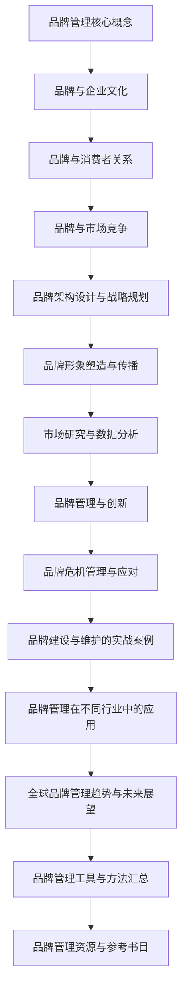

                 

## 文章标题

《品牌管理：塑造强大企业形象的方法》

品牌管理在现代商业环境中扮演着至关重要的角色，它不仅关乎企业的市场竞争力和盈利能力，更关系到企业的长远发展和声誉建设。本文将深入探讨品牌管理的核心概念、方法、技术和实践，旨在为读者提供一套系统化、实用化的品牌管理指南。

### 文章关键词

- 品牌管理
- 企业形象
- 市场研究
- 消费者关系
- 创新思维
- 数字化技术

### 文章摘要

本文从品牌管理的核心概念出发，详细阐述了品牌管理的重要性及其与企业文化、市场竞争的关联。接着，通过品牌架构设计与战略规划，探讨了品牌定位与品牌个性设计等关键环节。随后，文章重点介绍了市场研究方法与数据分析在品牌管理中的应用，包括消费者行为分析和市场调研。在此基础上，文章进一步讨论了品牌管理与创新的结合，以及品牌危机管理的策略。文章还通过实战案例展示了品牌建设与维护的具体步骤，并分析了品牌管理在不同行业中的应用。最后，文章展望了全球品牌管理的趋势与未来，提出了数字化技术对品牌管理的影响及应对策略。

----------------------------------------------------------------

### 目录大纲：《品牌管理：塑造强大企业形象的方法》

#### 目录

1. **引言**
   - 品牌管理的定义与重要性
   - 文章结构安排与阅读指南

2. **品牌管理的核心概念与理论**
   - 品牌的定义与作用
   - 品牌管理的定义与目标
   - 品牌管理的历史与发展

3. **品牌核心概念的关联与联系**
   - 品牌与企业文化
   - 品牌与消费者关系
   - 品牌与市场竞争

4. **品牌架构设计与战略规划**
   - 品牌架构设计原理
   - 品牌延伸策略
   - 品牌战略规划与执行

5. **品牌形象塑造与传播**
   - 品牌定位与品牌个性
   - 品牌视觉识别系统设计
   - 品牌传播策略与媒介运用

6. **品牌管理的技术与方法**
   - 市场研究方法与工具
   - 数据分析在品牌管理中的应用
   - 消费者行为分析

7. **品牌管理与创新**
   - 创新思维与方法
   - 新产品开发与品牌延伸
   - 品牌创新案例研究

8. **品牌危机管理与应对**
   - 品牌危机的类型与成因
   - 品牌危机应对策略
   - 品牌危机管理案例分析

9. **品牌建设与维护的实战案例**
   - 品牌建设实施步骤
   - 品牌维护与更新策略
   - 成功品牌案例剖析

10. **品牌管理在不同行业中的应用**
    - 消费品行业品牌管理
    - 服务业品牌管理
    - 高科技行业品牌管理

11. **全球品牌管理趋势与未来展望**
    - 全球品牌管理趋势分析
    - 数字化技术在品牌管理中的应用
    - 品牌管理的未来发展趋势

12. **附录**
    - 品牌管理工具与方法汇总
    - 品牌管理资源与参考书目

### 目录解释

本文的目录结构分为三个主要部分：品牌管理的核心概念与理论、品牌管理的技术与方法、以及品牌管理的实践与应用。首先，品牌管理的核心概念与理论部分包括品牌管理的定义、品牌核心概念的关联，以及品牌架构设计与战略规划。这些章节旨在为读者奠定品牌管理的基本理论基础。

其次，品牌管理的技术与方法部分涉及市场研究方法与工具、数据分析在品牌管理中的应用、消费者行为分析等。这部分内容详细阐述了品牌管理过程中使用的关键技术和工具，帮助读者了解如何在实践中有效运用这些技术。

最后，品牌管理的实践与应用部分通过实战案例展示了品牌建设的具体步骤，分析了品牌管理在不同行业中的应用，并展望了全球品牌管理的趋势与未来。附录部分提供了品牌管理工具与方法汇总及参考书目，方便读者进一步学习和研究。

通过这种结构化的布局，本文旨在为读者提供一个全面、系统的品牌管理指南，帮助读者深入理解和掌握品牌管理的核心知识和实践方法。

### 引言

品牌管理在现代商业环境中占据了至关重要的地位。随着市场竞争的加剧和消费者需求的日益多样化，品牌不再仅仅是一个标识或名称，而是企业核心竞争力的象征。一个成功的品牌能够帮助企业在众多竞争者中脱颖而出，赢得消费者的信任和忠诚，从而实现长期的商业成功。

#### 品牌管理的定义与重要性

品牌管理是指通过系统化的策略和方法，对品牌的各个维度进行规划、实施和监控，以实现品牌价值的最大化。它涵盖了品牌定位、品牌形象塑造、品牌传播、消费者关系管理等多个方面。品牌管理的核心目标是提升品牌的知名度、美誉度和忠诚度，从而增强企业的市场竞争力和盈利能力。

品牌管理的重要性体现在以下几个方面：

1. **提高市场竞争力**：品牌管理能够帮助企业明确品牌定位，打造独特的品牌形象，从而在激烈的市场竞争中脱颖而出。

2. **增强消费者忠诚度**：通过品牌管理，企业可以与消费者建立长期稳定的信任关系，提高消费者的品牌忠诚度。

3. **提升企业价值**：品牌是企业的无形资产，一个强大的品牌能够提升企业的整体价值和市场估值。

4. **指导营销策略**：品牌管理为企业提供了明确的方向和指导，使营销策略更加精准和有效。

#### 文章结构安排与阅读指南

本文旨在为读者提供一个全面、系统的品牌管理指南，涵盖品牌管理的核心概念、技术方法、实践应用和未来趋势。文章结构安排如下：

1. **品牌管理的核心概念与理论**：介绍品牌管理的基本概念，包括品牌定义、品牌管理目标和发展历程。

2. **品牌核心概念的关联与联系**：探讨品牌与企业文化、消费者关系、市场竞争等方面的关联，帮助读者理解品牌管理的复杂性和多样性。

3. **品牌架构设计与战略规划**：详细讲解品牌架构设计原理、品牌延伸策略和品牌战略规划与执行。

4. **品牌形象塑造与传播**：阐述品牌定位与品牌个性设计、品牌视觉识别系统设计以及品牌传播策略与媒介运用。

5. **品牌管理的技术与方法**：介绍市场研究方法与工具、数据分析在品牌管理中的应用、消费者行为分析等。

6. **品牌管理与创新**：讨论创新思维与方法、新产品开发与品牌延伸，以及品牌创新案例研究。

7. **品牌危机管理与应对**：分析品牌危机的类型与成因、品牌危机应对策略以及品牌危机管理案例分析。

8. **品牌建设与维护的实战案例**：通过具体案例展示品牌建设的实施步骤和维护策略。

9. **品牌管理在不同行业中的应用**：分析消费品行业、服务业和高科技行业中的品牌管理实践。

10. **全球品牌管理趋势与未来展望**：探讨全球品牌管理趋势、数字化技术在品牌管理中的应用以及未来发展趋势。

通过本文的阅读，读者可以系统地了解品牌管理的各个方面，掌握品牌管理的核心知识和实践方法，为企业的品牌建设和管理提供有力支持。

### 品牌管理的核心概念与理论

品牌管理作为现代商业战略的重要组成部分，其核心概念和理论基础涵盖了品牌的定义、品牌管理目标及其历史发展。以下是这些核心概念和理论的详细阐述。

#### 品牌的定义与作用

品牌是一种识别标志，它不仅仅是企业的标识或名称，更是企业价值和消费者体验的综合体现。品牌定义了企业的独特性和差异性，使得消费者能够在众多选择中快速识别并信任特定的企业或产品。

1. **品牌的组成要素**：

   - **名称**：品牌名称是品牌的核心要素，如苹果（Apple）、可口可乐（Coca-Cola）等。
   - **标志**：品牌的视觉标识，如苹果的苹果标志、可口可乐的波浪形瓶身等。
   - **口号**：品牌的宣传语，如苹果的“Think Different”等。
   - **个性**：品牌所传递的独特气质和风格，如苹果的创新和高端形象。
   - **价值观**：品牌所倡导的核心理念，如星巴克（Starbucks）的“热情服务”等。

2. **品牌的作用**：

   - **识别与区分**：品牌帮助消费者在众多产品和服务中识别和区分企业及其产品。
   - **信任与忠诚**：品牌建立消费者的信任，提升消费者对企业的忠诚度。
   - **价值提升**：品牌能够提升企业的市场估值和品牌价值。
   - **差异化**：品牌使企业能够在市场中脱颖而出，实现差异化竞争。

#### 品牌管理的定义与目标

品牌管理是指通过系统化的策略和方法，对品牌的各个方面进行规划、实施和监控，以实现品牌价值的最大化。品牌管理的目标是确保品牌在市场中具有竞争优势，并能持续创造价值。

1. **品牌管理的定义**：

   - **品牌定位**：确定品牌在市场中的位置，使其在消费者心中形成独特的认知。
   - **品牌形象塑造**：通过视觉和传播手段，建立和维护品牌的形象和声誉。
   - **品牌传播**：通过各种渠道和手段，向目标受众传递品牌信息，提升品牌知名度。
   - **品牌维护**：定期评估品牌表现，确保品牌与消费者期望保持一致。

2. **品牌管理的目标**：

   - **品牌知名度**：提升品牌在消费者心中的认知度。
   - **品牌忠诚度**：培养消费者对品牌的长期信任和忠诚。
   - **品牌美誉度**：增强品牌在公众中的正面形象和口碑。
   - **品牌延伸**：通过品牌影响力拓展到新的产品或市场。

#### 品牌管理的历史与发展

品牌管理的历史可以追溯到20世纪初期，随着市场营销理论的兴起，品牌逐渐成为企业竞争的重要手段。以下是品牌管理的发展历程：

1. **早期品牌管理**（20世纪20年代至50年代）：

   - **品牌定位**：品牌管理初步形成，企业开始关注品牌在市场中的定位。
   - **广告宣传**：广告成为品牌传播的主要手段，企业通过广告宣传提升品牌知名度。

2. **品牌发展时期**（20世纪60年代至80年代）：

   - **品牌延伸**：企业开始通过品牌延伸策略，将品牌应用到新的产品或市场。
   - **品牌形象**：品牌形象设计成为品牌管理的重要组成部分，企业通过视觉识别系统提升品牌形象。

3. **品牌管理成熟期**（20世纪90年代至今）：

   - **数字化品牌管理**：随着互联网的普及，品牌管理逐渐数字化，企业通过在线平台和社交媒体进行品牌传播。
   - **消费者关系管理**：品牌管理更加注重与消费者的互动和关系管理，通过消费者数据分析提升品牌忠诚度。

#### 品牌管理中的核心概念关联

品牌管理涉及多个核心概念，这些概念相互关联，共同构成品牌管理的理论基础。以下是这些核心概念及其关联：

1. **品牌与企业文化**：

   - 品牌是企业文化的外在体现，企业文化决定了品牌的价值观和行为准则。
   - 企业文化对品牌定位、品牌形象塑造和品牌传播有深远影响。

2. **品牌与消费者关系**：

   - 品牌与消费者之间的关系是品牌管理的关键，品牌需要通过满足消费者需求和提供优质服务来建立和维护这种关系。
   - 消费者反馈和行为数据对品牌管理具有重要的指导意义。

3. **品牌与市场竞争**：

   - 品牌管理需要关注市场竞争，通过差异化策略和品牌定位提升品牌竞争力。
   - 品牌竞争中的市场动态和消费者行为分析是品牌管理的重要参考。

通过上述核心概念和理论，品牌管理能够更好地指导企业在复杂多变的市场环境中进行品牌建设和管理，实现长期的商业成功。

### 品牌核心概念的关联与联系

在品牌管理过程中，品牌与企业文化、品牌与消费者关系、以及品牌与市场竞争的关联与联系是确保品牌策略成功实施的关键要素。以下分别对这些关联进行详细探讨。

#### 品牌与企业文化

品牌是企业文化的外在体现，企业文化则是品牌的内在灵魂。企业文化决定了品牌的价值观、行为准则和发展方向，而品牌则通过外在形象将企业文化传递给消费者。

1. **企业文化对品牌的影响**：

   - **价值观**：企业价值观直接影响品牌价值观，如华为强调“为客户创造价值”，这一价值观体现在其产品和服务中，形成了华为独特的品牌形象。
   - **行为准则**：企业行为准则塑造了品牌的行为风格，如星巴克的“第三空间”理念，使其成为人们社交和休息的场所。
   - **品牌定位**：企业文化决定了品牌的定位，如苹果公司以创新和技术领先为特色，这成为其品牌的核心定位。

2. **品牌对企业文化的作用**：

   - **文化传递**：品牌作为企业文化的载体，将企业文化传递给消费者，增强消费者对企业的认同感和信任。
   - **品牌声誉**：品牌声誉的提升有助于提升企业整体声誉，从而进一步巩固企业文化。

#### 品牌与消费者关系

品牌与消费者之间的关系是品牌管理的核心，良好的消费者关系能够增强品牌忠诚度，促进品牌成长。

1. **品牌对消费者关系的影响**：

   - **认知与识别**：品牌通过独特的标识和形象帮助消费者识别和记住企业及其产品。
   - **信任与忠诚**：品牌通过持续提供优质的产品和服务，建立消费者对品牌的信任，从而提升消费者忠诚度。
   - **互动与反馈**：品牌通过社交媒体、客户服务等方式与消费者互动，收集消费者反馈，不断优化产品和服务。

2. **消费者对品牌的影响**：

   - **需求驱动**：消费者的需求是品牌发展的驱动力，品牌需要密切关注消费者需求，提供符合市场需求的产品和服务。
   - **口碑传播**：消费者的口碑是品牌传播的重要渠道，积极正面的口碑能够提升品牌知名度和美誉度。
   - **创新导向**：消费者的反馈和行为数据为品牌创新提供了宝贵的参考，有助于品牌持续改进和优化。

#### 品牌与市场竞争

品牌在市场竞争中扮演着至关重要的角色，通过差异化策略和品牌定位，品牌能够提升市场竞争力，实现市场份额的增长。

1. **品牌对市场竞争的影响**：

   - **差异化**：品牌通过独特的产品特点、服务质量或品牌形象，在市场中实现差异化，吸引特定消费者群体。
   - **定位**：品牌定位明确企业的市场目标，有助于企业在竞争激烈的市场中找到自己的定位和优势。
   - **品牌延伸**：通过品牌延伸策略，企业可以将品牌影响力扩展到新的产品线或市场，增加市场份额。

2. **市场竞争对品牌的影响**：

   - **竞争压力**：市场竞争压力迫使品牌不断创新和优化，以保持市场竞争力。
   - **消费者行为**：市场竞争中的消费者行为变化对品牌管理提出了新的挑战，品牌需要灵活调整策略以适应市场变化。
   - **合作与竞争**：品牌在市场竞争中不仅要与其他品牌竞争，还要与供应链合作伙伴合作，共同提升市场竞争力。

综上所述，品牌与企业文化、品牌与消费者关系、以及品牌与市场竞争之间紧密联系，相互影响。品牌管理需要综合考虑这些因素，制定出符合企业战略和市场需求的品牌策略，从而实现品牌的长期成功。

#### 品牌架构设计与战略规划

品牌架构设计是品牌管理的重要环节，它不仅关系到品牌的市场表现，还直接影响到企业的战略规划。一个清晰、合理的品牌架构能够帮助企业在复杂的市场环境中保持一致性，提升品牌价值。

##### 品牌架构设计原理

品牌架构设计的基本原理包括品牌核心价值的提炼、品牌结构的设计和品牌关系的构建。

1. **品牌核心价值的提炼**：

   品牌核心价值是指品牌所倡导的核心理念和价值观，它是品牌创建和发展的基石。品牌核心价值的提炼需要从企业的愿景、使命和目标出发，结合市场定位和消费者需求，明确品牌要传递的独特价值。

   - **步骤**：
     - **确定企业愿景和使命**：明确企业的发展方向和长远目标。
     - **市场调研**：分析目标市场的需求和竞争对手的定位。
     - **提炼核心价值**：结合企业愿景、市场调研结果，提炼出品牌的核心价值。

2. **品牌结构的设计**：

   品牌结构设计是指如何将品牌的核心价值通过不同的品牌形式呈现给消费者。品牌结构设计主要包括单一品牌结构、多品牌结构、品牌家族结构等。

   - **单一品牌结构**：适用于品牌知名度较高、产品线较为集中且市场定位明确的企业。
   - **多品牌结构**：适用于企业拥有多个子品牌，各自定位不同的市场。
   - **品牌家族结构**：适用于企业将品牌进行分级管理，如高端品牌和大众品牌。

3. **品牌关系的构建**：

   品牌关系的构建是指品牌如何在不同市场和消费者群体中建立联系。品牌关系构建的关键在于建立品牌之间的协同效应，通过品牌间的互补和延伸，提升整体品牌价值。

   - **品牌协同**：通过品牌间的互补和协同，实现资源的共享和优化。
   - **品牌延伸**：通过品牌延伸策略，将品牌的影响力扩展到新的产品或市场。

##### 品牌延伸策略

品牌延伸策略是指企业利用现有品牌的影响力，将品牌应用于新的产品或市场。品牌延伸策略的成功实施能够显著提升企业的市场占有率和品牌价值。

1. **产品线延伸**：

   产品线延伸是指企业在现有产品线的基础上，增加新的产品类别。产品线延伸的成功取决于新产品的市场定位和品牌形象的匹配度。

   - **步骤**：
     - **市场调研**：分析目标市场的需求和竞争对手的产品。
     - **产品定位**：明确新产品的市场定位和品牌形象。
     - **产品开发**：根据市场定位进行产品设计和开发。

2. **市场延伸**：

   市场延伸是指企业将品牌应用到新的市场。市场延伸的成功取决于品牌在目标市场的认知度和适应性。

   - **步骤**：
     - **市场选择**：选择具有潜力和适合品牌定位的新市场。
     - **市场调研**：分析目标市场的消费者行为和市场环境。
     - **市场进入策略**：制定适合目标市场的进入策略，如广告宣传、渠道建设等。

##### 品牌战略规划与执行

品牌战略规划是品牌管理的关键环节，它决定了品牌在未来的发展方向和目标。品牌战略规划需要从企业整体战略出发，明确品牌的目标、定位和实施路径。

1. **品牌目标**：

   品牌目标是指品牌在未来的发展方向和预期成果。品牌目标需要与企业整体战略保持一致，明确品牌在市场中的定位和竞争优势。

   - **步骤**：
     - **确定企业整体战略**：明确企业的发展方向和目标。
     - **分析市场环境**：分析市场趋势和竞争对手的情况。
     - **设定品牌目标**：根据企业整体战略和市场环境，设定品牌的目标。

2. **品牌定位**：

   品牌定位是指品牌在市场中的独特价值和目标受众。品牌定位需要明确品牌的核心价值、目标市场以及竞争优势。

   - **步骤**：
     - **确定品牌核心价值**：提炼品牌的核心价值和独特卖点。
     - **分析目标市场**：确定目标市场和消费者群体。
     - **设定品牌定位**：根据品牌核心价值和目标市场，设定品牌的定位。

3. **品牌实施路径**：

   品牌实施路径是指品牌战略的具体执行步骤和措施。品牌实施路径需要明确品牌战略的关键节点和行动方案。

   - **步骤**：
     - **制定行动计划**：根据品牌目标和定位，制定具体的行动计划。
     - **资源分配**：明确品牌战略实施所需的资源和投入。
     - **执行与监控**：执行行动计划，并对品牌战略的实施进行监控和调整。

通过品牌架构设计与战略规划，企业能够建立强大的品牌体系，提升品牌的市场竞争力和影响力。品牌延伸策略的成功实施能够进一步扩大品牌的市场份额，增强品牌的价值。品牌战略规划与执行则为品牌的长期发展提供了明确的指导和保障。

### 品牌形象塑造与传播

品牌形象塑造与传播是品牌管理的重要组成部分，它关系到品牌在消费者心目中的认知和定位。一个成功的品牌形象能够帮助企业在众多竞争者中脱颖而出，赢得消费者的信任和忠诚。

#### 品牌定位与品牌个性

品牌定位是品牌形象塑造的基础，它明确了品牌在市场中的独特价值和目标受众。品牌定位需要结合企业的愿景、使命和目标，以及市场的需求，进行系统化的分析和规划。

1. **品牌定位的步骤**：

   - **确定品牌愿景和目标**：明确品牌的发展方向和长远目标。
   - **分析市场环境**：了解市场趋势、竞争态势和消费者需求。
   - **提炼品牌核心价值**：从企业文化和市场分析中提炼出品牌的核心价值。
   - **设定目标受众**：确定品牌的目标消费者群体，明确品牌的受众特征和需求。
   - **形成品牌定位**：根据品牌核心价值和目标受众，设定品牌的市场定位。

2. **品牌个性和化名**：

   品牌个性是指品牌所具有的独特特质和气质，它能够帮助品牌在消费者心中形成独特的认知。品牌个性设计需要结合品牌定位，通过视觉、听觉和情感等元素进行塑造。

   - **步骤**：
     - **确定品牌形象**：根据品牌定位，设计品牌的形象和风格。
     - **提炼品牌化名**：为品牌命名，确保化名与品牌形象和定位相符。
     - **品牌形象传达**：通过品牌标志、广告语、包装设计等手段，将品牌形象传递给消费者。

#### 品牌视觉识别系统设计

品牌视觉识别系统（Visual Identity System，VIS）是品牌形象塑造的重要组成部分，它通过视觉元素将品牌的个性特点和价值传递给消费者。一个成功的品牌视觉识别系统能够增强品牌的识别度和记忆度。

1. **品牌标志设计**：

   品牌标志是品牌视觉识别系统的核心，它代表了品牌的形象和核心价值。品牌标志设计需要简洁、独特且易于识别。

   - **设计原则**：
     - **简洁性**：标志设计应简洁明了，避免过多的细节和元素。
     - **独特性**：标志应具有独特的视觉风格，使品牌在众多竞争者中脱颖而出。
     - **识别性**：标志应易于识别和记忆，便于消费者快速识别品牌。

2. **品牌色彩设计**：

   品牌色彩是品牌视觉识别系统的关键元素，它能够传递品牌的情感和价值观。品牌色彩设计需要与品牌形象和品牌定位相符。

   - **设计原则**：
     - **一致性**：品牌色彩应与品牌形象和品牌定位保持一致。
     - **情感性**：品牌色彩应能够传递品牌所倡导的情感和价值。
     - **多样性**：品牌色彩应具有多样性，以便在不同场景下应用。

3. **品牌字体设计**：

   品牌字体是品牌视觉识别系统的重要组成部分，它能够传递品牌的个性和风格。品牌字体设计需要与品牌标志和品牌色彩相协调。

   - **设计原则**：
     - **一致性**：品牌字体应与品牌标志和品牌色彩保持一致。
     - **可读性**：品牌字体应易于阅读，便于消费者识别和理解。
     - **个性化**：品牌字体应具有一定的个性化特征，使品牌在视觉上脱颖而出。

#### 品牌传播策略与媒介运用

品牌传播是品牌形象塑造的关键手段，它通过不同的传播渠道和媒介，将品牌信息传递给目标受众。一个成功的品牌传播策略能够提升品牌的知名度和美誉度。

1. **广告宣传**：

   广告宣传是品牌传播的传统手段，它通过电视、广播、报纸、杂志等媒介进行品牌推广。

   - **策略**：
     - **针对性**：广告宣传应针对目标受众进行，确保广告内容的精准传达。
     - **创新性**：广告宣传应具有创新性和独特性，吸引消费者的注意力。
     - **持续性**：广告宣传应保持持续性，形成品牌形象的长期记忆。

2. **社交媒体营销**：

   社交媒体营销是品牌传播的新兴手段，它通过社交媒体平台（如微博、微信、Facebook等）进行品牌推广。

   - **策略**：
     - **互动性**：社交媒体营销应注重与消费者的互动和沟通，提升品牌亲和力。
     - **内容性**：社交媒体营销应提供有价值的内容，吸引消费者的关注和参与。
     - **多样性**：社交媒体营销应采用多种形式，如图片、视频、文字等，提升传播效果。

3. **公共关系**：

   公共关系是品牌传播的重要手段，它通过新闻发布、媒体报道、公益活动等方式提升品牌形象。

   - **策略**：
     - **真实性**：公共关系活动应真实可信，提升品牌的社会责任感和公信力。
     - **创新性**：公共关系活动应具有创新性和独特性，吸引公众的关注和参与。
     - **持续性**：公共关系活动应保持持续性，形成品牌形象的长期记忆。

通过品牌定位与品牌个性、品牌视觉识别系统设计和品牌传播策略与媒介运用，企业能够建立强大的品牌形象，提升品牌的市场竞争力和影响力。

### 市场研究方法与工具

市场研究是品牌管理中的关键环节，它为品牌决策提供了科学依据。市场研究方法与工具的选择和应用决定了研究结果的准确性和可靠性。以下将详细介绍市场研究方法与工具，以及数据分析在品牌管理中的应用。

#### 市场研究方法

1. **定性研究**：

   定性研究主要通过深度访谈、小组座谈、焦点小组讨论等方式，深入了解消费者的需求和态度。定性研究的优点在于能够获得深入、详细的信息，但样本量较小，结果具有一定的主观性。

   - **适用场景**：适合用于新产品开发、品牌定位和市场细分等。

2. **定量研究**：

   定量研究主要通过问卷调查、实验研究等方式，对大量样本进行统计分析，以获取客观数据。定量研究的优点在于样本量大，结果具有较高的可信度。

   - **适用场景**：适合用于市场趋势分析、消费者行为分析和市场预测等。

3. **混合研究**：

   混合研究结合了定性研究和定量研究的优点，通过多种方法相结合，获取全面、深入的市场信息。

   - **适用场景**：适合用于复杂的市场研究和战略决策。

#### 市场研究工具

1. **问卷调查**：

   问卷调查是市场研究中最常用的工具之一，可以通过线上或线下方式收集大量数据。问卷调查的设计和有效性对研究结果具有重要影响。

   - **设计原则**：
     - **清晰明确**：问题表述应清晰明确，避免歧义。
     - **逻辑性**：问题排列应具有逻辑性，使受访者能够顺畅作答。
     - **多样性**：问题类型应多样化，包括选择题、判断题、填空题等。

2. **焦点小组**：

   焦点小组是由一组具有共同特征或需求的受访者组成，通过小组讨论的方式，深入探讨市场问题和消费者态度。

   - **优点**：能够快速获得深入、详细的信息，有助于发现潜在问题和机会。

3. **深度访谈**：

   深度访谈是针对单个受访者进行深入访谈，以获取其对市场问题和品牌的深刻见解。

   - **优点**：能够获得个性化、深入的信息，有助于理解受访者的真实想法和需求。

#### 数据分析在品牌管理中的应用

数据分析是品牌管理中的核心环节，它通过对市场数据的分析，帮助企业制定科学的品牌策略。

1. **消费者行为分析**：

   消费者行为分析通过对消费者购买行为、浏览行为、评论行为等数据的分析，了解消费者的需求和行为模式，为品牌策略提供依据。

   - **分析维度**：
     - **购买频率**：分析消费者购买产品的频率，了解消费者对品牌的忠诚度。
     - **购买偏好**：分析消费者对产品的偏好，了解消费者的需求特点。
     - **评论分析**：分析消费者对产品的评论，了解消费者的满意度和反馈。

2. **市场趋势分析**：

   市场趋势分析通过对市场数据的分析，了解市场的发展趋势和变化，为品牌战略规划提供参考。

   - **分析维度**：
     - **市场规模**：分析市场的规模和发展趋势。
     - **市场份额**：分析品牌在市场中的份额和变化。
     - **竞争态势**：分析竞争对手的市场策略和表现。

3. **品牌评估分析**：

   品牌评估分析通过对市场数据的分析，评估品牌的市场表现和品牌价值，为品牌管理提供依据。

   - **分析维度**：
     - **品牌知名度**：分析品牌在消费者中的认知度和知名度。
     - **品牌美誉度**：分析品牌在消费者中的口碑和形象。
     - **品牌忠诚度**：分析消费者对品牌的忠诚度和依赖度。

通过市场研究方法与工具的运用，以及数据分析在品牌管理中的应用，企业能够更好地了解市场动态和消费者需求，制定科学的品牌策略，提升品牌的市场竞争力。

### 消费者行为分析

消费者行为分析是品牌管理中的重要环节，它通过研究消费者的购买行为、偏好和反馈，为企业提供关键的市场洞察，从而制定更有效的品牌策略。以下将详细探讨消费者行为分析的方法、步骤和应用。

#### 方法

1. **购买行为分析**：

   购买行为分析主要关注消费者在购买过程中的决策过程、购买频率和购买金额等。通过分析这些数据，企业可以了解消费者的消费习惯和偏好。

   - **关键指标**：
     - **购买频率**：消费者在一定时间内购买产品的次数。
     - **平均购买金额**：消费者每次购买的平均金额。
     - **购买周期**：消费者两次购买之间的时间间隔。

2. **偏好分析**：

   偏好分析关注消费者对不同品牌、产品、渠道等的偏好。通过分析消费者的偏好，企业可以了解消费者的需求特点，优化产品和服务。

   - **关键指标**：
     - **品牌偏好**：消费者对不同品牌的偏好程度。
     - **产品偏好**：消费者对不同产品的偏好。
     - **渠道偏好**：消费者对不同购买渠道的偏好。

3. **反馈分析**：

   反馈分析通过对消费者对产品和服务的评价、投诉和建议进行分析，了解消费者的满意度和不满意度，从而改进产品和服务。

   - **关键指标**：
     - **满意度评分**：消费者对产品和服务的整体满意度评分。
     - **投诉率**：消费者投诉的比例。
     - **改进建议**：消费者对产品和服务的改进建议。

#### 步骤

1. **数据收集**：

   通过问卷调查、在线调查、客户反馈等方式收集消费者的购买行为、偏好和反馈数据。

   - **注意事项**：
     - 确保数据的真实性和完整性。
     - 遵循隐私保护原则，确保消费者数据的安全。

2. **数据整理**：

   对收集到的数据进行整理和清洗，确保数据的质量和准确性。

   - **处理方法**：
     - 去除重复数据和无效数据。
     - 处理缺失数据和异常数据。

3. **数据分析**：

   使用统计方法和数据分析工具，对整理后的数据进行分析，提取关键信息。

   - **分析工具**：
     -  descriptive statistics（描述性统计）：用于描述数据的中心趋势和离散程度。
     -  regression analysis（回归分析）：用于预测消费者行为和偏好。
     -  factor analysis（因子分析）：用于分析消费者行为的影响因素。

4. **结果解读**：

   根据数据分析结果，解读消费者的行为模式、偏好和反馈，形成市场洞察。

   - **解读要点**：
     - 分析消费者行为的变化趋势。
     - 对比不同群体（如年龄、性别、收入等）的消费行为和偏好。
     - 提取消费者对产品和服务的满意度。

#### 应用

1. **产品开发**：

   通过消费者行为分析，了解消费者的需求特点，优化产品设计和功能，开发出更符合消费者需求的产品。

   - **应用案例**：
     - 苹果公司通过消费者反馈，不断优化iPhone的摄像头性能和用户体验，满足消费者对高质量拍照的需求。

2. **市场营销**：

   根据消费者行为分析结果，制定更有针对性的市场营销策略，提升营销效果。

   - **应用案例**：
     - 耐克公司通过分析消费者的购买行为和偏好，为不同消费者群体推出定制化的运动鞋和装备，提升了市场竞争力。

3. **客户服务**：

   通过消费者反馈分析，改进客户服务，提升客户满意度和忠诚度。

   - **应用案例**：
     - 西南航空公司通过分析乘客的投诉和建议，不断改进客户服务流程，提升了乘客满意度。

通过消费者行为分析，企业能够深入了解消费者的需求和行为，从而制定更科学的品牌策略，提升市场竞争力和品牌价值。

### 品牌管理与创新

品牌管理与创新是提升品牌竞争力、实现品牌持续发展的关键。创新思维和方法是品牌管理中的重要组成部分，它们帮助企业发现新机遇、应对市场变化，从而保持品牌的活力和领先地位。

#### 创新思维与方法

1. **颠覆性创新**：

   颠覆性创新是指通过颠覆现有市场规则和消费者习惯，创造全新的市场机会。这种创新思维能够帮助企业打破传统限制，开辟新的市场空间。

   - **案例**：亚马逊通过电子商务颠覆了传统零售业，成为全球最大的在线零售平台。

2. **渐进式创新**：

   渐进式创新是指在现有产品或服务的基础上，通过不断改进和优化，提高产品性能或用户体验。这种创新思维能够帮助企业保持市场竞争力，满足消费者的需求变化。

   - **案例**：苹果公司通过不断升级iPhone的功能和设计，保持其在智能手机市场的领先地位。

3. **组合创新**：

   组合创新是将不同的元素或技术进行组合，创造出新的产品或服务。这种创新思维能够利用多种资源和技术，实现创新的突破。

   - **案例**：星巴克通过将咖啡文化与餐饮体验相结合，创造了一种独特的咖啡文化体验。

#### 新产品开发与品牌延伸

1. **新产品开发**：

   新产品开发是品牌创新的重要手段，通过不断推出新产品，满足消费者的新需求，提升品牌的竞争力。

   - **步骤**：
     - **市场调研**：了解消费者的需求和偏好，确定新产品开发的定位。
     - **概念验证**：开发新产品原型，进行市场测试，验证产品概念。
     - **产品开发**：根据市场反馈，优化产品设计和功能，进行大规模生产。

2. **品牌延伸**：

   品牌延伸是指利用现有品牌的影响力，将品牌应用于新的产品或市场。品牌延伸能够扩大品牌的市场覆盖面，提高品牌的认知度。

   - **策略**：
     - **相关延伸**：将品牌应用于与现有产品相关的其他产品，如苹果公司将其品牌应用于手表、耳机等产品。
     - **非相关延伸**：将品牌应用于与现有产品不相关的其他市场，如可口可乐公司将其品牌应用于运动饮料、果汁等产品。

#### 品牌创新案例研究

1. **谷歌**：

   谷歌是一家以创新著称的科技公司，其品牌创新主要体现在以下方面：

   - **持续的技术创新**：谷歌不断推出新的技术和产品，如Google Search、Google Maps、Google Drive等，保持其在科技领域的领先地位。
   - **品牌文化**：谷歌注重创新文化的建设，鼓励员工提出新想法，打造了一种自由、开放的工作环境。
   - **品牌延伸**：谷歌通过品牌延伸，将品牌应用于多个领域，如谷歌眼镜、谷歌智能家居等，扩大了品牌的影响力。

2. **特斯拉**：

   特斯拉是一家电动汽车制造商，其品牌创新主要体现在以下方面：

   - **技术创新**：特斯拉通过不断创新，推出如Model S、Model X等高性能电动汽车，改变了人们对电动汽车的看法。
   - **品牌形象**：特斯拉通过打造高品质、高性能的电动汽车，建立了独特的品牌形象，成为电动汽车市场的领导者。
   - **品牌传播**：特斯拉通过社交媒体、产品发布会等渠道，积极传播品牌信息，提升品牌知名度和美誉度。

通过品牌管理与创新的结合，企业能够不断提升品牌竞争力，实现持续发展。品牌创新不仅需要创新的思维和方法，还需要通过新产品开发、品牌延伸等手段，将创新理念转化为实际的市场成果。

### 品牌危机管理与应对

品牌危机管理是品牌管理中的一项关键任务，它涉及到如何识别、应对和处理品牌可能面临的危机。一个有效的品牌危机管理策略能够帮助企业迅速响应危机，降低危机对企业声誉和运营的影响。

#### 品牌危机的类型与成因

1. **品牌危机的类型**：

   - **产品质量问题**：产品质量问题可能导致消费者对品牌的信任受损，如食品中毒、产品召回等。
   - **负面新闻报道**：负面新闻报道，如企业违法违规行为、安全事故等，可能对品牌形象造成严重影响。
   - **网络谣言**：网络谣言的传播可能迅速引发公众对品牌的负面评价，如虚假广告、负面评论等。
   - **品牌声誉危机**：品牌声誉危机通常由多方面原因导致，如品牌理念与消费者价值观不符、品牌传播失误等。

2. **品牌危机的成因**：

   - **内部管理问题**：内部管理不善、操作失误、员工违规行为等可能导致品牌危机。
   - **市场竞争压力**：竞争对手的恶意攻击、市场环境的剧变等可能导致品牌危机。
   - **消费者行为**：消费者的负面反馈、投诉、社交媒体上的负面评论等可能导致品牌危机。
   - **技术变革**：技术变革可能导致现有产品的过时或新技术的冲击，影响品牌的市场地位。

#### 品牌危机应对策略

1. **危机预警系统**：

   - **实时监控**：建立实时监控机制，通过新闻媒体、社交媒体、网络论坛等渠道，监测品牌可能面临的危机。
   - **数据分析**：利用数据分析工具，分析消费者反馈和行为数据，提前识别潜在危机。
   - **危机演练**：定期进行危机演练，提高企业对危机的应对能力和反应速度。

2. **危机响应机制**：

   - **快速响应**：在危机发生的第一时间，迅速采取行动，防止危机扩散。
   - **沟通协调**：加强与内部各部门、外部合作伙伴、媒体和消费者的沟通，确保信息传递的一致性和及时性。
   - **危机声明**：发布正式的危机声明，明确危机事实、影响范围和应对措施，赢得公众的理解和支持。

3. **危机处理与恢复**：

   - **问题解决**：积极采取措施解决危机问题，如召回问题产品、整改违规行为等。
   - **品牌重建**：通过危机后的品牌重建活动，修复品牌形象，恢复消费者信任。
   - **危机总结**：对危机事件进行总结和反思，找出危机产生的原因，制定预防措施，防止类似危机的再次发生。

#### 品牌危机管理案例分析

1. **强生婴儿爽身粉事件**：

   2018年，强生公司因婴儿爽身粉中含有致癌物质，面临严重的品牌危机。以下是强生公司的应对策略：

   - **危机预警**：强生公司通过市场调研和消费者反馈，提前了解潜在危机。
   - **危机响应**：强生公司在危机爆发后，迅速发布声明，承认问题并暂停销售相关产品。
   - **危机处理**：强生公司开展召回行动，更换产品配方，积极应对消费者的投诉和担忧。
   - **品牌重建**：强生公司通过公益活动和品牌传播，重建消费者对品牌的信任，恢复品牌形象。

2. **宝洁公司福寿草事件**：

   2019年，宝洁公司旗下的福寿草保健品被曝含有违禁药物，引发消费者担忧。以下是宝洁公司的应对策略：

   - **危机预警**：宝洁公司通过内部审计和市场监管，及时发现并报告问题。
   - **危机响应**：宝洁公司迅速召回问题产品，并向消费者道歉，保证产品质量。
   - **危机处理**：宝洁公司加大产品质量检测力度，确保产品安全，积极回应消费者疑问。
   - **品牌重建**：宝洁公司通过强化产品质量管理和品牌宣传，提升消费者对品牌的信任。

通过品牌危机管理案例分析，可以看出，有效的品牌危机管理不仅需要及时应对危机，还需要在危机后积极重建品牌形象，恢复消费者信任。品牌危机管理是企业持续发展的关键保障。

### 品牌建设与维护的实战案例

在品牌建设与维护的过程中，企业通过系统的策略和实践，成功地塑造和巩固了品牌形象。以下将介绍几个成功品牌建设与维护的实战案例，并详细分析其实施步骤和维护策略。

#### 案例一：苹果公司

**背景**：
苹果公司作为全球知名科技公司，通过不断创新和卓越的产品设计，建立了强大的品牌形象。

**实施步骤**：
1. **明确品牌定位**：
   - 苹果品牌定位为高端科技产品，以创新、设计和技术领先为特色。
   - 定位策略聚焦于追求卓越的用户体验和高端市场的需求。

2. **品牌形象塑造**：
   - 苹果通过独特的产品设计、简洁的包装和统一的品牌视觉识别系统，塑造了独特的品牌形象。
   - 品牌标志、广告语和宣传材料均体现出苹果的创新和高端特点。

3. **品牌传播**：
   - 苹果通过全球性的广告投放、社交媒体营销和产品发布会，不断强化品牌传播。
   - 通过与明星代言和限量版产品，提高品牌的曝光度和吸引力。

4. **消费者互动**：
   - 苹果积极与消费者互动，通过在线社区、顾客支持服务和产品反馈机制，建立良好的消费者关系。
   - 定期举办开发者大会和用户交流活动，增强品牌与消费者之间的联系。

**维护策略**：
1. **持续创新**：
   - 苹果持续进行技术研发和产品创新，保持其在科技领域的领先地位。
   - 通过定期发布新产品和更新，满足消费者的需求，保持品牌的活力。

2. **品牌保护**：
   - 苹果通过专利保护和法律手段，维护品牌知识产权，防止品牌侵权和假冒伪劣产品的出现。

3. **危机管理**：
   - 苹果建立了完善的危机管理体系，及时应对产品问题和市场负面报道。
   - 通过透明沟通和积极应对，降低危机对企业声誉的影响。

#### 案例二：星巴克

**背景**：
星巴克作为全球最大的咖啡连锁品牌，通过独特的品牌文化和优质的顾客服务，赢得了消费者的喜爱。

**实施步骤**：
1. **品牌定位**：
   - 星巴克定位为“第三空间”，提供不仅是咖啡，更是一种生活方式和社交体验。
   - 目标受众包括年轻一代、商务人士和咖啡爱好者。

2. **品牌形象塑造**：
   - 星巴克通过温馨的店面设计、舒适的座椅布局和独特的咖啡文化，塑造了独特的品牌形象。
   - 品牌视觉识别系统简洁、大气，传递出温馨和舒适的品牌氛围。

3. **品牌传播**：
   - 星巴克通过全球性的广告投放、社交媒体营销和品牌活动，提升品牌知名度。
   - 通过赞助体育赛事和文化活动，增强品牌的社会责任感和文化认同。

4. **顾客体验**：
   - 星巴克注重顾客体验，通过个性化的服务、定期的促销活动和会员制度，提升顾客满意度。
   - 通过线上和线下渠道，提供便捷的购物和消费体验。

**维护策略**：
1. **品牌活化**：
   - 星巴克定期推出新产品和季节性饮品，保持品牌的活力和新鲜感。
   - 通过特别活动和限量版产品，吸引顾客的持续关注。

2. **顾客关系管理**：
   - 星巴克通过星享俱乐部等会员制度，收集顾客数据，提供个性化的服务和优惠。
   - 通过顾客反馈机制，持续改进服务和产品，提升顾客满意度。

3. **社会责任**：
   - 星巴克积极履行社会责任，关注环境保护、员工权益和社会发展。
   - 通过可持续发展实践，提升品牌形象和社会影响力。

#### 案例三：可口可乐

**背景**：
可口可乐作为全球知名的饮料品牌，通过多年的品牌建设和市场推广，成为了消费者心中的经典品牌。

**实施步骤**：
1. **品牌定位**：
   - 可口可乐定位为“快乐饮料”，传递出积极、乐观的品牌形象。
   - 目标受众包括所有年龄段和不同文化背景的消费者。

2. **品牌形象塑造**：
   - 可口可乐通过经典的瓶型、红色标志和标志性的广告语“味道好极了”，塑造了独特的品牌形象。
   - 品牌视觉识别系统简洁、鲜明，具有高度的识别度。

3. **品牌传播**：
   - 可口可乐通过全球性的广告投放、赞助活动和社交媒体营销，提升品牌知名度。
   - 通过经典的广告创意和情感营销，建立品牌与消费者之间的情感联系。

4. **多元化产品线**：
   - 可口可乐通过推出多种口味和产品线，满足不同消费者的需求，扩展市场份额。

**维护策略**：
1. **品牌延伸**：
   - 可口可乐通过品牌延伸策略，将品牌应用到新的产品类别和市场。
   - 如推出运动饮料、果汁、水等新产品，扩大品牌的影响力。

2. **市场调研**：
   - 定期进行市场调研，了解消费者的需求和品牌表现，调整品牌策略。
   - 通过消费者反馈和行为数据，优化产品和服务。

3. **社会责任**：
   - 可口可乐积极履行社会责任，关注环境保护、社区发展和员工福利。
   - 通过可持续发展实践，提升品牌的社会形象和公信力。

通过上述实战案例，可以看出，成功的品牌建设与维护需要明确的品牌定位、有效的品牌形象塑造、创新的品牌传播策略以及与消费者的深度互动。这些策略的实施和持续优化，能够帮助企业建立强大的品牌形象，提升品牌价值和市场份额。

### 品牌管理在不同行业中的应用

品牌管理在不同行业中具有独特的实践和挑战，每个行业都需要根据自身的特点和市场需求，制定适合的品牌管理策略。以下分别探讨消费品行业、服务业和高科技行业中的品牌管理实践。

#### 消费品行业

消费品行业的品牌管理重点在于满足消费者的需求，建立忠诚的消费者群体。品牌管理策略包括：

1. **产品创新**：消费品行业竞争激烈，品牌需要不断推出符合市场趋势的新产品，以满足消费者的多样化需求。例如，可口可乐通过推出零糖饮料和不同口味的产品，吸引了更多健康意识的消费者。

2. **品牌形象塑造**：通过独特的产品设计、包装和广告，建立品牌形象。例如，苹果公司以其简约、高端的设计风格，赢得了大量消费者的喜爱。

3. **消费者互动**：通过社交媒体、会员制度和促销活动，与消费者建立紧密联系。例如，星巴克通过星享俱乐部，提供个性化服务和优惠，提升了顾客满意度。

4. **渠道管理**：优化销售渠道，确保产品能够快速、便捷地到达消费者。例如，亚马逊通过其强大的在线销售平台，实现了全球范围的快速配送。

#### 服务业

服务业中的品牌管理侧重于服务质量和服务体验。品牌管理策略包括：

1. **服务标准化**：通过制定标准化的服务流程和操作规范，确保服务质量的一致性。例如，麦当劳通过全球统一的服务流程，提升了品牌形象。

2. **品牌形象塑造**：通过环境设计、员工培训和宣传材料，建立独特的品牌形象。例如，瑞吉酒店集团以其豪华、舒适的住宿环境和服务，赢得了消费者的好评。

3. **客户关系管理**：通过客户关系管理系统（CRM），收集和分析客户数据，提供个性化的服务体验。例如，花旗银行通过CRM系统，了解客户的金融需求，提供定制化的服务方案。

4. **品牌传播**：利用社交媒体、网络广告和线下活动，提升品牌知名度和美誉度。例如，酒店品牌万豪通过社交媒体互动和线上营销，吸引了大量年轻消费者。

#### 高科技行业

高科技行业中的品牌管理侧重于技术创新和品牌差异化。品牌管理策略包括：

1. **技术创新**：持续投入研发，保持技术领先地位。例如，特斯拉通过自主研发的电池技术和自动驾驶技术，成为了电动汽车市场的领导者。

2. **品牌形象塑造**：通过技术创新故事和产品展示，建立专业、创新的品牌形象。例如，谷歌通过其强大的技术研发能力和创新文化，塑造了全球领先的科技品牌。

3. **品牌传播**：利用专业展会、技术论坛和媒体报道，展示品牌技术实力。例如，微软通过举办开发者大会和发布技术白皮书，提升了品牌的专业形象。

4. **客户关系管理**：通过技术支持和培训服务，建立与客户的长久合作关系。例如，思科通过提供专业的技术支持和培训服务，赢得了大量企业客户的信任。

#### 比较与挑战

消费品行业、服务业和高科技行业在品牌管理方面有显著的差异：

- **目标受众**：消费品行业的目标受众广泛，包括各个年龄层和消费水平的消费者；服务业的目标受众则更注重特定服务体验的消费者；高科技行业的目标受众主要是技术爱好者和专业用户。

- **竞争环境**：消费品行业竞争激烈，品牌需要不断创新和优化产品；服务业竞争也较为激烈，品牌需要提供优质的服务体验；高科技行业竞争主要在于技术创新和品牌差异化。

- **品牌传播渠道**：消费品行业和服务业主要依赖广告和公关活动；高科技行业则更多依赖于专业展会、技术论坛和媒体报道。

尽管存在差异，所有行业在品牌管理中都面临以下共同挑战：

- **消费者需求变化**：消费者需求快速变化，品牌需要及时调整策略，满足新的需求。
- **技术创新**：技术不断进步，品牌需要持续投入研发，保持技术领先。
- **市场竞争**：市场竞争激烈，品牌需要不断创新和优化，以保持市场竞争力。

通过上述实践和挑战，品牌管理在不同行业中发挥着重要作用，为企业的发展提供了强大的支持。

### 全球品牌管理趋势与未来展望

在全球化和数字化转型的背景下，品牌管理正经历深刻的变革。以下是几个关键趋势及其对未来品牌管理的影响。

#### 1. 数字化转型

数字化转型已经成为品牌管理的核心趋势。品牌通过社交媒体、在线广告、电子商务等数字化渠道，与消费者进行互动，提升品牌影响力和销售额。未来的品牌管理将更加依赖于数据分析、人工智能和云计算等技术，实现个性化营销和精准服务。

#### 2. 消费者体验优化

消费者体验是品牌管理的重点，未来的品牌管理将更加注重提供卓越的消费者体验。通过用户界面设计、客户关系管理（CRM）系统和个性化服务，品牌将能够更好地满足消费者的需求，提升消费者满意度和忠诚度。

#### 3. 社会责任

社会责任已经成为品牌管理的重要方面。消费者越来越关注企业的社会责任表现，品牌需要积极履行社会责任，关注环境保护、员工权益和社区发展。未来的品牌管理将更加注重可持续发展和社会价值，以提升品牌形象和消费者信任。

#### 4. 全球品牌战略

全球化使品牌能够拓展国际市场，但同时也带来了文化差异和本地化挑战。未来的品牌管理将更加注重全球化与本地化的平衡，品牌需要根据不同市场的需求和特点，制定适应性的品牌战略。

#### 5. 生态品牌管理

随着环保意识的提升，生态品牌管理逐渐成为趋势。品牌需要关注产品生命周期管理、资源利用和碳排放等问题，实现绿色生产和可持续发展。未来的品牌管理将更加注重生态品牌建设，以满足消费者对环保和可持续发展的需求。

#### 6. 技术创新驱动

技术创新是品牌管理的重要推动力。品牌需要不断投入研发，保持技术领先地位，利用新兴技术（如人工智能、物联网、虚拟现实等）提升品牌竞争力。未来的品牌管理将更加依赖于技术创新，以应对快速变化的市场环境。

#### 未来展望

未来的品牌管理将更加智能化、个性化和社会化。品牌将利用大数据、人工智能和区块链等技术，实现更加精准的品牌营销和消费者互动。同时，品牌管理将更加注重可持续发展和社会责任，以提升品牌形象和消费者信任。

品牌管理者需要具备前瞻性，紧跟全球品牌管理趋势，不断创新和优化品牌策略，以应对未来的挑战和机遇。通过数字化转型、消费者体验优化、社会责任、全球化与本地化平衡、生态品牌管理和技术创新，品牌管理将实现新的发展，为企业的长期成功奠定坚实基础。

### 附录A：品牌管理工具与方法汇总

#### 品牌管理工具

1. **Brandwatch**：
   - 功能：实时监控社交媒体上的品牌提及和消费者反馈。
   - 适用场景：用于品牌监测和声誉管理。

2. **KOLMA**：
   - 功能：用于品牌定位和竞争分析。
   - 适用场景：帮助企业找到最佳品牌定位策略。

3. **Google Analytics**：
   - 功能：网站流量分析和用户行为分析。
   - 适用场景：优化品牌推广策略和用户体验。

4. **Brand24**：
   - 功能：监控品牌在互联网上的所有提及。
   - 适用场景：快速了解市场反馈和声誉状况。

#### 品牌管理方法

1. **SWOT分析**：
   - 功能：评估品牌的优势、劣势、机会和威胁。
   - 适用场景：制定品牌战略和规划。

2. **STP模型**：
   - 功能：市场细分、目标市场选择和定位。
   - 适用场景：明确品牌的市场策略和目标。

3. **品牌延伸策略**：
   - 功能：通过扩展品牌的产品线或市场，增强品牌影响力。
   - 适用场景：实施品牌扩张和多元化战略。

4. **品牌活化**：
   - 功能：通过创新营销活动和品牌体验，激活品牌活力。
   - 适用场景：提升品牌知名度和消费者忠诚度。

### 附录B：品牌管理资源与参考书目

#### 参考书籍

1. **《品牌管理：战略、工具与实践》**，作者：唐·舒尔茨
   - 内容概要：详细介绍了品牌管理的核心概念、战略制定和实战应用。

2. **《品牌定位》**，作者：艾·里斯
   - 内容概要：探讨了品牌定位的核心原理和实践方法。

3. **《品牌突破：如何创建独一无二的品牌》**，作者：汤姆·彼得斯
   - 内容概要：阐述了如何通过创新和差异化策略，打造独特的品牌。

#### 学术论文与研究报告

1. **《消费者品牌体验研究》**，来源：市场营销学报
   - 内容概要：研究消费者品牌体验对品牌忠诚度和品牌评价的影响。

2. **《企业社会责任与品牌价值》**，来源：企业管理评论
   - 内容概要：分析企业社会责任对品牌价值的影响。

3. **《品牌管理的未来趋势》**，来源：品牌管理杂志
   - 内容概要：总结品牌管理的最新趋势和发展方向。

#### 在线课程与学习资源

1. **Coursera**：
   - 课程链接：[Brand Management: Strategy and Practice](https://www.coursera.org/learn/brand-management)

2. **edX**：
   - 课程链接：[Brands and Brand Management](https://www.edx.org/course/brands-and-brand-management)

3. **Brand Academy**：
   - 课程链接：[Brand Management Training and Certification](https://www.brandacademy.com/brand-management-training-and-certification)

通过上述资源，读者可以进一步深入学习和研究品牌管理，为实际工作提供有力支持。

### Mermaid 流程图



该 Mermaid 流程图展示了品牌管理的主要模块及其相互关系，为读者提供了一个清晰的品牌管理架构图。

### 核心算法原理讲解与伪代码

在品牌管理中，算法和数学模型的应用能够帮助企业和品牌决策者更好地理解市场动态、评估品牌价值，并制定有效的策略。以下将介绍品牌管理中常用的核心算法原理及其伪代码。

#### 1. 品牌价值评估模型

品牌价值评估是品牌管理中的一个重要环节，常用的模型包括基于顾客满意度（CSAT）、市场份额（Market Share）和品牌知名度（Brand Awareness）的综合评估模型。

**算法原理**：

品牌价值（Brand Value）可以通过以下公式计算：

$$
\text{Brand Value} = \alpha \times \text{CSAT} + \beta \times \text{Market Share} + \gamma \times \text{Brand Awareness}
$$

其中，$\alpha$、$\beta$ 和 $\gamma$ 分别是顾客满意度、市场份额和品牌知名度的权重系数。

**伪代码**：

```python
# 品牌价值评估模型伪代码

def calculate_brand_value(CSAT, MarketShare, BrandAwareness, alpha, beta, gamma):
    brand_value = alpha * CSAT + beta * MarketShare + gamma * BrandAwareness
    return brand_value

# 示例数据
CSAT = 0.8
MarketShare = 0.3
BrandAwareness = 0.6

# 系数设置
alpha = 0.5
beta = 0.3
gamma = 0.2

# 计算品牌价值
brand_value = calculate_brand_value(CSAT, MarketShare, BrandAwareness, alpha, beta, gamma)
print("品牌价值为：", brand_value)
```

#### 2. 消费者行为分析模型

消费者行为分析模型主要用于分析消费者的购买行为、偏好和反馈，帮助企业了解消费者的需求和行为模式。常用的模型包括回归分析和聚类分析。

**算法原理**：

假设我们使用回归分析模型来预测消费者的购买行为。回归模型的基本公式为：

$$
Y = \beta_0 + \beta_1X_1 + \beta_2X_2 + ... + \beta_nX_n
$$

其中，$Y$ 是因变量（如购买行为得分），$X_1, X_2, ..., X_n$ 是自变量（如年龄、收入、品牌偏好等），$\beta_0, \beta_1, \beta_2, ..., \beta_n$ 是回归系数。

**伪代码**：

```python
# 消费者行为分析模型伪代码

from sklearn.linear_model import LinearRegression

# 加载数据
X = [[age, income], [age, income], ...]  # 自变量数据
y = [purchase_behavior_score, purchase_behavior_score, ...]  # 因变量数据

# 创建回归模型
model = LinearRegression()

# 训练模型
model.fit(X, y)

# 输出回归系数
print("回归系数：", model.coef_)

# 预测新数据
new_data = [[new_age, new_income]]
predicted_value = model.predict(new_data)
print("预测购买行为得分：", predicted_value)
```

#### 3. 市场细分模型

市场细分是品牌管理中的重要步骤，它根据消费者的不同特征将市场划分为多个子市场。常用的市场细分方法包括聚类分析和因子分析。

**算法原理**：

假设我们使用聚类分析（如K-Means）进行市场细分。聚类分析的基本步骤包括：

1. 初始化聚类中心。
2. 计算每个数据点到聚类中心的距离。
3. 根据距离将数据点分配到最近的聚类中心。
4. 重新计算聚类中心，重复步骤2和3，直至聚类中心不再变化。

**伪代码**：

```python
# 市场细分模型（K-Means聚类分析）伪代码

from sklearn.cluster import KMeans

# 加载数据
data = [[age, income], [age, income], ...]  # 消费者数据

# 创建K-Means模型
kmeans = KMeans(n_clusters=3)

# 训练模型
kmeans.fit(data)

# 输出聚类结果
print("聚类中心：", kmeans.cluster_centers_)
print("每个数据点的聚类标签：", kmeans.labels_)

# 分析不同聚类群体的特征
for i in range(3):
    cluster_data = [data[j] for j in range(len(data)) if kmeans.labels_[j] == i]
    # 进一步分析cluster_data的特征
```

通过上述核心算法原理和伪代码，品牌管理者和决策者能够更好地理解品牌价值和消费者行为，为品牌管理和策略制定提供科学依据。

### 数学模型和数学公式 & 详细讲解 & 举例说明

在品牌管理中，数学模型和数学公式是评估品牌价值、消费者行为和市场趋势的重要工具。以下将介绍几个常用的数学模型和数学公式，并通过具体案例进行详细讲解。

#### 品牌价值评估模型

品牌价值评估模型用于量化品牌的经济价值。以下是一个基于顾客满意度（CSAT）、市场份额（Market Share）和品牌知名度（Brand Awareness）的综合评估模型。

**公式**：

$$
\text{Brand Value} = \alpha \times \text{CSAT} + \beta \times \text{Market Share} + \gamma \times \text{Brand Awareness}
$$

其中，$\alpha$、$\beta$ 和 $\gamma$ 分别是顾客满意度、市场份额和品牌知名度的权重系数。

**详细讲解**：

- **顾客满意度（CSAT）**：反映了消费者对品牌的整体满意度。通常通过问卷调查获取满意度评分，取值范围在0到1之间。
- **市场份额（Market Share）**：反映了品牌在市场中的竞争地位。通常以百分比表示，反映了品牌销售额占市场总销售额的比例。
- **品牌知名度（Brand Awareness）**：反映了消费者对品牌的认知程度。通常通过市场调研获取品牌认知度评分，取值范围在0到1之间。

**举例说明**：

假设某品牌的数据如下：

- 顾客满意度（CSAT）: 0.8
- 市场份额（Market Share）: 0.3
- 品牌知名度（Brand Awareness）: 0.6

且权重系数设定为：

- $\alpha = 0.5$
- $\beta = 0.3$
- $\gamma = 0.2$

我们可以计算该品牌的价值：

$$
\text{Brand Value} = 0.5 \times 0.8 + 0.3 \times 0.3 + 0.2 \times 0.6 = 0.4 + 0.09 + 0.12 = 0.61
$$

因此，该品牌的价值为0.61。

#### 消费者行为分析模型

消费者行为分析模型用于预测消费者的购买行为。以下是一个基于回归分析的消费者行为预测模型。

**公式**：

$$
Y = \beta_0 + \beta_1X_1 + \beta_2X_2 + ... + \beta_nX_n
$$

其中，$Y$ 是因变量（如购买行为得分），$X_1, X_2, ..., X_n$ 是自变量（如年龄、收入、品牌偏好等），$\beta_0, \beta_1, \beta_2, ..., \beta_n$ 是回归系数。

**详细讲解**：

- **因变量（Y）**：通常表示消费者的购买行为得分，可以通过问卷调查或购买记录获取。
- **自变量（X）**：表示影响消费者购买行为的各种因素，如年龄、收入、品牌偏好等。

**举例说明**：

假设我们收集了以下数据：

| 年龄（X1） | 收入（X2） | 购买行为（Y） |
|------------|------------|--------------|
| 25         | 50000      | 4            |
| 30         | 60000      | 5            |
| 35         | 70000      | 6            |

我们使用线性回归模型预测新的购买行为得分。首先，我们需要计算回归系数。这里我们使用最小二乘法（Least Squares）来计算回归系数。

通过计算，我们得到以下回归系数：

- $\beta_0 = 1$
- $\beta_1 = 0.1$
- $\beta_2 = 0.2$

因此，我们的回归模型为：

$$
Y = 1 + 0.1X_1 + 0.2X_2
$$

现在，假设我们要预测一个新消费者的购买行为，该消费者的年龄为30岁，收入为60000元。我们可以使用上述模型进行预测：

$$
Y = 1 + 0.1 \times 30 + 0.2 \times 60000 = 1 + 3 + 12000 = 12004
$$

因此，该新消费者的购买行为预测得分为12004。

#### 市场细分模型

市场细分模型用于将市场划分为不同的子市场，以便品牌能够更精准地定位和营销。以下是一个基于聚类分析的简单市场细分模型。

**公式**：

$$
C = \sum_{i=1}^{k} \pi_i \delta_i
$$

其中，$C$ 是消费者的市场细分结果，$\pi_i$ 是第$i$个细分市场的概率，$\delta_i$ 是消费者属于第$i$个细分市场的指标。

**详细讲解**：

- **细分市场概率（$\pi_i$）**：表示消费者属于第$i$个细分市场的概率。
- **细分市场指标（$\delta_i$）**：表示消费者是否属于第$i$个细分市场的指标，通常通过消费者的特征（如年龄、收入、购买行为等）计算。

**举例说明**：

假设我们使用K-Means聚类算法将市场划分为两个细分市场。我们首先计算每个细分市场的概率。假设我们有两个细分市场：

- 细分市场1的概率：$\pi_1 = 0.6$
- 细分市场2的概率：$\pi_2 = 0.4$

然后，我们计算一个新消费者的细分市场结果。该消费者的特征如下：

- 年龄：30岁
- 收入：60000元
- 购买行为：5

我们可以使用以下公式计算该消费者的细分市场结果：

$$
C = 0.6 \times \delta_1 + 0.4 \times \delta_2
$$

其中，$\delta_1 = 1$（表示该消费者属于细分市场1），$\delta_2 = 0$（表示该消费者不属于细分市场2）。

因此，该消费者的细分市场结果为：

$$
C = 0.6 \times 1 + 0.4 \times 0 = 0.6
$$

这意味着该消费者更有可能属于细分市场1。

通过上述数学模型和数学公式，品牌管理者和决策者能够更好地理解品牌价值、消费者行为和市场趋势，从而制定更科学、更有效的品牌管理策略。

### 项目实战

#### 实战背景

某知名化妆品公司希望在市场上推出一款全新产品线，为年轻女性提供高品质的护肤解决方案。公司决定通过市场研究和消费者数据分析，了解目标市场的需求和消费者行为，为新产品线的开发和营销策略提供科学依据。

#### 实战步骤

**步骤一：市场调研**

1. **确定调研目标**：
   - 了解目标市场的消费者特征和需求。
   - 探索潜在的产品机会和竞争态势。

2. **设计调研问卷**：
   - 问卷内容包括消费者基本信息、护肤习惯、产品偏好和购买行为。
   - 设计问题类型包括选择题、填空题和量表题。

3. **收集数据**：
   - 通过线上和线下渠道发放问卷，收集1000份有效问卷数据。

**步骤二：数据预处理**

1. **数据清洗**：
   - 去除重复和无效数据，确保数据质量。
   - 处理缺失数据和异常数据，确保数据的完整性。

2. **数据整理**：
   - 将数据整理成结构化的表格，方便后续分析。

**步骤三：数据分析**

1. **消费者行为分析**：
   - 分析消费者的护肤习惯和产品偏好。
   - 计算平均购买金额、购买频率和品牌忠诚度。

2. **市场趋势分析**：
   - 分析市场发展趋势和竞争态势。
   - 探索潜在的产品机会。

3. **消费者细分**：
   - 使用聚类分析将消费者划分为不同细分市场。
   - 分析各细分市场的特征和需求。

**步骤四：报告撰写**

1. **数据分析结果**：
   - 总结市场调研和数据分析的主要发现。
   - 提出针对目标市场的产品开发和营销策略建议。

2. **报告呈现**：
   - 制作数据分析报告，包括图表和可视化展示。
   - 提供详细的结论和建议，支持公司决策。

#### 开发环境搭建

1. **Python环境配置**：
   - 安装Python 3.8或更高版本。
   - 安装必需的库，如pandas、numpy、matplotlib、scikit-learn等。

2. **数据分析工具**：
   - 使用Jupyter Notebook进行数据分析和

