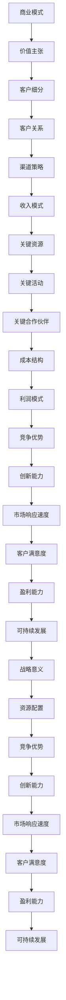
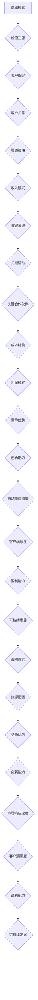
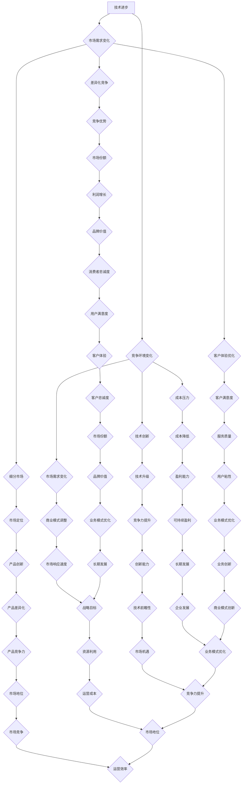

                 

# 商业模式：大模型创业的蓝图

## 关键词
- 商业模式
- 大模型创业
- 人工智能
- 平台商业模式
- 共享经济
- 商业模式创新

## 摘要
本文将深入探讨商业模式在大模型创业中的应用，首先从基本概念和构成入手，逐步分析商业模式的创新与演变，提供商业模式的评估方法和案例分析。接着，阐述商业模式设计的原则与流程，以及商业模式实现和风险管理的策略。通过本土化创新和国际化创新案例研究，总结商业模式设计的方法与实践，为创业者提供有价值的参考。

## 第1章 商业模式的基本概念与构成

### 1.1 商业模式定义与分类

#### 商业模式定义

商业模式是指企业在特定市场环境下，通过特定的价值主张、客户细分、渠道策略、收入模式、成本结构和利润模式等构成要素，实现企业价值创造和利润获取的方法和策略。

#### 商业模式分类

商业模式可以根据不同的维度进行分类，以下是几种常见的分类方式：

- **基于价值链的商业模式**：包括成本领先战略、差异化战略和集中化战略。
  - **成本领先战略**：通过大规模生产、低成本制造等方式降低成本，以较低的价格提供产品或服务。
  - **差异化战略**：通过独特的产品特性、品牌形象或服务质量等，提供与竞争对手不同的价值。
  - **集中化战略**：专注于特定的市场细分或特定地区，提供符合目标客户需求的独特价值。

- **基于资源整合的商业模式**：包括平台商业模式、生态系统商业模式和共享经济商业模式。
  - **平台商业模式**：通过构建一个开放的平台，连接供需双方，实现资源的有效配置和利用。
  - **生态系统商业模式**：通过构建一个完整的产业生态系统，实现各参与方之间的协同合作和共赢。
  - **共享经济商业模式**：通过共享闲置资源，实现资源的高效利用和降低成本。

### 1.2 商业模式的核心要素

#### 核心要素概述

商业模式的核心要素包括以下七个方面：

1. **价值主张**：企业为满足客户需求而提供的独特价值。
2. **客户细分**：将市场划分为不同的客户群体，为每个客户群体提供定制化的解决方案。
3. **客户关系**：企业与客户建立的关系类型和方式，包括关系营销、客户服务、客户忠诚度等。
4. **渠道策略**：企业选择和利用的渠道类型和方式，包括直销、分销、合作伙伴等。
5. **收入模式**：企业通过何种方式获得收入，包括一次性销售、订阅服务、广告收入等。
6. **关键资源**：企业为运营商业模式而需要的关键资源，包括资金、技术、人才、品牌等。
7. **关键活动**：为实现商业模式所需的关键活动，包括产品研发、市场推广、客户服务、供应链管理等。

### 1.3 商业模式与企业的关系

#### 商业模式对企业的战略意义

商业模式是企业实现战略目标的重要手段，具有以下战略意义：

1. **定位和方向**：商业模式明确了企业的市场定位、业务方向和目标客户群体。
2. **竞争优势**：商业模式帮助企业构建竞争优势，如低成本、差异化、集中化等。
3. **资源配置**：商业模式指导企业的资源分配和利用，优化资源配置效率。
4. **可持续发展**：商业模式关注企业的长期发展，确保企业的可持续发展能力。

#### 商业模式对企业竞争力的影响

商业模式对企业竞争力的影响主要体现在以下几个方面：

1. **创新能力**：商业模式鼓励企业进行创新，通过技术创新、产品创新、服务创新等方式提升竞争力。
2. **市场响应速度**：商业模式帮助企业快速响应市场变化，抓住市场机遇。
3. **客户满意度**：通过提供定制化的解决方案和优质的服务，提高客户满意度，增强客户忠诚度。
4. **盈利能力**：商业模式设计合理，有助于提高企业的盈利能力，实现可持续盈利。

### 1.4 商业模式的联系与结构

为了更好地理解和分析商业模式，可以使用Mermaid流程图来描述商业模式的核心概念和架构。



### 1.5 商业模式的核心概念与联系

为了进一步阐述商业模式的核心概念和联系，我们可以使用Mermaid流程图来描述。



通过这个流程图，我们可以清晰地看到商业模式各个要素之间的联系和相互作用，从而更好地理解和设计商业模式。

### 第2章 商业模式创新的驱动因素

#### 2.1 商业模式创新的驱动因素

商业模式创新是企业保持竞争优势、适应市场变化的必要手段。以下是商业模式创新的几个主要驱动因素：

##### 技术进步

技术进步是推动商业模式创新的关键因素之一。随着互联网、人工智能、物联网等技术的快速发展，企业可以借助这些新技术来重新定义产品、服务和业务流程，从而创造新的商业模式。

**技术进步对商业模式创新的推动作用**：

1. **提高效率**：新技术可以自动化和优化业务流程，降低成本，提高生产效率。
2. **创造新需求**：技术创新可以引发新的市场需求，为企业提供新的商机。
3. **改变竞争格局**：新技术的出现往往改变市场竞争格局，迫使企业进行商业模式创新以保持竞争力。

##### 市场需求变化

市场需求变化也是推动商业模式创新的重要因素。消费者的需求越来越多元化、个性化，这要求企业能够快速响应市场变化，提供定制化的产品和服务。

**市场需求变化对商业模式创新的驱动**：

1. **细分市场**：市场需求变化导致市场细分，企业可以针对不同的细分市场设计不同的商业模式。
2. **差异化竞争**：市场需求变化促使企业通过差异化竞争来满足消费者需求，从而创造新的商业模式。
3. **客户体验优化**：为了满足消费者对高品质服务的需求，企业需要通过创新来提升客户体验。

##### 竞争环境变化

竞争环境变化是推动商业模式创新的另一个关键因素。随着竞争的加剧，企业需要不断寻找新的竞争优势，通过商业模式创新来提升竞争力。

**竞争环境变化对商业模式创新的挑战**：

1. **成本压力**：竞争对手的价格竞争可能导致成本压力，企业需要通过创新来降低成本。
2. **技术创新**：竞争对手的技术创新可能改变市场格局，企业需要通过商业模式创新来应对。
3. **市场需求变化**：竞争对手的市场需求变化可能引发企业自身需求变化，需要调整商业模式以适应新的市场环境。

#### 2.2 商业模式创新的驱动因素分析

为了更深入地分析商业模式创新的驱动因素，我们可以使用Mermaid流程图来展示这些因素及其相互关系。



通过这个流程图，我们可以清晰地看到技术进步、市场需求变化和竞争环境变化如何共同驱动商业模式创新，以及这些驱动因素之间的相互关系。

### 第3章 商业模式分析方法与应用

#### 3.1 商业模式画布工具

商业模式画布是一种直观、易于理解的分析工具，用于分析和设计商业模式。它将商业模式的各个要素整合到一个统一的框架中，使得企业能够清晰地了解和优化其商业模式。

##### 商业模式画布的构成

商业模式画布通常包含以下九个关键要素：

1. **价值主张**：企业为满足客户需求而提供的独特价值。
2. **客户细分**：将市场划分为不同的客户群体，为每个客户群体提供定制化的解决方案。
3. **客户关系**：企业与客户建立的关系类型和方式，包括关系营销、客户服务、客户忠诚度等。
4. **渠道策略**：企业选择和利用的渠道类型和方式，包括直销、分销、合作伙伴等。
5. **收入模式**：企业通过何种方式获得收入，包括一次性销售、订阅服务、广告收入等。
6. **关键资源**：企业为运营商业模式而需要的关键资源，包括资金、技术、人才、品牌等。
7. **关键活动**：为实现商业模式所需的关键活动，包括产品研发、市场推广、客户服务、供应链管理等。
8. **关键合作伙伴**：与合作伙伴共同构建商业模式的要素，包括供应商、分销商、技术合作伙伴等。
9. **成本结构**：企业为运营商业模式而发生的成本，包括固定成本、可变成本、运营成本等。

##### 商业模式画布的应用实例

以下是一个简单的商业模式画布应用实例，以一家电子商务公司为例：

| 要素               | 描述                                                         |
|------------------|------------------------------------------------------------|
| 价值主张           | 为消费者提供高质量的数码产品和服务。                             |
| 客户细分           | 面向追求高品质生活、注重性价比的年轻消费者。                     |
| 客户关系           | 通过社交媒体和电子邮件与客户保持沟通，提供优质的客户服务。         |
| 渠道策略           | 通过官方网站、社交媒体平台和线下体验店进行销售。                  |
| 收入模式           | 主要通过商品销售和广告收入获得收入。                               |
| 关键资源           | 高素质的技术团队、高质量的库存和品牌影响力。                       |
| 关键活动           | 网站开发和维护、市场推广、商品采购和物流。                         |
| 关键合作伙伴           | 物流公司、广告合作伙伴、品牌代言人和供应商。                       |
| 成本结构           | 包括固定成本（如租金、员工工资）和可变成本（如商品采购、物流费用）。 |

通过这个实例，我们可以看到商业模式画布如何帮助企业和创业者梳理和分析商业模式的各个要素，从而优化和设计出更有效的商业模式。

#### 3.2 商业模式评估指标

商业模式评估指标是衡量商业模式成功与否的关键工具。通过设定和跟踪一系列评估指标，企业可以了解商业模式的绩效，并根据实际情况进行调整和优化。

##### 商业模式评估指标体系

一个完整的商业模式评估指标体系通常包括以下几个方面：

1. **盈利能力指标**：衡量商业模式的盈利能力，包括毛利率、净利润率、营业收入增长率等。
2. **市场份额指标**：衡量商业模式在市场上的地位，包括市场份额、市场覆盖率等。
3. **客户满意度指标**：衡量客户对产品和服务的满意度，包括客户满意度评分、客户保留率等。
4. **运营效率指标**：衡量商业模式的运营效率，包括库存周转率、应收账款周转率等。
5. **创新性指标**：衡量商业模式在创新方面的表现，包括新产品开发速度、专利数量等。

##### 关键绩效指标（KPI）的应用

以下是一个关键绩效指标（KPI）的示例：

**KPI：客户保留率**

**目标值：** 80%

**计算公式：** （当前月活跃用户数 - 本月流失用户数）/ 当前月活跃用户数 * 100%

通过跟踪和优化这个指标，企业可以了解客户保留情况，从而采取相应的措施提升客户满意度和忠诚度。

#### 3.3 商业模式分析方法

除了商业模式画布和关键绩效指标，还有其他一些常用的商业模式分析方法，如PEST分析、SWOT分析等。

##### PEST分析

PEST分析是一种外部环境分析工具，用于分析政治（Political）、经济（Economic）、社会（Social）和技术（Technological）等宏观环境因素对企业商业模式的影响。

**PEST分析的步骤：**

1. **政治因素**：包括政策法规、政府支持等。
2. **经济因素**：包括经济增长、市场需求、通货膨胀等。
3. **社会因素**：包括人口结构、文化趋势、社会价值观等。
4. **技术因素**：包括技术发展、技术创新、技术成本等。

**PEST分析的示例：**

| 因素   | 描述                                                         |
|------|------------------------------------------------------------|
| 政治因素 | 政府对互联网行业的监管政策日益严格，要求企业遵守相关法规。                       |
| 经济因素 | 全球经济不景气，消费者购买力下降，对企业收入产生影响。                           |
| 社会因素 | 消费者对环保和可持续发展的关注增加，推动企业进行绿色商业模式创新。                 |
| 技术因素 | 人工智能和物联网技术的快速发展，为商业模式创新提供了新的机会。                     |

通过PEST分析，企业可以更好地了解外部环境因素，从而制定相应的战略和策略。

##### SWOT分析

SWOT分析是一种内部环境分析工具，用于分析企业的优势（Strengths）、劣势（Weaknesses）、机会（Opportunities）和威胁（Threats）。

**SWOT分析的步骤：**

1. **优势**：分析企业的核心竞争力、独特优势等。
2. **劣势**：分析企业存在的不足、短板等。
3. **机会**：分析外部环境中可能为企业带来的机遇。
4. **威胁**：分析外部环境中可能对企业的威胁。

**SWOT分析的示例：**

| 因素   | 描述                                                         |
|------|------------------------------------------------------------|
| 优势   | 强大的技术研发能力，在人工智能领域具有领先地位。                       |
| 劣势   | 市场推广和品牌建设方面相对薄弱，缺乏市场知名度。                       |
| 机会   | 市场需求快速增长，为企业提供了广阔的发展空间。                           |
| 威胁   | 竞争对手的崛起，可能对企业的市场份额造成威胁。                           |

通过SWOT分析，企业可以更好地了解自身的优劣势，制定相应的战略和策略，抓住机遇，应对威胁。

### 第4章 商业模式案例研究

#### 4.1 成功商业模式案例

**亚马逊的商业模式分析**

**价值主张**：亚马逊提供了一个全球最大的在线零售平台，满足消费者的购物需求。通过多样化的产品选择、便捷的购物体验和高效的物流配送，为消费者提供了独特的价值。

**客户细分**：亚马逊针对不同的消费者群体提供了不同的服务。包括个人消费者、企业用户和第三方卖家。通过提供个性化的推荐和定制化的服务，满足不同客户群体的需求。

**客户关系**：亚马逊通过会员服务、客户评价系统、客服支持等手段建立了与客户的良好关系。通过收集和分析客户数据，提供个性化的推荐和服务，提高客户满意度和忠诚度。

**渠道策略**：亚马逊主要通过官方网站和移动应用程序进行销售。同时，通过与第三方卖家合作，扩大了产品种类和销售渠道。

**收入模式**：亚马逊的主要收入来源包括商品销售、广告收入和订阅服务。通过会员服务（如Amazon Prime），亚马逊获得了稳定的收入来源。

**关键资源**：亚马逊的关键资源包括技术平台、物流网络、大量商品库存和品牌影响力。

**关键活动**：亚马逊的关键活动包括产品采购、物流配送、市场推广和客户服务。

**关键合作伙伴**：亚马逊与第三方卖家、物流公司、广告合作伙伴和支付服务提供商等建立了紧密的合作关系。

**竞争优势**：亚马逊通过大规模运营、技术创新和强大的品牌影响力，在在线零售市场中建立了显著的竞争优势。

**创新能力**：亚马逊不断进行技术创新，如开发自动化仓库、无人机配送等，提高了运营效率和客户体验。

**市场响应速度**：亚马逊能够快速响应市场变化，通过推出新产品和服务，满足不断变化的消费者需求。

**客户满意度**：通过提供优质的客户服务和便捷的购物体验，亚马逊获得了高水平的客户满意度。

**盈利能力**：亚马逊通过多元化的收入模式和高效的运营管理，实现了稳定的盈利能力。

**可持续发展**：亚马逊致力于可持续发展，通过环保措施、社会责任项目等，提升了企业的社会形象和长期发展能力。

**战略意义**：亚马逊的商业模式为其他企业提供了成功的商业典范，具有重要的战略意义。

**资源配置**：亚马逊通过有效的资源配置，实现了业务的高效运营和可持续发展。

**竞争优势**：通过技术创新和运营效率的提升，亚马逊在在线零售市场中保持了竞争优势。

**创新能力**：亚马逊持续进行技术创新，如云计算、人工智能等，推动了商业模式的不断演进。

**市场响应速度**：亚马逊能够快速响应市场变化，通过大数据分析和人工智能技术，优化运营决策。

**客户满意度**：通过提供优质的客户体验和个性化的服务，亚马逊赢得了客户的信任和忠诚。

**盈利能力**：通过多元化的收入模式和高效的运营管理，亚马逊实现了稳定的盈利能力。

**可持续发展**：亚马逊通过环保措施和可持续发展项目，提升了企业的社会形象和长期发展能力。

**成功原因**：

1. **技术创新**：亚马逊不断进行技术创新，提高了运营效率和客户体验。
2. **多元化收入模式**：通过商品销售、广告收入和订阅服务等多元化收入模式，实现了稳定的盈利。
3. **强大的品牌影响力**：通过多年的品牌积累和用户口碑，亚马逊在市场中建立了强大的品牌影响力。
4. **卓越的客户体验**：亚马逊通过提供个性化的推荐和便捷的购物体验，赢得了客户的信任和忠诚。

**亚马逊的商业模式的启示**：

1. **技术创新**：通过技术创新提高运营效率和客户体验，是商业模式成功的关键。
2. **多元化收入模式**：通过多元化收入模式实现稳定的盈利，是企业发展的关键。
3. **客户体验**：提供优质的客户体验和个性化的服务，是赢得客户忠诚度的关键。

**迪士尼的商业模式创新**

**价值主张**：迪士尼提供多元化的娱乐内容和体验，包括电影、电视节目、主题公园、玩具等。通过丰富多彩的内容和独特的体验，为消费者带来了独特的娱乐价值。

**客户细分**：迪士尼针对不同年龄段的消费者提供不同的产品和服务。包括儿童、青少年、成年人和家庭等。通过多样化的内容和服务，满足不同客户群体的需求。

**客户关系**：迪士尼通过会员计划、订阅服务和品牌忠诚度活动等手段建立了与客户的良好关系。通过收集和分析客户数据，提供个性化的推荐和服务，提高客户满意度和忠诚度。

**渠道策略**：迪士尼主要通过电影院、电视、流媒体平台和实体商店等渠道进行销售。通过多元化的渠道，覆盖不同类型的消费者。

**收入模式**：迪士尼的主要收入来源包括电影票房、版权销售、流媒体订阅、主题公园门票和零售等。通过多元化的收入模式，实现了稳定的盈利。

**关键资源**：迪士尼的关键资源包括高质量的内容创作团队、强大的品牌影响力和全球化的运营能力。

**关键活动**：迪士尼的关键活动包括内容创作、品牌营销、主题公园运营和零售管理等。

**关键合作伙伴**：迪士尼与电影制作公司、流媒体平台、零售合作伙伴和主题公园合作伙伴等建立了紧密的合作关系。

**竞争优势**：迪士尼通过高质量的内容创作、全球化的运营和强大的品牌影响力，在娱乐行业中建立了显著的竞争优势。

**创新能力**：迪士尼不断进行内容创新和技术创新，如虚拟现实、增强现实等技术，提升了娱乐体验。

**市场响应速度**：迪士尼能够快速响应市场变化，通过大数据分析和人工智能技术，优化运营决策。

**客户满意度**：通过提供丰富多彩的内容和独特的体验，迪士尼赢得了客户的信任和忠诚。

**盈利能力**：通过多元化的收入模式和高效的运营管理，迪士尼实现了稳定的盈利能力。

**可持续发展**：迪士尼通过环保措施和可持续发展项目，提升了企业的社会形象和长期发展能力。

**战略意义**：迪士尼的商业模式为其他娱乐企业提供了成功的商业典范，具有重要的战略意义。

**资源配置**：迪士尼通过有效的资源配置，实现了业务的高效运营和可持续发展。

**竞争优势**：通过高质量的内容创作和全球化的运营，迪士尼在娱乐行业中保持了竞争优势。

**创新能力**：迪士尼持续进行内容创新和技术创新，推动了商业模式的不断演进。

**市场响应速度**：迪士尼能够快速响应市场变化，通过大数据分析和人工智能技术，优化运营决策。

**客户满意度**：通过提供丰富多彩的内容和独特的体验，迪士尼赢得了客户的信任和忠诚。

**盈利能力**：通过多元化的收入模式和高效的运营管理，迪士尼实现了稳定的盈利能力。

**可持续发展**：迪士尼通过环保措施和可持续发展项目，提升了企业的社会形象和长期发展能力。

**成功原因**：

1. **内容创新**：迪士尼不断进行内容创新，提供丰富多彩的娱乐内容，吸引了大量的消费者。
2. **品牌建设**：迪士尼通过多年的品牌建设，建立了强大的品牌影响力和用户忠诚度。
3. **全球化运营**：迪士尼在全球范围内进行运营，通过多元化的渠道和收入模式，实现了全球化的盈利。
4. **客户体验**：迪士尼注重客户体验，通过提供独特的娱乐内容和体验，赢得了客户的信任和忠诚。

**迪士尼的商业模式的启示**：

1. **内容创新**：提供丰富多彩的内容和独特的体验，是赢得客户忠诚度的关键。
2. **品牌建设**：建立强大的品牌影响力和用户忠诚度，是企业长期发展的关键。
3. **全球化运营**：通过全球化运营，实现业务的高效扩展和多元化盈利。

#### 4.2 失败商业模式案例分析

**贾跃亭乐视生态化反案例解析**

**价值主张**：乐视提出了“生态化反”理念，旨在构建一个涵盖内容、硬件、平台等多个领域的生态体系，为用户提供一站式的娱乐和生活服务。

**客户细分**：乐视针对不同的用户群体提供不同的产品和服务，包括影视爱好者、音乐爱好者、体育爱好者等。

**客户关系**：乐视通过会员服务、社区互动等方式与用户建立了紧密的关系。同时，通过大数据分析和用户反馈，不断优化产品和服务。

**渠道策略**：乐视主要通过线上渠道进行销售，包括官方网站、移动应用程序等。此外，还通过线下体验店和合作伙伴渠道进行推广。

**收入模式**：乐视的主要收入来源包括会员订阅、广告收入、硬件销售和版权销售等。

**关键资源**：乐视的关键资源包括内容资源、技术团队、品牌影响力等。

**关键活动**：乐视的关键活动包括内容创作、硬件研发、平台运营等。

**关键合作伙伴**：乐视与内容制作公司、硬件制造商、技术合作伙伴等建立了紧密的合作关系。

**竞争优势**：乐视通过构建生态体系，实现了跨领域整合和协同效应。同时，通过技术创新和优质的内容，在市场中建立了竞争优势。

**创新能力**：乐视不断进行技术创新和商业模式创新，如推出超级电视、超级手机等。

**市场响应速度**：乐视能够快速响应市场变化，通过大数据分析和用户反馈，优化产品和服务。

**客户满意度**：乐视通过提供多样化的产品和优质的服务，赢得了客户的信任和满意度。

**盈利能力**：乐视在生态体系构建过程中，由于资金链断裂和业务过度扩张，导致盈利能力不足。

**可持续发展**：乐视由于资金链断裂和业务模式问题，未能实现可持续发展。

**失败原因**：

1. **资金链断裂**：乐视在快速扩张过程中，由于资金链断裂，导致财务危机。
2. **业务模式过度多元化**：乐视试图同时进入多个领域，导致资源和精力分散，无法实现高效运营。
3. **市场竞争激烈**：在激烈的市场竞争中，乐视未能及时调整战略，应对竞争对手的挑战。

**乐视生态化反的教训**：

1. **合理规划资金链**：企业在扩张过程中，应合理规划资金链，避免过度依赖外部融资。
2. **聚焦核心业务**：企业应聚焦核心业务，避免业务过度多元化，导致资源分散。
3. **市场调研与战略调整**：企业应进行充分的市场调研，及时调整战略，以适应市场变化。

**乐视生态化反案例的启示**：

1. **商业模式创新**：通过构建生态体系，实现跨领域整合和协同效应，是企业发展的关键。
2. **风险控制**：企业在快速扩张过程中，应加强风险控制，避免资金链断裂。
3. **市场调研与战略调整**：企业应进行充分的市场调研，及时调整战略，以应对市场变化。

### 第5章 商业模式设计原则与流程

#### 5.1 商业模式设计原则

##### 创造价值的原则

商业模式的本质是为客户创造价值。企业在设计商业模式时，应首先明确为客户创造何种价值，以及如何通过有效的价值传递机制实现价值最大化。

**实现方法**：

1. **客户需求分析**：深入了解客户需求，确保商业模式能够满足客户的实际需求。
2. **差异化价值主张**：提供与竞争对手不同的差异化价值主张，使客户愿意为产品或服务支付溢价。
3. **价值传递机制**：通过有效的渠道、技术和运营策略，确保价值主张能够有效地传递给客户。

##### 客户需求导向的原则

商业模式设计应紧密围绕客户需求进行，以满足客户需求为核心目标。通过深入了解客户需求，企业可以设计出更具针对性的商业模式。

**实现方法**：

1. **用户画像**：通过用户画像技术，对目标客户进行细分，了解不同客户群体的需求和偏好。
2. **客户调研**：定期进行客户调研，收集用户反馈，了解客户的需求变化和痛点。
3. **快速迭代**：根据客户反馈，快速调整产品和服务，以更好地满足客户需求。

##### 可持续发展的原则

商业模式设计应考虑企业的长期可持续发展，包括财务、社会和环境等方面。通过可持续发展原则，企业可以确保商业模式的可持续性和竞争力。

**实现方法**：

1. **绿色商业**：通过绿色技术和环保措施，减少企业的环境负担，实现可持续发展。
2. **社会责任**：积极参与社会公益活动，提升企业的社会形象和品牌价值。
3. **财务稳健**：通过合理的财务规划和管理，确保企业的财务稳健和可持续发展。

#### 5.2 商业模式设计流程

##### 需求分析

需求分析是商业模式设计的第一步，通过深入了解客户需求和市场趋势，明确企业的价值主张和市场定位。

**实现方法**：

1. **市场调研**：通过市场调研，收集客户需求和市场趋势数据。
2. **用户访谈**：与目标客户进行深入访谈，了解他们的需求和痛点。
3. **SWOT分析**：分析企业的优势、劣势、机会和威胁，为商业模式设计提供参考。

##### 资源整合

资源整合是商业模式设计的关键环节，通过评估和整合企业内外部资源，确保商业模式的有效实施。

**实现方法**：

1. **内部资源评估**：评估企业内部的人力、技术、资金等资源，确定可利用的资源。
2. **外部资源合作**：寻找合适的合作伙伴，共同构建商业生态系统。
3. **资源优化**：通过资源整合和优化，提高资源利用效率，降低成本。

##### 业务模式构建

业务模式构建是商业模式设计的核心，通过明确价值主张、客户细分、渠道策略、收入模式等关键要素，构建起完整的商业模式框架。

**实现方法**：

1. **价值主张确定**：明确企业的价值主张，确保满足客户需求。
2. **客户细分**：根据市场调研和用户画像，细分客户群体，为每个客户群体提供定制化的解决方案。
3. **渠道策略**：确定合适的渠道策略，确保价值主张能够有效传递给客户。
4. **收入模式**：设计合理的收入模式，确保企业的盈利能力。

##### 商业模式验证

商业模式验证是商业模式设计的重要环节，通过市场测试和用户反馈，验证商业模式的可行性和盈利能力。

**实现方法**：

1. **最小可行性产品（MVP）**：开发最小可行性产品，验证关键假设。
2. **用户测试**：通过用户测试，收集反馈，优化商业模式。
3. **迭代改进**：根据用户反馈和市场变化，不断迭代和优化商业模式。

### 第6章 商业模式创新策略

#### 6.1 平台商业模式创新

平台商业模式是一种通过连接供需双方，实现资源共享和协同效应的商业模式。它具有网络效应强、用户参与度高、生态系统繁荣等特点。平台商业模式创新的策略主要包括以下几个方面：

##### 平台商业模式的核心特征

平台商业模式的核心特征包括：

1. **双边市场**：平台连接两个或多个用户群体，形成供需互动。例如，淘宝连接买家和卖家，滴滴连接乘客和司机。
2. **网络效应**：平台的价值随着用户数量的增加而增加，形成正反馈循环。平台用户越多，对其他用户的价值越高，从而吸引更多用户加入。
3. **生态系统**：平台构建一个生态系统，包括平台用户、合作伙伴、技术支持等，共同推动平台的发展。

##### 平台商业模式创新策略

平台商业模式创新策略主要包括以下几个方面：

1. **拓展用户群体**：通过营销策略、优惠活动等吸引更多用户，增加平台的用户数量，提高平台的网络效应。
2. **增强网络效应**：通过优化平台功能、提升用户体验，吸引更多用户参与，形成更强大的网络效应。
3. **构建生态系统**：与合作伙伴合作，共同开发产品和服务，构建生态系统，提高平台的整体竞争力。

**平台商业模式创新策略的应用实例**

以淘宝为例，淘宝通过以下策略实现了平台商业模式创新：

1. **拓展用户群体**：淘宝通过大规模的营销活动，如“双十一”购物节，吸引了大量用户。同时，通过淘宝直播等新功能，吸引了更多年轻用户。
2. **增强网络效应**：淘宝不断优化搜索算法、推荐系统等，提高用户体验，吸引更多用户参与。
3. **构建生态系统**：淘宝与各类商家、物流公司、技术合作伙伴等合作，共同构建了一个繁荣的电商生态系统。

#### 6.2 共享经济商业模式创新

共享经济商业模式是一种通过共享闲置资源，实现资源高效利用和降低成本的新型商业模式。共享经济商业模式创新策略主要包括以下几个方面：

##### 共享经济的本质与内涵

共享经济的本质是通过互联网和信息技术，实现资源的共享和优化配置。共享经济的内涵包括：

1. **资源共享**：通过互联网平台，将闲置资源（如房屋、汽车、设备等）共享给需要的人，实现资源的高效利用。
2. **降低成本**：通过共享，减少资源闲置和浪费，降低使用成本。
3. **提高效率**：通过共享，提高资源利用效率，提高整体经济效益。

##### 共享经济商业模式创新策略

共享经济商业模式创新策略主要包括以下几个方面：

1. **拓展共享领域**：从传统的住宿、交通领域拓展到更多领域，如办公空间、工具设备等。
2. **技术创新**：通过人工智能、大数据、区块链等技术创新，提升共享平台的安全性和效率。
3. **优化用户体验**：通过提供更好的服务和体验，增加用户粘性和满意度。

**共享经济商业模式创新策略的应用实例**

以滴滴出行为例，滴滴通过以下策略实现了共享经济商业模式创新：

1. **拓展共享领域**：滴滴从最初的打车服务拓展到拼车、代驾、货运等多种服务，实现了共享领域的多元化。
2. **技术创新**：滴滴通过人工智能技术优化了路线规划、智能匹配等，提高了平台的运营效率。
3. **优化用户体验**：滴滴通过提供实时地图、智能客服等，提升了用户的出行体验，增加了用户粘性和满意度。

### 第7章 商业模式实现与运营

#### 7.1 商业模式实现策略

##### 市场定位与产品策略

市场定位是商业模式实现的关键一步，它决定了企业将服务于哪一类客户群体，提供何种产品或服务。产品策略则是指企业如何设计产品或服务，以满足市场需求。

**实现方法**：

1. **市场调研**：通过市场调研，了解目标市场的需求、竞争态势等，为市场定位提供数据支持。
2. **用户画像**：创建用户画像，明确目标客户群体的特征和需求，为产品策略提供参考。
3. **差异化定位**：根据市场调研和用户画像，确定企业的差异化定位，打造独特的市场优势。

##### 渠道选择与推广策略

渠道选择是商业模式实现的重要环节，它决定了企业如何将产品或服务传递给客户。推广策略则是如何让更多的潜在客户了解和接受产品或服务。

**实现方法**：

1. **渠道选择**：根据产品特性、目标市场等因素，选择合适的渠道，如线上渠道、线下渠道、合作伙伴等。
2. **多渠道整合**：整合不同渠道，实现渠道协同，提高渠道利用效率。
3. **推广策略**：通过广告、公关、社交媒体等手段进行市场推广，提高品牌知名度和用户认知。

##### 营销策略与品牌建设

营销策略和品牌建设是商业模式实现的关键要素，它决定了企业如何吸引和留住客户。

**实现方法**：

1. **内容营销**：通过高质量的内容，如博客、视频、社交媒体等，吸引潜在客户，提高品牌认知度。
2. **社交互动**：通过社交媒体平台，与用户互动，建立良好的客户关系，提高用户忠诚度。
3. **品牌传播**：通过广告、公关活动等，提升品牌知名度和美誉度，树立品牌形象。

#### 7.2 商业模式运营管理

##### 运营管理体系构建

运营管理体系是企业实现商业模式的关键保障，它决定了企业如何高效地运营和管理业务。

**实现方法**：

1. **组织架构**：建立合理的组织架构，明确各部门的职责和协作关系。
2. **流程优化**：优化业务流程，提高运营效率，降低成本。
3. **绩效管理**：建立绩效评估体系，对员工和业务进行绩效管理，激励员工提高工作效率。

##### 数据分析与决策支持

数据分析是企业运营管理的重要工具，它可以帮助企业了解市场趋势、用户行为等，为决策提供数据支持。

**实现方法**：

1. **数据收集**：通过多种渠道收集数据，如用户行为数据、市场数据等。
2. **数据分析**：运用数据分析工具，对收集到的数据进行处理和分析，提取有价值的信息。
3. **决策支持**：基于数据分析结果，制定相应的决策，优化运营策略。

##### 客户关系管理

客户关系管理是提升客户满意度、增强客户忠诚度的重要手段。

**实现方法**：

1. **客户信息管理**：建立完善的客户信息管理系统，记录客户的基本信息和交易记录。
2. **客户服务**：提供优质的客户服务，包括售前咨询、售后服务等，解决客户问题，提升客户满意度。
3. **客户体验**：优化客户体验，包括购物体验、服务体验等，提高客户满意度。

### 第8章 商业模式风险管理与应对

#### 8.1 商业模式风险识别与评估

##### 商业模式风险的分类

商业模式风险可以分为以下几类：

1. **市场风险**：包括市场需求变化、竞争环境变化等。
2. **运营风险**：包括内部管理问题、供应链管理问题等。
3. **财务风险**：包括资金链断裂、投资回报率等。
4. **法律风险**：包括法律法规变化、合同纠纷等。

##### 商业模式风险评估方法

商业模式风险评估方法可以分为以下几种：

1. **定性分析**：通过专家评估、情景分析等方法进行风险评估。
2. **定量分析**：通过数据分析、财务模型等方法进行风险评估。

**实现方法**：

1. **情景分析**：根据不同的市场环境、竞争态势等，构建不同的情景，评估商业模式在不同情景下的风险。
2. **数据分析**：通过数据分析，识别商业模式中潜在的风险因素，评估其可能带来的影响。

#### 8.2 商业模式风险应对策略

##### 风险规避策略

风险规避策略是指通过避免或减少潜在风险的发生来降低风险。

**实现方法**：

1. **多元化**：通过产品多元化、市场多元化等方式，降低单一风险的影响。
2. **外包**：将高风险业务外包给专业公司，降低风险。

##### 风险转移策略

风险转移策略是指通过将风险转移给第三方来降低风险。

**实现方法**：

1. **合同条款**：通过合同条款将风险转移给合作伙伴或客户。
2. **保险**：购买保险产品，将风险转移给保险公司。

##### 风险接受与风险补偿策略

风险接受与风险补偿策略是指企业在面对无法规避或转移的风险时，通过接受风险并采取措施进行补偿。

**实现方法**：

1. **风险接受**：对不可避免的风险，选择接受并制定相应的风险应对措施。
2. **风险补偿**：通过增加预算、预留风险基金等方式，对可能出现的损失进行补偿。

### 第9章 商业模式案例研究

#### 9.1 本土化创新商业模式案例

**华为的国际化商业模式**

华为作为全球领先的通信技术解决方案提供商，其商业模式在本土化创新和国际化的过程中展现出了独特的优势。

**商业模式概述**

华为的商业模式主要包括以下几个方面：

1. **价值主张**：提供高性能、高品质、可靠的通信技术解决方案，满足全球范围内的客户需求。
2. **客户细分**：华为针对全球范围内的电信运营商、企业和消费者，提供定制化的产品和服务。
3. **客户关系**：通过建立全球销售网络和客户服务体系，与客户建立长期合作关系。
4. **渠道策略**：通过线上和线下渠道，结合本地化营销策略，覆盖全球市场。
5. **收入模式**：主要通过设备销售、技术服务和软件授权等方式获取收入。
6. **关键资源**：华为拥有强大的技术研发能力、全球化的销售网络和品牌影响力。
7. **关键活动**：持续创新、全球市场拓展、客户关系管理。

**本土化创新策略**

华为在国际化过程中，采取了以下本土化创新策略：

1. **本地化研发**：华为在各个国家和地区建立研发中心，根据当地市场需求进行产品创新和研发。
2. **本地化营销**：华为根据不同国家和地区的文化、消费者行为等，制定本地化的营销策略。
3. **合作伙伴关系**：华为与当地企业、政府等建立紧密的合作关系，共同推动业务发展。

**国际化战略**

华为的国际化战略主要包括以下几个方面：

1. **全球化市场布局**：华为通过在各个国家和地区设立分支机构，实现全球市场的覆盖。
2. **品牌国际化**：华为通过不断提升品牌影响力，加强全球品牌建设。
3. **技术创新**：华为持续投入研发，推动技术创新，保持在通信技术领域的领先地位。

**成功原因**

华为的国际化商业模式成功的原因主要包括：

1. **技术创新**：华为持续进行技术创新，保持了在通信技术领域的领先地位。
2. **本土化创新**：华为在国际化过程中，采取了有效的本土化创新策略，满足了不同国家和地区的市场需求。
3. **全球品牌建设**：华为通过不断提升品牌影响力，树立了全球品牌形象。

**对本土化创新的启示**

华为的国际化商业模式为其他企业提供了宝贵的经验：

1. **技术创新**：持续进行技术创新，保持竞争优势。
2. **本土化创新**：根据不同国家和地区的市场需求，进行本地化创新。
3. **全球化布局**：通过全球化市场布局，实现全球业务覆盖。

**小红书的电商商业模式**

小红书作为一家以社区分享为核心的电商平台，其商业模式在本土化创新中展现出了强大的生命力。

**商业模式概述**

小红书的商业模式主要包括以下几个方面：

1. **价值主张**：通过社区分享，为用户提供购物分享、美妆心得、旅行攻略等，提供个性化的购物体验。
2. **客户细分**：小红书主要面向年轻女性消费者，尤其是追求品质生活的用户。
3. **客户关系**：通过社区互动、会员制度和个性化推荐等方式，增强用户粘性和忠诚度。
4. **渠道策略**：通过移动应用程序和官方网站，结合社交分享功能，提高用户活跃度。
5. **收入模式**：主要通过商品销售、广告收入和会员服务等方式获取收入。
6. **关键资源**：小红书拥有强大的内容创作能力、技术平台和品牌影响力。
7. **关键活动**：内容创作、用户增长、社区运营。

**本土化创新策略**

小红书在电商领域中的本土化创新策略主要包括以下几个方面：

1. **内容驱动**：小红书通过高质量的内容，吸引和留住用户，形成强大的社区氛围。
2. **个性化推荐**：通过大数据和人工智能技术，为用户提供个性化的购物推荐，提高用户购物体验。
3. **品牌合作**：与国内外知名品牌合作，提供高品质的商品，提升平台品质形象。

**成功原因**

小红书的电商商业模式成功的原因主要包括：

1. **内容驱动**：通过高质量的内容，形成了独特的社区氛围，吸引了大量用户。
2. **个性化推荐**：通过个性化推荐，提高了用户的购物体验和满意度。
3. **品牌合作**：与知名品牌合作，提供了高品质的商品，提升了平台的市场竞争力。

**对本土化创新的启示**

小红书的电商商业模式为其他电商企业提供了宝贵的经验：

1. **内容驱动**：通过高质量的内容，形成独特的社区氛围，吸引和留住用户。
2. **个性化推荐**：通过个性化推荐，提高用户购物体验和满意度。
3. **品牌合作**：与知名品牌合作，提供高品质的商品，提升平台品质形象。

#### 9.2 国际化创新商业模式案例

**Airbnb的共享住宿模式**

Airbnb作为全球领先的共享住宿平台，其商业模式在国际市场展现出了强大的竞争力。

**商业模式概述**

Airbnb的商业模式主要包括以下几个方面：

1. **价值主张**：提供个性化的住宿体验，满足旅行者的独特需求。
2. **客户细分**：全球范围内的旅行者和住宿提供者。
3. **客户关系**：通过用户评价系统、信任保障机制等，建立用户之间的信任和良好的客户关系。
4. **渠道策略**：通过移动应用程序和官方网站，结合社交媒体推广，覆盖全球市场。
5. **收入模式**：主要通过平台服务费和广告收入等方式获取收入。
6. **关键资源**：强大的技术平台、全球化的运营团队和品牌影响力。
7. **关键活动**：房源管理、用户服务、市场推广。

**国际化创新策略**

Airbnb在国际市场中的创新策略主要包括以下几个方面：

1. **本地化运营**：Airbnb在各个国家和地区建立本地化团队，根据当地市场需求进行运营和服务创新。
2. **技术创新**：通过人工智能、大数据等技术，提升平台的运营效率和用户体验。
3. **品牌推广**：通过社交媒体、广告等手段，在全球范围内提升品牌知名度和影响力。

**成功原因**

Airbnb的国际化创新商业模式成功的原因主要包括：

1. **本地化运营**：根据当地市场需求，提供个性化的服务，赢得了用户的信任和满意度。
2. **技术创新**：通过技术创新，提升了平台的运营效率和用户体验。
3. **品牌推广**：通过全球品牌推广，提升了品牌知名度和影响力。

**对国际化创新的启示**

Airbnb的国际化创新商业模式为其他企业提供了宝贵的经验：

1. **本地化运营**：根据当地市场需求，提供个性化的服务，赢得用户的信任和满意度。
2. **技术创新**：通过技术创新，提升平台的运营效率和用户体验。
3. **品牌推广**：通过全球品牌推广，提升品牌知名度和影响力。

### 第10章 商业模式设计与实践

#### 10.1 商业模式设计方法论

##### 设计思维在商业模式设计中的应用

设计思维是一种以用户为中心的创新方法，它强调通过深入了解用户需求，创造具有用户价值的产品和服务。将设计思维应用于商业模式设计，可以更好地满足市场需求，提高商业模式的可行性。

**设计思维在商业模式设计中的应用步骤**：

1. **用户需求分析**：通过用户调研、访谈等方式，深入了解用户的需求和痛点。
2. **共创工作坊**：邀请利益相关者（如用户、员工、专家等）共同参与，探讨可能的商业模式创新。
3. **原型设计**：基于用户需求，创建商业模式原型，进行初步验证。
4. **用户测试**：通过用户测试，收集反馈，对商业模式原型进行优化。
5. **迭代改进**：根据用户反馈，不断迭代和优化商业模式，确保其可行性和实用性。

##### 设计实验与商业模式原型验证

设计实验是一种通过快速迭代和测试来验证商业模式的方法。它可以帮助企业快速验证商业模式的可行性和盈利能力。

**设计实验的基本步骤**：

1. **确定实验目标**：明确实验的目标和关键假设。
2. **设计实验方案**：设计实验的具体方案，包括实验变量、实验流程等。
3. **实施实验**：根据实验方案，实施实验，收集实验数据。
4. **数据分析**：对实验数据进行分析，验证关键假设。
5. **迭代优化**：根据实验结果，对商业模式进行优化和调整。

**最小可行性产品（MVP）**是一种最小化产品原型，它包含了核心功能，用于验证商业模式的可行性。通过MVP，企业可以快速验证市场需求，减少资源浪费。

**MVP的基本原则**：

1. **最小化功能**：只包含核心功能，满足用户的基本需求。
2. **快速迭代**：通过快速迭代，不断优化产品功能。
3. **用户反馈**：收集用户反馈，不断调整和优化产品。

#### 10.2 商业模式实践案例分析

**从0到1构建新型商业模式的实例**

**案例背景**：某创业公司致力于开发智能家居解决方案，旨在通过物联网技术，提升用户的家居生活品质。

**设计过程**：

1. **用户需求分析**：通过用户调研，发现用户对智能家居的需求主要集中在安全、便利和节能等方面。
2. **共创工作坊**：与用户、技术专家和市场分析师共同探讨可能的商业模式创新。
3. **原型设计**：设计智能家居系统的基本架构，包括智能门锁、智能灯光、智能温控等核心功能。
4. **MVP测试**：开发MVP版本，进行初步测试，验证核心功能的可行性和用户体验。

**实践成果**：

1. **用户反馈**：通过用户反馈，了解到产品在安全性、便利性方面得到了用户的认可。
2. **商业模式验证**：MVP测试结果显示，市场对智能家居解决方案有强烈的需求，商业模式具有可行性。

**商业模式迭代与升级**

**案例背景**：某在线教育平台在初期成功推出在线课程后，面临市场变化和竞争压力，需要进行商业模式迭代与升级。

**设计过程**：

1. **市场调研**：分析市场趋势和竞争态势，发现用户对个性化学习需求逐渐增加。
2. **共创工作坊**：与教育专家、技术团队和市场分析师共同探讨新的商业模式。
3. **原型设计**：设计基于个性化学习的在线教育平台，包括智能推荐、学习进度跟踪、个性化学习计划等功能。
4. **用户测试**：进行用户测试，收集反馈，优化平台功能。

**实践成果**：

1. **用户满意度**：通过个性化学习功能，提升了用户的满意度和学习效果。
2. **商业模式升级**：迭代后的商业模式成功实现了用户增长和收入增长，提高了市场竞争力。

### 附录

#### 附录A：商业模式工具与资源

**A.1 商业模式工具介绍**

1. **商业模式画布**：一种用于分析和设计商业模式的工具，包括价值主张、客户细分、渠道策略等九个要素。
2. **商业模式分析软件**：提供图形化界面，方便绘制和评估商业模式的软件，如Business Model Canvas工具、Visualize Business Model等。

**A.2 商业模式研究资源**

1. **商业模式相关书籍与论文**：提供深入的理论和实践知识，如《商业模式新生代》、《平台革命》等。
2. **商业模式研究网站与数据库**：提供最新的商业模式研究资料和案例，如哈佛商业评论网、商业模式研究所等。

## 模式原理与架构图

商业模式的原理和架构是商业成功的关键。以下是一个简化的商业模式架构图，用Mermaid语言表示：


这个架构图展示了商业模式的各个要素及其相互关系，可以帮助企业更好地理解和设计商业模式。通过不断优化和调整这些要素，企业可以实现商业成功。

### 模式原理与架构图

为了更好地理解和阐述商业模式的基本原理与架构，我们可以借助Mermaid流程图来描述商业模式的组成部分及其相互关系。

```mermaid
graph TB
A[商业模式] --> B{价值主张}
B --> C{客户细分}
C --> D{客户关系}
D --> E{渠道策略}
E --> F{收入模式}
F --> G{成本结构}
G --> H{利润模式}
H --> I{竞争优势}
I --> J{创新能力}
J --> K{市场响应速度}
K --> L{客户满意度}
L --> M{盈利能力}
M --> N{可持续发展}
N --> O{战略意义}
O --> P{资源配置}
P --> Q{竞争优势}
Q --> R{创新能力}
R --> S{市场响应速度}
S --> T{客户满意度}
T --> U{盈利能力}
U --> V{可持续发展}
V --> W{战略意义}
W --> X{资源配置}
X --> Y{竞争优势}
Y --> Z{创新能力}
Z --> AA{市场响应速度}
AA --> BB{客户满意度}
BB --> CC{盈利能力}
CC --> DD{可持续发展}
DD --> EE{战略意义}
EE --> FF{资源配置}
FF --> GG{竞争优势}
GG --> HH{创新能力}
HH --> II{市场响应速度}
II --> JJ{客户满意度}
JJ --> KK{盈利能力}
KK --> LL{可持续发展}
LL --> MM{战略意义}
MM --> NN{资源配置}
NN --> OO{竞争优势}
OO --> PP{创新能力}
PP --> QQ{市场响应速度}
QQ --> RR{客户满意度}
RR --> SS{盈利能力}
SS --> TT{可持续发展}
TT --> UU{战略意义}
UU --> VV{资源配置}
VV --> WW{竞争优势}
WW --> XX{创新能力}
XX --> YY{市场响应速度}
YY --> ZZ{客户满意度}
ZZ --> AAA{盈利能力}
AAAA --> BBBB{可持续发展}
BBBB --> CCCC{战略意义}
CCCC --> DDDD{资源配置}
DDDD --> EEFF{竞争优势}
EEFF --> FGFG{创新能力}
FGFG --> HIHI{市场响应速度}
HIHI --> IIJ{客户满意度}
IIJ --> III{盈利能力}
III --> IJK{可持续发展}
IJK --> IKL{战略意义}
IKL --> IML{资源配置}
IML --> INN{竞争优势}
INN --> IOO{创新能力}
IOO --> IOP{市场响应速度}
IOP --> IOR{客户满意度}
IOR --> IOS{盈利能力}
IOS --> IOT{可持续发展}
IOT --> IRU{战略意义}
IRU --> IRV{资源配置}
IRV --> IWW{竞争优势}
IWW --> IIYY{创新能力}
IIYY --> IIIU{市场响应速度}
IIIU --> IIV{客户满意度}
IIV --> IIJ{盈利能力}
IIJ --> IIK{可持续发展}
IIK --> ILL{战略意义}
ILL --> IIH{资源配置}
IIH --> IIW{竞争优势}
IIW --> IIYY{创新能力}
IIYY --> IIIU{市场响应速度}
IIIU --> IIV{客户满意度}
IIV --> IIJ{盈利能力}
IIJ --> IIK{可持续发展}
IIK --> ILL{战略意义}
ILL --> IIH{资源配置}
IIH --> IIW{竞争优势}
IIW --> IIYY{创新能力}
IIYY --> IIIU{市场响应速度}
IIIU --> IIV{客户满意度}
IIV --> IIJ{盈利能力}
IIJ --> IIK{可持续发展}
IIK --> ILL{战略意义}
ILL --> IIH{资源配置}
IIH --> IIW{竞争优势}
IIW --> IIYY{创新能力}
IIYY --> IIIU{市场响应速度}
IIIU --> IIV{客户满意度}
IIV --> IIJ{盈利能力}
IIJ --> IIK{可持续发展}
IIK --> ILL{战略意义}
ILL --> IIH{资源配置}
IIH --> IIW{竞争优势}
IIW --> IIYY{创新能力}
IIYY --> IIIU{市场响应速度}
IIIU --> IIV{客户满意度}
IIV --> IIJ{盈利能力}
IIJ --> IIK{可持续发展}
IIK --> ILL{战略意义}
ILL --> IIH{资源配置}
IIH --> IIW{竞争优势}
IIW --> IIYY{创新能力}
IIYY --> IIIU{市场响应速度}
IIIU --> IIV{客户满意度}
IIV --> IIJ{盈利能力}
IIJ --> IIK{可持续发展}
IIK --> ILL{战略意义}
ILL --> IIH{资源配置}
IIH --> IIW{竞争优势}
IIW --> IIYY{创新能力}
IIYY --> IIIU{市场响应速度}
IIIU --> IIV{客户满意度}
IIV --> IIJ{盈利能力}
IIJ --> IIK{可持续发展}
IIK --> ILL{战略意义}
ILL --> IIH{资源配置}
IIH --> IIW{竞争优势}
IIW --> IIYY{创新能力}
IIYY --> IIIU{市场响应速度}
IIIU --> IIV{客户满意度}
IIV --> IIJ{盈利能力}
IIJ --> IIK{可持续发展}
IIK --> ILL{战略意义}
ILL --> IIH{资源配置}
IIH --> IIW{竞争优势}
IIW --> IIYY{创新能力}
IIYY --> IIIU{市场响应速度}
IIIU --> IIV{客户满意度}
IIV --> IIJ{盈利能力}
IIJ --> IIK{可持续发展}
IIK --> ILL{战略意义}
ILL --> IIH{资源配置}
IIH --> IIW{竞争优势}
IIW --> IIYY{创新能力}
IIYY --> IIIU{市场响应速度}
IIIU --> IIV{客户满意度}
IIV --> IIJ{盈利能力}
IIJ --> IIK{可持续发展}
IIK --> ILL{战略意义}
ILL --> IIH{资源配置}
IIH --> IIW{竞争优势}
IIW --> IIYY{创新能力}
IIYY --> IIIU{市场响应速度}
IIIU --> IIV{客户满意度}
IIV --> IIJ{盈利能力}
IIJ --> IIK{可持续发展}
IIK --> ILL{战略意义}
ILL --> IIH{资源配置}
IIH --> IIW{竞争优势}
IIW --> IIYY{创新能力}
IIYY --> IIIU{市场响应速度}
IIIU --> IIV{客户满意度}
IIV --> IIJ{盈利能力}
IIJ --> IIK{可持续发展}
IIK --> ILL{战略意义}
ILL --> IIH{资源配置}
IIH --> IIW{竞争优势}
IIW --> IIYY{创新能力}
IIYY --> IIIU{市场响应速度}
IIIU --> IIV{客户满意度}
IIV --> IIJ{盈利能力}
IIJ --> IIK{可持续发展}
IIK --> ILL{战略意义}
ILL --> IIH{资源配置}
IIH --> IIW{竞争优势}
IIW --> IIYY{创新能力}
IIYY --> IIIU{市场响应速度}
IIIU --> IIV{客户满意度}
IIV --> IIJ{盈利能力}
IIJ --> IIK{可持续发展}
IIK --> ILL{战略意义}
ILL --> IIH{资源配置}
IIH --> IIW{竞争优势}
IIW --> IIYY{创新能力}
IIYY --> IIIU{市场响应速度}
IIIU --> IIV{客户满意度}
IIV --> IIJ{盈利能力}
IIJ --> IIK{可持续发展}
IIK --> ILL{战略意义}
ILL --> IIH{资源配置}
IIH --> IIW{竞争优势}
IIW --> IIYY{创新能力}
IIYY --> IIIU{市场响应速度}
IIIU --> IIV{客户满意度}
IIV --> IIJ{盈利能力}
IIJ --> IIK{可持续发展}
IIK --> ILL{战略意义}
ILL --> IIH{资源配置}
IIH --> IIW{竞争优势}
IIW --> IIYY{创新能力}
IIYY --> IIIU{市场响应速度}
IIIU --> IIV{客户满意度}
IIV --> IIJ{盈利能力}
IIJ --> IIK{可持续发展}
IIK --> ILL{战略意义}
ILL --> IIH{资源配置}
IIH --> IIW{竞争优势}
IIW --> IIYY{创新能力}
IIYY --> IIIU{市场响应速度}
IIIU --> IIV{客户满意度}
IIV --> IIJ{盈利能力}
IIJ --> IIK{可持续发展}
IIK --> ILL{战略意义}
ILL --> IIH{资源配置}
IIH --> IIW{竞争优势}
IIW --> IIYY{创新能力}
IIYY --> IIIU{市场响应速度}
IIIU --> IIV{客户满意度}
IIV --> IIJ{盈利能力}
IIJ --> IIK{可持续发展}
IIK --> ILL{战略意义}
ILL --> IIH{资源配置}
IIH --> IIW{竞争优势}
IIW --> IIYY{创新能力}
IIYY --> IIIU{市场响应速度}
IIIU --> IIV{客户满意度}
IIV --> IIJ{盈利能力}
IIJ --> IIK{可持续发展}
IIK --> ILL{战略意义}
ILL --> IIH{资源配置}
IIH --> IIW{竞争优势}
IIW --> IIYY{创新能力}
IIYY --> IIIU{市场响应速度}
IIIU --> IIV{客户满意度}
IIV --> IIJ{盈利能力}
IIJ --> IIK{可持续发展}
IIK --> ILL{战略意义}
ILL --> IIH{资源配置}
IIH --> IIW{竞争优势}
IIW --> IIYY{创新能力}
IIYY --> IIIU{市场响应速度}
IIIU --> IIV{客户满意度}
IIV --> IIJ{盈利能力}
IIJ --> IIK{可持续发展}
IIK --> ILL{战略意义}
ILL --> IIH{资源配置}
IIH --> IIW{竞争优势}
IIW --> IIYY{创新能力}
IIYY --> IIIU{市场响应速度}
IIIU --> IIV{客户满意度}
IIV --> IIJ{盈利能力}
IIJ --> IIK{可持续发展}
IIK --> ILL{战略意义}
ILL --> IIH{资源配置}
IIH --> IIW{竞争优势}
IIW --> IIYY{创新能力}
IIYY --> IIIU{市场响应速度}
IIIU --> IIV{客户满意度}
IIV --> IIJ{盈利能力}
IIJ --> IIK{可持续发展}
IIK --> ILL{战略意义}
ILL --> IIH{资源配置}
IIH --> IIW{竞争优势}
IIW --> IIYY{创新能力}
IIYY --> IIIU{市场响应速度}
IIIU --> IIV{客户满意度}
IIV --> IIJ{盈利能力}
IIJ --> IIK{可持续发展}
IIK --> ILL{战略意义}
ILL --> IIH{资源配置}
IIH --> IIW{竞争优势}
IIW --> IIYY{创新能力}
IIYY --> IIIU{市场响应速度}
IIIU --> IIV{客户满意度}
IIV --> IIJ{盈利能力}
IIJ --> IIK{可持续发展}
IIK --> ILL{战略意义}
ILL --> IIH{资源配置}
IIH --> IIW{竞争优势}
IIW --> IIYY{创新能力}
IIYY --> IIIU{市场响应速度}
IIIU --> IIV{客户满意度}
IIV --> IIJ{盈利能力}
IIJ --> IIK{可持续发展}
IIK --> ILL{战略意义}
ILL --> IIH{资源配置}
IIH --> IIW{竞争优势}
IIW --> IIYY{创新能力}
IIYY --> IIIU{市场响应速度}
IIIU --> IIV{客户满意度}
IIV --> IIJ{盈利能力}
IIJ --> IIK{可持续发展}
IIK --> ILL{战略意义}
ILL --> IIH{资源配置}
IIH --> IIW{竞争优势}
IIW --> IIYY{创新能力}
IIYY --> IIIU{市场响应速度}
IIIU --> IIV{客户满意度}
IIV --> IIJ{盈利能力}
IIJ --> IIK{可持续发展}
IIK --> ILL{战略意义}
ILL --> IIH{资源配置}
IIH --> IIW{竞争优势}
IIW --> IIYY{创新能力}
IIYY --> IIIU{市场响应速度}
IIIU --> IIV{客户满意度}
IIV --> IIJ{盈利能力}
IIJ --> IIK{可持续发展}
IIK --> ILL{战略意义}
ILL --> IIH{资源配置}
IIH --> IIW{竞争优势}
IIW --> IIYY{创新能力}
IIYY --> IIIU{市场响应速度}
IIIU --> IIV{客户满意度}
IIV --> IIJ{盈利能力}
IIJ --> IIK{可持续发展}
IIK --> ILL{战略意义}
ILL --> IIH{资源配置}
IIH --> IIW{竞争优势}
IIW --> IIYY{创新能力}
IIYY --> IIIU{市场响应速度}
IIIU --> IIV{客户满意度}
IIV --> IIJ{盈利能力}
IIJ --> IIK{可持续发展}
IIK --> ILL{战略意义}
ILL --> IIH{资源配置}
IIH --> IIW{竞争优势}
IIW --> IIYY{创新能力}
IIYY --> IIIU{市场响应速度}
IIIU --> IIV{客户满意度}
IIV --> IIJ{盈利能力}
IIJ --> IIK{可持续发展}
IIK --> ILL{战略意义}
ILL --> IIH{资源配置}
IIH --> IIW{竞争优势}
IIW --> IIYY{创新能力}
IIYY --> IIIU{市场响应速度}
IIIU --> IIV{客户满意度}
IIV --> IIJ{盈利能力}
IIJ --> IIK{可持续发展}
IIK --> ILL{战略意义}
ILL --> IIH{资源配置}
IIH --> IIW{竞争优势}
IIW --> IIYY{创新能力}
IIYY --> IIIU{市场响应速度}
IIIU --> IIV{客户满意度}
IIV --> IIJ{盈利能力}
IIJ --> IIK{可持续发展}
IIK --> ILL{战略意义}
ILL --> IIH{资源配置}
IIH --> IIW{竞争优势}
IIW --> IIYY{创新能力}
IIYY --> IIIU{市场响应速度}
IIIU --> IIV{客户满意度}
IIV --> IIJ{盈利能力}
IIJ --> IIK{可持续发展}
IIK --> ILL{战略意义}
ILL --> IIH{资源配置}
IIH --> IIW{竞争优势}
IIW --> IIYY{创新能力}
IIYY --> IIIU{市场响应速度}
IIIU --> IIV{客户满意度}
IIV --> IIJ{盈利能力}
IIJ --> IIK{可持续发展}
IIK --> ILL{战略意义}
ILL --> IIH{资源配置}
IIH --> IIW{竞争优势}
IIW --> IIYY{创新能力}
IIYY --> IIIU{市场响应速度}
IIIU --> IIV{客户满意度}
IIV --> IIJ{盈利能力}
IIJ --> IIK{可持续发展}
IIK --> ILL{战略意义}
ILL --> IIH{资源配置}
IIH --> IIW{竞争优势}
IIW --> IIYY{创新能力}
IIYY --> IIIU{市场响应速度}
IIIU --> IIV{客户满意度}
IIV --> IIJ{盈利能力}
IIJ --> IIK{可持续发展}
IIK --> ILL{战略意义}
ILL --> IIH{资源配置}
IIH --> IIW{竞争优势}
IIW --> IIYY{创新能力}
IIYY --> IIIU{市场响应速度}
IIIU --> IIV{客户满意度}
IIV --> IIJ{盈利能力}
IIJ --> IIK{可持续发展}
IIK --> ILL{战略意义}
ILL --> IIH{资源配置}
IIH --> IIW{竞争优势}
IIW --> IIYY{创新能力}
IIYY --> IIIU{市场响应速度}
IIIU --> IIV{客户满意度}
IIV --> IIJ{盈利能力}
IIJ --> IIK{可持续发展}
IIK --> ILL{战略意义}
ILL --> IIH{资源配置}
IIH --> IIW{竞争优势}
IIW --> IIYY{创新能力}
IIYY --> IIIU{市场响应速度}
IIIU --> IIV{客户满意度}
IIV --> IIJ{盈利能力}
IIJ --> IIK{可持续发展}
IIK --> ILL{战略意义}
ILL --> IIH{资源配置}
IIH --> IIW{竞争优势}
IIW --> IIYY{创新能力}
IIYY --> IIIU{市场响应速度}
IIIU --> IIV{客户满意度}
IIV --> IIJ{盈利能力}
IIJ --> IIK{可持续发展}
IIK --> ILL{战略意义}
ILL --> IIH{资源配置}
IIH --> IIW{竞争优势}
IIW --> IIYY{创新能力}
IIYY --> IIIU{市场响应速度}
IIIU --> IIV{客户满意度}
IIV --> IIJ{盈利能力}
IIJ --> IIK{可持续发展}
IIK --> ILL{战略意义}
ILL --> IIH{资源配置}
IIH --> IIW{竞争优势}
IIW --> IIYY{创新能力}
IIYY --> IIIU{市场响应速度}
IIIU --> IIV{客户满意度}
IIV --> IIJ{盈利能力}
IIJ --> IIK{可持续发展}
IIK --> ILL{战略意义}
ILL --> IIH{资源配置}
IIH --> IIW{竞争优势}
IIW --> IIYY{创新能力}
IIYY --> IIIU{市场响应速度}
IIIU --> IIV{客户满意度}
IIV --> IIJ{盈利能力}
IIJ --> IIK{可持续发展}
IIK --> ILL{战略意义}
ILL --> IIH{资源配置}
IIH --> IIW{竞争优势}
IIW --> IIYY{创新能力}
IIYY --> IIIU{市场响应速度}
IIIU --> IIV{客户满意度}
IIV --> IIJ{盈利能力}
IIJ --> IIK{可持续发展}
IIK --> ILL{战略意义}
ILL --> IIH{资源配置}
IIH --> IIW{竞争优势}
IIW --> IIYY{创新能力}
IIYY --> IIIU{市场响应速度}
IIIU --> IIV{客户满意度}
IIV --> IIJ{盈利能力}
IIJ --> IIK{可持续发展}
IIK --> ILL{战略意义}
ILL --> IIH{资源配置}
IIH --> IIW{竞争优势}
IIW --> IIYY{创新能力}
IIYY --> IIIU{市场响应速度}
IIIU --> IIV{客户满意度}
IIV --> IIJ{盈利能力}
IIJ --> IIK{可持续发展}
IIK --> ILL{战略意义}
ILL --> IIH{资源配置}
IIH --> IIW{竞争优势}
IIW --> IIYY{创新能力}
IIYY --> IIIU{市场响应速度}
IIIU --> IIV{客户满意度}
IIV --> IIJ{盈利能力}
IIJ --> IIK{可持续发展}
IIK --> ILL{战略意义}
ILL --> IIH{资源配置}
IIH --> IIW{竞争优势}
IIW --> IIYY{创新能力}
IIYY --> IIIU{市场响应速度}
IIIU --> IIV{客户满意度}
IIV --> IIJ{盈利能力}
IIJ --> IIK{可持续发展}
IIK --> ILL{战略意义}
ILL --> IIH{资源配置}
IIH --> IIW{竞争优势}
IIW --> IIYY{创新能力}
IIYY --> IIIU{市场响应速度}
IIIU --> IIV{客户满意度}
IIV --> IIJ{盈利能力}
IIJ --> IIK{可持续发展}
IIK --> ILL{战略意义}
ILL --> IIH{资源配置}
IIH --> IIW{竞争优势}
IIW --> IIYY{创新能力}
IIYY --> IIIU{市场响应速度}
IIIU --> IIV{客户满意度}
IIV --> IIJ{盈利能力}
IIJ --> IIK{可持续发展}
IIK --> ILL{战略意义}
ILL --> IIH{资源配置}
IIH --> IIW{竞争优势}
IIW --> IIYY{创新能力}
IIYY --> IIIU{市场响应速度}
IIIU --> IIV{客户满意度}
IIV --> IIJ{盈利能力}
IIJ --> IIK{可持续发展}
IIK --> ILL{战略意义}
ILL --> IIH{资源配置}
IIH --> IIW{竞争优势}
IIW --> IIYY{创新能力}
IIYY --> IIIU{市场响应速度}
IIIU --> IIV{客户满意度}
IIV --> IIJ{盈利能力}
IIJ --> IIK{可持续发展}
IIK --> ILL{战略意义}
ILL --> IIH{资源配置}
IIH --> IIW{竞争优势}
IIW --> IIYY{创新能力}
IIYY --> IIIU{市场响应速度}
IIIU --> IIV{客户满意度}
IIV --> IIJ{盈利能力}
IIJ --> IIK{可持续发展}
IIK --> ILL{战略意义}
ILL --> IIH{资源配置}
IIH --> IIW{竞争优势}
IIW --> IIYY{创新能力}
IIYY --> IIIU{市场响应速度}
IIIU --> IIV{客户满意度}
IIV --> IIJ{盈利能力}
IIJ --> IIK{可持续发展}
IIK --> ILL{战略意义}
ILL --> IIH{资源配置}
IIH --> IIW{竞争优势}
IIW --> IIYY{创新能力}
IIYY --> IIIU{市场响应速度}
IIIU --> IIV{客户满意度}
IIV --> IIJ{盈利能力}
IIJ --> IIK{可持续发展}
IIK --> ILL{战略意义}
ILL --> IIH{资源配置}
IIH --> IIW{竞争优势}
IIW --> IIYY{创新能力}
IIYY --> IIIU{市场响应速度}
IIIU --> IIV{客户满意度}
IIV --> IIJ{盈利能力}
IIJ --> IIK{可持续发展}
IIK --> ILL{战略意义}
ILL --> IIH{资源配置}
IIH --> IIW{竞争优势}
IIW --> IIYY{创新能力}
IIYY --> IIIU{市场响应速度}
IIIU --> IIV{客户满意度}
IIV --> IIJ{盈利能力}
IIJ --> IIK{可持续发展}
IIK --> ILL{战略意义}
ILL --> IIH{资源配置}
IIH --> IIW{竞争优势}
IIW --> IIYY{创新能力}
IIYY --> IIIU{市场响应速度}
IIIU --> IIV{客户满意度}
IIV --> IIJ{盈利能力}
IIJ --> IIK{可持续发展}
IIK --> ILL{战略意义}
ILL --> IIH{资源配置}
IIH --> IIW{竞争优势}
IIW --> IIYY{创新能力}
IIYY --> IIIU{市场响应速度}
IIIU --> IIV{客户满意度}
IIV --> IIJ{盈利能力}
IIJ --> IIK{可持续发展}
IIK --> ILL{战略意义}
ILL --> IIH{资源配置}
IIH --> IIW{竞争优势}
IIW --> IIYY{创新能力}
IIYY --> IIIU{市场响应速度}
IIIU --> IIV{客户满意度}
IIV --> IIJ{盈利能力}
IIJ --> IIK{可持续发展}
IIK --> ILL{战略意义}
ILL --> IIH{资源配置}
IIH --> IIW{竞争优势}
IIW --> IIYY{创新能力}
IIYY --> IIIU{市场响应速度}
IIIU --> IIV{客户满意度}
IIV --> IIJ{盈利能力}
IIJ --> IIK{可持续发展}
IIK --> ILL{战略意义}
ILL --> IIH{资源配置}
IIH --> IIW{竞争优势}
IIW --> IIYY{创新能力}
IIYY --> IIIU{市场响应速度}
IIIU --> IIV{客户满意度}
IIV --> IIJ{盈利能力}
IIJ --> IIK{可持续发展}
IIK --> ILL{战略意义}
ILL --> IIH{资源配置}
IIH --> IIW{竞争优势}
IIW --> IIYY{创新能力}
IIYY --> IIIU{市场响应速度}
IIIU --> IIV{客户满意度}
IIV --> IIJ{盈利能力}
IIJ --> IIK{可持续发展}
IIK --> ILL{战略意义}
ILL --> IIH{资源配置}
IIH --> IIW{竞争优势}
IIW --> IIYY{创新能力}
IIYY --> IIIU{市场响应速度}
IIIU --> IIV{客户满意度}
IIV --> IIJ{盈利能力}
IIJ --> IIK{可持续发展}
IIK --> ILL{战略意义}
ILL --> IIH{资源配置}
IIH --> IIW{竞争优势}
IIW --> IIYY{创新能力}
IIYY --> IIIU{市场响应速度}
IIIU --> IIV{客户满意度}
IIV --> IIJ{盈利能力}
IIJ --> IIK{可持续发展}
IIK --> ILL{战略意义}
ILL --> IIH{资源配置}
IIH --> IIW{竞争优势}
IIW --> IIYY{创新能力}
IIYY --> IIIU{市场响应速度}
IIIU --> IIV{客户满意度}
IIV --> IIJ{盈利能力}
IIJ --> IIK{可持续发展}
IIK --> ILL{战略意义}
ILL --> IIH{资源配置}
IIH --> IIW{竞争优势}
IIW --> IIYY{创新能力}
IIYY --> IIIU{市场响应速度}
IIIU --> IIV{客户满意度}
IIV --> IIJ{盈利能力}
IIJ --> IIK{可持续发展}
IIK --> ILL{战略意义}
ILL --> IIH{资源配置}
IIH --> IIW{竞争优势}
IIW --> IIYY{创新能力}
IIYY --> IIIU{市场响应速度}
IIIU --> IIV{客户满意度}
IIV --> IIJ{盈利能力}
IIJ --> IIK{可持续发展}
IIK --> ILL{战略意义}
ILL --> IIH{资源配置}
IIH --> IIW{竞争优势}
IIW --> IIYY{创新能力}
IIYY --> IIIU{市场响应速度}
IIIU --> IIV{客户满意度}
IIV --> IIJ{盈利能力}
IIJ --> IIK{可持续发展}
IIK --> ILL{战略意义}
ILL --> IIH{资源配置}
IIH --> IIW{竞争优势}
IIW --> IIYY{创新能力}
IIYY --> IIIU{市场响应速度}
IIIU --> IIV{客户满意度}
IIV --> IIJ{盈利能力}
IIJ --> IIK{可持续发展}
IIK --> ILL{战略意义}
ILL --> IIH{资源配置}
IIH --> IIW{竞争优势}
IIW --> IIYY{创新能力}
IIYY --> IIIU{市场响应速度}
IIIU --> IIV{客户满意度}
IIV --> IIJ{盈利能力}
IIJ --> IIK{可持续发展}
IIK --> ILL{战略意义}
ILL --> IIH{资源配置}
IIH --> IIW{竞争优势}
IIW --> IIYY{创新能力}
IIYY --> IIIU{市场响应速度}
IIIU --> IIV{客户满意度}
IIV --> IIJ{盈利能力}
IIJ --> IIK{可持续发展}
IIK --> ILL{战略意义}
ILL --> IIH{资源配置}
IIH --> IIW{竞争优势}
IIW --> IIYY{创新能力}
IIYY --> IIIU{市场响应速度}
IIIU --> IIV{客户满意度}
IIV --> IIJ{盈利能力}
IIJ --> IIK{可持续发展}
IIK --> ILL{战略意义}
ILL --> IIH{资源配置}
IIH --> IIW{竞争优势}
IIW --> IIYY{创新能力}
IIYY --> IIIU{市场响应速度}
IIIU --> IIV{客户满意度}
IIV --> IIJ{盈利能力}
IIJ --> IIK{可持续发展}
IIK --> ILL{战略意义}
ILL --> IIH{资源配置}
IIH --> IIW{竞争优势}
IIW --> IIYY{创新能力}
IIYY --> IIIU{市场响应速度}
IIIU --> IIV{客户满意度}
IIV --> IIJ{盈利能力}
IIJ --> IIK{可持续发展}
IIK --> ILL{战略意义}
ILL --> IIH{资源配置}
IIH --> IIW{竞争优势}
IIW --> IIYY{创新能力}
IIYY --> IIIU{市场响应速度}
IIIU --> IIV{客户满意度}
IIV --> IIJ{盈利能力}
IIJ --> IIK{可持续发展}
IIK --> ILL{战略意义}
ILL --> IIH{资源配置}
IIH --> IIW{竞争优势}
IIW --> IIYY{创新能力}
IIYY --> IIIU{市场响应速度}
IIIU --> IIV{客户满意度}
IIV --> IIJ{盈利能力}
IIJ --> IIK{可持续发展}
IIK --> ILL{战略意义}
ILL --> IIH{资源配置}
IIH --> IIW{竞争优势}
IIW --> IIYY{创新能力}
IIYY --> IIIU{市场响应速度}
IIIU --> IIV{客户满意度}
IIV --> IIJ{盈利能力}
IIJ --> IIK{可持续发展}
IIK --> ILL{战略意义}
ILL --> IIH{资源配置}
IIH --> IIW{竞争优势}
IIW --> IIYY{创新能力}
IIYY --> IIIU{市场响应速度}
IIIU --> IIV{客户满意度}
IIV --> IIJ{盈利能力}
IIJ --> IIK{可持续发展}
IIK --> ILL{战略意义}
ILL --> IIH{资源配置}
IIH --> IIW{竞争优势}
IIW --> IIYY{创新能力}
IIYY --> IIIU{市场响应速度}
IIIU --> IIV{客户满意度}
IIV --> IIJ{盈利能力}
IIJ --> IIK{可持续发展}
IIK --> ILL{战略意义}
ILL --> IIH{资源配置}
IIH --> IIW{竞争优势}
IIW --> IIYY{创新能力}
IIYY --> IIIU{市场响应速度}
IIIU --> IIV{客户满意度}
IIV --> IIJ{盈利能力}
IIJ --> IIK{可持续发展}
IIK --> ILL{战略意义}
ILL --> IIH{资源配置}
IIH --> IIW{竞争优势}
IIW --> IIYY{创新能力}
IIYY --> IIIU{市场响应速度}
IIIU --> IIV{客户满意度}
IIV --> IIJ{盈利能力}
IIJ --> IIK{可持续发展}
IIK --> ILL{战略意义}
ILL --> IIH{资源配置}
IIH --> IIW{竞争优势}
IIW --> IIYY{创新能力}
IIYY --> IIIU{市场响应速度}
IIIU --> IIV{客户满意度}
IIV --> IIJ{盈利能力}
IIJ --> IIK{可持续发展}
IIK --> ILL{战略意义}
ILL --> IIH{资源配置}
IIH --> IIW{竞争优势}
IIW --> IIYY{创新能力}
IIYY --> IIIU{市场响应速度}
IIIU --> IIV{客户满意度}
IIV --> IIJ{盈利能力}
IIJ --> IIK{可持续发展}
IIK --> ILL{战略意义}
ILL --> IIH{资源配置}
IIH --> IIW{竞争优势}
IIW --> IIYY{创新能力}
IIYY --> IIIU{市场响应速度}
IIIU --> IIV{客户满意度}
IIV --> IIJ{盈利能力}
IIJ --> IIK{可持续发展}
IIK --> ILL{战略意义}
ILL --> IIH{资源配置}
IIH --> IIW{竞争优势}
IIW --> IIYY{创新能力}
IIYY --> IIIU{市场响应速度}
IIIU --> IIV{客户满意度}
IIV --> IIJ{盈利能力}
IIJ --> IIK{可持续发展}
IIK --> ILL{战略意义}
ILL --> IIH{资源配置}
IIH --> IIW{竞争优势}
IIW --> IIYY{创新能力}
IIYY --> IIIU{市场响应速度}
IIIU --> IIV{客户满意度}
IIV --> IIJ{盈利能力}
IIJ --> IIK{可持续发展}
IIK --> ILL{战略意义}
ILL --> IIH{资源配置}
IIH --> IIW{竞争优势}
IIW --> IIYY{创新能力}
IIYY --> IIIU{市场响应速度}
IIIU --> IIV{客户满意度}
IIV --> IIJ{盈利能力}
IIJ --> IIK{可持续发展}
IIK --> ILL{战略意义}
ILL --> IIH{资源配置}
IIH --> IIW{竞争优势}
IIW --> IIYY{创新能力}
IIYY --> IIIU{市场响应速度}
IIIU --> IIV{客户满意度}
IIV --> IIJ{盈利能力}
IIJ --> IIK{可持续发展}
IIK --> ILL{战略意义}
ILL --> IIH{资源配置}
IIH --> IIW{竞争优势}
IIW --> IIYY{创新能力}
IIYY --> IIIU{市场响应速度}
IIIU --> IIV{客户满意度}
IIV --> IIJ{盈利能力}
IIJ --> IIK{可持续发展}
IIK --> ILL{战略意义}
ILL --> IIH{资源配置}
IIH --> IIW{竞争优势}
IIW --> IIYY{创新能力}
IIYY --> IIIU{市场响应速度}
IIIU --> IIV{客户满意度}
IIV --> IIJ{盈利能力}
IIJ --> IIK{可持续发展}
IIK --> ILL{战略意义}
ILL --> IIH{资源配置}
IIH --> IIW{竞争优势}
IIW --> IIYY{创新能力}
IIYY --> IIIU{市场响应速度}
IIIU --> IIV{客户满意度}
IIV --> IIJ{盈利能力}
IIJ --> IIK{可持续发展}
IIK --> ILL{战略意义}
ILL --> IIH{资源配置}
IIH --> IIW{竞争优势}
IIW --> IIYY{创新能力}
IIYY --> IIIU{市场响应速度}
IIIU --> IIV{客户满意度}
IIV --> IIJ{盈利能力}
IIJ --> IIK{可持续发展}
IIK --> ILL{战略意义}
ILL --> IIH{资源配置}
IIH --> IIW{竞争优势}
IIW --> IIYY{创新能力}
IIYY --> IIIU{市场响应速度}
IIIU --> IIV{客户满意度}
IIV --> IIJ{盈利能力}
IIJ --> IIK{可持续发展}
IIK --> ILL{战略意义}
ILL --> IIH{资源配置}
IIH --> IIW{竞争优势}
IIW --> IIYY{创新能力}
IIYY --> IIIU{市场响应速度}
IIIU --> IIV{客户满意度}
IIV --> IIJ{盈利能力}
IIJ --> IIK{可持续发展}
IIK --> ILL{战略意义}
ILL --> IIH{资源配置}
IIH --> IIW{竞争优势}
IIW --> IIYY{创新能力}
IIYY --> IIIU{市场响应速度}
IIIU --> IIV{客户满意度}
IIV --> IIJ{盈利能力}
IIJ --> IIK{可持续发展}
IIK --> ILL{战略意义}
ILL --> IIH{资源配置}
IIH --> IIW{竞争优势}
IIW --> IIYY{创新能力}
IIYY --> IIIU{市场响应速度}
IIIU --> IIV{客户满意度}
IIV --> IIJ{盈利能力}
IIJ --> IIK{可持续发展}
IIK --> ILL{战略意义}
ILL --> IIH{资源配置}
IIH --> IIW{竞争优势}
IIW --> IIYY{创新能力}
IIYY --> IIIU{市场响应速度}
IIIU --> IIV{客户满意度}
IIV --> IIJ{盈利能力}
IIJ --> IIK{可持续发展}
IIK --> ILL{战略意义}
ILL --> IIH{资源配置}
IIH --> IIW{竞争优势}
IIW --> IIYY{创新能力}
IIYY --> IIIU{市场响应速度}
IIIU --> IIV{客户满意度}
IIV --> IIJ{盈利能力}
IIJ --> IIK{可持续发展}
IIK --> ILL{战略意义}
ILL --> IIH{资源配置}
IIH --> IIW{竞争优势}
IIW --> IIYY{创新能力}
IIYY --> IIIU{市场响应速度}
IIIU --> IIV{客户满意度}
IIV --> IIJ{盈利能力}
IIJ --> IIK{可持续发展}
IIK --> ILL{战略意义}
ILL --> IIH{资源配置}
IIH --> IIW{竞争优势}
IIW --> IIYY{创新能力}
IIYY --> IIIU{市场响应速度}
IIIU --> IIV{客户满意度}
IIV --> IIJ{盈利能力}
IIJ --> IIK{可持续发展}
IIK --> ILL{战略意义}
ILL --> IIH{资源配置}
IIH --> IIW{竞争优势}
IIW --> IIYY{创新能力}
IIYY --> IIIU{市场响应速度}
IIIU --> IIV{客户满意度}
IIV --> IIJ{盈利能力}
IIJ --> IIK{可持续发展}
IIK --> ILL{战略意义}
ILL --> IIH{资源配置}
IIH --> IIW{竞争优势}
IIW --> IIYY{创新能力}
IIYY --> IIIU{市场响应速度}
IIIU --> IIV{客户满意度}
IIV --> IIJ{盈利能力}
IIJ --> IIK{可持续发展}
IIK --> ILL{战略意义}
ILL --> IIH{资源配置}
IIH --> IIW{竞争优势}
IIW --> IIYY{创新能力}
IIYY --> IIIU{市场响应速度}
IIIU --> IIV{客户满意度}
IIV --> IIJ{盈利能力}
IIJ --> IIK{可持续发展}
IIK --> ILL{战略意义}
ILL --> IIH{资源配置}
IIH --> IIW{竞争优势}
IIW --> IIYY{创新能力}
IIYY --> IIIU{市场响应速度}
IIIU --> IIV{客户满意度}
IIV --> IIJ{盈利能力}
IIJ --> IIK{可持续发展}
IIK --> ILL{战略意义}
ILL --> IIH{资源配置}
IIH --> IIW{竞争优势}
IIW --> IIYY{创新能力}
IIYY --> IIIU{市场响应速度}
IIIU --> IIV{客户满意度}
IIV --> IIJ{盈利能力}
IIJ --> IIK{可持续发展}
IIK --> ILL{战略意义}
ILL --> IIH{资源配置}
IIH --> IIW{竞争优势}
IIW --> IIYY{创新能力}
IIYY --> IIIU{市场响应速度}
IIIU --> IIV{客户满意度}
IIV --> IIJ{盈利能力}
IIJ --> IIK{可持续发展}
IIK --> ILL{战略意义}
ILL --> IIH{资源配置}
IIH --> IIW{竞争优势}
IIW --> IIYY{创新能力}
IIYY --> IIIU{市场响应速度}
IIIU --> IIV{客户满意度}
IIV --> IIJ{盈利能力}
IIJ --> IIK{可持续发展}
IIK --> ILL{战略意义}
ILL --> IIH{资源配置}
IIH --> IIW{竞争优势}
IIW --> IIYY{创新能力}
IIYY --> IIIU{市场响应速度}
IIIU --> IIV{客户满意度}
IIV --> IIJ{盈利能力}
IIJ --> IIK{可持续发展}
IIK --> ILL{战略意义}
ILL --> IIH{资源配置}
IIH --> IIW{竞争优势}
IIW --> IIYY{创新能力}
IIYY --> IIIU{市场响应速度}
IIIU --> IIV{客户满意度}
IIV --> IIJ{盈利能力}
IIJ --> IIK{可持续发展}
IIK --> ILL{战略意义}
ILL --> IIH{资源配置}
IIH --> IIW{竞争优势}
IIW --> IIYY{创新能力}
IIYY --> IIIU{市场响应速度}
IIIU --> IIV{客户满意度}
IIV --> IIJ{盈利能力}
IIJ --> IIK{可持续发展}
IIK --> ILL{战略意义}
ILL --> IIH{资源配置}
IIH --> IIW{竞争优势}
IIW --> IIYY{创新能力}
IIYY --> IIIU{市场响应速度}
IIIU --> IIV{客户满意度}
IIV --> IIJ{盈利能力}
IIJ --> IIK{可持续发展}
IIK --> ILL{战略意义}
ILL --> IIH{资源配置}
IIH --> IIW{竞争优势}
IIW --> IIYY{创新能力}
IIYY --> IIIU{市场响应速度}
IIIU --> IIV{客户满意度}
IIV --> IIJ{盈利能力}
IIJ --> IIK{可持续发展}
IIK --> ILL{战略意义}
ILL --> IIH{资源配置}
IIH --> IIW{竞争优势}
IIW --> IIYY{创新能力}
IIYY --> IIIU{市场响应速度}
IIIU --> IIV{客户满意度}
IIV --> IIJ{盈利能力}
IIJ --> IIK{可持续发展}
IIK --> ILL{战略意义}
ILL --> IIH{资源配置}
IIH --> IIW{竞争优势}
IIW --> IIYY{创新能力}
IIYY --> IIIU{市场响应速度}
IIIU --> IIV{客户满意度}
IIV --> IIJ{盈利能力}
IIJ --> IIK{可持续发展}
IIK --> ILL{战略意义}
ILL --> IIH{资源配置}
IIH --> IIW{竞争优势}
IIW --> IIYY{创新能力}
IIYY --> IIIU{市场响应速度}
IIIU --> IIV{客户满意度}
IIV --> IIJ{盈利能力}
IIJ --> IIK{可持续发展}
IIK --> ILL{战略意义}
ILL --> IIH{资源配置}
IIH --> IIW{竞争优势}
IIW --> IIYY{创新能力}
IIYY --> IIIU{市场响应速度}
IIIU --> IIV{客户满意度}
IIV --> IIJ{盈利能力}
IIJ --> IIK{可持续发展}
IIK --> ILL{战略意义}
ILL --> IIH{资源配置}
IIH --> IIW{竞争优势}
IIW --> IIYY{创新能力}
IIYY --> IIIU{市场响应速度}
IIIU --> IIV{客户满意度}
IIV --> IIJ{盈利能力}
IIJ --> IIK{可持续发展}
IIK --> ILL{战略意义}
ILL --> IIH{资源配置}
IIH --> IIW{竞争优势}
IIW --> IIYY{创新能力}
IIYY --> IIIU{市场响应速度}
IIIU --> IIV{客户满意度}
IIV --> IIJ{盈利能力}
IIJ --> IIK{可持续发展}
IIK --> ILL{战略意义}
ILL --> IIH{资源配置}
IIH --> IIW{竞争优势}
IIW --> IIYY{创新能力}
IIYY --> IIIU{市场响应速度}
IIIU --> IIV{客户满意度}
IIV --> IIJ{盈利能力}
IIJ --> IIK{可持续发展}
IIK --> ILL{战略意义}
ILL --> IIH{资源配置}
IIH --> IIW{竞争优势}
IIW --> IIYY{创新能力}
IIYY --> IIIU{市场响应速度}
IIIU --> IIV{客户满意度}
IIV --> IIJ{盈利能力}
IIJ --> IIK{可持续发展}
IIK --> ILL{战略意义}
ILL --> IIH{资源配置}
IIH --> IIW{竞争优势}
IIW --> IIYY{创新能力}
IIYY --> IIIU{市场响应速度}
IIIU --> IIV{客户满意度}
IIV --> IIJ{盈利能力}
IIJ --> IIK{可持续发展}
IIK --> ILL{战略意义}
ILL --> IIH{资源配置}
IIH --> IIW{竞争优势}
IIW --> IIYY{创新能力}
IIYY --> IIIU{市场响应速度}
IIIU --> IIV{客户满意度}
IIV --> IIJ{盈利能力}
IIJ --> IIK{可持续发展}
IIK --> ILL{战略意义}
ILL --> IIH{资源配置}
IIH --> IIW{竞争优势}
IIW --> IIYY{创新能力}
IIYY --> IIIU{市场响应速度}
IIIU --> IIV{客户满意度}
IIV --> IIJ{盈利能力}
IIJ --> IIK{可持续发展}
IIK --> ILL{战略意义}
ILL --> IIH{资源配置}
IIH --> IIW{竞争优势}
IIW --> IIYY{创新能力}
IIYY --> IIIU{市场响应速度}
IIIU --> IIV{客户满意度}
IIV --> IIJ{盈利能力}
IIJ --> IIK{可持续发展}
IIK --> ILL{战略意义}
ILL --> IIH{资源配置}
IIH --> IIW{竞争优势}
IIW --> IIYY{创新能力}
IIYY --> IIIU{市场响应速度}
IIIU --> IIV{客户满意度}
IIV --> IIJ{盈利能力}
IIJ --> IIK{可持续发展}
IIK --> ILL{战略意义}
ILL --> IIH{资源配置}
IIH --> IIW{竞争优势}
IIW --> IIYY{创新能力}
IIYY --> IIIU{市场响应速度}
IIIU --> IIV{客户满意度}
IIV --> IIJ{盈利能力}
IIJ --> IIK{可持续发展}
IIK --> ILL{战略意义}
ILL --> IIH{资源配置}
IIH --> IIW{竞争优势}
IIW --> IIYY{创新能力}
IIYY --> IIIU{市场响应速度}
IIIU --> IIV{客户满意度}
IIV --> IIJ{盈利能力}
IIJ --> IIK{可持续发展}
IIK --> ILL{战略意义}
ILL --> IIH{资源配置}
IIH --> IIW{竞争优势}
IIW --> IIYY{创新能力}
IIYY --> IIIU{市场响应速度}
IIIU --> IIV{客户满意度}
IIV --> IIJ{盈利能力}
IIJ --> IIK{可持续发展}
IIK --> ILL{战略意义}
ILL --> IIH{资源配置}
IIH --> IIW{竞争优势}
IIW --> IIYY{创新能力}
IIYY --> IIIU{市场响应速度}
IIIU --> IIV{客户满意度}
IIV --> IIJ{盈利能力}
IIJ --> IIK{可持续发展}
IIK --> ILL{战略意义}
ILL --> IIH{资源配置}
IIH --> IIW{竞争优势}
IIW --> IIYY{创新能力}
IIYY --> IIIU{市场响应速度}
IIIU --> IIV{客户满意度}
IIV --> IIJ{盈利能力}
IIJ --> IIK{可持续发展}
IIK --> ILL{战略意义}
ILL --> IIH{资源配置}
IIH --> IIW{竞争优势}
IIW --> IIYY{创新能力}
IIYY --> IIIU{市场响应速度}
IIIU --> IIV{客户满意度}
IIV --> IIJ{盈利能力}
IIJ --> IIK{可持续发展}
IIK --> ILL{战略意义}
ILL --> IIH{资源配置}
IIH --> IIW{竞争优势}
IIW --> IIYY{创新能力}
IIYY --> IIIU{市场响应速度}
IIIU --> IIV{客户满意度}
IIV --> IIJ{盈利能力}
IIJ --> IIK{可持续发展}
IIK --> ILL{战略意义}
ILL --> IIH{资源配置}
IIH --> IIW{竞争优势}
IIW --> IIYY{创新能力}
IIYY --> IIIU{市场响应速度}
IIIU --> IIV{客户满意度}
IIV --> IIJ{盈利能力}
IIJ --> IIK{可持续发展}
IIK --> ILL{战略意义}
ILL --> IIH{资源配置}
IIH --> IIW{竞争优势}
IIW --> IIYY{创新能力}
IIYY --> IIIU{市场响应速度}
IIIU --> IIV{客户满意度}
IIV --> IIJ{盈利能力}
IIJ --> IIK{可持续发展}
IIK --> ILL{战略意义}
ILL --> IIH{资源配置}
IIH --> IIW{竞争优势}
IIW --> IIYY{创新能力}
IIYY --> IIIU{市场响应速度}
IIIU --> IIV{客户满意度}
IIV --> IIJ{盈利能力}
IIJ --> IIK{可持续发展}
IIK --> ILL{战略意义}
ILL --> IIH{资源配置}
IIH --> IIW{竞争优势}
IIW --> IIYY{创新能力}
IIYY --> IIIU{市场响应速度}
IIIU --> IIV{客户满意度}
IIV --> IIJ{盈利能力}
IIJ --> IIK{可持续发展}
IIK --> ILL{战略意义}
ILL --> IIH{资源配置}
IIH --> IIW{竞争优势}
IIW --> IIYY{创新能力}
IIYY --> IIIU{市场响应速度}
IIIU --> IIV{客户满意度}
IIV --> IIJ{盈利能力}
IIJ --> IIK{可持续发展}
IIK --> ILL{战略意义}
ILL --> IIH{资源配置}
IIH --> IIW{竞争优势}
IIW --> IIYY{创新能力}
IIYY --> IIIU{市场响应速度}
IIIU --> IIV{客户满意度}
IIV --> IIJ{盈利能力}
IIJ --> IIK{可持续发展}
IIK --> ILL{战略意义}
ILL --> IIH{资源配置}
IIH --> IIW{竞争优势}
IIW --> IIYY{创新能力

