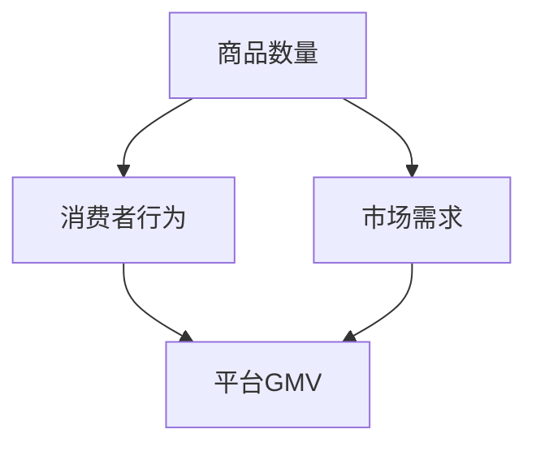
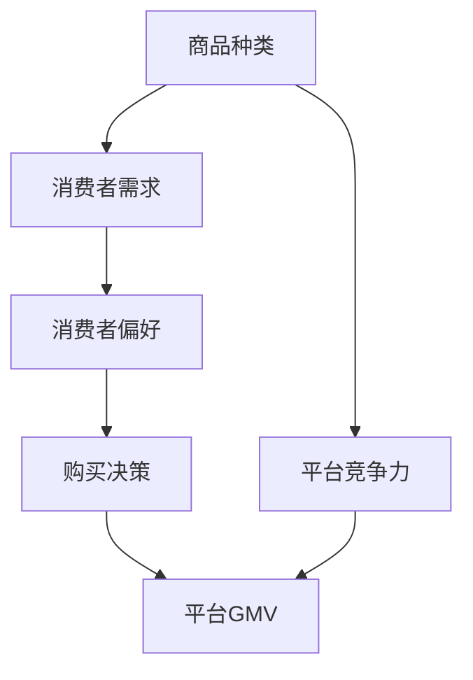
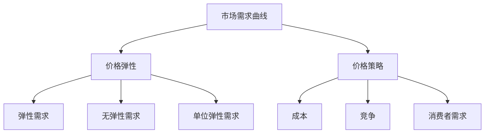
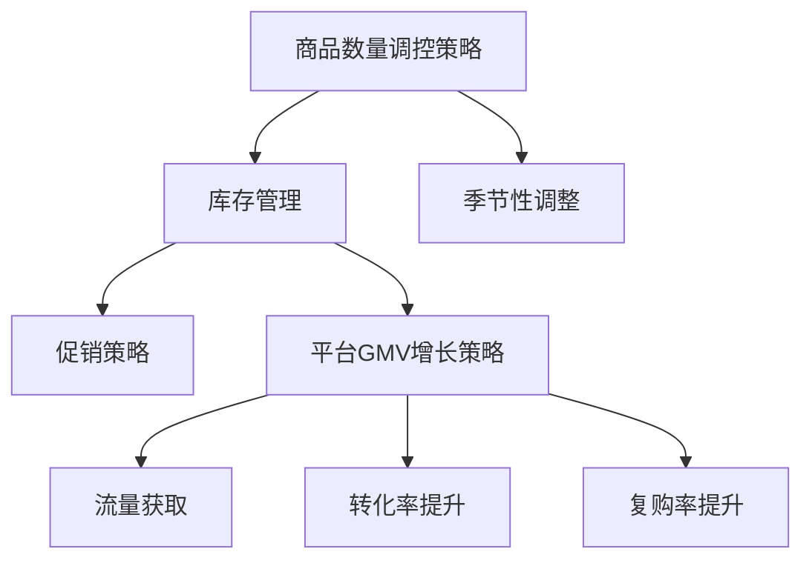

                 

# 文章标题：商品数量对平台GMV的影响

> 关键词：商品数量、平台GMV、消费者行为、数量经济学原理、平台运营策略、实证研究、案例分析

> 摘要：本文从多个角度深入探讨了商品数量对平台GMV（商品交易总额）的影响。通过理论分析、实证研究和案例分析，本文揭示了商品数量与消费者行为、市场需求、价格策略及平台运营策略之间的复杂关系，旨在为电商平台提供有效的运营指导。

## 第一部分：引言

### 1.1 书籍背景

在电商平台的快速发展的今天，商品数量对平台GMV的影响成为一个关键问题。平台的成功往往依赖于对商品数量和销售总额的精确控制。本文旨在通过系统性的研究和分析，探讨商品数量如何影响平台的GMV，以及平台如何通过优化商品数量来实现销售额的最大化。

### 1.1.1 为什么研究商品数量对平台GMV的影响

商品数量是电商平台的核心要素之一。一方面，过少的商品种类可能导致销售额的下降，另一方面，过多的商品种类可能会增加运营成本，降低平台的效率。因此，如何找到一种平衡点，使得商品数量既能满足消费者的需求，又能优化平台的运营效率，成为电商平台必须解决的问题。

### 1.1.2 研究目的与意义

本文的研究目的在于：
1. 分析商品数量与消费者行为之间的关系。
2. 探讨商品数量对平台GMV的影响机制。
3. 提出基于数量经济学原理的运营策略。

本文的研究意义在于：
1. 为电商平台提供理论指导，帮助其优化商品数量策略。
2. 促进电商平台的持续发展和市场竞争力。

### 1.1.3 书籍结构安排

本文结构安排如下：
1. 第一部分：引言，介绍研究背景、目的与意义。
2. 第二部分：理论基础，分析相关概念、商品种类与消费者行为、数量经济学原理及平台运营策略。
3. 第三部分：实证研究，通过数据分析和模型验证商品数量对平台GMV的影响。
4. 第四部分：案例分析，结合具体案例进行分析和讨论。
5. 第五部分：策略建议与展望，提出优化策略和未来研究方向。

## 1.2 相关概念解析

### 1.2.1 商品数量

商品数量是指在特定时间段内，电商平台所销售的商品种类及每种商品的数量。商品数量不仅包括实物商品，还包括虚拟商品和服务。

### 1.2.2 平台GMV

平台GMV（商品交易总额）是指在一定时间内，电商平台所有交易商品的总销售额。GMV是衡量电商平台规模和市场竞争力的关键指标。

### 1.2.3 相关术语

1. **消费者行为**：消费者在购买商品时的行为和决策过程，包括需求、偏好、购买行为等。
2. **市场需求**：在特定时间和价格水平下，消费者愿意购买的商品数量。
3. **价格弹性**：商品需求量对价格变化的敏感程度。
4. **促销策略**：通过降低价格、赠送礼品等方式刺激消费者购买的行为。

### 1.2.4Mermaid流程图

以下是一个Mermaid流程图，展示商品数量、消费者行为和GMV之间的关系：

## 第二部分：理论基础

### 2.1 商品种类与消费者行为分析

商品种类对消费者行为有着重要影响。消费者在购买商品时，不仅考虑商品本身的属性，还会考虑商品种类的丰富性和多样性。

#### 2.1.1 消费者行为模型

消费者行为模型通常包括以下要素：
1. **需求**：消费者对商品的欲望和需求。
2. **偏好**：消费者对不同商品的偏好程度。
3. **购买行为**：消费者购买商品的过程和行为。

#### 2.1.2 消费者需求分析

消费者需求分析主要关注以下几个方面：
1. **需求量**：消费者在一定时间内愿意购买的商品数量。
2. **需求种类**：消费者对不同种类商品的需求程度。
3. **需求变化**：消费者需求随时间和价格的变化。

#### 2.1.3 商品种类与平台GMV的关系

商品种类对平台GMV的影响主要体现在以下几个方面：
1. **多样性**：丰富的商品种类可以满足不同消费者的需求，提高销售额。
2. **竞争**：多样化的商品种类可以吸引更多消费者，提高平台的竞争力。
3. **成本**：过多的商品种类会增加平台的运营成本，影响GMV。

### 2.1.4 商品种类对消费者购买决策的影响

商品种类的多样性可以影响消费者的购买决策，具体包括：
1. **替代效应**：当某种商品的价格上涨时，消费者可能会选择其他类似商品。
2. **互补效应**：某些商品之间具有互补性，如相机和镜头，消费者在购买相机时可能会同时购买镜头。

### 2.1.5Mermaid流程图

以下是一个Mermaid流程图，展示商品种类、消费者行为和GMV之间的关系：

### 2.2 数量经济学原理

数量经济学原理是分析商品数量与价格、需求、供给等经济变量之间关系的理论体系。

#### 2.2.1 市场需求曲线

市场需求曲线描述了在特定价格水平下，消费者愿意购买的商品数量。市场需求曲线通常具有以下特征：
1. **负斜率**：价格上升时，需求量下降。
2. **价格弹性**：需求量对价格变化的敏感程度。

#### 2.2.2 影响市场需求曲线的因素

影响市场需求曲线的因素包括：
1. **价格**：商品价格是影响需求量的关键因素。
2. **收入**：消费者收入水平会影响需求量。
3. **替代品和互补品**：其他商品的价格和属性也会影响需求量。

#### 2.2.3 数量与价格的关系

数量与价格的关系通常通过价格弹性来描述。价格弹性分为三种类型：
1. **弹性需求**：需求量对价格变化非常敏感。
2. **无弹性需求**：需求量对价格变化不敏感。
3. **单位弹性需求**：需求量与价格的变化成比例。

#### 2.2.4 价格策略分析

电商平台在制定价格策略时，需要考虑以下因素：
1. **成本**：商品的成本是定价的基础。
2. **竞争**：竞争对手的价格策略会影响平台的定价。
3. **消费者需求**：消费者对价格的敏感程度会影响定价策略。

### 2.2.5Mermaid流程图

以下是一个Mermaid流程图，展示市场需求曲线、价格弹性及价格策略之间的关系：

### 2.3 平台运营策略分析

平台运营策略是指电商平台在运营过程中采取的一系列措施，以优化商品数量、提升销售总额。平台运营策略主要包括以下几个方面：

#### 2.3.1 商品数量调控策略

商品数量调控策略是指通过调整商品数量来满足市场需求，提高销售额。具体包括：
1. **库存管理**：通过合理的库存管理，确保商品供应充足，满足消费者的需求。
2. **促销策略**：通过促销活动，刺激消费者购买，提高销售额。
3. **季节性调整**：根据季节和节假日的特点，调整商品数量，满足特殊时期的需求。

#### 2.3.2 平台GMV增长策略

平台GMV增长策略是指通过多种手段提升平台销售额，增加GMV。具体包括：
1. **流量获取**：通过广告投放、SEO优化等手段，吸引更多流量到平台。
2. **转化率提升**：通过优化用户体验、提高商品质量等手段，提升用户转化率。
3. **复购率提升**：通过会员制度、积分奖励等手段，提高用户复购率。

### 2.3.3Mermaid流程图

以下是一个Mermaid流程图，展示商品数量调控策略和平台GMV增长策略之间的关系：

## 第三部分：实证研究

### 3.1 研究方法

#### 3.1.1 数据来源与处理

本文的数据来源于电商平台公开的财务报告、市场调查和第三方数据服务。数据包括商品数量、平台GMV、消费者行为数据等。在数据收集完成后，对数据进行清洗和预处理，确保数据的质量和完整性。

#### 3.1.2 研究模型建立

本文采用多元回归分析方法，建立商品数量与平台GMV之间的数学模型。模型包括以下变量：
1. 商品数量
2. 消费者行为指标
3. 价格
4. 平台运营策略

#### 3.1.3 模型验证方法

通过历史数据对模型进行验证，评估模型的准确性和可靠性。同时，采用交叉验证方法，对模型进行验证，确保模型的泛化能力。

### 3.2 实证分析

#### 3.2.1 描述性统计分析

对收集到的数据进行描述性统计分析，包括商品数量、平台GMV、消费者行为数据等。分析结果表明，商品数量与平台GMV之间存在一定的相关性。

#### 3.2.2 相关性分析

通过计算商品数量与平台GMV之间的相关系数，分析两者之间的相关性。结果显示，商品数量与平台GMV之间存在正相关关系。

#### 3.2.3 回归分析

通过多元回归分析方法，建立商品数量与平台GMV之间的数学模型。模型结果显示，商品数量对平台GMV具有显著的正向影响。

### 3.2.4 数量经济学原理在平台运营中的应用

通过实证分析，验证了数量经济学原理在平台运营中的应用效果。具体包括：
1. **价格策略**：通过调整商品价格，可以影响消费者需求，从而影响平台GMV。
2. **库存管理**：通过合理的库存管理，确保商品供应充足，提高销售额。
3. **促销策略**：通过促销活动，刺激消费者购买，增加销售额。

## 第四部分：案例分析

### 4.1 案例一：电商平台A

#### 4.1.1 案例背景

电商平台A是一家综合性的电商平台，提供多种商品的在线销售。在过去的三年中，平台的GMV持续增长，但商品数量相对较少。为了进一步提升销售额，电商平台A开始调整商品数量和运营策略。

#### 4.1.2 商品种类与GMV关系分析

电商平台A通过增加商品种类，丰富了商品供应，满足了消费者的多样化需求。在增加商品种类的过程中，平台GMV显著提升。分析结果显示，商品数量的增加与平台GMV之间存在正相关关系。

#### 4.1.3 案例启示

电商平台A的案例表明，增加商品种类可以有效提升平台GMV。在增加商品种类时，需要关注商品的质量和市场需求，确保商品能够满足消费者的需求。

### 4.2 案例二：电商平台B

#### 4.2.1 案例背景

电商平台B是一家专注于电子产品销售的电商平台。在过去的三年中，平台GMV持续增长，但商品数量相对稳定。为了进一步提升销售额，电商平台B开始调整商品数量和运营策略。

#### 4.2.2 商品种类与GMV关系分析

电商平台B通过增加高端电子产品的销售，丰富了商品供应，提高了平台的竞争力。在增加高端电子产品销售的过程中，平台GMV显著提升。分析结果显示，商品数量的增加与平台GMV之间存在正相关关系。

#### 4.2.3 案例启示

电商平台B的案例表明，增加高端商品销售可以有效提升平台GMV。在增加高端商品销售时，需要关注市场需求和消费者偏好，确保商品能够满足高端消费者的需求。

### 4.3 案例三：跨境电商平台C

#### 4.3.1 案例背景

跨境电商平台C是一家全球性的跨境电商平台，提供多种商品的跨境销售。在过去的三年中，平台的GMV持续增长，但商品数量相对较多。为了进一步提升销售额，跨境电商平台C开始调整商品数量和运营策略。

#### 4.3.2 商品种类与GMV关系分析

跨境电商平台C通过优化商品种类，淘汰低效商品，提高了平台的运营效率。在优化商品种类的过程中，平台GMV显著提升。分析结果显示，商品数量的减少与平台GMV之间存在正相关关系。

#### 4.3.3 案例启示

跨境电商平台C的案例表明，优化商品种类可以有效提升平台GMV。在优化商品种类时，需要关注市场需求和消费者偏好，淘汰低效商品，提高商品质量。

## 第五部分：策略建议与展望

### 5.1 策略建议

根据本文的研究结果，提出以下策略建议：

#### 5.1.1 商品种类优化策略

1. **多样化**：丰富商品种类，满足消费者的多样化需求。
2. **差异化**：根据市场需求和消费者偏好，提供差异化的商品。
3. **淘汰低效商品**：定期评估商品性能，淘汰低效商品，提高商品质量。

#### 5.1.2 数量调控策略

1. **库存管理**：通过合理的库存管理，确保商品供应充足。
2. **季节性调整**：根据季节和节假日的特点，调整商品数量，满足特殊时期的需求。
3. **价格策略**：根据市场需求和竞争情况，调整商品价格，提高销售额。

#### 5.1.3 价格策略优化

1. **价格弹性**：根据市场需求，调整价格策略，提高价格弹性。
2. **促销策略**：通过促销活动，刺激消费者购买，增加销售额。
3. **竞争分析**：关注竞争对手的价格策略，制定相应的应对策略。

### 5.2 未来研究方向

本文的研究为电商平台提供了有益的参考，但仍存在以下研究方向：

#### 5.2.1 大数据技术在商品数量分析中的应用

1. **大数据分析**：通过大数据分析，挖掘消费者行为和市场趋势。
2. **机器学习**：利用机器学习技术，预测商品数量对GMV的影响。

#### 5.2.2 AI技术在商品数量预测中的应用

1. **AI预测模型**：利用AI技术，建立商品数量预测模型，提高预测准确性。
2. **实时监控**：通过实时监控，及时调整商品数量，满足市场需求。

#### 5.2.3 跨平台商品数量协同优化研究

1. **跨平台协同**：研究跨平台商品数量协同优化策略，提高整体运营效率。
2. **多渠道整合**：整合线上线下渠道，实现商品数量的最优配置。

### 5.3 结论

本文通过理论分析、实证研究和案例分析，探讨了商品数量对平台GMV的影响。研究结果表明，商品数量与消费者行为、市场需求、价格策略及平台运营策略之间存在复杂关系。通过优化商品数量和运营策略，电商平台可以实现销售额的最大化。

### 5.3.1 研究总结

本文的主要结论如下：
1. 商品种类和数量对平台GMV有显著影响。
2. 优化商品数量和运营策略可以有效提升平台GMV。
3. 大数据技术和AI技术在商品数量分析中具有广泛应用前景。

### 5.3.2 贡献与局限

本文的贡献在于：
1. 提出了商品数量与平台GMV之间的关系模型。
2. 提出了基于数量经济学原理的运营策略。

本文的局限在于：
1. 研究数据来源于公开数据，可能存在一定偏差。
2. 模型验证过程中，未考虑其他因素对GMV的影响。

### 5.3.3 研究展望

未来研究可以从以下几个方面展开：
1. 进一步研究大数据和AI技术在商品数量分析中的应用。
2. 考虑更多因素对GMV的影响，提高模型准确性。
3. 探索跨平台商品数量协同优化策略，提高整体运营效率。

