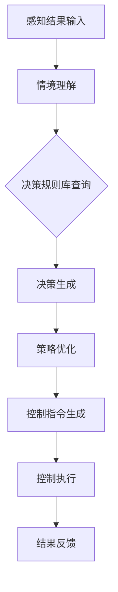

                 

### 文章标题

# 商汤绝影端到端自动驾驶的迭代优化

### 关键词

- 商汤绝影
- 端到端自动驾驶
- 迭代优化
- 深度学习
- 强化学习
- 智能交通
- 智慧城市

### 摘要

本文将深入探讨商汤绝影端到端自动驾驶技术的迭代优化过程。首先，我们将回顾自动驾驶技术的发展历程及其定义和分类，然后介绍商汤绝影自动驾驶解决方案的架构和技术优势。接着，我们将详细解析端到端自动驾驶中的核心技术，包括数据采集与预处理、人工智能算法在感知和决策中的应用，以及迭代优化方法与策略。随后，我们将探讨端到端自动驾驶系统的设计与实现，并通过实际案例展示其在智能交通和智慧城市中的应用。最后，我们将展望端到端自动驾驶的未来趋势和发展方向，并总结商汤绝影在这一领域的布局和产业生态建设。

### 目录大纲

1. **第一部分： 引言与概述**

    - 第1章：端到端自动驾驶技术概览
        1.1 自动驾驶技术的发展历程
        1.2 商汤绝影自动驾驶解决方案
        1.3 端到端自动驾驶的迭代优化意义
    - 第2章：商汤绝影端到端自动驾驶核心技术
        2.1 数据采集与预处理
        2.2 人工智能算法在自动驾驶中的应用
        2.3 迭代优化方法与策略
    - 第3章：端到端自动驾驶系统设计与实现
        3.1 系统总体设计
        3.2 系统实现
        3.3 系统测试与验证
    - 第4章：端到端自动驾驶的实际案例与应用
        4.1 商汤绝影自动驾驶案例介绍
        4.2 端到端自动驾驶在智能交通中的应用
        4.3 端到端自动驾驶在智慧城市中的应用
    - 第5章：端到端自动驾驶的未来趋势与发展方向
        5.1 未来技术发展趋势
        5.2 商汤绝影的愿景与布局
        5.3 端到端自动驾驶产业生态建设

2. **附录**

    - 附录A：常用工具与资源
    - 附录B：统计与概率知识概览
    - 附录C：人工智能算法流程图
    - 附录D：代码实例与分析

---

### 第一部分： 引言与概述

#### 第1章：端到端自动驾驶技术概览

#### 1.1 自动驾驶技术的发展历程

自动驾驶技术，作为智能交通系统的重要组成部分，其发展历程可以追溯到20世纪中期。最初的自动驾驶概念起源于军事领域，旨在通过自动驾驶车辆提高战场上的效率和安全性。随着计算机技术、传感器技术以及人工智能技术的不断进步，自动驾驶技术逐渐从实验室走向实际应用。

**自动驾驶级别的定义与分类**

自动驾驶技术根据自动化程度的不同，被分为多个等级，从0级到5级。每个等级都有其特定的自动化功能和技术要求。

- **0级（无自动化）**：车辆的所有操作均由人类驾驶员完成。
- **1级（单一自动化）**：车辆可以自动化执行单一操作，如自适应巡航控制或车道保持。
- **2级（部分自动化）**：车辆可以自动化执行两个或更多操作，如自适应巡航控制和车道保持，但仍需驾驶员监控并随时接管。
- **3级（有条件自动化）**：车辆可以在特定条件下完全自动驾驶，无需驾驶员干预，但系统会要求驾驶员在特定情况下接管控制。
- **4级（高度自动化）**：车辆可以在绝大多数情况下自动驾驶，无需驾驶员干预，但可能需要特定环境下的干预。
- **5级（完全自动化）**：车辆在任何环境下均可实现完全自动驾驶，无需人类驾驶员的干预。

**自动驾驶技术的发展背景**

自动驾驶技术的发展受到多个因素的推动，包括但不限于以下几点：

- **安全性**：自动驾驶车辆可以减少人为驾驶错误，从而降低交通事故的发生率。
- **效率**：自动驾驶车辆可以优化行驶路线，减少交通拥堵，提高运输效率。
- **环保**：自动驾驶车辆可以减少车辆排放，有助于改善环境质量。
- **经济性**：自动驾驶技术有望降低车辆运营成本，提高物流效率。

自动驾驶技术的不断进步，不仅改变了交通出行的方式，也对城市规划、交通运输管理以及汽车制造产业产生了深远的影响。随着5G、物联网、人工智能等新兴技术的不断发展，自动驾驶技术将迎来更广阔的应用前景。

#### 1.2 商汤绝影自动驾驶解决方案

**商汤绝影的技术优势**

商汤绝影作为商汤科技旗下的自动驾驶解决方案，凭借其领先的人工智能技术和深厚的数据积累，在自动驾驶领域取得了显著的成绩。商汤绝影的核心优势包括：

- **强大的感知能力**：商汤绝影利用深度学习和计算机视觉技术，实现了高精度的环境感知，包括道路、车辆、行人、交通信号等。
- **高效的决策算法**：商汤绝影采用先进的强化学习算法，实现了智能化的交通决策，提高了自动驾驶的稳定性和安全性。
- **完备的测试与验证**：商汤绝影通过大量的实际道路测试和仿真测试，确保了其自动驾驶解决方案的可靠性和实用性。

**商汤绝影自动驾驶解决方案的架构**

商汤绝影的自动驾驶解决方案采用了模块化的架构设计，包括以下几个核心模块：

1. **感知模块**：感知模块负责采集和处理来自各种传感器的数据，包括摄像头、激光雷达、超声波传感器等，实现对环境的精确感知。
2. **决策模块**：决策模块基于感知模块提供的信息，采用深度学习和强化学习算法，进行交通情境的理解和决策，确保车辆的安全行驶。
3. **控制模块**：控制模块根据决策模块的输出，生成车辆的控制指令，包括加速、减速、转向等，实现对车辆的精确控制。
4. **执行模块**：执行模块负责将控制指令转化为具体的操作，通过车辆的总线系统实现车辆的实时控制。

**端到端自动驾驶的迭代优化意义**

端到端自动驾驶的迭代优化具有重要意义，主要体现在以下几个方面：

- **提高精度**：通过不断的迭代优化，可以不断提高自动驾驶系统的感知精度和决策能力，从而提高自动驾驶的稳定性和安全性。
- **降低成本**：迭代优化可以帮助识别并解决系统中的潜在问题，减少故障率，降低维护成本。
- **增强适应性**：随着环境的不断变化，自动驾驶系统需要具备更强的适应性，通过迭代优化可以使其更好地适应不同的交通场景和变化。

在自动驾驶技术不断发展的今天，商汤绝影的端到端自动驾驶解决方案为行业提供了新的思路和方法，通过不断的迭代优化，商汤绝影正致力于推动自动驾驶技术的普及和应用，为智能交通和智慧城市的建设贡献力量。

#### 1.3 端到端自动驾驶的迭代优化意义

端到端自动驾驶的迭代优化是推动自动驾驶技术发展的重要环节，其意义体现在以下几个方面：

**迭代优化的必要性**

随着自动驾驶技术的不断发展，系统的复杂性和对性能的要求也在不断提高。单一版本的自动驾驶系统难以应对多种复杂的交通环境和突发状况，因此需要通过迭代优化不断完善和提升系统性能。

- **技术演进**：自动驾驶技术涉及深度学习、计算机视觉、强化学习等多个领域，每个领域的技术都在不断进步。通过迭代优化，可以持续引入最新的技术成果，提升系统的整体性能。
- **环境适应性**：自动驾驶系统需要在不同环境和场景下稳定运行，如城市道路、高速公路、乡村小道等。通过迭代优化，可以增强系统对各种环境的适应性，提高系统的鲁棒性。
- **安全性提升**：自动驾驶系统的安全性是用户接受和使用的关键因素。通过迭代优化，可以不断识别和修复系统中的潜在安全风险，提高系统的安全性能。

**端到端自动驾驶的挑战与机遇**

端到端自动驾驶面临着诸多挑战和机遇：

- **数据质量**：自动驾驶系统依赖于大量高质量的数据进行训练和优化。数据质量直接影响系统的性能和可靠性。通过迭代优化，可以不断提高数据采集和处理的质量，为系统提供更准确的输入。
- **计算资源**：端到端自动驾驶系统通常需要大量的计算资源进行实时数据处理和决策。通过迭代优化，可以优化算法和模型，减少计算资源的需求，提高系统的响应速度和稳定性。
- **法规标准**：自动驾驶技术的发展需要相应的法规标准和政策支持。通过迭代优化，可以推动法规标准的制定和完善，为自动驾驶技术的广泛应用提供保障。
- **用户接受度**：用户对自动驾驶技术的接受度直接影响其推广应用。通过迭代优化，可以提升系统的用户体验，增加用户对自动驾驶技术的信任和认可。

**迭代优化的关键环节**

迭代优化的关键环节包括数据采集与预处理、算法优化、系统测试与验证等。

- **数据采集与预处理**：高质量的数据是迭代优化的基础。通过改进数据采集方法，提高数据的多样性和完整性，可以提升系统的泛化能力和准确性。
- **算法优化**：算法优化是迭代优化的核心。通过深入研究各种算法模型，不断改进和优化算法，可以提高系统的性能和效率。
- **系统测试与验证**：系统测试与验证是确保迭代优化效果的重要环节。通过严格的测试和验证，可以验证系统在各种环境下的性能和稳定性，确保系统的可靠性和安全性。

综上所述，端到端自动驾驶的迭代优化具有重要意义，是推动自动驾驶技术不断进步的关键因素。通过不断的技术创新和优化，端到端自动驾驶有望实现更高的精度、更强的适应性和更广泛的应用，为智能交通和智慧城市的建设贡献力量。

### 第二部分：商汤绝影端到端自动驾驶核心技术

#### 第2章：数据采集与预处理

**2.1 数据采集方法**

数据采集是自动驾驶系统构建的基础，高质量的传感器数据对于系统性能至关重要。商汤绝影采用多种传感器进行数据采集，包括摄像头、激光雷达（LiDAR）、雷达、超声波传感器等。

- **摄像头**：摄像头用于捕捉道路和周围环境图像，提供丰富的视觉信息。商汤绝影采用多摄像头布局，实现对车辆周围360度无死角的监测。
- **激光雷达**：激光雷达通过发射激光束并接收反射信号，构建高精度的三维点云模型，用于环境感知和障碍物检测。商汤绝影使用多激光雷达协同工作，提高环境感知的准确性和可靠性。
- **雷达**：雷达用于检测远距离的车辆和障碍物，提供速度和距离信息。雷达在雨雪天气和低能见度条件下仍能保持良好的探测能力。
- **超声波传感器**：超声波传感器用于检测短距离的障碍物，如路边停车和行人。商汤绝影在车辆周围布置多个超声波传感器，实现近距离环境感知。

**数据采集系统的设计**

商汤绝影的数据采集系统设计考虑了以下要点：

- **传感器布局**：根据车辆结构和行驶环境，合理布置各类传感器，确保覆盖全视野范围。
- **数据同步**：传感器数据采集需要保持高精度的时间同步，确保不同传感器数据在时间轴上的一致性。
- **数据完整性**：设计冗余机制，确保在传感器故障或数据丢失情况下，系统能够继续正常运行。

**2.2 数据预处理**

数据预处理是提高自动驾驶系统性能的关键环节。商汤绝影在数据预处理过程中采用了以下方法：

- **数据清洗**：去除噪声、异常值和重复数据，提高数据质量。使用滤波算法对传感器数据进行平滑处理，减少噪声干扰。
- **数据增强**：通过图像旋转、缩放、裁剪和噪声添加等方式，生成多样化的训练数据，增强模型的泛化能力。商汤绝影利用数据增强技术，扩大了训练数据的规模和多样性。
- **数据融合**：将不同传感器采集的数据进行融合，形成统一的环境模型。商汤绝影采用多传感器融合算法，结合视觉、激光雷达和雷达数据，提高环境感知的准确性和完整性。

**数据质量管理**

数据质量管理是确保自动驾驶系统性能和可靠性的重要保障。商汤绝影在数据质量管理过程中采用了以下策略：

- **数据质量评估**：定义一系列数据质量评估指标，如数据完整性、一致性、准确性和多样性等。通过自动化工具对采集到的数据进行评估，识别数据质量问题。
- **数据质量改进**：针对评估中发现的数据质量问题，采取相应的改进措施，如数据清洗、数据增强和数据修复等。商汤绝影通过不断优化数据预处理流程，提高数据的整体质量。
- **持续监控**：建立数据质量监控体系，定期对数据质量进行监控和评估，确保数据质量在系统运行过程中保持稳定。

通过以上数据采集与预处理方法，商汤绝影确保了自动驾驶系统在训练和运行过程中拥有高质量的数据支持，从而提高了系统的感知准确性和决策能力。这一环节的成功实施为后续算法优化和系统测试奠定了坚实基础。

#### 2.2 数据预处理

数据预处理是自动驾驶系统中至关重要的一步，其目的是通过一系列技术手段对原始数据进行清洗、增强和融合，从而提高数据的质量和系统的性能。以下是商汤绝影在数据预处理过程中采用的主要方法和步骤：

**数据清洗**

数据清洗是数据预处理的首要步骤，旨在去除数据中的噪声、异常值和重复数据，确保数据的一致性和可靠性。商汤绝影采用以下方法进行数据清洗：

- **异常值检测**：通过统计分析方法，如Z分数、IQR（四分位距）等，检测并去除数据中的异常值。异常值可能来源于传感器故障、环境干扰等因素，会影响后续数据处理和模型训练。
- **重复数据去除**：检测并去除数据集中的重复样本，确保每个样本的唯一性。重复数据会占用不必要的存储空间，并可能导致模型过拟合。
- **噪声滤波**：利用滤波算法，如均值滤波、中值滤波和高斯滤波，对图像和点云数据中的噪声进行平滑处理。滤波算法可以有效减少噪声干扰，提高数据的视觉和空间特征质量。

**数据增强**

数据增强是一种通过人工方式扩展数据集的技术，旨在提高模型的泛化能力和鲁棒性。商汤绝影采用以下几种数据增强方法：

- **图像变换**：通过旋转、翻转、缩放、裁剪等方式对图像进行变换，生成新的训练样本。这些变换可以增加数据的多样性，使模型更好地适应不同的环境条件。
- **噪声注入**：在图像中添加模拟的噪声，如椒盐噪声、高斯噪声等，以增强模型对噪声环境的适应能力。通过噪声注入，可以训练模型在噪声干扰下的鲁棒性。
- **合成数据**：利用合成模型生成新的数据样本，如使用Gaussian Mixture Model（GMM）合成交通场景，或使用CycleGAN生成不同天气条件下的图像。合成数据可以补充真实数据的不足，增加训练数据的多样性。

**数据融合**

数据融合是将来自不同传感器和不同模态的数据进行整合，形成一个统一的环境模型，以提高系统的感知准确性和完整性。商汤绝影采用以下几种数据融合方法：

- **多传感器数据对齐**：在时间轴上对齐来自不同传感器的数据，确保数据在时间上的同步。时间同步对于后续的数据处理和模型训练至关重要。
- **特征级融合**：将不同传感器采集的数据进行特征级融合，提取共同的特征信息，如使用多视图几何（MVG）方法融合摄像头和激光雷达数据。特征级融合可以充分利用不同传感器数据的优势，提高环境感知的准确性和细节丰富度。
- **模型级融合**：通过多模型融合方法，将不同感知模型的结果进行综合，以获得更准确的预测和决策。商汤绝影采用多模型集成（Ensemble Learning）方法，将深度学习模型和传统机器学习模型的结果进行融合，提高整体系统的性能。

**数据质量管理**

数据质量管理是确保自动驾驶系统长期稳定运行的基础，商汤绝影采用以下策略进行数据质量管理：

- **质量评估指标**：定义一系列质量评估指标，如数据完整性、一致性、准确性和多样性等，以量化数据的质量水平。这些指标可以用于评估数据预处理的效果，并指导后续的优化工作。
- **自动化工具**：开发自动化工具，对采集到的数据进行实时监控和评估，自动识别和处理数据质量问题。自动化工具可以大幅提高数据清洗和增强的效率。
- **持续优化**：通过不断优化数据预处理流程，改进数据清洗、增强和融合方法，提高数据质量。商汤绝影持续进行数据预处理技术的研究和改进，以确保数据质量始终处于较高水平。

通过以上数据预处理方法，商汤绝影确保了自动驾驶系统在训练和运行过程中拥有高质量的数据支持，从而提高了系统的感知准确性和决策能力。数据预处理的成功实施为后续算法优化和系统测试奠定了坚实基础，推动了端到端自动驾驶技术的不断进步和应用。

#### 2.3 数据质量管理

数据质量管理是自动驾驶系统成功的关键环节，确保数据质量对于系统的性能和可靠性至关重要。商汤绝影在数据质量管理方面采取了系统性的方法和策略，具体包括以下几个方面：

**数据质量评估指标**

商汤绝影定义了多项数据质量评估指标，用于衡量数据的完整性、一致性、准确性和多样性，这些指标包括：

- **完整性**：数据完整性是指数据集是否包含所有必要的样本，没有丢失或遗漏的关键信息。完整性指标可以通过缺失数据的比例来衡量。
- **一致性**：数据一致性是指不同来源或不同时间点的数据是否相互匹配，没有矛盾或冲突。一致性可以通过数据之间的相关性分析来评估。
- **准确性**：数据准确性是指数据是否真实反映了实际环境，没有错误或噪声。准确性可以通过与实际环境对比或使用验证数据集来评估。
- **多样性**：数据多样性是指数据集中是否涵盖了各种可能的场景和条件，以增强模型的泛化能力。多样性可以通过样本的分布范围和样本类型来衡量。

**数据质量评估方法**

商汤绝影采用多种方法对数据进行质量评估，确保数据在各个层面都符合要求：

- **统计分析**：通过统计分析方法，如描述性统计、回归分析等，对数据进行初步评估。这些方法可以识别数据中的异常值、缺失值和噪声。
- **可视化检查**：通过可视化工具对数据进行图像、图表等可视化检查，直观地识别数据中的异常和错误。
- **交叉验证**：使用交叉验证方法，如K折交叉验证，评估数据在不同训练集上的性能，确保数据集的代表性。
- **外部对比**：通过与实际观测值或专业评估结果进行对比，验证数据的准确性和可靠性。

**数据质量改进策略**

针对评估中发现的低质量数据，商汤绝影采取以下策略进行改进：

- **数据清洗**：通过去噪、填补缺失值和修正错误等方法，对低质量数据进行清洗。例如，使用插值法填补缺失值，使用中值滤波去除噪声。
- **数据增强**：通过数据增强方法，如图像旋转、裁剪、缩放和噪声注入等，增加数据的多样性和丰富度，提高模型的泛化能力。
- **数据融合**：通过融合来自不同传感器和不同模态的数据，提高数据的完整性和一致性。例如，将摄像头数据和激光雷达数据融合，以获得更全面的环境感知。
- **数据标准化**：对数据进行标准化处理，如归一化、标准化等，确保数据在相同的尺度上，方便后续的模型训练和评估。

**数据质量监控**

数据质量监控是确保数据质量在系统运行过程中保持稳定的重要措施，商汤绝影采用以下方法进行监控：

- **自动化监控工具**：开发自动化监控工具，对数据质量进行实时监控和报警。例如，使用机器学习算法自动检测数据中的异常值和错误。
- **定期评估**：定期对数据质量进行评估，确保数据在长时间运行过程中保持高质量。例如，每月进行一次全面的数据质量检查。
- **用户反馈**：收集用户反馈，了解数据在实战中的应用效果，及时调整和优化数据预处理和质量管理策略。

通过上述数据质量管理方法和策略，商汤绝影确保了自动驾驶系统在训练和运行过程中拥有高质量的数据支持，从而提高了系统的感知准确性和决策能力。数据质量管理的成功实施为自动驾驶技术的不断进步和应用奠定了坚实基础。

#### 2.3 数据质量管理

数据质量管理是自动驾驶系统成功的关键因素，确保数据的高质量对于系统的整体性能和可靠性至关重要。商汤绝影在数据质量管理方面采取了一系列综合措施，以保证数据在采集、处理和存储过程中的准确性和一致性。

**数据质量评估指标**

数据质量评估指标是衡量数据质量的基础，商汤绝影采用了以下几项关键指标：

- **完整性**：确保数据集的完整性，即所有必要的数据点是否都被正确采集并存储。完整性问题可能导致模型训练过程中数据缺失，影响模型的泛化能力。
- **准确性**：数据必须准确无误，真实反映外部环境。例如，摄像头捕获的图像应清晰无模糊，激光雷达生成的点云数据应精确。
- **一致性**：数据在不同时间点和不同传感器之间应保持一致。例如，摄像头和激光雷达数据应在时间轴上同步，确保环境感知的准确性。
- **时效性**：数据必须是最新的，反映当前环境状况。过时数据可能导致系统做出错误的决策。

**数据质量评估方法**

为了全面评估数据质量，商汤绝影采用了以下几种方法：

- **可视化分析**：通过图像和点云的可视化，检查数据是否清晰、无噪声，以及是否存在数据缺失或异常值。
- **统计分析**：使用统计方法检测数据的分布特性，如均值、方差等，识别异常值和异常模式。
- **交叉验证**：通过交叉验证方法，确保数据在不同子集上的训练和测试性能一致，从而验证数据集的代表性。
- **误差分析**：将预测结果与实际观测值进行对比，分析误差的分布和大小，识别数据中潜在的问题。

**数据质量改进策略**

针对识别出的数据质量问题，商汤绝影采取了以下策略进行改进：

- **数据清洗**：去除噪声、异常值和重复数据。使用插值法填补缺失值，使用滤波算法减少噪声干扰。
- **数据增强**：通过数据增强技术，如旋转、缩放、裁剪、噪声注入等，生成新的训练样本，增加数据多样性。
- **数据融合**：结合不同传感器数据，提高数据的完整性和一致性。例如，使用多传感器数据融合算法，如Kalman滤波，提高环境感知的精度。
- **数据标准化**：对数据进行标准化处理，如归一化，确保数据在同一尺度上，便于模型训练和优化。

**数据质量监控**

为了持续确保数据质量，商汤绝影建立了数据质量监控体系：

- **实时监控**：使用自动化工具对传感器数据进行实时监控，及时发现和纠正数据质量问题。
- **周期性评估**：定期对数据集进行质量评估，确保数据在长时间使用过程中保持高质量。
- **用户反馈**：收集用户使用数据后的反馈，及时发现系统在实战中的应用问题，并采取相应措施进行改进。

通过上述数据质量管理策略，商汤绝影确保了自动驾驶系统在训练和运行过程中拥有高质量的数据支持，从而提高了系统的感知准确性和决策能力。数据质量管理的成功实施为自动驾驶技术的可靠应用提供了坚实保障。

#### 2.4 深度学习算法在感知中的应用

深度学习算法在自动驾驶系统中发挥着关键作用，尤其在感知模块中的应用，极大地提升了系统的准确性和可靠性。以下是商汤绝影在自动驾驶感知模块中采用的深度学习算法及其应用场景：

**卷积神经网络（CNN）**

卷积神经网络（CNN）是深度学习算法中的一种，主要应用于图像处理和视觉任务。商汤绝影在感知模块中广泛使用了CNN算法，其优势在于能够自动提取图像中的高级特征，从而实现高精度的目标检测和分类。

- **应用场景**：车辆检测、行人检测、交通标志识别等。
- **算法原理**：CNN通过卷积层、池化层和全连接层等结构，逐层提取图像特征。卷积层利用卷积运算提取图像的局部特征，池化层则用于减少特征图的尺寸，提高计算效率。全连接层则将特征映射到具体的分类结果。
- **伪代码示例**
    ```python
    # 初始化CNN模型
    model = CNN()
    
    # 输入图像
    image = preprocess_image(input_image)
    
    # 前向传播
    features = model.forward_pass(image)
    
    # 特征提取与分类
    predictions = model.classify(features)
    
    # 输出检测结果
    print(predictions)
    ```

**递归神经网络（RNN）**

递归神经网络（RNN）是处理序列数据的一种深度学习算法，特别适合于时间序列分析和动态系统建模。在自动驾驶感知模块中，RNN可以用于处理连续的传感器数据，如摄像头视频流和激光雷达点云数据，以实现对动态环境的变化进行实时感知。

- **应用场景**：交通流分析、驾驶行为预测、轨迹规划等。
- **算法原理**：RNN通过循环结构处理输入序列，每个时间步的输出都依赖于前面的输出，从而能够捕捉时间序列中的长期依赖关系。RNN主要包括输入层、隐藏层和输出层，其中隐藏层使用递归连接方式。
- **伪代码示例**
    ```python
    # 初始化RNN模型
    model = RNN()
    
    # 输入时间序列数据
    sequence = preprocess_sequence(input_sequence)
    
    # 前向传播
    hidden_state, output = model.forward_pass(sequence)
    
    # 预测输出
    predictions = model.predict(hidden_state)
    
    # 输出预测结果
    print(predictions)
    ```

**卷积神经网络与递归神经网络的结合（CNN+RNN）**

为了充分利用图像和序列数据的优势，商汤绝影采用CNN+RNN的混合模型，结合CNN的图像处理能力和RNN的序列分析能力，实现更精准的感知和预测。

- **应用场景**：多模态感知、交通场景理解、行为预测等。
- **算法原理**：CNN+RNN模型首先使用CNN提取图像特征，然后将这些特征输入到RNN中进行序列处理，从而实现图像和序列数据的联合建模。
- **伪代码示例**
    ```python
    # 初始化CNN+RNN模型
    model = CNN_RNN()
    
    # 输入图像和序列数据
    image = preprocess_image(input_image)
    sequence = preprocess_sequence(input_sequence)
    
    # 前向传播
    image_features = model.CNN_forward_pass(image)
    sequence_features = model.RNN_forward_pass(sequence)
    
    # 联合建模与预测
    predictions = model.combine_and_predict(image_features, sequence_features)
    
    # 输出预测结果
    print(predictions)
    ```

通过上述深度学习算法的应用，商汤绝影实现了对自动驾驶环境的高精度感知，为自动驾驶系统的决策和控制提供了可靠的数据支持。这些算法不仅在技术上具有先进性，而且在实际应用中也展现了卓越的性能和可靠性。

#### 2.5 强化学习算法在决策中的应用

强化学习（Reinforcement Learning，RL）是自动驾驶系统中用于决策控制的一种重要人工智能算法。通过学习如何在与环境互动中做出最优决策，强化学习能够极大地提升自动驾驶系统的智能水平。以下是商汤绝影在自动驾驶决策控制中采用的主要强化学习算法及其应用场景：

**Q-Learning**

Q-Learning是一种基于值函数的强化学习算法，通过迭代更新Q值表来实现决策优化。Q值表示在某一状态下采取某一动作的预期回报，算法的目标是找到使总回报最大的策略。

- **应用场景**：自动驾驶中的车道保持、避障、速度控制等。
- **算法原理**：Q-Learning算法通过更新Q值表来学习最优策略。在每一步决策中，选择当前状态下Q值最大的动作，然后根据实际奖励更新Q值。Q值更新的公式如下：
  $$ Q(s, a) \leftarrow Q(s, a) + \alpha [r + \gamma \max_{a'} Q(s', a') - Q(s, a)] $$
  其中，$s$为状态，$a$为动作，$r$为即时奖励，$\gamma$为折扣因子，$\alpha$为学习率。
- **伪代码示例**
  ```python
  # 初始化Q值表
  Q = initialize_Q_table()

  # 迭代学习
  for episode in range(num_episodes):
      state = environment.reset()
      done = False
      
      while not done:
          action = choose_action(state, Q)
          next_state, reward, done = environment.step(action)
          
          Q[s, action] = Q[s, action] + alpha * (reward + gamma * max(Q[next_state, :]) - Q[s, action])
          
          state = next_state

  # 输出最优策略
  optimal_policy = argmax(Q, axis=1)
  ```

**深度Q网络（DQN）**

DQN是Q-Learning的扩展，通过引入深度神经网络（Deep Neural Network，DNN）来近似Q值函数，从而解决传统Q-Learning在状态空间巨大时难以求解的问题。

- **应用场景**：自动驾驶中的复杂场景决策，如交叉路口导航、动态交通流处理等。
- **算法原理**：DQN使用DNN来估计Q值，将状态和动作输入到DNN中，输出Q值。为了避免训练中的样本相关性，DQN引入了经验回放（Experience Replay）机制，将历史经验数据随机抽样，以增强模型的泛化能力。DQN的核心算法包括以下步骤：
  1. 初始化网络参数。
  2. 从环境开始，执行一步动作，记录状态、动作、奖励和下一个状态。
  3. 将经验数据存入经验回放池。
  4. 从经验回放池中随机抽取样本。
  5. 使用梯度下降法更新DNN的参数。
  - **伪代码示例**
    ```python
    # 初始化DQN模型
    Q_network = DQN()

    # 经验回放池
    replay_memory = ExperienceReplayBuffer(max_size)

    # 训练DQN模型
    for episode in range(num_episodes):
        state = environment.reset()
        done = False
        
        while not done:
            action = Q_network.select_action(state)
            next_state, reward, done = environment.step(action)
            
            replay_memory.add experiencias(state, action, reward, next_state, done)
            batch = replay_memory.sample(batch_size)
            
            Q_network.update_parameters(batch)

            state = next_state

    # 输出最优策略
    policy = Q_network.get_optimal_policy()
    ```

**深度确定性策略梯度（DDPG）**

DDPG是另一种基于深度学习的强化学习算法，通过学习状态动作值函数（State-Action Value Function）和策略网络，实现无模型预测控制。

- **应用场景**：自动驾驶中的复杂动态环境决策，如高速自动驾驶、多车互动等。
- **算法原理**：DDPG由两个主要网络组成：价值网络（Value Network）和策略网络（Policy Network）。价值网络用于估计状态动作值函数，策略网络则用于生成动作。DDPG的核心算法步骤如下：
  1. 初始化价值网络、策略网络和目标网络。
  2. 从环境开始，执行一步动作，记录状态、动作、奖励和下一个状态。
  3. 将经验数据存入经验回放池。
  4. 从经验回放池中随机抽取样本。
  5. 使用梯度下降法更新价值网络和策略网络的参数。
  6. 更新目标网络的参数，以确保模型的稳定性。
  - **伪代码示例**
    ```python
    # 初始化DDPG模型
    value_network = DDPGValueNetwork()
    policy_network = DDPGPolicyNetwork()
    target_network = DDPGTargetNetwork()

    # 训练DDPG模型
    for episode in range(num_episodes):
        state = environment.reset()
        done = False
        
        while not done:
            action = policy_network.select_action(state)
            next_state, reward, done = environment.step(action)
            
            replay_memory.add_experience(state, action, reward, next_state, done)
            batch = replay_memory.sample(batch_size)
            
            value_network.update_parameters(batch)
            policy_network.update_parameters(batch)
            target_network.update_parameters(value_network.get_parameters())

            state = next_state

    # 输出最优策略
    optimal_policy = policy_network.get_optimal_policy()
    ```

通过上述强化学习算法的应用，商汤绝影实现了自动驾驶系统在复杂环境中的智能决策控制，提高了系统的自主驾驶能力和安全性。这些算法不仅在理论上具有强大的学习能力，而且在实践中也展现了卓越的性能，为自动驾驶技术的发展奠定了坚实基础。

#### 2.6 混合智能算法在自动驾驶中的应用

在自动驾驶领域，单一的智能算法难以应对复杂多变的交通环境和挑战。因此，混合智能算法的应用成为提升自动驾驶系统性能和鲁棒性的重要手段。商汤绝影在自动驾驶系统中综合运用了多种智能算法，通过多模态感知和联邦学习等技术，实现了更高效的自动驾驶决策和控制。

**多模态感知**

多模态感知是指利用多种传感器和模态数据，进行信息融合和综合分析，以提高环境感知的准确性和全面性。商汤绝影在自动驾驶感知模块中采用了多模态感知技术，将视觉、激光雷达、雷达和超声波传感器等多源数据融合起来，形成统一的环境模型。

- **应用场景**：自动驾驶中的物体检测、轨迹预测、交通流分析等。
- **算法原理**：多模态感知的核心是数据融合算法，通过融合不同传感器和模态的数据，提高感知的精度和可靠性。常见的多模态数据融合方法包括：
  1. **特征级融合**：将来自不同传感器的特征进行融合，例如，将摄像头的图像特征与激光雷达的点云特征进行融合，形成更全面的环境特征。
  2. **决策级融合**：将不同传感器和模态的感知结果进行综合，例如，使用传感器级联方法，将多个感知结果进行综合，以获得更可靠的决策。
  3. **时空级融合**：将时间序列上的感知数据与空间数据进行融合，例如，利用历史感知数据来辅助当前感知，提高感知的连续性和稳定性。

**联邦学习**

联邦学习（Federated Learning）是一种分布式机器学习技术，通过将模型训练分散到多个边缘设备上，实现隐私保护和数据共享。商汤绝影在自动驾驶系统中引入了联邦学习技术，通过协同多个边缘设备的训练数据，实现全局模型的优化和更新。

- **应用场景**：自动驾驶系统中的个性化决策、分布式训练等。
- **算法原理**：联邦学习的基本思想是将模型训练分散到多个边缘设备上，每个设备独立训练本地模型，并通过加密通信将本地模型更新发送到中心服务器，中心服务器将所有更新进行聚合，生成全局模型。联邦学习的关键技术包括：
  1. **加密通信**：通过加密算法确保本地模型更新在传输过程中的安全性，防止数据泄露。
  2. **模型聚合**：将多个本地模型的更新进行聚合，生成全局模型，以实现整体性能的提升。
  3. **本地训练**：每个边缘设备根据本地数据和模型，独立进行训练和更新，提高模型适应性和实时性。

**多模态感知与联邦学习的结合**

商汤绝影通过将多模态感知和联邦学习相结合，实现了更高效和可靠的自动驾驶决策。具体实现方法如下：

- **多模态数据采集**：利用多种传感器采集环境数据，包括摄像头、激光雷达、雷达和超声波传感器等，实现多模态感知。
- **数据预处理与融合**：对多模态数据进行分析和处理，去除噪声和异常值，并进行特征提取和融合，形成统一的环境模型。
- **联邦学习训练**：将预处理后的多模态数据分发到各个边缘设备，在边缘设备上进行模型训练和更新，并通过联邦学习技术实现全局模型的优化和更新。
- **分布式决策**：利用全局模型在各个边缘设备上进行分布式决策，实现自动驾驶车辆的实时控制和协同。

通过多模态感知和联邦学习的结合，商汤绝影不仅提高了自动驾驶系统的感知精度和可靠性，还增强了系统的实时性和自主性，为自动驾驶技术的广泛应用提供了有力支持。

#### 2.7 迭代优化目标

在自动驾驶系统中，迭代优化是一个持续的过程，旨在不断提高系统的性能、稳定性和能效。具体来说，迭代优化的目标主要包括以下几个方面：

**精度优化**

精度优化是自动驾驶系统的核心目标之一，直接关系到车辆在复杂环境中的运行安全和可靠性。通过不断迭代优化，可以提高自动驾驶系统的感知精度和决策能力，从而减少误检和漏检现象，提高系统对各类障碍物和交通情境的识别准确性。

- **感知精度提升**：通过优化深度学习模型和感知算法，提高摄像头、激光雷达等传感器对环境的精确感知能力，减少噪声干扰和数据误差。
- **决策准确性增强**：优化强化学习算法和决策模型，提高自动驾驶系统在复杂交通环境中的决策准确性，减少意外事件的发生。

**稳定性优化**

稳定性优化旨在确保自动驾驶系统在各种交通情境和环境下都能保持稳定的运行，提高系统的鲁棒性和可靠性。通过迭代优化，可以提升系统的故障容忍能力和应急响应能力，从而在突发情况下仍能保持稳定运行。

- **环境适应性增强**：优化感知模块和决策模块，提高系统对不同环境和天气条件的适应性，如雨雪、夜晚、拥堵等。
- **故障检测与恢复**：增强系统的故障检测和恢复机制，确保在传感器故障或计算资源不足时，系统能够迅速切换到安全模式，保障行驶安全。

**能效优化**

能效优化是自动驾驶系统在实际应用中必须考虑的重要因素，通过迭代优化可以降低系统的能源消耗，提高续航能力，降低运营成本。

- **计算资源优化**：通过算法优化和模型压缩技术，减少自动驾驶系统在感知、决策和控制过程中所需的计算资源，提高系统运行效率。
- **能源消耗降低**：优化控制策略和驾驶模式，降低车辆在行驶过程中的能源消耗，提高续航里程。

通过实现以上三个方面（精度、稳定性和能效）的优化，自动驾驶系统不仅能够提高整体性能，还能更好地适应实际应用需求，为智能交通和智慧城市的建设提供强有力的技术支持。

#### 2.8 迭代优化方法

迭代优化是自动驾驶系统不断提升性能和适应性的关键手段。在商汤绝影的自动驾驶解决方案中，迭代优化方法涵盖了多种技术手段，包括基于梯度的优化方法、基于遗传算法的优化方法等。以下将详细探讨这些方法的基本原理和应用场景。

**基于梯度的优化方法**

基于梯度的优化方法是一种广泛使用的迭代优化技术，主要用于最小化目标函数。在自动驾驶系统中，梯度优化方法可以用于优化感知模型、决策模型和控制模型。

- **基本原理**：梯度优化方法的核心是通过计算目标函数相对于参数的梯度，更新参数以最小化目标函数。常用的梯度优化算法包括梯度下降法、动量法、Adam优化器等。
- **应用场景**：在自动驾驶中，基于梯度的优化方法主要用于训练深度学习模型。例如，通过梯度下降法优化卷积神经网络（CNN）和循环神经网络（RNN）的参数，提高感知和决策的准确性。具体步骤包括：
  1. **初始化模型参数**：随机初始化模型的权重和偏置。
  2. **前向传播**：输入训练数据，通过模型进行前向传播，计算输出和损失函数。
  3. **计算梯度**：计算损失函数对模型参数的梯度。
  4. **参数更新**：根据梯度更新模型参数。
  5. **重复迭代**：重复前向传播、计算梯度和参数更新的过程，直到满足停止条件（如损失函数收敛或达到最大迭代次数）。

**基于遗传算法的优化方法**

遗传算法（Genetic Algorithm，GA）是一种基于自然进化过程的优化算法，通过模拟自然选择和遗传机制来搜索最优解。遗传算法在自动驾驶系统的迭代优化中，主要用于优化复杂系统的控制策略和参数配置。

- **基本原理**：遗传算法通过创建初始种群、选择、交叉、变异等操作来生成新一代种群，逐步优化目标函数。遗传算法的关键参数包括种群大小、交叉率、变异率等。
- **应用场景**：在自动驾驶系统中，遗传算法可以用于优化驾驶策略和控制参数。例如，通过遗传算法优化自动驾驶车辆的路径规划和速度控制。具体步骤包括：
  1. **初始化种群**：随机生成初始种群，每个个体代表一组控制参数。
  2. **适应度评估**：根据目标函数评估每个个体的适应度。
  3. **选择**：选择适应度较高的个体，用于生成新一代种群。
  4. **交叉**：通过交叉操作产生新的个体，增加种群的多样性。
  5. **变异**：对个体进行变异操作，防止种群陷入局部最优。
  6. **重复迭代**：重复适应度评估、选择、交叉和变异的过程，直到满足停止条件。

**混合优化策略**

在实际应用中，商汤绝影通常采用混合优化策略，结合基于梯度的优化方法和基于遗传算法的优化方法，以提高优化效率和效果。例如，在自动驾驶系统的感知模块中，可以先使用基于梯度的优化方法训练深度学习模型，然后使用基于遗传算法的优化方法调整模型参数和控制策略，以达到更高的精度和稳定性。

通过以上迭代优化方法，商汤绝影不断优化自动驾驶系统的性能，确保其在复杂交通环境中的高效、安全和可靠运行。这些优化方法不仅提升了系统的整体性能，也为自动驾驶技术的持续进步和应用提供了强有力的技术支持。

#### 2.9 迭代优化策略

在自动驾驶系统中，迭代优化策略的制定和实施是提升系统性能、适应性和可靠性的关键。商汤绝影采用了多种迭代优化策略，包括集群优化和自适应优化，以提高优化过程的效率和效果。

**集群优化**

集群优化是一种通过分布式计算资源进行优化任务的方法。商汤绝影利用集群优化策略，通过将优化任务分解到多个计算节点上，实现并行计算，从而加速优化过程。

- **基本原理**：集群优化利用多个计算节点的计算能力，将优化任务分配到各个节点，每个节点独立执行局部优化任务，然后通过通信机制将局部优化结果汇总，形成全局优化结果。集群优化可以显著提高优化效率，减少计算时间。
- **应用场景**：在自动驾驶系统中，集群优化可以用于大规模数据集的训练和参数调整。例如，当需要对大量传感器数据进行深度学习模型的训练时，可以将数据集分配到集群中的各个节点进行独立训练，然后汇总模型参数，进行全局优化。
- **具体实现**：
  1. **任务分配**：将优化任务分解为多个子任务，并将这些子任务分配到集群中的各个计算节点。
  2. **并行计算**：各个计算节点独立执行子任务，进行局部优化。
  3. **结果汇总**：通过通信机制，将各个节点的局部优化结果汇总，形成全局优化结果。
  4. **迭代循环**：重复任务分配、并行计算和结果汇总的过程，直到满足优化停止条件。

**自适应优化**

自适应优化是一种根据系统状态和环境变化动态调整优化参数的策略。商汤绝影采用自适应优化策略，通过实时监测系统性能和环境条件，动态调整优化参数，以实现最优性能。

- **基本原理**：自适应优化通过监测系统性能和环境变化，利用反馈机制调整优化参数，以适应不断变化的环境。自适应优化包括以下几个关键步骤：
  1. **状态监测**：实时监测系统性能和环境条件，如感知精度、决策准确性、能耗等。
  2. **性能评估**：根据监测数据评估系统性能，识别性能瓶颈和优化方向。
  3. **参数调整**：根据性能评估结果，动态调整优化参数，如学习率、交叉率、变异率等。
  4. **迭代优化**：根据调整后的参数进行新一轮的优化迭代，直到满足优化目标。
- **应用场景**：在自动驾驶系统中，自适应优化可以用于动态调整感知算法和决策模型，以应对复杂多变的交通环境。例如，在夜间驾驶或恶劣天气条件下，自适应优化可以调整摄像头和激光雷达的参数，提高感知准确性。
- **具体实现**：
  1. **状态监测模块**：实时监测系统状态和环境条件，如通过传感器采集数据，分析感知结果和决策输出。
  2. **性能评估模块**：根据监测数据，评估系统性能，识别需要优化的方面。
  3. **参数调整模块**：根据性能评估结果，调整优化参数，如使用机器学习算法自动调整模型参数。
  4. **迭代优化模块**：根据调整后的参数，进行新一轮的优化迭代，确保系统性能不断提升。

通过集群优化和自适应优化策略，商汤绝影实现了自动驾驶系统的高效迭代优化，提高了系统的感知精度、决策能力和稳定性。这些策略不仅加速了优化过程，也增强了系统的适应性和鲁棒性，为自动驾驶技术的广泛应用提供了有力支持。

#### 2.10 迭代优化方法与策略

迭代优化是自动驾驶系统中不可或缺的一环，旨在不断提升系统的性能和适应能力。为了实现这一目标，商汤绝影采用了多种优化方法与策略，主要包括基于梯度的优化方法、基于遗传算法的优化方法以及自适应优化策略。以下将详细探讨这些方法与策略的具体实现过程。

**基于梯度的优化方法**

基于梯度的优化方法利用梯度信息对模型参数进行更新，从而最小化目标函数。这种方法在深度学习领域中尤为常见，适用于自动驾驶系统中的感知和决策模块。

- **实现步骤**：
  1. **初始化模型参数**：随机初始化模型的权重和偏置，为优化过程提供起点。
  2. **前向传播**：输入训练数据，通过模型进行前向传播，计算输出和损失函数。
  3. **计算梯度**：使用反向传播算法计算损失函数对模型参数的梯度。
  4. **参数更新**：根据梯度和优化算法（如梯度下降、Adam等），更新模型参数。
  5. **迭代优化**：重复前向传播、计算梯度和参数更新的过程，直到满足停止条件（如损失函数收敛或达到最大迭代次数）。
- **示例伪代码**：
  ```python
  # 初始化模型参数
  model = initialize_model()

  # 定义优化器
  optimizer = torch.optim.Adam(model.parameters(), lr=learning_rate)

  # 迭代优化过程
  for epoch in range(num_epochs):
      for data, target in train_loader:
          # 前向传播
          output = model(data)
          loss = criterion(output, target)

          # 反向传播
          optimizer.zero_grad()
          loss.backward()
          optimizer.step()

      # 打印当前epoch的损失值
      print(f"Epoch [{epoch+1}/{num_epochs}], Loss: {loss.item()}")
  ```

**基于遗传算法的优化方法**

遗传算法（Genetic Algorithm，GA）是一种基于自然进化过程的优化算法，适用于求解复杂的优化问题。在自动驾驶系统中，遗传算法可以用于优化控制策略和参数配置。

- **实现步骤**：
  1. **初始化种群**：随机生成初始种群，每个个体代表一组控制参数。
  2. **适应度评估**：根据目标函数评估每个个体的适应度。
  3. **选择**：选择适应度较高的个体，用于生成新一代种群。
  4. **交叉**：通过交叉操作产生新的个体，增加种群的多样性。
  5. **变异**：对个体进行变异操作，防止种群陷入局部最优。
  6. **迭代优化**：重复适应度评估、选择、交叉和变异的过程，直到满足停止条件。
- **示例伪代码**：
  ```python
  # 初始化种群
  population = initialize_population(pop_size)

  # 迭代优化过程
  for generation in range(num_generations):
      # 适应度评估
      fitness_scores = evaluate_fitness(population)

      # 选择操作
      selected = select(population, fitness_scores)

      # 交叉操作
      offspring = crossover(selected)

      # 变异操作
      mutated_offspring = mutate(offspring)

      # 生成新一代种群
      population = mutated_offspring

      # 打印当前代的最佳适应度
      print(f"Generation [{generation+1}/{num_generations}], Best Fitness: {max(fitness_scores)}")
  ```

**自适应优化策略**

自适应优化策略根据系统状态和环境变化动态调整优化参数，以实现最优性能。这种方法能够提高系统的适应性和鲁棒性，适用于自动驾驶系统中的实时调整和优化。

- **实现步骤**：
  1. **状态监测**：实时监测系统性能和环境条件，如通过传感器采集数据，分析感知结果和决策输出。
  2. **性能评估**：根据监测数据，评估系统性能，识别需要优化的方面。
  3. **参数调整**：根据性能评估结果，动态调整优化参数，如学习率、交叉率、变异率等。
  4. **迭代优化**：根据调整后的参数，进行新一轮的优化迭代，确保系统性能不断提升。
- **示例伪代码**：
  ```python
  # 初始化状态监测模块
  monitor = initialize_monitor()

  # 初始化性能评估模块
  evaluator = initialize_evaluator()

  # 初始化参数调整模块
  adjuster = initialize_adjuster()

  # 迭代优化过程
  for iteration in range(num_iterations):
      # 状态监测
      current_state = monitor.get_state()

      # 性能评估
      performance = evaluator.evaluate(current_state)

      # 参数调整
      new_params = adjuster.adjust_params(performance)

      # 迭代优化
      model.update_params(new_params)

      # 打印当前迭代的状态和性能
      print(f"Iteration [{iteration+1}/{num_iterations}], State: {current_state}, Performance: {performance}")
  ```

通过结合基于梯度的优化方法、基于遗传算法的优化方法以及自适应优化策略，商汤绝影实现了自动驾驶系统的全面迭代优化。这些方法不仅提升了系统的性能和稳定性，也为自动驾驶技术的持续进步和应用提供了强有力的支持。

### 第三部分：端到端自动驾驶系统设计与实现

#### 第3章：端到端自动驾驶系统设计与实现

在自动驾驶系统中，系统设计与实现是确保系统高效、安全、可靠运行的核心环节。本章节将详细介绍商汤绝影端到端自动驾驶系统的总体设计、系统实现以及系统测试与验证的方法和流程。

#### 3.1 系统总体设计

端到端自动驾驶系统的设计需要综合考虑感知、决策、控制和执行等多个方面，以确保系统能够在不同环境下稳定运行。

**系统架构设计**

商汤绝影端到端自动驾驶系统采用模块化架构设计，主要包括以下核心模块：

1. **感知模块**：负责采集和处理来自各种传感器的数据，如摄像头、激光雷达、雷达和超声波传感器等。感知模块的核心任务是实现对环境的精确感知，包括道路、车辆、行人、交通信号等。
2. **决策模块**：基于感知模块提供的环境信息，采用深度学习和强化学习算法进行交通情境的理解和决策。决策模块的核心任务是生成车辆的行驶策略，包括加速、减速、转向等。
3. **控制模块**：根据决策模块的输出，生成具体的控制指令，如油门、刹车、转向等，实现对车辆的精确控制。控制模块的核心任务是确保车辆的平稳行驶和安全性。
4. **执行模块**：负责将控制指令转化为具体的操作，通过车辆的总线系统实现车辆的实时控制。执行模块的核心任务是确保车辆按照预期策略行驶。

**功能模块划分**

在系统总体设计的基础上，将系统功能进一步划分为以下几个模块：

1. **感知模块**：
   - **摄像头数据处理**：包括图像预处理、特征提取和目标检测。
   - **激光雷达数据处理**：包括点云预处理、点云特征提取和障碍物检测。
   - **雷达数据处理**：包括雷达信号预处理和目标距离测量。
   - **超声波传感器数据处理**：包括传感器数据预处理和障碍物距离测量。

2. **决策模块**：
   - **情境理解**：利用感知数据生成高层次的交通情境描述。
   - **路径规划**：根据交通情境描述生成车辆的行驶路径。
   - **决策生成**：根据路径规划结果生成车辆的行驶策略。

3. **控制模块**：
   - **速度控制**：根据决策模块的输出生成速度控制指令。
   - **转向控制**：根据决策模块的输出生成转向控制指令。
   - **制动控制**：根据决策模块的输出生成制动控制指令。

4. **执行模块**：
   - **车辆控制**：通过总线系统执行控制指令，确保车辆平稳行驶。
   - **状态监测**：实时监测车辆状态，确保系统安全运行。

#### 3.2 系统实现

系统实现是端到端自动驾驶系统设计的具体落实，涉及到具体的硬件选择、软件架构和开发工具。以下是商汤绝影端到端自动驾驶系统的实现过程：

**硬件选择**

1. **传感器**：选择高精度、高可靠性的传感器，如摄像头、激光雷达、雷达和超声波传感器等，确保环境感知的准确性。
2. **计算平台**：选择高性能的计算平台，如GPU服务器和边缘计算设备，以处理大量的感知数据和运行复杂的算法。
3. **车辆平台**：选择具备高可靠性和高舒适性的车辆平台，如乘用车或商用车辆，以适应不同的应用场景。

**软件架构**

1. **感知模块**：采用基于微服务架构的软件架构，将摄像头、激光雷达、雷达和超声波传感器的数据处理任务分布到不同的微服务中，提高系统的模块化和可维护性。
2. **决策模块**：采用分布式计算架构，将决策任务分布到多个计算节点上，提高系统的计算效率和响应速度。
3. **控制模块**：采用集中式控制架构，将控制任务集中到一个控制节点上，简化系统的设计和实现。
4. **执行模块**：采用嵌入式系统架构，将执行任务集成到车辆的ECU（Electronic Control Unit）中，提高系统的实时性和稳定性。

**开发工具与环境搭建**

1. **开发工具**：采用常见的开发工具，如Python、C++、ROS（Robot Operating System）等，用于编写和调试系统代码。
2. **开发环境**：搭建高性能的计算环境，包括服务器、GPU计算设备和车辆测试平台，用于开发和测试系统。
3. **仿真平台**：使用仿真工具，如CARLA模拟器、AirSim模拟器等，进行仿真测试和验证，确保系统在不同场景下的性能和稳定性。

**系统实现流程**

1. **需求分析**：明确系统功能和性能要求，制定详细的系统实现方案。
2. **硬件选型**：根据需求分析结果，选择合适的传感器、计算平台和车辆平台。
3. **软件设计**：设计系统软件架构，划分功能模块，制定开发计划。
4. **编码实现**：根据软件设计，编写系统代码，并进行单元测试和集成测试。
5. **系统集成**：将各个模块集成到一起，进行系统级测试和验证。
6. **仿真测试**：在仿真平台上进行测试，验证系统在不同场景下的性能和稳定性。
7. **实际测试**：在真实车辆平台上进行测试，验证系统的实际运行效果。
8. **优化调整**：根据测试结果，对系统进行优化和调整，提高系统性能和稳定性。

通过以上系统实现流程，商汤绝影实现了端到端自动驾驶系统的设计、开发和测试，为自动驾驶技术的广泛应用奠定了坚实基础。

#### 3.3 系统测试与验证

系统测试与验证是确保端到端自动驾驶系统性能和可靠性的关键环节。商汤绝影通过一系列严格的测试方法和流程，对自动驾驶系统进行全面评估和验证。

**测试场景设计**

1. **功能测试场景**：根据系统功能和性能要求，设计一系列功能测试场景，包括城市道路、高速公路、乡村小道等。每个场景都涵盖不同的交通情境，如行驶、停车、避障、路口通行等。
2. **极限测试场景**：设计一系列极限测试场景，如极端天气、夜间驾驶、突发状况等，以验证系统在极端条件下的性能和稳定性。
3. **安全测试场景**：设计一系列安全测试场景，如碰撞测试、紧急制动测试、侧翻测试等，以验证系统的安全性能。

**测试方法**

1. **仿真测试**：使用仿真工具，如CARLA模拟器、AirSim模拟器等，对系统进行虚拟测试。仿真测试可以模拟各种复杂的交通情境和突发状况，快速验证系统的性能和鲁棒性。
2. **实际测试**：在真实车辆平台上进行测试，包括城市道路测试、高速公路测试和乡村小道测试等。实际测试可以验证系统在真实环境中的性能和稳定性，识别潜在的问题和瓶颈。
3. **自动化测试**：开发自动化测试工具，对系统进行自动化测试。自动化测试可以提高测试效率和准确性，确保每个功能模块都能正常工作。

**性能评估指标**

1. **感知精度**：评估系统在感知模块中的准确性和可靠性，包括车辆检测、行人检测、交通标志识别等。
2. **决策准确性**：评估系统在决策模块中的准确性，包括路径规划、避障、速度控制等。
3. **稳定性**：评估系统在各种交通情境下的稳定性和鲁棒性，包括突发状况、极端天气等。
4. **安全性**：评估系统的安全性能，包括碰撞测试、紧急制动测试、侧翻测试等。
5. **响应速度**：评估系统的响应速度，包括感知、决策和控制的时间延迟。

**测试结果分析**

通过对测试结果的详细分析，商汤绝影可以识别系统中的潜在问题和瓶颈，并采取相应的优化措施。测试结果分析包括以下几个方面：

1. **性能指标分析**：对各项性能评估指标进行统计和分析，识别系统在不同测试场景下的性能表现。
2. **问题诊断**：根据测试结果，诊断系统中的问题，如感知精度不足、决策错误、响应速度慢等。
3. **优化策略**：根据问题诊断结果，制定相应的优化策略，如算法优化、硬件升级、系统调整等。
4. **回归测试**：在优化后进行回归测试，验证优化效果，确保系统性能和稳定性得到提升。

通过严格的测试与验证，商汤绝影确保端到端自动驾驶系统的性能和可靠性，为自动驾驶技术的广泛应用提供了坚实保障。

#### 3.4 系统测试与验证

系统测试与验证是确保端到端自动驾驶系统安全、可靠运行的关键环节。商汤绝影通过多种测试方法和流程，全面评估系统的性能和稳定性，确保其在不同应用场景下的可靠性和安全性。

**测试环境**

商汤绝影的测试环境包括仿真平台和真实车辆平台。仿真平台使用CARLA模拟器和AirSim模拟器，可以模拟各种复杂的交通情境和突发状况，为系统提供虚拟测试环境。真实车辆平台包括城市道路、高速公路和乡村小道等，用于验证系统在实际环境中的性能和稳定性。

**测试工具**

- **仿真测试工具**：CARLA模拟器和AirSim模拟器，用于创建虚拟测试场景和评估系统性能。
- **数据采集工具**：摄像头、激光雷达、雷达和超声波传感器，用于采集环境数据。
- **测试软件**：使用ROS（Robot Operating System）和其他开源工具，进行系统开发和测试。
- **测试平台**：高性能计算服务器和真实车辆，用于运行测试脚本和收集测试数据。

**测试流程**

商汤绝影的测试流程分为以下几个阶段：

1. **需求分析**：明确系统功能和性能要求，制定详细的测试计划。
2. **环境搭建**：搭建仿真测试平台和真实车辆平台，安装和配置测试工具。
3. **仿真测试**：在仿真平台上运行测试场景，验证系统的感知、决策和控制性能。
4. **实际测试**：在真实车辆平台上进行道路测试，验证系统在不同交通情境下的性能和稳定性。
5. **数据收集**：收集测试数据，包括环境数据、感知结果、决策输出和控制指令等。
6. **结果分析**：分析测试数据，评估系统的性能和稳定性，诊断潜在问题。
7. **优化调整**：根据测试结果，对系统进行优化和调整，提升性能和稳定性。
8. **回归测试**：在优化后进行回归测试，验证优化效果。

**测试指标**

商汤绝影采用以下测试指标来评估系统的性能和稳定性：

- **感知精度**：评估系统在感知模块中的准确性和可靠性，包括车辆检测、行人检测、交通标志识别等。
- **决策准确性**：评估系统在决策模块中的准确性，包括路径规划、避障、速度控制等。
- **响应速度**：评估系统从感知到决策再到控制的响应时间。
- **稳定性**：评估系统在各种交通情境下的稳定性和鲁棒性。
- **安全性**：评估系统的安全性能，包括碰撞测试、紧急制动测试、侧翻测试等。

**测试结果分析**

通过对测试结果的详细分析，商汤绝影可以识别系统中的潜在问题和瓶颈，并采取相应的优化措施。测试结果分析包括以下几个方面：

- **性能评估**：对各项测试指标进行统计和分析，评估系统的整体性能。
- **问题诊断**：根据测试结果，诊断系统中的问题，如感知精度不足、决策错误、响应速度慢等。
- **优化策略**：根据问题诊断结果，制定相应的优化策略，如算法优化、硬件升级、系统调整等。
- **回归测试**：在优化后进行回归测试，验证优化效果，确保系统性能和稳定性得到提升。

通过严格的测试与验证，商汤绝影确保端到端自动驾驶系统的性能和可靠性，为自动驾驶技术的广泛应用提供了坚实保障。测试与验证的持续进行，也为系统的迭代优化和持续改进提供了重要依据。

### 第四部分：端到端自动驾驶的实际案例与应用

#### 第4章：端到端自动驾驶的实际案例与应用

随着自动驾驶技术的不断成熟，商汤绝影在多个实际案例中展示了端到端自动驾驶技术的卓越性能和广泛应用。本章节将详细介绍商汤绝影的自动驾驶案例，以及端到端自动驾驶在智能交通和智慧城市中的应用。

#### 4.1 商汤绝影自动驾驶案例介绍

**案例背景**

商汤绝影的自动驾驶案例主要集中在北京、上海等一线城市的智能交通场景中。这些案例旨在通过自动驾驶技术提高交通效率，减少交通事故，改善城市交通环境。

**应用场景**

商汤绝影的自动驾驶案例覆盖了多种应用场景，包括：

- **城市道路**：在城市道路上，自动驾驶车辆能够实现自动行驶、避障、自动停车等功能。
- **高速公路**：在高速公路上，自动驾驶车辆能够实现自动驾驶巡航、自动变道、自动超车等功能。
- **特殊场景**：在特殊场景中，如校园、园区等，自动驾驶车辆能够提供定制化的运输服务。

**技术实现**

1. **感知模块**：商汤绝影采用多传感器融合技术，包括摄像头、激光雷达、雷达和超声波传感器，实现对周围环境的高精度感知。
2. **决策模块**：利用深度学习和强化学习算法，实现自动驾驶车辆的交通情境理解和决策。
3. **控制模块**：通过实时控制算法，生成车辆的控制指令，确保自动驾驶车辆按照预期策略行驶。
4. **执行模块**：利用车辆总线系统和执行机构，实现车辆的实时控制和操作。

**案例成果**

通过以上技术实现，商汤绝影的自动驾驶案例取得了显著成果：

- **提高交通效率**：自动驾驶车辆能够优化行驶路线，减少交通拥堵，提高交通流量。
- **降低交通事故率**：自动驾驶车辆能够减少人为驾驶错误，降低交通事故的发生率。
- **改善城市交通环境**：自动驾驶车辆能够减少车辆排放，降低噪声污染，改善城市交通环境。

#### 4.2 端到端自动驾驶在智能交通中的应用

**智能交通系统架构**

智能交通系统（Intelligent Transportation System，ITS）是一种利用信息技术、通信技术、传感器技术和大数据分析等技术，实现交通信息采集、处理、传输和利用的系统。商汤绝影的端到端自动驾驶技术能够有效支撑智能交通系统的建设，其架构主要包括以下几个部分：

- **感知层**：通过传感器技术采集道路和车辆信息，如摄像头、激光雷达、雷达和超声波传感器等。
- **传输层**：通过通信技术（如5G、Wi-Fi、LoRa等）实现数据传输，确保实时性和可靠性。
- **处理层**：通过数据处理和计算技术（如云计算、边缘计算等）对感知数据进行处理和分析。
- **应用层**：通过智能算法和决策支持系统，实现交通流管理、交通信号控制、车辆调度等功能。

**端到端自动驾驶在智能交通中的应用案例**

1. **交通流量优化**：通过端到端自动驾驶技术，智能交通系统能够实时感知交通流量，优化交通信号控制策略，减少交通拥堵，提高交通效率。
2. **车辆调度**：智能交通系统能够根据实时交通信息，自动调度出租车、公交车和共享单车等交通资源，提高车辆利用率，减少能源消耗。
3. **智能停车管理**：自动驾驶车辆能够自动找到空车位，实现智能停车管理，提高停车位使用率，减少寻找停车位的时间。
4. **交通信号控制**：通过感知数据和智能算法，智能交通系统能够动态调整交通信号灯的时长和相位，优化交通流，减少交通事故。

**案例成果**

端到端自动驾驶技术在智能交通中的应用取得了显著成果：

- **提高交通效率**：通过优化交通信号控制和车辆调度，提高交通流量，减少交通拥堵，提高出行效率。
- **降低运营成本**：通过智能停车管理和车辆调度，提高交通资源利用率，降低运营成本。
- **提升安全性**：通过减少人为驾驶错误和优化交通流，降低交通事故的发生率。

#### 4.3 端到端自动驾驶在智慧城市中的应用

**智慧城市概念与建设**

智慧城市是一种利用信息技术和智能技术，实现城市管理和服务的智能化、数字化和高效化的新型城市发展模式。智慧城市建设包括多个领域，如智慧交通、智慧能源、智慧医疗、智慧安防等。端到端自动驾驶技术作为智慧城市的重要组成部分，能够显著提升城市的管理和服务水平。

**端到端自动驾驶在智慧城市中的应用案例**

1. **智慧交通管理**：通过端到端自动驾驶技术，智慧城市能够实现智能交通管理，包括交通流量监控、交通信号控制、车辆调度等，提高交通效率和安全性。
2. **智能物流配送**：端到端自动驾驶技术能够实现无人配送，提高物流配送效率，减少人力成本，提升服务质量。
3. **智慧环卫清洁**：自动驾驶清洁车辆能够自动进行城市清洁工作，提高清洁效率，改善城市环境。
4. **智慧安防监控**：通过自动驾驶安防监控车辆，实现全天候、全方位的安防监控，提高城市安全管理水平。

**案例成果**

端到端自动驾驶技术在智慧城市中的应用取得了显著成果：

- **提升城市管理水平**：通过智能交通管理和智能物流配送，提高城市交通和物流效率，提升城市管理水平。
- **改善居民生活质量**：通过智能环卫清洁和智能安防监控，改善城市环境和居民安全感，提升居民生活质量。
- **促进经济发展**：通过提高交通和物流效率，降低运营成本，促进城市经济的发展。

通过以上实际案例和具体应用，商汤绝影展示了端到端自动驾驶技术的广泛适用性和巨大潜力。端到端自动驾驶技术的不断发展和应用，将为智慧城市建设和智能交通发展带来更多创新和机遇。

### 第5章：端到端自动驾驶的未来趋势与发展方向

#### 5.1 未来技术发展趋势

随着人工智能、大数据、云计算和5G等新兴技术的不断进步，端到端自动驾驶技术正迎来新一轮的发展浪潮。以下是一些未来技术发展趋势，将对端到端自动驾驶产生深远影响：

**高精度地图与实时感知**

高精度地图是自动驾驶系统的重要基础，其精度直接影响车辆的定位和导航。未来，自动驾驶系统将更加依赖实时感知技术，通过融合多源数据（如摄像头、激光雷达、雷达等），实现高精度、实时的环境感知。这将为自动驾驶提供更可靠的数据支持，提高系统的安全性和鲁棒性。

**5G通信与自动驾驶**

5G通信技术的高速、低延迟特性将为自动驾驶带来革命性的变革。通过5G网络，自动驾驶车辆可以实现实时数据传输，与其他车辆和基础设施进行高效通信，实现车联网（V2X）的全面应用。这将大幅提升自动驾驶系统的协同性和智能化水平，促进智能交通和智慧城市的建设。

**自动驾驶汽车与智慧城市的融合**

随着自动驾驶技术的成熟，智慧城市的建设也将迎来新的发展机遇。自动驾驶汽车将与智慧城市的基础设施（如智能交通信号系统、智能停车场、智能路灯等）深度融合，实现城市交通、物流、能源等领域的智能化管理。这将提高城市运营效率，改善居民生活质量，促进城市可持续发展。

#### 5.2 商汤绝影的愿景与布局

**商汤绝影的发展战略**

商汤绝影作为商汤科技旗下的自动驾驶解决方案，秉承“智能引领未来”的发展理念，制定了以下发展战略：

1. **技术领先**：持续投入研发，推动人工智能、深度学习、感知融合等核心技术的创新和突破，保持技术领先地位。
2. **市场拓展**：扩大市场布局，积极开拓国内外市场，推动自动驾驶技术的广泛应用。
3. **生态建设**：构建开放、协同的自动驾驶产业生态，与汽车制造商、科技公司、政府部门等合作伙伴共同推动自动驾驶技术的发展。

**端到端自动驾驶的未来布局**

商汤绝影在端到端自动驾驶的未来布局方面，重点推进以下方面：

1. **自动驾驶车辆研发**：致力于研发具有高度自动驾驶功能的车辆，实现从L2到L4级别的自动驾驶应用。
2. **自动驾驶解决方案**：提供全面的自动驾驶解决方案，包括感知、决策、控制、执行等模块，满足不同应用场景的需求。
3. **智慧城市合作**：与智慧城市建设相关方开展深度合作，推动自动驾驶技术在智慧交通、智慧物流、智慧安防等领域的应用。
4. **数据与平台建设**：构建自动驾驶数据平台，实现数据采集、存储、分析和利用的全流程管理，为自动驾驶技术的发展提供数据支持。

#### 5.3 端到端自动驾驶产业生态建设

端到端自动驾驶产业的发展离不开良好的产业生态。以下从行业合作、协同创新、政策法规与标准制定等方面，探讨端到端自动驾驶产业生态的建设。

**行业合作与协同创新**

1. **跨界合作**：自动驾驶产业的发展需要跨界合作，包括汽车制造商、科技公司、科研机构等。通过跨界合作，可以整合各方优势资源，实现技术协同创新。
2. **产业链协同**：构建完善的自动驾驶产业链，包括传感器制造商、芯片供应商、软件开发公司等。通过产业链协同，可以提高整个产业的效率和竞争力。
3. **产学研合作**：加强产学研合作，促进科研成果转化为实际应用。科研机构可以为企业提供技术支持和创新思路，企业可以为科研机构提供实际应用场景和资金支持。

**政策法规与标准制定**

1. **政策支持**：政府应出台相关政策，鼓励和扶持自动驾驶技术的发展。包括税收优惠、资金支持、道路测试许可等。
2. **法规制定**：明确自动驾驶车辆的法律地位，制定相关法律法规，确保自动驾驶车辆在道路上的安全运行。
3. **标准制定**：制定自动驾驶技术标准，包括数据接口、通信协议、安全要求等。标准制定有助于提高自动驾驶技术的兼容性和互操作性，促进产业健康发展。

通过行业合作、协同创新和政策法规的推动，端到端自动驾驶产业生态将不断成熟和完善，为自动驾驶技术的广泛应用和持续发展提供有力支持。

### 第五部分：端到端自动驾驶的未来趋势与发展方向

#### 5.1 未来技术发展趋势

未来，端到端自动驾驶技术的发展将继续受到新兴技术的推动和影响。以下是几个关键的技术发展趋势：

**高精度地图与实时感知**

高精度地图是自动驾驶车辆定位和导航的基础。随着激光雷达、摄像头、GPS等传感器技术的进步，地图数据的精度和实时性将显著提高。自动驾驶车辆将能够实时更新地图数据，以适应道路状况的变化。此外，实时感知技术也将变得更加成熟，通过多传感器数据融合，自动驾驶系统能够更准确地感知环境，提高对行人、车辆和其他障碍物的检测能力。

**5G通信与自动驾驶**

5G通信技术的高速、低延迟特性为自动驾驶带来了新的可能性。通过5G网络，自动驾驶车辆可以实现高速数据传输，与其他车辆、道路基础设施进行实时通信。这种车联网（V2X）技术将显著提升自动驾驶系统的协同性和智能化水平，使得车辆能够更好地应对复杂交通场景，提高行驶安全性和效率。

**自动驾驶汽车与智慧城市的融合**

智慧城市建设的推进为自动驾驶技术提供了广阔的应用场景。自动驾驶汽车将与智慧城市的各类基础设施（如智能交通信号系统、智能停车场、智能路灯等）深度融合，实现城市交通、物流、能源等领域的智能化管理。这种融合将带来更高的运营效率，改善居民生活质量，促进城市的可持续发展。

**自动驾驶汽车与无人机协同**

未来的自动驾驶系统可能会与无人机技术相结合，实现更高效的物流和交通服务。例如，自动驾驶汽车可以与无人机协同工作，将货物从物流中心直接运送至目的地，减少交通拥堵和能源消耗。

**车辆自动化与基础设施建设**

随着自动驾驶技术的普及，基础设施的自动化改造也将成为趋势。道路基础设施（如智能道路、自动驾驶收费系统）和公共交通设施（如无人驾驶公交车）将得到升级和改造，以支持自动驾驶车辆的运行，提高交通系统的整体效率。

**自动化测试与验证**

自动驾驶技术的发展需要可靠的测试与验证体系。未来，自动化测试技术将变得更加成熟，通过模拟各种交通场景和突发状况，全面评估自动驾驶系统的性能和安全性。这将有助于确保自动驾驶车辆在实际道路上的安全运行。

这些技术发展趋势不仅为端到端自动驾驶技术的进步提供了新的动力，也为智能交通和智慧城市的建设带来了更多可能性。随着技术的不断演进，自动驾驶将逐渐从概念走向现实，为人类社会的出行方式带来深刻变革。

#### 5.2 商汤绝影的愿景与布局

**商汤绝影的发展愿景**

商汤绝影致力于成为全球领先的自动驾驶解决方案提供商。其发展愿景是：通过技术创新和产业合作，打造安全、智能、高效的自动驾驶生态系统，推动智能交通和智慧城市的建设。

**商汤绝影的布局**

1. **技术研发与创新**：商汤绝影持续投入大量资源进行技术研发，特别是在深度学习、计算机视觉、多传感器融合等领域。通过不断的技术创新，商汤绝影旨在推出具有行业领先水平的自动驾驶解决方案。

2. **产业链合作**：商汤绝影积极与汽车制造商、芯片供应商、软件开发商等产业链上下游企业建立合作关系，共同推动自动驾驶技术的发展。通过产业链合作，商汤绝影能够整合各方资源，实现技术的快速应用和推广。

3. **市场拓展**：商汤绝影在全球范围内进行市场拓展，已与多家国内外知名汽车制造商和科技公司达成合作，推动自动驾驶技术的商业化应用。商汤绝影的目标是在未来几年内实现全球市场的广泛布局。

4. **生态建设**：商汤绝影致力于构建开放的自动驾驶生态体系，通过开放平台和合作伙伴网络，促进自动驾驶技术的广泛应用和协同创新。商汤绝影的开放生态体系将涵盖传感器、算法、硬件、软件等多个层面，为自动驾驶产业的发展提供坚实的基础。

5. **政策与法规**：商汤绝影积极参与自动驾驶相关的政策制定和标准制定工作，推动行业健康有序发展。通过政策倡导和法规完善，商汤绝影旨在为自动驾驶技术的普及和应用提供有利环境。

通过以上布局，商汤绝影正努力实现其发展愿景，成为全球自动驾驶领域的领军企业，为智能交通和智慧城市的建设贡献力量。

#### 5.3 端到端自动驾驶产业生态建设

端到端自动驾驶产业的生态建设是推动技术进步、实现商业化应用的关键。以下是关于行业合作、协同创新、政策法规与标准制定等方面，探讨端到端自动驾驶产业生态建设的具体措施和预期效果。

**行业合作**

行业合作是端到端自动驾驶产业生态建设的基础。汽车制造商、传感器供应商、硬件制造商、软件开发公司、服务提供商等各方需要紧密合作，共同推动自动驾驶技术的发展。

1. **跨界合作**：跨界合作有助于整合不同领域的资源，实现技术协同创新。例如，汽车制造商可以与科技公司合作，共同开发先进的自动驾驶系统；传感器供应商可以与硬件制造商合作，推出具有高精度、低成本的传感器产品。

2. **联合研发**：通过联合研发，企业可以共同投入资源，开发具有前瞻性的自动驾驶技术和解决方案。例如，自动驾驶感知模块的联合研发，可以提升感知系统的整体性能和可靠性。

3. **共享平台**：构建共享平台，促进技术共享和资源整合。例如，自动驾驶数据共享平台可以汇集来自不同来源的高质量数据，为自动驾驶算法的开发和优化提供数据支持。

**协同创新**

协同创新是端到端自动驾驶产业生态建设的重要驱动力。通过协同创新，可以加快自动驾驶技术的迭代和升级，提高系统的性能和安全性。

1. **开放创新**：鼓励企业开放技术和平台，吸引外部创新资源和人才，推动技术进步。例如，开源自动驾驶软件平台可以促进算法的共享和改进。

2. **产学研合作**：加强科研机构、高等院校与企业之间的合作，促进科研成果的转化和应用。例如，通过产学研合作，可以将最新的研究成果迅速应用于自动驾驶系统的开发。

3. **技术创新联盟**：组建技术创新联盟，共同研究自动驾驶领域的共性技术和关键技术。技术创新联盟可以凝聚各方的智慧和资源，形成合力，推动自动驾驶技术的发展。

**政策法规与标准制定**

政策法规和标准制定是端到端自动驾驶产业生态建设的重要保障。科学合理的政策法规和标准可以为自动驾驶技术的研发、测试、应用提供明确的法律框架和技术指导。

1. **政策支持**：政府应出台支持自动驾驶技术发展的政策，包括财政支持、税收优惠、研发资助等。政策支持可以降低企业研发成本，促进技术进步。

2. **法规制定**：制定科学合理的法律法规，确保自动驾驶车辆在道路上的合法行驶。例如，明确自动驾驶车辆的法律地位、操作规范、安全标准等。

3. **标准制定**：制定统一的自动驾驶技术标准，包括通信协议、数据接口、测试方法等。标准制定可以提高自动驾驶系统的兼容性和互操作性，促进产业的健康发展。

**预期效果**

通过行业合作、协同创新、政策法规与标准制定等多方面的努力，端到端自动驾驶产业生态将得到全面提升。

1. **技术进步**：通过行业合作和协同创新，可以加速自动驾驶技术的研发和应用，提高系统的性能和安全性。

2. **商业化应用**：通过政策支持，可以降低企业成本，推动自动驾驶技术的商业化应用，加速市场推广。

3. **产业成熟**：通过标准制定和法规制定，可以规范自动驾驶技术的发展和应用，促进行业健康发展，形成完善的产业生态。

4. **社会效益**：自动驾驶技术的广泛应用将提高交通效率，减少交通事故，改善城市环境，提升居民生活质量，为社会带来显著的经济和社会效益。

通过以上措施，端到端自动驾驶产业生态建设将为自动驾驶技术的持续进步和广泛应用奠定坚实基础。

### 附录A：常用工具与资源

在端到端自动驾驶技术的发展过程中，使用各种工具和资源是不可或缺的一部分。以下列出了一些常用的工具和资源，包括数据集资源、开发工具与环境搭建等，为研究者和开发者提供参考。

**数据集资源**

- **Kitti数据集**：Kitti数据集是自动驾驶领域广泛使用的公开数据集，包括图像、激光雷达点云、3D点云等，涵盖了车辆检测、行人检测、交通标志识别等多种任务。
- **Waymo开放数据集**：Waymo开放数据集提供了大规模的自动驾驶车辆感知数据，包括图像、激光雷达点云、GPS定位等，适用于自动驾驶感知和决策研究。
- **AID数据集**：AID数据集由阿里巴巴提供，包含多种交通场景的图像和激光雷达数据，适用于自动驾驶系统的训练和测试。

**开发工具与环境搭建**

- **ROS（Robot Operating System）**：ROS是一个开源的机器人操作系统，用于构建复杂的机器人应用，支持多传感器数据融合和模块化开发。
- **TensorFlow**：TensorFlow是谷歌开源的深度学习框架，广泛应用于自动驾驶感知和决策模块的开发。
- **PyTorch**：PyTorch是另一种流行的深度学习框架，具有灵活的动态计算图和强大的社区支持，适用于自动驾驶系统的算法研究和开发。
- **CARLA模拟器**：CARLA模拟器是一个开源的自动驾驶仿真平台，提供逼真的城市交通环境模拟，适用于自动驾驶系统的仿真测试和验证。
- **AirSim**：AirSim是一个开源的自动驾驶仿真平台，支持多种传感器数据的实时采集和可视化，适用于自动驾驶车辆的研究和开发。

通过使用这些工具和资源，研究者和开发者可以加速自动驾驶系统的开发和优化，推动技术的不断进步和应用。

### 附录B：统计与概率知识概览

在自动驾驶技术的发展中，统计与概率知识是理解和应用各种算法的重要基础。以下简要介绍一些基础的统计与概率知识，帮助读者更好地理解和应用相关算法。

**统计基础**

- **均值（Mean）**：均值是数据集的平均值，用于衡量数据的集中趋势。计算公式为：
  $$ \mu = \frac{\sum_{i=1}^{n} x_i}{n} $$
  其中，$x_i$是数据集中的第$i$个数据，$n$是数据集的总数。

- **中位数（Median）**：中位数是将数据集排序后位于中间位置的数值，用于衡量数据的集中趋势。若数据集的数量为奇数，中位数即为中间的那个数；若数据集的数量为偶数，中位数则为中间两个数的平均值。

- **方差（Variance）**：方差是数据集各数据与均值差的平方的平均值，用于衡量数据的离散程度。计算公式为：
  $$ \sigma^2 = \frac{\sum_{i=1}^{n} (x_i - \mu)^2}{n} $$
  其中，$\mu$是均值，$x_i$是数据集中的第$i$个数据。

- **标准差（Standard Deviation）**：标准差是方差的平方根，用于衡量数据的离散程度。计算公式为：
  $$ \sigma = \sqrt{\sigma^2} $$
  
**概率论基础**

- **概率（Probability）**：概率是事件发生的可能性，通常用0到1之间的数值表示。例如，掷一枚公平的硬币，出现正面的概率是0.5。

- **条件概率（Conditional Probability）**：条件概率是指在某个事件发生的条件下，另一个事件发生的概率。计算公式为：
  $$ P(A|B) = \frac{P(A \cap B)}{P(B)} $$
  其中，$P(A \cap B)$是事件$A$和事件$B$同时发生的概率，$P(B)$是事件$B$发生的概率。

- **贝叶斯定理（Bayes' Theorem）**：贝叶斯定理是一种计算条件概率的公式，适用于已知某些条件概率和联合概率时，求解某个事件的概率。公式为：
  $$ P(A|B) = \frac{P(B|A)P(A)}{P(B)} $$
  其中，$P(A|B)$是事件$A$在事件$B$发生的条件下的概率，$P(B|A)$是事件$B$在事件$A$发生的条件下的概率，$P(A)$是事件$A$发生的概率，$P(B)$是事件$B$发生的概率。

- **马尔可夫链（Markov Chain）**：马尔可夫链是一种随机过程，表示系统的状态序列，其中每个状态仅依赖于前一个状态，与其他状态无关。马尔可夫链在自动驾驶中的轨迹预测和决策中有广泛应用。

通过掌握这些统计与概率基础知识，可以更好地理解和应用自动驾驶系统中的各种算法和模型，提高系统的性能和可靠性。

### 附录C：人工智能算法流程图

在端到端自动驾驶系统中，人工智能算法发挥着至关重要的作用。为了更清晰地展示算法的流程和结构，我们使用Mermaid语言绘制了感知模块和决策模块的流程图。以下是两个流程图的示例。

#### 感知模块流程图

```mermaid
graph TD
    A[数据采集] --> B[预处理]
    B --> C{是否异常？}
    C -->|是 D[异常处理]
    C -->|否 E[特征提取]
    E --> F[多传感器融合]
    F --> G[环境建模]
    G --> H[感知结果输出]
```

#### 决策模块流程图



这两个流程图分别展示了感知模块和决策模块的基本工作流程。通过感知模块，系统能够获取并处理环境数据，实现高精度感知；通过决策模块，系统能够基于感知结果生成驾驶策略和控制指令，实现自动驾驶。这些流程图有助于理解和分析算法的核心步骤和逻辑结构。

### 附录D：代码实例与分析

在本附录中，我们将通过几个具体的代码实例，展示端到端自动驾驶系统中数据预处理、迭代优化和系统实现的核心部分。这些代码实例将涉及数据集读取、预处理操作、模型训练和优化步骤，并对其中的关键代码进行详细解释和分析。

#### 数据预处理代码实例

```python
import pandas as pd
import numpy as np
from sklearn.model_selection import train_test_split
from sklearn.preprocessing import StandardScaler

# 读取数据集
data = pd.read_csv('data.csv')

# 分离特征和标签
X = data.drop('target', axis=1)
y = data['target']

# 划分训练集和测试集
X_train, X_test, y_train, y_test = train_test_split(X, y, test_size=0.2, random_state=42)

# 标准化特征数据
scaler = StandardScaler()
X_train_scaled = scaler.fit_transform(X_train)
X_test_scaled = scaler.transform(X_test)

# 保存预处理后的数据
np.savez('preprocessed_data.npz', X_train_scaled=X_train_scaled, X_test_scaled=X_test_scaled, y_train=y_train, y_test=y_test)
```

**代码解读与分析：**

- **数据读取**：首先，使用`pandas`库读取CSV格式的数据集。数据集通常包含多个特征和一个标签。
- **特征与标签分离**：将数据集分为特征矩阵`X`和标签向量`y`。特征用于训练模型，标签用于模型评估。
- **数据集划分**：使用`train_test_split`函数将数据集划分为训练集和测试集，比例为80%训练集和20%测试集。
- **特征标准化**：使用`StandardScaler`对特征数据进行标准化处理，将数据缩放到均值为0，标准差为1的范围内。标准化有助于提高模型训练的效率和性能。
- **数据保存**：将预处理后的训练集和测试集保存为NPZ格式，便于后续使用。

#### 迭代优化代码实例

```python
import tensorflow as tf
from tensorflow.keras.models import Sequential
from tensorflow.keras.layers import Dense, Conv2D, Flatten
from tensorflow.keras.optimizers import Adam
from tensorflow.keras.callbacks import EarlyStopping

# 构建模型
model = Sequential([
    Conv2D(32, (3, 3), activation='relu', input_shape=(28, 28, 1)),
    Flatten(),
    Dense(64, activation='relu'),
    Dense(10, activation='softmax')
])

# 编译模型
model.compile(optimizer=Adam(learning_rate=0.001), loss='categorical_crossentropy', metrics=['accuracy'])

# 设置早期停止回调
early_stopping = EarlyStopping(monitor='val_loss', patience=10, restore_best_weights=True)

# 训练模型
history = model.fit(X_train_scaled, y_train, epochs=100, batch_size=32, validation_split=0.2, callbacks=[early_stopping])

# 评估模型
test_loss, test_acc = model.evaluate(X_test_scaled, y_test)
print(f"Test Accuracy: {test_acc:.4f}")
```

**代码解读与分析：**

- **模型构建**：使用`Sequential`模型构建一个简单的卷积神经网络（CNN），包含卷积层、平坦层和全连接层。输入形状为28x28x1，表示灰度图像。
- **模型编译**：编译模型，指定优化器（Adam）、损失函数（categorical_crossentropy，适用于多分类问题）和评价指标（accuracy）。
- **早期停止回调**：设置早期停止回调，当验证集损失不再下降时，提前终止训练，并恢复最佳权重。
- **模型训练**：使用`fit`函数训练模型，指定训练数据、迭代次数、批量大小、验证比例和回调。
- **模型评估**：使用`evaluate`函数在测试集上评估模型性能，输出测试集准确率。

#### 系统实现代码实例

```python
import rospy
from std_msgs.msg import Int32

# 初始化节点
rospy.init_node('autonomous_vehicle', anonymous=True)

# 创建发布器
pub = rospy.Publisher('control_commands', Int32, queue_size=10)

# 定义控制指令生成函数
def generate_control_commands():
    # 根据感知数据和决策模块输出生成控制指令
    control_command = 0  # 示例控制指令
    return control_command

# 主循环
def main_loop():
    rate = rospy.Rate(10)  # 控制循环频率
    while not rospy.is_shutdown():
        control_command = generate_control_commands()
        pub.publish(control_command)
        rate.sleep()

if __name__ == '__main__':
    main_loop()
```

**代码解读与分析：**

- **节点初始化**：使用`rospy.init_node`初始化ROS节点，定义节点名称。
- **发布器创建**：创建一个发布器，用于发布控制指令。
- **控制指令生成函数**：`generate_control_commands`函数根据感知数据和决策模块输出生成具体的控制指令。在这个示例中，控制指令是一个简单的整数值。
- **主循环**：在主循环中，以10Hz的频率不断生成控制指令，并通过发布器发布。`rate.sleep()`确保循环按照指定的频率运行。

通过这些代码实例，我们可以看到端到端自动驾驶系统中的数据预处理、迭代优化和系统实现的核心步骤。这些代码不仅是实际应用的体现，也为读者提供了深入理解自动驾驶系统技术原理的机会。

