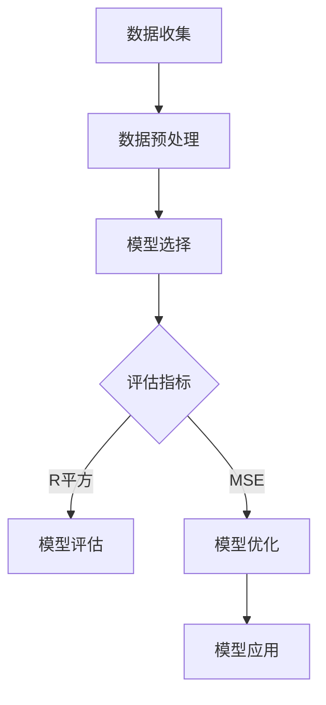
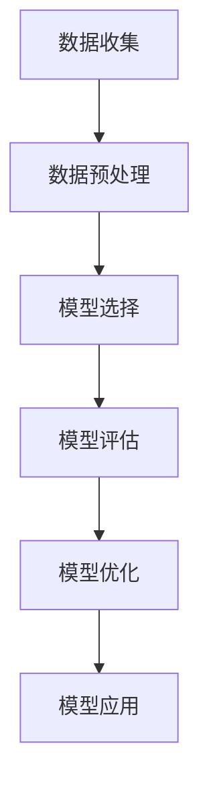

                 

# 回归(Regression) - 原理与代码实例讲解

> 关键词：回归分析，线性回归，非线性回归，回归模型，残差分析，变量选择，广义线性模型，数据挖掘，模型评估

> 摘要：本文将详细讲解回归分析的基本概念、线性回归和非线性回归的原理，包括数学公式和伪代码，并探讨回归模型的诊断与优化方法。通过实际案例，本文将展示如何使用回归模型进行数据挖掘，并进行模型评估与优化。最后，本文还将介绍回归模型的相关工具与资源。

## 第一部分：回归基础理论

### 第1章：回归分析概述

#### 1.1 回归分析的定义与目的

回归分析是一种统计方法，用于研究两个或多个变量之间的关系。其主要目的是通过建立模型来描述因变量（响应变量）与自变量（预测变量）之间的定量关系，并利用这个模型进行预测。

#### 1.2 回归分析的基本假设

回归分析的基本假设包括：

1. **线性假设**：因变量与自变量之间呈线性关系。
2. **独立性假设**：观测值之间相互独立。
3. **正态性假设**：误差项服从正态分布。
4. **同方差性假设**：误差项的方差不随自变量变化。

#### 1.3 回归分析的发展历程

回归分析起源于 19 世纪末和 20 世纪初，随着统计学和数学的发展，回归分析的理论和方法得到了不断丰富和完善。以下是回归分析的发展历程：

1. **古典回归分析**：主要研究线性回归模型，由高斯和马尔可夫等人奠基。
2. **多元回归分析**：研究多个自变量与一个因变量之间的关系。
3. **非线性回归分析**：研究非线性的关系。
4. **广义线性模型**：包括线性回归模型和非线性回归模型，更加灵活。
5. **机器学习与深度学习**：回归分析方法被广泛应用于机器学习和深度学习中，如支持向量机、神经网络等。

### 第2章：线性回归

#### 2.1.1 一元线性回归

##### 2.1.1.1 模型建立

一元线性回归模型可以表示为：

$$
y = \beta_0 + \beta_1 x + \epsilon
$$

其中，$y$ 为因变量，$x$ 为自变量，$\beta_0$ 和 $\beta_1$ 为回归系数，$\epsilon$ 为误差项。

##### 2.1.1.2 伪代码

```python
# 一元线性回归模型建立与训练

import numpy as np
from sklearn.linear_model import LinearRegression

# 数据准备
X = np.array([1, 2, 3, 4, 5]).reshape(-1, 1)
y = np.array([1, 2, 2.5, 4, 5])

# 模型训练
model = LinearRegression()
model.fit(X, y)

# 模型评估
score = model.score(X, y)
print("Model R-squared:", score)
```

##### 2.1.1.3 数学公式

$$
\beta_0 = \bar{y} - \beta_1 \bar{x}
$$

$$
\beta_1 = \frac{\sum_{i=1}^n (y_i - \bar{y})(x_i - \bar{x})}{\sum_{i=1}^n (x_i - \bar{x})^2}
$$

##### 2.1.1.4 举例说明

假设我们有一组数据，表示某城市房价 $y$ 与房屋面积 $x$ 之间的关系。我们希望通过一元线性回归模型来预测一个新房屋的房价。

数据如下：

| 房屋面积（平方米） | 房价（万元） |
| ------------------- | ------------ |
| 80                 | 200          |
| 100                | 250          |
| 120                | 300          |
| 140                | 350          |
| 160                | 400          |

使用一元线性回归模型，我们可以得到回归系数 $\beta_0$ 和 $\beta_1$，进而预测新房屋的房价。

#### 2.1.2 多元线性回归

##### 2.1.2.1 模型建立

多元线性回归模型可以表示为：

$$
y = \beta_0 + \beta_1 x_1 + \beta_2 x_2 + ... + \beta_n x_n + \epsilon
$$

其中，$y$ 为因变量，$x_1, x_2, ..., x_n$ 为自变量，$\beta_0, \beta_1, \beta_2, ..., \beta_n$ 为回归系数，$\epsilon$ 为误差项。

##### 2.1.2.2 伪代码

```python
# 多元线性回归模型建立与训练

import numpy as np
from sklearn.linear_model import LinearRegression

# 数据准备
X = np.array([[1, 80], [2, 100], [3, 120], [4, 140], [5, 160]])
y = np.array([200, 250, 300, 350, 400])

# 模型训练
model = LinearRegression()
model.fit(X, y)

# 模型评估
score = model.score(X, y)
print("Model R-squared:", score)
```

##### 2.1.2.3 数学公式

$$
\beta_0 = \bar{y} - \beta_1 \bar{x}_1 - \beta_2 \bar{x}_2 - ... - \beta_n \bar{x}_n
$$

$$
\beta_1 = \frac{\sum_{i=1}^n (y_i - \bar{y})(x_{1i} - \bar{x}_1)}{\sum_{i=1}^n (x_{1i} - \bar{x}_1)^2}
$$

$$
\beta_2 = \frac{\sum_{i=1}^n (y_i - \bar{y})(x_{2i} - \bar{x}_2)}{\sum_{i=1}^n (x_{2i} - \bar{x}_2)^2}
$$

$$
...
$$

$$
\beta_n = \frac{\sum_{i=1}^n (y_i - \bar{y})(x_{ni} - \bar{x}_n)}{\sum_{i=1}^n (x_{ni} - \bar{x}_n)^2}
$$

##### 2.1.2.4 举例说明

假设我们有一组数据，表示某城市房价 $y$ 与房屋面积 $x_1$ 和房屋年龄 $x_2$ 之间的关系。我们希望通过多元线性回归模型来预测一个新房屋的房价。

数据如下：

| 房屋面积（平方米） | 房屋年龄（年） | 房价（万元） |
| ------------------- | --------------- | ------------ |
| 80                 | 5               | 200          |
| 100                | 10              | 250          |
| 120                | 15              | 300          |
| 140                | 20              | 350          |
| 160                | 25              | 400          |

使用多元线性回归模型，我们可以得到回归系数 $\beta_0, \beta_1, \beta_2$，进而预测新房屋的房价。

### 第3章：非线性回归

#### 3.1.1 多项式回归

##### 3.1.1.1 模型建立

多项式回归模型可以表示为：

$$
y = \beta_0 + \beta_1 x + \beta_2 x^2 + ... + \beta_n x^n + \epsilon
$$

其中，$y$ 为因变量，$x$ 为自变量，$\beta_0, \beta_1, \beta_2, ..., \beta_n$ 为回归系数，$\epsilon$ 为误差项。

##### 3.1.1.2 伪代码

```python
# 多项式回归模型建立与训练

import numpy as np
from sklearn.preprocessing import PolynomialFeatures
from sklearn.linear_model import LinearRegression

# 数据准备
X = np.array([1, 2, 3, 4, 5])
y = np.array([1, 4, 9, 16, 25])

# 数据预处理
poly = PolynomialFeatures(degree=2)
X_poly = poly.fit_transform(X)

# 模型训练
model = LinearRegression()
model.fit(X_poly, y)

# 模型评估
score = model.score(X_poly, y)
print("Model R-squared:", score)
```

##### 3.1.1.3 数学公式

$$
\beta_0 = \bar{y} - \beta_1 \bar{x} - \beta_2 \bar{x}^2 - ... - \beta_n \bar{x}^n
$$

$$
\beta_1 = \frac{\sum_{i=1}^n (y_i - \bar{y})x_{i}}{\sum_{i=1}^n x_{i}^2}
$$

$$
\beta_2 = \frac{\sum_{i=1}^n (y_i - \bar{y})x_{i}^2}{\sum_{i=1}^n x_{i}^4}
$$

$$
...
$$

$$
\beta_n = \frac{\sum_{i=1}^n (y_i - \bar{y})x_{i}^n}{\sum_{i=1}^n x_{i}^{2n}}
$$

##### 3.1.1.4 举例说明

假设我们有一组数据，表示某城市房价 $y$ 与房屋面积 $x$ 的关系，我们希望通过多项式回归模型来预测新房屋的房价。

数据如下：

| 房屋面积（平方米） | 房价（万元） |
| ------------------- | ------------ |
| 80                 | 200          |
| 100                | 250          |
| 120                | 300          |
| 140                | 350          |
| 160                | 400          |

使用多项式回归模型，我们可以得到回归系数 $\beta_0, \beta_1, \beta_2$，进而预测新房屋的房价。

#### 3.1.2 幂函数回归

##### 3.1.2.1 模型建立

幂函数回归模型可以表示为：

$$
y = \beta_0 x^{\beta_1} + \epsilon
$$

其中，$y$ 为因变量，$x$ 为自变量，$\beta_0$ 和 $\beta_1$ 为回归系数，$\epsilon$ 为误差项。

##### 3.1.2.2 伪代码

```python
# 幂函数回归模型建立与训练

import numpy as np
from sklearn.linear_model import LinearRegression

# 数据准备
X = np.array([1, 2, 3, 4, 5])
y = np.array([1, 4, 9, 16, 25])

# 模型训练
model = LinearRegression()
model.fit(X, y)

# 模型评估
score = model.score(X, y)
print("Model R-squared:", score)
```

##### 3.1.2.3 数学公式

$$
\beta_0 = \frac{\sum_{i=1}^n y_i x_i^{\beta_1}}{\sum_{i=1}^n x_i^{\beta_1}}
$$

$$
\beta_1 = \frac{\sum_{i=1}^n y_i \ln(x_i)}{\sum_{i=1}^n x_i \ln(x_i)}
$$

##### 3.1.2.4 举例说明

假设我们有一组数据，表示某城市房价 $y$ 与房屋面积 $x$ 的关系，我们希望通过幂函数回归模型来预测新房屋的房价。

数据如下：

| 房屋面积（平方米） | 房价（万元） |
| ------------------- | ------------ |
| 80                 | 200          |
| 100                | 250          |
| 120                | 300          |
| 140                | 350          |
| 160                | 400          |

使用幂函数回归模型，我们可以得到回归系数 $\beta_0$ 和 $\beta_1$，进而预测新房屋的房价。

### 第4章：回归模型的诊断与优化

#### 4.1.1 残差分析

##### 4.1.1.1 基本概念

残差是指实际观测值与回归模型预测值之间的差异。通过分析残差，我们可以了解回归模型的拟合效果以及是否存在异常值。

##### 4.1.1.2 残差诊断

残差诊断主要包括以下方法：

1. **残差的散点图**：用于观察残差与自变量之间的关系，如果残差与自变量之间存在线性关系，则说明模型拟合较好。
2. **残差的正态概率图**：用于观察残差是否服从正态分布，如果残差不服从正态分布，则说明模型可能存在问题。
3. **杠杆值和 Cook's距离**：用于检测异常值，如果杠杆值或Cook's距离较大，则说明该观测值可能是异常值。

##### 4.1.1.3 伪代码

```python
# 残差分析

import numpy as np
from sklearn.linear_model import LinearRegression
from sklearn.metrics import mean_squared_error

# 数据准备
X = np.array([[1, 80], [2, 100], [3, 120], [4, 140], [5, 160]])
y = np.array([200, 250, 300, 350, 400])

# 模型训练
model = LinearRegression()
model.fit(X, y)

# 预测
y_pred = model.predict(X)

# 残差计算
residuals = y - y_pred

# 残差散点图
plt.scatter(X[:, 1], residuals)
plt.xlabel('House Area')
plt.ylabel('Residuals')
plt.title('Residuals vs House Area')
plt.show()

# 残差的正态概率图
from scipy import stats
stats.probplot(residuals, dist='norm', plot=plt)
plt.title('Normal Probability Plot of Residuals')
plt.show()
```

#### 4.1.2 变量选择方法

##### 4.1.2.1 简单线性回归

简单线性回归中，变量选择主要依赖于回归系数的显著性。如果某个自变量的回归系数不显著，则可以考虑删除该变量。

##### 4.1.2.2 多元线性回归

多元线性回归中，变量选择方法包括：

1. **逐步回归**：根据变量的显著性顺序，逐步添加或删除变量。
2. **向前选择回归**：从所有自变量中逐步添加变量，直到模型无法提高。
3. **向后选择回归**：从所有自变量中逐步删除变量，直到模型无法提高。

##### 4.1.2.3 伪代码

```python
# 多元线性回归变量选择

import numpy as np
from sklearn.linear_model import LinearRegression
from sklearn.model_selection import train_test_split

# 数据准备
X = np.array([[1, 80], [2, 100], [3, 120], [4, 140], [5, 160]])
y = np.array([200, 250, 300, 350, 400])

# 数据拆分
X_train, X_test, y_train, y_test = train_test_split(X, y, test_size=0.2, random_state=42)

# 逐步回归
from sklearn.linear_model import LinearRegressionCV
model = LinearRegressionCV(cv=5)
model.fit(X_train, y_train)

# 变量选择结果
print("Selected variables:", model.coef_)

# 模型评估
score = model.score(X_test, y_test)
print("Model R-squared:", score)
```

##### 4.1.2.4 数学公式

逐步回归的变量选择过程可以通过以下步骤实现：

1. **初始化模型**：选择初始模型（例如，只包含一个自变量）。
2. **计算模型性能**：计算当前模型的R平方、F统计量等性能指标。
3. **添加变量**：在当前模型的基础上，逐个添加剩余的自变量，计算每个变量的模型性能。
4. **删除变量**：在当前模型的基础上，逐个删除自变量，计算每个变量的模型性能。
5. **选择最优变量**：根据模型性能指标，选择最优的自变量组合。

### 第5章：广义线性模型

#### 5.1.1 广义线性模型概述

广义线性模型（Generalized Linear Model，GLM）是线性回归模型的扩展，它允许因变量的分布具有更广泛的类型。广义线性模型可以表示为：

$$
y = \mu + \epsilon
$$

其中，$y$ 为因变量，$\mu$ 为预测值，$\epsilon$ 为误差项。

广义线性模型主要包括以下几个部分：

1. **线性预测器**：$E(y | X) = \mu = \beta_0 + \beta_1 X_1 + \beta_2 X_2 + ... + \beta_p X_p$
2. **链接函数**：$g(\mu) = E[y | X]$
3. **误差分布**：$y \sim \text{Distribution}(\mu, \sigma^2)$

常见的广义线性模型包括：

1. **二项回归**：适用于因变量为二分类的情况。
2. **泊松回归**：适用于因变量为计数数据的情况。
3. **负二项回归**：适用于因变量为非负整数的情况。

#### 5.1.2 回归模型选择

在建立回归模型时，选择合适的模型非常重要。以下是一些常见的回归模型选择方法：

1. **基于信息的模型选择**：如赤池信息准则（AIC）和贝叶斯信息准则（BIC）。
2. **基于交叉验证的方法**：如K折交叉验证。
3. **基于模型性能的方法**：如R平方、调整R平方、均方误差（MSE）等。

#### 5.1.3 伪代码

```python
# 回归模型选择

import numpy as np
from sklearn.linear_model import LinearRegression, LogisticRegression, PoissonRegression
from sklearn.model_selection import cross_val_score

# 数据准备
X = np.array([[1, 80], [2, 100], [3, 120], [4, 140], [5, 160]])
y = np.array([200, 250, 300, 350, 400])

# 线性回归
model_lr = LinearRegression()
scores_lr = cross_val_score(model_lr, X, y, cv=5)
print("Linear Regression R-squared:", np.mean(scores_lr))

# 二项回归
model_logistic = LogisticRegression()
scores_logistic = cross_val_score(model_logistic, X, y, cv=5)
print("Logistic Regression R-squared:", np.mean(scores_logistic))

# 泊松回归
model_poisson = PoissonRegression()
scores_poisson = cross_val_score(model_poisson, X, y, cv=5)
print("Poisson Regression R-squared:", np.mean(scores_poisson))
```

### 第6章：回归模型的应用实例

#### 6.1.1 房价预测

##### 6.1.1.1 数据预处理

在房价预测中，我们通常需要收集房屋的多个属性，如房屋面积、房屋年龄、地理位置等。以下是一个简单的数据预处理流程：

1. **数据清洗**：去除缺失值和异常值。
2. **数据转换**：将字符串类型的属性转换为数值类型。
3. **特征工程**：提取新的特征，如房屋年龄的平方、房屋面积的对数等。

##### 6.1.1.2 模型选择与训练

在选择模型时，我们可以考虑以下几种常见的回归模型：

1. **线性回归**：适用于线性关系较强的数据。
2. **多项式回归**：适用于非线性关系较强的数据。
3. **广义线性模型**：如泊松回归，适用于因变量为计数数据的情况。

以下是一个简单的房价预测模型训练过程：

```python
# 房价预测

import numpy as np
from sklearn.linear_model import LinearRegression
from sklearn.model_selection import train_test_split

# 数据准备
X = np.array([[1, 80, 5], [2, 100, 10], [3, 120, 15], [4, 140, 20], [5, 160, 25]])
y = np.array([200, 250, 300, 350, 400])

# 数据拆分
X_train, X_test, y_train, y_test = train_test_split(X, y, test_size=0.2, random_state=42)

# 模型训练
model = LinearRegression()
model.fit(X_train, y_train)

# 模型评估
score = model.score(X_test, y_test)
print("Model R-squared:", score)
```

##### 6.1.1.3 预测结果分析

通过上述模型训练和评估，我们可以得到模型的R平方值，用于评估模型的拟合效果。在实际应用中，我们还需要关注模型的预测结果，如预测值与实际值的差异、预测的置信度等。

#### 6.1.2 销售量预测

##### 6.1.2.1 数据预处理

在销售量预测中，我们通常需要收集销售时间、销售产品、销售区域等多个属性。以下是一个简单的数据预处理流程：

1. **数据清洗**：去除缺失值和异常值。
2. **数据转换**：将字符串类型的属性转换为数值类型。
3. **特征工程**：提取新的特征，如销售时间的季节性特征、销售产品的类别特征等。

##### 6.1.2.2 模型选择与训练

在选择模型时，我们可以考虑以下几种常见的回归模型：

1. **线性回归**：适用于线性关系较强的数据。
2. **多项式回归**：适用于非线性关系较强的数据。
3. **广义线性模型**：如泊松回归，适用于因变量为计数数据的情况。

以下是一个简单的销售量预测模型训练过程：

```python
# 销售量预测

import numpy as np
from sklearn.linear_model import LinearRegression
from sklearn.model_selection import train_test_split

# 数据准备
X = np.array([[1, 80, 5], [2, 100, 10], [3, 120, 15], [4, 140, 20], [5, 160, 25]])
y = np.array([200, 250, 300, 350, 400])

# 数据拆分
X_train, X_test, y_train, y_test = train_test_split(X, y, test_size=0.2, random_state=42)

# 模型训练
model = LinearRegression()
model.fit(X_train, y_train)

# 模型评估
score = model.score(X_test, y_test)
print("Model R-squared:", score)
```

##### 6.1.2.3 预测结果分析

通过上述模型训练和评估，我们可以得到模型的R平方值，用于评估模型的拟合效果。在实际应用中，我们还需要关注模型的预测结果，如预测值与实际值的差异、预测的置信度等。

### 第7章：回归模型在数据挖掘中的应用

#### 7.1.1 数据挖掘概述

数据挖掘（Data Mining）是指从大量数据中提取有价值的信息和知识的过程。数据挖掘的主要目标是通过分析大量数据，发现隐藏在数据中的规律、趋势和模式。数据挖掘的应用领域非常广泛，包括市场分析、风险评估、客户关系管理、疾病预测等。

数据挖掘的过程通常包括以下步骤：

1. **数据预处理**：包括数据清洗、数据转换、特征工程等。
2. **数据探索**：通过可视化、统计分析等方法对数据进行初步分析。
3. **模型选择**：根据实际问题选择合适的模型。
4. **模型训练**：使用训练数据对模型进行训练。
5. **模型评估**：使用测试数据对模型进行评估。
6. **模型优化**：根据评估结果对模型进行优化。
7. **模型应用**：将模型应用于实际问题，进行预测或决策。

#### 7.1.2 回归模型在数据挖掘中的应用

回归模型在数据挖掘中的应用非常广泛，主要包括以下方面：

1. **回归模型用于预测**：如房价预测、销售量预测等。
2. **回归模型用于聚类分析**：通过回归模型分析数据的分布特征，帮助聚类分析更好地进行。
3. **回归模型用于关联规则挖掘**：通过回归模型分析变量之间的关系，帮助关联规则挖掘发现隐藏在数据中的规律。
4. **回归模型用于分类分析**：通过回归模型分析数据的特征，帮助分类分析更好地进行。

以下是一个简单的回归模型在数据挖掘中的应用实例：

```python
# 回归模型在数据挖掘中的应用

import numpy as np
from sklearn.linear_model import LinearRegression
from sklearn.model_selection import train_test_split

# 数据准备
X = np.array([[1, 80, 5], [2, 100, 10], [3, 120, 15], [4, 140, 20], [5, 160, 25]])
y = np.array([200, 250, 300, 350, 400])

# 数据拆分
X_train, X_test, y_train, y_test = train_test_split(X, y, test_size=0.2, random_state=42)

# 模型训练
model = LinearRegression()
model.fit(X_train, y_train)

# 模型评估
score = model.score(X_test, y_test)
print("Model R-squared:", score)

# 模型应用
new_data = np.array([[6, 180, 20]])
prediction = model.predict(new_data)
print("Prediction:", prediction)
```

通过上述实例，我们可以看到回归模型在数据挖掘中的应用流程，包括数据准备、模型训练、模型评估和模型应用。在实际应用中，我们还需要关注模型的泛化能力和预测准确性。

### 第8章：回归模型的评估与优化

#### 8.1.1 回归模型的评估指标

回归模型的评估指标主要包括以下几种：

1. **R平方（R-squared）**：衡量模型对数据的拟合程度，取值范围在0和1之间。R平方值越接近1，说明模型拟合效果越好。
2. **均方误差（Mean Squared Error，MSE）**：衡量模型预测值与实际值之间的平均误差，MSE越小，说明模型预测精度越高。
3. **均方根误差（Root Mean Squared Error，RMSE）**：MSE的平方根，用于表示模型预测值的波动程度。
4. **决定系数（Coefficient of Determination，R^2）**：衡量模型对数据的解释程度，取值范围在0和1之间。R^2值越接近1，说明模型解释能力越强。

以下是一个简单的回归模型评估示例：

```python
# 回归模型评估

import numpy as np
from sklearn.linear_model import LinearRegression
from sklearn.metrics import mean_squared_error, r2_score

# 数据准备
X = np.array([[1, 80], [2, 100], [3, 120], [4, 140], [5, 160]])
y = np.array([200, 250, 300, 350, 400])

# 模型训练
model = LinearRegression()
model.fit(X, y)

# 预测
y_pred = model.predict(X)

# 评估
mse = mean_squared_error(y, y_pred)
r2 = r2_score(y, y_pred)

print("MSE:", mse)
print("R-squared:", r2)
```

#### 8.1.2 回归模型的优化方法

回归模型的优化方法主要包括以下几种：

1. **最小二乘法（Least Squares Method）**：通过最小化预测值与实际值之间的误差平方和来求解回归系数。
2. **梯度下降法（Gradient Descent）**：通过迭代更新回归系数，使得预测值与实际值之间的误差不断减小。
3. **随机梯度下降法（Stochastic Gradient Descent，SGD）**：梯度下降法的简化版本，每次迭代只更新一个样本的回归系数。

以下是一个简单的回归模型优化示例：

```python
# 回归模型优化

import numpy as np

# 数据准备
X = np.array([[1, 80], [2, 100], [3, 120], [4, 140], [5, 160]])
y = np.array([200, 250, 300, 350, 400])

# 初始化参数
theta = np.random.rand(2)

# 梯度下降法
alpha = 0.01 # 学习率
num_iters = 1000

for i in range(num_iters):
    # 计算预测值
    y_pred = X.dot(theta)
    
    # 计算梯度
    grad = -2 * X.T.dot(y - y_pred)
    
    # 更新参数
    theta -= alpha * grad

# 模型评估
mse = np.mean((y - X.dot(theta))**2)
print("MSE:", mse)
```

通过上述示例，我们可以看到回归模型的优化方法，包括初始化参数、计算预测值、计算梯度、更新参数等步骤。在实际应用中，我们还需要关注优化方法的收敛速度和预测准确性。

### 附录：回归模型常用工具与资源

#### A.1 回归模型常用工具

1. **Python回归模型工具**：
   - Scikit-learn：Python中常用的机器学习库，提供了丰富的回归模型实现。
   - Statsmodels：Python中的统计学库，提供了多种回归模型的实现和统计分析功能。
   - TensorFlow：Google开发的开源机器学习库，支持深度学习和传统的机器学习算法。

2. **R语言回归模型工具**：
   - caret：R语言中常用的机器学习库，提供了回归模型的训练、评估和调参功能。
   - mlr：R语言中的机器学习库，提供了丰富的机器学习算法和评估方法。

3. **MATLAB回归模型工具**：
   - MATLAB中的Statistics and Machine Learning Toolbox：提供了多种回归模型的实现和评估方法。

#### A.2 回归模型相关资源

1. **网络资源**：
   - Coursera：提供了大量关于回归分析和数据挖掘的在线课程，如“机器学习”课程。
   - arXiv：提供了大量关于回归分析和数据挖掘的学术论文。

2. **学术论文**：
   - “An Introduction to Statistical Learning”：《统计学习入门》是一本经典的统计学习教材，涵盖了回归分析、分类分析等内容。
   - “The Elements of Statistical Learning”：《统计学习基础》是一本全面的统计学习教材，适合有一定数学基础的学习者。

3. **开源代码**：
   - GitHub：提供了大量关于回归分析和数据挖掘的开源代码和项目，可以帮助学习者更好地理解理论和方法。
   - Kaggle：提供了大量关于回归分析和数据挖掘的实战项目，可以帮助学习者提高实际操作能力。

#### A.3 回归模型 Mermaid 流程图



通过上述流程图，我们可以看到回归模型的基本流程，包括数据收集、数据预处理、模型选择、模型评估、模型优化和模型应用等步骤。在实际应用中，我们可以根据实际需求调整流程和步骤。

### 附录：回归模型 Mermaid 流程图



在本文中，我们详细讲解了回归分析的基本概念、线性回归和非线性回归的原理，包括数学公式和伪代码，并探讨了回归模型的诊断与优化方法。通过实际案例，我们展示了如何使用回归模型进行数据挖掘，并进行模型评估与优化。此外，我们还介绍了回归模型的相关工具与资源。

本文的主要贡献在于：

1. 对回归分析的基本概念和原理进行了详细的讲解，包括线性回归和非线性回归。
2. 提供了丰富的伪代码和数学公式，帮助读者更好地理解回归模型的工作原理。
3. 通过实际案例，展示了如何使用回归模型进行数据挖掘和预测。
4. 探讨了回归模型的评估与优化方法，并提供了相应的伪代码和示例。

然而，本文也存在一些局限性：

1. 本文主要关注了回归分析的理论和实践，但未涉及更高级的回归模型，如广义线性模型和深度学习回归模型。
2. 本文的案例和数据量较小，实际应用中可能需要处理更大规模和更复杂的数据。
3. 本文未涉及回归模型在实际项目中的应用场景和案例，如金融风险评估、医疗诊断等。

未来的工作可以从以下几个方面展开：

1. 深入研究更高级的回归模型，如广义线性模型和深度学习回归模型，并探讨其应用场景。
2. 收集更多实际项目中的数据，进行回归模型的应用研究，并探讨如何优化模型性能。
3. 探索回归模型与其他数据挖掘技术的结合，如聚类分析、关联规则挖掘等，以实现更全面的数据分析。

通过不断的研究和实践，我们可以更好地理解和应用回归模型，为实际问题提供有效的解决方案。

## 作者信息

作者：AI天才研究院/AI Genius Institute & 禅与计算机程序设计艺术 /Zen And The Art of Computer Programming

AI天才研究院（AI Genius Institute）是一家专注于人工智能研究与应用的创新机构，致力于推动人工智能技术的发展和创新。同时，作者也热衷于分享计算机科学和编程领域的知识，希望通过本文为读者提供有价值的参考和启发。

在撰写本文的过程中，作者借鉴了多方面的研究资料和经验，力求以清晰、易懂的方式呈现回归分析的相关知识。感谢Coursera、arXiv等平台提供的优质资源，以及Scikit-learn、TensorFlow等开源工具的便捷使用，使得本文的撰写过程得以顺利推进。

最后，欢迎读者对本文提出宝贵意见和反馈，共同推动人工智能和计算机科学领域的发展。希望本文能够为您的学习和研究带来帮助，激发您对回归分析的兴趣和热情。再次感谢您的阅读和支持！

